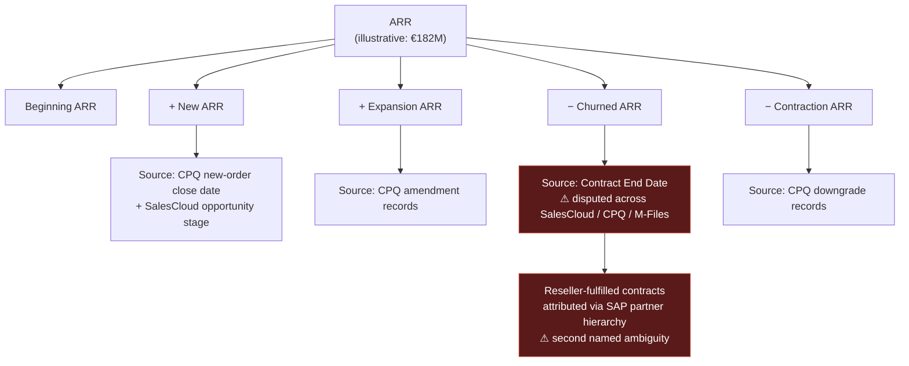
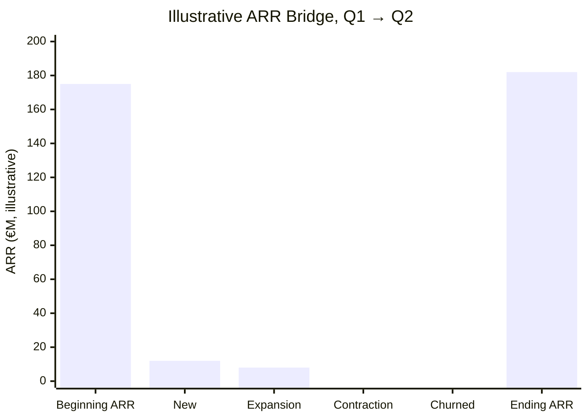
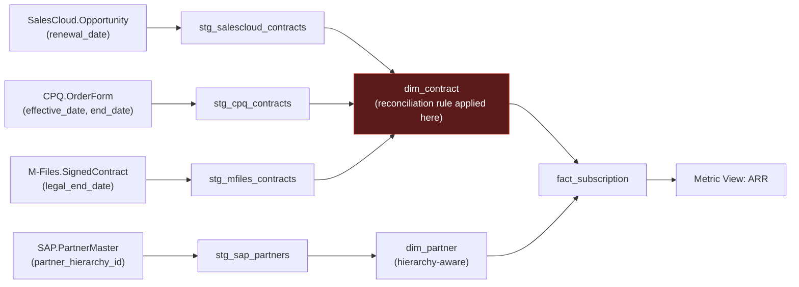
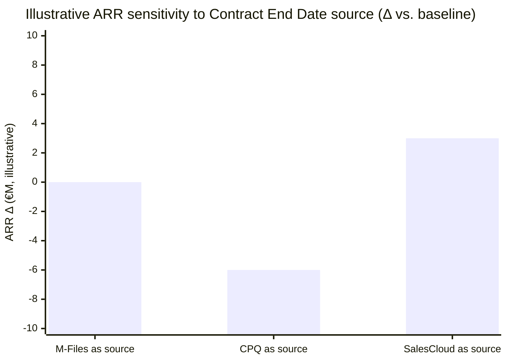

**INTERNAL / PERSONAL — WORKING REFERENCE, NOT FOR CLIENT DISTRIBUTION**

# Databricks Lakehouse Data Modeling — Playbook

Companion to the [Basware Business 101 + Glossary](<Basware_Business_101_Glossary.md>). That doc covers Basware's business domain; this one covers the Databricks technical toolkit you'll design the canonical Gold-layer model with — reading list, do/don't, and a grouped feature catalog, structured for lookup mid-workshop rather than read-once. Fitness of Unity Catalog metric views for complex KPIs is in the [Unity Catalog Metric Views architecture brief](<Metric_Views_Brief.md>).

## Contents

- [How to use this reference](#how-to-use-this-reference-during-the-basware-embed)
  - [Evidence and claim convention](#evidence-and-claim-convention)
- [1. Reading list](#1-reading-list-ranked-most--less-valuable)
- [2. Do / Don't](#2-do--dont--crystallized-from-the-sources-above)
- [2A. Pipelines best practices](#2a-pipelines-best-practices)
  - [Design and dataset choice](#design-and-dataset-choice)
  - [Quality, correctness, and recoverability](#quality-correctness-and-recoverability)
  - [Backfills](#backfills-and-historical-corrections)
  - [Cost, deployment, and observability](#cost-deployment-and-observability)
  - [Review checklist](#review-checklist-for-a-model-change)
  - [Sources and annotations](#sources-and-annotations)
- [3. Feature catalog](#3-databricks-feature-catalog-for-data-modeling--grouped-for-lookup)
  - [A. Table types](#a-table-types--what-to-store-data-in)
  - [B. Modeling instruments](#b-modeling-instruments-patterns-and-dedicated-components--how-to-shape-data)
  - [C. Consumer integrations](#c-consumer-integrations--how-data-leaves-the-gold-layer)
  - [D. Conventions and templates](#d-out-of-the-box-conventions--templates--dont-reinvent-these)
  - [E. Operations](#e-operations--performance-recovery-monitoring)
- [4. Data Quality & Reconciliation Toolkit](#4-data-quality--reconciliation-toolkit--dealing-with-messy-heterogeneous-sources)
  - [Method](#method-in-one-paragraph)
  - [Tool matrix](#expanded-tool-matrix-by-task)
  - [Instrumented workflow](#instrumented-workflow-unchanged-core-loop-now-with-the-gaps-filled)
- [5. Source-to-Target Mapping](#5-source-to-target-mapping--heavy-lifting-toolkit)
- [6. Visualizing metric calculus](#6-visualizing-metric-calculus--worked-examples)
  - [A. Metric tree](#a-metric-tree--driver-tree--shows-composition-and-which-source-system-feeds-which-branch)
  - [B. ARR waterfall](#b-arr-waterfall--bridge-chart--shows-movement-period-over-period)
  - [C. Metric lineage DAG](#c-metric-lineage-dag--shows-technical-derivation-source-column-to-gold-metric)
  - [D. Sensitivity / tornado](#d-sensitivity--tornado-chart--shows-which-choice-moves-the-number-most)
  - [E. Definition-version diff](#e-definition-version-diff--shows-how-the-calculation-itself-changed)
- [7. Entity resolution](#7-entity-resolution--splinkzingg-vs-enterprisemanaged-options)
  - [First classify the problem](#first-classify-the-problem--do-not-default-to-entity-resolution)
  - [Splink and Zingg](#splink-and-zingg--confirmed-and-the-only-realistically-actionable-probabilistic-options-right-now)
  - [Enterprise/managed options](#enterprisemanaged-options--verified-corrected-and-scoped-as-forward-looking-only)
- [8. Buy vs. build](#8-buy-vs-build--databricks-marketplace-and-adjacent-options-worth-evaluating)
  - [A. Ingestion / CDC](#a-ingestion--cdc-connectors--buy-vs-build-the-first-mile-pipeline)
  - [B. Semantic-layer alternatives](#b-semantic-layer-alternatives-to-unity-catalog-metric-views--buy-vs-build-the-metric-definition-layer)
  - [C. SaaS revenue platforms](#c-saas-revenuesubscription-metrics-platforms--buy-vs-build-the-arr-calculation-itself)
  - [D. SI partners](#d-servicessystems-integrator-partners--buying-expertise-not-software)
- [Appendix A — Pipeline service columns on Lakeflow targets](#appendix-a--pipeline-service-columns-on-lakeflow-targets)
  - [A.1 AUTO CDC](#a1-auto-cdc--columns-the-pipeline-writes)
  - [A.2 Auto Loader](#a2-auto-loader--file-ingest--bronze)
  - [A.3 Change Data Feed](#a3-change-data-feed--not-stored-on-the-target)
  - [A.4 Managed connectors](#a4-managed-connectors-lakeflow-connect)
- [Sources](#sources)

---

## How to use this reference during the Basware embed

This is intentionally broad. It is a decision-support reference, not the two-week delivery plan. Use the focused [Basware Embed — 2-Week Playbook](<Basware_Engagement_Playbook.md>) for workshop cadence, decision ownership, and deliverable production; use this document when the walkthrough raises a technical or modeling choice.

| If the walkthrough raises this question | Go to | Use it to decide |
|---|---|---|
| What should the selected KPI's grain, facts, dimensions, keys, or history look like? | [2A. Pipelines best practices](#2a-pipelines-best-practices) and [3B. Modeling instruments, patterns, and dedicated components](#b-modeling-instruments-patterns-and-dedicated-components--how-to-shape-data) | The appropriate model and Lakeflow dataset pattern. |
| Which source attribute is authoritative, or how should conflicting values be reconciled? | [4. Data Quality & Reconciliation Toolkit](#4-data-quality--reconciliation-toolkit--dealing-with-messy-heterogeneous-sources) | Evidence-gathering and deterministic reconciliation pattern. |
| Is the SAP partner issue a hierarchy, reconciliation, or identity-matching problem? | [7. Entity resolution — First classify the problem](#first-classify-the-problem--do-not-default-to-entity-resolution) | The least-complex valid resolution path. |
| Does the implementation need CDC, expectations, backfill, or a full-refresh plan? | [2A. Pipelines best practices](#2a-pipelines-best-practices) | A safe operational recommendation. |
| Which service columns does a Lakeflow target actually get (change timestamp, SCD2 validity, file metadata)? | [Appendix A — Pipeline service columns on Lakeflow targets](#appendix-a--pipeline-service-columns-on-lakeflow-targets) | What is implicit on the table vs explicit in the SELECT vs CDF read-path only. |
| How should the team explain model or KPI impact to stakeholders? | [6. Visualizing metric calculus](#6-visualizing-metric-calculus--worked-examples) | A decision-oriented visual artifact. |
| Should a future Discovery phase evaluate a tool, vendor, or alternative semantic layer? | [8. Buy vs. build](#8-buy-vs-build--databricks-marketplace-and-adjacent-options-worth-evaluating) | A forward-looking option, not a two-week embed commitment. |

### Evidence and claim convention

Use the following labels in notes, visuals, and client-facing derivatives. Do not convert a plausible pattern into a Basware fact without evidence.

| Label | Meaning |
|---|---|
| **Confirmed from Basware evidence** | Demonstrated in supplied logic, data, documentation, or by the accountable owner. |
| **Hypothesis to validate** | A plausible explanation or candidate rule that still needs evidence and a named decision owner. |
| **Illustrative pattern** | A generic example; not a statement about Basware's current implementation or data. |
| **Future Discovery option** | A potential capability/vendor assessment outside the two-week scope. |
| **Verify in Basware tenant** | A feature or product claim that depends on Azure region, entitlement, Unity Catalog/serverless configuration, runtime, or current procurement status. |

When citing external material, prefer Azure Databricks primary documentation. Keep blog, marketplace, partner, and vendor material as supporting context; record the cloud, source type, and checked date before it enters a client deliverable.

---

## 1. Reading list (ranked, most → less valuable)

Ranked for what you actually need: defending a canonical Gold-layer model, judging whether Metric Views can hold Basware's ARR/contract logic, and having citable material on hand without a BA to lean on.

1. **[Databricks Lakehouse Data Modeling: Myths, Truths, and Best Practices](https://www.databricks.com/blog/databricks-lakehouse-data-modeling-myths-truths-and-best-practices)** — primary source, written by Databricks' own product leads (Shannon Barrow, Kyle Hale). Kills the "lakehouses can't do real data modeling" objection: PK/FK constraints supported since DBR 11.3 (GA at DBR 15.2), star/snowflake schemas outperform legacy warehouses when tuned with clustering + Photon, and Metric Views (public preview at DAIS 2025) are positioned as the native semantic layer. Cite this if anyone at Basware pushes back on "can Databricks even do proper dimensional modeling."

2. **[Data Modeling Best Practices for Lakehouse](https://www.databricks.com/blog/data-modeling-best-practices-implementation-modern-lakehouse)** — the companion implementation piece to #1. Less myth-busting, more "how to actually build it": naming/grain conventions, when to normalize vs. denormalize per layer, how constraints interact with DLT/Lakeflow pipelines. Read right after #1.

3. **[Unity Catalog metric views — official docs](https://docs.databricks.com/aws/en/uc-semantics/metric-views/)** — not a blog, the actual spec for the tool your presale risk notes already flagged as unproven for Basware's complexity. Key detail: metrics are defined once in YAML/SQL and reused across SQL, Power BI, and AI tools — if it *can* hold Basware's ARR logic, that logic becomes reusable everywhere instead of re-implemented per report. Read before forming an opinion on the Metric Views risk, not after.

4. **[Data Vault Best Practice Implementation on Lakehouse](https://www.databricks.com/blog/data-vault-best-practice-implementation-lakehouse)** — the most *situationally* relevant piece despite being older (2023). Data Vault's hub/link/satellite pattern is purpose-built for exactly Basware's problem: multiple source systems that disagree (SalesCloud/CPQ/M-Files on contract end date) without forcing premature agreement on "the truth." Alternative or hybrid to a pure Kimball star schema if the definition ambiguity turns out to be structural, not a one-time cleanup.

5. **[Busting Data Modeling Myths: Truths and Best Practices — DAIS session](https://www.databricks.com/dataaisummit/session/busting-data-modeling-myths-truths-and-best-practices-data-modeling)** — same authors as #1, talk format. Nothing new over the blog, but a citable "Databricks said this at their own summit" reference for a client-facing slide, or a 30-minute skim if you prefer video.

6. **[Different Data Warehousing Modeling Techniques and Their Implementation on Databricks](https://www.databricks.com/blog/2022/06/24/data-warehousing-modeling-techniques-and-their-implementation-on-the-databricks-lakehouse-platform.html)** — the survey piece: Kimball, Inmon/CIF, Data Vault, one-big-table, each mapped onto medallion layers. Dated (2022, pre-Metric-Views) but still the clearest comparative framing available — useful for justifying why you chose star-schema-in-Gold over alternatives in the architecture blueprint.

7. **[Databricks Well-Architected Framework — data lakehouse](https://learn.microsoft.com/en-us/azure/databricks/lakehouse-architecture/well-architected)** — broader than modeling (7 pillars), but this is the rubric the N-iX pitch deck already committed to for the Well-Architected assessment. Skim "Data & AI Governance" and "Interoperability" specifically — that's where modeling-adjacent scoring criteria live.

8. **[Star Schema Data Modeling Best Practices on Databricks SQL](https://medium.com/dbsql-sme-engineering/star-schema-data-modeling-best-practices-on-databricks-sql-8fe4bd0f6902)** — practitioner-level (Databricks SQL SME team, on Medium but written by the right people). The genuinely new tactical detail: Liquid Clustering guidance specifically for star-schema fact/dimension tables, superseding older ZORDER advice — relevant when your Data Engineer colleague is deciding Gold-layer physical layout.

Lower priority, skip unless spare time allows: **[What Are Metrics in Unity Catalog — typedef.ai](https://www.typedef.ai/blog/what-are-metrics-in-unity-catalog-databricks-governed-metric-layer-explained)** (independent, mildly more skeptical second opinion on Metric Views — a 5-minute sanity check on #3) and **[7 Data Modeling Truths We Forgot While Building Fancy Lakehouses](https://medium.com/data-science-collective/7-data-modeling-truths-we-forgot-while-building-fancy-lakehouses-28a6bd3b2368)** (opinionated contrarian take, fine as a gut-check, not citable to a client).

---

## 2. Do / Don't — crystallized from the sources above

**Do**
- Declare PK/FK relationships in the Gold model — informational constraints have been supported since DBR 11.3, GA at DBR 15.2, and make the canonical model self-documenting. [[Myths, Truths, and Best Practices]](https://www.databricks.com/blog/databricks-lakehouse-data-modeling-myths-truths-and-best-practices)
- Tune star/snowflake schemas with **Liquid Clustering** (not ZORDER) + Photon before concluding dimensional modeling "doesn't perform" on Databricks. [[Myths, Truths, and Best Practices]](https://www.databricks.com/blog/databricks-lakehouse-data-modeling-myths-truths-and-best-practices) · [[Star Schema Best Practices on Databricks SQL]](https://medium.com/dbsql-sme-engineering/star-schema-data-modeling-best-practices-on-databricks-sql-8fe4bd0f6902)
- Define each metric (grain, joins, time semantics) **once** in Metric Views so ARR/gross-margin logic is computed identically in SQL, BI, and AI tools — not re-implemented per report. [[Unity Catalog metric views docs]](https://docs.databricks.com/aws/en/uc-semantics/metric-views/)
- Reach for **Data Vault (hubs/links/satellites)** when several source systems legitimately disagree — it's designed to stay stable without forcing premature agreement on "the truth," which is exactly the Contract End Date situation. [[Data Vault Best Practice Implementation on Lakehouse]](https://www.databricks.com/blog/data-vault-best-practice-implementation-lakehouse)
- Mix modeling techniques by layer deliberately (e.g., Vault-like or normalized in Silver, dimensional/star in Gold) — hybrid is the documented norm, not a compromise. [[Different Data Warehousing Modeling Techniques on Databricks]](https://www.databricks.com/blog/2022/06/24/data-warehousing-modeling-techniques-and-their-implementation-on-the-databricks-lakehouse-platform.html)
- Score governance/interoperability against the existing 7-pillar Well-Architected rubric instead of inventing new criteria — it's already the framework N-iX committed to with Basware. [[Databricks Well-Architected Framework]](https://learn.microsoft.com/en-us/azure/databricks/lakehouse-architecture/well-architected)

**Don't**
- Don't assume "lakehouse" means no real constraints or modeling discipline — that objection is a dated myth, not current fact. [[Myths, Truths, and Best Practices]](https://www.databricks.com/blog/databricks-lakehouse-data-modeling-myths-truths-and-best-practices)
- Don't treat Metric Views as already proven for contested, complex business logic like Basware's ARR — it's still young (public preview lineage from DAIS 2025); evaluate it against the real logic before betting the KPI on it. [[Unity Catalog metric views docs]](https://docs.databricks.com/aws/en/uc-semantics/metric-views/) · [[What Are Metrics in Unity Catalog — typedef.ai]](https://www.typedef.ai/blog/what-are-metrics-in-unity-catalog-databricks-governed-metric-layer-explained)
- Don't force one system to be declared "the" source of truth for Contract End Date before understanding *why* the three disagree — premature reconciliation is the failure mode Data Vault exists to avoid. [[Data Vault Best Practice Implementation on Lakehouse]](https://www.databricks.com/blog/data-vault-best-practice-implementation-lakehouse)
- Don't default to older ZORDER guidance for new Gold fact/dimension tables — Liquid Clustering is now the recommended path and supersedes it. [[Star Schema Best Practices on Databricks SQL]](https://medium.com/dbsql-sme-engineering/star-schema-data-modeling-best-practices-on-databricks-sql-8fe4bd0f6902)
- Don't lean on the 2022 technique-comparison survey as current guidance on its own — it predates Metric Views and should be read alongside #1–#3, not instead of them. [[Different Data Warehousing Modeling Techniques on Databricks]](https://www.databricks.com/blog/2022/06/24/data-warehousing-modeling-techniques-and-their-implementation-on-the-databricks-lakehouse-platform.html)

---

## 2A. Pipelines best practices

This section turns the modeling guidance above into operational rules for Lakeflow pipelines. The default shape is deliberately boring: land immutable or minimally transformed data in Bronze; apply validation, deduplication, CDC, and conformance in Silver; and publish analyst-ready dimensions, facts, and aggregates in Gold. Keep ingestion separate from downstream transformation where cadence, ownership, or failure domains differ.

### Design and dataset choice

- **Choose the dataset type by processing need, not by layer name.** Use streaming tables for append-oriented ingestion and incremental row transformations; materialized views for analytical joins, aggregations, and precomputed serving datasets; and temporary views for pipeline-only intermediate logic. In Gold, use materialized views for most dimensions and aggregates; use streaming tables for incrementally maintained facts or SCD Type 2 history.
- **Make the target grain and key explicit before authoring the flow.** Facts represent events or measurements; dimensions represent business entities. Prefer a stable source natural key; introduce a surrogate key only where source identifiers are reused or mutable. Keep fact tables keyed to dimensions rather than copying descriptive attributes into every fact.
- **Use declarative CDC, not hand-written `MERGE`, for ordered change feeds.** `AUTO CDC ... INTO` / `create_auto_cdc_flow()` addresses ordering, deduplication, out-of-order changes, schema evolution, and SCD Type 1 or Type 2 behavior. Define the business key and reliable sequencing column deliberately; this is not a substitute for resolving ambiguous source semantics. For the columns the target actually receives (`__START_AT` / `__END_AT`, rescued data, CDF read-path fields), see [Appendix A — Pipeline service columns on Lakeflow targets](#appendix-a--pipeline-service-columns-on-lakeflow-targets).
- **Treat declarative flow APIs as the orchestration boundary.** A normal dataset definition creates a flow automatically. Add explicit flows only for genuine multi-source or specialized patterns, such as appending independent sources to one streaming target. Avoid writing directly to a dataset that the pipeline also manages.

### Quality, correctness, and recoverability

- **Put expectations on every dataset that can receive bad data.** Choose the violation policy by business impact: `warn` only when the trend is actively monitored, `drop` only for rows that can safely be discarded, and `fail` for broken invariants such as a required business key. Preserve rejected rows in a quarantine stream when they need investigation or replay.
- **Keep managed paths Delta-to-Delta where practical.** Pipeline-managed streaming tables and materialized views provide idempotency and exactly-once effects inside managed Delta tables. At non-Delta or custom edges—`foreach_batch`, external sinks, Kafka sinks, or unverified custom sources—assume at-least-once behavior and implement idempotent writes or downstream deduplication.
- **Use watermarks intentionally for stateful streaming.** A watermark bounds state for aggregations, deduplication, and stream-stream joins, but trades off late-data acceptance against state cost. Stream-stream joins require watermarks on both inputs and a time-bounded join condition; otherwise state can grow without bound.
- **Treat full refresh as a controlled recovery/change procedure.** A full refresh rebuilds streaming state and reprocesses available history. Before performing one, confirm that the source retains the required history, estimate the cost/window, and preserve a Bronze replay path. Changes to stateful logic—such as watermark or aggregation keys—can require a full refresh; a short-retention source can otherwise yield a silently incomplete table.

### Backfills and historical corrections

- **Backfill through dedicated, idempotent flows rather than mixing history into the live flow.** Keep the normal incremental flow running, use a separate flow for a bounded historical range, and make the two ranges non-overlapping. Include the effective-date range in the backfill definition and validate its reconciliation result before treating it as complete.
- **Plan snapshot versus CDC semantics before a backfill.** For snapshot sources, identify the authoritative snapshot and sequence semantics. For CDC sources, use the change sequence to avoid overwriting newer changes with older history. Backfill is a business-data correction, not simply a compute rerun.

### Cost, deployment, and observability

- **Use triggered mode by default.** Schedule triggered pipelines for the required freshness; use continuous mode only where seconds-to-minutes latency is genuinely needed, because it keeps compute running. Avoid overly frequent low-volume triggers that create small files.
- **Use liquid clustering and simple deterministic transformations.** Prefer automatic liquid clustering for new managed tables; avoid prematurely hard-coding partitioning or `ZORDER`. Keep materialized-view logic deterministic and incrementally maintainable so refreshes do not fall back to expensive full recomputation.
- **Parameterize and promote one codebase.** Keep source code and bundle configuration in version control. Use declarative bundle targets (at least dev and prod; preferably dev, staging, prod) plus configuration parameters for catalog names, source locations, schedules, and notifications—never environment constants embedded in SQL or Python.
- **Operate from evidence, not the UI alone.** Query the pipeline event log for flow progress, expectation metrics, errors, and lineage; track update duration and cost trends; configure failure notifications; and review the relevant system tables. A pipeline is production-ready only when data quality, reliability, observability, deployment, cost, and governance checks are all explicit.

### Review checklist for a model change

Before promoting a model or pipeline change, confirm: (1) grain, keys, and SCD behavior are documented; (2) expectations and quarantine behavior match the business risk; (3) a backfill/full-refresh decision and replay source are recorded; (4) the change is deployed through a non-production target first; (5) event-log metrics and failure notification are in place; and (6) Gold consumers have an explicit compatibility and rollback plan.

### Sources and annotations

| Source | What it contributes |
|---|---|
| [Best practices for Lakeflow pipelines](https://learn.microsoft.com/en-us/azure/databricks/ldp/best-practices/) | Core official guidance for dataset selection, CDC, expectations, parameters, trigger modes, liquid clustering, CI/CD, streaming, performance, monitoring, and medallion organization. |
| [Dimensional modeling in Lakeflow pipelines](https://learn.microsoft.com/en-us/azure/databricks/ldp/best-practices/dimensional-modeling) | Official mapping of fact/dimension star schemas onto Lakeflow dataset types, including SCD Type 2 dimensions and incrementally fed facts. |
| [Streaming tables](https://learn.microsoft.com/en-us/azure/databricks/ldp/concepts/streaming-tables) | Streaming-table behavior, incremental semantics, and appropriate ingestion use cases. |
| [Flows](https://learn.microsoft.com/en-us/azure/databricks/ldp/concepts/flows) | Conceptual model for flows, automatic flow creation, and when explicit flows are warranted. |
| [Backfilling historical data with pipelines](https://learn.microsoft.com/en-us/azure/databricks/ldp/flows-backfill) | Official patterns for bounded historical backfills while preserving normal incremental processing. |
| [Use flows in Lakeflow pipelines](https://learn.microsoft.com/en-us/azure/databricks/ldp/flow-examples) | Concrete multi-flow patterns, including ingestion, append, and historical-processing examples. |
| [Full refresh for streaming tables](https://learn.microsoft.com/en-us/azure/databricks/ldp/full-refresh-st) | Full-refresh consequences, checkpoint/state rebuilding, and source-retention risks. |
| [Processing guarantees in Lakeflow pipelines](https://learn.microsoft.com/en-us/azure/databricks/ldp/best-practices/processing-guarantees) | Exact boundary of default idempotency/exactly-once behavior and safeguards for external or custom pipeline edges. |
| [Production readiness for Lakeflow pipelines](https://learn.microsoft.com/en-us/azure/databricks/ldp/best-practices/production-readiness) | Production checklist for expectations, event-log observability, bundles, environment isolation, notifications, cost, and governance. |
| [How to use Lakeflow pipelines](https://learn.microsoft.com/en-us/azure/databricks/ldp/concepts/how-to-use-pipelines) | Lifecycle overview connecting design, operation, pipeline boundaries, scheduling, and scale decisions. |

---

## 3. Databricks feature catalog for data modeling — grouped for lookup

Five groups, each a quick-reference table. Use this mid-workshop when someone says a term you need to place instantly.

### A. Table types — what to store data *in*

| Type | What it is | When to reach for it |
|---|---|---|
| **Managed table** | Unity Catalog owns storage location, lifecycle, and optimization (default, recommended). | Default choice for Bronze/Silver/Gold unless you have a specific reason not to. |
| **External (unmanaged) table** | References data in cloud storage you control; UC governs access only, not lifecycle/optimization. | Existing data outside Databricks' control, or a hard requirement to keep storage location fixed. |
| **View** | Virtual, computed on read, no storage. | Row/column-level abstraction over a physical table, reusable logic without duplication. |
| **Streaming table** | Lakeflow-pipeline-backed, incremental processing (streaming semantics). | Bronze/Silver ingestion from CDC or event sources — the actual "keep it flowing" layer. |
| **Materialized view** | Lakeflow-pipeline-backed, stores a query result set, auto-refreshed (batch semantics). | Gold-layer aggregates/KPIs you want pre-computed and fast to query, without hand-rolled refresh jobs. |
| **Delta table (the substrate under all of the above)** | Open Parquet + transaction log, ACID, time travel. | Everything — it's the storage format underneath managed/external/streaming tables alike. |
| **Iceberg table (via UniForm)** | Delta table exposed with Iceberg-compatible metadata for external Iceberg readers. | Cross-platform interoperability requirement outside the Databricks/Delta ecosystem. |
| **Lakebase table (OLTP)** | Serverless Postgres-compatible operational store, separate from the analytical Delta estate. | Operational/low-latency read-write use cases (apps, agents) that shouldn't hit the analytical Gold layer directly. |

### B. Modeling instruments, patterns, and dedicated components — how to *shape* data

| Instrument | What it does | Fit for Basware |
|---|---|---|
| **Identity / auto-increment columns** (`GENERATED ALWAYS AS IDENTITY`) | Auto-generated surrogate keys. | Standard surrogate-key pattern for conformed dimensions (`Customer`, `Partner`, `Contract`) instead of relying on natural keys from any one source system. |
| **PK/FK constraints (informational)** | Declared, not always enforced, relationships between tables. | Self-documents the canonical model — makes "how does Contract relate to Customer" answerable by reading the schema, not by asking someone. |
| **SCD Type 2** (via `APPLY CHANGES INTO` / `create_auto_cdc_flow` in Lakeflow) | Preserves full change history per record with effective-dated rows. | Directly relevant: if Contract End Date changes over time across systems, SCD2 on the `Contract` dimension gives you an auditable history instead of one overwritten value. |
| **Change Data Feed (CDF)** | Row-level change tracking (insert/update/delete) on a Delta table. | Feeds SCD2 processing and lets Silver→Gold propagate deletes/updates correctly instead of silently going stale. |
| **Deletion vectors** | Marks rows deleted via metadata instead of rewriting files immediately. | Performance/safety net under CDF-driven deletes — not something you design around, just know it's there. |
| **Metric Views** | Semantic layer: define a metric's grain, joins, and time logic once, reuse everywhere (SQL, BI, Genie). | The candidate home for ARR/gross-margin logic — validate against real complexity before committing (see [2. Do / Don't](#2-do--dont--crystallized-from-the-sources-above) and the [Unity Catalog Metric Views architecture brief](<Metric_Views_Brief.md>)). |
| **Lakeflow / DLT expectations** | Declarative data-quality rules enforced in the pipeline (`EXPECT`, drop/fail/warn). | Where "quality checks built into the model design, validated before build" (from the pitch deck) actually gets implemented, not just described. |
| **Data Vault hubs/links/satellites** | Business-key hubs, relationship links, descriptive satellites — resilient under disagreeing sources. | Alternative/hybrid pattern for Silver if Contract End Date turns out to need multi-source reconciliation rather than a single winner. |
| **Liquid Clustering** | Adaptive physical clustering, replaces ZORDER/partitioning for most cases. | Physical layout choice for Gold fact/dimension tables — pair with star schema, not instead of it. |

### C. Consumer integrations — how data *leaves* the Gold layer

| Integration | What it's for | Relevant angle |
|---|---|---|
| **Databricks SQL Warehouses** | SQL endpoint for BI tools, ad hoc query, dashboards. | Default consumption path for anything staying inside Databricks. |
| **Power BI — Direct Lake / Fabric mirroring** | Zero-copy read of Delta files from Power BI via OneLake, no data duplication. | Basware's existing BI standard is Power BI — this is the "no rebuild the BI layer" integration path, though note BI-compatibility-mode nuances have shifted recently (see your own memory notes on the April 2026 Microsoft change). |
| **Delta Sharing** | Open, cross-platform data sharing — recipients don't need to be on Databricks or any particular cloud. | Useful if any downstream consumer (partner, another Basware system) sits outside the Databricks/Azure estate. |
| **Lakehouse Federation** | Query external databases/warehouses from Unity Catalog without migrating data. | Relevant if SAP, SalesCloud, or CPQ data needs to be queried live rather than always ingested first. |
| **JDBC/ODBC/REST API** | Generic programmatic access. | Fallback for any consumer that isn't BI or another Databricks/Delta-native system. |
| **Genie / AI-BI** | Natural-language query over Unity Catalog + Metric Views. | Business-stakeholder self-service validation tool — see the separate AI-assistants note for usage guidance. |
| **Lakebase** | Serverless Postgres for operational apps/agents reading/writing without full ETL. | If any future KPI needs near-real-time operational reads rather than batch Gold-layer aggregates. |

### D. Out-of-the-box conventions & templates — don't reinvent these

| Convention/template | What it gives you for free |
|---|---|
| **Medallion architecture (Bronze/Silver/Gold)** | The layering convention already in place at Basware — don't propose a different top-level structure, work within it. |
| **Unity Catalog 3-level namespace** (`catalog.schema.table`) | Governance and namespacing convention — map your canonical domains to schemas consistently (e.g., one schema per business domain in Gold). |
| **Databricks Asset Bundles (DABs)** | CI/CD templating for jobs/pipelines-as-code — relevant to the Data Engineer's dev-lifecycle recommendations, not directly yours, but know it exists when discussing "how do changes to the model get deployed." |
| **Lakeflow/DLT pipeline templates + expectations-as-code** | Declarative pipeline definition pattern — data-quality rules live with the pipeline definition, not bolted on separately. |
| **System tables (built-in, zero setup)** | Pre-existing audit/billing/lineage/query-history tables in the `system` catalog — don't build custom monitoring from scratch before checking what's already there. |
| **Databricks Well-Architected Framework (7 pillars)** | Pre-built assessment rubric — reuse rather than inventing your own scoring criteria (already committed to Basware in the pitch deck). |
| **Downloadable reference architectures** | Pre-drawn architecture patterns (classic lakehouse, Databricks+Fabric federated, brownfield migration, streaming) — start from the closest match instead of a blank canvas. |

### E. Operations — performance, recovery, monitoring

| Concern | Feature | Notes |
|---|---|---|
| **Performance** | Liquid Clustering (+ Automatic Liquid Clustering via Predictive Optimization) | Adaptive clustering that self-tunes; supersedes manual ZORDER/partitioning for most Gold tables. |
| **Performance** | Photon engine | Vectorized query engine — the "why star schemas perform fine here" answer to the myth in [2. Do / Don't](#2-do--dont--crystallized-from-the-sources-above). |
| **Performance** | Predictive Optimization (OPTIMIZE/VACUUM/ANALYZE automation) | Reduces manual maintenance jobs — worth checking if it's already enabled before proposing manual optimize schedules. |
| **Recovery** | Delta time travel | Query/restore a table as of a previous version or timestamp — your safety net when a Gold rebuild goes wrong. |
| **Recovery** | `CLONE` (shallow/deep) | Fast table snapshotting for testing model changes without touching production. |
| **Recovery** | Deletion vectors + VACUUM retention | Soft-delete semantics with a retention window before physical removal — relevant to how "delete" should behave in an SCD2 world. |
| **Monitoring** | System tables (`system.access`, `system.billing`, `system.query`, `system.lineage`, etc.) | No-setup-required observability — audit logs, billable usage, query history, lineage, all pre-populated. |
| **Monitoring** | Unity Catalog lineage (UI + REST API) | Automatic table/column-level lineage captured from Spark execution plans — exactly the "source-to-target lineage map" deliverable, largely free if UC is properly used. |
| **Monitoring** | Query History (system tables) | Per-query execution status/errors on SQL Warehouses — useful evidence when diagnosing why a KPI number looks wrong. |

---

## 4. Data Quality & Reconciliation Toolkit — dealing with messy heterogeneous sources

For the actual hard problem behind this engagement: Basware's KPI logic (ARR, and the Contract End Date / partner SAP hierarchy ambiguities) breaks down at the source-reconciliation layer, not the modeling-syntax layer. This section is the toolkit for that layer specifically.

### Method, in one paragraph

Isolate one entity/attribute at a time — don't try to reconcile "all contract data," just Contract End Date. Profile each source independently before joining anything, so you're arguing from real distributions, not opinions. Turn competing narratives into testable hypotheses and check them against sample-joined data across the disputed systems. Classify the disagreement pattern (timing-lag / definitional / data-entry-error) before writing any fix — each needs a different remedy. Encode the fix as a deterministic rule when the meanings are known and a shared key exists; reach for probabilistic matching only when there's no reliable shared key at all (e.g., partner/customer identity, not a date field). Validate on a held-out sample with the business SME live, then add a monitor so a future silent break is caught — the exact step that was skipped before the ARR incident.

### Expanded tool matrix by task

The original question ("sampling, schema inference, profiling, DQ identification, hypothesis validation, reconciliation logic, decision trees") doesn't cover everything you'll actually hit. These are the tasks that show up once you're past the first pass:

| Task | Databricks-native | AI assistant | Open source (local) |
|---|---|---|---|
| **Sampling** | `TABLESAMPLE`, Spark `.sample()`, random splits on Delta | Databricks Assistant / Claude to write a stratified-sample script from a description | pandas `.sample()`, DuckDB for fast local exploration of exported samples |
| **Schema inference** | Auto Loader schema inference + evolution | Genie/Assistant to explain an inferred schema in plain language for a business SME | `ydata-profiling`, Frictionless framework |
| **Data profiling** | **DQX** (Databricks Labs — automatic profiling + rule-candidate generation); Lakehouse Monitoring (auto-profile + drift on UC tables); `DESCRIBE ... EXTENDED`, `approx_count_distinct` | Claude to turn profiling output into the "here's what's actually wrong" narrative | `ydata-profiling`, Great Expectations profiler, Deequ (Spark-native, no sampling needed at scale) |
| **DQ issue identification** | **DQX** anomaly detection (Isolation Forest + SHAP explanations + AI-generated narratives); Lakehouse Monitoring drift/quality alerts | Claude to draft the findings section from DQX/monitor output | Great Expectations (expectation suites + data docs), Soda Core + SodaGPT (NL-authored checks) |
| **Modeling-hypothesis validation** | Genie (NL queries live against Gold/Silver); Databricks SQL ad hoc joins | Claude to draft the test-query set and interpret results before the workshop | DuckDB/pandas for quick local hypothesis checks against exported samples |
| **Reconciliation logic generation** | Spark SQL `CASE WHEN` cascades; Lakeflow/DLT to productionize | **Claude Code** — point it at real sample rows from all three systems, ask it to draft the rule *and* surface edge cases | — (usually hand-written once the pattern is known) |
| **Deterministic decision trees, known shared key** | Encode directly as SQL/DLT rule logic | Claude to draft and pressure-test the tree against sample data | Great Expectations / DQX to codify the tree as an enforced check afterward |
| **Entity matching, no reliable shared key** | — | Claude to explain *why* a probabilistic tool proposed a match, and draft the human-review workflow | **Splink** (probabilistic linkage, Fellegi-Sunter model, scales to Spark, strong diagnostics) or **Zingg** (Spark-native, active-learning/human-in-the-loop) |
| **Deduplication within one source** (before cross-source reconciliation even starts) | `dropDuplicates`, window-function dedup by recency | Claude to draft the recency/priority rule for which duplicate wins | Splink/Zingg also handle within-source dedup, not just cross-source linkage |
| **Cleansing & standardization** (dates, currency, units, free-text fields across countries — real issue given Basware's multi-country footprint) | Spark SQL/UDFs for format normalization; currency conversion joined against a rates dimension | Claude to draft parsing/normalization rules from messy sample values (date formats, currency symbols, free-text address variants) | OpenRefine (interactive cleansing for a first pass), `pandas`/`babel` for locale-aware formatting |
| **PII / sensitive-data detection** (relevant the moment you export samples to an AI tool or share them across teams) | Unity Catalog tags/classification workflows | Be cautious: Databricks explicitly warns AI-generated column comments should **not** be relied on for PII classification | **Microsoft Presidio** (open-source NLP + pattern-based PII detection and anonymization) — run before any real Basware row leaves the governed environment |
| **Reverse-engineering legacy pipeline logic** (reading Gold-layer notebooks/SQL you didn't write, e.g. the original ARR build) | — | **Claude Code** — your primary Databricks-gap compensator; point it at the notebook/DLT pipeline and ask for a plain-language walkthrough plus a list of implicit assumptions | `sqlglot` (parse/transpile SQL to trace logic statically), SQLLineage |
| **Semantic-layer / metric authoring** (once a KPI's logic is agreed, encode it once) | **Unity Catalog Metric Views** — define grain/joins/time semantics once, reuse across SQL/BI/AI | Claude to draft the Metric View YAML/SQL from the agreed definition | — |
| **Data contracts** (formalizing an agreed schema + quality bar between source-system owners and the Gold model, so a future silent schema change doesn't repeat the ARR incident) | Pair with DLT expectations for enforcement | Claude to draft the contract from the agreed Definition of Ready | **datacontract-cli** + Open Data Contract Standard (ODCS) — lint contracts, connect to Databricks/other sources, test actual data against the contract |
| **Auto-documentation / data dictionary** | Databricks **AI-generated column/table comments** in Unity Catalog (LLM-based, requires human review before saving) | Claude to draft glossary entries from schema + sample data, cross-checked against the AI-generated comments | dbt docs generate (if dbt is in the stack) |
| **Ongoing reconciliation monitoring** (distinct from one-time DQ identification — catching drift *after* the rule ships) | Lakehouse Monitoring drift/quality metrics on the resolved Gold column; scheduled DQX checks in the pipeline | Claude to summarize monitor alerts into a plain-language weekly note | Great Expectations checkpoints scheduled as a job |
| **Definition/glossary version control** (so "customer" doesn't quietly drift again after you leave) | Git-tracked glossary alongside the DLT pipeline code (definitions as code, not a wiki page) | — | OpenMetadata / DataHub if Basware wants a proper catalog+glossary tool beyond a markdown file |
| **Synthetic/test data generation** (validating a reconciliation rule without moving real Basware PII into Claude or your own tooling) | Faker-seeded synthetic rows matching the real schema | Claude to generate synthetic edge-case rows matching a described schema | `Faker` (Python), or DQX's own synthetic-data utilities if available |
| **Impact analysis** ("if this column's logic changes, what breaks downstream") | Unity Catalog lineage (table/column-level, from Spark execution plans) — answers this almost for free | Claude to read the lineage graph output and explain blast radius in plain language | — |

### Instrumented workflow (unchanged core loop, now with the gaps filled)

1. **Isolate** one KPI's one ambiguous attribute (Contract End Date for ARR).
2. **Check for PII before anything leaves the governed environment** — Presidio pass or manual review, if samples will touch Claude or your laptop.
3. **Profile each source independently** — DQX or Great Expectations per system, before any join.
4. **Deduplicate within each source first** — cross-source reconciliation on top of un-deduplicated data just multiplies confusion.
5. **Cleanse/standardize formats** (dates, currency, free text) so the diff in the next step isn't drowned in formatting noise.
6. **Sample-join and diff** across systems on the shared key — Databricks SQL or Genie.
7. **Classify the disagreement** (timing-lag / definitional / data-entry-error) from the actual diffs.
8. **Draft the resolution rule** with Claude, or run **Splink/Zingg** if it's an entity-matching gap rather than a field disagreement.
9. **Validate live with the business SME** — Genie lets them query "before vs. after" themselves.
10. **Encode the agreed definition as a data contract and a Metric View**, not just a paragraph in a doc — this is what actually survives the engagement ending.
11. **Write it into the Definition-of-Ready entry** in your glossary/RAID doc.
12. **Productionize behind a quality gate** — Lakeflow/DLT with DQX/DLT expectations attached, plus a Lakehouse Monitoring drift check on the resulting Gold column.
13. **Reuse the pattern library across the remaining 16 KPIs** instead of restarting classification from zero each time.

---

## 5. Source-to-Target Mapping — heavy-lifting toolkit

The specific grind of mapping business concepts to real columns across SalesCloud/CPQ/M-Files/SAP, broken into the six sub-tasks that actually make up the work, each with a Databricks-native, Claude, and open-source option.

| Sub-task | Databricks-native | Claude | Open source |
|---|---|---|---|
| **Plan the research** (from confirmed definitions, systems of record, domain rules) | Unity Catalog AI-generated comments as a starting inventory of what's already documented; system tables (`system.query`) to see which tables are actually queried, a proxy for what's live vs. dead schema | Turn an agreed Definition-of-Ready entry into a concrete research checklist — which systems, which tables, which columns to check, in what order, before any workshop | dbt `sources.yml` + docs blocks (if dbt is in the stack) as where definitions get formalized as code, not just prose; OpenMetadata/DataHub glossary if a proper catalog exists beyond a markdown file |
| **Sniff source tables for known labels** | Query `information_schema.columns` (or `system.information_schema`) across every catalog/schema with a `LIKE '%end_date%'`-style scan — the actual mechanism for finding candidate columns at scale, not eyeballing; Unity Catalog's global search bar for free-text name/comment search | Given an exported column-name dump from the query above, pattern-match likely candidates across hundreds of columns in one pass — faster and more consistent than manual review | **Valentine** (schema-matching benchmark/framework — embedding + heuristic column-similarity methods, built for exactly this "which column in system B corresponds to this one in system A" problem); `rapidfuzz`/`thefuzz` for a lighter-weight fuzzy match against a controlled vocabulary |
| **Join within and across sources** | Genie/Databricks SQL for actual join execution and iteration; Lakehouse Federation to join live against SAP/Salesforce without migrating first | Draft join SQL from a described schema when keys aren't obvious, and propose candidate join paths you hadn't considered | Splink/Zingg ([4. Data Quality & Reconciliation Toolkit](#4-data-quality--reconciliation-toolkit--dealing-with-messy-heterogeneous-sources)) when there's no clean shared key; `networkx` to model tables as a graph and enumerate join paths when the route between two entities isn't obvious across many tables |
| **Generate & validate hypotheses by trustful ranges** | DQX profiling + rule-candidate generation ([4. Data Quality & Reconciliation Toolkit](#4-data-quality--reconciliation-toolkit--dealing-with-messy-heterogeneous-sources)); Lakehouse Monitoring for ongoing range/drift checks | Turn a profiling summary into a stated hypothesis plus the specific range-test needed to confirm or reject it (e.g., "M-Files end date should always be ≥ CPQ effective date — test this and show exceptions") | **Deequ Constraint Suggestion** — profiles data and auto-infers plausible constraints (ranges, nullability, uniqueness) via heuristic rules, directly generating the "trustful range" hypotheses instead of you guessing them; Great Expectations profiler for a more human-authored version of the same |
| **Present options/alternatives with statistics and visualization** | Databricks SQL / AI-BI dashboards for a live, client-facing comparison | Build the comparison artifact directly — chart, table, or small dashboard — as part of the deliverable itself, not just a description of one | **Evidently AI** — generates HTML comparison/drift reports between two datasets out of the box (e.g., distribution of M-Files dates vs. CPQ dates side by side); `ydata-profiling`'s two-dataset compare mode |
| **Draft transformation logic** | Lakeflow/DLT to productionize ([3. Databricks feature catalog](#3-databricks-feature-catalog-for-data-modeling--grouped-for-lookup)–[4. Data Quality & Reconciliation Toolkit](#4-data-quality--reconciliation-toolkit--dealing-with-messy-heterogeneous-sources)) | Claude Code — draft the SQL/PySpark from the confirmed mapping spec, including edge cases | `sqlglot` to validate/transpile the draft SQL; `dbt-codegen` for boilerplate staging-model scaffolding if dbt is in the stack |

The pattern across all six rows: Databricks-native tools are where you *execute* against real governed data, Claude is where you *plan, pattern-match, and draft* faster than doing it by hand, and the open-source tools fill the specific gaps neither of the other two covers well — automated constraint/range inference (Deequ), rigorous column-similarity matching (Valentine), and side-by-side statistical comparison reports (Evidently AI).

---

## 6. Visualizing metric calculus — worked examples

Five ways to make a metric's *composition* (what it's built from) or *movement* (how it changed) visible instead of verbal. All numbers below are **illustrative placeholders**, not real Basware figures — swap in actuals once validated.

### A. Metric tree / driver tree — shows composition, and which source system feeds which branch

Decomposes ARR into its drivers, down to the operational inputs and the specific system each one lives in. This is the diagram to put in front of a business SME so "the Contract End Date problem" becomes "this one node, right here."

The two named ambiguities aren't abstract in this view — they're specific, highlighted leaf nodes feeding the Churned-ARR and reseller-attribution branches.

### B. ARR waterfall / bridge chart — shows movement, period over period

The standard SaaS visual for "how did we get from last quarter's ARR to this quarter's," and the natural place to show exactly where a logic error (like the known ARR incident) distorted a bar.

| Component | Δ (illustrative) | Running total | Source system |
|---|---|---|---|
| Beginning ARR | — | €175M | prior period close |
| + New | +€12M | €187M | CPQ new-order close date |
| + Expansion | +€8M | €195M | CPQ amendment records |
| − Contraction | −€4M | €191M | CPQ downgrade records |
| − Churned | −€9M | €182M | **Contract End Date — disputed source** |
| **Ending ARR** | | **€182M** | |

If the Churned line moves materially depending on which of the three systems is authoritative, that's the bar to point at when arguing the ambiguity is worth resolving deliberately rather than picking one system by default.

### C. Metric lineage DAG — shows technical derivation, source column to Gold metric

The engineer-facing counterpart to the metric tree: actual tables/columns/joins, not business drivers. Close to free once Unity Catalog lineage is populated ([3E. Operations — performance, recovery, monitoring](#e-operations--performance-recovery-monitoring)).

`RECON` is the node worth annotating explicitly in the real model — it's where the Contract End Date decision actually gets encoded, and it's the node a future silent break needs a monitor on ([4. Instrumented workflow](#instrumented-workflow-unchanged-core-loop-now-with-the-gaps-filled), step 12).

### D. Sensitivity / tornado chart — shows which choice moves the number most

Runs the same metric under each candidate hypothesis and ranks the impact — turns "which system should be authoritative" from an opinion into a measured comparison.

Reading it: if switching the authoritative source from M-Files to CPQ swings ARR by €6M and SalesCloud by only €3M, that tells you where the real disagreement concentrates — and gives you a number to put in the interim readout instead of "the systems disagree sometimes."

### E. Definition-version diff — shows how the calculation itself changed

A simple before/after, useful specifically because of the known ARR logic incident — gives the postmortem a concrete artifact instead of a verbal description.

| | Before (incident state) | After (corrected) |
|---|---|---|
| Contract End Date source | Whichever system loaded last (undefined precedence) | M-Files, with CPQ/SalesCloud as fallback only if M-Files is null |
| Reseller-fulfilled deals | Attributed to reseller account | Attributed to end-customer account, reseller tagged via `dim_partner` hierarchy |
| Result | ARR overstated in periods with stale M-Files sync | ARR matches reconciled contract set |

Use this table format any time a KPI's logic changes — it's the artifact that makes "we fixed the definition" auditable rather than asserted.

---

## 7. Entity resolution — Splink/Zingg vs. enterprise/managed options

A second AI's research on this topic came in with mostly-accurate tool descriptions but a couple of overstated Databricks-integration claims. Verified against primary sources below, and adjusted to what's actually actionable in a 2-week embed vs. what's a forward-looking recommendation for the bigger Discovery SOW.

### First classify the problem — do not default to entity resolution

The SAP partner question may be a known hierarchy/role-mapping problem, a conflicting-attribute reconciliation problem, or a genuine identity-resolution problem. These are not interchangeable:

| What the evidence shows | Default pattern | Escalate only when |
|---|---|---|
| Stable source IDs and an available parent/child or reseller/end-customer hierarchy | Build an effective-dated, deterministic `dim_partner` hierarchy and document attribution rules. | IDs or hierarchy relationships are missing, unstable, or contradictory. |
| The same known entity has conflicting attributes across sources | Apply source-precedence and reconciliation rules with a decision owner and exception report. | No agreed rule can distinguish the records. |
| No reliable shared identifier exists across records that may represent the same entity | Evaluate probabilistic entity resolution. | The expected benefit justifies labeling, controls, and explainability work. |

### Splink and Zingg — confirmed, and the only realistically actionable probabilistic options right now

Both were already in [4. Data Quality & Reconciliation Toolkit](#4-data-quality--reconciliation-toolkit--dealing-with-messy-heterogeneous-sources); two details from the submitted research are accurate and worth adding:

- **Splink** supports **term-frequency adjustments** — it down-weights a match on a common value (e.g., a common surname, or here, a common partner/reseller name) relative to a rare one, which matters if Basware's reseller names cluster around a handful of large, frequently-repeated VAR brands. Confirmed accurate.
- **Zingg**'s active-learning loop is genuinely human-in-the-loop supervised matching (not unsupervised like Splink) — confirmed accurate, and the practical implication is Zingg needs someone available to label match/non-match pairs during setup, which is a real time cost to weigh against a 2-week embed. The specific claimed language list (English, Chinese, Thai, Japanese, Hindi, etc.) is plausible per Zingg's own marketing but wasn't independently re-verified here — treat the exact list as reported, not confirmed.

**Why these two, not the enterprise products below, for this engagement:** both run locally (DuckDB) or on existing Databricks/Spark compute with no procurement, licensing, or vendor-onboarding cycle — genuinely usable inside a 2-week window *only after the classification above shows that the SAP partner hierarchy is actually an entity-matching problem*.

### Enterprise/managed options — verified, corrected, and scoped as forward-looking only

| Product | What's confirmed | What was overstated or needs correction | Fit for Basware |
|---|---|---|---|
| **Reltio Embedded Entity Resolution** | Real, confirmed Databricks Marketplace listing. Runs natively on Unity Catalog data with no data movement, using Reltio's own "FERN" (Flexible Entity Resolution Network) matching models. Databricks and Reltio announced a formal partnership (Sept 2024). | Accurately described in the submitted research — no correction needed. | Strongest enterprise-grade fit **if** the partner/reseller hierarchy problem turns out to be large and permanent rather than a one-time cleanup — worth naming as an option for the 5-week Discovery SOW, not something to stand up in 2 weeks. |
| **Tamr** | Real AI-native MDM/entity-resolution platform, human-in-the-loop refinement, used for B2B/B2C customer and supply-chain "golden record" use cases — this part checks out. | **The Databricks-specific integration claim does not hold up.** No confirmed Databricks Marketplace listing or announced partnership was found — Tamr connects generically to "leading data lakes and warehouses" across AWS/GCP/Azure, not as a Databricks-native product on par with Reltio. Correct the framing: general-purpose enterprise MDM vendor, not a Databricks-ecosystem-specific tool. | Plausible alternative to Reltio if evaluating MDM vendors at the Discovery-phase level, but don't present it as "runs natively in Databricks" to the client. |
| **LakeFusion** *(not in the original research, surfaced during verification)* | A Databricks community partner blog post ("Introducing Databricks Native Master Data Management (MDM) — Entity Resolution") describes LakeFusion's MDM solution as built for entity resolution/deduplication directly on the Databricks lakehouse. | New addition — more directly evidenced as Databricks-native than the Tamr claim was. | Worth a look alongside Reltio if a genuine MDM investment gets scoped later; not vetted in depth here. |
| **Stardog** | Real Databricks Partner Connect integration, listed under Databricks' own "semantic layer" partner category. Entity resolution is a real capability of the underlying Knowledge Graph platform. | **The healthcare/patient framing in the submitted research doesn't transfer** — that's Stardog's own marketed use case (resolving patients/providers/facilities), not evidence of fit for a B2B SaaS contract/partner problem. If Stardog is relevant at all, it's as a graph-based semantic layer alternative to Metric Views, not specifically as an entity-resolution tool for Basware. | Low priority for this engagement — no reason to reach past Metric Views/Splink for Basware's actual problem shape. |
| **Databricks Clean Rooms** | Real, native Databricks capability (built by Databricks itself, not a marketplace partner), uses Delta Sharing, used by identity-resolution partners like The Trade Desk, LiveRamp, Epsilon, Acxiom for privacy-preserving matching. | Accurately described, but **the use case doesn't match Basware's problem.** Clean Rooms solves cross-organization identity matching without exposing PII to the other party (e.g., an advertiser and a publisher matching customer lists) — Basware's partner-hierarchy problem is internal reconciliation across its own systems (SalesCloud/CPQ/M-Files/SAP), with no second organization on the other side of a privacy boundary. | Not applicable here — include in the playbook for completeness of the Databricks ecosystem, not as a candidate tool for this engagement. |

**Bottom line for the embed:** stay with Splink (default) or Zingg (if a labeling loop is acceptable) to validate whether the partner/reseller hierarchy is genuinely an entity-matching gap. If it is, and it's material enough to justify ongoing investment, name Reltio (best-verified Databricks-native fit) as the forward-looking recommendation for the Discovery SOW — not something to imply is already running.

---

## 8. Buy vs. build — Databricks Marketplace and adjacent options worth evaluating

[7. Entity resolution](#7-entity-resolution--splinkzingg-vs-enterprisemanaged-options) is one buy-vs-build fork. There are at least three more, each addressing a different layer of Basware's actual problem — first-mile ingestion, the semantic/metric layer itself, and the ARR/rev-rec calculation logic. None of these are procurable inside a 2-week embed; this section is for the Discovery-phase recommendations, framed the same way as [7. Entity resolution](#7-entity-resolution--splinkzingg-vs-enterprisemanaged-options) — named as options, not implied as already in place.

### A. Ingestion / CDC connectors — buy vs. build the first-mile pipeline

Before any modeling happens, someone has to reliably move data out of SalesCloud (Salesforce), CPQ, M-Files, and SAP into Bronze. Building this by hand in Lakeflow/Auto Loader is possible but re-solves a commodity problem.

| Option | What it is | Why worth checking for Basware |
|---|---|---|
| **Fivetran** | Confirmed Databricks Partner Connect integration; managed CDC/ELT connectors for 177+ (and growing) sources, including Salesforce and SAP natively. | Salesforce (SalesCloud) and SAP are exactly the kind of well-trodden, schema-heavy sources Fivetran specializes in — the buy case is strong here: building custom Salesforce/SAP CDC ingestion is a lot of undifferentiated engineering effort for a problem Fivetran has already solved thousands of times. |
| **Rivery** | Confirmed original Databricks Partner Connect partner — managed ELT with CDC support, similar positioning to Fivetran. | Alternative quote/comparison point to Fivetran if Basware wants to evaluate more than one managed-ingestion vendor. |
| **Prophecy** | Confirmed Databricks Partner Connect partner — a visual, low-code pipeline builder that generates real Spark/Lakeflow code (not a black box), Git-integrated. | Different axis of "buy": not for ingestion, but for the *transformation* layer — relevant specifically because your Data Engineer colleague is the Databricks specialist and you're not; a visual, generated-code tool lowers the bar for you to review and reason about pipeline logic without being Spark-fluent yourself. |
| **Airbyte** | Named by Databricks as a confirmed upcoming Partner Connect expansion; open-source-core ELT platform, self-hostable if Basware wants to avoid vendor lock-in on ingestion. | Worth naming as the open-source-leaning alternative to Fivetran/Rivery if Basware's procurement preference leans toward self-hosted over managed-SaaS billing. |

### B. Semantic-layer alternatives to Unity Catalog Metric Views — buy vs. build the metric definition layer

This is the direct "what's Option B" answer to the Metric Views maturity risk your presale notes already flagged. Capabilities, constraints, and enterprise fit are in the [Unity Catalog Metric Views architecture brief](<Metric_Views_Brief.md>).

| Option | What it is | Why worth checking for Basware |
|---|---|---|
| **Unity Catalog Metric Views** (baseline — already in [1. Reading list](#1-reading-list-ranked-most--less-valuable)/[3. Databricks feature catalog](#3-databricks-feature-catalog-for-data-modeling--grouped-for-lookup)) | Native, free, ties definitions to Databricks specifically. | The "build" default — no procurement, but young, and platform-locked. |
| **dbt Semantic Layer / MetricFlow** | Git-native metric definitions as YAML in a dbt project, governed through PRs/CI, platform-agnostic. | If Basware already has or adopts dbt for transformation, this keeps metric definitions in the same Git-reviewed workflow as the models themselves — arguably a better fit for the "Definition of Ready" governance process you're already recommending, since a metric change becomes a reviewable pull request. |
| **Cube** | Independent, API-first semantic layer, platform-agnostic, positioned as a pure semantic layer rather than warehouse-native. | Worth naming if Basware ever wants the metric layer to outlive a specific warehouse choice — decouples "what ARR means" from "which platform computes it." |
| **AtScale** | Enterprise-grade semantic virtualization layer, built for large-scale, multi-BI-tool enterprise deployments. | Heavier and more enterprise-oriented than Cube/dbt — likely overkill for Basware's scale, but worth naming for completeness if the Discovery phase wants a full options table. |

The pattern: warehouse-native (Metric Views) suits a single-platform shop but ties definitions to Databricks; the three alternatives trade that convenience for platform independence and, in dbt's case, tighter integration with a code-reviewed definition-governance process.

### C. SaaS revenue/subscription metrics platforms — buy vs. build the ARR calculation itself

A different fork than A and B: instead of building ARR/renewal-rate logic from raw SalesCloud/CPQ/M-Files/SAP data in the Gold layer, some SaaS companies buy a dedicated subscription-billing/revenue-recognition platform that computes these metrics natively and feeds clean output into the warehouse. **These are not Databricks Marketplace listings** — flagging them because the buy-vs-build question you asked applies here too, arguably more directly than anywhere else in this playbook.

- **Chargebee RevRec**, **Zuora**, **Maxio (formerly SaaSOptics)** — subscription billing / revenue-recognition platforms that natively compute MRR, ARR, renewal rates, and ASC 606/IFRS 15-compliant revenue recognition, then export to a warehouse.
- **Why this matters for Basware specifically:** if Basware doesn't already run one of these (nothing in your source-system list — SalesCloud, CPQ, M-Files, SAP — is a dedicated subscription/rev-rec engine), that itself may be a root cause worth naming: the ARR ambiguity partly exists *because* Basware is computing SaaS metrics by hand across CRM/CPQ/ERP systems that were never designed to agree with each other, rather than through a system built to do exactly that. Worth floating as a Discovery-phase observation, not a recommendation to rip anything out mid-engagement.

### D. Services/systems-integrator partners — buying expertise, not software

A third axis, distinct from buying a tool: **Trigent**, a Databricks Consulting & SI partner, is confirmed to offer data-quality and DataOps-automation services specifically. Worth naming as the "buy the reconciliation work itself" option if Basware's Cresco team concludes the Contract End Date / partner hierarchy problem needs sustained specialist effort beyond what a small internal team (5 + 3 contractors) can carry — this is the category the bigger 5-week Discovery SOW itself sits in.

---

## Appendix A — Pipeline service columns on Lakeflow targets

Lookup for what Databricks actually writes onto a pipeline **target table** versus what only appears when you **read** a change feed. Platform documentation, checked August 2026 — **illustrative pattern**, not a statement about Basware's current implementation. Verify column names in the tenant before putting them in a KPI contract.

**Change timestamp is not processing time.** `AUTO CDC` does not stamp `current_timestamp()` onto the target. For SCD Type 2 it copies your `SEQUENCE BY` value into `__START_AT` / `__END_AT`. If that column is ingest time rather than business event time, history will show pipeline time, not source time.

### A.1 AUTO CDC — columns the pipeline writes

`AUTO CDC INTO` / `create_auto_cdc_flow()` against a streaming table. SCD Type 1 keeps current state only and does **not** add temporal columns.

| Column | Kind | When it exists | Type / source | Meaning |
|---|---|---|---|---|
| `__START_AT` | Implicit | SCD Type 2 and Bitemporal | Same type as `SEQUENCE BY` | Business-time start of this version. Populated from `SEQUENCE BY`, not wall-clock ingest time. |
| `__END_AT` | Implicit | SCD Type 2 and Bitemporal | Same type as `SEQUENCE BY` | Business-time end. `NULL` = currently valid. Treat as half-open `[start, end)`. |
| `__SYSTEM_START_AT` | Implicit | `STORED AS BITEMPORAL` (Beta) | Same type as `SYSTEM SEQUENCE BY` | When the system knew this row (knowledge / ingest time). |
| `__SYSTEM_END_AT` | Implicit | `STORED AS BITEMPORAL` (Beta) | Same type as `SYSTEM SEQUENCE BY` | When that knowledge was superseded. `NULL` = still believed true. |
| KEYS columns | Explicit | Always (you name them) | Source key type | Business identity. SCD2 primary key is keys plus `coalesce(__START_AT, __END_AT)`. |
| `SEQUENCE BY` column | Explicit | Required on the flow; usually excluded from `COLUMNS *` | Sortable | Orders out-of-order CDC. Typical pattern: `COLUMNS * EXCEPT (operation, sequence_col)`. |
| `GENERATED ALWAYS AS IDENTITY` | Explicit | Only if declared on the target schema | `BIGINT` | Surrogate key. Not created unless you add it to `CREATE STREAMING TABLE`. |

If you declare an explicit target schema for SCD2, you must include `__START_AT` and `__END_AT` with the `SEQUENCE BY` type. Do not rename them on the CDC target; alias downstream if you want `valid_from` / `valid_to`.

**Query pattern:** current row `WHERE __END_AT IS NULL`. Point-in-time `D`: `__START_AT <= D AND (__END_AT > D OR __END_AT IS NULL)`.

**Basware modeling implication:** for Contract End Date / customer SCD2, sequence by the source change time (for example SalesCloud last-modified or CPQ amendment timestamp), not pipeline processing time. Keep `__START_AT` / `__END_AT` as the system history interval; put business Contract End Date in its own attribute column.

### A.2 Auto Loader / file ingest — Bronze

Reader-side service fields. They land on the target only if the streaming query selects them, except `_rescued_data`, which Auto Loader adds when schema is inferred.

| Column | Kind | How it gets onto the target | Meaning |
|---|---|---|---|
| `_rescued_data` | Implicit | Added automatically when Auto Loader infers schema; or set `rescuedDataColumn` | JSON blob of unmatched / type-mismatched / case-mismatched fields plus source file path. |
| `_corrupt_record` | Explicit | Enable `columnNameOfCorruptRecord` | Rows that cannot be parsed at all (malformed JSON/CSV), distinct from schema rescue. |
| `_metadata` | Explicit | Hidden until you `SELECT` it (alias, for example `source_metadata`) | STRUCT: `file_path`, `file_name`, `file_size`, `file_modification_time`, `file_block_start`, `file_block_length`. |
| `current_timestamp()` as ingest_ts | Explicit | You add it in the `SELECT` | True pipeline ingest time. Not provided by AUTO CDC. |

### A.3 Change Data Feed — not stored on the target

Enable CDF with `delta.enableChangeDataFeed = true`. These three fields appear only on `table_changes()` / `readChangeFeed`, not as ordinary columns of the pipeline table. Do not name business columns `_change_type`, `_commit_version`, or `_commit_timestamp` or CDF cannot be enabled.

| Column | Kind | Type | Values |
|---|---|---|---|
| `_change_type` | Read path only | `STRING` | `insert`, `update_preimage`, `update_postimage`, `delete` |
| `_commit_version` | Read path only | `BIGINT` | Delta log version of the commit |
| `_commit_timestamp` | Read path only | `TIMESTAMP` | When that Delta commit was created |

### A.4 Managed connectors (Lakeflow Connect)

Kafka / RabbitMQ do not write broker metadata by default. Set `source_metadata_column` to get a struct (Kafka: `topic`, `partition`, `offset`, `timestamp`, `timestampType`, `headers`). Salesforce-style managed destination tables cannot be injected at ingest; add a thin downstream streaming table with `current_timestamp()` if you need an ingest clock.

---

## Sources

**Data modeling & Metric Views**
- [Databricks Lakehouse Data Modeling: Myths, Truths, and Best Practices](https://www.databricks.com/blog/databricks-lakehouse-data-modeling-myths-truths-and-best-practices)
- [Data Modeling Best Practices for Lakehouse](https://www.databricks.com/blog/data-modeling-best-practices-implementation-modern-lakehouse)
- [Unity Catalog metric views — official docs](https://docs.databricks.com/aws/en/uc-semantics/metric-views/)
- [Data Vault Best Practice Implementation on Lakehouse](https://www.databricks.com/blog/data-vault-best-practice-implementation-lakehouse)
- [Busting Data Modeling Myths — DAIS session](https://www.databricks.com/dataaisummit/session/busting-data-modeling-myths-truths-and-best-practices-data-modeling)
- [Different Data Warehousing Modeling Techniques on Databricks](https://www.databricks.com/blog/2022/06/24/data-warehousing-modeling-techniques-and-their-implementation-on-the-databricks-lakehouse-platform.html)
- [Databricks Well-Architected Framework](https://learn.microsoft.com/en-us/azure/databricks/lakehouse-architecture/well-architected)
- [Star Schema Data Modeling Best Practices on Databricks SQL](https://medium.com/dbsql-sme-engineering/star-schema-data-modeling-best-practices-on-databricks-sql-8fe4bd0f6902)
- [What Are Metrics in Unity Catalog — typedef.ai](https://www.typedef.ai/blog/what-are-metrics-in-unity-catalog-databricks-governed-metric-layer-explained)
- [7 Data Modeling Truths We Forgot While Building Fancy Lakehouses](https://medium.com/data-science-collective/7-data-modeling-truths-we-forgot-while-building-fancy-lakehouses-28a6bd3b2368)

**Table types & storage**
- [Databricks Unity Catalog table types](https://docs.databricks.com/aws/en/tables/types)
- [Tables and views in Databricks](https://docs.databricks.com/gcp/en/data-engineering/tables-views)
- [Lakebase — Serverless Postgres for Agents and Apps](https://www.databricks.com/product/lakebase)

**Modeling instruments & performance**
- [Use liquid clustering for tables](https://docs.databricks.com/aws/en/tables/clustering)
- [Announcing Automatic Liquid Clustering](https://www.databricks.com/blog/announcing-automatic-liquid-clustering)
- [Change data capture and snapshots](https://docs.databricks.com/aws/en/data-engineering/what-is-cdc)
- [Implementing SCD2 in Databricks: A Guide for Data Engineers](https://www.royalcyber.com/blogs/databricks/implementing-scd2-in-databricks/)
- [Propagating Deletes: Managing Data Removal using Delta Live Tables](https://community.databricks.com/t5/technical-blog/propagating-deletes-managing-data-removal-using-delta-live/ba-p/90978)

**Consumer integrations**
- [Best practices for interoperability and usability](https://docs.databricks.com/aws/en/lakehouse-architecture/interoperability-and-usability/best-practices)
- [Connecting Power BI with the Databricks Lakehouse](https://www.element61.be/en/resource/connecting-power-bi-databricks-lakehouse)
- [Direct Lake overview — Microsoft Fabric](https://learn.microsoft.com/fabric/get-started/direct-lake-overview)
- [How to Connect the Power BI Service to Lakebase](https://www.cdata.com/kb/tech/lakebase-powerbi-gateway.rst)

**Conventions, templates & monitoring**
- [Databricks reference architectures (download)](https://docs.databricks.com/aws/en/lakehouse-architecture/reference)
- [System tables reference](https://learn.microsoft.com/en-us/azure/databricks/admin/system-tables/)
- [Lineage in Unity Catalog](https://docs.databricks.com/aws/en/data-governance/unity-catalog/data-lineage)
- [Lineage system tables reference](https://learn.microsoft.com/en-us/azure/databricks/admin/system-tables/lineage)
- [Databricks technical terminology glossary](https://docs.databricks.com/aws/en/resources/glossary)

**Data quality, profiling & monitoring**
- [DQX — Databricks Labs (GitHub)](https://github.com/databrickslabs/dqx)
- [DQX documentation](https://databrickslabs.github.io/dqx/)
- [Databricks Data Quality Framework 2026 — Prolifics](https://prolifics.com/usa/resource-center/news/databricks-data-quality-framework)
- [Top open source data quality tools to know in 2026 — Atlan](https://atlan.com/open-source-data-quality-tools/)
- [Great Expectations vs Deequ vs Soda — Branch Boston](https://branchboston.com/great-expectations-vs-deequ-vs-soda-data-quality-testing-tools-compared/)
- [Lakehouse Monitoring GA — Databricks Blog](https://www.databricks.com/blog/lakehouse-monitoring-ga-profiling-diagnosing-and-enforcing-data-quality-intelligence)
- [Data quality monitoring — Databricks on AWS docs](https://docs.databricks.com/aws/en/data-governance/unity-catalog/data-quality-monitoring/)

**Entity resolution & reconciliation — open source**
- [Splink — probabilistic data linkage (GitHub, MoJ Analytical Services)](https://github.com/moj-analytical-services/splink)
- [Best Open Source Entity Resolution Libraries: Splink, Zingg, dedupe — Tilores](https://tilores.io/content/best-open-source-entity-resolution-and-record-linkage-libraries-splink-zingg-dedupe-and-when-to-move-beyond-them/)

**Entity resolution — enterprise/managed options (verified against [7. Entity resolution](#7-entity-resolution--splinkzingg-vs-enterprisemanaged-options))**
- [Reltio Embedded Entity Resolution in Databricks at a glance — Reltio docs](https://docs.reltio.com/en/products/reltio-entity-resolution/reltio-embedded-entity-resolution-in-databricks-at-a-glance)
- [Reltio and Databricks Partner to Deliver Trusted Data to Fuel AI Initiatives — BusinessWire](https://www.businesswire.com/news/home/20240912934610/en/Reltio-and-Databricks-Partner-to-Deliver-Trusted-Data-to-Fuel-AI-Initiatives-Across-the-Enterprise)
- [Guide to Entity Resolution with AI-Native MDM — Tamr](https://www.tamr.com/blog/guide-to-entity-resolution-with-ai-native-mdm)
- [Introducing Databricks Native Master Data Management (MDM) — Entity Resolution (LakeFusion partner blog, Databricks Community)](https://community.databricks.com/t5/technical-blog/partner-blog-introducing-databricks-native-master-data/ba-p/112210)
- [Connect to Stardog — Databricks on AWS docs (semantic layer partners)](https://docs.databricks.com/aws/en/partners/semantic-layer/stardog)
- [The Unconscious Patient Problem: Entity Resolution in Healthcare and Life Sciences — Databricks Blog](https://www.databricks.com/blog/unconscious-patient-problem-look-importance-entity-resolution-healthcare-and-life-sciences)
- [Databricks Clean Rooms: Privacy and Collaboration — Databricks product page](https://www.databricks.com/product/collaboration/clean-rooms)
- [Top 10 Questions You Asked About Databricks Clean Rooms, Answered — Databricks Blog](https://www.databricks.com/blog/top-10-questions-you-asked-about-databricks-clean-rooms-answered)

**Buy vs. build — ingestion, semantic layer, and adjacent options ([8. Buy vs. build](#8-buy-vs-build--databricks-marketplace-and-adjacent-options-worth-evaluating))**
- [What is Databricks Marketplace? — Databricks on AWS docs](https://docs.databricks.com/aws/en/marketplace/)
- [Connect to Fivetran — Databricks on AWS docs](https://docs.databricks.com/aws/en/partners/ingestion/fivetran)
- [Databricks integrates data tools with Partner Connect — VentureBeat](https://venturebeat.com/business/databricks-integrates-data-tools-with-partner-connect)
- [Databricks & Fivetran Partnership — Databricks partner directory](https://www.databricks.com/partners/partner-directory/fivetran)
- [dbt Semantic Layer Alternatives (2026) — Cube](https://cube.dev/articles/dbt-semantic-layer-alternatives-2026)
- [Best Semantic Layer Tools For BI and AI Agents — Atlan](https://atlan.com/know/best-semantic-layer-tools/)
- [About MetricFlow — dbt Developer Hub](https://docs.getdbt.com/docs/build/about-metricflow)
- [Ultimate Guide to SaaS Revenue Recognition in 2026 — Chargebee](https://www.chargebee.com/resources/guides/saas-revenue-recognition-guide/)
- [6 Revenue Recognition Software Solutions for SaaS Businesses — Super Monitoring](https://www.supermonitoring.com/blog/revenue-recognition-solutions-for-saas/)

**PII detection, data contracts & documentation**
- [Microsoft Presidio — open-source PII detection and anonymization (GitHub)](https://github.com/microsoft/presidio)
- [Microsoft Presidio: PII Detection Guide 2026 — explainx.ai](https://explainx.ai/blog/microsoft-presidio-pii-detection-anonymization-guide-2026)
- [Open Data Contract Standard — Data Contract CLI docs](https://docs.datacontract.com/open-data-contract-standard)
- [datacontract-cli (GitHub)](https://github.com/datacontract/datacontract-cli)
- [Add AI-generated comments to Unity Catalog objects — Databricks docs](https://docs.databricks.com/gcp/en/comments/ai-comments)

**Source-to-target mapping: schema matching, constraint suggestion, comparison reporting**
- [Valentine: schema matching benchmark/framework (GitHub)](https://github.com/delftdata/valentine)
- [Modern Approaches to Schema Matching — DataMade](https://datamade.us/blog/schema-matching/)
- [Deequ Constraint Suggestion example — awslabs/deequ (GitHub)](https://github.com/awslabs/deequ/blob/master/src/main/scala/com/amazon/deequ/examples/constraint_suggestion_example.md)
- [Data Quality with Deequ: Automated Profiling and Constraint Generation — Data Reply](https://medium.com/data-reply-it-datatech/data-quality-with-deequ-automated-profiling-and-constraints-generation-for-tabular-data-307b4447c8d9)
- [Evidently — open-source ML/data observability framework (GitHub)](https://github.com/evidentlyai/evidently)

**Visualizing metric calculus**
- [SaaS Revenue Waterfall Chart — The SaaS CFO](https://www.thesaascfo.com/saas-revenue-waterfall-chart/)
- [Understanding ARR Waterfall Charts — Xeinadin](https://www.xeinadin.com/office/rochester/insights/understanding-arr-waterfall-charts-a-key-tool-for-saas-businesses/)
- [Every Product Needs a North Star Metric — Amplitude](https://amplitude.com/blog/product-north-star-metric)
- [Building a Driver Tree Template — Miroverse](https://miro.com/miroverse/building-a-driver-tree/)
- [About MetricFlow — dbt Developer Hub](https://docs.getdbt.com/docs/build/about-metricflow)

**Pipeline service columns ([Appendix A — Pipeline service columns on Lakeflow targets](#appendix-a--pipeline-service-columns-on-lakeflow-targets))**
- [The AUTO CDC APIs — Databricks on AWS](https://docs.databricks.com/aws/en/ldp/cdc) · [Azure](https://learn.microsoft.com/en-us/azure/databricks/ldp/cdc)
- [Advanced AUTO CDC topics (bitemporal) — Databricks on AWS](https://docs.databricks.com/aws/en/ldp/cdc-advanced) · [Azure](https://learn.microsoft.com/en-us/azure/databricks/ldp/cdc-advanced)
- [AUTO CDC INTO (pipelines) — Databricks on AWS](https://docs.databricks.com/aws/en/ldp/developer/ldp-sql-ref-apply-changes-into)
- [Auto Loader best practices](https://docs.databricks.com/aws/en/ingestion/cloud-object-storage/auto-loader/best-practices)
- [File metadata column](https://docs.databricks.com/aws/en/ingestion/file-metadata-column)
- [Use change data feed on Databricks](https://docs.databricks.com/aws/en/tables/features/change-data-feed)
- [Ingest data from Apache Kafka — source metadata column](https://docs.databricks.com/aws/en/ingestion/lakeflow-connect/kafka-pipeline)
