**INTERNAL / PERSONAL — WORKING REFERENCE, NOT FOR CLIENT DISTRIBUTION**

# Metric Workshop — closing the stakeholder–team gap

Facilitator guide for the KPI case clinic. Stakeholders think in contracts, exceptions, and “what Finance would reject.” The team thinks in grain, three source fields, and a reconciliation node. This file is the shared object both sides can inhabit: sequence, audience rules, and filled examples. Copy-paste blanks live only in [Blank templates](#appendix-a--blank-templates).

All numbers, customer names, and dates below are an **illustrative pattern**, not Basware facts. Swap in redacted actuals from the [KPI Evidence Pack](./Basware_Engagement_Playbook.md#appendix-d--kpi-evidence-pack). Label every cell with the [evidence and claim convention](../databricks/Databricks_Data_Modeling_Playbook.md#evidence-and-claim-convention).

This workshop **drafts** the [Metric Specification Template](./metric-specification-template.md) (Wernfeldt: one metric, one owner, clear accountability). It does not replace it. Clinic artifacts are evidence; the specification is the commitment.

Cadence and decision rights stay in the [Basware Embed — 2-Week Playbook](./Basware_Engagement_Playbook.md) — especially the [KPI Elicitation Protocol for Fragmented Evidence](./Basware_Engagement_Playbook.md#appendix-h--kpi-elicitation-protocol-for-fragmented-evidence), [KPI Definition Contract](./Basware_Engagement_Playbook.md#appendix-a--kpi-definition-contract), and [KPI Decision Rights](./Basware_Engagement_Playbook.md#appendix-c--kpi-decision-rights). Modeling patterns stay in the [Databricks Lakehouse Data Modeling Playbook](../databricks/Databricks_Data_Modeling_Playbook.md#4-from-source-disagreement-to-gold-definition). Metric-view fitness is in the [Unity Catalog Metric Views architecture brief](../databricks/Metric_Views_Brief.md). Vocabulary collisions are in the [Basware Business 101 + Glossary](../business/Basware_Business_101_Glossary.md).

Do not treat a dashboard as the alignment vehicle. Settle the definition in the room, then encode it once ([KPI framework before dashboards](https://www.reportsimple.com.au/post/kpi-framework-before-dashboards)).

**Two status systems — do not mix them.** Evidence labels ([evidence and claim convention](../databricks/Databricks_Data_Modeling_Playbook.md#evidence-and-claim-convention)) say whether a *finding* is confirmed. Specification lifecycle says whether the *metric* may be used: **Draft** / **Active** / **Deprecated** ([Status](./metric-specification-template.md#section-11-status)). A metric can be Draft while several clinic rows are still decision pending. Active requires the metric owner’s signed approval.

## Contents

- [How to use this workshop](#how-to-use-this-workshop)
- [Audience rule](#audience-rule)
  - [Owner vs contributor](#owner-vs-contributor)
- [Workshop sequence](#workshop-sequence)
- [1. Lock the decision and three scenarios](#1-lock-the-decision-and-three-scenarios)
- [2. Event timeline](#2-event-timeline)
- [3. One-contract calculation card](#3-one-contract-calculation-card)
- [4. Scenario matrix](#4-scenario-matrix)
- [5. Metric tree with owners and evidence](#5-metric-tree-with-owners-and-evidence)
- [6. Same-record source strip, then tornado](#6-same-record-source-strip-then-tornado)
- [7. ARR waterfall](#7-arr-waterfall)
- [8. Lineage DAG as twin of the tree](#8-lineage-dag-as-twin-of-the-tree)
- [9. Acceptance cards](#9-acceptance-cards)
- [10. Word-collision card](#10-word-collision-card)
- [11. Definition-version diff](#11-definition-version-diff)
- [12. Harvest into the specification](#12-harvest-into-the-specification)
- [Appendix A — Blank templates](#appendix-a--blank-templates)
- [Sources](#sources)

---

## How to use this workshop

Prepare the artifacts **before** the clinic. Copy a blank from [Blank templates](#appendix-a--blank-templates) into the evidence pack; the sections below show how a filled card looks. The room fills evidence status, the metric owner’s rulings, and expected outcomes; it does not design templates. Pre-populate the North Star metric and a draft tree so the session is spent on drivers, exceptions, and rulings — not on “which metric sits at the top” ([How to run a metric tree workshop](https://kpitree.co/guides/how-to/metric-tree-workshop); [KPI tree: baseline performance in 48 hours](https://kaizen.com/insights/kpi-tree-baseline-performance/)).

Business validates outcomes and exceptions, not column names or raw extracts ([Run a case clinic with readable evidence](./Basware_Engagement_Playbook.md#2-run-a-case-clinic-with-readable-evidence)). If a record is needed, use a calculation card and keep a link to the controlled technical evidence.

A specification is a **commitment**, not documentation ([Final Note](./metric-specification-template.md#final-note)). Someone who was not in the room should be able to apply the business definition as true or false to a real contract — without SQL ([Business Definition](./metric-specification-template.md#section-2-business-definition); [Metric Specification Template on Substack](https://datagovernancefieldlibrary.substack.com/p/metric-specification-template)).

### What the clinic fills in the spec

| Spec section ([Metric Specification Template](./metric-specification-template.md)) | Workshop artifact |
|---|---|
| [Does this metric deserve to exist?](./metric-specification-template.md#pre-check-does-this-metric-deserve-to-exist) | [Lock the decision and three scenarios](#1-lock-the-decision-and-three-scenarios) stop-test |
| [Metric Overview](./metric-specification-template.md#section-1-metric-overview) | Decision-lock card |
| [Business Definition](./metric-specification-template.md#section-2-business-definition) | “Answers the question…” + [Acceptance cards](#9-acceptance-cards) |
| [Metric Owner](./metric-specification-template.md#section-3-metric-owner) / [Contributors](./metric-specification-template.md#section-4-contributors-optional) | [Owner vs contributor](#owner-vs-contributor) — not a node owner per tree branch |
| [Calculation Logic](./metric-specification-template.md#section-5-calculation-logic) | [Harvest into the specification](#12-harvest-into-the-specification) after the clinic |
| [Source Systems](./metric-specification-template.md#section-6-source-systems) | [Same-record source strip, then tornado](#6-same-record-source-strip-then-tornado) + unavailability row |
| [Data Quality Expectations](./metric-specification-template.md#section-7-data-quality-expectations) | [Quality expectations](#quality-expectations) |
| [Change Control](./metric-specification-template.md#section-8-change-control) | [Definition-version diff](#11-definition-version-diff) classified as breaking / non-breaking |
| [Usage and Dependencies](./metric-specification-template.md#section-9-usage-and-dependencies) | [Harvest into the specification](#12-harvest-into-the-specification) |
| [Review Cadence](./metric-specification-template.md#section-10-review-cadence) | [Review and sunset](#review-and-sunset) — recommend; do not run an annual review in this SOW |
| [Status](./metric-specification-template.md#section-11-status) + [Approval](./metric-specification-template.md#approval) | Draft until the metric owner signs; then Active |

The [KPI Definition Contract](./Basware_Engagement_Playbook.md#appendix-a--kpi-definition-contract) remains the engagement working copy. Use the Wernfeldt sections as the completeness check so the contract does not ship with a formula and no owner, quality consequence, or “not intended for.”

## Audience rule

| Artifact | Audience | Job in the room |
|---|---|---|
| Decision lock + three scenarios | Mixed | Pre-check, overview, and the falsifiable business question — no SQL |
| Event timeline | Mixed | Shared language for *what happened*, before systems |
| Calculation card | Mixed | One contract both sides can point at (business story first; system fields second) |
| Scenario matrix | Mixed | Exceptions as a comparison, not a debate |
| Metric tree + evidence overlay | Mixed | Composition: the dispute is this leaf. Root shows the **metric owner**; leaves show **contributors**, not extra owners |
| Source strip | Mixed, then Finance | These deals, these three dates; which system wins; what if it is down |
| Tornado | Metric owner (decision authority) | Which hypothesis moves ARR enough to matter |
| ARR waterfall | Finance / commercial contributors | Which bar is distorted |
| Lineage DAG | Engineering contributors; mixed only as a twin of the tree | Where the ruling will be encoded |
| Acceptance cards | **Metric owner** signs Then; contributors prepare | Falsify the business definition without SQL |
| Word-collision card | Mixed, if “Customer / Contract / Partner” collide | Same word, three grains |
| Definition-version diff + harvest | Readout | Breaking vs non-breaking change; draft spec sections |

Do not put the lineage DAG on the wall first. In a mixed room it reads as “the team already decided in SQL.” Pair it with the tree: same disputed node highlighted on both.

### Owner vs contributor

The specification allows **one** accountable owner for the metric definition ([Metric Owner](./metric-specification-template.md#section-3-metric-owner)). Everyone else is a **contributor** ([Contributors](./metric-specification-template.md#section-4-contributors-optional)). Map that onto [KPI Decision Rights](./Basware_Engagement_Playbook.md#appendix-c--kpi-decision-rights):

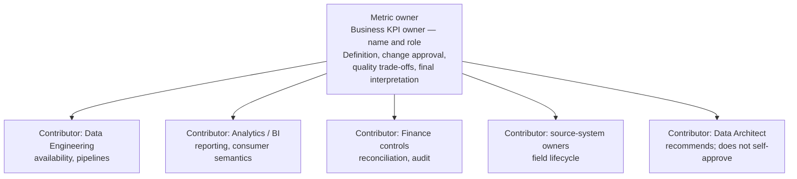

Ownership ≠ building dashboards. Ownership ≠ maintaining pipelines. If two people claim the ARR definition, the metric stays **Draft** — it is not approved ([Metric Owner](./metric-specification-template.md#section-3-metric-owner)).

Driver-tree “who acts when this branch moves” is a **contributor contact**, not a second metric owner. Put those names on leaves; keep a single owner on the root.

---

## Workshop sequence

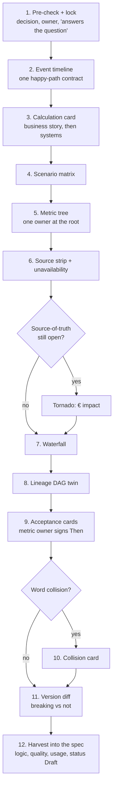

Steps 6–8 are optional in a short clinic if the calculation card and matrix already produced a named decision. Steps 9, 11, and 12 always happen before the walkthrough summary is called complete. If the pre-check in step 1 fails, **stop** — do not run the rest of the clinic for a metric that should not exist ([Does this metric deserve to exist?](./metric-specification-template.md#pre-check-does-this-metric-deserve-to-exist)).

---

## 1. Lock the decision and three scenarios

Run the **pre-check** first ([Does this metric deserve to exist?](./metric-specification-template.md#pre-check-does-this-metric-deserve-to-exist)). Vague answers (“monitor performance”, “leadership wants visibility”) fail. If any of the three questions cannot be answered with a name, a decision, and a consequence, **stop here** — this metric should not exist.

| Pre-check | Pass looks like | Fail looks like |
|---|---|---|
| What **decision** does this metric directly support? | “Whether Q2 board ARR is fit to publish” | “Understand the business” |
| **Who** makes that decision? (name and role) | One person with authority to reject the number | “Finance”, “the team”, two co-owners |
| What happens if this metric is **wrong**? | Overstated ARR → mis-set forecast / mis-pay variable comp | “Nothing” / “we would notice” |

Then fill [Metric Overview](./metric-specification-template.md#section-1-metric-overview) and the isolation-survivable [Business Definition](./metric-specification-template.md#section-2-business-definition) **before** any source-system walkthrough. The business definition contains **no formulas, no SQL, no table names**. Falsifiability is the test: given a concrete contract, a stakeholder can say true or false. Edge-case rulings come next, with finance, the metric owner, and the source-system contributor in the room ([KPI framework before dashboards](https://www.reportsimple.com.au/post/kpi-framework-before-dashboards)).

Also ask the four questions in [Establish the decision before discussing data](./Basware_Engagement_Playbook.md#1-establish-the-decision-before-discussing-data) — they overlap the pre-check; do not run both as separate interrogations.

Blank card: [Decision lock](#a1-decision-lock).

### Example (illustrative)

| Field | Capture |
|---|---|
| Metric name | Annual Recurring Revenue (ARR) |
| Business domain | Commercial finance |
| This metric answers the question: | “What is the annualized value of eligible active customer subscriptions at month-end close?” |
| Purpose — primary decision | Whether the quarterly commercial forecast and board ARR bridge are fit to publish |
| Metric owner | _Named person_, Commercial-Finance Controller (illustrative role) |
| Decision frequency | Monthly close; board pack quarterly |
| If this number is wrong | Board ARR overstated → forecast and capacity plans set off a false base; variable-comp conversations use the wrong denominator |
| Scenario A — normal | Direct customer; commercial and legal end dates agree; renews on time → **in ARR** |
| Scenario B — exception | Legal end date in March; commercial form still open through June → **out of ARR at legal end** (pending owner ruling) |
| Scenario C — variant | Reseller-fulfilled → ARR on **end-customer**, reseller tagged (pending owner ruling) |
| Spec status | **Draft** |
| Evidence status | **Decision pending** on Contract End Date authority and reseller grain |

“Ending ARR that Finance would reject” is a **validation prompt**, not a substitute for “what happens if the metric is wrong.” Keep both: the pre-check consequence, and the rejection examples as acceptance seeds.

---

## 2. Event timeline

Lite [process-level event storming](https://www.qlerify.com/post/event-storming-the-complete-guide): one subscription, left to right, **past-tense business events**. Stakeholders narrate in business language (“legal contract filed”). System names and field names sit in the mapping columns for the team **after** the room agrees the story ([Business Definition](./metric-specification-template.md#section-2-business-definition): the definition itself stays free of SQL). Later, map each event to a source timestamp and, for SCD2, to `__START_AT` versus the business Contract End Date attribute ([service columns on Lakeflow targets](../databricks/Databricks_Data_Modeling_Playbook.md#service-columns-on-lakeflow-targets)). Do not run a full event-storming wall in this SOW.

Stop when you reach events a single team can influence ([How to build a metric tree](https://kpitree.co/guides/getting-started/how-to-build-a-metric-tree)). Mark hotspots (orange) where systems disagree.

Blank row: [Event timeline](#a2-event-timeline-row).

### Example (illustrative) — contract C-18492, Nordic Pulp Oy

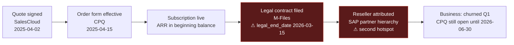

| Event (past tense) | Business meaning | System that records it | Timestamp on the event | Maps to in Gold (team, after the room) |
|---|---|---|---|---|
| Quote signed | Commercial intent | SalesCloud Opportunity | 2025-04-02 | Staging only; not ARR grain |
| Order form effective | Recurring value starts | CPQ OrderForm `effective_date` | 2025-04-15 | `fact_subscription` effective start |
| Legal contract filed | Legally binding end date exists | M-Files `legal_end_date` | 2026-03-15 | Candidate Contract End Date |
| Reseller attributed | End-customer vs VAR | SAP PartnerMaster | hierarchy as-of close | `dim_partner` |
| CPQ still open | Amendment/renewal path not closed | CPQ `end_date` | 2026-06-30 | Conflicting candidate end date |

The hotspot is not “ARR is hard.” It is **two clocks on the same contract**: legal end vs commercial form still open.

---

## 3. One-contract calculation card

Highest-leverage artifact. One redacted contract, one page. Both sides point at the same object. The spec test: a stranger could mark the business definition **true or false** from the story block alone — without reading field names ([Business Definition](./metric-specification-template.md#section-2-business-definition)). System fields are a **contributor** block, filled with the Data Engineer, not validated by the metric owner as SQL.

Blank card: [Calculation card](#a3-calculation-card).

### Example (illustrative)

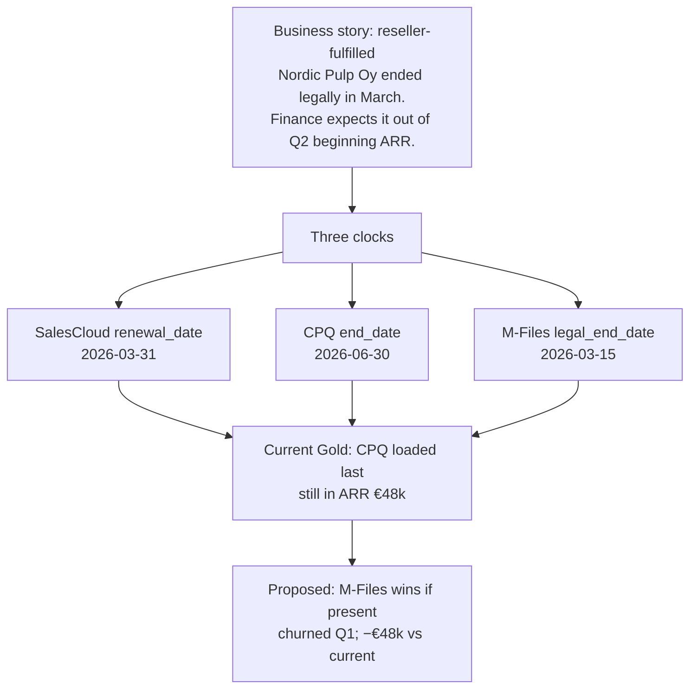

| Field | Example (illustrative) |
|---|---|
| Case ID | `CLINIC-ARR-01` (redacted; technical key in evidence pack) |
| Business story | A reseller fulfilled a 12-month invoice-automation subscription for Nordic Pulp. The signed legal contract ended 15 March 2026. The commercial team still treats the order form as open through 30 June. At March close, is this subscription still eligible active recurring value? |
| Owner expected | **False** — not in ARR at Q1 close |
| Current report | **True** — still in ARR |
| Customer / partner / product | End-customer Nordic Pulp Oy; reseller Baltic Office Systems; product AP automation cloud |
| ARR contribution | €48,000 annualized (one subscription line) |
| SalesCloud | Opportunity closed-won; renewal date 2026-03-31 |
| CPQ | Effective 2025-04-15; end 2026-06-30; amount €48,000 |
| M-Files | Legal end 2026-03-15 |
| SAP | Hierarchy places the reseller above Nordic Pulp; current Gold attributes ARR to the **reseller** account |
| Current Gold | **Included** in Q2 beginning ARR (€48k); reseller-attributed |
| Proposed rule (plain language) | If a signed legal end date exists, it ends eligibility; otherwise use the commercial form end; otherwise the opportunity renewal date. Reseller-fulfilled subscriptions count on the **end-customer**. Result: **excluded**, €0 in Q2 beginning ARR |
| Disagreement class | **Definitional** (legal vs commercial end) **and** hierarchy (reseller vs end-customer) |
| Open question | Does the metric owner accept legal end as ARR-churn even when the commercial form is still open? |
| Evidence status | **Decision pending** — metric owner must rule |

Work this card live. Do not skip to the tornado until the **metric owner** has said whether €48k *should* be in or out. Contributors may propose the fallback chain; they cannot implement it without that ruling ([Contributors](./metric-specification-template.md#section-4-contributors-optional)).

---

## 4. Scenario matrix

The case clinic, visible. Rows are the three situations from step 1. Columns compare expected business outcome to each system and to Gold. Disagreement becomes a comparison ([Single Source of Truth: A Practical Playbook](https://web.archive.org/web/20260309113751/https://claribi.com/blog/post/building-single-source-of-truth-practical-playbook/): when numbers conflict, people need to see which source wins and why).

Blank card: [Scenario matrix](#a4-scenario-matrix).

### Example (illustrative)

| Scenario | Business expected | SalesCloud | CPQ | M-Files | SAP | Current Gold | Proposed Gold | Class | Status |
|---|---|---|---|---|---|---|---|---|---|
| A Direct renewal, dates agree | Stay in ARR through 30 Jun 2026 | renewal 2026-06-30 | end 2026-06-30 | legal 2026-06-30 | n/a (direct) | Included €120k | Included €120k | none | **Hypothesis to validate** on sample |
| B Late legal filing, CPQ open | Out of ARR at legal end 15 Mar | renewal 2026-03-31 | end 2026-06-30 | legal 2026-03-15 | n/a | Included €48k (CPQ last-load) | Excluded at Q1 close | definitional + timing-lag | **Decision pending** |
| C Reseller-fulfilled | ARR on **end-customer**; reseller tagged | end-customer opportunity | reseller sold-to | legal on end-customer | reseller parent of customer | ARR on **reseller** account | ARR on end-customer; `dim_partner` tag | hierarchy | **Decision pending** |

Scenario B is calculation card `CLINIC-ARR-01`. Scenario C may be the same contract or a second card; do not mix two contracts in one row.

---

## 5. Metric tree with owners and evidence

Decompose ARR into drivers, then to operational inputs and the system each one lives in. The tree is a model of cause, not a dashboard ([The decision-making gap](https://kpitree.co/guides/strategy-culture/decision-making-gap); [KPI tree as visual language](https://bibb.pro/post/kpi-tree-for-performance-management)).

**Do not put a second metric owner on every node.** That contradicts [Metric Owner](./metric-specification-template.md#section-3-metric-owner). The root carries the **metric owner**. Leaves carry **contributor contacts** (who explains this source or operational lever) and evidence status. If a leaf has no data source, that absence is itself a finding ([KPI tree: baseline performance in 48 hours](https://kaizen.com/insights/kpi-tree-baseline-performance/)).

In the room, use “what drives this?” on each first-level branch; capture disagreements rather than forcing a perfect tree ([How to run a metric tree workshop](https://kpitree.co/guides/how-to/metric-tree-workshop)).

Blank register: [Tree node register](#a5-tree-node-register).

### Example (illustrative) — one owner at the root; contributors on leaves

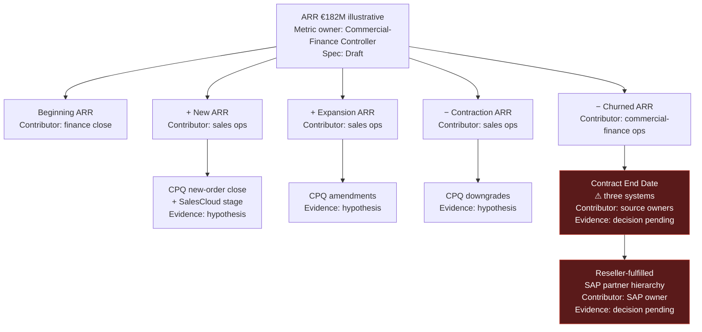

| Node | Role on this node | Name | Evidence status | Source system |
|---|---|---|---|---|
| ARR (root) | **Metric owner** | Commercial-Finance Controller | Decision pending (depends on leaves) | Certified metric / report |
| Beginning ARR | Contributor | Finance close | Hypothesis to validate | Prior-period certified close |
| New / Expansion / Contraction | Contributor | Sales ops | Hypothesis to validate | CPQ |
| Churned ARR — Contract End Date | Contributor (source meaning) | _Named M-Files / CPQ / SalesCloud owners_ | **Decision pending** | Three candidates; owner must pick truth |
| Reseller attribution | Contributor | _Named SAP owner_ | **Decision pending** | SAP partner hierarchy |

The metric owner still **approves** the Contract End Date ruling. Source contributors confirm what their field means; they do not redefine ARR.

Related: driver-tree framing in [Every Product Needs a North Star Metric](https://amplitude.com/blog/product-north-star-metric) and [Building a Driver Tree Template](https://miro.com/templates/building-a-driver-tree/). The KPI-Tree “named owner per node” idea is kept as **contributor contact**, not as a second definition owner.

---

## 6. Same-record source strip, then tornado

Show **these deals, these three dates** before any € swing. The tornado answers “so what?”; the strip is what the metric owner can inspect without trusting a model.

Name the **source of truth** when systems conflict, and name what happens if that source is **unavailable** — down, empty extract, or late past the close window. Conflict-fallback (legal date missing → commercial form) is not the same as incident-fallback (M-Files outage at close) ([Source Systems](./metric-specification-template.md#section-6-source-systems)).

Blank cards: [Source strip](#a6-source-strip), [Tornado](#a7-tornado).

### Example (illustrative) — eight contracts

| Case ID | End-customer | SalesCloud | CPQ | M-Files | Class | Current Gold | € at stake |
|---|---|---|---|---|---|---|---|
| CLINIC-ARR-01 | Nordic Pulp Oy | 2026-03-31 | 2026-06-30 | 2026-03-15 | definitional | CPQ | 48,000 |
| CLINIC-ARR-02 | Harbor Chemicals | 2026-06-30 | 2026-06-30 | 2026-06-30 | none | agree | 120,000 |
| CLINIC-ARR-03 | Baltic Grid | 2026-04-30 | 2026-04-30 | *null* | missing legal | CPQ | 36,000 |
| CLINIC-ARR-04 | North Ware | 2026-05-15 | 2026-02-28 | 2026-05-15 | timing-lag (CPQ stale) | CPQ | 22,000 |
| CLINIC-ARR-05 | Delta Mills | 2026-03-01 | 2026-03-01 | 2025-12-31 | data-entry? | SalesCloud | 15,000 |
| CLINIC-ARR-06 | reseller-only row | n/a | 2026-12-31 | 2026-12-31 | hierarchy | reseller account | 90,000 |
| CLINIC-ARR-07 | dual-entity suspect | two IDs | one ID | one ID | classify first — do not assume matching | mixed | 60,000 |
| CLINIC-ARR-08 | country variant FI | 2026-06-30 | 2026-08-31 | 2026-06-30 | country process | CPQ | 41,000 |

CLINIC-ARR-07 is a [Classify the problem first](../databricks/Databricks_Data_Modeling_Playbook.md#classify-the-problem-first) case: hierarchy vs reconciliation vs identity. Do not drop it into Splink from this table alone.

### Tornado — only after the strip

Runs the same metric under each candidate hypothesis and ranks impact. Turns “which system should be authoritative” from an opinion into a measured comparison.

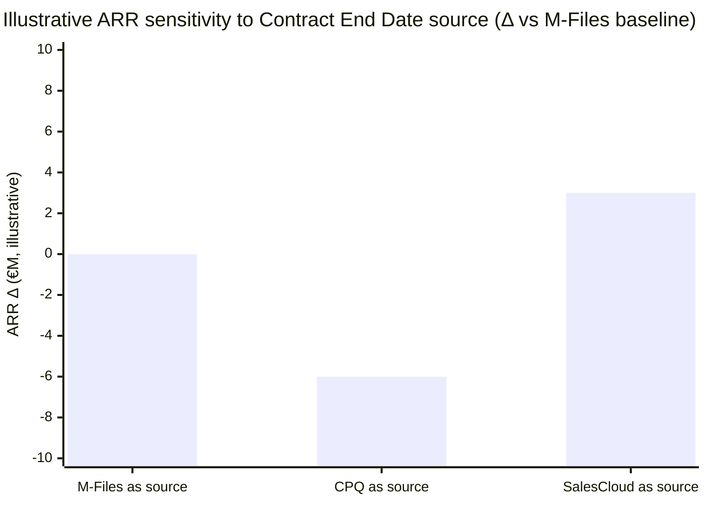

| Hypothesis | Rule (plain language) | Illustrative ending ARR | Δ vs M-Files baseline | What the strip showed |
|---|---|---|---|---|
| M-Files wins if present | Legal end date; else CPQ; else SalesCloud | €182M | — | CLINIC-ARR-01, 03, 04 drive most of the gap |
| CPQ always | Commercial form end date | €176M | −€6M | Pulls late legal filings back into ARR |
| SalesCloud always | Opportunity renewal_date | €185M | +€3M | Smaller set of mismatched renewals |

Reading it: if switching the authoritative source from M-Files to CPQ swings ARR by €6M, that is the number for the interim readout instead of “the systems disagree sometimes.” Tie the €6M back to named case IDs on the strip. The metric owner picks the source of truth; contributors do not.

### Source unavailability (illustrative)

| Event | Proposed response | Who is notified | Spec status while true |
|---|---|---|---|
| M-Files extract missing at close (source of truth down) | Do **not** silently fall back to last-load CPQ. Hold ARR publish; metric owner decides: delay close vs documented interim using CPQ with a banner | Quality owner + metric owner | Remains **Draft** / not Active for that close until ruled |
| M-Files field null on a row (source up, attribute missing) | Row-level fallback: commercial form end, then opportunity renewal date (AT-03) | Source contributor; log only unless threshold breached | Evidence: hypothesis until completeness SLA is set in [Quality expectations](#quality-expectations) |

---

## 7. ARR waterfall

Standard SaaS visual for “how did we get from last quarter to this quarter” ([SaaS revenue waterfall](https://www.thesaascfo.com/saas-revenue-waterfall-chart/); [ARR waterfall charts](https://www.xeinadin.com/office/rochester/insights/understanding-arr-waterfall-charts-a-key-tool-for-saas-businesses/)). Use it to show **which bar** a logic error distorts — here, Churned, because Contract End Date is disputed.

Blank card: [Waterfall](#a8-waterfall).

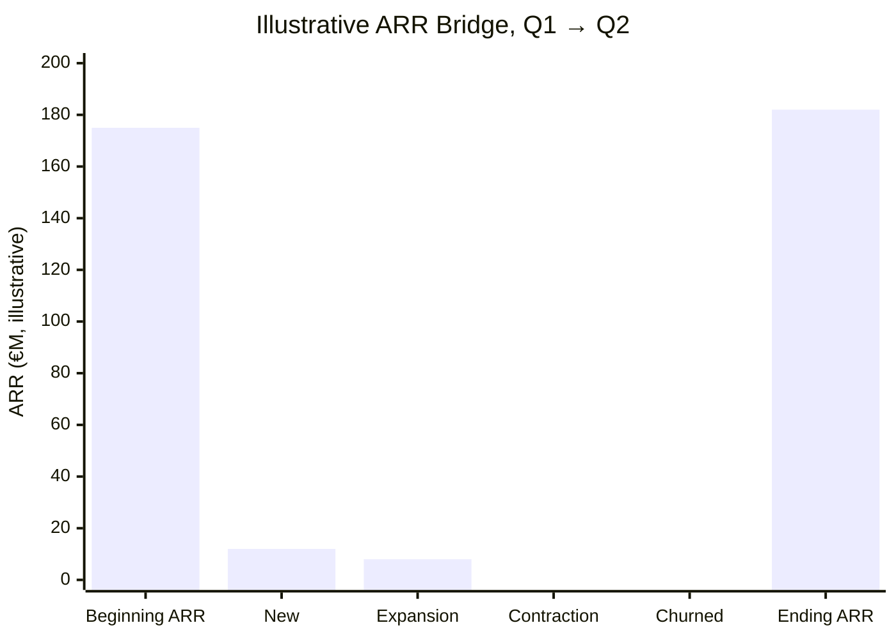

| Component | Δ (illustrative) | Running total | Source system | Clinic link |
|---|---|---|---|---|
| Beginning ARR | — | €175M | prior period close | Certified close; do not relitigate here |
| + New | +€12M | €187M | CPQ new-order close | Tree: New ARR |
| + Expansion | +€8M | €195M | CPQ amendments | Tree: Expansion |
| − Contraction | −€4M | €191M | CPQ downgrades | Tree: Contraction |
| − Churned | −€9M | €182M | **Contract End Date — disputed** | Strip + CLINIC-ARR-01 |
| **Ending ARR** | | **€182M** | | Tornado: this total moves with the hypothesis |

If the Churned bar moves materially depending on which of the three systems is authoritative, that is the bar to point at when arguing the ambiguity is worth resolving deliberately rather than picking one system by default.

---

## 8. Lineage DAG as twin of the tree

Engineer-facing counterpart: tables, columns, joins — not business drivers. Close to free once Unity Catalog lineage is populated ([Operations](../databricks/Databricks_Data_Modeling_Playbook.md#e-operations)). In a mixed room, show it **only** as a twin of the metric tree: the red leaf “Contract End Date” is the red node `RECON`.

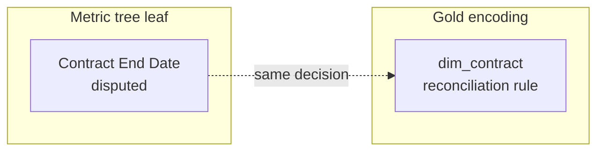

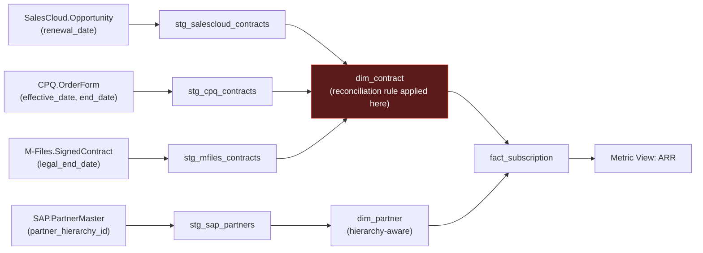

`RECON` is where the Contract End Date decision is encoded, and where a future silent break needs a monitor ([Method](../databricks/Databricks_Data_Modeling_Playbook.md#method)). Do not ask business to validate this diagram. Ask them to validate the calculation card; the engineer uses the DAG to show where that ruling will live.

Certified consumption of the agreed grain is a metric view, not the place that invents Contract End Date ([Unity Catalog Metric Views architecture brief](../databricks/Metric_Views_Brief.md)).

---

## 9. Acceptance cards

Given / When / Then. This is the falsifiability test from [Business Definition](./metric-specification-template.md#section-2-business-definition). The **metric owner** signs the Then. Contributors prepare the card and may recommend; they do not co-sign the definition ([Metric Owner](./metric-specification-template.md#section-3-metric-owner)). The set becomes the Gold test pack and fills validation on the [KPI Definition Contract](./Basware_Engagement_Playbook.md#appendix-a--kpi-definition-contract). No SQL in the Then clause.

AT-04 (do not merge two partner IDs) is a **classification** recommendation from architecture. The metric owner still accepts or rejects the ARR treatment; architecture does not become a second metric owner.

Blank card: [Acceptance card](#a9-acceptance-card).

### Example (illustrative)

| ID | Given | When | Then | Metric owner sign-off | Status |
|---|---|---|---|---|---|
| AT-01 | Direct customer; commercial, legal, and opportunity end dates equal 30 Jun 2026 | Month-end snapshot 31 Mar 2026 | Line **remains in ARR** | _Commercial-Finance Controller_ | Hypothesis to validate |
| AT-02 | Reseller-fulfilled; legal end 15 Mar 2026; commercial form end 30 Jun 2026 | Month-end snapshot 31 Mar 2026 | Line **out of ARR**; churned in Q1; attributed to **end-customer**, reseller tagged | _Commercial-Finance Controller_ | **Decision pending** |
| AT-03 | Legal end date missing; commercial form end 30 Jun 2026 | Month-end snapshot 31 Mar 2026 | Line **remains in ARR** on the commercial-form fallback | _Commercial-Finance Controller_ | Decision pending (fallback rule) |
| AT-04 | Two source IDs may represent the same partner | Any close | ARR **does not** treat them as one customer until [Classify the problem first](../databricks/Databricks_Data_Modeling_Playbook.md#classify-the-problem-first) says identity matching is required | _Commercial-Finance Controller_ (architecture recommends) | Decision pending |

AT-02 is CLINIC-ARR-01. If the metric owner will not sign Then, the definition is not confirmed and the spec stays **Draft** — regardless of how complete the lineage DAG looks.

---

## 10. Word-collision card

Use only if “Customer,” “Contract,” or “Partner” collide mid-workshop. Full vocabulary is in [Why "Customer," "Contract," and "Partner" are genuinely ambiguous](../business/Basware_Business_101_Glossary.md#4-why-customer-contract-and-partner-are-genuinely-ambiguous-here).

Blank card: [Word collision](#a10-word-collision).

### Example (illustrative)

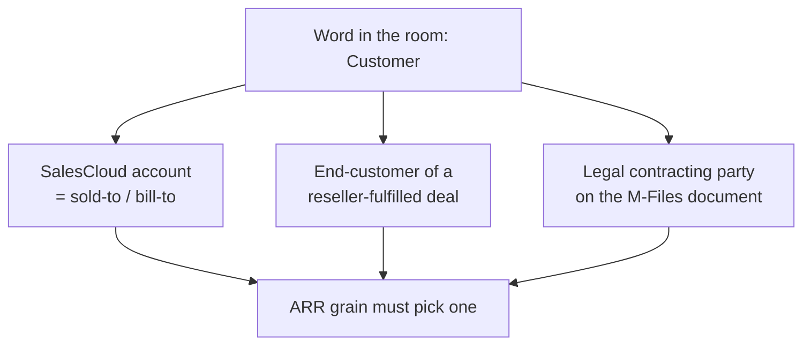

| Word | Meaning A | Meaning B | Meaning C | ARR uses which? | Status |
|---|---|---|---|---|---|
| Customer | SalesCloud account | End-customer behind a VAR | Legal party on M-Files | **Decision pending** — scenario C says end-customer | Decision pending |
| Contract | CPQ order form | M-Files signed document | SalesCloud opportunity | End date: **decision pending** | Decision pending |
| Partner | SAP partner id | Reseller sold-to | Alliance / implementation partner | Hierarchy vs identity: [Classify the problem first](../databricks/Databricks_Data_Modeling_Playbook.md#classify-the-problem-first) | Decision pending |

---

## 11. Definition-version diff

Readout artifact, after a ruling — not the opening slide. Makes “we fixed the definition” auditable. Classify every row as **non-breaking** (documentation, naming) or **breaking** (logic, scope, source of truth). Silent changes are not allowed ([Change Control](./metric-specification-template.md#section-8-change-control)). Breaking changes need the metric owner’s approval and a named communication to downstream consumers ([Usage and Dependencies](./metric-specification-template.md#section-9-usage-and-dependencies)).

Blank card: [Definition-version diff](#a11-definition-version-diff).

### Example (illustrative) — known ARR incident pattern

| Rule | Before (incident state) | After (proposed) | Change class | Clinic evidence | Communicate to | Version |
|---|---|---|---|---|---|---|
| Contract End Date source | Whichever system loaded last (undefined precedence) | Legal end if present; else commercial form; else opportunity renewal | **Breaking** (logic + source of truth) | Strip + AT-02, AT-03 | Executive ARR dashboard, finance planning, commercial reporting | ARR v0.9 **Draft** |
| Reseller-fulfilled deals | Attributed to reseller account | Attributed to end-customer; reseller tagged | **Breaking** (scope / grain) | Scenario C, CLINIC-ARR-06 | Same consumers | ARR v0.9 **Draft** |
| Result | ARR overstated in periods with stale legal-file sync | ARR matches reconciled contract set **if** the metric owner signs AT-02 | Breaking | Tornado −€6M vs CPQ-as-source | Board-pack owner | Pending owner approval — not Active |

Record the approved row in the [RAID and Decision Log](./Basware_Engagement_Playbook.md#appendix-b--raid-and-decision-log) and version the [KPI Definition Contract](./Basware_Engagement_Playbook.md#appendix-a--kpi-definition-contract). Do not mark the spec **Active** from this table alone — that is [Harvest into the specification](#12-harvest-into-the-specification) plus the owner signature.

---

## 12. Harvest into the specification

After the clinic, copy rulings into the remaining Wernfeldt sections. This is the completeness check against the [KPI Definition Contract](./Basware_Engagement_Playbook.md#appendix-a--kpi-definition-contract): grain and formula are not enough. Blank harvest sheet: [Harvest](#a12-harvest-spec-completeness).

### Conceptual calculation logic

Plain language from [Calculation Logic](./metric-specification-template.md#section-5-calculation-logic). No SQL. Structure, exclusions, assumptions.

**Example (illustrative, Draft):** ARR is the annualized recurring value of eligible customer subscriptions that are active at the month-end close. A subscription is active when its start is on or before close and its **agreed contract end** is after close. One-time implementation, usage, and non-recurring services are excluded. Internal and test customers are excluded. Reseller-fulfilled subscriptions are counted on the end-customer. **Assumption (decision pending):** agreed contract end is the signed legal end date when present. **Timing assumption:** month-end snapshot; late legal filings inside the documented correction window restated, not silently ignored.

### Quality expectations

From [Data Quality Expectations](./metric-specification-template.md#section-7-data-quality-expectations). Quality without consequences is just hope.

| Rule | Threshold (illustrative) | Quality owner (contributor) | Consequence when broken |
|---|---|---|---|
| Completeness of legal end date on in-ARR rows | _Set in clinic — e.g. investigate if null rate > agreed %_ | Source contributor (M-Files) | Inform metric owner; do not auto-publish if completeness fails the owner’s bar |
| Freshness of legal-file extract at close | Available before the close cutoff | Data Engineering | **Block reporting** for that close unless the metric owner accepts an interim rule |
| Valid ARR amount | > 0 for included lines; currency in the allowed set | Analytics | Quarantine row; inform owner |
| Cross-source disagreement on end date | Flag every disagreement; materiality _€ at stake_ from the strip | Data Architect (recommends) | Escalate to metric owner — do not pick a winner in the pipeline |

### Usage and not intended for

From [Usage and Dependencies](./metric-specification-template.md#section-9-usage-and-dependencies).

| Intended for (illustrative) | Not intended for |
|---|---|
| Board ARR bridge, commercial forecast, certified executive dashboard | Cash collected, invoice volume, product-touchless-processing KPIs, customer LTV, or partner-commission statements without a separate spec |
| Month-end snapshot at the agreed close | Intra-day operational alerts unless freshness is re-specified |

Downstream (illustrative): executive ARR dashboard, finance planning pack, commercial reporting. Changing source-of-truth or reseller grain is a breaking change for all three.

### Review and sunset

From [Review Cadence](./metric-specification-template.md#section-10-review-cadence).

| Field | Illustrative capture for this SOW |
|---|---|
| Review frequency | Quarterly after Active; not in the two-week embed |
| Review scope | Definition still valid? Usage still the board bridge? Quality thresholds still realistic? |
| Sunset triggers | Decision no longer made; source system retired; unused for six months |

### Approval snapshot

From [Approval](./metric-specification-template.md#approval).

| Field | Illustrative |
|---|---|
| Spec status | **Draft** |
| Last reviewed | _Clinic date_ |
| Next review | After Discovery / first Active close |
| Visibility | Internal Cresco + named Basware owners; not client-external |
| Approved by (metric owner) | _Unsigned until AT-02 and source-of-truth are ruled_ |
| Date | — |

**This specification is a commitment, not documentation.** Unsigned Draft means the walkthrough may still recommend; it must not imply ARR is already recertified.

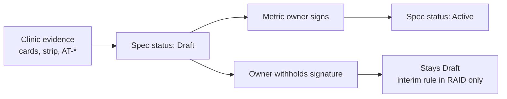

---

## Appendix A — Blank templates

Copy into the evidence pack. Keep production keys out of this markdown file.

### A.1 Decision lock

| Field | Capture |
|---|---|
| Metric name (unambiguous; used everywhere) | |
| Business domain | e.g. Commercial finance |
| This metric answers the question: “…” | Isolation-survivable; no SQL |
| Purpose — primary decision | |
| Metric owner (name **and** role) | One person; not a committee |
| Decision frequency | daily / weekly / monthly / quarterly |
| What happens if this number is wrong | Downstream impact, not “Finance would frown” |
| Pre-check pass? | yes / **stop — metric should not exist** |
| Scenario A — normal | Must be decidable true/false against the definition |
| Scenario B — exception | |
| Scenario C — country / source / reseller variant | |
| Spec status after this clinic | Draft (default) / Active / Deprecated |
| Evidence status | confirmed / hypothesis to validate / decision pending |

### A.2 Event timeline row

| Event (past tense) | Business meaning | System | Timestamp | Gold mapping (after the room) | Hotspot? |
|---|---|---|---|---|---|
| | | | | | |

### A.3 Calculation card

**Business block**

| Field | Capture |
|---|---|
| Case ID / redaction key | Link to controlled extract; no production row in this doc |
| Business story (three sentences) | What the SME says happened — no table or column names |
| In ARR at this close? (owner expected) | true / false against “answers the question…” |
| In ARR at this close? (current report) | true / false / unknown |
| Open question for the **metric owner** | |

**Contributor block**

| Field | Capture |
|---|---|
| Customer / partner / product (business names) | |
| ARR contribution | Currency and grain: one subscription line for one effective period |
| SalesCloud fields | e.g. opportunity renewal date |
| CPQ fields | e.g. order-form effective / end |
| M-Files fields | e.g. signed-contract legal end |
| SAP fields | partner hierarchy; reseller vs end-customer |
| Current Gold result | Include / exclude / amount |
| Proposed rule (plain language) | Include / exclude / amount — still in plain language |
| Disagreement class | timing-lag / definitional / data-entry / hierarchy |
| Evidence status | |

### A.4 Scenario matrix

| Scenario | Business expected ARR treatment | SalesCloud | CPQ | M-Files | SAP partner | Current Gold | Proposed Gold | Disagreement class | Status |
|---|---|---|---|---|---|---|---|---|---|
| A Normal | | | | | | | | | |
| B Exception | | | | | | | | | |
| C Variant | | | | | | | | | |

### A.5 Tree node register

| Node | Metric owner or contributor? | Name | Evidence status | Source system | Open question |
|---|---|---|---|---|---|
| Root | Metric owner | | | | |
| | Contributor | | | | |

### A.6 Source strip

| Case ID | End-customer (redacted) | SalesCloud date | CPQ date | M-Files date | Class | Current Gold uses | € ARR at stake (illustrative) |
|---|---|---|---|---|---|---|---|
| | | | | | | | |

### A.7 Tornado

| Hypothesis | Plain-language rule | Result | Δ vs baseline | Strip case IDs that move |
|---|---|---|---|---|
| | | | | |

### A.8 Waterfall

| Component | Δ | Running total | Source | Clinic link |
|---|---|---|---|---|
| Beginning | | | | |
| + New | | | | |
| + Expansion | | | | |
| − Contraction | | | | |
| − Churned | | | | |
| Ending | | | | |

### A.9 Acceptance card

| ID | Given | When | Then (ARR treatment) | Metric owner sign-off | Status |
|---|---|---|---|---|---|
| AT- | | | | | |

### A.10 Word collision

| Word | Meaning A | Meaning B | Meaning C | This KPI uses | Status |
|---|---|---|---|---|---|
| | | | | | |

### A.11 Definition-version diff

| Rule | Before | After | Change class | Evidence | Communicate to | Version |
|---|---|---|---|---|---|---|
| | | | breaking / non-breaking | | | |

### A.12 Harvest (spec completeness)

| Spec section | Capture |
|---|---|
| Conceptual logic (no SQL) | |
| Explicit exclusions | |
| Key assumptions | |
| Source of truth | |
| Source unavailability response | |
| Completeness / freshness / range + consequence | |
| Intended uses | |
| Not intended for | |
| Downstream consumers | |
| Review frequency / sunset triggers | |
| Spec status | Draft / Active / Deprecated |
| Approved by (metric owner) + date | |

---

## Sources

**Workshop method**
- [KPI Tree guides — captured local copy](../reference/kpitree-guides-capture-2026-08-26.md)
- [How to Run a Metric Tree Workshop — KPI Tree](https://kpitree.co/guides/how-to/metric-tree-workshop)
- [How to Build a Metric Tree — KPI Tree](https://kpitree.co/guides/getting-started/how-to-build-a-metric-tree)
- [The Decision-Making Gap — KPI Tree](https://kpitree.co/guides/strategy-culture/decision-making-gap)
- [KPI Tree: Baseline performance in 48 hours — KAIZEN](https://kaizen.com/insights/kpi-tree-baseline-performance/)
- [KPI Tree for Performance Management — BIBB](https://bibb.pro/post/kpi-tree-for-performance-management)
- [Build a KPI Framework Before You Build a Single Dashboard — Report Simple](https://www.reportsimple.com.au/post/kpi-framework-before-dashboards)
- [Single Source of Truth: A Practical Playbook — clariBI (archived)](https://web.archive.org/web/20260309113751/https://claribi.com/blog/post/building-single-source-of-truth-practical-playbook/)
- [Metric Specification Template — captured local copy](./metric-specification-template.md)
- [Metric Specification Template — John Wernfeldt (Substack)](https://datagovernancefieldlibrary.substack.com/p/metric-specification-template)
- [Source page captured 2026-08-25](https://metric-specification-tem-nk2q3lz.gamma.site/)
- [Metric Definition Template — IdeaPlan](https://www.ideaplan.io/templates/metric-definition-template)
- [Event Storming — The Complete Guide — Qlerify](https://www.qlerify.com/post/event-storming-the-complete-guide)
- [Event storming workshop — Gemba Kai](https://gembakai.us/playbook/documentation/guides/event-storming-workshop)

**SaaS / driver visuals**
- [SaaS Revenue Waterfall Chart — The SaaS CFO](https://www.thesaascfo.com/saas-revenue-waterfall-chart/)
- [Understanding ARR Waterfall Charts — Xeinadin](https://www.xeinadin.com/office/rochester/insights/understanding-arr-waterfall-charts-a-key-tool-for-saas-businesses/)
- [Every Product Needs a North Star Metric — Amplitude](https://amplitude.com/blog/product-north-star-metric)
- [Building a Driver Tree Template — Miro](https://miro.com/templates/building-a-driver-tree/)

**This engagement**
- [Basware Embed — 2-Week Playbook](./Basware_Engagement_Playbook.md)
- [KPI Elicitation Protocol for Fragmented Evidence](./Basware_Engagement_Playbook.md#appendix-h--kpi-elicitation-protocol-for-fragmented-evidence)
- [From source disagreement to Gold definition](../databricks/Databricks_Data_Modeling_Playbook.md#4-from-source-disagreement-to-gold-definition)
- [Unity Catalog Metric Views architecture brief](../databricks/Metric_Views_Brief.md)
- [Basware Business 101 + Glossary](../business/Basware_Business_101_Glossary.md)
