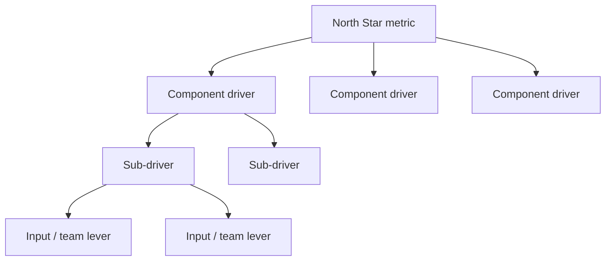
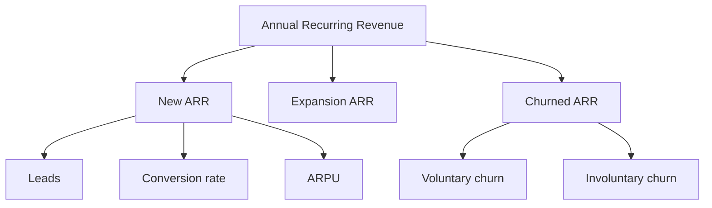
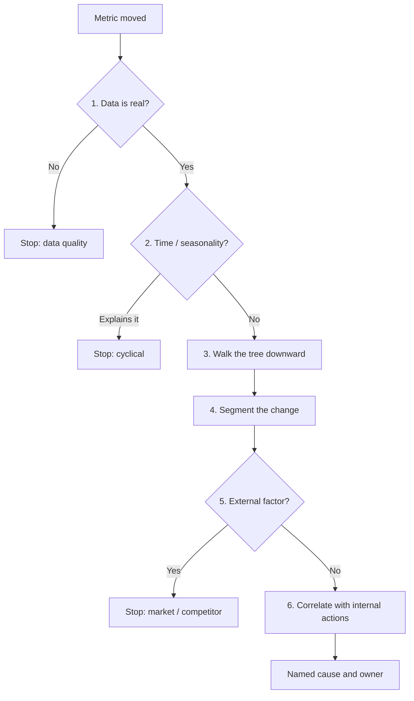
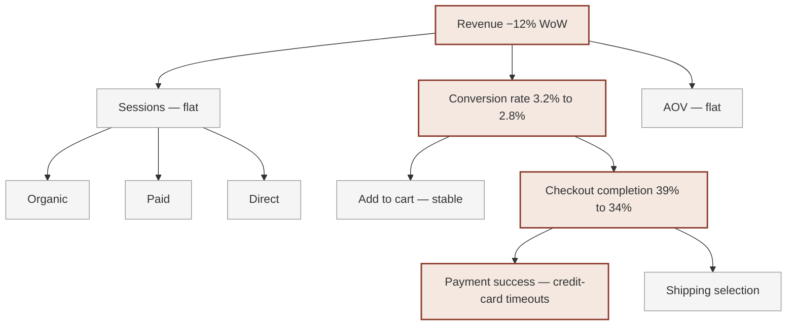
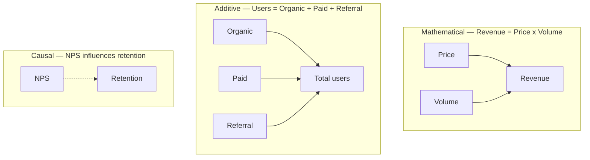
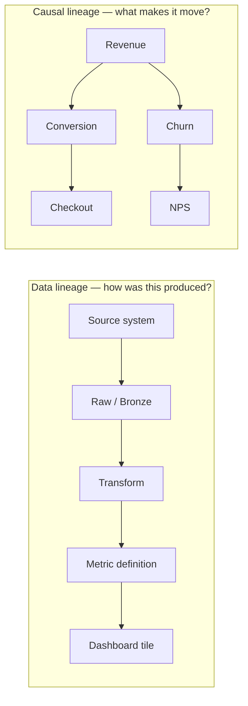
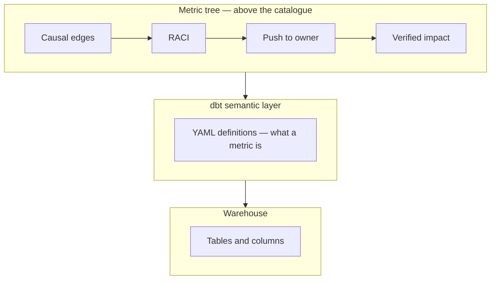

# KPI Tree Guides — source-preserving capture

This archive keeps fetch provenance for every listed guide, then renders the served article body as readable Markdown. Decorative chrome (book covers, icon SVGs, AI-summary buttons, sticky chapter chips) is dropped. Numbered steps, comparison tables, card grids, nested trees, and “Continue reading” links are converted to ordinary Markdown lists and tables so the preview is scannable.

A fragment checksum applies to the original served `<main>` bytes at capture time; a response checksum applies to the full fetched HTML response.

## Contents

Captured guide articles in this file (listed position numbers match the inventory). Failed fetches are omitted.

- [1. What Is a Metric Tree?](#1-what-is-a-metric-tree---kpi-tree)
- [2. How to Build a Metric Tree (KPI Tree)](#2-how-to-build-a-metric-tree-kpi-tree---kpi-tree)
- [3. Metric Tree Examples for Every Business Model](#3-metric-tree-examples-for-every-business-model---kpi-tree)
- [4. Metric Tree vs KPI Tree vs Value Driver Tree](#4-metric-tree-vs-kpi-tree-vs-value-driver-tree---kpi-tree)
- [5. North Star Metric: What It Is and How to Find Yours](#5-north-star-metric-what-it-is-and-how-to-find-yours---kpi-tree)
- [6. Leading vs Lagging Indicators Explained + Examples](#6-leading-vs-lagging-indicators-explained-examples---kpi-tree)
- [7. OKR vs KPI: How OKRs and Metric Trees Work Together](#7-okr-vs-kpi-how-okrs-and-metric-trees-work-together---kpi-tree)
- [8. Why Did My Metric Change? A Diagnostic Framework](#8-why-did-my-metric-change-a-diagnostic-framework---kpi-tree)
- [9. Metric Ownership: Who Should Own Which Metric](#9-metric-ownership-who-should-own-which-metric---kpi-tree)
- [10. Metric Decomposition](#10-metric-decomposition---kpi-tree)
- [11. Balanced Scorecard vs Metric Tree](#11-balanced-scorecard-vs-metric-tree---kpi-tree)
- [12. Goodhart's Law: Why Metrics Get Gamed and How to Prevent It](#12-goodharts-law-why-metrics-get-gamed-and-how-to-prevent-it---kpi-tree)
- [13. Metric Trees for Finance Teams](#13-metric-trees-for-finance-teams---kpi-tree)
- [14. Dashboards vs Metric Trees: Why Dashboards Are Not Enough](#14-dashboards-vs-metric-trees-why-dashboards-are-not-enough---kpi-tree)
- [15. How to Run a Metric Tree Workshop: A Facilitation Guide](#15-how-to-run-a-metric-tree-workshop-a-facilitation-guide---kpi-tree)
- [16. How to Choose KPIs: A Metric Tree Approach to KPI Selection](#16-how-to-choose-kpis-a-metric-tree-approach-to-kpi-selection---kpi-tree)
- [17. Metric Trees for Executives: A Visual Guide for Senior Leaders](#17-metric-trees-for-executives-a-visual-guide-for-senior-leaders---kpi-tree)
- [18. Metrics and Behavioural Science](#18-metrics-and-behavioural-science---kpi-tree)
- [19. Strategy Execution Gap](#19-strategy-execution-gap---kpi-tree)
- [20. How to Set KPI Targets: A Data-Driven Approach to Target Setting](#20-how-to-set-kpi-targets-a-data-driven-approach-to-target-setting---kpi-tree)
- [21. How to Build a Data-Driven Culture: A Framework Beyond Dashboards](#21-how-to-build-a-data-driven-culture-a-framework-beyond-dashboards---kpi-tree)
- [22. KPI vs Metric: What Is the Difference?](#22-kpi-vs-metric-what-is-the-difference---kpi-tree)
- [23. Metric Trees for Product Teams: From HEART to AARRR and Beyond](#23-metric-trees-for-product-teams-from-heart-to-aarrr-and-beyond---kpi-tree)
- [24. How to Run a Metrics Review Meeting](#24-how-to-run-a-metrics-review-meeting---kpi-tree)
- [25. Metric Trees for Marketing Teams](#25-metric-trees-for-marketing-teams---kpi-tree)
- [26. The Metrics Maturity Model: Five Levels From Ad Hoc to Optimised](#26-the-metrics-maturity-model-five-levels-from-ad-hoc-to-optimised---kpi-tree)
- [27. Metric Trees for SaaS Companies](#27-metric-trees-for-saas-companies---kpi-tree)
- [28. How to Align Teams With Metrics: A Practical Guide](#28-how-to-align-teams-with-metrics-a-practical-guide---kpi-tree)
- [29. Metric Trees for Sales Teams: Structure Pipeline, Activity](#29-metric-trees-for-sales-teams-structure-pipeline-activity---kpi-tree)
- [30. Metric Trees for Startups: From Pre-Seed to Series A](#30-metric-trees-for-startups-from-pre-seed-to-series-a---kpi-tree)
- [31. Vanity Metrics vs Actionable Metrics: How to Tell the Difference](#31-vanity-metrics-vs-actionable-metrics-how-to-tell-the-difference---kpi-tree)
- [32. Metric Trees for Customer Success](#32-metric-trees-for-customer-success---kpi-tree)
- [33. How to Build a KPI Dashboard That Drives Decisions](#33-how-to-build-a-kpi-dashboard-that-drives-decisions---kpi-tree)
- [34. Metric Trees for Engineering Teams](#34-metric-trees-for-engineering-teams---kpi-tree)
- [35. How to Track OKR Progress With Metric Trees: Scoring, Check-Ins](#35-how-to-track-okr-progress-with-metric-trees-scoring-check-ins---kpi-tree)
- [36. Metric Trees for HR and People Teams](#36-metric-trees-for-hr-and-people-teams---kpi-tree)
- [37. How to Communicate Metrics to Stakeholders](#37-how-to-communicate-metrics-to-stakeholders---kpi-tree)
- [38. Metric Trees for E-Commerce](#38-metric-trees-for-e-commerce---kpi-tree)
- [39. How to Run a Quarterly Business Review (QBR)](#39-how-to-run-a-quarterly-business-review-qbr---kpi-tree)
- [40. Input Metrics vs Output Metrics: Definitions, Examples](#40-input-metrics-vs-output-metrics-definitions-examples---kpi-tree)
- [41. Metric Trees for Healthcare Organisations: Connecting Clinical](#41-metric-trees-for-healthcare-organisations-connecting-clinical---kpi-tree)
- [42. Metric Trees for Fintech Companies](#42-metric-trees-for-fintech-companies---kpi-tree)
- [43. Common Metric Anti-Patterns and How to Fix Them](#43-common-metric-anti-patterns-and-how-to-fix-them---kpi-tree)
- [44. How to Present Metrics to Your Board: A Practical Guide](#44-how-to-present-metrics-to-your-board-a-practical-guide---kpi-tree)
- [45. Metric Trees for Retail](#45-metric-trees-for-retail---kpi-tree)
- [46. Metric Trees for Operations Teams](#46-metric-trees-for-operations-teams---kpi-tree)
- [47. How to Migrate From Spreadsheet Metrics to a Metric Tree](#47-how-to-migrate-from-spreadsheet-metrics-to-a-metric-tree---kpi-tree)
- [48. Metric Trees for Education and EdTech](#48-metric-trees-for-education-and-edtech---kpi-tree)
- [49. Metric Trees for Non-Profit Organisations](#49-metric-trees-for-non-profit-organisations---kpi-tree)
- [50. How to Onboard New Hires With Your Metric Tree](#50-how-to-onboard-new-hires-with-your-metric-tree---kpi-tree)
- [51. Metrics for Remote and Distributed Teams: A Practical Guide](#51-metrics-for-remote-and-distributed-teams-a-practical-guide---kpi-tree)
- [52. How Metric Trees Shape Company Culture](#52-how-metric-trees-shape-company-culture---kpi-tree)
- [53. Metric Trees for Agencies and Consultancies](#53-metric-trees-for-agencies-and-consultancies---kpi-tree)
- [54. How to Sunset a Metric: A Practical Guide to KPI Pruning](#54-how-to-sunset-a-metric-a-practical-guide-to-kpi-pruning---kpi-tree)
- [55. AI and Metrics: How Machine Learning Changes Measurement](#55-ai-and-metrics-how-machine-learning-changes-measurement---kpi-tree)
- [56. MCP Servers for Business Performance](#56-mcp-servers-for-business-performance---kpi-tree)
- [57. Metric Trees for Marketplaces](#57-metric-trees-for-marketplaces---kpi-tree)
- [58. Metric Trees During Mergers & Acquisitions](#58-metric-trees-during-mergers-acquisitions---kpi-tree)
- [59. Customer Acquisition Cost](#59-customer-acquisition-cost---kpi-tree)
- [60. Revenue Per Employee as a Metric Tree: Benchmarks, Decomposition](#60-revenue-per-employee-as-a-metric-tree-benchmarks-decomposition---kpi-tree)
- [61. Net Revenue Retention: Formula, Benchmarks & Levers](#61-net-revenue-retention-formula-benchmarks-levers---kpi-tree)
- [62. Churn Rate Analysis: Formulas, Benchmarks and Fixes](#62-churn-rate-analysis-formulas-benchmarks-and-fixes---kpi-tree)
- [63. How to Benchmark Your Metrics](#63-how-to-benchmark-your-metrics---kpi-tree)
- [64. Metric Trees for Subscription Businesses: MRR Decomposition](#64-metric-trees-for-subscription-businesses-mrr-decomposition---kpi-tree)
- [65. Metric Trees for Logistics and Supply Chain](#65-metric-trees-for-logistics-and-supply-chain---kpi-tree)
- [66. How to Debug a Broken Metric: A Systematic Framework](#66-how-to-debug-a-broken-metric-a-systematic-framework---kpi-tree)
- [67. Conversion Rate Analysis: A Complete Guide](#67-conversion-rate-analysis-a-complete-guide---kpi-tree)
- [68. Customer Lifetime Value: A Metric Tree Decomposition of LTV](#68-customer-lifetime-value-a-metric-tree-decomposition-of-ltv---kpi-tree)
- [69. North Star Framework vs Metric Trees](#69-north-star-framework-vs-metric-trees---kpi-tree)
- [70. AARRR Pirate Metrics and Metric Trees](#70-aarrr-pirate-metrics-and-metric-trees---kpi-tree)
- [71. How to Align OKRs Across Teams Using a Metric Tree](#71-how-to-align-okrs-across-teams-using-a-metric-tree---kpi-tree)
- [72. Using Metric Trees During a Pivot or Crisis](#72-using-metric-trees-during-a-pivot-or-crisis---kpi-tree)
- [73. Gross Margin: A Metric Tree Approach to Decomposition, Benchmarks](#73-gross-margin-a-metric-tree-approach-to-decomposition-benchmarks---kpi-tree)
- [74. Metric Tree Checklist](#74-metric-tree-checklist---kpi-tree)
- [75. Your First Metric Tree in 10 Minutes](#75-your-first-metric-tree-in-10-minutes---kpi-tree)
- [76. How to Run an A/B Test with Metric Trees](#76-how-to-run-an-ab-test-with-metric-trees---kpi-tree)
- [77. Metric Trees for Veterinary Practices: Connecting Clinical](#77-metric-trees-for-veterinary-practices-connecting-clinical---kpi-tree)
- [78. Veterinary KPIs from Provet Cloud](#78-veterinary-kpis-from-provet-cloud---kpi-tree)
- [128. Migrating from Power BI Scorecard Hierarchies to Metric Trees](#128-migrating-from-power-bi-scorecard-hierarchies-to-metric-trees---kpi-tree)
- [129. Decision Intelligence](#129-decision-intelligence---kpi-tree)
- [130. Data Engagement: Connecting Data Intelligence to Behaviour Change](#130-data-engagement-connecting-data-intelligence-to-behaviour-change---kpi-tree)
- [131. Why Metric Trees Without Ownership Fail: The Behavioural Science](#131-why-metric-trees-without-ownership-fail-the-behavioural-science---kpi-tree)
- [132. Agentic Analytics](#132-agentic-analytics---kpi-tree)
- [133. Self-Service Analytics with Claude](#133-self-service-analytics-with-claude---kpi-tree)
- [134. Value Driver Tree](#134-value-driver-tree---kpi-tree)
- [135. The Four Primitives of Decision Intelligence](#135-the-four-primitives-of-decision-intelligence---kpi-tree)
- [136. Semantic Layer vs Business Context Layer](#136-semantic-layer-vs-business-context-layer---kpi-tree)
- [137. The Decision-Making Gap](#137-the-decision-making-gap---kpi-tree)
- [138. Statistical Driver Signals](#138-statistical-driver-signals---kpi-tree)
- [139. Verified Impact: Did the Action Actually Move the Metric?](#139-verified-impact-did-the-action-actually-move-the-metric---kpi-tree)
- [140. Decision Velocity: How Fast Your Team Turns Metrics Into Action](#140-decision-velocity-how-fast-your-team-turns-metrics-into-action---kpi-tree)
- [141. Value Driver Trees for Consulting and FP&A](#141-value-driver-trees-for-consulting-and-fpa---kpi-tree)
- [142. Engagement Heatmaps: CRM-Grade Analytics for Your Data Culture](#142-engagement-heatmaps-crm-grade-analytics-for-your-data-culture---kpi-tree)
- [143. Why More KPIs Backfire: The Case for Fewer, Clearer Metrics](#143-why-more-kpis-backfire-the-case-for-fewer-clearer-metrics---kpi-tree)
- [144. Why AI Agents Need Business Context, Not Just Data Access](#144-why-ai-agents-need-business-context-not-just-data-access---kpi-tree)
- [145. Metric Lineage vs Causal Lineage](#145-metric-lineage-vs-causal-lineage---kpi-tree)
- [146. Alerts vs Notification Systems](#146-alerts-vs-notification-systems---kpi-tree)
- [147. Beyond the Semantic Layer: What Your Warehouse Cannot Decide](#147-beyond-the-semantic-layer-what-your-warehouse-cannot-decide---kpi-tree)
- [148. Semantic Views vs Metric Trees: Definitions vs Decisions](#148-semantic-views-vs-metric-trees-definitions-vs-decisions---kpi-tree)
- [149. dbt Semantic Layer and Metric Trees: How They Fit Together](#149-dbt-semantic-layer-and-metric-trees-how-they-fit-together---kpi-tree)

## Capture inventory

| Listed position | Listed title | Requested source URL |
|---:|---|---|
| 1 | [What Is a Metric Tree?](#1-what-is-a-metric-tree---kpi-tree) | [https://kpitree.co/guides/getting-started/what-is-a-metric-tree](https://kpitree.co/guides/getting-started/what-is-a-metric-tree) |
| 2 | [How to Build a Metric Tree (KPI Tree)](#2-how-to-build-a-metric-tree-kpi-tree---kpi-tree) | [https://kpitree.co/guides/getting-started/how-to-build-a-metric-tree](https://kpitree.co/guides/getting-started/how-to-build-a-metric-tree) |
| 3 | [Metric Tree Examples for Every Business Model](#3-metric-tree-examples-for-every-business-model---kpi-tree) | [https://kpitree.co/guides/getting-started/metric-tree-examples](https://kpitree.co/guides/getting-started/metric-tree-examples) |
| 4 | [Metric Tree vs KPI Tree vs Value Driver Tree](#4-metric-tree-vs-kpi-tree-vs-value-driver-tree---kpi-tree) | [https://kpitree.co/guides/getting-started/metric-tree-vs-kpi-tree](https://kpitree.co/guides/getting-started/metric-tree-vs-kpi-tree) |
| 5 | [North Star Metric: What It Is and How to Find Yours](#5-north-star-metric-what-it-is-and-how-to-find-yours---kpi-tree) | [https://kpitree.co/guides/core-concepts/north-star-metric](https://kpitree.co/guides/core-concepts/north-star-metric) |
| 6 | [Leading vs Lagging Indicators Explained + Examples](#6-leading-vs-lagging-indicators-explained-examples---kpi-tree) | [https://kpitree.co/guides/core-concepts/leading-vs-lagging-indicators](https://kpitree.co/guides/core-concepts/leading-vs-lagging-indicators) |
| 7 | [OKR vs KPI: How OKRs and Metric Trees Work Together](#7-okr-vs-kpi-how-okrs-and-metric-trees-work-together---kpi-tree) | [https://kpitree.co/guides/frameworks/okrs-and-metric-trees](https://kpitree.co/guides/frameworks/okrs-and-metric-trees) |
| 8 | [Why Did My Metric Change? A Diagnostic Framework](#8-why-did-my-metric-change-a-diagnostic-framework---kpi-tree) | [https://kpitree.co/guides/deep-dives/why-did-my-metric-change](https://kpitree.co/guides/deep-dives/why-did-my-metric-change) |
| 9 | [Metric Ownership: Who Should Own Which Metric](#9-metric-ownership-who-should-own-which-metric---kpi-tree) | [https://kpitree.co/guides/core-concepts/metric-ownership](https://kpitree.co/guides/core-concepts/metric-ownership) |
| 10 | [Metric Decomposition: The Complete Guide to Breaking Down Business Metrics](#10-metric-decomposition---kpi-tree) | [https://kpitree.co/guides/core-concepts/metric-decomposition](https://kpitree.co/guides/core-concepts/metric-decomposition) |
| 11 | [Balanced Scorecard vs Metric Tree: Which Framework Is Right for You?](#11-balanced-scorecard-vs-metric-tree---kpi-tree) | [https://kpitree.co/guides/frameworks/balanced-scorecard-vs-metric-tree](https://kpitree.co/guides/frameworks/balanced-scorecard-vs-metric-tree) |
| 12 | [Goodhart's Law: Why Metrics Get Gamed and How to Prevent It](#12-goodharts-law-why-metrics-get-gamed-and-how-to-prevent-it---kpi-tree) | [https://kpitree.co/guides/frameworks/goodharts-law](https://kpitree.co/guides/frameworks/goodharts-law) |
| 13 | [Metric Trees for Finance Teams: From DuPont Analysis to Modern Decomposition](#13-metric-trees-for-finance-teams---kpi-tree) | [https://kpitree.co/guides/by-team/metric-trees-for-finance](https://kpitree.co/guides/by-team/metric-trees-for-finance) |
| 14 | [Dashboards vs Metric Trees: Why Dashboards Are Not Enough](#14-dashboards-vs-metric-trees-why-dashboards-are-not-enough---kpi-tree) | [https://kpitree.co/guides/deep-dives/dashboards-vs-metric-trees](https://kpitree.co/guides/deep-dives/dashboards-vs-metric-trees) |
| 15 | [How to Run a Metric Tree Workshop: A Facilitation Guide](#15-how-to-run-a-metric-tree-workshop-a-facilitation-guide---kpi-tree) | [https://kpitree.co/guides/how-to/metric-tree-workshop](https://kpitree.co/guides/how-to/metric-tree-workshop) |
| 16 | [How to Choose KPIs: A Metric Tree Approach to KPI Selection](#16-how-to-choose-kpis-a-metric-tree-approach-to-kpi-selection---kpi-tree) | [https://kpitree.co/guides/how-to/how-to-choose-kpis](https://kpitree.co/guides/how-to/how-to-choose-kpis) |
| 17 | [Metric Trees for Executives: A Visual Guide for Senior Leaders](#17-metric-trees-for-executives-a-visual-guide-for-senior-leaders---kpi-tree) | [https://kpitree.co/guides/by-team/metric-trees-for-executives](https://kpitree.co/guides/by-team/metric-trees-for-executives) |
| 18 | [Metrics and Behavioural Science: Why Measurement Changes Behaviour](#18-metrics-and-behavioural-science---kpi-tree) | [https://kpitree.co/guides/frameworks/metrics-and-behavioural-science](https://kpitree.co/guides/frameworks/metrics-and-behavioural-science) |
| 19 | [Strategy Execution Gap: How Metric Trees Bridge Strategy and Execution](#19-strategy-execution-gap---kpi-tree) | [https://kpitree.co/guides/strategy-culture/strategy-execution-gap](https://kpitree.co/guides/strategy-culture/strategy-execution-gap) |
| 20 | [How to Set KPI Targets: A Data-Driven Approach to Target Setting](#20-how-to-set-kpi-targets-a-data-driven-approach-to-target-setting---kpi-tree) | [https://kpitree.co/guides/how-to/how-to-set-kpi-targets](https://kpitree.co/guides/how-to/how-to-set-kpi-targets) |
| 21 | [How to Build a Data-Driven Culture: A Framework Beyond Dashboards](#21-how-to-build-a-data-driven-culture-a-framework-beyond-dashboards---kpi-tree) | [https://kpitree.co/guides/strategy-culture/data-driven-culture](https://kpitree.co/guides/strategy-culture/data-driven-culture) |
| 22 | [KPI vs Metric: What Is the Difference?](#22-kpi-vs-metric-what-is-the-difference---kpi-tree) | [https://kpitree.co/guides/core-concepts/kpi-vs-metric](https://kpitree.co/guides/core-concepts/kpi-vs-metric) |
| 23 | [Metric Trees for Product Teams: From HEART to AARRR and Beyond](#23-metric-trees-for-product-teams-from-heart-to-aarrr-and-beyond---kpi-tree) | [https://kpitree.co/guides/by-team/metric-trees-for-product-teams](https://kpitree.co/guides/by-team/metric-trees-for-product-teams) |
| 24 | [How to Run a Metrics Review Meeting](#24-how-to-run-a-metrics-review-meeting---kpi-tree) | [https://kpitree.co/guides/how-to/metrics-review-meeting](https://kpitree.co/guides/how-to/metrics-review-meeting) |
| 25 | [Metric Trees for Marketing Teams: Connect Every Campaign to Revenue](#25-metric-trees-for-marketing-teams---kpi-tree) | [https://kpitree.co/guides/by-team/metric-trees-for-marketing](https://kpitree.co/guides/by-team/metric-trees-for-marketing) |
| 26 | [The Metrics Maturity Model: Five Levels From Ad Hoc to Optimised](#26-the-metrics-maturity-model-five-levels-from-ad-hoc-to-optimised---kpi-tree) | [https://kpitree.co/guides/frameworks/metrics-maturity-model](https://kpitree.co/guides/frameworks/metrics-maturity-model) |
| 27 | [Metric Trees for SaaS Companies: From ARR Decomposition to Operational Levers](#27-metric-trees-for-saas-companies---kpi-tree) | [https://kpitree.co/guides/by-industry/metric-trees-for-saas](https://kpitree.co/guides/by-industry/metric-trees-for-saas) |
| 28 | [How to Align Teams With Metrics: A Practical Guide](#28-how-to-align-teams-with-metrics-a-practical-guide---kpi-tree) | [https://kpitree.co/guides/strategy-culture/align-teams-with-metrics](https://kpitree.co/guides/strategy-culture/align-teams-with-metrics) |
| 29 | [Metric Trees for Sales Teams: Structure Pipeline, Activity, and Revenue Metrics](#29-metric-trees-for-sales-teams-structure-pipeline-activity---kpi-tree) | [https://kpitree.co/guides/by-team/metric-trees-for-sales](https://kpitree.co/guides/by-team/metric-trees-for-sales) |
| 30 | [Metric Trees for Startups: From Pre-Seed to Series A](#30-metric-trees-for-startups-from-pre-seed-to-series-a---kpi-tree) | [https://kpitree.co/guides/by-industry/metric-trees-for-startups](https://kpitree.co/guides/by-industry/metric-trees-for-startups) |
| 31 | [Vanity Metrics vs Actionable Metrics: How to Tell the Difference](#31-vanity-metrics-vs-actionable-metrics-how-to-tell-the-difference---kpi-tree) | [https://kpitree.co/guides/core-concepts/vanity-metrics](https://kpitree.co/guides/core-concepts/vanity-metrics) |
| 32 | [Metric Trees for Customer Success: From Churn Firefighting to Proactive Retention](#32-metric-trees-for-customer-success---kpi-tree) | [https://kpitree.co/guides/by-team/metric-trees-for-customer-success](https://kpitree.co/guides/by-team/metric-trees-for-customer-success) |
| 33 | [How to Build a KPI Dashboard That Drives Decisions](#33-how-to-build-a-kpi-dashboard-that-drives-decisions---kpi-tree) | [https://kpitree.co/guides/how-to/how-to-build-a-kpi-dashboard](https://kpitree.co/guides/how-to/how-to-build-a-kpi-dashboard) |
| 34 | [Metric Trees for Engineering Teams: From DORA Metrics to Business Outcomes](#34-metric-trees-for-engineering-teams---kpi-tree) | [https://kpitree.co/guides/by-team/metric-trees-for-engineering](https://kpitree.co/guides/by-team/metric-trees-for-engineering) |
| 35 | [How to Track OKR Progress With Metric Trees: Scoring, Check-Ins & Course Correction](#35-how-to-track-okr-progress-with-metric-trees-scoring-check-ins---kpi-tree) | [https://kpitree.co/guides/frameworks/track-okr-progress](https://kpitree.co/guides/frameworks/track-okr-progress) |
| 36 | [Metric Trees for HR and People Teams: Connect People Metrics to Business Outcomes](#36-metric-trees-for-hr-and-people-teams---kpi-tree) | [https://kpitree.co/guides/by-team/metric-trees-for-hr](https://kpitree.co/guides/by-team/metric-trees-for-hr) |
| 37 | [How to Communicate Metrics to Stakeholders](#37-how-to-communicate-metrics-to-stakeholders---kpi-tree) | [https://kpitree.co/guides/how-to/communicating-metrics](https://kpitree.co/guides/how-to/communicating-metrics) |
| 38 | [Metric Trees for E-Commerce: Decompose Revenue Into Actionable Levers](#38-metric-trees-for-e-commerce---kpi-tree) | [https://kpitree.co/guides/by-industry/metric-trees-for-ecommerce](https://kpitree.co/guides/by-industry/metric-trees-for-ecommerce) |
| 39 | [How to Run a Quarterly Business Review (QBR)](#39-how-to-run-a-quarterly-business-review-qbr---kpi-tree) | [https://kpitree.co/guides/how-to/quarterly-business-review](https://kpitree.co/guides/how-to/quarterly-business-review) |
| 40 | [Input Metrics vs Output Metrics: Definitions, Examples & How to Use Both](#40-input-metrics-vs-output-metrics-definitions-examples---kpi-tree) | [https://kpitree.co/guides/core-concepts/input-vs-output-metrics](https://kpitree.co/guides/core-concepts/input-vs-output-metrics) |
| 41 | [Metric Trees for Healthcare Organisations: Connecting Clinical, Operational, and Financial KPIs](#41-metric-trees-for-healthcare-organisations-connecting-clinical---kpi-tree) | [https://kpitree.co/guides/by-industry/metric-trees-for-healthcare](https://kpitree.co/guides/by-industry/metric-trees-for-healthcare) |
| 42 | [Metric Trees for Fintech Companies: From Payments to Neobanks to Lending](#42-metric-trees-for-fintech-companies---kpi-tree) | [https://kpitree.co/guides/by-industry/metric-trees-for-fintech](https://kpitree.co/guides/by-industry/metric-trees-for-fintech) |
| 43 | [Common Metric Anti-Patterns and How to Fix Them](#43-common-metric-anti-patterns-and-how-to-fix-them---kpi-tree) | [https://kpitree.co/guides/strategy-culture/metric-anti-patterns](https://kpitree.co/guides/strategy-culture/metric-anti-patterns) |
| 44 | [How to Present Metrics to Your Board: A Practical Guide](#44-how-to-present-metrics-to-your-board-a-practical-guide---kpi-tree) | [https://kpitree.co/guides/how-to/metrics-for-board-reporting](https://kpitree.co/guides/how-to/metrics-for-board-reporting) |
| 45 | [Metric Trees for Retail: Connect Store Performance to Financial Outcomes](#45-metric-trees-for-retail---kpi-tree) | [https://kpitree.co/guides/by-industry/metric-trees-for-retail](https://kpitree.co/guides/by-industry/metric-trees-for-retail) |
| 46 | [Metric Trees for Operations Teams: From OEE to End-to-End Efficiency](#46-metric-trees-for-operations-teams---kpi-tree) | [https://kpitree.co/guides/by-team/metric-trees-for-operations](https://kpitree.co/guides/by-team/metric-trees-for-operations) |
| 47 | [How to Migrate From Spreadsheet Metrics to a Metric Tree](#47-how-to-migrate-from-spreadsheet-metrics-to-a-metric-tree---kpi-tree) | [https://kpitree.co/guides/how-to/spreadsheet-to-metric-tree](https://kpitree.co/guides/how-to/spreadsheet-to-metric-tree) |
| 48 | [Metric Trees for Education and EdTech: Connecting Learning Outcomes to Institutional and Product KPIs](#48-metric-trees-for-education-and-edtech---kpi-tree) | [https://kpitree.co/guides/by-industry/metric-trees-for-education](https://kpitree.co/guides/by-industry/metric-trees-for-education) |
| 49 | [Metric Trees for Non-Profit Organisations: Connecting Mission Impact to Financial Sustainability](#49-metric-trees-for-non-profit-organisations---kpi-tree) | [https://kpitree.co/guides/by-industry/metric-trees-for-nonprofits](https://kpitree.co/guides/by-industry/metric-trees-for-nonprofits) |
| 50 | [How to Onboard New Hires With Your Metric Tree](#50-how-to-onboard-new-hires-with-your-metric-tree---kpi-tree) | [https://kpitree.co/guides/how-to/onboarding-with-metric-trees](https://kpitree.co/guides/how-to/onboarding-with-metric-trees) |
| 51 | [Metrics for Remote and Distributed Teams: A Practical Guide](#51-metrics-for-remote-and-distributed-teams-a-practical-guide---kpi-tree) | [https://kpitree.co/guides/strategy-culture/metrics-for-remote-teams](https://kpitree.co/guides/strategy-culture/metrics-for-remote-teams) |
| 52 | [How Metric Trees Shape Company Culture: From Measurement to Values](#52-how-metric-trees-shape-company-culture---kpi-tree) | [https://kpitree.co/guides/strategy-culture/metric-trees-and-culture](https://kpitree.co/guides/strategy-culture/metric-trees-and-culture) |
| 53 | [Metric Trees for Agencies and Consultancies: From Utilisation to Client Outcomes](#53-metric-trees-for-agencies-and-consultancies---kpi-tree) | [https://kpitree.co/guides/by-industry/metric-trees-for-agencies](https://kpitree.co/guides/by-industry/metric-trees-for-agencies) |
| 54 | [How to Sunset a Metric: A Practical Guide to KPI Pruning](#54-how-to-sunset-a-metric-a-practical-guide-to-kpi-pruning---kpi-tree) | [https://kpitree.co/guides/how-to/how-to-sunset-a-metric](https://kpitree.co/guides/how-to/how-to-sunset-a-metric) |
| 55 | [AI and Metrics: How Machine Learning Changes Measurement](#55-ai-and-metrics-how-machine-learning-changes-measurement---kpi-tree) | [https://kpitree.co/guides/strategy-culture/ai-and-metrics](https://kpitree.co/guides/strategy-culture/ai-and-metrics) |
| 56 | [MCP Servers for Business Performance: How to Give AI Agents Real Business Context](#56-mcp-servers-for-business-performance---kpi-tree) | [https://kpitree.co/guides/strategy-culture/mcp-servers-for-business-performance](https://kpitree.co/guides/strategy-culture/mcp-servers-for-business-performance) |
| 57 | [Metric Trees for Marketplaces: Decompose GMV Across Supply and Demand](#57-metric-trees-for-marketplaces---kpi-tree) | [https://kpitree.co/guides/by-industry/metric-trees-for-marketplaces](https://kpitree.co/guides/by-industry/metric-trees-for-marketplaces) |
| 58 | [Metric Trees During Mergers & Acquisitions: Aligning KPIs Across Organisations](#58-metric-trees-during-mergers-acquisitions---kpi-tree) | [https://kpitree.co/guides/strategy-culture/metric-trees-during-ma](https://kpitree.co/guides/strategy-culture/metric-trees-during-ma) |
| 59 | [Customer Acquisition Cost: A Metric Tree Approach to Decomposing and Reducing CAC](#59-customer-acquisition-cost---kpi-tree) | [https://kpitree.co/guides/deep-dives/customer-acquisition-cost](https://kpitree.co/guides/deep-dives/customer-acquisition-cost) |
| 60 | [Revenue Per Employee as a Metric Tree: Benchmarks, Decomposition & Improvement](#60-revenue-per-employee-as-a-metric-tree-benchmarks-decomposition---kpi-tree) | [https://kpitree.co/guides/deep-dives/revenue-per-employee](https://kpitree.co/guides/deep-dives/revenue-per-employee) |
| 61 | [Net Revenue Retention: Formula, Benchmarks & Levers](#61-net-revenue-retention-formula-benchmarks-levers---kpi-tree) | [https://kpitree.co/guides/deep-dives/net-revenue-retention](https://kpitree.co/guides/deep-dives/net-revenue-retention) |
| 62 | [Churn Rate Analysis: Formulas, Benchmarks and Fixes](#62-churn-rate-analysis-formulas-benchmarks-and-fixes---kpi-tree) | [https://kpitree.co/guides/deep-dives/churn-rate-analysis](https://kpitree.co/guides/deep-dives/churn-rate-analysis) |
| 63 | [How to Benchmark Your Metrics: A Practical Guide to KPI Benchmarking](#63-how-to-benchmark-your-metrics---kpi-tree) | [https://kpitree.co/guides/how-to/how-to-benchmark-metrics](https://kpitree.co/guides/how-to/how-to-benchmark-metrics) |
| 64 | [Metric Trees for Subscription Businesses: MRR Decomposition, Lifecycle Metrics & Churn Analysis](#64-metric-trees-for-subscription-businesses-mrr-decomposition---kpi-tree) | [https://kpitree.co/guides/by-industry/metric-trees-for-subscriptions](https://kpitree.co/guides/by-industry/metric-trees-for-subscriptions) |
| 65 | [Metric Trees for Logistics and Supply Chain: From OTIF to Last-Mile Delivery](#65-metric-trees-for-logistics-and-supply-chain---kpi-tree) | [https://kpitree.co/guides/by-industry/metric-trees-for-logistics](https://kpitree.co/guides/by-industry/metric-trees-for-logistics) |
| 66 | [How to Debug a Broken Metric: A Systematic Framework](#66-how-to-debug-a-broken-metric-a-systematic-framework---kpi-tree) | [https://kpitree.co/guides/how-to/how-to-debug-a-metric](https://kpitree.co/guides/how-to/how-to-debug-a-metric) |
| 67 | [Conversion Rate Analysis: A Complete Guide](#67-conversion-rate-analysis-a-complete-guide---kpi-tree) | [https://kpitree.co/guides/deep-dives/conversion-rate](https://kpitree.co/guides/deep-dives/conversion-rate) |
| 68 | [Customer Lifetime Value: A Metric Tree Decomposition of LTV](#68-customer-lifetime-value-a-metric-tree-decomposition-of-ltv---kpi-tree) | [https://kpitree.co/guides/deep-dives/customer-lifetime-value](https://kpitree.co/guides/deep-dives/customer-lifetime-value) |
| 69 | [North Star Framework vs Metric Trees: Comparing and Connecting Both](#69-north-star-framework-vs-metric-trees---kpi-tree) | [https://kpitree.co/guides/frameworks/north-star-framework-vs-metric-trees](https://kpitree.co/guides/frameworks/north-star-framework-vs-metric-trees) |
| 70 | [AARRR Pirate Metrics and Metric Trees: Connecting Growth Frameworks](#70-aarrr-pirate-metrics-and-metric-trees---kpi-tree) | [https://kpitree.co/guides/frameworks/pirate-metrics-aarrr](https://kpitree.co/guides/frameworks/pirate-metrics-aarrr) |
| 71 | [How to Align OKRs Across Teams Using a Metric Tree](#71-how-to-align-okrs-across-teams-using-a-metric-tree---kpi-tree) | [https://kpitree.co/guides/how-to/align-okrs-across-teams](https://kpitree.co/guides/how-to/align-okrs-across-teams) |
| 72 | [Using Metric Trees During a Pivot or Crisis: Navigate Change With Clarity](#72-using-metric-trees-during-a-pivot-or-crisis---kpi-tree) | [https://kpitree.co/guides/strategy-culture/metric-trees-during-crisis](https://kpitree.co/guides/strategy-culture/metric-trees-during-crisis) |
| 73 | [Gross Margin: A Metric Tree Approach to Decomposition, Benchmarks & Improvement](#73-gross-margin-a-metric-tree-approach-to-decomposition-benchmarks---kpi-tree) | [https://kpitree.co/guides/deep-dives/gross-margin](https://kpitree.co/guides/deep-dives/gross-margin) |
| 74 | [Metric Tree Checklist: A Quick-Start Guide to Building Your First Tree](#74-metric-tree-checklist---kpi-tree) | [https://kpitree.co/guides/getting-started/metric-tree-checklist](https://kpitree.co/guides/getting-started/metric-tree-checklist) |
| 75 | [Your First Metric Tree in 10 Minutes](#75-your-first-metric-tree-in-10-minutes---kpi-tree) | [https://kpitree.co/guides/getting-started/first-metric-tree](https://kpitree.co/guides/getting-started/first-metric-tree) |
| 76 | [How to Run an A/B Test with Metric Trees: Connect Experimentation to Strategy](#76-how-to-run-an-ab-test-with-metric-trees---kpi-tree) | [https://kpitree.co/guides/how-to/ab-testing-with-metric-trees](https://kpitree.co/guides/how-to/ab-testing-with-metric-trees) |
| 77 | [Metric Trees for Veterinary Practices: Connecting Clinical, Retention, and Financial KPIs](#77-metric-trees-for-veterinary-practices-connecting-clinical---kpi-tree) | [https://kpitree.co/guides/by-industry/metric-trees-for-veterinary-practices](https://kpitree.co/guides/by-industry/metric-trees-for-veterinary-practices) |
| 78 | [Veterinary KPIs from Provet Cloud: Building a Metric Tree from Your Practice Management System](#78-veterinary-kpis-from-provet-cloud---kpi-tree) | [https://kpitree.co/guides/by-industry/provet-cloud-kpis-for-veterinary-practices](https://kpitree.co/guides/by-industry/provet-cloud-kpis-for-veterinary-practices) |
| 79 | Average Order Value: A Complete Guide | [https://kpitree.co/guides/average-order-value](https://kpitree.co/guides/average-order-value) |
| 80 | Listing Conversion Rate: A Complete Guide | [https://kpitree.co/guides/listing-conversion-rate](https://kpitree.co/guides/listing-conversion-rate) |
| 81 | New Buyer Growth Rate: A Complete Guide | [https://kpitree.co/guides/new-buyer-growth-rate](https://kpitree.co/guides/new-buyer-growth-rate) |
| 82 | New Seller Growth Rate: A Complete Guide | [https://kpitree.co/guides/new-seller-growth-rate](https://kpitree.co/guides/new-seller-growth-rate) |
| 83 | Percentage of Active Listings: A Complete Guide | [https://kpitree.co/guides/percentage-of-active-listings](https://kpitree.co/guides/percentage-of-active-listings) |
| 84 | Percentage of Active Sellers: A Complete Guide | [https://kpitree.co/guides/percentage-of-active-sellers](https://kpitree.co/guides/percentage-of-active-sellers) |
| 85 | Percentage of Engaged Buyers: A Complete Guide | [https://kpitree.co/guides/percentage-of-engaged-buyers](https://kpitree.co/guides/percentage-of-engaged-buyers) |
| 86 | Percentage of Satisfied Transactions: A Complete Guide | [https://kpitree.co/guides/percentage-of-satisfied-transactions](https://kpitree.co/guides/percentage-of-satisfied-transactions) |
| 87 | Purchase Frequency: A Complete Guide | [https://kpitree.co/guides/purchase-frequency](https://kpitree.co/guides/purchase-frequency) |
| 88 | Repeat Customer Rate: A Complete Guide | [https://kpitree.co/guides/repeat-customer-rate](https://kpitree.co/guides/repeat-customer-rate) |
| 89 | Revenue by Traffic Source: A Complete Guide | [https://kpitree.co/guides/revenue-by-traffic-source](https://kpitree.co/guides/revenue-by-traffic-source) |
| 90 | Shopping Cart Abandonment Rate: A Complete Guide | [https://kpitree.co/guides/shopping-cart-abandonment-rate](https://kpitree.co/guides/shopping-cart-abandonment-rate) |
| 91 | Time to Purchase: A Complete Guide | [https://kpitree.co/guides/time-to-purchase](https://kpitree.co/guides/time-to-purchase) |
| 92 | Retention Rate: A Complete Guide | [https://kpitree.co/guides/retention-rate](https://kpitree.co/guides/retention-rate) |
| 93 | Activity Per Rep: A Complete Guide | [https://kpitree.co/guides/activity-per-rep](https://kpitree.co/guides/activity-per-rep) |
| 94 | Average Follow-up Attempts: A Complete Guide | [https://kpitree.co/guides/average-follow-up-attempts](https://kpitree.co/guides/average-follow-up-attempts) |
| 95 | Average Purchase Value: A Complete Guide | [https://kpitree.co/guides/average-purchase-value](https://kpitree.co/guides/average-purchase-value) |
| 96 | Average Sales Cycle Length: A Complete Guide | [https://kpitree.co/guides/average-sales-cycle-length](https://kpitree.co/guides/average-sales-cycle-length) |
| 97 | Lead Response Time: A Complete Guide | [https://kpitree.co/guides/lead-response-time](https://kpitree.co/guides/lead-response-time) |
| 98 | Lead Velocity Rate: A Complete Guide | [https://kpitree.co/guides/lead-velocity-rate](https://kpitree.co/guides/lead-velocity-rate) |
| 99 | MQL to SQL Conversion Rate: A Complete Guide | [https://kpitree.co/guides/mql-to-sql-conversion-rate](https://kpitree.co/guides/mql-to-sql-conversion-rate) |
| 100 | Pipeline Volume vs Goal: A Complete Guide | [https://kpitree.co/guides/pipeline-volume-vs-goal](https://kpitree.co/guides/pipeline-volume-vs-goal) |
| 101 | SQL to Win Conversion Rate: A Complete Guide | [https://kpitree.co/guides/sql-to-win-conversion-rate](https://kpitree.co/guides/sql-to-win-conversion-rate) |
| 102 | Average Handle Time (AHT): A Complete Guide | [https://kpitree.co/guides/average-handle-time](https://kpitree.co/guides/average-handle-time) |
| 103 | Annual Recurring Revenue (ARR): A Complete Guide | [https://kpitree.co/guides/annual-recurring-revenue](https://kpitree.co/guides/annual-recurring-revenue) |
| 104 | Average Revenue Per Account (ARPA): A Complete Guide | [https://kpitree.co/guides/average-revenue-per-account](https://kpitree.co/guides/average-revenue-per-account) |
| 105 | CAC Payback Period: A Complete Guide | [https://kpitree.co/guides/cac-payback-period](https://kpitree.co/guides/cac-payback-period) |
| 106 | Completion Rate: A Complete Guide | [https://kpitree.co/guides/completion-rate](https://kpitree.co/guides/completion-rate) |
| 107 | Expansion MRR Rate: A Complete Guide | [https://kpitree.co/guides/expansion-mrr-rate](https://kpitree.co/guides/expansion-mrr-rate) |
| 108 | Gross MRR Churn Rate: A Complete Guide | [https://kpitree.co/guides/gross-mrr-churn-rate](https://kpitree.co/guides/gross-mrr-churn-rate) |
| 109 | Monthly Recurring Revenue (MRR): A Complete Guide | [https://kpitree.co/guides/monthly-recurring-revenue](https://kpitree.co/guides/monthly-recurring-revenue) |
| 110 | MRR Closed vs Quota: A Complete Guide | [https://kpitree.co/guides/mrr-closed-vs-quota](https://kpitree.co/guides/mrr-closed-vs-quota) |
| 111 | Net MRR Churn Rate: A Complete Guide | [https://kpitree.co/guides/net-mrr-churn-rate](https://kpitree.co/guides/net-mrr-churn-rate) |
| 112 | Net MRR Growth Rate: A Complete Guide | [https://kpitree.co/guides/net-mrr-growth-rate](https://kpitree.co/guides/net-mrr-growth-rate) |
| 113 | Signup to Subscriber Conversion Rate: A Complete Guide | [https://kpitree.co/guides/signup-to-subscriber-conversion-rate](https://kpitree.co/guides/signup-to-subscriber-conversion-rate) |
| 114 | Cost Per Install: A Complete Guide | [https://kpitree.co/guides/cost-per-install](https://kpitree.co/guides/cost-per-install) |
| 115 | Session Length: A Complete Guide | [https://kpitree.co/guides/session-length](https://kpitree.co/guides/session-length) |
| 116 | Activation Rate: A Complete Guide | [https://kpitree.co/guides/activation-rate](https://kpitree.co/guides/activation-rate) |
| 117 | Burn Rate: A Complete Guide | [https://kpitree.co/guides/burn-rate](https://kpitree.co/guides/burn-rate) |
| 118 | Cash Runway: A Complete Guide | [https://kpitree.co/guides/cash-runway](https://kpitree.co/guides/cash-runway) |
| 119 | DAU/MAU Ratio: A Complete Guide | [https://kpitree.co/guides/dau-mau-ratio](https://kpitree.co/guides/dau-mau-ratio) |
| 120 | Revenue Growth Rate: A Complete Guide | [https://kpitree.co/guides/revenue-growth-rate](https://kpitree.co/guides/revenue-growth-rate) |
| 121 | Current Accounts Payable: A Complete Guide | [https://kpitree.co/guides/current-accounts-payable](https://kpitree.co/guides/current-accounts-payable) |
| 122 | Current Accounts Receivable: A Complete Guide | [https://kpitree.co/guides/current-accounts-receivable](https://kpitree.co/guides/current-accounts-receivable) |
| 123 | Quick Ratio: A Complete Guide | [https://kpitree.co/guides/quick-ratio](https://kpitree.co/guides/quick-ratio) |
| 124 | LTV:CAC Ratio: A Complete Guide | [https://kpitree.co/guides/ltv-cac-ratio](https://kpitree.co/guides/ltv-cac-ratio) |
| 125 | Marketing ROI: A Complete Guide | [https://kpitree.co/guides/marketing-roi](https://kpitree.co/guides/marketing-roi) |
| 126 | Ad Click-Through Rate (CTR): A Complete Guide | [https://kpitree.co/guides/ad-click-through-rate](https://kpitree.co/guides/ad-click-through-rate) |
| 127 | Ad Revenue: A Complete Guide | [https://kpitree.co/guides/ad-revenue](https://kpitree.co/guides/ad-revenue) |
| 128 | [Migrating from Power BI Scorecard Hierarchies to Metric Trees](#128-migrating-from-power-bi-scorecard-hierarchies-to-metric-trees---kpi-tree) | [https://kpitree.co/guides/how-to/power-bi-scorecard-migration](https://kpitree.co/guides/how-to/power-bi-scorecard-migration) |
| 129 | [Decision Intelligence: From Data-Driven to Decision-Centric Organisations](#129-decision-intelligence---kpi-tree) | [https://kpitree.co/guides/strategy-culture/decision-intelligence](https://kpitree.co/guides/strategy-culture/decision-intelligence) |
| 130 | [Data Engagement: Connecting Data Intelligence to Behaviour Change](#130-data-engagement-connecting-data-intelligence-to-behaviour-change---kpi-tree) | [https://kpitree.co/guides/core-concepts/data-engagement](https://kpitree.co/guides/core-concepts/data-engagement) |
| 131 | [Why Metric Trees Without Ownership Fail: The Behavioural Science](#131-why-metric-trees-without-ownership-fail-the-behavioural-science---kpi-tree) | [https://kpitree.co/guides/core-concepts/why-metric-trees-need-ownership](https://kpitree.co/guides/core-concepts/why-metric-trees-need-ownership) |
| 132 | [Agentic Analytics: Why AI Agents Need a Causal Model to Drive Action](#132-agentic-analytics---kpi-tree) | [https://kpitree.co/guides/strategy-culture/agentic-analytics](https://kpitree.co/guides/strategy-culture/agentic-analytics) |
| 133 | [Self-Service Analytics with Claude: Why Raw Warehouse Access Is Not Enough](#133-self-service-analytics-with-claude---kpi-tree) | [https://kpitree.co/guides/strategy-culture/self-service-analytics-with-claude](https://kpitree.co/guides/strategy-culture/self-service-analytics-with-claude) |
| 134 | [Value Driver Tree: The Complete Guide to Mapping What Drives Business Value](#134-value-driver-tree---kpi-tree) | [https://kpitree.co/guides/frameworks/value-driver-tree](https://kpitree.co/guides/frameworks/value-driver-tree) |
| 135 | [The Four Primitives of Decision Intelligence: From Analysis to Action](#135-the-four-primitives-of-decision-intelligence---kpi-tree) | [https://kpitree.co/guides/frameworks/four-primitives-of-decision-intelligence](https://kpitree.co/guides/frameworks/four-primitives-of-decision-intelligence) |
| 136 | [Semantic Layer vs Business Context Layer: The Layer Above Definitions](#136-semantic-layer-vs-business-context-layer---kpi-tree) | [https://kpitree.co/guides/core-concepts/semantic-layer-vs-business-context-layer](https://kpitree.co/guides/core-concepts/semantic-layer-vs-business-context-layer) |
| 137 | [The Decision-Making Gap: From Data to Decisions to Verified Action](#137-the-decision-making-gap---kpi-tree) | [https://kpitree.co/guides/strategy-culture/decision-making-gap](https://kpitree.co/guides/strategy-culture/decision-making-gap) |
| 138 | [Statistical Driver Signals: Confidence and Significance on Metric Tree Edges](#138-statistical-driver-signals---kpi-tree) | [https://kpitree.co/guides/core-concepts/statistical-driver-signals](https://kpitree.co/guides/core-concepts/statistical-driver-signals) |
| 139 | [Verified Impact: Did the Action Actually Move the Metric?](#139-verified-impact-did-the-action-actually-move-the-metric---kpi-tree) | [https://kpitree.co/guides/core-concepts/verified-impact](https://kpitree.co/guides/core-concepts/verified-impact) |
| 140 | [Decision Velocity: How Fast Your Team Turns Metrics Into Action](#140-decision-velocity-how-fast-your-team-turns-metrics-into-action---kpi-tree) | [https://kpitree.co/guides/core-concepts/decision-velocity](https://kpitree.co/guides/core-concepts/decision-velocity) |
| 141 | [Value Driver Trees for Consulting and FP&A: Build a Tree That Survives the Engagement](#141-value-driver-trees-for-consulting-and-fpa---kpi-tree) | [https://kpitree.co/guides/frameworks/value-driver-trees-for-consulting](https://kpitree.co/guides/frameworks/value-driver-trees-for-consulting) |
| 142 | [Engagement Heatmaps: CRM-Grade Analytics for Your Data Culture](#142-engagement-heatmaps-crm-grade-analytics-for-your-data-culture---kpi-tree) | [https://kpitree.co/guides/strategy-culture/engagement-heatmaps-for-data-culture](https://kpitree.co/guides/strategy-culture/engagement-heatmaps-for-data-culture) |
| 143 | [Why More KPIs Backfire: The Case for Fewer, Clearer Metrics](#143-why-more-kpis-backfire-the-case-for-fewer-clearer-metrics---kpi-tree) | [https://kpitree.co/guides/strategy-culture/why-more-kpis-backfire](https://kpitree.co/guides/strategy-culture/why-more-kpis-backfire) |
| 144 | [Why AI Agents Need Business Context, Not Just Data Access](#144-why-ai-agents-need-business-context-not-just-data-access---kpi-tree) | [https://kpitree.co/guides/strategy-culture/ai-agents-need-business-context](https://kpitree.co/guides/strategy-culture/ai-agents-need-business-context) |
| 145 | [Metric Lineage vs Causal Lineage: The Layer Your Data Stack Is Missing](#145-metric-lineage-vs-causal-lineage---kpi-tree) | [https://kpitree.co/guides/core-concepts/metric-lineage-vs-causal-lineage](https://kpitree.co/guides/core-concepts/metric-lineage-vs-causal-lineage) |
| 146 | [Alerts vs Notification Systems: Why Threshold Alerts Are Not Enough](#146-alerts-vs-notification-systems---kpi-tree) | [https://kpitree.co/guides/core-concepts/alerts-vs-notification-systems](https://kpitree.co/guides/core-concepts/alerts-vs-notification-systems) |
| 147 | [Beyond the Semantic Layer: What Your Warehouse Cannot Decide](#147-beyond-the-semantic-layer-what-your-warehouse-cannot-decide---kpi-tree) | [https://kpitree.co/guides/strategy-culture/beyond-the-semantic-layer](https://kpitree.co/guides/strategy-culture/beyond-the-semantic-layer) |
| 148 | [Semantic Views vs Metric Trees: Definitions vs Decisions](#148-semantic-views-vs-metric-trees-definitions-vs-decisions---kpi-tree) | [https://kpitree.co/guides/frameworks/semantic-views-vs-metric-trees](https://kpitree.co/guides/frameworks/semantic-views-vs-metric-trees) |
| 149 | [dbt Semantic Layer and Metric Trees: How They Fit Together](#149-dbt-semantic-layer-and-metric-trees-how-they-fit-together---kpi-tree) | [https://kpitree.co/guides/how-to/dbt-semantic-layer-and-metric-trees](https://kpitree.co/guides/how-to/dbt-semantic-layer-and-metric-trees) |

## Captured materials

---

## 1. What Is a Metric Tree? - KPI Tree

### Provenance

- Requested source URL: [https://kpitree.co/guides/getting-started/what-is-a-metric-tree](https://kpitree.co/guides/getting-started/what-is-a-metric-tree)
- Final fetched URL: [https://kpitree.co/guides/getting-started/what-is-a-metric-tree](https://kpitree.co/guides/getting-started/what-is-a-metric-tree)
- Canonical URL: [https://kpitree.co/guides/getting-started/what-is-a-metric-tree](https://kpitree.co/guides/getting-started/what-is-a-metric-tree)
- Retrieval timestamp (UTC): 2026-08-26T07:46:54.252Z
- HTTP status: 200
- Page title: What Is a Metric Tree? - KPI Tree
- Meta description: Not present
- Full response SHA-256: `c3495bc8d635ba0e1b5521a9625fb862e1a49214b1f6e72741ed61296200ab90`
- Material fragment SHA-256: `438177be60791ae3fd252c5383aba109c5ff5bf7fce51f6d086f904a19c08a69`

### Material

A metric tree is a hierarchical model that connects your North Star metric to the drivers, sub-drivers, and inputs that cause it to move. It maps cause and effect across your entire business so every person can see what moves the needle and why.

*8 min read*

**Chapters**

- [Metric tree definition](#metric-tree-definition)
- [Why metric trees matter](#why-metric-trees-matter)
- [How a metric tree works](#how-a-metric-tree-works)
- [Metric trees vs dashboards](#metric-trees-vs-dashboards)
- [The anatomy of a metric tree](#the-anatomy-of-a-metric-tree)
- [Who uses metric trees](#who-uses-metric-trees)
- [Common mistakes when building metric trees](#common-mistakes-when-building-metric-trees)

### Metric tree definition

> **Definition.** A metric tree is a hierarchical model that places your most important business metric at the top and decomposes it into the drivers, sub-drivers, and inputs that cause it to move. Each relationship in the tree represents a causal link, not just a correlation, so you can trace any change in a top-level outcome back to the specific input that caused it.

Unlike a dashboard that displays metrics side by side with no relationship between them, a metric tree organises metrics into a structure that mirrors how your business actually creates value. Revenue does not move on its own. It moves because something beneath it changed. A metric tree makes that chain of cause and effect visible, navigable, and actionable.

### Why metric trees matter

Most organisations have more data than they know what to do with. They have dashboards, reports, and analytics tools across every department. Yet when a number moves, the same question comes up in every meeting: "Why?"

The problem is not a lack of data. It is a lack of structure. Without a model that connects metrics to each other, every investigation starts from scratch. Someone has to manually trace the chain from a lagging outcome to the leading indicators that caused it. That takes time, requires cross-functional knowledge, and the answer usually arrives too late to act on.

Metric trees solve this by providing a persistent, shared model of how your business works. They turn "I can see the problem" into "I can see the cause." And when people can see the cause, they can take action before the impact reaches your headline numbers.

- **Understanding, not just visibility** — Dashboards show you what happened. Metric trees show you why it happened and what to do about it.
- **Cause and effect, not correlation** — Two metrics moving together does not mean one caused the other. Metric trees model directional, causal relationships.
- **Shared context across teams** — When everyone navigates the same model, cross-functional conversations start from shared understanding rather than competing interpretations.

### How a metric tree works

A metric tree follows a simple structural principle: every metric exists because it drives something above it. The tree reads from top to bottom as a decomposition and from bottom to top as a chain of cause and effect.

1. **North Star metric**

   The single metric that best captures the value your business creates sits at the root of the tree. Everything below it exists to explain and influence this outcome.

2. **Component drivers**

   The North Star is decomposed into its direct components. For a SaaS business, revenue might decompose into new customer revenue, expansion revenue, and retained revenue.

3. **Sub-drivers and inputs**

   Each component is further decomposed until you reach the metrics your teams directly control: activities, conversion rates, response times, campaign spend.

4. **Causal relationships**

   Each connection in the tree carries a direction and a measured strength. When an input changes, you can trace its expected effect all the way up to the North Star.

Read top to bottom as decomposition, bottom to top as cause and effect. Only one branch is expanded so the four layers stay visible.

The power of this structure is that it answers the "why" question before anyone asks it. When your North Star metric drops, you do not need to schedule a war room meeting. You open the metric tree, trace downward through the branches, and identify exactly which input changed. That investigation takes minutes instead of days.

### Metric trees vs dashboards

Dashboards and metric trees are often confused, but they serve fundamentally different purposes. A dashboard is a reporting surface. A metric tree is a thinking tool.

|  | Dashboard | Metric tree |
| --- | --- | --- |
| Structure | Flat list of charts | Hierarchical cause-and-effect model |
| Relationships | None, metrics are independent | Every metric is connected to what it drives |
| Question it answers | "What happened?" | "Why did it happen and what should we do?" |
| Investigation | Manual, cross-reference multiple views | Trace the tree downward to the root cause |
| Ownership | Viewed by anyone, owned by no one | Every metric has a named owner |
| Mental model | Opened and closed | Internalised over time |

This is not to say dashboards are useless. They are excellent for monitoring known metrics at a glance. But they were never designed to explain why something changed. That is the job of a metric tree. The best organisations use both: dashboards for surface-level monitoring, and metric trees for the structural understanding that drives decisions.

### The anatomy of a metric tree

Every well-built metric tree consists of four core components that work together to create a living model of your business.

- **Metrics** — Each node in the tree represents a measurable business metric. These range from high-level outcomes like revenue and retention at the top to operational inputs like response time, conversion rate, or campaign impressions at the bottom. Every metric has a current value, a trend, and a target.
- **Relationships** — The connections between metrics define how changes propagate through the system. These are not just lines on a diagram. Each relationship has a direction (which metric influences which) and a measured correlation strength, so you can quantify how much a change in one input is expected to affect its parent.
- **Ownership** — Every metric in the tree has a named owner who is accountable for its performance. This is not about blame. It is about clarity. When a metric moves, the owner is the first person who needs to know, the person best positioned to investigate, and the person responsible for taking action.
- **Dimensions** — Metrics can be broken down by dimensions like geography, product line, customer segment, or team. This lets you see not just that conversion rate dropped, but that it dropped specifically in one region or for one product. Dimensions turn a single number into a set of actionable insights.

When these four components come together, the metric tree becomes more than a visualisation. It becomes a shared operating model that the entire organisation can navigate. A product manager can trace how their [feature adoption rate](https://kpitree.co/glossary/product-metrics/feature-adoption-rate) metric feeds into [expansion revenue](https://kpitree.co/glossary/saas-metrics/expansion-revenue). A marketing lead can see how their demand generation work influences [sales pipeline velocity](https://kpitree.co/glossary/sales-metrics/sales-pipeline-velocity). A support team lead can understand how their resolution time affects customer retention. Each person sees the same system from their own vantage point.

### Who uses metric trees

One of the most common misconceptions about metric trees is that they are a data team tool. In practice, the data team builds and maintains the tree, but the entire organisation navigates it. That is the point.

A metric tree is only as valuable as the number of people who understand it. When it sits inside a BI tool that only analysts use, it is just another model. When it becomes the shared language of the organisation, it changes how people think, plan, and act.

- **Executives** — See the full system from the top down. Understand which levers have the most impact on company-level outcomes and where to allocate resources.
- **Data teams** — Build and maintain the model. Define relationships, validate correlation strength, and ensure the tree reflects how the business actually works.
- **Product teams** — Trace how feature adoption and engagement metrics feed into business outcomes. Prioritise roadmap items based on their expected causal impact.
- **Marketing teams** — Understand how demand generation flows through the funnel and ultimately influences revenue. See which campaigns drive quality, not just volume.
- **Sales teams** — Navigate from pipeline targets back to the conversion rates and activities that drive them. Focus effort on the metrics with the highest leverage.
- **Operations and support** — See how their day-to-day metrics like resolution time and first contact rate connect to customer retention and ultimately to revenue.

### Common mistakes when building metric trees

Metric trees are conceptually simple, but getting them right requires discipline. Here are the most common mistakes organisations make.

- **Treating it as a one-time exercise** — A metric tree is not a workshop artefact that lives in a slide deck. It is a living model that needs to be connected to real data, updated as the business evolves, and navigated regularly by the people it serves. If it goes stale, it becomes decoration.
- **Confusing correlation with causation** — Just because two metrics move together does not mean one causes the other. A metric tree requires you to be honest about directionality. Does marketing spend drive leads, or does seasonality drive both? Getting the causal direction wrong means optimising the wrong inputs.
- **Making it too complex** — The temptation is to model every metric in the business. Resist it, at least initially. Start with your North Star and the two or three layers directly beneath it. You can always add depth later. A tree that is too complex to navigate defeats its own purpose.
- **No ownership assigned** — A metric tree without owners is a visualisation, not an operating model. Every metric needs a person who is accountable for understanding it, investigating changes, and taking action. Without ownership, the tree becomes another dashboard that everyone looks at and nobody acts on.
- **Building it in isolation** — If the data team builds the tree without input from the teams who own the metrics, the model will not reflect how the business actually works. The best metric trees are built collaboratively, with domain experts validating the relationships and the data team ensuring the maths holds.
- **Ignoring leading indicators** — If every metric in your tree is a lagging outcome, you will always be investigating the past. The most useful branches of a metric tree are the ones that surface leading indicators, the inputs you can change today that will affect outcomes next week or next month.

### Continue reading

- [How to build a metric tree](#2-how-to-build-a-metric-tree-kpi-tree---kpi-tree)
  - A step-by-step metric tree and KPI tree template from North Star to daily levers
- [Metric tree examples](#3-metric-tree-examples-for-every-business-model---kpi-tree)
  - Metric tree examples for SaaS, e-commerce, marketplace, and B2B models you can copy
- [Metric tree vs KPI tree](#4-metric-tree-vs-kpi-tree-vs-value-driver-tree---kpi-tree)
  - How a KPI tree and value driver tree compare to a metric tree

---

## 2. How to Build a Metric Tree (KPI Tree) - KPI Tree

### Provenance

- Requested source URL: [https://kpitree.co/guides/getting-started/how-to-build-a-metric-tree](https://kpitree.co/guides/getting-started/how-to-build-a-metric-tree)
- Final fetched URL: [https://kpitree.co/guides/getting-started/how-to-build-a-metric-tree](https://kpitree.co/guides/getting-started/how-to-build-a-metric-tree)
- Canonical URL: [https://kpitree.co/guides/getting-started/how-to-build-a-metric-tree](https://kpitree.co/guides/getting-started/how-to-build-a-metric-tree)
- Retrieval timestamp (UTC): 2026-08-26T07:46:54.252Z
- HTTP status: 200
- Page title: How to Build a Metric Tree (KPI Tree) - KPI Tree
- Meta description: Not present
- Full response SHA-256: `e5cba9d82526b74795aa832f3b925fe7b0871c4facc0d5597479b4982586029b`
- Material fragment SHA-256: `e1c18ce39d3d2e5dcb3e9d9de1dc72d5cdc314734b554d9f8794d7fc9fdb16e3`

### Material

A practical, step-by-step guide to building a metric tree that connects your North Star metric to every lever in your business. From decomposition to ownership to validation.

*10 min read*

**Chapters**

- [Why build a metric tree?](#why-build-a-metric-tree)
- [Eight steps to build your metric tree](#eight-steps-to-build-your-metric-tree)
- [Relationship types in a metric tree](#relationship-types)
- [Common mistakes when building a metric tree](#common-mistakes)

### Why build a metric tree?

Most organisations track metrics in isolation. Revenue goes up, but nobody knows which team or lever drove the change. Churn increases, and five teams launch five initiatives without understanding the root cause. A metric tree solves this by mapping cause and effect across your entire business, from your highest-level outcome down to the operational levers that teams control every day.

Building a metric tree is not just a data exercise. It is a model of how your business works. It forces clarity about what actually drives outcomes, who owns each lever, and where effort should be focused. Done well, it becomes the shared language that aligns strategy, operations, and individual contribution.

This guide walks you through eight steps to create a metric tree, from choosing your North Star metric to closing the loop with accountable action. Whether you are building your first metric tree or refining an existing one, each step includes the reasoning behind it so you understand the why, not just the how.

### Eight steps to build your metric tree

Follow these steps in order. Each one builds on the last, and skipping ahead usually means going back later to fill in what you missed.

1. **Start with your North Star metric**

   Every metric tree begins with a single number at the top: the one metric that best captures the value your business creates. This is your North Star. It is the outcome everything else feeds into.

   For a SaaS company, that might be [Annual Recurring Revenue](https://kpitree.co/glossary/saas-metrics/annual-recurring-revenue) (ARR). For a marketplace, [Gross Merchandise Volume](https://kpitree.co/glossary/financial-metrics/gross-merchandise-volume) (GMV). For a consumer app, [Monthly Active Users](https://kpitree.co/glossary/product-metrics/monthly-active-users) (MAU) or Lifetime Value (LTV). The right choice depends on your business model and stage.

   A good North Star metric has three properties: it reflects real value delivered to customers, it is measurable on a regular cadence, and teams across the company can influence it. If only one team can move it, it is probably too narrow. If nobody can move it directly, it is too abstract.

2. **Decompose into first-level drivers**

   Once you have your North Star, break it down into its direct components. This is the first level of your metric tree. Ask: what are the two to four factors that mathematically or causally determine this metric?

   For example, if your North Star is Revenue, the first-level decomposition might be: Revenue = Number of Customers x Average Revenue per Customer. Or for a transactional business: Revenue = Transactions x Average Order Value.

   The key is to make the decomposition reflect how the metric actually works in your business. Do not use a textbook formula if it does not match reality. If your pricing model is usage-based, decompose by usage. If it is seat-based, decompose by seats.

3. **Continue decomposing each branch**

   Now take each first-level driver and break it down further. The metric tree grows like an actual tree: each branch splits into smaller, more specific branches until you reach the operational levers that teams control.

   Take "Number of Customers" from the previous step. It might decompose into: Customers = New Customers + Returning Customers - Churned Customers. Then "New Customers" decomposes further: New Customers = Organic + Paid Acquisition + Referral + Partnerships.

   Keep going until you reach metrics that a single team or person can directly influence. For most businesses, that means three to five levels of depth. You will know you have gone deep enough when the bottom-level metrics correspond to things teams do every week: run campaigns, ship features, process tickets, close deals.

4. **Define the relationships**

   Not all connections in a metric tree are the same. Some are mathematical identities (Revenue = Price x Volume), some are causal relationships (better onboarding leads to higher activation), and some are correlations that need further investigation.

   There are three main types of relationships to consider: Multiplicative (the parent is the product of its children, e.g. Revenue = Users x ARPU), Additive (the parent is the sum of its children, e.g. Total Users = Segment A + Segment B + Segment C), and Influencing (the child affects the parent, but the relationship is not a clean formula, e.g. [NPS](https://kpitree.co/glossary/product-metrics/net-promoter-score) influences retention).

   Direction also matters. Does the child metric increase or decrease the parent? Churn has a negative relationship with customer count. Response time has a negative relationship with satisfaction. Getting the direction right prevents teams from accidentally optimising in the wrong direction.

5. **Assign ownership**

   Every metric in the tree needs a named owner. Not a team, not a department. A person. Ownership is what turns a metric tree from a visualisation into a system of accountability.

   Behavioural science is clear on this: when a specific person is responsible for an outcome, the probability of action increases significantly. Diffusion of responsibility is one of the most well-documented patterns in organisational psychology. A metric without an owner is a metric nobody is watching.

   Use a RACI model or similar framework to clarify the role for each metric: Responsible (the person who takes action when the metric moves), Accountable (the person who is ultimately answerable for the result), Consulted (people with expertise who should be involved in decisions), and Informed (stakeholders who need to know when the metric changes but do not need to act).

6. **Connect to live data**

   A metric tree on a whiteboard or in a slide deck is a starting point. But static trees go stale fast. To make the metric tree useful, plug it into your live data sources: your data warehouse, semantic layer, product analytics, CRM, or even manual inputs for metrics that do not live in a system yet.

   The goal is for every node in the tree to show a current value, a trend, and its relationship to the nodes above and below it. When the CEO looks at revenue, they should be able to drill down through the tree to see which specific operational metric is driving the change they are seeing.

   Start with the data you have. Not every metric needs to be automated on day one. Some metrics will be manually updated weekly. That is fine. The value of the metric tree comes from the structure and the relationships, not from having a perfect real-time pipeline on every node.

7. **Validate with data**

   This is where most metric trees fall short. You have built a model of how you think your business works. Now test whether it actually does.

   Use correlation analysis to verify the relationships you defined in Step 4. Does onboarding completion actually correlate with 30-day retention? Does increasing paid spend actually drive new customer acquisition, or is organic doing the heavy lifting? Some relationships you assumed were strong may turn out to be weak. Others you did not consider may turn out to be significant.

   This is not about finding perfect causal proof. It is about having evidence that your model reflects reality. When the data disagrees with your assumptions, update the model. A metric tree should evolve as you learn more about how your business actually works.

8. **Close the loop with actions**

   The final step is what separates a metric tree from a dashboard. When a metric moves, the owner is notified. They investigate, decide on an action, and log it against the metric. The action is tracked. The impact is measured. The loop closes.

   This is the accountability layer. It is not enough to see that [activation rate](https://kpitree.co/glossary/saas-metrics/activation-rate) dropped 5% last week. Someone needs to own the response. What did they do about it? Did it work? If not, what will they try next? The metric tree provides the structure. The action loop provides the behaviour change.

   Over time, this builds an organisational memory. You can look back at any metric and see the history of changes and the actions that were taken. You learn what works. You stop repeating experiments that already failed. The organisation gets smarter, not just more informed.

> **Why this matters.** Without a clear North Star, teams optimise their own metrics in isolation. Marketing optimises leads, Product optimises engagement, Sales optimises pipeline. The metric tree connects all of these to a shared outcome, so every team can see how their work contributes.

> **Why this matters.** First-level drivers turn a single overwhelming number into actionable components. If revenue is flat, is it because you have fewer customers or because each customer is spending less? The metric tree gives you the answer without needing to run an ad-hoc analysis.

> **Why this matters.** Depth creates line of sight. When a product engineer sees that their activation rate metric sits three levels below revenue, they understand their contribution. They do not need a quarterly all-hands to learn that their work matters. The metric tree makes it visible every day.

> **Why this matters.** Defining relationships explicitly turns a diagram into a model. Without defined relationships, a metric tree is just an org chart for numbers. With them, it becomes a tool for prediction: if we improve this lever by 10%, what happens upstream?

> **Why this matters.** Ownership changes behaviour. When someone sees their name next to a metric and can trace its connection to the company's North Star, they do not need to be told their work matters. They can see it. This is the behavioural layer that transforms data into action.

> **Why this matters.** A live metric tree becomes the operating system for your business. Instead of waiting for a weekly report or building an ad-hoc dashboard, anyone can navigate the tree to understand what is happening and why. The tree is not another dashboard. It is the map that connects every dashboard.

> **Why this matters.** Without validation, a metric tree is just a hypothesis. Behavioural science tells us that people anchor on their first model and resist updating it. Building validation into the process forces intellectual honesty. The tree becomes a living document that gets more accurate over time, not a diagram that gathers dust.

> **Why this matters.** Insight without action is just noise. Every business intelligence tool in the world can tell you what happened. The value is in what you do about it. Closing the loop turns passive observation into active management and makes the metric tree the operating system for how your business improves.

- Revenue
  - Number of Customers
    - New Customers
      - Organic
      - Paid Acquisition
      - Referral
      - Partnerships
    - Returning Customers
    - Churned Customers
  - Avg Revenue per Customer

### Relationship types in a metric tree

- **Multiplicative** — The parent is the product of its children. Revenue = Users x ARPU. If one child doubles, so does the parent.
- **Additive** — The parent is the sum of its children. Total Users = Segment A + Segment B + Segment C. Each child contributes independently.
- **Influencing** — The child affects the parent, but the relationship is not a clean formula. NPS influences retention, but the strength depends on context. These relationships need correlation data.

### Common mistakes when building a metric tree

- **Going too wide at the top** — Starting with ten first-level drivers instead of two or three. A metric tree should funnel, not fan out. If the first level has too many branches, it is usually a sign that you are mixing levels of abstraction.
- **Confusing correlation with cause** — Just because two metrics move together does not mean one drives the other. Use correlation data as a starting point, but apply judgement. The tree should model cause and effect, not coincidence.
- **Leaving metrics unowned** — A metric without an owner is a metric nobody cares about. If you cannot find someone willing to own it, question whether it belongs in the tree at all. Every node should have a name next to it.
- **Building it once and forgetting it** — Your business changes. Your metric tree should change with it. Schedule quarterly reviews to validate relationships, update ownership, and prune branches that no longer reflect how your business works.
- **Making it too complex** — A metric tree with 200 nodes is not a tree. It is a maze. Start with 20 to 30 nodes and expand as needed. The goal is clarity, not completeness. You can always add depth to specific branches later.
- **Treating it as a reporting tool** — A metric tree is not a dashboard replacement. It is a model of your business. If you only use it to report numbers upward, you are missing the point. The value is in the structure: the relationships, the ownership, and the actions.

### Continue reading

- [What is a metric tree?](#1-what-is-a-metric-tree---kpi-tree)
  - A metric tree maps cause and effect so every team sees what moves the needle
- [Metric tree examples](#3-metric-tree-examples-for-every-business-model---kpi-tree)
  - Metric tree examples for SaaS, e-commerce, marketplace, and B2B models you can copy
- [Metric tree vs KPI tree](#4-metric-tree-vs-kpi-tree-vs-value-driver-tree---kpi-tree)
  - How a KPI tree and value driver tree compare to a metric tree

---

## 3. Metric Tree Examples for Every Business Model - KPI Tree

### Provenance

- Requested source URL: [https://kpitree.co/guides/getting-started/metric-tree-examples](https://kpitree.co/guides/getting-started/metric-tree-examples)
- Final fetched URL: [https://kpitree.co/guides/getting-started/metric-tree-examples](https://kpitree.co/guides/getting-started/metric-tree-examples)
- Canonical URL: [https://kpitree.co/guides/getting-started/metric-tree-examples](https://kpitree.co/guides/getting-started/metric-tree-examples)
- Retrieval timestamp (UTC): 2026-08-26T07:46:54.252Z
- HTTP status: 200
- Page title: Metric Tree Examples for Every Business Model - KPI Tree
- Meta description: Not present
- Full response SHA-256: `7507d7b2dca17414b679a5dd90133ad7686acdb8422d555f96153635b6a04db6`
- Material fragment SHA-256: `9e6e58ed7d3e5914cb20469fe49c34154ad6dfd6d1ba27b1a8182bcf8a70b321`

### Material

A metric tree is only as useful as its structure. The right decomposition depends on your business model, your growth stage, and the levers your teams actually control. Below you will find four complete metric tree examples, each tailored to a different business type, so you can see exactly how to map cause and effect from a single North Star all the way down to the daily work.

*12 min read*

**Chapters**

- [Why metric tree examples matter](#why-metric-tree-examples-matter)
- [SaaS metric tree](#saas-metric-tree)
- [E-commerce metric tree](#ecommerce-metric-tree)
- [Marketplace metric tree](#marketplace-metric-tree)
- [B2B / enterprise metric tree](#b2b-enterprise-metric-tree)
- [How to choose the right metric tree structure](#how-to-choose-the-right-metric-tree-structure)
- [From static examples to living systems](#from-static-examples-to-living-systems)

### Why metric tree examples matter

If you have already read our guide to what a metric tree is, you know the core idea: start with one North Star metric, then decompose it into the drivers and sub-drivers that explain how that number moves. The theory is simple. The challenge is applying it to your specific context.

Every business model has different revenue mechanics, different funnel shapes, and different team structures. A SaaS company cares about expansion revenue and churn. An e-commerce brand cares about sessions and average order value. A marketplace has to balance supply and demand. These differences mean the metric tree structure must change too.

The metric tree examples below give you a concrete starting point. Use them as templates, adapt the metrics to your own context, and follow our step-by-step building guide to turn the template into a living system that drives real decisions.

### SaaS metric tree

For most SaaS businesses, [Annual Recurring Revenue](https://kpitree.co/glossary/saas-metrics/annual-recurring-revenue) (ARR) is the North Star. It captures growth, retention, and expansion in a single number. This SaaS metric tree decomposes ARR into three first-level drivers: new business, expansion within existing accounts, and churn.

- Annual Recurring Revenue (ARR)
  - New ARR
    - Leads
    - Conversion Rate
    - ARPU
  - Expansion ARR
  - Churned ARR
    - Voluntary Churn
    - Involuntary Churn

New ARR is driven by the volume of qualified leads, the percentage that convert to paying customers, and the [average revenue per user](https://kpitree.co/glossary/saas-metrics/average-revenue-per-user) (ARPU). Marketing owns lead volume. Sales owns [conversion rate](https://kpitree.co/glossary/marketing-metrics/conversion-rate). Product and pricing own ARPU. Each team has a clear metric they influence.

Expansion ARR captures upsells, cross-sells, and seat expansions from your existing customer base. This is often the most capital-efficient growth lever and belongs to customer success and account management.

Churned ARR splits into voluntary churn, where customers actively decide to leave, and involuntary churn, which happens through failed payments or expired cards. The distinction matters because the teams responsible and the actions required are completely different. Product and support can reduce voluntary churn through better onboarding and engagement. Engineering and payments can reduce involuntary churn through retry logic and dunning flows.

This metric tree template makes it immediately clear where ARR is growing, where it is leaking, and who should act. That is the power of mapping cause and effect rather than simply reporting a single revenue number.

### E-commerce metric tree

An e-commerce metric tree typically starts with Revenue as the North Star and decomposes it into the classic formula: Sessions multiplied by Conversion Rate multiplied by [Average Order Value](https://kpitree.co/glossary/operations-metrics/average-order-value). This simple equation is powerful because it separates three fundamentally different challenges: getting people to the site, persuading them to buy, and maximising the value of each transaction.

- Revenue
  - Sessions
    - Organic
    - Paid
    - Direct
    - Email
  - Conversion Rate
    - Add to Cart Rate
    - Checkout Rate
    - Payment Success
  - Avg Order Value

Sessions break down by acquisition channel: organic search, paid media, direct traffic, and email. Each channel has different economics and different owners. Your SEO team drives organic sessions. Your performance marketing team drives paid sessions. Breaking traffic into channels lets you see where growth is coming from and where your spend is efficient.

Conversion Rate decomposes into a funnel of its own: add-to-cart rate, checkout rate, and payment success rate. This is where many teams discover their biggest opportunities. A small improvement in checkout rate can have a larger revenue impact than a large increase in traffic. The metric tree makes that tradeoff visible.

Average Order Value can be further broken into items per order and average item price, or influenced by bundling, upsells, and free shipping thresholds. Your merchandising and product teams own this branch.

This e-commerce metric tree example helps every team understand not just their own numbers, but how their work connects to revenue. When your paid media team sees that conversion rate is dropping, they know that more spend will not solve the problem. That shared understanding is what a well-structured metric tree creates.

### Marketplace metric tree

Marketplaces have a unique challenge: they must grow supply and demand simultaneously. [Gross Merchandise Volume](https://kpitree.co/glossary/financial-metrics/gross-merchandise-volume) (GMV) is the natural North Star because it captures total transaction volume across the platform. This marketplace metric tree decomposes GMV into four first-level drivers and then branches into the supply side and demand side of the business.

- Gross Merchandise Value (GMV)
  - Active Sellers
    - New Sellers
    - Retained Sellers
  - Listings / Seller
  - Conversion Rate
  - Avg Transaction Value
    - Active Buyers
    - Orders / Buyer

The first level tells you that GMV is a function of how many sellers are active, how many listings each seller maintains, how often those listings convert into transactions, and the average value of each transaction. It is a multiplication chain, so improvement in any single factor lifts the whole.

Supply side metrics focus on seller acquisition and retention. Your marketplace operations and seller success teams own this branch. The key question is whether you are adding enough new sellers to replace those who leave, and whether existing sellers are listing enough inventory to meet buyer demand.

Demand side metrics focus on buyer engagement. Active buyers multiplied by orders per buyer gives you total order volume. Your growth, marketing, and product teams own this. If demand outstrips supply, you get poor buyer experience. If supply outstrips demand, sellers churn. The metric tree makes this balance visible so leadership can allocate resources to whichever side needs attention.

A marketplace metric tree is especially valuable because it prevents the common mistake of optimising one side of the marketplace at the expense of the other. When both branches live in the same tree, the tension between supply and demand becomes a healthy, data-driven conversation.

### B2B / enterprise metric tree

B2B and enterprise businesses face long sales cycles, multiple stakeholders, and complex handoffs between marketing and sales. A B2B metric tree brings structure to that complexity. Revenue is the North Star, decomposed into Pipeline, [Win Rate](https://kpitree.co/glossary/sales-metrics/win-rate), and [Average Deal Size](https://kpitree.co/glossary/sales-metrics/average-deal-size), with separate branches for marketing contribution and sales execution.

- Revenue
  - Pipeline
    - MQLs
    - MQL-to-SQL Rate
    - SQL-to-Opp Rate
  - Win Rate
    - Demo-to-Proposal
    - Proposal-to-Close
  - Avg Deal Size

Pipeline is the total value of qualified opportunities. The marketing branch shows how pipeline is built: [Marketing Qualified Leads](https://kpitree.co/glossary/marketing-metrics/marketing-qualified-leads) (MQLs), the rate at which MQLs become [Sales Qualified Leads](https://kpitree.co/glossary/marketing-metrics/sales-qualified-leads) (SQLs), and the rate at which SQLs become real opportunities. This metric tree makes the marketing-to-sales handoff measurable. If the MQL-to-SQL rate is low, either marketing is generating the wrong leads or sales is not following up effectively. Either way, the data points to where the conversation needs to happen.

Win Rate is owned by the sales team and can be further decomposed into demo-to-proposal rate and proposal-to-close rate. Each stage represents a different skill: discovery, solution design, negotiation, and procurement navigation. When win rate drops, this decomposition shows exactly where deals are stalling.

Average Deal Size can be influenced by targeting strategy, product bundling, and pricing. If your average deal size is falling, the metric tree helps you determine whether it is a targeting problem (smaller companies entering the funnel) or a packaging problem (fewer products per deal).

The power of a B2B metric tree is that it forces marketing and sales to share a single model of how revenue is generated. When both functions see the same cause-and-effect chain, finger pointing gives way to problem solving.

### How to choose the right metric tree structure

The examples above are starting points. Your metric tree should reflect how your business actually works, not how a textbook says it should work. Here is how to adapt them.

1. **Start with your North Star**

   Pick the single metric that best represents value creation for your business over the next 12 to 18 months. For most companies this is some form of revenue, but it could also be active users, transactions processed, or another metric that captures your core value proposition.

2. **Decompose using real equations**

   Every level in your metric tree should be connected by real mathematical relationships: multiplication, addition, or subtraction. If you cannot write the equation, the decomposition is not rigorous enough. This discipline is what separates a metric tree from a list of KPIs.

3. **Match branches to teams**

   The deepest level of your metric tree should map to the teams or individuals who influence those numbers. If a metric does not have a clear owner, it is either too abstract or it sits at the wrong level. Ownership is what turns a metric tree from a diagram into a management system.

4. **Keep it to three or four levels**

   More than four levels of depth usually means you are mixing strategic metrics with operational ones. The goal is clarity, not completeness. You can always expand a branch later when a team needs to dig deeper into their specific area.

### From static examples to living systems

These metric tree examples are useful as templates, but a diagram on a whiteboard only goes so far. The real value comes when you connect your metric tree to live data, assign ownership to every node, and track the actions people take to move each metric.

When a metric tree is connected to real numbers, something changes. Teams stop debating what is happening and start discussing why it is happening and what to do about it. The cause-and-effect structure makes it obvious which driver is pulling revenue up or dragging it down. That shared understanding is what creates alignment without the need for endless status meetings.

Ownership turns passive reporting into active accountability. When every node in the metric tree has a person or team responsible, there is no ambiguity about who should investigate a drop or capitalise on an improvement. People pay more attention to metrics they own, and they take better action when they understand how their metric connects to the bigger picture.

Tracking actions alongside metrics closes the loop. It is not enough to know that conversion rate fell. You need to know what experiments are running, what changes were deployed, and which initiatives are in progress. When actions are tracked against the metric tree, you create a feedback loop between decisions and outcomes. That feedback loop is how organisations learn and improve over time.

KPI Tree is built to bring metric trees to life. You can explore the platform to see how teams connect their metric trees to live data, assign ownership, and track the actions that move their numbers.

### Continue reading

- [What is a metric tree?](#1-what-is-a-metric-tree---kpi-tree)
  - A metric tree maps cause and effect so every team sees what moves the needle
- [How to build a metric tree](#2-how-to-build-a-metric-tree-kpi-tree---kpi-tree)
  - A step-by-step metric tree and KPI tree template from North Star to daily levers
- [Metric tree vs KPI tree](#4-metric-tree-vs-kpi-tree-vs-value-driver-tree---kpi-tree)
  - How a KPI tree and value driver tree compare to a metric tree

---

## 4. Metric Tree vs KPI Tree vs Value Driver Tree - KPI Tree

### Provenance

- Requested source URL: [https://kpitree.co/guides/getting-started/metric-tree-vs-kpi-tree](https://kpitree.co/guides/getting-started/metric-tree-vs-kpi-tree)
- Final fetched URL: [https://kpitree.co/guides/getting-started/metric-tree-vs-kpi-tree](https://kpitree.co/guides/getting-started/metric-tree-vs-kpi-tree)
- Canonical URL: [https://kpitree.co/guides/getting-started/metric-tree-vs-kpi-tree](https://kpitree.co/guides/getting-started/metric-tree-vs-kpi-tree)
- Retrieval timestamp (UTC): 2026-08-26T07:46:54.252Z
- HTTP status: 200
- Page title: Metric Tree vs KPI Tree vs Value Driver Tree - KPI Tree
- Meta description: Not present
- Full response SHA-256: `d03bb0e4d28e592738599dc9af19e69e65a36e2eab2f23bd03d37d1d18f4dabf`
- Material fragment SHA-256: `56be497b7857ff9896e1ffc06566115e3ea4f7c2b4913657cf9ef129e88a11d1`

### Material

If you have searched for any of these terms, you have probably noticed they seem to describe the same thing. That is because they mostly do. Here is how they relate, where they differ, and which one matters for your business.

*7 min read*

**Chapters**

- [KPI tree vs metric tree: the short answer](#kpi-tree-vs-metric-tree-the-short-answer)
- [Six names, one concept](#six-names-one-concept)
- [What every metric tree shares](#what-every-metric-tree-shares)
- [Where the terms diverge](#where-the-terms-diverge)
- [What makes a metric tree truly useful](#what-makes-a-metric-tree-truly-useful)
- [From static diagram to living system](#from-static-diagram-to-living-system)

### KPI tree vs metric tree: the short answer

> **The short answer.** A metric tree, KPI tree, and value driver tree are different names for the same fundamental concept: a hierarchical model that decomposes a top-level business metric into its component drivers, showing cause-and-effect relationships between them. The terms differ in emphasis and audience, not in structure.

### Six names, one concept

Search for "metric tree" and you will find articles about KPI trees. Search for "value driver tree" and you will land on metric decomposition guides. The terminology can feel overwhelming, but the underlying idea is consistent. All of these terms refer to the same structure: a hierarchical decomposition of a high-level metric into its causal drivers.

- **Metric tree** — The most common modern term. Used widely by product, growth, and data teams to describe a hierarchical breakdown of business metrics. A metric tree starts with a North Star metric at the top and decomposes it into the drivers and sub-drivers that influence it. The term is deliberately broad, applying to any measurable quantity, not just financial KPIs.
- **KPI tree** — Emphasises Key Performance Indicators specifically. Common in finance, operations, and traditional performance management. A KPI tree structures the same hierarchy but frames every node as a KPI, often with targets and thresholds attached. The language tends to appear in executive dashboards and annual planning.
- **Value driver tree** — Rooted in management consulting. Firms like McKinsey, Bain, and BCG have long used value driver trees to map the levers that influence shareholder value or enterprise value. The emphasis is on financial value creation, and the trees often terminate in operational levers that a team can act on.
- **Driver tree** — A shortened form of value driver tree. You will encounter this term in strategy documents and board presentations. It carries the same meaning but drops the "value" qualifier, making it applicable beyond purely financial contexts.
- **Metric decomposition** — Describes the analytical process rather than the artefact. When someone talks about decomposing a metric, they mean breaking it into its mathematical or causal components. The output of metric decomposition is, in practice, a metric tree.
- **Impact chain** — A less common term used by some strategy execution tools. It emphasises the sequential flow of cause and effect, from action to outcome. Structurally, it maps to the same hierarchy but reads left-to-right instead of top-down.

### What every metric tree shares

Regardless of the label, the structure is the same. A metric tree, KPI tree, value driver tree, or driver tree all share four defining characteristics.

1. **A single North Star metric at the top**

   Whether you call it a metric tree or a value driver tree, the structure always begins with one top-level outcome. Revenue, ARR, GMV, [customer lifetime value](https://kpitree.co/glossary/saas-metrics/customer-lifetime-value). Everything else exists to explain what drives that number.

2. **Hierarchical decomposition into drivers**

   Each level of the tree breaks a metric into its component parts. Revenue becomes [average order value](https://kpitree.co/glossary/operations-metrics/average-order-value) multiplied by number of orders. Number of orders becomes traffic multiplied by [conversion rate](https://kpitree.co/glossary/marketing-metrics/conversion-rate). The tree keeps branching until you reach metrics that individual teams can influence.

3. **Cause-and-effect relationships**

   The connections in a metric tree, KPI tree, or driver tree are not arbitrary groupings. They represent causal relationships: changing a child metric should produce a measurable change in its parent. This is what separates a tree from a dashboard.

4. **Used for root cause analysis and strategic clarity**

   When the top-level number moves, the tree tells you where to look. When you need to improve a number, the tree tells you which levers to pull. This is the practical value regardless of what you call the structure.

### Where the terms diverge

The differences between a metric tree, KPI tree, and value driver tree are not structural. They are differences in emphasis, audience, and context. Choosing one term over another signals something about how you think about measurement.

| Term | Scope | Common audience | Emphasis |
| --- | --- | --- | --- |
| Metric tree | Any measurable quantity | Product, growth, data teams | Broad, modern, inclusive |
| KPI tree | Key Performance Indicators | Finance, operations, executives | Performance targets, thresholds |
| Value driver tree | Financial value creation | Consulting, strategy, investors | Shareholder value, ROI levers |
| Driver tree | Operational drivers | Strategy, board-level | Levers and actions |
| Metric decomposition | The analytical process | Analysts, data scientists | Mathematical rigour |

In practice, most teams use these terms interchangeably. A product team might say "metric tree" in a sprint review and "KPI tree" in a board deck. The structure they are describing is identical. If you are building one for the first time, the terminology matters far less than the thinking behind it. Pick the term your team understands and focus on getting the relationships right.

### What makes a metric tree truly useful

Whether you call it a metric tree, KPI tree, or value driver tree, the static version has been around for decades. Consultants have been drawing them on whiteboards since the 1990s. The concept was never the problem. The problem was that the diagram lived in a presentation while the business lived in spreadsheets, dashboards, and meeting rooms.

Five qualities separate a useful metric tree from a decorative one.

- **Connected to live data** — A metric tree drawn on a whiteboard or in a slide deck goes stale the moment the meeting ends. When your tree is connected to live data sources, every node shows a real number. You can see at a glance where performance is on track and where it is not. The tree becomes a living diagnostic tool rather than a static reference document.
- **Statistically validated relationships** — The connections in most metric trees are assumptions. Revenue goes up when conversion rate goes up. That seems obvious, but is it true in your business? When you can validate the correlation and strength of each relationship with real data, you move from intuition to evidence. You stop guessing which lever matters most and start knowing.
- **Named ownership per metric** — Every metric in the tree should have a name next to it. Not a team name, a person. When revenue drops, the tree should tell you not just which driver caused it but who is responsible for that driver. Ownership creates accountability. It also creates clarity, because it forces conversations about who truly controls what.
- **Actions tracked against metrics** — A metric without an action is just a number to watch. When each metric in the tree links to the specific initiatives, experiments, or changes designed to move it, the tree becomes an execution system. You can see not just what is happening but what you are doing about it.
- **Verified impact** — After you take action, did the metric actually move? Closing the loop between action and outcome is what turns a metric tree from a planning tool into a learning system. Over time, you build an evidence base of what works in your specific business.

### From static diagram to living system

The first generation of metric trees lived in PowerPoint. A consultant would spend weeks interviewing stakeholders, mapping relationships, and producing a beautifully formatted slide. It would be presented at an offsite, pinned to a wall, and slowly forgotten as the quarter progressed.

The second generation moved to spreadsheets. Someone would build a driver tree in Excel, linking cells with formulas to model how changes in one metric would cascade through the tree. Better than a static slide, but still disconnected from the reality of the business. The numbers were projections, not actuals.

The third generation connected to data. Modern metric trees pull live data from your warehouse, CRM, product analytics, and financial systems. Every node shows a real number, updated automatically. When something changes, you see it immediately.

But the most important evolution is not technological. It is behavioural.

> “When people can see the structure of their business, they think differently about it.”

A product manager who can see exactly how their conversion rate connects to revenue through three levels of the tree makes different decisions than one who sees conversion rate as an isolated dashboard metric. A finance team that can trace a revenue miss back to a specific operational driver in a specific team has a fundamentally different conversation than one that asks "why did we miss the target?"

This is where behavioural science enters the picture. The diagram was always useful as a thinking tool. But a connected, living metric tree changes how people understand their work, how they prioritise, and how they hold each other accountable. The structure of the tree becomes the structure of the organisation's thinking.

Understanding drives behaviour change, not answers. A metric tree does not tell you what to do. It helps you understand why things are happening, which is far more powerful.

### Continue reading

- [What is a metric tree?](#1-what-is-a-metric-tree---kpi-tree)
  - A metric tree maps cause and effect so every team sees what moves the needle
- [How to build a metric tree](#2-how-to-build-a-metric-tree-kpi-tree---kpi-tree)
  - A step-by-step metric tree and KPI tree template from North Star to daily levers
- [Metric tree examples](#3-metric-tree-examples-for-every-business-model---kpi-tree)
  - Metric tree examples for SaaS, e-commerce, marketplace, and B2B models you can copy

---

## 5. North Star Metric: What It Is and How to Find Yours - KPI Tree

### Provenance

- Requested source URL: [https://kpitree.co/guides/core-concepts/north-star-metric](https://kpitree.co/guides/core-concepts/north-star-metric)
- Final fetched URL: [https://kpitree.co/guides/core-concepts/north-star-metric](https://kpitree.co/guides/core-concepts/north-star-metric)
- Canonical URL: [https://kpitree.co/guides/core-concepts/north-star-metric](https://kpitree.co/guides/core-concepts/north-star-metric)
- Retrieval timestamp (UTC): 2026-08-26T07:46:54.252Z
- HTTP status: 200
- Page title: North Star Metric: What It Is and How to Find Yours - KPI Tree
- Meta description: Not present
- Full response SHA-256: `ec1f08b1056f523b68e79ecf563541c4e9d4f67de66efee25088d66c66f27428`
- Material fragment SHA-256: `a8a8d902e7e04151a8b0073537993ec3bee0391836747f9c73b05542ea93c241`

### Material

A North Star metric is the single measure that best captures the core value your business delivers. This guide explains how to choose one, avoid common pitfalls, and turn it into a system your teams can actually use.

*9 min read*

**Chapters**

- [North Star metric definition](#definition)
- [Why every business needs a North Star metric](#why-every-business-needs-one)
- [How to choose your North Star metric](#how-to-choose)
- [North Star metric examples by business model](#examples-by-business-model)
- [Common mistakes when choosing a North Star metric](#common-mistakes)
- [From North Star to metric tree](#from-north-star-to-metric-tree)
- [The one metric that matters vs the North Star](#omtm-vs-north-star)

### North Star metric definition

> **Definition.** A North Star metric is the single measure that best reflects the value your business creates for its customers. It sits at the top of your strategy, aligning every team around a shared outcome. When it moves, the business is growing in a way that matters. When it stalls, something fundamental needs attention.

The concept emerged from the growth teams at Silicon Valley technology companies in the early 2010s, but the underlying principle is far older. Peter Drucker argued decades ago that what gets measured gets managed. The North Star metric takes that idea to its logical conclusion: if you could only measure one thing, what would it be? The answer should capture the moment your product delivers real value to a real person. Not revenue in isolation, not vanity metrics like page views, but a measure that reflects genuine value exchange between your business and your customers.

What makes the North Star metric distinct from other high-level KPIs is its dual nature. It must reflect customer value and business value simultaneously. Revenue alone fails this test because a company can grow revenue through aggressive pricing while destroying customer goodwill. Monthly active users alone fails because users can be active without deriving meaningful value. The best North Star metrics sit at the intersection: they grow when customers get what they came for, and that growth translates directly into sustainable business performance.

This is not an academic exercise. Organisations that rally around a well-chosen North Star metric make faster decisions because every trade-off has a common reference point. Should we invest in acquisition or retention? Which will move the North Star more? Should we build feature A or feature B? Which one has a stronger causal path to the metric that matters? The North Star does not answer these questions automatically, but it provides the framework within which answers become clearer.

### Why every business needs a North Star metric

Most organisations suffer from metric sprawl. Every team tracks its own numbers, every dashboard tells a different story, and every quarterly review turns into a debate about which metric matters most. The result is not data-driven decision making. It is data-drowned paralysis. A North Star metric cuts through this by establishing a single source of strategic truth that everyone, from the board to individual contributors, can orient around.

- **Strategic alignment across teams** — When marketing, product, sales, and engineering all optimise for the same outcome, cross-functional conflict drops and collaboration becomes the default. Teams stop arguing about whose metric matters more and start asking how their work contributes to the shared goal.
- **Faster, clearer prioritisation** — Every initiative, feature, and experiment can be evaluated against a single question: does this move the North Star? This does not eliminate nuance, but it provides a consistent framework for making trade-offs without endless committee debates.
- **Early warning system** — A well-chosen North Star metric is a leading indicator of long-term business health. When it stalls or declines, it signals a problem before the financial statements catch up. This gives leadership time to investigate and respond rather than react to lagging outcomes.
- **Cultural clarity** — People do their best work when they understand what success looks like. A North Star metric gives every person in the organisation a tangible answer to the question "what are we trying to achieve?" That clarity compounds over time into a culture of focus and accountability.

### How to choose your North Star metric

Choosing the right North Star metric is one of the highest-leverage decisions a leadership team can make. Get it right, and it aligns hundreds of smaller decisions for years. Get it wrong, and you build an organisation that is optimising for the wrong thing. The criteria below will help you evaluate candidates and land on a metric that actually serves as a reliable compass.

1. **It reflects value delivered to customers**

   The metric should grow when customers genuinely benefit from your product or service. This is the most important criterion and the one most often violated. Revenue reflects value captured by the business, but it does not guarantee value delivered. A metric like "weekly active projects" or "messages sent" is closer to the moment of value delivery because it measures the customer actually using and benefiting from what you built.

2. **It correlates with long-term revenue**

   Customer value and business value must be linked. If your North Star goes up but revenue stays flat, you are measuring the wrong thing. Test this empirically: do cohorts with higher values of the metric retain longer, expand more, and generate more lifetime value? If the answer is yes, the correlation holds. If it does not, keep looking.

3. **Multiple teams can influence it**

   A North Star metric that only one team can move is just a team-level KPI with a grander name. The whole point is cross-functional alignment. Marketing should be able to influence it through acquisition quality. Product should be able to influence it through activation and engagement. Support should be able to influence it through retention. If it only lives in one department, it cannot serve as the organising principle for the business.

4. **It is measurable on a regular cadence**

   You need to be able to track it weekly, at minimum. Annual metrics like lifetime value are important for validation, but they are too slow for operational decisions. Choose something you can observe frequently enough to act on. If the metric only updates quarterly, you will not catch problems until it is too late to respond.

5. **It is simple enough to explain in one sentence**

   If you cannot explain the metric to a new hire in under thirty seconds, it is too complex to serve as a North Star. The metric needs to be understood intuitively by everyone in the organisation, not just the data team. Composite indices and weighted scores fail this test. "Weekly active teams" passes it. Simplicity is not a nice-to-have. It is a requirement for adoption.

One useful exercise is to list your top five candidate metrics and score each one against these criteria on a scale of one to five. The metric with the highest total score is usually the right choice, though judgement still matters. If two candidates score similarly, lean toward the one that is easier to decompose into drivers, because the real power of a North Star metric comes not from the number itself but from understanding the system of inputs that cause it to move.

A complementary test we recommend is the overnight drop exercise. Imagine the metric fell by fifteen percent in a single week with no obvious external cause. If every team in the building would want to understand why, you have a genuine North Star. If only one team would notice, you have a departmental KPI wearing a company-level label. The strongest North Star metrics pass both the scoring exercise and the overnight drop test, because they are simultaneously broad enough to align the organisation and specific enough that a meaningful decline triggers a cross-functional investigation.

### North Star metric examples by business model

The right North Star metric depends heavily on your business model. A SaaS company and a marketplace create value in fundamentally different ways, so the metric that captures that value creation will be different too. The table below shows common patterns, but treat these as starting points, not prescriptions. Your specific context, stage, and competitive dynamics should shape the final choice.

| Business model | Typical North Star metric | Why it works |
| --- | --- | --- |
| B2B SaaS | Weekly Active Teams / ARR | Captures product engagement at the team level, reflecting genuine usage rather than just purchased seats. |
| Consumer subscription | Weekly Active Users (WAU) | Measures habitual engagement, which predicts retention and lifetime value in subscription models. |
| E-commerce | [Purchase frequency](https://kpitree.co/glossary/ecommerce-metrics/purchase-frequency) per customer | Goes beyond single transactions to measure repeat behaviour, which drives lifetime value. |
| Marketplace | [Gross Merchandise Volume](https://kpitree.co/glossary/financial-metrics/gross-merchandise-volume) (GMV) | Captures total value flowing through the platform, reflecting health on both supply and demand sides. |
| Ad-supported media | Total engaged time | Time spent reflects content value, and directly drives ad inventory and revenue potential. |
| Fintech / banking | Monthly transacting users | Measures active financial engagement, which correlates with trust, retention, and revenue generation. |

Notice that none of these examples are pure revenue metrics. That is deliberate. Revenue is a lagging indicator of value delivery. By the time revenue declines, the underlying problem, whether it is engagement, activation, or retention, has been building for weeks or months. A good North Star metric sits upstream of revenue, close enough to the customer experience that it moves before the financial impact materialises.

B2B SaaS companies face a particularly interesting choice. ARR is the metric the board cares about, and for good reason. But ARR on its own does not tell you whether customers are deriving value. A company can grow ARR through aggressive sales while customer engagement deteriorates. That is why many mature SaaS organisations use a usage-based North Star, such as weekly active teams or features adopted per account, as the leading indicator and track ARR as the lagging financial confirmation.

For marketplaces, GMV works because it reflects the health of both sides simultaneously. If sellers are not listing, GMV drops. If buyers are not purchasing, GMV drops. It is a natural barometer of marketplace vitality. The challenge is that GMV can be inflated by a small number of high-value transactions, so many marketplaces pair it with transaction count or active buyer-seller pairs as secondary checks.

### Common mistakes when choosing a North Star metric

Choosing a North Star metric seems straightforward in theory. In practice, organisations consistently fall into the same traps. Recognising these patterns before you commit to a metric can save months of misaligned effort.

- **Choosing a vanity metric** — Total registered users, page views, and app downloads feel impressive in board decks but tell you nothing about value delivery. They only go up, which makes them useless as a compass. A metric that cannot decline cannot signal a problem.
- **Picking revenue as the North Star** — Revenue is the outcome you want, not the metric you should optimise directly. When teams optimise for revenue above all else, they cut corners on customer experience, over-index on short-term extraction, and miss the upstream signals that predict sustainable growth. Revenue belongs in the tree, but usually one level down from the true North Star.
- **Selecting a metric only one team controls** — If only the product team can influence your North Star, it is a product metric, not a company metric. The whole point is cross-functional alignment. A metric that marketing, sales, product, and support can all contribute to creates shared ownership. A metric owned by one team creates a hierarchy where that team matters and others are peripheral.
- **Changing it every quarter** — A North Star metric should be stable for at least twelve to eighteen months. If you change it every quarter, teams never build the muscle memory, systems, and intuition needed to actually move it. Some recalibration is natural as the business evolves, but frequent changes signal that the leadership team has not done the hard work of choosing correctly.
- **Confusing the North Star with a target** — The North Star is a metric, not a goal. "Weekly active teams" is a North Star. "10,000 weekly active teams by Q4" is a target set against that metric. Conflating the two leads to a dangerous dynamic where teams hit the target through gaming rather than genuine improvement. The metric should be chosen for its diagnostic value, not its aspirational appeal.
- **Treating the North Star as sufficient on its own** — A single number, no matter how well chosen, cannot guide operational decisions across an entire business. The North Star tells you where to go, but without decomposition into drivers and sub-drivers, teams have no line of sight from their daily work to the outcome that matters. This is the most common and most costly mistake.

### From North Star to metric tree

Here is the uncomfortable truth about North Star metrics: knowing the number is not the same as knowing what to do about it. Suppose your North Star is weekly active teams, and last week it dropped by 8%. What do you do? The metric itself gives you no guidance. Is it an acquisition problem? An activation problem? A retention problem? A product quality issue? A seasonal pattern? The North Star tells you something is wrong. It does not tell you where to look.

This is where most organisations stall. They choose a North Star metric, celebrate the alignment it creates, and then discover that a single number is too abstract to drive daily decisions. The marketing team does not know how their campaigns connect to it. The engineering team does not know which bugs to prioritise. The support team does not know whether their response time improvements actually matter. Everyone is aligned on the destination, but nobody has a map.

The solution is decomposition. A North Star metric needs to be broken down into the drivers, sub-drivers, and operational inputs that cause it to move. This decomposition creates a metric tree, a hierarchical model where every metric is connected to the ones above and below it through causal relationships. The North Star sits at the root. Beneath it, each branch represents a different pathway through which teams create value.

- Revenue
  - New Customers
    - Website Visitors
      - Organic Traffic
      - Paid Traffic
    - Visitor-to-Trial Rate
    - Trial-to-Paid Rate
  - Avg Revenue per Customer
    - Plan Mix
    - Expansion Revenue
  - Retention Rate
    - Product Engagement
    - Support Satisfaction

In the tree above, revenue decomposes into three drivers: new customers, average revenue per customer, and retention rate. Each of those decomposes further into the specific inputs that teams can influence. A marketing manager can see exactly how organic traffic and paid traffic feed into website visitors, which feed into new customers, which feed into revenue. An engineer working on onboarding can trace how trial-to-paid conversion connects to new customer acquisition. A support lead can see how their satisfaction scores influence retention.

This is the critical shift. A metric tree turns a single number into a system of actionable levers. Without it, the North Star is a motivational poster. With it, the North Star becomes a navigable model where every person can see their contribution to the outcome that matters.

> **Key insight.** The North Star metric tells you where to go. The metric tree shows you how to get there. Every organisation that successfully operationalises a North Star eventually builds some form of decomposition beneath it. The question is whether that decomposition lives in someone's head, in scattered spreadsheets, or in a structured, shared model that the entire organisation can navigate.

Decomposition also reveals leverage. Not all inputs have equal impact on the North Star. When you map the full tree and connect it to real data, you can measure the correlation strength of each relationship. You might discover that improving trial-to-paid conversion by 10% has twice the impact on revenue as increasing website traffic by 10%. That insight changes how you allocate resources, where you focus engineering effort, and which experiments you prioritise. Without the tree, these leverage points remain hidden inside aggregate numbers.

The practical implication is straightforward: do not stop at choosing a North Star metric. The real work begins when you ask "what causes this to move?" and keep asking until you reach the operational inputs your teams control every day. That chain of cause and effect, from North Star to daily levers, is the metric tree. It is what turns strategy into execution.

### The one metric that matters vs the North Star

The concept of the One Metric That Matters (OMTM) was popularised by Alistair Croll and Benjamin Yoskovitz in "Lean Analytics." It is often used interchangeably with the North Star metric, but the two concepts serve different purposes and operate at different time horizons.

The OMTM is stage-specific. It changes as your company moves through different phases of growth. A pre-product-market-fit startup might focus on [activation rate](https://kpitree.co/glossary/saas-metrics/activation-rate). A company scaling acquisition might focus on [cost per acquisition](https://kpitree.co/glossary/marketing-metrics/cost-per-acquisition). A mature business optimising profitability might focus on [gross margin](https://kpitree.co/glossary/financial-metrics/gross-profit-margin). The OMTM is the metric that matters most right now, given where the business is today.

The North Star metric, by contrast, is meant to be durable. It represents the fundamental value your business creates and should remain stable for twelve months or longer. It does not change when your focus shifts from acquisition to retention, because both acquisition and retention are inputs that feed into it.

The relationship between the two is hierarchical. Your North Star metric sits at the top of your metric tree. Your OMTM is the specific branch of that tree where you are focusing effort right now. The North Star provides the enduring compass. The OMTM provides the current marching orders. An organisation might keep "weekly active teams" as its North Star for three years while shifting its OMTM from activation to engagement to expansion as each becomes the binding constraint.

This distinction matters because it resolves a common tension. Teams often struggle with the instruction to have "one metric that matters" when their focus naturally shifts over time. The answer is that both concepts are valid, but they operate at different levels. The North Star is the metric that always matters. The OMTM is the metric that matters most this quarter. When you have both, strategy and execution stay connected without creating the rigidity that comes from treating a single metric as sacred regardless of context.

### Continue reading

- [What is a metric tree?](#1-what-is-a-metric-tree---kpi-tree)
  - A metric tree maps cause and effect so every team sees what moves the needle
- [How to build a metric tree](#2-how-to-build-a-metric-tree-kpi-tree---kpi-tree)
  - A step-by-step metric tree and KPI tree template from North Star to daily levers
- [Metric tree examples](#3-metric-tree-examples-for-every-business-model---kpi-tree)
  - Metric tree examples for SaaS, e-commerce, marketplace, and B2B models you can copy

---

## 6. Leading vs Lagging Indicators Explained + Examples - KPI Tree

### Provenance

- Requested source URL: [https://kpitree.co/guides/core-concepts/leading-vs-lagging-indicators](https://kpitree.co/guides/core-concepts/leading-vs-lagging-indicators)
- Final fetched URL: [https://kpitree.co/guides/core-concepts/leading-vs-lagging-indicators](https://kpitree.co/guides/core-concepts/leading-vs-lagging-indicators)
- Canonical URL: [https://kpitree.co/guides/core-concepts/leading-vs-lagging-indicators](https://kpitree.co/guides/core-concepts/leading-vs-lagging-indicators)
- Retrieval timestamp (UTC): 2026-08-26T07:46:54.252Z
- HTTP status: 200
- Page title: Leading vs Lagging Indicators Explained + Examples - KPI Tree
- Meta description: Not present
- Full response SHA-256: `042ea82dca3c01cc3fb6ad4c17586fde3c619b4d25e2be3381842bbb3f0440ad`
- Material fragment SHA-256: `0d2386bf58fc3a1f9d7f68c83d2beb6bd40788b4c99ca54c5c5c7de035903d33`

### Material

Understand the difference between leading and lagging indicators, why both matter, and how a metric tree makes the causal chain between them visible, navigable, and actionable.

*8 min read*

**Chapters**

- [Definition](#definition)
- [The fundamental difference](#the-fundamental-difference)
- [Why most teams get the balance wrong](#why-teams-get-it-wrong)
- [How leading and lagging indicators connect in a metric tree](#how-they-connect)
- [Leading indicator examples by function](#examples-by-function)
- [How to identify the right leading indicators](#how-to-identify)
- [The behavioural case for leading indicators](#behavioural-case)

### Definition

> **Definition.** A leading indicator is a metric that changes before an outcome is realised. It measures activity, behaviour, or conditions that predict future results. A lagging indicator is a metric that measures an outcome after it has occurred. It confirms whether past actions produced the intended result.

The distinction between leading and lagging indicators is one of the most important concepts in performance management, yet it is routinely misunderstood. Most teams treat it as a binary classification: some metrics are leading, some are lagging, and you should track both. That framing is not wrong, but it misses the deeper point. Whether a metric is leading or lagging depends entirely on what you are trying to predict. Pipeline value is a leading indicator of revenue but a lagging indicator of the outbound activity that created it. Activation rate leads to retention but lags behind onboarding quality. The same metric can play both roles depending on where it sits in the causal chain.

This is why the leading versus lagging distinction only becomes truly useful when you can see the full chain of cause and effect. A metric in isolation is just a number. A metric placed inside a structure that shows what it drives and what drives it becomes a signal you can act on. That structure is a metric tree, and the relationship between leading and lagging indicators is exactly what a metric tree is designed to make visible.

### The fundamental difference

|  | Leading indicators | Lagging indicators |
| --- | --- | --- |
| Timing | Change before the outcome | Change after the outcome |
| Control | Directly influenceable by teams | Result of upstream actions |
| Purpose | Predict and prevent | Confirm and measure |
| Examples | Pipeline created, demos booked, feature adoption, onboarding completion | Revenue, [churn rate](https://kpitree.co/glossary/saas-metrics/churn-rate), [NPS](https://kpitree.co/glossary/product-metrics/net-promoter-score), profit margin |
| Risk if used alone | Activity without outcomes: teams stay busy but miss the target | Delayed feedback: problems surface too late to correct course |
| Behavioural effect | Creates a sense of agency and forward momentum | Creates accountability but can trigger blame when results disappoint |

The most practical way to think about this distinction is through the lens of influence and timing. Leading indicators are the metrics your teams can change through their daily work. They are forward-looking, controllable, and responsive. When a sales team increases the number of discovery calls this week, they are moving a leading indicator. The effect on closed revenue will not appear for weeks or months, but the leading signal tells them whether they are on track.

Lagging indicators, by contrast, are the scoreboard. They tell you whether all the upstream activity produced the result you wanted. Revenue, retention, and customer lifetime value are classic lagging indicators because no team can move them directly. They are the consequence of hundreds of decisions, behaviours, and inputs that happened earlier in the chain. You cannot improve retention by willing it to be higher. You improve it by finding and influencing the leading indicators that cause it to move.

The trap most organisations fall into is treating lagging indicators as the primary management tool. Quarterly revenue targets, annual churn goals, and monthly NPS scores dominate executive reviews. These numbers are important, but by the time you see them, the window for intervention has already closed. The quarter is over. The customer has already left. The detractor has already posted their review. Leading indicators give you the chance to act while there is still time to change the outcome.

### Why most teams get the balance wrong

There is a well-documented asymmetry in how organisations treat leading and lagging indicators. Lagging indicators dominate board packs, investor updates, and performance reviews because they feel more concrete. Revenue is indisputable. Churn is measurable. Profit is real. Leading indicators, by comparison, feel softer. How many discovery calls is "enough"? Does onboarding completion actually predict retention? Is pipeline quality a real metric or just a guess?

This preference for lagging indicators is understandable but costly. When you manage exclusively by outcomes, you create a culture of post-mortems rather than a culture of prevention. Teams learn what went wrong last quarter instead of what they should do differently this week. The feedback loop is too slow for meaningful course correction. It is like driving a car by only looking in the rear-view mirror: you can see where you have been, but you cannot steer where you are going.

The opposite failure mode is equally problematic. Some teams over-index on activity metrics and lose sight of outcomes entirely. They celebrate the number of emails sent, features shipped, or campaigns launched without ever asking whether those activities produced the intended result. Activity without accountability is just motion. The goal is not to replace lagging indicators with leading ones but to connect them so that every leading metric has a clear line of sight to the outcome it is supposed to influence.

- **Outcome obsession** — The organisation tracks revenue, retention, and NPS religiously but has no visibility into the upstream inputs that drive them. When numbers drop, nobody knows why until weeks of investigation have passed. Every review meeting is a post-mortem.
- **Activity theatre** — Teams track calls made, emails sent, and features shipped but never validate whether those activities connect to business outcomes. Everyone looks busy, but the scoreboard does not move. Volume is celebrated regardless of impact.
- **Disconnected metrics** — Different teams track different metrics in different tools with no shared model connecting them. Marketing measures MQLs, Sales measures pipeline, Product measures engagement, but nobody can trace the full chain from activity to outcome.
- **Vanity leading indicators** — The organisation selects leading indicators that are easy to measure rather than ones that genuinely predict outcomes. Website traffic feels like a leading indicator for revenue, but without conversion data linking the two, it is just a number going up.

### How leading and lagging indicators connect in a metric tree

A metric tree resolves the tension between leading and lagging indicators by placing them in the same structure and showing exactly how they relate. The lagging outcome sits at the top of the tree. As you decompose it downward through successive layers, each level becomes more leading, more controllable, and more responsive. The bottom of the tree is where daily work happens. The top is where quarterly results appear. The branches in between are the causal chain that connects the two.

Consider revenue as the lagging indicator at the root. It decomposes into new customer revenue and existing customer revenue. New customer revenue decomposes into pipeline value and win rate. Pipeline value decomposes into the number of qualified opportunities, which decomposes into the number of demos booked, which decomposes into the number of outbound sequences sent. Each step down the tree moves you from a lagging outcome you cannot directly control to a leading input that a specific person or team can influence today.

This is the critical insight: leading and lagging are not fixed categories. They are relative positions in a causal chain. Every metric in the tree is simultaneously a lagging indicator of the metrics below it and a leading indicator of the metrics above it. Win rate is a lagging indicator of demo quality but a leading indicator of revenue. When you can see this full chain, the old debate about "should we track leading or lagging indicators?" dissolves. You track the entire chain and assign ownership at every level.

- Revenue (Lagging)
  - New Customer Revenue
    - Pipeline Value
      - Qualified Opportunities
        - Demos Booked
        - Outbound Sequences Sent (Leading)
    - Win Rate
  - Existing Customer Revenue
    - Net Revenue Retention
      - Expansion Revenue
      - Churn Rate
        - Product Adoption Score
        - Support Ticket Volume (Leading)

The metric tree above illustrates how revenue, a lagging indicator that no single team controls, traces downward through increasingly leading metrics until you reach the activities that happen this week. Outbound sequences sent is something a sales development representative does on Monday morning. Support ticket volume is something a customer success team monitors in real time. These are the leading edge of the business, the earliest signals that something is working or something is breaking.

Without the tree, these leading indicators sit in isolated dashboards. A spike in support tickets is a customer success problem. A drop in demos booked is a sales problem. But when both are placed in the same tree, connected to the same revenue outcome, the organisation can see that these are not separate problems. They are different branches of the same system. The tree makes the connection between daily work and quarterly outcomes not just theoretically obvious but visually navigable. Anyone in the organisation can trace from the top down to understand why a number changed, or from the bottom up to understand the impact of their work.

### Leading indicator examples by function

Leading indicators vary significantly by function because each team operates at a different point in the causal chain. The most useful leading indicators are the ones that genuinely predict the outcomes that matter to the business, validated by data rather than assumed by intuition. Below are examples of leading indicators by function, each chosen because it typically precedes and predicts a meaningful lagging outcome.

- **Sales** — Discovery calls completed, qualified pipeline created, proposal-to-close ratio, average deal cycle length, and multi-threaded opportunities. These lead to closed revenue, [quota attainment](https://kpitree.co/glossary/sales-metrics/quota-attainment), and [average contract value](https://kpitree.co/glossary/sales-metrics/average-contract-value). The earlier in the sales cycle you measure, the more time you have to intervene.
- **Marketing** — Marketing qualified leads, content engagement rate, cost per qualified lead, landing page conversion rate, and email reply rate. These lead to pipeline generated, [customer acquisition cost](https://kpitree.co/glossary/saas-metrics/customer-acquisition-cost), and marketing-sourced revenue. The best marketing leading indicators measure quality, not just volume.
- **Product** — [Feature adoption rate](https://kpitree.co/glossary/product-metrics/feature-adoption-rate), onboarding completion rate, [time to value](https://kpitree.co/glossary/product-metrics/time-to-value), weekly active usage, and [activation rate](https://kpitree.co/glossary/saas-metrics/activation-rate). These lead to retention, [expansion revenue](https://kpitree.co/glossary/saas-metrics/expansion-revenue), and [net promoter score](https://kpitree.co/glossary/product-metrics/net-promoter-score). Product leading indicators are powerful because they are measurable at scale and respond quickly to changes.
- **Customer Success** — Health score trend, support ticket frequency, time since last engagement, product usage decline, and QBR completion rate. These lead to [net revenue retention](https://kpitree.co/glossary/saas-metrics/net-revenue-retention), churn rate, and [customer lifetime value](https://kpitree.co/glossary/saas-metrics/customer-lifetime-value). The strongest customer success leading indicators detect risk before the customer has decided to leave.
- **Finance** — [Burn rate](https://kpitree.co/glossary/saas-metrics/burn-rate), [cash runway](https://kpitree.co/glossary/saas-metrics/cash-runway), operating leverage ratio, gross margin trend, and accounts receivable ageing. These lead to profitability, [free cash flow](https://kpitree.co/glossary/financial-metrics/free-cash-flow), and capital efficiency. Finance leading indicators are often overlooked in high-growth companies but become critical at scale.

### How to identify the right leading indicators

Choosing the right leading indicators is more important than tracking more of them. A poorly chosen leading indicator gives false confidence. It moves in the right direction while the outcome it is supposed to predict does not follow. The steps below help you identify leading indicators that genuinely predict the outcomes you care about, rather than simply measuring activity for its own sake.

1. **Start with the lagging outcome you want to influence**

   Every leading indicator must connect to a specific outcome. Begin by identifying the lagging indicator that matters most: revenue, retention, customer lifetime value, or whatever your business optimises for. This gives you a clear destination. Without it, you risk selecting leading indicators that are easy to measure but irrelevant to the result.

2. **Map the causal chain backwards**

   Ask repeatedly: what has to happen before this metric moves? Revenue requires closed deals. Closed deals require proposals. Proposals require qualified opportunities. Qualified opportunities require discovery calls. Each step back moves you closer to the leading edge. Stop when you reach something a person or team can directly control through their daily work. That is your candidate leading indicator.

3. **Validate with historical data**

   A causal hypothesis is not enough. Use your data to test whether changes in the candidate leading indicator actually precede changes in the lagging outcome. Look for correlation, lag time, and consistency. If onboarding completion rate has historically predicted 90-day retention with a two-week lag, you have a strong leading indicator. If the correlation is weak or inconsistent, the causal chain may have a missing link.

4. **Check for controllability**

   A good leading indicator must be something a team can directly influence. If the metric moves due to external factors, seasonality, or market conditions rather than team actions, it is not actionable as a leading indicator. The most useful leading indicators respond to effort within days or weeks, giving teams a tight feedback loop between action and signal.

5. **Test for gaming resistance**

   Any metric that becomes a target risks being gamed. Before committing to a leading indicator, consider how someone might inflate it without creating real value. If discovery calls become a target, will reps book low-quality calls just to hit the number? Pair leading indicators with quality gates or complementary metrics that detect gaming. The best leading indicators are hard to move without doing genuinely valuable work.

### The behavioural case for leading indicators

The argument for leading indicators is not only strategic. It is deeply behavioural. Decades of research in organisational psychology and behavioural science show that people perform better when they receive fast, frequent feedback on actions they can control. This is the principle behind every effective feedback loop, from video games to athletic training to surgical checklists. The closer the signal is to the behaviour, the faster people learn and adjust.

Lagging indicators violate this principle. They arrive weeks or months after the actions that caused them, making it nearly impossible for individuals to connect what they did with what happened. A sales representative who learns in March that their Q4 pipeline conversion was below target cannot go back and change the discovery calls they ran in October. The feedback is accurate but useless for behaviour change. It is like telling a goalkeeper which way to dive after the ball is already in the net.

Leading indicators restore the feedback loop. When a customer success manager can see this week that product adoption scores are declining in three accounts, they can intervene now, before those accounts become churn statistics next quarter. When a product team can see that onboarding completion dropped after their latest release, they can investigate and fix it before retention data confirms the damage. The behavioural shift is profound: people move from reactive to proactive, from explaining what went wrong to preventing it from going wrong in the first place.

There is also a motivational dimension grounded in self-determination theory. People are more engaged when they feel a sense of autonomy, competence, and progress. Leading indicators provide all three. They give individuals visibility into metrics they can actually influence (autonomy), evidence that their actions are producing results (competence), and a forward-looking trajectory that shows momentum (progress). Lagging indicators, on the other hand, often produce learned helplessness. When the only metric you see is a quarterly outcome you cannot directly control, the natural response is to disengage. You did your best, the number came in below target, and there was nothing more you could have done.

Organisations that embed leading indicators into their operating rhythm report faster decision-making, higher team engagement, and fewer surprises at the end of the quarter. This is not because leading indicators are inherently more important than lagging ones. It is because they operate on a timescale that matches human behaviour. People act in days and weeks, not quarters and years. The metrics they see should match the cadence at which they can respond.

> “The most effective organisations do not choose between leading and lagging indicators. They build the causal chain that connects the two, so that every person can see how their daily actions feed into quarterly outcomes. The metric tree is that chain, made visible.”

### Continue reading

- [What is a metric tree?](#1-what-is-a-metric-tree---kpi-tree)
  - A metric tree maps cause and effect so every team sees what moves the needle
- [How to build a metric tree](#2-how-to-build-a-metric-tree-kpi-tree---kpi-tree)
  - A step-by-step metric tree and KPI tree template from North Star to daily levers
- [What is a North Star metric?](#5-north-star-metric-what-it-is-and-how-to-find-yours---kpi-tree)
  - Choose the right north star metric and make it actionable

---

## 7. OKR vs KPI: How OKRs and Metric Trees Work Together - KPI Tree

### Provenance

- Requested source URL: [https://kpitree.co/guides/frameworks/okrs-and-metric-trees](https://kpitree.co/guides/frameworks/okrs-and-metric-trees)
- Final fetched URL: [https://kpitree.co/guides/frameworks/okrs-and-metric-trees](https://kpitree.co/guides/frameworks/okrs-and-metric-trees)
- Canonical URL: [https://kpitree.co/guides/frameworks/okrs-and-metric-trees](https://kpitree.co/guides/frameworks/okrs-and-metric-trees)
- Retrieval timestamp (UTC): 2026-08-26T07:46:54.252Z
- HTTP status: 200
- Page title: OKR vs KPI: How OKRs and Metric Trees Work Together - KPI Tree
- Meta description: Not present
- Full response SHA-256: `02c6aa2e72634879dfc1a0a74eeee3b92b5969ba3b2a1b8041a7f7d7f6a0e171`
- Material fragment SHA-256: `db67bfebe485b709803edc668ae11c7f7b1171e5e6a40074539025bd0757da9e`

### Material

Every article about OKRs and KPIs frames them as competing frameworks. They are not. OKRs set direction and ambition. Metric trees provide the structural understanding of cause and effect that makes every key result more rigorous. Here is how they work together.

*9 min read*

**Chapters**

- [OKR vs KPI: the false choice](#the-false-choice)
- [What OKRs do well](#what-okrs-do-well)
- [What OKRs miss](#what-okrs-miss)
- [What metric trees add](#what-metric-trees-add)
- [How to connect OKRs to a metric tree](#how-to-connect)
- [The persistence advantage](#persistence-advantage)
- [When to use each framework](#when-to-use-each)

### OKR vs KPI: the false choice

> **The core idea.** OKRs and metric trees are not competing frameworks. They are complementary layers of the same system. OKRs tell you what to achieve and by when. Metric trees tell you how the business actually works, which levers connect to which outcomes, and where a change will propagate. You need both.

Search for "OKRs vs KPIs" and you will find hundreds of articles arguing for one over the other. The framing is almost always adversarial: choose OKRs for ambition, choose KPIs for accountability, pick a side. This is a false choice born from a misunderstanding of what each framework actually does. OKRs are a goal-setting cadence. Metric trees are a structural model of cause and effect. They operate at different levels of abstraction and serve different cognitive purposes. Asking which one to use is like asking whether you need a compass or a map. The compass gives you direction. The map shows you the terrain. You would not navigate difficult country with only one.

The "vs" framing persists because most organisations adopt OKRs without any structural model of their business underneath. They set ambitious objectives, brainstorm key results in a workshop, and launch into the quarter hoping the numbers they chose are the right ones. Three months later, they discover that the key result moved but the objective did not, or that the metric they targeted was a symptom rather than a cause. This is not a failure of OKRs. It is a failure of structural understanding. The OKR framework was never designed to tell you which metrics matter most or how they connect to each other. That is exactly what a metric tree does.

### What OKRs do well

OKRs have earned their place in modern organisations for good reason. When implemented well, they solve several real problems that strategic planning alone cannot address. The framework originated at Intel and was popularised at Google precisely because it fills a genuine gap between annual strategy and weekly execution. Understanding what OKRs do well is essential before examining where they fall short, because the goal is not to replace them but to strengthen them.

- **Ambition and stretch** — OKRs encourage teams to set goals beyond what feels comfortable. The distinction between committed and aspirational OKRs gives organisations a structured way to push boundaries without penalising teams for aiming high. Research on goal-setting theory, particularly the work of Locke and Latham, consistently shows that specific, challenging goals produce higher performance than vague or easy ones. OKRs operationalise this insight.
- **Alignment across teams** — When every team publishes their OKRs, the entire organisation can see who is working toward what. This transparency reduces duplicated effort and surfaces conflicts early. A product team can see that their conversion rate objective aligns with the growth team's acquisition objective, or that their planned infrastructure work conflicts with a revenue target. Alignment does not happen automatically, but OKRs create the conditions for it.
- **Quarterly cadence** — Annual goals decay rapidly. By the time Q3 arrives, the market has shifted and the priorities set in January feel disconnected from reality. OKRs reset every quarter, forcing teams to reassess what matters most given current conditions. This cadence is fast enough to stay relevant and slow enough to allow meaningful progress. It creates a natural rhythm of planning, execution, and reflection that annual cycles cannot match.
- **Focus and prioritisation** — The constraint of three to five objectives per team forces difficult conversations about what matters most. When you cannot list everything, you must choose. This constraint is one of the most valuable features of OKRs, because it compels trade-offs that most planning processes avoid. Teams that set fifteen priorities have none. Teams that set three can concentrate their energy where it will have the most impact.

### What OKRs miss

For all their strengths, OKRs have structural blind spots that become more apparent as organisations mature. These are not implementation failures or signs that a team is "doing OKRs wrong." They are inherent limitations of a framework designed for direction-setting, not for understanding the mechanics of how a business operates. Recognising these gaps is the first step toward addressing them.

- **No causal model** — OKRs describe what you want to achieve but not how changes propagate through the business. A key result like "Increase trial-to-paid conversion to 8%" says nothing about what drives conversion, which sub-metrics influence it, or what trade-offs might emerge when you optimise for it. Without a causal model, teams are left to guess which lever to pull. They might invest in onboarding improvements when the real bottleneck is pricing page friction, or they might optimise for a metric that improves locally but damages something upstream.
- **Quarterly reset creates strategy debt** — Every quarter, OKRs are retired and new ones are written. The institutional knowledge embedded in last quarter's OKRs, what worked, what did not, which assumptions were wrong, often evaporates during the transition. Teams start fresh rather than building on what they learned. Over multiple quarters, this creates a form of strategy debt: the organisation repeats patterns, revisits abandoned initiatives, and loses the compounding benefit of accumulated understanding.
- **Key results chosen without structural understanding** — In most OKR-setting workshops, teams brainstorm key results based on intuition, past experience, and available data. This process rarely involves a rigorous analysis of which metrics actually drive the objective. The result is key results that feel reasonable but may be weakly connected to the outcome they are supposed to influence. A team might choose "Reduce churn to 3%" as a key result for a revenue objective without understanding that churn in their business is primarily driven by onboarding failures in the first fourteen days, not by ongoing product dissatisfaction.
- **No verified impact** — OKRs track whether the key result number moved, but they rarely close the loop between the actions taken and the metric change observed. Did conversion increase because of the new onboarding flow, or because of a seasonal uplift? Did churn decrease because of the retention campaign, or because a large unhappy cohort had already left? Without a mechanism to verify causal impact, OKRs become a scorecard rather than a learning system. Teams celebrate green metrics without understanding what actually caused them.

### What metric trees add

A metric tree fills precisely the gaps that OKRs leave open. It does not replace the goal-setting cadence or the alignment benefits of OKRs. Instead, it provides the structural foundation that makes every OKR cycle more rigorous. Think of the metric tree as the permanent map of the business that persists across quarters, while OKRs are the routes you choose to travel each quarter based on your current position and destination.

- **A persistent causal model** — A metric tree maps how every metric in your business connects to every other. Revenue decomposes into its component drivers. Each driver decomposes further into the operational inputs that teams control. This model persists across quarters and across OKR cycles. It accumulates institutional knowledge about how the business actually works, rather than resetting that knowledge every ninety days. When you set OKRs against this structure, you can see exactly where each key result sits in the system and what it connects to.
- **Rigorous key result selection** — Instead of brainstorming key results from intuition, teams can navigate the metric tree to identify which nodes have the highest leverage on the objective. If the objective is "Accelerate revenue growth," the tree might reveal that conversion rate improvement has a 3x stronger causal relationship with revenue than reducing churn in the current business context. This does not mean churn is unimportant, but it means the team can allocate effort based on evidence rather than gut feeling.
- **Root cause diagnosis** — When a key result is off track mid-quarter, the metric tree provides an immediate diagnostic path. Instead of scheduling a cross-functional investigation, the team can trace the key result node downward through the tree to identify which sub-driver is underperforming. This turns a two-week investigation into a five-minute navigation exercise. More importantly, it surfaces the root cause rather than the symptom, so corrective action targets the right lever.
- **Cumulative organisational learning** — Each quarter, the metric tree absorbs new data about the strength and direction of relationships between metrics. Actions taken against specific nodes are logged with their outcomes. Over time, the organisation builds an evidence base of what works: which levers have the most impact, which interventions produce sustained change, and which assumptions were wrong. This compounding knowledge is exactly what quarterly OKR resets tend to destroy.

### How to connect OKRs to a metric tree

Connecting OKRs to a metric tree is not a theoretical exercise. It is a practical workflow that changes how teams set, track, and learn from their quarterly goals. The process starts with the tree and ends with OKRs that are structurally grounded rather than aspirationally vague. The following steps describe how to integrate the two frameworks into a single, coherent system.

1. **Build the metric tree first**

   Before setting any OKRs, establish a metric tree that models how your business creates value. Start with your North Star metric at the top and decompose it through two to four levels of drivers. This tree does not need to be perfect or exhaustive. It needs to capture the most important causal relationships in your business. If you already have a metric tree, review it before each OKR cycle to ensure it reflects current reality.

2. **Set objectives against tree regions, not isolated metrics**

   Rather than setting objectives in a vacuum, identify which region of the metric tree each objective targets. An objective like "Accelerate new customer acquisition" maps to a specific branch of the tree. This immediately clarifies the scope of the objective and prevents teams from accidentally optimising a metric that sits outside their area of influence. It also surfaces potential conflicts: if two teams set objectives that target the same branch, that conversation should happen before the quarter begins.

3. **Select key results by navigating tree nodes**

   For each objective, navigate the relevant branch of the metric tree to identify the specific nodes that serve as key results. Instead of brainstorming "What metrics could we track?", the team asks "Which nodes in this branch have the highest leverage and are within our control?" This grounds key result selection in the causal structure of the business. A key result like "Increase conversion rate to 4%" is chosen because the tree shows that conversion rate is the highest-leverage driver of new customer revenue, not because someone suggested it in a workshop.

4. **Track progress by monitoring the tree path**

   During the quarter, do not track key results in isolation. Monitor the full path from each key result node up through the tree to the objective. If conversion rate is improving but new customer revenue is flat, the tree will show you why: perhaps average deal size is declining, or the traffic mix has shifted toward lower-intent channels. This contextual monitoring prevents teams from celebrating key result progress that is not translating into objective progress. In KPI Tree this divergence is surfaced automatically: every objective tracks outcome progress and execution progress as separate lanes, and flags when they part ways.

5. **Close the quarter by updating the tree with what you learned**

   At the end of each OKR cycle, feed what you learned back into the metric tree. Did the causal relationship between conversion rate and revenue hold as expected? Was the leverage estimate accurate? Were there unexpected side effects on adjacent nodes? This step is what transforms a quarterly planning exercise into a compounding knowledge system. Each cycle makes the tree more accurate, which makes the next cycle's OKRs more rigorous.

The following metric tree illustrates how this works in practice. An e-commerce business has Revenue as its North Star metric, decomposed into its causal drivers. During OKR planning, the team navigates the tree and selects specific nodes as key results. The key result "Increase conversion rate to 4%" maps directly to the Conversion Rate node, chosen because the tree shows it has the strongest causal link to revenue growth given current performance levels.

- Revenue
  - Number of Orders
    - Website Traffic
      - Organic Traffic
      - Paid Traffic
    - Conversion Rate (KR: 4%)
      - Landing Page CVR
      - Checkout Completion Rate
  - Average Order Value
    - Items per Order
    - Average Item Price

Notice that the key result is not floating in isolation. It sits within a structure that shows what drives it (Landing Page CVR and Checkout Completion Rate) and what it drives (Number of Orders, and ultimately Revenue). This context changes how the team thinks about the key result. They can see that improving Landing Page CVR is one path to the key result, and improving Checkout Completion Rate is another. They can also see that even if Conversion Rate improves, Revenue will only grow if Website Traffic and Average Order Value hold steady. The tree provides the contextual awareness that isolated key results lack.

### The persistence advantage

The single most important difference between OKRs and metric trees is their relationship with time. OKRs are designed to reset. Every quarter, objectives are retired, key results are scored, and the slate is wiped for a fresh set. This cadence is valuable for maintaining urgency and relevance, but it carries a hidden cost: institutional knowledge about how the business works is discarded along with the objectives.

Consider a team that spends Q1 pursuing a conversion rate target. By the end of the quarter, they have learned that checkout page load time is the primary driver of cart abandonment in their business. They have data showing the relationship between load time and completion rate. They understand which user segments are most affected. This is valuable, hard-won knowledge about the causal structure of their business. But when Q2 arrives, the team sets new OKRs. The conversion rate work is "done" or "parked." The new objectives focus on retention. The knowledge accumulated in Q1 lives in a retrospective document that nobody will read again.

A metric tree prevents this loss. The relationship between checkout page load time and conversion rate does not disappear when the quarter ends. It is encoded in the tree as a permanent structural fact about the business, with correlation data that strengthens over time. When Q3 rolls around and the team revisits conversion rate, they do not start from scratch. They start from the accumulated evidence of every previous cycle. This is the compounding effect that OKRs alone cannot achieve.

> “OKRs reset every quarter. The metric tree persists. Over time, the tree becomes the organisation's accumulated understanding of how the business works, a structural memory that makes every future quarter's planning more informed, more precise, and less dependent on intuition.”

There is a behavioural dimension to this persistence that deserves attention. Research on organisational learning, particularly the work of Argyris and Schon on double-loop learning, distinguishes between adjusting actions within existing assumptions (single-loop) and questioning the assumptions themselves (double-loop). OKRs naturally encourage single-loop learning: did we hit the number? Metric trees encourage double-loop learning: is our model of the business correct? When a team discovers that the assumed relationship between two metrics is weaker than expected, or that an undocumented driver has a stronger influence than anything in the current tree, they are updating the model itself, not just the targets within it. This kind of learning compounds across quarters and across teams. It is the difference between an organisation that gets better at hitting targets and one that gets better at understanding itself.

### When to use each framework

The question is not whether to use OKRs or metric trees. It is understanding which situations call for the strengths of each framework and where combining them produces outcomes that neither can achieve alone. The following table maps common organisational situations to the framework best suited to address them.

| Situation | OKRs | Metric trees | Both together |
| --- | --- | --- | --- |
| Setting quarterly priorities | Define 3-5 ambitious objectives that focus effort | Identify which tree branches have the most leverage | Objectives grounded in structural understanding, key results selected from high-leverage nodes |
| Aligning teams across the organisation | Published OKRs make each team's focus visible | Shared tree shows how each team's metrics connect to company outcomes | Teams see both what others are targeting and how their work relates structurally |
| Diagnosing a metric that is off track | Flags that a key result is behind target | Traces the root cause through causal relationships to the driver that changed | Early warning from OKR tracking, rapid diagnosis through tree navigation |
| Building institutional knowledge | Quarterly retros capture lessons, but they are rarely revisited | Causal relationships and correlation strengths accumulate in the tree permanently | Lessons from OKR cycles are encoded as structural knowledge in the tree |
| Onboarding new team members | Current OKRs show what the team is working toward this quarter | The tree shows how the business works and where the team fits within it | New hires understand both the immediate priorities and the structural context |
| Evaluating the impact of an initiative | Did the key result number move? | Did the target node move, and did the change propagate as expected through the tree? | Confirmed outcome achievement with verified causal impact and no unintended side effects |

The pattern in this table is consistent. OKRs excel at creating focus, urgency, and alignment on what to achieve within a bounded time frame. Metric trees excel at providing structural understanding, causal diagnosis, and persistent knowledge. Neither is complete without the other. An organisation that uses only OKRs has direction without understanding. An organisation that uses only metric trees has understanding without cadence. The most effective approach treats OKRs as the quarterly rhythm and the metric tree as the enduring structure that makes each cycle more intelligent than the last.

KPI Tree implements this combination directly. Objectives and key results live on the causal metric tree as first-class objects: each key result is a real metric that completes when it hits target, outcome and execution are tracked apart so a delivered plan cannot hide a flat number, and initiatives carry a budget, an owner and milestones as the funded work behind each objective. The whole plan is drawn on a live [strategy map](https://kpitree.co/platform/strategy-execution) in the same visual language as the tree, so the monitoring described in this guide runs itself rather than depending on someone remembering to walk the path.

### Continue reading

- [What is a metric tree?](#1-what-is-a-metric-tree---kpi-tree)
  - A metric tree maps cause and effect so every team sees what moves the needle
- [Metric tree vs KPI tree](#4-metric-tree-vs-kpi-tree-vs-value-driver-tree---kpi-tree)
  - How a KPI tree and value driver tree compare to a metric tree
- [What is a North Star metric?](#5-north-star-metric-what-it-is-and-how-to-find-yours---kpi-tree)
  - Choose the right north star metric and make it actionable

---

## 8. Why Did My Metric Change? A Diagnostic Framework - KPI Tree

### Provenance

- Requested source URL: [https://kpitree.co/guides/deep-dives/why-did-my-metric-change](https://kpitree.co/guides/deep-dives/why-did-my-metric-change)
- Final fetched URL: [https://kpitree.co/guides/deep-dives/why-did-my-metric-change](https://kpitree.co/guides/deep-dives/why-did-my-metric-change)
- Canonical URL: [https://kpitree.co/guides/deep-dives/why-did-my-metric-change](https://kpitree.co/guides/deep-dives/why-did-my-metric-change)
- Retrieval timestamp (UTC): 2026-08-26T07:46:54.252Z
- HTTP status: 200
- Page title: Why Did My Metric Change? A Diagnostic Framework - KPI Tree
- Meta description: Not present
- Full response SHA-256: `8cac8b4c726be7c9c9937ffa5eb375d64c97798363609aa3af306235f5e9ec2a`
- Material fragment SHA-256: `cfe01750669f04b6fdf4e952998aa4324ac93d7d64d0adc19f882c56dd528ece`

### Material

Root cause analysis is the systematic practice of tracing a metric movement back through its contributing drivers to the specific lowest-level factor that caused it, so you fix the actual cause rather than a symptom. When a metric moves unexpectedly, most teams scramble. They open dashboards, run ad-hoc queries, and schedule war room meetings. The investigation starts from scratch every time because there is no persistent model of how the business works. A metric tree solves this by providing a structure you can walk through systematically. This guide teaches the diagnostic framework.

*10 min read*

**Chapters**

- [The war room problem](#the-war-room-problem)
- [A systematic diagnostic framework](#diagnostic-framework)
- [Walking the tree: a worked example](#worked-example)
- [Five common causes of metric movement](#common-causes)
- [Why dashboards fail at diagnosis](#why-dashboards-fail)
- [Building a diagnostic habit](#building-diagnostic-habit)
- [What is root cause analysis for metrics?](#what-is-root-cause-analysis-for-metrics)
- [How long should root cause analysis take?](#how-long-should-root-cause-analysis-take)
- [Why do dashboards fail at root cause analysis?](#why-do-dashboards-fail-at-root-cause-analysis)
- [Can you do root cause analysis without a metric tree?](#can-you-do-root-cause-analysis-without-a-metric-tree)
- [How does KPI Tree help find the root cause of a metric change?](#how-does-kpi-tree-help-find-the-root-cause)

### The war room problem

It is Monday morning and your North Star metric has dropped. The CEO posts in Slack. The VP of Product asks what happened. A meeting is scheduled for 2pm. Between now and then, three analysts are running queries, two product managers are pulling up dashboards, and the data engineering team is checking whether the pipeline broke over the weekend. Everyone is working hard. Nobody is working from the same starting point.

This is the war room problem. It happens in organisations of every size and at every stage of maturity. A metric moves, and the response is reactive, unstructured, and duplicated across teams. Each person brings their own interpretation, their own slice of the data, and their own hypothesis. The meeting becomes a debate about whose explanation is correct rather than a systematic walk through the chain of cause and effect.

The underlying issue is not a lack of talent or data. It is a lack of structure. When there is no shared model of how the business creates value, every diagnostic investigation is a fresh research project. People do not know where to start, so they start everywhere. They do not know which branch of the business moved, so they check all of them. They cannot distinguish between a data quality issue and a genuine business change because the investigation process is the same either way: open a dashboard, squint at charts, and form a theory.

This pattern is expensive. It consumes analyst time, delays decisions, and erodes confidence in the data. Worse, it trains the organisation to treat metric investigation as an emergency rather than a routine. Every drop becomes a crisis. Every spike becomes a mystery. The cycle repeats because the structural problem is never addressed.

> “Investigation without structure is guesswork with a deadline. You might find the answer, but not before the opportunity to act has passed.”

### A systematic diagnostic framework

Root cause analysis for metrics does not need to be chaotic. It needs a repeatable process that anyone in the organisation can follow. The framework below gives you six steps to move from "something changed" to "here is why and here is what we should do about it." Each step narrows the search space so that by the time you reach the end, you have either found the cause or you have ruled out the most common explanations and can escalate with precision rather than panic.

1. **Confirm the data is real**

   Before investigating the business, investigate the data. Check for pipeline delays, tracking bugs, instrumentation changes, or duplicate events. A surprising number of metric movements turn out to be data quality issues rather than genuine business changes. Did a deployment break an event tracker? Did a pipeline fail and backfill incorrectly? Was a filter changed in the dashboard definition? If your data platform surfaces data freshness or quality indicators, check those first. This step saves hours of wasted investigation and prevents false alarms from reaching leadership.

2. **Check the time dimension**

   Many metric movements are explained by time. Compare the current period against the same period last year, not just last week. Is the drop aligned with a public holiday, a seasonal pattern, or a known cyclical trend in your industry? Day-of-week effects are common in B2C businesses where weekend behaviour differs from weekday behaviour. Monthly billing cycles can create artificial spikes and troughs. If the change disappears when you adjust for seasonality or compare year-over-year, you have your answer.

3. **Walk the metric tree downward**

   This is where the metric tree earns its value. Start at the metric that changed and trace downward through its branches. Which first-level driver moved? If revenue dropped, did sessions fall, did conversion rate fall, or did average order value fall? Once you identify the branch, drill deeper. Keep walking down the tree until you find the lowest-level metric that changed. That is your root cause candidate. Without a metric tree, this step requires manual cross-referencing of multiple dashboards and data sources. With one, it takes minutes.

4. **Segment the change**

   Once you know which metric moved, break it down by dimensions. Did the change happen across all cohorts or just one? Is it concentrated in a specific geography, acquisition channel, device type, or customer segment? Segmentation turns a single number into a diagnostic signal. If conversion rate dropped only on mobile, you are looking at a UX or performance issue. If it dropped only for new users, you are looking at an onboarding problem. If it dropped everywhere equally, the cause is more likely systemic. This step prevents teams from launching broad initiatives when the problem is narrow and specific.

5. **Check for external factors**

   Not every metric movement is caused by something you did. Market conditions shift, competitor behaviour changes, regulatory environments evolve, and macroeconomic forces affect consumer spending. Check industry benchmarks if you have access to them. Look at search volume trends for your category. Review news for anything that might have affected customer behaviour. External factors are often overlooked because they are harder to measure, but ignoring them leads to misattribution. If your entire category is down, optimising your funnel will not fix the problem.

6. **Correlate with internal actions**

   If the change is not explained by data quality, seasonality, or external factors, look inward. Review recent product releases, feature flag changes, pricing adjustments, campaign launches, or operational changes. Overlay the timing of internal actions against the metric movement. Did a deployment go out the day before the drop? Did a campaign end? Was a pricing test activated? The metric tree helps here because actions logged against specific nodes create a timeline of what changed and when. Without that log, you are relying on memory and Slack history to reconstruct the sequence of events.

Each diamond is a place the investigation can end. You only walk the tree after the data and the calendar have been ruled out.

> **Key principle.** The framework works by narrowing the search space at each step. You move from "something is wrong" to "this specific metric, in this specific segment, changed at this specific time, and here is the most likely cause." Each step eliminates a category of explanation so you are not chasing every possibility at once.

### Walking the tree: a worked example

Frameworks are useful in theory. They become powerful when you see them applied. Here is a worked example that demonstrates how a metric tree turns a vague alert into a precise diagnosis.

- Revenue
  - Sessions
    - Organic
    - Paid
    - Direct
  - Conversion Rate
    - Add to Cart Rate
    - Checkout Completion
      - Payment Success Rate
      - Shipping Selection
  - Avg Order Value

The scenario: your e-commerce business reports that revenue dropped 12% week-over-week. The alert fires. The war room instinct kicks in. But instead of scheduling a meeting, you open the metric tree and start walking.

Tinted nodes are the walk: Revenue → Conversion rate → Checkout completion → Payment success. Grey nodes were checked and ruled out.

Step one: confirm the data is real. You check the pipeline status. All sources are fresh, no backfill issues, no tracking changes deployed. The data is clean. The drop is real.

Step two: check the time dimension. You compare against the same week last year and the same day-of-week pattern. No holidays, no known seasonal effects. The drop is not cyclical.

Step three: walk the tree. Revenue decomposes into Sessions, Conversion Rate, and Average Order Value. You check each one. Sessions are flat, within normal variance. Average Order Value is flat. Conversion Rate dropped from 3.2% to 2.8%. You have found the branch.

Now drill deeper into Conversion Rate. It decomposes into Add to Cart Rate and Checkout Completion. Add to Cart Rate is stable at 8.1%. Checkout Completion dropped from 39% to 34%. The problem is not in product discovery or browsing behaviour. Customers are adding items to their carts at the same rate. They are abandoning at checkout.

Step four: segment the change. You break Checkout Completion by device, geography, and payment method. The drop is uniform across devices and geographies, but concentrated on credit card payments. Customers paying via alternative methods like digital wallets are unaffected.

Step five: external factors. No market-wide disruption. No competitor activity that would explain checkout abandonment.

Step six: internal actions. You check the action log against the checkout node. No pricing changes, no UX deployments. But you cross-reference with the engineering incident log and find it: a payment provider experienced intermittent outages over the past 48 hours, causing timeouts on credit card transactions. The issue has already been flagged by the payments team but had not yet been connected to the revenue drop.

The entire investigation took fifteen minutes. Without the metric tree, the same conclusion might have taken a full day of analyst time, a war room meeting, and several rounds of "let me pull that data." The tree told you where to look. The segmentation told you what to look for. The action log connected the dots.

> **What the tree replaced.** Without the metric tree, the team would have checked sessions first (because traffic is the default suspect), found nothing, then checked campaigns, then checked pricing, then eventually arrived at checkout completion hours later. The tree eliminated guesswork by showing the structure of the problem from the start.

### Five common causes of metric movement

While every situation is different, most unexpected metric movements fall into one of five categories. Knowing these patterns accelerates your diagnosis because you can quickly test each one against the data rather than investigating blindly.

- **Data quality issues** — Broken event tracking, pipeline delays, schema changes, duplicate events, or misconfigured filters. Data quality problems are the most common cause of apparent metric changes and the easiest to rule out. Always check the integrity of your data before investigating the business. A tracking script that silently fails can make it look like traffic halved overnight when nothing actually changed.
- **Seasonality and cyclical patterns** — Holidays, weekends, end-of-quarter effects, annual buying cycles, and weather patterns all create predictable metric movements that look alarming if you only compare week-over-week. Build seasonality awareness into your monitoring by comparing against the same period in prior years, not just the previous period. What looks like a crisis in isolation often looks normal in context.
- **Product or feature changes** — New releases, feature flag rollouts, A/B test activations, performance regressions, and UX changes can all move metrics significantly. The challenge is connecting the deployment timeline to the metric movement. When actions are logged against the metric tree, this connection is immediate. Without it, you are searching through release notes and deployment logs trying to reconstruct what changed and when.
- **Channel mix shifts** — If the proportion of traffic or customers coming from different channels changes, your aggregate metrics will shift even if nothing changed within any single channel. A campaign ending, an algorithm update affecting organic reach, or a partner shutting down a referral programme can all change the mix. Always decompose aggregate metrics by channel before concluding that performance changed.
- **External market factors** — Competitor launches, regulatory changes, macroeconomic shifts, and category-level demand fluctuations all affect your metrics but are invisible in your internal data. These are the hardest causes to identify because they require looking outside your own systems. Industry benchmarks, search trend data, and market intelligence reports help, but they are often checked last when they should be checked early.

### Why dashboards fail at diagnosis

Dashboards are excellent at showing you what happened. They are designed to surface numbers, trends, and thresholds at a glance. But when a metric moves and you need to understand why, dashboards fall apart. The reason is structural: dashboards display metrics in isolation. Each chart exists independently. There are no connections between them that model how one metric drives another.

Consider the scenario from the worked example above. A dashboard would show you that revenue dropped. It might also show you that conversion rate dropped if both happen to live on the same page. But it would not show you the causal chain from revenue to conversion rate to checkout completion to payment success rate. You would need to open multiple dashboards, mentally connect the dots, and form your own hypothesis about the chain of cause and effect. That mental model lives in people, not in the tool.

This is why metric troubleshooting in dashboard-driven organisations depends heavily on institutional knowledge. The analyst who has been at the company for three years knows that checkout completion is connected to payment provider reliability. The new analyst does not. When the experienced person is on holiday, the investigation takes three times as long. The knowledge is not captured anywhere in the system.

A metric tree solves this by making the relationships between metrics explicit and navigable. The cause-and-effect chain is not something you have to reconstruct in your head. It is built into the model. Anyone can walk the tree from any starting point and trace the path to the root cause, regardless of how long they have been at the company or how well they know the domain.

Dashboards also lack the concept of ownership. A chart on a dashboard is viewed by many people and owned by none of them. When a metric on a dashboard drops, it is unclear who should investigate, who should act, and who should communicate the finding. A metric tree assigns ownership to every node, so when something moves, the right person is already identified. The notification goes to the owner, not to a Slack channel where it competes with thirty other messages.

> “A dashboard tells you the patient has a fever. A metric tree tells you which organ is failing and which doctor to call.”

### Building a diagnostic habit

The most effective organisations do not treat metric diagnosis as an emergency response. They treat it as a regular practice. The difference is cultural and structural, and it starts with embedding the diagnostic framework into the rhythms of the business rather than reserving it for moments of crisis.

The first step is assigning ownership to every metric in the tree. When a metric has an owner, that person monitors it as part of their regular work, not as an ad-hoc favour when someone in leadership asks a question. Ownership creates vigilance. Behavioural science is consistent on this point: people attend more carefully to things they are personally accountable for. A metric with an owner gets investigated when it moves by two percent. A metric without an owner gets investigated when it moves by twenty.

The second step is connecting the metric tree to live data and setting meaningful thresholds. When a metric deviates beyond its expected range, the owner should be notified automatically. This shifts the organisation from reactive diagnosis to proactive detection. You catch anomalies in hours rather than discovering them in the weekly report three days later. Early detection means you can act while the window is still open.

The third step is building a log of actions and outcomes against each metric. Every time a metric moves and someone investigates, record what was found and what was done. Over time, this creates an organisational memory. When conversion rate drops next quarter, the owner can review the log and see what caused the last three drops and what fixed them. This eliminates the cycle of rediscovery that plagues teams without persistent records.

The fourth step is making the diagnostic framework part of regular meetings. Instead of a weekly meeting where each team presents their numbers independently, structure the meeting around the metric tree. Start at the top, walk down the branches, and focus discussion on the nodes that moved. This format is faster, more focused, and ensures that the conversation is grounded in cause and effect rather than isolated snapshots.

When these four elements are in place, metric diagnosis stops being a fire drill and becomes a core competency. The organisation develops a shared language for talking about change, a shared process for investigating it, and a shared record of what worked. That compounding knowledge is what separates data-informed organisations from data-overwhelmed ones.

> **The compounding effect.** Each diagnosis makes the next one faster. Logged investigations, validated relationships, and experienced owners create an organisational muscle that improves with use. The first investigation might take a day. After six months of practice, the same type of investigation takes thirty minutes.

### What is root cause analysis for metrics?

Root cause analysis for metrics is the systematic practice of tracing a metric movement back through its contributing drivers to the specific lowest-level factor that caused it. Rather than guessing, you start at the metric that changed, confirm the data is real, rule out seasonality, walk the metric tree downward to the branch that moved, segment the change, and correlate it against external events and internal actions. The result is a precise diagnosis rather than a plausible theory.

### How long should root cause analysis take?

With a persistent metric tree, most investigations take minutes rather than days. The tree tells you where to look, segmentation tells you what to look for, and the action log connects the change to what happened. In the worked example in this guide, a twelve percent revenue drop is traced to a payment provider outage in about fifteen minutes. Without a shared model, the same conclusion can take a full day of analyst time and a war room meeting.

### Why do dashboards fail at root cause analysis?

Dashboards show you what happened, not why. They display metrics in isolation, with no explicit connection modelling how one metric drives another, so the causal chain lives in people rather than in the tool. When a metric moves, you have to open several dashboards, mentally connect the dots, and lean on institutional knowledge. A metric tree makes those relationships explicit and navigable, so anyone can trace the path to the root cause regardless of how long they have been at the company.

### Can you do root cause analysis without a metric tree?

You can, but every investigation becomes a fresh research project. Without a shared model of how the business creates value, people do not know where to start, so they check everything at once, duplicate effort across teams, and debate whose explanation is correct. A metric tree replaces that guesswork with a structure you walk through systematically, narrowing the search space at each step until you reach the lowest-level metric that changed.

### How does KPI Tree help find the root cause of a metric change?

KPI Tree gives you a persistent metric tree that connects each metric to its drivers, assigns ownership to every node, and logs actions and decisions against the nodes they affect. Connect the tree to live data and set thresholds, and the owner is notified when a metric deviates beyond its expected range. When you investigate, you walk the tree downward to the branch that moved, segment the change, and read the action log to see what changed and when. Proprietary ML models and statistical tests such as Pearson correlation, lagged cross-correlation, partial correlation and Granger causality help confirm which drivers actually moved the metric.

### Continue reading

- [What is a metric tree?](#1-what-is-a-metric-tree---kpi-tree)
  - A metric tree maps cause and effect so every team sees what moves the needle
- [Metric tree examples](#3-metric-tree-examples-for-every-business-model---kpi-tree)
  - Metric tree examples for SaaS, e-commerce, marketplace, and B2B models you can copy
- [Leading vs lagging indicators](#6-leading-vs-lagging-indicators-explained-examples---kpi-tree)
  - How leading vs lagging indicators connect in a metric tree

---

## 9. Metric Ownership: Who Should Own Which Metric - KPI Tree

### Provenance

- Requested source URL: [https://kpitree.co/guides/core-concepts/metric-ownership](https://kpitree.co/guides/core-concepts/metric-ownership)
- Final fetched URL: [https://kpitree.co/guides/core-concepts/metric-ownership](https://kpitree.co/guides/core-concepts/metric-ownership)
- Canonical URL: [https://kpitree.co/guides/core-concepts/metric-ownership](https://kpitree.co/guides/core-concepts/metric-ownership)
- Retrieval timestamp (UTC): 2026-08-26T07:46:54.252Z
- HTTP status: 200
- Page title: Metric Ownership: Who Should Own Which Metric - KPI Tree
- Meta description: Not present
- Full response SHA-256: `4121d459b2e82519507426fb815dbc7f5c98f4d6af38dfef75629a9ae6ff6c4e`
- Material fragment SHA-256: `432eff172d2d7e7a268082815c1b776a961d0a4996ea13066e4ad880c9297ef2`

### Material

Most organisations track hundreds of metrics but few have a named person accountable for each one. This guide provides a practical framework for assigning and managing metric ownership using a metric tree as the structural backbone.

*8 min read*

**Chapters**

- [The accountability gap](#the-accountability-gap)
- [Why ownership changes behaviour](#why-ownership-changes-behaviour)
- [The RACI model for metrics](#raci-model)
- [How to assign metric ownership using a metric tree](#how-to-assign)
- [Common ownership mistakes](#common-mistakes)
- [What happens when ownership works](#what-happens)

### The accountability gap

> **The problem.** Most metrics in most organisations have no named owner. They are tracked, reported, and discussed, but nobody is specifically accountable for understanding why they move or for taking action when they do. The result is a gap between insight and action that no dashboard can close.

Behavioural science has a name for what happens when responsibility is shared broadly but assigned to nobody in particular: diffusion of responsibility. First documented by Darley and Latane in 1968, this phenomenon explains why individuals are less likely to take action when they assume others will. In the original research, it was studied in emergency situations. In organisations, it plays out in weekly meetings where a metric flashes red and the room waits for someone else to investigate.

The bystander effect, closely related, describes the same pattern in groups. The more people who see a problem, the less likely any single person is to act. Applied to business metrics, this means that a dashboard visible to fifty people is less likely to trigger action than a single alert sent to one named owner. Visibility is not the same as responsibility. Sharing a metric with a broader audience can actually reduce the probability that anyone does something about it.

This is the accountability gap. Organisations invest heavily in data infrastructure, analytics tools, and reporting layers. They build dashboards for every team and every meeting cadence. But the behavioural layer, the part that connects a moving number to a person who will investigate and act, is almost always missing. The gap is not a technology problem. It is an organisational design problem.

The fix is deceptively simple: assign a named human being to every metric that matters. Not a team. Not a department. A person. When you do this, and when the person knows they are the owner, the Hawthorne effect kicks in. People behave differently when they know they are being observed, and metric ownership creates a form of continuous, structured observation that changes how people relate to data.

### Why ownership changes behaviour

Assigning a name to a metric does more than clarify who is responsible. It activates a set of psychological mechanisms that collectively transform how people engage with data. These mechanisms are not speculative. They are well-documented in organisational psychology and behavioural economics, and they explain why metric ownership produces outsized returns relative to the effort involved.

- **Attention** — People pay attention to what they own. When a metric has your name on it, it moves from background noise to foreground priority. You notice changes faster, you ask better questions about what caused them, and you build an intuitive feel for what normal looks like. Without ownership, metrics compete for attention in a crowded dashboard and most of them lose.
- **Agency** — Ownership creates a sense of control. When someone owns a metric, they begin to think in terms of levers: what can I do to move this number? This shift from passive observation to active management is the difference between a data consumer and a decision-maker. Agency is also self-reinforcing. The more someone acts on a metric and sees results, the more confident and proactive they become.
- **Accountability** — Named responsibility increases follow-through. Research on accountability consistently shows that people are more likely to complete tasks and honour commitments when they know a specific person will review the outcome. Metric ownership creates this structure naturally. The owner knows their metric will be discussed, their actions will be visible, and their progress will be tracked.
- **Learning** — Owners build deep understanding over time. A person who owns a metric for six months develops pattern recognition that no dashboard can replicate. They know what seasonal effects look like. They remember what happened last time the number moved in a particular direction. They understand the second and third-order effects of interventions. This accumulated knowledge is one of the most valuable assets an organisation can build.

These four mechanisms compound. An owner who pays attention develops agency. Agency combined with accountability drives action. Action produces learning. And learning improves future attention. The cycle accelerates over time, which is why long-tenured metric owners tend to be dramatically more effective than new ones. Organisations that rotate ownership too frequently pay a hidden cost: they restart the learning cycle every time.

### The RACI model for metrics

RACI is a well-established framework for clarifying roles in projects and processes. It stands for Responsible, Accountable, Consulted, and Informed. Most people encounter it in project management, where it defines who does the work, who signs off, who gives input, and who needs to know. Applied to metrics, RACI solves a problem that a simple "owner" field cannot: it distinguishes between different types of involvement.

A single owner field is better than nothing, but it collapses several distinct roles into one. The person who takes day-to-day action on a metric is often not the same person who is ultimately answerable for its performance. The data engineer who maintains the pipeline is different from the product manager who decides what to build. The VP who reports the number to the board is different from the analyst who investigates why it moved. RACI separates these roles so that each person knows exactly what is expected of them.

| Role | Definition for metrics | Example |
| --- | --- | --- |
| Responsible | The person who takes action when the metric moves. They investigate root causes, propose interventions, and execute changes. This is the hands-on operator. | A growth marketer who runs experiments to improve conversion rate. |
| Accountable | The single person who is ultimately answerable for the metric's performance. They do not necessarily do the work, but they own the outcome and make final decisions when trade-offs arise. | The VP of Marketing who owns the pipeline target and decides budget allocation. |
| Consulted | People with expertise or context that should be sought before decisions are made. They provide input but do not own the outcome. Communication is two-way. | A data analyst who can run segmented analysis to diagnose why a metric changed. |
| Informed | Stakeholders who need to know when the metric changes significantly but do not need to take action or provide input. Communication is one-way. | The CEO who receives a weekly summary of all North Star metrics and their status. |

The most common mistake with RACI is having multiple people in the Accountable role. Accountability by definition must sit with a single individual. The moment two people are "co-accountable" for a metric, you have recreated the diffusion of responsibility problem that RACI was designed to solve. If accountability must be shared because the metric sits at the intersection of two functions, that is a signal that the metric should be decomposed further until each component has a clear single owner.

Another frequent error is confusing Responsible and Accountable. In many organisations, the same person fills both roles for a given metric. That is fine for operational metrics deep in the tree. But for higher-level metrics, separating the two creates a healthy tension: the accountable person sets direction and makes trade-offs, while the responsible person executes and reports back. This separation is especially important when the metric spans multiple teams or requires cross-functional coordination.

### How to assign metric ownership using a metric tree

A metric tree makes ownership assignment obvious in a way that a flat list of metrics never can. The hierarchical structure mirrors organisational structure naturally: executives own the top of the tree, functional leaders own the branches, and individual contributors own the leaves. The person closest to the lever should own the metric. Here are five steps to assign ownership systematically.

1. **Start at the top and work downward**

   Begin with your North Star metric and assign accountability to the most senior leader whose remit covers the entire outcome. For most companies, the CEO or CRO is accountable for revenue. The CFO may be accountable for profitability. The CPO may be accountable for product adoption or engagement. Starting at the top establishes the principle that ownership follows the tree structure and prevents gaps from forming between levels.

2. **Match each branch to a functional owner**

   As you move down the tree, each branch naturally maps to a function or team. New customer acquisition maps to marketing and sales. [Expansion revenue](https://kpitree.co/glossary/saas-metrics/expansion-revenue) maps to customer success or product. Churn maps to support and product. At each branching point, ask: who has the most direct influence over this number? That person becomes accountable for the branch. If two functions share influence, decompose the metric further until a single owner is clear.

3. **Assign leaf-level ownership to individual contributors**

   The bottom of the tree should contain metrics that a single person can directly influence through their daily work. [Conversion rate](https://kpitree.co/glossary/marketing-metrics/conversion-rate) on a specific landing page. [Average handle time](https://kpitree.co/glossary/customer-support-metrics/average-handle-time) for a support queue. [Activation rate](https://kpitree.co/glossary/saas-metrics/activation-rate) for a particular onboarding flow. These metrics belong to the people doing the work, not their managers. Ownership at this level is where the biggest behavioural impact occurs, because these are the metrics where action can happen immediately.

4. **Fill in the RACI for each node**

   Once you have assigned the accountable person for each metric, work through the other RACI roles. Who is responsible for day-to-day action? Who should be consulted when the metric moves unexpectedly? Who needs to be informed? For leaf-level metrics, the accountable and responsible person may be the same individual. For higher-level metrics, these roles will typically be filled by different people at different levels of seniority.

5. **Review for overload and gaps**

   After completing the assignment, audit the result. Look for individuals who own too many metrics. If one person is accountable for fifteen nodes, they cannot give meaningful attention to any of them. Look for metrics with no owner, which signals either that the metric is not important enough to be in the tree or that there is an organisational gap. Look for metrics where the owner has no authority to act, which signals a mismatch between responsibility and empowerment.

- Revenue (CEO / CRO)
  - New Customer Revenue (VP Sales)
    - Pipeline Value (Head of Sales)
      - Outbound Meetings (SDR Manager)
      - Inbound Leads (Growth Lead)
    - Win Rate (Sales Director)
      - Demo-to-Proposal Rate (AE Lead)
      - Proposal-to-Close Rate (AE Lead)
  - Expansion Revenue (VP Customer Success)
    - Upsell Rate (CS Manager)
    - Usage Growth (Product Manager)
  - Retained Revenue (VP Customer Success)
    - Gross Churn Rate (CS Manager)
    - NPS (Support Lead)

Notice how the tree structure makes the assignment intuitive. Each level of depth corresponds roughly to a level of organisational seniority. The CEO owns the root. VPs own the first-level branches. Directors and managers own the sub-branches. Individual contributors own the leaves. This alignment is not a coincidence. It reflects the fact that a well-designed metric tree mirrors how decisions flow through an organisation. The person who can pull the lever should own the metric attached to it.

The tree also makes gaps and conflicts visible. If two branches converge on the same metric, that is a structural problem in the tree, not just an ownership problem. If a branch has no natural owner, it may indicate that the organisation lacks a function to manage that part of the business. The act of assigning ownership is, in itself, a diagnostic exercise that reveals misalignments between how the business works and how it is organised.

### Common ownership mistakes

Getting ownership wrong is often worse than having no ownership at all, because it creates a false sense of accountability. The organisation believes the metric is covered when it is not. These are the most common patterns that undermine effective metric ownership.

- **Assigning ownership to teams instead of individuals** — When a metric is owned by "the marketing team" or "the product team," it is owned by nobody. Diffusion of responsibility applies within teams just as it does across organisations. Every person assumes someone else on the team is watching the number. The fix is always the same: pick one person. They can delegate investigation and action, but one name must be on the line.
- **Giving someone ownership without authority** — Ownership without authority to act is responsibility without power. If a product manager owns activation rate but cannot prioritise onboarding improvements because the roadmap is controlled by someone else, the ownership is performative. Before assigning a metric, verify that the owner has the budget, the decision rights, or the influence needed to actually move the number.
- **Making one person own too many metrics** — There is a practical limit to how many metrics a single person can meaningfully own. When someone is accountable for fifteen or twenty metrics, they cannot give sustained attention to any of them. The result looks like ownership on paper, but in practice the person triages reactively and the less urgent metrics are ignored. A reasonable ceiling is three to five metrics per individual, depending on their role and seniority.
- **Not distinguishing between owning the metric and owning the data** — The person who maintains the data pipeline for a metric is not the same as the person who owns its business performance. Data ownership is about accuracy, freshness, and reliability. Metric ownership is about understanding why the number moves and taking action to improve it. Conflating the two means either the data team is blamed for business outcomes they cannot control, or the business team neglects data quality because they assume the data team handles it.
- **Ownership without a feedback loop** — Assigning an owner is only the first step. Without a structured feedback loop, ownership decays. The owner needs to receive alerts when the metric moves beyond expected bounds, they need a forum to report on what they found and what they did about it, and they need visibility into whether their actions worked. Ownership without review is like setting a goal without ever checking whether you hit it.

### What happens when ownership works

When metric ownership is done well, the effects cascade through the organisation in ways that are difficult to achieve through any other intervention. The first thing that changes is diagnosis speed. When a top-level metric moves, the owner investigates immediately rather than waiting for the next scheduled review. Because they have been watching the metric continuously, they often have a hypothesis before they even open the data. What used to take days of cross-functional investigation now takes hours or less.

The second effect is better prioritisation. When every metric has an owner, resource allocation decisions become grounded in evidence rather than politics. If two initiatives are competing for engineering time, the metric tree shows which one connects to a higher-leverage outcome. The metric owners can quantify the expected impact because they understand the relationships between their metrics and the metrics above them. Prioritisation stops being a debate about opinions and becomes a conversation about expected returns.

Third, accountability becomes a cultural norm rather than a management technique. When people see their colleagues owning metrics, investigating changes, and taking action, it sets a standard. The Hawthorne effect is not just about being observed by management. It is about being part of an environment where ownership is expected and visible. Over time, this creates an organisational culture where passive data consumption is the exception, not the rule.

Finally, the organisation learns. Every investigation produces knowledge. Every action produces data about what works and what does not. When these are logged against the metric in the tree, they become accessible to future owners and to the broader organisation. You stop repeating failed experiments. You build on what worked before. The metric tree becomes not just a model of your business, but a record of how you have tried to improve it.

> “The difference between organisations that act on data and organisations that merely report it almost always comes down to one thing: whether there is a named person whose job it is to care about each number. Ownership transforms passive data consumers into active metric owners. It is the behavioural layer that turns information into action.”

None of this requires new technology. It requires a decision to assign ownership, a structure that makes the assignment logical, and a process that holds owners accountable. The metric tree provides the structure. RACI provides the role clarity. Regular review cadences provide the accountability loop. Together, they create a system where every metric in the organisation has a person who wakes up thinking about it, and that changes everything.

### Continue reading

- [What is a metric tree?](#1-what-is-a-metric-tree---kpi-tree)
  - A metric tree maps cause and effect so every team sees what moves the needle
- [How to build a metric tree](#2-how-to-build-a-metric-tree-kpi-tree---kpi-tree)
  - A step-by-step metric tree and KPI tree template from North Star to daily levers
- [Why did my metric change?](#8-why-did-my-metric-change-a-diagnostic-framework---kpi-tree)
  - Stop guessing. Start tracing.

---

## 10. Metric Decomposition - KPI Tree

### Provenance

- Requested source URL: [https://kpitree.co/guides/core-concepts/metric-decomposition](https://kpitree.co/guides/core-concepts/metric-decomposition)
- Final fetched URL: [https://kpitree.co/guides/core-concepts/metric-decomposition](https://kpitree.co/guides/core-concepts/metric-decomposition)
- Canonical URL: [https://kpitree.co/guides/core-concepts/metric-decomposition](https://kpitree.co/guides/core-concepts/metric-decomposition)
- Retrieval timestamp (UTC): 2026-08-26T07:46:54.252Z
- HTTP status: 200
- Page title: Metric Decomposition - KPI Tree
- Meta description: Not present
- Full response SHA-256: `cc18a73150294526c605f73dbdde838d2dc24a160f8b1776bead193bcea5e990`
- Material fragment SHA-256: `a6c7aaf652598d89a3ace1b3adc2f872ced5d9742d4978f0a9017c826f2f6096`

### Material

Metric decomposition is the practice of breaking a high-level business metric into its mathematical and causal components. This guide covers the types, process, and patterns you need to decompose metrics effectively.

*10 min read*

**Chapters**

- [What is metric decomposition?](#what-is-metric-decomposition)
- [Three types of decomposition](#three-types-of-decomposition)
- [Step-by-step decomposition process](#step-by-step-decomposition-process)
- [Common decomposition patterns by business model](#decomposition-patterns-by-business-model)
- [When decomposition goes wrong](#when-decomposition-goes-wrong)
- [From decomposition to action](#from-decomposition-to-action)

### What is metric decomposition?

> **Definition.** Metric decomposition is the practice of breaking a high-level business metric into the smaller, more specific components that mathematically or causally drive it. The goal is not to list sub-metrics beneath a headline number, but to reveal the structure of how that number is produced so you can understand what moves it and why.

Every business metric is the output of a system. Revenue is not a number that appears out of nowhere. It is the product of how many customers you have, how much each one pays, and how long they stay. Decomposition makes that system explicit. It turns a single opaque number into a set of levers you can reason about, measure independently, and act on.

The distinction between decomposition and simply listing related metrics is important. Listing your top ten KPIs on a dashboard tells you what is happening. Decomposing your North Star metric into its constituent parts tells you why it is happening. One is a reporting exercise. The other is a thinking exercise that changes how your organisation makes decisions.

Decomposition also addresses a deep cognitive challenge. Research in behavioural science consistently shows that people struggle to reason about complex systems as wholes. We are far better at reasoning about components. When you decompose a metric, you reduce cognitive load for everyone who needs to understand it. You replace one hard question ("Why did revenue drop?") with several simpler ones ("Did volume fall?", "Did price change?", "Did churn increase?"). Each of those questions is easier to investigate, easier to assign, and easier to act on.

### Three types of decomposition

Not all decompositions are the same. The type you choose determines how precisely you can diagnose changes and how confidently you can predict the effect of an intervention. Understanding the differences between these three types is essential before you start breaking down any metric.

- **Mathematical decomposition** — The parent metric is the exact mathematical product or quotient of its children. Revenue = Price x Volume. Conversion Rate = Conversions / Visitors. These decompositions are deterministic: if you know the children, you can calculate the parent with certainty. Use mathematical decomposition whenever a formula exists, because it gives you the strongest diagnostic power. When revenue drops, you can immediately isolate whether it was price or volume that changed.
- **Additive decomposition** — The parent metric is the sum of its children, typically broken down by segment, channel, or category. Total Users = Organic + Paid + Referral. Revenue = Region A + Region B + Region C. Additive decompositions are exhaustive and mutually exclusive: every unit of the parent belongs to exactly one child. They are ideal for understanding mix effects and for identifying which segment is driving a change in the aggregate number.
- **Causal decomposition** — The parent metric is influenced by its children, but the relationship is not a clean formula. NPS influences retention. Employee engagement influences productivity. These decompositions model directional influence rather than mathematical certainty. They are harder to validate but essential for capturing the relationships that drive long-term outcomes. Use them when no formula exists but the causal direction is well understood and supported by evidence.

Solid edges are identities you can reconstruct from the children. The dashed edge is directional influence: it needs evidence, not just an equation.

In practice, most metric trees use all three types. The top of the tree is often a mathematical decomposition (revenue into its formula components), the middle uses additive decomposition (breaking each component by segment), and the leaves use causal decomposition (linking operational inputs to the segments they influence). The key discipline is knowing which type you are using at each level and being honest about the confidence it gives you.

### Step-by-step decomposition process

Decomposing a metric is not a creative brainstorm. It is a structured process that moves from outcome to drivers and validates each step with data. Follow these steps to decompose any metric in your business.

1. **Start with the outcome metric**

   Choose the single metric you want to decompose. This should be a metric that matters to the business but is too high-level to act on directly. Revenue, [retention rate](https://kpitree.co/glossary/product-metrics/retention-rate), and [customer lifetime value](https://kpitree.co/glossary/saas-metrics/customer-lifetime-value) are common starting points. Be specific about how the metric is defined and measured before you begin.

2. **Ask what has to be true for this metric to go up**

   For the metric to increase, which underlying quantities must change? This question forces you to think causally rather than associatively. If revenue needs to go up, either you need more customers, higher prices, or less churn. Write down every plausible driver before filtering.

3. **Write the equation**

   Express the relationship between the parent and its children as a formula. Revenue = New Customers x Average Revenue Per Customer + Existing Revenue - Churned Revenue. If you cannot write an equation, you are dealing with a causal decomposition and should note that the relationship is directional rather than deterministic.

4. **Validate with data**

   Pull historical data and check whether the children actually explain the parent. If Revenue = Price x Volume, then multiplying your price and volume time series should reconstruct your revenue time series. If it does not, your decomposition is incomplete or your definitions are inconsistent. This step catches errors that pure logic misses.

5. **Check for completeness**

   A good decomposition is exhaustive. If you add up all the children of an additive decomposition, you should get the parent exactly. If you multiply the children of a mathematical decomposition, the same should hold. Any residual means you have a missing branch. Find it before moving on.

6. **Assign ownership and decide depth**

   Each child metric needs an owner: the person who is closest to the lever and best positioned to investigate when it moves. Stop decomposing when you reach a metric that a single person or team can directly influence. Going deeper than that creates complexity without adding actionability.

- Revenue
  - New customer revenue
    - New customers
    - Average deal size
  - Expansion revenue
    - Upsell rate
    - Cross-sell rate
  - Churned revenue
    - Churn rate
    - Average churned value

The visual above shows a decomposition of revenue into three branches: new customer revenue, expansion revenue, and churned revenue. Each branch is further decomposed into the inputs that drive it. This structure makes it immediately clear where to look when revenue changes. If expansion revenue is flat, the investigation narrows to upsell rate and cross-sell rate. If churn is increasing, you trace it to churn rate and average churned value. The tree eliminates guesswork and replaces it with structure.

### Common decomposition patterns by business model

While the principles of metric decomposition are universal, the specific patterns differ by business model. Revenue means something different for a subscription business than it does for a marketplace. The table below shows how the same headline metric, revenue, decomposes into fundamentally different structures depending on how value is created and captured.

| Business model | Revenue decomposition | Key driver to watch |
| --- | --- | --- |
| SaaS | New ARR + Expansion ARR - Churned ARR | [Net revenue retention](https://kpitree.co/glossary/saas-metrics/net-revenue-retention) |
| E-commerce | Sessions x Conversion Rate x Average Order Value | Conversion rate by channel |
| Marketplace | GMV x Take Rate, where GMV = Buyers x Orders per Buyer x AOV | Liquidity (match rate between supply and demand) |
| B2B sales-led | Pipeline x Win Rate x Average Deal Size | [Pipeline coverage ratio](https://kpitree.co/glossary/sales-metrics/pipeline-coverage-ratio) |
| Subscription media | Subscribers x ARPU, where Subscribers = New + Retained - Churned | Engagement depth (content consumed per subscriber) |

These patterns are starting points, not prescriptions. Your decomposition should reflect how your specific business creates value, not a generic template. A SaaS company with usage-based pricing will decompose revenue differently from one with seat-based pricing. An e-commerce business with high return rates needs a branch for net revenue after returns. The test of a good decomposition is whether it matches the reality of your business, not whether it matches a textbook.

Notice that each model has a "key driver to watch." This is the metric within the decomposition that tends to have the most predictive power for the overall outcome. It is the branch of the tree where small changes have outsized effects. Identifying this driver is one of the most valuable outcomes of the decomposition exercise.

### When decomposition goes wrong

Metric decomposition is a powerful tool, but it can be misapplied. When done poorly, it creates false confidence, wasted effort, and a model that looks rigorous but leads to the wrong conclusions. These are the most common failure modes.

- **Decomposing too deep** — Every level of decomposition adds complexity. If you break a metric down five or six levels, you end up with dozens of leaf nodes that no one monitors and no one owns. The tree becomes a sprawling diagram that impresses in a presentation but paralyses in practice. Stop decomposing when you reach a metric that a single person can act on.
- **Using vanity sub-metrics** — A decomposition is only useful if the children are meaningful and measurable. Breaking "brand health" into "social media impressions" and "press mentions" might look like a decomposition, but if those children do not causally drive the parent in a measurable way, you have created the illusion of understanding without the substance.
- **Ignoring causal direction** — Correlation is not decomposition. Two metrics that move together might both be driven by a third factor. If you decompose retention into "number of support tickets resolved," you may be confusing an effect of engagement with a cause of retention. Always ask: if I increase this child, will the parent actually move?
- **Decomposing into inputs you cannot control** — A decomposition that ends in metrics your organisation cannot influence is academically interesting but operationally useless. "Market size" and "competitor pricing" are real factors that affect your revenue, but if you cannot change them, they do not belong in your actionable tree. Separate observable context from controllable levers.
- **Treating all branches as equally important** — Not every branch of a decomposition has the same impact on the parent. In most businesses, one or two branches dominate the outcome. If you spread attention and resources equally across every branch, you dilute effort where it matters most. Use sensitivity analysis to identify which branches have the highest leverage and focus there.

### From decomposition to action

Decomposition is not the end goal. It is the beginning. A perfectly decomposed metric that sits in a slide deck or a static diagram is no more useful than a dashboard that nobody checks. The value of decomposition is realised only when it changes how people work, what they investigate, and how they decide where to focus.

The first step from decomposition to action is ownership. Every leaf metric in your tree needs a named owner: someone who monitors it, investigates when it moves, and is accountable for its performance. Without ownership, the tree is an intellectual exercise. With it, the tree becomes an operating system for your organisation. When revenue drops, you do not call a meeting of twenty people. You look at the tree, identify which branch moved, and the owner of that branch is already investigating.

The second step is connecting the tree to live data. A decomposition validated against historical data is a good start, but it becomes transformative when it updates in real time. When people can open the tree and see current values, trends, and anomalies at every node, the tree stops being a reference document and becomes the primary tool for understanding what is happening in the business right now.

The third step is linking metrics to the actions and initiatives that are intended to move them. Every branch of the tree should answer not just "what is this metric doing?" but "what are we doing about it?" This closes the loop between understanding and execution. Decomposition gives you the map. Ownership tells you who is navigating. Live data tells you where you are. Action tracking tells you what you are doing to get where you want to go.

> “The purpose of decomposition is not to create a perfect model of your business. It is to create a shared, navigable structure that makes complex systems simple enough for every person in the organisation to reason about and act on.”

There is a behavioural science principle at work here. Psychologists call it "chunking": the practice of breaking complex information into smaller, manageable pieces so that working memory can handle it. Metric decomposition is chunking applied to business strategy. Instead of asking your leadership team to hold an entire business model in their heads, you give them a structure that lets them zoom in on the part that matters to them right now. Instead of asking a team lead to understand every metric in the company, you give them a clear view of the branch they own and how it connects to the whole. The result is not just better decisions. It is faster decisions, made with more confidence, by people closer to the problem.

### Continue reading

- [How to build a metric tree](#2-how-to-build-a-metric-tree-kpi-tree---kpi-tree)
  - A step-by-step metric tree and KPI tree template from North Star to daily levers
- [North star metric](#5-north-star-metric-what-it-is-and-how-to-find-yours---kpi-tree)
  - Choose the right north star metric and make it actionable
- [Why did my metric change?](#8-why-did-my-metric-change-a-diagnostic-framework---kpi-tree)
  - Stop guessing. Start tracing.

---

## 11. Balanced Scorecard vs Metric Tree - KPI Tree

### Provenance

- Requested source URL: [https://kpitree.co/guides/frameworks/balanced-scorecard-vs-metric-tree](https://kpitree.co/guides/frameworks/balanced-scorecard-vs-metric-tree)
- Final fetched URL: [https://kpitree.co/guides/frameworks/balanced-scorecard-vs-metric-tree](https://kpitree.co/guides/frameworks/balanced-scorecard-vs-metric-tree)
- Canonical URL: [https://kpitree.co/guides/frameworks/balanced-scorecard-vs-metric-tree](https://kpitree.co/guides/frameworks/balanced-scorecard-vs-metric-tree)
- Retrieval timestamp (UTC): 2026-08-26T07:46:54.252Z
- HTTP status: 200
- Page title: Balanced Scorecard vs Metric Tree - KPI Tree
- Meta description: Not present
- Full response SHA-256: `82a43a5feac4431b8f89c1fed106a44f1c27f0b8ac8a24ce7a931027de4040de`
- Material fragment SHA-256: `dc43bbeaf1dadac2426ada9412a7faf8d2ef097c3eb92fc9b3a76a30a52a3168`

### Material

The Balanced Scorecard has shaped how organisations measure performance for over thirty years. Metric trees take a fundamentally different approach. This guide compares the two frameworks honestly, explains where each excels, and helps you decide which one fits your business.

*8 min read*

**Chapters**

- [The short answer](#the-short-answer)
- [What is the Balanced Scorecard?](#what-is-the-balanced-scorecard)
- [Where the Balanced Scorecard falls short](#where-the-balanced-scorecard-falls-short)
- [How metric trees solve these limitations](#how-metric-trees-solve-these-limitations)
- [When to use each](#when-to-use-each)
- [From Balanced Scorecard to metric tree](#from-balanced-scorecard-to-metric-tree)

### The short answer

> **The short answer.** The Balanced Scorecard organises metrics into four fixed perspectives: financial, customer, internal process, and learning and growth. A metric tree organises metrics by causal relationships, showing how operational inputs drive strategic outcomes. Both aim to connect strategy to measurement, but they differ fundamentally in structure. The Balanced Scorecard groups metrics by category. A metric tree connects them by cause and effect.

### What is the Balanced Scorecard?

Robert Kaplan and David Norton introduced the Balanced Scorecard in a 1992 Harvard Business Review article titled "The Balanced Scorecard: Measures That Drive Performance". At the time, most organisations measured success almost entirely through financial metrics. Revenue, profit margin, return on equity. Kaplan and Norton argued this was dangerously incomplete. Financial results are lagging indicators. By the time you see them, the underlying conditions that produced them happened months or quarters ago. You cannot steer a business by looking only in the rear-view mirror.

The Balanced Scorecard was genuinely revolutionary. It gave executives a structured way to think beyond financial results and consider the operational, customer, and organisational drivers that produce those results. Thousands of organisations adopted it, and it became one of the most influential management frameworks of the twentieth century. The Harvard Business Review named it one of the most important management ideas of the past 75 years. That influence was well deserved.

- **Financial perspective** — How do we look to shareholders? This perspective captures the traditional financial metrics: revenue growth, profitability, return on capital, and cash flow. In the Balanced Scorecard, these are the ultimate outcomes that the other three perspectives should drive.
- **Customer perspective** — How do customers see us? Metrics here include customer satisfaction, retention, acquisition, and market share. The premise is that strong customer outcomes lead to strong financial outcomes, though the Balanced Scorecard does not specify the mathematical relationship between them.
- **Internal process perspective** — What must we excel at? This perspective covers the operational processes that deliver value to customers: cycle time, quality, productivity, and innovation pipeline. Improving these processes should, in theory, improve customer and then financial outcomes.
- **Learning and growth perspective** — How can we continue to improve? This perspective addresses the organisational foundations: employee skills, culture, technology infrastructure, and knowledge management. It is the most forward-looking of the four perspectives and often the most difficult to measure.

### Where the Balanced Scorecard falls short

The Balanced Scorecard was designed for a world of quarterly reporting cycles and annual strategy reviews. It did its job well in that context. But the operating environment has changed dramatically since 1992, and several structural limitations have become increasingly apparent as organisations demand faster, more granular, and more data-driven performance management.

- **Fixed four-perspective structure** — Not every business maps neatly onto four perspectives. A marketplace has supply-side and demand-side dynamics that cut across the customer and internal process categories. A platform business has network effects that do not sit cleanly in any single perspective. The rigid structure forces organisations to fit their reality into a predetermined framework rather than building a framework that reflects their reality.
- **No mathematical relationships** — The Balanced Scorecard assumes that the four perspectives are connected, but it does not define the relationships mathematically. "Improving employee training leads to better processes which leads to happier customers which leads to higher revenue" is a hypothesis, not a quantified relationship. You cannot use the scorecard to answer "if we improve training satisfaction by 10%, how much will revenue increase?"
- **Difficult root cause diagnosis** — When a financial metric misses its target, the Balanced Scorecard tells you to look across four perspectives for possible causes. But it does not provide a structured path from symptom to root cause. Teams end up in meetings debating which perspective holds the answer, rather than following a chain of cause and effect to the specific driver that changed.
- **Encourages siloed ownership** — The four perspectives often map to organisational functions: finance owns financial metrics, marketing owns customer metrics, operations owns process metrics, HR owns learning metrics. This creates the exact departmental silos the framework was meant to bridge. Each team optimises its own perspective without a shared understanding of how their metrics connect to everyone else's.
- **Static strategy maps** — Kaplan and Norton later introduced strategy maps as a companion to the scorecard. These maps draw arrows between objectives across the four perspectives. In practice, these maps are created during an annual planning process, printed, and rarely revisited. They do not update as the business learns, and they cannot reflect the real-time dynamics of a fast-moving organisation.

### How metric trees solve these limitations

A metric tree takes the core insight of the Balanced Scorecard, that organisations need to measure more than financial outcomes, and implements it with a fundamentally different structure. Instead of grouping metrics into fixed categories, a metric tree connects them through explicit causal relationships. Every metric is a child of the metrics it drives, and a parent of the metrics that drive it. The result is a single, connected model of your business that you can navigate from strategic outcomes down to operational inputs.

| Dimension | Balanced Scorecard | Metric tree |
| --- | --- | --- |
| Structure | Four fixed perspectives defined by the framework | Flexible hierarchy shaped by your business model |
| Relationships | Assumed causal links between perspectives | Mathematically defined relationships between metrics |
| Diagnosis | Requires manual analysis across perspectives | Walk the tree from outcome to root cause |
| Ownership | Perspective-level or department-level | Named owner on every individual metric |
| Adaptability | Rigid framework revisited annually | Grows and evolves as the business learns |
| Data connection | Typically static scorecards and reports | Connected to live data sources with real-time values |

The comparison table above highlights structural differences, but the most important difference is practical. When a number moves in a Balanced Scorecard, you convene a meeting and discuss possible causes across four perspectives. When a number moves in a metric tree, you open the tree, look at the children of the metric that changed, and identify exactly which driver shifted. Then you look at that driver's children to go one level deeper. This process of walking the tree replaces hours of cross-functional debate with minutes of structured investigation.

### When to use each

The Balanced Scorecard still serves a purpose in certain contexts. Organisations in heavily regulated industries sometimes adopt it because regulators and auditors understand the framework and expect to see performance reported through its lens. Boards that have used the Balanced Scorecard for years may value continuity over a structural change. Teams that are new to structured performance management may find the four-perspective model a useful starting point because it gives them a clear, bounded set of categories to think about. There is no shame in starting with a Balanced Scorecard if it gets your organisation thinking beyond financial metrics for the first time.

Metric trees are the better choice when your organisation needs causal understanding, not just categorised measurement. If your leadership team asks "why did this number change?" more than "what are our numbers?", a metric tree is the right framework. Data-driven organisations, product-led businesses, and fast-moving teams benefit most because the tree structure mirrors how their business actually works rather than fitting it into a predetermined model. If you operate in an environment where quarterly strategy reviews feel too slow and you need to diagnose and respond to performance changes in days rather than months, a metric tree provides the structural support for that pace.

If your organisation currently uses a Balanced Scorecard, the migration path is straightforward. Start by listing every metric from your existing scorecard across all four perspectives. Then ask a simple question for each metric: what drives this? Map those causal relationships and you will naturally produce a tree structure. You will likely discover that metrics from different perspectives connect directly to each other, something the four-perspective grouping obscured. A customer satisfaction metric in the Customer perspective might directly drive a retention metric, which directly drives a revenue metric in the Financial perspective. In a metric tree, that chain is explicit and navigable. In a scorecard, those connections live only in people's heads.

### From Balanced Scorecard to metric tree

Consider a simplified Balanced Scorecard for a SaaS business. The Financial perspective contains revenue and profit margin. The Customer perspective contains customer satisfaction and churn rate. The Internal Process perspective contains deployment frequency and support response time. The Learning and Growth perspective contains employee engagement and training completion rate. In the scorecard, these eight metrics sit in four separate boxes. They are reported independently, owned by different departments, and reviewed in isolation.

- Revenue
  - New customer revenue
    - Trial-to-paid conversion
      - Onboarding completion rate
      - Time to first value
    - Marketing qualified leads
  - Existing customer revenue
    - Net revenue retention
      - Customer satisfaction (NPS)
        - Support response time
        - Product reliability
          - Deployment frequency
          - Engineering team capability
      - Churn rate

Notice what happened when we reorganised the same metrics into a tree. Customer satisfaction is no longer isolated in a "Customer" box. It is explicitly connected to support response time and product reliability below it, and to net revenue retention above it. Deployment frequency is not an abstract Internal Process metric anymore. It is a driver of product reliability, which drives customer satisfaction, which drives retention, which drives revenue. The causal chain is visible, navigable, and testable.

This reorganisation also reveals gaps. The Balanced Scorecard might have included "employee engagement" in the Learning and Growth perspective without specifying how it connects to anything else. When you build a tree, you are forced to ask: engagement drives what, exactly? If you cannot draw a clear line from a metric to a parent, that metric either needs rethinking or it does not belong in your measurement system. The tree structure imposes a discipline that the four-perspective model does not. Every metric must earn its place by connecting to something above and below it.

The Balanced Scorecard gave organisations a shared language for thinking beyond financial results. That contribution is lasting and important. But the world has moved on. Organisations now have access to real-time data, sophisticated analytics, and tools that can maintain living models of their business. A metric tree takes the Balanced Scorecard's core insight and implements it in a way that reflects how modern businesses actually operate: interconnected, fast-moving, and data-rich. If your scorecard is gathering dust in a quarterly report, it might be time to let the tree grow.

### Continue reading

- [What is a metric tree?](#1-what-is-a-metric-tree---kpi-tree)
  - A metric tree maps cause and effect so every team sees what moves the needle
- [OKRs and metric trees: how they work together](#7-okr-vs-kpi-how-okrs-and-metric-trees-work-together---kpi-tree)
  - OKR vs KPI is a false choice, you need both
- [Leading vs lagging indicators](#6-leading-vs-lagging-indicators-explained-examples---kpi-tree)
  - How leading vs lagging indicators connect in a metric tree

---

## 12. Goodhart's Law: Why Metrics Get Gamed and How to Prevent It - KPI Tree

### Provenance

- Requested source URL: [https://kpitree.co/guides/frameworks/goodharts-law](https://kpitree.co/guides/frameworks/goodharts-law)
- Final fetched URL: [https://kpitree.co/guides/frameworks/goodharts-law](https://kpitree.co/guides/frameworks/goodharts-law)
- Canonical URL: [https://kpitree.co/guides/frameworks/goodharts-law](https://kpitree.co/guides/frameworks/goodharts-law)
- Retrieval timestamp (UTC): 2026-08-26T07:46:54.252Z
- HTTP status: 200
- Page title: Goodhart's Law: Why Metrics Get Gamed and How to Prevent It - KPI Tree
- Meta description: Not present
- Full response SHA-256: `b35f452ed26d0d7ab906951a57956ab071f35a40da226038924f59ef687f60ce`
- Material fragment SHA-256: `776c0836278b37e4a38259f93114ea2f36fd018e3435e48d1705ab2a5295a55e`

### Material

When a measure becomes a target, it ceases to be a good measure. Goodhart's Law is the single most important concept in metric design, and most organisations learn it the hard way. This guide explains why metrics get gamed, how to spot it, and how to build measurement systems that resist it.

*9 min read*

**Chapters**

- [What is Goodhart's Law?](#what-is-goodharts-law)
- [Real-world examples of Goodhart's Law](#real-world-examples)
- [Why metrics get gamed](#why-metrics-get-gamed)
- [How to design metrics that resist gaming](#how-to-design-metrics-that-resist-gaming)
- [How metric trees help prevent Goodhart's Law](#how-metric-trees-prevent-goodharts-law)
- [The deeper lesson](#the-deeper-lesson)

### What is Goodhart's Law?

> **Goodhart's Law.** "When a measure becomes a target, it ceases to be a good measure." This principle, first articulated by the British economist Charles Goodhart in 1975, is the foundational insight behind every metric that has ever backfired.

Charles Goodhart originally formulated his law in the context of monetary policy. He observed that when the Bank of England began targeting specific monetary aggregates, the statistical relationships that had made those aggregates useful as indicators promptly broke down. The act of targeting a measure changed the behaviour of the system being measured, which in turn destroyed the measure's predictive value. What had been a reliable signal became noise the moment it was elevated to a target.

The anthropologist Marilyn Strathern later generalised this insight beyond economics, restating it as: "When a measure becomes a target, it ceases to be a good measure." Her formulation stripped away the domain-specific context and revealed the universal principle beneath. It applies to monetary policy, to education, to healthcare, to software development, and to every organisation that uses metrics to manage performance. The mechanism is always the same: people optimise for what is measured, and in doing so they change the system in ways that decouple the measure from the underlying reality it was meant to represent.

This matters for every organisation that relies on metrics to make decisions, allocate resources, or evaluate performance. If you set a target, people will find ways to hit it. Some of those ways will involve genuinely improving the thing you care about. Others will involve gaming the metric itself, optimising the number while leaving the underlying reality unchanged or even degrading it. The gap between what the metric measures and what you actually care about is where Goodhart's Law lives. Understanding this gap is not optional. It is the difference between a measurement system that guides good decisions and one that actively produces bad ones.

### Real-world examples of Goodhart's Law

Goodhart's Law is not a theoretical curiosity. It has produced spectacular failures across industries and centuries. The examples below span governments, corporations, and everyday business operations. Each one follows the same pattern: a reasonable-sounding metric is turned into a target, people optimise for the target rather than the outcome it was meant to represent, and the result is the opposite of what was intended.

- **The cobra effect** — During British colonial rule in India, the government offered a bounty for dead cobras to reduce the snake population. Enterprising citizens began breeding cobras to collect the bounty. When the government discovered this and scrapped the programme, the breeders released their now-worthless cobras, increasing the population beyond its original level. The metric (dead cobras) was a perfect proxy for the goal (fewer cobras) until it became a target.
- **Soviet nail factories** — When Soviet central planners set production targets by weight, factories produced small numbers of absurdly heavy nails that nobody could use. When they switched to targets based on quantity, factories produced millions of tiny, equally useless nails. Each metric was reasonable in isolation. As a target, each produced behaviour that satisfied the number while completely undermining the purpose.
- **Bank account fraud** — A major US bank set aggressive targets for the number of accounts opened per employee. Staff responded by opening millions of unauthorised accounts in existing customers' names. The metric (accounts opened) was meant to proxy for customer acquisition and cross-selling. Instead, it incentivised fraud on an industrial scale, resulting in billions in fines and lasting reputational damage.
- **Call centre handle time** — Many call centres target average handle time, the average duration of a customer call. When agents are evaluated on this metric, the rational response is to end calls as quickly as possible, even if the customer's problem is unresolved. Some agents hang up on difficult calls entirely. The metric goes down, customer satisfaction goes down with it, and repeat call volume goes up.
- **Standardised testing in schools** — When schools are evaluated and funded based on standardised test scores, teachers allocate disproportionate time to test preparation at the expense of broader learning. Subjects not covered by the test are deprioritised. Students learn to pass the test rather than to understand the material. The metric (test scores) rises while the thing it was meant to measure (educational quality) stagnates or declines.
- **SaaS sign-up targets** — A SaaS marketing team targeted on the number of sign-ups will naturally optimise for volume over quality. Free trial sign-ups increase, but lead-to-customer conversion drops because the new sign-ups were never genuinely interested in the product. The marketing team hits their number. The sales team misses theirs. The business is worse off despite the metric improving.

The common thread across all of these examples is not malice. In most cases, the people gaming the metric were responding rationally to the incentive structure they were given. The call centre agent who hangs up on a difficult call is not trying to harm the company. They are trying to meet the target that determines their performance review, their bonus, or their continued employment. The failure is in the metric design, not in the people responding to it. This distinction matters because the solution to Goodhart's Law is not to punish gaming. It is to design measurement systems where gaming is either impossible or indistinguishable from genuine improvement.

### Why metrics get gamed

Understanding why metrics get gamed requires going beyond the observation that people respond to incentives. The behavioural science behind Goodhart's Law is well established, and it reveals that the problem is structural, not moral. Several reinforcing mechanisms drive the gap between what a metric measures and what an organisation actually wants.

Self-determination theory, developed by Edward Deci and Richard Ryan, demonstrates that extrinsic motivators such as targets, bonuses, and performance reviews can crowd out intrinsic motivation. When people are intrinsically motivated, they care about doing good work for its own sake. When an extrinsic target is introduced, their focus shifts from the work itself to the number that represents it. A teacher who loves helping students learn becomes a teacher who loves raising test scores. A developer who takes pride in code quality becomes a developer who closes tickets. The metric does not just measure behaviour. It reshapes it.

Campbell's Law, the social science cousin of Goodhart's Law, states that the more any quantitative social indicator is used for decision making, the more subject it will be to corruption pressures and the more apt it will be to distort and corrupt the social processes it is intended to monitor. Donald Campbell published this in 1979, and it has been validated repeatedly in education, policing, healthcare, and corporate management. The mechanism is straightforward: when a metric carries high stakes, people allocate their effort toward influencing the metric specifically, even when that effort would be better spent on the broader objective.

The principal-agent problem compounds these effects. The person setting the target (the principal) and the person being measured against it (the agent) have different information and often different interests. The principal cannot perfectly observe the agent's behaviour, so they use the metric as a proxy. But the agent, who understands their own context far better than the principal does, can identify ways to satisfy the metric without satisfying the principal's actual intent. This information asymmetry is the engine that drives gaming. The wider the gap between what is measured and what is valued, the more room there is for the agent to exploit it.

Finally, targets create a narrowing of attention that psychologists call goal fixation. When people are given a specific number to hit, they develop tunnel vision around that number at the expense of everything else. This is not laziness or dishonesty. It is a well-documented cognitive effect. The metric becomes the frame through which all decisions are filtered, and anything outside that frame, no matter how important, fades from view.

### How to design metrics that resist gaming

Goodhart's Law cannot be eliminated entirely. As long as metrics carry consequences, people will optimise for them. But the gap between the metric and the outcome it represents can be narrowed dramatically through thoughtful design. The principles below are drawn from behavioural science, systems thinking, and hard-won operational experience.

1. **Pair every quantity metric with a quality metric**

   This is the single most effective defence against gaming. If you measure the number of leads generated, also measure lead-to-opportunity conversion rate. If you measure tickets closed, also measure customer satisfaction per ticket. If you measure lines of code written, also measure defect rate. The pairing makes it impossible to game one metric without exposing the distortion in the other. A call centre that measures both handle time and first-call resolution rate forces agents to find genuinely efficient solutions rather than simply ending calls.

2. **Balance leading and lagging indicators**

   Leading indicators (such as pipeline created or features shipped) are easy to game because they are close to the activity being measured. Lagging indicators (such as revenue retained or customer lifetime value) are harder to game because they reflect real outcomes over time, but they are too slow to guide daily decisions. Using both creates a measurement system where short-term activity is validated against long-term results. If the leading indicators improve but the lagging indicators do not follow, you know something is being gamed.

3. **Measure outcomes, not just outputs**

   Outputs are the things people produce: features shipped, calls made, reports written. Outcomes are the results those outputs are meant to create: customer problems solved, revenue generated, decisions improved. When you target outputs, people will produce more of them regardless of whether they achieve anything. When you target outcomes, people have to think about whether their outputs actually work. This shifts the focus from activity to impact.

4. **Rotate metrics periodically**

   Any metric that remains a target long enough will eventually be gamed. People learn the system, discover its gaps, and optimise for the letter rather than the spirit. Rotating which metrics receive attention (while keeping the core set stable for trend analysis) prevents this ossification. You are not changing what you measure. You are changing which measurement carries the most weight in any given period. This keeps teams focused on the broader system rather than on a single number.

5. **Create transparency through metric trees**

   A metric tree connects every metric to the ones above and below it through causal relationships. This transparency makes gaming visible. If a team games "leads generated" but the parent metric "lead-to-opportunity rate" declines, the tree exposes the distortion immediately. Metric trees also distribute accountability across a system rather than concentrating it on a single number, which reduces the incentive to game any one metric at the expense of others.

6. **Build in qualitative checks**

   Not everything that matters can be quantified, and not everything that is quantified matters equally. Regular qualitative reviews, such as case studies of individual customer interactions, peer code reviews, or deal retrospectives, provide a counterweight to purely numerical targets. They surface the context that numbers alone cannot capture and create accountability for the spirit of the goal, not just the letter of the metric.

No single principle on this list is sufficient on its own. The power comes from combining them into a measurement system that is resistant to gaming at multiple levels. A well-designed system pairs quantity with quality, balances leading indicators against lagging ones, connects every metric to its neighbours in a tree, and supplements the numbers with qualitative judgement. It is not gaming-proof, because nothing is. But it raises the cost of gaming to the point where genuine improvement becomes the easier path.

### How metric trees help prevent Goodhart's Law

Goodhart's Law thrives in isolation. When a metric exists as a standalone number, disconnected from the system it is meant to represent, there are no guardrails to prevent it from being gamed. A metric tree changes this dynamic fundamentally. By connecting every metric to its parent (the outcome it contributes to) and its children (the inputs that drive it), a tree creates a web of relationships where gaming one metric produces visible distortions in the metrics around it.

Consider a SaaS marketing team that is targeted on leads generated. In a flat dashboard, they can inflate this number by lowering qualification criteria, running broad campaigns that attract unqualified sign-ups, or even purchasing email lists. The number goes up, the target is hit, and nobody notices the problem until the sales team complains weeks later. In a metric tree, however, leads generated sits beneath lead-to-opportunity rate and alongside lead quality score. The moment the team inflates lead volume through low-quality channels, the conversion rate drops visibly in the tree. The gaming is exposed not by a manager's intuition but by the structure of the measurement system itself.

This structural transparency is the key insight. A metric tree does not prevent people from wanting to game metrics. It prevents them from doing so invisibly. When every metric is connected to its neighbours, gaming one metric without affecting the others requires actually improving the underlying reality, which is the goal in the first place. The tree turns the incentive structure from "hit your number by any means" into "improve your part of the system without degrading the rest."

- Marketing-sourced Revenue
  - Leads Generated
    - Organic Leads
    - Paid Leads
    - Referral Leads
  - Lead-to-Opportunity Rate
    - Lead Quality Score
    - Response Time
  - Opportunity-to-Close Rate
    - Deal Size
    - Sales Cycle Length

In the tree above, gaming "Leads Generated" by lowering quality would immediately show up as a decline in "Lead-to-Opportunity Rate" and a drop in "Lead Quality Score." The tree makes the trade-off visible to everyone, not just the person gaming the metric. This is profoundly different from a dashboard where each number exists in its own silo. The tree reveals the causal structure of the business, and causal structure is exactly what Goodhart's Law exploits when it is hidden.

Metric trees also address the problem of tunnel vision. When a team owns a single metric in isolation, that metric becomes their entire world. Every decision is filtered through it, and every adjacent concern is treated as someone else's problem. A metric tree reframes the relationship: your metric is part of a system, and your job is to improve it without degrading the metrics around it. This systemic framing shifts behaviour from local optimisation to global improvement, which is precisely the shift that Goodhart's Law demands.

### The deeper lesson

It is tempting to read Goodhart's Law as an argument against measurement. If every metric that becomes a target stops being useful, why measure anything at all? This conclusion is understandable but wrong. Goodhart's Law is not an argument against measurement. It is an argument against naive measurement, against the assumption that a single number can capture a complex reality, that hitting a target is the same as achieving a goal, or that the map is the territory.

The organisations that fall hardest to Goodhart's Law are not the ones that measure too much. They are the ones that measure too narrowly. They pick a single metric, elevate it to a target, attach consequences to it, and then wonder why people optimise for the number instead of the outcome. The solution is not less measurement but richer measurement: systems of interconnected metrics where each number is checked by its neighbours, where quantity is balanced by quality, where leading indicators are validated by lagging ones, and where the structure of the measurement system mirrors the structure of the business itself.

> “The goal of measurement is not to produce numbers. It is to produce understanding. When your measurement system helps people understand how the business works, what drives outcomes, and where the leverage points are, gaming becomes both harder and less attractive. Understanding is the antidote to Goodhart's Law.”

This is the deeper insight that metric trees embody. A tree does not just organise metrics. It encodes a theory of how the business works: which inputs drive which outputs, how changes in one area ripple through to others, and where the causal relationships are strong or weak. When people interact with this model, they develop a systemic understanding that makes narrow optimisation feel obviously counterproductive. They can see that gaming leads generated will harm lead-to-opportunity rate, which will harm marketing-sourced revenue, which will harm total revenue. The tree does not just prevent gaming through surveillance. It prevents gaming through comprehension.

Goodhart's Law will never be fully overcome. As long as humans design metrics and other humans are evaluated against them, there will be a gap between the measure and the thing it represents. But the size of that gap is a design choice. Organisations that build rich, interconnected measurement systems, that pair quantity with quality, that use trees to expose causal relationships, and that supplement numbers with qualitative judgement, will find the gap small enough to live with. Those that rely on isolated targets and hope for the best will rediscover Goodhart's Law every quarter, wondering each time why the numbers look good and the business does not.

### Continue reading

- [What is a North Star metric?](#5-north-star-metric-what-it-is-and-how-to-find-yours---kpi-tree)
  - Choose the right north star metric and make it actionable
- [Leading vs lagging indicators](#6-leading-vs-lagging-indicators-explained-examples---kpi-tree)
  - How leading vs lagging indicators connect in a metric tree
- [Metric ownership](#9-metric-ownership-who-should-own-which-metric---kpi-tree)
  - The most underrated lever in business performance

---

## 13. Metric Trees for Finance Teams - KPI Tree

### Provenance

- Requested source URL: [https://kpitree.co/guides/by-team/metric-trees-for-finance](https://kpitree.co/guides/by-team/metric-trees-for-finance)
- Final fetched URL: [https://kpitree.co/guides/by-team/metric-trees-for-finance](https://kpitree.co/guides/by-team/metric-trees-for-finance)
- Canonical URL: [https://kpitree.co/guides/by-team/metric-trees-for-finance](https://kpitree.co/guides/by-team/metric-trees-for-finance)
- Retrieval timestamp (UTC): 2026-08-26T07:46:54.252Z
- HTTP status: 200
- Page title: Metric Trees for Finance Teams - KPI Tree
- Meta description: Not present
- Full response SHA-256: `2d79bfdd54f7b6dc5411293a402e4ffc39f51a1497f6adba19a6e5046d840920`
- Material fragment SHA-256: `027ee775f8fac4b8e3cacad2c4236b0a714314f16bb64d012455ab96e2e39c04`

### Material

Finance teams already think in decompositions. Variance analysis, budget vs actual breakdowns, and waterfall charts all attempt to explain why a number moved. A metric tree formalises that instinct into a persistent, connected model that links financial outcomes to the operational levers that drive them. This guide shows how to build financial metric trees, from the century-old DuPont framework to modern revenue, cost, and profitability decompositions.

*10 min read*

**Chapters**

- [Why finance needs metric trees](#why-finance-needs-metric-trees)
- [The DuPont analysis: the original metric tree](#dupont-analysis-the-original-metric-tree)
- [Revenue decomposition for finance teams](#revenue-decomposition-for-finance-teams)
- [Cost driver trees](#cost-driver-trees)
- [Profitability and unit economics](#profitability-and-unit-economics)
- [Bridging finance and operations](#bridging-finance-and-operations)

### Why finance needs metric trees

Finance teams sit on more data than almost any other function. They see revenue, margins, costs, cash flow, and unit economics across every business line. Yet most finance organisations report these numbers in flat tables and slide decks that describe what happened without explaining why. The gap between financial reporting and operational understanding is where decisions fall through the cracks.

This is not a data problem. Finance already performs sophisticated decompositions: variance analysis isolates volume effects from price effects, bridge charts walk from budget to actual, and cohort analysis tracks customer economics over time. The problem is that these analyses are typically one-off exercises, rebuilt from scratch each quarter, disconnected from the operational teams who control the underlying drivers.

A metric tree gives finance a persistent structure that connects every financial outcome to the operational inputs that produce it. Instead of explaining to the board that gross margin fell by two points, you can trace the drop to a specific cost driver, show which team owns it, and present the actions already underway to address it. The decomposition is not new to finance. What is new is making it permanent, shared, and connected to live data.

> Finance teams have the data and the analytical instinct for decomposition. What they typically lack is a persistent, shared structure that connects financial outcomes to the operational levers that drive them. A metric tree fills that gap.

### The DuPont analysis: the original metric tree

The DuPont analysis, developed at the DuPont Corporation in the 1920s, is arguably the first metric tree ever used in business. It decomposes Return on Equity (ROE) into three multiplicative components: Net Profit Margin, Asset Turnover, and the Equity Multiplier. Each component isolates a different dimension of financial performance: how much profit the business extracts from revenue, how efficiently it uses its assets to generate that revenue, and how much leverage it employs.

What makes the DuPont framework remarkable is that it is literally a tree structure. ROE sits at the root. The three components form the first level of branches. Each component can be further decomposed: Net Profit Margin breaks into revenue and expense line items, Asset Turnover breaks into revenue and the various asset categories, and the Equity Multiplier reflects the capital structure. This is exactly how a modern metric tree works, just applied to a specific financial question.

- Return on Equity (ROE)
  - Net Profit Margin
    - Revenue
    - Total Expenses
  - Asset Turnover
    - Revenue
    - Total Assets
  - Equity Multiplier
    - Total Assets
    - Shareholders' Equity

The DuPont framework has endured for over a century because it works. It transforms a single opaque ratio into a diagnostic tool that tells you whether a company is profitable, efficient, or leveraged, and how those three dimensions interact. Two companies can have identical ROE but achieve it through entirely different paths: one through high margins, the other through high leverage. The decomposition makes that visible.

The lesson for modern finance teams is clear. If a three-level metric tree could transform financial analysis in the 1920s, imagine what a comprehensive metric tree, connected to live data and extending from financial outcomes all the way down to operational inputs, can do today. The DuPont analysis proved the concept. Modern metric trees extend it to the entire business.

### Revenue decomposition for finance teams

Finance teams think about revenue differently from product or growth teams. Where a product team might decompose revenue by user behaviour (active users multiplied by transactions per user multiplied by revenue per transaction), finance needs a view that aligns with how revenue is recognised, reported, and forecasted. For subscription businesses, that means separating recurring revenue from non-recurring revenue and understanding the component movements within each.

- Total Revenue
  - Recurring Revenue (MRR x 12)
    - Existing MRR
    - New MRR
    - Expansion MRR
    - Churned MRR (-)
    - Contraction MRR (-)
  - Non-Recurring Revenue
    - Professional Services
    - One-Time Fees

Monthly Recurring Revenue (MRR) is the backbone of any subscription business. It decomposes into five movements. Existing MRR is the base carried forward from the prior period. New MRR comes from first-time customers. Expansion MRR captures upsells, cross-sells, and seat additions from the existing customer base. Churned MRR is the revenue lost when customers cancel entirely. Contraction MRR is the revenue lost when customers downgrade but do not leave.

Each component has a different owner and a different set of operational drivers. New MRR is driven by marketing pipeline and sales conversion. Expansion MRR is driven by product adoption and customer success engagement. Churned MRR is influenced by onboarding quality, product-market fit, and support responsiveness. Contraction MRR often signals pricing friction or feature gaps. When finance builds this decomposition as a persistent metric tree, they can trace any revenue variance directly to the operational input that caused it.

Non-recurring revenue, including professional services and one-time fees, matters for cash flow and total revenue reporting even though it is typically excluded from valuation multiples. Separating it in the tree prevents it from obscuring the recurring revenue trends that investors and leadership care about most.

### Cost driver trees

- Total Costs
  - COGS
    - Infrastructure
    - Support
    - Onboarding
  - OpEx
    - Sales & Marketing
    - R&D
    - G&A

Revenue decomposition gets most of the attention, but cost decomposition is equally powerful. A cost driver tree separates Total Costs into Cost of Goods Sold (COGS) and Operating Expenses (OpEx), then breaks each into the specific categories that finance teams monitor and control.

COGS for a software business typically includes infrastructure costs (hosting, compute, storage), customer support costs, and onboarding or implementation costs. These are the direct costs of delivering the product. The critical question for finance is whether COGS scales linearly with revenue or sub-linearly. If infrastructure costs grow at the same rate as revenue, gross margin stays flat. If they grow slower, the business has natural operating leverage. The metric tree makes this relationship visible over time.

Operating expenses split into Sales and Marketing, Research and Development, and General and Administrative. Each category has its own efficiency metrics. Sales and Marketing efficiency is measured by CAC payback period and the ratio of new ARR to S&M spend. R&D efficiency is harder to quantify but can be proxied by feature output, deployment frequency, or revenue per engineer. G&A should scale sub-linearly as the business grows, and the tree exposes when it is not.

The real power of a cost driver tree emerges when you combine it with the revenue tree. Together, they give finance a complete picture of how the business generates and consumes value. When the CEO asks whether the company can reach profitability at a given revenue level, the answer lives in the relationship between these two trees.

### Profitability and unit economics

Profitability metrics sit at the intersection of the revenue tree and the cost tree. They are ratios and composite metrics that tell finance whether the business model is fundamentally healthy. Each profitability metric decomposes into components that map directly to branches in the revenue and cost trees, which means changes in profitability can always be traced to a specific operational driver.

| Metric | Formula | Key drivers |
| --- | --- | --- |
| Gross Margin | (Revenue - COGS) / Revenue | Infrastructure efficiency, support costs per customer, pricing |
| CAC | Total S&M Spend / New Customers | Channel mix, conversion rates, sales cycle length |
| LTV | ARPU x Gross Margin x Avg Customer Lifetime | Pricing, retention rate, expansion revenue |
| LTV:CAC Ratio | LTV / CAC | Balance of acquisition efficiency and customer value |

Gross Margin is the most direct measure of product economics. It tells you how much revenue remains after covering the direct costs of delivery. In the metric tree, Gross Margin connects upward to profitability and downward to both the revenue branch (pricing, mix) and the COGS branch (infrastructure, support, onboarding). A declining gross margin is a signal that costs are growing faster than revenue, and the tree shows you exactly which cost line is responsible.

Customer Acquisition Cost (CAC) decomposes Total Sales and Marketing Spend by the number of new customers acquired. But the real insight comes from decomposing further: which channels contribute to acquisition, what is the conversion rate at each funnel stage, and how long is the sales cycle? These are operational metrics that live deep in the tree but have direct financial consequences.

Lifetime Value (LTV) brings together three inputs: Average Revenue Per User (ARPU), Gross Margin, and Average Customer Lifetime. Each input is itself a node in the broader metric tree. ARPU connects to the revenue decomposition. Gross Margin connects to the cost decomposition. Average Customer Lifetime is the inverse of churn rate, connecting to the retention branch. LTV is not a standalone number. It is a composite that summarises the health of multiple parts of the business.

The LTV:CAC ratio is the ultimate unit economics check. A ratio below 3:1 typically signals that the business is spending too much to acquire customers relative to their value. A ratio above 5:1 might indicate under-investment in growth. Either way, the metric tree lets you trace the ratio back to the specific drivers you need to adjust.

### Bridging finance and operations

The fundamental challenge for finance teams is that they own the lagging outcomes: revenue, margin, cash flow, earnings. By the time these numbers land in a financial report, the operational decisions that produced them happened weeks or months ago. Operational teams, on the other hand, see the leading inputs: pipeline coverage, activation rates, feature adoption, support ticket volume. They know what is happening now but often cannot connect their work to the financial outcomes that leadership and investors care about.

This disconnect produces a predictable quarterly pattern. Finance reports that the company missed its revenue target. Leadership asks why. Product points to a feature delay. Sales points to a pipeline shortfall. Marketing points to a budget cut. Everyone has a partial explanation, but nobody has a connected view of how these factors combined to produce the outcome. The post-mortem generates heat but not light.

A metric tree eliminates this pattern by making the causal chain between operational inputs and financial outcomes explicit and permanent. When pipeline coverage drops in week three of the quarter, the metric tree shows exactly how that translates into a revenue risk. When activation rates improve, the tree quantifies the expected impact on expansion revenue and ultimately on gross margin. Finance and operations share the same model, so the conversation shifts from blame to diagnosis.

Research in organisational behaviour consistently shows that shared mental models improve cross-functional decision-making. When two teams use the same framework to understand how the business works, they spend less time debating definitions and more time solving problems. The metric tree provides that shared framework. Finance brings rigour in decomposition and a focus on mathematical relationships. Operations brings context about what is actionable and what is leading versus lagging. Together, they build a model that is both financially accurate and operationally useful.

The practical result is that finance teams move from being reporters of the past to partners in shaping the future. Instead of producing a monthly variance report that arrives too late to act on, they maintain a living metric tree that surfaces risks and opportunities in real time. That is the shift from financial reporting to financial intelligence, and it starts with connecting the numbers finance already tracks to the operational levers that actually move them.

> **The finance-operations bridge.** Finance sees lagging outcomes (revenue, margin, cash flow). Operations sees leading inputs (pipeline, activation, engagement). The metric tree connects these into a single causal chain, turning quarterly post-mortems into continuous, forward-looking conversations.

### Continue reading

- [Leading vs lagging indicators](#6-leading-vs-lagging-indicators-explained-examples---kpi-tree)
  - How leading vs lagging indicators connect in a metric tree
- [Metric tree examples for every business model](#3-metric-tree-examples-for-every-business-model---kpi-tree)
  - Metric tree examples for SaaS, e-commerce, marketplace, and B2B models you can copy
- [How to build a metric tree](#2-how-to-build-a-metric-tree-kpi-tree---kpi-tree)
  - A step-by-step metric tree and KPI tree template from North Star to daily levers

---

## 14. Dashboards vs Metric Trees: Why Dashboards Are Not Enough - KPI Tree

### Provenance

- Requested source URL: [https://kpitree.co/guides/deep-dives/dashboards-vs-metric-trees](https://kpitree.co/guides/deep-dives/dashboards-vs-metric-trees)
- Final fetched URL: [https://kpitree.co/guides/deep-dives/dashboards-vs-metric-trees](https://kpitree.co/guides/deep-dives/dashboards-vs-metric-trees)
- Canonical URL: [https://kpitree.co/guides/deep-dives/dashboards-vs-metric-trees](https://kpitree.co/guides/deep-dives/dashboards-vs-metric-trees)
- Retrieval timestamp (UTC): 2026-08-26T07:46:54.252Z
- HTTP status: 200
- Page title: Dashboards vs Metric Trees: Why Dashboards Are Not Enough - KPI Tree
- Meta description: Not present
- Full response SHA-256: `f0cbf28ffc3009cf4f115545533574fe7974d1fe57495bc30f1c1bc48e7113a4`
- Material fragment SHA-256: `d384ab6cb0836bc59aa43dd702ddce58260375e47505752963b4587ce6702ece`

### Material

Dashboards have earned their place. They surface numbers, highlight trends, and keep stakeholders informed at a glance. But when a metric moves and you need to understand why, dashboards leave you on your own. They show what happened without modelling the cause. A metric tree picks up where dashboards stop by encoding the relationships between metrics into a navigable structure. This guide walks through what dashboards do well, where they fall short, and how metric trees complement them.

*8 min read*

**Chapters**

- [What dashboards do well](#what-dashboards-do-well)
- [Where dashboards fall short](#where-dashboards-fall-short)
- [What a metric tree adds](#what-a-metric-tree-adds)
- [The diagnostic gap](#the-diagnostic-gap)
- [Dashboards and metric trees together](#dashboards-and-metric-trees-together)
- [Signs you have outgrown your dashboards](#signs-you-have-outgrown-your-dashboards)

### What dashboards do well

Before examining limitations, it is worth acknowledging what dashboards genuinely solve. Dashboards became the default tool for data communication because they work for a specific and important set of problems. They provide real-time visibility into operational metrics without requiring anyone to write a query. They condense large volumes of data into visual patterns that are easier to interpret than raw tables. They serve as a shared reference point for teams and leadership, reducing the need for ad-hoc data requests. And they scale well as a communication layer, making it possible to present the same information to different audiences by building different views of the same underlying data.

Organisations that dismiss dashboards entirely are making a mistake. The tool is not the problem. The problem is asking dashboards to do something they were never designed to do: explain why a number changed, model the relationships between metrics, or assign accountability for a result. Understanding where dashboards genuinely excel makes it easier to see where the gaps are and what a complementary tool needs to provide.

- **Real-time visibility** — Dashboards surface live metrics without requiring anyone to write SQL or wait for a report. They keep operational data visible and accessible throughout the day, which means teams can spot anomalies quickly and stay informed without relying on analysts for every question.
- **Pattern recognition** — Charts, heatmaps, and trend lines make patterns visible that would be invisible in a spreadsheet. A line chart reveals seasonality at a glance. A bar chart highlights outliers immediately. Visual encoding turns numbers into signals that the human eye processes efficiently.
- **Stakeholder communication** — Dashboards provide a shared artefact that everyone from an intern to a board member can look at and understand. They reduce the translation overhead between data teams and business teams by presenting information in a format that does not require technical literacy to interpret.
- **Data consolidation** — A well-built dashboard pulls from multiple data sources and presents a unified view. This eliminates the need to open five different tools to understand the state of the business and reduces the risk of teams working from inconsistent numbers.

### Where dashboards fall short

The limitations of dashboards are not bugs. They are consequences of the design. Dashboards were built to display metrics, not to model the relationships between them. Once you recognise the structural constraints, the gaps become obvious and predictable. Every organisation that scales beyond a handful of metrics runs into these limitations, usually in the same order and usually at the same moment: when something goes wrong and someone asks "why."

- **No causal relationships** — Dashboards display metrics side by side, but they do not model how those metrics are connected. Revenue and conversion rate might appear on the same page, yet nothing in the tool encodes the fact that conversion rate is a driver of revenue. When revenue drops, you have to mentally reconstruct the chain of cause and effect. Example: a dashboard shows revenue is down and sessions are flat, but you cannot see from the dashboard alone that the issue is in checkout completion, three levels deeper.
- **No hierarchy** — Dashboard layouts are flat. Every chart occupies a tile on a grid. There is no structural relationship between tiles, no parent-child nesting, and no way to express that one metric decomposes into three sub-metrics. This means the most important organisational question, "what drives what," is invisible. Example: you have a dashboard with twenty charts, but no way to tell which five charts are the drivers and which fifteen are the outcomes.
- **No ownership model** — A chart on a dashboard is viewed by many people and owned by none. There is no built-in concept of who is responsible for a metric, who should investigate when it moves, or who has the authority to act. This creates diffusion of responsibility. Example: conversion rate drops and three teams notice independently, but nobody investigates because everyone assumes someone else will.
- **No action tracking** — Dashboards show the current state but do not record what was done about it. When a metric drops and someone takes corrective action, that context lives in [Slack](https://kpitree.co/integrations/slack) messages, meeting notes, or nowhere at all. Six months later, when the same metric drops again, the organisation has no record of what worked last time. Example: a team fixes a checkout bug that recovers conversion rate, but the fix and its impact are never logged against the metric.
- **The "so what?" problem** — Dashboards answer "what happened" but not "why it happened" or "what should we do." A red number on a dashboard creates anxiety without direction. It tells you something moved but gives you no pathway to investigate. The diagnostic burden falls entirely on the person staring at the screen. Example: revenue is down 8%. The dashboard confirms the number. Now what? You open four more dashboards, cross-reference timestamps, and start guessing. The investigation is unstructured because the tool offers no structure.

### What a metric tree adds

A metric tree does not replace the data that dashboards display. It replaces the mental model that people carry in their heads. Instead of relying on experienced analysts to know that checkout completion is connected to payment success rate, the tree encodes that relationship explicitly. Instead of opening five dashboards and cross-referencing charts, you walk a single structure from the top-level metric to the root cause. The table below compares the two tools across the capabilities that matter most when something goes wrong and you need to understand why.

| Capability | Dashboard | Metric tree |
| --- | --- | --- |
| Structure | Flat grid of charts with no inherent relationships between tiles | Hierarchical tree where every metric is connected to its parent and children |
| Relationships | None. Metrics are displayed in isolation even when shown on the same page | Defined. Each metric has explicit drivers and outcomes encoded in the model |
| Diagnosis | Manual investigation across multiple dashboards and data sources | Walk the tree from top to bottom, narrowing the search at each level |
| Ownership | No built-in concept. Charts are viewed by many, owned by none | Every metric has an assigned owner responsible for monitoring and investigation |
| Action tracking | Separate system. Context lives in Slack, tickets, or meeting notes | Integrated. Actions are logged against the metric they affect |
| Root cause analysis | Requires an experienced analyst to manually reconstruct the causal chain | Built into the structure. Anyone can trace the path from symptom to cause |

> **The key difference.** Dashboards are a presentation layer. Metric trees are a structural model. The presentation layer shows you numbers. The structural model shows you how those numbers are connected, who is responsible for them, and what has been done about them.

### The diagnostic gap

The gap between dashboards and metric trees becomes most visible during diagnosis. Consider a concrete scenario: revenue drops 12% week-over-week. Your dashboard shows the number in red. The alert fires. Now what?

In a dashboard-driven organisation, the response follows a predictable and expensive pattern. Someone opens the revenue dashboard and confirms the drop. They check the traffic dashboard and find that sessions are flat. They open the acquisition dashboard to see if paid spend changed. It did not. They check the product dashboard and notice that conversion rate looks lower, but the dashboard shows conversion rate as a single number without decomposition. They message the analytics team to ask what happened. An analyst opens a query tool, joins three tables, and discovers that checkout completion dropped. Another query reveals the drop is concentrated on credit card transactions. Two hours later, someone connects this to a payment provider outage that was logged in an engineering incident channel nobody else reads.

The information existed the entire time. The problem was not missing data. The problem was that the diagnostic pathway did not exist in the tooling. Every connection had to be reconstructed manually, by a person who knew where to look, what to query, and who to ask.

- Revenue (-12%)
  - Sessions (flat)
    - Organic (stable)
    - Paid (stable)
    - Direct (stable)
  - Conversion rate (dropped)
    - Add to cart rate (stable)
    - Checkout completion (dropped)
      - Payment success rate (dropped, credit cards)
      - Shipping selection (stable)
  - Avg order value (flat)

With a metric tree, the same investigation takes minutes. You start at revenue and see three branches: sessions, conversion rate, and average order value. Sessions and average order value are flat. Conversion rate dropped. You expand conversion rate and see two branches: add to cart rate and checkout completion. Add to cart rate is stable. Checkout completion dropped. You expand checkout completion and see payment success rate has fallen, specifically for credit card transactions. The tree has walked you from the symptom to the cause in three clicks.

This is not a theoretical advantage. It is the difference between a fifteen-minute diagnosis and a half-day investigation. It is the difference between the CEO getting an answer before lunch and the CEO getting an answer tomorrow. And critically, it is the difference between anyone on the team being able to investigate and only the most experienced analyst being capable of tracing the chain. The tree democratises diagnosis by encoding the institutional knowledge that otherwise lives in a few people and disappears when they leave.

### Dashboards and metric trees together

This is not an either-or decision. Dashboards and metric trees solve different problems, and the most effective data organisations use both. The mistake is treating them as competitors when they are complements that serve different functions in the data workflow.

Dashboards excel at monitoring and communication. They provide a visual snapshot of the current state for audiences who need to stay informed but do not need to investigate. A board-level dashboard that shows revenue, retention, and growth rate is exactly the right tool for that audience. An operations dashboard that shows real-time order volume and fulfilment status is exactly the right tool for that team. Dashboards serve the presentation layer beautifully because that is what they were designed to do.

Metric trees excel at understanding and diagnosis. They provide the structural model that sits beneath the dashboard numbers. When a number on the dashboard moves, the metric tree is where you go to understand why. When a new team member joins and needs to learn how the business metrics connect, the metric tree is the onboarding tool. When leadership wants to understand which levers to pull to improve a lagging outcome, the tree shows the causal chain.

The best setup uses metric trees as the structural foundation and dashboards as the presentation layer for specific audiences. The tree defines the relationships, assigns ownership, and tracks actions. Dashboards surface the most relevant metrics for each stakeholder group in a format optimised for quick consumption. Think of the metric tree as the operating system and dashboards as the interface. You need both, but they serve different purposes.

Organisations that try to use dashboards as both the presentation layer and the structural model end up with dozens of dashboards, inconsistent definitions, no ownership, and a diagnostic process that depends entirely on institutional knowledge. Adding metric trees to the stack does not mean removing dashboards. It means giving dashboards a structural backbone they currently lack.

> “A dashboard without a metric tree is a scoreboard without a playbook. You can see the score, but you have no model for changing it.”

### Signs you have outgrown your dashboards

Most organisations do not realise they have outgrown their dashboards until the pain is acute. The transition happens gradually: one more dashboard is created, one more ad-hoc investigation is run, one more meeting is spent debating what the numbers mean. The signs below are not hypothetical. They are patterns that appear in every scaling organisation that relies on dashboards as its primary analytical tool. If three or more apply to your team, you have likely reached the point where dashboards alone are insufficient.

1. **You have more than ten dashboards and nobody knows which is the source of truth**

   Dashboard sprawl is the most visible symptom. Each team builds their own dashboard with their own metric definitions, filters, and time ranges. When two dashboards show different numbers for the same metric, nobody can say which one is correct because there is no authoritative model that defines how the metric should be calculated. The result is a credibility crisis: leadership stops trusting the data, and analysts spend more time reconciling numbers than analysing them.

2. **Every metric change triggers an ad-hoc investigation**

   When a metric moves, the response is to start from scratch. An analyst writes a fresh query, pulls data into a spreadsheet, and manually traces the chain of cause and effect. There is no repeatable process, no saved context from previous investigations, and no structural model to guide the search. Each investigation is a research project, and the findings are lost as soon as the Slack thread scrolls out of view.

3. **Different teams report different numbers for the same metric**

   Marketing says conversion rate is 3.2%. Product says it is 2.8%. Finance says it is 3.5%. The difference is not a rounding error. Each team uses a different definition, a different denominator, or a different time window. Without a single authoritative model that defines how each metric decomposes and how it should be calculated, these inconsistencies are inevitable and corrosive.

4. **Nobody can explain how their metric connects to revenue**

   Individual contributors work on metrics they own, but they cannot articulate how those metrics roll up to the outcomes the business cares about. A product manager optimises onboarding completion rate without knowing whether it actually drives retention. A marketing manager increases traffic without understanding which traffic segments convert. The connection between effort and outcome is assumed, not modelled.

5. **Your quarterly review is spent debating what happened rather than deciding what to do**

   The meeting that should be about strategy and priorities becomes a forensic exercise. Teams present their numbers, leadership asks why something moved, and the next forty minutes are spent reconstructing the causal chain in real time. By the time the group agrees on what happened, there is no time left to decide what to do about it. The diagnostic work should have been done before the meeting, but there was no structure to do it efficiently.

6. **Your best analyst is a single point of failure**

   One person on the team knows how all the metrics connect. They can trace a revenue drop to its root cause because they have been at the company long enough to carry the entire causal model in their head. When that person is on holiday, sick, or leaves the company, the organisation loses its diagnostic capability. The knowledge was never captured in a system. It lived in a person, and now it is gone.

> **The threshold.** If you recognised your organisation in three or more of these signs, dashboards are no longer sufficient as your primary analytical tool. They still have a role, but they need a structural layer beneath them. That layer is a metric tree.

### Continue reading

- [What is a metric tree?](#1-what-is-a-metric-tree---kpi-tree)
  - A metric tree maps cause and effect so every team sees what moves the needle
- [Why did my metric change?](#8-why-did-my-metric-change-a-diagnostic-framework---kpi-tree)
  - Stop guessing. Start tracing.
- [Metric ownership](#9-metric-ownership-who-should-own-which-metric---kpi-tree)
  - The most underrated lever in business performance

---

## 15. How to Run a Metric Tree Workshop: A Facilitation Guide - KPI Tree

### Provenance

- Requested source URL: [https://kpitree.co/guides/how-to/metric-tree-workshop](https://kpitree.co/guides/how-to/metric-tree-workshop)
- Final fetched URL: [https://kpitree.co/guides/how-to/metric-tree-workshop](https://kpitree.co/guides/how-to/metric-tree-workshop)
- Canonical URL: [https://kpitree.co/guides/how-to/metric-tree-workshop](https://kpitree.co/guides/how-to/metric-tree-workshop)
- Retrieval timestamp (UTC): 2026-08-26T07:46:54.252Z
- HTTP status: 200
- Page title: How to Run a Metric Tree Workshop: A Facilitation Guide - KPI Tree
- Meta description: Not present
- Full response SHA-256: `f58f2253143c9b6032c31aecaf6d5dd949c73b3a155bf46fa3237093f1cd86a4`
- Material fragment SHA-256: `9446806009b68099e997700b4e02935ab48adabc2bbbb02abe68ae5cda82565a`

### Material

A step-by-step facilitation guide for running a metric tree workshop. Covers preparation, agenda, techniques, and pitfalls so your team builds a shared metric tree in one session.

*11 min read*

**Chapters**

- [Why a workshop, not a spreadsheet](#why-a-workshop-not-a-spreadsheet)
- [Before the workshop](#before-the-workshop)
- [The workshop agenda](#the-workshop-agenda)
- [Facilitation techniques that work](#facilitation-techniques-that-work)
- [Common workshop pitfalls](#common-workshop-pitfalls)
- [After the workshop](#after-the-workshop)
- [A worked example](#a-worked-example)

### Why a workshop, not a spreadsheet

The most common way organisations attempt to build a metric tree is also the least effective: one person opens a spreadsheet, maps out the metrics they think matter, and circulates it for comments. The result is a document that reflects a single perspective, collects a handful of superficial edits, and gathers dust within weeks. The tree might be technically correct, but nobody feels ownership over it because nobody helped build it.

Behavioural science explains why. Shared mental models are not built through documentation. They are built through dialogue. When a Head of Product and a Head of Sales sit in the same room and debate whether activation rate or pipeline velocity is the stronger driver of revenue growth, both leave with a deeper understanding of how the business actually works. That understanding cannot be transmitted through a slide deck or a Notion page. It has to be constructed through conversation, disagreement, and eventual alignment.

This is why the workshop format matters. The process of building the tree is as valuable as the tree itself. A workshop forces cross-functional teams to surface assumptions, resolve conflicts, and commit to a shared model of cause and effect. The metric tree you produce at the end is the artifact. The real output is the alignment that happens along the way.

> **Key insight.** The process of building the tree is as valuable as the tree itself. A metric tree built by one person in isolation reflects one perspective. A metric tree built collaboratively reflects shared understanding, and shared understanding is the prerequisite for coordinated action.

### Before the workshop

Good workshops are won or lost before they start. The facilitation techniques matter, but they cannot compensate for poor preparation. Invest an hour or two upfront to set the conditions for a productive session. The following steps will prevent the most common failure modes: wrong people in the room, no agreement on the starting point, and unrealistic expectations about what can be achieved.

1. **Identify the right participants**

   You need cross-functional representation. Include someone from each major branch of the business: product, engineering, marketing, sales, finance, and customer success. The goal is to have every perspective that shapes how the business creates and captures value. Aim for 6 to 10 people. Fewer than 6 and you will have blind spots. More than 10 and the session becomes unwieldy. If your organisation is large, run separate workshops per business unit and align the trees afterwards.

2. **Agree on the North Star metric in advance**

   Do not spend workshop time debating which metric sits at the top of the tree. This decision should be made by leadership before the session. Circulate the North Star metric, its definition, and its current value at least a week in advance. If there is genuine disagreement about the North Star, resolve it in a separate, smaller meeting. The workshop assumes alignment on where you are heading.

3. **Gather baseline data for top-level metrics**

   Bring current values and recent trends for the North Star and its likely first-level drivers. Having real numbers in the room grounds the conversation in reality rather than opinion. It also helps participants spot gaps: if nobody can produce a number for a metric you think matters, that tells you something important about your measurement maturity.

4. **Prepare a blank tree template**

   Whether you use a whiteboard, a digital tool, or sticky notes on a wall, have the structure ready before the session starts. Pre-populate only the North Star at the root. Everything else should be empty. The blank space is intentional: it signals that the group will build this together, not react to a pre-built draft.

5. **Set expectations with participants**

   Send a brief pre-read explaining what a metric tree is, why the team is building one, and what the session will involve. Be explicit: this is a working session, not a presentation. Participants should come prepared to contribute, debate, and commit. Share the agenda and time blocks so people know what to expect and can plan their energy accordingly.

6. **Schedule 2 to 3 hours**

   A one-hour session is not enough. You will spend the first 15 minutes aligning, the middle hour decomposing, and you need at least another hour for debate, relationship definition, and ownership assignment. Book 2.5 hours with a 10-minute break in the middle. If your organisation resists long meetings, frame this as a quarterly investment that saves hundreds of hours of misalignment downstream.

### The workshop agenda

The following agenda has been refined through dozens of metric tree workshops across SaaS, e-commerce, and marketplace businesses. The total time is approximately 2 hours and 20 minutes. Adjust the time allocations to fit your context, but preserve the sequence. Each phase builds on the previous one, and skipping ahead creates gaps that are expensive to fill later.

1. **Phase 1: Align on the North Star and first-level drivers (15 minutes)**

   Start by presenting the North Star metric, its current value, and its trend. Then facilitate a brief discussion to agree on the two to four first-level drivers. This should not take long if you did the pre-work. The facilitator proposes a starting decomposition, and the group validates or adjusts it. Keep this tight. The goal is a shared starting point, not a perfect answer. You will revisit these relationships later.

2. **Phase 2: Decompose each branch in breakout groups (45 minutes)**

   Divide participants into small groups of 2 to 3 people, one group per first-level branch. Each group decomposes their branch as deep as they can go. Use the "what drives this?" question recursively: for every metric, ask what the two to three factors are that determine it. Stop when you reach metrics that a single team or person can directly influence. Give each group a whiteboard section or a digital canvas to work on. The facilitator floats between groups to check progress and prevent rabbit holes.

3. **Phase 3: Reconnect and debate the full tree (30 minutes)**

   Bring the groups back together. Each group presents their branch to the full room. This is where the real value happens. Cross-functional challenge surfaces assumptions that a single-function group would miss. Sales might point out that the product group forgot to include pricing as a driver. Finance might challenge the relationship between marketing spend and pipeline. Capture disagreements. If something cannot be resolved in the room, mark it for follow-up. Do not let perfect be the enemy of good.

4. **Phase 4: Define relationships (20 minutes)**

   Walk through the tree and label each connection. Is it multiplicative (Revenue = Users x ARPU), additive (Total Users = Segment A + Segment B), or influencing (NPS affects retention but is not a formula)? Also note the direction: does the child metric increase or decrease the parent? This step transforms a diagram into a model. It is the difference between "these metrics are related" and "here is specifically how they are related." Skip this step and the tree loses most of its predictive value.

5. **Phase 5: Assign ownership to every metric (20 minutes)**

   Go node by node and assign a named owner to each metric. Not a team. A person. Ownership means this person is responsible for monitoring the metric, investigating when it moves, and taking or coordinating action. This step is uncomfortable. People resist putting their name next to a number they cannot fully control. That discomfort is productive. It forces honest conversation about who actually influences what. If nobody will own a metric, question whether it belongs in the tree at all.

6. **Phase 6: Agree on next steps and review cadence (10 minutes)**

   Close the session by agreeing on three things: who will digitise and circulate the tree within 48 hours, when the first review meeting will happen (recommend two weeks out), and what cadence the tree will be reviewed on going forward (recommend monthly for the first quarter, then quarterly). Assign these as explicit actions with owners and deadlines. A workshop without follow-through is just a team-building exercise.

### Facilitation techniques that work

Running a metric tree workshop is not the same as running a typical meeting. You are asking people to build a model of how their business works, which requires structured thinking, honest debate, and disciplined time management. These techniques address the most common group dynamics challenges that derail workshops.

- **The "five whys" for decomposition** — For every metric, keep asking "what drives this?" until you reach something a team directly controls. This recursive questioning prevents the tree from staying too abstract. If a group gets stuck, prompt them: "If this metric dropped 20% tomorrow, what would you investigate first?" The answer is usually a child metric.
- **Silent brainstorming before discussion** — Before any group discussion, give participants 3 minutes to write down their ideas individually. This prevents anchoring bias, where the first idea spoken aloud dominates the conversation. Research on group decision-making consistently shows that silent ideation followed by structured sharing produces more diverse and higher-quality outputs than open discussion alone.
- **Dot voting for prioritising branches** — When the group has more potential branches than time allows, use dot voting. Give each participant 3 votes to place on the branches they believe are most important to decompose further. This surfaces collective priorities without lengthy debate and prevents a single loud voice from setting the agenda.
- **The "red team" challenge** — Assign one or two people to play devil's advocate for each branch. Their job is to find gaps, challenge assumptions, and ask "what are we missing?" This role should rotate so the same people are not always in the critic seat. Red teaming catches blind spots that consensus-driven groups naturally overlook.
- **Time-boxing each branch** — Allocate a fixed number of minutes per branch and stick to it. Use a visible timer. Without time-boxing, groups inevitably spend 80% of their time on the first branch and rush through the rest. If a branch needs more depth, schedule a follow-up session for that branch specifically rather than stealing time from others.
- **Parking lot for tangential discussions** — Keep a visible "parking lot" list on a whiteboard or shared document. When conversations drift into tangential territory, such as data quality concerns, tooling decisions, or organisational restructuring, capture the topic in the parking lot and return to the tree. Review parked items in the last 5 minutes and assign owners for follow-up.

### Common workshop pitfalls

Even well-prepared workshops can go wrong. These are the pitfalls that occur most frequently, along with how to recognise and address them in the moment. Knowing these in advance helps the facilitator intervene early rather than discovering the problem after the session ends.

- **The HiPPO problem** — The Highest-Paid Person's Opinion dominates the room. Senior leaders propose a decomposition and nobody pushes back. Counter this by using silent brainstorming, asking juniors to share first, and explicitly inviting dissent: "Who sees this differently?" If the CEO is in the room, brief them beforehand to hold back and let others lead the decomposition.
- **Going too deep too fast** — One branch gets decomposed to five levels while others remain at one level. This happens when subject matter experts get excited about their domain. The facilitator must enforce breadth-first decomposition: get every branch to two levels before any branch goes to three. Depth can always be added in follow-up sessions.
- **Confusing metrics with initiatives** — Participants add "launch new pricing page" or "hire two SDRs" to the tree instead of measurable metrics. Initiatives are actions. Metrics are the numbers those actions are designed to move. When this happens, ask: "What metric would improve if that initiative succeeded?" Put the metric in the tree and capture the initiative separately.
- **Too many or too few participants** — With fewer than 6 people, critical perspectives are missing and the tree reflects a narrow view of the business. With more than 12, coordination costs exceed the value of additional perspectives. If you must include more stakeholders, use a two-phase approach: a core group of 8 builds the tree, then a wider group of 20 reviews and challenges it asynchronously.
- **Skipping the ownership step** — Time runs short and the group decides to "assign owners later." This almost never happens. The ownership conversation is uncomfortable, which is exactly why it must happen in the room while people are engaged. A tree without owners is a diagram, not a management tool. Protect the last 20 minutes of the agenda for this step, even if it means cutting the decomposition short.
- **Treating it as a one-off event** — The workshop produces a beautiful tree that is never revisited. Within a month, the business has changed and the tree is outdated. The workshop must end with a commitment to a review cadence. Schedule the first review meeting before people leave the room. A metric tree is a living document. If it is not maintained, it becomes decoration.

### After the workshop

The 48 hours after the workshop are critical. Momentum decays exponentially. If the tree is not digitised and circulated within two days, participants start to forget the nuances of what was agreed. Within a week, the shared understanding that was so carefully constructed begins to fragment as people revert to their pre-workshop mental models.

The first step is to document the tree digitally. Transfer the sticky notes, whiteboard drawings, or photos into a structured format that everyone can access. Include the metric names, the relationships between them, the owners, and any notes or open questions from the session. Circulate this to all participants and ask for asynchronous feedback within 48 hours. This is not an invitation to redesign the tree. It is a chance to catch errors, add context, and confirm that the digital version matches what was agreed in the room.

Within two weeks, connect the tree to live data sources. Start with the metrics you can already measure. For metrics that do not yet have a data source, create a manual tracking process as a temporary bridge. The goal is to make every node in the tree show a real number as quickly as possible. A tree with numbers is a tool. A tree without numbers is a poster.

Schedule the first review meeting for two weeks after the workshop. In this meeting, walk through the tree with the owners. Has anything changed? Are the relationships holding up? Are there branches that need more depth or metrics that turned out to be unmeasurable? Use this meeting to refine the model based on the first round of real data. Then continue with monthly reviews for the first quarter before moving to a quarterly cadence.

> “A metric tree is a living document. The version you build in the workshop is version one, not the final version. The businesses that get the most value from metric trees are the ones that treat them as an evolving model of how their business works, updated regularly as they learn more about cause and effect.”

### A worked example

To make this concrete, here is what a completed workshop output might look like for a B2B SaaS company. The North Star metric is Annual Recurring Revenue (ARR). The workshop participants included the CEO, VP Product, VP Sales, VP Marketing, VP Customer Success, and Head of Finance.

In Phase 1, the group agreed on two first-level drivers: ARR = Number of Paying Customers x Average Revenue per Customer. In Phase 2, the breakout groups decomposed each branch. The Sales and Marketing group broke down Number of Paying Customers into New Customers, Expansion (existing customers upgrading), and Churned Customers. They then decomposed New Customers further into the pipeline stages: Leads, Qualified Opportunities, and Won Deals. The Product and Customer Success group decomposed Average Revenue per Customer into plan mix and usage-based add-ons, then decomposed churn into voluntary churn and involuntary churn (failed payments).

In Phase 3, the reconnection surfaced an important insight: the Product group had not included onboarding completion as a driver of retention, and the Sales group pointed out that deal size at close strongly predicted expansion revenue. Both metrics were added. Phase 4 labelled the top-level split as multiplicative, the customer segments as additive, and relationships like onboarding-to-retention as influencing. Phase 5 assigned owners: VP Sales owned New Customers, VP Customer Success owned Churn, and VP Product owned Activation Rate.

The tree below shows the result. Notice how each bottom-level metric maps to a specific team and person. This is what makes a metric tree actionable.

- ARR
  - Paying Customers
    - New Customers
      - Leads
      - Qualified Opportunities
      - Win Rate
    - Expansion Revenue
      - Upgrade Rate
      - Usage Add-ons
    - Churned Customers
      - Voluntary Churn
      - Involuntary Churn
  - Avg Revenue per Customer
    - Plan Mix
    - Activation Rate
    - Onboarding Completion

### Continue reading

- [How to build a metric tree](#2-how-to-build-a-metric-tree-kpi-tree---kpi-tree)
  - A step-by-step metric tree and KPI tree template from North Star to daily levers
- [Metric ownership](#9-metric-ownership-who-should-own-which-metric---kpi-tree)
  - The most underrated lever in business performance
- [Metric decomposition](#10-metric-decomposition---kpi-tree)
  - Break any business metric into the components that drive it

---

## 16. How to Choose KPIs: A Metric Tree Approach to KPI Selection - KPI Tree

### Provenance

- Requested source URL: [https://kpitree.co/guides/how-to/how-to-choose-kpis](https://kpitree.co/guides/how-to/how-to-choose-kpis)
- Final fetched URL: [https://kpitree.co/guides/how-to/how-to-choose-kpis](https://kpitree.co/guides/how-to/how-to-choose-kpis)
- Canonical URL: [https://kpitree.co/guides/how-to/how-to-choose-kpis](https://kpitree.co/guides/how-to/how-to-choose-kpis)
- Retrieval timestamp (UTC): 2026-08-26T07:46:54.252Z
- HTTP status: 200
- Page title: How to Choose KPIs: A Metric Tree Approach to KPI Selection - KPI Tree
- Meta description: Not present
- Full response SHA-256: `30795bea5fdb79649e29e80c62cac9f2f3809fb2bab87228e53e630c6d25a13c`
- Material fragment SHA-256: `cc6c69958e26cb08aac0254255a7f59533d864c8b93c59fd58bf5e1f6ab44050`

### Material

Most KPI selection processes start with a room full of opinions and end with a spreadsheet full of disconnected numbers. A metric tree replaces guesswork with structure, surfacing the KPIs that actually matter by decomposing your most important outcome into its drivers.

*8 min read*

**Chapters**

- [Why most KPI selection fails](#why-most-kpi-selection-fails)
- [The decomposition approach](#the-decomposition-approach)
- [Five criteria for a good KPI](#five-criteria-for-a-good-kpi)
- [How many KPIs is the right number?](#how-many-kpis)
- [KPIs by level](#kpis-by-level)
- [From KPIs to action](#from-kpis-to-action)

### Why most KPI selection fails

The typical KPI selection process looks the same in almost every organisation. A leadership team gathers in a room, someone hands out Post-it notes, and everyone writes down the metrics they think matter. The group debates, negotiates, and eventually votes. The result is a list of 12 to 20 KPIs that reflect what people feel is important, not what actually drives the business.

This brainstorming approach fails for three reasons. First, it has no structure. Metrics from completely different levels of the business end up side by side, mixing strategic outcomes with operational activities. Revenue sits next to email open rate. Customer lifetime value sits next to support ticket response time. Without hierarchy, there is no way to see how these metrics relate to each other or which ones deserve the most attention.

Second, brainstormed KPIs lack causal logic. Nobody asks whether improving metric A actually moves metric B. The list is a collection of individually reasonable numbers that, taken together, tell no coherent story about how the business works. Teams end up optimising their own KPIs in isolation, sometimes at the expense of the broader outcome.

Third, the process rewards confidence over analysis. The loudest voices in the room tend to win, and the resulting KPIs reflect organisational politics rather than business reality. The metrics that survive the vote are the ones people already track, not necessarily the ones that would create the most value if improved.

> KPIs chosen without structure are metrics chosen by popularity, not by impact. When every team picks its own numbers independently, you get a dashboard that looks comprehensive but explains nothing.

### The decomposition approach

The alternative to brainstorming is decomposition. Instead of asking "what should we measure?", you ask "what drives our most important outcome?" and break that outcome down into its component parts. Each level of the breakdown reveals the metrics that matter at that level, and the tree structure ensures every KPI is connected to the outcome it serves.

Start with your North Star metric, the single number that best captures the value your business creates. Then ask: what are the two to four factors that directly determine this number? Decompose each of those factors further, and keep going until you reach the operational levers that individual teams control. The KPIs do not need to be invented. They emerge from the structure of the tree itself.

This approach has a critical advantage over brainstorming: it produces KPIs that are connected by design. Every metric in the tree has a parent it feeds into and, in most cases, children that feed into it. When a KPI moves, you can trace the impact upward to see how it affects the business outcome. When the business outcome changes, you can trace downward to find the driver.

Decomposition also eliminates the problem of mixing levels. Executive KPIs sit at the top of the tree, department KPIs sit in the middle, and team KPIs sit at the leaves. There is no confusion about which metrics belong at which level, because the tree defines the hierarchy explicitly. The result is a set of KPIs that are not just individually good but collectively coherent.

- Revenue (North Star)
  - Number of Customers
    - New Customers
      - Conversion Rate
      - Qualified Leads
    - Retention Rate
      - Onboarding Completion
      - Feature Adoption
  - Avg Revenue per Customer
    - Plan Mix
    - Expansion Revenue

### Five criteria for a good KPI

Not every metric in the tree should become a KPI. A metric tree might contain 30 or 40 nodes, but only a subset of those deserve the focus, ownership, and reporting cadence that comes with KPI status. The following five criteria help you decide which metrics to elevate from the tree into your core KPI set.

1. **Actionable**

   A good KPI can be directly influenced by a team through their day-to-day work. If nobody in the organisation can take a specific action to move the number, it is a useful metric for context but a poor choice for a KPI. The metric tree helps here because the lower levels of the tree naturally correspond to things teams can control. If a metric sits high in the tree and no single team can move it, it is probably an outcome to track rather than a KPI to own.

2. **Measurable**

   The metric must be quantifiable and available on a regular cadence. Weekly or fortnightly is ideal for most operational KPIs. Monthly works for strategic KPIs at the top of the tree. If you can only measure something quarterly or annually, it is too slow to drive behaviour. A KPI that arrives after the window for action has closed is a report, not a performance indicator.

3. **Connected**

   This is where the metric tree earns its value. Every KPI should be linked to a parent outcome through the tree. If a metric cannot be placed in the hierarchy, if improving it does not demonstrably improve something above it, then it does not belong in your KPI set. Connectedness prevents the common failure of teams optimising metrics that feel important but have no traceable link to business outcomes.

4. **Owned**

   A KPI without a named owner is a number nobody is accountable for. Ownership means a specific person is responsible for monitoring the metric, investigating when it moves unexpectedly, and taking action to keep it on track. The metric tree makes ownership natural because each branch of the tree typically maps to a team or function. Assigning owners becomes a matter of matching the tree structure to the org chart.

5. **Balanced**

   Every KPI should be paired with a quality check that prevents gaming. If your KPI is lead volume, the balancing metric is lead quality or conversion rate. If your KPI is support ticket resolution time, the balancing metric is customer satisfaction score. Without a counterweight, teams will optimise the KPI in ways that damage the broader system. The metric tree makes these pairings visible because you can see sibling metrics on the same branch.

### How many KPIs is the right number?

One of the most common questions in KPI selection is how many to have. The answer draws on decades of cognitive science research. Miller's Law, published in 1956, established that human working memory can hold roughly seven items, plus or minus two. Subsequent research has refined this further, suggesting that for complex information like business metrics, the effective limit is closer to four or five items before comprehension degrades.

The practical implication is straightforward: each team should own three to five KPIs. Fewer than three and you risk missing important dimensions of performance. More than five and you dilute focus to the point where nothing gets proper attention. When a team tracks 15 KPIs, they effectively track none, because no single metric receives the sustained attention needed to drive improvement.

Across the entire organisation, a well-structured metric tree typically yields 15 to 25 KPIs in total. This number feels large, but the tree structure makes it manageable because no single person or team is responsible for all of them. The executive team tracks the North Star and its three to four first-level drivers. Each department tracks its branch of the tree. Each team tracks the operational metrics at the leaves of their branch.

The tree structure itself prevents KPI proliferation. Every proposed KPI must justify its position in the hierarchy. If you cannot show where it connects to the tree, it does not make the cut. This is a far more disciplined approach than the brainstorming method, which tends to produce long lists because there is no structural constraint on what gets included. The tree acts as a natural filter, ensuring that every KPI has a reason to exist and a place in the broader system.

### KPIs by level

One of the most powerful properties of the metric tree is that it naturally segments KPIs by organisational level. Each tier of the tree corresponds to a different audience, a different time horizon, and a different type of decision. Understanding these differences is essential for setting KPIs that are appropriate for the people who will use them.

| Level | KPI type | Example | Review cadence |
| --- | --- | --- | --- |
| Executive | North Star + 3-4 first-level drivers | Revenue, Customer Count, ARPU, Retention Rate | Monthly or quarterly |
| Department | Branch-specific drivers | New Customer Acquisition, Expansion Revenue, NPS | Fortnightly or monthly |
| Team | Operational inputs and leading indicators | Conversion Rate, Onboarding Completion, Feature Adoption | Weekly |
| Individual | Activity metrics that feed team KPIs | Demos Booked, Tickets Resolved, Experiments Shipped | Daily or weekly |

The tree ensures alignment without micro-management. An executive does not need to know how many demos a sales rep booked last Tuesday. But if new customer acquisition drops, they can trace down through the tree to find the level where the problem originated. Equally, the sales rep does not need to understand the full revenue decomposition. They need to know that their demo-to-close ratio feeds into new customer acquisition, which feeds into customer count, which feeds into revenue. The tree provides that line of sight.

This layered approach solves the common tension between leadership wanting visibility and teams wanting autonomy. Leadership gets visibility through the tree structure, which shows how every metric connects to outcomes. Teams get autonomy because they own the metrics at their level and decide how to improve them. The tree defines the what. Teams decide the how.

KPIs at each level also differ in their nature. Executive KPIs tend to be lagging indicators, outcomes that reflect past performance. Team KPIs tend to be leading indicators, inputs that predict future outcomes. The tree makes this distinction visible because lagging indicators sit higher in the hierarchy and leading indicators sit lower. This means the teams closest to the work are tracking the metrics that give the earliest signal of change, which is exactly where fast feedback loops create the most value.

### From KPIs to action

Selecting the right KPIs is necessary but not sufficient. A well-chosen KPI without a system around it is just a number on a dashboard that nobody acts on. Each KPI needs four things to become operational: a target range, an owner, a review cadence, and linked actions.

The target range defines what good looks like. Avoid single-point targets where possible. A range, such as 72% to 78% for activation rate, acknowledges natural variation and prevents teams from overreacting to noise. The metric tree helps set realistic targets because you can model upward: if the team achieves 75% activation and the other branch achieves its target, what does that imply for the parent metric? Targets should be consistent across the tree, not set independently.

The review cadence determines how often the KPI gets formal attention. Match the cadence to the level in the tree. Executive KPIs reviewed monthly. Department KPIs reviewed fortnightly. Team KPIs reviewed weekly. Without a rhythm, reviews happen only when something goes wrong, which means you are always reacting and never anticipating.

Linked actions are what close the loop. When a KPI moves outside its target range, the owner investigates and decides on a response. That response is logged against the metric, tracked to completion, and measured for impact. Over time, this creates an organisational memory of what works and what does not. The metric tree provides the context that turns isolated KPIs into a connected system, so that an action on one metric can be evaluated for its impact on the metrics around it.

> “The purpose of choosing KPIs is not to fill a dashboard. It is to create a system where every team knows what to measure, why it matters, and what to do when the number moves.”

### Continue reading

- [How to build a metric tree](#2-how-to-build-a-metric-tree-kpi-tree---kpi-tree)
  - A step-by-step metric tree and KPI tree template from North Star to daily levers
- [Leading vs lagging indicators](#6-leading-vs-lagging-indicators-explained-examples---kpi-tree)
  - How leading vs lagging indicators connect in a metric tree
- [Metric ownership](#9-metric-ownership-who-should-own-which-metric---kpi-tree)
  - The most underrated lever in business performance

---

## 17. Metric Trees for Executives: A Visual Guide for Senior Leaders - KPI Tree

### Provenance

- Requested source URL: [https://kpitree.co/guides/by-team/metric-trees-for-executives](https://kpitree.co/guides/by-team/metric-trees-for-executives)
- Final fetched URL: [https://kpitree.co/guides/by-team/metric-trees-for-executives](https://kpitree.co/guides/by-team/metric-trees-for-executives)
- Canonical URL: [https://kpitree.co/guides/by-team/metric-trees-for-executives](https://kpitree.co/guides/by-team/metric-trees-for-executives)
- Retrieval timestamp (UTC): 2026-08-26T07:46:54.252Z
- HTTP status: 200
- Page title: Metric Trees for Executives: A Visual Guide for Senior Leaders - KPI Tree
- Meta description: Not present
- Full response SHA-256: `c9d33b9294350b4ba85767cc42c201e77087ac09b411b757b147f8544b4ae685`
- Material fragment SHA-256: `59a1131a64dca12e019984ab8830995750866e5cb83f8da8a38f9532c203f4a9`

### Material

You do not need more dashboards. You need a model of how your business works that you can navigate in real time. A metric tree gives you that model.

*7 min read*

**Chapters**

- [What executives actually need from metrics](#what-executives-need-from-metrics)
- [How to read a metric tree](#how-to-read-a-metric-tree)
- [The three questions a metric tree answers](#three-questions-a-metric-tree-answers)
- [Metric trees in board meetings](#metric-trees-in-board-meetings)
- [What to look for as a leader](#what-to-look-for-as-a-leader)
- [Building a metric tree culture](#building-a-metric-tree-culture)

### What executives actually need from metrics

Most senior leaders are drowning in data. There are dashboards for revenue, dashboards for marketing, dashboards for product, dashboards for support. Each one shows a slice of the business in isolation. None of them show how the pieces connect.

The result is a familiar pattern. A number moves in the wrong direction. Someone schedules a meeting. Four teams arrive with four interpretations. An hour later, the group agrees to "dig deeper" and reconvene next week. By then, the moment to act has passed.

This is not a data problem. It is a structure problem. Executives do not need more charts. They need a single, navigable model that shows how their business creates value, what is driving performance right now, and where attention is most needed. That is exactly what a metric tree provides.

> A metric tree gives you the map your dashboards cannot. It shows not just what happened, but why it happened and where to look next.

Think of it this way. A dashboard is a collection of instruments, like the gauges on an aeroplane cockpit. A metric tree is the wiring diagram that explains which systems feed which gauges and what to check when a warning light comes on. Both are useful. But when something goes wrong, you need the wiring diagram.

### How to read a metric tree

A metric tree is simpler than it looks. Start at the top. The single metric at the top of the tree is your North Star, the number that best represents how well your business is performing overall. For many companies, this is revenue. For others, it might be the number of active customers or gross profit.

Every level below the top shows what drives the level above it. Revenue might be driven by the number of customers and revenue per customer. The number of customers might be driven by new customers acquired and existing customers retained. New customers acquired might be driven by the number of leads and your conversion rate.

That is all a metric tree is. A structured, visual breakdown of what drives what.

- Revenue
  - Customers
    - New Customers
      - Leads
      - Conversion Rate
    - Retained Customers
      - Retention Rate
  - Revenue per Customer
    - Average Deal Size
    - Upsell Rate

To read the tree, pick any branch and follow it downward. If revenue is flat but you expected it to grow, look at the two branches below it. Is the problem with the number of customers or with revenue per customer? If it is customers, is the problem with acquiring new ones or retaining existing ones? Each level narrows the question until you arrive at something specific and actionable.

You do not need to understand every branch. As a senior leader, the tree lets you navigate to the part of the business that needs your attention right now and ignore the parts that are performing as expected. That is the difference between information and understanding.

### The three questions a metric tree answers

Every executive asks the same three questions, in every meeting, every week. A metric tree is built to answer all three.

- **Why did this number change?** — Revenue dropped 8% last month. Instead of convening a cross-functional war room, open the metric tree and walk downward from revenue. You can see that customer count held steady but average deal size declined. Follow that branch further and you find that a pricing change in one product line reduced upsell rates. The investigation takes minutes, not days.
- **Where should we focus?** — You have limited time and capital. The metric tree shows you which branches have the most room to move and the greatest impact on your North Star. If retention is at 95% and conversion rate is at 12%, the leverage is clearly in conversion. The tree makes trade-offs visible so you can allocate resources to the highest-impact areas.
- **Who is responsible?** — Every node in the tree has an owner. When conversion rate drops, you do not need to work out which team should be looking into it. The tree already tells you. Ownership is not about blame. It is about clarity. The right person finds out first, investigates first, and acts first.

### Metric trees in board meetings

Board meetings are often an exercise in retrospective reporting. Forty slides walk through what happened last quarter, department by department. Questions from the board lead to follow-up actions that are answered in the next meeting, by which time the context has moved on.

A metric tree changes the format entirely. Instead of presenting a slide deck, you present a single tree that the board can navigate together. Start at the North Star. Show which branches performed above or below target. Then zoom into the branches that matter most.

This approach is more honest. A slide deck lets you control the narrative. A tree exposes the structure. If revenue missed the target, the tree shows exactly where the miss occurred. Perhaps new customer acquisition was strong but expansion revenue fell short. Perhaps expansion revenue was fine but a single large customer churned. The tree does not hide anything, and that transparency builds trust with the board.

The real power, though, is in the forward-looking conversation. Once the board can see the structure, they can ask better questions. "If we invest in improving conversion rate from 12% to 15%, what is the expected impact on revenue?" The tree makes that calculation visible. It turns the board meeting from a review of the past into a planning session for the future.

Several leadership teams we have worked with have replaced their quarterly board pack with a live metric tree walkthrough. The meetings are shorter. The questions are sharper. And the follow-up actions are specific rather than vague.

### What to look for as a leader

You do not need to monitor every metric in the tree. That is the job of the people who own those metrics. But there are specific patterns that only a senior leader is positioned to notice, because they require a view across the whole system.

1. **Sub-metrics improving while the parent declines**

   If every branch beneath a metric is green but the parent metric is red, something is wrong with how you are measuring. Either the sub-metrics are not the real drivers, or there is a missing branch. This is a signal to revisit the structure of that part of the tree.

2. **Branches with no owner**

   A metric without an owner is a metric nobody is accountable for. It might still be measured, but nobody is watching it closely enough to notice when it shifts. Look for orphaned branches, especially in the middle of the tree where handoffs between teams tend to create gaps.

3. **Metrics that never move**

   If a metric has been flat for months despite attention and investment, it is worth asking whether it is the right metric or whether it is being measured at the right level. A metric that never responds to action is either not connected to anything real or is being influenced by something outside the tree.

4. **All actions "in progress" while the metric declines**

   When a team reports that multiple initiatives are under way but the metric continues to fall, there is an execution gap. Either the initiatives are not targeting the right driver, or there is a lag that has not been accounted for. This pattern is often invisible without the tree because the actions and the metric live in different systems.

5. **Leading indicators flashing while lagging indicators look fine**

   Lagging indicators tell you what already happened. Leading indicators tell you what is about to happen. If your leading metrics at the bottom of the tree are declining but your top-level numbers still look healthy, you are seeing an early warning. The decline has not yet propagated upward, but it will. This is the most valuable pattern a metric tree can surface, because it gives you time to act before the impact reaches your headline numbers.

### Building a metric tree culture

The executive’s role in a metric tree is not to build it. Your data team or operations team will handle the structure, the data connections, and the maintenance. Your role is more important than that. You are the sponsor, the champion, and the model for how the tree gets used.

This starts with how you ask questions. When a number changes, do you ask "show me the dashboard" or do you ask "show me the tree"? When you are planning next quarter, do you ask for a spreadsheet of targets or do you walk the tree to understand which branches need to move and by how much? The questions a CEO asks shape the tools an organisation reaches for.

It also means resisting the temptation to bypass the tree when it is inconvenient. If the tree shows that the most important lever is something unglamorous, like reducing support response time or fixing a data quality issue, it is tempting to override that and focus on something that feels more strategic. But the tree is the strategy. Following it, even when the answer is not exciting, is what builds credibility in the system.

> “When the CEO asks "show me the tree" instead of "show me the dashboard," the rest of the organisation follows. The metric tree becomes the shared language of the business, the common reference point that every team navigates, every meeting uses, and every decision traces back to.”

Over time, something subtle happens. People stop arguing about which metrics matter because the tree has already answered that question. Teams stop working in silos because the tree shows how their work connects to everyone else’s. New hires onboard faster because the tree gives them a map of the business on day one.

The metric tree becomes more than a tool. It becomes the operating model of the business, a living, shared understanding of how value is created, where attention is needed, and what success looks like at every level of the organisation.

### Continue reading

- [What is a metric tree?](#1-what-is-a-metric-tree---kpi-tree)
  - A metric tree maps cause and effect so every team sees what moves the needle
- [Dashboards vs metric trees](#14-dashboards-vs-metric-trees-why-dashboards-are-not-enough---kpi-tree)
  - What dashboards miss and metric trees solve.
- [Metric ownership](#9-metric-ownership-who-should-own-which-metric---kpi-tree)
  - The most underrated lever in business performance

---

## 18. Metrics and Behavioural Science - KPI Tree

### Provenance

- Requested source URL: [https://kpitree.co/guides/frameworks/metrics-and-behavioural-science](https://kpitree.co/guides/frameworks/metrics-and-behavioural-science)
- Final fetched URL: [https://kpitree.co/guides/frameworks/metrics-and-behavioural-science](https://kpitree.co/guides/frameworks/metrics-and-behavioural-science)
- Canonical URL: [https://kpitree.co/guides/frameworks/metrics-and-behavioural-science](https://kpitree.co/guides/frameworks/metrics-and-behavioural-science)
- Retrieval timestamp (UTC): 2026-08-26T07:46:54.252Z
- HTTP status: 200
- Page title: Metrics and Behavioural Science - KPI Tree
- Meta description: Not present
- Full response SHA-256: `15512a6bde9f87e5159b6b5d0fe3fd8cb93df1131fba5771afa98d744453a7d9`
- Material fragment SHA-256: `aeef4b7e465160edcc93e210da702d0e8fb6db5774fcc6cbd5a5411e7ce6bbaf`

### Material

Metrics are not neutral instruments. Every metric you choose is a behavioural intervention, whether you design it that way or not. This guide draws on decades of research in behavioural economics, psychology, and organisational science to explain why metrics change behaviour and how to use that power responsibly.

*10 min read*

**Chapters**

- [Why metrics change behaviour](#why-metrics-change-behaviour)
- [Five behavioural principles behind effective metrics](#five-behavioural-principles)
- [How metric trees amplify these principles](#how-metric-trees-amplify)
- [The dark side: when metrics backfire](#when-metrics-backfire)
- [Designing metrics for behaviour change](#designing-metrics-for-behaviour-change)
- [The metric tree as a nudge architecture](#metric-tree-as-nudge-architecture)
- [From measurement to understanding](#from-measurement-to-understanding)

### Why metrics change behaviour

In the late 1920s, researchers at the Hawthorne Works factory near Chicago made an accidental discovery that would reshape organisational science. They found that workers became more productive when they knew they were being observed, regardless of what was being changed in their environment. Lighting, break schedules, pay structures: none of it mattered as much as the simple fact of measurement. The act of observing changed what was observed. This became known as the Hawthorne effect, and it remains one of the most replicated findings in the behavioural sciences.

The implication for anyone who works with business metrics is profound. The moment you start measuring something, you change it. Not because the metric itself has causal power, but because human beings respond to what is visible, tracked, and discussed. A metric focuses attention. It creates a feedback loop between action and outcome. It introduces accountability, because someone will eventually ask why the number went up or went down. These are not side effects of measurement. They are the primary mechanism through which metrics create value.

This means that choosing which metrics to track is never a neutral, technical decision. It is a behavioural intervention. When a leadership team decides to measure customer acquisition cost, they are not just gathering information. They are telling the organisation to pay attention to efficiency. When they add net revenue retention to the dashboard, they are signalling that keeping existing customers matters as much as finding new ones. The metrics you choose shape what people notice, what they optimise for, and what they ignore.

> **The core insight.** Every metric you choose is a behavioural intervention, whether you design it that way or not. The question is not whether your metrics change behaviour. They already do. The question is whether they change behaviour in the direction you intend.

Understanding this principle changes how you approach metric design. Instead of asking "what should we measure?" you start asking "what behaviour do we want to encourage, and which metric will make that behaviour more likely?" This shift from measurement-first thinking to behaviour-first thinking is the foundation of everything that follows in this guide. It draws on work from Kahneman and Tversky in decision-making under uncertainty, Cialdini in social influence, Deci and Ryan in intrinsic motivation, and Thaler and Sunstein in choice architecture. Each of these research traditions offers specific, actionable insight into why metrics work the way they do and how to make them work better.

### Five behavioural principles behind effective metrics

Decades of research in behavioural economics and psychology have identified specific mechanisms that explain how and why measurement influences human behaviour. These are not abstract theories. They are well-documented patterns with strong empirical support, and each one maps directly to how metrics function inside organisations. Understanding them allows you to design metrics that work with human psychology rather than against it.

- **Salience** — What is visible gets attention. Daniel Kahneman demonstrated that human cognition is heavily influenced by what is immediately available to the mind, a principle he called the availability heuristic. Applied to metrics, this means that the numbers people see most often are the numbers they optimise for. A metric buried in a quarterly report has almost no behavioural effect. A metric displayed prominently on a team dashboard, reviewed weekly, and discussed in every stand-up becomes a focal point for attention and effort. Salience is not just about visibility. It is about frequency and context. The metric must appear at the moment when a decision is being made.
- **Feedback loops** — Faster feedback produces faster learning. This principle has roots in operant conditioning, where the timing between an action and its consequence determines how quickly behaviour is shaped. B.F. Skinner demonstrated that immediate reinforcement is dramatically more effective than delayed reinforcement. In a business context, a metric that updates daily gives people the information they need to adjust course within the same week. A metric that updates quarterly forces people to wait months before they know whether their actions worked. The speed of the feedback loop determines the speed of organisational learning.
- **Loss aversion** — People react more strongly to losses than to equivalent gains. Amos Tversky and Daniel Kahneman documented this asymmetry in their prospect theory, showing that the psychological pain of losing something is roughly twice as powerful as the pleasure of gaining the same thing. For metrics, this means that threshold alerts showing a metric has dropped below a baseline trigger faster and more decisive action than reports showing a metric has risen above a target. Framing matters. A team told they have lost two percentage points of conversion rate will respond with more urgency than a team told they are two points below their stretch goal, even when the numbers are identical.
- **Social proof** — People calibrate their effort and behaviour against what they see others doing. Robert Cialdini identified social proof as one of the six fundamental principles of influence. When people are uncertain about how to act, they look to the behaviour of others for guidance. In organisations, this means that making team metrics visible across functions creates a form of healthy benchmarking. When one team sees another team improving their metrics through focused effort, it raises the bar for everyone. This is not about competition. It is about establishing norms. Visible metrics create a shared understanding of what good performance looks like and what level of engagement is expected.
- **Autonomy and competence** — Intrinsic motivation requires both a sense of control and a sense of capability. Edward Deci and Richard Ryan developed self-determination theory to explain why some forms of motivation are more durable and effective than others. External rewards and punishments produce compliance but not commitment. For people to genuinely care about a metric, they need to feel that they can influence it through their own skill and effort, and that they have the freedom to choose how. Metrics that are imposed from above without input, or metrics that no individual can meaningfully affect, undermine the very motivation they are intended to create. The most effective metrics are ones where the owner feels both capable and empowered.

These five principles are not independent of each other. They interact and reinforce. A salient metric that provides fast feedback enables people to feel competent, because they can see the results of their actions quickly. Social proof combined with autonomy creates a dynamic where teams learn from each other without feeling controlled. Loss aversion paired with feedback loops means that threshold alerts do not just inform people of a problem; they motivate action precisely because the psychological weight of a loss is already high. The most powerful metric systems activate multiple principles simultaneously, which is why a well-designed metric tree is more effective than a collection of standalone KPIs.

### How metric trees amplify these principles

A metric tree is not just an organisational chart for numbers. It is a behavioural architecture. Every structural feature of a well-designed tree maps to one or more of the behavioural principles described above, and the tree format amplifies their effect in ways that a flat dashboard or a spreadsheet of KPIs cannot.

Start with salience. A metric tree makes metrics visible by placing them in a hierarchy that mirrors how the business actually works. Each person can see their own metrics and how those metrics connect to the metrics above and below them. This contextual visibility is far more powerful than a dashboard tile that shows a number in isolation. The tree tells a story: here is the outcome we care about, here is how it decomposes, and here is the piece you influence. That narrative structure makes individual metrics more salient because it gives them meaning.

Feedback loops are amplified by the tree structure because leading indicators sit lower in the tree while lagging indicators sit higher. The lowest nodes in the tree, the ones closest to daily work, tend to update fastest. This means that the people doing the work get rapid feedback on their actions without waiting for the lagging outcome to materialise. A product team improving onboarding can see activation rate move within days, long before the effect propagates up through retention and revenue. The tree makes the causal chain visible, which means people understand not just what is happening but why.

Loss aversion is activated by threshold alerts attached to tree nodes. When a metric drops below an expected range, the tree structure immediately shows which downstream metrics might be affected and which upstream metrics are at risk. This amplifies the sense of urgency, because a loss is not just a local problem; it is a threat to the broader system. The tree connects individual metrics to organisational outcomes, which makes losses feel more consequential and triggers faster response.

Social proof emerges naturally from the tree because all branches are visible. When the acquisition team sees the retention team investigating a metric change and shipping a fix within days, it sets a standard. The tree format makes effort and engagement visible across functions without requiring competitive league tables or performance rankings. Each branch of the tree is a public record of how that part of the organisation is responding to its metrics.

Finally, autonomy is built into the tree structure itself. Each person owns their branch. They choose how to improve their metrics. They decide which experiments to run and which levers to pull. The tree does not dictate tactics; it clarifies outcomes. Deci and Ryan found that autonomy-supportive environments produce higher quality motivation, greater persistence, and better performance. A metric tree is an autonomy-supportive structure because it tells people what matters and trusts them to figure out how.

### The dark side: when metrics backfire

The same psychological mechanisms that make metrics powerful also make them dangerous when applied carelessly. The history of measurement is littered with examples of metrics producing exactly the opposite of their intended effect. The British colonial government in India once offered a bounty for dead cobras to reduce the cobra population. Enterprising citizens began breeding cobras for the income. When the government cancelled the programme, the breeders released their now-worthless snakes, and the cobra population ended up larger than before. This is the cobra effect, and it illustrates a universal truth: when you attach incentives to a metric, people optimise for the metric, not for the outcome the metric was supposed to represent.

Donald Campbell formalised this observation in what is now known as Campbell's Law: the more a quantitative social indicator is used for decision-making, the more subject it will be to corruption pressures and the more apt it will be to distort and corrupt the social processes it is intended to monitor. Charles Goodhart arrived at a similar conclusion in economics, stating that when a measure becomes a target, it ceases to be a good measure. These are not edge cases. They describe the default outcome when metrics are designed without behavioural awareness. A more detailed treatment of Goodhart's Law and strategies for countering it is available in our dedicated guide.

- **Tunnel vision** — When people are evaluated on a specific metric, they narrow their attention to activities that directly influence that number and ignore everything else, including things that may be more important to the organisation. A support team measured solely on ticket resolution time will close tickets quickly but may not solve the underlying problem. A sales team measured on deals closed may neglect pipeline quality. Tunnel vision is a direct consequence of salience: the measured dimension becomes the only dimension that matters, and unmeasured dimensions atrophy.
- **Gaming** — People find ways to improve the metric without improving the outcome it represents. This is not dishonesty. It is rational behaviour in a system that rewards the metric rather than the result. A university measured on graduation rates can lower standards. A hospital measured on wait times can redefine when waiting begins. Gaming is most prevalent when the metric is distant from the outcome it is supposed to represent, and when the person being measured has more information about how to manipulate the metric than the person setting the target.
- **Stress and burnout** — Too many metrics with targets creates an environment of perpetual evaluation. When every aspect of someone's work is measured and targeted, the psychological experience shifts from mastery to surveillance. Deci and Ryan's research shows that excessive external monitoring undermines intrinsic motivation. People stop working because they care about the outcome and start working to avoid negative evaluation. This produces short-term compliance but long-term disengagement. The evidence is clear: more metrics is not better. Fewer, more carefully chosen metrics produce better outcomes.
- **Learned helplessness** — When people are held accountable for metrics they cannot influence, they develop a sense of futility that Martin Seligman termed learned helplessness. A customer success manager measured on churn caused by product defects, or a marketer measured on revenue they cannot close, eventually stops trying to improve the number. They learn that their actions do not affect the outcome, and this learned passivity often spreads to metrics they could influence. The damage is not just to the one metric. It is to the person's entire relationship with data-driven work.

These anti-patterns are not inevitable. They are the result of metric design that ignores behavioural science rather than leveraging it. Every one of them can be mitigated by applying the principles in the next section. The dark side of metrics is not an argument against measurement. It is an argument for designing measurement systems with the same rigour you would apply to any other intervention that affects how people think, feel, and act.

### Designing metrics for behaviour change

If metrics are behavioural interventions, they should be designed with the same care as any other intervention. The following six principles translate the behavioural science research into practical guidelines for choosing, framing, and deploying metrics that produce the outcomes you actually want.

1. **Choose metrics people can influence**

   This is the autonomy principle in practice. Before assigning a metric, ask whether the owner has direct levers to move it. If the number depends primarily on factors outside their control, the metric will produce frustration rather than motivation. The most effective metrics sit at the intersection of individual agency and organisational importance. When you find that an important metric has no single owner who can influence it, that is a signal to decompose it further until you reach components that are individually actionable.

2. **Provide feedback within days, not quarters**

   Feedback loop speed is the single biggest determinant of whether a metric changes behaviour. A metric that updates quarterly is a reporting artefact. A metric that updates daily is a management tool. A metric that updates in real time is a behavioural nudge. Wherever possible, choose leading indicators that respond quickly to the actions people take. If the outcome metric is inherently slow-moving, pair it with a faster proxy that provides the immediate feedback people need to learn and adjust.

3. **Frame targets as ranges, not points**

   A point target creates binary thinking: you either hit it or you missed it. This framing triggers loss aversion in a destructive way, because any result below the target feels like a failure regardless of how close it is. Ranges are psychologically healthier and more informative. A target range of 72 to 78 percent tells people they are performing well anywhere in that band, and it gives them room to experiment without fear that a small dip will be punished. Ranges also reduce gaming, because there is less incentive to manipulate a number when "good enough" is a zone rather than a line.

4. **Pair quantity metrics with quality metrics**

   This is the most reliable defence against gaming and tunnel vision. For every metric that measures volume or speed, add a metric that measures quality or satisfaction. Pair ticket resolution time with customer satisfaction score. Pair deals closed with deal quality or retention rate. Pair features shipped with adoption rate. The paired metric acts as a guardrail, ensuring that improving one dimension does not come at the expense of another. In a metric tree, these pairs often sit as sibling nodes under the same parent.

5. **Make progress visible**

   Motivation research consistently shows that a sense of progress is one of the most powerful drivers of engagement. Teresa Amabile's research on the progress principle found that the single most important factor in boosting motivation and positive emotion at work is making progress on meaningful work. Apply this to metrics by showing trends, not just current values. Show how far the metric has moved from its starting point. Celebrate improvements even when the target has not yet been reached. The salience of progress matters as much as the salience of the metric itself.

6. **Review and rotate metrics periodically**

   Metrics lose their behavioural power over time. A metric that was motivating six months ago becomes background noise if nothing about it changes. People habituate. The solution is not to change metrics constantly, which prevents the learning that comes from sustained ownership, but to periodically review whether each metric is still producing the intended behavioural effect. Retire metrics that have been optimised to a stable level. Promote new metrics that reflect current strategic priorities. Keep the system alive by treating the metric set as something that evolves rather than something that is fixed.

### The metric tree as a nudge architecture

In their landmark work on nudge theory, Richard Thaler and Cass Sunstein introduced the concept of choice architecture: the idea that how choices are presented influences which choices people make. A cafeteria that puts fruit at eye level and cake on the bottom shelf does not ban cake. It makes the healthier choice easier and more visible. The architecture of the environment nudges behaviour without removing freedom.

A metric tree is a choice architecture for organisational attention. It does not tell people what to do. It does not prescribe tactics or dictate priorities. Instead, it structures information so that the right data is visible to the right person at the right time. This is the essence of a nudge: making the desired behaviour easier and more natural without mandating it. When a product manager opens the tree and sees their activation metric sitting below the retention branch, they do not need to be told that activation matters for retention. The structure makes the relationship obvious. When an alert fires because a metric has dropped below its threshold, the owner does not need to be told to investigate. The alert makes the action obvious.

Thaler and Sunstein argue that good choice architecture has three properties: it makes the desired option the default, it provides feedback, and it maps choices to outcomes. A metric tree does all three. The default for every metric owner is engagement, because the metric is visible and has their name on it. Feedback is built into the tree through leading indicators and threshold alerts. And the tree structure itself maps every metric to the outcomes above it, so that people understand the consequences of their choices in real time.

What makes the metric tree especially powerful as a nudge architecture is that it operates at the organisational level. Most nudges are designed for individual decision-making: saving for retirement, choosing healthier food, opting in to organ donation. A metric tree applies the same principles to collective decision-making. It nudges teams toward alignment by making the connections between their work and the company's outcomes structurally visible. It nudges leaders toward evidence-based prioritisation by making the relative leverage of different interventions clear. It nudges the entire organisation toward a culture of measurement and action, not through mandates, but through design.

> “A metric tree does not tell people what to do. It makes the right information visible at the right time, so people make better decisions naturally. That is the definition of a nudge.”

### From measurement to understanding

There is a common assumption in business that metrics drive performance. Set a target, track progress, hold people accountable, and performance will follow. The behavioural science evidence suggests something more nuanced. Metrics do not drive performance. Understanding drives performance. Metrics are the vehicle through which understanding is created, but only when the system is designed to promote understanding rather than mere compliance.

Consider the difference between two organisations. In the first, managers set quarterly targets, teams report progress in monthly reviews, and people are evaluated based on whether they hit their numbers. The metrics are present, but the behavioural dynamic is surveillance and compliance. People work toward the number because they have to, not because they understand why it matters. In the second organisation, the metric tree makes the causal structure of the business visible. Every person can see how their metric connects to the metrics above and below it. They understand not just what they are measured on, but why that measurement matters, what it connects to, and how their actions propagate through the system. The metrics are the same, but the behavioural dynamic is completely different.

The second organisation outperforms the first because understanding produces intrinsic motivation, and intrinsic motivation produces higher quality and more sustained effort than external pressure. Deci and Ryan demonstrated this across hundreds of studies. People who understand the purpose of their work and feel a sense of connection between their actions and meaningful outcomes are more creative, more persistent, and more resilient than people who are simply compliant. A metric tree creates this understanding by making the structure of the business legible. It answers the question that every person in every organisation eventually asks: does my work matter?

This is the ultimate behavioural insight about metrics. The purpose of a metric tree is not to measure things. It is to help people understand how their work connects to outcomes. That understanding changes behaviour more powerfully than any target, incentive, or performance review ever could. When someone truly understands the causal chain between their daily actions and the outcomes the organisation cares about, they do not need to be told what to prioritise. They do not need to be monitored. They do not need to be incentivised. They simply do the right thing, because it makes sense.

The best metric systems are, in the end, not measurement systems at all. They are understanding systems. They take the vast complexity of a business and make it legible, navigable, and personal. They connect every person to the whole. And in doing so, they unlock the most powerful force in organisational performance: people who understand why their work matters and are free to act on that understanding.

### Continue reading

- [Goodhart's law: why metrics get gamed and how to prevent it](#12-goodharts-law-why-metrics-get-gamed-and-how-to-prevent-it---kpi-tree)
  - Why every target creates an incentive to game it
- [Metric ownership: who should own which metric and why it matters](#9-metric-ownership-who-should-own-which-metric---kpi-tree)
  - The most underrated lever in business performance
- [Leading vs lagging indicators: how they connect in a metric tree](#6-leading-vs-lagging-indicators-explained-examples---kpi-tree)
  - How leading vs lagging indicators connect in a metric tree

---

## 19. Strategy Execution Gap - KPI Tree

### Provenance

- Requested source URL: [https://kpitree.co/guides/strategy-culture/strategy-execution-gap](https://kpitree.co/guides/strategy-culture/strategy-execution-gap)
- Final fetched URL: [https://kpitree.co/guides/strategy-culture/strategy-execution-gap](https://kpitree.co/guides/strategy-culture/strategy-execution-gap)
- Canonical URL: [https://kpitree.co/guides/strategy-culture/strategy-execution-gap](https://kpitree.co/guides/strategy-culture/strategy-execution-gap)
- Retrieval timestamp (UTC): 2026-08-26T07:46:54.252Z
- HTTP status: 200
- Page title: Strategy Execution Gap - KPI Tree
- Meta description: Not present
- Full response SHA-256: `c173fbee148b5c90eef300e7f626d343b13d23afbefa55022adb41c54ce1322d`
- Material fragment SHA-256: `d8ec68e725a6f53626e210a60dc05abe6914ea93ce6dca85d29881db2c962301`

### Material

Most strategies fail not because they are wrong, but because there is no mechanism to translate strategic intent into operational behaviour. Metric trees provide that mechanism. They decompose high-level objectives into the daily activities that teams can act on, closing the gap that strategy frameworks, planning offsites, and quarterly reviews consistently fail to bridge.

*9 min read*

**Chapters**

- [The gap nobody talks about](#the-gap-nobody-talks-about)
- [Why strategies fail to execute](#why-strategies-fail)
- [How metric trees bridge the gap](#how-metric-trees-bridge-the-gap)
- [The translation mechanism](#the-translation-mechanism)
- [Strategy reviews that work](#strategy-reviews-that-work)
- [The persistence advantage](#the-persistence-advantage)

### The gap nobody talks about

Research consistently shows that between 60% and 90% of strategies fail at execution. The exact number varies by study and methodology, but the direction is unambiguous: the majority of strategic plans never translate into the operational reality they describe. This is not a new finding. It has been documented for decades across industries, geographies, and company sizes. And yet the response from most organisations is to write better strategies, as though the problem were one of strategic quality rather than structural translation.

The assumption is intuitive but wrong. If the strategy is good enough, the thinking goes, execution will follow. But execution does not follow from strategy any more than construction follows from an architectural drawing. Between the drawing and the building, there is an entire system of translation: engineering specifications, material schedules, sequenced work plans, and daily coordination between trades. Strategy has no equivalent system. The CEO articulates a direction. The leadership team nods. Departments interpret the direction through their own lens. Teams set goals that feel aligned but may not be. Individuals do their work, often excellent work, that moves metrics without moving the needle on the strategic objective.

> **The core insight.** The gap is not between strategy and execution. It is between strategy and understanding. When people understand how their daily work connects to the strategic objective, through a clear chain of cause and effect, execution follows naturally. When they do not, even the best strategy produces misaligned effort, wasted resources, and the familiar frustration of "we are all working hard but nothing is changing."

This distinction matters because it changes where you intervene. If the gap is between strategy and execution, the solution is better project management, more discipline, tighter accountability. If the gap is between strategy and understanding, the solution is a translation mechanism that makes the connection between strategic intent and daily work visible, navigable, and measurable. That mechanism is a metric tree.

### Why strategies fail to execute

The strategy-execution gap is not a single problem. It is a cluster of related failures that reinforce each other, creating a systemic pattern that resists simple fixes. Understanding these individual failure modes is essential before examining how metric trees address them, because each mode represents a specific structural deficiency that requires a specific structural response.

- **Translation loss** — Strategy is abstract by nature. It operates at the level of market positioning, competitive advantage, and long-term value creation. Execution is concrete. It operates at the level of features shipped, calls made, and campaigns launched. Between these two levels of abstraction, there is an enormous translation gap. Each layer of the organisation reinterprets the strategy through its own context, priorities, and incentives. By the time the strategic intent reaches the people doing the work, it has been filtered, distorted, and diluted to the point where the connection to the original objective is tenuous at best.
- **Metric misalignment** — Teams measure what is easy to measure, not what matters most for the strategy. A growth strategy might require improving activation rates, but the marketing team tracks impressions because that is what their tools report. A retention strategy might require reducing time-to-value, but the product team tracks feature usage because that is what their analytics platform surfaces. The metrics teams optimise for are disconnected from the metrics that would actually move the strategic objective. Everyone is hitting their numbers, but the strategy is not progressing.
- **Accountability diffusion** — When a strategic objective is shared across multiple teams, ownership becomes diffuse. "Increase market share" is everyone's responsibility, which means it is nobody's responsibility. Each team can point to their contribution while the aggregate outcome stalls. Without clear ownership at every level of the causal chain, from strategic outcome to operational driver, there is no mechanism to identify where the breakdown is occurring or who is positioned to address it.
- **Feedback delay** — Most organisations review strategic progress quarterly. Some do it annually. By the time leaders discover that execution is off track, weeks or months of effort have been invested in the wrong direction. The feedback loop between strategic intent and operational reality is too slow to enable course correction. Teams continue executing against assumptions that were invalidated months ago because the review cadence cannot surface problems quickly enough to act on them.
- **Initiative overload** — A strategy with ten priorities has no priorities. Yet most strategic plans contain a sprawling list of initiatives, each labelled as critical. Teams are pulled in multiple directions, spreading their effort across too many fronts to achieve meaningful progress on any one. The root cause is the absence of a structural model that shows which initiatives have the highest leverage on the strategic outcome. Without that model, every initiative feels equally important, and the organisation substitutes activity for progress.

These five failure modes are not independent. Translation loss creates metric misalignment, because teams that do not understand the strategy cannot choose the right metrics to track. Metric misalignment feeds accountability diffusion, because nobody can be held accountable for a metric that is disconnected from the outcome. Accountability diffusion lengthens feedback delay, because no single owner is responsible for surfacing problems. And feedback delay enables initiative overload, because without clear signals about what is working, organisations keep adding initiatives rather than doubling down on the ones that matter. The strategy-execution gap is a system failure, not an isolated problem, and it requires a system-level solution.

### How metric trees bridge the gap

A metric tree is a structural model that decomposes a high-level outcome into the operational drivers that produce it. It makes the causal chain between strategy and execution visible, navigable, and measurable. Rather than relying on narrative descriptions of how the strategy should translate into action, the metric tree provides an explicit map of how value is created, layer by layer, from the strategic objective at the top to the daily activities at the bottom.

Consider a company whose strategy centres on increasing market share in the enterprise segment. This is a meaningful strategic objective, but it gives a marketing manager nothing to act on tomorrow morning. The metric tree closes that gap by decomposing the objective through a series of causal relationships until it reaches a metric that the marketing manager controls directly.

- Enterprise Market Share
  - Enterprise Revenue
    - Enterprise Pipeline
      - Enterprise Demos
        - Enterprise Content Engagement
        - Enterprise Event Attendance
      - Enterprise Referrals
    - Enterprise Win Rate
      - Deal Qualification Score
      - Time in Sales Cycle

The tree makes several things immediately clear. First, the marketing manager can see that Enterprise Content Engagement is a leaf node that feeds into Enterprise Demos, which feeds into Enterprise Pipeline, which feeds into Enterprise Revenue, which feeds into Enterprise Market Share. The strategic objective is no longer an abstraction. It is a traceable chain of cause and effect that connects directly to the work she does every day. Second, the tree shows that Enterprise Market Share is not solely a marketing problem. Enterprise Win Rate depends on Deal Qualification Score and Time in Sales Cycle, which are sales-owned metrics. The tree makes the cross-functional dependencies explicit, so that teams can coordinate rather than operate in silos.

Third, and most importantly, the tree creates a shared language for strategic conversations. When the CEO says "we need to grow enterprise market share," the leadership team can navigate the tree together to identify which branches are underperforming, which have the most leverage, and where investment should be concentrated. This is a fundamentally different conversation from the typical strategy review, where each department presents its own metrics in its own context with its own narrative.

### The translation mechanism

Closing the strategy-execution gap is not a one-time exercise. It is a repeatable process that can be applied to any strategic objective, in any organisation, at any scale. The following five steps describe the translation mechanism that metric trees provide. Each step addresses a specific failure mode identified earlier, systematically dismantling the structural barriers between strategic intent and operational behaviour.

1. **Start with the strategic objective**

   Every translation begins with a clearly articulated strategic objective. This is the outcome the organisation has committed to achieving, expressed in terms that describe a change in the competitive position, market presence, or value creation of the business. "Increase enterprise market share" is a strategic objective. "Ship the new dashboard" is not. The distinction matters because execution-level goals masquerading as strategy are the first source of translation loss. If the starting point is already operational, the tree will be shallow and will fail to connect daily work to meaningful outcomes. Begin at the level of strategic intent and let the tree do the work of decomposition.

2. **Identify the North Star metric it implies**

   Every strategic objective implies a measurable outcome. "Increase enterprise market share" implies a metric such as Enterprise Revenue as a Percentage of Total Addressable Market, or more practically, Enterprise Revenue itself. This North Star metric becomes the root of the tree. Choosing it well is critical because it determines what the entire organisation will orient around. The North Star must be a lagging indicator that captures whether the strategy is working, not a leading indicator that captures whether teams are busy. This step closes the metric misalignment gap by establishing a single, unambiguous measure of strategic progress that all teams can reference.

3. **Decompose into operational drivers**

   With the North Star at the root, decompose it into the two to four metrics that directly drive it. Then decompose each of those into their own drivers. Continue until you reach metrics that individual teams or people can influence through their daily work. The decomposition should follow causal logic, not organisational structure. Revenue does not decompose into "marketing revenue" and "sales revenue." It decomposes into pipeline volume and win rate, or new customer revenue and expansion revenue, depending on the causal model of the business. This step is where the translation actually happens. Each level of the tree translates strategic abstraction into progressively more concrete operational language.

4. **Assign ownership at every level**

   Every node in the tree needs an owner: a single person or team accountable for that metric and its children. Ownership does not mean sole control. The owner of Enterprise Pipeline does not single-handedly generate pipeline. But they are accountable for understanding why the metric is moving, coordinating the teams that influence it, and escalating when it is off track. This step directly addresses accountability diffusion by creating an unbroken chain of ownership from the strategic objective to the lowest-level operational metric. When the strategy is not executing, the tree tells you exactly where to look and who to talk to.

5. **Track actions against the lowest-level metrics**

   The leaf nodes of the tree are where strategy meets execution. These are the metrics that individuals and teams can move through their direct actions: content published, demos booked, features shipped, campaigns launched. Track the actions taken against these metrics and their observed effects. Did the new enterprise content series increase Enterprise Content Engagement? Did the increased engagement translate into more Enterprise Demos? This step closes the feedback delay gap by creating a near-real-time feedback loop between action and outcome. Teams do not need to wait for the quarterly review to know whether their execution is aligned with the strategy. They can see it in the tree every day.

The power of this mechanism is that it does not require anyone to "execute better." It does not demand more discipline, more accountability meetings, or more status reports. It simply makes the connection between strategic intent and daily work visible. When people can see how their work connects to the strategic objective, through an explicit chain of cause and effect, they naturally align their effort. The gap closes not because people try harder, but because they understand more.

### Strategy reviews that work

Most strategy reviews are backward-looking presentations. Each department prepares a slide deck showing its metrics, its achievements, and its challenges. The CEO listens, asks a few questions, and moves to the next presenter. Two hours later, everyone returns to their desks with no clearer understanding of whether the strategy is on track or what to do differently. The review was a reporting ceremony, not a diagnostic conversation.

With a metric tree, strategy reviews become fundamentally different. Instead of department-by-department presentations, the review starts with the tree itself. The leadership team navigates from the strategic objective downward, examining each branch in turn. Where is the tree green? Where is it red? The conversation immediately shifts from "what did we achieve?" to "where are we off track and why?" This is a diagnostic orientation rather than a reporting orientation, and it produces fundamentally different outcomes.

Consider a strategy review where Enterprise Market Share is behind target. In a traditional review, each department would present its own narrative. Marketing would show campaign performance. Sales would show pipeline numbers. Product would show feature adoption. The CEO would attempt to synthesise these disparate narratives into a coherent picture, usually unsuccessfully.

With the metric tree, the diagnosis is structural. Enterprise Market Share is behind because Enterprise Revenue is below plan. Enterprise Revenue is below plan because Enterprise Pipeline is strong but Enterprise Win Rate has declined. Enterprise Win Rate has declined because Time in Sales Cycle has increased. The tree has traced the problem from the strategic level to the operational level in four steps, and the conversation can now focus on the right question: why has the sales cycle lengthened, and what can be done about it?

This shift from reporting to problem-solving changes the culture of strategy review. Teams stop preparing defensive narratives about their metrics and start preparing diagnostic analyses of their branch of the tree. The review becomes a collaborative investigation rather than a performance tribunal. Leaders ask "what did we learn?" rather than "why did you miss?" And crucially, the actions that emerge from the review are targeted at specific nodes in the tree rather than vague directives to "do better." The specificity of the tree produces specificity of action, which is exactly what the strategy-execution gap demands.

### The persistence advantage

Strategies change. Most organisations revise their strategic priorities annually, sometimes more frequently in fast-moving markets. Each new strategy cycle brings a new set of objectives, a new set of initiatives, and a new set of metrics. The knowledge accumulated during the previous cycle, about which drivers had the most leverage, which assumptions proved wrong, which interventions produced sustained change, is typically discarded along with last year's strategic plan.

This is an enormous and largely invisible cost. Every new strategy cycle forces the organisation to rebuild its understanding of how the business works from near-scratch. Teams revisit questions they have already answered. Leaders make assumptions that previous data would have invalidated. Initiatives that were tried and abandoned are proposed again by people who were not present for the first attempt. The organisation does not learn across strategy cycles because it has no mechanism for preserving the structural knowledge that each cycle generates.

A metric tree solves this problem because it models the underlying business, not the current strategy. Strategies change annually, but the fundamental mechanics of how a business creates value change slowly, if at all. Revenue still decomposes into the same drivers it did last year. Customer acquisition still follows the same causal chain. The tree persists across strategy cycles, accumulating institutional knowledge about the strength and direction of relationships between metrics.

When a new strategic priority emerges, it does not require a new tree. It requires a new focus within the existing tree. If last year's strategy emphasised customer acquisition and this year's strategy emphasises customer retention, the tree already contains both branches. The retention branch has been accumulating data even while the organisation's attention was focused elsewhere. The team can navigate to the retention branch and find historical data, previous interventions, and observed relationships that inform the new strategy from day one. There is no cold start, no blank-page problem, no "let us figure out what drives retention" workshop that ignores everything the organisation already knows.

> “Strategies change annually. The metric tree persists. Over time, the tree becomes the organisation's structural memory of how the business works, a foundation that makes each new strategy cycle faster to plan, more precisely targeted, and less dependent on intuition.”

This continuity is what most strategy frameworks lack. They are designed for the current cycle: set objectives, execute, review, repeat. The metric tree is designed for the long arc of organisational learning. It is the connective tissue between one strategy and the next, preserving the hard-won understanding that makes each successive strategy more grounded in reality and less susceptible to the execution gap that undermines the majority of strategic plans.

### Continue reading

- [What is a North Star metric?](#5-north-star-metric-what-it-is-and-how-to-find-yours---kpi-tree)
  - Choose the right north star metric and make it actionable
- [Metric ownership: who should own which metric and why it matters](#9-metric-ownership-who-should-own-which-metric---kpi-tree)
  - The most underrated lever in business performance
- [Metric decomposition](#10-metric-decomposition---kpi-tree)
  - Break any business metric into the components that drive it

---

## 20. How to Set KPI Targets: A Data-Driven Approach to Target Setting - KPI Tree

### Provenance

- Requested source URL: [https://kpitree.co/guides/how-to/how-to-set-kpi-targets](https://kpitree.co/guides/how-to/how-to-set-kpi-targets)
- Final fetched URL: [https://kpitree.co/guides/how-to/how-to-set-kpi-targets](https://kpitree.co/guides/how-to/how-to-set-kpi-targets)
- Canonical URL: [https://kpitree.co/guides/how-to/how-to-set-kpi-targets](https://kpitree.co/guides/how-to/how-to-set-kpi-targets)
- Retrieval timestamp (UTC): 2026-08-26T07:46:54.252Z
- HTTP status: 200
- Page title: How to Set KPI Targets: A Data-Driven Approach to Target Setting - KPI Tree
- Meta description: Not present
- Full response SHA-256: `96cec7971a0e7342643d7271ae252631b19404603fc35861f69c2ef4ab29e7e6`
- Material fragment SHA-256: `60837ce99206c16cf4a9cdcaf0c7469d04d24d1e348076751d0e8ba4d8c8f0d9`

### Material

Most KPI targets are set through negotiation, not analysis. This guide shows how to use metric trees and structured methods to set targets that are coherent, realistic, and genuinely useful for driving performance.

*9 min read*

**Chapters**

- [Why most targets are wrong](#why-most-targets-are-wrong)
- [Top-down vs bottom-up target setting](#top-down-vs-bottom-up)
- [Using a metric tree to set coherent targets](#metric-tree-for-coherent-targets)
- [Five methods for setting targets](#five-methods-for-setting-targets)
- [Common target-setting mistakes](#common-target-setting-mistakes)
- [Targets as hypotheses, not commitments](#targets-as-hypotheses)

### Why most targets are wrong

Every year, the same ritual plays out across thousands of organisations. Finance sends down a revenue target derived from investor expectations or board ambitions. Business units negotiate their share. Department heads push back with reasons why the number is unrealistic, then eventually accept something close to it. Team leads break their allocation into sub-targets using last year as a baseline plus a percentage. The resulting targets look precise. They sit in spreadsheets with decimal places and RAG statuses. But they are built on negotiation, not structural understanding.

The problem is not that the people involved lack intelligence or good intentions. The problem is that target setting without a model of how the business actually works is guesswork dressed in the language of rigour. When the sales team is told to grow revenue by 20%, nobody asks whether the pipeline, conversion rates, and average deal sizes can structurally produce that outcome. When the marketing team is told to generate 30% more leads, nobody checks whether the website traffic, content engine, and campaign budgets can support that volume. The targets exist in isolation from the system that must deliver them.

This disconnect produces predictable consequences. Teams that receive impossible targets either burn out trying or quietly game the metrics to appear on track. Teams that receive soft targets coast. The relationship between individual targets and overall business performance becomes opaque. When the company misses its annual plan, the post-mortem devolves into blame rather than diagnosis, because nobody has a model that explains which assumptions were wrong and where the plan broke down.

> **Key insight.** A target without a model is a wish. If you cannot trace how each target connects to the targets above and below it through quantified relationships, you are not setting targets. You are distributing aspirations.

### Top-down vs bottom-up target setting

The debate between top-down and bottom-up target setting is one of the oldest in business planning. Both approaches have clear logic. Both fail when used in isolation. Understanding why requires looking at what each method actually optimises for and where its blind spots lie.

| Dimension | Top-down | Bottom-up |
| --- | --- | --- |
| Starting point | Board or executive team sets the headline number based on strategy, investor expectations, or market opportunity | Individual teams estimate what they can realistically achieve based on current capacity and historical performance |
| Strength | Ensures ambition and strategic coherence. The company aims for something meaningful rather than settling for what feels comfortable | Grounded in operational reality. Teams set targets they believe they can hit because they understand their own constraints |
| Weakness | Disconnected from operational reality. The board may set a target that is structurally impossible given current resources and conversion rates | Prone to sandbagging. Teams naturally anchor to what they have done before and add a small margin. Aggregate bottom-up estimates rarely match strategic ambition |
| Cultural effect | Can create resentment if teams feel targets are imposed without understanding of ground-level constraints | Can create complacency if there is no external pressure to stretch beyond the current trajectory |
| Failure mode | Targets are missed because they were never achievable. Leadership blames execution rather than questioning the plan | Targets are hit but the business underperforms its potential. Nobody is held accountable for a lack of ambition |

The solution is not to pick one approach over the other. It is to use both simultaneously and reconcile them through a shared model. A metric tree makes this possible. The executive team sets the top-level target: revenue grows from £10M to £12M. That is the top-down ambition. Then the tree decomposes that target into its structural components: customer count, average revenue per customer, retention rate, and the sub-drivers beneath each. Individual teams estimate what they can achieve at each node. Marketing projects visitor growth and conversion improvements. Sales forecasts deal velocity and win rates. Product estimates the impact of planned features on retention and expansion.

When the bottom-up estimates are assembled and rolled up through the tree, one of three things happens. If they sum to £12M or more, the targets are validated and you can proceed with confidence. If they sum to £10.5M, there is a £1.5M gap, and the conversation shifts from "try harder" to "where specifically can we close the gap, and what would it take?" If they sum to £14M, you may have set a target that is too conservative at the top, or you may have teams that are overestimating their capacity. In every case, the tree gives you a structured way to reconcile ambition with reality, and the resulting targets are coherent because they are mathematically connected from root to leaf.

### Using a metric tree to set coherent targets

A metric tree turns target setting from an exercise in allocation into an exercise in modelling. Instead of asking "what should each team aim for?", you ask "what combination of input improvements produces the outcome we want?" The difference is fundamental. The first question invites negotiation. The second invites analysis.

Consider a straightforward example. Your current annual revenue is £10M. The board wants £12M next year, a 20% increase. Revenue decomposes into Customers multiplied by Average Revenue Per User (ARPU). You currently have 2,000 customers at £5,000 ARPU. The tree immediately reframes the question: which combination of customer growth and ARPU growth gets you to £12M?

- Revenue (£10M → £12M)
  - Customers (2,000 → ?)
    - New customer acquisition
      - Lead volume
      - Lead-to-customer rate
    - Customer retention rate
  - ARPU (£5,000 → ?)
    - Plan mix (% on higher tiers)
    - Expansion revenue per account

The arithmetic reveals the trade-offs. If ARPU stays flat at £5,000, you need 2,400 customers, a 20% increase. If you can grow ARPU by 9% to £5,450, you only need 2,202 customers, roughly a 10% increase. If ARPU grows by 15% to £5,750, you need just 2,087 customers, barely a 4% increase. Each scenario implies a completely different operational plan. The first demands heavy investment in acquisition. The second balances acquisition with monetisation. The third is almost entirely a pricing and expansion play.

Without the tree, leadership might simply tell both the growth team and the monetisation team to aim for 20% improvement. That would be incoherent, because a 20% increase in both customers and ARPU would produce £14.4M, overshooting the target by £2.4M. It would also be wasteful, because it asks teams to stretch on both dimensions when stretching on one might be sufficient. The tree prevents this by making the mathematical relationships explicit.

The real power emerges when you go deeper. If you need 2,202 new customers and your current lead-to-customer conversion rate is 5%, you need 44,040 leads. If you can improve conversion to 6%, you only need 36,700 leads. That distinction determines whether you need to hire three additional marketing staff or one. It determines your paid acquisition budget. It determines whether the target is achievable with existing channels or requires opening new ones. Every level of decomposition makes the plan more specific and the assumptions more testable.

### Five methods for setting targets

There is no single correct method for setting a KPI target. The right approach depends on the maturity of the metric, the availability of data, and the strategic context. In practice, the best targets draw on multiple methods simultaneously, using each as a cross-check against the others. The five methods below cover the full spectrum from data-rich to judgement-driven.

1. **Historical trend**

   Take last year's performance and extrapolate forward, often with a growth modifier. If revenue grew 15% last year, a historical-trend target might be 15-18% this year. This method is grounded in reality and easy to justify, but it anchors teams to past performance. It cannot account for step-change investments, market shifts, or compounding effects. Use it as a baseline sanity check, not as the primary method.

2. **Benchmark-based**

   Compare your metrics against industry peers, market averages, or best-in-class performers. If the median SaaS net revenue retention rate is 110% and yours is 95%, a benchmark-based target might aim for 105% within twelve months. This method is useful when you lack internal history or when you suspect your current performance is significantly above or below market norms. The limitation is that benchmarks are often poorly sourced, context-dependent, and lag behind real-time conditions.

3. **Model-based**

   Use the metric tree to calculate what is achievable given specific assumptions about each input. If you know your traffic growth trajectory, conversion rates, and retention curves, you can model the range of outcomes and set a target within that range. This is the most rigorous method because it forces you to state your assumptions explicitly, making it possible to diagnose exactly where reality diverged from the plan. It requires a well-structured metric tree and reliable data at each node.

4. **Aspiration-based**

   Set a stretch goal that represents a step change in performance, often tied to a strategic milestone. "Reach £50M ARR to qualify for Series C" or "achieve 90% customer satisfaction to unlock enterprise deals." Aspiration-based targets can energise teams and signal strategic intent, but they are dangerous when disconnected from a model. A stretch goal that is structurally impossible does not motivate. It demoralises. Use aspiration-based targets only when paired with a model-based reality check.

5. **Constraint-based**

   Determine the minimum performance needed to keep the business viable or to achieve a critical objective. What is the lowest acceptable retention rate before unit economics turn negative? What is the minimum revenue growth rate needed to avoid a down round? Constraint-based targets define the floor rather than the ceiling. They are particularly useful for defensive metrics where the goal is not to maximise but to stay above a threshold. Every organisation should know its constraint-based targets even if it aims far above them.

The strongest target-setting processes use all five methods as inputs into a single conversation. The historical trend tells you where momentum is carrying you. Benchmarks tell you where the market sits. The model tells you what is structurally achievable. Aspirations tell you what the business needs strategically. Constraints tell you what the business cannot afford to drop below. The final target should sit within the range defined by these five perspectives, with the model-based method carrying the most weight because it is the most testable and the most directly connected to the levers your teams actually control.

### Common target-setting mistakes

Even organisations that invest seriously in target setting fall into patterns that undermine the exercise. Most of these mistakes stem from treating targets as isolated numbers rather than as nodes in an interconnected system. Recognising these traps before your next planning cycle can save months of misaligned effort.

- **Setting point targets instead of ranges** — A target of "grow revenue by 20%" implies a precision that does not exist. The world is uncertain and your model has assumptions. Effective targets define a range: a floor (the minimum acceptable outcome), a base case (the most likely outcome given current plans), and a stretch (the best plausible outcome). Ranges communicate confidence levels, enable better resource planning, and reduce the binary pass/fail dynamic that makes target reviews unproductive.
- **Ignoring the relationships between targets** — Setting a target to grow revenue by 20% while keeping the marketing budget flat is not ambitious. It is incoherent. Targets across the metric tree must be internally consistent. If customer acquisition needs to increase by 15%, the lead generation targets, conversion rate targets, and sales capacity targets all need to reflect that. A metric tree makes these dependencies visible. Without one, you will routinely set targets that contradict each other.
- **Sandbagging** — When targets are tied to performance evaluations and compensation, teams have a rational incentive to negotiate easy ones. The result is a plan that the organisation could exceed without significant effort, which means resources are being under-deployed. The antidote is transparency. When targets are derived from a shared model rather than negotiated in bilateral conversations, it becomes much harder to hide capacity. The tree shows what each node should contribute, and the maths either add up or they do not.
- **Target fixation** — Hitting the target while the business deteriorates is worse than missing it while the business improves. A sales team that hits its revenue target by pulling forward next quarter's deals, offering excessive discounts, or neglecting customer success has achieved the number and damaged the underlying system. This is why targets should never exist in isolation. Pair every primary target with a counter-metric that guards against gaming. Revenue targets pair with margin or customer satisfaction. Growth targets pair with retention.
- **Targeting metrics nobody can influence** — A target is only useful if the people accountable for it can actually affect the outcome. Setting a target for market share, macroeconomic conditions, or competitor behaviour is futile. Effective targets live at the level of operational inputs: conversion rates, response times, feature adoption, retention rates. These are the metrics where effort translates into results. The metric tree helps here because it decomposes abstract outcomes into the concrete levers teams can pull.
- **Setting annual targets without interim checkpoints** — A twelve-month target with no milestones is a target you will not course-correct against. By the time the annual review arrives, it is too late to act on what you learn. Break annual targets into quarterly or monthly trajectories so that deviations are caught early. The trajectory does not need to be linear. Seasonal businesses will have uneven distributions. But the shape should be defined in advance so that each month you know whether you are on track.

### Targets as hypotheses, not commitments

The language organisations use about targets reveals their culture. In blame cultures, targets are commitments. "You committed to 20% growth and you delivered 14%. What went wrong?" In learning cultures, targets are hypotheses. "We predicted 20% growth based on these assumptions. We achieved 14%. Which assumptions were wrong and what does that teach us?" The difference is not semantic. It fundamentally changes how people behave.

When targets are treated as commitments, teams optimise for hitting the number at all costs. They game metrics, hide bad news, avoid ambitious goals they might miss, and focus on short-term results even when they come at the expense of long-term health. When targets are treated as hypotheses, teams are incentivised to set honest predictions, surface problems early, and learn from variances rather than disguise them. The quality of information flowing through the organisation improves dramatically because people are not afraid of what the data will show.

This reframing is grounded in behavioural science. Research on psychological safety, pioneered by Amy Edmondson at Harvard, consistently shows that teams perform better when they feel safe to take risks and acknowledge failure. Treating targets as hypotheses creates exactly that environment. A missed target is not a personal failure. It is a signal that the model was incomplete, that an assumption was wrong, or that the external environment shifted in a way the plan did not anticipate. The appropriate response is curiosity, not punishment.

> “The goal of a target is not to be right. The goal is to be useful. A target that is missed and produces a valuable insight about why has served its purpose better than a target that is hit through gaming and teaches you nothing.”

The metric tree supports this reframing structurally. When a top-level target is missed, the tree allows you to trace backwards through the branches to find exactly where the variance originated. Revenue fell short by £500K. The tree shows that customer acquisition was on track but ARPU declined because the plan-mix shifted toward lower tiers. That is a specific, actionable finding. It tells you that the pricing strategy or upsell motion needs attention, not that the team failed.

Practically, this means your target-setting process should include explicit documentation of the assumptions behind each target. What conversion rate are you assuming? What retention rate? What average deal size? When the quarter ends, review the assumptions as rigorously as you review the outcomes. Build the habit of asking "what did we learn?" before asking "what do we do next?" Over time, this shifts the culture from one that fears targets to one that uses them as a tool for continuous improvement. The targets become better each cycle because the model becomes more accurate, and the model becomes more accurate because people are honest about what it got wrong.

### Continue reading

- [What is a metric tree?](#1-what-is-a-metric-tree---kpi-tree)
  - A metric tree maps cause and effect so every team sees what moves the needle
- [How to build a metric tree](#2-how-to-build-a-metric-tree-kpi-tree---kpi-tree)
  - A step-by-step metric tree and KPI tree template from North Star to daily levers
- [Leading vs lagging indicators](#6-leading-vs-lagging-indicators-explained-examples---kpi-tree)
  - How leading vs lagging indicators connect in a metric tree

---

## 21. How to Build a Data-Driven Culture: A Framework Beyond Dashboards - KPI Tree

### Provenance

- Requested source URL: [https://kpitree.co/guides/strategy-culture/data-driven-culture](https://kpitree.co/guides/strategy-culture/data-driven-culture)
- Final fetched URL: [https://kpitree.co/guides/strategy-culture/data-driven-culture](https://kpitree.co/guides/strategy-culture/data-driven-culture)
- Canonical URL: [https://kpitree.co/guides/strategy-culture/data-driven-culture](https://kpitree.co/guides/strategy-culture/data-driven-culture)
- Retrieval timestamp (UTC): 2026-08-26T07:46:54.252Z
- HTTP status: 200
- Page title: How to Build a Data-Driven Culture: A Framework Beyond Dashboards - KPI Tree
- Meta description: Not present
- Full response SHA-256: `a37ad8603f6954ef0b85c24e1fd639d57948adcae2292c82969a570a827e7922`
- Material fragment SHA-256: `a933947476246bda9fc8520483e6f3f4f2817bb306a057cb5e31d0e3125d16fb`

### Material

Most organisations confuse having data with using it. A genuine data-driven culture is not built with dashboards or analyst headcount. It is built with shared structure, clear ownership, and habits that make evidence the default language of decision-making.

*9 min read*

**Chapters**

- [What data-driven actually means](#what-data-driven-actually-means)
- [Why culture change fails](#why-culture-change-fails)
- [The structural foundation](#the-structural-foundation)
- [Five habits of data-driven teams](#five-habits-of-data-driven-teams)
- [The role of leadership](#the-role-of-leadership)
- [Measuring your data maturity](#measuring-your-data-maturity)

### What data-driven actually means

"Data-driven" has become one of those phrases that means everything and nothing. Every company claims to be data-driven, yet most are anything but. The term has been diluted by years of marketing copy from BI vendors, conference keynotes, and corporate strategy decks that equate data access with data use. Having dashboards is not the same as being data-driven. Having a data team is not the same as being data-driven. Even having a data warehouse full of clean, governed, beautifully modelled data is not, on its own, the same as being data-driven.

A genuinely data-driven organisation is one where decisions are informed by evidence, tested against outcomes, and improved through feedback. It is an organisation where the first response to an important question is not "what do we think?" but "what do we know?" and, crucially, "what would change our mind?" This requires more than access to numbers. It requires a shared mental model for interpreting them, a habit of connecting actions to outcomes, and a culture where updating your view in the face of new evidence is seen as a strength rather than a weakness. Data-driven decision-making is a practice, not a purchase order.

> **The real problem.** Most organisations are data-rich and insight-poor. The bottleneck is not access to data. It is the absence of a shared model for interpreting it. When every team has its own dashboards, its own definitions, and its own metrics, the organisation has data but no common language. People drown in numbers without ever reaching understanding.

### Why culture change fails

Organisations have been trying to become data-driven for over a decade, and the failure rate is remarkably high. Research consistently finds that the majority of data transformation initiatives stall or fail outright. The reason is not technology. It is rarely even budget. The failures are almost always cultural, structural, and behavioural. Below are the five patterns that derail data culture initiatives most reliably.

- **Buying tools before building habits** — The organisation invests in a new BI platform, a data catalogue, or an analytics layer and expects usage to follow. It rarely does. Tools without habits are shelfware. A dashboard nobody opens is not a data culture. It is a sunk cost. Adoption requires behaviour change, and behaviour change requires more than a login.
- **Making data a department instead of a discipline** — When "data" lives exclusively within a centralised team, the rest of the organisation learns to outsource curiosity. Questions go into a queue. Answers come back days later. The feedback loop is too slow for data to influence decisions in real time. Data literacy must be distributed, not delegated.
- **Measuring everything without prioritising anything** — In the absence of a clear framework, organisations default to tracking every metric they can. The result is hundreds of dashboards, dozens of KPIs per team, and no shared understanding of what actually matters. When everything is measured, nothing is prioritised. Attention is finite, and data culture requires focus.
- **Punishing bad numbers instead of learning from them** — When a missed target triggers blame rather than curiosity, people learn to hide bad news or, worse, to game the metrics that are visible. Psychological safety is the precondition for honest data use. Without it, the organisation gets the numbers people think leadership wants to see, not the numbers that reflect reality.
- **Confusing data literacy with data culture** — Training programmes that teach people to read charts and write SQL are valuable but insufficient. Data literacy is a skill. Data culture is an environment. You can be literate in a language you never speak. Culture is what determines whether people actually use data in their daily decisions, not whether they theoretically could.

### The structural foundation

Culture is not something you declare in a strategy document or announce at an all-hands meeting. It is the emergent result of systems, incentives, and habits that shape daily behaviour. You cannot mandate that people use data. You can, however, build an environment where using data is the path of least resistance. This is the difference between aspiration and architecture. Most data culture initiatives fail because they focus on the former and neglect the latter.

A metric tree provides the structural foundation that makes data culture sustainable. It serves three functions that are otherwise absent in most organisations. First, it makes data navigable. Instead of hundreds of disconnected dashboards, the metric tree provides a single, hierarchical model that anyone can explore. People use data when they can find it without friction. Second, it makes data connected. Every metric in the tree has a clear relationship to the metrics above and below it. This means that when someone looks at a number, they immediately understand what it drives and what drives it. Context replaces confusion. Third, it makes data owned. Every node in the tree has an owner, a person or team accountable for understanding that metric, investigating its movements, and taking action when it changes. Ownership transforms passive observation into active management.

Without this kind of structure, data culture is just a mandate. Leadership says "use data more" and teams nod politely before returning to their existing habits. The metric tree removes the excuse. It is not that people refuse to use data. It is that, in most organisations, using data requires too much effort: finding the right dashboard, understanding the context, knowing who to ask, and figuring out what to do with what you find. A well-built metric tree collapses all of that friction into a single, shared, navigable structure. The culture follows the structure, not the other way around.

- North Star Metric
  - Growth
    - Acquisition
      - Sign-ups (Marketing)
      - Activation rate (Product)
    - Expansion
      - Upsell pipeline (Sales)
      - Feature adoption (Product)
  - Retention
    - Engagement
      - Weekly active usage (Product)
      - Health score trend (CS)
    - Churn prevention
      - At-risk accounts (CS)
      - Support resolution time (Support)

### Five habits of data-driven teams

Structure creates the conditions for data-driven behaviour, but behaviour itself is built through habits. Research in behavioural science consistently shows that lasting change comes not from one-off training or policy announcements but from small, repeated actions embedded in existing routines. The five habits below are the behavioural building blocks of a data-driven culture. Each one is simple, repeatable, and designed to compound over time.

1. **Start meetings with the metric tree**

   The simplest and most powerful habit is to open every team meeting, every review, and every planning session by looking at the metric tree. Not a slide deck. Not a verbal update. The actual tree. This does two things. It makes data the default language of the conversation, replacing anecdote and opinion with evidence. And it creates a cue-routine-reward loop: the meeting starts (cue), the team reviews the tree (routine), and the conversation is grounded in shared context (reward). Over time, this habit becomes automatic. People stop asking "how are things going?" and start asking "what is the tree showing us?"

2. **Investigate before reacting**

   When a metric moves, the instinctive response is to react: escalate, assign blame, or launch a fix. Data-driven teams resist this impulse. Instead, they use the tree to diagnose. They trace the movement downward through the branches to find the root cause. A drop in revenue might stem from lower win rates, which might stem from a change in lead quality, which might stem from a new marketing campaign targeting the wrong audience. The tree makes this investigation systematic rather than speculative. Diagnosis before action prevents wasted effort and builds genuine understanding.

3. **Track actions against metrics**

   Insight without action is trivia. Data-driven teams close the loop between what they learn and what they do by explicitly linking actions to the metrics they intend to move. When a team launches an initiative, they identify which node in the tree it should affect, by how much, and by when. This transforms vague improvement efforts into testable hypotheses. It also makes it possible to evaluate whether an action worked, not based on gut feel, but by observing whether the target metric moved as expected.

4. **Review the model regularly**

   A metric tree is a model of reality, and models need updating. Markets shift, products evolve, customer behaviour changes, and the relationships between metrics change with them. Data-driven teams schedule regular reviews of the tree itself, not just the numbers within it. They ask: are these still the right metrics? Are the causal relationships still valid? Are there new leading indicators we should be tracking? This habit prevents the tree from becoming stale and ensures the organisation is always working with the most accurate model of how value is created.

5. **Celebrate learning, not just results**

   The deepest cultural shift is the hardest one: learning to value insight as much as outcome. When a team runs an experiment, misses the target, but generates a genuine insight about customer behaviour, that is valuable. When a metric moves in an unexpected direction and the investigation reveals a flawed assumption in the model, that is progress. Data-driven cultures treat missed targets that teach something as wins, because the alternative is a culture where people only run safe experiments, hide failures, and optimise for looking good rather than getting better. Intrinsic motivation research shows that people engage more deeply when they feel they are learning and growing, not just hitting numbers.

### The role of leadership

Culture flows from the top, not because leadership decrees it, but because people watch what leaders do and calibrate their own behaviour accordingly. This is one of the most robust findings in organisational psychology: espoused values matter far less than observed behaviour. If a CEO says "we are data-driven" but makes major decisions based on instinct and seniority, the organisation learns that data is decorative, not decisive. If a VP asks for the dashboard in meetings but never references it when making trade-offs, teams learn that the dashboard is theatre. The signals leaders send through their daily actions are orders of magnitude more powerful than anything written in a strategy document.

The shift happens when leaders change the questions they ask. When a leader responds to a proposal with "what does the tree say?" instead of "what do you think?", the organisation notices. When a leader responds to a missed target with "what did we learn?" instead of "who is responsible?", psychological safety increases and honest reporting follows. When a leader publicly updates their own position in the face of new data, they model the behaviour that makes a data culture real. These are not grand gestures. They are micro-behaviours, small shifts in language and response patterns that, repeated daily, reshape the incentive landscape of the entire organisation.

Leadership also plays a critical role in protecting the culture from its own success. As data-driven practices take hold, there is a risk that metrics become instruments of control rather than tools for learning. Targets harden into mandates. Review meetings become interrogations. The tree becomes a surveillance tool rather than a navigation aid. Leaders must actively resist this drift by maintaining the distinction between accountability and blame, between using data to understand and using data to judge. The goal is an organisation that treats metrics as a shared language for navigating complexity, not a weapon for enforcing compliance.

> “The strongest signal a leader can send is not declaring the organisation data-driven. It is changing their mind in public because the data told them something they did not expect. That single act does more for data culture than any training programme, any tool purchase, or any strategy offsite.”

### Measuring your data maturity

Building a data-driven culture is not a binary switch. It is a progression through distinct stages of capability and behaviour. Understanding where your organisation sits on this maturity curve helps you set realistic expectations, prioritise the right interventions, and avoid the common mistake of attempting advanced practices before the foundations are in place. The table below describes five levels of data maturity, from reactive to learning, along with the characteristics and behaviours that define each stage.

| Maturity level | Characteristics | Typical behaviours |
| --- | --- | --- |
| Reactive | No shared metrics. Reporting is ad hoc and request-driven. Each team defines success differently. | Data is pulled manually when someone asks for it. Decisions are based on experience, intuition, or the highest-paid opinion. Post-mortems happen after failures but produce no systemic change. |
| Aware | Dashboards exist but few people use them consistently. Data is available but not embedded in workflows. | Teams glance at dashboards before meetings but do not act on what they see. Metrics are discussed quarterly, not weekly. The data team is overwhelmed with ad hoc requests because self-service adoption is low. |
| Structured | A metric tree is built. Ownership is assigned. Definitions are shared across teams. | Teams have a common language for discussing performance. Metrics are reviewed weekly. Ownership is clear, so people know who to ask when a number changes. The tree provides context that dashboards alone cannot. |
| Active | Actions are tracked against metrics. Review cadences are established. The tree is used for diagnosis and planning. | Teams link initiatives to specific nodes in the tree. When a metric moves, the first response is investigation, not reaction. Planning cycles start with the tree, and resource allocation follows the areas of greatest leverage. |
| Learning | Outcomes are verified against predictions. The model is updated regularly. Institutional knowledge accumulates. | The organisation treats the metric tree as a living hypothesis. Assumptions are tested, validated, or revised. Failed experiments are documented and shared. New hires can trace the logic of the business by reading the tree and its history. |

Moving up the maturity curve is not about leapfrogging stages. Each level builds on the one before it. You cannot track actions against metrics (Active) if you have not first built a shared structure with clear ownership (Structured). You cannot verify outcomes against predictions (Learning) if you have not first established the habit of linking actions to metrics (Active). The most common mistake is attempting to jump from Reactive to Active without passing through Structured. The result is a burst of activity tracking that collapses within weeks because there is no shared model to anchor it.

The practical path forward depends on your current stage. If you are Reactive, your first step is not to buy a tool or hire an analyst. It is to agree on the metrics that matter and build a tree that connects them. If you are Aware, your task is to move from passive dashboards to active ownership by assigning every metric to a person or team. If you are Structured, focus on building the habits described earlier in this guide: starting meetings with the tree, investigating before reacting, and tracking actions against metrics. Each stage requires different interventions, and trying to do everything at once is a reliable way to stay stuck. Progress is sequential, not parallel.

### Continue reading

- [What is a metric tree?](#1-what-is-a-metric-tree---kpi-tree)
  - A metric tree maps cause and effect so every team sees what moves the needle
- [Metric ownership](#9-metric-ownership-who-should-own-which-metric---kpi-tree)
  - The most underrated lever in business performance
- [Dashboards vs metric trees](#14-dashboards-vs-metric-trees-why-dashboards-are-not-enough---kpi-tree)
  - What dashboards miss and metric trees solve.

---

## 22. KPI vs Metric: What Is the Difference? - KPI Tree

### Provenance

- Requested source URL: [https://kpitree.co/guides/core-concepts/kpi-vs-metric](https://kpitree.co/guides/core-concepts/kpi-vs-metric)
- Final fetched URL: [https://kpitree.co/guides/core-concepts/kpi-vs-metric](https://kpitree.co/guides/core-concepts/kpi-vs-metric)
- Canonical URL: [https://kpitree.co/guides/core-concepts/kpi-vs-metric](https://kpitree.co/guides/core-concepts/kpi-vs-metric)
- Retrieval timestamp (UTC): 2026-08-26T07:46:54.252Z
- HTTP status: 200
- Page title: KPI vs Metric: What Is the Difference? - KPI Tree
- Meta description: Not present
- Full response SHA-256: `e0bc0f8bddefb345bf393063dde97724e8e6774d8e9cb37c3b4a6b5526398307`
- Material fragment SHA-256: `2c924aad41f3fc4a033f20c01be95a8aa37cde4e03fcd3226cd2455dca5a96bc`

### Material

The terms KPI and metric are used interchangeably in most organisations, but they mean different things. Understanding the distinction is not pedantic. It determines what gets attention, what gets ignored, and whether your measurement system drives focus or creates noise.

*9 min read*

**Chapters**

- [Clear definitions](#definitions)
- [KPIs and metrics compared](#kpi-vs-metric-compared)
- [Why the distinction matters](#why-the-distinction-matters)
- [How metric trees clarify the relationship](#how-metric-trees-clarify-the-relationship)
- [Common mistakes](#common-mistakes)
- [Examples across different functions](#examples-by-function)
- [From distinction to system](#from-distinction-to-system)

### Clear definitions

Before exploring the relationship between KPIs and metrics, it helps to define each term precisely. The confusion between them usually starts because people use the words loosely, and nobody stops to ask what they actually mean.

- **Metric** — A metric is any quantifiable measurement used to track the performance of a business process, activity, or outcome. Metrics are broad. They include everything you can count, calculate, or observe in numerical form. Website sessions, email open rate, average handle time, defect count, employee headcount. If it can be expressed as a number and tracked over time, it is a metric. Metrics do not require a strategic goal. They do not need an owner. They simply describe what is happening.
- **Key Performance Indicator (KPI)** — A KPI is a specific type of metric that has been deliberately selected to measure progress toward a strategic objective. The word "key" is doing the heavy lifting. A KPI is not just any measurement. It is a metric that has been elevated because it directly reflects whether the organisation is achieving something that matters. KPIs are tied to goals, have targets, are reviewed on a cadence, and are owned by a specific person or team.

> **The simplest way to remember it.** All KPIs are metrics, but not all metrics are KPIs. A KPI is a metric that has been given strategic significance. Think of it like this: metrics tell you what is happening across the business. KPIs tell you whether what is happening is good enough.

### KPIs and metrics compared

The distinction between KPIs and metrics is not about the data itself. The same number can be a metric in one context and a KPI in another. Conversion rate is a metric for the CEO who glances at it in a dashboard. It is a KPI for the growth team that owns it, has set a target of 4.5%, and reviews it every Monday. What changes is the role the number plays in the organisation, not the number itself.

The following table summarises the key differences.

| Dimension | Metric | KPI |
| --- | --- | --- |
| Purpose | Tracks the performance of a process or activity | Measures progress toward a strategic objective |
| Goal alignment | Does not need to be tied to a specific goal | Must be explicitly linked to a strategic goal or outcome |
| Ownership | May or may not have a named owner | Requires a named owner who is accountable |
| Target | Typically tracked without a formal target | Has a defined target or target range |
| Review cadence | Reviewed ad hoc or when needed | Reviewed on a regular, scheduled cadence |
| Quantity | An organisation may track hundreds of metrics | An organisation should have 15 to 25 KPIs in total |
| Action trigger | Provides context and background information | Triggers investigation and corrective action when off track |
| Audience | Analysts, operators, anyone who needs detail | Leaders, decision-makers, metric owners |

### Why the distinction matters

If the only difference between a KPI and a metric were a label, it would not be worth a guide. But the distinction has real consequences for how organisations operate. When you treat every metric as a KPI, or when you fail to promote the right metrics to KPI status, three things go wrong.

1. **Attention becomes diluted**

   Human working memory can hold roughly four to five complex items at a time. When a team tracks 20 KPIs, they effectively track none. The numbers blur into a wall of data that nobody genuinely monitors. By contrast, when a team owns three to five KPIs, each one gets the sustained attention needed to drive improvement. The distinction between KPIs and metrics is what makes this focus possible. Metrics provide the detail. KPIs provide the focus. Without the distinction, everything is equally important, which means nothing is.

2. **Accountability disappears**

   A metric without an owner is a number on a dashboard. A KPI with an owner is a commitment. When you call something a KPI, you are saying: someone is responsible for this number, someone will investigate when it moves unexpectedly, and someone will take action to bring it back on track. If every metric is a KPI, you either need an owner for every number (impossible) or you accept that most KPIs have no real owner (pointless). The distinction between KPIs and metrics is what makes accountability practical.

3. **Strategic alignment breaks**

   KPIs should form a coherent story about what the organisation is trying to achieve. When the marketing team, product team, and finance team each choose their KPIs independently, you end up with a collection of numbers that look reasonable in isolation but tell no connected story. Metrics do not need to align to strategy. KPIs absolutely do. The distinction forces the question: does this number directly reflect progress toward something we have said matters?

> “When everything is a KPI, nothing is. The power of a Key Performance Indicator lies entirely in the word "key". Remove the selectivity and you are left with performance indicators, which is just another way of saying "numbers".”

### How metric trees clarify the relationship

The most common problem with the KPI-vs-metric distinction is that people understand it in theory but cannot apply it in practice. They agree that not every metric should be a KPI, but when it comes to deciding which metrics deserve promotion, the conversation devolves into opinion and politics.

A metric tree solves this by making the relationship between KPIs and metrics structural rather than subjective. When you decompose a top-level outcome into its component drivers, every metric finds its natural position in the hierarchy. KPIs emerge from the structure rather than being picked from a brainstorming session.

- Revenue (KPI)
  - Number of Customers (KPI)
    - New Customers (KPI)
      - Website Visitors (metric)
      - Signup Rate (metric)
      - Trial-to-Paid Rate (KPI)
    - Retention Rate (KPI)
      - Onboarding Completion (metric)
      - Weekly Active Users (metric)
      - Support Ticket Volume (metric)
  - Avg Revenue per Customer (KPI)
    - Plan Mix (metric)
    - Expansion Revenue (KPI)
    - Discount Rate (metric)

In the tree above, both KPIs and metrics coexist. The KPIs are the nodes that have been selected as strategically important: they have targets, owners, and review cadences. The metrics are the supporting nodes that provide context and diagnostic depth. When Retention Rate (a KPI) drops, the metric owner can drill into Weekly Active Users and Onboarding Completion (metrics) to understand why. The metrics support the KPIs. The KPIs support the North Star.

This structure makes several things immediately clear. First, you can see which metrics feed into which KPIs, so every supporting metric has a reason to exist. Second, you can see at which level of the tree KPIs live, preventing the common mistake of promoting low-level operational metrics to KPI status. Third, the tree limits KPI proliferation naturally, because not every node needs to be a KPI. Most nodes are metrics. Only the strategically significant ones get elevated.

In KPI Tree, this relationship is built into the product. Every node in the tree is a metric by default. You choose which metrics to designate as KPIs by assigning owners, setting targets, and scheduling reviews. The tree provides the structure. You provide the judgement about what is truly "key".

### Common mistakes

The KPI-vs-metric distinction is simple in principle but routinely misapplied in practice. The following mistakes appear in organisations of every size, from startups to enterprises.

- **Calling everything a KPI** — The most common mistake. When teams label every tracked number as a KPI, the term loses its meaning. If your organisation has 80 KPIs, you do not have 80 key performance indicators. You have 80 metrics and zero KPIs, because none of them receive the focus, ownership, and review rigour that makes a KPI useful. Be ruthless about what earns the KPI label. Each team should own three to five, and the total across the organisation should stay below 25.
- **Confusing vanity metrics with KPIs** — Vanity metrics are numbers that look impressive but do not connect to outcomes. Social media followers, page views, app downloads. These metrics might be worth tracking for context, but promoting them to KPI status creates false confidence. A real KPI should pass the "so what?" test: if this number improves, does it demonstrably move the business closer to a strategic goal? If you cannot trace the connection, it is a metric, not a KPI.
- **Choosing KPIs without structure** — When KPIs are chosen through brainstorming or committee voting rather than through decomposition, the result is a flat list of disconnected numbers. Nobody can explain how improving KPI A affects KPI B. Nobody knows which KPIs are leading indicators and which are lagging. A metric tree provides the structure that prevents this. It ensures every KPI is connected to the outcome it serves and positioned at the right level of the hierarchy.
- **Setting KPIs without targets** — A KPI without a target is just a metric with a fancy name. The entire point of a KPI is to measure progress toward a goal, which means you need to define what success looks like. "Track revenue" is a metric. "Grow revenue to 2.4M by Q4" is a KPI. If you are not willing to set a target, the metric is probably better left as a supporting metric rather than elevated to KPI status.
- **No owner, no accountability** — A KPI should have a named individual (not a team, not a department) who is responsible for monitoring it, investigating anomalies, and driving improvement. When a KPI is owned by "the marketing team", nobody feels personally accountable, and the number drifts without consequence. If you cannot name one person who will answer for a KPI, it is not ready to be a KPI.
- **Metrics with no connection to KPIs** — On the other side of the problem, some organisations track dozens of metrics that have no traceable link to any KPI. These orphan metrics consume reporting effort without informing decisions. A metric tree eliminates this by requiring every metric to connect to a parent. If a metric cannot be placed in the hierarchy, it is either missing a connection or it should not be tracked at all.

### Examples across different functions

The KPI-vs-metric distinction applies differently depending on the function. What counts as a KPI for the sales team is a supporting metric for the executive team. What counts as a metric for marketing might be a KPI for the content team. Context determines status. The following examples illustrate how the same numbers play different roles across an organisation.

| Function | KPIs (strategic, owned, targeted) | Supporting metrics (tracked, contextual) |
| --- | --- | --- |
| Sales | [Monthly Recurring Revenue](https://kpitree.co/glossary/saas-metrics/monthly-recurring-revenue), [Win Rate](https://kpitree.co/glossary/sales-metrics/win-rate), [Sales Cycle Length](https://kpitree.co/glossary/sales-metrics/sales-cycle-length) | Calls Made, Demos Booked, Proposals Sent, [Pipeline Value](https://kpitree.co/glossary/sales-metrics/pipeline-value) |
| Marketing | [Marketing Qualified Leads](https://kpitree.co/glossary/marketing-metrics/marketing-qualified-leads), [Customer Acquisition Cost](https://kpitree.co/glossary/saas-metrics/customer-acquisition-cost), Pipeline Contribution | Website Sessions, [Email Open Rate](https://kpitree.co/glossary/marketing-metrics/email-open-rate), Social Impressions, Blog Traffic |
| Product | [Feature Adoption Rate](https://kpitree.co/glossary/product-metrics/feature-adoption-rate), [Retention Rate](https://kpitree.co/glossary/product-metrics/retention-rate), [Time to Value](https://kpitree.co/glossary/product-metrics/time-to-value) | [DAU/MAU Ratio](https://kpitree.co/glossary/product-metrics/dau-mau-ratio), Page Load Time, Error Rate, Session Length |
| Customer Success | [Net Revenue Retention](https://kpitree.co/glossary/saas-metrics/net-revenue-retention), [NPS](https://kpitree.co/glossary/product-metrics/net-promoter-score), [Churn Rate](https://kpitree.co/glossary/saas-metrics/churn-rate) | Support Tickets Created, [First Response Time](https://kpitree.co/glossary/customer-support-metrics/first-response-time), CSAT per Interaction |
| Finance | [Gross Margin](https://kpitree.co/glossary/financial-metrics/gross-profit-margin), [Burn Rate](https://kpitree.co/glossary/saas-metrics/burn-rate), [LTV:CAC Ratio](https://kpitree.co/glossary/saas-metrics/ltv-to-cac-ratio) | Accounts Receivable Days, Monthly Cash Burn, Revenue per Employee |
| Engineering | [Deployment Frequency](https://kpitree.co/glossary/operations-metrics/deployment-frequency), Change Failure Rate, Uptime | Lines of Code, PR Merge Time, Test Coverage, Incident Count |

Notice that the supporting metrics are not unimportant. They are essential for diagnosis. When a KPI moves in an unexpected direction, the supporting metrics are where you look to understand why. Demos Booked is not a KPI for most sales organisations, but when Win Rate drops, the number of demos is one of the first places to investigate. The metrics serve the KPIs. The KPIs serve the strategy.

This hierarchy is exactly what a metric tree makes visible. Each KPI sits at a node in the tree with its supporting metrics branching below it. When something changes at the top, you trace down through the supporting metrics to find the cause. The relationship between KPIs and metrics is not flat. It is structural.

### From distinction to system

Understanding the difference between KPIs and metrics is a useful first step, but it only becomes valuable when you embed the distinction into how your organisation actually operates. Knowing that "not all metrics are KPIs" changes nothing if your dashboards still display 60 numbers with no hierarchy, no ownership, and no targets.

The practical next step is to build a metric tree that makes the relationship between your KPIs and supporting metrics explicit. Start with your most important outcome at the top. Decompose it into drivers. Decompose those drivers further until you reach the operational levers teams control. Then look at the tree and ask: which of these nodes are truly key? Which ones deserve an owner, a target, and a regular review? Those are your KPIs. Everything else is a supporting metric.

This process is the opposite of how most organisations choose KPIs. Instead of starting with a list and trying to decide what matters, you start with the structure of your business and let the KPIs emerge from the logic of the decomposition. The result is a measurement system where every KPI is connected to the outcome it serves, every supporting metric has a reason to exist, and the relationship between the two is visible to everyone.

> The goal is not to track more numbers or fewer numbers. It is to know which numbers demand action and which ones provide context. A metric tree gives you both in a single, connected structure.

### Continue reading

- [How to choose KPIs using a metric tree](#16-how-to-choose-kpis-a-metric-tree-approach-to-kpi-selection---kpi-tree)
  - Stop brainstorming. Start decomposing.
- [Metric tree vs KPI tree vs value driver tree](#4-metric-tree-vs-kpi-tree-vs-value-driver-tree---kpi-tree)
  - How a KPI tree and value driver tree compare to a metric tree
- [Leading vs lagging indicators](#6-leading-vs-lagging-indicators-explained-examples---kpi-tree)
  - How leading vs lagging indicators connect in a metric tree

---

## 23. Metric Trees for Product Teams: From HEART to AARRR and Beyond - KPI Tree

### Provenance

- Requested source URL: [https://kpitree.co/guides/by-team/metric-trees-for-product-teams](https://kpitree.co/guides/by-team/metric-trees-for-product-teams)
- Final fetched URL: [https://kpitree.co/guides/by-team/metric-trees-for-product-teams](https://kpitree.co/guides/by-team/metric-trees-for-product-teams)
- Canonical URL: [https://kpitree.co/guides/by-team/metric-trees-for-product-teams](https://kpitree.co/guides/by-team/metric-trees-for-product-teams)
- Retrieval timestamp (UTC): 2026-08-26T07:46:54.252Z
- HTTP status: 200
- Page title: Metric Trees for Product Teams: From HEART to AARRR and Beyond - KPI Tree
- Meta description: Not present
- Full response SHA-256: `949308af56da592e528ea09ac43df759e28df558472f041333bef78a780a6664`
- Material fragment SHA-256: `8e15e228264c588f29b85dffb7521cf0e7b6975ee8bae788a3219280d62cde9d`

### Material

Product teams sit at the intersection of user behaviour and business performance. A metric tree gives them a structured way to decompose high-level goals into the product levers they control, turning frameworks like HEART and AARRR from static models into living systems. This guide shows how to build a product metric tree, avoid vanity metrics, and make every sprint decision traceable to a business outcome.

*9 min read*

**Chapters**

- [Why product teams need metric trees](#why-product-teams-need-metric-trees)
- [Product metrics frameworks and where they fit](#product-metrics-frameworks)
- [Building a product metric tree](#building-a-product-metric-tree)
- [Avoiding vanity metrics](#avoiding-vanity-metrics)
- [Connecting product metrics to business outcomes](#connecting-product-metrics-to-business-outcomes)
- [Practical examples by product type](#practical-examples)
- [From metric tree to sprint decisions](#from-metric-tree-to-sprint-decisions)

### Why product teams need metric trees

Product teams are drowning in metrics. Feature adoption rates, session durations, funnel conversion percentages, NPS scores, bug counts, deployment frequency. Every analytics tool surfaces dozens of numbers, and every stakeholder has a favourite. The result is not data-driven product management. It is metric soup: a flat list of numbers with no hierarchy, no causal relationships, and no clear answer to the question that matters most: "Is this feature actually moving the business forward?"

The root cause is structural. Most product teams choose metrics bottom-up, starting with what is easy to measure rather than what matters. They instrument a new feature, watch the usage graphs, and report the numbers in a review meeting. But those numbers float in isolation. Nobody can trace a line from "button clicks increased 15%" to "revenue grew" because the causal chain has never been mapped.

A metric tree solves this by making the hierarchy explicit. The business outcome sits at the top. Beneath it, each level decomposes that outcome into the drivers that produce it, until you reach the operational inputs that product teams directly control: activation flows, feature engagement, onboarding completion, time to value. Every metric in the tree has a parent it feeds into and, for most, children that feed into it. When a product manager asks "should we invest in improving search or improving onboarding?", the tree provides a framework for answering: which branch has more leverage on the outcome we care about?

> A metric tree does not tell product teams what to build. It tells them which outcomes their work should influence, and provides a structure for verifying whether it actually did.

### Product metrics frameworks and where they fit

Product teams have no shortage of metrics frameworks. The challenge is not finding one. It is understanding how they relate to each other and, more importantly, how they connect to the business outcomes that leadership and investors care about. Two frameworks dominate product thinking: Google's HEART framework and Dave McClure's AARRR (pirate metrics). Both are valuable. Neither is complete on its own. A metric tree is the structure that connects them to the rest of the business.

| Framework | Dimensions | Best used for |
| --- | --- | --- |
| HEART | Happiness, Engagement, Adoption, Retention, Task Success | Measuring user experience quality across product areas. Particularly strong for feature-level and surface-level evaluation where you need to understand both attitudinal and behavioural signals. |
| AARRR (Pirate Metrics) | Acquisition, Activation, Retention, Revenue, Referral | Mapping the full user lifecycle from first touch to monetisation. Ideal for growth-stage products where understanding funnel conversion and lifecycle progression matters most. |
| North Star + Input Metrics | One North Star metric with 3-5 input metrics | Aligning the entire organisation around a single measure of value delivery. Works best when combined with a metric tree that decomposes the North Star into team-level drivers. |

The HEART framework, developed by Kerry Rodden and her team at Google, is designed to measure user experience at scale. Its five dimensions capture both what users think (Happiness, measured through surveys) and what they do (Engagement, Adoption, Retention, Task Success, measured through behavioural data). The framework includes a Goals-Signals-Metrics process that helps teams move from abstract objectives to concrete, measurable indicators.

AARRR, or pirate metrics, takes a lifecycle view. It asks: how do users find us (Acquisition)? Do they have a good first experience (Activation)? Do they come back (Retention)? Do they pay (Revenue)? Do they tell others (Referral)? This framework is particularly useful for product-led growth companies because it maps directly to the user journey and highlights where the biggest drop-offs occur.

The problem with both frameworks is that they exist in isolation from the financial metrics that drive business decisions. A product team can optimise Engagement beautifully, but if that engagement does not translate into retention, which does not translate into revenue, the work is wasted. This is where a metric tree becomes essential. It takes the dimensions from HEART or the stages from AARRR and connects them vertically to the business outcomes they are supposed to influence. Engagement is not just a number to track. It is a node in a tree, with a measurable relationship to the retention node above it and the feature adoption nodes below it.

### Building a product metric tree

Building a metric tree for a product team follows the same decomposition principles as any metric tree, but with a specific emphasis on connecting user behaviour to business outcomes. The process starts at the top and works downward, asking "what has to be true for this metric to improve?" at each level.

1. **Start with the business outcome your product serves**

   Product does not exist in a vacuum. Every product initiative ultimately serves a business outcome: revenue growth, customer retention, market expansion, or cost reduction. Begin your tree with the metric that captures this outcome. For a SaaS product, this is often Monthly Recurring Revenue or Net Revenue Retention. For a consumer product, it might be Monthly Active Users or Lifetime Value. This forces the product team to anchor their work in business reality from the start.

2. **Identify the product levers that drive that outcome**

   Ask: what user behaviours, if they changed, would move the business metric? For a subscription product, the answer typically involves activation rate (do new users reach the moment of value?), engagement depth (how intensely do active users use the product?), and retention rate (do users keep coming back?). These become the first branches of your tree. Each should be measurable, and together they should account for the majority of movement in the parent metric.

3. **Decompose each lever into the features and flows that influence it**

   This is where product-specific knowledge matters. Activation rate might decompose into onboarding completion rate, time to first key action, and setup success rate. Engagement depth might decompose into core feature usage frequency, secondary feature adoption, and collaboration actions per user. Each of these is something the product team can directly influence through design, engineering, and experimentation.

4. **Validate the causal relationships with data**

   Not every metric that correlates with the outcome actually causes it. Pull cohort data and check: do users who complete onboarding faster actually retain better? Does higher feature adoption genuinely predict expansion revenue? If the data does not support the relationship, the branch does not belong in the tree. This step separates a rigorous metric tree from a wishful thinking diagram.

5. **Assign ownership and connect to live data**

   Each leaf metric should have a clear owner: the product manager, designer, or engineering lead who is closest to the lever. Connect the tree to your analytics platform so values update automatically. A metric tree that requires manual data entry quickly becomes stale. One that refreshes from live data becomes the operating system for product decisions.

- Product Revenue
  - Activation Rate
    - Onboarding Completion
    - Time to First Value
    - Setup Success Rate
  - Engagement Depth
    - Core Feature Usage
    - Feature Breadth (Features per User)
    - Collaboration Actions
  - Retention Rate
    - Week 1 Retention
    - Month 1 Retention
    - Long-Term Retention (6m+)
  - Expansion Revenue
    - Seat Addition Rate
    - Plan Upgrade Rate
    - Add-On Adoption

The tree above shows a typical product metric tree for a SaaS business. Product Revenue sits at the root because it is the business outcome the product team is ultimately accountable for. It decomposes into four branches: Activation Rate (are new users reaching value?), Engagement Depth (are active users getting deep value?), Retention Rate (are users staying?), and Expansion Revenue (are users growing their usage?).

Each branch decomposes further into the specific product levers the team controls. Activation Rate breaks into onboarding completion, time to first value, and setup success rate. These are the metrics a product manager working on the new user experience would track daily. When activation drops, the tree immediately narrows the investigation: is it an onboarding problem, a time-to-value problem, or a setup failure problem?

Notice that this tree does not include every metric the product team could track. It deliberately excludes metrics like page views, session duration, and total sign-ups because those do not have a clear, validated causal path to the business outcome at the root. Including them would clutter the tree and dilute focus. A good product metric tree is a model of what matters, not an inventory of what is measurable.

### Avoiding vanity metrics

Vanity metrics are the silent saboteur of product teams. They look impressive in dashboards and board decks, but they do not connect to outcomes anyone can act on. Eric Ries, who popularised the term in "The Lean Startup", defined vanity metrics as numbers that make you feel good but do not inform decisions. The danger is not that these metrics are wrong. It is that they create a false sense of progress while the metrics that actually matter go unmonitored.

A metric tree is the most effective defence against vanity metrics because it demands that every metric justify its existence through a causal relationship to the outcome at the root. If a metric cannot be placed in the tree, if you cannot draw a line from it upward to the business outcome, it does not belong in your product team's operating model. It might still be interesting, but it is not actionable.

- **Total sign-ups** — Sign-ups feel like growth, but they measure intent, not value delivery. A product with 100,000 sign-ups and a 3% activation rate has 3,000 users who actually experienced the product. Track activated users instead, and decompose sign-ups only if you need to understand top-of-funnel volume for a specific reason.
- **Page views and session duration** — High page views can mean users are engaged, or it can mean they are lost. Long session duration can signal deep usage or frustration. Without context from the metric tree, these numbers are ambiguous. Replace them with task completion rate or core action frequency, which have clearer causal links to retention and value.
- **Total registered users** — This number only goes up, which makes it useless as a health indicator. A metric that cannot decline cannot signal a problem. Use monthly active users, weekly active users, or daily active users depending on your product's natural usage frequency. These metrics reflect ongoing engagement, not historical accumulation.
- **Feature launch count** — Shipping more features is not inherently valuable. What matters is whether those features are adopted and whether that adoption moves the metrics upstream in the tree. Track feature adoption rate (percentage of active users who use the feature within 30 days) instead of simply counting releases.
- **Raw NPS without segmentation** — A single NPS score for the entire product hides more than it reveals. Power users and churning users contribute to the same number. Decompose NPS by user segment, tenure, and feature usage to make it actionable. Better yet, pair it with behavioural retention data to validate whether stated satisfaction predicts actual retention.

> “The test of a useful product metric is simple: if this number changed tomorrow, would we know what to do differently? If the answer is no, it is a vanity metric, regardless of how impressive it looks.”

### Connecting product metrics to business outcomes

The most common failure in product measurement is the gap between what product teams track and what the business needs to see. Product managers report on feature adoption, engagement scores, and sprint velocity. The CEO and board ask about revenue growth, customer retention, and unit economics. Both sides are right about what matters to them, but neither can translate their metrics into the other's language without a shared structure.

This translation problem is not cosmetic. It has real consequences. When product teams cannot demonstrate the business impact of their work, they lose influence over resource allocation, strategic direction, and hiring. When leadership cannot see how product investments connect to financial outcomes, they default to short-term revenue optimisation, which often undermines the long-term product health that drives sustainable growth.

The metric tree provides the translation layer. By connecting product metrics vertically to business outcomes, it allows a product manager to say: "We improved onboarding completion from 62% to 74%. Based on the validated relationship in our metric tree, this translates to approximately 200 additional activated users per month, which our retention data suggests will generate an incremental 45,000 pounds in annual recurring revenue." That is a fundamentally different conversation from "onboarding completion went up."

- **Map the causal chain explicitly** — For every product metric, document the path upward through the tree to the business outcome. Feature adoption drives engagement. Engagement drives retention. Retention drives lifetime value. Lifetime value drives revenue. Write this chain down, validate each link with data, and share it with stakeholders so everyone understands how product work creates business value.
- **Quantify the relationships** — It is not enough to know that activation influences retention. You need to know how much. Run cohort analyses to measure the correlation strength at each node in the tree. If a 10% improvement in activation produces a 4% improvement in retention, that quantified relationship lets you model the expected impact of any product investment before you commit resources.
- **Report in both languages** — Present product metrics alongside their business implications. Show the feature adoption rate and the revenue impact it implies. Show the retention improvement and the lifetime value change it produces. This dual reporting builds credibility with leadership and ensures product teams get credit for the outcomes they create, not just the outputs they ship.
- **Use the tree to prioritise** — When choosing between two product investments, trace each one through the metric tree to the business outcome. The investment with the higher expected impact on the root metric wins. This is not a perfect science, but it replaces gut feeling with structured reasoning. Over time, as you validate more relationships in the tree, the prioritisation becomes increasingly reliable.

### Practical examples by product type

The structure of a product metric tree varies significantly depending on the type of product, its monetisation model, and its natural usage frequency. A B2B collaboration tool and a consumer mobile app create value in fundamentally different ways, so their metric trees look different even though the decomposition principles are the same. The table below shows how the branches shift across common product types.

| Product type | North Star metric | Key product branches | Critical leading indicator |
| --- | --- | --- | --- |
| B2B SaaS (collaboration) | Weekly Active Teams | Team activation rate, collaborative actions per team, integration adoption, admin engagement | Time to first collaborative action |
| Consumer mobile app | Daily Active Users (DAU) | New user activation, D1/D7/D30 retention, session frequency, core action completion | D1 retention rate |
| Developer tools / API | Monthly API Calls | Developer onboarding completion, time to first API call, integration depth, error rate | Time to first successful API call |
| E-commerce platform | Gross Merchandise Volume (GMV) | Seller activation, buyer conversion rate, repeat purchase rate, average order value | Buyer-to-repeat-buyer conversion |
| Content / media product | Weekly Engaged Reading Time | Content discovery rate, read completion rate, return visit frequency, sharing rate | Articles completed per session |

The critical leading indicator column deserves special attention. In every product metric tree, there is typically one metric at the lower levels that has disproportionate predictive power for the business outcome at the root. For B2B collaboration tools, the speed at which a new team performs their first collaborative action is the strongest predictor of long-term retention and expansion. For consumer mobile apps, Day 1 retention is the single best predictor of long-term engagement and monetisation.

Identifying your critical leading indicator is one of the highest-value outcomes of building a product metric tree. Once you find it, it becomes the metric you optimise most aggressively, because improving it has the highest expected return across the entire tree. This is the practical power of decomposition: it reveals leverage that is invisible when you look at metrics in isolation.

Note that these examples use different North Star metrics at the root. That is intentional. The right root metric depends on how your product creates and captures value. A collaboration tool measures success in active teams because value is created through teamwork. A developer tool measures API calls because value is created through integration. The metric tree forces you to be precise about what "success" means for your specific product, not for products in general.

### From metric tree to sprint decisions

A metric tree that lives in a strategy document but never enters a sprint planning meeting is a wasted exercise. The final step in making a product metric tree useful is connecting it to the daily and weekly decisions that product teams actually make.

The connection works in both directions. Top-down, the tree tells teams which metrics are underperforming relative to their targets, highlighting the branches where product investment is most needed. If retention is strong but activation is lagging, the tree makes the case for prioritising onboarding improvements without requiring a lengthy debate. Bottom-up, the tree gives teams a way to evaluate the expected impact of any proposed initiative. Before adding a feature to the backlog, ask: which node in the tree will this feature influence, and by how much?

This creates a discipline that is rare in product organisations: every piece of work has a hypothesis about which metric it will move and by how much. After the work ships, the team checks whether the metric actually moved. Over time, this feedback loop improves the team's ability to predict impact, refines the relationships in the tree, and builds an institutional understanding of what actually drives results versus what the team assumed would work.

> **Making it operational.** Before every sprint, ask three questions: (1) Which branch of our metric tree is underperforming? (2) What is the highest-leverage initiative we can ship to improve it? (3) What metric movement will we check after release to validate impact? If a proposed initiative cannot answer these questions, it does not have a clear connection to business outcomes.

There is a cultural benefit to this approach that goes beyond measurement. When every team member can see how their work connects to a business outcome through a visible, shared structure, motivation changes. Engineers are not just shipping code. They are improving onboarding completion, which drives activation, which drives retention, which drives revenue. Designers are not just making things look better. They are reducing time to first value, which they can see in the tree connected directly to the conversion rates that matter.

This visibility also transforms the relationship between product teams and the rest of the organisation. When sales asks for a feature, the product team can evaluate it against the tree: which node does this feature influence, and is that node currently a bottleneck? When leadership questions a prioritisation decision, the product team can point to the tree and explain the reasoning in terms everyone understands. The metric tree becomes the shared language for discussing product strategy, replacing opinion with structure.

Tools like KPI Tree make this operational by letting product teams build their metric tree visually, connect it to live data sources, and assign ownership at every node. When a metric moves, the owner is notified. When a team wants to assess the impact of a shipped feature, they check the relevant node. The tree is not a quarterly planning artefact. It is a daily operating tool that keeps every product decision anchored to the outcomes that matter.

### Continue reading

- [North star metric](#5-north-star-metric-what-it-is-and-how-to-find-yours---kpi-tree)
  - Choose the right north star metric and make it actionable
- [Metric decomposition](#10-metric-decomposition---kpi-tree)
  - Break any business metric into the components that drive it
- [How to choose KPIs](#16-how-to-choose-kpis-a-metric-tree-approach-to-kpi-selection---kpi-tree)
  - Stop brainstorming. Start decomposing.

---

## 24. How to Run a Metrics Review Meeting - KPI Tree

### Provenance

- Requested source URL: [https://kpitree.co/guides/how-to/metrics-review-meeting](https://kpitree.co/guides/how-to/metrics-review-meeting)
- Final fetched URL: [https://kpitree.co/guides/how-to/metrics-review-meeting](https://kpitree.co/guides/how-to/metrics-review-meeting)
- Canonical URL: [https://kpitree.co/guides/how-to/metrics-review-meeting](https://kpitree.co/guides/how-to/metrics-review-meeting)
- Retrieval timestamp (UTC): 2026-08-26T07:46:54.252Z
- HTTP status: 200
- Page title: How to Run a Metrics Review Meeting - KPI Tree
- Meta description: Not present
- Full response SHA-256: `1f11528a69241ec8a23e869325a8d7128f836b32648860369b5ca79b49a434fd`
- Material fragment SHA-256: `9ec06d6c1dd3b3e45c76d36c6be5096f63311073398a047a3bcd18631b993dd1`

### Material

Most metrics meetings are status updates disguised as decision-making. People read numbers from a dashboard, nod, and move on. Nothing changes. This guide covers how to structure a metrics review meeting that surfaces the right problems, assigns clear next steps, and uses a metric tree to keep discussion focused on cause and effect rather than vanity metrics.

*9 min read*

**Chapters**

- [Why most metrics meetings fail](#why-most-metrics-meetings-fail)
- [A meeting structure that works](#meeting-structure)
- [Using a metric tree to structure the review](#using-a-metric-tree)
- [Good vs bad metrics meeting behaviours](#good-vs-bad-behaviours)
- [Cadence, participants, and preparation](#cadence-and-participants)
- [Common anti-patterns and how to fix them](#common-anti-patterns)
- [What to do when a metric is off track](#when-a-metric-is-off-track)

### Why most metrics meetings fail

The default format for a metrics meeting in most organisations is a round-robin status report. Each function presents their numbers. Marketing shares traffic and leads. Sales shares pipeline and close rates. Product shares activation and retention. Finance shares revenue and margins. The numbers are projected onto a screen, briefly discussed, and the meeting ends with a vague agreement to "keep an eye on" anything that looks off.

This format feels productive because everyone is looking at data. But looking at data is not the same as acting on it. The meeting produces awareness without accountability, observation without investigation, and discussion without decision. When the same metric is still off-track the following week and nobody can explain what was done about it, the meeting has failed at its only job: turning information into action.

Three structural problems explain why this happens so consistently.

- **No shared model of cause and effect** — When metrics are presented in isolation, each number exists on its own. There is no visual or structural connection between revenue dropping and which specific driver caused the drop. The group cannot trace the problem to its source because the relationships between metrics are not represented anywhere. Discussion drifts because there is no path to follow.
- **Everyone reports, nobody investigates** — Round-robin reporting incentivises preparation, not problem-solving. Each presenter spends time making their slides look good rather than investigating why a metric moved. The meeting rewards people for having an answer ready, not for admitting they do not know and committing to find out. This creates a culture of performance over learning.
- **No decisions leave the room** — The meeting ends without clear owners for follow-up actions. "Let us dig into that" is not an action item. It is a polite way of saying nobody is going to do anything. Without a named person, a specific investigation, and a deadline, the same red metric will appear again next week with no progress made.

> “A metrics meeting that does not produce atleast one specific, owned action i temper off-track metric is a status update with a calendar invite.”

### A meeting structure that works

An effective metrics review meeting has a clear purpose: identify what changed, understand why, and decide what to do about it. Everything in the meeting should serve one of those three goals. The structure below is designed for a weekly cadence with a 45-minute time box. It scales to monthly or quarterly reviews by extending the time on steps three and four.

1. **Open with the top-level metric (5 minutes)**

   Start at the root of your metric tree. Show the North Star metric and its trend. Is it on track against the target? If yes, acknowledge it and move on. If no, name the gap. This is not the time for speculation about causes. The purpose is to establish whether the business is on track or off track at the highest level. Starting at the top forces everyone to care about the same number before diving into their own domain.

2. **Walk the tree downward through the drivers (10 minutes)**

   Move one level down the metric tree and check each driver. Which branches are on track and which are not? If revenue is down, is it because acquisition fell, retention fell, or average revenue per user fell? For each branch that is off track, go one level deeper. Keep walking down until you reach the lowest-level metric that explains the movement. This step replaces the round-robin format. Instead of each team presenting their numbers independently, the tree dictates the order of discussion based on what actually matters this week.

3. **Focus on the two or three metrics that need attention (15 minutes)**

   Spend the bulk of the meeting on the metrics that are off track. For each one, the metric owner should present what they know: when did the movement start, what segments are affected, what hypotheses do they have, and what have they already ruled out. The group contributes additional context and challenges assumptions. This is where investigation happens in real time. Limit the discussion to the two or three most important items. Trying to cover every moving metric turns the meeting back into a status update.

4. **Assign actions with owners and deadlines (10 minutes)**

   For every off-track metric discussed, the meeting must produce at least one concrete action. "Investigate further" is not concrete. "Run a segment analysis on checkout abandonment by device type and report back by Thursday" is concrete. Every action needs a named owner and a date. Record these against the relevant metric node so they are visible to everyone and reviewable next week.

5. **Review last week's actions (5 minutes)**

   Close the loop by reviewing the actions assigned in the previous meeting. Did the investigation happen? What was found? Did the intervention work? This step creates accountability. When people know their commitments will be reviewed, they follow through. It also builds an organisational record of what was tried and what worked, which compounds into institutional knowledge over time.

> **Time discipline.** The most common failure mode for this format is spending too long on step two and running out of time for steps three and four. Walking the tree should be fast. The tree structure makes it fast because you only drill into branches that are off track. If you are spending more than ten minutes on the tree walk, you are discussing too many metrics or investigating during the walk instead of saving investigation for the focus step.

### Using a metric tree to structure the review

A metric tree is the single most effective tool for structuring a metrics review because it provides something a flat dashboard cannot: a navigable model of cause and effect. Instead of reviewing metrics in the order that each team happens to present them, you review metrics in the order that the business logic dictates.

The tree walk works top-down. You start at the root, the outcome the business ultimately cares about, and trace downward through the branches to find where the movement originates. This is the same logic a doctor uses when diagnosing a patient. You do not start by testing for every possible condition. You start with the symptom and work backward through the system until you find the organ that is malfunctioning.

In practice, a tree walk in a well-structured meeting takes five to ten minutes. Most branches will be stable. You acknowledge them and move on. The one or two branches that have moved become the focus of the meeting. Because the tree shows the relationship between the moving metric and the top-level outcome, every participant understands why the discussion matters, not just the team that owns that particular number.

- Monthly Recurring Revenue
  - New MRR
    - New Customers
      - Qualified Leads
      - Lead-to-Customer Rate
    - Avg Starting Contract Value
  - Expansion MRR
    - Upsell Rate
    - Cross-sell Rate
  - Churned MRR
    - Logo Churn Rate
    - Revenue Churn Rate

Consider the tree above. In a weekly review, you open with Monthly Recurring Revenue. It is down 4% against target. You move to the first branch: New MRR. It is roughly on plan. Expansion MRR is also on plan. Churned MRR is elevated: 15% above the expected range. Now you know where to focus. You drill into Churned MRR and find that Logo Churn Rate is stable but Revenue Churn Rate has spiked. Your largest customers are downgrading their plans.

Without the tree, the meeting might have started with a debate about whether the pipeline is healthy enough, then shifted to a conversation about a new campaign, and only arrived at the churn problem twenty minutes in, if at all. The tree got you there in three minutes because the structure pointed directly to the source of the gap.

This is why the tree should be visible during the meeting, ideally projected on a screen or shared in a collaborative tool. It serves as both the agenda and the navigation system. When discussion drifts, you can point to the tree and ask: where on the tree does this issue live? If the answer is "it does not," the topic belongs in a different meeting.

### Good vs bad metrics meeting behaviours

The format of the meeting matters, but so does the behaviour of the people in it. The same agenda can produce radically different outcomes depending on how participants engage. The comparison below captures the behavioural patterns that separate meetings which drive action from meetings which merely consume time.

| Effective behaviour | Ineffective behaviour |
| --- | --- |
| Owner explains why a metric moved, including what they investigated and ruled out | Owner reads the number aloud without commentary or context |
| Discussion focuses on the two or three metrics that are furthest off track | Every metric gets equal airtime regardless of whether it moved |
| Participants challenge hypotheses and offer alternative explanations | Participants nod along and save their real opinions for after the meeting |
| Actions are specific: named person, defined task, clear deadline | Actions are vague: "we should look into this" with no owner or date |
| Meeting reviews whether last week's actions were completed and what was learned | Last week's actions are never mentioned again |
| Tree structure guides discussion order: start at the top, drill into what moved | Discussion jumps between unrelated metrics with no connecting logic |
| Admitting "I do not know yet but I will investigate by Thursday" is respected | People fabricate explanations on the spot to avoid looking unprepared |
| Meeting finishes on time with a written list of actions and owners | Meeting runs over, ends without documented next steps |

The most important behavioural shift is treating the meeting as a problem-solving session rather than a reporting session. Reporting is a broadcast: one person talks, everyone else listens. Problem-solving is a conversation: the owner shares what they know, the group contributes context, and together they arrive at a better understanding than any individual could reach alone.

This shift requires psychological safety. If people are punished for presenting bad numbers, they will game the metrics, cherry-pick time ranges, or bury the problems in footnotes. The meeting leader sets the tone. When a metric is off track, the first question should be "what do we know about why?" not "why did you let this happen?" The goal is diagnosis, not blame.

### Cadence, participants, and preparation

Getting the cadence, attendee list, and preparation requirements right determines whether the meeting becomes a valuable ritual or an expensive calendar fixture that people dread. There is no single correct answer for every organisation, but there are principles that hold broadly.

- **Weekly for operating metrics** — Metrics that move frequently and where fast response matters should be reviewed weekly. These include acquisition metrics, conversion rates, activation rates, and support volume. Weekly cadence creates a rhythm of attention that catches problems early. Keep these meetings to 30-45 minutes with the operating team.
- **Monthly for strategic metrics** — Higher-level metrics like revenue growth, net retention, and customer lifetime value typically need a month of data to show meaningful trends. Monthly reviews with the leadership team provide the right altitude. Use 60-90 minutes and spend more time on investigation and strategic response.
- **Quarterly for the full tree** — Once a quarter, review the entire metric tree from root to leaves. This is not about individual metric movements. It is about whether the tree structure still reflects how the business works. Are there new drivers that should be added? Are there branches that no longer matter? The quarterly review is a structural audit, not a performance review.

Participants should include the metric owners for every metric that will be discussed, plus the senior leader who owns the top-level metric. Data and analytics team members should attend as a resource for answering questions that arise, not as the primary presenters. The metric owner presents their own metric. This is a deliberate design choice: when the business owner presents, they are forced to engage with the data rather than outsourcing understanding to an analyst.

Preparation should be lightweight but non-negotiable. Each metric owner should spend 15-30 minutes before the meeting reviewing their metrics, identifying anything that moved unexpectedly, and forming a preliminary hypothesis. They do not need to have a complete root cause analysis. They need to have looked at the numbers and noticed what changed. The meeting exists to deepen the investigation collaboratively, not to be the first time anyone looks at the data.

One practical tip that makes a significant difference: circulate the metric tree with current values and trend indicators 24 hours before the meeting. When participants arrive having already seen the numbers, the meeting can skip the "let me show you the data" phase and jump straight to "here is what I think is happening and here is what I need help with." This simple change can cut meeting time by a third.

### Common anti-patterns and how to fix them

Even well-intentioned metrics meetings can degrade over time. Recognising the anti-patterns early lets you course-correct before the meeting loses credibility with the team.

- **The data archaeology meeting** — Someone asks a question about a metric and the entire meeting stalls while an analyst runs a query in real time. The group watches a loading spinner for three minutes, then debates whether the result is correct. Fix this by making live querying out of scope for the meeting. Questions that require investigation become action items for the next session.
- **The vanity metric parade** — Teams present metrics that are always going up and to the right but have no connection to the outcomes the business cares about. Page views, app downloads, and total registered users are common culprits. Fix this by tying every metric discussed to a node in the metric tree. If it is not in the tree, it is not in the meeting.
- **The blame game** — When a metric drops, the conversation immediately turns to who is at fault rather than what caused the change and how to fix it. This trains people to hide bad numbers and avoid owning difficult metrics. Fix this by establishing a norm that the first question is always "what happened?" not "whose fault is it?" The meeting leader must enforce this consistently.
- **The scope creep spiral** — An off-track metric triggers a strategic debate about the product roadmap, the company's positioning, or a competitor's latest move. These are important conversations, but they do not belong in the metrics review. Fix this by time-boxing each metric and parking strategic discussions for a separate forum. Note them, schedule them, but do not let them consume the review.
- **The everything-is-fine meeting** — Every presenter reports that their metrics are "roughly on track" or "within expected variance." If this happens consistently, either the targets are too easy, the metrics are too aggregated to reveal problems, or people are not digging deep enough. Fix this by setting meaningful targets and decomposing metrics to a level where real operational issues become visible.

> **The litmus test.** After every metrics review, ask: did we leave with at least one action that would not have happened without this meeting? If the answer is no for three consecutive weeks, the meeting format needs to change.

### What to do when a metric is off track

Identifying that a metric is off track is only valuable if it triggers a response. The metrics review meeting should have a clear escalation path so that the conversation moves from "this metric is down" to "here is what we are going to do about it" within the meeting itself.

1. **Confirm the magnitude and duration**

   Not every dip requires action. Check whether the movement is within normal variance or represents a genuine shift. How many days or weeks has the metric been trending in this direction? A single week below target may be noise. Three consecutive weeks is a signal. Establishing the severity determines how much resource the response warrants.

2. **Trace to the root cause using the tree**

   Walk the metric tree downward to identify which sub-metric is driving the change. If the owner has already done this before the meeting, they present their findings. If not, assign this as the first action item. The root cause determines the appropriate response. Treating a symptom at the top of the tree when the cause lives three levels down wastes effort.

3. **Classify the cause**

   Is the cause something you can control (a product bug, a campaign that ended, a process change) or something external (a market shift, a seasonal pattern, a competitor move)? Controllable causes require an intervention. External causes require an adaptation. Misclassifying the cause leads to wasted effort: you cannot optimise your way out of a market downturn.

4. **Define a specific intervention**

   For controllable causes, define what action will be taken, by whom, and by when. The intervention should be proportional to the impact. A 2% dip in a secondary metric warrants a light investigation. A 15% drop in the North Star warrants reprioritising the team's work for the week. Record the planned intervention against the metric node so it can be reviewed in the next meeting.

5. **Set a review point**

   Agree on when the group will check whether the intervention worked. This could be the next weekly meeting or a specific date. Without a review point, interventions drift. The metric might recover on its own and the team incorrectly attributes the improvement to their action, or the intervention might fail silently because nobody checked the result.

The key discipline here is resisting the urge to solve the problem in the meeting itself. The metrics review is for identifying problems, assigning owners, and tracking follow-through. It is not a brainstorming session or a design review. When discussion starts to feel like solution design, redirect it: "This is worth exploring. Let us schedule a working session this week with the right people and bring back a proposal to next week's review."

This separation of concerns keeps the metrics review fast and focused. It also ensures that solutions are developed with the right level of depth rather than improvised in a 45-minute meeting with fifteen people in the room.

### Continue reading

- [Why did my metric change?](#8-why-did-my-metric-change-a-diagnostic-framework---kpi-tree)
  - Stop guessing. Start tracing.
- [Metric ownership: who should own which metric](#9-metric-ownership-who-should-own-which-metric---kpi-tree)
  - The most underrated lever in business performance
- [How to build a metric tree](#2-how-to-build-a-metric-tree-kpi-tree---kpi-tree)
  - A step-by-step metric tree and KPI tree template from North Star to daily levers

---

## 25. Metric Trees for Marketing Teams - KPI Tree

### Provenance

- Requested source URL: [https://kpitree.co/guides/by-team/metric-trees-for-marketing](https://kpitree.co/guides/by-team/metric-trees-for-marketing)
- Final fetched URL: [https://kpitree.co/guides/by-team/metric-trees-for-marketing](https://kpitree.co/guides/by-team/metric-trees-for-marketing)
- Canonical URL: [https://kpitree.co/guides/by-team/metric-trees-for-marketing](https://kpitree.co/guides/by-team/metric-trees-for-marketing)
- Retrieval timestamp (UTC): 2026-08-26T07:46:54.252Z
- HTTP status: 200
- Page title: Metric Trees for Marketing Teams - KPI Tree
- Meta description: Not present
- Full response SHA-256: `c33266b22c5259157fe0a0e5e236e375ab9991cc1eb9af45592bec6aa3fc7d49`
- Material fragment SHA-256: `e0463af274d05553855834007c252890e01c37d12d18454bb8bf4b35efa2d1f1`

### Material

Marketing teams drown in metrics. Impressions, clicks, MQLs, SQLs, ROAS, CAC, brand lift, engagement rate. The problem is rarely a shortage of data. It is the absence of structure that connects activity metrics to the revenue outcomes the business actually cares about. A metric tree gives marketing a single, navigable model that links every campaign, channel, and tactic to the commercial results it produces. This guide shows how to build one.

*9 min read*

**Chapters**

- [The vanity metrics trap](#the-vanity-metrics-trap)
- [Anatomy of a marketing metric tree](#anatomy-of-a-marketing-metric-tree)
- [Connecting marketing metrics to revenue](#connecting-marketing-to-revenue)
- [Channel-level decomposition](#channel-level-decomposition)
- [Brand vs performance: the false divide](#brand-vs-performance-the-false-divide)
- [Attribution challenges and how trees help](#attribution-and-how-trees-help)
- [Building your marketing metric tree](#building-your-marketing-metric-tree)

### The vanity metrics trap

Marketing is the function most likely to be measured on metrics that do not matter. Impressions sound impressive in a board report but tell you nothing about whether anyone remembered the message. Click-through rates reward curiosity but not intent. Even MQLs, which were designed to bridge the gap between marketing and sales, often measure form fills rather than genuine purchase readiness.

This is not because marketers are careless. It is because marketing operates across the full customer journey, from awareness through consideration to purchase, and each stage produces its own metrics. Without a structure that connects these stages, teams optimise locally. The paid media team maximises clicks. The content team maximises page views. The demand generation team maximises MQLs. Each team hits its target, and yet pipeline coverage is down and the CEO is asking why marketing spend is not producing revenue.

The root cause is structural. Most marketing teams organise their metrics as a flat list or, at best, a funnel. Neither representation captures the causal relationships between metrics. A funnel tells you the sequence (awareness, then consideration, then conversion) but not the mechanism. It does not tell you that a drop in conversion rate is caused by poor lead quality from a specific paid channel, which itself is caused by targeting changes made three weeks ago. A metric tree captures exactly that kind of causal chain.

> The problem with marketing metrics is not that there are too many of them. It is that they are not connected. A metric tree replaces the flat list of KPIs with a causal structure that shows how every activity metric links to revenue.

### Anatomy of a marketing metric tree

A marketing metric tree starts at the top with the commercial outcome that marketing contributes to, typically revenue or pipeline value, and decomposes downward through layers of increasing specificity until it reaches the activity metrics that individual teams and campaigns control.

The first decomposition splits the marketing contribution to revenue into its major components. For most B2B organisations, this means separating marketing-sourced pipeline from marketing-influenced pipeline, then decomposing each by the conversion stages and channel inputs that feed them. For B2C and e-commerce businesses, the decomposition often follows acquisition cost and lifetime value paths.

The tree below shows a generalised marketing metric tree. Your specific version will differ based on your business model, go-to-market motion, and channel mix, but the structural principle is the same: start with the outcome the business cares about and decompose until you reach metrics that a single team or person can act on.

- Marketing-Attributed Revenue
  - Pipeline Value
    - MQLs
      - Organic leads
      - Paid leads
      - Event leads
    - MQL to SQL conversion rate
    - Average deal size
  - Customer Acquisition Cost
    - Total marketing spend
    - New customers acquired
  - Channel ROI
    - Paid search ROAS
    - Paid social ROAS
    - Content marketing ROI
    - Email marketing ROI

Notice the three main branches. Pipeline Value captures the volume and quality of commercial opportunities marketing creates. Customer Acquisition Cost captures the efficiency of that creation. Channel ROI decomposes performance by the specific channels marketing invests in. Together, these three branches answer the three questions every CMO faces: are we creating enough pipeline, are we doing it efficiently, and which channels are actually working?

Each branch can be decomposed further. MQLs break down by source channel. MQL to SQL conversion rate can be segmented by lead source, content type, or persona. Channel ROI decomposes into spend, impressions, clicks, conversions, and revenue for each channel. The depth you choose depends on what is actionable for your team.

### Connecting marketing metrics to revenue

The hardest part of marketing measurement is connecting upstream activity to downstream revenue. A blog post published today might influence a deal that closes in six months. A brand campaign might lift conversion rates across every channel without being directly attributable to any single sale. These long and diffuse causal chains are why marketing teams struggle to prove ROI, and why finance teams often view marketing spend with scepticism.

A metric tree does not solve the attribution problem entirely, but it makes it manageable by making the assumed causal chain explicit. When you draw the path from "blog post published" through "organic traffic" through "email subscriber" through "MQL" through "SQL" through "closed deal," you are stating a hypothesis about how content marketing creates revenue. That hypothesis can be validated with data, refined over time, and debated with specificity rather than hand-waving.

The key is to build the tree with both leading and lagging indicators at each level. Leading indicators tell you whether the inputs to revenue are healthy right now. Lagging indicators confirm whether those inputs actually produced the expected output.

| Funnel stage | Leading indicator | Lagging indicator |
| --- | --- | --- |
| Awareness | Share of voice, branded search volume | Aided brand recall |
| Consideration | Content engagement, email open rates | MQL volume and quality score |
| Conversion | SQL velocity, pipeline coverage ratio | Win rate, closed-won revenue |
| Retention | Onboarding completion, feature adoption | Net revenue retention, LTV |

When both indicator types live in the same tree, you gain something powerful: early warning. If your leading indicators are strong but lagging indicators are weak, you have a conversion problem somewhere in the middle of the funnel. If leading indicators are declining but lagging indicators look fine, you are burning through existing pipeline and will face a shortfall in the coming quarter. The tree makes these dynamics visible before they become crises.

This is where a tool like KPI Tree becomes particularly valuable. By connecting your marketing metrics to live data sources and displaying leading and lagging indicators side by side in a tree structure, you can spot divergences between upstream activity and downstream outcomes as they develop, not after the quarter has already closed.

### Channel-level decomposition

Every marketing channel has a different cost structure, conversion profile, and time-to-revenue. Treating them as interchangeable line items in a budget spreadsheet leads to chronic misallocation. Channel-level decomposition within the metric tree gives you the granularity to compare channels on the terms that matter and to shift investment based on evidence rather than intuition or organisational politics.

- **Paid search** — Decomposes into spend, impressions, click-through rate, cost per click, conversion rate, and cost per acquisition. High-intent channel with fast feedback loops. The tree reveals whether rising CAC is driven by increased competition (higher CPC) or declining landing page performance (lower conversion rate).
- **Paid social** — Decomposes into spend, reach, engagement rate, click-through rate, and cost per lead. Typically serves both brand and demand generation. The tree separates these objectives so you can measure brand campaigns on reach and recall, and demand campaigns on cost per MQL.
- **Content and SEO** — Decomposes into organic traffic, keyword rankings, time on page, email captures, and content-attributed pipeline. Long payback period but compounding returns. The tree tracks the lagging revenue impact of content published months earlier, preventing premature cuts to content investment.
- **Email marketing** — Decomposes into list size, deliverability, open rate, click rate, and conversion rate. Owned channel with near-zero marginal cost. The tree connects email engagement to downstream pipeline, showing whether nurture sequences actually accelerate deals or just generate opens.
- **Events and webinars** — Decomposes into registrations, attendance rate, post-event engagement, and pipeline generated. High cost per lead but often high quality. The tree quantifies whether the quality premium justifies the cost premium compared to digital channels.

The channel-level view also exposes a common failure mode: over-reliance on a single channel. When you lay out the tree, you can immediately see what percentage of pipeline flows through each branch. If 70% of your MQLs come from paid search and Google increases CPCs by 20%, the tree shows you exactly how much pipeline value is at risk. Diversification becomes a structural conversation rather than a vague aspiration.

Channel decomposition also helps resolve the perennial debate about budget allocation. Instead of arguing about whether to increase the content budget or the paid budget, the team can look at the tree and compare the cost per SQL and the time-to-revenue for each channel. The data in the tree does not make the decision, but it ensures the decision is informed by evidence.

### Brand vs performance: the false divide

One of the most persistent tensions in marketing is the split between brand and performance. Performance marketers live in dashboards filled with click-through rates, cost per acquisition, and ROAS. Brand marketers talk about awareness, recall, and sentiment. Each group often views the other with suspicion: performance marketers see brand spend as unmeasurable indulgence, while brand marketers see performance marketing as short-term harvesting that erodes long-term value.

A metric tree reveals that this divide is artificial. Brand and performance are not separate activities. They are different layers of the same causal chain. Brand investment builds the base of awareness and consideration that performance campaigns then convert. Without brand, performance campaigns have smaller audiences to target and lower conversion rates. Without performance, brand investment generates awareness that never translates into revenue. They are connected levels of the same tree.

> “Brand and performance are not competing strategies. They are different layers of the same causal chain. A metric tree makes this visible by showing how brand metrics feed the top of the tree and performance metrics convert that awareness into pipeline and revenue further down.”

The challenge is that brand and performance operate on different timescales. A paid search campaign produces measurable results within days. A brand campaign might take months to show up in aided recall surveys and years to fully compound into pricing power and organic demand. Attribution models that focus on short time windows systematically undervalue brand, which leads to chronic underinvestment in the very activity that sustains long-term growth.

A metric tree handles this by placing brand metrics (share of voice, branded search volume, unaided recall) and performance metrics (ROAS, cost per SQL, conversion rate) in the same structure. Brand metrics sit near the top of the tree, feeding into the consideration and intent metrics that performance campaigns rely on. When branded search volume rises, paid search conversion rates typically rise with it, because more of the people clicking your ads already know who you are.

Research consistently supports this structure. Studies from the IPA (Institute of Practitioners in Advertising) show that campaigns combining brand building and sales activation deliver roughly 3.5 times the profit growth of campaigns focused on activation alone. The metric tree gives you a framework for managing both in a single, connected model rather than treating them as separate budget lines with separate measurement approaches.

### Attribution challenges and how trees help

Marketing attribution is one of the most debated topics in the discipline, and for good reason. The customer journey is rarely linear. A buyer might see a display ad, read a blog post, attend a webinar, receive a nurture email, click a retargeting ad, and then convert via a branded search. Which touchpoint gets credit for the conversion? The answer depends entirely on the attribution model you choose, and every model has biases.

1. **Last-touch attribution overvalues conversion channels**

   Last-touch gives all credit to the final interaction before conversion, typically paid search or direct. This systematically undervalues every upstream touchpoint that built awareness and consideration. Teams using last-touch will chronically underfund content, brand, and top-of-funnel activity.

2. **First-touch attribution overvalues awareness channels**

   First-touch gives all credit to the initial interaction, typically organic search, social, or display. This ignores the nurturing and conversion work that turned a stranger into a customer. Teams using first-touch will over-invest in awareness and under-invest in conversion optimisation.

3. **Multi-touch models are better but not neutral**

   Linear, time-decay, and position-based models distribute credit across touchpoints. They reduce the bias of single-touch models but introduce their own assumptions about which positions in the journey matter most. No model is ground truth. Each is a useful approximation.

4. **Privacy changes are making attribution harder**

   The deprecation of third-party cookies, iOS tracking restrictions, and evolving privacy regulations are making cross-channel tracking increasingly difficult. The attribution data that marketing teams relied on is becoming less complete, making model-based approaches even more approximate.

A metric tree does not replace attribution, but it provides something attribution cannot: a structural model of how marketing activities connect to revenue regardless of which touchpoint gets credit. When you build a tree that decomposes revenue into pipeline stages and channel inputs, you are modelling the system, not just tracking the clicks.

Consider the difference. An attribution model tells you that a particular [Google Ads](https://kpitree.co/integrations/google-ads) campaign generated 50 conversions last month. A metric tree tells you that paid search generates leads at a certain cost, those leads convert to SQLs at a certain rate, and those SQLs close at a certain rate with a certain average deal size. The attribution number changes depending on the model you use. The structural relationships in the tree remain stable.

This means that when attribution data becomes less reliable, as it is doing across the industry, the metric tree still provides a framework for understanding which channels are working and how they connect to revenue. You may not know the exact attribution weight of each touchpoint, but you can still see whether the branch of the tree fed by content marketing is producing pipeline and at what cost. The tree gives you a robust structure for decision-making even when the data is imperfect.

> **Trees complement attribution.** Attribution models tell you which touchpoints to credit. Metric trees tell you how the system works. In an era of declining tracking accuracy, the structural understanding a tree provides is more durable than any attribution model.

### Building your marketing metric tree

Building a marketing metric tree is not a one-afternoon exercise. It requires cross-functional input, honest assessment of what you can actually measure, and willingness to iterate as your understanding of the causal relationships improves. Here is a practical approach.

1. **Start with the commercial outcome your CEO cares about**

   This is not "MQLs" or "website traffic." It is revenue, pipeline value, or customer acquisition at a target CAC. If you cannot connect your tree to a number that appears in a board report, it will remain a marketing exercise that the rest of the organisation ignores.

2. **Map the conversion stages between marketing activity and revenue**

   Work backwards from revenue through closed-won deals, SQLs, MQLs, and raw leads. Define each stage precisely. An MQL in your organisation might mean something very different from an MQL in a textbook. The definitions matter more than the labels.

3. **Decompose each stage by channel**

   At each conversion stage, break the metric down by the channels that feed it. This gives you the channel-level decomposition described earlier. Not every channel contributes to every stage. Content might feed MQLs but not directly produce SQLs. Paid search might produce SQLs but not build awareness. Let the tree reflect reality.

4. **Add efficiency metrics alongside volume metrics**

   At every level, pair the volume metric (how many) with the efficiency metric (at what cost or rate). MQLs without cost per MQL is half the picture. Pipeline value without conversion rate is half the picture. The tree should tell you both how much you are producing and how efficiently you are producing it.

5. **Assign an owner to every leaf node**

   The demand generation manager owns MQL volume from paid channels. The content lead owns organic traffic and content-attributed pipeline. The email marketing specialist owns nurture conversion rates. Ownership turns the tree from a model into an operating system. When a metric moves, the owner investigates.

6. **Connect to live data and review weekly**

   A metric tree on a whiteboard is a starting point. A metric tree connected to your CRM, analytics platform, and ad accounts is a management tool. KPI Tree lets you connect data sources and see the entire tree update in real time, so your weekly marketing review becomes a structured walk through the tree rather than a slide deck of disconnected charts.

The most important principle is to start simple and add depth where it matters. Your first version might have three branches and two levels. That is fine. A shallow tree that everyone understands and uses is infinitely more valuable than a deep tree that sits in a strategy document. Add branches as you identify gaps in understanding, not because the tree looks incomplete.

Over time, the tree becomes the shared language for how marketing creates value. When someone proposes a new campaign, the first question becomes: which branch of the tree does this improve? When budget cuts are discussed, the conversation focuses on which branches will be affected and what the downstream impact on pipeline will be. The tree does not make decisions for you, but it ensures that every decision is made with full visibility of the consequences.

### Continue reading

- [Metric decomposition](#10-metric-decomposition---kpi-tree)
  - Break any business metric into the components that drive it
- [Leading vs lagging indicators](#6-leading-vs-lagging-indicators-explained-examples---kpi-tree)
  - How leading vs lagging indicators connect in a metric tree
- [How to choose KPIs](#16-how-to-choose-kpis-a-metric-tree-approach-to-kpi-selection---kpi-tree)
  - Stop brainstorming. Start decomposing.

---

## 26. The Metrics Maturity Model: Five Levels From Ad Hoc to Optimised - KPI Tree

### Provenance

- Requested source URL: [https://kpitree.co/guides/frameworks/metrics-maturity-model](https://kpitree.co/guides/frameworks/metrics-maturity-model)
- Final fetched URL: [https://kpitree.co/guides/frameworks/metrics-maturity-model](https://kpitree.co/guides/frameworks/metrics-maturity-model)
- Canonical URL: [https://kpitree.co/guides/frameworks/metrics-maturity-model](https://kpitree.co/guides/frameworks/metrics-maturity-model)
- Retrieval timestamp (UTC): 2026-08-26T07:46:54.252Z
- HTTP status: 200
- Page title: The Metrics Maturity Model: Five Levels From Ad Hoc to Optimised - KPI Tree
- Meta description: Not present
- Full response SHA-256: `c5ea7aab52bd88f0d6ae02f9c20ff8998d78956c4098334d73bf03b5b0158834`
- Material fragment SHA-256: `5b77c97c8e2f86a1d291dfab388ca3a4e06b34e77e8c120ec3cba04159040c07`

### Material

Most organisations have more data than they can use and less clarity than they need. The metrics maturity model gives you a framework to assess where you are, understand what is holding you back, and chart a practical path to the next level.

*9 min read*

**Chapters**

- [Why metrics maturity matters](#why-metrics-maturity-matters)
- [The five levels of metrics maturity](#the-five-levels)
- [How to recognise where you are](#signs-of-each-level)
- [How to move from one level to the next](#how-to-advance)
- [How metric trees accelerate maturity](#how-metric-trees-accelerate-maturity)
- [Common stalling points and how to overcome them](#common-stalling-points)
- [A practical assessment checklist](#assessing-your-organisation)

### Why metrics maturity matters

Every organisation measures something. The question is whether those measurements actually change behaviour. A company that tracks revenue in a monthly spreadsheet and a company that uses a connected system of leading and lagging indicators to make daily decisions are both "data-driven" in the loosest sense. But the outcomes they produce are worlds apart.

Metrics maturity is the degree to which an organisation uses structured, connected measurement to drive decisions at every level. Low maturity means metrics exist but sit in silos, arrive too late to act on, and generate more confusion than clarity. High maturity means every team knows which numbers they own, how those numbers connect to company-level outcomes, and what to do when something moves.

The gap between these two states is not primarily a technology problem. Organisations do not graduate from ad hoc reporting to optimised decision-making by buying a better dashboard tool. They graduate by building the habits, structures, and shared understanding that turn data into action. That progression is what the metrics maturity model describes.

> “Metrics maturity is not about how much data you collect. It is about how effectively your organisation turns measurement into coordinated action.”

### The five levels of metrics maturity

The model defines five levels, each representing a qualitative shift in how an organisation relates to its metrics. Progression is not strictly linear. An organisation might be at Level 3 for its revenue metrics but Level 1 for customer experience. The levels describe a general trajectory, not a rigid ladder.

| Level | Name | How metrics are used | Typical tooling | Decision speed |
| --- | --- | --- | --- | --- |
| 1 | Ad hoc | Metrics are pulled manually when someone asks a question. No standard definitions. Different teams report different numbers for the same thing. | Spreadsheets, email attachments, ad hoc SQL queries | Days to weeks |
| 2 | Defined | Key metrics have agreed definitions and are tracked in dashboards. Reporting is regular but still backward-looking. Teams monitor their own numbers in isolation. | BI dashboards, scheduled reports, basic data warehouse | Days |
| 3 | Connected | Metrics are linked in a hierarchy that shows cause and effect. Teams understand how their numbers feed into company-level outcomes. Ownership is clear. | Metric trees, integrated dashboards, alerting systems | Hours to a day |
| 4 | Predictive | Leading indicators are actively monitored. Teams can forecast the impact of changes before they reach lagging outcomes. Investigation is systematic, not reactive. | Metric trees with correlation analysis, anomaly detection, forecasting tools | Hours |
| 5 | Optimised | Metrics drive continuous experimentation. Teams run structured tests against specific nodes in the metric tree. The organisation learns and adapts faster than competitors. | Experimentation platforms, automated alerting, metric trees as the operating system | Minutes to hours |

Most organisations sit between 1 and 2. The jump to 3 is the structural one: isolated metrics become a model of the business.

Most organisations sit somewhere between Level 1 and Level 2. They have dashboards, but those dashboards do not connect to each other. They have metric definitions, but different teams still argue about what counts as an "active user." Moving beyond Level 2 requires a structural shift: from tracking metrics in isolation to connecting them into a model that reflects how the business actually works.

### How to recognise where you are

Self-assessment is difficult because every organisation believes it is more mature than it actually is. The following indicators are based on observable behaviours, not aspirations. Be honest about which description matches your day-to-day reality, not your best-case scenario.

- **Level 1: Ad hoc** — When a senior leader asks "why did revenue drop?", someone spends two days pulling data from three different systems. Two analysts produce different answers because they used different definitions. Metrics live in spreadsheets that are emailed around. Nobody knows which version is current. Decisions are based on gut feel supported by selective data.
- **Level 2: Defined** — Your organisation has a BI tool with dashboards that people actually look at. Key metrics have documented definitions. Monthly or weekly reporting happens on schedule. But when a metric moves, the "why" investigation still takes days and involves several ad hoc queries. Each team monitors their own metrics without understanding how they connect to what other teams measure.
- **Level 3: Connected** — Metrics are organised into a hierarchy. When revenue drops, you can trace the tree downward and identify which branch moved within minutes, not days. Every metric has a named owner. Cross-functional conversations start from shared context because everyone navigates the same model. Teams understand not just their own numbers but how those numbers influence company outcomes.
- **Level 4: Predictive** — You monitor leading indicators that signal changes before they hit lagging outcomes. When activation rate drops, you do not wait for it to show up in churn numbers next quarter. Correlation analysis helps you quantify the strength of relationships in your metric tree. You can forecast the likely impact of a change in one input on the metrics above it.
- **Level 5: Optimised** — Teams run structured experiments targeted at specific nodes in the metric tree. You know which levers have the highest expected impact and you test changes against them systematically. The metric tree is not just a monitoring tool but the operating system for how the organisation learns. Decisions are made quickly because the framework for evaluating them already exists.

### How to move from one level to the next

Each transition requires different work. Trying to skip levels rarely succeeds because each level builds the foundations the next one depends on. An organisation that jumps straight to experimentation without first connecting its metrics will optimise inputs that do not actually drive the outcomes it cares about.

1. **From Ad hoc to Defined**

   The first transition is about standardisation. Pick your 15 to 20 most important metrics. For each one, document a single definition that every team agrees on: what it measures, how it is calculated, where the data comes from, and who is responsible for its accuracy. Put these metrics into a shared dashboard that updates automatically. The goal is to eliminate the situation where two people produce different numbers for the same metric. This transition is primarily a governance exercise. The technology is secondary.

2. **From Defined to Connected**

   The second transition is structural. Take your defined metrics and organise them into a hierarchy that shows cause and effect. Start with your North Star metric at the top and decompose it into the drivers and sub-drivers beneath it. Assign a named owner to every node. This is where metric trees become essential. A dashboard shows you metrics side by side. A metric tree shows you how they relate to each other. This transition changes how people investigate problems: instead of asking "what happened?", they start asking "which input changed?"

3. **From Connected to Predictive**

   The third transition adds forward-looking capability. Identify the leading indicators in your tree: the metrics that move before lagging outcomes change. Measure the correlation strength between connected nodes so you can quantify how much a change in one metric is expected to affect its parent. Set up alerts for leading indicators so teams can act before the impact reaches headline numbers. This transition requires analytical maturity and often involves the data team building correlation models on top of the metric tree structure.

4. **From Predictive to Optimised**

   The final transition embeds experimentation into the operating model. Teams identify the highest-leverage nodes in the tree and run structured tests to improve them. Results are measured not in isolation but by tracing the effect through the tree to company-level outcomes. The experimentation cadence is continuous, not occasional. This transition requires a cultural shift: from treating metrics as a reporting mechanism to treating them as the primary tool for organisational learning.

### How metric trees accelerate maturity

The single most impactful thing an organisation can do to advance its metrics maturity is to build a metric tree. This is not because metric trees are inherently magical. It is because the process of building one forces you to do the work that maturity requires.

Building a metric tree requires you to define your metrics consistently, because you cannot connect nodes that are measured differently by different teams. It requires you to model cause and effect, because the tree structure demands that every metric explains what it drives. It requires you to assign ownership, because a tree without owners is just a diagram. And it requires cross-functional alignment, because no single team can build a tree that spans the entire business.

In other words, a metric tree is not a Level 3 tool that you adopt after you have graduated from Level 2. It is the mechanism that gets you from Level 2 to Level 3 and then provides the scaffolding for Levels 4 and 5.

- North Star Metric
  - Revenue Growth
    - New Revenue
      - Leads (leading)
      - Conversion Rate (leading)
      - Avg Deal Size
    - Retained Revenue
      - Renewal Rate
      - Churn Rate (leading)
  - Customer Value
    - Activation Rate (leading)
    - Feature Adoption
    - NPS (leading)

The tree above illustrates how connected metrics naturally surface leading indicators. Once metrics are arranged in a hierarchy, you can see which lower-level inputs move before upper-level outcomes change. That visibility is what makes the jump from Level 3 (connected) to Level 4 (predictive) possible. Without the tree structure, identifying leading indicators is guesswork. With it, the leading indicators reveal themselves through the shape of the model.

> **Practical tip.** You do not need to build the entire tree before you start seeing value. Start with your North Star metric and the first two levels of decomposition. Connect those nodes to live data. That alone moves you from Level 2 to the beginning of Level 3, and gives you a foundation to build on incrementally.

### Common stalling points and how to overcome them

Most organisations stall at a specific level and stay there for years. The stalling points are predictable, and understanding them can help you avoid or break through them.

- **Stalling at Level 1: the data quality trap** — Organisations convince themselves they cannot define metrics until their data is perfect. This is backwards. Define the metrics first, then use the definitions to identify and prioritise data quality issues. Waiting for perfect data is a recipe for permanent immaturity. Start with what you have and improve iteratively.
- **Stalling at Level 2: the dashboard proliferation problem** — Teams keep building more dashboards, but none of them connect to each other. Adding another dashboard does not increase maturity. It increases noise. The fix is to stop building sideways and start building upward: connect existing metrics into a hierarchy that shows how they relate. Fewer dashboards with connected context beats more dashboards with isolated numbers.
- **Stalling at Level 3: the ownership vacuum** — The metric tree exists and the connections are clear, but nobody acts on what it shows. This happens when ownership is assigned to teams rather than individuals, or when owners do not have the authority to make changes. Every metric needs a named person who is empowered to investigate and act. Without individual accountability, the tree becomes a visualisation rather than an operating model.
- **Stalling at Level 4: the culture gap** — The data infrastructure is mature but the organisation does not run experiments. Teams have the tools to predict impact but default to opinion-based decisions. Closing this gap requires leadership to model the behaviour: insist on hypotheses before decisions, celebrate learning from failed experiments, and use the metric tree as the framework for evaluating results.

Notice that each stalling point has a different root cause. Level 1 is a governance problem. Level 2 is a structural problem. Level 3 is an accountability problem. Level 4 is a cultural problem. Applying the wrong solution to the wrong stalling point is one of the most common mistakes organisations make. Building more dashboards does not fix an ownership vacuum. Running experiments does not fix undefined metrics. Match the intervention to the actual bottleneck.

### A practical assessment checklist

Use the following questions to assess where your organisation sits today. For each question, answer honestly based on current reality, not planned improvements or recent one-off successes. The level where you first answer "no" to most questions is likely where your organisation currently operates.

1. **Level 1 checkpoint: Do you have standard metric definitions?**

   Can two people in different departments pull the same metric and get the same number? Is there a single source of truth for how "active user," "conversion rate," or "revenue" is calculated? If not, you are at Level 1. The fix is to create a shared metric dictionary and get cross-functional agreement on definitions.

2. **Level 2 checkpoint: Are metrics reviewed regularly and automatically?**

   Do your key metrics update automatically in dashboards that people actually look at on a weekly basis? Is there a standing meeting where performance against metrics is reviewed? If your reporting is still manual or sporadic, you are still solidifying Level 2.

3. **Level 3 checkpoint: Can you trace from outcome to cause?**

   When your North Star metric drops, can you identify which specific input changed within an hour? Do your metrics exist in a hierarchy with clear causal relationships? Does every metric have a named owner? If investigation still requires ad hoc analysis across multiple tools, you have not yet reached Level 3.

4. **Level 4 checkpoint: Do you act on leading indicators?**

   Do you have alerts on leading indicators that trigger action before lagging outcomes change? Can you quantify the expected impact of a change in one metric on the metrics above it? Do you forecast metric performance rather than only reporting it historically? If you are still primarily reactive, you are not yet at Level 4.

5. **Level 5 checkpoint: Is experimentation embedded in your operating rhythm?**

   Do teams run structured experiments targeted at specific nodes in your metric tree? Are experiment results evaluated by tracing effects through the full hierarchy? Is the organisation learning and adapting faster this quarter than last? If experimentation is occasional rather than continuous, you are not yet at Level 5.

### Continue reading

- [How to build a metric tree](#2-how-to-build-a-metric-tree-kpi-tree---kpi-tree)
  - A step-by-step metric tree and KPI tree template from North Star to daily levers
- [Building a data-driven culture](#21-how-to-build-a-data-driven-culture-a-framework-beyond-dashboards---kpi-tree)
  - A framework beyond dashboards
- [Metric ownership](#9-metric-ownership-who-should-own-which-metric---kpi-tree)
  - The most underrated lever in business performance

---

## 27. Metric Trees for SaaS Companies - KPI Tree

### Provenance

- Requested source URL: [https://kpitree.co/guides/by-industry/metric-trees-for-saas](https://kpitree.co/guides/by-industry/metric-trees-for-saas)
- Final fetched URL: [https://kpitree.co/guides/by-industry/metric-trees-for-saas](https://kpitree.co/guides/by-industry/metric-trees-for-saas)
- Canonical URL: [https://kpitree.co/guides/by-industry/metric-trees-for-saas](https://kpitree.co/guides/by-industry/metric-trees-for-saas)
- Retrieval timestamp (UTC): 2026-08-26T07:46:54.252Z
- HTTP status: 200
- Page title: Metric Trees for SaaS Companies - KPI Tree
- Meta description: Not present
- Full response SHA-256: `e0c200d6b302a04a7c60307baaf9263da6ea2d677e3e571e06605f7c5d17d750`
- Material fragment SHA-256: `80abc93f6550ea1731a87a3f261bd2894d2ebc6aa084d9c0bd1a4b6b4bc69130`

### Material

SaaS businesses run on recurring revenue, but recurring revenue is the outcome of dozens of interconnected inputs: lead volume, conversion rates, onboarding quality, product adoption, expansion motions, and retention efforts. A metric tree connects these inputs into a single causal model, so every team can see how their work flows through to ARR. This guide shows how to build a SaaS metric tree from first principles, adapt it to your growth stage, and use it to bridge the gap between product metrics and financial outcomes.

*9 min read*

**Chapters**

- [Why SaaS businesses need metric trees](#why-saas-needs-metric-trees)
- [The SaaS metric tree structure](#the-saas-metric-tree-structure)
- [Connecting product metrics to revenue](#connecting-product-metrics-to-revenue)
- [Growth vs efficiency: the metrics that matter together](#growth-vs-efficiency-metrics)
- [Stage-specific metric trees](#stage-specific-metric-trees)
- [Building your SaaS metric tree in practice](#building-your-saas-metric-tree)

### Why SaaS businesses need metric trees

Traditional businesses recognise revenue when a transaction happens. SaaS businesses recognise revenue over the life of a customer relationship. That difference changes everything about how you should measure performance.

In a transactional business, revenue is a function of volume and price. You can improve it by selling more units or raising prices. The causal chain is short. In a SaaS business, revenue is the cumulative result of acquisition, activation, adoption, expansion, and retention, all compounding over time. A customer acquired today might generate revenue for five years, but only if onboarding goes well, the product delivers value, and the renewal process is smooth. The causal chain is long, and the feedback loops are slow.

This complexity is precisely why SaaS companies need metric trees. Without a structured decomposition, teams end up tracking dozens of metrics in isolation. Marketing watches lead volume. Sales watches pipeline coverage. Product watches feature adoption. Customer success watches NPS scores. Each team optimises its own number, but nobody has a connected view of how these metrics interact to produce the financial outcomes that investors and leadership care about.

The result is a familiar pattern: the board asks why ARR growth is slowing. Marketing says lead volume is up. Sales says win rates are stable. Product says engagement is strong. Yet revenue is decelerating. The disconnect is not that any team is lying. It is that nobody has mapped the causal chain from top to bottom. Perhaps lead quality has shifted, reducing downstream conversion. Perhaps expansion revenue has stalled because onboarding is rushed and customers never reach the features that drive upsells. A metric tree makes these hidden connections visible.

> SaaS revenue is not a single transaction but the cumulative result of acquisition, activation, adoption, expansion, and retention compounding over time. A metric tree maps that entire causal chain so teams can diagnose problems before they surface in the financial results.

### The SaaS metric tree structure

Every SaaS metric tree starts with a single root: the North Star metric. For most SaaS businesses, that is Annual Recurring Revenue (ARR) or Monthly Recurring Revenue (MRR). The choice between ARR and MRR depends on your sales cycle and contract structure. Enterprise-heavy businesses with annual contracts tend to use ARR. Product-led businesses with monthly billing tend to use MRR. Either way, the decomposition follows the same logic.

ARR decomposes into an additive equation: you begin the period with a base of existing ARR, add New ARR from first-time customers, add Expansion ARR from upsells and cross-sells within existing accounts, and subtract Churned ARR from customers who cancel and Contraction ARR from customers who downgrade. Some businesses also track Reactivation ARR from previously churned customers who return. This first-level decomposition is the foundation of the entire tree.

- Annual Recurring Revenue (ARR)
  - New ARR
    - Leads
      - Organic Leads
      - Paid Leads
      - Outbound Leads
    - Lead-to-Customer Rate
      - MQL-to-SQL Rate
      - SQL-to-Opportunity Rate
      - Opportunity-to-Close Rate
    - Average Contract Value
  - Expansion ARR
    - Upsell Revenue
    - Cross-Sell Revenue
    - Seat Expansion Revenue
  - Churned ARR (-)
    - Voluntary Churn
    - Involuntary Churn
  - Contraction ARR (-)
    - Plan Downgrades
    - Seat Reductions

Each branch of this tree maps to a different function and a different set of operational levers.

New ARR is a multiplication of three inputs: the number of leads entering the funnel, the percentage that convert through each stage to become paying customers, and the average contract value of those new deals. Marketing owns lead volume and quality. Sales owns conversion at each funnel stage. Product and pricing strategy influence average contract value. Decomposing leads further by channel (organic, paid, outbound) lets you see which acquisition motions are working and where your spend is most efficient.

Expansion ARR captures three distinct motions: upsells (customers moving to a higher plan), cross-sells (customers buying additional products), and seat expansions (customers adding users within their existing plan). This is often the most capital-efficient source of ARR growth because the customer acquisition cost is near zero. Customer success, product, and account management teams typically own this branch. Companies with strong expansion motions often achieve Net Revenue Retention (NRR) above 120%, meaning their existing customer base grows even without new logo acquisition.

Churned ARR splits into voluntary churn (customers who actively decide to leave) and involuntary churn (customers lost to failed payments, expired cards, or billing issues). The distinction matters because the causes and remedies are entirely different. Voluntary churn signals problems with product value, competitive positioning, or customer fit. Involuntary churn signals problems with payment infrastructure and dunning processes, and it can often be reduced significantly with better retry logic and card update flows.

Contraction ARR represents revenue lost when existing customers downgrade their plan or reduce their seat count without churning entirely. It is a distinct signal from full churn. Contraction often indicates that customers are receiving value but not enough value to justify their current spend. It points to pricing alignment issues or feature gaps at higher tiers.

### Connecting product metrics to revenue

The metric tree above captures the financial mechanics of a SaaS business, but it does not yet explain what happens inside the product. For SaaS companies, product usage is the engine that drives expansion and prevents churn. The challenge is connecting product metrics, which are measured in actions and sessions and feature adoptions, to the revenue metrics that appear in the financial model.

This connection happens through a layer of product metrics that sit between the customer journey and the revenue tree. Activation rate measures whether new users reach the moment of first value. Engagement depth measures how intensively customers use the product over time. Feature adoption rate measures how many customers use the specific capabilities that correlate with retention and expansion. These product metrics are leading indicators: they change weeks or months before the revenue impact becomes visible.

- **Activation rate** — The percentage of new sign-ups who complete a key action that correlates with long-term retention. Drives New ARR quality and reduces early churn. The faster customers reach their first moment of value, the more likely they are to convert and stay.
- **Engagement depth** — Measures how intensively customers use the product: sessions per week, features used per session, or actions per user. Deep engagement is the strongest predictor of retention and expansion. Customers who use the product daily churn at a fraction of the rate of monthly users.
- **Feature adoption rate** — The percentage of customers using specific high-value features. Certain features correlate strongly with upsell propensity and retention. When customers adopt these features, expansion revenue follows. When they do not, churn risk rises.
- **Product-qualified leads (PQLs)** — Users who have reached a meaningful usage threshold in a free trial or freemium tier. PQLs convert at 3 to 5 times the rate of marketing-qualified leads because they have already experienced product value first-hand.
- **Time to value** — The elapsed time between sign-up and the first moment of meaningful value. Shorter time to value improves activation, trial conversion, and early retention. Every day of delay is a day the customer might abandon the product.
- **Net Revenue Retention (NRR)** — The percentage of revenue retained from existing customers after accounting for expansion, contraction, and churn. NRR above 100% means your customer base is growing on its own. Top SaaS companies achieve 120% or higher.

The key insight is that these product metrics are not separate from the revenue tree. They are the operational drivers that sit beneath the financial branches. Activation rate drives the quality of New ARR and the early churn component of Churned ARR. Engagement depth and feature adoption drive Expansion ARR and long-term retention. PQLs feed directly into the lead-to-customer conversion rate. Time to value influences both activation and early churn.

When you build a metric tree that includes both the financial layer and the product layer, something powerful happens: product teams can see exactly how their work connects to revenue, and finance teams can see which product behaviours predict financial outcomes. A product manager who improves activation rate by five percentage points can trace the expected impact through to New ARR and reduced churn. A finance team that sees expansion revenue stalling can look at feature adoption data to understand why.

This connection between product metrics and revenue metrics is what separates a useful SaaS metric tree from a flat list of KPIs. The tree shows the mechanism. The list just shows the numbers.

### Growth vs efficiency: the metrics that matter together

SaaS companies face a permanent tension between growth and efficiency. Grow too fast without regard for unit economics and you burn through capital. Optimise too aggressively for efficiency and you cede market share to faster competitors. The metric tree helps you manage this tension by making the relationship between growth metrics and efficiency metrics explicit.

| Growth metrics | Efficiency metrics | What the relationship reveals |
| --- | --- | --- |
| New ARR | CAC (Customer Acquisition Cost) | How much it costs to generate each unit of new revenue. Rising CAC with flat New ARR signals a saturating channel or declining lead quality. |
| Expansion ARR | NRR (Net Revenue Retention) | Whether your existing customer base is a growth engine or a leaking bucket. NRR above 120% means expansion exceeds churn within the installed base. |
| Total ARR | ARR per Employee | Operational leverage. Scaling ARR faster than headcount means the business model is becoming more efficient, not less. |
| Revenue Growth Rate | Burn Multiple | How much cash you consume to generate each unit of new ARR. A burn multiple above 2x suggests growth is being bought rather than earned. |
| LTV (Lifetime Value) | CAC Payback Period | How quickly you recover the cost of acquiring a customer. Best-in-class SaaS companies achieve payback within 12 months. |

The Rule of 40 is one attempt to capture this balance in a single number: revenue growth rate plus profit margin should exceed 40%. But the Rule of 40 is a lagging composite. By the time it dips below 40, the underlying drivers have been deteriorating for quarters. A metric tree gives you the leading view. When CAC payback starts lengthening, or when NRR dips below 100%, or when burn multiple creeps upward, you see the signals months before they show up in the headline growth rate.

The practical lesson is that a SaaS metric tree should never contain only growth metrics or only efficiency metrics. Both must coexist within the same structure so that leaders can see the tradeoffs in real time. When the board asks whether to increase sales headcount, the answer depends on CAC trends, pipeline coverage, win rates, and payback period, all of which should be visible in the tree. When the product team proposes a new free tier to accelerate adoption, the answer depends on conversion rates, time to value, and the expected impact on ARPU. The metric tree holds the data needed to make these decisions well.

### Stage-specific metric trees

Not every SaaS company needs the same metric tree. The right structure depends on your growth stage, because the questions you are trying to answer change as the business matures. An early-stage company searching for product-market fit has fundamentally different priorities from a scale-up optimising its go-to-market engine.

1. **Pre-product-market fit (pre-seed to seed, under £1M ARR)**

   Your metric tree should be narrow and focused on validation. The root metric might be weekly active users or activation rate rather than ARR. The branches should track whether people are signing up, whether they reach the core value proposition, and whether they come back. Revenue matters, but retention and engagement matter more. If users are not retaining, scaling acquisition is waste. Keep the tree to two levels: a retention-focused North Star decomposed into sign-ups, activation rate, and weekly retention rate.

2. **Early traction (Series A, £1M to £5M ARR)**

   You have evidence of product-market fit and are building repeatable go-to-market motions. The metric tree shifts to ARR as the root and adds the full decomposition: New ARR, Expansion ARR, and Churned ARR. At this stage, the critical question is whether your acquisition channels are repeatable and whether your unit economics are healthy. Track CAC, LTV:CAC ratio, and payback period alongside the revenue branches. The tree should have three levels, with the third level decomposing lead sources and churn types.

3. **Growth stage (Series B and beyond, £5M to £30M ARR)**

   The business is scaling, and the metric tree needs to reflect the complexity of multiple go-to-market motions, product lines, or customer segments. Add branches for segment-specific ARR (SMB vs mid-market vs enterprise), channel-specific CAC, and cohort-level retention. Efficiency metrics like burn multiple, ARR per employee, and magic number become critical branches. The tree might reach four levels, with operational metrics like sales cycle length, onboarding completion rate, and support ticket volume at the leaves.

4. **Scale-up (£30M+ ARR)**

   At scale, the metric tree becomes a governance tool. Each business unit or product line may have its own sub-tree rolling up into a company-level ARR tree. The focus shifts from finding growth to sustaining efficient growth: maintaining NRR above 110%, keeping CAC payback under 18 months, and improving gross margin. The tree should surface the leading indicators that predict whether next quarter will hit plan, not just report what happened last quarter.

> **Evolve your tree with your business.** The biggest mistake SaaS companies make with metric trees is building one structure and never updating it. As your business moves from finding product-market fit to scaling go-to-market to optimising efficiency, the tree should evolve. Add branches when new motions emerge. Prune branches that no longer represent meaningful levers. The tree is a living model of how your business works today, not a fixed diagram.

### Building your SaaS metric tree in practice

Understanding the theory of SaaS metric trees is one thing. Building one that teams actually use is another. Here is a practical approach to constructing a metric tree that drives real decisions rather than gathering dust in a slide deck.

1. **Start with the equation, not the dashboard**

   Write out the mathematical relationship between your North Star and its first-level drivers. For most SaaS companies, that is: ARR = Existing ARR + New ARR + Expansion ARR - Churned ARR - Contraction ARR. If you cannot express the relationship as addition, subtraction, or multiplication, the decomposition is not rigorous enough. Every parent node must be the mathematical result of its children.

2. **Decompose until you reach a team**

   Keep breaking each branch down until you reach a metric that a specific team or individual can directly influence. Leads is too abstract if nobody owns it. Organic leads from content marketing is specific enough for the content team to own. The right level of depth is where ownership becomes unambiguous.

3. **Assign owners to every leaf node**

   A metric without an owner is a metric without accountability. Every leaf node in the tree should have a named team or person responsible for monitoring it and taking action when it moves. Ownership does not mean blame. It means there is always someone who will investigate when a metric moves unexpectedly.

4. **Connect to live data**

   A metric tree on a whiteboard is a useful exercise. A metric tree connected to live data from your CRM, billing system, product analytics, and support tools is a decision-making system. When the numbers update automatically, the tree becomes the first place teams look when something changes.

5. **Review weekly, restructure quarterly**

   Use the metric tree as the backbone of your weekly operating review. Walk the tree from root to leaves, identify which branches are moving and why, and surface the actions in progress. Once per quarter, step back and ask whether the tree still reflects how the business works. Add new branches for new motions. Remove branches for deprecated products or channels.

The most common failure mode is building a metric tree that is too complex too early. A seed-stage company does not need a four-level tree with 40 leaf nodes. Start with the minimum structure that makes the key causal relationships visible. You can always add depth later as the business grows and as teams need more granular visibility into their specific domains.

KPI Tree is purpose-built for this workflow. It lets you model the mathematical relationships between metrics, connect each node to live data sources, assign ownership, and track the actions teams take to move their numbers. The result is a living metric tree that evolves with your SaaS business rather than a static diagram that falls out of date the moment you draw it.

### Continue reading

- [Metric tree examples for every business model](#3-metric-tree-examples-for-every-business-model---kpi-tree)
  - Metric tree examples for SaaS, e-commerce, marketplace, and B2B models you can copy
- [Leading vs lagging indicators](#6-leading-vs-lagging-indicators-explained-examples---kpi-tree)
  - How leading vs lagging indicators connect in a metric tree
- [Metric decomposition](#10-metric-decomposition---kpi-tree)
  - Break any business metric into the components that drive it

---

## 28. How to Align Teams With Metrics: A Practical Guide - KPI Tree

### Provenance

- Requested source URL: [https://kpitree.co/guides/strategy-culture/align-teams-with-metrics](https://kpitree.co/guides/strategy-culture/align-teams-with-metrics)
- Final fetched URL: [https://kpitree.co/guides/strategy-culture/align-teams-with-metrics](https://kpitree.co/guides/strategy-culture/align-teams-with-metrics)
- Canonical URL: [https://kpitree.co/guides/strategy-culture/align-teams-with-metrics](https://kpitree.co/guides/strategy-culture/align-teams-with-metrics)
- Retrieval timestamp (UTC): 2026-08-26T07:46:54.252Z
- HTTP status: 200
- Page title: How to Align Teams With Metrics: A Practical Guide - KPI Tree
- Meta description: Not present
- Full response SHA-256: `45fe751b7bb3a48fb031551b399561d2c25d9f7630b4fb28b6abe2dda6c4aabc`
- Material fragment SHA-256: `f50ce38be46dd878d5f01349bf32e2c0d1f662540269ff8c654f588bedd9a0c7`

### Material

Misalignment between teams costs organisations more than most leaders realise. When marketing measures success differently from sales, and product optimises for metrics that customer success never sees, the result is wasted effort, internal friction, and missed targets. This guide shows how to use metric trees to create a shared language of performance that connects every team to the same business outcomes.

*9 min read*

**Chapters**

- [The silo problem](#the-silo-problem)
- [How metric trees create a shared language](#shared-language)
- [Cascading metrics from company to team level](#cascading-metrics)
- [Shared vs owned metrics](#shared-vs-owned-metrics)
- [Handling metric conflicts between teams](#metric-conflicts)
- [Practical alignment exercises](#alignment-exercises)

### The silo problem

> **The cost of misalignment.** Research consistently shows that misalignment between teams is one of the most expensive problems in business. Organisations with strong cross-functional alignment grow revenue 58% faster and are 72% more profitable than those operating in silos. Yet most companies struggle to achieve it, because the tools they use to measure performance actively reinforce departmental boundaries.

Every department in a typical organisation has its own dashboard, its own KPIs, and its own definition of success. Marketing tracks MQLs and cost per lead. Sales tracks pipeline value and win rate. Product tracks feature adoption and time to value. Customer success tracks NPS and renewal rate. Individually, these metrics make sense. Collectively, they create a fragmented picture where each team optimises for its own numbers without understanding how those numbers connect to the broader business outcome.

This fragmentation is not a failure of intention. Teams are not deliberately working at cross purposes. The problem is structural. When each department defines its own metrics independently, there is no shared model of how those metrics relate to each other or to the company-level outcomes that actually matter. Marketing can hit its lead target while sales misses its pipeline target, because the leads were the wrong quality. Product can ship features that improve adoption scores while customer success watches churn increase, because the features attracted the wrong user behaviour. Each team is succeeding on its own terms while the organisation as a whole underperforms.

The root cause is the absence of a shared causal model. Without a structure that shows how team-level metrics connect upward to company-level outcomes and sideways to each other, alignment is left to intuition, relationships, and periodic all-hands meetings. None of these scale. Intuition varies between leaders. Relationships depend on individuals who may leave. All-hands meetings create temporary awareness that fades within days. What organisations need is a persistent, visible structure that makes the connections between team metrics explicit and navigable. That structure is a metric tree.

### How metric trees create a shared language

A metric tree starts with a single company-level outcome at the top, typically revenue, profit, or a North Star metric that captures the core value the business creates. It then decomposes that outcome into its causal drivers, level by level, until you reach the operational inputs that individual teams control. The result is a map that shows exactly how every team-level metric connects to the outcome the business cares about most.

This structure solves the alignment problem in a way that no amount of cross-functional meetings can. When marketing and sales can both see their metrics on the same tree, connected through shared nodes, they stop arguing about lead quality in the abstract and start having precise conversations about which specific node in the tree is underperforming. When product and customer success share a branch of the tree, they can see that feature adoption and churn are not independent metrics but causally linked outcomes of the same user behaviour.

The shared language that a metric tree creates is not a glossary or a data dictionary, though those are useful too. It is a structural language: the ability to point to a specific node in the tree and say "this is where your work connects to mine." When a product manager can trace their activation rate metric upward through the tree to the same revenue node that the sales team traces their win rate to, both teams understand they are working on different parts of the same problem. This structural awareness changes conversations, reduces blame, and creates the conditions for genuine collaboration.

- Annual Recurring Revenue
  - New Revenue
    - Marketing Qualified Leads
      - Organic Traffic (Marketing)
      - Paid Acquisition (Marketing)
    - Sales Pipeline Value
      - Lead-to-Opportunity Rate (Sales)
      - Average Deal Size (Sales)
    - Win Rate
      - Product Demo Score (Product)
      - Proposal-to-Close Rate (Sales)
  - Expansion Revenue
    - Feature Adoption Rate (Product)
    - Upsell Conversion Rate (Customer Success)
  - Retained Revenue
    - Net Revenue Retention (Customer Success)
    - Time to Value (Product + CS)
    - Support Resolution Time (Support)

Notice how the tree makes cross-functional dependencies visible. New Revenue is not owned by a single team. It depends on Marketing generating qualified leads, Sales converting them into pipeline and closed deals, and Product providing a demo experience strong enough to support the sales process. No team can optimise their branch in isolation without affecting the others. The tree makes this interdependence explicit rather than leaving it to be discovered through conflict.

The tree also reveals something that siloed dashboards hide: shared nodes. Win Rate, for example, sits at the intersection of Sales execution and Product quality. If the product demo experience is poor, win rate drops regardless of how skilled the sales team is. If the sales team targets the wrong prospects, win rate drops regardless of how good the product is. A shared node like this demands joint ownership and joint problem-solving. Without the tree, each team blames the other. With the tree, both teams can see they share responsibility for the same outcome.

### Cascading metrics from company to team level

Cascading metrics is the process of translating a company-level outcome into team-level and individual-level metrics that each person can directly influence. Done well, cascading creates a clear line of sight from daily work to strategic outcomes. Done poorly, it creates a bureaucratic exercise where teams track numbers they do not understand and cannot move. The difference between the two comes down to how the cascade is built.

1. **Start with the outcome, not the activity**

   The most common cascading mistake is working from the bottom up: listing what each team does and trying to attach metrics to their activities. This produces metrics that measure busyness rather than impact. Instead, start at the top of the metric tree with the company-level outcome and decompose downward. Ask "what drives this outcome?" at each level until you reach metrics that individual teams can directly influence. This ensures every team-level metric has a verified causal connection to the outcome that matters.

2. **Decompose through cause and effect, not organisational structure**

   A cascade should follow causal logic, not reporting lines. Revenue does not decompose into "marketing revenue" and "sales revenue" and "product revenue." It decomposes into new customers, expansion, and retention, each of which involves multiple teams. When you decompose through cause and effect, the tree naturally reveals which teams need to collaborate on which outcomes. When you decompose through org structure, you recreate the silos you are trying to break.

3. **Match the depth to the decision-maker**

   Each level of the tree should correspond to the level of the organisation that makes decisions about it. The CEO and executive team operate at the top one or two levels. Functional leaders operate at levels two and three. Team leads and individual contributors operate at the leaves. If a metric is too high-level for the person expected to act on it, decompose it further. If a metric is too granular for the person reviewing it, roll it up. The goal is that every person in the organisation has a small number of metrics they understand deeply and can act on directly.

4. **Make the connections visible to everyone**

   A cascade that lives in a strategy document nobody reads is not a cascade. The tree must be visible, navigable, and updated regularly. Every team member should be able to start at their own metrics and trace upward to see how their work contributes to the company-level outcome. This visibility is what creates alignment. When people can see the connection, they understand why their work matters and how it relates to what other teams are doing.

5. **Review and refine quarterly**

   Causal relationships change as the business evolves. A metric that was a strong driver of revenue six months ago may have weakened as the business scaled. New products, new markets, and new competitive dynamics all change which levers have the most impact. Reviewing the cascade quarterly, ideally as part of the OKR or planning cycle, ensures the structure stays current and the teams are focused on the metrics that matter most right now.

### Shared vs owned metrics

One of the most important distinctions in cross-functional alignment is the difference between metrics a team owns exclusively and metrics that are shared across teams. Getting this wrong is one of the fastest ways to create either blame-shifting or diffusion of responsibility. Getting it right creates a framework where teams collaborate naturally because the structure makes their interdependence explicit.

| Dimension | Owned metrics | Shared metrics |
| --- | --- | --- |
| Definition | A metric that one team can influence almost entirely through their own actions, without requiring coordination with other teams. | A metric that sits at the intersection of two or more teams, where no single team can move the number alone. |
| Accountability | Single owner. One person is accountable for understanding why the metric moves and for taking action. | Joint accountability with a designated lead. One person coordinates, but multiple teams contribute to the outcome. |
| Examples | Email open rate (Marketing), average handle time (Support), code deploy frequency (Engineering). | Win rate (Sales + Product), time to value (Product + Customer Success), net revenue retention (CS + Product + Support). |
| Where they sit in the tree | Typically at the leaf level or deep in a single branch, where a team has direct control over the inputs. | Typically at branch points or higher-level nodes where multiple branches converge. |
| Risk if mismanaged | Tunnel vision. Teams optimise their owned metric without considering the impact on adjacent metrics in the tree. | Diffusion of responsibility. When everyone shares the metric, nobody feels personally accountable for moving it. |
| How to manage well | Clear ownership with visibility into how the metric connects upward. The owner understands the downstream impact of their optimisation decisions. | Designate a lead owner who coordinates cross-functional efforts. Define each team's specific contribution to the shared outcome. Review jointly at a regular cadence. |

The metric tree makes the distinction between owned and shared metrics visible. When a node in the tree has children from multiple teams, that node is inherently shared. When a node sits entirely within one team's branch, it is owned. This structural clarity removes the ambiguity that causes conflict. Instead of debating whether churn is a product problem or a customer success problem, the tree shows that churn is a shared outcome influenced by time to value (Product), onboarding quality (Customer Success), and issue resolution (Support). Each contributing metric has a clear owner. The shared metric has a designated lead who brings the owners together.

In KPI Tree, you can assign ownership at every node in the tree and configure alerts so that when a shared metric moves, all contributing owners are notified simultaneously. This eliminates the delay between a metric change and the cross-functional response, which is where misalignment does the most damage.

### Handling metric conflicts between teams

Even with a well-structured metric tree, conflicts between team metrics are inevitable. A marketing team optimising for lead volume may drive down lead quality, hurting sales conversion rates. An engineering team reducing infrastructure costs may slow down product performance, increasing churn. A sales team discounting to hit quarterly targets may reduce average deal size, undermining long-term revenue. These conflicts are not signs of dysfunction. They are natural tensions in any complex organisation. The question is whether you have a structure for surfacing and resolving them before they cause damage.

- **Use the tree to diagnose the conflict** — When two teams are pulling in different directions, trace both metrics upward through the tree to find the common ancestor node. This is the level at which the conflict must be resolved. If marketing lead volume and sales conversion rate are in tension, the common ancestor might be pipeline value or new customer revenue. The leader who owns that ancestor node is the right person to arbitrate the trade-off, because they can see both sides of the equation.
- **Optimise for the parent, not the child** — The resolution to most metric conflicts is to shift the optimisation target one level up in the tree. Instead of marketing optimising for leads and sales optimising for conversion independently, both teams optimise for pipeline value or qualified pipeline. This shared parent metric forces the trade-off conversation and ensures that improvements in one child metric do not come at the expense of the other.
- **Create cross-functional metric reviews** — Schedule regular reviews where the owners of interconnected metrics meet to discuss trends, trade-offs, and upcoming changes. When marketing plans a campaign that will increase lead volume, sales should know in advance so they can prepare for a potential shift in lead quality. These reviews are not status meetings. They are coordination sessions where teams align on how changes to one metric will affect others.
- **Set up propagation alerts** — Configure alerts that fire not just when a metric changes, but when a change in one metric is likely to propagate to a connected metric. If lead volume spikes 30% in a week, the owners of downstream metrics like lead-to-opportunity rate and average deal size should be notified immediately. This early warning system turns reactive conflict resolution into proactive coordination.

> “The most common source of inter-team conflict is not disagreement about strategy. It is the absence of a shared model that makes the consequences of each team's optimisation decisions visible to everyone else. A metric tree does not eliminate trade-offs, but it makes them explicit, which is the prerequisite for resolving them well.”

### Practical alignment exercises

Theory is useful, but alignment happens through practice. The following exercises are designed to be run with cross-functional groups and can be completed in a single workshop session. Each exercise uses the metric tree as the working surface, turning abstract alignment conversations into concrete, structural discussions.

1. **The connection mapping exercise**

   Gather representatives from each team. Give each person a card with their team's three most important metrics. Ask them to place their cards on the metric tree where they believe their metrics connect. Then have the group discuss: are there gaps where no team's metrics connect to a part of the tree? Are there nodes where multiple teams have placed metrics, indicating shared responsibility? Are there branches where a single team has placed all their metrics, suggesting they may be operating in isolation from the rest of the business? This exercise surfaces alignment gaps in thirty minutes.

2. **The upstream-downstream exercise**

   Pick a single metric that has been a source of cross-functional tension, such as churn rate or win rate. Ask each team to identify one metric they own that sits upstream of the target metric (something they do that influences it) and one metric they own that sits downstream (something that is affected by it). Map these on the tree. The result is a visual representation of how each team contributes to and is affected by the shared metric. This exercise replaces blame with structural understanding.

3. **The trade-off simulation**

   Present a scenario where improving one metric requires accepting a decline in another. For example: "We can increase lead volume by 40% through paid acquisition, but lead quality will drop by 20%. What happens to downstream metrics?" Have each team trace the impact through their branch of the tree and report back on the expected second-order effects. This exercise builds the organisational muscle for thinking in systems rather than silos. It also reveals which teams lack visibility into how their metrics connect to the rest of the business.

4. **The shared metric contract**

   For every shared metric identified in the tree, create a one-page contract that specifies: which teams contribute to this metric, what each team's specific contribution is, who is the designated lead owner, how often the contributing teams will review the metric together, and what the escalation path is when the metric moves outside expected bounds. This is not bureaucracy. It is the minimum viable agreement that prevents diffusion of responsibility on shared outcomes.

These exercises work because they move alignment from an abstract concept to a visible structure. When teams can see their metrics on a shared tree, the connections become obvious in a way that no amount of strategy documentation can achieve. The metric tree serves as the working surface for alignment conversations, making it possible to point at a specific node and say "this is where our teams need to coordinate."

KPI Tree is designed to support exactly this kind of collaborative alignment work. Teams can build and explore the metric tree together in real time, assign ownership to every node, and set up alerts that notify the right people when connected metrics move. The tree becomes the single source of truth for how the business works and who is responsible for each part of it.

### Continue reading

- [Metric ownership: who should own which metric](#9-metric-ownership-who-should-own-which-metric---kpi-tree)
  - The most underrated lever in business performance
- [OKRs and metric trees: how they work together](#7-okr-vs-kpi-how-okrs-and-metric-trees-work-together---kpi-tree)
  - OKR vs KPI is a false choice, you need both
- [How to run a metric tree workshop](#15-how-to-run-a-metric-tree-workshop-a-facilitation-guide---kpi-tree)
  - A facilitation guide for building shared understanding

---

## 29. Metric Trees for Sales Teams: Structure Pipeline, Activity - KPI Tree

### Provenance

- Requested source URL: [https://kpitree.co/guides/by-team/metric-trees-for-sales](https://kpitree.co/guides/by-team/metric-trees-for-sales)
- Final fetched URL: [https://kpitree.co/guides/by-team/metric-trees-for-sales](https://kpitree.co/guides/by-team/metric-trees-for-sales)
- Canonical URL: [https://kpitree.co/guides/by-team/metric-trees-for-sales](https://kpitree.co/guides/by-team/metric-trees-for-sales)
- Retrieval timestamp (UTC): 2026-08-26T07:46:54.252Z
- HTTP status: 200
- Page title: Metric Trees for Sales Teams: Structure Pipeline, Activity - KPI Tree
- Meta description: Not present
- Full response SHA-256: `880682dfccedb4c0c0794f42047394a89b0d650780a890db9b38de368e11630f`
- Material fragment SHA-256: `205cd3d04af3f6c7bbd39bfdd51cfbdf1dad54cdac49af76f2c026b529d842e8`

### Material

Sales teams drown in metrics. CRM dashboards surface dozens of numbers, from calls made to pipeline coverage to quota attainment, but rarely explain how they connect. A metric tree gives sales leaders a single structure that traces revenue all the way down to the daily activities that produce it. This guide shows how to build a sales metric tree, structure metrics across org, team, and rep levels, and bridge the gap between marketing-generated pipeline and closed revenue.

*9 min read*

**Chapters**

- [Why sales teams drown in metrics](#why-sales-teams-drown-in-metrics)
- [Anatomy of a sales metric tree](#anatomy-of-a-sales-metric-tree)
- [Pipeline metrics vs outcome metrics](#pipeline-metrics-vs-outcome-metrics)
- [Rep-level vs team-level vs org-level metrics](#rep-level-vs-team-level-vs-org-level)
- [The marketing-to-sales handoff in the tree](#the-marketing-to-sales-handoff)
- [Connecting sales metrics to company-level goals](#connecting-sales-metrics-to-company-goals)
- [Building your sales metric tree](#building-your-sales-metric-tree)

### Why sales teams drown in metrics

The average B2B sales organisation tracks somewhere between twenty and forty metrics across its CRM, forecasting tool, engagement platform, and spreadsheet layer. Calls made, emails sent, meetings booked, opportunities created, pipeline value, pipeline coverage, average deal size, win rate, sales cycle length, quota attainment, forecast accuracy, lead response time, activity-to-opportunity ratio, stage conversion rates, and more. Each of these numbers tells you something, but none of them, on their own, tells you what matters most: why revenue is where it is and what to do about it.

The root problem is not too many metrics. It is that the metrics are unstructured. They sit side by side on a dashboard with no indication of which ones drive which. A rep sees that their win rate dropped, but cannot trace whether the cause is poor qualification, longer sales cycles, or a shift in deal size. A VP of Sales sees pipeline coverage at 2.8x and knows it is below the 3x target, but cannot tell whether the shortfall is in new pipeline generation, deal progression, or both. Everyone has numbers. Nobody has a map.

This creates two failure modes. The first is analysis paralysis: leaders stare at thirty metrics and cannot decide which lever to pull. The second is metric cherry-picking: reps and managers unconsciously gravitate toward whichever number looks favourable this week, losing sight of the overall picture. Both problems stem from the same structural gap: the absence of a hierarchy that connects activity to pipeline to revenue.

> The problem with sales metrics is not quantity. It is the absence of structure. Without a hierarchy that connects activity to pipeline to revenue, every number competes for attention and none of them explain the full picture.

### Anatomy of a sales metric tree

A sales metric tree starts at the outcome the business cares about most, typically revenue or new Annual Recurring Revenue (ARR), and decomposes it into the mathematical and causal components that produce it. The tree works because sales is, at its core, a volume and conversion game played across a pipeline with measurable stages.

The first decomposition is the revenue equation itself. For most B2B sales-led businesses, revenue is the product of pipeline value, win rate, and average deal size, divided by sales cycle length to get a velocity measure. Each of those four components then decomposes further into the operational inputs that drive it. Pipeline value depends on the number of qualified opportunities and their average value. Win rate depends on qualification rigour, competitive positioning, and stage conversion rates. Average deal size is influenced by target account selection, multi-product selling, and pricing discipline. Sales cycle length reflects discovery efficiency, stakeholder alignment, and procurement complexity.

- Revenue
  - Pipeline value
    - Qualified opportunities
      - MQLs from marketing
      - MQL-to-SQL conversion
      - Outbound opportunities
    - Average opportunity value
  - Win rate
    - Stage 1 to 2 conversion
    - Stage 2 to 3 conversion
    - Stage 3 to closed-won
  - Average deal size
    - Product mix (ACV)
    - Discount rate
    - Multi-product attach rate
  - Sales cycle length
    - Time in discovery
    - Time in evaluation
    - Time in negotiation

This tree is not decorative. It is diagnostic. When revenue is behind plan, the tree tells you exactly where to look. If pipeline value is strong but win rate is falling, the problem is in execution, not generation. If win rate is healthy but pipeline is thin, the problem is upstream in marketing handoff or outbound prospecting. If both look fine but revenue is still short, average deal size or cycle length may have shifted. The tree replaces the vague quarterly question of "why are we behind?" with a structured investigation that pinpoints the branch where performance diverged from plan.

Notice that the tree contains both mathematical relationships (revenue is roughly pipeline multiplied by win rate) and causal relationships (discount rate influences average deal size). This is normal. The top of the tree tends to be mathematical and the bottom tends to be causal. The discipline is knowing which type of relationship you are looking at so you calibrate your confidence accordingly.

### Pipeline metrics vs outcome metrics

One of the most common mistakes in sales measurement is treating pipeline metrics and outcome metrics as if they belong on the same dashboard with equal weight. They do not. They serve different purposes, operate on different timescales, and require different responses. A metric tree makes the distinction explicit by placing them at different levels of the hierarchy.

Outcome metrics sit at the top of the tree: revenue, ARR, number of deals closed, quota attainment. These are lagging indicators. By the time they land in a report, the activities that produced them happened weeks or months ago. They tell you whether the machine worked, but they cannot tell you whether it will continue to work. Watching outcome metrics alone is like driving by looking in the rear-view mirror.

Pipeline metrics sit in the middle of the tree: pipeline value, pipeline coverage ratio, stage conversion rates, pipeline velocity, weighted pipeline. These are leading indicators. They describe the state of the machine right now and predict, with reasonable confidence, what the outcomes will look like in thirty to ninety days. A pipeline coverage ratio below 3x is an early warning that the quarter is at risk, even if current closed revenue looks healthy. Stage conversion rates that suddenly drop suggest a change in buyer behaviour, competitive pressure, or rep effectiveness that will show up in outcomes later.

| Dimension | Outcome metrics | Pipeline metrics |
| --- | --- | --- |
| Position in tree | Root and first level | Middle levels |
| Timescale | Lagging (reflects past 30-90 days) | Leading (predicts next 30-90 days) |
| Examples | Revenue, closed deals, quota attainment | Pipeline coverage, stage conversion, velocity |
| Action when off-track | Diagnose root cause, adjust forecast | Intervene immediately: accelerate deals, add pipeline |
| Cadence | Monthly or quarterly review | Weekly or even daily inspection |

Activity metrics sit at the leaves of the tree: calls made, emails sent, meetings booked, proposals delivered, demos completed. These are the most leading indicators of all. They describe what reps are doing today and predict pipeline creation over the next two to four weeks. Activity metrics are often dismissed as vanity numbers, and they can be if measured in isolation. But when connected to pipeline creation through the tree, they become powerful diagnostic tools. If a rep is hitting activity targets but not generating pipeline, the problem is activity quality rather than quantity. If pipeline is healthy but activities have dropped, a future pipeline gap is forming. The tree makes these connections visible.

The practical lesson is that each level of the tree requires a different management cadence. Outcome metrics belong in monthly and quarterly business reviews. Pipeline metrics belong in weekly forecast calls. Activity metrics belong in daily or twice-weekly one-to-ones between managers and reps. Without the tree, organisations tend to either review everything at the same cadence or skip the leading indicators entirely, reacting to outcome shortfalls when it is too late to change them.

### Rep-level vs team-level vs org-level metrics

A sales metric tree does not only decompose by metric type. It also decomposes by organisational level. The metrics a CRO needs are different from the metrics a frontline manager needs, which are different again from the metrics an individual rep needs. Each level of the organisation should see a different slice of the same tree, zoomed to the branch they own and can act on.

- **Organisation level** — The CRO and VP of Sales focus on the root and first-level branches: total revenue, ARR growth, pipeline coverage across the entire business, overall win rate, and forecast accuracy. These metrics answer the question "are we going to hit the plan?" and feed directly into board reporting and investor updates. At this level, the tree also connects sales outcomes to company-level goals, showing how sales revenue contributes to total revenue alongside product-led or partner-sourced revenue.
- **Team level** — Regional directors and team leads focus on the middle branches: pipeline health for their segment or region, team-level conversion rates, average deal size trends, and capacity utilisation. These metrics answer the question "is my team on track, and where do I need to intervene?" Team-level metrics also reveal performance distribution. If the team win rate is 25% but it is driven by two reps at 40% and three reps at 15%, the aggregate number hides a coaching opportunity that the tree exposes.
- **Rep level** — Individual reps focus on the leaf-level branches: their personal pipeline, activity volume, activity-to-meeting conversion, stage progression of their deals, and quota attainment. These metrics answer the question "what should I do today to stay on track?" Rep-level metrics are the most actionable in the tree. A rep cannot directly influence company win rate, but they can influence how many discovery calls they book this week and how rigorously they qualify each opportunity.

The power of the tree is that these three levels are not separate dashboards maintained by separate teams. They are views into a single connected structure. When the CRO sees that pipeline coverage has dropped to 2.5x, they can drill into the tree to see which region is underperforming, then into that region to see which reps are below target on pipeline generation activities. The investigation follows the branches of the tree, from outcome to cause, without switching tools or asking three people for three different spreadsheets.

This also solves a common alignment problem. Reps often feel that the metrics they are measured on are disconnected from the metrics leadership cares about. When both levels can see how rep activity connects through pipeline to revenue in a single tree, the alignment becomes self-evident. The rep understands why their meeting target matters. The CRO understands what it takes, at the activity level, to generate the pipeline the business needs. The tree makes the connection explicit rather than assumed.

### The marketing-to-sales handoff in the tree

No sales metric tree is complete without addressing where pipeline comes from. In most B2B organisations, pipeline has three sources: marketing-generated inbound leads, sales-generated outbound prospecting, and partner or referral channels. The boundary between marketing and sales is one of the most contentious in any business, and the metric tree is uniquely suited to depoliticise it.

The critical handoff point is the transition from Marketing Qualified Lead (MQL) to Sales Qualified Lead (SQL). Marketing generates and scores leads. Sales accepts, qualifies, and works them. The conversion rate between MQL and SQL is the single most important metric at this boundary, and it belongs explicitly in the tree as a node that both teams can see and both teams are accountable for.

When the MQL-to-SQL conversion rate is low, it can mean one of two things. Either marketing is passing leads that do not meet the qualification criteria (a lead quality problem), or sales is not following up on valid leads quickly enough (a lead handling problem). Without the tree, these two explanations produce a blame cycle. Marketing says "we gave you leads." Sales says "the leads were rubbish." Neither can prove their case because the metrics are not connected.

In the tree, the handoff is visible. You can see the volume of MQLs flowing in from the marketing branch, the MQL-to-SQL conversion rate at the boundary, the speed of first response (a critical driver of conversion, with research showing that response within one hour can triple qualification rates), and the resulting qualified pipeline that feeds the sales branch. When all of these metrics are connected in a single structure, the diagnosis becomes objective. If MQL volume is strong, response time is fast, but conversion is still low, the problem is likely lead scoring criteria. If MQL volume is strong, conversion is historically normal, but response time has doubled, the problem is sales capacity or prioritisation. The tree turns a political argument into a data investigation.

> “Them ql-to-sql hand off is not a marketing metric or a sales metric. It is a boundary metric that both teams share. Placing it visibly in the metric tree turns finger-pointing into joint problem-solving.”

The tree should also separate pipeline by source. Marketing-sourced pipeline, outbound-sourced pipeline, and partner-sourced pipeline have different conversion rates, cycle lengths, and average deal sizes. Blending them into a single pipeline number obscures these differences and makes forecasting less accurate. In a well-structured tree, each source feeds into the total pipeline node as an additive branch, and each carries its own downstream conversion and velocity metrics. This lets the CRO see not just the total pipeline picture but the health and efficiency of each generation engine independently.

### Connecting sales metrics to company-level goals

A sales metric tree that exists in isolation is better than no tree at all, but it misses the larger opportunity. The real value emerges when the sales tree connects upward to company-level goals and sideways to the trees of other functions.

In most organisations, total revenue is not purely a sales number. It includes product-led revenue from self-serve signups, expansion revenue driven by customer success, and sometimes partner revenue managed by a separate team. The sales tree is one branch of a larger revenue tree. Making this connection explicit prevents the sales team from being held solely responsible for a revenue target that depends partly on work done elsewhere. It also clarifies where the boundaries of sales accountability begin and end.

The connection downward is equally important. Sales cycle length does not just live inside the sales tree. It connects to the customer onboarding branch in the customer success tree, because how quickly a customer gets to value after purchase influences whether they expand or churn. Win rate connects to the product tree, because product quality and competitive differentiation directly affect whether prospects choose you. Average deal size connects to the pricing and packaging strategy, which may live in a product or finance branch. These cross-functional connections are where the most valuable insights hide.

1. **Map the revenue waterfall**

   Start with total company revenue and decompose it into sales-sourced revenue, product-led revenue, expansion revenue, and partner revenue. This establishes where the sales tree sits within the broader company model and clarifies what percentage of the target sales actually owns.

2. **Identify cross-functional dependencies**

   For each node in the sales tree, ask whether any other function influences it. Marketing influences pipeline generation. Product influences win rate through feature competitiveness. Customer success influences expansion and renewal revenue. Document these connections as shared nodes in the tree.

3. **Agree on shared definitions**

   Cross-functional connections only work if the metrics are defined consistently. What counts as an MQL? When does an opportunity become "qualified"? What stage definitions map to which pipeline statuses? Align on definitions before connecting the trees, or the numbers will not reconcile.

4. **Set targets that cascade**

   Work backward from the company revenue target through the tree to derive the pipeline, conversion, and activity targets at each level. If the company needs ten million in new ARR and the sales tree shows a 25% win rate and 50k average deal size, you need 800 qualified opportunities. If MQL-to-SQL conversion is 20%, marketing needs to generate 4,000 MQLs. The tree makes the maths transparent.

This cascading target-setting is one of the most practical applications of a sales metric tree. It replaces the common approach of setting a revenue target and hoping the team figures out the inputs. Instead, the tree makes the required inputs explicit and testable. If the required MQL volume is unrealistic, you know that before the quarter starts, not after. If the implied win rate requires a step change in sales execution, that becomes a coaching and enablement priority rather than a surprise shortfall in month three.

Tools like KPI Tree are built for exactly this kind of cross-functional connection. Rather than maintaining separate dashboards for sales, marketing, and customer success, you build a single metric tree that spans functions, connect it to live data from your CRM and marketing automation platform, and let every team see how their branch connects to the whole. When an anomaly appears in one branch, you trace it through the tree to find the root cause, regardless of which function owns that node.

### Building your sales metric tree

The theory is clear; the question is where to start. Building a sales metric tree is not a one-day exercise, but it does not need to be a months-long project either. The following approach has worked well for sales organisations ranging from ten-person startup teams to hundred-person enterprise sales forces.

1. **Start with your revenue equation**

   Write down the formula that best describes how your business generates revenue. For most B2B teams, this is some variant of Pipeline x Win Rate x Average Deal Size, adjusted for cycle length. If you have distinct sales motions (inbound vs outbound, SMB vs enterprise, new business vs expansion), you may need a separate branch for each because the conversion rates and cycle lengths differ significantly.

2. **Decompose each component one level**

   Take each term in your revenue equation and break it into its direct drivers. Pipeline value decomposes into opportunity count and average opportunity value. Win rate decomposes into stage-by-stage conversion rates. Average deal size decomposes into product mix and discount behaviour. Do not go deeper than one level in this first pass.

3. **Add the pipeline source layer**

   Decompose qualified opportunity count by source: marketing inbound, sales outbound, partner referral, and any other channels. Include the MQL-to-SQL conversion rate as an explicit node. This is where the marketing-to-sales handoff becomes visible and measurable.

4. **Add the activity layer for reps**

   At the bottom of the tree, add the daily and weekly activities that feed pipeline creation: calls, emails, social touches, meetings booked, demos delivered, proposals sent. Connect each activity to the pipeline metric it drives. This layer turns the tree from a leadership reporting tool into a rep coaching tool.

5. **Assign owners at every node**

   Every metric in the tree needs a named owner. Revenue is owned by the CRO. Regional pipeline is owned by the regional director. Rep activity metrics are owned by the individual rep. Ownership does not mean sole accountability; it means someone is responsible for monitoring that node, investigating when it moves, and raising the alarm when intervention is needed.

6. **Connect to live data**

   A metric tree on a whiteboard is a good starting point, but its value multiplies when connected to live CRM data. When pipeline coverage updates in real time, when stage conversions refresh daily, and when activity metrics flow automatically from your sales engagement platform, the tree becomes a living operating system rather than a static diagram.

> **Start small, iterate fast.** You do not need a perfect tree on day one. Start with the revenue equation and one level of decomposition. Use it for a quarter. Notice where the tree cannot answer your questions and add branches there. The best sales metric trees are built iteratively, refined by the questions they fail to answer rather than designed in a single workshop.

### Continue reading

- [Metric trees for marketing teams](#25-metric-trees-for-marketing-teams---kpi-tree)
  - Connect every campaign to revenue impact
- [Leading vs lagging indicators](#6-leading-vs-lagging-indicators-explained-examples---kpi-tree)
  - How leading vs lagging indicators connect in a metric tree
- [Metric decomposition](#10-metric-decomposition---kpi-tree)
  - Break any business metric into the components that drive it

---

## 30. Metric Trees for Startups: From Pre-Seed to Series A - KPI Tree

### Provenance

- Requested source URL: [https://kpitree.co/guides/by-industry/metric-trees-for-startups](https://kpitree.co/guides/by-industry/metric-trees-for-startups)
- Final fetched URL: [https://kpitree.co/guides/by-industry/metric-trees-for-startups](https://kpitree.co/guides/by-industry/metric-trees-for-startups)
- Canonical URL: [https://kpitree.co/guides/by-industry/metric-trees-for-startups](https://kpitree.co/guides/by-industry/metric-trees-for-startups)
- Retrieval timestamp (UTC): 2026-08-26T07:46:54.252Z
- HTTP status: 200
- Page title: Metric Trees for Startups: From Pre-Seed to Series A - KPI Tree
- Meta description: Not present
- Full response SHA-256: `a8559915b5e3c056383a7a5fe84abca31863e7343543e0b54dbeb9257b890838`
- Material fragment SHA-256: `4666449044257e64847c4b95121c1778a419116fb7c2933b1c827cbc710e87ca`

### Material

Most startup metrics advice tells you what to track. It rarely tells you how those metrics connect or how to evolve them as your company grows. A metric tree gives you that structure. This guide shows you how to build one that matches your stage, impresses investors, and keeps your team focused on the levers that actually matter.

*9 min read*

**Chapters**

- [Why startups need metric trees early](#why-startups-need-metric-trees-early)
- [The minimum viable metric tree](#minimum-viable-metric-tree)
- [Stage-appropriate metrics](#stage-appropriate-metrics)
- [How metric trees help with fundraising](#metric-trees-and-fundraising)
- [Avoiding premature metric complexity](#avoiding-premature-complexity)
- [Evolving your tree as you grow](#evolving-your-tree)

### Why startups need metric trees early

There is a persistent myth that metric trees are a later-stage exercise, something you build once you have a data team and a BI tool. This is backwards. Startups benefit more from structured metric thinking than large companies do, precisely because resources are scarce and every decision carries outsized weight.

A startup without a metric tree tracks metrics in isolation. MRR goes up, but nobody is sure whether that is because of new customers, expansion, or a pricing change. Churn ticks up, but the team debates whether it is an onboarding problem or a product quality issue. Each metric lives in its own spreadsheet, owned by whoever last updated it. The result is not data-driven decision making. It is data-scattered guessing.

A metric tree solves this by mapping the causal relationships between your metrics. When MRR drops, you can trace the tree downward to find the driver that moved. When you need to decide between investing in acquisition or retention, the tree shows you which lever has more headroom. When a new hire joins, the tree gives them a visual map of how the business works and where their role fits in.

The objection is always the same: we do not have enough data yet. But a metric tree is not a dashboard. It is a model of how your business creates value. You can build one on a whiteboard with five metrics and three relationships. The data fills in over time. The structure should exist from day one.

> **Key principle.** A metric tree is not a reporting tool. It is a thinking tool. At the earliest stages, the act of building the tree forces founders to articulate how they believe their business works. That clarity is valuable whether or not you have the data to populate every node.

### The minimum viable metric tree

Most startups should begin with what we call a minimum viable metric tree: a structure of five to eight metrics arranged across two or three levels. The goal is not comprehensiveness. It is clarity about the three or four drivers that matter most at your current stage.

For a typical early-stage SaaS startup, the tree might look like this:

- MRR
  - New MRR
    - Sign-ups
    - Activation Rate
    - Trial-to-Paid Rate
  - Expansion MRR
    - Upgrade Rate
  - Churned MRR
    - Logo Churn Rate
    - Avg Revenue per Churned Account

This tree has MRR at the root, decomposed into three first-level drivers: new MRR, expansion MRR, and churned MRR. Each of those breaks down one level further into the operational inputs the team can directly influence.

New MRR is a function of how many people sign up, what percentage activate (meaning they reach the moment of first value), and what percentage convert from trial to paid. At the earliest stages, the activation rate is often the most revealing metric in the entire tree. If people sign up but never experience the core value of your product, nothing else matters. No amount of marketing spend will compensate for a broken activation flow.

Expansion MRR at this stage is simple: what percentage of existing customers upgrade to a higher plan or add seats? You do not need a complex expansion model yet. One metric is enough to signal whether your existing customers see growing value.

Churned MRR splits into the rate at which customers leave and the average revenue of those who do. This distinction matters because losing ten customers paying ten pounds each is a very different problem from losing one customer paying a hundred pounds. The first suggests a product or onboarding issue. The second might be a targeting or sales qualification problem.

Notice what this tree does not include: CAC, LTV, burn rate, or any of the financial metrics that investors and advisors love to discuss. Those are important, but they are lagging indicators that summarise outcomes rather than revealing causes. Your minimum viable metric tree should focus on the operational drivers you can actually change week to week.

### Stage-appropriate metrics

One of the most common mistakes startups make is tracking the wrong metrics for their stage. A pre-seed company obsessing over LTV:CAC ratio is optimising a system that does not yet exist. A Series A company that still measures success by sign-up volume is ignoring the unit economics investors will interrogate. The metric tree should evolve as the company matures, with different branches receiving emphasis at different stages.

| Stage | Primary focus | Key metric tree branches | What investors expect |
| --- | --- | --- | --- |
| Pre-seed / Idea | Problem validation | User interviews completed, waitlist sign-ups, letter of intent count | Evidence of a real problem worth solving. Qualitative signals matter more than numbers. |
| Seed / MVP | Activation and retention | Sign-ups, activation rate, week-1 retention, NPS or qualitative feedback | Early signs of product-market fit. Do users who try the product come back? |
| Post-seed / Pre-Series A | Repeatable acquisition | MRR, new customer growth rate, CAC by channel, trial-to-paid rate | Consistent month-over-month growth (15-20%+). Clear understanding of unit economics. |
| Series A | Scalable economics | ARR, LTV:CAC ratio, net revenue retention, payback period, gross margin | ARR of 1.5M-3M+, LTV:CAC above 3:1, net retention above 100%, clear path to profitability. |
| Series B+ | Efficiency at scale | Revenue per employee, magic number, rule of 40, segment-level economics | Capital-efficient growth. Ability to scale without proportional cost increases. |

The table above shows how the metric tree emphasis shifts as the company matures. But notice that the underlying tree structure does not change dramatically. MRR still decomposes into new, expansion, and churn at every stage. What changes is which branches receive the most attention and investment.

At seed stage, you should be spending 80% of your analytical energy on the activation and retention branches. If people who try your product do not come back, you do not have product-market fit, and nothing else matters. The acquisition branch can wait.

By post-seed, you should have confidence in retention and be shifting focus to the acquisition branch. Can you acquire customers through a repeatable, measurable channel? Is the cost of acquisition reasonable relative to the value each customer generates? This is where the metric tree starts to include CAC and channel-level economics.

By Series A, the tree needs to tell a complete story about unit economics. Investors at this stage are not just looking at growth. They want to understand the relationship between acquisition cost, customer lifetime value, and the time it takes to recoup that investment. A metric tree that clearly shows these relationships, and demonstrates that you understand the levers, is one of the strongest signals you can send in a fundraising process.

### How metric trees help with fundraising

Investors see hundreds of pitch decks a year, and nearly all of them include a "metrics" slide with a handful of charts showing growth curves. Very few founders present their metrics as a system. This is a missed opportunity, because a metric tree communicates something far more valuable than raw numbers: it communicates understanding.

When you present a metric tree to an investor, you are showing three things simultaneously. First, you understand how your business works at a mechanical level. Second, you know which levers drive growth and which ones constrain it. Third, you have a framework for diagnosing problems and allocating resources. These are exactly the qualities investors look for in founders they want to back.

> “The best founders i back can walk me through their metric tree from the north star down to the daily inputs their team controls. They know which branch is the binding constraint, they know what experiments they are running to unblock it, and they can tell me exactly how a10%improvement in that input would flow up to revenue. That level of rig our is rare, and it is incredibly compelling.”

- **Tell a coherent growth story** — Instead of presenting disconnected charts, walk investors through your tree from top to bottom. Show how sign-ups flow through activation and conversion to become MRR. The causal chain is more convincing than any single graph.
- **Demonstrate capital allocation logic** — Use your metric tree to explain why you are investing in specific areas. If activation is your weakest branch, show investors how the funding will be deployed to improve it and model the impact on downstream metrics.
- **Show diagnostic capability** — Investors want to know you can identify and respond to problems quickly. Walk through a recent example where a metric dipped and explain how you used the tree to trace the cause to a specific driver and take corrective action.
- **Model the upside clearly** — A metric tree makes sensitivity analysis intuitive. Show investors what happens to ARR if you improve trial-to-paid conversion by 5 percentage points, or if you reduce churn by 2 points. The tree makes the path from input to outcome explicit.

The practical implication is straightforward: include your metric tree in your pitch deck. Not as a decorative diagram, but as the central framework around which you tell your growth story. Lead with the North Star metric, decompose it into its drivers, show which branches are strong and which need investment, and explain how the capital you are raising will move the specific inputs that constrain growth.

This approach works because it mirrors how the best investors already think. They are building a mental model of your business economics anyway. When you present the model explicitly, you save them the work and demonstrate that you have already done the hard thinking. That is a significant advantage in a competitive fundraising process.

### Avoiding premature metric complexity

There is a paradox at the heart of startup metrics. You need enough structure to make good decisions, but too much structure creates overhead that slows you down. A five-person startup with a forty-metric dashboard is not data-driven. It is data-distracted.

The temptation to over-build your metric tree usually comes from two sources. The first is advice from later-stage operators who describe the sophisticated metrics systems at their Series C companies. Their systems are appropriate for their scale, but transplanting them to a seed-stage company is like fitting a racing car engine into a bicycle. The second source is metrics tools themselves, which make it easy to track everything and hard to decide what to ignore.

1. **Start with one question per level**

   Your top-level metric answers "are we growing?" Your second level answers "where is growth coming from?" Your third level answers "what can we do about it?" If a metric does not help answer one of these questions at its level, it does not belong in the tree yet.

2. **Add metrics only when you have a decision to make**

   Every metric in your tree should be connected to a decision someone needs to make regularly. If nobody would change their behaviour based on the metric moving, it is informational clutter. Remove it and revisit later when it becomes decision-relevant.

3. **Resist the dashboard impulse**

   A dashboard shows you everything at once. A metric tree shows you what matters in context. When you feel the urge to add another chart to your dashboard, ask yourself where it sits in the tree. If it does not have a clear parent-child relationship to an existing metric, it probably does not belong.

4. **Review and prune quarterly**

   Set a calendar reminder to review your metric tree every quarter. Remove metrics that nobody looked at. Promote metrics that teams found useful but were buried. Restructure branches where the causal relationships turned out to be wrong. A metric tree is a living model, not a permanent architecture.

5. **Use the rule of three**

   At each node in your tree, aim for no more than three child metrics. If you have five or six drivers for a single metric, you probably have not found the right level of abstraction. Group related inputs and add depth rather than breadth.

> The right number of metrics for a seed-stage startup is usually between five and eight. For a Series A company, ten to fifteen. If your metric tree has more nodes than your company has employees, you have a complexity problem.

### Evolving your tree as you grow

Your metric tree at launch will look nothing like your metric tree two years later, and that is exactly how it should work. The tree evolves in response to three forces: new information about how your business actually works, changes in strategic priorities, and increases in organisational complexity.

In the earliest days, your tree is a hypothesis. You believe that sign-ups drive activations, which drive conversions, which drive MRR. But you do not know the strength of those relationships yet. As data accumulates, some branches will prove stronger than expected and others will turn out to be weak or even spurious. A metric that you thought was a key driver might turn out to have no meaningful correlation with the outcome above it. When that happens, update the tree. The model should reflect reality, not your initial assumptions.

Strategic shifts also reshape the tree. When you move from product-led growth to adding a sales team, a new branch appears: pipeline, qualified opportunities, and sales cycle length. When you expand internationally, you might split your acquisition branch by geography. When you launch a second product line, the tree may need a new top-level fork. Each of these changes reflects a genuine evolution in how the business creates value.

- **Pre-product-market fit** — Tree focuses on activation and retention. Two levels deep, five to seven metrics. The goal is to find a combination of product and audience where people come back without being pushed. Everything else is noise.
- **Growth stage** — Tree expands to include acquisition channels and unit economics. Three levels deep, ten to fifteen metrics. The goal is to find repeatable, cost-effective growth. Branches for CAC by channel, conversion funnels, and expansion revenue appear.
- **Scale stage** — Tree becomes multi-dimensional with department-level sub-trees. Three to four levels deep, twenty to thirty metrics. The goal is operational efficiency and cross-functional alignment. Each team owns a branch and understands how it connects to the whole.

The most important thing is that the tree remains a shared, visible artefact that the whole team references. A metric tree that lives in the founder's head is not a metric tree. It is tribal knowledge that creates bottlenecks and disappears when people are busy.

At each stage, invest a small amount of time in making the tree accessible. In the early days, a shared whiteboard or a simple diagram is sufficient. As the company grows, you need a tool that keeps the tree connected to live data so that it stays current without manual effort. This is where tools like KPI Tree become valuable: they let you build the structure once and keep it alive as a living model that the entire organisation can navigate, explore, and act on.

The companies that build this habit early, treating their metric tree as a core operating artefact rather than an occasional exercise, tend to make better decisions at every stage. They hire people who can see where they fit in the system. They allocate resources based on leverage rather than loudness. And when things go wrong, they diagnose problems faster because the causal model is already in place.

### Continue reading

- [What is a North Star metric?](#5-north-star-metric-what-it-is-and-how-to-find-yours---kpi-tree)
  - Choose the right north star metric and make it actionable
- [How to build a metric tree](#2-how-to-build-a-metric-tree-kpi-tree---kpi-tree)
  - A step-by-step metric tree and KPI tree template from North Star to daily levers
- [Metric trees for SaaS](#27-metric-trees-for-saas-companies---kpi-tree)
  - Decomposing recurring revenue into the levers that drive it

---

## 31. Vanity Metrics vs Actionable Metrics: How to Tell the Difference - KPI Tree

### Provenance

- Requested source URL: [https://kpitree.co/guides/core-concepts/vanity-metrics](https://kpitree.co/guides/core-concepts/vanity-metrics)
- Final fetched URL: [https://kpitree.co/guides/core-concepts/vanity-metrics](https://kpitree.co/guides/core-concepts/vanity-metrics)
- Canonical URL: [https://kpitree.co/guides/core-concepts/vanity-metrics](https://kpitree.co/guides/core-concepts/vanity-metrics)
- Retrieval timestamp (UTC): 2026-08-26T07:46:54.252Z
- HTTP status: 200
- Page title: Vanity Metrics vs Actionable Metrics: How to Tell the Difference - KPI Tree
- Meta description: Not present
- Full response SHA-256: `07b6572752ec49800e96cce474a53ac23ef7139f1cd873e4f98b4bbecf943aa8`
- Material fragment SHA-256: `c8f87a3007e3a3ba160883b834b4b59217446dae716f8430b7b9f7ad411a89f9`

### Material

Vanity metrics make your dashboard look impressive and your progress report feel reassuring. But they cannot tell you what to do next, why something changed, or whether your business is actually improving. This guide explains what makes a metric vanity, how to apply a rigorous test to every number you track, and how to replace hollow indicators with metrics that drive real decisions.

*9 min read*

**Chapters**

- [What are vanity metrics?](#what-are-vanity-metrics)
- [Why vanity metrics persist](#why-vanity-metrics-persist)
- [The three-part test for an actionable metric](#the-three-part-test)
- [Common vanity metrics and their actionable alternatives](#vanity-vs-actionable-comparison)
- [How metric trees naturally filter out vanity metrics](#how-metric-trees-filter-vanity-metrics)
- [Practical steps to replace vanity metrics](#practical-steps)
- [The deeper point](#the-deeper-point)

### What are vanity metrics?

The term "vanity metric" was popularised by Eric Ries in The Lean Startup. His definition is disarmingly simple: a vanity metric is any number that makes you feel good but does not help you make decisions. Total registered users, cumulative downloads, raw page views, social media follower counts. These numbers share a common trait. They can only go up. They never tell you why they moved. And they never point to a specific action you should take in response.

Ries contrasted vanity metrics with actionable metrics and described what he called "success theatre": the practice of presenting impressive-looking numbers to stakeholders, investors, or yourself in order to feel successful rather than to understand whether you actually are. Success theatre is not always deliberate. Most teams that rely on vanity metrics do so because the numbers are readily available, easy to understand at a surface level, and reliably positive. They scratch a psychological itch without requiring the harder work of figuring out what is actually driving or failing to drive outcomes.

The danger of vanity metrics is not that they are wrong. Total page views is a real number. Your app really was downloaded 500,000 times. The danger is that these numbers create an illusion of knowledge. They give you the comfortable feeling of being data-driven without any of the actual insight that data-driven decision making requires. An organisation that tracks vanity metrics is not uninformed. It is misinformed, which is worse, because misinformation feels like knowledge and discourages the deeper investigation that would reveal the real picture.

> “"the only metrics that entrepreneurs should invest energy in collecting are those that help them make decisions. "—eric ries, the lean startup”

### Why vanity metrics persist

If vanity metrics are so unhelpful, why do they dominate so many dashboards? The answer is not ignorance. It is a combination of psychological comfort, structural incentives, and the simple fact that vanity metrics are far easier to collect than actionable ones.

- **Psychological comfort** — Vanity metrics almost always trend upward. Total users, cumulative revenue, lifetime downloads: these are monotonically increasing numbers. They never deliver bad news. This makes them psychologically soothing for the teams tracking them and for the leadership reviewing them. Actionable metrics, by contrast, fluctuate. Conversion rates dip. Retention cohorts vary. Weekly active users can decline. Choosing actionable metrics means choosing to see problems, and most organisations have to overcome a real emotional resistance to that.
- **Ease of collection** — Vanity metrics are often the default output of analytics tools. Install a tracking snippet and you immediately get page views, sessions, and bounce rate. Actionable metrics like activation rate, time-to-value, or revenue per cohort require deliberate instrumentation, event tracking, and usually some data engineering. The path of least resistance leads straight to vanity metrics, and many teams never invest the effort to move beyond them.
- **Stakeholder expectations** — Investors, board members, and senior leaders often ask for the big, impressive numbers. "How many users do you have?" is a far more common board question than "What is your 30-day retention rate by acquisition channel?" Teams learn to optimise for the questions they are asked, and when the questions reward vanity metrics, that is what gets tracked, reported, and eventually optimised for.
- **Ambiguity as a shield** — A metric that cannot tell you what went wrong also cannot blame anyone for what went wrong. Vanity metrics are organisationally safe because they are vague. If total sign-ups are up, everyone can claim credit. If they plateau, nobody is specifically accountable. Actionable metrics, with their clear cause-and-effect relationships, create accountability. Not every organisation is ready for that.

These forces are powerful, and they explain why teams that intellectually understand the difference between vanity and actionable metrics still default to tracking the wrong ones. Breaking the habit requires more than awareness. It requires a deliberate shift in what gets reported, what gets rewarded, and what questions leadership asks in reviews.

### The three-part test for an actionable metric

In The Lean Startup, Ries proposed three qualities that distinguish actionable metrics from vanity ones. He called them the three A's: actionable, accessible, and auditable. These remain the most practical filter for evaluating any metric in your system.

1. **Actionable**

   An actionable metric demonstrates clear cause and effect. When the number moves, you can trace it back to a specific action or event. More importantly, you can identify what to do in response. If your weekly activation rate drops from 34% to 28%, you can investigate the onboarding flow, check for product bugs, or examine whether a recent change affected new user experience. If your total registered users increased by 2,000 this month, you cannot determine whether that is good, bad, or meaningless without additional context. The first metric points to action. The second just sits there.

2. **Accessible**

   An accessible metric is one that everyone in the organisation can understand without a statistics degree. This does not mean it has to be simple. Retention rate by monthly cohort is a sophisticated concept, but it can be explained in one sentence: "Of the people who signed up in January, what percentage are still active in February?" If a metric requires a 20-minute explanation every time it is presented, people will nod along in meetings and ignore it in practice. The best actionable metrics use plain language and can be understood by anyone who needs to act on them.

3. **Auditable**

   An auditable metric is one you can verify. You can trace the number back to its source data, check the methodology, and confirm that it means what you think it means. Vanity metrics often fail this test because they are aggregated to the point of meaninglessness. "Total engagement" that combines likes, shares, comments, and clicks into a single score is not auditable because nobody can agree on what it actually represents. An auditable metric has a clear, documented definition, a known data source, and a calculation that anyone can reproduce.

> **The quick test.** For any metric on your dashboard, ask three questions. Can I trace a change in this number to a specific cause? Can I explain it to a colleague in one sentence? Can I verify how it was calculated? If the answer to any of these is no, you are likely looking at a vanity metric.

### Common vanity metrics and their actionable alternatives

The most effective way to move away from vanity metrics is not to stop measuring. It is to replace each vanity metric with an actionable counterpart that captures what you actually care about. The table below maps common vanity metrics to the actionable alternatives that teams should track instead. In every case, the actionable metric passes the three A's test: it demonstrates cause and effect, it is understandable, and it can be verified.

| Vanity metric | Why it misleads | Actionable alternative | Why it works |
| --- | --- | --- | --- |
| Total registered users | Only goes up; includes abandoned and inactive accounts | [Monthly active users](https://kpitree.co/glossary/product-metrics/monthly-active-users) (MAU) or [weekly active users](https://kpitree.co/glossary/product-metrics/weekly-active-users) (WAU) | Shows how many people actually use your product right now |
| Page views | Inflated by bots, refreshes, and content that attracts but does not convert | Conversion rate by page or channel | Connects traffic to a business outcome you care about |
| App downloads | Says nothing about whether anyone opened the app or found value | [Activation rate](https://kpitree.co/glossary/saas-metrics/activation-rate) (completed key action within first session) | Measures whether users reached the moment of value |
| Social media followers | Easily inflated; no correlation with revenue or engagement | Engagement rate or [click-through rate](https://kpitree.co/glossary/marketing-metrics/click-through-rate) to owned properties | Measures audience quality and intent, not just quantity |
| Total revenue (cumulative) | Cannot decline; masks churn, seasonality, and declining growth | [Monthly recurring revenue](https://kpitree.co/glossary/saas-metrics/monthly-recurring-revenue) (MRR) and [net revenue retention](https://kpitree.co/glossary/saas-metrics/net-revenue-retention) | Shows current health and whether existing customers are growing or shrinking |
| Emails sent | Measures activity, not impact; can be increased without improving anything | Email reply rate or meeting-booked rate | Connects outreach effort to the outcome it is meant to produce |
| Number of features shipped | Rewards output over outcome; incentivises shipping for the sake of shipping | [Feature adoption rate](https://kpitree.co/glossary/product-metrics/feature-adoption-rate) or impact on target metric | Measures whether the feature actually changed user behaviour |

Notice the pattern: every vanity metric in the left column measures volume or totals, while every actionable alternative measures rates, ratios, or outcomes. This is not a coincidence. Rates and ratios naturally provide context. A conversion rate of 3.2% tells you something about the quality of your traffic and the effectiveness of your page. A page view count of 50,000 tells you almost nothing without knowing what happened next. Whenever you find yourself tracking a raw count or a cumulative total, ask whether there is a rate or ratio that would tell a more honest and useful story.

### How metric trees naturally filter out vanity metrics

One of the most powerful but underappreciated properties of a metric tree is that it structurally resists vanity metrics. The reason is simple: a metric tree requires every number to be connected to a parent metric through a causal or mathematical relationship. This requirement exposes vanity metrics immediately, because they cannot satisfy it.

Consider "social media followers." Where does this metric sit in a tree that decomposes revenue? It does not feed directly into leads generated, because followers and leads are different populations with different intent. It does not feed into conversion rate, because having more followers does not make existing visitors more likely to convert. It might loosely correlate with brand awareness, but that correlation is too vague and unreliable to justify a causal link in a tree. The moment you try to place a vanity metric in a tree, its lack of causal connection to outcomes becomes obvious.

Contrast this with a dashboard, where metrics exist as a flat list. On a dashboard, social media followers sits comfortably alongside conversion rate and MRR. There is no structural requirement for it to justify its inclusion. It is there because someone once decided to track it, and nobody has questioned it since. Dashboards are permissive by nature. Metric trees are demanding. That is precisely why trees produce better measurement systems.

- Revenue
  - New Customers
    - Qualified Leads
      - Organic Conversion Rate
      - Paid Conversion Rate
    - Lead-to-Customer Rate
      - Trial Activation Rate
      - Sales Cycle Length
  - Revenue per Customer
    - Plan Mix
    - Expansion Revenue Rate
  - Retention Rate
    - Onboarding Completion
    - Feature Adoption Rate

In the tree above, every metric earns its place by contributing to the metric above it. Trial activation rate feeds into lead-to-customer rate, which feeds into new customers, which feeds into revenue. There is no room for "total page views" or "social media followers" because neither can demonstrate a reliable, direct contribution to any node in the tree. The tree is not hostile to those numbers. It simply asks a question that vanity metrics cannot answer: "What do you drive?"

This filtering effect is one of the most practical reasons to build a metric tree before choosing your KPIs. The tree acts as a structural audit of your measurement system. Any metric that cannot find a home in the tree is either a vanity metric that should be deprioritised or a diagnostic metric that is useful for investigation but does not belong in your core reporting. Either way, the tree has done its job by forcing the question.

> KPI Tree makes this filtering process visual and collaborative. When you build a metric tree in KPI Tree, every metric must connect to a parent. This structural requirement means vanity metrics are caught at the design stage rather than cluttering your dashboards for months before someone questions their value.

### Practical steps to replace vanity metrics

Knowing the difference between vanity and actionable metrics is the first step. Actually replacing them across an organisation requires a structured approach, because the forces that sustain vanity metrics (psychological comfort, ease of collection, stakeholder expectations) do not disappear with awareness alone.

1. **Audit your current metrics against the three A's**

   List every metric that appears in your dashboards, reports, and review meetings. For each one, score it against the three A's: is it actionable (clear cause and effect), accessible (understandable without explanation), and auditable (verifiable and reproducible)? Any metric that fails two or more of these tests is a candidate for replacement. Do not delete it yet. Just flag it.

2. **Build a metric tree from your North Star down**

   Start with the single outcome that matters most to your business and decompose it into its drivers. Then decompose those drivers further. The tree will naturally surface the actionable metrics at each level and reveal where your current measurement has gaps. Metrics from your audit that cannot find a place in the tree are almost certainly vanity metrics.

3. **Replace each vanity metric with a rate, ratio, or cohort metric**

   For every flagged vanity metric, identify the actionable alternative using the pattern from the comparison table: replace totals with rates, replace cumulative numbers with periodic cohorts, replace activity counts with outcome measures. The goal is not to track fewer metrics. It is to track metrics that tell you what to do.

4. **Change the questions leadership asks**

   Metrics follow incentives. If the CEO asks "how many users do we have?" every Monday, the team will optimise for total user count. If the CEO asks "what is our 7-day retention rate and what is driving the change?", the team will optimise for retention. The single most effective way to shift an organisation from vanity to actionable metrics is to change the questions that get asked in leadership reviews.

5. **Invest in instrumentation**

   Actionable metrics often require better data infrastructure than vanity metrics. Tracking activation rate requires defining a key activation event, instrumenting it, and building a pipeline that calculates the rate by cohort. This investment is where many organisations stall, because the vanity metric is already on the dashboard and the actionable alternative requires engineering work. Treat this instrumentation as product work, not overhead. The quality of your decisions is bounded by the quality of your metrics.

6. **Review and iterate quarterly**

   Vanity metrics creep back in. New tools get installed with default dashboards. New team members add the metrics they are used to. Schedule a quarterly metrics review where you re-audit your measurement system against the tree, prune anything that has drifted back toward vanity, and check whether your actionable metrics are still driving the right behaviours.

### The deeper point

The distinction between vanity metrics and actionable metrics is ultimately about honesty. Vanity metrics tell you what you want to hear. Actionable metrics tell you what you need to know. Every organisation claims to be data-driven, but the test is not whether you have data. It is whether your data changes your behaviour.

A team that tracks total registered users and sees the number climb from 10,000 to 12,000 feels good. A team that tracks weekly active users segmented by acquisition cohort and sees that the newest cohort has 40% lower activation than the previous one feels worried, and then does something about it. Both teams are "data-driven" in the superficial sense. Only the second team is using data to drive decisions.

This is where metric trees prove their value beyond simple organisation. A tree does not just arrange metrics in a hierarchy. It encodes a testable model of how your business works. Each parent-child relationship is a hypothesis: "Improving X will improve Y." When you track the tree over time, you can validate or invalidate those hypotheses with real data. Did improving trial activation rate actually improve lead-to-customer rate? Did improving lead-to-customer rate actually improve new customer acquisition? The tree turns your measurement system from a collection of numbers into a learning system.

> “The purpose of measurement is not to produce charts for a slide deck. It is to produce understanding that changes what you do next. If a metric does not change your behaviour, it is not informing you. It is decorating.”

Replacing vanity metrics with actionable ones is not a one-time cleanup. It is an ongoing discipline. The gravitational pull toward impressive-looking numbers is constant, and every new tool, every new stakeholder, and every new reporting cycle will introduce fresh temptations. The organisations that resist this pull are the ones that have built structural defences: metric trees that demand causal connections, review processes that ask "what should we do about this?" rather than "how big is this number?", and a culture that values understanding over reassurance.

The good news is that the shift pays for itself quickly. Teams that move from vanity to actionable metrics almost always discover that their business is both worse and better than they thought. Worse, because the actionable metrics reveal problems that the vanity metrics were hiding. Better, because those problems are now visible, specific, and fixable. That is the trade a vanity metric asks you to make: comfort now in exchange for ignorance that compounds quietly until it becomes a crisis. Actionable metrics offer the opposite trade: discomfort now in exchange for the ability to see problems while they are still small enough to solve.

### Continue reading

- [Goodhart's Law and metric design](#12-goodharts-law-why-metrics-get-gamed-and-how-to-prevent-it---kpi-tree)
  - Why every target creates an incentive to game it
- [How to choose KPIs using a metric tree](#16-how-to-choose-kpis-a-metric-tree-approach-to-kpi-selection---kpi-tree)
  - Stop brainstorming. Start decomposing.
- [Leading vs lagging indicators](#6-leading-vs-lagging-indicators-explained-examples---kpi-tree)
  - How leading vs lagging indicators connect in a metric tree

---

## 32. Metric Trees for Customer Success - KPI Tree

### Provenance

- Requested source URL: [https://kpitree.co/guides/by-team/metric-trees-for-customer-success](https://kpitree.co/guides/by-team/metric-trees-for-customer-success)
- Final fetched URL: [https://kpitree.co/guides/by-team/metric-trees-for-customer-success](https://kpitree.co/guides/by-team/metric-trees-for-customer-success)
- Canonical URL: [https://kpitree.co/guides/by-team/metric-trees-for-customer-success](https://kpitree.co/guides/by-team/metric-trees-for-customer-success)
- Retrieval timestamp (UTC): 2026-08-26T07:46:54.252Z
- HTTP status: 200
- Page title: Metric Trees for Customer Success - KPI Tree
- Meta description: Not present
- Full response SHA-256: `de489099908b984b704368a3032df84f70d986006c8f7d6c43f393a892de3d5a`
- Material fragment SHA-256: `e93f32d00fb340486da53f1e4c501bb8e0eb977e68a135e0ee8a3b3a69e44172`

### Material

Most customer success teams are stuck in reactive mode: responding to support tickets, scrambling before renewals, and investigating churn after the customer has already left. A metric tree gives CS leaders a structured, causal model that connects leading indicators of customer health all the way up to Net Revenue Retention. This guide shows how to build a CS metric tree, where health scores fit, how to handle the sales-to-CS handoff, and how to shift from lagging reports to forward-looking action.

*9 min read*

**Chapters**

- [Why customer success teams struggle with metrics](#why-cs-teams-struggle-with-metrics)
- [Structuring a customer success metric tree](#structuring-a-cs-metric-tree)
- [Connecting CS metrics to revenue](#connecting-cs-metrics-to-revenue)
- [Leading indicators of churn and where they sit in the tree](#leading-indicators-of-churn)
- [Health scores and how they fit in the tree](#health-scores-and-the-metric-tree)
- [The sales-to-CS handoff in the metric tree](#the-sales-to-cs-handoff)
- [From reactive reporting to proactive action](#from-reactive-reporting-to-proactive-action)

### Why customer success teams struggle with metrics

Customer success sits at an uncomfortable intersection. The function is responsible for retention, expansion, and customer satisfaction, yet the metrics used to judge its performance are almost entirely lagging. Churn rate tells you how many customers left. NPS tells you how customers felt weeks ago. Net Revenue Retention (NRR) is a financial outcome calculated after the fact. By the time any of these numbers appear in a quarterly report, the operational decisions that produced them happened months earlier.

This creates a structural problem that no dashboard can solve. CS teams drown in data: product usage logs, support ticket volumes, NPS survey responses, engagement scores, renewal dates, expansion pipeline. But the data arrives in disconnected systems with no framework to explain which inputs drive which outcomes. The result is a team that watches dozens of metrics without understanding how they relate to each other or which ones actually predict the results they are accountable for.

The deeper issue is that most CS organisations measure what is easy to measure rather than what matters. Support ticket volume is easy to count, so it becomes a KPI. NPS surveys are easy to send, so NPS becomes a target. But neither metric tells you whether a customer is on a trajectory toward expansion or quietly disengaging in ways that will surface as churn six months from now. The metrics are not wrong individually, but without a structure that shows how they connect, the team cannot distinguish signal from noise.

> **The reactive trap.** Reactive CS teams measure sentiment. Proactive CS teams instrument behaviour. The difference is not about having more data. It is about having a structural model that connects behavioural signals to revenue outcomes, so you can act before the lagging indicators move.

### Structuring a customer success metric tree

A CS metric tree starts with the outcome the business cares about most: Net Revenue Retention. NRR captures the full economic impact of customer success in a single number. It tells you whether your existing customer base is growing (NRR above 100%) or shrinking (NRR below 100%) before any new customer acquisition is factored in. For SaaS businesses, NRR is the metric that boards, investors, and CEOs use to evaluate whether the CS function is working.

NRR decomposes into two primary branches: Gross Revenue Retention (GRR) and Net Expansion. GRR measures how much revenue you keep from existing customers, excluding any expansion. It is the defensive side of customer success: preventing churn and contraction. Net Expansion measures how much additional revenue you generate from the existing base through upsells, cross-sells, and seat additions. It is the offensive side. Together, GRR and Net Expansion produce NRR.

This first-level decomposition immediately clarifies a tension that most CS organisations feel but rarely articulate: are we primarily a retention function or a growth function? The metric tree does not force you to choose. It shows both dimensions and lets you diagnose which one is underperforming. A team with 95% GRR but only 5% Net Expansion has a different problem from a team with 85% GRR and 20% Net Expansion. The tree makes the diagnosis obvious.

- Net Revenue Retention (NRR)
  - Gross Revenue Retention (GRR)
    - Logo Churn Rate
      - Onboarding Completion Rate
      - Time to First Value
      - Customer Health Score
    - Revenue Contraction Rate
      - Seat Removal Rate
      - Downgrade Rate
  - Net Expansion Revenue
    - Upsell Revenue
      - Feature Adoption Rate
      - Usage vs Entitlement Ratio
    - Cross-sell Revenue
      - Multi-product Adoption
      - Adjacent Use Case Discovery
    - Seat Expansion Revenue
      - Active User Growth
      - Department Penetration

Each branch decomposes further into the operational levers that CS teams actually control. Logo Churn Rate breaks into onboarding quality (measured by completion rate and time to first value) and ongoing customer health. Revenue Contraction breaks into seat removals and plan downgrades. On the expansion side, Upsell Revenue connects to feature adoption and usage relative to entitlements. Cross-sell Revenue connects to multi-product adoption. Seat Expansion connects to active user growth within accounts.

The power of this structure is that every leaf-level metric is something a CSM can observe and influence in their day-to-day work. When a customer has not completed onboarding after thirty days, the CSM can intervene. When usage-to-entitlement ratio exceeds 80%, the CSM can initiate an upsell conversation. The tree transforms abstract financial outcomes into concrete operational actions.

### Connecting CS metrics to revenue

One of the most persistent challenges for CS leaders is proving the revenue impact of their work. Sales closes a deal, and the revenue is attributed. Marketing generates a lead, and the pipeline is credited. But when a CSM prevents a churning customer from leaving or nurtures an account into an expansion, the contribution is often invisible in the financial model. The metric tree solves this by making the causal chain between CS activities and revenue outcomes explicit and traceable.

Consider a concrete example. A CSM notices that a mid-market account has dropped from daily to weekly product usage over the past month. In the metric tree, product usage frequency is a component of the Customer Health Score, which feeds into Logo Churn Rate, which feeds into GRR, which feeds into NRR. The CSM intervenes with a re-engagement programme, usage recovers, and the account renews. Without the metric tree, this is an anecdote. With the tree, it is a traceable path from operational action to revenue preservation.

The same logic applies to expansion. When a CS team runs a quarterly business review that identifies an adjacent use case, and the customer subsequently purchases a second product, that revenue traces directly through the Cross-sell Revenue branch. The tree does not just measure expansion. It shows which CS activities produce it, allowing leaders to invest in the programmes that generate the highest return.

| CS activity | Metric tree path | Revenue impact |
| --- | --- | --- |
| Onboarding programme | Time to First Value → Logo Churn Rate → GRR → NRR | Reduces early-stage churn, which is typically the highest-risk churn segment |
| Health score monitoring | Customer Health Score → Logo Churn Rate → GRR → NRR | Flags at-risk accounts 60-90 days before renewal, enabling proactive intervention |
| Quarterly business review | Adjacent Use Case Discovery → Cross-sell Revenue → NRR | Surfaces expansion opportunities by connecting customer goals to additional products |
| Usage-based upsell play | Usage vs Entitlement Ratio → Upsell Revenue → NRR | Converts heavy usage into commercial expansion before the customer hits limits |
| Champion building programme | Department Penetration → Seat Expansion Revenue → NRR | Grows footprint within account, increasing switching costs and expansion revenue |

When CS leaders present this table to their CFO, the conversation shifts from "what does customer success actually do?" to "which CS programme should we invest in next?" The metric tree provides the evidence base that CS has historically lacked. It turns a qualitative, relationship-driven function into one that can quantify its contribution to the business in the same financial language that sales and marketing use.

In KPI Tree, each of these paths is a live, connected chain. When a leaf-level metric moves, the impact propagates upward through the tree, so leadership can see in real time how operational changes in CS affect NRR. This is the difference between reporting what happened and understanding why it happened.

### Leading indicators of churn and where they sit in the tree

Churn is the outcome. It is the lagging indicator that tells you a customer has already left. By the time churn appears in your metrics, the decision was made weeks or months ago. The entire purpose of the CS metric tree is to surface the leading indicators that predict churn long before it happens, giving your team enough runway to intervene.

Leading indicators of churn fall into three categories: behavioural signals from product usage data, relationship signals from engagement patterns, and structural signals from account characteristics. Each category occupies a different position in the tree, and the strongest churn prediction models use a weighted combination of all three.

- **Behavioural signals** — Product usage frequency declining over 14-30 days. Feature adoption stalling after initial onboarding. Login frequency dropping below baseline. Time-in-app decreasing. These are the strongest predictors because they measure what customers actually do, not what they say they feel. Weight: approximately 40% of a health score model.
- **Engagement signals** — CSM meeting attendance declining. Support ticket volume spiking (or dropping to zero, which can be worse). QBR cancellations. Stakeholder turnover, especially the loss of a champion. Delayed responses to emails. These signals measure the strength of the relationship. Weight: approximately 30% of a health score model.
- **Structural signals** — Contract approaching renewal without a renewal conversation. Customer acquired through a discounted deal or channel with historically higher churn. Single-user accounts with no organisational penetration. Customers in a segment that has a structurally higher churn rate. These signals are less actionable individually but improve prediction accuracy. Weight: approximately 30% of a health score model.

The metric tree makes these categories actionable by connecting them to specific branches. Behavioural signals feed into the Customer Health Score under Logo Churn Rate. Engagement signals inform the same health score but also connect laterally to expansion metrics: a customer who is deeply engaged is both less likely to churn and more likely to expand. Structural signals provide context that helps the CSM prioritise which accounts need attention.

The critical insight is that these signals are only useful if they are monitored continuously and trigger action at defined thresholds. A declining usage trend that nobody notices until the renewal conversation is no better than churn data after the fact. The tree structure makes it possible to set alerts at each level: a product usage alert at the leaf, a health score alert at the branch, and a GRR risk alert at the trunk. Each level of the tree corresponds to a different audience and a different response: the CSM acts on the leaf, the CS manager acts on the branch, and the VP acts on the trunk.

### Health scores and how they fit in the tree

Customer health scores are one of the most widely adopted CS metrics, and also one of the most misused. A health score aggregates multiple inputs into a single composite number, typically displayed as red, amber, or green, that summarises the overall health of an account. The concept is sound: reduce complexity to a signal that CSMs can act on quickly. The problem is that most health scores are black boxes. Nobody knows exactly what goes into them, how the inputs are weighted, or why a particular account is red instead of amber.

The metric tree solves this by making the health score decomposition explicit. Instead of a single opaque number, the tree shows exactly which inputs feed into the health score and how they are weighted. When an account turns red, the CSM does not need to guess why. They can look at the tree and see that product usage dropped while support ticket volume spiked. The health score becomes a summary, not a mystery.

1. **Define the inputs explicitly**

   Select four to six metrics that have a demonstrated correlation with churn or renewal in your historical data. Common inputs include product usage frequency, feature adoption breadth, support ticket sentiment, CSM engagement score, stakeholder relationship depth, and time since last value milestone. Avoid vanity metrics that feel important but have no predictive power.

2. **Assign weights based on historical evidence**

   Analyse your churn cohorts to determine which inputs are the strongest predictors. In most B2B SaaS businesses, product usage metrics carry the highest predictive weight (around 40%), followed by engagement indicators (around 30%) and relationship health signals (around 30%). Resist the temptation to weight all inputs equally. Equal weighting assumes all inputs matter the same amount, which is almost never true.

3. **Segment your health model**

   A single health score formula rarely works across all customer segments. An enterprise customer with a dedicated CSM has different health patterns from an SMB customer on a self-serve plan. Build segment-specific models and place them on the appropriate branches of the tree. Companies with segment-specific health scores achieve 15-20% higher accuracy in predicting at-risk accounts.

4. **Place the health score at the right level in the tree**

   The health score is not a root metric. It is a composite input that feeds into Logo Churn Rate, which feeds into GRR, which feeds into NRR. Placing it correctly in the tree prevents a common mistake: treating the health score as the primary CS metric rather than as one component of the retention story. The health score predicts churn. NRR is the outcome that matters.

5. **Connect thresholds to playbooks**

   A health score without a defined response is just a colour on a screen. For each threshold transition (green to amber, amber to red), define a specific playbook: who is notified, what investigation happens, what intervention is deployed, and what outcome is expected. The metric tree provides the structure; the playbook provides the action.

> A health score should be a transparent decomposition, not a black box. When a CSM can trace a red score back to its specific inputs in the metric tree, they know exactly where to focus their intervention. When they cannot, the score creates anxiety without enabling action.

### The sales-to-CS handoff in the metric tree

The handoff from sales to customer success is one of the most consequential transitions in the customer lifecycle, and one of the most poorly instrumented. Sales teams are measured on closed-won revenue. CS teams are measured on retention and expansion. The gap between these two accountability models creates a structural incentive problem: sales is rewarded for closing deals regardless of fit, and CS inherits the consequences.

The metric tree makes this handoff visible by connecting pre-sale metrics to post-sale outcomes. When you trace churn back through the tree, a disproportionate share often originates from a specific set of conditions at the point of sale: deals closed with heavy discounting, customers acquired outside the ideal customer profile, implementations sold without adequate scoping, or contracts with unrealistic timelines. These are not CS problems. They are acquisition quality problems that manifest as CS outcomes.

The handoff is where the metric tree bridges two functions that traditionally operate in silos. On the sales side, metrics like deal discount rate, ICP fit score, and implementation scope accuracy feed into the tree as upstream inputs. On the CS side, Time to Kickoff, Onboarding Completion Rate, and Time to First Value are the early post-sale metrics that predict long-term retention. The tree connects these into a single causal chain.

| Handoff metric | Owner | Why it matters |
| --- | --- | --- |
| Time to Kickoff | Shared (Sales + CS) | The gap between contract signature and onboarding start. Delays signal poor handoff process and correlate with lower activation rates. |
| Onboarding Completion Rate | CS (Onboarding Lead) | Percentage of customers who complete all onboarding milestones within the defined window. Incomplete onboarding is the strongest predictor of first-year churn. |
| Time to First Value | CS (CSM) | How quickly the customer achieves their first meaningful outcome. Customers who reach first value within 30 days renew at significantly higher rates. |
| ICP Fit Score | Sales (AE) | How closely the customer matches the ideal customer profile at point of sale. Low-fit deals churn at 2-3x the rate of high-fit deals. |
| Implementation Scope Accuracy | Shared (Sales + CS) | Whether the implementation scope sold matches what is actually needed. Scope mismatches cause delays, cost overruns, and early dissatisfaction. |

When these handoff metrics sit in the metric tree, they create accountability on both sides of the transition. Sales can see that heavily discounted deals have a measurable downstream effect on churn. CS can see that slow onboarding has a quantifiable impact on NRR. Neither team can shift blame to the other because the causal chain is visible to everyone.

The most effective CS organisations use the metric tree to create a shared handoff scorecard that both sales and CS review together. When both teams are looking at the same tree and can see how pre-sale decisions affect post-sale outcomes, the quality of collaboration improves dramatically. Sales starts qualifying deals more carefully because they can see the retention consequences. CS starts engaging earlier in the sales cycle because they can see the onboarding risks. The tree does not just measure the handoff. It improves it.

### From reactive reporting to proactive action

The fundamental shift that a metric tree enables for CS teams is the move from reactive to proactive. Reactive CS looks like this: a customer submits a cancellation request, the CSM scrambles to understand why, discovers that usage dropped three months ago but nobody noticed, and attempts a last-minute save that rarely works. The team spends its energy on fire drills rather than fire prevention.

Proactive CS looks different. The metric tree surfaces a declining usage trend at the leaf level. An alert triggers when usage drops below a defined threshold. The CSM investigates and discovers that the customer lost their primary champion to a role change. The CSM initiates a new stakeholder mapping exercise, rebuilds the relationship, and the customer recovers before churn risk materialises. The same outcome, retention, but achieved through early detection rather than emergency response.

> “What separates reactive CS teams from proactive retention engines is not the volume of data they collect. It is whether they have a structural model that tells them which data points predict which outcomes, so they can act on signals rather than react to symptoms.”

Building this proactive capability requires three things from the metric tree. First, the tree must include genuinely leading indicators, not just lagging outcomes repackaged as leading. Product usage data, feature adoption trends, and engagement patterns are leading. NPS scores, renewal rates, and churn numbers are lagging. The tree should have more leaves (leading) than trunk nodes (lagging).

Second, the tree must have defined thresholds at each level that trigger specific actions. A health score dropping from green to amber is only useful if it triggers a defined playbook: an automated alert to the CSM, a prescribed investigation sequence, and a set of intervention options. Without thresholds, the tree is a passive model. With them, it becomes an active system.

Third, the tree must be connected to live data. A metric tree that updates monthly is a reporting tool. A metric tree that updates daily or in real time is an operating system. The difference matters because the value of leading indicators decays rapidly. A usage decline detected on day three is actionable. The same decline detected on day thirty is an autopsy.

CS teams that make this shift typically see meaningful improvements: 5-10% improvement in gross retention and an 8-12 point lift in NRR within six months. The gains come not from working harder but from working on the right accounts at the right time. The metric tree provides the structure that makes that possible, and tools like KPI Tree make the tree operational by connecting it to live data sources, assigning ownership to each node, and pushing alerts when thresholds are breached.

### Continue reading

- [Leading vs lagging indicators](#6-leading-vs-lagging-indicators-explained-examples---kpi-tree)
  - How leading vs lagging indicators connect in a metric tree
- [Metric trees for SaaS](#27-metric-trees-for-saas-companies---kpi-tree)
  - Decomposing recurring revenue into the levers that drive it
- [Metric ownership: who should own which metric and why it matters](#9-metric-ownership-who-should-own-which-metric---kpi-tree)
  - The most underrated lever in business performance

---

## 33. How to Build a KPI Dashboard That Drives Decisions - KPI Tree

### Provenance

- Requested source URL: [https://kpitree.co/guides/how-to/how-to-build-a-kpi-dashboard](https://kpitree.co/guides/how-to/how-to-build-a-kpi-dashboard)
- Final fetched URL: [https://kpitree.co/guides/how-to/how-to-build-a-kpi-dashboard](https://kpitree.co/guides/how-to/how-to-build-a-kpi-dashboard)
- Canonical URL: [https://kpitree.co/guides/how-to/how-to-build-a-kpi-dashboard](https://kpitree.co/guides/how-to/how-to-build-a-kpi-dashboard)
- Retrieval timestamp (UTC): 2026-08-26T07:46:54.252Z
- HTTP status: 200
- Page title: How to Build a KPI Dashboard That Drives Decisions - KPI Tree
- Meta description: Not present
- Full response SHA-256: `0692c7e6225fe11967d6d61cf44f9b15557455bffc5c246aba9e872ae9fe0eea`
- Material fragment SHA-256: `6dffe8c9f1ba2ea366654a9f1256cff4265c0f9414c0ebab7673a2ccbae00c7d`

### Material

The average organisation has dozens of dashboards, yet leadership still cannot answer basic questions about why a metric changed. The problem is not the tooling. It is the approach. Dashboards built without a structural foundation become walls of charts that nobody trusts and everyone ignores. This guide walks through how to build KPI dashboards that are grounded in a metric hierarchy, designed for a specific audience, and stripped of everything that does not drive a decision.

*9 min read*

**Chapters**

- [Why most KPI dashboards fail](#why-most-kpi-dashboards-fail)
- [Start with structure, not charts](#start-with-structure-not-charts)
- [Design for your audience](#design-for-your-audience)
- [Dashboard design principles that matter](#dashboard-design-principles)
- [What to include and what to leave out](#what-to-include-and-what-to-leave-out)
- [Common dashboard anti-patterns](#common-dashboard-anti-patterns)
- [From dashboard to decision system](#from-dashboard-to-decision-system)

### Why most KPI dashboards fail

Building a dashboard is easy. Building one that people actually use to make decisions is remarkably hard. Most organisations discover this the painful way: they invest weeks in a beautifully designed dashboard, launch it with fanfare, and watch usage drop to near zero within a month. The dashboard is not broken. It is simply not useful.

The root cause is almost always the same. The dashboard was designed around data availability rather than decision-making needs. Someone asked "what data do we have?" instead of "what decisions does this audience need to make, and what information would support those decisions?" The result is a dashboard that reflects the structure of the data warehouse, not the structure of the business.

This distinction matters because data structures and decision structures are fundamentally different. A data warehouse organises information by source system: marketing data here, product data there, finance data somewhere else. But the decisions people make cut across those boundaries. An executive trying to understand why revenue dropped needs to see acquisition, conversion, and retention on the same screen, not on three different dashboards owned by three different teams.

The second failure mode is overloading. When the brief is vague, the natural response is to include everything. Every metric that might be relevant gets a chart. The dashboard grows to 30, 40, or 50 tiles, and the signal disappears in the noise. Research on cognitive load consistently shows that people can effectively process five to seven items at a time. A dashboard with 40 charts is not a dashboard. It is a report disguised as a dashboard, and reports serve a different purpose entirely.

- **No metric hierarchy** — Every chart sits at the same level with no parent-child relationships. Revenue is next to email open rate. Customer lifetime value is next to page load time. Without hierarchy, there is no way to tell which metrics drive which outcomes, and the viewer is left to reconstruct the logic in their head every time they look at the screen.
- **Wrong audience** — A single dashboard tries to serve executives, managers, and analysts simultaneously. Executives drown in operational detail. Analysts cannot drill into the data they need. The compromise satisfies nobody because each audience has fundamentally different questions, time horizons, and levels of detail.
- **No context for numbers** — Metrics are displayed as isolated numbers without targets, trends, or comparisons. A conversion rate of 3.2% means nothing in isolation. Is that good? Bad? Improving? Declining? Without context, every number on the dashboard raises a question instead of answering one.
- **No path to action** — The dashboard shows what happened but provides no pathway to understanding why or deciding what to do. A red number creates anxiety. A green number creates complacency. Neither drives a specific action because the dashboard does not connect the symptom to its cause or the cause to a responsible owner.

### Start with structure, not charts

The single most effective thing you can do before building a KPI dashboard is to build the metric tree that sits behind it. A metric tree decomposes your most important outcome into its drivers, and those drivers into their sub-drivers, creating a hierarchy that shows how every metric in the business connects to the top-level result.

This matters for dashboard design because the tree answers three questions that most dashboard projects skip entirely. First, which metrics belong on this dashboard? The tree makes the answer obvious: pick the branch that corresponds to this audience. Second, how should the metrics be arranged? The tree defines the hierarchy, so the layout follows the parent-child structure rather than an arbitrary grid. Third, what is missing? The tree reveals gaps in your measurement that would otherwise go unnoticed until someone asks a question the dashboard cannot answer.

Consider the difference between two approaches. In the first, a product team sits down and brainstorms which metrics belong on their dashboard. They end up with 15 charts covering everything from daily active users to server response time. The dashboard is comprehensive but incoherent because the metrics were selected individually, not as a connected system.

In the second approach, the product team starts with their branch of the metric tree. Their North Star is monthly active users. That decomposes into new user acquisition, activation rate, and retention rate. Each of those decomposes further into operational metrics the team controls. The dashboard shows the branch, organised by level, with the outcome at the top and the drivers beneath it. Every metric on the screen has a reason for being there, and the hierarchy tells the viewer where to look when something moves.

- Monthly Active Users
  - New User Acquisition
    - Sign-up Rate
    - Channel Mix
  - Activation Rate
    - Onboarding Completion
    - First Value Moment
  - Retention Rate
    - Week 1 Retention
    - Week 4 Retention
    - Feature Engagement

> **The tree-first principle.** Build the metric tree before you build the dashboard. The tree defines which metrics matter, how they relate to each other, and who is responsible for each one. The dashboard is simply a visual layer on top of that structure. If you skip the tree, you are designing a layout without a blueprint.

### Design for your audience

A dashboard designed for everyone is a dashboard designed for no one. The most common mistake in dashboard design is building a single view that attempts to serve executives, department heads, team leads, and individual contributors simultaneously. Each of these audiences has different questions, different time horizons, and different thresholds for detail. Serving them all from one screen means compromising on everything.

The metric tree makes audience segmentation straightforward. Each level of the tree corresponds to a different audience. Executives look at the top of the tree: the North Star and its first-level drivers. Department heads look at their branch: the drivers they are responsible for and the sub-drivers that feed into them. Team leads and individual contributors look at the operational metrics at the leaves of their branch.

This is not about restricting access. Everyone should be able to see the full tree if they want to. It is about designing the default view for each audience so that when they open their dashboard, they see the five to seven metrics most relevant to their decisions, arranged in a hierarchy that makes the relationships obvious.

| Audience | What they need | Metrics (from the tree) | Refresh cadence |
| --- | --- | --- | --- |
| Executive / Board | Strategic health at a glance. Can I see whether we are on track in 30 seconds? | North Star + 3-4 first-level drivers with targets, trends, and year-over-year comparisons | Monthly or quarterly |
| Department head | Branch performance. Which drivers in my area are on track and which need attention? | 5-7 metrics from their branch, with drill-down into sub-drivers | Weekly or fortnightly |
| Team lead | Operational levers. Are the inputs I control moving in the right direction? | Leading indicators and activity metrics at the leaf level of their branch | Daily or weekly |
| Individual contributor | Personal performance. Am I making progress on the metric I own? | 1-3 owned metrics with targets and recent trend | Daily |

Notice that the number of metrics decreases as you move up the organisation, while the time horizon increases. This is intentional. Executives should not be looking at daily operational metrics because the noise-to-signal ratio at that cadence is too high for strategic decisions. Equally, individual contributors should not be tracking quarterly strategic outcomes because the feedback loop is too slow to guide their daily work.

The practical implication is that most organisations need three to four dashboards, not one. An executive dashboard, a department dashboard for each major function, and team-level dashboards for operational monitoring. Each one is a different slice of the same underlying metric tree, which ensures consistency. The numbers align because they come from the same model. The hierarchy is consistent because it is defined once in the tree and reflected in every view.

### Dashboard design principles that matter

Once you have the right metrics for the right audience, the design of the dashboard itself determines whether people will actually use it. Visual design is not decoration. It is a communication system. Every layout choice, colour decision, and chart type either helps or hinders the viewer in extracting meaning from the data. The following principles are grounded in information design research and reflect what consistently works across organisations of different sizes and industries.

1. **Put the most important metric in the top-left corner**

   Eye-tracking research consistently shows that viewers scan dashboards in an F-pattern or Z-pattern, starting from the top left. Your North Star metric or the single most important KPI for this audience belongs there. Everything else flows from it. If someone glances at your dashboard for five seconds and only registers one number, it should be that one.

2. **Show every metric with context**

   A number without context is a number without meaning. Every metric on the dashboard should include at least two of the following: a target or target range, a trend line showing recent direction, a comparison to the same period last year, or a status indicator (on track, at risk, off track). The goal is to eliminate the question "is this good or bad?" before the viewer has to ask it.

3. **Use colour as a signal, not as decoration**

   Colour should encode exactly one thing: status. Use a neutral palette for the dashboard chrome and reserve colour for meaning. Green for on track, amber for at risk, red for off track. Resist the temptation to make each chart a different colour for visual variety. When colour is used inconsistently, it becomes noise rather than signal, and the viewer has to work harder to extract meaning.

4. **Limit each dashboard to five to nine metrics**

   Cognitive load research is unambiguous: people cannot effectively process more than about seven items simultaneously. A dashboard with 30 charts is a wall of noise. If you need more than nine metrics for an audience, split them across multiple views with clear navigation rather than cramming everything onto one screen. A dashboard that shows less but communicates more is always better.

5. **Match the chart type to the question**

   Line charts answer "how has this changed over time?" Bar charts answer "how do these categories compare?" Scorecards answer "what is the current value relative to a target?" Pie charts almost never answer anything useful. Choose the chart type based on the question the viewer is trying to answer, not based on what looks visually appealing. A mismatched chart type forces the viewer to do mental translation, which slows comprehension and increases the chance of misinterpretation.

6. **Group related metrics visually**

   Metrics that are related in the tree should be adjacent on the dashboard. If conversion rate is a driver of revenue, those two metrics should be near each other so the viewer can see the relationship at a glance. Use whitespace, borders, or section headers to create visual groupings that reflect the tree structure. The layout should make the hierarchy feel intuitive even to someone who has never seen the metric tree.

### What to include and what to leave out

The hardest part of dashboard design is not deciding what to put on the screen. It is deciding what to leave off. Every metric you add dilutes the attention available for every other metric. The discipline of exclusion is what separates a useful dashboard from a data dump.

The metric tree provides the filtering mechanism. For any given audience, the relevant metrics are the ones on their branch of the tree, at the appropriate level of depth. Everything else is noise for that audience, even if it is perfectly valid data. The executive dashboard does not need page load time. The engineering dashboard does not need customer acquisition cost. Each audience gets the slice of the tree that supports their decisions and nothing more.

| Include | Leave out |
| --- | --- |
| Metrics with a clear owner who will act on them | Metrics nobody is accountable for (they will be ignored regardless) |
| Leading indicators that provide early warning of change | Lagging indicators that cannot be influenced at this level (put them on a higher-level dashboard) |
| Metrics with defined targets or target ranges | Metrics you track "just in case" but have no target for |
| Metrics that change at the cadence of this dashboard | Metrics that move too slowly to show meaningful change between reviews |
| Metrics that are direct drivers in the tree for this audience | Vanity metrics that look impressive but do not inform decisions |
| Contextual elements: targets, trends, comparisons | Decorative elements: 3D charts, excessive colour, unnecessary animation |

> “The test for every metric on a dashboard is simple: if this number changes tomorrow, will the person looking at this dashboard take a specific action? If the answer is no, the metric does not belong here.”

One common objection is "but what if someone needs that data?" The answer is that removing a metric from a dashboard does not mean removing it from the organisation. It means moving it to the appropriate place. Detailed operational data belongs in operational views. Exploratory analysis belongs in a query tool. Historical trends belong in a report. The dashboard is the top of the information hierarchy: it shows the metrics that demand regular attention from a specific audience. Everything else should be accessible but not prominent.

### Common dashboard anti-patterns

Knowing what to do is useful. Knowing what to avoid is equally valuable, because anti-patterns are often invisible to the people practising them. These patterns appear in nearly every organisation and are so normalised that teams rarely question them until someone points out the cost.

- **The "everything" dashboard** — Forty metrics, twelve chart types, no hierarchy. This dashboard was designed by committee, with every stakeholder adding "just one more metric" until the screen became unreadable. The owner is proud of its comprehensiveness. Nobody uses it because it takes twenty minutes to find anything and the viewer has no idea where to start. The fix: split it into audience-specific views of three to seven metrics each.
- **The "so what?" dashboard** — Every metric is displayed as a number without a target, trend, or comparison. Conversion rate is 3.2%. Revenue is 1.4 million. There is no way to tell whether these numbers are good, bad, improving, or declining. Every single number raises a question instead of answering one. The viewer leaves the dashboard knowing less than when they arrived because the numbers without context create more uncertainty. The fix: add targets, trends, and status indicators to every metric.
- **The "orphan metrics" dashboard** — A collection of metrics that have no relationship to each other. NPS sits next to server uptime sits next to marketing qualified leads. There is no model connecting them, no hierarchy, and no way to trace cause and effect. Each metric is an island, and the dashboard is an archipelago with no map. The fix: use the metric tree to define relationships before designing the layout.
- **The "pretty but useless" dashboard** — Gradient backgrounds, animated transitions, 3D pie charts, and custom colour palettes. The dashboard won a design award but nobody can find the information they need. Visual appeal was prioritised over information density. Every design choice that does not aid comprehension is a design choice that hinders it. The fix: strip the dashboard back to essential elements and use design to serve clarity, not aesthetics.
- **The "stale" dashboard** — Built six months ago with great enthusiasm, it now shows data that is three weeks old. The data pipeline broke and nobody noticed because nobody was looking at the dashboard. Stale dashboards are worse than no dashboards because they create a false sense of being informed. The fix: assign an owner to the dashboard itself, not just the metrics, and set up alerts for data freshness.
- **The "competing truth" dashboards** — Marketing, product, and finance each built their own dashboard with their own definition of the same metric. Revenue is calculated three different ways. Conversion rate has three different denominators. When the numbers disagree, credibility collapses and meetings become arguments about data rather than discussions about strategy. The fix: establish a single metric tree as the authoritative source of definitions and derive all dashboards from it.

### From dashboard to decision system

A well-built dashboard is necessary but not sufficient. The dashboard shows you what is happening. The decision system around it determines whether anyone does something about it. Without a system, even a perfectly designed dashboard becomes a passive display that people glance at occasionally and rarely act on.

The system has four components. First, a review cadence. Each dashboard needs a scheduled review where the audience examines the metrics, discusses deviations from targets, and decides on actions. Without a rhythm, reviews happen only when something goes obviously wrong, which means you are always reacting and never anticipating.

Second, an escalation path. When a metric moves outside its target range, who investigates? What is the threshold for escalation? These rules should be defined before the dashboard goes live, not invented in the moment when something breaks. The metric tree provides a natural escalation path: trace the issue down the tree to find the driver, then route it to the owner of that branch.

Third, action tracking. When the review identifies a problem and someone commits to an action, that action needs to be recorded against the metric it addresses. Over time, this creates organisational memory: a record of what the team tried, what worked, and what did not. Without action tracking, the same problems get investigated from scratch every time they recur.

Fourth, regular pruning. Dashboards accumulate metrics over time as new requests come in and old metrics are never removed. Schedule a quarterly review of the dashboard itself to ask: is every metric here still driving a decision? Are the targets still relevant? Has the audience changed? A dashboard that is not maintained degrades into the anti-patterns described above.

> **The complete picture.** A KPI dashboard is one layer of a larger system. The metric tree provides the structural model: which metrics exist, how they connect, and who owns them. The dashboard provides the visual layer: the right metrics for the right audience in a format optimised for quick comprehension. The review cadence provides the operational layer: the rhythm of examining metrics, deciding on actions, and tracking results. All three layers are needed. A dashboard without a tree has no structure. A tree without a dashboard has no visibility. Either without a review cadence has no action.

### Continue reading

- [Dashboards vs metric trees](#14-dashboards-vs-metric-trees-why-dashboards-are-not-enough---kpi-tree)
  - What dashboards miss and metric trees solve.
- [How to choose KPIs](#16-how-to-choose-kpis-a-metric-tree-approach-to-kpi-selection---kpi-tree)
  - Stop brainstorming. Start decomposing.
- [Metrics review meeting](#24-how-to-run-a-metrics-review-meeting---kpi-tree)
  - Stop reporting numbers. Start solving problems.

---

## 34. Metric Trees for Engineering Teams - KPI Tree

### Provenance

- Requested source URL: [https://kpitree.co/guides/by-team/metric-trees-for-engineering](https://kpitree.co/guides/by-team/metric-trees-for-engineering)
- Final fetched URL: [https://kpitree.co/guides/by-team/metric-trees-for-engineering](https://kpitree.co/guides/by-team/metric-trees-for-engineering)
- Canonical URL: [https://kpitree.co/guides/by-team/metric-trees-for-engineering](https://kpitree.co/guides/by-team/metric-trees-for-engineering)
- Retrieval timestamp (UTC): 2026-08-26T07:46:54.252Z
- HTTP status: 200
- Page title: Metric Trees for Engineering Teams - KPI Tree
- Meta description: Not present
- Full response SHA-256: `fac8963bc4a2e086171d963f14a7a51385837f6a3a6a7f3f7859aba95df595bc`
- Material fragment SHA-256: `0df0be2c7d9df9827e8fed65fa7b13ff4aa0a07e3ddb149b43ec9abdf5c3dbfe`

### Material

Engineering is one of the hardest functions to measure well. Lines of code, story points, and pull requests closed tell you almost nothing about whether a team is effective. A metric tree gives engineering leaders a structured way to connect what teams actually do to the business outcomes that matter, without falling into the trap of measuring activity instead of impact. This guide shows how to build an engineering metric tree that spans from delivery speed and quality down to the operational levers that teams control day to day.

*9 min read*

**Chapters**

- [Why engineering metrics are uniquely difficult](#why-engineering-metrics-are-hard)
- [Anatomy of an engineering metric tree](#anatomy-of-an-engineering-metric-tree)
- [Connecting engineering to business outcomes](#connecting-engineering-to-business-outcomes)
- [DORA metrics and where they fit in the tree](#dora-metrics-and-where-they-fit)
- [Platform and infrastructure metrics](#platform-and-infrastructure-metrics)
- [Avoiding gaming and Goodhart's traps](#avoiding-gaming-and-goodharts-traps)
- [Building your engineering metric tree](#building-your-engineering-metric-tree)

### Why engineering metrics are uniquely difficult

Software engineering resists simple measurement in ways that other functions do not. A sales team can point to revenue closed. A marketing team can show pipeline generated. Engineering output is harder to quantify because the relationship between effort and outcome is indirect, non-linear, and often delayed by months.

The temptation is to measure what is easy to count: lines of code, commits per day, tickets closed, story points burned. These proxy metrics are seductive because they are abundant and precise. But precision is not accuracy. A developer who refactors a critical module, deleting two thousand lines of code while making the system faster and more maintainable, looks unproductive by every activity metric. A developer who ships a thousand lines of poorly tested, tightly coupled code looks highly productive by the same measures. The activity metrics get the story exactly backwards.

This is not just a measurement problem. It is a behavioural one. When engineering teams are evaluated on activity metrics, they optimise for activity. Pull requests get split into smaller pieces to inflate counts. Story points get inflated so velocity looks good. Code reviews become rubber stamps because the incentive is throughput, not quality. The metrics that were supposed to improve performance actively degrade it. This pattern, known as Goodhart's Law, is especially dangerous in engineering because the feedback loop between bad code and business consequences can take months or years to surface.

The solution is not to give up on measurement. It is to measure differently. Instead of counting outputs, you measure the properties of the engineering system: how quickly changes flow from idea to production, how often those changes cause problems, how fast the team recovers when things break, and how the humans doing the work experience their environment. These are system-level properties that resist gaming because they are interconnected. You cannot improve deployment frequency by shipping broken code because change failure rate will catch you. You cannot reduce cycle time by skipping reviews because defect rates will rise. A metric tree makes these connections explicit.

> The goal of an engineering metric tree is not to evaluate individual developers. It is to understand the health and effectiveness of the engineering system as a whole and to connect that system to the business outcomes it exists to serve.

### Anatomy of an engineering metric tree

An engineering metric tree should start from a concept that connects engineering to the broader business: engineering effectiveness. This is not a single number but a composite idea that decomposes into the dimensions through which engineering creates value. A well-structured tree typically branches into four pillars: delivery speed, quality, reliability, and developer experience.

Delivery speed captures how quickly the team turns ideas into working software in the hands of users. Quality captures how well that software works and how few defects reach production. Reliability captures how consistently the system performs and how quickly the team responds when it does not. Developer experience captures the health of the environment in which engineers work, because sustainable performance depends on sustainable working conditions.

The tree below shows a representative engineering metric tree. Your specific tree will differ based on your architecture, team structure, and business model, but the structural pattern applies broadly.

- Engineering Effectiveness
  - Delivery Speed
    - Deployment Frequency
    - Cycle Time
    - PR Review Time
    - Time to First Deploy
  - Quality
    - Change Failure Rate
    - Defect Escape Rate
    - Test Coverage
    - Code Review Depth
  - Reliability
    - MTTR
    - Uptime / SLA Adherence
    - Incident Frequency
    - On-Call Burden
  - Developer Experience
    - Build Time
    - CI Pipeline Duration
    - Focus Time Ratio
    - Developer Satisfaction

Notice that the four DORA metrics, deployment frequency, lead time for changes (captured here as cycle time), change failure rate, and time to restore service (MTTR), appear naturally across different branches of this tree. DORA metrics are not a separate framework that competes with a metric tree. They are nodes within it. The tree gives them context by showing how they relate to each other and to the broader dimensions of engineering effectiveness.

The tree also includes metrics that DORA does not cover. Developer satisfaction, build time, focus time ratio, and on-call burden are all dimensions of the engineering system that influence the DORA metrics but are not captured by them directly. A team with poor developer experience will eventually show declining delivery speed and quality, but by the time DORA metrics reflect that decline, the damage is already done. The broader tree catches the leading indicators.

### Connecting engineering to business outcomes

The most common criticism engineering leaders face in executive conversations is some variation of "we spend forty per cent of our budget on engineering and we cannot tell what we are getting for it." This is not an engineering failure. It is a communication failure caused by a missing link between engineering metrics and business metrics.

A metric tree solves this by making the connection explicit. Engineering effectiveness does not exist in isolation. It feeds into business outcomes through specific, traceable paths. Delivery speed determines time to market for new features and products, which directly affects revenue growth and competitive positioning. Quality determines how much rework and support burden the business carries, which affects gross margin and customer satisfaction. Reliability determines whether customers can depend on the product, which affects retention and brand reputation. Developer experience determines whether the organisation can attract and retain the talent it needs, which affects hiring costs, onboarding time, and long-term capacity.

These are not vague correlations. They are structural relationships that can be modelled in a metric tree. When an engineering leader can show that improving cycle time by thirty per cent led to shipping a critical feature two months earlier, which contributed to closing a specific enterprise deal, the "what are we getting for our engineering spend" question has a concrete answer.

| Engineering dimension | Business outcome | Example connection |
| --- | --- | --- |
| Delivery speed | Revenue growth | Faster feature delivery captures market opportunities before competitors |
| Quality | Gross margin | Fewer defects reduce rework, support costs, and customer credits |
| Reliability | Customer retention | Higher uptime and faster incident recovery reduce churn |
| Developer experience | Talent retention | Better tooling and sustainable pace reduce attrition and hiring costs |

In KPI Tree, you can build a single tree that spans from business-level metrics like revenue and retention down through product and engineering metrics to the operational levers that individual teams control. This makes the connection between engineering work and business outcomes navigable rather than abstract. When a board member asks why the company should invest in reducing technical debt, the tree shows exactly how that investment flows through build time, cycle time, and delivery speed to affect time to market and revenue.

### DORA metrics and where they fit in the tree

The DORA metrics, developed by the DevOps Research and Assessment team and validated by research across more than thirty-two thousand engineering professionals, have become the closest thing engineering has to a standard performance framework. They measure four properties of the software delivery process that consistently separate high-performing teams from the rest.

- **Deployment frequency** — How often the team ships code to production. Elite teams deploy on demand, multiple times per day. This metric sits in the delivery speed branch and reflects the team's ability to work in small batches and maintain a healthy deployment pipeline. Low frequency often signals large batch sizes, manual processes, or fear of deployments.
- **Lead time for changes** — The time from code commit to production deployment. Elite teams measure this in hours. In the metric tree, this decomposes into coding time, review time, CI/CD pipeline duration, and deployment wait time. Each sub-component has a different owner and a different set of improvements.
- **Change failure rate** — The percentage of deployments that cause a failure requiring remediation. Elite teams keep this below five per cent. This is the primary quality metric in the tree. It captures whether the team's testing, review, and deployment practices are sufficient to prevent defects from reaching production.
- **Time to restore service (MTTR)** — How quickly the team recovers when a failure occurs. Elite teams restore service in under an hour. This sits in the reliability branch and decomposes into detection time, diagnosis time, and remediation time. Each sub-component suggests different improvements: better monitoring, better runbooks, or better rollback capabilities.

The critical insight from DORA research is that high-performing teams do not trade speed for stability. They excel at both simultaneously. This is counterintuitive but well-supported by data. Teams that deploy more frequently tend to have lower change failure rates because smaller deployments are easier to test, easier to review, and easier to roll back. Teams that invest in fast recovery tend to deploy more confidently because the cost of a failure is lower.

A metric tree captures this interdependence naturally. Delivery speed and quality are not competing branches. They are connected branches that reinforce each other when the engineering system is healthy and undermine each other when it is not. If your tree shows deployment frequency increasing while change failure rate is also increasing, that is a signal that the team is shipping faster but cutting corners on quality. The tree makes that trade-off visible before it becomes a crisis.

DORA metrics are powerful but not complete. They focus on the software delivery process and do not directly measure code quality, developer experience, or the alignment of engineering work with business priorities. That is why they belong in a broader metric tree rather than standing alone.

### Platform and infrastructure metrics

Not all engineering teams ship features to end users. Platform teams, infrastructure teams, and developer tooling teams create value by making other teams more effective. Their metrics belong in the engineering metric tree, but the decomposition looks different because their "customer" is another engineering team rather than an external user.

Platform teams should measure the developer experience they provide. Build time, CI pipeline duration, deployment pipeline reliability, environment provisioning time, and documentation quality all reflect how well the platform serves its internal customers. These metrics feed directly into the delivery speed and developer experience branches of the broader engineering tree. When the CI pipeline takes forty-five minutes, every product team is slower. When environment provisioning is manual and takes two days, the entire organisation pays a tax on experimentation.

Infrastructure teams should measure cost efficiency alongside reliability. Cloud spend per unit of business output (per request, per user, per transaction) is the infrastructure equivalent of gross margin. It connects directly to the cost structure of the business. A metric tree that includes infrastructure cost decomposition helps engineering leaders have informed conversations with finance about where infrastructure investment is paying off and where it is not.

1. **Measure internal customer satisfaction**

   Run a short quarterly survey asking product teams to rate the platform on reliability, speed, documentation, and support. This is the platform equivalent of NPS and provides a leading indicator of whether the platform is enabling or hindering the teams it serves.

2. **Track self-service adoption**

   Measure the percentage of common tasks (creating a new service, provisioning an environment, updating a configuration) that teams can complete without filing a ticket or waiting for platform team assistance. High self-service rates indicate a well-designed platform.

3. **Monitor infrastructure unit costs**

   Track cloud and infrastructure costs normalised to a business unit: cost per request, cost per active user, or cost per transaction. This metric belongs in both the engineering tree and the finance tree, bridging the two functions.

4. **Decompose CI/CD pipeline time**

   Break pipeline duration into its components: checkout, build, unit tests, integration tests, security scans, and deployment. This decomposition reveals which stage is the bottleneck and focuses optimisation effort where it will have the most impact.

The challenge for platform and infrastructure teams is that their impact is felt indirectly. A platform improvement that shaves ten minutes off every deployment does not show up as a line item in a financial report. But when you trace it through the metric tree, from pipeline duration to cycle time to delivery speed to time to market, the business impact becomes quantifiable. The tree provides the causal chain that justifies platform investment.

### Avoiding gaming and Goodhart's traps

Engineering metrics are especially vulnerable to gaming because software development involves many degrees of freedom. A developer can satisfy almost any single metric by adjusting their behaviour in ways that harm the system overall. Split a pull request into ten trivial pieces to boost deployment frequency. Skip integration tests to reduce pipeline time. Close tickets as "won't fix" to improve resolution rates. Every metric, taken in isolation, can be gamed.

The structural advantage of a metric tree is that it makes gaming visible. Metrics in a tree are interconnected: improving one while degrading another creates a detectable anomaly. If deployment frequency spikes but change failure rate also rises, the tree reveals that the improvement is illusory. If cycle time drops but defect escape rate increases, the tree shows that speed came at the expense of quality. Gaming one branch creates a signal in another branch.

- **Use balanced metrics across branches** — Never set targets on a single metric without also monitoring its counterparts. Pair deployment frequency with change failure rate. Pair cycle time with defect escape rate. Pair velocity with customer-reported bugs. The tree structure naturally creates these pairings.
- **Measure outcomes over outputs** — Prefer metrics that capture what the engineering system produces (working software, satisfied users, reliable systems) over metrics that count activities (commits, pull requests, story points). Outputs can be inflated. Outcomes are harder to fake.
- **Include qualitative metrics** — Developer satisfaction surveys, peer feedback on code quality, and team health assessments add signal that quantitative metrics miss. They are harder to game because they reflect the lived experience of the people doing the work, not just the data trail they leave behind.
- **Never use metrics for individual ranking** — The moment engineering metrics are used to stack-rank individual developers, gaming becomes rational self-defence. Metrics should describe the health of the system, not the performance of people. Use them for team-level diagnosis and improvement, not individual evaluation.

> “When a measure becomes a target, it ceases to be a good measure. The metric tree mitigates this by ensuring that no single metric can be gamed without the distortion showing up elsewhere in the structure.”

### Building your engineering metric tree

Building an engineering metric tree is not an exercise you complete in a single workshop. It is an iterative process that starts simple and becomes more detailed as the organisation's measurement maturity grows. Start with the four pillars described in this guide, delivery speed, quality, reliability, and developer experience, and populate each with two or three metrics you can already measure. You do not need perfect data coverage to start. You need a structure that makes your current understanding explicit and highlights the gaps worth filling.

1. **Start with DORA as your baseline**

   The four DORA metrics give you a proven starting point with well-established benchmarks. Measure deployment frequency, lead time for changes, change failure rate, and time to restore service. Place each in the appropriate branch of your tree.

2. **Add developer experience metrics**

   DORA covers the delivery pipeline but not the humans operating it. Add build time, CI pipeline duration, focus time ratio, and a regular developer satisfaction survey. These are leading indicators that predict future changes in your DORA metrics.

3. **Connect upward to business metrics**

   Work with product and business stakeholders to make the link between engineering effectiveness and business outcomes explicit. Map delivery speed to time to market. Map quality to support cost and customer satisfaction. Map reliability to retention and SLA compliance.

4. **Decompose where you find bottlenecks**

   If cycle time is your biggest problem, decompose it into coding time, review time, CI time, and deployment wait time. If reliability is the issue, decompose MTTR into detection, diagnosis, and remediation time. Go deeper only where the investigation demands it.

5. **Assign ownership at the leaf level**

   Every metric at the bottom of your tree should have a named owner: a team or individual who monitors it and is empowered to investigate when it moves. Without ownership, the tree is a diagram. With it, the tree is an operating system.

The most important principle is to resist the urge to measure everything from the start. A tree with fifty leaf metrics and no data behind half of them creates the illusion of rigour without the substance. Start with five to ten metrics you can actually instrument and track. Add more as your tooling matures and as specific questions arise that the current tree cannot answer.

KPI Tree is designed for exactly this kind of iterative construction. You can start with a simple tree, connect it to your existing data sources, and expand it over time. The visual tree structure makes it easy for engineering leaders to communicate with executives, for team leads to understand their scope of ownership, and for everyone to see how individual work connects to the organisation's goals.

### Continue reading

- [Goodhart's law and the danger of metric gaming](#12-goodharts-law-why-metrics-get-gamed-and-how-to-prevent-it---kpi-tree)
  - Why every target creates an incentive to game it
- [Metric decomposition](#10-metric-decomposition---kpi-tree)
  - Break any business metric into the components that drive it
- [Leading vs lagging indicators](#6-leading-vs-lagging-indicators-explained-examples---kpi-tree)
  - How leading vs lagging indicators connect in a metric tree

---

## 35. How to Track OKR Progress With Metric Trees: Scoring, Check-Ins - KPI Tree

### Provenance

- Requested source URL: [https://kpitree.co/guides/frameworks/track-okr-progress](https://kpitree.co/guides/frameworks/track-okr-progress)
- Final fetched URL: [https://kpitree.co/guides/frameworks/track-okr-progress](https://kpitree.co/guides/frameworks/track-okr-progress)
- Canonical URL: [https://kpitree.co/guides/frameworks/track-okr-progress](https://kpitree.co/guides/frameworks/track-okr-progress)
- Retrieval timestamp (UTC): 2026-08-26T07:46:54.252Z
- HTTP status: 200
- Page title: How to Track OKR Progress With Metric Trees: Scoring, Check-Ins - KPI Tree
- Meta description: Not present
- Full response SHA-256: `c8fc5b9ba8648775ed6575026ab4f31c489f729abd5c77c783d759af235607b3`
- Material fragment SHA-256: `39eda730db71af47ad99efe31058344303b3ac76a86fd0f05f051f7264d00ddd`

### Material

Most OKR programmes fail not at the goal-setting stage but at the tracking stage. Teams write ambitious objectives in January and discover in March that nobody checked whether they were on course. This guide covers the check-in cadence, scoring methods, and diagnostic techniques that turn OKRs from quarterly wish lists into a genuine performance system, with metric trees as the structural backbone.

*9 min read*

**Chapters**

- [Why OKR tracking fails](#why-okr-tracking-fails)
- [The check-in cadence that actually works](#the-check-in-cadence)
- [Scoring methods compared](#scoring-methods)
- [How metric trees make OKR check-ins diagnostic](#metric-trees-make-check-ins-diagnostic)
- [Connecting key results to leading indicators](#connect-key-results-to-leading-indicators)
- [What to do when OKRs go off track mid-quarter](#when-okrs-go-off-track)
- [Putting it all together](#putting-it-all-together)

### Why OKR tracking fails

> **The core problem.** The number one reason OKR programmes fail is not poor goal-setting. It is the set-and-forget pattern: objectives are written at the start of the quarter, pinned to a wiki page, and never revisited until the quarter-end retrospective. By then, the data is a post-mortem, not a navigation tool.

Research from OKR benchmark studies consistently shows that teams who update their key results weekly are over 40% more likely to achieve their objectives than teams who check in monthly or less. Yet the majority of organisations treat OKR tracking as something that happens at the end of the quarter rather than throughout it.

The reasons are structural, not motivational. People do not ignore their OKRs because they are lazy. They ignore them because the tracking process adds overhead without delivering insight. A typical OKR check-in involves opening a spreadsheet, updating a percentage, and writing a status comment that nobody reads. There is no diagnosis, no context, and no clear path from "this number is behind" to "here is what we should do about it." The check-in ritual becomes performative rather than useful, and performative rituals get abandoned.

The second failure mode is treating all key results as equally informative. A key result might show 60% completion at the midpoint of the quarter. Is that good or bad? It depends entirely on what is driving that number and whether the trajectory is improving or degrading. Without a structural model that shows how the key result connects to its underlying drivers, teams are left staring at a number with no way to interpret it. They know they are behind but they do not know why, and without a why, they cannot act.

- **Set and forget** — OKRs are written once and revisited only at the quarter-end review. Without a regular cadence, they drift from daily work and become administrative artefacts rather than operational tools. The longer the gap between check-ins, the larger the gap between intent and reality.
- **Tracking without diagnosis** — Teams update the percentage but never investigate why the number moved or stalled. A green status hides the question of whether the underlying drivers are healthy. A red status triggers alarm but not understanding. The check-in answers "where are we?" but not "why are we here?"
- **No connection to daily work** — Key results live in one tool, project tasks in another, and the link between them is maintained only in people's heads. When the connection between what teams do each week and what the OKR measures is implicit rather than explicit, the OKR stops influencing decisions.
- **Lagging indicators only** — Most key results measure outcomes that are visible only after the quarter is well underway. Revenue, retention, NPS, and conversion rates are lagging signals. By the time they indicate a problem, the window for course correction has narrowed or closed entirely.

### The check-in cadence that actually works

Effective OKR tracking operates on a layered cadence. The mistake most organisations make is choosing a single frequency and applying it uniformly. In practice, different levels of the organisation need different rhythms, and the check-in itself must serve a different purpose at each level.

The weekly check-in is the heartbeat of the system. It is short, typically fifteen to twenty minutes per team, and focused on signal detection rather than deep analysis. Each key result owner answers three questions: what is the current value, what is your confidence that this key result will be achieved by quarter-end, and what, if anything, is blocking progress? The point is not to solve problems in the meeting. The point is to surface them early enough that they can be solved during the week.

The fortnightly or monthly review goes deeper. This is where the team examines trajectories rather than snapshots. Is the key result accelerating, decelerating, or flat? Are the underlying drivers moving in the right direction? Are there leading indicators that suggest the current trajectory will change? This review typically lasts thirty to sixty minutes and involves looking at the metric tree to understand what is happening beneath the key result.

The mid-quarter review, held around week six of a twelve-week cycle, is the decision point. By this stage you have enough data to assess whether the OKRs are still achievable with the current approach or whether a course correction is needed. This is where you prune initiatives that are not working, pivot to new approaches, or in rare cases adjust the key result target itself if the assumptions behind it have proven wrong.

| Cadence | Duration | Purpose | Key question |
| --- | --- | --- | --- |
| Weekly | 15-20 min | Signal detection and confidence scoring | Are we on track, and are there any blockers? |
| Fortnightly or monthly | 30-60 min | Trajectory analysis and driver diagnosis | Why is the number moving (or not), and what do the leading indicators say? |
| Mid-quarter (week 6) | 60-90 min | Course correction decisions | Do we need to change our approach, reallocate resources, or adjust the target? |
| Quarter-end | 60-90 min | Scoring, learning, and input to next cycle | What did we achieve, what did we learn, and what carries forward? |

The layered cadence prevents two common pathologies. It prevents the set-and-forget pattern by creating regular touchpoints that keep OKRs in working memory. And it prevents check-in fatigue by keeping the weekly ritual lightweight and reserving deeper analysis for less frequent sessions. Teams that try to do deep diagnostic reviews every week burn out on the process. Teams that only review monthly miss problems until they are too large to fix.

### Scoring methods compared

How you score OKR progress shapes how people behave. The scoring method is not a neutral measurement choice; it sends a signal about what the organisation values. A binary system rewards completion. A percentage system rewards incrementalism. A confidence-based system rewards honest forecasting. Choosing the right method, or the right combination, matters more than most OKR guides acknowledge.

There is no universally correct approach. The best scoring method depends on the nature of the key result, the maturity of the OKR programme, and the culture of the organisation. What follows is a comparison of the four most common approaches, with guidance on when each is most appropriate.

| Method | How it works | Best for | Watch out for |
| --- | --- | --- | --- |
| Binary (yes/no) | The key result is either achieved or not. No partial credit. | Activity-based key results (launch a feature, hire a role, complete a migration) and committed OKRs where partial delivery is not acceptable. | Penalises stretch. A team that achieves 90% of an ambitious target scores the same as one that achieved 0%. Can discourage risk-taking if overused. |
| Percentage completion | Progress is measured as a percentage of the target. If the KR is "Increase revenue to £12M" and you reach £11.4M, you score 95%. | Quantitative key results with a clear numeric target. The most intuitive method for data-literate teams. | Treats all percentages as linear. Getting from 0% to 50% may require fundamentally different effort than 50% to 100%. Does not distinguish between "on pace" and "front-loaded then stalled." |
| Traffic light (RAG) | Key results are rated green (on track), amber (at risk), or red (off track) based on current trajectory and confidence. | Executive-level reporting, cross-team alignment meetings, and organisations early in their OKR journey who need simplicity. | Subjective without clear criteria. One team's amber is another's red. Must be anchored to specific thresholds (e.g. green = >70% confidence of hitting target) to be meaningful. |
| Confidence scoring | Each week, the KR owner rates their confidence that the key result will be achieved by quarter-end, typically on a scale from 1 to 10 or as a percentage likelihood. | Aspirational OKRs where progress is non-linear. Teams that want early warning signals before the numbers themselves deteriorate. | Requires psychological safety. In blame cultures, people will inflate confidence scores to avoid difficult conversations. Only works when honest assessment is rewarded. |

Many mature OKR programmes use a hybrid approach. Committed OKRs, the ones the team has agreed must be delivered, use binary or percentage scoring because partial completion is not acceptable. Aspirational OKRs, which are intentionally set beyond comfortable reach, use confidence scoring because the goal is to learn and stretch rather than to guarantee delivery. Google famously considers a score of 0.6 to 0.7 on their decimal scale to be a strong outcome for aspirational OKRs. Consistently scoring 1.0 indicates the goals were not ambitious enough.

The traffic light system is most useful as a communication layer on top of another scoring method rather than as a primary scoring mechanism. It works well in leadership reviews where the audience needs to absorb the status of many OKRs quickly. But it should be derived from underlying data, not assigned based on gut feeling. A key result is green when the confidence score is above 7 and the trajectory supports it. It is amber when confidence drops below 5 or when leading indicators suggest a problem. It is red when the team believes the target is unlikely to be met without a significant change in approach.

> “The purpose of scoring is not to judge performance. It is to generate an honest signal that enables timely decisions. A red score delivered in week four is worth far more than a red score delivered in week thirteen.”

### How metric trees make OKR check-ins diagnostic

The most common frustration with OKR check-ins is that they surface problems without explaining them. A key result is behind target, and the team knows they are behind, but the check-in process offers no structured way to understand why. The conversation devolves into speculation: maybe it is the new competitor, maybe it is the feature delay, maybe it is seasonal. Everyone has a hypothesis and nobody has evidence.

A metric tree changes the nature of the check-in from status reporting to diagnostic investigation. When a key result is mapped to a node in the metric tree, the team can immediately trace downward through the tree to identify which sub-drivers are underperforming. This is not a vague analytical exercise. It is a specific, repeatable navigation: the key result node shows a shortfall, so you look at its child nodes to find the source.

Consider a SaaS company tracking the key result "Increase monthly recurring revenue to £850K." The metric tree decomposes MRR into its structural drivers. During the week-six check-in, MRR is at £790K against a target trajectory of £815K. Rather than debating why, the team navigates the tree.

- MRR (£790K / target £850K)
  - New MRR
    - Trial starts
      - Website visitors
      - Visitor-to-trial rate
    - Trial-to-paid rate
      - Onboarding completion %
      - Time to first value
  - Expansion MRR
    - Upsell rate
    - Seat expansion rate
  - Churned MRR (negative)
    - Voluntary churn rate
    - Involuntary churn rate

The tree reveals that new MRR is the underperforming branch. Drilling deeper, trial starts are on target but the trial-to-paid conversion rate has dropped from 12% to 9%. One level further, onboarding completion percentage is stable but time to first value has increased, suggesting that recent product changes have made the initial experience slower. In under five minutes, the team has moved from "MRR is behind" to "the onboarding flow after the recent release is adding friction that delays value delivery, which is reducing trial conversion."

This diagnostic capability transforms the quality of the check-in conversation. Instead of debating hypotheses, the team is discussing a specific, evidence-based finding. Instead of assigning blame, they are identifying a lever. And instead of a vague action item like "investigate MRR shortfall," they have a precise one: "review the onboarding flow changes from the last release and measure their impact on time to first value."

In KPI Tree, this navigation happens visually. Each node in the tree shows its current value, target, and trend. Nodes that are off track are highlighted, creating an instant visual map of where the problem is. Teams can click through the tree during the check-in itself, making the diagnosis a collaborative exercise rather than a homework assignment that someone does between meetings.

### Connecting key results to leading indicators

Most key results are lagging indicators. Revenue, retention, NPS, and market share all reflect outcomes that have already happened. By the time a lagging indicator signals a problem, the damage is done and the quarter is half over. Effective OKR tracking requires pairing each lagging key result with leading indicators that predict its trajectory before the outcome materialises.

A metric tree naturally exposes this relationship. The nodes closer to the root of the tree tend to be lagging indicators: revenue, customer count, profit margin. The nodes further down the branches tend to be leading indicators: pipeline velocity, feature adoption rates, support ticket volume, onboarding completion rates. These lower-level metrics move before the higher-level ones, which is precisely what makes them useful for early warning.

1. **Identify the key result node in the tree**

   Locate where your key result sits in the metric tree. If the key result is "Reduce churn to 3%," find the churn rate node and examine its position relative to the tree's root and leaves.

2. **Trace downward to find input metrics**

   Navigate down the tree from the key result node to identify the operational inputs that drive it. Churn rate might decompose into voluntary churn (driven by product satisfaction and competitor activity) and involuntary churn (driven by payment failures and billing issues). Each of these decomposes further into metrics your teams directly influence.

3. **Select two to three leading indicators per key result**

   Choose the input metrics that move earliest and have the strongest causal link to the key result. For churn, these might be "support ticket volume per account" (a leading signal of dissatisfaction), "feature adoption depth" (accounts using more features churn less), and "payment failure rate" (a leading signal of involuntary churn). These become your early warning system.

4. **Monitor leading indicators in weekly check-ins**

   During the weekly check-in, review the leading indicators alongside the key result itself. If support ticket volume is rising but churn has not yet increased, you have a window to act. If feature adoption is declining in a specific cohort, you can intervene before those accounts churn. The leading indicators buy you time that lagging indicators cannot.

5. **Set threshold alerts on leading indicators**

   Define specific thresholds that trigger investigation. If support tickets per account exceed 2.5 per month, or if feature adoption drops below 60% for any cohort, the team investigates regardless of what the lagging key result currently shows. These thresholds function as trip wires that catch problems while they are still small enough to fix.

> **Practical tip.** In KPI Tree, you can set alerts on any node in your metric tree. Configure leading indicator nodes to notify the key result owner when thresholds are breached. This turns passive tracking into active monitoring, so that problems surface in your inbox rather than waiting for the next scheduled check-in.

### What to do when OKRs go off track mid-quarter

An OKR going off track is not a failure. It is information. The question is what you do with that information, and the answer depends on the diagnosis. Too many teams respond to a red key result with either panic (throw resources at the problem) or resignation (accept the miss and move on). Both responses waste the learning opportunity that the variance represents.

The structured response follows a decision tree. First, diagnose. Then decide whether to adjust the approach, adjust the target, or accept the variance and capture the learning.

1. **Diagnose using the metric tree**

   Before deciding what to do, understand why the key result is off track. Navigate the metric tree downward from the key result node to identify the specific driver that is underperforming. Is it a single bottleneck or multiple factors? Is the cause within the team's control or external? Is the underperformance accelerating or stabilising? The diagnosis determines the response.

2. **Prune initiatives that are not working**

   If the metric tree shows that the initiative intended to move the key result is not affecting its target node, stop it. Continuing to invest effort in an approach that the data says is not working is the most common waste in quarterly cycles. Pruning frees up capacity for a different approach.

3. **Pivot to a different lever**

   The metric tree may reveal that the originally targeted driver is harder to move than expected, but an adjacent driver offers a faster path to the same outcome. If improving onboarding completion is proving slow, but reducing payment failures is quick and addresses a meaningful portion of the gap, pivot to that lever. The tree shows you the alternative paths.

4. **Adjust the target if assumptions were wrong**

   Sometimes the original target was based on assumptions that have since proven incorrect. If a key market shifted, a dependency failed to materialise, or the baseline data was inaccurate, it is better to adjust the target to something honest than to maintain a fiction. Adjusted targets should be clearly documented with the reason for the change, so the learning is captured.

5. **Accept the variance and capture the insight**

   Not every off-track OKR needs to be rescued. If the diagnosis shows that the miss is due to factors genuinely outside the team's control, or that the cost of closing the gap exceeds the benefit, accept the variance. The critical step is to document what was learned. Why did the plan not work? What assumption was wrong? What would you do differently? This learning feeds directly into the next OKR cycle and into the metric tree itself, making both more accurate.

The mid-quarter review (around week six) is the natural decision point for these course corrections. By week six, you have enough data to distinguish between a temporary dip and a structural problem, but you still have enough time in the quarter to act meaningfully. Organisations that wait until week ten or eleven to address off-track OKRs are left with too little runway for any intervention to take effect.

Psychological safety is the prerequisite for all of this. If raising a red flag results in blame or punishment, people will not raise red flags. They will mask problems, inflate confidence scores, and present an artificially green picture until the quarter end forces a reckoning. The entire tracking system depends on honest signals, and honest signals depend on a culture where surfacing problems early is rewarded rather than penalised.

> “A red key result surfaced in week four, diagnosed through the metric tree, and addressed with a pivot by week five is a success story. A red key result hidden until the quarter-end retro is an organisational failure, not an individual one.”

### Putting it all together

OKR tracking is not a single practice. It is a system composed of cadence, scoring, structural diagnosis, leading indicators, and course correction. Each element reinforces the others. The weekly cadence surfaces signals early. The scoring method generates honest assessments. The metric tree provides the diagnostic depth to understand what the signals mean. Leading indicators extend the warning window. And the course correction framework turns understanding into action.

Organisations that implement all five elements report dramatically better OKR outcomes, not because the goals themselves change, but because the feedback loop between intent and execution becomes tight enough to actually steer by. The OKRs stop being a quarterly planning exercise and become the operating rhythm of the business.

- **Weekly signal detection** — Every key result owner updates their confidence score and current value weekly. The check-in is fifteen minutes, focused on surfacing blockers and changes in trajectory. This rhythm keeps OKRs in active working memory.
- **Tree-based diagnosis** — When a signal indicates a problem, the team navigates the metric tree to identify the root cause. The tree turns a vague "we are behind" into a specific "this driver in this branch has dropped because of this factor." Diagnosis takes minutes, not weeks.
- **Leading indicator monitoring** — Each key result is paired with two to three leading indicators drawn from lower nodes in the metric tree. Threshold alerts on these indicators provide early warning before the lagging key result itself deteriorates.
- **Structured course correction** — At the mid-quarter review, off-track OKRs are addressed through a clear decision framework: diagnose, prune, pivot, adjust, or accept. Every decision is documented, and the learning feeds back into the metric tree and the next OKR cycle.

The metric tree is the connective tissue that makes all of this work. Without it, weekly check-ins are just status updates. Scoring is just number tracking. Course correction is just guesswork under pressure. The tree provides the structural context that transforms each practice from a ritual into a tool. It shows why numbers are moving, which levers to pull, and what the downstream consequences of any change will be.

If your organisation already uses OKRs, you do not need to overhaul the framework. You need to add the structural layer that makes tracking genuinely diagnostic. Build a metric tree, map your key results onto it, and watch how the quality of your check-in conversations transforms from "are we on track?" to "what is actually happening in the system, and what should we do about it?"

### Continue reading

- [OKRs and metric trees: how they work together](#7-okr-vs-kpi-how-okrs-and-metric-trees-work-together---kpi-tree)
  - OKR vs KPI is a false choice, you need both
- [How to set KPI targets](#20-how-to-set-kpi-targets-a-data-driven-approach-to-target-setting---kpi-tree)
  - A data-driven approach to target setting
- [Leading vs lagging indicators](#6-leading-vs-lagging-indicators-explained-examples---kpi-tree)
  - How leading vs lagging indicators connect in a metric tree

---

## 36. Metric Trees for HR and People Teams - KPI Tree

### Provenance

- Requested source URL: [https://kpitree.co/guides/by-team/metric-trees-for-hr](https://kpitree.co/guides/by-team/metric-trees-for-hr)
- Final fetched URL: [https://kpitree.co/guides/by-team/metric-trees-for-hr](https://kpitree.co/guides/by-team/metric-trees-for-hr)
- Canonical URL: [https://kpitree.co/guides/by-team/metric-trees-for-hr](https://kpitree.co/guides/by-team/metric-trees-for-hr)
- Retrieval timestamp (UTC): 2026-08-26T07:46:54.252Z
- HTTP status: 200
- Page title: Metric Trees for HR and People Teams - KPI Tree
- Meta description: Not present
- Full response SHA-256: `d16117299111159f75ea4caff606bdd204726bba41053b46abc9101e201a1f9e`
- Material fragment SHA-256: `86028473cae21c133c556b7786dc74ae1fb9fe2cd3e337b59ce53bb47beee294`

### Material

HR teams track dozens of metrics, from eNPS scores to time-to-hire to training completion rates. Yet when the board asks how people investments affect revenue, most HR leaders struggle to answer with precision. The problem is not a lack of data. It is the absence of a structure that connects people metrics to the business outcomes they ultimately drive. This guide shows how to build an HR metric tree that traces workforce effectiveness from employee engagement all the way to revenue impact, giving people teams the causal model they need to prove and improve their contribution.

*9 min read*

**Chapters**

- [Why HR struggles to prove impact](#why-hr-struggles-to-prove-impact)
- [Anatomy of an HR metric tree](#anatomy-of-an-hr-metric-tree)
- [Connecting engagement to retention to revenue](#engagement-to-retention-to-revenue)
- [Talent acquisition metrics that matter](#talent-acquisition-metrics-that-matter)
- [Development, performance, and DEI in the tree](#development-performance-and-dei)
- [Avoiding vanity HR metrics](#avoiding-vanity-hr-metrics)
- [Building your HR metric tree in practice](#building-your-hr-metric-tree)

### Why HR struggles to prove impact

HR sits in a peculiar position among business functions. Finance can point to margin improvements. Sales can point to closed revenue. Product can point to adoption metrics. But when HR invests in a new onboarding programme, a leadership development initiative, or an engagement survey action plan, the impact shows up indirectly, often months later, spread across metrics that other functions claim as their own. Reduced churn shows up in the retention numbers that customer success tracks. Faster hiring shows up in the headcount plans that finance monitors. Better performance shows up in the productivity metrics that operations owns.

This attribution problem is not unique to HR, but it is more acute. People outcomes are inherently lagging. You cannot run an A/B test on culture. The causal chains between a wellbeing programme and quarterly revenue are long and tangled. As a result, many HR teams retreat to activity metrics: number of training sessions delivered, percentage of reviews completed, headcount filled. These metrics are easy to measure but tell leadership nothing about whether the investment is working.

The deeper issue is structural. Most HR dashboards present metrics as a flat list: engagement score here, turnover rate there, time-to-hire somewhere else. There is no visible connection between these numbers. A CEO looking at an HR dashboard cannot trace a path from engagement to retention to productivity to revenue. Without that connective tissue, people metrics remain soft data in a hard-data world, easy to deprioritise when budgets tighten.

> The problem with HR analytics is rarely the data. It is the structure. Flat dashboards present people metrics as isolated numbers. A metric tree provides the missing causal chain that connects people investments to the business outcomes leadership cares about.

### Anatomy of an HR metric tree

An HR metric tree starts with a business outcome at the root, not an HR outcome. This is the most important design decision and the one most people teams get wrong. If the root of your tree is "employee engagement" or "great place to work," you have built an HR-centric model that will struggle to get traction with the executive team. Instead, start with what the business cares about: revenue per employee, operating margin, or workforce productivity. Then decompose downward through the people levers that drive those outcomes.

The first level of decomposition typically splits into the major HR domains: talent acquisition (getting the right people in), retention and engagement (keeping them productive and committed), development and performance (growing their capability), and workforce composition (ensuring the right mix of skills, roles, and perspectives). Each domain then branches into progressively more specific and actionable metrics until you reach the operational inputs that HR teams directly control.

- Workforce Effectiveness
  - Talent Acquisition
    - Hiring Velocity
      - Time-to-Fill
      - Offer Acceptance Rate
    - Hiring Quality
      - New Hire 90-Day Retention
      - Hiring Manager Satisfaction
    - Cost per Hire
  - Retention & Engagement
    - Voluntary Turnover Rate
      - Regretted Attrition Rate
      - Non-Regretted Attrition Rate
    - Employee Engagement (eNPS)
      - Manager Effectiveness Score
      - Career Growth Sentiment
  - Development & Performance
    - Internal Mobility Rate
    - High Performer Retention
    - Training Effectiveness Score
  - Workforce Composition
    - Diversity Representation
    - Span of Control
    - Contingent Worker Ratio

Notice how every branch ultimately connects back to Workforce Effectiveness at the root. This structure achieves two things simultaneously. First, it gives HR leaders a clear story to tell the board: "our people investments drive workforce effectiveness through these specific causal paths." Second, it gives HR practitioners a diagnostic tool: when workforce effectiveness dips, you can trace downward through the tree to identify which branch is underperforming and where to intervene.

The tree above is a starting template. Your organisation will need to adapt it based on your business model, growth stage, and strategic priorities. A high-growth startup will weight the talent acquisition branch more heavily. A mature enterprise undergoing transformation will focus on development and internal mobility. The structure stays the same; the emphasis shifts.

### Connecting engagement to retention to revenue

The most valuable causal chain in any HR metric tree is the one that traces employee engagement through to revenue impact. This is where HR proves its contribution in language the CFO understands. The logic is well-established in organisational research: engaged employees are more productive, stay longer, deliver better customer outcomes, and cost less to manage. But "well-established in research" is not the same as "visible in your data." A metric tree makes this causal chain explicit and measurable within your organisation.

The chain works as follows. Employee engagement, measured through eNPS, pulse surveys, or a composite engagement index, is a leading indicator of voluntary turnover. When engagement drops, attrition follows, typically with a lag of three to six months. Voluntary turnover directly affects two cost lines: the cost of replacement (recruitment, onboarding, lost productivity during the ramp period) and the cost of institutional knowledge loss (which is harder to quantify but shows up in team velocity and error rates).

But the revenue impact goes beyond cost avoidance. Research by Gallup consistently shows that business units with high engagement scores outperform those with low engagement on profitability, productivity, and customer ratings. For customer-facing roles, the connection is especially direct: an engaged account manager retains more clients and identifies more expansion opportunities than a disengaged one. For product and engineering roles, engagement correlates with innovation output and delivery speed.

The metric tree makes these connections navigable. When the CEO asks "why is revenue per employee declining?", the HR leader can trace the path: revenue per employee depends on productivity and retention, retention depends on engagement, engagement depends on manager effectiveness and career growth sentiment, and manager effectiveness depends on the leadership development programmes HR invested in last quarter. That is a defensible, data-backed narrative that earns HR a seat at the strategy table.

> “Most HR teams can tell you their engagement score. Far fewer can trace the path from that score to a specific revenue outcome. The metric tree provides that path, turning engagement data from a feeling into a financial argument.”

### Talent acquisition metrics that matter

Talent acquisition is the HR function most accustomed to metrics. Recruiting teams have tracked time-to-fill, cost-per-hire, and applicant conversion rates for decades. The problem is not a shortage of metrics. It is that most recruiting metrics measure the efficiency of the hiring process rather than the effectiveness of its outcomes. A fast, cheap hire who leaves after four months is worse than a slower, more expensive hire who stays for three years and becomes a top performer. Yet the traditional metrics would score the first hire as a success.

A metric tree forces talent acquisition to connect process metrics to outcome metrics. At the top of the TA branch sits Hiring Quality, not Hiring Volume. Quality decomposes into new hire performance ratings, new hire retention at 90 days, six months, and one year, and hiring manager satisfaction with the candidates delivered. These outcome metrics then connect upward to workforce effectiveness and ultimately to business performance.

| Metric | What it measures | Why it matters in the tree |
| --- | --- | --- |
| Time-to-Fill | Calendar days from requisition opening to offer acceptance | A leading indicator of hiring velocity. Extended time-to-fill creates productivity gaps that propagate upward to revenue per employee. |
| Quality of Hire | Composite of new hire performance, retention, and manager satisfaction | The single most important TA metric. Connects directly to workforce effectiveness. Poor quality of hire undermines every downstream people metric. |
| Offer Acceptance Rate | Percentage of offers extended that candidates accept | Signals employer brand strength and compensation competitiveness. Low acceptance rates indicate a mismatch between what you offer and what the market expects. |
| Source Effectiveness | Quality and cost of hire by recruitment channel | Identifies which channels produce hires that perform well and stay long. Enables reallocation of recruitment spend toward high-value sources. |
| New Hire 90-Day Retention | Percentage of new hires still employed after 90 days | An early warning metric for onboarding quality and hiring fit. Drops here signal problems in either the selection process or the early employee experience. |
| Cost per Hire | Total recruitment costs divided by number of hires | Important for budgeting but dangerous as a standalone target. Optimising cost per hire without tracking quality leads to cheap hires, not good ones. |

The critical insight from placing these metrics in a tree is that they are not independent. Time-to-fill and quality of hire are often in tension: rushing to fill a role may compromise candidate quality. Cost per hire and source effectiveness interact: the cheapest channel is not always the one that produces the best long-term hires. The tree makes these trade-offs visible, so recruiting leaders can optimise for the right level of the hierarchy rather than chasing a single metric in isolation.

In KPI Tree, you can model these trade-offs explicitly by connecting TA metrics to downstream outcomes like new hire productivity and first-year retention, making it immediately clear when a process efficiency gain comes at the expense of hiring quality.

### Development, performance, and DEI in the tree

Development, performance management, and DEI metrics are the branches of the HR tree that most often get measured in isolation. Training teams track completion rates and satisfaction scores. Performance management tracks review completion and rating distributions. DEI teams track representation percentages and pay equity ratios. Each of these metric sets has value on its own, but their real power emerges when they are connected to each other and to broader business outcomes through the metric tree.

- **Development metrics** — Move beyond training completion rates. Track internal mobility rate (percentage of roles filled internally), time-to-competency for new skills, and the correlation between development investment and performance rating improvements. These connect development spend directly to workforce capability and retention.
- **Performance metrics** — High performer retention rate is more valuable than average performance score. Track the percentage of top-rated employees retained year over year, the distribution shift in performance ratings after development interventions, and the correlation between manager effectiveness scores and team performance outcomes.
- **DEI metrics** — Representation at each level of the organisation, promotion rate ratios across demographic groups, pay equity gaps, and inclusion sentiment scores from surveys. These are not standalone numbers. In the tree, they connect to hiring quality, retention, and engagement, because diverse and inclusive teams consistently outperform on all three.
- **Connecting the three** — Development programmes that are equitable in access and outcomes improve both DEI metrics and performance outcomes. Performance systems that are fair and transparent improve engagement, which drives retention. The tree reveals these connections so you can design interventions that improve multiple branches simultaneously.

DEI metrics deserve particular attention in the tree because they are often treated as a separate reporting exercise rather than an integrated part of workforce effectiveness. When you place diversity representation and inclusion scores in the metric tree, their business impact becomes visible. Research consistently shows that teams with greater diversity of perspective make better decisions and produce more innovative outcomes. Inclusive cultures have lower voluntary turnover, particularly among high performers. Pay equity reduces legal risk and improves employer brand, which feeds back into talent acquisition quality.

The tree structure also prevents a common failure mode in DEI measurement: tracking representation without tracking the systems that produce it. If your diversity numbers are not improving, the tree lets you diagnose where the pipeline breaks: is it in sourcing (not enough diverse candidates entering the funnel), selection (biased evaluation at the interview stage), retention (diverse hires leaving at higher rates), or progression (promotion rate disparities)? Each of these failure points sits at a different node in the tree and requires a different intervention.

### Avoiding vanity HR metrics

Every function has its vanity metrics, and HR is no exception. A vanity metric is one that is easy to measure, looks impressive in a report, and tells you almost nothing about whether your people strategy is working. The most insidious vanity metrics are the ones that HR teams have tracked for so long that questioning them feels heretical. But if a metric does not connect to a business outcome in your metric tree, it is either vanity or you have not yet understood the causal chain well enough to place it.

1. **Training hours per employee**

   This measures activity, not impact. An organisation that delivers 40 hours of irrelevant training per employee is not better off than one that delivers 10 hours of highly targeted skill development. Replace it with training effectiveness score (measured by behaviour change and performance improvement after training) and time-to-competency for critical skills.

2. **Overall headcount**

   Headcount tells you how many people you have, not whether you have the right people doing the right work. Revenue per employee, roles filled versus plan, and workforce composition against strategic capability needs are all more useful nodes in the tree.

3. **Performance review completion rate**

   Measuring whether reviews happened says nothing about whether they were useful. A 100% completion rate means nothing if the reviews are perfunctory box-ticking exercises. Track the quality of reviews through calibration scores, the correlation between review ratings and actual performance outcomes, and the percentage of reviews that result in actionable development plans.

4. **Time-to-hire as a standalone target**

   Speed is only valuable if quality is maintained. Tracking time-to-hire without also tracking quality of hire creates a perverse incentive to hire fast rather than hire well. In the metric tree, time-to-hire sits below hiring velocity, which sits alongside hiring quality. Both must be healthy for the parent node to be healthy.

5. **Survey response rate**

   A high response rate means people completed the survey, not that the survey produced actionable insights or that management acted on the results. Track action completion rate on survey-identified issues and the movement in engagement scores between survey cycles instead.

> **The tree test for vanity metrics.** Ask yourself: if this metric improved by 20%, would it reliably move a business outcome upward in the tree? If you cannot trace a credible causal path from the metric to a business result, it is either a vanity metric or an activity metric that belongs further down the tree beneath a genuine outcome.

### Building your HR metric tree in practice

Building an HR metric tree is not a one-afternoon exercise. It requires input from HR leadership, finance, and the operational leaders whose outcomes people metrics ultimately drive. But it does not need to be perfect on the first attempt. Start with the connections you are most confident about and expand the tree as your understanding of causal relationships deepens.

1. **Anchor to a business outcome**

   Work with finance and the executive team to agree on the business-level metric that sits at the root of your HR tree. Common choices include revenue per employee, operating income per FTE, or a composite workforce productivity index. The key is that this metric must be one that leadership already cares about. You are connecting HR to their existing priorities, not asking them to adopt new ones.

2. **Map your HR domains**

   Identify the three to five major HR domains that influence the root metric. Talent acquisition, retention and engagement, development and performance, workforce planning, and compensation are the most common. Each becomes a primary branch of your tree.

3. **Decompose each domain into leading and lagging pairs**

   For each domain, identify both the lagging outcome (e.g., voluntary turnover rate) and the leading indicators that predict it (e.g., engagement score, manager effectiveness, career growth sentiment). Place the lagging outcome higher in the tree and the leading indicators as its children. This structure ensures your tree is forward-looking, not just a record of what already happened.

4. **Validate with data**

   Before finalising the tree, test whether the causal relationships you have mapped actually hold in your data. Does engagement score predict turnover in your organisation, or is the relationship weaker than assumed? Does quality of hire correlate with team performance? If a relationship does not hold in your data, either the measurement is flawed or the causal assumption needs revision. Both are valuable findings.

5. **Assign ownership and connect to live data**

   Every node in the tree needs an owner who is accountable for understanding why it moves and for taking action when it moves outside expected bounds. Connect the tree to your HRIS, ATS, engagement platform, and performance management system so the metrics update automatically. A metric tree that requires manual data entry will be abandoned within a quarter.

KPI Tree is built for exactly this workflow. You can model your HR metric tree visually, connect it to data sources including your HRIS and ATS, assign ownership at every node, and set up alerts that notify the right people when leading indicators shift. The result is a living model of how your people strategy drives business outcomes, updated continuously rather than assembled from scratch each board cycle.

The most successful HR metric trees are not the most comprehensive. They are the ones that leadership actually uses to make decisions. Start with ten to fifteen nodes that capture the most important causal chains in your organisation. Add complexity only when you have validated the existing relationships and have genuine use for additional granularity. A focused tree that drives action is worth infinitely more than an exhaustive one that nobody navigates.

### Continue reading

- [How to align teams with metrics](#28-how-to-align-teams-with-metrics-a-practical-guide---kpi-tree)
  - Shared numbers create shared purpose
- [Leading vs lagging indicators](#6-leading-vs-lagging-indicators-explained-examples---kpi-tree)
  - How leading vs lagging indicators connect in a metric tree
- [Metric ownership: who should own which metric](#9-metric-ownership-who-should-own-which-metric---kpi-tree)
  - The most underrated lever in business performance

---

## 37. How to Communicate Metrics to Stakeholders - KPI Tree

### Provenance

- Requested source URL: [https://kpitree.co/guides/how-to/communicating-metrics](https://kpitree.co/guides/how-to/communicating-metrics)
- Final fetched URL: [https://kpitree.co/guides/how-to/communicating-metrics](https://kpitree.co/guides/how-to/communicating-metrics)
- Canonical URL: [https://kpitree.co/guides/how-to/communicating-metrics](https://kpitree.co/guides/how-to/communicating-metrics)
- Retrieval timestamp (UTC): 2026-08-26T07:46:54.252Z
- HTTP status: 200
- Page title: How to Communicate Metrics to Stakeholders - KPI Tree
- Meta description: Not present
- Full response SHA-256: `1c57a38205f77b9280be4d78db08321be57c32b356d02ecce5cae0d980290e88`
- Material fragment SHA-256: `b268dc63cada5dbc07ef0cb8825699d98383ed5a51f4de5630566d880b37d8a2`

### Material

Most metrics communication fails because it treats every audience the same and every number as equally important. The result is a data dump that nobody acts on. This guide covers how to structure metrics communication around narrative, tailor the depth and framing for different audiences, and use a metric tree to provide the causal context that raw numbers lack.

*9 min read*

**Chapters**

- [Why most metrics communication fails](#why-most-metrics-communication-fails)
- [The narrative structure for metrics](#narrative-structure-for-metrics)
- [Tailoring metrics for different audiences](#audience-specific-communication)
- [How metric trees provide a natural narrative structure](#metric-trees-as-narrative-structure)
- [Visual design principles for metrics communication](#visual-design-principles)
- [Common anti-patterns in metrics reporting](#anti-patterns-in-metrics-reporting)
- [Putting it into practice](#putting-it-into-practice)

### Why most metrics communication fails

There is a common assumption in business that sharing data is the same as communicating. It is not. Sharing data means putting numbers in front of people. Communicating means helping them understand what those numbers mean, why they changed, and what should happen next.

Most organisations fall into the data dump trap. Someone exports a dashboard, adds a few bullet points, and sends it to a distribution list. Or they build a forty-slide deck that walks through every metric in sequence, one chart per slide, with the implicit message: here are the numbers, you figure out what matters.

The problem is not that people lack data. It is that they lack narrative. A number on its own tells you almost nothing. Revenue was 2.3 million last month. Is that good? Bad? Expected? Surprising? Without context, the number is inert. It occupies space on a slide without occupying space in anyone’s thinking.

- **The data dump** — Every metric the organisation tracks is presented with equal weight. The audience is left to work out which numbers matter and how they relate to each other. Important signals are buried in noise. The reader skims, absorbs nothing, and files the report away unread.
- **The chart without a story** — A line goes up or down. No explanation accompanies the movement. The audience is expected to interpret the chart themselves, which means ten people in the room form ten different conclusions. Discussion becomes a negotiation over interpretations rather than a conversation about what to do.
- **One size fits all** — The same metrics report goes to the board, the executive team, team leads, and individual contributors. The board wants to know if the business is on track. A team lead wants to know which lever to pull this week. They receive the same spreadsheet and neither gets what they need.
- **All signal, no action** — The report highlights that a metric is off track but stops there. There is no hypothesis about the cause, no proposed response, and no owner. The audience reads the red number, feels vaguely concerned, and moves on. The metric is still off track next month.

> “If your stakeholders read your metrics report and their first response is "so what?", the report has failed. The job of metrics communication is to make the "so what" obvious.”

### The narrative structure for metrics

Every effective metrics communication follows a simple narrative arc: context, change, cause, action. This is not a presentation framework invented by consultants. It is the natural structure of how humans process information. When someone tells you a story, they set the scene, describe what happened, explain why, and tell you what comes next. Metrics communication should work the same way.

The reason most reports fail is that they skip straight to the middle. They show the change (revenue is down 6%) without the context (we expected 4% growth based on pipeline), without the cause (two enterprise deals slipped to next quarter), and without the action (the sales team is accelerating three mid-market opportunities to close the gap). A number without this narrative wrapper is a fact without meaning.

1. **Context: where we expected to be**

   Before showing any number, establish the baseline. What was the target? What was the trend? What did we expect to happen and why? Context transforms a number from an abstract data point into a position on a map. "Revenue was 2.3 million" means nothing. "Revenue was 2.3 million against a target of 2.5 million, continuing a two-month downward trend" means everything.

2. **Change: what actually happened**

   Now show the number. Highlight the gap between expectation and reality. Be precise about the magnitude, direction, and timing. When did the change start? How large is the deviation? Is it accelerating or stabilising? The change is the news, the thing that demands attention. Present it clearly and honestly, without softening language or burying it in qualifications.

3. **Cause: why it happened**

   This is where most reports fall silent, and it is the part the audience cares about most. What drove the change? Present the hypothesis with supporting evidence. If you do not yet know the cause, say so explicitly and describe the investigation that is under way. An honest "we are still investigating" is far more useful than a vague "we are monitoring the situation."

4. **Action: what we are doing about it**

   Close with the response. What specific actions have been taken or will be taken? Who owns each action? When will we know if the action worked? This final step is what transforms a metrics report from an observation into a decision. Without it, the audience has information but no direction.

> Apply this structure to every metric you highlight, not just the ones that are off track. When a metric exceeds its target, the narrative is equally important: what drove the outperformance, and is it sustainable or a one-off? Context, change, cause, action works in both directions.

### Tailoring metrics for different audiences

The same metric means different things to different people. Churn rate to a board member is a signal about the long-term health of the business. To a customer success team lead, it is a prompt to review the at-risk account list. To an individual customer success manager, it is a list of specific customers who need a call this week.

Effective metrics communication acknowledges these differences and adjusts three things for each audience: the level of abstraction (how high up the metric tree you focus), the framing (what the metric means in terms they care about), and the expected response (what you want them to do with the information).

| Audience | What they need | How to communicate |
| --- | --- | --- |
| Board of directors | Confidence that the business is on track, early warning of strategic risks, clarity on where leadership attention is needed | Show 3-5 top-level metrics with trend context. Focus on the narrative: what changed, why, and what management is doing about it. Avoid operational detail. Use the metric tree to show how a top-level miss traces to a specific root cause. |
| Executive team | Cross-functional visibility, understanding of how different parts of the business interact, ability to make resource allocation decisions | Walk the full metric tree from the North Star down to the second or third level. Highlight the 2-3 branches that need attention and the trade-offs involved. Provide enough detail to enable decisions, not so much that discussion gets lost in the weeds. |
| Team leads and managers | Clear picture of which metrics their team owns, whether those metrics are on track, and which levers are available | Focus on the branch of the metric tree that maps to their team. Show the sub-metrics they can influence and how those connect upward to the outcomes the business cares about. Include specific targets and the gap between current and target. |
| Individual contributors | Understanding of how their daily work connects to business outcomes, and which specific actions will move the metrics they influence | Show the leaf-level metrics they directly affect. Explain how those metrics feed into team and company-level outcomes. Keep it concrete: "when you reduce support response time, it improves customer satisfaction, which drives retention, which protects revenue." |

Notice the pattern. As you move down the organisation, the communication becomes more specific, more operational, and more directly tied to daily actions. As you move up, it becomes more aggregated, more strategic, and more focused on trade-offs and resource allocation.

This does not mean you need four separate reports. It means you need a single model, a metric tree, that each audience can navigate to the level that is relevant to them. A board member starts at the top and drills into one branch. A team lead starts at their branch and looks upward to understand the context. The tree is the same. The entry point is different.

### How metric trees provide a natural narrative structure

A metric tree is not just an analytical tool. It is a communication tool. The hierarchical structure of a tree maps directly onto the narrative arc that makes metrics communication effective.

Start at the top of the tree. This is your context: the outcome the business is ultimately trying to achieve. Move down one level. Here are the drivers that determine whether that outcome is met. This is where you identify the change: which drivers are on track and which are not. Go one level deeper. Now you are at the cause: the specific sub-metrics that explain why a driver moved. The actions live at the leaves, where the operational levers are.

The tree gives you the narrative for free. You do not need to construct a story around the numbers. The story is the structure.

- Revenue (context)
  - New Revenue (on track)
    - Leads (strong)
    - Conversion Rate (stable)
  - Existing Revenue (change: -8%)
    - Retention Rate (cause: dropped)
      - Onboarding Completion (action: improve)
      - Time to Value (action: reduce)
    - Expansion Rate (stable)

Consider the tree above. In a board meeting, you would present it like this: "Revenue is 4% below target this quarter. New revenue is on plan, so the miss is coming from existing customer revenue, which is down 8%. The root cause is a drop in retention rate. Our investigation shows that customers who do not complete onboarding within the first two weeks are three times more likely to churn. We are redesigning the onboarding flow and expect to see retention stabilise within 60 days."

That is context, change, cause, action, delivered in under 30 seconds, with the metric tree providing the structural backbone. The board understands exactly what happened, why, and what is being done. No slides required.

This is why organisations that use metric trees tend to have better metrics communication even without formal training. The tree itself teaches people to think in narratives because the structure forces you to connect outcomes to drivers to root causes to actions. It is difficult to present a tree walk as a data dump because the tree has a direction: top to bottom, outcome to action.

### Visual design principles for metrics communication

How you present metrics visually has an outsized impact on whether your audience absorbs them. The goal of visual design in metrics communication is not to make things look polished. It is to make the important things impossible to miss and the unimportant things easy to ignore.

- **Lead with the gap, not the number** — The most important piece of information is rarely the metric itself. It is the distance between the metric and the target. A chart that shows revenue at 2.3 million tells you less than a chart that shows revenue at 2.3 million against a target of 2.5 million. Always show metrics in relation to their target, their previous period, or their expected value.
- **Use colour to direct attention** — Reserve colour for meaning. If everything is colour-coded, nothing stands out. Use a muted palette for metrics that are on track and a single accent colour for metrics that need attention. Your audience should be able to glance at the report and instantly know where to focus.
- **Show trends, not snapshots** — A single data point is almost always misleading. Show at least 8-12 weeks of trend data so the audience can distinguish between noise and signal. A metric that dropped 5% this week looks alarming in isolation but unremarkable if it has been fluctuating within that range for months.
- **Preserve the hierarchy** — When presenting metrics from a tree, maintain the parent-child relationship visually. Do not flatten the tree into a list of unrelated numbers. The hierarchy is the narrative. When an audience can see that retention rate sits beneath existing revenue, which sits beneath total revenue, they understand the causal chain without you having to explain it.

> **The five-second test.** Show your metrics report to a colleague for five seconds, then take it away. Ask them: what is the single most important thing in this report? If they cannot answer, the visual hierarchy is not doing its job. The most critical information should be the first thing the eye lands on.

### Common anti-patterns in metrics reporting

Recognising the patterns that undermine metrics communication is as important as knowing the practices that improve it. These anti-patterns are widespread because they feel productive. People invest real effort in creating reports that ultimately fail to drive action.

| Anti-pattern | Why it fails | What to do instead |
| --- | --- | --- |
| The weekly data dump: 30 metrics in a spreadsheet, emailed every Monday | No hierarchy, no narrative, no indication of what matters. Recipients learn to ignore it entirely. | Highlight the 3-5 metrics that moved meaningfully. For each one, provide context, change, cause, and action. Send the full data as a link for those who want to dig deeper. |
| The green-yellow-red stoplight report | Oversimplifies reality. A metric marked "yellow" gives no information about direction, magnitude, or cause. Teams game the thresholds to avoid uncomfortable red indicators. | Replace traffic lights with trend arrows and gap-to-target percentages. Show whether the metric is improving or deteriorating, not just whether it crossed an arbitrary threshold. |
| The backward-looking narrative: "Last quarter we achieved..." | By the time the audience hears about it, the moment to act has passed. Backward-looking reports optimise for accountability, not for action. | Lead with what is happening now and what is about to happen. Use leading indicators from the bottom of the metric tree to surface emerging trends before they reach the lagging indicators at the top. |
| The metric without an owner: "Conversion rate dropped but we are not sure who is looking into it" | Without ownership, nobody investigates, nobody acts, and the same metric appears off track for months. The report documents the problem without solving it. | Every metric you communicate should have a named owner. When you highlight an off-track metric, name the person who is investigating and the date by which they will report back. |
| The vanity metric showcase: "We hit 100,000 sign-ups this month!" | The metric sounds impressive but has no connection to business outcomes. It creates a false sense of progress and diverts attention from metrics that actually matter. | Only communicate metrics that connect to the metric tree. If a number does not trace upward to a business outcome, it does not belong in a stakeholder report. |

The underlying pattern behind all of these anti-patterns is the same: they prioritise the act of reporting over the act of communicating. Reporting is mechanical. It answers the question "what are the numbers?" Communicating is intentional. It answers the questions "what do the numbers mean, why should you care, and what should happen next?"

If you find yourself spending most of your preparation time formatting a report and almost no time thinking about the narrative, you are reporting, not communicating. Invert the ratio. Spend 20% of your time on the data and 80% on the story the data tells.

### Putting it into practice

Improving metrics communication does not require a transformation programme. It requires a few deliberate changes to how you prepare and present data. Start with these concrete steps and iterate from there.

1. **Build or adopt a metric tree**

   You cannot communicate metrics effectively if you do not have a shared model of how they relate to each other. A metric tree provides that model. It shows every stakeholder where their metrics sit in the broader system and gives you the narrative structure for every conversation. If your organisation does not yet have a metric tree, building one is the single highest-leverage step you can take.

2. **Apply context, change, cause, action to every metric you highlight**

   Before your next report or presentation, take each metric you plan to discuss and write one sentence for each element. What was the target? What happened? Why? What are we doing? If you cannot fill in all four, you are not ready to present that metric. Either investigate further or flag it as requiring investigation.

3. **Tailor the entry point, not the data**

   Rather than creating separate reports for each audience, use a single metric tree and change where you start the conversation. For the board, start at the root. For team leads, start at their branch. For individual contributors, start at the leaves and trace upward. The data is the same. The perspective changes.

4. **Replace static reports with tree walks**

   Instead of sending a PDF or slide deck, walk stakeholders through the metric tree in real time. Start at the top, identify which branches are off track, and drill into those branches. This format naturally enforces the narrative structure and prevents data dumps because you only discuss the branches that matter.

5. **Close every communication with specific next steps**

   Every metrics update, whether it is a board presentation, a weekly email, or a [Slack](https://kpitree.co/integrations/slack) message, should end with named actions, owners, and timelines. If a metric is off track, state who is investigating and when they will report back. If a metric has recovered, state what worked and whether the fix is sustainable. The audience should never leave wondering "so what happens now?"

> “The goal of metrics communication is not to demonstrate how much data you have. It is to give every stake holder exactly the information they need to make the right decision at the right time. A metric tree, combined with a clear narrative structure, makes that possible without creating a separate report for every audience.”

### Continue reading

- [Metric trees for executives](#17-metric-trees-for-executives-a-visual-guide-for-senior-leaders---kpi-tree)
  - A visual guide for senior leaders
- [How to run a metrics review meeting that actually drives action](#24-how-to-run-a-metrics-review-meeting---kpi-tree)
  - Stop reporting numbers. Start solving problems.
- [Dashboards vs metric trees](#14-dashboards-vs-metric-trees-why-dashboards-are-not-enough---kpi-tree)
  - What dashboards miss and metric trees solve.

---

## 38. Metric Trees for E-Commerce - KPI Tree

### Provenance

- Requested source URL: [https://kpitree.co/guides/by-industry/metric-trees-for-ecommerce](https://kpitree.co/guides/by-industry/metric-trees-for-ecommerce)
- Final fetched URL: [https://kpitree.co/guides/by-industry/metric-trees-for-ecommerce](https://kpitree.co/guides/by-industry/metric-trees-for-ecommerce)
- Canonical URL: [https://kpitree.co/guides/by-industry/metric-trees-for-ecommerce](https://kpitree.co/guides/by-industry/metric-trees-for-ecommerce)
- Retrieval timestamp (UTC): 2026-08-26T07:46:54.252Z
- HTTP status: 200
- Page title: Metric Trees for E-Commerce - KPI Tree
- Meta description: Not present
- Full response SHA-256: `d82d7c07e62ab2be19a4667050d9681aaddbc631f12ffc05e21a0419f26b4733`
- Material fragment SHA-256: `eb09809eb0245e838882ae215289307daccf1c2cc72f106ced116754dd8e750b`

### Material

Every e-commerce business runs on the same fundamental equation: Revenue equals Sessions multiplied by Conversion Rate multiplied by Average Order Value. The equation is simple. The challenge is turning it into something teams can act on every day. A metric tree takes that equation and extends it downward, layer by layer, until every branch maps to a specific team, a specific lever, and a specific action. This guide shows you how to build an e-commerce metric tree from the revenue line all the way down to the daily inputs that move it.

*9 min read*

**Chapters**

- [The e-commerce revenue equation](#the-e-commerce-revenue-equation)
- [Acquisition: building the sessions branch](#acquisition-building-the-sessions-branch)
- [Conversion funnel metrics](#conversion-funnel-metrics)
- [AOV drivers and the retention layer](#aov-drivers-and-retention)
- [Marketplace vs DTC: how the tree changes](#marketplace-vs-dtc-differences)
- [Seasonal adjustments and benchmarking](#seasonal-adjustments-and-benchmarking)
- [Building your e-commerce metric tree in practice](#building-your-e-commerce-metric-tree)

### The e-commerce revenue equation

The core revenue equation for e-commerce is deceptively simple:

Revenue = Sessions x Conversion Rate x Average Order Value

This equation works because it separates three fundamentally different problems. Sessions represent your ability to attract visitors. Conversion Rate represents your ability to persuade those visitors to buy. Average Order Value represents your ability to maximise the value of each transaction. Each problem has different owners, different tactics, and different timescales for improvement.

When revenue drops, this equation immediately narrows the diagnosis. If sessions fell, you have a traffic problem. If conversion rate fell, you have a site experience, pricing, or competitive problem. If AOV fell, you have a merchandising or product mix problem. Without the decomposition, a revenue decline is a single alarming number. With it, the number becomes a diagnostic that points to the right team and the right response.

But the equation alone is not enough. A metric tree takes each of these three components and decomposes them further, revealing the second and third-level drivers that teams actually control day to day. Sessions break into channels. Conversion Rate breaks into funnel stages. AOV breaks into items per order and average item price. Each decomposition creates more specificity, more ownership, and more opportunity to act.

- Revenue
  - Sessions
    - Organic Search
      - Branded Search
      - Non-Branded Search
    - Paid Media
      - Paid Search
      - Paid Social
      - Display / Programmatic
    - Email & SMS
    - Direct & Referral
  - Conversion Rate
    - Product Page View Rate
    - Add to Cart Rate
    - Checkout Initiation Rate
    - Payment Completion Rate
  - Average Order Value
    - Items per Order
    - Average Item Price

> The e-commerce revenue equation separates three fundamentally different problems: attracting visitors (Sessions), persuading them to buy (Conversion Rate), and maximising transaction value (AOV). A metric tree decomposes each further until every branch has a clear owner and a clear action.

### Acquisition: building the sessions branch

Sessions are the top of the tree. Without traffic, nothing else matters. But not all sessions are equal. A visitor arriving through a branded search query already knows your name and is far more likely to convert than one arriving through a broad display ad. The metric tree needs to reflect these differences because the economics, ownership, and growth strategies vary dramatically across channels.

Organic search splits into branded and non-branded traffic. Branded search is often the result of brand awareness built through other channels, so crediting it accurately matters for understanding your true acquisition economics. Non-branded organic traffic is driven by SEO investment: content, technical site health, and domain authority. This is typically the most cost-effective acquisition channel at scale, but it takes months to move.

Paid media is where most e-commerce businesses allocate the majority of their acquisition budget. It further decomposes into paid search (Google Shopping, search ads), paid social (Meta, TikTok, Pinterest), and display or programmatic. Each sub-channel has its own return on ad spend (ROAS) and its own scaling dynamics. Paid search captures existing demand. Paid social creates new demand. Display builds awareness. The metric tree makes these distinctions visible so your performance marketing team can allocate budget where the marginal return is highest.

Email and SMS represent owned channels with near-zero marginal cost. They primarily drive repeat visits from existing customers. This branch connects directly to your retention strategy: the larger your engaged email list and the better your segmentation, the more sessions you generate without paying for each one.

Direct and referral traffic captures visitors who type your URL directly or arrive through links on other sites, blogs, or social mentions. This is often a proxy for brand strength and word of mouth.

| Channel | Cost structure | Typical owner | Scaling dynamic |
| --- | --- | --- | --- |
| Organic Search | Upfront investment, low marginal cost | SEO / Content team | Compounds over months; slow to start, durable once established |
| Paid Search | Cost per click, auction-based | Performance Marketing | Captures existing demand; diminishing returns at high spend |
| Paid Social | CPM-based, creative-dependent | Performance Marketing | Creates new demand; requires constant creative refresh |
| Email & SMS | Near-zero marginal cost | CRM / Lifecycle Marketing | Scales with list size and engagement; highest ROI for repeat purchases |
| Direct & Referral | Indirect (brand investment) | Brand Marketing | Grows with brand awareness; hard to attribute directly |

The acquisition branch of your metric tree should also track blended Customer Acquisition Cost (CAC) alongside channel-specific CAC. Blended CAC divides total marketing and advertising spend by the number of new customers acquired. Channel-specific CAC does the same calculation per channel. The gap between the two often reveals hidden dependencies. A brand that appears to have low paid social CAC might actually be benefiting from strong organic search. If organic declines, the true cost of paid acquisition becomes apparent. The metric tree exposes these relationships by placing all channels in the same structure.

### Conversion funnel metrics

Conversion Rate is arguably the highest-leverage branch in the e-commerce metric tree. A 10% improvement in conversion rate has the same revenue impact as a 10% increase in traffic, but it typically costs far less to achieve. The reason most e-commerce teams under-invest in conversion is that it requires decomposing the funnel into stages and measuring each one separately. A single headline "conversion rate" obscures where the drop-off actually occurs.

The conversion funnel decomposes into four sequential stages. Product Page View Rate measures what fraction of sessions reach a product page. Add to Cart Rate measures what fraction of product page viewers add an item. Checkout Initiation Rate measures what fraction of add-to-cart visitors begin the checkout process. Payment Completion Rate measures what fraction of checkout initiators complete the purchase.

Each stage has different failure modes and different fixes. A low Product Page View Rate suggests problems with site navigation, search functionality, or landing page relevance. Visitors arrive but cannot find what they want. A low Add to Cart Rate points to product page quality: imagery, descriptions, reviews, pricing clarity, or stock availability. A low Checkout Initiation Rate often signals friction in the transition from browsing to buying, such as mandatory account creation, unclear shipping costs, or missing trust signals. A low Payment Completion Rate indicates checkout friction: too many form fields, limited payment options, unexpected taxes or fees at the final step, or technical errors.

1. **Product Page View Rate**

   The fraction of sessions that reach a product page. Driven by site navigation, internal search quality, category page design, and landing page relevance. A low rate means visitors cannot find what they came for.

2. **Add to Cart Rate**

   The fraction of product page views that result in an add-to-cart action. Driven by product imagery, descriptions, reviews, pricing, and stock availability. This is where merchandising and product content have the biggest impact.

3. **Checkout Initiation Rate**

   The fraction of add-to-cart visitors who begin checkout. Drops here often indicate unexpected shipping costs, mandatory account creation, or lack of trust signals. Cart abandonment emails target this specific stage.

4. **Payment Completion Rate**

   The fraction of checkout initiators who complete the purchase. Driven by checkout UX, payment method availability, error handling, and final price transparency. Even small improvements here have outsized revenue impact.

Cart abandonment rate, one of the most widely tracked e-commerce metrics, is actually a composite of the last two stages. Industry benchmarks place it around 70%, meaning roughly seven out of ten shoppers who add items to their cart do not complete the purchase. The metric tree reveals that this abandonment happens at two distinct points (checkout initiation and payment completion) with two distinct sets of causes, making it far more actionable than a single cart abandonment number.

The conversion branch is also where mobile versus desktop segmentation becomes critical. Mobile conversion rates are typically 40-60% lower than desktop, yet mobile accounts for the majority of sessions in most e-commerce businesses. Building a separate conversion funnel view for each device type in your metric tree exposes whether a "conversion rate decline" is really a mix shift toward mobile traffic rather than a genuine experience degradation. This distinction changes the diagnosis and the response entirely.

### AOV drivers and the retention layer

Average Order Value is the third pillar of the revenue equation. It decomposes into two multiplicative components: Items per Order and Average Item Price. Improving either one lifts AOV without requiring more traffic or a higher conversion rate.

Items per Order is influenced by cross-selling, product bundling, and free shipping thresholds. A free shipping threshold set just above the current AOV is one of the most reliable tactics for increasing items per order. Product recommendations on the cart page, frequently bought together suggestions, and bundle discounts all target this lever. Your merchandising and product teams own this branch.

Average Item Price is influenced by product mix, pricing strategy, and upselling. If your product catalogue spans a wide price range, the average item price can shift dramatically based on which products your marketing promotes. A campaign that drives traffic to lower-priced items will depress AOV even if conversion rate improves. The metric tree makes this dynamic visible.

But the revenue equation on its own only captures a single transaction. E-commerce profitability depends on customers coming back. This is where the retention layer extends the tree beyond the initial purchase.

- **Repeat purchase rate** — The percentage of customers who make a second purchase within a defined period. Industry benchmarks suggest 20-40% is healthy. Driven by product quality, post-purchase communication, and loyalty programmes.
- **Customer Lifetime Value (CLV)** — Average Order Value multiplied by purchase frequency multiplied by average customer lifespan. CLV is the ultimate measure of whether your acquisition spend is justified. It connects every branch of the tree into a single long-term view.
- **Purchase frequency** — The average number of orders per customer per year. Influenced by replenishment cycles, email and SMS re-engagement, loyalty rewards, and seasonal promotions. Higher frequency compounds the value of every acquired customer.
- **CLV to CAC ratio** — The ratio of Customer Lifetime Value to Customer Acquisition Cost. A ratio below 3:1 signals unsustainable acquisition economics. A ratio above 5:1 may indicate under-investment in growth. The metric tree traces this ratio back to specific drivers.

The retention layer transforms the metric tree from a snapshot of a single transaction into a model of long-term business health. When you add CLV, repeat purchase rate, and purchase frequency to the tree, you can see how a small improvement in post-purchase email engagement cascades through to higher frequency, higher CLV, and ultimately a more favourable CLV:CAC ratio. This is where e-commerce businesses find their most efficient growth: not by spending more to acquire new customers, but by extracting more value from the customers they already have.

Returned customers tend to spend significantly more per order than first-time buyers, and their conversion rates are substantially higher. The metric tree makes this asymmetry visible and helps teams allocate effort between acquisition and retention based on data rather than instinct.

### Marketplace vs DTC: how the tree changes

The structure of your e-commerce metric tree depends on whether you sell through your own website (direct-to-consumer, or DTC), through third-party marketplaces like Amazon or eBay, or through both. The fundamental revenue equation still applies, but the metrics you can measure, the levers you can pull, and the data you have access to all change significantly.

| Dimension | DTC | Marketplace |
| --- | --- | --- |
| Traffic control | Full control over acquisition channels, landing pages, and attribution | Limited control; traffic is driven by marketplace search algorithm and advertising within the platform |
| Conversion levers | Full control over site design, checkout flow, upsells, and pricing | Limited to listing optimisation, images, reviews, and marketplace advertising |
| Customer data | Full access to customer identity, email, behaviour, and purchase history | Anonymised or restricted; marketplace owns the customer relationship |
| Margin structure | Higher gross margin; costs include hosting, payment processing, and fulfilment | Lower gross margin after marketplace referral fees (8-20%), fulfilment fees, and advertising costs |
| Retention strategy | Owned channels (email, SMS) enable direct re-engagement and loyalty programmes | Limited to in-platform tools; repeat purchases depend on marketplace search and subscribe-and-save programmes |

For DTC businesses, the metric tree follows the full structure described in this guide: sessions by channel, a detailed conversion funnel, AOV decomposition, and a retention layer built on owned customer data. The tree is rich because you control every touchpoint and have the data to measure every stage.

For marketplace sellers, the tree compresses. You cannot decompose sessions by acquisition channel in the same way because the marketplace controls the traffic. Instead, the sessions branch focuses on listing impressions, search ranking position, and the click-through rate from search results to your listing. Conversion Rate is influenced by your listing quality: images, title, bullet points, reviews, and price competitiveness. AOV is harder to influence because marketplace customers shop across sellers and comparison is immediate.

The most important structural difference is in retention. On your own DTC site, you can build an email list, run loyalty programmes, and create post-purchase flows that drive repeat visits. On a marketplace, the platform owns the customer relationship. Your "retention" strategy becomes about winning the buy box, maintaining strong reviews, and using subscribe-and-save programmes where available.

For businesses that sell through both channels, the metric tree should have parallel branches: one for DTC and one for marketplace. Each branch has its own sessions, conversion rate, and AOV decomposition, because the levers and economics are different. The top-level metric then becomes Total Revenue, summing DTC Revenue and Marketplace Revenue, with contribution margin calculated separately for each. This structure prevents the common mistake of blending metrics across channels, which can mask the true profitability of each.

> **Multi-channel clarity.** If you sell through both DTC and marketplace channels, build parallel branches in your metric tree with separate conversion funnels and margin calculations. Blending metrics across channels hides the true economics of each and leads to misallocated spend.

### Seasonal adjustments and benchmarking

E-commerce is inherently seasonal, and a metric tree that ignores seasonality will generate false alarms and missed signals throughout the year. Black Friday, Cyber Monday, Christmas, back-to-school, and category-specific peaks (Valentine's Day for gifting, summer for outdoor goods) all create dramatic swings in sessions, conversion rate, and AOV. A 15% drop in conversion rate in January is not a crisis. It is the natural reversion from the gift-buying urgency of December.

The practical approach is to benchmark every node in your metric tree against the same period in the prior year rather than against the prior month. Year-over-year comparisons neutralise most seasonal effects and reveal genuine performance changes. Week-over-week comparisons are useful for detecting sudden breaks, like a site outage or a campaign launch, but they should not be used to judge underlying health.

Seasonal patterns also affect the mix of new versus returning customers. Peak shopping periods attract a higher proportion of first-time buyers, who typically have lower conversion rates and lower AOV than returning customers. If you do not segment your metric tree by customer type, a surge in new visitor traffic during a sale event can make it look like conversion rate is declining when in fact it is performing well for the audience mix. Segmenting the tree into new versus returning customer views eliminates this distortion.

- **Year-over-year comparison** — Compare each metric against the same period last year to neutralise seasonal effects. This is the most reliable way to assess whether performance is genuinely improving or declining.
- **New vs returning segmentation** — Segment the metric tree by customer type. New customers convert at lower rates with lower AOV. A mix shift toward new visitors can mask strong underlying performance.
- **Promotional period isolation** — Tag promotional periods (Black Friday, summer sales) separately in your metric tree. Blending promoted and non-promoted periods distorts your view of baseline performance.
- **Inventory-aware targets** — Set targets that account for stock availability. Conversion rate benchmarks are meaningless if bestselling products are out of stock. Connect your metric tree to inventory data where possible.

Industry benchmarks provide useful reference points for calibrating your tree. Average e-commerce conversion rates typically range from 1.5% to 3.5% depending on category, device type, and market. Average AOV varies enormously by vertical, from under £50 for fast fashion to over £200 for electronics and home furnishing. These benchmarks are starting points, not targets. Your metric tree should define targets based on your own historical performance, growth trajectory, and strategic priorities.

The real value of a well-structured metric tree is not hitting a benchmark. It is understanding, at any moment, exactly which lever moved, why it moved, and who should respond. When every node has a clear owner and a clear connection to the nodes above and below it, the organisation moves from reacting to monthly reports to continuously steering toward its goals. That shift is what separates e-commerce teams that optimise from those that merely report.

### Building your e-commerce metric tree in practice

The theory is straightforward. The execution is where most teams stall. Building a useful e-commerce metric tree requires four things: the right structure, real mathematical relationships, clear ownership, and a connection to live data.

1. **Start with Revenue as your North Star**

   For most e-commerce businesses, Revenue is the right top-level metric. If profitability is the strategic priority, use Gross Profit or Contribution Margin instead. The choice of North Star determines what the rest of the tree optimises for.

2. **Decompose using real equations**

   Revenue = Sessions x Conversion Rate x AOV. AOV = Items per Order x Average Item Price. Each decomposition must be mathematically valid. If you cannot write the equation connecting a parent node to its children, the tree is not rigorous enough to drive decisions.

3. **Assign every leaf node to a team**

   The bottom of each branch should map to a team that can influence the number. SEO owns non-branded organic sessions. CRO owns add-to-cart rate. Merchandising owns items per order. If a metric has no clear owner, it is either too abstract or at the wrong level.

4. **Connect to live data sources**

   A metric tree on a whiteboard is a useful exercise. A metric tree connected to [Google Analytics](https://kpitree.co/integrations/google-analytics), your e-commerce platform, and your advertising accounts is a management system. The tree should update automatically so teams see current performance, not last month's numbers.

5. **Review weekly and adjust quarterly**

   Use the metric tree as the agenda for your weekly trading meeting. Walk the tree from the top: is Revenue on track? If not, which branch is underperforming? Who owns it? What actions are underway? Revisit the tree structure itself quarterly as your business evolves.

KPI Tree is built to make this process straightforward. You can define your e-commerce metric tree structure, connect it to your data sources, assign ownership to every node, and track the actions your teams take to move each metric. Instead of rebuilding analysis from scratch each week, you maintain a living model that shows how every part of the business connects to revenue.

The organisations that get the most from metric trees are the ones that use them as an operating rhythm, not a one-off exercise. When the weekly trading meeting is structured around the tree, when every team knows which branch they own, and when actions are tracked against the metrics they target, the tree stops being a diagram and starts being the way the business makes decisions.

> “A metric tree is not a dashboard. A dashboard tells you what happened. A metric tree tells you why it happened and who should do something about it.”

### Continue reading

- [Metric tree examples for every business model](#3-metric-tree-examples-for-every-business-model---kpi-tree)
  - Metric tree examples for SaaS, e-commerce, marketplace, and B2B models you can copy
- [How to build a metric tree](#2-how-to-build-a-metric-tree-kpi-tree---kpi-tree)
  - A step-by-step metric tree and KPI tree template from North Star to daily levers
- [Leading vs lagging indicators](#6-leading-vs-lagging-indicators-explained-examples---kpi-tree)
  - How leading vs lagging indicators connect in a metric tree

---

## 39. How to Run a Quarterly Business Review (QBR) - KPI Tree

### Provenance

- Requested source URL: [https://kpitree.co/guides/how-to/quarterly-business-review](https://kpitree.co/guides/how-to/quarterly-business-review)
- Final fetched URL: [https://kpitree.co/guides/how-to/quarterly-business-review](https://kpitree.co/guides/how-to/quarterly-business-review)
- Canonical URL: [https://kpitree.co/guides/how-to/quarterly-business-review](https://kpitree.co/guides/how-to/quarterly-business-review)
- Retrieval timestamp (UTC): 2026-08-26T07:46:54.252Z
- HTTP status: 200
- Page title: How to Run a Quarterly Business Review (QBR) - KPI Tree
- Meta description: Not present
- Full response SHA-256: `317ded35bfa637e016bbe1d98c795963d950cfd9112bd24064f219494e5b630f`
- Material fragment SHA-256: `eea1bb79b05191560619f3b06543f99e84b86f86fb53f2e2777b925b0a69a066`

### Material

The quarterly business review is the highest-leverage meeting on your calendar. It is the one forum where the entire leadership team examines whether the business is on the trajectory it planned, diagnoses why it is not, and commits to the adjustments that will shape the next ninety days. Yet most QBRs squander this opportunity. They devolve into department-by-department slide presentations, dense with charts that nobody interrogates, ending with vague commitments that nobody tracks. This guide covers how to structure a QBR that produces decisions, not just awareness.

*9 min read*

**Chapters**

- [Why the quarterly rhythm matters](#why-the-quarterly-rhythm-matters)
- [How most QBRs fail](#how-most-qbrs-fail)
- [A metric tree approach to the QBR](#metric-tree-approach)
- [The QBR agenda that works](#qbr-agenda)
- [What to review and what to skip](#what-to-review-what-to-skip)
- [Who should attend and their roles](#who-should-attend)
- [Connecting QBR outcomes to next quarter planning](#connecting-to-next-quarter)

### Why the quarterly rhythm matters

Weekly metrics meetings catch operational problems early. Monthly reviews surface trends. But neither operates at the altitude required to evaluate whether the business strategy is working. That is the job of the quarterly business review.

The quarter is the shortest period in which strategic bets have time to produce measurable results. A new pricing model needs at least a full sales cycle to show its effect. A product investment needs time to ship, adopt, and influence retention. A go-to-market shift needs enough pipeline cycles to generate statistically meaningful data. Reviewing these initiatives weekly is premature. Reviewing them annually is too late. The quarter sits in the productive middle ground: long enough for signal, short enough for course correction.

The QBR also serves a coordination function that no other meeting provides. It is the one forum where every function sees the same picture simultaneously. Marketing learns what happened to the leads they generated. Product learns whether the features they shipped moved the metrics they targeted. Finance sees whether revenue composition matches the assumptions in the forecast. Sales learns whether the pipeline quality is changing. These cross-functional connections are invisible in weekly standups and monthly departmental reviews. They only surface when the leadership team examines the full business together, at a cadence that allows meaningful patterns to emerge.

> “The quarterly business review is not a bigger version of the monthly meeting. It operates at a different altitude: evaluating whether the strategy is working, not whether the metrics are on track.”

### How most QBRs fail

The failure mode of most quarterly business reviews is remarkably consistent across organisations, industries, and company sizes. The meeting becomes a reporting ceremony rather than a decision-making session. Each department prepares a slide deck showcasing their metrics, their wins, and carefully contextualised explanations for anything that fell short. The CEO sits through four or five of these presentations, asks a few clarifying questions, and the meeting ends two hours later with everyone feeling vaguely informed but nothing concretely decided.

This format persists because it feels productive. Slides were prepared. Data was shared. Conversations happened. But the test of a QBR is not whether information was exchanged. It is whether decisions were made that would not have been made without the meeting. By that standard, most QBRs fail.

- **The backward-looking data dump** — The majority of QBR time is spent reviewing what already happened. Forty slides of last quarter's performance, narrated metric by metric, leave no time for the question that actually matters: what are we going to do differently next quarter? When 80% of the agenda looks backward, the meeting becomes a history lesson rather than a planning session.
- **Department-by-department silos** — Each function presents independently, creating parallel narratives that never intersect. Marketing talks about campaigns. Sales talks about pipeline. Product talks about releases. Nobody connects the threads. The CEO is left to synthesise five separate stories into a coherent picture of business health, usually in real time, usually unsuccessfully.
- **The defensive posture** — When presenters know they will be judged on their numbers, the QBR becomes a performance review rather than a diagnostic session. Teams cherry-pick favourable time ranges, bury bad metrics in appendices, and prepare defensive narratives for anything off track. The meeting rewards spin over honesty, which means the leadership team never sees the real picture.
- **No decisions leave the room** — The meeting ends with a shared understanding that some things went well and some did not, but without explicit decisions about resource allocation, strategic pivots, or initiative changes for the next quarter. Action items, if they exist, are vague: "let us revisit our approach to enterprise" or "we should think about retention." These are observations, not decisions.

> **The real cost.** A failed QBR does not just waste the two hours in the room. It wastes the next ninety days. When the quarterly review fails to produce clear decisions about what to change, the organisation defaults to continuing whatever it was already doing. Three months of inertia, compounded four times a year, is how strategies stall while everyone stays busy.

### A metric tree approach to the QBR

The structural problem with most QBRs is that the data is organised by department rather than by business logic. Marketing presents marketing metrics. Sales presents sales metrics. Product presents product metrics. This organisational structure mirrors the company's reporting lines, not its value creation model. Revenue does not care which department it belongs to. It is the product of acquisition, activation, retention, and monetisation, and these cut across every function.

A metric tree reorganises the QBR around how the business actually works. Instead of department-by-department presentations, the leadership team navigates a single model that shows how the top-level business outcome decomposes into the operational drivers that each function influences. The conversation follows the tree, not the org chart.

- Annual Recurring Revenue
  - New Business ARR
    - Sales Pipeline
      - Marketing Qualified Leads
      - Lead-to-Pipeline Rate
    - Win Rate
      - Deal Qualification Score
      - Sales Cycle Length
    - Average Deal Size
  - Expansion ARR
    - Upsell Rate
    - Cross-sell Rate
  - Churned ARR
    - Gross Retention Rate
    - Logo Churn Rate

Consider a QBR where Annual Recurring Revenue is 8% below the quarterly plan. In a traditional format, each department would present its own perspective. Marketing would highlight strong lead generation. Sales would point to a challenging competitive environment. Customer success would flag a few large churns as one-off events. The CEO would leave unsure whether the problem is systemic or situational.

With the metric tree, the diagnosis is structural. The leadership team navigates from ARR downward. New Business ARR is on plan because pipeline volume is strong and win rates held. The miss is concentrated in two places: Expansion ARR is 20% below target because upsell rate declined, and Churned ARR spiked because logo churn in the mid-market segment doubled. The tree has localised the problem in three minutes, cutting through the departmental narratives to reveal where the business model is underperforming.

Now the QBR conversation becomes productive. Instead of debating whether the quarter was "good" or "bad," the team focuses on two specific questions: why did mid-market churn spike, and why are existing customers not expanding? These are answerable questions with actionable responses. The remaining QBR time can be spent on diagnosis and decision-making rather than slide-watching.

### The QBR agenda that works

An effective QBR is structured around three phases: understand what happened, decide what to change, and commit to what happens next. Most QBRs spend all their time on the first phase and never reach the other two. The agenda below is designed for a 90-minute session that allocates time deliberately across all three phases.

1. **Open with the strategic scorecard (10 minutes)**

   Show three to five top-level metrics that capture whether the business strategy is working. These are lagging indicators: revenue growth, net retention, market share, gross margin, or whatever the organisation has defined as its strategic measures. Present them against the targets set at the start of the quarter. No narration, no explanation. Just the numbers. The purpose is to establish the altitude of the conversation before diving into branches. Every participant should leave this step knowing whether the quarter was broadly on track, ahead, or behind.

2. **Walk the metric tree to localise the gaps (20 minutes)**

   For any top-level metric that missed its target, navigate the tree downward to identify which branch caused the miss. This is not a department-by-department review. It is a logic-driven investigation that follows the causal structure of the business. Walk only the branches that are off track. Acknowledge healthy branches briefly and move on. The output of this step is a short list of specific operational metrics where the quarter underperformed, along with a preliminary understanding of why. Limit this to the three or four most significant gaps.

3. **Diagnose root causes for the top gaps (20 minutes)**

   For each gap identified in the tree walk, the metric owner presents their analysis. When did the deviation start? Was it a sudden shift or a gradual trend? Which segments or cohorts are affected? What has already been tried? The leadership team contributes cross-functional context. Sales might explain that mid-market churn spiked because a competitor launched a cheaper product. Product might note that the feature gap has been on the roadmap but was deprioritised. The goal is shared understanding of root causes, not blame attribution.

4. **Make decisions for next quarter (25 minutes)**

   This is the phase most QBRs never reach, and it is the most important. Based on the diagnosis, the leadership team makes explicit decisions. Should resources be reallocated? Should an initiative be accelerated, paused, or killed? Should targets be adjusted? Each decision should be specific: "We will shift two engineers from the new feature track to the retention track for Q3" is a decision. "We need to focus more on retention" is not. Record every decision with an owner and a review date.

5. **Set targets and commitments for the next quarter (15 minutes)**

   Close the QBR by setting targets for the next quarter at each level of the metric tree. These targets should reflect the decisions just made. If the team decided to invest in retention, the retention branch targets should be more ambitious than the default trajectory. If the team decided to deprioritise a growth channel, those targets should come down. Each metric owner commits to their branch targets. These commitments become the baseline for the next QBR.

> **Preparation is non-negotiable.** This agenda only works if every metric owner has done their analysis before the meeting. The QBR is not the place to see the data for the first time. Circulate the metric tree with current values, trend data, and preliminary root cause hypotheses at least 48 hours before the meeting. When people arrive prepared, the meeting can focus on discussion and decisions rather than comprehension.

### What to review and what to skip

The most common QBR mistake is trying to cover everything. When the agenda includes every departmental metric, every initiative update, and every operational detail, the meeting becomes a marathon that exhausts participants without producing decisions. The quarterly business review should operate at a strategic altitude, leaving operational details to weekly and monthly meetings.

The principle is simple: the QBR reviews whether the strategy is working, not whether individual tasks were completed. This distinction determines what belongs in the meeting and what does not.

| Belongs in the QBR | Belongs elsewhere |
| --- | --- |
| Top-level business outcomes and whether they hit quarterly targets | Weekly operational metrics that fluctuate day to day |
| Root cause analysis of significant misses (more than 10% off target) | Minor metric movements within normal variance |
| Strategic initiative outcomes: did the bet pay off? | Initiative status updates: are tasks on schedule? |
| Cross-functional dependencies that caused friction or failures | Single-team process improvements |
| Resource allocation decisions: where to invest next quarter | Headcount planning and hiring pipeline details |
| Competitive or market shifts that affect the strategy | Individual deal wins and losses |
| Structural changes to the metric tree: new drivers, retired metrics | Dashboard configuration and data quality issues |

A useful rule of thumb: if the topic can be resolved by a single team without leadership input, it does not belong in the QBR. The quarterly review exists for decisions that require cross-functional alignment, resource trade-offs, or strategic direction changes. Everything else is a distraction that crowds out the conversations that only this meeting can facilitate.

One practice that helps enforce this boundary: limit each function to a single page of pre-read material. Not a single slide deck. A single page. This constraint forces presenters to distinguish what matters from what is merely interesting. If a metric or initiative does not make the one-page cut, it is not strategic enough for the QBR.

### Who should attend and their roles

The QBR attendee list directly affects the quality of decisions the meeting can produce. Too few people and you lack the cross-functional context needed for diagnosis. Too many and the meeting becomes a presentation to an audience rather than a working session among decision-makers. The right size for an internal QBR is typically eight to twelve people.

- **CEO or general manager** — Owns the top of the metric tree. Their role is to facilitate the conversation, not to present. They ensure the meeting stays at the right altitude, that decisions get made rather than deferred, and that resource trade-offs are resolved in the room. They should talk less than any other participant.
- **Functional leaders** — Heads of product, engineering, marketing, sales, customer success, and finance. Each owns a major branch of the metric tree. Their role is to present their branch diagnosis, contribute cross-functional context to other branches, and commit to next quarter targets. They should arrive having already analysed their metrics.
- **Data or analytics lead** — Attends as a resource, not a presenter. They validate data accuracy when questions arise, provide ad hoc analysis context, and ensure the metric tree reflects reality. They should not be the primary presenter for any metric. The business owner of each metric presents it.
- **Chief of staff or operations lead** — Captures decisions, assigns owners, and tracks follow-through from one QBR to the next. They manage the meeting logistics, ensure the pre-read is circulated on time, and maintain the running record of QBR decisions and their outcomes. This role is the institutional memory of the quarterly rhythm.

Who should not attend matters just as much. Individual contributors, regardless of how talented, rarely have the context to contribute to strategic trade-off discussions. Project managers whose focus is task-level execution will be tempted to pull the conversation to operational detail. External stakeholders like board members or advisers change the dynamics and make the conversation performative rather than diagnostic.

The QBR works best when every person in the room has both the authority to commit resources and the context to evaluate trade-offs. If someone is attending only to listen, they should receive the written summary instead.

### Connecting QBR outcomes to next quarter planning

The quarterly business review is only as valuable as the change it produces. A QBR that surfaces problems but does not translate them into adjusted plans for the next quarter is an expensive diagnostic exercise with no treatment. The connection between the QBR and the next quarter's operating plan is what closes the loop and makes the quarterly rhythm compound over time.

The bridge between review and planning is the metric tree itself. During the QBR, the team identified which branches underperformed and why. During planning, those same branches become the basis for target-setting, initiative prioritisation, and resource allocation.

1. **Translate QBR decisions into branch-level targets**

   Every decision made in the QBR should produce an updated target on one or more nodes of the metric tree. If the team decided to invest in reducing churn, the retention branch targets should reflect that investment. If a growth channel is being deprioritised, its targets should come down. The metric tree ensures that decisions are not abstract intentions but quantified commitments attached to specific parts of the business model.

2. **Align initiatives to underperforming branches**

   The initiatives planned for next quarter should map directly to the branches that the QBR identified as problematic. If the tree shows that expansion revenue is the constraint, the product and customer success teams should have initiatives targeting the upsell and cross-sell nodes. If the tree shows that lead quality is the constraint, marketing should have initiatives targeting lead scoring and qualification. Initiatives without a clear connection to a tree node are likely misaligned with the strategy.

3. **Set review checkpoints within the quarter**

   Do not wait ninety days to check whether the adjusted plan is working. Set monthly checkpoints on the specific branches that the QBR flagged. These are not full QBRs. They are focused check-ins on the three or four metrics that the leadership team identified as critical. The monthly review meeting is the right forum for these checkpoints, operating at a lower altitude than the QBR but with more frequency.

4. **Document assumptions explicitly**

   Every target and initiative rests on assumptions about the market, the customer, and the business model. "We expect churn to decrease by 3 points because we are investing in onboarding" is an assumption. Write it down. When the next QBR arrives, the team can evaluate whether the assumption held, not just whether the metric moved. Over time, this practice builds an organisational record of which assumptions proved correct and which did not, sharpening the quality of future planning.

The most disciplined organisations treat the QBR and the quarterly planning cycle as a single continuous process rather than two separate events. The QBR is the diagnostic phase: what happened, why, and what should change. Planning is the prescriptive phase: given what we learned, what will we do differently. When these are disconnected, the planning team sets targets without reference to the diagnosis, and the patterns that the QBR identified repeat in the next quarter.

KPI Tree supports this connection by maintaining a persistent metric tree that carries context across quarters. Decisions, targets, and historical performance are attached to each node, so when planning begins, the team is not starting from a blank page. They are building on the accumulated understanding of how each part of the business model has responded to previous investments and interventions.

> “A QBR without a planning follow-through is a diagnosis without a treatment. The value of the quarterly review is not the insight it produces but the change it creates in the next ninety days.”

### Continue reading

- [How to run a metrics review meeting that actually drives action](#24-how-to-run-a-metrics-review-meeting---kpi-tree)
  - Stop reporting numbers. Start solving problems.
- [How metric trees close the strategy-execution gap](#19-strategy-execution-gap---kpi-tree)
  - The gap is not between strategy and execution. It is between strategy and understanding.
- [Metric ownership: who should own which metric and why it matters](#9-metric-ownership-who-should-own-which-metric---kpi-tree)
  - The most underrated lever in business performance

---

## 40. Input Metrics vs Output Metrics: Definitions, Examples - KPI Tree

### Provenance

- Requested source URL: [https://kpitree.co/guides/core-concepts/input-vs-output-metrics](https://kpitree.co/guides/core-concepts/input-vs-output-metrics)
- Final fetched URL: [https://kpitree.co/guides/core-concepts/input-vs-output-metrics](https://kpitree.co/guides/core-concepts/input-vs-output-metrics)
- Canonical URL: [https://kpitree.co/guides/core-concepts/input-vs-output-metrics](https://kpitree.co/guides/core-concepts/input-vs-output-metrics)
- Retrieval timestamp (UTC): 2026-08-26T07:46:54.252Z
- HTTP status: 200
- Page title: Input Metrics vs Output Metrics: Definitions, Examples - KPI Tree
- Meta description: Not present
- Full response SHA-256: `15db7a3fe9424e82cc80182fdc30e0e7bced9905de3f2b736e206efc75137c81`
- Material fragment SHA-256: `5d4f480b68b221f88d5580093e7760785eed2d267507de1fd5254c902a5a9c1b`

### Material

Input metrics measure the controllable activities your teams perform every day. Output metrics measure the business results those activities produce. Understanding the distinction, and connecting the two, is the difference between managing by hope and managing by system.

*9 min read*

**Chapters**

- [What are input metrics and output metrics?](#definitions)
- [Input and output metrics compared](#input-vs-output-compared)
- [How input and output metrics relate to leading and lagging indicators](#relationship-to-leading-lagging)
- [Amazon and the power of input metrics](#amazon-input-metric-culture)
- [How metric trees connect inputs to outputs](#metric-trees-connect-inputs-to-outputs)
- [Common mistakes with input and output metrics](#common-mistakes)
- [Input and output metrics by function](#examples-by-function)

### What are input metrics and output metrics?

> **Definition.** An input metric measures a controllable activity or resource that a team directly influences through their work. An output metric measures a business result or outcome that emerges from the cumulative effect of many inputs. You do the inputs. You get the outputs.

The distinction between input metrics and output metrics is one of the most practical frameworks in performance management. It answers a question that every team faces: which numbers should I actually try to move today, and which numbers should I watch to see whether my efforts are working?

Input metrics are the things your teams do. The number of sales calls made, the number of features shipped, the number of support tickets resolved within SLA, the number of blog posts published. These are activities that someone in your organisation controls directly. If a sales development representative decides to make more calls tomorrow, that input metric goes up. There is a direct causal link between effort and measurement.

Output metrics are the results those activities produce. Revenue, retention rate, customer lifetime value, market share. No single person can decide to increase revenue tomorrow the way they can decide to make more calls. Output metrics are the consequence of hundreds of inputs interacting over time. They are essential for knowing whether the business is succeeding, but they are terrible for telling individuals what to do differently.

The most famous articulation of this distinction comes from Amazon. In his 2009 letter to shareholders, Jeff Bezos wrote that Amazon focuses its energy on "the controllable inputs to our business" because that is "the most effective way to maximise financial outputs over time". Amazon tracks roughly 500 measurable goals, and nearly 80% of them are input metrics. The company spends hundreds of hours iterating on which input metrics to use, refining them until each one genuinely predicts and drives the outputs that matter.

### Input and output metrics compared

The table below summarises the key differences between input and output metrics. The most important distinction is controllability: input metrics respond directly to team effort, while output metrics are the downstream consequence of many inputs working together.

|  | Input metrics | Output metrics |
| --- | --- | --- |
| Definition | Controllable activities and resources that teams directly influence | Business results and outcomes that emerge from upstream inputs |
| Controllability | Directly controllable. A team can move the number today. | Not directly controllable. The number moves as a consequence of many inputs. |
| Timing | Real-time or near real-time. Changes are visible immediately. | Delayed. Results appear days, weeks, or months after the inputs that caused them. |
| Feedback loop | Fast. Teams see the effect of their actions quickly. | Slow. The gap between action and result obscures cause and effect. |
| Examples | Calls made, features shipped, blog posts published, tickets resolved, demos booked | Revenue, [retention rate](https://kpitree.co/glossary/product-metrics/retention-rate), NPS, profit margin, market share, [customer lifetime value](https://kpitree.co/glossary/saas-metrics/customer-lifetime-value) |
| Risk if used alone | Activity without accountability. Teams stay busy but never validate whether their inputs produce the intended results. | Delayed feedback. Problems surface too late to correct course. Teams cannot diagnose what went wrong. |
| Where they sit in a metric tree | Leaf nodes and lower branches. The operational edge of the business. | Root node and upper branches. The strategic outcomes the business exists to achieve. |

### How input and output metrics relate to leading and lagging indicators

Input metrics and leading indicators are closely related concepts, but they are not identical. The same applies to output metrics and lagging indicators. Understanding the overlap, and the differences, prevents a common source of confusion.

Leading and lagging indicators are defined by timing: does the metric change before or after the outcome you care about? Input and output metrics are defined by controllability: can a team directly influence the metric, or is it an emergent result? In practice, most input metrics are also leading indicators, and most output metrics are also lagging indicators. But the overlap is not perfect.

- **Where they overlap** — Sales calls made is both an input metric (the team controls it) and a leading indicator (it predicts future pipeline). Revenue is both an output metric (nobody controls it directly) and a lagging indicator (it reflects past activity). For most operational metrics, the two frameworks align neatly.
- **Where they diverge** — Market sentiment is a leading indicator of future revenue, but it is not an input metric because your team does not control it. Conversely, the number of bugs shipped per release is an input metric (engineering controls code quality) but it is not meaningfully leading or lagging until you specify the outcome it predicts. The input/output lens focuses on control. The leading/lagging lens focuses on prediction.
- **Why both lenses matter** — Use the input/output distinction when deciding what teams should focus their energy on. Use the leading/lagging distinction when building predictive models and early warning systems. A metric tree naturally accommodates both: inputs sit at the leaves, outputs sit at the root, and the causal chain from bottom to top maps leading indicators to lagging outcomes.

The practical takeaway is that you should not treat these as competing frameworks. They are complementary lenses on the same system. When someone says "focus on leading indicators", they almost always mean "focus on input metrics you can control that predict the output you care about". The language differs, but the underlying logic is the same: find the controllable upstream activities that reliably drive the downstream results, and pour your attention there.

### Amazon and the power of input metrics

No company has championed input metrics more visibly than Amazon. Understanding how Amazon uses them illustrates why the input/output distinction matters so much in practice.

Amazon organises its measurement system around what it calls "controllable input metrics". These are metrics that the company can directly influence through operational decisions: product selection, price, page load speed, delivery speed, in-stock rate. The output metrics, revenue, profit, and free cash flow, are tracked and reported to shareholders, but they are not the primary focus of internal management. As Bezos put it, Amazon spends little time discussing financial results internally because the company believes that focusing on controllable inputs is the most effective way to maximise financial outputs over time.

The discipline Amazon applies to selecting input metrics is instructive. The company does not simply pick obvious activity metrics and assume they drive results. It spends hundreds of hours iterating on each input metric to ensure it genuinely predicts and drives the output it is supposed to influence.

> “We believe that focusing our energy on the controllable inputs to our business is the most effective way to maximise financial outputs over time.” Jeff Bezos 2009 Letter to Shareholders

A well-known example is how Amazon refined its "selection" metric. Initially, the company tracked the number of product detail pages as a proxy for selection breadth. But more pages did not necessarily mean better selection from the customer's perspective. The metric evolved to track the number of detail page views (pages customers actually visited), then to the percentage of detail page views where products were in stock, and finally to the percentage of detail page views where products were in stock and ready for two-day shipping. Each iteration brought the input metric closer to the customer experience it was supposed to drive.

This evolution reveals a crucial principle: not all input metrics are created equal. A poorly chosen input metric can drive the wrong behaviour just as easily as a well-chosen one can drive the right behaviour. The number of product pages is easy to game by listing low-quality or irrelevant products. The percentage of viewed products available for fast shipping is much harder to inflate without genuinely improving the customer experience.

Amazon reviews both input and output metrics together in its Weekly Business Review, a practice that ensures the connection between inputs and outputs is constantly tested. If the input metrics are improving but the output metrics are not, the causal hypothesis is wrong and the input metrics need to change. If both are moving together, the system is working as designed. This feedback loop between input and output is what makes the framework so powerful.

### How metric trees connect inputs to outputs

A metric tree is, at its core, a map from outputs to inputs. The output sits at the root of the tree. As you decompose it downward, each level becomes more controllable, more operational, and more input-like. The leaf nodes at the bottom of the tree are pure input metrics: the daily activities that individual teams and people perform. The trunk and upper branches are output metrics: the business results that emerge from the collective effect of all the inputs below.

This structure solves the central problem with both input and output metrics used in isolation. Input metrics without connection to outputs become activity for its own sake. Output metrics without connection to inputs become scorecards that nobody can act on. The tree connects them, showing exactly which inputs feed which outputs, and allowing anyone in the organisation to trace the path from their daily work to the business result it serves.

- Monthly Recurring Revenue (Output)
  - New MRR (Output)
    - Qualified Pipeline (Mid-level)
      - Outbound Sequences Sent (Input)
      - Discovery Calls Completed (Input)
    - Win Rate (Mid-level)
      - Demos Delivered (Input)
      - Proposal Turnaround Time (Input)
  - Retained MRR (Output)
    - Product Adoption Score (Mid-level)
      - Onboarding Sessions Completed (Input)
      - Feature Tutorials Viewed (Input)
    - Customer Health Score (Mid-level)
      - QBRs Delivered (Input)
      - Support Tickets Resolved in SLA (Input)

In the tree above, MRR is the output metric that the business ultimately cares about. Nobody can directly control MRR. But every leaf node is something a specific person can do more of, do better, or do faster. A sales development representative controls outbound sequences sent. A customer success manager controls QBRs delivered. A support engineer controls tickets resolved within SLA.

The middle layers of the tree are where input metrics begin to aggregate into intermediate outputs. Qualified pipeline is an output of outbound activity and discovery calls, but it is simultaneously an input to revenue. This is the same relativity that applies to leading and lagging indicators: every metric in the tree is an output of the metrics below it and an input to the metrics above it. The tree makes this chain of dependency visible, navigable, and ownable.

In KPI Tree, this structure is interactive. You can click on any output metric and trace downward to see every input that feeds it. When an output metric moves unexpectedly, you do not need a week-long investigation to find the cause. You walk down the tree and look at which inputs changed. When you want to improve an output, you identify which input levers have the most room to move and assign owners to move them.

### Common mistakes with input and output metrics

The input/output framework is straightforward in theory. In practice, organisations make predictable mistakes that undermine its value.

1. **Only tracking outputs**

   This is the most common failure mode. The executive team reviews revenue, retention, and profit every month, but nobody tracks the input metrics that drive them. When an output metric declines, the organisation has no diagnostic pathway. It can see that revenue fell but cannot identify whether the cause was fewer leads, lower conversion, smaller deal sizes, or higher churn. Without input metrics, every decline triggers an ad hoc investigation that takes weeks. With input metrics connected in a tree, the diagnosis takes minutes.

2. **Only tracking inputs**

   The opposite failure mode, and equally dangerous. Teams celebrate the number of calls made, features shipped, or campaigns launched without ever checking whether those inputs produce the intended output. This is what Amazon calls "activity without results". A team can hit every input target and still fail to move the output, which means the causal hypothesis linking input to output is wrong. Input metrics must always be paired with output metrics that validate them.

3. **Choosing input metrics that are easy to game**

   When an input metric becomes a target, people will find ways to move it without creating real value. If "calls made" becomes the target, representatives will make short, low-quality calls to inflate the number. If "features shipped" becomes the target, engineers will ship small, inconsequential features. The best input metrics are hard to improve without doing genuinely valuable work. Amazon learned this lesson when it refined its selection metric from "number of product pages" to "percentage of viewed products available for two-day shipping". The latter is much harder to game.

4. **Assuming the causal link between input and output is permanent**

   The relationship between an input metric and its output can weaken or break over time. Blog posts published might reliably predict organic traffic for two years, then stop working as the competitive landscape changes. Input metrics need periodic validation against their outputs. If the input is improving but the output is flat, the causal chain has a broken link and the input metric needs to be revisited.

5. **Treating mid-level metrics as pure inputs or pure outputs**

   Metrics in the middle of the causal chain are both inputs and outputs simultaneously. Qualified pipeline is an output of sales development activity and an input to closed revenue. Treating it as only one or the other creates blind spots. A metric tree avoids this by showing the full hierarchy, making it clear that most metrics occupy a position between the pure inputs at the leaves and the ultimate output at the root.

### Input and output metrics by function

Every function in the business has its own set of input and output metrics. The key is to select input metrics that genuinely predict and drive the outputs that matter, rather than simply measuring whatever is easiest to count. The examples below illustrate what well-chosen input/output pairings look like across common business functions.

- **Sales** — Outputs: closed revenue, [quota attainment](https://kpitree.co/glossary/sales-metrics/quota-attainment), [average deal size](https://kpitree.co/glossary/sales-metrics/average-deal-size). Inputs: discovery calls completed, proposals sent, multi-threaded deals progressed. The best sales input metrics measure quality of activity, not just volume. Tracking "proposals sent" is better than "emails sent" because it is closer to the output it predicts.
- **Marketing** — Outputs: pipeline generated, [customer acquisition cost](https://kpitree.co/glossary/saas-metrics/customer-acquisition-cost), marketing-sourced revenue. Inputs: content pieces published, campaigns launched, landing page tests run. The gap between marketing inputs and outputs can be long, which makes it tempting to over-index on vanity metrics like impressions. Tie each input to the specific output it is supposed to move.
- **Product** — Outputs: [feature adoption rate](https://kpitree.co/glossary/product-metrics/feature-adoption-rate), retention, [net promoter score](https://kpitree.co/glossary/product-metrics/net-promoter-score). Inputs: user research sessions conducted, experiments run, onboarding flows iterated. Product input metrics should measure learning velocity, not just shipping velocity. Shipping features nobody uses is an input that does not connect to the output.
- **Customer success** — Outputs: [net revenue retention](https://kpitree.co/glossary/saas-metrics/net-revenue-retention), [churn rate](https://kpitree.co/glossary/saas-metrics/churn-rate), customer lifetime value. Inputs: QBRs delivered, health check reviews completed, at-risk accounts contacted. Customer success input metrics should be weighted toward proactive engagement rather than reactive support, because prevention is more valuable than rescue.
- **Engineering** — Outputs: system uptime, change failure rate, user-facing defects. Inputs: code reviews completed, automated test coverage added, incident retrospectives conducted. Engineering input metrics work best when they measure practices that improve quality rather than just speed of delivery.

### Continue reading

- [Leading vs lagging indicators](#6-leading-vs-lagging-indicators-explained-examples---kpi-tree)
  - How leading vs lagging indicators connect in a metric tree
- [How to choose KPIs using a metric tree](#16-how-to-choose-kpis-a-metric-tree-approach-to-kpi-selection---kpi-tree)
  - Stop brainstorming. Start decomposing.
- [Vanity metrics and how to avoid them](#31-vanity-metrics-vs-actionable-metrics-how-to-tell-the-difference---kpi-tree)
  - The numbers that feel good versus the numbers that do good

---

## 41. Metric Trees for Healthcare Organisations: Connecting Clinical - KPI Tree

### Provenance

- Requested source URL: [https://kpitree.co/guides/by-industry/metric-trees-for-healthcare](https://kpitree.co/guides/by-industry/metric-trees-for-healthcare)
- Final fetched URL: [https://kpitree.co/guides/by-industry/metric-trees-for-healthcare](https://kpitree.co/guides/by-industry/metric-trees-for-healthcare)
- Canonical URL: [https://kpitree.co/guides/by-industry/metric-trees-for-healthcare](https://kpitree.co/guides/by-industry/metric-trees-for-healthcare)
- Retrieval timestamp (UTC): 2026-08-26T07:46:54.252Z
- HTTP status: 200
- Page title: Metric Trees for Healthcare Organisations: Connecting Clinical - KPI Tree
- Meta description: Not present
- Full response SHA-256: `06aa865777aad343a1324ab8c9dc70bb9efc68e66e5cd37d775e0e8d15ac7a68`
- Material fragment SHA-256: `457970c6992659c8effdd4b569601e47cc2b196e8cd300fd7c861cb01e04c1e9`

### Material

Healthcare organisations track hundreds of metrics across clinical quality, patient experience, operational efficiency, and financial sustainability. The challenge is not a shortage of data. It is the absence of a structure that connects these dimensions into a coherent model. A metric tree gives healthcare leaders a single decomposition that traces every financial outcome back through operational drivers to the clinical inputs that ultimately determine organisational performance. This guide shows how to build one.

*9 min read*

**Chapters**

- [The unique challenges of healthcare metrics](#unique-challenges-of-healthcare-metrics)
- [A healthcare metric tree](#a-healthcare-metric-tree)
- [Patient outcomes and quality metrics](#patient-outcomes-and-quality-metrics)
- [Connecting clinical and financial metrics](#connecting-clinical-and-financial-metrics)
- [Operational efficiency in the tree](#operational-efficiency-in-the-tree)
- [Regulatory compliance in the metric tree](#regulatory-compliance-in-the-metric-tree)
- [Building your healthcare metric tree](#building-your-healthcare-metric-tree)

### The unique challenges of healthcare metrics

Healthcare is unlike any other industry when it comes to performance measurement. Most businesses optimise for a single North Star metric, typically revenue or profit, and decompose everything beneath it. Healthcare organisations cannot do this. They must simultaneously optimise for clinical quality, patient safety, patient experience, operational throughput, regulatory compliance, and financial viability. These objectives frequently tension against one another.

Consider a simple example. Reducing average length of stay improves bed utilisation and lowers cost per case. But discharging patients too early increases readmission rates, which harms clinical outcomes and triggers financial penalties under value-based care models. A metric tree makes this tension visible by showing both metrics in the same structure, connected to the same root. Leaders can see that optimising one branch without considering its effect on another creates problems downstream.

Healthcare also faces measurement challenges that other industries do not. Clinical outcomes are probabilistic, not deterministic. A 2% mortality rate does not mean anyone did something wrong; it means the patient population had a certain acuity level. Adjusting for case mix, comorbidities, and patient demographics is essential before any outcome metric becomes meaningful. This risk adjustment must be built into the metric tree, not treated as an afterthought.

Finally, healthcare operates under intense regulatory scrutiny. Metrics are not just management tools. They are reported to government agencies, published for public comparison, and tied directly to reimbursement. The Centers for Medicare and Medicaid Services (CMS) in the United States, the Care Quality Commission (CQC) in England, and equivalent bodies worldwide mandate specific quality measures. A healthcare metric tree must accommodate these externally imposed metrics alongside internally chosen KPIs.

- **Competing objectives** — Clinical quality, patient experience, throughput, and financial health must all be optimised simultaneously. Improving one can harm another without a connected view.
- **Risk-adjusted outcomes** — Patient populations vary in acuity and complexity. Raw outcome metrics are misleading without adjustment for case mix and comorbidities.
- **Regulatory mandates** — Quality metrics are not optional. They are reported to regulators, tied to reimbursement, and published for public comparison.
- **Fragmented data systems** — Clinical data lives in EHRs, financial data in billing systems, and operational data in scheduling tools. Connecting them is a prerequisite for any metric tree.

### A healthcare metric tree

The root of a healthcare metric tree should reflect the organisation's overarching mission. For most healthcare organisations, this is something like "Sustainable delivery of high-quality patient care." This is not a single number, which is why it decomposes immediately into two primary branches: clinical performance and organisational sustainability. Each branch then breaks down into the specific metrics that leaders, clinicians, and administrators need to manage.

The clinical performance branch covers patient outcomes, patient safety, and patient experience. These are the metrics that define whether the organisation is fulfilling its core purpose. The organisational sustainability branch covers operational efficiency and financial health. These are the metrics that determine whether the organisation can continue to fulfil that purpose over time.

This structure reflects a fundamental truth about healthcare: clinical excellence without financial sustainability leads to closure, and financial optimisation without clinical quality leads to harm. The metric tree holds both in tension, making the trade-offs visible and the connections explicit.

- Sustainable high-quality patient care
  - Clinical performance
    - Patient outcomes
      - Risk-adjusted mortality rate
      - 30-day readmission rate
      - Complication rate
    - Patient safety
      - Hospital-acquired infection rate
      - Medication error rate
      - Falls per 1,000 patient days
    - Patient experience
      - Overall satisfaction score
      - Communication rating
      - Net promoter score
  - Organisational sustainability
    - Operational efficiency
      - Average length of stay
      - Bed occupancy rate
      - Theatre utilisation
    - Financial health
      - Operating margin
      - Cost per case
      - Revenue per bed day

> Notice that this tree does not have a single financial metric at the root. Healthcare organisations exist to deliver patient care. Financial performance is a necessary condition for sustainability, not the mission itself. The tree structure reflects this by placing clinical and financial metrics as co-equal branches beneath a mission-level root.

### Patient outcomes and quality metrics

The clinical performance branch is where healthcare metric trees diverge most sharply from those in other industries. Patient outcomes are not conversion rates. They involve human health, and measuring them well requires clinical sophistication.

The three primary outcome metrics in the tree are risk-adjusted mortality rate, 30-day readmission rate, and complication rate. Each of these is a lagging indicator that reflects the cumulative effect of dozens of upstream processes. A high readmission rate, for example, might stem from inadequate discharge planning, poor medication reconciliation, lack of follow-up appointments, or insufficient patient education. The metric tree should decompose these lagging outcomes into the process metrics that drive them.

1. **Risk-adjusted mortality rate**

   The most fundamental clinical outcome. Must be adjusted for patient acuity, case mix, and comorbidities to be meaningful. Decompose into mortality by department, by procedure type, and by time of admission (weekend vs weekday) to identify specific areas for improvement.

2. **30-day readmission rate**

   Measures whether patients return to hospital within 30 days of discharge. High rates signal problems in care transitions, discharge planning, or community follow-up. Decompose by diagnosis group, discharge disposition, and whether the patient received a follow-up appointment within 7 days.

3. **Hospital-acquired infection rate**

   Tracks infections acquired during hospitalisation, including central line-associated bloodstream infections (CLABSIs), catheter-associated urinary tract infections (CAUTIs), and surgical site infections (SSIs). Each type has specific process drivers such as hand hygiene compliance and catheter dwell time.

4. **Patient experience scores**

   Surveys like HCAHPS (Hospital Consumer Assessment of Healthcare Providers and Systems) measure communication with doctors and nurses, responsiveness of staff, pain management, and overall hospital rating. These are both a quality measure and a financial lever, since patient experience scores affect reimbursement under value-based programmes.

The critical insight for healthcare metric trees is the distinction between outcome measures, process measures, and structural measures. Outcome measures tell you what happened (mortality, readmissions, infections). Process measures tell you whether the right things were done (hand hygiene compliance, timely antibiotic administration, discharge checklist completion). Structural measures tell you whether the right resources are in place (nurse-to-patient ratios, equipment availability, staff training completion).

A well-built healthcare metric tree arranges these in a hierarchy. Outcome measures sit higher in the tree as lagging indicators. Process measures sit below them as leading indicators. Structural measures sit at the leaves, representing the foundational inputs that enable the processes. When an outcome metric deteriorates, the tree guides you downward through the process and structural metrics to find the root cause.

### Connecting clinical and financial metrics

In most industries, operational and financial metrics exist in the same branch of the tree. In healthcare, the relationship between clinical quality and financial performance is more complex and more consequential. Poor clinical outcomes do not just harm patients. They directly increase costs, reduce revenue, and trigger regulatory penalties.

The shift from fee-for-service to value-based care has made this connection explicit. Under fee-for-service, a hospital that generated more readmissions earned more revenue. Under value-based care, readmissions trigger financial penalties. Hospital-acquired infections extend length of stay, increasing costs without proportional revenue. Low patient satisfaction scores reduce reimbursement rates. The financial case for clinical quality is no longer abstract. It is arithmetic.

| Clinical metric | Financial impact | Mechanism |
| --- | --- | --- |
| Readmission rate | Revenue reduction | CMS Hospital Readmissions Reduction Programme penalises hospitals up to 3% of Medicare payments |
| Hospital-acquired infections | Increased cost per case | Extended length of stay, additional treatments, and potential litigation costs |
| Patient satisfaction (HCAHPS) | Reimbursement adjustment | Value-Based Purchasing Programme ties up to 2% of Medicare payments to patient experience scores |
| Mortality rate | Reputation and volume | Published quality ratings affect patient choice and referral patterns, driving volume changes |
| Surgical complications | Uncompensated care costs | Many payers no longer reimburse for treatment of preventable complications |

This table illustrates why clinical and financial metrics must live in the same metric tree. They are not separate concerns managed by separate teams. They are causally connected, and a change in one propagates to the other through well-understood mechanisms.

The metric tree makes these connections navigable. When the CFO sees operating margin declining, they can trace it through cost per case to length of stay, then to complication rates or infection rates, and finally to the process metrics (hand hygiene compliance, surgical checklist adherence) that drive those outcomes. Conversely, when the Chief Medical Officer sees hand hygiene compliance declining, the tree shows the financial consequence: more infections, longer stays, higher costs, lower margins.

This shared visibility is transformative. It means the CFO and CMO are looking at the same model from different entry points. The finance team understands why investing in infection prevention is financially rational. The clinical team understands why length of stay matters beyond the clinical dimension. The metric tree does not resolve the tension between clinical and financial objectives, but it makes the tension productive by showing exactly where and how the two interact.

> “In healthcare, quality is not the enemy of efficiency. It is the prerequisite for it. Every hospital-acquired infection, every preventable read mission, every surgical complication generates cost without generating value. The metric tree makes this relationship visible and actionable.”

### Operational efficiency in the tree

Operational efficiency metrics sit between clinical outcomes and financial results in the healthcare metric tree. They translate clinical processes into resource utilisation and cost. Three metrics deserve particular attention: average length of stay, bed occupancy rate, and theatre (operating room) utilisation.

Average length of stay (ALOS) is perhaps the single most interconnected metric in healthcare. It appears in the operational branch of the tree but has tendrils reaching into clinical quality, patient experience, and financial performance. A shorter ALOS generally means lower cost per case and higher bed throughput. But it must be balanced against readmission rates. The metric tree shows both, making it impossible to celebrate a reduction in ALOS while ignoring a corresponding spike in readmissions.

Bed occupancy rate measures the percentage of available beds occupied at any given time. The optimal range is typically 85-90%. Below this, the organisation has excess capacity and fixed costs are spread across too few patients. Above this, the organisation faces capacity strain: patients board in emergency departments, elective procedures are cancelled, and staff burnout accelerates. The metric tree connects occupancy to emergency department wait times, elective surgery cancellation rates, and staff overtime hours, showing how capacity pressure cascades through the system.

Theatre utilisation measures the percentage of scheduled operating time that is actually used for procedures. Low utilisation means expensive surgical infrastructure sits idle. The decomposition reveals the drivers: late starts, case cancellations, gaps between cases, and overruns. Each has a different root cause and a different owner. Late starts might be an anaesthesia scheduling issue. Cancellations might stem from incomplete pre-operative assessments. The tree structure guides improvement efforts to the right lever.

- **Average length of stay** — Decompose by diagnosis group, department, and day of admission. Compare against case-mix-adjusted benchmarks rather than raw averages to ensure meaningful comparison.
- **Bed occupancy rate** — Target 85-90% occupancy. Below this range, fixed costs are underutilised. Above it, quality and safety deteriorate as the system becomes strained.
- **Theatre utilisation** — Break down into start-time accuracy, turnover time between cases, cancellation rate, and overrun frequency to identify specific improvement opportunities.
- **Emergency department throughput** — Track door-to-provider time, door-to-decision time, and boarding hours. These cascade from bed occupancy and directly affect patient experience and clinical safety.

### Regulatory compliance in the metric tree

Healthcare organisations do not get to choose all their metrics. Regulators mandate specific quality measures, and performance on these measures directly affects licensing, accreditation, reimbursement, and public reputation. Rather than treating compliance as a separate activity, a well-designed metric tree integrates regulatory metrics into the same structure as operational and clinical KPIs.

In the United States, the CMS Quality Payment Programme requires reporting on specific clinical quality measures, cost measures, and improvement activities. In England, the CQC rates providers across five domains: safe, effective, caring, responsive, and well-led. In Australia, the National Safety and Quality Health Service Standards set mandatory criteria. Each of these frameworks maps naturally onto branches of a healthcare metric tree.

The advantage of integration is that compliance stops being a box-ticking exercise performed by a dedicated team and becomes part of how the organisation manages itself. When hand hygiene compliance appears in the metric tree as a process driver beneath hospital-acquired infection rate, which itself sits beneath clinical performance, clinicians see it as a clinical priority rather than a regulatory burden. The compliance team sees it as a reporting requirement. Both are looking at the same metric, in the same tree, for different but aligned reasons.

1. **Map regulatory measures to tree nodes**

   Identify every metric that is externally mandated, whether by CMS, CQC, accreditation bodies, or payers. Place each one in the appropriate branch of the tree rather than in a separate compliance silo.

2. **Distinguish mandatory from discretionary metrics**

   Mark which metrics are regulatory requirements and which are internally chosen. This helps leaders understand which parts of the tree are non-negotiable and which can be adjusted as strategy evolves.

3. **Align reporting cadences**

   Regulatory reporting often follows quarterly or annual cycles. Operational monitoring happens daily or weekly. The metric tree should show both cadences so that teams know which metrics need continuous attention and which are periodic checkpoints.

4. **Use compliance as a floor, not a ceiling**

   Regulatory thresholds represent the minimum acceptable performance. The metric tree should show both the regulatory target and the organisation's internal target, which should be more ambitious. Meeting compliance is survival. Exceeding it is competitive advantage.

> **Compliance integration.** Treating regulatory metrics as separate from operational metrics creates two problems: compliance teams work in isolation, and clinical teams see reporting as overhead. Integrating regulatory measures into the metric tree means compliance becomes a natural byproduct of good clinical and operational management.

### Building your healthcare metric tree

Building a metric tree for a healthcare organisation follows the same principles as any other metric tree, but with specific considerations for clinical environments. The process involves defining the root, decomposing into branches, assigning ownership, and connecting to data sources. Here is how each step applies in a healthcare context.

1. **Start with mission, not margin**

   The root of a healthcare metric tree should reflect the organisation's purpose. "Sustainable delivery of high-quality patient care" or "Improving community health outcomes" are better roots than "Operating margin" because they naturally decompose into both clinical and financial branches.

2. **Decompose into clinical and operational branches**

   The first split should separate clinical performance (outcomes, safety, experience) from organisational sustainability (efficiency, finance). This ensures clinical quality is never subordinated to financial targets in the structure of the tree.

3. **Layer outcome, process, and structural measures**

   Within each branch, arrange metrics in a hierarchy: outcome measures at the top (mortality, readmissions), process measures in the middle (hand hygiene compliance, timely antibiotic administration), and structural measures at the leaves (staffing ratios, equipment availability).

4. **Assign clinical and administrative ownership**

   Every metric needs an owner. Clinical metrics should be owned by clinical leaders (department heads, chief nursing officer, medical directors). Operational metrics should be owned by administrative leaders. Where metrics span both domains, such as length of stay, establish joint ownership with clear accountability.

5. **Connect to existing data systems**

   Healthcare data is notoriously fragmented across electronic health records (EHRs), billing systems, scheduling platforms, and patient experience survey tools. Map each metric in the tree to its data source and identify integration requirements early. The tree is only useful if it reflects current reality.

6. **Build in risk adjustment**

   Any outcome metric that compares units, departments, or time periods must be risk-adjusted for patient acuity and case mix. Without this, the metric tree will generate misleading signals and erode clinical trust in the entire framework.

The most common mistake in healthcare metric trees is trying to include every metric the organisation tracks. A hospital might monitor 200 or more quality indicators. The metric tree should contain the 20-30 that matter most for strategic decision-making, with the understanding that the remaining metrics live in departmental dashboards as supporting detail. The tree provides the structure for strategic alignment. Departmental dashboards provide the granularity for operational management.

Start with a small tree covering one clinical department or service line. Prove the value there, refine the approach, and then expand. A metric tree that covers the entire hospital but is only half-built is less useful than one that covers a single department comprehensively. The goal is a connected model that people actually use, not a comprehensive diagram that sits in a strategy document.

### Continue reading

- [Leading vs lagging indicators](#6-leading-vs-lagging-indicators-explained-examples---kpi-tree)
  - How leading vs lagging indicators connect in a metric tree
- [How to build a metric tree](#2-how-to-build-a-metric-tree-kpi-tree---kpi-tree)
  - A step-by-step metric tree and KPI tree template from North Star to daily levers
- [Metric ownership and accountability](#9-metric-ownership-who-should-own-which-metric---kpi-tree)
  - The most underrated lever in business performance

---

## 42. Metric Trees for Fintech Companies - KPI Tree

### Provenance

- Requested source URL: [https://kpitree.co/guides/by-industry/metric-trees-for-fintech](https://kpitree.co/guides/by-industry/metric-trees-for-fintech)
- Final fetched URL: [https://kpitree.co/guides/by-industry/metric-trees-for-fintech](https://kpitree.co/guides/by-industry/metric-trees-for-fintech)
- Canonical URL: [https://kpitree.co/guides/by-industry/metric-trees-for-fintech](https://kpitree.co/guides/by-industry/metric-trees-for-fintech)
- Retrieval timestamp (UTC): 2026-08-26T07:46:54.252Z
- HTTP status: 200
- Page title: Metric Trees for Fintech Companies - KPI Tree
- Meta description: Not present
- Full response SHA-256: `aeac91239655f4061edb743cd24b2357117ce8d7d2c4b15e078415974543ad2f`
- Material fragment SHA-256: `4529d13a5266550c8af96a4f8bc797df575def01a1cc733497e5580ed47f2e9f`

### Material

Fintech companies face a measurement challenge unlike any other industry. They must simultaneously track high-velocity growth metrics, satisfy stringent regulatory requirements, and prove unit economics that justify enormous customer acquisition costs. A flat dashboard cannot hold all of this together. A metric tree can. This guide shows how payments processors, neobanks, and lending platforms use metric trees to connect their North Star to the operational, financial, and compliance levers that actually drive sustainable growth.

*9 min read*

**Chapters**

- [Why fintech metrics are different](#why-fintech-metrics-are-different)
- [The payments metric tree](#payments-metric-tree)
- [The neobank metric tree](#neobank-metric-tree)
- [Lending platform metrics](#lending-platform-metrics)
- [Compliance and trust metrics in the tree](#compliance-and-trust-metrics)
- [Unit economics and the path to profitability](#unit-economics-and-the-path-to-profitability)
- [Building your fintech metric tree](#building-your-fintech-metric-tree)

### Why fintech metrics are different

Every industry claims its metrics are unique. Fintech has a stronger case than most. Three characteristics set fintech measurement apart from general SaaS or consumer businesses, and each one shapes how a metric tree should be structured.

First, fintech operates under regulatory scrutiny that directly affects product decisions. A payments company cannot optimise conversion without considering fraud rates and chargeback thresholds. A neobank cannot accelerate onboarding without meeting KYC verification requirements. A lending platform cannot grow loan volume without managing non-performing loan ratios within regulatory limits. Compliance is not a back-office concern in fintech. It is a product constraint that belongs in the metric tree alongside growth and engagement metrics.

Second, fintech unit economics are extreme. Customer acquisition costs in fintech average around £1,450, roughly twenty times higher than e-commerce and double that of B2B SaaS. This means that every customer who churns represents a significant sunk cost, and the path to profitability depends on retaining customers long enough to recoup that investment. The metric tree must make the relationship between acquisition cost, retention, and lifetime value explicit and traceable.

Third, fintech revenue models are often transaction-based rather than subscription-based. A payments processor earns a take rate on every transaction. A neobank earns interchange fees on card usage plus interest on deposits. A lending platform earns net interest margin on its loan book. These models mean that engagement frequency and transaction volume are direct revenue drivers, not just proxy metrics. The metric tree must reflect this tight coupling between usage and revenue.

- **Regulatory constraints** — KYC, AML, and fraud thresholds are not back-office concerns. They directly constrain growth levers and belong in the metric tree alongside conversion and activation.
- **Extreme unit economics** — With average CAC around £1,450, fintech companies must retain customers far longer than most industries to reach profitability. Every churn event is costly.
- **Transaction-driven revenue** — Revenue scales with usage frequency, not just user count. Take rates, interchange fees, and net interest margins tie engagement directly to financial outcomes.

### The payments metric tree

Payments businesses live and die by Total Payment Volume (TPV) and take rate. TPV measures the total monetary value of transactions flowing through the platform. Take rate is the percentage of that volume the company retains as revenue. Together, they produce net revenue: the figure that actually matters for the business.

The metric tree for a payments company decomposes net revenue into these two branches, then breaks each further into the operational levers that drive them. TPV is a function of the number of active merchants, the number of transactions per merchant, and the average transaction value. Take rate is influenced by merchant mix (enterprise merchants negotiate lower rates), payment method mix (card-not-present transactions carry higher interchange), and geographic mix (cross-border transactions command premium pricing).

Below TPV, the tree splits into acquisition and retention branches. New merchant onboarding drives volume growth, but merchant churn can erode it just as quickly. For a payments company like [Stripe](https://kpitree.co/integrations/stripe) or Adyen, a merchant that processes millions in volume churning to a competitor is a catastrophic event that no amount of new merchant acquisition can easily replace. The tree makes this asymmetry visible.

- Net Revenue
  - Total Payment Volume (TPV)
    - Active Merchants
      - New Merchants Onboarded
      - Merchant Churn Rate
    - Transactions per Merchant
    - Avg Transaction Value
  - Blended Take Rate
    - Merchant Size Mix
    - Payment Method Mix
    - Geographic Mix

What makes the payments tree distinctive is the tension between volume growth and take rate compression. As a payments company scales and attracts larger merchants, its blended take rate typically falls because enterprise merchants demand lower pricing. The tree must track both dimensions simultaneously. Growing TPV by 40% while take rate compresses by 30% is not growth. It is margin erosion disguised as progress. The metric tree prevents this self-deception by keeping both branches visible at all times.

Payments companies must also track operational health metrics that sit alongside the revenue tree: authorisation rates (the percentage of attempted transactions that succeed), settlement times, and dispute rates. A declining authorisation rate directly reduces TPV, and a rising dispute rate can trigger card network penalties. These are not secondary metrics. They are structural constraints on the revenue tree.

### The neobank metric tree

Neobanks face a uniquely challenging path to profitability. Despite rapid growth (the sector is expanding at roughly 35% CAGR in North America), approximately 76% of neobanks remain unprofitable. The core problem is structural: neobanks acquire customers at high cost, offer free or low-cost accounts to drive adoption, and then must find ways to monetise those customers through card usage, premium subscriptions, lending products, or interest income on deposits.

The metric tree for a neobank must capture this entire journey from acquisition through monetisation. The North Star is typically revenue per customer or, for more mature neobanks, contribution margin per customer, because top-line user growth means nothing if each user costs more to serve than they generate in revenue.

- Contribution Margin per Customer
  - Revenue per Customer
    - Interchange Revenue
      - Card Transactions per Month
      - Avg Transaction Value
    - Subscription Revenue
    - Interest Income
      - Avg Deposit Balance
      - Net Interest Margin
  - Cost to Serve per Customer
    - Support Cost per Customer
    - Infrastructure Cost per Customer
    - Compliance Cost per Customer

The revenue branch splits into three streams that reflect how neobanks actually make money. Interchange revenue comes from card transactions: every time a customer taps their card, the neobank earns a small percentage. This decomposes into transaction frequency and average value, both of which are direct measures of engagement. Subscription revenue comes from premium tiers that offer features like higher interest rates, travel insurance, or fee-free international transfers. Interest income comes from lending out customer deposits, governed by the average deposit balance and the net interest margin the neobank achieves.

The cost branch is equally important. Neobanks that focus only on revenue per customer without tracking cost to serve will never find profitability. Support costs scale with customer problems, which often correlate with product complexity. Infrastructure costs should scale sub-linearly if the technology platform is well-architected. Compliance costs, including KYC verification, transaction monitoring, and regulatory reporting, are a uniquely heavy burden for neobanks and often represent a larger share of cost to serve than traditional banks experience, because neobanks handle the same regulatory requirements with smaller teams.

The separation between these revenue streams matters because they have different growth levers. Increasing interchange revenue requires driving card usage, which is a product and engagement challenge. Growing subscription revenue requires demonstrating premium value, which is a positioning and feature challenge. Expanding interest income requires attracting deposits, which is a trust and rate competitiveness challenge. A single "grow revenue" goal is meaningless without this decomposition.

### Lending platform metrics

Lending platforms, whether consumer lenders, buy-now-pay-later providers, or SME lending platforms, have the most financially complex metric trees in fintech. Their revenue is generated by the spread between what they earn on loans and what they pay for capital, but their risk is concentrated in credit quality. A lending metric tree must hold both dimensions together.

The core tension in lending is between volume growth and credit quality. Originating more loans increases revenue, but loosening credit standards to grow volume increases the non-performing loan (NPL) ratio, which can destroy profitability. The metric tree makes this trade-off explicit by placing loan origination volume and credit quality metrics on parallel branches under the same root.

| Metric | What it measures | Why it matters in the tree |
| --- | --- | --- |
| Net Interest Margin (NIM) | Spread between interest earned and interest paid | The fundamental profitability driver for any lending business. Sits at or near the root of the tree. |
| Non-Performing Loan Ratio (NPL) | Percentage of loans in default or severe delinquency | The primary measure of credit risk. A rising NPL erodes NIM and signals that growth has outpaced credit discipline. |
| Loan Approval Rate | Percentage of applications that receive approval | Balances growth against risk. Too low means missed revenue. Too high means excessive risk. |
| Cost of Funds | The interest rate paid to acquire capital for lending | Determines the floor for lending rates. Lower cost of funds enables either better margins or more competitive rates. |
| CAC Payback Period | Months required to recoup acquisition cost from a borrower | Must be shorter than average loan duration. If it takes 18 months to recoup CAC on a 12-month loan, the model is broken. |
| Provision Coverage Ratio | Reserves held against expected loan losses | Regulatory requirement and financial prudence metric. Too low risks regulatory action; too high locks up capital. |

The unique challenge for lending metric trees is that the same action can move metrics in opposite directions. Tightening credit criteria improves NPL ratio but reduces loan approval rate and origination volume. Offering lower interest rates attracts more borrowers but compresses NIM. Extending loan durations increases total interest income per loan but increases credit risk exposure.

A well-structured metric tree makes these trade-offs visible rather than hiding them in separate reports owned by separate teams. When the growth team sees that their origination targets sit alongside the risk team's NPL thresholds in the same tree, the conversation shifts from adversarial to collaborative. Both teams can see the constraints they operate within and find the strategies that improve one metric without destroying the other.

### Compliance and trust metrics in the tree

Most metric trees in non-regulated industries treat compliance as an external concern, something handled by the legal team outside the performance framework. In fintech, this approach is dangerous. Compliance metrics are performance metrics. A failed KYC process does not just create regulatory risk; it directly reduces conversion. A slow AML screening process does not just frustrate compliance officers; it delays merchant onboarding and reduces time-to-revenue. A rising fraud rate does not just trigger fines; it erodes customer trust and increases churn.

The most effective fintech metric trees integrate compliance metrics directly into the operational branches where they have impact, rather than isolating them in a separate compliance section that nobody outside the risk team monitors.

1. **KYC completion rate**

   The percentage of users who successfully complete identity verification. This metric sits on the onboarding branch of the tree, directly between sign-up and activation. A low KYC completion rate is simultaneously a compliance gap and a conversion bottleneck. Improving it requires collaboration between compliance (ensuring the process meets regulatory standards) and product (ensuring the user experience minimises drop-off).

2. **Transaction monitoring false positive rate**

   AML transaction monitoring systems flag suspicious activity for manual review. A high false positive rate overwhelms the compliance team, delays legitimate transactions, and increases operational cost. This metric belongs on the cost-to-serve branch and the customer experience branch, because every false positive that freezes a legitimate customer's account is a churn risk.

3. **Suspicious Activity Report (SAR) filing rate**

   The number of SARs filed relative to transaction volume. This is a regulatory requirement, but it also serves as a health indicator. A rate that is too low may signal inadequate monitoring. A rate that is dramatically higher than industry peers may signal an overly aggressive detection model that generates unnecessary work.

4. **Fraud loss rate**

   Fraud losses as a percentage of total transaction volume. This metric directly reduces net revenue and belongs on the revenue tree as a negative branch. It also connects to the trust branch: visible fraud events (such as unauthorised transactions on customer accounts) are one of the fastest drivers of churn in consumer fintech.

5. **Time to regulatory approval**

   For fintech companies entering new markets or launching new products, the time required to obtain regulatory licences or approvals is a critical operational metric. It determines speed to market and belongs on the growth branch alongside product development timelines.

> **Compliance is a growth lever.** In fintech, compliance metrics are not separate from growth metrics. A faster KYC process increases conversion. A lower false positive rate reduces cost to serve. A lower fraud rate improves retention. Treat compliance as an integrated part of the metric tree, not an appendix.

### Unit economics and the path to profitability

The fintech industry is moving from a growth-at-all-costs era to one where unit economics determine which companies survive. With 76% of neobanks still unprofitable and investors demanding clearer paths to sustainable margins, the metric tree must make the economics of each customer visible and traceable.

Unit economics in fintech revolve around a simple question: does each customer generate more value than they cost to acquire and serve? The answer lives in the relationship between three metrics: Customer Acquisition Cost (CAC), Lifetime Value (LTV), and the payback period that connects them.

- LTV:CAC Ratio
  - Lifetime Value (LTV)
    - ARPU
      - Transaction Revenue
      - Subscription Revenue
      - Interest/Lending Revenue
    - Gross Margin %
    - Avg Customer Lifetime
      - 1 / Churn Rate
  - Customer Acquisition Cost (CAC)
    - Paid Marketing Spend
    - Sales Costs
    - Referral Programme Costs
    - KYC/Onboarding Costs

The fintech LTV calculation differs from standard SaaS in two important ways. First, ARPU is often a composite of multiple revenue streams (transaction fees, subscriptions, and interest income) rather than a single subscription price. This means that increasing LTV requires understanding which revenue stream has the most room to grow for each customer segment. Second, fintech CAC includes regulatory onboarding costs (KYC verification, credit checks, compliance screening) that do not exist in most other industries. These costs are non-negotiable and must be factored into the payback calculation.

A healthy fintech LTV:CAC ratio is typically 3:1 or above, with a CAC payback period under 12 months. But these benchmarks vary significantly by sub-sector. Lending platforms can sustain higher CAC because their LTV per customer is higher (each loan generates substantial interest income). Payments companies need lower CAC because per-customer revenue depends on transaction volume, which varies enormously. Neobanks often have the hardest path because they acquire customers with free products and must migrate them to revenue-generating behaviours over time.

The metric tree makes these dynamics actionable. When the LTV:CAC ratio falls below target, the tree shows whether the problem is on the LTV side (low ARPU, high churn, poor margins) or the CAC side (expensive channels, low conversion, high onboarding costs). This specificity is what turns a concerning ratio into a solvable problem.

> “In fin tech, the path to profitability is not about growing faster. It is about understanding, at a granular level, the economics of every customer you acquire, every transaction you process, and every regulatory requirement you satisfy. The metric tree is the structure that holds all of this together.”

### Building your fintech metric tree

Building a metric tree for a fintech company follows the same principles as any metric tree, but with specific considerations that reflect the industry's unique constraints. Here is how to approach it.

1. **Start with your North Star, not your reporting requirements**

   Regulators require you to report dozens of metrics. Investors ask for another set. Internal teams track their own dashboards. The metric tree is not a dumping ground for all of these. Start with the single metric that best captures the value your business creates. For a payments company, this might be net revenue. For a neobank, contribution margin per customer. For a lending platform, risk-adjusted net interest income. Everything else in the tree should decompose from or connect to this root.

2. **Decompose revenue by how you actually earn it**

   Fintech revenue models are diverse. Use the decomposition that matches your business. Payments: TPV multiplied by take rate. Neobanks: interchange plus subscriptions plus interest income. Lending: loan volume multiplied by NIM minus provisions. The structure of your revenue tree should mirror the actual mechanics of how money flows through your business.

3. **Place compliance metrics where they constrain growth**

   Do not create a separate compliance section. Instead, place KYC completion rate on the onboarding branch, fraud loss rate on the revenue branch as a negative input, transaction monitoring costs on the cost-to-serve branch, and regulatory approval timelines on the market expansion branch. This ensures compliance is treated as an operational reality, not an afterthought.

4. **Make unit economics visible at every level**

   Every branch of the tree should connect to a unit economics view. What does it cost to acquire a merchant? What revenue does each merchant generate? What is the cost to serve per transaction? When unit economics are embedded throughout the tree rather than calculated separately, every team can see how their work affects the path to profitability.

5. **Assign ownership that reflects your organisational reality**

   Fintech organisations often have shared ownership challenges. The fraud rate is influenced by product (fraud detection features), engineering (model accuracy), operations (manual review), and compliance (policy thresholds). The metric tree should have a single owner for each node, even when multiple teams contribute. This prevents the diffusion of responsibility that allows metrics to deteriorate without anyone noticing.

> A common mistake in fintech metric trees is separating growth metrics from risk metrics. When the growth team cannot see credit quality and the risk team cannot see conversion rates, the organisation optimises in silos. The metric tree should force these perspectives together.

### Continue reading

- [Metric trees for SaaS companies](#27-metric-trees-for-saas-companies---kpi-tree)
  - Decomposing recurring revenue into the levers that drive it
- [Leading vs lagging indicators](#6-leading-vs-lagging-indicators-explained-examples---kpi-tree)
  - How leading vs lagging indicators connect in a metric tree
- [Metric trees for finance teams](#13-metric-trees-for-finance-teams---kpi-tree)
  - From DuPont analysis to modern decomposition

---

## 43. Common Metric Anti-Patterns and How to Fix Them - KPI Tree

### Provenance

- Requested source URL: [https://kpitree.co/guides/strategy-culture/metric-anti-patterns](https://kpitree.co/guides/strategy-culture/metric-anti-patterns)
- Final fetched URL: [https://kpitree.co/guides/strategy-culture/metric-anti-patterns](https://kpitree.co/guides/strategy-culture/metric-anti-patterns)
- Canonical URL: [https://kpitree.co/guides/strategy-culture/metric-anti-patterns](https://kpitree.co/guides/strategy-culture/metric-anti-patterns)
- Retrieval timestamp (UTC): 2026-08-26T07:46:54.252Z
- HTTP status: 200
- Page title: Common Metric Anti-Patterns and How to Fix Them - KPI Tree
- Meta description: Not present
- Full response SHA-256: `2900d18f467ea36998027a78fd15b42a98e46ccba224c70814670102c8ace463`
- Material fragment SHA-256: `b4d9ed35aab7dbb58d875c12a904891eb4fdfc887a5ae746d64ce3689ffccaf9`

### Material

Most measurement systems fail not because organisations pick the wrong metrics, but because they fall into the same structural traps that every organisation eventually encounters. This guide catalogues the nine most common metric anti-patterns, explains why each one persists, and shows how a metric tree prevents or exposes every one of them.

*9 min read*

**Chapters**

- [Why metric anti-patterns matter](#why-anti-patterns-matter)
- [Nine metric anti-patterns every organisation should recognise](#the-catalogue)
- [How to diagnose your measurement system](#diagnostic-checklist)
- [How metric trees prevent anti-patterns structurally](#how-metric-trees-prevent-anti-patterns)
- [How anti-patterns reinforce each other](#anti-pattern-interactions)
- [A practical framework for fixing your metrics](#fixing-your-metrics)
- [The underlying principle](#the-underlying-principle)

### Why metric anti-patterns matter

An anti-pattern is a common response to a recurring problem that looks reasonable on the surface but produces consistently bad results. In software engineering, anti-patterns are catalogued and taught so that teams can recognise them before they cause damage. The same approach applies to measurement.

Every organisation that uses metrics to guide decisions will encounter the same set of structural traps. Some teams track too many numbers and lose focus. Others track too few and develop blind spots. Some build dashboards that nobody looks at after the first week. Others optimise a single metric so aggressively that they damage everything around it. These are not random failures. They are predictable patterns with well-understood causes, and they can be prevented by anyone who knows what to look for.

The cost of these anti-patterns is rarely dramatic. They do not announce themselves with a crisis. Instead, they erode trust in measurement gradually. Teams stop checking dashboards because the numbers feel disconnected from reality. Leaders make decisions based on metrics that no longer reflect what they were meant to measure. Strategy reviews become ritual exercises in presenting numbers rather than genuine attempts to understand performance. By the time anyone notices, the measurement system has been quietly failing for months.

> **The compounding cost.** Metric anti-patterns rarely cause visible failures on their own. They compound silently. A metric without an owner drifts out of date. A drifted metric produces misleading signals. Misleading signals erode trust. Eroded trust means people stop looking at the data. And an organisation that stops looking at its data is flying blind, regardless of how many dashboards it has.

### Nine metric anti-patterns every organisation should recognise

The anti-patterns below appear across industries, company sizes, and functional areas. Some are more common at early-stage startups, others at mature enterprises, but all of them can emerge anywhere that metrics are used to manage performance. Each entry describes the anti-pattern, its symptoms, and how a metric tree either prevents or exposes it.

- **1. Too many metrics** — The organisation tracks dozens or even hundreds of metrics, but nobody can name the five that matter most. Dashboards are sprawling. Review meetings cycle through slides without any discussion changing anyone's behaviour. The symptom is easy to spot: when you ask three leaders which metrics matter most, you get three different answers. The root cause is a fear of missing something important, so everything gets measured "just in case." A metric tree fixes this by forcing a hierarchy. Only metrics that connect to a parent through a causal relationship earn a place in the tree. Everything else is either diagnostic detail or noise.
- **2. No hierarchy between metrics** — Metrics exist as a flat list on a dashboard with no indication of which ones drive which. Revenue sits alongside page views alongside employee satisfaction with no structure explaining how they relate. Teams optimise their own numbers in isolation without understanding how those numbers connect to broader outcomes. The symptom is departments hitting their targets while the company misses its goals. A metric tree solves this directly: every metric is connected to a parent and children through causal or mathematical relationships, making the hierarchy explicit and visible to everyone.
- **3. Vanity metrics masquerading as KPIs** — The organisation reports cumulative totals and ever-increasing numbers that feel good but cannot inform decisions. Total registered users, lifetime downloads, and raw page views dominate dashboards. The symptom is that metrics only ever go up, even when the business is struggling. Nobody asks "what should we do about this?" because the numbers never deliver bad news. A metric tree exposes vanity metrics by requiring every number to demonstrate a causal connection to an outcome. Metrics that cannot answer "what do you drive?" have no place in the tree.
- **4. Gaming and Goodhart's Law** — A metric that was once a useful indicator becomes a target, and people optimise for the number rather than the outcome it represents. Call centre agents hang up on difficult calls to reduce average handle time. Marketers lower lead qualification criteria to inflate lead counts. The symptom is the metric improving while the business outcome it was meant to represent stays flat or worsens. A metric tree makes gaming visible by connecting every metric to its neighbours. When lead volume rises but lead-to-opportunity rate drops, the tree exposes the distortion immediately.
- **5. Set-and-forget metrics** — Metrics are chosen during an annual planning cycle, added to a dashboard, and never revisited until the next planning cycle. Definitions drift as the business changes. Data pipelines break and nobody notices because nobody is watching. The symptom is a dashboard full of numbers that no longer reflect how the business actually operates. A metric tree resists this because the causal relationships between metrics require active validation. When the business model changes, the tree structure must change with it, which forces regular review rather than allowing silent decay.
- **6. Metrics without owners** — Every metric appears on a dashboard, but nobody is specifically accountable for understanding why it moved, investigating anomalies, or taking action when it drifts off track. The symptom is metrics that decline for weeks without anyone noticing or responding. When someone finally asks "why did this drop?", nobody knows, because nobody was watching. A metric tree pairs naturally with ownership: every node in the tree has an owner who is responsible for understanding and improving that part of the system.
- **7. Conflicting metrics across teams** — Different teams are incentivised on metrics that work against each other. Marketing optimises for lead volume while sales needs lead quality. Product ships features to hit a velocity target while support deals with the resulting bugs. The symptom is constant cross-functional tension where both teams are "hitting their numbers" but the business is not improving. A metric tree prevents this by making trade-offs visible. When two metrics share a parent, their relationship is explicit, and optimising one at the expense of the other shows up as a decline in the parent metric.
- **8. Measuring what is easy, not what matters** — The organisation gravitates toward metrics that are readily available from default analytics tools rather than investing in instrumenting the metrics that would actually inform decisions. Page views are tracked because the analytics snippet provides them. Activation rate is not tracked because it requires defining and instrumenting a custom event. The symptom is a dashboard full of metrics that nobody acts on, alongside a list of unanswered strategic questions that the right metrics could resolve. A metric tree surfaces this gap by starting from outcomes and decomposing downward, which reveals what should be measured regardless of what is currently easy to measure.
- **9. Over-indexing on a single metric** — The organisation becomes so focused on one number that everything else is neglected. A North Star metric is a powerful focusing tool, but when it becomes the only metric that anyone pays attention to, the business develops blind spots. Revenue grows while customer satisfaction erodes. User acquisition accelerates while retention collapses. The symptom is a single metric moving in the right direction while the broader health of the business deteriorates. A metric tree prevents this by decomposing the North Star into its component drivers, ensuring that the inputs to the top-level metric receive attention alongside the headline number.

### How to diagnose your measurement system

Most organisations harbour several of these anti-patterns simultaneously. The following diagnostic questions can help you identify which ones are present in your measurement system. Answer honestly; the point is not to pass but to surface the patterns that are silently undermining your decisions.

| Diagnostic question | Anti-pattern if "yes" | What to do next |
| --- | --- | --- |
| Can your leadership team name the same top 5 metrics without conferring? | Too many metrics / no hierarchy | Build a metric tree from your North Star down and agree on which nodes are KPIs |
| Do any of your core metrics only ever go up? | Vanity metrics | Replace cumulative totals with rates, ratios, or cohort-based measures |
| Has a metric improved while the business outcome it represents has not? | Gaming / Goodhart's Law | Pair every quantity metric with a quality counterbalance in your tree |
| Were your current KPIs last reviewed more than six months ago? | Set-and-forget | Schedule a quarterly metrics review tied to your tree structure |
| Can you name the owner of every metric on your main dashboard? | Metrics without owners | Assign an owner to every node in the tree with clear accountability |
| Do two or more teams regularly blame each other for metric misses? | Conflicting metrics | Map both teams' metrics in a shared tree to make trade-offs visible |
| Are there important strategic questions your dashboard cannot answer? | Measuring what is easy, not what matters | Start from the question and work backward to the metric, then invest in instrumentation |

> If you answered "yes" to three or more of these questions, your measurement system likely has structural issues that no amount of dashboard redesign will fix. The underlying problem is usually the absence of a hierarchy that connects metrics to outcomes and to each other.

### How metric trees prevent anti-patterns structurally

The nine anti-patterns above share a common root cause: metrics exist in isolation, disconnected from each other and from the outcomes they are meant to represent. A metric tree addresses this root cause directly by imposing three structural requirements that flat dashboards do not.

First, every metric must have a parent. This requirement eliminates vanity metrics (which cannot demonstrate a causal connection to an outcome), prevents the "too many metrics" problem (because the tree only accommodates metrics with a clear role in the system), and makes set-and-forget harder (because a broken or outdated metric creates a visible gap in the tree).

Second, every parent-child relationship encodes a hypothesis about how the business works. This makes trade-offs visible, prevents conflicting metrics from hiding in separate dashboards, and forces teams to confront the question of whether their local optimisation is helping or harming the broader system.

Third, the tree structure naturally suggests ownership. Each branch of the tree maps to a team or individual. When every node has an owner, the "metrics without owners" anti-pattern disappears, and the "set-and-forget" problem is caught early because the owner is accountable for the health of their branch.

- Annual Recurring Revenue
  - New Business Revenue
    - Qualified Pipeline
      - Lead Volume
      - Lead Quality Score
    - Win Rate
      - Sales Cycle Length
      - Proposal-to-Close Rate
  - Expansion Revenue
    - Upsell Rate
    - Cross-sell Rate
  - Retention Revenue
    - Gross Retention Rate
    - Churn Drivers
      - Time-to-Value
      - Feature Adoption
      - Support Satisfaction

In the tree above, consider how several anti-patterns are structurally prevented. A marketing team that inflates lead volume at the expense of lead quality will see the trade-off surface immediately in the shared parent, qualified pipeline. A product team that over-indexes on feature adoption at the expense of support satisfaction will see retention revenue flag the imbalance. A set-and-forget metric like time-to-value has an owner (the onboarding team) and a visible position in the tree, which means its decay would create a noticeable gap. And the tree as a whole makes it impossible to track hundreds of unrelated metrics, because every metric must justify its position through a connection to the metrics above and below it.

This is not a theoretical benefit. Organisations that build metric trees consistently report that the process of building the tree surfaces more problems than the tree itself. The act of asking "what drives this metric?" and "does this metric actually connect to an outcome?" is a structured audit that catches anti-patterns at the design stage rather than months later when the damage has compounded.

### How anti-patterns reinforce each other

These anti-patterns rarely appear alone. They interact and reinforce each other in ways that make them harder to diagnose individually. Understanding these interactions explains why fixing one anti-pattern in isolation often fails, and why a structural solution like a metric tree is more effective than addressing each problem one at a time.

1. **Too many metrics creates metrics without owners**

   When an organisation tracks a hundred metrics, assigning meaningful ownership to each one is impractical. So most metrics end up unowned. Unowned metrics are not maintained, their definitions drift, and they become set-and-forget by default. The proliferation of metrics and the absence of ownership are two symptoms of the same structural problem: no hierarchy to determine which metrics matter enough to warrant an owner.

2. **Measuring what is easy feeds vanity metrics**

   Default analytics tools surface cumulative totals and raw counts by design. When teams measure what is easy rather than what matters, they inevitably end up with vanity metrics, because vanity metrics are precisely the ones that require the least effort to collect. Replacing them requires investing in custom instrumentation, which requires first knowing what should be measured, which requires a model of how the business works. Without that model, the path of least resistance leads directly to vanity.

3. **Conflicting metrics and gaming amplify each other**

   When two teams have conflicting metrics, each team is incentivised to game their own number at the expense of the other. Marketing inflates lead volume because they are measured on it, knowing that the quality problem will show up in sales' numbers, not theirs. The conflict provides cover for the gaming: each team can point to the other as the cause of the downstream problem. In a metric tree, both teams' metrics share a parent, and the gaming surfaces as a decline in that shared parent rather than being hidden across separate dashboards.

4. **Set-and-forget enables over-indexing**

   When metrics are not regularly reviewed, the organisation tends to anchor on whatever metric was most prominent when the targets were last set. Over time, this single metric accumulates more and more weight in decision-making, not because anyone decided it should, but because the other metrics were quietly forgotten. The North Star metric that was meant to be one of several focus areas becomes the only focus area through sheer inertia.

5. **No hierarchy makes every other anti-pattern invisible**

   This is the meta-pattern that underlies all the others. Without a hierarchy connecting metrics to each other and to outcomes, there is no structural mechanism to detect any of the other anti-patterns. Gaming is invisible because the affected neighbouring metrics are on different dashboards. Vanity metrics go unchallenged because there is no requirement for causal connection. Conflicts between teams are hidden because each team's metrics exist in a separate silo. The hierarchy is not just one fix among many. It is the foundation that makes all the other fixes possible.

### A practical framework for fixing your metrics

Diagnosing anti-patterns is necessary but insufficient. The organisations that actually improve their measurement systems follow a structured process to move from a collection of isolated metrics to an interconnected system that resists anti-patterns by design. The steps below provide a practical path from diagnosis to resolution.

1. **Start with outcomes, not metrics**

   Before looking at any dashboard, write down the three to five business outcomes that matter most this year. Revenue growth, customer retention, operational efficiency: whatever they are, name them explicitly. These outcomes become the top level of your metric tree. Every metric in your system should trace back to one of these outcomes. If it cannot, it is either diagnostic detail (useful for investigation but not for core reporting) or noise that should be removed.

2. **Decompose each outcome into its drivers**

   For each outcome, ask "what are the two or three things that most directly drive this?" Revenue decomposes into new business, expansion, and retention. Retention decomposes into onboarding success, feature adoption, and support quality. Keep decomposing until you reach metrics that a specific team can directly influence. This decomposition is the metric tree, and building it is the single most valuable exercise in measurement design.

3. **Assign an owner to every node**

   Every metric in the tree needs a named person or team who is accountable for understanding it, investigating anomalies, and improving it. Ownership does not mean that person single-handedly controls the metric. It means they are the one who notices when it moves, understands why, and coordinates the response. Without ownership, the tree is just a diagram. With ownership, it is an accountability structure.

4. **Pair quantity with quality at every level**

   For every metric that measures volume or speed, ensure the tree includes a sibling that measures quality or effectiveness. Lead volume sits alongside lead quality score. Features shipped sits alongside feature adoption rate. Tickets closed sits alongside customer satisfaction. These pairings make gaming structurally visible and ensure that optimising for speed does not come at the expense of value.

5. **Schedule regular tree reviews**

   The tree is a living model of how your business works, and it needs to be reviewed as the business evolves. A quarterly review should check whether the causal relationships still hold, whether any metrics have drifted from their definitions, whether new strategic priorities require new branches, and whether any anti-patterns have crept back in. This is not a long process. An hour per quarter is usually sufficient to keep the tree healthy.

> “The goal is not a perfect measurement system. It is a measurement system that fails visibly rather than silently. Anti-patterns will always emerge. What matters is whether your structure makes them obvious before they compound.”

### The underlying principle

Every anti-pattern in this catalogue exploits the same weakness: isolated metrics that exist without context, without connections, and without accountability. A metric on its own is just a number. It cannot tell you whether it matters, whether it conflicts with another metric, whether it is being gamed, or whether it still reflects the reality it was meant to measure. Only a system of connected metrics can do that.

This is the fundamental insight behind metric trees. A tree is not a better way to organise a dashboard. It is a fundamentally different approach to measurement. Instead of asking "what should we track?", it asks "how does our business work?" Instead of listing metrics, it models the causal relationships between them. Instead of allowing metrics to exist in silos where anti-patterns can hide, it connects every number to its neighbours in a structure where distortions, conflicts, and gaps become visible to everyone.

The organisations that fall into metric anti-patterns are not careless. They are usually data-rich and analytically sophisticated. What they lack is structure. They have the numbers but not the connections between them. They have the dashboards but not the model that explains what the dashboards mean. A metric tree provides that structure, and in doing so, it transforms measurement from a reporting exercise into a tool for understanding and improving how the business actually works.

The nine anti-patterns in this guide will recur in every organisation that uses metrics. They are not bugs in human nature. They are predictable consequences of measurement systems that lack hierarchy, ownership, and causal connections. The good news is that all nine share a common structural fix. Build a metric tree that connects every metric to its drivers and its outcomes. Assign an owner to every node. Review the tree regularly. And treat the tree not as a reporting tool but as a testable model of how your business works. Do this, and the anti-patterns do not disappear entirely, but they become visible early enough to fix before they compound into something much harder to untangle.

### Continue reading

- [Goodhart's Law and metric design](#12-goodharts-law-why-metrics-get-gamed-and-how-to-prevent-it---kpi-tree)
  - Why every target creates an incentive to game it
- [Vanity metrics vs actionable metrics](#31-vanity-metrics-vs-actionable-metrics-how-to-tell-the-difference---kpi-tree)
  - The numbers that feel good versus the numbers that do good
- [Metric ownership](#9-metric-ownership-who-should-own-which-metric---kpi-tree)
  - The most underrated lever in business performance

---

## 44. How to Present Metrics to Your Board: A Practical Guide - KPI Tree

### Provenance

- Requested source URL: [https://kpitree.co/guides/how-to/metrics-for-board-reporting](https://kpitree.co/guides/how-to/metrics-for-board-reporting)
- Final fetched URL: [https://kpitree.co/guides/how-to/metrics-for-board-reporting](https://kpitree.co/guides/how-to/metrics-for-board-reporting)
- Canonical URL: [https://kpitree.co/guides/how-to/metrics-for-board-reporting](https://kpitree.co/guides/how-to/metrics-for-board-reporting)
- Retrieval timestamp (UTC): 2026-08-26T07:46:54.252Z
- HTTP status: 200
- Page title: How to Present Metrics to Your Board: A Practical Guide - KPI Tree
- Meta description: Not present
- Full response SHA-256: `5b9a86c35a650bc89f7352cd08fb14f76567e32fdd16cd59488e7c5fc6d6f696`
- Material fragment SHA-256: `1a6022e2529f1bcf4642a4f71e0d9920765b3f213ce92d32dd13a95e63259bda`

### Material

Most board decks suffer from one of two problems: too many metrics with no narrative, or too few metrics with no depth. The result is a room full of experienced directors who leave the meeting without a clear picture of how the business is actually performing. This guide covers how to select, structure, and present metrics so your board gains genuine insight and your meetings become more productive.

*9 min read*

**Chapters**

- [What boards actually want to see](#what-boards-actually-want-to-see)
- [How many metrics to include in a board deck](#how-many-metrics-to-include)
- [Structuring the narrative with a metric tree](#structuring-the-narrative)
- [Trends vs snapshots: showing movement, not just position](#trends-vs-snapshots)
- [Addressing red metrics proactively](#addressing-red-metrics)
- [The board-management metric disconnect](#board-management-disconnect)
- [Putting together your board deck](#practical-board-deck-structure)

### What boards actually want to see

Board members are not looking for a comprehensive tour of every metric your organisation tracks. They have limited time, typically two to four hours per quarter, and they need to leave the meeting with confident answers to a small number of important questions.

Those questions are remarkably consistent across industries and stages. Is the business on track against its strategic plan? Where are the risks that could derail the plan? Is the management team aware of those risks and responding effectively? Are we allocating capital to the right priorities?

Everything in your board deck should serve one of these questions. If a metric does not help a director answer any of them, it does not belong in the presentation. This is where most CEOs go wrong. They include metrics because they are available, not because they are useful. The result is a forty-slide deck that takes ninety minutes to present and leaves the board with the vague sense that things are probably fine, but no ability to say exactly why.

- **Are we on track?** — Directors want to see your three to five headline metrics compared against targets and prior periods. They need to know whether the business is performing as planned, and if not, by how much it is deviating. This is the foundation of every board conversation.
- **Where are the risks?** — Boards are responsible for governance. They need early warning of risks that could affect the trajectory of the business, whether that is declining retention, rising customer acquisition costs, a cash runway that is shortening faster than expected, or a key dependency that is underperforming.
- **Does management understand why?** — A metric that is off track is not inherently alarming. What alarms a board is a metric that is off track and the management team cannot explain why. Demonstrating that you understand the root cause and have a plan builds more confidence than a green number ever could.
- **Are resources in the right place?** — Board members think in terms of capital allocation. They want to see that investment is flowing toward the areas with the greatest leverage. Metrics should help them understand whether the current allocation matches the current opportunity.

> The board is not your audience for operational detail. They do not need to know your email open rates or the number of tickets resolved last week. They need the five to eight numbers that tell them whether the business model is working and where it is under strain.

### How many metrics to include in a board deck

There is no universal answer, but there is a useful range: five to eight headline metrics, with the ability to drill into any of them if the board wants to go deeper.

Fewer than five and you risk hiding important dimensions of the business. A board that only sees revenue and cash is missing the drivers beneath those numbers. More than twelve and you have crossed into data-dump territory. Directors cannot hold that many numbers in working memory during a meeting, and they will default to focusing on whichever metric you happen to discuss first.

The right approach is to think in layers. The top layer is your headline metrics: the numbers that summarise the overall health of the business. These go on a single page and should be digestible in under two minutes. Below that is an explanatory layer, available if a board member wants to understand why a headline metric moved. Below that is the operational detail, which stays in the appendix unless someone specifically asks for it.

| Layer | Purpose | Number of metrics | Where it lives |
| --- | --- | --- | --- |
| Headline metrics | Answer "are we on track?" at a glance | 5-8 | Opening KPI slide, always presented |
| Driver metrics | Explain why headline metrics moved | 10-15 | Drill-down slides, presented only when a headline metric needs discussion |
| Operational metrics | Provide granular detail for specific questions | As many as needed | Appendix, referenced only if the board asks |

This layered structure mirrors how a metric tree works. The headline metrics are the top of the tree. The driver metrics are the branches beneath them. The operational metrics are the leaves. When you organise your board deck this way, the board can navigate from "revenue missed the target" to "because conversion rate dropped" to "because we changed the pricing page layout" without you needing to present forty slides. You present five to eight. The rest is there if needed.

A practical test: if you removed a metric from your board deck and no director would notice or ask about it at the next meeting, it should not be on the headline page.

### Structuring the narrative with a metric tree

The biggest weakness of most board presentations is that metrics are presented in isolation. Revenue is on one slide. Customer acquisition is on the next. Retention is somewhere later. The board is left to assemble the relationships between these numbers in their heads, and they rarely succeed.

A metric tree solves this by making the relationships explicit. When you present your board metrics as a tree, directors can see that revenue is a function of customer count and revenue per customer. They can see that customer count is driven by new customer acquisition and retention. They can see that new customer acquisition depends on leads and conversion rate. The structure tells the story before you say a word.

Here is what a typical board-level metric tree looks like for a SaaS business.

- ARR
  - New ARR
    - Pipeline
      - Qualified Leads
      - Lead-to-Opportunity Rate
    - Win Rate
    - Average Deal Size
  - Expansion ARR
    - Upsell Rate
    - Cross-sell Rate
  - Churned ARR (negative)
    - Logo Churn Rate
    - Revenue Churn Rate

In a board meeting, you would present this tree and then walk a specific path through it. "ARR grew 22% year over year, which is ahead of plan. New ARR was strong, driven by a 15% improvement in win rate. However, churned ARR increased by 30% compared to last quarter. Logo churn is stable, so the issue is revenue churn: we lost two large accounts that represented outsized contract values. We have identified the common pattern, which is poor onboarding in our enterprise segment, and we are rolling out a dedicated enterprise onboarding programme that will be fully operational by end of next quarter."

That walkthrough takes sixty seconds. It covers the headline, the positive, the risk, the root cause, and the response. The tree provided the structure. You provided the narrative. The board now has everything they need to ask informed follow-up questions.

### Trends vs snapshots: showing movement, not just position

A common mistake in board reporting is presenting metrics as point-in-time snapshots. "Revenue was 3.2 million last quarter." That single number tells the board almost nothing useful. Was it higher or lower than the previous quarter? Is it accelerating or decelerating? Is it above or below the target you set at the beginning of the year?

Boards think in trajectories, not positions. They want to know where the business is headed, not just where it is right now. That means every metric you present should include at least three dimensions: the current value, the trend over time, and the comparison to plan.

1. **Show at least four to six periods of history**

   A single quarter tells you what happened. Four to six quarters tell you where things are heading. If retention has declined for three consecutive quarters, that is a fundamentally different story from a single-quarter dip. Trend lines reveal patterns that snapshots hide, and patterns are what boards need to make strategic decisions.

2. **Always show the target alongside the actual**

   A number without a target is a number without meaning. Revenue of 3.2 million could be a triumph or a disaster depending on whether the plan called for 2.8 million or 4 million. Always show the gap to target, both in absolute terms and as a percentage. This is the single most important context you can provide.

3. **Distinguish between rate of change and absolute value**

   A metric can be improving in absolute terms but decelerating in growth rate. Revenue might be up 20% year over year, but if it was growing at 35% two quarters ago, the trend is concerning even though the number itself looks healthy. Present both the absolute value and the rate of change so the board can see the full picture.

4. **Use cohort data when it matters**

   Some metrics are only meaningful when broken down by cohort. If blended retention looks stable but you can see that each successive customer cohort retains more poorly than the last, you have a problem that blended numbers mask. For metrics like retention, unit economics, and payback period, cohort views are far more informative than aggregate figures.

> A useful rule: if a board member cannot look at your KPI slide and immediately tell whether each metric is improving, stable, or declining, your presentation needs more trend context. The direction of travel should be obvious at a glance.

### Addressing red metrics proactively

The instinct when a metric is underperforming is to minimise it, bury it in the appendix, or surround it with qualifications that soften the blow. This is precisely the wrong approach. Boards are experienced enough to spot when something is being hidden, and the loss of trust from concealment is far more damaging than the metric itself.

The counterintuitive truth is that presenting a red metric confidently and clearly is one of the most effective ways to build board confidence. It signals that you are on top of the business, that you are not afraid of bad news, and that you have the analytical capability to understand what went wrong and the operational capability to fix it.

Here is the framework for presenting an underperforming metric.

1. **State the miss clearly**

   Do not soften the language. "Net retention was 94%, six points below our target of 100%." Not "net retention came in slightly below expectations." Be precise about the magnitude and the gap to plan. Vague language makes boards nervous because it suggests you may not fully understand the situation.

2. **Explain the root cause**

   Walk the board down the metric tree from the underperforming headline metric to the specific driver that caused the miss. "The shortfall was driven by two enterprise accounts that did not renew. Both cited lack of integration with their existing tooling as the primary reason." A specific root cause is reassuring. A vague one is not.

3. **Describe your response**

   Detail the actions you have taken or are taking. Be specific about what, who, and when. "We are building three new integrations that address the most common requests. The engineering team has allocated 40% of next quarter capacity to this. The first integration ships in six weeks."

4. **Set the expectation for recovery**

   Tell the board when you expect the metric to recover and what signals you will be watching. "We expect net retention to return to 98% within two quarters. The leading indicator we are tracking is integration adoption rate among enterprise accounts, which we will report on at each meeting."

> “The worst thing a CEO can do in a board meeting is surprise the directors with bad news they were not expecting. The second worst is present bad news without a plan. If you have both the explanation and the response ready, a red metric becomes a demonstration of competence rather than a cause for concern.”

### The board-management metric disconnect

There is a persistent gap between the metrics management teams track internally and the metrics they present to the board. Internally, the team monitors dozens of operational metrics daily. In the board deck, those get compressed into a handful of high-level numbers that strip away most of the nuance.

This compression creates a disconnect. The board sees a polished summary. The management team knows the messy reality underneath. Neither side is well served. The board lacks the depth to ask useful questions, and the management team lacks the external perspective that a well-informed board can provide.

The solution is not to show the board everything. It is to give them a navigable path from summary to detail. This is where metric trees are uniquely valuable. A metric tree preserves the relationship between the high-level numbers the board sees and the operational drivers the team manages. When a board member asks "why did retention drop?", you can walk them down the tree to the answer in real time, rather than promising to follow up after the meeting.

| Common disconnect | How it manifests | How a metric tree fixes it |
| --- | --- | --- |
| Revenue looks healthy but unit economics are deteriorating | The board celebrates top-line growth while CAC payback period is quietly extending from 12 to 18 months. The problem only surfaces when cash gets tight. | The metric tree shows revenue and unit economics as connected branches. When the board sees revenue, they also see the cost of acquiring that revenue and can spot the divergence early. |
| Churn is reported as a single number | Blended churn at 5% sounds manageable. But logo churn for enterprise customers is 2% while SMB churn is 12%. The strategic composition of your customer base is shifting without the board realising. | The tree breaks churn into segments, showing the board exactly where retention is strong and where it is weak, enabling a much more targeted conversation about strategy. |
| Pipeline metrics are optimistic but conversion is declining | The board sees a growing pipeline and assumes revenue will follow. But win rates have dropped from 25% to 18% and the team has not flagged it because the pipeline number looks good. | The tree connects pipeline to win rate to closed revenue. A growing pipeline with a falling win rate is immediately visible as a branch that does not add up. |
| The board and management use different definitions | Management reports "active users" using one definition internally and a looser one in the board deck. The board makes decisions based on numbers that do not match the operational reality. | A metric tree requires precise definitions at every node. When the board and the management team navigate the same tree, they are necessarily working from the same definitions. |

The deeper point is this: the board-management disconnect is rarely about deception. It is about translation. Management teams compress information to respect the board’s time, and in doing so they lose the connective tissue that makes the numbers meaningful. A metric tree restores that connective tissue without requiring the board to absorb every operational detail. The tree is always there. The board navigates only the parts they need.

### Putting together your board deck

Knowing what to present is one thing. Knowing how to structure the presentation is another. Here is a practical board deck structure that applies the principles covered in this guide.

1. **Executive summary (one slide)**

   State the single most important theme for this meeting in two sentences. What is the big picture? "We exceeded the revenue target by 8% but net retention declined for the second consecutive quarter. This meeting should focus on the retention trend and our plan to reverse it." This slide sets the agenda and tells the board where to focus their attention.

2. **KPI scorecard (one slide)**

   Show your five to eight headline metrics on a single page. For each metric, include the current value, the target, the variance, and a trend indicator showing direction over the past four to six periods. Use colour sparingly: highlight only the metrics that are materially off track. The board should be able to absorb this slide in under two minutes.

3. **Metric tree walkthrough (two to three slides)**

   Present your metric tree and walk the board through the branches that matter this quarter. Start at the top, identify which branches are on track and which are not, and drill into the ones that need discussion. For each underperforming branch, present the root cause and your response. This is the core of the meeting.

4. **Forward-looking indicators (one slide)**

   Show the leading indicators that predict where your headline metrics are heading. Pipeline coverage for revenue. Onboarding completion rates for retention. Qualified lead volume for customer acquisition. These are the numbers that tell the board what the next quarter will look like before it happens.

5. **Discussion topics (one slide)**

   Name the two to three decisions or strategic questions you want the board to weigh in on. Be specific: "Should we invest an additional £500K in enterprise onboarding, funded by reducing the SMB marketing budget?" Give the board something concrete to advise on. This is how you extract the most value from experienced directors.

> **Send the deck early.** Distribute the board pack at least five business days before the meeting. Directors who have pre-read the material will arrive with informed questions instead of spending the first hour absorbing information for the first time. The meeting becomes a discussion, not a presentation.

Notice what this structure does not include: a department-by-department walkthrough. The traditional format of letting each functional leader present their slides in sequence is one of the least effective uses of board time. It fragments the narrative, creates redundancy, and makes it difficult for the board to see how the pieces connect.

Instead, organise the meeting around the metric tree. The tree is cross-functional by design. When you walk a branch from revenue through to onboarding completion, you are naturally moving through sales, customer success, and product without needing separate departmental sections. The narrative stays coherent because the tree holds it together.

### Continue reading

- [Metric trees for executives](#17-metric-trees-for-executives-a-visual-guide-for-senior-leaders---kpi-tree)
  - A visual guide for senior leaders
- [How to communicate metrics to stakeholders](#37-how-to-communicate-metrics-to-stakeholders---kpi-tree)
  - Turn data into decisions, not slide decks.
- [How to run a quarterly business review](#39-how-to-run-a-quarterly-business-review-qbr---kpi-tree)
  - Most QBRs are backward-looking slide decks. The best ones are forward-looking decision sessions.

---

## 45. Metric Trees for Retail - KPI Tree

### Provenance

- Requested source URL: [https://kpitree.co/guides/by-industry/metric-trees-for-retail](https://kpitree.co/guides/by-industry/metric-trees-for-retail)
- Final fetched URL: [https://kpitree.co/guides/by-industry/metric-trees-for-retail](https://kpitree.co/guides/by-industry/metric-trees-for-retail)
- Canonical URL: [https://kpitree.co/guides/by-industry/metric-trees-for-retail](https://kpitree.co/guides/by-industry/metric-trees-for-retail)
- Retrieval timestamp (UTC): 2026-08-26T07:46:54.252Z
- HTTP status: 200
- Page title: Metric Trees for Retail - KPI Tree
- Meta description: Not present
- Full response SHA-256: `1dcf85121f488c64e9f0dea66fcd99d3a5e82faedeb5b83757a7556dd668f338`
- Material fragment SHA-256: `2f2efce3366f6002ac846b303920b50d22ca960267c302c062ea2bdae10c45be`

### Material

Retail is one of the few industries where you simultaneously manage physical space, inventory capital, labour costs, and digital channels. Each of these dimensions generates its own set of metrics, and without a structure to connect them, teams end up optimising in isolation. Store managers chase foot traffic without considering margin. Merchandisers chase sell-through without considering store capacity. E-commerce teams chase online revenue without understanding how it cannibalises or complements in-store sales. A metric tree gives retail organisations a single connected model that traces every operational metric back to the financial outcomes the business exists to deliver. This guide shows you how to build one.

*9 min read*

**Chapters**

- [Why retail needs metric trees](#why-retail-needs-metric-trees)
- [The retail metric tree structure](#the-retail-metric-tree-structure)
- [Store-level metrics that matter](#store-level-metrics-that-matter)
- [Chain-level view and omnichannel challenges](#chain-level-view-and-omnichannel)
- [Connecting merchandising to financial outcomes](#merchandising-to-financial-outcomes)
- [Seasonal planning and review rhythm](#seasonal-planning-and-review-rhythm)
- [Building your retail metric tree in practice](#building-your-retail-metric-tree)

### Why retail needs metric trees

Retail businesses generate an enormous volume of data. Point-of-sale systems, inventory management platforms, foot traffic counters, loyalty programmes, e-commerce analytics, and workforce management tools all produce metrics. The problem is rarely a lack of data. The problem is that each system produces its own view of performance, disconnected from every other view.

A store manager might track average transaction value and units per transaction. A merchandiser tracks sell-through rate and weeks of cover. The finance team tracks gross margin and GMROI. The e-commerce team tracks conversion rate and average order value. Each of these metrics is valuable on its own. But none of them tells the full story, and optimising one in isolation can easily harm another. Aggressive markdowns improve sell-through but destroy margin. Cutting staff hours reduces labour cost but depresses conversion. Increasing online promotions drives digital revenue but pulls traffic away from stores where the margin is often higher.

A metric tree solves this by creating an explicit hierarchy. Every metric connects to the metrics above and below it. The store manager can see how their average transaction value feeds into store-level gross profit, which feeds into chain-level profitability. The merchandiser can see how their category sell-through rate affects both inventory turnover and markdown exposure. The connections are not implied. They are visible and mathematical. When someone proposes an initiative to improve one metric, the tree reveals the likely impact on every related metric, making trade-offs explicit before decisions are made rather than after.

> Retail generates more operational data than almost any other industry. The challenge is not measurement. It is connecting measurements into a coherent model where every team can see how their metrics affect the financial outcomes the business depends on.

### The retail metric tree structure

The top of a retail metric tree should reflect the financial outcome that matters most to the business. For most retailers, that is Gross Profit, not Revenue. Revenue alone is misleading in retail because a business can grow revenue through aggressive discounting while simultaneously destroying profitability. Gross Profit forces every branch of the tree to account for both sales volume and margin.

Gross Profit decomposes into two primary branches: Revenue and Gross Margin Percentage. Revenue further decomposes by channel (in-store versus online) and then by the specific drivers within each channel. Gross Margin Percentage decomposes into the factors that determine the spread between selling price and cost of goods sold: initial markup, markdown rate, and shrinkage.

The tree below shows a simplified version of this structure. In practice, each branch extends further. In-store revenue breaks down by store, by department, and by category. Online revenue follows the e-commerce decomposition of sessions, conversion rate, and average order value. But the critical insight is that both channels feed into the same top-level metric, making the trade-offs between them visible.

- Gross Profit
  - Revenue
    - In-Store Revenue
      - Foot Traffic
      - Conversion Rate
      - Average Transaction Value
    - Online Revenue
      - Sessions
      - Online Conversion Rate
      - Average Order Value
    - Omnichannel Revenue
      - Click & Collect Orders
      - Ship from Store Orders
      - Endless Aisle Sales
  - Gross Margin %
    - Initial Markup %
    - Markdown Rate
    - Shrinkage Rate
    - Supplier Terms & Rebates

Notice that the tree uses Gross Profit rather than net profit as the root. Operating expenses like rent, labour, and marketing sit below this level and can be layered in as a second tree or as additional branches. Starting with Gross Profit keeps the tree focused on the variables that store operations, merchandising, and commercial teams can directly influence.

### Store-level metrics that matter

Store-level metrics form the operational backbone of the retail metric tree. These are the numbers that store managers and regional directors use daily. Each one connects upward to the chain-level financial outcomes, but at the store level they serve as diagnostic tools that reveal where performance is strong and where it is breaking down.

The most important store-level metrics fall into four categories: sales productivity, customer behaviour, inventory efficiency, and labour effectiveness. Getting the relationships between these categories right is what makes a metric tree useful rather than just another collection of KPIs.

- **Sales per square foot** — Revenue divided by selling floor area. The primary measure of space productivity. Benchmarks vary by category: grocery typically achieves higher sales per square foot than apparel, which achieves higher than home furnishings. Use this metric to compare stores, evaluate layout changes, and assess whether a location justifies its rent.
- **Conversion rate (in-store)** — Transactions divided by foot traffic. Measures your ability to turn visitors into buyers. In-store conversion rates typically range from 20% to 40%, far higher than e-commerce. A declining conversion rate with stable traffic often signals staffing, merchandising, or stock availability problems.
- **Average transaction value** — Total revenue divided by number of transactions. Decomposes into units per transaction and average unit retail price. Free shipping thresholds, staff upselling, visual merchandising, and bundle promotions all influence this metric. Small improvements compound across thousands of daily transactions.
- **Sales per labour hour** — Revenue divided by total scheduled labour hours. Balances sales performance against staffing cost. Too high suggests understaffing that may be suppressing conversion. Too low suggests overstaffing. The optimal level depends on your service model: assisted selling requires more hours per transaction than self-service.
- **Inventory turnover** — Cost of goods sold divided by average inventory at cost. Measures how efficiently capital tied up in stock converts to sales. A higher turnover means less capital locked in inventory, fewer markdowns, and fresher product. Target turnover rates vary widely: grocery turns 14-20 times per year, apparel 4-6 times.
- **Shrinkage rate** — Inventory loss (from theft, damage, administrative errors, and supplier fraud) as a percentage of sales. Industry average sits around 1.4% but can exceed 3% in high-theft categories. Shrinkage flows directly to gross margin, making it one of the most impactful metrics to improve.

The relationships between these metrics are where the tree becomes powerful. Sales per square foot is a composite: it equals foot traffic multiplied by conversion rate multiplied by average transaction value, divided by selling floor area. If sales per square foot declines, the tree immediately tells you whether the issue is fewer visitors, lower conversion, smaller baskets, or a change in space allocation.

Similarly, inventory turnover connects directly to both sales velocity and buying decisions. A category with strong sell-through but low turnover might have too much depth of stock. A category with high turnover but frequent stockouts might need more investment. The metric tree makes these trade-offs visible by placing turnover alongside sales metrics and stock availability in the same structure.

### Chain-level view and omnichannel challenges

Store-level metrics tell you how each location is performing. Chain-level metrics tell you how the business is performing. The jump from one to the other is not a simple aggregation. Chain-level metrics must account for the interactions between stores, the effects of the e-commerce channel, and the shared resources (buying, marketing, distribution) that serve all locations.

The most important chain-level metrics build on store-level data but add dimensions that individual stores cannot see.

| Metric | What it measures | Why it matters at chain level |
| --- | --- | --- |
| Like-for-like sales growth | Revenue growth excluding new and closed stores | Reveals organic growth by removing the effect of network expansion. The single most watched metric by retail analysts and investors. |
| GMROI | Gross margin divided by average inventory at cost | Measures profit return on inventory investment across the entire chain. Connects merchandising decisions to capital efficiency. A GMROI of 3.0 means every pound invested in inventory generates three pounds of gross margin. |
| Sell-through rate | Units sold divided by units received, over a period | Indicates whether buying volumes match demand. Low sell-through leads to markdowns. High sell-through may indicate missed sales from stockouts. Best tracked at category level across the chain. |
| Cross-channel revenue attribution | Revenue influenced by multiple channels | Captures the halo effect of stores on online sales and vice versa. Stores in a region typically lift online sales in that area by 20-30%. Closing a store often reduces total regional revenue, not just in-store revenue. |
| Markdown as % of sales | Total markdown value divided by total sales | Measures how much margin is sacrificed to clear stock. Driven by buying accuracy, seasonal planning, and promotional strategy. A rising markdown rate is often the first sign of demand forecasting failure. |
| Stock availability | Percentage of SKUs in stock across all stores | The silent killer of retail revenue. Out-of-stock items cannot convert. Industry research consistently shows that 5-10% of potential sales are lost to stockouts. Connects directly to both revenue and customer satisfaction. |

The omnichannel dimension adds genuine complexity to the metric tree. When a customer researches online, visits a store to try a product, then orders it on their phone using click and collect, which channel gets the credit? Traditional metrics break down because they assume channels operate independently.

The practical solution is to build the metric tree with three revenue branches: in-store, online, and omnichannel (which captures click and collect, ship from store, and endless aisle transactions). This third branch makes the interactions visible rather than forcing them into one of the two traditional channels.

Ship from store is particularly important because it turns store inventory into a distributed fulfilment network. The metric tree should track ship-from-store volume, fulfilment speed, and the margin impact (shipping costs reduce the effective margin on these orders compared to in-store sales). Click and collect has different economics again: lower fulfilment cost but higher store labour requirements. Tracking these separately in the tree prevents the common mistake of treating all revenue as equivalent.

> **The halo effect.** Research consistently shows that physical stores lift online sales in their surrounding area by 20-30%. If your metric tree only tracks in-store revenue for each location, you will undervalue stores and risk closing profitable locations based on incomplete data. Include cross-channel attribution in your chain-level view.

### Connecting merchandising to financial outcomes

Merchandising sits at the heart of retail profitability, yet in many organisations it operates in a silo with its own metrics that are disconnected from the financial outcomes the business reports. A well-built metric tree bridges this gap by showing exactly how buying decisions, assortment choices, and pricing strategies flow through to gross profit.

The core merchandising equation is:

GMROI = Gross Margin % x Inventory Turnover

This equation is powerful because it captures the fundamental trade-off in retail merchandising. You can achieve a high GMROI through high margins (luxury, specialty) or through high turnover (grocery, fast fashion), but you need a strong result in at least one dimension. The metric tree decomposes each side of this equation to reveal the levers merchandisers actually control.

1. **Initial markup percentage**

   The difference between cost price and the original selling price, expressed as a percentage of selling price. Set during the buying process. Driven by supplier negotiations, brand positioning, and competitive pricing. This is the starting point for all margin. Getting it wrong means every subsequent metric is fighting an uphill battle.

2. **Sell-through rate by category**

   Units sold as a percentage of units bought, measured over a defined period. The primary indicator of whether the assortment matches customer demand. A sell-through rate below plan signals that either the product selection, the pricing, or the marketing failed to generate sufficient demand. Track at category level to avoid averages that hide underperformers.

3. **Markdown rate and timing**

   Total markdown value as a percentage of original retail value. Every pound of markdown directly reduces gross margin. The metric tree should track not just the rate but the timing: early markdowns taken before a season ends (planned) versus late markdowns taken on dead stock (reactive). Planned markdowns are a tool. Reactive markdowns are a tax on poor planning.

4. **Weeks of cover**

   Current stock level divided by average weekly sales rate. Indicates how many weeks of demand the current inventory can satisfy. Too many weeks of cover means capital is tied up unnecessarily and markdown risk increases. Too few means stockouts and lost sales. The optimal number depends on replenishment lead times and demand volatility.

5. **Open-to-buy management**

   The budget remaining for new inventory purchases in a given period. Open-to-buy discipline prevents over-buying, which is the root cause of most markdown problems. The metric tree should show how open-to-buy connects to both inventory turnover (through purchase volume) and gross margin (through markdown avoidance).

When these merchandising metrics sit within the metric tree alongside store-level and chain-level financials, the organisation gains a shared language. A buyer proposing a new product range can trace the expected impact through the tree: what initial markup will it carry, what sell-through rate is the plan, what markdown exposure does that create, and how does the resulting GMROI compare to the category it replaces? The conversation shifts from opinions about product appeal to structured reasoning about financial outcomes.

This connection also works in reverse. When gross margin declines at the chain level, the tree traces the cause downward. Was it a drop in initial markup because input costs rose? Was it higher-than-planned markdowns because demand softened? Was it increased shrinkage at specific stores? Each path leads to a different team and a different response. Without the tree, the diagnosis often defaults to "sales were soft," which is too vague to act on.

### Seasonal planning and review rhythm

Retail is fundamentally seasonal. The metric tree must reflect this or it will generate misleading signals throughout the year. A 15% decline in foot traffic in January is not a crisis. It is the predictable consequence of the December peak ending. A 5% decline in foot traffic in the run-up to Christmas, on the other hand, is an urgent signal. The tree needs context to distinguish between the two.

The most effective approach is to set targets for each node in the metric tree on a seasonal basis, benchmarked against the same period in the prior year. Weekly targets should reflect the expected seasonal shape: higher during peak trading periods, lower during quieter months. Year-over-year comparison at each node neutralises seasonal effects and reveals genuine performance trends.

- **Pre-season planning** — Set the tree targets before each season begins. Use historical data to establish expected ranges for foot traffic, conversion rate, sell-through, and margin by week. The tree becomes a plan, not just a scorecard, and deviations from plan trigger investigation rather than waiting for month-end reports.
- **In-season trading reviews** — Walk the metric tree weekly during peak trading periods. Start at gross profit: is it on plan? If not, trace downward through revenue and margin branches to identify which specific driver is off track. This structured approach replaces the chaotic "war room" meetings that many retailers default to during busy periods.
- **Post-season analysis** — After each season, conduct a full tree review. Which categories outperformed? Which stores underperformed? Where did markdowns exceed plan? Feed these insights into the buying and planning process for the next equivalent season. The tree provides the structure for this analysis rather than relying on ad hoc spreadsheets.
- **Promotional period isolation** — Tag key promotional events (Black Friday, end-of-season sales, loyalty events) separately in the tree. Promotional periods distort baseline metrics: conversion rates spike, margins compress, and traffic patterns shift. Blending promoted and non-promoted weeks makes both look wrong.

The review rhythm matters as much as the tree structure. A tree that gets reviewed once a month is a reporting tool. A tree that gets reviewed weekly is a management system. The recommended cadence for retail metric trees follows a tiered approach.

Daily, store managers should review their own branch of the tree: yesterday's sales, conversion rate, and average transaction value against plan. Weekly, regional managers should review all stores in their area, focusing on deviations from plan and comparing stores to identify best practices and problem patterns. Fortnightly or monthly, the merchandising and commercial teams should review the buying and margin branches: sell-through rates, weeks of cover, markdown exposure, and GMROI by category. Quarterly, the executive team should review the full tree end to end, assessing both the numbers and whether the tree structure itself still reflects the business accurately.

This rhythm ensures that operational issues are caught quickly at the store level while strategic patterns are identified and addressed at the chain level. The metric tree provides the common structure that connects these different review cadences into a single coherent view of the business.

> “The retailers that outperform do not have better data. They have better structures for connecting that data to decisions. A metric tree reviewed weekly at every level of the organisation is the most reliable way to turn retail data into retail performance.”

### Building your retail metric tree in practice

The concepts in this guide are straightforward. The implementation is where most retail organisations stall. There are four common obstacles and a practical path through each one.

1. **Start with gross profit, not revenue**

   Revenue as a North Star encourages volume-chasing behaviours: heavier discounting, lower-margin product promotion, and channel strategies that look good on top-line reports but erode profitability. Start with Gross Profit and let every branch of the tree demonstrate its contribution to margin, not just sales.

2. **Connect data sources before adding complexity**

   Most retailers already have the data they need across POS, inventory management, e-commerce platforms, and foot traffic counters. The first step is connecting these into a unified view, not building a 200-node tree on a whiteboard. Start with 15-20 key metrics that you can populate with live data, then extend the tree as data quality improves.

3. **Assign ownership at every level**

   Store managers own store-level branches. Category managers own merchandising branches. Regional directors own the aggregated view for their area. The e-commerce team owns the online branch. Without clear ownership, the tree becomes a reporting exercise rather than a management tool. Every leaf node needs a name next to it.

4. **Make trade-offs explicit**

   The greatest value of a retail metric tree is revealing trade-offs before decisions are made. When the marketing team proposes a promotion, trace the expected impact through the tree: higher traffic and conversion, but lower margin per transaction and potential cannibalisation of full-price sales. When operations proposes cutting store hours, trace the impact: lower labour cost, but potentially lower conversion rate and smaller baskets. The tree turns these from political arguments into structured analyses.

5. **Evolve the tree with the business**

   A retailer launching an e-commerce channel needs to add online branches. A retailer introducing click and collect needs an omnichannel branch. A retailer expanding internationally needs regional decompositions. Review the tree structure quarterly and update it as the business model evolves. The tree should always reflect how the business actually works, not how it worked two years ago.

KPI Tree is built to make this practical. You can define your retail metric tree structure, connect it to your data sources, assign ownership at every node, and track the actions your teams take to move each metric. Instead of maintaining parallel spreadsheets for store performance, merchandising, and e-commerce, you maintain a single connected model that shows how every part of the business contributes to profitability.

The retailers that get the most from metric trees are the ones that use them as their operating rhythm. When the weekly trading meeting is structured around the tree, when every store manager knows which branch they own, when buyers can see how their sell-through rates connect to chain-level GMROI, and when trade-offs are debated using the tree rather than gut instinct, the organisation moves from reacting to reports to proactively steering the business.

### Continue reading

- [Metric trees for e-commerce](#38-metric-trees-for-e-commerce---kpi-tree)
  - Decompose revenue into the levers your teams actually control
- [How to build a metric tree](#2-how-to-build-a-metric-tree-kpi-tree---kpi-tree)
  - A step-by-step metric tree and KPI tree template from North Star to daily levers
- [Metric trees for finance teams](#13-metric-trees-for-finance-teams---kpi-tree)
  - From DuPont analysis to modern decomposition

---

## 46. Metric Trees for Operations Teams - KPI Tree

### Provenance

- Requested source URL: [https://kpitree.co/guides/by-team/metric-trees-for-operations](https://kpitree.co/guides/by-team/metric-trees-for-operations)
- Final fetched URL: [https://kpitree.co/guides/by-team/metric-trees-for-operations](https://kpitree.co/guides/by-team/metric-trees-for-operations)
- Canonical URL: [https://kpitree.co/guides/by-team/metric-trees-for-operations](https://kpitree.co/guides/by-team/metric-trees-for-operations)
- Retrieval timestamp (UTC): 2026-08-26T07:46:54.252Z
- HTTP status: 200
- Page title: Metric Trees for Operations Teams - KPI Tree
- Meta description: Not present
- Full response SHA-256: `178635f6f5e0eef2f1edef5a57c29dbb1f7534090854ade2eb8f280ac9180a80`
- Material fragment SHA-256: `267bdb1b496277b288cedb68e62f90d9efcc52a1d6fadd80637facf57461516b`

### Material

Operations teams face a unique measurement challenge: optimising for one dimension (speed, cost, quality) almost always creates tension with the others. A flat dashboard of 30 KPIs cannot capture these tradeoffs. A metric tree can. By decomposing a single North Star, such as operational efficiency or unit cost, into the drivers that produce it, operations leaders gain a connected model that reveals where improvements compound and where they conflict. This guide covers how to build operations metric trees across manufacturing, supply chain, and service delivery contexts.

*9 min read*

**Chapters**

- [The operations measurement challenge](#the-operations-measurement-challenge)
- [OEE: the original operations metric tree](#oee-the-original-operations-metric-tree)
- [Supply chain metric decomposition](#supply-chain-metric-decomposition)
- [Service delivery operations](#service-delivery-operations)
- [The efficiency, quality, and speed triangle](#the-efficiency-quality-speed-triangle)
- [Connecting operations metrics to financial outcomes](#connecting-ops-metrics-to-financial-outcomes)
- [Building your operations metric tree](#building-your-operations-metric-tree)

### The operations measurement challenge

Operations teams are drowning in metrics. Cycle time, throughput, defect rate, utilisation, on-time delivery, inventory turns, mean time to repair, first pass yield, SLA adherence, cost per unit. The list grows every quarter as new tools make it easier to instrument processes. Yet more metrics rarely mean better decisions. In fact, the opposite often happens: teams optimise the metric that is easiest to move, regardless of whether it matters most.

The root problem is that operations metrics are deeply interconnected, and those connections are invisible in a flat dashboard. Reducing cycle time often increases defect rates. Maximising utilisation creates bottlenecks that destroy throughput. Cutting inventory reduces carrying costs but increases stockout risk. These tradeoffs are not bugs in the system; they are fundamental properties of any complex operation. The question is whether your measurement framework makes them visible or hides them.

A metric tree solves this by encoding the relationships between metrics in a hierarchical structure. The top of the tree holds the outcome that matters most to the business. Each level below decomposes that outcome into the drivers that produce it. When you improve a driver, the tree shows the upstream impact on the outcome and the lateral impact on sibling metrics. You can see, before you act, whether an improvement in one area will create a problem in another.

> The biggest risk in operations measurement is not missing a metric. It is optimising one metric at the expense of another because the relationship between them is invisible. A metric tree makes every tradeoff explicit.

### OEE: the original operations metric tree

Overall Equipment Effectiveness (OEE) is one of the most elegant decompositions in operations management. Developed as part of Total Productive Maintenance in the 1960s, OEE takes a single question, "how effectively are we using our equipment?", and decomposes it into three multiplicative factors: Availability, Performance, and Quality. Each factor isolates a distinct category of production loss, and together they provide a complete picture of equipment productivity.

OEE is calculated as Availability multiplied by Performance multiplied by Quality. A perfect score of 100% means the equipment ran for every second of planned production time (Availability), at maximum theoretical speed (Performance), producing zero defects (Quality). World-class manufacturing typically achieves an OEE of around 85%. The global average across industries sits closer to 60%, meaning that most operations lose 40% of their productive capacity to some combination of downtime, slow running, and defects. Nakajima originally designed the framework for capital-intensive production lines where a single hour of unplanned downtime could exceed the cost of an entire shift of direct labour. His core insight was that equipment losses fall into exactly three independent categories, each with distinct root causes and distinct countermeasures, and that conflating them leads to interventions that solve the wrong problem.

What makes OEE a natural metric tree is that each of its three factors decomposes further into specific loss categories, known collectively as the Six Big Losses. This decomposition turns a single percentage into a diagnostic tool that tells you exactly where productive capacity is being lost and, critically, which type of intervention will recover it.

- OEE (Overall Equipment Effectiveness)
  - Availability
    - Unplanned downtime
    - Planned downtime (changeovers)
  - Performance
    - Small stops / idling
    - Slow cycles
  - Quality
    - Defects / rework
    - Startup rejects

Availability measures the ratio of actual run time to planned production time. The losses here are unplanned stops (equipment breakdowns, material shortages) and planned stops (changeovers, cleaning, maintenance). Improving Availability typically requires better preventive maintenance programmes, faster changeover procedures such as SMED (Single-Minute Exchange of Dies), and more reliable material supply.

Performance captures speed losses: the equipment is running but not at its theoretical maximum rate. The two sub-categories are small stops (brief interruptions such as jams or sensor trips that last seconds or minutes) and slow cycles (the equipment runs continuously but below its designed cycle time). Performance losses are often the hardest to see because the equipment appears to be running. Only by comparing actual output to theoretical maximum output do they become visible.

Quality measures the proportion of output that meets specifications on the first pass. Defects and rework represent material, time, and energy that were consumed without producing a saleable unit. Startup rejects, the defective units produced while a machine stabilises after a changeover or restart, are tracked separately because they have a different root cause and a different solution.

The power of the OEE tree is that it prevents misguided optimisation. Without the decomposition, a manager who sees OEE at 65% might launch a general "improve productivity" initiative. With the tree, they can see that Availability is at 90%, Performance is at 85%, and Quality is at 85%. The losses are distributed across all three factors, which suggests systemic issues rather than a single bottleneck. Alternatively, they might find that Availability is at 70% while Performance and Quality are both above 95%, pointing clearly to a downtime problem that requires a focused maintenance intervention.

### Supply chain metric decomposition

Supply chain operations span procurement, production, warehousing, and distribution. Each function generates its own metrics, and the challenge for operations leaders is connecting these into a coherent picture. The SCOR (Supply Chain Operations Reference) model provides a useful starting framework, organising supply chain processes into Plan, Source, Make, Deliver, and Return. A metric tree extends this by showing how performance at each stage drives the outcomes that matter at the top: cost to serve, order fulfilment rate, and cash-to-cash cycle time.

The metric tree below illustrates how a supply chain North Star, such as perfect order rate, decomposes into the operational drivers across functions. Perfect order rate measures the percentage of orders delivered on time, in full, with correct documentation, and in perfect condition. It is a demanding metric precisely because it requires every link in the chain to perform.

- Perfect order rate
  - On-time delivery
    - Production schedule adherence
    - Warehouse pick accuracy
    - Transport lead time reliability
  - In-full delivery
    - Inventory availability
    - Demand forecast accuracy
  - Condition and documentation
    - Damage rate
    - Invoice accuracy

On-time delivery depends on three drivers: production schedule adherence (did the factory produce the right items on the planned dates?), warehouse pick accuracy (was the correct stock pulled and packed?), and transport lead time reliability (did logistics deliver within the promised window?). A miss at any stage cascades into a late delivery, which is why isolating these drivers matters.

In-full delivery, meaning the customer receives the complete quantity ordered, is driven by inventory availability and demand forecast accuracy. Poor forecasting leads to either stockouts (harming in-full rates) or excess inventory (inflating carrying costs). The metric tree makes this tradeoff visible: you can trace a decline in in-full delivery back through inventory levels to the forecast accuracy that produced them, and then to the forecasting methodology or data inputs that need improving.

Condition and documentation failures are often overlooked but can significantly erode the perfect order rate. Damage during transit is a logistics metric. Invoice accuracy is a process metric. Both affect whether the customer considers the order "perfect" and both have different owners and different solutions.

| Metric | What it measures | Typical owner |
| --- | --- | --- |
| Inventory turns | How many times inventory is sold and replaced per year | Supply chain planning |
| Cash-to-cash cycle time | Days between paying suppliers and receiving customer payment | Finance / operations |
| Supplier on-time rate | Percentage of purchase orders received on schedule | Procurement |
| Demand forecast accuracy | How closely actual demand matches the forecast | Demand planning |
| Warehouse cost per order | Total warehouse operating cost divided by orders shipped | Warehouse operations |

### Service delivery operations

Not all operations involve physical goods. Service operations, whether in technology, professional services, healthcare, or financial services, face the same fundamental challenge: delivering consistent quality at scale while managing cost and speed. The metrics differ from manufacturing, but the decomposition logic is identical.

For service operations, the North Star is typically some measure of service effectiveness: SLA adherence, customer satisfaction, or cost per resolution. The tree below shows how SLA adherence for a technology operations team decomposes into the drivers that determine whether service commitments are met.

- **Throughput** — Volume of work completed per unit of time. Driven by team capacity, automation rate, and process standardisation. Improving throughput without addressing quality creates rework loops that ultimately reduce net output.
- **Cycle time** — Elapsed time from request to completion. Decomposes into queue time (waiting) and processing time (working). In most service operations, queue time dominates, making workload balancing more impactful than individual speed.
- **First-time resolution rate** — Percentage of requests resolved without rework, escalation, or follow-up. A leading indicator of both quality and efficiency. Every rework cycle consumes capacity that could serve new requests.
- **Cost per transaction** — Total operational cost divided by the number of completed transactions. Decomposes into labour cost, tooling cost, and overhead allocation. The lever with the largest impact is usually automation of high-volume, low-complexity tasks.

The critical insight for service operations is that cycle time decomposes into queue time and processing time, and the ratio between them reveals the nature of the bottleneck. If processing time is long relative to queue time, the problem is skill or tooling: the team needs training, better tools, or process redesign. If queue time dominates, the problem is capacity or routing: work is arriving faster than it can be absorbed, or it is being routed to the wrong team.

This decomposition has practical consequences. A manager who sees long cycle times might instinctively hire more staff. But if the issue is processing time (complex work taking too long), adding staff will not help because the new hires will be equally slow until the underlying process is fixed. Conversely, if the issue is queue time, adding capacity or improving load balancing will have an immediate impact. The metric tree prevents you from applying the wrong solution to the right problem.

### The efficiency, quality, and speed triangle

Every operations team eventually confronts the iron triangle of efficiency, quality, and speed. The conventional wisdom is that you can optimise for two at the expense of the third: fast and cheap means low quality; fast and high quality means expensive; cheap and high quality means slow. This framing is useful as a starting point, but metric trees reveal that the tradeoffs are more nuanced, and sometimes more favourable, than the triangle suggests.

The key insight is that some improvements are genuinely compounding: they improve multiple dimensions simultaneously. Reducing defects, for example, eliminates rework, which frees capacity (improving throughput), reduces waste (improving cost efficiency), and shortens cycle times (improving speed). In the metric tree, this shows up as a quality improvement at a lower branch that propagates upward through multiple paths.

Other improvements are genuinely zero-sum. Increasing utilisation beyond a certain threshold creates queuing effects that extend cycle times, which forces a real tradeoff between resource efficiency and responsiveness. The metric tree makes this visible because utilisation and cycle time sit on different branches of the same tree, connected through the throughput node. When you push utilisation up, you can see the cycle time branch start to suffer.

1. **Map the tradeoffs explicitly**

   Identify which metrics in your tree have inverse relationships. Utilisation and cycle time. Batch size and changeover frequency. Inventory levels and stockout risk. Document these so that improvement initiatives account for second-order effects.

2. **Find the compounding improvements first**

   Quality improvements, standardisation, and automation tend to improve multiple dimensions simultaneously. Prioritise these because they expand the frontier rather than forcing a tradeoff along it.

3. **Set constraints, then optimise**

   Define the minimum acceptable level for each dimension (quality floor, maximum cycle time, cost ceiling). Then optimise the remaining dimension within those constraints. The metric tree helps you monitor the constraints in real time as you push the optimisation lever.

4. **Use the tree to negotiate with stakeholders**

   When leadership asks for faster delivery and lower cost simultaneously, the metric tree provides an evidence-based way to show the tradeoff. Either the quality constraint relaxes, or a structural improvement (automation, process redesign) is needed to shift the frontier.

> “The goal is not to eliminate tradeoffs. It is to make them visible, deliberate, and reversible. A metric tree turns implicit operational tensions into explicit strategic choices.”

### Connecting operations metrics to financial outcomes

Operations teams often struggle to justify improvement initiatives because the connection between operational metrics and financial results is unclear. A 5% improvement in first pass yield sounds good, but the CFO wants to know what it means in pounds. A metric tree that extends from operational drivers all the way up to financial outcomes solves this translation problem.

The bridge works in both directions. Starting from the top, revenue depends on volume sold and price realised. Volume depends on the ability to fulfil orders, which depends on production capacity and inventory availability. Price depends partly on quality reputation and delivery reliability. Starting from the bottom, a reduction in unplanned downtime increases available production hours, which increases capacity, which allows either more volume (revenue impact) or the same volume with fewer overtime hours (cost impact).

The most effective operations metric trees include a financial layer at the top that connects to the operational layers below. This does not mean every operator needs to see the P&L. It means the tree is constructed so that any operational metric can be traced upward to a financial consequence, and any financial variance can be traced downward to an operational cause.

| Operational improvement | Financial impact path | Metrics involved |
| --- | --- | --- |
| Reduce unplanned downtime by 10% | More available production hours increase output, reducing unit cost and enabling higher volume | Availability > Throughput > Unit cost > Gross margin |
| Improve first pass yield by 3% | Fewer defects reduce scrap cost and rework labour, directly improving COGS | Quality > Rework rate > Scrap cost > COGS > Gross margin |
| Cut average cycle time by 15% | Faster fulfilment improves on-time delivery, reducing penalty costs and improving customer retention | Cycle time > On-time delivery > Customer retention > Revenue |
| Increase inventory turns by 2x | Less working capital tied up in stock, improving cash-to-cash cycle and reducing carrying costs | Inventory turns > Carrying cost > Working capital > Cash flow |

This financial translation layer is what elevates operations metrics from process management to strategic management. When the operations VP can show the board that a proposed investment in preventive maintenance will improve Availability from 82% to 90%, increasing throughput by 15%, reducing overtime costs by a projected amount, and improving gross margin by 1.2 percentage points, the conversation changes entirely. The metric tree provides the connected logic that turns an operational proposal into a financial business case.

Equally important, the financial connection helps operations teams prioritise. When every improvement initiative can be traced to a financial outcome, the team can rank initiatives by expected financial impact rather than by operational intuition. A 2% improvement in supplier on-time rate might have a larger financial impact than a 5% improvement in warehouse pick speed, but you would not know that without the tree connecting both to their respective financial consequences.

> **From operational metric to financial outcome.** Every operational improvement has a financial consequence, but the path is often indirect and crosses multiple functions. The metric tree makes that path explicit, turning operational proposals into financial business cases and enabling genuine prioritisation by impact.

### Building your operations metric tree

Building a metric tree for operations follows the same principles as any metric tree, but with a few considerations specific to the function. Operations processes tend to be more measurable than, say, brand marketing or culture initiatives. The challenge is not a lack of data but an abundance of it: choosing which metrics to include and which to leave out.

1. **Start with the outcome your organisation cares about most**

   For manufacturing, this might be unit cost or OEE. For logistics, perfect order rate or cost to serve. For service operations, SLA adherence or cost per transaction. Resist the temptation to start with multiple root metrics. A single North Star forces you to articulate how different operational dimensions relate to each other.

2. **Decompose using the structure of your process**

   Operations metric trees should mirror the physical or logical flow of work. If your process has stages (procurement, production, packaging, shipping), the tree should reflect those stages. If your process has parallel workstreams, the tree should branch accordingly. The structure of the tree should feel natural to the people who do the work.

3. **Distinguish between resource metrics and flow metrics**

   Resource metrics measure how effectively inputs are used (utilisation, yield, cost per unit). Flow metrics measure how work moves through the system (cycle time, throughput, lead time). Both matter, but confusing them leads to the utilisation trap: maximising resource usage at the expense of flow.

4. **Include leading and lagging pairs at each level**

   Defect rate is lagging (it measures what already happened). Process control parameter adherence is leading (it predicts defects). Pairing them in the tree ensures you can both diagnose past problems and anticipate future ones.

5. **Assign ownership at the driver level, not the outcome level**

   The operations director might own OEE as an outcome, but Availability should be owned by the maintenance manager, Performance by the production manager, and Quality by the quality manager. Ownership at the driver level creates clear accountability and avoids the diffusion of responsibility that comes from shared ownership of outcomes.

A common mistake in operations metric trees is including too many metrics. The tree should contain the metrics that explain variation in the outcome, not every metric that can be measured. If a metric does not help you diagnose why the parent metric moved, it does not belong in the tree. Keep the tree lean enough that it fits on a single screen. Detail can live in sub-trees that expand when a specific branch needs investigation.

Finally, expect the tree to evolve. As operations mature, the binding constraint shifts. Early-stage operations are often constrained by quality (high defect rates consuming capacity). Mid-stage operations are typically constrained by throughput (demand exceeding capacity). Mature operations are usually constrained by cost (pressure to deliver the same output with fewer resources). The tree should be revised as the constraint changes, ensuring it always focuses attention on the metrics that matter most right now.

### Continue reading

- [Leading vs lagging indicators](#6-leading-vs-lagging-indicators-explained-examples---kpi-tree)
  - How leading vs lagging indicators connect in a metric tree
- [Metric decomposition](#10-metric-decomposition---kpi-tree)
  - Break any business metric into the components that drive it
- [Metric trees for finance teams](#13-metric-trees-for-finance-teams---kpi-tree)
  - From DuPont analysis to modern decomposition

---

## 47. How to Migrate From Spreadsheet Metrics to a Metric Tree - KPI Tree

### Provenance

- Requested source URL: [https://kpitree.co/guides/how-to/spreadsheet-to-metric-tree](https://kpitree.co/guides/how-to/spreadsheet-to-metric-tree)
- Final fetched URL: [https://kpitree.co/guides/how-to/spreadsheet-to-metric-tree](https://kpitree.co/guides/how-to/spreadsheet-to-metric-tree)
- Canonical URL: [https://kpitree.co/guides/how-to/spreadsheet-to-metric-tree](https://kpitree.co/guides/how-to/spreadsheet-to-metric-tree)
- Retrieval timestamp (UTC): 2026-08-26T07:46:54.252Z
- HTTP status: 200
- Page title: How to Migrate From Spreadsheet Metrics to a Metric Tree - KPI Tree
- Meta description: Not present
- Full response SHA-256: `38549a6737f90551129da7c085ff4c6143f5d9bcb0f30981fc43d4df4fdd1c6e`
- Material fragment SHA-256: `7e5c1f96998cd7f84ae089ddaf18cb9e371b7b67a0cc3d6e29af78b77ea063bf`

### Material

A practical guide to migrating your KPI tracking from spreadsheets to a metric tree. Learn why spreadsheets fail at scale, the step-by-step migration process, and how to manage the change across your organisation.

*9 min read*

**Chapters**

- [Why spreadsheets fail at scale for metrics](#why-spreadsheets-fail-at-scale)
- [Signs you have outgrown spreadsheets](#signs-you-have-outgrown-spreadsheets)
- [The migration process step by step](#the-migration-process)
- [What to keep and what to leave behind](#what-to-keep-and-what-to-leave-behind)
- [How metric trees solve spreadsheet pain points](#how-metric-trees-solve-spreadsheet-pain-points)
- [Change management during migration](#change-management-during-migration)
- [Getting started with KPI Tree](#getting-started-with-kpi-tree)

### Why spreadsheets fail at scale for metrics

Spreadsheets are where most organisations start tracking metrics, and for good reason. They are familiar, flexible, and free. When you have ten metrics and five people, a [Google Sheet](https://kpitree.co/integrations/google-sheets) or Excel workbook does the job. You can build formulas, add conditional formatting, and share the link in [Slack](https://kpitree.co/integrations/slack).

But spreadsheets were designed for tabular data, not for modelling how a business works. As your organisation grows, the gap between what spreadsheets can do and what you need them to do widens until it becomes a liability. The problems are not theoretical. They are the ones your team complains about every Monday morning.

- **No single source of truth** — Multiple copies of the same spreadsheet circulate across teams. Marketing has one version with their metrics, Finance has another, and the CEO has a third they received in an email attachment three weeks ago. Nobody is confident they are looking at the right numbers.
- **No visible relationships** — Spreadsheets show metrics as rows and columns, not as connected systems. You can see that revenue went up and churn went down, but the spreadsheet cannot show you that reduced churn in the mid-market segment drove the revenue increase. The cause-and-effect relationships are invisible.
- **Collaboration breaks down** — When several people edit the same spreadsheet, formulas break, rows get accidentally deleted, and version conflicts become a weekly occurrence. When they use separate spreadsheets, the numbers stop agreeing with each other.
- **No alerting or accountability** — A spreadsheet does not notify anyone when a metric crosses a threshold. If activation rate drops by 15% this week, someone has to notice it manually during the next review. By then, the damage is already done.
- **Static data, stale decisions** — Spreadsheet data is only as current as the last person who updated it. Most teams update weekly or monthly, which means you are always making decisions based on data that is days or weeks old.
- **No drill-down capability** — When revenue drops, a spreadsheet tells you that revenue dropped. It does not let you navigate from revenue to its drivers, then to the sub-drivers, to find the root cause. You have to open three other spreadsheets and cross-reference manually.

> **The core problem.** Spreadsheets treat metrics as independent numbers. But in any business, metrics are connected. Revenue depends on customers, which depends on acquisition and retention, which depends on product quality and marketing effectiveness. A spreadsheet cannot model these relationships. A metric tree can.

### Signs you have outgrown spreadsheets

Not every organisation needs to migrate away from spreadsheets right now. If you are a five-person startup tracking a handful of metrics, a well-maintained spreadsheet may be perfectly adequate. But there are clear signals that your spreadsheet-based approach has reached its limits. If three or more of these sound familiar, it is time to migrate.

1. **Your weekly metrics meeting starts with "which version are we looking at?"**

   If your team spends the first ten minutes of every review reconciling numbers from different spreadsheets, the tool is creating confusion rather than clarity. The purpose of metrics is to accelerate decisions, not to generate debates about data accuracy.

2. **Nobody can explain why a metric changed**

   When the CEO asks "why did conversion drop last week?" and the answer requires someone to spend half a day digging through multiple spreadsheets, your metrics infrastructure is not doing its job. In a metric tree, you can navigate from the outcome to its drivers in seconds.

3. **Metric ownership is unclear**

   If you cannot quickly answer "who is responsible for this metric?" then nobody is. Spreadsheets do not have a built-in concept of ownership. Metrics sit in cells, and cells do not have owners. The result is diffused responsibility and slow response times.

4. **You have more than 50 metrics and growing**

   Spreadsheets become unwieldy beyond a certain scale. Tabs multiply. Cross-references break. The person who built the original spreadsheet has moved on, and nobody else fully understands the formulas. What started as a simple tracking tool has become a fragile system that nobody trusts.

5. **Teams are tracking metrics that contradict each other**

   Marketing reports 500 new leads. Sales says they only received 320. Product measures active users differently from Growth. Without a shared structure, teams define and measure things independently, and the numbers diverge.

6. **You spend more time maintaining spreadsheets than acting on insights**

   If your analysts spend Monday mornings copying data from five different sources into a master spreadsheet, that is time spent on plumbing rather than analysis. The maintenance burden of spreadsheets grows linearly with the number of metrics. Eventually, it crowds out the work that actually matters.

### The migration process step by step

Migrating from spreadsheets to a metric tree is not an overnight switch. It is a structured process that preserves what works about your current approach while replacing what does not. The goal is not to abandon spreadsheets entirely on day one. It is to build a better system incrementally, so the transition feels like an upgrade rather than a disruption.

1. **Audit your existing spreadsheets**

   Start by cataloguing every spreadsheet, dashboard, and report that contains metrics. For each one, document: what metrics it tracks, who maintains it, how often it is updated, where the data comes from, and who uses it for decisions. This audit will reveal duplication, inconsistencies, and orphaned metrics that nobody looks at. Most organisations discover they are tracking 30-40% more metrics than they realised, and that many of those metrics are not connected to any decision or action.

2. **Identify your North Star and first-level drivers**

   Before you build anything, get alignment on the single most important metric for your business and the two to four factors that directly drive it. This is the top of your metric tree. If your leadership team cannot agree on the North Star, that disagreement is more valuable to surface now than to paper over with a new tool. The metric tree forces this conversation.

3. **Map your existing metrics to the tree structure**

   Take the metrics from your spreadsheet audit and place them in the tree hierarchy. Some will map neatly to branches. Others will be duplicates that can be consolidated. Some will turn out to be vanity metrics that do not connect to any outcome. And you will find gaps: important drivers that nobody is currently measuring. This mapping exercise is where the real value emerges. It transforms a flat list of numbers into a model of how your business actually works.

4. **Assign owners to every metric**

   For each node in the tree, assign a named individual who is responsible for monitoring and acting on that metric. Not a team. Not a department. A person. This is often the most uncomfortable step because it makes accountability explicit. But it is also the step that creates the most behaviour change. When someone knows their name is attached to a metric and can see how it connects to the company outcome, they pay attention.

5. **Connect your data sources**

   Start connecting the metrics in your tree to live data. Begin with the metrics you already have reliable data for, even if that means some nodes start with manual updates. You do not need perfect automation on day one. The structure and relationships matter more than real-time data feeds at this stage. Automate progressively, starting with the highest-value metrics.

6. **Run both systems in parallel for two to four weeks**

   Do not kill your spreadsheets immediately. Run the metric tree alongside your existing spreadsheets for a transition period. This lets your team build confidence in the new system, catch any data discrepancies, and adjust to the new workflow. After two to four weeks, when the team trusts the metric tree and finds it easier to use, retire the spreadsheets.

### What to keep and what to leave behind

Migration does not mean throwing everything away. Some aspects of your spreadsheet approach are worth preserving. Others need to go. Understanding the difference prevents you from repeating old mistakes in a new tool or discarding practices that were actually working.

| Keep | Leave behind |
| --- | --- |
| Metric definitions your team has agreed on. If your spreadsheet has a clear definition for "active user" or "qualified lead", carry that into the metric tree. | Multiple conflicting versions of the same metric. The metric tree should have one definition per metric, agreed upon by all stakeholders. |
| Historical data and baselines. Your spreadsheets contain valuable trend data. Export it and use it to set targets and identify seasonality in your metric tree. | Manual data entry processes. If someone is spending hours each week copying data from one system to another, that process should be automated or eliminated. |
| The habit of regular review. If your team meets weekly to review metrics, keep that cadence. Change the format, not the frequency. | Metrics that nobody looks at. If a metric has been in your spreadsheet for six months and nobody has referenced it in a decision, it does not belong in your metric tree. |
| Domain expertise about what drives what. The people who built your spreadsheets understand your business. Their knowledge about metric relationships should inform how you structure your tree. | Spreadsheet-specific workarounds like colour-coded cells, hidden tabs with intermediate calculations, and lookup formulas that only one person understands. |
| Accountability norms. If certain people already feel ownership over specific metrics informally, formalise that in the metric tree. | The illusion of precision. Spreadsheets encourage tracking metrics to four decimal places when the margin of error makes the last three meaningless. |

### How metric trees solve spreadsheet pain points

A metric tree is not just a better way to display the same numbers. It is a fundamentally different model for understanding how your business works. Each of the core problems with spreadsheet-based metrics has a structural solution in a metric tree.

- **Visible cause and effect** — Instead of metrics in isolated cells, every metric sits in a hierarchy that shows what it drives and what drives it. When conversion rate drops, you can navigate down the tree to see which stage of the funnel is responsible. When revenue increases, you can trace it to the specific lever that moved.
- **Built-in ownership** — Every node in a metric tree has a named owner. There is no ambiguity about who is responsible for monitoring a metric and taking action when it moves. Ownership is visible to everyone, which creates social accountability alongside formal responsibility.
- **Automated alerting** — When a metric crosses a threshold or deviates from its expected range, the owner is notified automatically. Problems are surfaced in hours rather than days or weeks, and the right person is alerted without anyone having to manually check a spreadsheet.
- **Single source of truth** — There is one metric tree, not fifteen spreadsheets. Everyone in the organisation sees the same numbers, with the same definitions, updated at the same cadence. The Monday morning debate about "which version is right" disappears.
- **Instant root-cause analysis** — When a top-level metric changes, you can drill down through the tree to find the driver in seconds. No more opening five spreadsheets and cross-referencing tabs. The tree structure makes diagnosis a navigation exercise rather than a research project.
- **Scales with your organisation** — Adding a new team or business unit means adding a new branch to the tree, not creating another spreadsheet. The structure scales naturally because the tree can grow deeper and wider without losing clarity. Each team sees their part of the tree in the context of the whole.

- ARR
  - New MRR
    - Leads
      - Organic traffic
      - Paid campaigns
    - Conversion rate
    - Avg deal size
  - Expansion MRR
    - Upsell rate
    - Cross-sell rate
  - Churned MRR
    - Voluntary churn
    - Involuntary churn

> **From flat to connected.** In a spreadsheet, ARR, New MRR, Leads, and Conversion Rate would sit in separate cells or even separate tabs. In a metric tree, you can see at a glance that ARR is driven by New MRR, Expansion MRR, and Churned MRR, and that New MRR depends on Leads, Conversion Rate, and Average Deal Size. When ARR drops, you know exactly where to look.

### Change management during migration

The biggest risk in migrating from spreadsheets to a metric tree is not technical. It is human. People are attached to their spreadsheets. They built them, they understand them, and they trust them. Asking someone to abandon a spreadsheet they have maintained for two years can feel like telling them their work was not good enough.

Successful migration requires treating the change as an organisational shift, not just a tool swap. Here is how to manage it.

1. **Start with the pain, not the solution**

   Before introducing the metric tree, help your team articulate the problems they already experience with spreadsheets. Ask them: how much time do you spend updating spreadsheets each week? How often do numbers disagree across reports? When was the last time a metric change surprised you because nobody noticed it in time? When the team has named the problems themselves, the migration feels like a solution they asked for rather than a change imposed on them.

2. **Involve spreadsheet owners early**

   The people who built and maintained your KPI spreadsheets have deep domain knowledge about which metrics matter and how they relate. Bring them into the migration process from the start. Ask them to help map the tree structure. Their expertise is essential, and their involvement converts potential resistance into active support.

3. **Migrate one team or function first**

   Do not try to migrate the entire organisation at once. Pick one team, ideally one that is experiencing the most pain with spreadsheets, and migrate them first. Let them become the proof of concept. When other teams see that the migrated team spends less time on reporting and more time on action, adoption spreads naturally.

4. **Celebrate the retirement of spreadsheets**

   When a team successfully transitions off a spreadsheet, acknowledge it. Share the time saved, the problems eliminated, and the decisions made faster. This reinforces the value of the migration and motivates other teams to follow. The goal is to make spreadsheet retirement feel like progress, not loss.

> “The best migrations do not feel like migrations at all. They feel like the team finally getting the tool they always needed but could not articulate.”

### Getting started with KPI Tree

KPI Tree was built specifically for organisations making this transition. It gives you the structure of a metric tree with the simplicity that made spreadsheets appealing in the first place.

You can build your tree visually, assign owners to every node, connect to live data sources, and set up automated alerts when metrics move outside their expected range. When something changes, the owner is notified immediately and can log their response directly against the metric, creating an audit trail of decisions and actions.

The result is a single, shared model of how your business works, one that every team can navigate, every leader can trust, and every individual can use to understand how their work connects to company outcomes.

If your organisation has outgrown spreadsheets and is ready for a metrics system that models cause and effect, start with a guided proof of concept. Map your North Star, connect your first branch, and see the difference a metric tree makes in your very first weekly review.

### Continue reading

- [How to build a metric tree](#2-how-to-build-a-metric-tree-kpi-tree---kpi-tree)
  - A step-by-step metric tree and KPI tree template from North Star to daily levers
- [Dashboards vs metric trees](#14-dashboards-vs-metric-trees-why-dashboards-are-not-enough---kpi-tree)
  - What dashboards miss and metric trees solve.
- [Metric ownership](#9-metric-ownership-who-should-own-which-metric---kpi-tree)
  - The most underrated lever in business performance

---

## 48. Metric Trees for Education and EdTech - KPI Tree

### Provenance

- Requested source URL: [https://kpitree.co/guides/by-industry/metric-trees-for-education](https://kpitree.co/guides/by-industry/metric-trees-for-education)
- Final fetched URL: [https://kpitree.co/guides/by-industry/metric-trees-for-education](https://kpitree.co/guides/by-industry/metric-trees-for-education)
- Canonical URL: [https://kpitree.co/guides/by-industry/metric-trees-for-education](https://kpitree.co/guides/by-industry/metric-trees-for-education)
- Retrieval timestamp (UTC): 2026-08-26T07:46:54.252Z
- HTTP status: 200
- Page title: Metric Trees for Education and EdTech - KPI Tree
- Meta description: Not present
- Full response SHA-256: `704e732dbbab10c24ff114a249099ff77b1ecceeb729bbe1eb09eca576b04217`
- Material fragment SHA-256: `e72924b16af32423a0d1d054de84ca4239108d74ecf83a8fb4ba4f084e879ae1`

### Material

Education organisations and edtech companies share a fundamental measurement problem: the metrics that matter most, genuine learning and student success, are difficult to quantify and slow to materialise. Meanwhile, the metrics that are easy to track, logins, seat time, enrolment counts, say little about whether anyone is actually learning. A metric tree bridges this gap by connecting lagging outcome measures like graduation rates and assessment scores to the leading indicators and operational drivers that teams can act on daily. This guide shows how to build one for both traditional institutions and edtech products.

*9 min read*

**Chapters**

- [Why education metrics are uniquely challenging](#why-education-metrics-are-uniquely-challenging)
- [An education metric tree](#an-education-metric-tree)
- [Student outcomes and retention metrics](#student-outcomes-and-retention-metrics)
- [Edtech product metrics in the tree](#edtech-product-metrics-in-the-tree)
- [Connecting learning outcomes to business metrics](#connecting-learning-outcomes-to-business-metrics)
- [Institutional efficiency and operational metrics](#institutional-efficiency-and-operational-metrics)
- [Building your education metric tree](#building-your-education-metric-tree)

### Why education metrics are uniquely challenging

Education sits in an uncomfortable space between mission-driven service and commercial reality. Universities, schools, and edtech companies all exist to improve student outcomes, yet the pressures they face pull their measurement systems in conflicting directions.

For traditional institutions, the core tension is between access and outcomes. A university that admits only the strongest applicants will have excellent graduation rates and employability scores, but it is not necessarily providing more value than one that admits a wider cohort and graduates a slightly lower percentage. Raw outcome metrics without context are misleading, which is why any education metric tree must account for the starting point of the student population, not just the endpoint.

For edtech companies, the tension is between engagement and learning. Product teams are trained to optimise for daily active users, session length, and feature adoption. These metrics keep investors and boards happy, but they do not prove that learners are acquiring knowledge or skills. A student who logs in every day but never passes an assessment is engaged but not learning. A metric tree forces these two dimensions into the same structure, making it impossible to celebrate engagement without asking what it is producing.

There is also the challenge of attribution. In healthcare, a treatment either works or it does not. In education, outcomes are shaped by factors far beyond the institution or product: socioeconomic background, parental involvement, prior attainment, motivation, peer effects. No metric tree can account for all of these, but a well-designed one acknowledges them by using contextualised benchmarks rather than raw numbers.

- **Access vs outcomes** — Institutions that serve wider cohorts may show lower raw completion rates. Without context, outcome metrics penalise the organisations doing the hardest work.
- **Engagement vs learning** — Edtech products can drive high usage without improving knowledge. Metric trees connect engagement indicators to measurable learning outcomes.
- **Attribution complexity** — Student outcomes are shaped by factors well beyond any single institution or product. Contextualised benchmarks are essential for meaningful measurement.
- **Long feedback loops** — The ultimate measure of education, career success, may take years to materialise. Trees must layer short, medium, and long-term outcome proxies.

### An education metric tree

The root of an education metric tree should capture the dual mandate that every institution and edtech company faces: delivering genuine student outcomes while remaining financially sustainable. For a university, this might be "Sustainable delivery of excellent student outcomes." For an edtech company, it might be "Scalable improvement of learner achievement." The exact wording matters less than the structural choice to place student outcomes and organisational health as co-equal branches beneath the root.

The student outcomes branch covers academic achievement, progression and completion, and post-education outcomes. These are the metrics that define whether the organisation is fulfilling its core purpose. The institutional or business sustainability branch covers operational efficiency, financial health, and, for edtech companies, product-market fit. These metrics determine whether the organisation can continue to operate.

This two-branch structure prevents a common failure mode in education: measuring what is easy (enrolment, revenue, logins) while neglecting what matters (whether students are actually succeeding). It also prevents the opposite failure: focusing entirely on pedagogical purity while ignoring the financial and operational realities that keep the organisation running.

- Sustainable student success
  - Student outcomes
    - Academic achievement
      - Assessment pass rates
      - Grade progression
      - Skills competency attainment
    - Retention and completion
      - Year-to-year retention rate
      - Course completion rate
      - Time to graduation
    - Post-education outcomes
      - Graduate employment rate
      - Alumni satisfaction score
      - Earnings uplift
  - Organisational sustainability
    - Operational efficiency
      - Student-to-faculty ratio
      - Cost per student
      - Facility utilisation
    - Financial health
      - Revenue per student
      - Operating margin
      - Enrolment yield rate

> This tree places student outcomes as the first branch, not a sub-metric of revenue. For education organisations, financial sustainability is a necessary condition, not the mission. The tree reflects this by making outcomes and sustainability co-equal, ensuring neither is subordinated to the other.

### Student outcomes and retention metrics

The student outcomes branch is where education metric trees differ most from those in other industries. Learning is not a transaction. It unfolds over months and years, and measuring it requires layering short-term proxies beneath long-term outcomes.

Retention and completion rates are the most watched metrics in education, and for good reason. They are tied directly to institutional funding, league table rankings, and regulatory compliance. In the United Kingdom, the Office for Students monitors continuation rates. In the United States, the National Center for Education Statistics tracks retention and graduation rates as a condition of federal financial aid eligibility. For edtech companies, course completion rate is the closest equivalent, and it is a critical signal of product-market fit.

But retention alone is a blunt instrument. A high retention rate could mean students are thriving, or it could mean standards are too low to fail anyone. A low retention rate could signal poor teaching, or it could reflect an institution that serves students with complex life circumstances. The metric tree addresses this by decomposing retention into its drivers.

1. **Year-to-year retention rate**

   The percentage of students who return for the next academic year. Decompose by programme, demographic group, and entry qualifications to identify where attrition is concentrated. Early warning systems that flag students with declining attendance or assessment submissions are the leading indicators beneath this metric.

2. **Course completion rate**

   The percentage of students who complete a course or module they started. For edtech products, this is often the single most important outcome metric. Decompose by course difficulty, student cohort, and time since enrolment. Low completion in the first two weeks signals an onboarding problem. Low completion in the final weeks signals a motivation or difficulty problem.

3. **Time to graduation**

   Measures whether students complete their programme within the expected timeframe. Longer times to graduation increase cost for both students and institutions. Decompose by full-time vs part-time status, credit transfer history, and whether students changed programme during their studies.

4. **Assessment pass rates**

   The most direct measure of academic achievement. Must be interpreted alongside assessment design quality. If pass rates are 98%, the assessments may be too easy. If they are 40%, the teaching or assessment design needs investigation. Decompose by assessment type (exam, coursework, practical) and by module to identify specific problem areas.

The critical insight for education metric trees is the distinction between outcome metrics and the process metrics that drive them. Retention rate is an outcome. Attendance rate, assignment submission rate, engagement with academic support services, and early assessment performance are the process metrics that predict it. A well-built tree arranges these in a hierarchy so that when retention drops, leaders can trace downward through the process metrics to identify where the problem originates.

Predictive analytics is increasingly central to this work. Many institutions now use early warning systems that combine attendance data, assessment submissions, LMS login frequency, and demographic factors into risk scores for individual students. These risk scores are themselves metrics that sit in the tree as leading indicators beneath retention, enabling intervention before a student drops out rather than after.

### Edtech product metrics in the tree

Edtech companies face a measurement challenge that traditional institutions do not: they must prove that their product drives learning outcomes while simultaneously demonstrating commercial viability. The metric tree is uniquely suited to this because it holds both dimensions in the same structure, connected to the same root.

The product side of an edtech metric tree borrows heavily from SaaS metrics but adapts them for the education context. Monthly active users, feature adoption, and net revenue retention are important, but they are insufficient on their own. An edtech company that grows revenue while its users show no measurable learning improvement has a business model problem that will eventually catch up with it. Procurement teams in education are increasingly demanding evidence of learning efficacy before renewing contracts.

The key is connecting engagement metrics to learning outcomes through a clear causal chain. Daily active usage matters, but only if the usage correlates with assessment performance or skill acquisition. Session duration matters, but only if longer sessions predict better outcomes. The metric tree makes these connections explicit, so that product teams optimise for the right kind of engagement, not just any engagement.

| SaaS metric | Education adaptation | Why the adaptation matters |
| --- | --- | --- |
| Daily active users (DAU) | Active learners completing activities | Passive logins do not indicate learning. Counting only users who complete a learning activity filters out vanity engagement. |
| Session duration | Time on productive learning tasks | Long sessions spent navigating or being stuck are not valuable. Distinguish productive learning time from friction-driven time. |
| Feature adoption | Pedagogical feature engagement | Adoption of cosmetic features is less important than adoption of features tied to learning outcomes (e.g. practice exercises, assessments). |
| Net revenue retention | Net revenue retention by learning outcome tier | Segment renewal rates by whether students in the account achieved learning targets. High NRR with poor outcomes is a lagging indicator of churn. |
| Churn rate | Churn rate with outcome attribution | Understand whether churn correlates with poor learning results, budget constraints, or competitive switching. Each has a different intervention. |

The most effective edtech metric trees include an efficacy branch alongside the product and commercial branches. This branch tracks learning gain (the difference between pre-test and post-test scores), skills mastery rates, and outcome comparisons against control groups or benchmarks. Efficacy data serves dual purposes: it guides product development by showing which features actually improve learning, and it provides the evidence that sales and customer success teams need to justify renewals and expansions.

This is not just a nice-to-have. As the edtech market matures, procurement decisions are shifting from feature comparison to evidence of impact. Institutions want to know whether a product works, not just whether it has a good user interface. The metric tree ensures that product, engineering, and commercial teams all have visibility into efficacy data, making it a shared concern rather than a research team sideproject.

> “The edtech companies that will win long-term are not the ones with the highest DAU. They are the ones that can prove their product makes students more successful. A metric tree that connects engagement to learning outcomes is the foundation for that proof.”

### Connecting learning outcomes to business metrics

In traditional industries, the connection between quality and revenue is often indirect. In education, it is increasingly explicit. For institutions, student outcomes directly drive funding, rankings, and enrolment demand. For edtech companies, learning efficacy drives renewals, expansions, and word-of-mouth growth. The metric tree makes these connections navigable.

Consider a university. Its primary revenue sources are tuition fees, government funding, and research grants. Tuition revenue is a function of enrolment volume and fee levels. Enrolment volume depends on application rates and offer acceptance rates, which in turn depend on the institution's reputation. Reputation is driven by league table rankings, which are calculated from student satisfaction scores, graduate employment rates, and research output. Every one of these financial inputs traces back through the tree to student outcomes and institutional quality.

The same logic applies to edtech companies, but through different mechanisms. An edtech company's revenue is a function of new customer acquisition and existing customer retention. Acquisition depends on marketing efficiency and sales conversion, which are heavily influenced by case studies and efficacy data. Retention depends on product engagement and, critically, whether the product is delivering measurable learning results. When an institution renews an edtech contract, the question is increasingly "Did student outcomes improve?" not "Did teachers like the interface?"

- Revenue growth
  - New customer acquisition
    - Marketing-qualified leads
      - Content engagement
      - Efficacy case studies published
    - Sales conversion rate
      - Pilot-to-paid conversion
      - Time to first learning outcome
  - Net revenue retention
    - Gross retention
      - Student outcome achievement rate
      - Product engagement score
    - Expansion revenue
      - Cross-sell into new departments
      - Upsell to advanced tiers

This second tree shows the edtech commercial model decomposed. Notice that learning outcome metrics appear on both sides: efficacy case studies drive acquisition, and student outcome achievement drives retention. This is the structural argument for investing in efficacy measurement. It is not a cost centre. It is a growth driver that feeds both sides of the revenue equation.

The metric tree also reveals a common failure mode in edtech. Companies that optimise acquisition without investing in efficacy will grow quickly but face a churn problem as customers discover the product does not deliver on its promises. Companies that invest heavily in efficacy but neglect go-to-market will have great outcomes data but insufficient revenue to survive. The tree holds both in view, ensuring neither is neglected.

### Institutional efficiency and operational metrics

Between student outcomes and financial sustainability sits a layer of operational metrics that determine how efficiently an institution converts resources into educational value. These metrics are often overlooked in favour of either the headline outcomes or the bottom-line finances, but they are the levers that leaders can most directly influence.

Student-to-faculty ratio is one of the most scrutinised operational metrics in education. It appears in league tables, influences student choice, and directly affects teaching quality. But it is also a cost driver. Lowering the ratio improves outcomes but increases salary expenditure. The metric tree makes this trade-off visible by showing the ratio connected to both the outcomes branch (through teaching quality proxies) and the financial branch (through cost per student).

Facility utilisation is another metric that benefits from tree-based thinking. Lecture theatres, laboratories, and study spaces represent significant capital investment. Low utilisation means these assets are underused, increasing cost per student hour. But high utilisation can mean overcrowding, which harms the student experience. The optimal point depends on the type of space: a lecture theatre at 95% capacity is efficient; a laboratory at 95% capacity is unsafe.

- **Student-to-faculty ratio** — Decompose by department and programme level. Postgraduate research programmes need lower ratios than large undergraduate lectures. One aggregate number hides significant variation.
- **Cost per student** — Total institutional expenditure divided by student headcount. Break down by direct teaching costs, student support costs, facilities, and administration to identify where efficiency gains are possible.
- **Facility utilisation** — Track by space type (lecture theatres, labs, libraries) and by time block. Low utilisation in off-peak hours suggests timetabling improvements. Persistent low utilisation suggests excess capacity.
- **Staff workload distribution** — Measure teaching hours, research time, and administrative burden per faculty member. Unbalanced workloads reduce teaching quality and drive staff turnover, both of which harm student outcomes.

> **Efficiency is not austerity.** Operational efficiency in education does not mean cutting costs indiscriminately. It means understanding the relationship between resource allocation and student outcomes so that every pound spent generates the maximum educational value. The metric tree makes this relationship visible, preventing cost-cutting that harms outcomes and spending increases that deliver no measurable improvement.

### Building your education metric tree

Building a metric tree for an education organisation follows the same fundamental principles as any other metric tree, but the specific considerations differ depending on whether you are an institution or an edtech company. Here is how to approach each step.

1. **Define the root around student success, not revenue**

   For institutions, the root should reflect the educational mission: "Sustainable delivery of excellent student outcomes" or "Equitable student success and institutional viability." For edtech companies, orient the root around learner achievement: "Scalable improvement of learner outcomes." This ensures the tree structure subordinates commercial metrics to the purpose they serve.

2. **Split into outcomes and sustainability**

   The first decomposition should separate student outcomes (achievement, retention, post-education success) from organisational sustainability (efficiency, finance, and for edtech, product health). This prevents the common failure of treating financial metrics as the only tree and bolting student outcomes on as an afterthought.

3. **Layer leading and lagging indicators**

   Graduation rates and employment outcomes are lagging indicators that take years to materialise. Attendance rates, assignment submission rates, and early assessment scores are leading indicators that predict them. Place lagging indicators higher in the tree and leading indicators beneath them, creating a clear path from early signal to eventual outcome.

4. **Contextualise with benchmarks, not just targets**

   Education metrics are meaningless without context. A 70% retention rate might be excellent for an open-access institution and poor for a selective one. Include contextual benchmarks (peer group averages, value-added measures, prior attainment baselines) alongside absolute targets for every metric in the tree.

5. **Assign ownership across academic and administrative lines**

   Academic metrics need academic owners: heads of department, programme directors, student success teams. Operational metrics need administrative owners: finance directors, facilities managers, IT leaders. Where metrics span both domains, such as student-to-faculty ratio, establish shared ownership with clear accountability for each dimension.

6. **Start with one programme or product line**

   A university-wide metric tree covering every department, programme, and support function is overwhelming. Start with a single programme or faculty. For edtech companies, start with your core product. Prove the value of the connected model in a contained scope before expanding. A metric tree that people actually use for one programme is more valuable than a comprehensive diagram that no one consults.

The most common mistake in education metric trees is including too many metrics. Institutions and edtech companies track hundreds of data points. The tree should contain 20-30 that matter most for strategic decisions. Everything else belongs in departmental dashboards or product analytics tools as supporting detail.

A second common mistake is treating the tree as static. Student populations change. Curricula evolve. Product features are added and removed. The metric tree should be reviewed at least annually, and the connections between metrics should be validated with data. If your tree says that attendance predicts retention but the correlation has weakened, the tree needs updating. A metric tree is a model of how your organisation works. Like all models, it must be tested and refined.

### Continue reading

- [Leading vs lagging indicators](#6-leading-vs-lagging-indicators-explained-examples---kpi-tree)
  - How leading vs lagging indicators connect in a metric tree
- [Metric trees for SaaS](#27-metric-trees-for-saas-companies---kpi-tree)
  - Decomposing recurring revenue into the levers that drive it
- [How to build a metric tree](#2-how-to-build-a-metric-tree-kpi-tree---kpi-tree)
  - A step-by-step metric tree and KPI tree template from North Star to daily levers

---

## 49. Metric Trees for Non-Profit Organisations - KPI Tree

### Provenance

- Requested source URL: [https://kpitree.co/guides/by-industry/metric-trees-for-nonprofits](https://kpitree.co/guides/by-industry/metric-trees-for-nonprofits)
- Final fetched URL: [https://kpitree.co/guides/by-industry/metric-trees-for-nonprofits](https://kpitree.co/guides/by-industry/metric-trees-for-nonprofits)
- Canonical URL: [https://kpitree.co/guides/by-industry/metric-trees-for-nonprofits](https://kpitree.co/guides/by-industry/metric-trees-for-nonprofits)
- Retrieval timestamp (UTC): 2026-08-26T07:46:54.252Z
- HTTP status: 200
- Page title: Metric Trees for Non-Profit Organisations - KPI Tree
- Meta description: Not present
- Full response SHA-256: `86558f381d058a01b93fc2d1bafa21a4578e3c7e16b07e33b2ffa538a84de5c9`
- Material fragment SHA-256: `6e6af7c7bd2e8b95ff8720a2470e0385995eea55a83590e8d737201ea5e82d21`

### Material

Non-profit organisations face a measurement paradox. Their most important outcomes, changed lives, healthier communities, preserved ecosystems, are the hardest to quantify. Meanwhile, the metrics that are easiest to track, pounds raised, events held, emails sent, say little about whether the mission is advancing. A metric tree bridges this gap by connecting high-level impact goals to the operational and financial drivers that sustain them. This guide shows how non-profits can build one that holds both mission and money in a single, navigable structure.

*9 min read*

**Chapters**

- [The measurement challenge for non-profits](#the-measurement-challenge-for-nonprofits)
- [Theory of change as a metric tree](#theory-of-change-as-a-metric-tree)
- [Programme metrics: measuring what matters](#programme-metrics-measuring-what-matters)
- [Fundraising and donor metrics](#fundraising-and-donor-metrics)
- [Connecting mission impact to financial sustainability](#connecting-mission-impact-to-financial-sustainability)
- [Common pitfalls in non-profit metric trees](#common-pitfalls-in-nonprofit-metric-trees)
- [Building your non-profit metric tree](#building-your-nonprofit-metric-tree)

### The measurement challenge for non-profits

Non-profit measurement is fundamentally different from for-profit measurement. A software company can place revenue at the root of its metric tree and decompose everything beneath it. A non-profit cannot. Its reason for existing is mission impact, not financial return. But mission impact is often diffuse, long-term, and difficult to attribute to any single intervention. This creates a tension that most non-profits never fully resolve: the metrics they can measure easily (inputs and outputs) are not the metrics that matter most (outcomes and impact).

Consider a literacy charity. It can count the number of children enrolled in its reading programme, the number of tutoring sessions delivered, and the number of books distributed. These are outputs. They describe activity, not change. What the charity really wants to know is whether children can read better, whether that improved reading ability persists over time, and whether it translates into better educational and life outcomes. These are outcomes and impact. They are harder to measure, slower to materialise, and influenced by factors outside the charity's control.

This difficulty leads many non-profits into one of two traps. The first is measuring only what is easy: counting beneficiaries served, programmes run, and pounds spent. This produces reports full of activity data but empty of insight into whether the mission is advancing. The second trap is measuring nothing meaningful at all, relying instead on anecdotal stories and the assumption that good intentions produce good results.

A metric tree offers a third path. It starts with the mission-level outcome the organisation exists to achieve and decomposes it into the programme outcomes, operational activities, and financial inputs that drive it. The tree does not pretend that impact is simple to measure. But it creates a structure that connects the metrics you can track today to the outcomes you are working towards, making the logic of your strategy visible and testable.

- **Impact is long-term and diffuse** — The outcomes non-profits care about most, systemic change in communities, ecosystems, or populations, take years to materialise and are influenced by many factors beyond the organisation's control.
- **Dual accountability** — Non-profits must demonstrate impact to beneficiaries and value to donors simultaneously. These audiences want different evidence, and the metrics that satisfy one may not satisfy the other.
- **Outputs masquerade as outcomes** — Counting meals served, workshops delivered, or brochures distributed is not measuring impact. Without a structure connecting outputs to outcomes, activity metrics crowd out the measures that matter.
- **Limited data infrastructure** — Most non-profits lack the data systems, analytical capacity, and dedicated measurement staff that for-profit organisations take for granted. The metric tree must be practical given real resource constraints.

### Theory of change as a metric tree

Many non-profits already have a framework that maps naturally onto a metric tree: their theory of change. A theory of change describes the causal pathway from activities to impact. It typically runs: inputs lead to activities, activities produce outputs, outputs generate outcomes, and outcomes contribute to long-term impact. This is, in essence, a tree structure. The metric tree simply adds numbers to each node.

The advantage of building your metric tree on top of your theory of change is that it turns a strategic narrative into a measurable model. Instead of a diagram on a wall that says "we believe tutoring leads to improved literacy which leads to better life outcomes," you have a connected set of metrics that shows whether each link in the chain is actually holding. Are you delivering enough tutoring hours? Are reading scores improving? Are improvements sustained after the programme ends? If a link breaks, the tree tells you where.

The root of a non-profit metric tree should reflect the organisation's mission-level goal. For the literacy charity, this might be "Sustained improvement in literacy outcomes for underserved children." This is not a single number you can check on a dashboard. It is a direction. It decomposes into two primary branches: mission delivery (are you achieving the outcomes you exist to create?) and organisational sustainability (can you continue doing this over time?).

This dual-branch structure is critical. Non-profits that focus exclusively on mission delivery without attending to financial health eventually close. Non-profits that focus exclusively on fundraising and operational efficiency without tracking mission outcomes become self-perpetuating institutions that have lost sight of their purpose. The metric tree holds both in view.

- Sustained improvement in literacy outcomes
  - Mission delivery
    - Programme outcomes
      - Reading score improvement
      - Programme completion rate
      - Outcome persistence (6-month follow-up)
    - Programme reach
      - Beneficiaries served
      - Geographic coverage
      - Demographic equity of access
  - Organisational sustainability
    - Fundraising health
      - Total revenue
      - Donor retention rate
      - Revenue diversification index
    - Operational efficiency
      - Programme expense ratio
      - Cost per beneficiary outcome
      - Fundraising ROI

> The theory of change gives you the causal logic. The metric tree gives you the numbers. Together, they let you test whether your strategy is working, not just whether your programmes are busy. If outputs are strong but outcomes are flat, the theory of change itself may need revisiting.

### Programme metrics: measuring what matters

The mission delivery branch of a non-profit metric tree is where the organisation's purpose lives. This is the branch that answers the question every donor, board member, and beneficiary cares about: is the programme actually working?

Programme metrics should be structured in three layers, mirroring the theory of change. Outputs sit at the base: how many people were reached, how many sessions were delivered, how many resources were distributed. Outcomes sit in the middle: what changed as a result of those activities. Impact sits at the top: what long-term systemic change has occurred.

The critical distinction between outputs and outcomes cannot be overstated. A food bank that distributes 100,000 meals has a strong output metric. But if the same families return every week because the underlying causes of food insecurity have not changed, the outcome metric tells a different story. The metric tree forces this distinction by placing outputs and outcomes at different levels, making it clear that one feeds the other but is not the same thing.

1. **Output metrics**

   These count direct programme activity: beneficiaries served, sessions delivered, resources distributed, volunteers mobilised. They are necessary but not sufficient. A rising output number without a corresponding outcome improvement is a warning sign, not a success.

2. **Outcome metrics**

   These measure the change the programme creates: improved test scores, reduced recidivism, increased employment rates, better health indicators. They require pre-and-post measurement or comparison groups. They are harder to collect but infinitely more valuable for understanding whether the programme works.

3. **Outcome persistence metrics**

   These track whether outcomes endure after the intervention ends. A job training programme that places 80% of participants in employment looks impressive until a 6-month follow-up reveals that only 30% are still employed. Persistence metrics separate programmes that create lasting change from those that produce temporary effects.

4. **Reach and equity metrics**

   These examine who benefits from the programme and whether access is equitable. Disaggregating outcomes by geography, income level, ethnicity, gender, and other dimensions reveals whether the programme is reaching its intended population or disproportionately serving those who are already better off.

The practical challenge is that most non-profits cannot measure all of these for every programme. Resources are finite. The metric tree helps by making the hierarchy explicit. At minimum, every programme should track outputs (to prove activity) and at least one outcome metric (to demonstrate change). Persistence and equity metrics can be added as measurement capacity grows. The tree shows where the gaps are and helps the organisation prioritise which measurement capabilities to build next.

One approach that works well for non-profits with limited resources is to conduct periodic deep-dive evaluations on a rotating basis. Rather than measuring outcomes for every programme every quarter, select one programme per year for rigorous outcome measurement. Use the findings to validate or revise the theory of change, then update the metric tree accordingly. The remaining programmes continue to track outputs and leading indicators, with the understanding that the outcome data from the deep dive applies to similar programmes.

### Fundraising and donor metrics

The organisational sustainability branch of a non-profit metric tree ensures the organisation can continue delivering its mission over time. Fundraising is the engine. Without consistent, diversified revenue, even the most impactful programmes eventually shut down.

The fundraising branch decomposes total revenue into its component sources and then into the drivers of each source. This decomposition is essential because not all revenue is equal. A non-profit that raises its entire budget from a single government grant is financially fragile. One that draws from individual donors, institutional funders, earned income, and government contracts has resilience. The metric tree makes revenue concentration visible.

| Metric | What it tells you | Benchmark |
| --- | --- | --- |
| Donor retention rate | Percentage of donors who give again the following year. The single most important fundraising health indicator. | 45-50% is average; top performers achieve 60%+ |
| Donor acquisition cost | How much it costs to acquire a new donor. High acquisition costs are sustainable only if retention is strong. | Typically 1.00-1.50 per pound raised for new donors |
| Donor lifetime value | Total expected revenue from a donor over their giving lifetime. Combines average gift, frequency, and retention. | Varies widely; track trend over time |
| Revenue diversification index | Distribution of revenue across source types. High concentration in one source signals fragility. | No single source should exceed 30-40% of total revenue |
| Fundraising ROI | Pounds raised per pound spent on fundraising. Measures the efficiency of fundraising investment. | 4:1 or higher is generally considered healthy |
| Monthly recurring giving rate | Percentage of total individual giving that comes from recurring (monthly) donors. Recurring donors have higher lifetime value. | 20%+ of individual giving is a strong target |

Donor retention deserves special attention because it is the most consequential fundraising metric and one of the most neglected. The average non-profit retains only 43% of its donors from one year to the next. First-time donor retention is even worse, hovering around 27%. This means non-profits are running on a treadmill: they must acquire enormous numbers of new donors each year just to replace those who leave. The economics are brutal. Acquiring a new donor costs roughly seven times more than retaining an existing one.

In the metric tree, donor retention decomposes into the activities that drive it: acknowledgement speed (thanking donors within 48 hours), communication frequency and quality, impact reporting (showing donors what their gift achieved), donor engagement touchpoints that are not solicitations, and personalisation of the donor experience. Each of these is a leading indicator that the development team can act on directly.

The connection between the fundraising branch and the mission delivery branch is also important. Donors who receive clear evidence of programme outcomes are more likely to give again. This means that the investment in measuring programme outcomes, described in the previous section, directly improves fundraising metrics. The metric tree makes this cross-branch dependency visible: better outcome data feeds better donor communication, which feeds higher retention, which funds more programme delivery.

> “An on-profit that cannot articulate its outcomes will eventually struggle to retain its donors. Impact measurement is not just a programmatic exercise. It is a fundraising strategy. The metric tree connects these two realities in a single structure.”

### Connecting mission impact to financial sustainability

The defining feature of a non-profit metric tree is that mission and money are not in separate silos. They are connected branches of the same structure, and changes in one propagate to the other through identifiable mechanisms. Understanding these connections is what separates strategic non-profit leadership from reactive management.

The most important connection runs from programme outcomes through donor communication to fundraising performance. Non-profits that can demonstrate measurable impact attract more funding. This is not speculation. Foundations increasingly require outcome data in grant applications. Individual donors who receive impact reports showing specific results, not just activity summaries, retain at higher rates. Government funders are shifting towards outcomes-based contracts where payment is tied to demonstrated results.

The metric tree makes this causal chain navigable. If fundraising revenue is declining, a leader can trace through the tree: is the problem in donor retention (are existing donors leaving?), donor acquisition (are fewer new donors coming in?), or average gift size (are donors giving less?)? If retention is the issue, the tree points to donor communication quality, which in turn depends on whether the organisation has compelling outcome data to share. The root cause of a fundraising problem may actually be a programme measurement problem.

- **Impact drives funding** — Organisations that demonstrate measurable outcomes attract larger grants, retain more donors, and earn outcomes-based contracts. Investment in measurement pays for itself through improved fundraising.
- **Donor trust requires evidence** — Modern donors, both institutional and individual, expect to see what their money achieved. The metric tree connects programme outcomes to donor communication to retention rates.
- **Efficiency enables scale** — A lower cost per beneficiary outcome means the same funding delivers more impact. Operational efficiency in the tree is not about austerity. It is about maximising mission delivery per pound spent.
- **Sustainability protects mission** — Financial reserves, revenue diversification, and strong retention insulate the organisation from funding shocks. The sustainability branch exists to protect the mission delivery branch.

The efficiency metrics in the tree also connect both branches. Programme expense ratio, the percentage of total spending that goes directly to programmes, is one of the most scrutinised metrics in the non-profit sector. Charity rating organisations like Charity Navigator and GuideStar publish it. Donors use it as a proxy for organisational effectiveness.

But this metric must be handled carefully in the tree. An obsessive focus on minimising overhead, the so-called "overhead myth", can damage organisational capacity. Non-profits that underinvest in administration, technology, staff development, and fundraising infrastructure may show a high programme expense ratio in the short term but erode their ability to deliver programmes effectively over time. The metric tree should include programme expense ratio alongside other efficiency measures like cost per beneficiary outcome, which captures whether spending is producing results, not just whether it is categorised correctly on a financial statement.

The right question is not "how little can we spend on overhead?" but "what is the most impact we can generate per pound spent?" These are different questions, and the metric tree helps leaders focus on the second one by connecting spending to outcomes rather than just tracking spending categories.

### Common pitfalls in non-profit metric trees

Non-profit metric trees face specific failure modes that differ from those in the private sector. Recognising these pitfalls early prevents the tree from becoming a bureaucratic exercise that consumes resources without generating insight.

1. **Counting beneficiaries as a proxy for impact**

   The number of people served is an output, not an outcome. Reaching more people means nothing if the programme is not changing their circumstances. A metric tree that places "beneficiaries served" at the top of the mission branch has confused activity with impact. It belongs lower in the tree, as an input to outcome metrics, not as a substitute for them.

2. **Ignoring the overhead myth**

   Building a metric tree that treats low overhead as a primary goal incentivises underinvestment in the systems, staff, and infrastructure needed to deliver programmes well. Include cost per beneficiary outcome alongside programme expense ratio so that efficiency is measured by results, not by how little is spent on administration.

3. **Treating all programmes equally**

   Not every programme contributes equally to the mission. Some are high-impact and cost-effective. Others persist because of tradition, funder requirements, or internal politics. The metric tree should make these differences visible by tracking cost per outcome for each programme, enabling honest conversations about resource allocation.

4. **Measuring only what funders ask for**

   Funder reporting requirements often focus on outputs because they are easier to verify. If the metric tree is built solely around funder requirements, it becomes a compliance tool rather than a management tool. Build the tree around your theory of change first, then map funder requirements onto it.

5. **Failing to disaggregate outcomes**

   Aggregate metrics can mask significant disparities. A programme that improves average outcomes by 20% may be improving outcomes for one subgroup by 40% while leaving another subgroup unchanged. Disaggregate by gender, geography, income level, and other relevant dimensions to ensure the programme is reaching those it intends to serve.

> **The overhead myth.** Research consistently shows that non-profits which underinvest in overhead are less effective, not more. A charity that spends nothing on measurement cannot demonstrate impact. One that spends nothing on fundraising infrastructure cannot retain donors. The metric tree should treat operational capacity as an enabler of mission impact, not an enemy of it.

### Building your non-profit metric tree

Building a metric tree for a non-profit follows the same fundamental process as any other organisation, but with adjustments for the unique realities of mission-driven work. The steps below provide a practical starting point.

1. **Start with your theory of change**

   If you have an existing theory of change, use it as the blueprint for your tree. If you do not, articulate one before building the tree. The theory of change provides the causal logic that determines which metrics sit where. Without it, the tree becomes an arbitrary collection of numbers rather than a model of how your organisation creates change.

2. **Define a mission-level root**

   The root should capture what success looks like at the highest level. It will not be a single number. It will be a direction, such as "reduced homelessness in the region" or "improved educational outcomes for underserved youth." This root then decomposes into mission delivery and organisational sustainability.

3. **Separate outputs from outcomes in the mission branch**

   Place outcome metrics higher in the tree and output metrics below them. This hierarchy makes it clear that outputs are means, not ends. When outcomes stall despite growing outputs, the tree signals that something in the programme model needs to change.

4. **Build the fundraising branch around retention**

   Revenue is important, but how revenue is generated matters more. A fundraising branch built around donor retention, lifetime value, and revenue diversification produces a more sustainable model than one focused solely on total pounds raised.

5. **Assign ownership across programme and operations teams**

   Programme directors own outcome metrics. The development team owns fundraising metrics. The finance team owns efficiency metrics. Where metrics cross boundaries, such as cost per beneficiary outcome which requires both programme and finance data, establish joint accountability.

6. **Start small and expand**

   Begin with a single programme and its supporting fundraising and operational metrics. Prove the value of the tree with one programme before attempting to model the entire organisation. A focused, well-maintained tree is more useful than a comprehensive tree that no one updates.

A practical consideration for non-profits is the cadence of measurement. Fundraising and operational metrics can be tracked monthly or even weekly. Programme outcome metrics often require longer time horizons, sometimes annually or even multi-year windows. The metric tree should accommodate both cadences. Operational and fundraising nodes update frequently, providing early signals. Outcome nodes update on their natural timeline, providing periodic validation that the strategy is working.

The board of directors is a key audience for the metric tree. Boards often see either financial dashboards (which tell them about sustainability but not impact) or programme narratives (which tell them about impact but not sustainability). A metric tree that connects both gives the board a complete picture in a single structure. It enables the board to ask better questions: not just "are we financially healthy?" or "are programmes running?" but "is our spending producing outcomes, and are those outcomes attracting the funding we need to continue?"

### Continue reading

- [How to build a metric tree](#2-how-to-build-a-metric-tree-kpi-tree---kpi-tree)
  - A step-by-step metric tree and KPI tree template from North Star to daily levers
- [Leading vs lagging indicators](#6-leading-vs-lagging-indicators-explained-examples---kpi-tree)
  - How leading vs lagging indicators connect in a metric tree
- [Metric trees for healthcare organisations](#41-metric-trees-for-healthcare-organisations-connecting-clinical---kpi-tree)
  - Connecting clinical outcomes to operational and financial performance

---

## 50. How to Onboard New Hires With Your Metric Tree - KPI Tree

### Provenance

- Requested source URL: [https://kpitree.co/guides/how-to/onboarding-with-metric-trees](https://kpitree.co/guides/how-to/onboarding-with-metric-trees)
- Final fetched URL: [https://kpitree.co/guides/how-to/onboarding-with-metric-trees](https://kpitree.co/guides/how-to/onboarding-with-metric-trees)
- Canonical URL: [https://kpitree.co/guides/how-to/onboarding-with-metric-trees](https://kpitree.co/guides/how-to/onboarding-with-metric-trees)
- Retrieval timestamp (UTC): 2026-08-26T07:46:54.252Z
- HTTP status: 200
- Page title: How to Onboard New Hires With Your Metric Tree - KPI Tree
- Meta description: Not present
- Full response SHA-256: `a4bd26b6e1092ab39f650cf473269b836ba4dedcf292654a8478f83790a5adbf`
- Material fragment SHA-256: `cac389e3b53fc98bfb299a995f9be786d2999a664aa8b267788f4fd88ff887b6`

### Material

The first weeks in a new role are when people form their mental model of how the organisation works, what success looks like, and where their effort fits in. Most onboarding programmes waste this window on compliance checklists and tool walkthroughs. This guide shows how to use a metric tree as the centrepiece of onboarding, so new hires understand the business, their team, and their own impact from day one.

*9 min read*

**Chapters**

- [Why onboarding is the best time to introduce metrics](#why-onboarding-is-the-moment)
- [The metric tree as an orientation tool](#metric-tree-as-orientation-tool)
- [Progressive disclosure: from company to role](#progressive-disclosure)
- [Connecting new hires to their branch of the tree](#connecting-to-their-branch)
- [A 30-60-90 day metric literacy plan](#30-60-90-day-plan)
- [Common onboarding mistakes with metrics](#common-mistakes)

### Why onboarding is the best time to introduce metrics

There is a short period at the start of any new role when people are actively trying to build a mental model of the organisation. They want to understand what the company does, how it makes money, which teams depend on each other, and what "good" looks like. This window of curiosity is finite. Within a few weeks, new hires settle into routines, adopt the habits of the people around them, and stop asking foundational questions.

Most onboarding programmes squander this window. They front-load administrative tasks, tool access, and compliance training. By the time the new hire encounters anything about company strategy or performance metrics, they have already formed their mental model from hallway conversations, Slack channels, and whatever their direct manager happened to mention in the first one-to-one. The result is a patchwork understanding that may bear little resemblance to how the business actually works.

Introducing the metric tree during onboarding solves this problem by giving new hires a structural model of the business from the very beginning. Instead of piecing together fragments of information over months, they receive a complete, navigable map that shows how the company measures success, how that success decomposes into departmental and team-level outcomes, and exactly where their own role contributes. This is not about overwhelming people with data on day one. It is about providing a framework they can return to repeatedly as they learn more.

> **The cost of delayed metric literacy.** Research on new hire productivity shows that the average employee takes six to eight months to reach full effectiveness. A significant portion of that ramp time is spent learning how the organisation measures success and what "good performance" means in context. When new hires receive a clear metric framework from the start, they can direct their learning effort more efficiently, focusing on the skills and relationships that will have the most impact on the metrics they are responsible for.

### The metric tree as an orientation tool

An organisation chart tells a new hire who reports to whom. A metric tree tells them something far more useful: what the organisation is trying to achieve and how every part of it contributes to that achievement. Where an org chart maps authority, a metric tree maps impact.

When you walk a new hire through the metric tree in their first week, you are answering the three questions every new starter is silently asking. First, what does this company actually care about? The top of the tree answers this by showing the North Star metric or primary business outcome. Second, how does my department fit in? The branch structure answers this by showing how their department's metrics connect upward to the company-level outcome. Third, what am I personally responsible for? The leaf nodes answer this by showing the specific metrics their role influences.

This orientation is far more effective than a strategy presentation or a mission statement. Strategy presentations are abstract and quickly forgotten. Mission statements are vague and rarely connected to daily work. A metric tree is concrete, specific, and navigable. The new hire can return to it whenever they need to remind themselves why their work matters or how it connects to what other teams are doing.

- Revenue Growth
  - New Customer Revenue
    - Marketing
      - Qualified Leads
      - Cost per Acquisition
    - Sales
      - Win Rate
      - Average Deal Size
  - Existing Customer Revenue
    - Product
      - Feature Adoption
      - Time to Value
    - Customer Success
      - Net Revenue Retention
      - Expansion Rate

A new hire joining the Product team, for example, can immediately see that their work on feature adoption and time to value sits within the "Existing Customer Revenue" branch. They understand from day one that their role is not simply about shipping features, but about driving the adoption and value realisation that retain and expand existing accounts. This structural context shapes every decision they make, from which bugs to prioritise to which user research questions to ask.

In KPI Tree, you can share a read-only view of the full tree with new hires, allowing them to explore the structure at their own pace. They can click into any node to see its owner, its current value, and its historical trend, building their understanding of the business incrementally rather than all at once.

### Progressive disclosure: from company to role

The most common mistake in metric onboarding is showing a new hire everything at once. A full metric tree for a mid-sized company might contain hundreds of nodes. Presenting this on day one is counterproductive: it overwhelms rather than orients. The solution is progressive disclosure, revealing the tree in layers that match the new hire's expanding understanding of the organisation.

Progressive disclosure follows the natural hierarchy of the metric tree itself. You start at the top with the company-level outcome, then zoom into the department, then the team, and finally the individual role. Each layer builds on the previous one, so by the time the new hire sees their own metrics, they already understand the full context in which those metrics sit.

1. **Day one: the company level**

   Start with the single metric at the top of the tree. Explain what it measures, why the company chose it, and how it connects to the company's mission. For a SaaS business, this might be Annual Recurring Revenue. For a marketplace, it might be Gross Merchandise Volume. For a healthcare provider, it might be Patient Outcomes Score. Keep this conversation brief, no more than fifteen minutes. The goal is not mastery but orientation: the new hire should leave knowing what the company optimises for above all else.

2. **Week one: the department level**

   Zoom into the branch of the tree that corresponds to the new hire's department. Show how the department's key metrics decompose from the company-level outcome. Explain the two or three most important departmental metrics, what drives them, and how they are currently trending. Introduce the concept of shared metrics by pointing out nodes where the department's branch intersects with others. This session should be led by the new hire's manager or department head and should include time for questions.

3. **Week two: the team level**

   Narrow further to the team's specific branch. Walk through the three to five metrics the team owns, explaining the causal logic that connects them. Show how each team metric feeds into the departmental metrics introduced in week one. Introduce the new hire to the team's dashboards and regular metrics review cadence. At this point, the new hire should be able to explain how their team's work connects to the company-level outcome, even if they do not yet understand every metric in detail.

4. **Week three to four: the role level**

   Finally, zoom into the one or two leaf-node metrics that the new hire will personally influence. Explain what "good" looks like for each metric, what levers are available to move it, and how it connects to the team metrics introduced the previous week. Set initial expectations: the new hire is not expected to move these metrics immediately, but they should begin tracking them and understanding the patterns. This is also the moment to assign metric ownership in the tool, so the new hire starts receiving alerts and updates for their specific part of the tree.

> **Why progressive disclosure works.** Cognitive load research shows that people learn complex systems more effectively when information is introduced in layers rather than all at once. Each layer of the metric tree provides a schema that makes the next layer easier to absorb. By the time a new hire reaches their own role-level metrics, they have a scaffolding of understanding that makes those metrics meaningful rather than arbitrary.

### Connecting new hires to their branch of the tree

Progressive disclosure gives new hires the big picture. But understanding the tree intellectually is different from feeling connected to it. The goal of this phase is to turn passive knowledge into active ownership, so the new hire sees "their" metrics as genuinely theirs, not just numbers assigned to them by a manager.

This transition from observer to owner is what separates metric-literate employees from those who merely comply with reporting requirements. An employee who owns their metrics asks different questions, notices different patterns, and takes different initiative than one who simply reports numbers when asked.

- **Walk the path from leaf to root** — Ask the new hire to trace their own metrics upward through the tree to the company-level outcome, narrating each connection in their own words. This exercise forces them to internalise the causal chain, not just observe it. If they cannot explain a connection, that is a learning gap to address, not a failure.
- **Introduce upstream and downstream neighbours** — Identify the people who own the metrics immediately upstream and downstream of the new hire's metrics. Arrange brief introductions so the new hire understands who feeds into their work and who depends on their output. These connections are the working relationships that will matter most in practice.
- **Assign a "metric investigation" task** — Give the new hire a real question about one of their metrics to investigate. For example: "Our feature adoption rate dropped 5% last month. What do you think caused it?" This forces engagement with the data, the tool, and the colleagues who can provide context. It also signals that metric ownership means curiosity, not just reporting.
- **Configure personal alerts** — Help the new hire set up alerts for their owned metrics in KPI Tree. When they receive their first alert about a metric change, they experience ownership viscerally: this is their number, and it just moved. This small moment of personal accountability is more powerful than any training module.

The combination of intellectual understanding (from progressive disclosure) and personal connection (from ownership activities) creates a new hire who is genuinely metric-literate, not just metric-aware. They do not simply know what the metrics are. They know why each metric matters, how it connects to others, who else cares about it, and what they can do to influence it. This level of understanding typically takes months to develop organically. With a structured approach using the metric tree, it can be achieved in weeks.

### A 30-60-90 day metric literacy plan

The progressive disclosure framework gives you the sequence. A 30-60-90 day plan gives you the milestones. By setting clear expectations for what metric literacy looks like at each stage, you can track whether the onboarding is working and intervene early if a new hire is falling behind.

| Milestone | Day 30 | Day 60 | Day 90 |
| --- | --- | --- | --- |
| Tree navigation | Can locate their own metrics on the tree and trace them to the company-level outcome. | Can navigate to adjacent branches and explain how peer teams contribute to shared outcomes. | Can walk a colleague through the full tree structure and explain the major causal relationships. |
| Metric understanding | Knows what each of their owned metrics measures and what "good" looks like. | Understands the leading and lagging relationships between their metrics and those of their team. | Can identify when a metric movement is signal versus noise and propose a hypothesis for the cause. |
| Data fluency | Can access dashboards and read their own metric trends without assistance. | Can pull data to answer a specific question about metric performance and present findings. | Can build or modify a view in KPI Tree to investigate a metric change independently. |
| Cross-functional awareness | Knows who owns the metrics directly upstream and downstream of their own. | Has attended at least one cross-functional metrics review and contributed a question or observation. | Can explain to a newer hire how their team's metrics connect to two other teams' outcomes. |
| Ownership behaviour | Is receiving and reading metric alerts for their owned nodes. | Has investigated at least one metric change and reported findings to their manager. | Proactively flags metric changes and suggests actions before being asked. |

This plan is not a test. It is a development framework that managers can use to guide conversations during one-to-ones. At each milestone, the manager and new hire review progress together and identify any areas where additional support is needed. Some new hires will reach day-90 milestones by day 60. Others may need more time on certain dimensions. The plan provides a shared language for discussing metric literacy development without making it feel like an evaluation.

The most important milestone is the transition from passive to active ownership, which typically happens between day 30 and day 60. Before this point, the new hire is absorbing information. After it, they are generating insights. If a new hire reaches day 60 without showing signs of active engagement with their metrics, that is a signal to revisit the onboarding approach rather than to question the hire.

### Common onboarding mistakes with metrics

Even organisations that recognise the value of metric onboarding often undermine their own efforts through predictable mistakes. These mistakes are not about bad intentions. They stem from reasonable instincts that happen to produce poor outcomes when applied to metric literacy.

1. **Drowning new hires in dashboards on day one**

   The instinct to be transparent is good, but showing a new hire every dashboard the company has is the fastest way to make metrics feel overwhelming and irrelevant. Progressive disclosure exists because human cognition has limits. Start with the tree structure, not the dashboards. Dashboards are tools for people who already understand the context. Without context, they are just screens full of numbers.

2. **Treating metrics as something HR or finance "handles"**

   When metric onboarding is delegated to a generic orientation programme, it becomes disconnected from the new hire's actual role. The person explaining the metrics has no context for how those metrics relate to what the new hire will be doing every day. Metric onboarding must be owned by the direct manager and the team, not by a centralised function. HR can provide the framework and the tool access. The manager provides the meaning.

3. **Skipping the "why" and jumping to the "what"**

   Telling a new hire that their target is a 15% activation rate is useless without explaining why activation rate matters, how it connects to the team and company outcomes, and what levers they have to influence it. Metrics without context become compliance exercises. People hit the number without understanding the outcome the number is supposed to represent. Always start with the tree and the causal logic before introducing specific targets.

4. **Assuming metric literacy is binary**

   Organisations often treat onboarding as a one-time event: the new hire has been "onboarded" and now they know the metrics. In reality, metric literacy develops over months and deepens with experience. The 30-60-90 day plan acknowledges this by setting progressive milestones rather than a single finish line. A new hire who can read a dashboard at day 30 is not the same as one who can diagnose a metric change at day 90.

5. **Failing to update the onboarding when the tree changes**

   Metric trees evolve as the business grows and strategy shifts. If the onboarding materials reference last quarter's tree structure, new hires learn an outdated model that conflicts with what they see in practice. This creates confusion and erodes trust in the onboarding process. Use a live tool like KPI Tree as the single source of truth for onboarding, so new hires always see the current structure rather than a stale snapshot.

6. **Not connecting metrics to the new hire's daily work**

   The most damaging mistake is leaving a gap between the metrics and the work. If a new hire understands the metric tree perfectly but cannot see how their daily tasks influence their owned metrics, the tree becomes an intellectual curiosity rather than a practical tool. The final step of every metric onboarding should be a concrete conversation: "Here is your metric. Here are the three things you do every day that move it. Here is how you will know if your actions are working."

> “The goal of metric onboarding is not to produce people who can recite KPIs. It is to produce people who understand how the business works, where their contribution fits, and how to tell whether their work is having the intended effect. The metric tree is the tool that makes this understanding structural rather than anecdotal.”

### Continue reading

- [How to align teams with metrics](#28-how-to-align-teams-with-metrics-a-practical-guide---kpi-tree)
  - Shared numbers create shared purpose
- [Metric ownership: who should own which metric](#9-metric-ownership-who-should-own-which-metric---kpi-tree)
  - The most underrated lever in business performance
- [Communicating metrics across your organisation](#37-how-to-communicate-metrics-to-stakeholders---kpi-tree)
  - Turn data into decisions, not slide decks.

---

## 51. Metrics for Remote and Distributed Teams: A Practical Guide - KPI Tree

### Provenance

- Requested source URL: [https://kpitree.co/guides/strategy-culture/metrics-for-remote-teams](https://kpitree.co/guides/strategy-culture/metrics-for-remote-teams)
- Final fetched URL: [https://kpitree.co/guides/strategy-culture/metrics-for-remote-teams](https://kpitree.co/guides/strategy-culture/metrics-for-remote-teams)
- Canonical URL: [https://kpitree.co/guides/strategy-culture/metrics-for-remote-teams](https://kpitree.co/guides/strategy-culture/metrics-for-remote-teams)
- Retrieval timestamp (UTC): 2026-08-26T07:46:54.252Z
- HTTP status: 200
- Page title: Metrics for Remote and Distributed Teams: A Practical Guide - KPI Tree
- Meta description: Not present
- Full response SHA-256: `a806373fb63ccd7944e9044b350a60dfe2611656abf9f504a153f5215c4556ee`
- Material fragment SHA-256: `5ff2feb9783a28bfc0f33e7bca060beb98375a89c9814e9188adb6aa96c590dd`

### Material

When your team is spread across cities, countries, or time zones, the old playbook for measuring performance falls apart. You cannot rely on hallway conversations to gauge progress, and surveillance software destroys the trust that remote work depends on. This guide shows how to build a measurement system that keeps distributed teams aligned, accountable, and autonomous, using metric trees to create the shared context that physical proximity used to provide.

*9 min read*

**Chapters**

- [Why remote teams need different metrics](#why-remote-teams-need-different-metrics)
- [Outcomes over activity: the core principle](#outcomes-over-activity)
- [Designing async-friendly metrics](#async-friendly-metrics)
- [How metric trees create shared context across time zones](#metric-trees-for-shared-context)
- [Avoiding surveillance metrics](#avoiding-surveillance-metrics)
- [Building trust through transparent measurement](#building-trust-through-transparent-measurement)

### Why remote teams need different metrics

In a co-located office, managers absorb an enormous amount of performance information passively. They see who arrives early, who stays late, who is deep in conversation at a whiteboard, and who looks stuck. This ambient awareness is not a formal measurement system, but it functions as one. It shapes perceptions of productivity, informs promotion decisions, and creates a baseline sense of whether things are on track. Remove the office, and all of that disappears overnight.

The instinct many organisations have is to replace ambient awareness with digital surveillance: keystroke logging, random screenshots, mouse movement tracking, mandatory camera-on video calls. This approach fails for two reasons. First, it measures activity rather than outcomes, which means it optimises for the appearance of busyness rather than the delivery of results. Second, it destroys the trust and autonomy that make remote work effective in the first place. Research consistently shows that high-trust remote teams outperform low-trust ones, and surveillance is the fastest way to erode trust.

The alternative is to build a measurement system designed from the ground up for distributed work. This means shifting from presence-based metrics to outcome-based metrics, from synchronous check-ins to asynchronous reporting, and from individual activity tracking to team-level results. It also means creating a shared model of how individual contributions connect to business outcomes, something that a co-located team absorbs through proximity but a distributed team must build deliberately.

> **The visibility trap.** Organisations that replace office visibility with digital surveillance consistently report lower employee satisfaction, higher turnover, and no measurable improvement in productivity. The problem is not a lack of data. It is a misunderstanding of what made co-located teams effective. Proximity did not make people productive. It made alignment cheaper. The right response to remote work is not more monitoring but better alignment infrastructure.

### Outcomes over activity: the core principle

The single most important shift for remote team measurement is moving from activity metrics to outcome metrics. Activity metrics measure what people do: hours logged, messages sent, meetings attended, tasks started. Outcome metrics measure what those activities produce: features shipped, customers acquired, revenue generated, problems resolved. In a co-located environment, activity metrics are tolerable because managers can contextualise them. They can see that someone who logged fewer hours also delivered a brilliant solution. In a remote environment, activity metrics without context become the entire picture, and they paint a misleading one.

| Activity metric | Outcome metric | Why the shift matters |
| --- | --- | --- |
| Hours logged per day | Features delivered per sprint | A developer who solves a problem in three hours creates more value than one who takes eight. Hours tell you nothing about impact. |
| Messages sent in Slack | Cross-functional blockers resolved | Communication volume is noise. What matters is whether communication leads to decisions and unblocked work. |
| Meetings attended | Decisions documented and shared async | Attending meetings is easy. Contributing to outcomes that others can act on asynchronously is what distributed teams need. |
| Tasks started | Tasks completed to acceptance criteria | Starting work is not the same as finishing it. Completion rates reveal capacity planning issues that start rates hide. |
| Login frequency | Customer satisfaction score | Being online does not mean being productive. Customer outcomes reveal whether work is actually creating value. |

This shift requires managers to define what "done" looks like before work begins. In a co-located setting, the definition of done often evolves through informal conversation. In a distributed setting, it must be explicit. Every piece of work should have a clear outcome attached to it, and that outcome should connect visibly to a team-level or company-level metric. This is where metric trees become essential. They provide the structure that makes the connection between daily work and business outcomes visible to everyone, regardless of time zone.

### Designing async-friendly metrics

Distributed teams, especially those spanning multiple time zones, cannot rely on synchronous rituals to stay aligned. The daily standup that works for a team in one city becomes a scheduling nightmare when team members are spread across London, Singapore, and San Francisco. Effective remote measurement systems must work asynchronously, providing context and alignment without requiring everyone to be online at the same time.

Async-friendly metrics have three characteristics. They are self-explanatory, meaning anyone can look at the metric and understand what it means without needing someone to explain it in a meeting. They are self-updating, meaning the data flows into the measurement system automatically rather than requiring manual reporting. And they are self-contextualising, meaning the metric sits within a structure that shows how it relates to other metrics and to the overall business outcome.

- **Leading indicators over lagging** — For distributed teams, leading indicators are more valuable than lagging ones because they provide early warning signals that people can act on independently. If a team in one time zone sees a leading indicator declining, they can take action without waiting for a synchronous meeting to discuss it. Lagging indicators, by contrast, tell you what already happened, which is less useful when the feedback loop spans time zones.
- **Automated data collection** — Every metric that requires manual entry is a metric that will go stale. Distributed teams need metrics that pull data automatically from the tools they already use: project management systems, code repositories, CRM platforms, support ticketing systems. When data flows automatically, the metric tree stays current regardless of who is awake.
- **Threshold-based alerts** — Instead of scheduling meetings to review metrics, configure alerts that fire when a metric crosses a meaningful threshold. This way, the person who needs to respond is notified immediately in their own working hours, rather than waiting for a cross-timezone meeting that might be days away. Alerts turn passive dashboards into active coordination tools.
- **Contextual placement in a tree** — A standalone number on a dashboard tells you very little. A number placed within a metric tree tells you what it drives, what drives it, and who else cares about it. This context is what makes a metric actionable for someone working alone in their time zone. They can trace the impact upstream and downstream without needing to ask a colleague.

> “The best a sync metric system is one where a team member can open the metric tree at the start of their working day, immediately understand what has changed since they last looked, and know exactly what they need to focus on, all without sending a single message or attending a single meeting.”

### How metric trees create shared context across time zones

The deepest challenge of distributed work is not communication. Tools like Slack, Notion, and Loom have made it easy to send information across time zones. The challenge is context. When a product manager in London writes a project update, a developer in Melbourne reads it eight hours later without the surrounding conversations, whiteboard sketches, and hallway clarifications that would have accompanied it in an office. The words are the same, but the meaning is thinner.

Metric trees solve this context problem for performance measurement. Instead of each team maintaining its own dashboard with its own metrics and its own definitions, a metric tree creates a single, shared model of how the business works. Every team can see their own metrics and trace them upward to the company-level outcomes they contribute to and sideways to the metrics owned by teams in other time zones. This structural context replaces the ambient context that co-location provides.

- Remote Team Effectiveness
  - Delivery outcomes
    - Sprint completion rate
      - Story point accuracy
      - Blocker resolution time
    - Cycle time
      - Code review turnaround
      - Deployment frequency
  - Collaboration health
    - Async decision velocity
      - Decision doc completion rate
      - Time from proposal to resolution
    - Cross-timezone handoff quality
      - Handoff documentation score
      - Rework rate after handoff
  - Team wellbeing
    - Engagement survey score
    - Voluntary attrition rate
    - Meeting load per person

Notice how this tree makes the connections between distributed work challenges explicit. Cycle time depends on code review turnaround, which in a distributed team is directly affected by time zone overlap. If the tree shows cycle time increasing, the team can trace downward to see whether the cause is slow code reviews (a time zone coordination problem) or slow deployments (an infrastructure problem). Without the tree, a rising cycle time is an ambiguous signal that could lead to the wrong intervention.

The tree also surfaces metrics that are uniquely important for distributed teams. Cross-timezone handoff quality, for example, is irrelevant in a co-located team but critical in a distributed one. When a team in one time zone hands off work to a team in another, the quality of the handoff documentation determines whether the receiving team can continue productively or has to wait a full day to ask clarifying questions. Rework rate after handoff is a direct measure of how well this process works.

In KPI Tree, distributed teams can build this shared model collaboratively, with each team contributing their metrics to a single tree that everyone can navigate. Ownership assignments make it clear who is responsible for each node, and threshold alerts ensure that when a metric moves, the right person is notified in their own working hours.

### Avoiding surveillance metrics

The line between measurement and surveillance can feel blurry, especially for leaders who are new to managing remote teams. Both involve collecting data about how people work. But the distinction matters enormously, because measurement builds trust while surveillance destroys it. Understanding the difference is essential for building a remote measurement system that people actually want to engage with.

1. **Measurement tracks outcomes; surveillance tracks behaviour**

   Measurement asks "what did the team deliver?" Surveillance asks "what was this person doing at 14:37 on Tuesday?" The first question leads to accountability and improvement. The second leads to anxiety and performative busyness. Every metric you introduce should pass this test: does it tell you about the value being created, or does it tell you about how someone spent their time? If the latter, it is surveillance dressed as measurement.

2. **Measurement is transparent; surveillance is covert**

   A measurement system works best when everyone can see what is being measured, why it matters, and how the data will be used. Surveillance, by contrast, often operates in the background, collecting data that employees know about only vaguely. If you would be uncomfortable explaining a metric to the people being measured, it is probably the wrong metric.

3. **Measurement is team-level; surveillance is individual-level**

   The most effective remote metrics operate at the team level: team delivery rate, team cycle time, team customer satisfaction. Individual-level metrics have their place, but they should be owned by the individual for their own development rather than used by managers for oversight. When individual metrics become surveillance tools, people optimise for the metric rather than for the outcome.

4. **Measurement creates autonomy; surveillance removes it**

   A good metric tells a team member "here is the outcome we need" and leaves the how to them. Surveillance tells a team member "here is exactly what we expect you to be doing at every moment." Remote work succeeds because it gives people autonomy over how, when, and where they work. Metrics that respect this autonomy get better results than metrics that try to replicate the oversight of a physical office.

5. **Measurement is actionable; surveillance is retrospective**

   The purpose of a metric is to inform a decision. If a metric moves, someone should be able to take action to improve it. Surveillance data, like screenshots of someone's desktop or logs of their mouse movement, is almost never actionable. It tells you what happened but gives you no lever to improve the outcome. Actionable metrics point toward specific interventions. Surveillance data just creates uncomfortable conversations.

> **The trust equation.** Remote teams operate on a trust currency. Every surveillance metric you introduce makes a withdrawal from that account. Every transparent, outcome-based metric makes a deposit. Organisations that measure outcomes and trust their people to figure out the how consistently report higher productivity, lower turnover, and stronger engagement than those that monitor activity. The data is clear: trust is not just nicer than surveillance. It is more effective.

### Building trust through transparent measurement

Trust and measurement are not opposing forces. Done well, transparent measurement actually strengthens trust by giving everyone a shared, objective basis for evaluating performance. The key is how you design and introduce the measurement system. A system imposed from above that employees have no input into will feel like surveillance regardless of what it measures. A system co-created with teams that measures outcomes they care about becomes a tool for autonomy and self-management.

- **Co-create metrics with the team** — Involve remote team members in choosing which metrics to track. When people help define the metrics, they understand why each one matters and feel ownership over the results. This is especially important in distributed teams where top-down metric mandates can feel disconnected from daily reality. Run an async workshop where each team proposes their three most important outcome metrics and maps them onto the shared metric tree.
- **Make the whole tree visible** — Transparency means everyone can see everything, not just their own metrics. When a developer in one time zone can see the customer satisfaction metrics that a support team in another time zone is tracking, they gain context for why certain bug fixes are prioritised. Visibility creates empathy across teams and reduces the suspicion that metrics are being used selectively.
- **Separate measurement from evaluation** — Metrics should inform performance conversations, not replace them. When a metric dips, the first question should be "what happened and how can we help?" not "why did you underperform?" This distinction is critical in remote settings where people lack the informal cues to sense whether a metric review is supportive or punitive. Establish the norm that metrics are diagnostic tools, not scorecards.
- **Act on what the metrics reveal** — Nothing builds trust faster than acting on the data. If metrics show that cross-timezone handoffs are creating rework, invest in better handoff processes. If metrics show that meeting load is too high, cancel meetings. When people see that measurement leads to improvements in their working life rather than to blame, they become advocates for the measurement system rather than resistors of it.

KPI Tree supports this trust-building approach by giving every team member visibility into the full metric tree. Anyone can see what is being measured, who owns each metric, and how their work connects to the broader outcomes. There are no hidden dashboards or private scorecards. The tree is the same for everyone, from the CEO to a new hire in their first week. This radical transparency is what turns measurement from a control mechanism into an alignment tool.

For distributed teams, this shared visibility is not a nice-to-have. It is the foundation of effective collaboration. When a team member starts their working day, they can open the metric tree, see what changed overnight, understand the context around those changes, and prioritise their work accordingly. The tree replaces the hallway conversations, the overheard discussions, and the ambient awareness that co-located teams take for granted. It is the closest thing a distributed organisation can have to a shared office, one built from data rather than drywall.

### Continue reading

- [How to align teams with metrics](#28-how-to-align-teams-with-metrics-a-practical-guide---kpi-tree)
  - Shared numbers create shared purpose
- [Metric ownership: who should own which metric](#9-metric-ownership-who-should-own-which-metric---kpi-tree)
  - The most underrated lever in business performance
- [Communicating metrics across your organisation](#37-how-to-communicate-metrics-to-stakeholders---kpi-tree)
  - Turn data into decisions, not slide decks.

---

## 52. How Metric Trees Shape Company Culture - KPI Tree

### Provenance

- Requested source URL: [https://kpitree.co/guides/strategy-culture/metric-trees-and-culture](https://kpitree.co/guides/strategy-culture/metric-trees-and-culture)
- Final fetched URL: [https://kpitree.co/guides/strategy-culture/metric-trees-and-culture](https://kpitree.co/guides/strategy-culture/metric-trees-and-culture)
- Canonical URL: [https://kpitree.co/guides/strategy-culture/metric-trees-and-culture](https://kpitree.co/guides/strategy-culture/metric-trees-and-culture)
- Retrieval timestamp (UTC): 2026-08-26T07:46:54.252Z
- HTTP status: 200
- Page title: How Metric Trees Shape Company Culture - KPI Tree
- Meta description: Not present
- Full response SHA-256: `0a50a94c085f17401e87ddd4bb040362e4aeeec025703a8aec34e066525cbe5e`
- Material fragment SHA-256: `d7e4db376e231eefdfd1aa21938745515fa945fd9ae763122ba15b1e5ce4c453`

### Material

Metrics are not neutral. The structure of your measurement system sends constant signals about what your organisation values, how teams should relate to one another, and whether people should hide problems or surface them. A metric tree, designed well, becomes a cultural artefact that reinforces collaboration, transparency, and learning. Designed poorly, it breeds fear, gaming, and silos.

*9 min read*

**Chapters**

- [Metrics as cultural artefacts](#metrics-as-cultural-artefacts)
- [How tree structure promotes collaboration over competition](#collaboration-over-competition)
- [Transparency and psychological safety](#transparency-and-psychological-safety)
- [Ownership without blame](#ownership-without-blame)
- [When the wrong metrics create toxic culture](#when-wrong-metrics-create-toxic-culture)
- [Using the tree to reinforce values](#using-the-tree-to-reinforce-values)
- [Designing a metric tree for the culture you want](#designing-for-the-culture-you-want)

### Metrics as cultural artefacts

Every organisation has a set of official values printed on the wall, and a set of real values revealed by how people behave under pressure. The real values are almost always shaped by what gets measured. When a company tracks individual sales targets but not customer satisfaction, it is telling salespeople that closing deals matters more than keeping customers happy, regardless of what the values poster says about being "customer-first." When an engineering team is measured on velocity but not reliability, shipping speed will win every trade-off against code quality, no matter how many times the CTO talks about craftsmanship at all-hands meetings.

This is not a failure of character. It is basic behavioural economics. People respond to incentives, and metrics create incentives whether you intend them to or not. The metrics you choose to track, the ones you review in meetings, the ones you tie to performance evaluations, these are the most honest expression of your organisational priorities. They function as cultural artefacts: tangible, visible objects that encode and transmit the beliefs, values, and assumptions of the group. Anthropologists study pottery and tools to understand ancient civilisations. If you want to understand a modern company, look at its metrics.

> **The cultural mirror.** If you want to know what your organisation truly values, ignore the mission statement and look at the metrics. What gets measured gets managed, but more importantly, what gets measured gets signalled. Every metric you track tells your people: "This is what matters here." Choose carefully, because your team is listening.

A metric tree makes this dynamic explicit rather than accidental. By organising metrics into a visible hierarchy, it reveals the full picture of what the organisation prioritises and, equally importantly, what it does not. When a team can see that their metric connects upward to the company North Star, they understand that their work matters. When they can see that their metric sits alongside complementary metrics from other teams, they understand that success is shared. The tree does not just track performance. It communicates purpose, context, and interdependence. It is the organisational chart of what matters.

### How tree structure promotes collaboration over competition

One of the most consequential design choices in any measurement system is whether it encourages collaboration or competition between teams. Many organisations default to competition without realising it. When every team has isolated KPIs with no visible connection to each other or to a shared outcome, each team optimises locally. Marketing optimises for leads. Sales optimises for closed deals. Product optimises for feature releases. Each team hits its numbers, but the overall business outcome stagnates or declines because nobody owns the connections between the metrics.

A metric tree solves this by making the connections visible and structural. When marketing can see that their leads metric feeds into a qualified pipeline metric that feeds into revenue, they stop optimising for volume and start optimising for quality. When product can see that their feature adoption metric sits alongside customer support ticket volume under a shared retention node, they think twice before shipping half-finished features that create support burden. The tree reveals that optimising one metric in isolation can damage a sibling metric, and that the real goal is improving the parent. This shared visibility transforms the incentive structure from competitive to collaborative.

- Customer lifetime value
  - Acquisition quality
    - Lead-to-trial conversion (Marketing)
    - Trial-to-paid conversion (Sales + Product)
  - Ongoing value
    - Expansion revenue (Sales + CS)
    - Product adoption depth (Product)
  - Retention
    - Net revenue retention (CS)
    - Support satisfaction (Support)

Notice how the tree above reveals shared ownership. Trial-to-paid conversion is not just a sales metric or a product metric. It depends on both teams working together. Expansion revenue requires collaboration between sales and customer success. When the tree makes these dependencies visible, cross-functional collaboration becomes the obvious strategy rather than something leadership has to mandate. Teams collaborate not because they are told to, but because the structure shows them that their success depends on it. The best collaboration does not come from team-building exercises. It comes from shared metrics with visible interdependencies.

### Transparency and psychological safety

Metric transparency, making performance data visible across the organisation, is a necessary condition for a healthy measurement culture. But transparency alone is not sufficient. Without psychological safety, transparency becomes surveillance. People who fear punishment for bad numbers will hide problems, massage data, delay reporting, or simply stop looking at the metrics altogether. The combination of high visibility and low safety is one of the most toxic cultural patterns an organisation can create.

| Dimension | High safety + transparency | Low safety + transparency |
| --- | --- | --- |
| When a metric drops | Team surfaces the issue early, investigates root causes openly, and shares findings across the organisation | Team delays reporting, looks for external explanations, or adjusts the metric definition to make the number look better |
| When a target is missed | Honest post-mortem focused on what was learned and what to change next time | Blame assignment, defensive presentations, and quiet removal of the target from future reporting |
| When teams disagree on data | Productive debate about definitions, methodology, and interpretation that strengthens shared understanding | Political manoeuvring where each team promotes the numbers that make them look best |
| When an experiment fails | Result is documented and shared as institutional knowledge that prevents repeating the same mistake | Result is buried, and the experiment is reframed as a success using cherry-picked secondary metrics |

A well-designed metric tree supports psychological safety in two important ways. First, it distributes accountability across the hierarchy. When a high-level metric drops, the tree structure shows that the cause could be anywhere in the branches below it. This shifts the conversation from "who is to blame?" to "where in the tree did the breakdown occur?" The investigation becomes structural rather than personal. Second, the tree normalises metric movement. When everyone can see that metrics naturally fluctuate, that some branches improve while others decline, and that this is how complex systems behave, people stop treating every dip as a crisis and every spike as a triumph. The tree teaches the organisation to think in systems rather than in snapshots.

> “The purpose of making metrics visible is not to create pressure. It is to create a shared understanding of reality. When people trust that honest numbers will be met with curiosity rather than punishment, they stop hiding problems and start solving them.”

### Ownership without blame

Metric ownership is essential. Without a named person responsible for understanding why a metric moves and what to do about it, metrics become decorative. But there is a critical distinction between ownership and blame that many organisations fail to maintain. Ownership means "I am the person who will investigate this metric, understand its behaviour, and propose actions." Blame means "I am the person who will be punished when this metric goes wrong." The first drives engagement. The second drives fear.

The structure of a metric tree helps maintain this distinction because it makes the systemic nature of performance visible. When a metric owner can point to the tree and show that their metric declined because an upstream input changed, or because a sibling metric was prioritised at the expense of theirs, the conversation stays grounded in the system rather than collapsing into personal accountability for outcomes that no single person controls. The tree provides the context that prevents ownership from degenerating into blame.

1. **Separate understanding from outcomes**

   Hold metric owners accountable for understanding their metric deeply and acting on what they learn, not for hitting a specific number. Many factors that influence a metric are outside any individual's control. What is within their control is whether they are paying attention, investigating, and responding intelligently.

2. **Celebrate diagnostic skill**

   When a metric owner identifies the root cause of a movement quickly and accurately, recognise that as a win, even if the metric itself moved in the wrong direction. The ability to diagnose is more valuable in the long run than the ability to hit a target through luck or favourable conditions.

3. **Use the tree to contextualise movement**

   When reviewing metrics, always look at the surrounding branches. A decline in one metric that coincides with growth in a related metric might represent a healthy trade-off, not a failure. The tree gives you the vocabulary to discuss these trade-offs without defaulting to blame.

4. **Make ownership rotational where appropriate**

   For some metrics, rotating ownership periodically prevents it from becoming a permanent burden that people associate with punishment. Rotation also builds organisational resilience, as multiple people develop deep familiarity with different parts of the tree.

5. **Distinguish between owner and fixer**

   The metric owner is the person who understands and reports on the metric. They are not necessarily the person who fixes it when something goes wrong. The tree often reveals that the fix lives in a different branch from the symptom. Clarifying this distinction protects owners from being held responsible for problems they can diagnose but not directly solve.

### When the wrong metrics create toxic culture

Goodhart's Law states that when a measure becomes a target, it ceases to be a good measure. Campbell's Law extends this further: the more a quantitative indicator is used for decision-making, the more it will be subject to corruption pressures and the more apt it will be to distort and corrupt the processes it is intended to monitor. These are not abstract academic principles. They describe the lived reality of organisations where poorly chosen metrics have warped behaviour, eroded trust, and created cultures that nobody wanted but everybody contributed to.

- **The speed trap** — Measuring engineering teams purely on velocity or story points delivered incentivises teams to inflate estimates, split tickets artificially, and ship features without adequate testing. The metric goes up while the product gets worse. Teams learn that appearing productive is rewarded more than being productive.
- **The volume trap** — Measuring sales on activity volume, calls made, emails sent, meetings booked, creates a culture of busywork where the appearance of effort replaces the pursuit of outcomes. Salespeople optimise for the metric rather than the customer, and pipeline quality deteriorates while activity dashboards glow green.
- **The utilisation trap** — Measuring team utilisation rates above 90% signals that busyness is valued over impact. Teams lose time for learning, reflection, and strategic thinking. People pad their timesheets and avoid helping colleagues because time spent on someone else's project does not count toward their utilisation target.
- **The satisfaction trap** — Measuring customer satisfaction through post-interaction surveys incentivises staff to ask for high ratings, cherry-pick which customers receive surveys, or resolve easy tickets first and escalate difficult ones. The satisfaction score rises while actual service quality stagnates or declines.

The common thread in all of these traps is that the metric was chosen without considering the behaviours it would incentivise. A metric tree helps prevent these failures in three ways. First, balance: because the tree includes metrics across multiple dimensions, it is much harder to game one metric without visibly damaging another. If an engineering team inflates velocity, the tree will show corresponding declines in reliability or customer satisfaction in sibling branches. Second, context: the tree shows what a metric is supposed to drive, making it easier to spot when the metric is improving but the outcome it serves is not. Third, conversation: the tree creates a natural forum for discussing whether metrics are producing the right behaviours, because the relationships between metrics make distortions visible rather than hidden.

> **The antidote to gaming.** You cannot prevent gaming by adding more metrics. You prevent it by making the system of metrics visible enough that gaming one number at the expense of others becomes obvious. A metric tree does this structurally. When every metric has siblings, parents, and children, optimising one at the expense of the system is no longer invisible. It shows up in the tree.

### Using the tree to reinforce values

If metrics are cultural artefacts, then designing your metric tree is an act of cultural design. Every choice you make about what to include, what to exclude, how to structure the hierarchy, and where to place ownership is a statement about what your organisation values. This means that building a metric tree is not purely a data exercise. It is a leadership exercise that deserves the same thoughtfulness you would apply to defining your company values, because the tree will have a far greater impact on daily behaviour than any values statement ever will.

1. **If you value collaboration, measure shared outcomes**

   Place metrics at the intersection of teams rather than within silos. Revenue is not a sales metric. It is a company metric that depends on marketing, product, sales, and customer success working together. Position it in the tree so that the contributing branches are visible, and teams will naturally coordinate.

2. **If you value quality, measure it alongside speed**

   Never measure throughput without a corresponding quality metric in the same branch of the tree. If you measure features shipped, also measure defect rates. If you measure tickets closed, also measure reopen rates. The tree should make it structurally impossible to celebrate speed without accounting for the quality of what was delivered.

3. **If you value learning, measure experiments and hypotheses**

   Include metrics that track how many hypotheses the organisation is testing, not just how many succeed. A tree that only tracks outcomes tells people that results are all that matter. A tree that also tracks experimentation velocity tells people that the process of learning is valued, even when individual experiments fail.

4. **If you value customer focus, let the customer appear in every branch**

   Ensure that customer-facing metrics appear at every level of the tree, not just in a single "customer" branch. When product teams, engineering teams, and operations teams can all see how their work connects to customer outcomes, customer focus becomes systemic rather than the responsibility of a single department.

5. **If you value sustainability, measure leading and lagging together**

   Pair short-term output metrics with long-term health indicators in the same tree. Revenue growth alongside employee engagement. Feature velocity alongside technical debt. Customer acquisition alongside retention. The tree should make it impossible to optimise for the present at the expense of the future without the trade-off being visible.

The most powerful cultural interventions are often the simplest structural changes to the tree. Adding a quality metric as a sibling to a speed metric changes behaviour overnight. Moving a metric from one branch to another redefines who cares about it and who collaborates on it. Removing a metric that has been driving perverse incentives sends a clear signal that the organisation has learned and adapted. The tree is a living document of cultural intent, and every edit to it is a cultural decision.

> “Your metric tree is the most honest expression of your company culture. Not what you say you value, but what you actually track, review, and reward. If you do not like the culture you have, look at the tree you have built. The culture will not change until the tree does.”

### Designing a metric tree for the culture you want

Building a metric tree that reinforces healthy culture is not something you do once and forget. It is an ongoing practice of observation, reflection, and adjustment. The tree will inevitably produce unintended consequences, because all measurement systems do. The difference between organisations that build great cultures and those that accidentally destroy them is whether they notice those consequences and respond. Here is a practical framework for keeping your tree culturally aligned.

- **Audit for perverse incentives** — Quarterly, review each metric in the tree and ask: "If a team optimised exclusively for this number, what behaviour would that produce?" If the answer describes behaviour that conflicts with your values, the metric needs a counterbalancing sibling or a redesign.
- **Involve the people being measured** — The teams whose behaviour a metric is meant to influence should have a voice in choosing and refining that metric. Imposed metrics breed resentment. Co-created metrics build buy-in. When people help design their own measurement, they are more likely to engage with it honestly.
- **Review the shape of the tree** — A tree that is deep and narrow suggests an organisation focused on a single dimension of performance. A tree that is broad and shallow suggests one that is tracking everything but connecting nothing. The shape of your tree should reflect the balanced, interconnected nature of your business.
- **Protect the guardrail metrics** — Some metrics exist not to be optimised but to ensure that optimising other metrics does not cause harm. Employee wellbeing, customer satisfaction floors, and quality thresholds are guardrails. Make sure they are visible in the tree and that they cannot be quietly deprioritised.
- **Evolve the tree as the culture matures** — A young organisation might need more output metrics to build momentum. A mature organisation might need more learning metrics to prevent stagnation. The tree should evolve with the organisation, reflecting not just what you need to achieve today but the kind of company you are becoming.

Culture is not what you declare. It is what you do repeatedly. And what you do repeatedly is shaped, more than most leaders realise, by the metrics you choose to make visible, the structure you give them, and the conversations those metrics enable. A metric tree is not just a performance management tool. It is a cultural architecture. Build it with the same care and intentionality you would bring to any other foundational decision about the kind of organisation you want to be.

### Continue reading

- [How to build a data-driven culture](#21-how-to-build-a-data-driven-culture-a-framework-beyond-dashboards---kpi-tree)
  - A framework beyond dashboards
- [Metric ownership](#9-metric-ownership-who-should-own-which-metric---kpi-tree)
  - The most underrated lever in business performance
- [Goodhart's Law and metric trees](#12-goodharts-law-why-metrics-get-gamed-and-how-to-prevent-it---kpi-tree)
  - Why every target creates an incentive to game it

---

## 53. Metric Trees for Agencies and Consultancies - KPI Tree

### Provenance

- Requested source URL: [https://kpitree.co/guides/by-industry/metric-trees-for-agencies](https://kpitree.co/guides/by-industry/metric-trees-for-agencies)
- Final fetched URL: [https://kpitree.co/guides/by-industry/metric-trees-for-agencies](https://kpitree.co/guides/by-industry/metric-trees-for-agencies)
- Canonical URL: [https://kpitree.co/guides/by-industry/metric-trees-for-agencies](https://kpitree.co/guides/by-industry/metric-trees-for-agencies)
- Retrieval timestamp (UTC): 2026-08-26T07:46:54.252Z
- HTTP status: 200
- Page title: Metric Trees for Agencies and Consultancies - KPI Tree
- Meta description: Not present
- Full response SHA-256: `13ffdbe1ed9c6b46ffa45817341fa3456543cb204aff140df1c822b1f8709014`
- Material fragment SHA-256: `a4eb8a4a8a8e382358a2db0d3dfd22832e7ec2083c481f76e85eba018e3345dd`

### Material

Agencies and consultancies face a measurement challenge that most other businesses do not: they must track performance across two distinct dimensions simultaneously. Internal metrics like utilisation, capacity, and margin sit alongside client-facing metrics like delivery quality, satisfaction, and retention. These two dimensions often pull in opposite directions. A metric tree gives professional services firms a single structure that connects both sides, making the trade-offs visible and the growth path clear.

*9 min read*

**Chapters**

- [The dual metric challenge for agencies](#the-dual-metric-challenge)
- [Anatomy of an agency metric tree](#anatomy-of-an-agency-metric-tree)
- [Utilisation: the metric that misleads](#utilisation-the-metric-that-misleads)
- [Client retention and lifetime value](#client-retention-and-lifetime-value)
- [Project profitability: the hidden picture](#project-profitability-the-hidden-picture)
- [Scaling an agency with metric trees](#scaling-an-agency-with-metric-trees)
- [Connecting delivery quality to revenue](#connecting-delivery-quality-to-revenue)

### The dual metric challenge for agencies

Most businesses optimise for a single value chain: acquire customers, deliver a product, retain and expand. Agencies operate differently. They sell time and expertise, which means every hour has two competing uses: billable work that generates revenue today, and non-billable work that builds capability for tomorrow. This creates a fundamental tension that runs through every metric an agency tracks.

On the internal side, leadership watches utilisation rates, project margins, revenue per head, and overhead ratios. These metrics answer the question: is the business operationally healthy? On the client side, account managers track satisfaction scores, delivery quality, retention rates, and share of wallet. These metrics answer a different question: are we creating enough value that clients will stay and grow?

The problem is that optimising one side without watching the other leads to predictable failure modes. Push utilisation above 90% and burnout follows, quality drops, and client churn increases. Focus exclusively on client satisfaction without watching margins and the agency becomes a charity. Most agencies manage this tension through gut feel and quarterly reviews. A metric tree makes the relationship between these two dimensions explicit, so leaders can see exactly where the trade-offs sit and make informed decisions rather than reactive ones.

- **Internal efficiency metrics** — Utilisation rate, revenue per head, project margin, overhead ratio, and capacity planning. These tell you whether the engine is running well.
- **Client value metrics** — Client satisfaction, delivery quality, retention rate, share of wallet, and net promoter score. These tell you whether clients see enough value to stay.
- **The tension between them** — Maximising utilisation can erode quality. Maximising quality without watching margins is unsustainable. The metric tree connects both sides so you can manage the trade-off deliberately.

### Anatomy of an agency metric tree

An agency metric tree starts with a single root metric that captures overall business health. For most agencies, this is either Revenue Growth or Profit per Partner, depending on whether the firm is in a growth phase or an optimisation phase. From this root, the tree branches into three primary dimensions: revenue generation, delivery efficiency, and client retention. Each dimension decomposes further into the operational levers that teams can actually influence day to day.

- Agency Profit
  - Revenue
    - Existing client revenue
      - Retention rate
      - Avg revenue per client
      - Upsell / cross-sell rate
    - New client revenue
      - Proposals sent
      - Win rate
      - Avg deal size
  - Delivery cost
    - Utilisation rate
    - Avg cost per hour
    - Scope creep rate
  - Overhead
    - Non-billable headcount ratio
    - Office & tools cost
    - Business development cost

This structure reveals relationships that flat reporting obscures. Revenue splits into existing client revenue and new client revenue, each with entirely different drivers. Existing client revenue depends on how well you retain accounts and whether you can expand the relationship over time. New client revenue depends on your pipeline and win rate. Most agencies know these facts intuitively, but the tree makes the relative contribution of each branch visible. If 70% of your revenue comes from existing clients but 80% of your leadership attention goes to new business development, the tree exposes the misalignment.

Delivery cost decomposes into utilisation rate, average cost per hour (which reflects your team seniority mix), and scope creep rate. Scope creep is often the hidden margin killer in agencies. A project sold at a 40% margin can easily become a 15% margin project when scope expands without corresponding fee adjustments. Making scope creep a visible node in the metric tree forces the organisation to track and manage it rather than absorbing it silently.

Overhead captures the costs of running the business that are not directly tied to client delivery. The non-billable headcount ratio is particularly important for agencies considering whether to scale. As agencies grow, they often add management layers, specialist support roles, and operational staff faster than they add billable capacity. The tree makes this ratio visible before it becomes a profitability problem.

### Utilisation: the metric that misleads

Utilisation rate is the most watched metric in professional services. It measures the percentage of available hours that are spent on billable client work. A utilisation rate of 75% means that three-quarters of a consultant's available time generates revenue. Industry benchmarks typically target 70% to 85%, depending on the seniority level and the nature of the work.

The problem is not the metric itself. The problem is that many agencies treat utilisation as their primary performance indicator without connecting it to the outcomes it is supposed to drive. Utilisation is an input metric, not an outcome metric. It tells you how busy people are, not how productive or profitable they are. An agency can have 85% utilisation and still lose money if its projects are underpriced, its scope management is poor, or its team mix is too senior for the work being delivered.

| Utilisation level | What it signals | Risk if sustained |
| --- | --- | --- |
| Below 60% | Significant excess capacity or poor demand generation | Cash flow pressure, potential layoffs, team anxiety |
| 60% to 70% | Room for growth, possibly investing in capability building | Acceptable short-term during hiring or training phases |
| 70% to 80% | Healthy balance between delivery and development | Sustainable for most agencies if margins are adequate |
| 80% to 90% | High productivity, limited slack for learning or innovation | Quality may suffer, employee satisfaction declines |
| Above 90% | Every hour accounted for, no room for anything unplanned | Burnout, turnover, missed deadlines, client dissatisfaction |

In a metric tree, utilisation sits as one input node under delivery cost, not at the top of the tree. This positioning matters. It communicates to the organisation that utilisation is a lever, not a goal. The goal is profitable delivery of high-quality work. Utilisation is one of several levers that contribute to that goal, alongside pricing, scope management, team mix, and process efficiency.

The most sophisticated agencies go further and decompose utilisation into productive utilisation and unproductive utilisation. Productive utilisation is time spent on billable work that advances client outcomes. Unproductive utilisation is billable time that does not add value: rework caused by unclear briefs, unnecessary meetings, or duplicated effort. Tracking this distinction reveals whether high utilisation is genuinely productive or merely busy.

> Utilisation measures how busy your team is, not how productive or profitable they are. In a well-designed metric tree, utilisation is an input node under delivery cost, not the root metric. This positioning communicates that it is a lever, not a goal.

### Client retention and lifetime value

For most agencies, retaining an existing client is dramatically more valuable than winning a new one. The cost of acquiring a new agency client, including proposals, pitches, credentials presentations, and relationship building, typically runs between five and ten times the cost of retaining an existing one. Yet many agencies spend the vast majority of their leadership attention on new business, treating retention as something that happens naturally if the work is good enough.

The data tells a different story. Industry research shows that the average professional services firm retains around 84% of its clients year on year. Retainer-based agencies should be concerned if annual client turnover exceeds 20%, because that typically means another 20% to 30% of the client base is at risk. Project-based agencies naturally see higher turnover, sometimes 30% to 50%, but should track repeat engagement rates to understand whether past clients return.

A metric tree makes client retention a first-class metric rather than a lagging afterthought. It connects retention to its upstream drivers: delivery quality, relationship depth, responsiveness, and commercial flexibility. It also connects retention downstream to its financial consequences: revenue stability, reduced acquisition costs, and higher lifetime value.

- Client Lifetime Value
  - Avg annual revenue per client
    - Retainer value
    - Project revenue
    - Ad hoc / advisory revenue
  - Avg client lifespan (years)
    - Delivery satisfaction score
    - Relationship depth (contacts)
    - Strategic alignment
  - Gross margin per client
    - Effective hourly rate
    - Delivery efficiency
    - Scope discipline

Client Lifetime Value (CLV) for an agency decomposes into three components: the average annual revenue per client, the average client lifespan in years, and the gross margin earned on that client. Each component has its own set of drivers.

Average annual revenue per client reflects the mix of retainer income, project fees, and ad hoc advisory work. Agencies that rely solely on project fees often see volatile revenue because each engagement has a natural end point. Retainer income provides stability but can stagnate if account teams do not actively look for expansion opportunities. The healthiest agencies maintain a mix: retainers provide the revenue floor, projects provide growth, and advisory work deepens the relationship.

Client lifespan is driven by factors that are harder to quantify but no less important. Delivery satisfaction is the most obvious driver, but it is not the only one. Relationship depth, measured by the number of contacts within the client organisation who know and trust the agency, is a strong predictor of retention. An agency that is embedded with only one stakeholder is at risk every time that person changes role. Strategic alignment, the degree to which the agency is involved in the client's planning rather than just execution, also correlates strongly with longevity.

Gross margin per client is where the internal efficiency metrics meet the client value metrics. A client relationship that generates high revenue but low margin may not be worth retaining. Conversely, a smaller client with excellent margins and growth potential might deserve more attention than its current revenue suggests. The metric tree makes these assessments possible by connecting financial data to operational reality.

### Project profitability: the hidden picture

Most agencies know their overall margin. Fewer agencies know their margin on each individual project, and fewer still track how margin evolves over the life of an engagement. This blind spot is costly. Research consistently shows that agencies overestimate project profitability because they fail to account for pre-sale effort, scope creep, write-offs, and the opportunity cost of senior staff spending time on work that juniors could deliver.

A project profitability decomposition within the metric tree breaks each engagement into its component economics.

1. **Sold margin vs delivered margin**

   The margin estimated at the point of sale versus the margin actually achieved on completion. The gap between these two numbers is the single most revealing metric in any agency. A consistent gap indicates systemic problems with scoping, pricing, or delivery efficiency.

2. **Revenue leakage**

   Hours worked but not billed, whether due to scope creep, write-offs, or goodwill. Track leakage as a percentage of total project hours. Healthy agencies keep this below 10%. Agencies above 20% are effectively giving away a day of every working week for free.

3. **Team mix efficiency**

   The ratio of senior to junior hours on each project. Over-servicing with senior staff is a common margin killer. If a partner is doing work that a mid-level consultant could handle, the project is profitable on paper but inefficient in practice.

4. **Change order capture rate**

   The percentage of out-of-scope work that is successfully converted into paid change orders. Many agencies absorb additional work without adjusting fees. Tracking this rate makes the cost of that behaviour visible.

5. **Project velocity**

   The elapsed time from project kick-off to final delivery versus the estimated timeline. Delays cost the agency through context-switching, extended resource allocation, and client frustration. Faster delivery at equivalent quality is a margin lever.

When these metrics sit in a metric tree connected to the agency's overall profitability, patterns emerge that individual project reviews miss. You might discover that a particular service line consistently delivers below its sold margin, or that a specific client demands an unusually high ratio of senior time, or that projects above a certain size have systematically worse scope discipline. These are strategic insights that inform pricing, staffing, and client selection decisions. They are invisible without the connected view that a metric tree provides.

> “The gap between sold margin and delivered margin is the single most revealing metric in any agency. It exposes whether the business understands its own cost of delivery.”

### Scaling an agency with metric trees

Scaling an agency is fundamentally different from scaling a product business. A software company can add users with near-zero marginal cost. An agency adds revenue primarily by adding people, which means every growth decision carries a proportional cost increase. This makes the relationship between revenue growth and cost growth the central strategic question, and a metric tree is the best tool for keeping that relationship visible.

Agencies typically move through three scaling phases, each with a different set of metric priorities.

- **Phase 1: Founder-led (1 to 10 people)** — Key metrics are personal utilisation of founders, average project margin, and cash runway. The tree is simple because the founders are involved in every project. The primary risk is over-reliance on a single client or a single service.
- **Phase 2: Team-led (10 to 50 people)** — Key metrics shift to team utilisation, revenue per head, overhead ratio, and client concentration. The tree adds management layers. The primary risk is that overhead grows faster than revenue as the agency adds project managers, HR, and operations staff.
- **Phase 3: System-led (50+ people)** — Key metrics are practice-level profitability, employee lifetime value, pipeline coverage ratio, and capacity forecast accuracy. The tree becomes a network of interconnected sub-trees by practice or region. The primary risk is losing cultural cohesion and delivery consistency.

At each phase, the metric tree must evolve to reflect the changing structure of the business. In the founder-led phase, three or four metrics tracked in a spreadsheet may suffice. In the team-led phase, the tree needs to capture team-level performance and the emergence of overhead costs. In the system-led phase, the tree must decompose by practice area, office, or client segment to surface the variation that aggregate numbers hide.

One scaling metric that deserves particular attention is the ratio of revenue growth to headcount growth. If revenue grows at 30% but headcount grows at 40%, the agency is scaling unprofitably. If revenue grows at 30% and headcount grows at 20%, the agency is finding leverage, either through higher rates, better utilisation, or more efficient delivery processes. The metric tree exposes which of these explanations is true.

Another critical scaling metric is employee lifetime value: the total profit contribution of an employee over their tenure at the agency, minus their fully loaded cost including recruitment, training, and management overhead. High employee turnover destroys agency profitability because it takes months for new hires to become fully productive and contribute to utilisation targets. Tracking this metric in the tree connects HR decisions directly to financial outcomes.

> **The scaling test.** Compare your revenue growth rate to your headcount growth rate. If headcount consistently grows faster than revenue, you are scaling unprofitably. The metric tree shows you whether the gap comes from pricing, utilisation, overhead, or delivery inefficiency.

### Connecting delivery quality to revenue

The most important connection in an agency metric tree is the one that most agencies leave implicit: the link between the quality of work delivered and the revenue it generates over time. Agencies intuitively know that great work leads to retained clients, referrals, and premium pricing. But without a metric tree that makes this causal chain explicit, the connection remains an article of faith rather than a measurable relationship.

The causal chain works like this. Delivery quality drives client satisfaction. Client satisfaction drives retention and referral likelihood. Retention drives stable recurring revenue. Referrals drive lower-cost new client acquisition. Together, these effects compound over time, creating an agency that grows efficiently because the quality of its output generates demand rather than relying solely on outbound sales.

- Revenue growth
  - Client retention revenue
    - Delivery satisfaction
      - On-time delivery rate
      - Brief adherence score
      - Rework rate (-)
    - Account expansion rate
  - Referral revenue
    - NPS / referral likelihood
    - Referral conversion rate
  - Outbound new revenue
    - Pipeline value
    - Win rate

This tree structure reveals something important: outbound new business is only one of three revenue sources, and it is typically the most expensive. Client retention revenue has the lowest cost because the relationship already exists. Referral revenue has moderate cost because the lead arrives warm. Outbound revenue has the highest cost because every prospect must be identified, qualified, and persuaded from scratch.

When agencies build this into their metric tree, they often discover that their investment allocation is inverted. They spend 70% of business development effort on the highest-cost channel (outbound) while underinvesting in the two channels that produce revenue more efficiently (retention and referrals). The tree does not prescribe the right allocation. It makes the current allocation and its consequences visible, so leadership can decide deliberately rather than by default.

Delivery quality metrics like on-time delivery rate, brief adherence, and rework rate sit at the bottom of this tree. They are leading indicators in the truest sense: they predict future revenue outcomes months or even years before those outcomes materialise. An agency that tracks these quality metrics as part of its revenue tree will spot problems long before they show up in the financial statements.

This connection, from delivery quality through satisfaction through retention to revenue, is the core argument for why agencies should invest in metric trees. It transforms the conversation from "we need to do good work because it is the right thing to do" into "we need to do good work because our data shows it directly drives revenue growth, and here is the quantified relationship that proves it."

### Continue reading

- [Leading vs lagging indicators](#6-leading-vs-lagging-indicators-explained-examples---kpi-tree)
  - How leading vs lagging indicators connect in a metric tree
- [Metric trees for sales teams](#29-metric-trees-for-sales-teams-structure-pipeline-activity---kpi-tree)
  - Connect every rep activity to a revenue outcome
- [Metric ownership and accountability](#9-metric-ownership-who-should-own-which-metric---kpi-tree)
  - The most underrated lever in business performance

---

## 54. How to Sunset a Metric: A Practical Guide to KPI Pruning - KPI Tree

### Provenance

- Requested source URL: [https://kpitree.co/guides/how-to/how-to-sunset-a-metric](https://kpitree.co/guides/how-to/how-to-sunset-a-metric)
- Final fetched URL: [https://kpitree.co/guides/how-to/how-to-sunset-a-metric](https://kpitree.co/guides/how-to/how-to-sunset-a-metric)
- Canonical URL: [https://kpitree.co/guides/how-to/how-to-sunset-a-metric](https://kpitree.co/guides/how-to/how-to-sunset-a-metric)
- Retrieval timestamp (UTC): 2026-08-26T07:46:54.252Z
- HTTP status: 200
- Page title: How to Sunset a Metric: A Practical Guide to KPI Pruning - KPI Tree
- Meta description: Not present
- Full response SHA-256: `1d8120c37ace1713204676868f806ff78f319a45f1c48a571f59ac8151490224`
- Material fragment SHA-256: `cb60845ad95654c0248211eff6d872345dff33c6679c9c939abe523f354467b3`

### Material

Organisations are remarkably good at adding metrics. They are terrible at removing them. Over time, dashboards become graveyards of numbers that nobody acts on, definitions that nobody remembers, and KPIs that served a strategy the company abandoned two years ago. This guide provides a practical process for identifying, retiring, and preventing the accumulation of metrics that no longer earn their place.

*9 min read*

**Chapters**

- [Why metrics accumulate and nobody removes them](#why-metrics-accumulate)
- [Six signs a metric should be retired](#signs-a-metric-should-be-retired)
- [A step-by-step process for sunsetting a metric](#the-sunsetting-process)
- [How metric trees make sunsetting easier](#metric-trees-make-sunsetting-easier)
- [Overcoming political resistance to retirement](#overcoming-political-resistance)
- [Metric hygiene as an ongoing practice](#metric-hygiene-as-ongoing-practice)
- [The discipline of letting go](#the-principle)

### Why metrics accumulate and nobody removes them

Every metric in your system was added for a reason. Someone, at some point, decided this number mattered enough to track. The problem is that the conditions which justified adding that metric rarely persist indefinitely. Strategies shift. Products evolve. Markets change. Teams reorganise. But the metrics remain, because removing a metric requires someone to actively decide it no longer matters, and that decision is far harder to make than the original decision to add it.

There are several forces that drive metric accumulation. The first is loss aversion. People worry that removing a metric means losing visibility into something important, even when they cannot remember the last time anyone looked at it. The second is diffusion of responsibility. Nobody feels personally accountable for the overall health of the measurement system, so nobody takes ownership of pruning it. The third is political inertia. Metrics are often tied to teams, roles, or initiatives. Suggesting that a metric should be retired can feel like suggesting that the work behind it did not matter.

> **The accumulation problem.** The average organisation adds metrics at a far faster rate than it retires them. After three to five years, the typical dashboard contains two to three times more metrics than anyone actively uses. Each unused metric carries a cost: infrastructure to collect it, cognitive load when scanning dashboards, and a subtle erosion of trust when people see numbers they do not understand sitting alongside numbers they rely on.

The result is what some teams call "metric sprawl" or "dashboard bloat." It is not dramatic. Nobody wakes up one morning and realises the measurement system is broken. Instead, the decay is gradual. One more metric gets added during quarterly planning. Another gets inherited from an acquired company. A third was created for a board presentation and never removed afterward. Individually, none of these additions seem harmful. Collectively, they transform a focused measurement system into a noisy collection of numbers that obscures signal rather than revealing it.

### Six signs a metric should be retired

Not every metric that has been tracked for a long time needs to be retired. Some metrics remain valuable for years because the business dynamics they measure have not changed. The question is not "how old is this metric?" but "does this metric still earn its place in the system?" The following signals indicate that a metric has outlived its usefulness.

- **1. Nobody can explain why it is tracked** — Ask three people why a particular metric exists, and if none of them can articulate the decision it was meant to inform or the behaviour it was meant to drive, the metric has lost its purpose. This is the single strongest signal that a metric should be retired. A metric that exists without a clear rationale is consuming resources and attention without delivering value.
- **2. It has never triggered a decision or action** — The purpose of a metric is to inform decisions. If a metric has been tracked for six months or more and has never prompted anyone to change course, investigate a problem, or validate an assumption, it is not serving its function. This does not mean the metric was always bad. It may have been useful once and has since been superseded by a better measure.
- **3. The definition has drifted without anyone noticing** — When a data pipeline changes, a product feature is renamed, or a business process is restructured, metric definitions can silently shift. If the number on the dashboard no longer measures what people think it measures, it is worse than useless. It is actively misleading. Definitional drift is especially dangerous because it is invisible to anyone who does not audit the underlying data.
- **4. The strategy it supported no longer exists** — Metrics should be tied to strategic objectives. When the organisation shifts its strategy, the metrics that supported the old strategy should be reviewed. A metric tracking "new market penetration" makes no sense if the company has abandoned its expansion plans. Yet these orphaned metrics persist because nobody connects the strategic change to a measurement change.
- **5. It has no owner** — A metric without an owner is a metric without accountability. Nobody is responsible for checking whether it is accurate, investigating anomalies, or taking action when it moves. Unowned metrics are the most likely to drift, mislead, and accumulate, because there is no one whose job it is to ask whether the metric still belongs.
- **6. It duplicates another metric with a different name** — Over time, especially in larger organisations, different teams create metrics that measure substantially the same thing using different names, definitions, or data sources. "Customer attrition rate," "logo churn," and "account losses" might all capture the same underlying dynamic with minor variations. Keeping all three creates confusion about which is the source of truth.

> A useful rule of thumb: if a metric disappeared from every dashboard tomorrow and nobody noticed for a month, it should be retired. The fact that nobody would miss it is the clearest possible evidence that it is not informing decisions.

### A step-by-step process for sunsetting a metric

Removing a metric should not be done impulsively. Even metrics that appear useless may have hidden consumers or downstream dependencies. A structured sunsetting process ensures that nothing is lost accidentally and that stakeholders have the opportunity to make a case for keeping a metric before it is retired.

1. **Identify the candidate**

   Flag the metric as a retirement candidate based on the signals described above. Document why you believe it should be retired: what purpose it originally served, why that purpose no longer applies, and whether any alternative metric already captures the same information. This documentation is important because it creates a record that future teams can reference if the question arises again.

2. **Find all consumers**

   Before removing anything, audit where the metric is used. Check dashboards, automated reports, alert rules, OKR documents, board packs, and any integrations that reference it. You may discover that a metric you thought was unused is actually embedded in a quarterly report that a finance team relies on. This step prevents the most common failure mode of metric retirement: breaking something downstream that nobody anticipated.

3. **Notify stakeholders and set a grace period**

   Communicate the intent to retire the metric to everyone who currently consumes it. Give them a clear timeline, typically two to four weeks, during which they can raise objections or identify dependencies you missed. This is not a formality. Stakeholders sometimes have legitimate reasons for keeping a metric that are not visible to the person proposing retirement. The grace period ensures those reasons surface before the metric is gone.

4. **Archive, do not delete**

   When the grace period ends without objection, remove the metric from active dashboards and reports but preserve the historical data. Archiving rather than deleting means that if someone later needs to analyse a historical trend or investigate a pattern that predates the retirement, the data is still accessible. The cost of storing historical data is almost always negligible compared to the cost of losing it permanently.

5. **Document the retirement**

   Record what was retired, when, why, and who approved it. Maintain a simple log or register of retired metrics. This register serves two purposes: it prevents future teams from re-creating the same metric without knowing it was previously retired, and it provides an audit trail for governance and compliance purposes.

> “The goal of sun setting is not to have fewer metrics. It is to ensure that every metric you keep is one that earns its place by informing decisions, driving behaviour, or revealing problems that would otherwise go unnoticed.”

### How metric trees make sunsetting easier

The hardest part of sunsetting a metric is answering the question "does this metric still matter?" In a flat dashboard, every metric has the same visual weight and there is no structural mechanism for distinguishing essential metrics from legacy ones. A metric tree changes this fundamentally by introducing a simple test: if a metric does not connect to the tree, it does not belong.

In a metric tree, every metric exists because it either drives or is driven by another metric. Revenue is driven by new business, expansion, and retention. Retention is driven by onboarding success, product adoption, and support quality. Each metric earns its position by demonstrating a causal or mathematical relationship with its parent and its children. A metric that cannot demonstrate such a relationship has no place in the tree, and that absence of connection is the clearest possible signal that it should be retired.

- Monthly Recurring Revenue
  - New MRR
    - Trial Starts
    - Trial-to-Paid Rate
  - Expansion MRR
    - Upgrade Rate
    - Seat Growth
  - Churned MRR (negative)
    - Voluntary Churn
    - Involuntary Churn

Consider this tree. Suppose an organisation is also tracking "total registered users," "raw page views," and "employee headcount growth." None of these metrics connect to the MRR tree through a causal relationship. They may be useful for other purposes, but they are not part of the system that explains how revenue works. The tree makes this visible instantly. On a flat dashboard, these metrics sit alongside MRR and its drivers with equal prominence, creating the illusion that they are equally important.

The tree also makes sunsetting decisions less political. When someone asks "why are we removing this metric?", the answer is structural rather than personal: "because it does not connect to any metric in our tree." This shifts the conversation from "do you think this metric matters?" (which invites opinion and defensiveness) to "can you show how this metric drives or is driven by another metric in our model?" (which invites evidence and analysis).

> **The connection test.** Before adding any new metric to your system, ask: "Where does this connect in our metric tree?" If the answer is "it does not," then either the tree is incomplete and needs a new branch, or the metric does not belong. This single question, applied consistently, prevents metric accumulation at the source.

### Overcoming political resistance to retirement

Even with a clear process and a structural framework, retiring metrics can meet resistance. Metrics are not just numbers. They are tied to teams, budgets, influence, and identity. When someone proposes retiring a metric, the people associated with that metric may hear "your work does not matter." Navigating this resistance requires both empathy and technique.

| Source of resistance | What it sounds like | How to address it |
| --- | --- | --- |
| Identity attachment | "We have always tracked this. It defines what our team does." | Separate the metric from the team's value. Emphasise that the team's contribution is not diminished by the retirement of a metric that no longer reflects current strategy. Offer to help define a replacement metric that better captures their current impact. |
| Fear of lost visibility | "If we stop tracking this, how will anyone know what we are doing?" | Acknowledge the concern and propose alternatives. The goal is not to make the team invisible but to ensure the metrics they are measured by actually reflect their contribution. A better metric is more visibility, not less. |
| Sunk cost fallacy | "We invested so much in building this metric. We cannot just throw it away." | Remind stakeholders that the cost of building the metric is already spent regardless of whether you continue tracking it. The question is whether it is worth the ongoing cost of maintenance, attention, and dashboard space. |
| Governance concerns | "Compliance requires us to track this." | Take this seriously. Some metrics genuinely are required by regulators, contracts, or audit processes. Verify the requirement independently rather than accepting it at face value, as people sometimes assume a metric is required when it is merely habitual. |
| Uncertainty about the future | "What if we need this metric later?" | This is the strongest argument against retirement and the easiest to address. Archive the data rather than deleting it. Make clear that the historical record will be preserved and accessible. What you are removing is the active tracking and reporting, not the data itself. |

The most effective way to reduce political resistance is to make metric retirement a normal, recurring part of how the organisation manages its measurement system. When sunsetting is treated as an exceptional event, it feels threatening. When it is treated as routine maintenance, no different from updating a strategy document or revising a budget, it becomes unremarkable. The organisations that are best at metric hygiene are the ones that have normalised the question "should we still be tracking this?" as a regular part of their review cadence.

### Metric hygiene as an ongoing practice

Sunsetting individual metrics is necessary but insufficient. Without a systematic practice of metric hygiene, the same accumulation problem will recur. Metric hygiene is the discipline of regularly reviewing, pruning, and maintaining your measurement system so that it remains focused, accurate, and aligned with how the business actually operates.

1. **Conduct a quarterly metric review**

   Once per quarter, review every metric in your active system. For each metric, ask: does it still connect to the tree? Does it still have an owner? Has anyone acted on it in the last 90 days? Has its definition drifted? This review does not need to be lengthy. An hour per quarter is usually sufficient. The discipline of doing it regularly matters far more than the depth of any individual review.

2. **Apply the "last looked at" test**

   If your analytics platform tracks usage, check when each dashboard or metric was last viewed. Metrics that have not been viewed in 90 days are strong candidates for retirement. This data-driven approach removes the need for subjective judgement and provides an objective basis for the conversation.

3. **Require a business case for new metrics**

   The most effective way to prevent accumulation is to raise the bar for adding metrics in the first place. Before a new metric is added to the system, require a brief justification: what decision will this metric inform? Where does it connect in the tree? Who will own it? How will we know if it is no longer needed? This does not need to be bureaucratic. A few sentences is sufficient. The act of writing the justification forces clarity about whether the metric is genuinely needed.

4. **Set expiry dates on experimental metrics**

   When a metric is added for a specific initiative, experiment, or time-bound project, give it an explicit expiry date. If nobody actively renews it by that date, it is automatically flagged for retirement. This single practice prevents the most common source of metric accumulation: temporary metrics that become permanent by default.

5. **Maintain a metric register**

   Keep a central register of every active metric, including its definition, owner, date added, purpose, and position in the tree. This register is the single source of truth about what is being tracked and why. It makes auditing straightforward and ensures that no metric exists without documentation. When a metric is retired, it moves from the active register to the archive.

> “Metric hygiene is not about having fewer metrics. It is about ensuring that every metric you track is one you would choose to add today if you were starting from scratch. If you would not add it today, you should not keep it tomorrow.”

### The discipline of letting go

The reluctance to retire metrics reflects a deeper organisational tendency: the belief that more information is always better. In reality, more information is only better when it is structured, relevant, and acted upon. Unstructured information is noise. Irrelevant information is distraction. Information that is never acted upon is waste. A measurement system cluttered with retired-but-still-tracked metrics suffers from all three.

The organisations that measure most effectively are not the ones that track the most. They are the ones that track the right things and have the discipline to stop tracking everything else. This discipline is harder than it sounds, because it requires ongoing judgement about what matters, willingness to let go of familiar numbers, and a structure that makes the right answer visible.

A metric tree provides that structure. By requiring every metric to demonstrate its connection to the broader system, it makes sunsetting decisions clear and defensible. By assigning ownership to every node, it ensures someone is accountable for asking whether each metric still belongs. And by modelling the business as an interconnected system rather than a flat list of numbers, it transforms the question from "should we stop tracking this?" into "does this connect to anything that matters?" The answer to the second question is almost always obvious, even when the answer to the first is clouded by politics, inertia, and habit.

The best time to sunset a metric was the moment it stopped earning its place. The second best time is today. Build the practice into your quarterly cadence, embed the connection test into your tree, and treat metric retirement not as a loss but as a sign that your measurement system is alive, evolving, and focused on what actually matters.

### Continue reading

- [Common metric anti-patterns and how to fix them](#43-common-metric-anti-patterns-and-how-to-fix-them---kpi-tree)
  - A field guide to the mistakes that quietly sabotage your measurement system
- [Vanity metrics vs actionable metrics](#31-vanity-metrics-vs-actionable-metrics-how-to-tell-the-difference---kpi-tree)
  - The numbers that feel good versus the numbers that do good
- [Metric ownership](#9-metric-ownership-who-should-own-which-metric---kpi-tree)
  - The most underrated lever in business performance

---

## 55. AI and Metrics: How Machine Learning Changes Measurement - KPI Tree

### Provenance

- Requested source URL: [https://kpitree.co/guides/strategy-culture/ai-and-metrics](https://kpitree.co/guides/strategy-culture/ai-and-metrics)
- Final fetched URL: [https://kpitree.co/guides/strategy-culture/ai-and-metrics](https://kpitree.co/guides/strategy-culture/ai-and-metrics)
- Canonical URL: [https://kpitree.co/guides/strategy-culture/ai-and-metrics](https://kpitree.co/guides/strategy-culture/ai-and-metrics)
- Retrieval timestamp (UTC): 2026-08-26T07:46:54.252Z
- HTTP status: 200
- Page title: AI and Metrics: How Machine Learning Changes Measurement - KPI Tree
- Meta description: Not present
- Full response SHA-256: `db9a73186af96c4fe9fb434b1f3da4e907d2618a9e6ba8c17491746167c76255`
- Material fragment SHA-256: `4521af96a3c117e3ed4a5f1bcf3c80d0edd576eba0c3aa126d4c844f3a8b4c2c`

### Material

Machine learning is changing what organisations can measure, how quickly they can respond, and what questions they can ask of their data. This guide explores how AI reshapes the metric tree, from predictive leading indicators to automated root cause analysis, and why keeping humans in the loop remains essential.

*9 min read*

**Chapters**

- [How AI changes what we can measure](#how-ai-changes-what-we-can-measure)
- [Predictive metrics in the tree](#predictive-metrics-in-the-tree)
- [Anomaly detection and AI-powered root cause analysis](#anomaly-detection-and-root-cause-analysis)
- [New metrics for AI products](#new-metrics-for-ai-products)
- [Risks of AI-driven measurement](#risks-of-ai-driven-measurement)
- [Keeping humans in the loop](#keeping-humans-in-the-loop)

### How AI changes what we can measure

For most of business history, measurement has been retrospective. You counted what happened, assembled it into a report, and tried to understand what it meant. Monthly revenue, quarterly churn, annual customer satisfaction: these numbers arrived after the fact, like a photograph of somewhere you had already left. Decisions were made on the basis of what had already occurred, and the gap between an event and its measurement could be weeks or months.

Machine learning changes this in three fundamental ways. First, it makes measurement predictive. Instead of reporting that churn was 4.2 per cent last quarter, a trained model can estimate the probability that each individual customer will churn in the next 30 days. The metric shifts from a historical summary to a forward-looking signal.

Second, AI makes measurement granular. Traditional metrics aggregate thousands of events into a single number. Machine learning can operate at the level of individual transactions, sessions, or users, detecting patterns that are invisible in the aggregate. A conversion rate of 3.1 per cent hides enormous variation. A model can identify which segments are converting at 8 per cent and which are stuck at 0.5 per cent, turning one metric into many.

Third, AI makes measurement continuous. Instead of waiting for a human analyst to pull data and build a chart, algorithms monitor streams of data in real time, flagging deviations the moment they occur rather than days or weeks later.

These three shifts, from retrospective to predictive, from aggregate to granular, and from periodic to continuous, do not replace traditional metrics. They augment them. The metric tree still has the same structure: a north star metric at the top, decomposed into drivers, decomposed into leading indicators. What changes is the intelligence embedded at each node. A node that once displayed a static number can now display a prediction, a confidence interval, and an anomaly flag. The tree becomes not just a map of the business but a living, intelligent system that anticipates problems before they materialise.

> **The fundamental shift.** AI transforms metrics from photographs of the past into forecasts of the future. The metric tree remains the organising structure, but each node becomes smarter: predictive rather than retrospective, granular rather than aggregate, continuous rather than periodic.

### Predictive metrics in the tree

The most immediate application of machine learning to a metric tree is replacing backward-looking indicators with forward-looking predictions. Consider a SaaS company whose metric tree includes monthly recurring revenue at the top, with net revenue retention as a key branch. Below net revenue retention sits churn rate. In a traditional tree, churn rate is a lagging indicator: it tells you how many customers left last month. By the time you see the number, those customers are already gone.

A predictive churn model changes the nature of this node. Instead of reporting what happened, it estimates what is about to happen. The model ingests signals such as declining product usage, fewer support tickets (which can indicate disengagement rather than satisfaction), reduced login frequency, and changes in feature adoption patterns. It produces a probability score for each account, and those scores can be aggregated into a predicted churn rate for the coming period. The metric tree node now shows not just where you have been but where you are heading.

This pattern applies across the entire tree. Predicted conversion rate replaces historical conversion rate at the acquisition layer. Predicted lifetime value replaces observed lifetime value at the monetisation layer. Predicted support volume replaces historical ticket count at the operations layer. Each prediction carries a confidence interval, which means the tree can display not just a point estimate but a range of likely outcomes. This is fundamentally more useful for decision-making than a single historical number, because it tells leaders whether the future is likely to be better, worse, or roughly the same as the present.

- Revenue growth (predicted)
  - Net revenue retention (predicted)
    - Churn probability scores
    - Expansion likelihood scores
  - New revenue (predicted)
    - Pipeline conversion probability
    - Predicted deal size

The shift to predictive metrics does not remove the need for actuals. You still need to know what actually happened so you can calibrate and retrain your models. The most effective approach is to display both: the prediction and the actual, side by side. This creates a feedback loop that serves two purposes. It lets leaders assess how well the model is performing, and it lets the data science team continuously improve the model based on where predictions diverged from reality. Over time, the gap between prediction and actual narrows, and the tree becomes an increasingly reliable guide to the future.

### Anomaly detection and AI-powered root cause analysis

One of the most time-consuming activities in any data-driven organisation is answering the question "why did this metric change?" A revenue dip, a spike in support tickets, a sudden drop in conversion rate: each of these triggers an investigation that can take hours or days of analyst time. The analyst queries databases, segments data, tests hypotheses, and eventually traces the change to a root cause. This process is essential, but it scales poorly. As the number of metrics in the tree grows, so does the number of potential anomalies, and human analysts cannot monitor everything simultaneously.

Machine learning addresses both sides of this problem. On the detection side, anomaly detection algorithms learn the normal behaviour of each metric, including its seasonality, day-of-week patterns, and trends, and flag deviations that exceed expected variance. This is more sophisticated than simple threshold alerts. A metric that drops 10 per cent on a Saturday might be perfectly normal if weekends are always lower. A static threshold would fire a false alarm. A trained anomaly detection model understands the context and only alerts when something genuinely unexpected has occurred.

On the diagnosis side, AI-powered root cause analysis automates the investigative work that analysts do manually. When an anomaly is detected at one node in the tree, the system traverses the tree structure to identify which child nodes are responsible for the change. It decomposes the anomaly across dimensions such as geography, customer segment, product line, and channel, identifying the specific slice of data where the deviation originated. What might take an analyst half a day to uncover, the algorithm surfaces in seconds.

| Capability | Traditional approach | AI-augmented approach |
| --- | --- | --- |
| Anomaly detection | Static thresholds set manually; frequent false alarms and missed signals | Models learn seasonal patterns and trend context; alerts fire only for genuine deviations |
| Root cause identification | Analyst manually segments data across dimensions; hours to days per investigation | Algorithm traverses the metric tree and decomposes the anomaly automatically; seconds to minutes |
| Monitoring coverage | Humans can actively watch a handful of metrics; the rest go unmonitored | Every node in the tree is monitored continuously with equal attention |
| Response time | Anomaly discovered in next reporting cycle; response delayed by days or weeks | Anomaly flagged in real time; response can begin within minutes |

The combination of anomaly detection and automated root cause analysis transforms the metric tree from a passive display into an active diagnostic system. Instead of waiting for someone to notice that a number looks wrong, the tree tells you something is wrong, where the problem originated, and which downstream metrics are at risk. This is particularly powerful in large organisations where the tree may have hundreds of nodes across dozens of teams. No human can monitor that many metrics simultaneously. An intelligent system can.

The practical implication is that metric owners spend less time investigating and more time acting. When the system surfaces an anomaly with a probable root cause already identified, the owner can move directly to intervention rather than spending hours on diagnosis. This compresses the cycle from detection to resolution and makes the entire organisation more responsive.

### New metrics for AI products

As organisations build and deploy AI-powered products, they discover that traditional product metrics are necessary but insufficient. A recommendation engine, a chatbot, a fraud detection system, or a generative AI feature each requires its own set of metrics that capture the unique characteristics of machine learning systems. These AI-specific metrics need their own branch in the metric tree, sitting alongside the familiar product metrics of adoption, engagement, and retention.

- **Model accuracy and quality** — The most fundamental AI metric is whether the model produces correct outputs. For classification tasks, this means precision (how many positive predictions were actually correct) and recall (how many actual positives the model identified). For generative AI, quality metrics include hallucination rate, factual accuracy, and relevance scoring. These metrics must be tracked over time because model performance can degrade as the underlying data distribution shifts. A model that was 94 per cent accurate at launch may drift to 87 per cent within months if not monitored.
- **Fairness and bias** — AI systems can systematically underperform or produce harmful outcomes for certain demographic groups. Fairness metrics measure whether the model treats all groups equitably. Common measures include demographic parity (equal positive prediction rates across groups), equalised odds (equal true positive and false positive rates), and predictive parity (equal precision across groups). With regulations like the EU AI Act imposing requirements on high-risk systems, fairness has moved from an ethical aspiration to a compliance obligation for organisations deploying AI in areas such as hiring, lending, and insurance.
- **Latency and throughput** — For user-facing AI features, speed matters as much as accuracy. Model latency measures the time from request to response. For conversational AI, time to first token (TTFT) captures how quickly the system begins generating a reply, which strongly shapes perceived responsiveness. The 95th percentile latency is more informative than the average, because a small number of slow responses can destroy user experience. Throughput measures how many requests the system can handle concurrently, which determines whether the AI feature can scale with demand.
- **Drift and freshness** — Machine learning models are trained on historical data, but the world changes. Data drift occurs when the statistical properties of the input data shift over time, causing the model to encounter situations it was not trained for. Concept drift occurs when the relationship between inputs and outputs changes. Both types of drift degrade model performance silently, which is why monitoring drift is essential. Data freshness metrics track how recently the training data was updated and whether the model reflects current conditions.
- **Cost per prediction** — AI systems consume significant computational resources. The levelised cost of AI (LCOAI) calculates the cost per useful output across the model lifecycle, accounting for training, inference, and infrastructure. For organisations using large language models via API, this translates directly to cost per query or cost per generated token. Tracking this metric ensures that the value delivered by the AI feature justifies its operational expense, and it provides a basis for comparing build-versus-buy decisions.

These metrics do not exist in isolation. They interact with each other and with traditional product metrics in ways that must be managed through the tree structure. Improving model accuracy often increases latency, because more complex models take longer to run. Optimising for fairness may reduce aggregate accuracy if the training data is biased. Reducing cost per prediction usually means accepting a simpler model with lower quality. The metric tree makes these trade-offs visible by placing them as sibling nodes under a shared parent. When a team can see accuracy, latency, fairness, and cost side by side, they can make informed decisions about where to invest and what to accept.

### Risks of AI-driven measurement

The promise of AI-augmented metrics is substantial, but so are the risks. Organisations that adopt machine learning for measurement without understanding its limitations can make worse decisions than they would with simpler tools. The failure modes of AI-driven measurement are different from the failure modes of traditional measurement, and they deserve careful attention.

1. **False precision**

   Machine learning models produce numbers with many decimal places, which creates an illusion of precision that may not be warranted. A churn prediction of 73.4 per cent sounds precise, but if the model's confidence interval spans from 55 to 90 per cent, the apparent precision is misleading. Leaders who are not trained to interpret confidence intervals may treat model outputs as facts rather than estimates. The risk is that decisions are made with unwarranted confidence, and when the model is wrong, trust in the entire measurement system collapses. Always present predictions with their uncertainty ranges, not as point estimates.

2. **Black box metrics**

   Complex models, particularly deep learning systems, can produce accurate predictions without offering any explanation of why. When a model flags an account as high churn risk, the metric owner needs to know what is driving that prediction to take meaningful action. A metric that says "this will happen" without saying "because of this" is useful for alerting but useless for intervention. Prioritise interpretable models for metrics that require human action, and invest in explainability tooling for more complex systems.

3. **Feedback loops and self-fulfilling prophecies**

   When AI predictions influence the actions that determine outcomes, dangerous feedback loops can emerge. If a model predicts that a customer will churn and the organisation responds by reducing investment in that account, the prediction becomes self-fulfilling. Similarly, if a model predicts high conversion for a segment and marketing spends disproportionately on that segment, the model learns to reinforce its own bias. These loops are subtle and can take months to become visible. Guard against them by tracking counterfactual outcomes and periodically testing interventions on predicted-negative groups.

4. **Data quality amplification**

   Traditional metrics can tolerate moderate data quality issues because aggregation smooths out noise. Machine learning amplifies data quality problems because models learn from patterns in the data, including patterns introduced by errors, missing values, and inconsistent definitions. A model trained on data where "active user" means different things in different systems will produce predictions that are internally consistent but meaningfully wrong. Clean, well-governed data is a prerequisite for AI-augmented measurement, not an afterthought.

5. **Automation bias**

   Research in human-computer interaction consistently shows that people over-rely on automated recommendations, a phenomenon known as automation bias. When an AI system surfaces a root cause or recommends an action, people tend to accept it without sufficient scrutiny, particularly when they lack the expertise to evaluate the recommendation independently. This is especially dangerous in metric systems where an incorrect root cause analysis could lead to the wrong intervention, wasting resources and potentially making the underlying problem worse.

### Keeping humans in the loop

The risks described above share a common remedy: maintaining meaningful human involvement in the measurement process. "Human in the loop" has become a popular phrase in AI governance, but it is often reduced to a checkbox exercise where a human nominally approves an automated decision without genuinely engaging with it. For AI-augmented metric trees, keeping humans in the loop means something more substantive. It means designing the system so that human judgement, contextual knowledge, and ethical reasoning remain central to how metrics are interpreted and acted upon.

The first principle is that AI should augment investigation, not replace it. When an anomaly detection system flags a metric change and proposes a root cause, that proposal should be treated as a hypothesis, not a conclusion. The metric owner reviews the evidence, applies their domain knowledge, and either confirms or investigates further. The value of the AI is that it compresses the time from detection to hypothesis. The value of the human is that they understand context the model cannot access: a major client mentioned they were evaluating competitors, a new feature introduced a known bug, a seasonal pattern is different this year because of a market shift.

> “The best AI-augmented metric systems treat every model output as a hypothesis, not a conclusion. The machine narrows the search space. The human applies judgement.”

The second principle is that humans should set the objectives that models optimise for. Machine learning is exceptionally good at optimising for a defined target, but it has no capacity to question whether the target is the right one. If a model is told to maximise predicted engagement, it will find the patterns that predict engagement, even if those patterns include manipulative design elements that harm users in the long run. The choice of what to optimise is a values decision, not a technical one, and it must remain with humans.

The third principle is regular model review. AI-augmented metrics should be audited on a recurring cycle, just as financial accounts are audited. This review should assess whether the model is still accurate, whether it has developed biases, whether the data it relies on is still representative, and whether the predictions it generates are still aligned with business objectives. Model review is not a one-time activity. It is a continuous practice that should be built into the operating rhythm of the organisation, much like the metrics review meetings that already exist.

The fourth principle is transparency. Every AI-generated metric, prediction, or recommendation in the tree should be clearly labelled as such. People interacting with the metric tree should know which numbers are observed actuals and which are model outputs. This distinction matters because the appropriate response to each is different. An actual that is declining requires investigation into what happened. A prediction that is declining requires evaluation of whether the model is right and, if so, what preventive action to take. Collapsing these two categories into a single dashboard without distinguishing them creates confusion and erodes trust.

- **Treat outputs as hypotheses** — Every AI-generated root cause, prediction, or recommendation should be presented as a starting point for investigation, not a final answer. Design interfaces that encourage metric owners to confirm, modify, or reject the system's suggestions based on their domain expertise and contextual knowledge.
- **Keep value decisions with people** — Which metrics to optimise, what trade-offs to accept, and how to balance competing objectives are human decisions. AI can inform these choices by showing the likely consequences of different options, but the choices themselves should never be delegated to an algorithm.
- **Audit models on a regular cycle** — Build model review into your operating rhythm alongside existing metrics review meetings. Assess accuracy, bias, data quality, and alignment with business objectives. Retire or retrain models that have drifted below acceptable performance thresholds.
- **Label AI-generated metrics clearly** — Distinguish between observed actuals and model outputs throughout the metric tree. Use visual indicators so that anyone viewing the tree understands which numbers are measurements and which are predictions or estimates. This transparency builds trust and supports appropriate decision-making.

The organisations that will benefit most from AI-augmented measurement are not the ones that automate the most. They are the ones that find the right boundary between what machines do well and what humans do well. Machines excel at processing large volumes of data, detecting subtle patterns, and monitoring continuously without fatigue. Humans excel at understanding context, making value judgements, and reasoning about situations the model has never encountered. A well-designed metric tree leverages both. It uses AI to make the tree smarter, faster, and more comprehensive, while ensuring that every critical decision point has a human who is genuinely engaged, properly informed, and empowered to override the machine when their judgement says the machine is wrong.

### Continue reading

- [Why did my metric change? A structured approach to diagnosis](#8-why-did-my-metric-change-a-diagnostic-framework---kpi-tree)
  - Stop guessing. Start tracing.
- [Leading vs lagging indicators: how they connect in a metric tree](#6-leading-vs-lagging-indicators-explained-examples---kpi-tree)
  - How leading vs lagging indicators connect in a metric tree
- [Metrics and behavioural science: why measurement changes behaviour](#18-metrics-and-behavioural-science---kpi-tree)
  - The psychology behind every metric you track

---

## 56. MCP Servers for Business Performance - KPI Tree

### Provenance

- Requested source URL: [https://kpitree.co/guides/strategy-culture/mcp-servers-for-business-performance](https://kpitree.co/guides/strategy-culture/mcp-servers-for-business-performance)
- Final fetched URL: [https://kpitree.co/guides/strategy-culture/mcp-servers-for-business-performance](https://kpitree.co/guides/strategy-culture/mcp-servers-for-business-performance)
- Canonical URL: [https://kpitree.co/guides/strategy-culture/mcp-servers-for-business-performance](https://kpitree.co/guides/strategy-culture/mcp-servers-for-business-performance)
- Retrieval timestamp (UTC): 2026-08-26T07:46:54.252Z
- HTTP status: 200
- Page title: MCP Servers for Business Performance - KPI Tree
- Meta description: Not present
- Full response SHA-256: `2e331fc02ad3d5219ad7666744fb113670235bd8b2262944815f46bab0600b84`
- Material fragment SHA-256: `a2df5822fdd7af7574d8c6be5e47ac62af7c965028ffa84fef30820bc94e2a9f`

### Material

The Model Context Protocol (MCP) lets AI agents talk to your data tools. Every major vendor now ships one. But when someone asks "Why is Revenue down and who should I talk to?", most MCP servers return a number and leave the AI to guess the rest. This guide explains what each MCP server can actually do, where each one stops, and what it takes to give AI agents enough context to deliver answers rather than data.

*12 min read*

**Chapters**

- [What is MCP and why it matters for business metrics](#what-is-mcp)
- [The three layers of business context](#three-layers-of-business-context)
- [dbt Cloud: the data engineering MCP server](#dbt-cloud-mcp-server)
- [BigQuery: the SQL execution MCP server](#bigquery-mcp-server)
- [Snowflake: the natural-language-to-SQL MCP server](#snowflake-mcp-server)
- [What AI agents actually need to answer business questions](#what-ai-agents-actually-need)
- [The context layer: what a business performance MCP server looks like](#the-context-layer-mcp-server)
- [The full comparison](#full-comparison)
- [They are complementary, not competing](#complementary-not-competing)
- [Getting started](#getting-started)

### What is MCP and why it matters for business metrics

The Model Context Protocol, or MCP, is an open standard created by Anthropic that lets AI agents connect to external tools and data sources. Think of it as a universal adapter. Instead of building custom integrations between every AI application and every data platform, MCP provides a single protocol that both sides can speak. An AI agent that supports MCP can connect to any MCP server and discover what tools are available, what data it can access, and what actions it can perform.

For business metrics, this matters because it determines what your AI agent actually knows when you ask it a question. If you ask Claude, ChatGPT, or any other AI assistant about your company's performance, the quality of its answer depends entirely on what context it can access. Without MCP, the AI is limited to its training data and whatever you paste into the conversation. With MCP, the AI can reach into your live data systems and pull real numbers, real context, and real relationships.

The question is not whether to use MCP. The protocol is becoming standard across the industry. The question is which MCP server your AI agents should talk to, because that choice determines whether the AI gets raw data or genuine business understanding.

> **The key question.** Every major data vendor now ships an MCP server. But they are not equivalent. The MCP server you connect determines whether AI gets raw data or real business context: metric relationships, ownership, comparisons, root causes, and accountability.

### The three layers of business context

To understand why different MCP servers produce such different results, it helps to think about business context in three layers. Each layer builds on the one below it, and most MCP servers only cover the first.

The first layer is the data layer. This is where your raw numbers live: tables, columns, rows, SQL queries, and warehouse connections. An MCP server at this layer lets AI agents browse your database schema and run queries. It can answer "What is Revenue?" by generating SQL and returning a number. BigQuery's MCP server operates primarily at this layer.

The second layer is the semantic layer. This is where metric definitions live: what "Revenue" means, how it is calculated, which table and aggregation to use, and what dimensions it can be grouped by. An MCP server at this layer lets AI agents query named metrics without writing SQL. dbt Cloud's MCP server and Snowflake's Cortex Analyst operate at this layer. The AI can ask for "Revenue" and get back the correct number, because the semantic layer knows the formula.

The third layer is the [context layer](https://kpitree.co/platform/canopy-business-context-layer). This is where business understanding lives: how metrics drive each other, who owns each one, what actions are being taken, whether the current value is normal or anomalous, how it compares to last month or last year, and what the statistical relationships between metrics actually are. No data warehouse and no semantic layer stores this information, because it is not about how data is structured. It is about how the business works.

Most MCP servers stop at layer one or two. They give AI agents access to numbers. They do not give AI agents access to understanding.

Relationships, ownership, comparisons, tasks, and data quality

Metric definitions

Raw SQL, tables, and warehouse connections

### dbt Cloud: the data engineering MCP server

[dbt Cloud](https://kpitree.co/integrations/dbt-cloud) offers the most feature-rich MCP server of the major data vendors, with over 50 tools across local and remote deployment modes. The local server runs dbt CLI commands such as `dbt run`, `dbt test`, and `dbt build`. The remote server connects to dbt Cloud with no local setup. It covers both the data layer and the semantic layer, which makes it the strongest option for data teams who want AI agents to interact with their dbt project.

The semantic layer tools are the most relevant for business performance. The key tool is `query_metrics`, which lets an AI agent query named metrics defined in your dbt project. You specify which metrics you want, optionally group them by dimensions such as time or geography, filter with a WHERE clause, and get back a JSON result.

This sounds comprehensive until you try to ask a business question. If you ask "How does Revenue compare to last month?", the AI needs to make two separate `query_metrics` calls, one for this month and one for last month, and calculate the difference itself. The dbt Semantic Layer API supports secondary calculations like `period_over_period` and rolling averages, but the MCP `query_metrics` tool does not expose these parameters. They are simply not available through MCP.

Beyond the semantic layer, dbt's MCP server excels at data engineering tasks. It can show model lineage, trigger dbt runs, retrieve test results, and even generate boilerplate code. These are genuinely useful for data engineers working with dbt projects. But they do not help when a business leader asks why a metric changed or who is responsible for fixing it.

| Capability | Available via dbt MCP? |
| --- | --- |
| Query a named metric value | Yes, via `query_metrics` |
| Period-over-period comparison (MoM, YoY) | No. Secondary calculations are not exposed through MCP |
| Metric relationships or trees | No. Table lineage only, not metric causality |
| Metric ownership or RACI | No. Exposures have owners, but metrics do not |
| Tasks or known issues | No |
| Correlation analysis | No |
| Root cause analysis | No |

dbt Cloud also charges for semantic layer usage. Every successful `query_metrics` call counts as at least one queried metric, and multi-metric queries count per metric. The Starter plan includes 5,000 queried metrics per month at $100 per user per month. Enterprise includes 20,000 per month. Overage pricing is approximately $0.075 per queried metric, plus your warehouse still executes the underlying SQL. An AI agent that is actively exploring metrics on behalf of a user can burn through this quota quickly.

> **Bottom line.** dbt Cloud's MCP server is built for data engineers. It can pull a metric value and show you the SQL behind a model. It cannot tell you why a metric changed, who owns it, or what anyone is doing about it.

### BigQuery: the SQL execution MCP server

Google launched its fully managed [BigQuery](https://kpitree.co/integrations/bigquery) MCP server in January 2026, and since March 2026 it is automatically enabled on every BigQuery project. It exposes eight tools at a single HTTPS endpoint with OAuth and IAM authentication.

Five tools handle metadata browsing: `list_datasets`, `list_tables`, `get_dataset_info`, `get_table_info`, and `search_catalog`. The remaining three handle analytics: `execute_sql` runs arbitrary SQL with a three-minute timeout, `forecast` produces time-series predictions using BigQuery ML, and `analyze_contribution` performs key-driver analysis to identify which dimensions contributed most to a change in a numeric column.

The `analyze_contribution` tool is worth noting because it is the closest any data-layer MCP server gets to root cause analysis. When Revenue drops, this tool can identify that the drop was concentrated in the EMEA region among enterprise accounts. But it requires the AI to specify which column to analyse and which segments to compare. It does not know what your KPIs are, how they relate to each other, or that "Revenue" is even a metric you care about. The AI must bring all of that context itself.

Google also offers a separate Looker MCP server with 33 tools that queries through Looker's semantic layer. This means the AI does not need to write SQL, because Looker generates it. But the Looker MCP server requires a full Looker deployment, which is a separate product with its own pricing. And even with Looker, there is no concept of metric hierarchies, ownership, or accountability.

BigQuery charges $6.25 per terabyte of data scanned per query. Every `execute_sql` and `conversational_analytics` call through MCP bills against your BigQuery usage. An AI agent exploring data can trigger dozens of queries per conversation, each scanning data. Costs are unpredictable.

| Capability | Available via BigQuery MCP? |
| --- | --- |
| Query data | Yes, via `execute_sql` (AI writes SQL) |
| Natural language to SQL | Yes, via `conversational_analytics` |
| Period-over-period comparison | No. AI must write date-windowing SQL |
| Metric definitions | No. AI must know which table and column to query |
| Metric relationships or trees | No |
| Metric ownership or RACI | No |
| Tasks or known issues | No |
| Key-driver analysis | Yes, via `analyze_contribution` (single column, not metric tree) |
| Forecasting | Yes, via BigQuery ML forecast tool |

> **Bottom line.** BigQuery's MCP server gives AI a database connection with schema browsing, forecasting, and key-driver analysis. The AI brings all business knowledge itself, which means it guesses.

### Snowflake: the natural-language-to-SQL MCP server

[Snowflake](https://kpitree.co/integrations/snowflake) offers two official MCP servers. The open-source version from Snowflake-Labs is self-hosted and configurable via YAML. The managed version runs natively inside your Snowflake account, created with a single SQL statement, generally available since November 2025.

The managed server supports six service categories: Cortex Analyst for natural language to SQL over semantic views, Cortex Search for RAG-style search over unstructured data, Cortex Agent as an orchestrator combining both, Object Manager for creating and managing Snowflake objects, Query Manager for executing SQL with permission controls, and Semantic Manager for discovering and querying semantic views.

Cortex Analyst is the standout feature. You define a Semantic View in Snowflake, a native DDL object that maps business concepts to physical tables, and Cortex Analyst translates natural language questions into SQL. It is the strongest natural-language-to-SQL engine among the major vendors.

But Cortex Analyst has important constraints. It is stateless: each request is independent, so it cannot reference prior query results. It can only answer questions that are resolvable with SQL. Semantic views have a practical limit of 50 to 100 columns before performance degrades. Self-referencing tables are not supported, so hierarchies within a single table cannot be modelled. And complex multi-table joins are fragile, often producing errors.

Snowflake Semantic Views define metrics as aggregation expressions and support derived metrics that combine metrics from multiple tables. But metrics are a flat list, not a hierarchy. There is no concept of metric-to-metric decomposition, no causal relationships, and no metric tree structure. There is no built-in time intelligence for period-over-period comparisons, no ownership model, no tasks, and no accountability.

Cortex Analyst costs 6.7 credits per 100 messages, roughly $0.20 per question just for the text-to-SQL generation. The generated SQL then runs against your warehouse at standard compute rates. One documented case saw a single poorly scoped Cortex AI query generate a $5,000 bill. Costs are highly unpredictable because you do not control what SQL Cortex Analyst generates.

| Capability | Available via Snowflake MCP? |
| --- | --- |
| Query data | Yes, via SQL execution or Cortex Analyst |
| Natural language to SQL | Yes, Cortex Analyst (strongest of the three vendors) |
| Period-over-period comparison | No built-in time intelligence. AI asks in natural language and hopes for correct SQL |
| Metric definitions | Partial. Semantic views define aggregation expressions with names and descriptions |
| Metric relationships or trees | No. Metrics are a flat list. Table joins are defined, but metric causality is not |
| Metric ownership or RACI | No. RBAC for access control only |
| Tasks or known issues | No |
| Correlation analysis | No |
| Unstructured data search | Yes, via Cortex Search (RAG) |

> **Bottom line.** Snowflake's MCP server is the most AI-native of the data-layer servers. Cortex Analyst genuinely improves natural-language-to-SQL. But it still answers "what is the number?" rather than "why did it change, who owns it, and what are they doing about it?"

### What AI agents actually need to answer business questions

The pattern across all three data-layer MCP servers is the same. They give AI agents access to numbers, not understanding. The AI can retrieve a metric value, but it cannot explain what drove the change. It can run SQL, but it does not know which metrics matter or how they relate to each other. It can return a result, but it cannot tell you who is responsible for fixing the problem or what actions are already underway.

This is not a limitation of the AI model. It is a limitation of the context the AI receives. A human analyst asking "Why is Revenue down?" does not just look at the Revenue number. They check which input metrics moved, look at period-over-period trends, talk to the metric owner, review ongoing initiatives, and consider the strength of relationships between drivers and outcomes. They bring business context that no data warehouse or semantic layer stores.

For an AI agent to answer business questions at that level, it needs context that exists above the data layer. It needs the third layer: the context layer.

- **How metrics drive each other** — Revenue is driven by Signups, Deal Size, and Retention. Signups are driven by Ad Spend and Conversion Rate. This causal structure is the map of how the business works. No warehouse stores it. No semantic layer defines it. But without it, the AI cannot trace a revenue drop to its root cause.
- **The strength of each relationship** — Knowing that Signups drives Revenue is useful. Knowing that Signups correlates with Revenue at r=0.82 while Retention correlates at r=0.41 is actionable. It tells the AI which lever matters most. Correlation analysis must be pre-computed and continuously updated, not generated ad-hoc with SQL.
- **Pre-computed period-over-period comparisons** — Revenue is £2.72M. Compared to what? Same period last year, it was £3.09M. That is a 12 per cent decline. This comparison should be instant, not the result of two separate queries that the AI has to stitch together. Every period-over-period calculation should be pre-computed and ready for the AI to consume.
- **Who owns each metric** — When Revenue drops because Signups are down, the AI needs to know that Sarah owns Signups and David is accountable. A full RACI matrix per metric, Responsible, Accountable, Consulted, Informed, turns the AI from a reporter into a router: it can direct questions and actions to the right person immediately.
- **What actions are already underway** — Before the AI recommends investigating Signups, it should know that Sarah already has two active tasks: "Fix attribution model" and "Relaunch campaign." This prevents duplicate work and gives the AI the ability to report on what is being done, not just what went wrong.
- **Whether the data can be trusted** — A metric that dropped 40 per cent might be a real crisis or a data quality issue. Outlier detection, gap detection, and staleness checks per metric tell the AI when to trust a number and when to flag it for investigation. No data-layer MCP server provides this.

### The context layer: what a business performance MCP server looks like

A context-layer MCP server does not replace your semantic layer or your warehouse. It sits above them. It connects to dbt, Snowflake, BigQuery, Looker, and other data sources to sync metric definitions and pull raw data. Then it adds the business context that those systems structurally cannot provide.

When an AI agent connects to a context-layer MCP server and asks "Why is Revenue down and who should I talk to?", it gets back a structured response containing every piece of context it needs in a single call: the metric tree showing which inputs drive Revenue, correlation coefficients measuring the strength of each relationship, pre-computed period-over-period comparisons showing the 12 per cent decline, the RACI ownership matrix showing Sarah as the Signups owner, active tasks linked to the underperforming metric, and data quality signals confirming the numbers can be trusted.

The AI does not write SQL. It does not make multiple queries and calculate deltas. It does not guess at relationships or ownership. It receives structured business context and synthesises it into an answer that a business leader can act on immediately.

- Revenue (£2.72M, -12% YoY)
  - Signups (r=0.82, Owner: Sarah C.)
    - Channel A (-40%, task: Fix attribution)
    - Channel B (+5%)
  - Deal Size (r=0.65)
    - Enterprise (+8%)
    - SMB (-3%)
  - Retention (r=0.41)
    - Net Revenue Retention (97%)

This is what KPI Tree's MCP server provides. It exposes six tools, each designed to give AI agents the business context they need:

The `get_metrics_metadata` tool returns all metrics with their position in the tree, RACI assignments, data source, and relationships. The `get_metrics` and `get_metric` tools return metric values with pre-computed comparisons, trends, and health signals. The `get_metric_calculations` tool returns pre-computed period-over-period comparisons at every granularity, correlation coefficients, outlier flags, and data quality signals. The `get_users` and `get_user` tools return user information including which metrics each person owns, is accountable for, or is informed about.

No per-query charges. No warehouse costs generated by MCP queries. All computation, comparisons, correlations, aggregations, root cause analysis, runs in KPI Tree's in-memory compute engine. Your warehouse bill stays flat regardless of how many AI queries hit the system.

### The full comparison

The following table compares what each MCP server can provide to an AI agent when asked a business performance question. The differences are structural, not incremental. Data-layer servers are designed to give AI agents access to data. A context-layer server is designed to give AI agents access to understanding.

| Capability | dbt Cloud | BigQuery | Snowflake | KPI Tree |
| --- | --- | --- | --- | --- |
| Query a metric value | Yes (Semantic Layer) | Via SQL | Via Cortex Analyst | Yes |
| Period-over-period (MoM, YoY) | Not via MCP | AI writes SQL | AI asks in NL | Pre-computed |
| Metric relationships / trees | Table lineage only | No | Flat metric list | Causal metric trees |
| Relationship strength | No | No | No | Correlation coefficients |
| RACI ownership | No | No | No | Full RACI per metric |
| Tasks & known issues | No | No | No | Yes, linked to metrics |
| Root cause analysis | No | Single-column only | No | Traces full tree |
| Data quality per metric | Model-level tests | No | No | Outlier, gap, staleness |
| OKRs & goals | No | No | No | Yes |
| Push notifications | No | No | No | [Slack](https://kpitree.co/integrations/slack), Email, SMS, WhatsApp |
| Cross-warehouse | dbt warehouses | BigQuery only | Snowflake only | Any warehouse |
| Cost per MCP query | ~$0.075/metric + SQL | $6.25/TB scanned | ~$0.20/question + SQL | Included |

### They are complementary, not competing

Data-layer MCP servers and context-layer MCP servers solve different problems. You do not choose between them. You choose which one your AI agents should talk to depending on what question is being asked.

If a data engineer asks "What is the SQL behind this model?" or "Trigger a dbt run for the staging models", the dbt Cloud MCP server is the right tool. If a data scientist asks "Run this forecasting query against our BigQuery tables", the BigQuery MCP server is the right tool. If an analyst asks "Show me total orders by region from our Snowflake data", the Snowflake MCP server is the right tool.

But when a VP of Sales asks "Why is Revenue down and who should I talk to?", when a CEO asks "Are we on track for Q3 and what are the biggest risks?", when a team lead asks "What is the status of the initiatives assigned to my metrics?", these questions require the context layer. They require metric relationships, ownership, actions, comparisons, and correlations. They require the business understanding that sits above the data.

KPI Tree connects to dbt, Snowflake, BigQuery, Looker, Google Sheets, and more as data sources. It syncs metric definitions from your semantic layer and pulls raw data from your warehouse. The data-layer MCP servers continue to do what they do well. KPI Tree's MCP server adds the layer that makes AI agents genuinely useful for business performance questions.

> “Your semantic layer tells AI how metrics are calculated. The context layer tells AI how they drive each other, who owns them, and what is being done about it. That is how AI goes from returning data to delivering answers.”

### Getting started

If you are evaluating MCP servers for business performance, start by asking a simple test question: "Why is our North Star metric down, who owns the biggest contributing factor, and what are they doing about it?" Then see which MCP server can answer it.

A data-layer MCP server will return a number. A context-layer MCP server will return an answer: the metric tree with the root cause identified, the correlation strength that proves the relationship, the period-over-period comparison that quantifies the change, the RACI owner who is responsible, and the active tasks that show what is already in motion.

The difference is not incremental. It is categorical. One gives AI agents data. The other gives AI agents understanding.

1. **Map your metrics as a tree**

   Before any MCP server can provide business context, you need the context to exist. Map your North Star metric down to its inputs, and their inputs, until you reach the leading indicators your teams control. This is the causal model of your business.

2. **Assign ownership with RACI**

   Every metric in the tree needs a named owner. Assign Responsible, Accountable, Consulted, and Informed roles so accountability scales with your business and AI agents know who to route questions to.

3. **Connect your data sources**

   Sync metric definitions from your semantic layer, whether that is dbt, Looker, or direct SQL. KPI Tree connects to your existing data stack in minutes, then its compute engine handles comparisons, correlations, and root cause analysis automatically.

4. **Connect your AI agents via MCP**

   Point Claude, your [Notion](https://kpitree.co/integrations/notion) AI, or any MCP-compatible agent at KPI Tree's MCP server. From that point on, every business performance question gets answered with full context: the tree, the comparisons, the owners, and the actions.

### Continue reading

- [AI and metrics: how machine learning changes measurement](#55-ai-and-metrics-how-machine-learning-changes-measurement---kpi-tree)
  - From reactive dashboards to intelligent metric systems
- [Dashboards vs metric trees: which one changes behaviour?](#14-dashboards-vs-metric-trees-why-dashboards-are-not-enough---kpi-tree)
  - What dashboards miss and metric trees solve.
- [Metric ownership: how to assign accountability that sticks](#9-metric-ownership-who-should-own-which-metric---kpi-tree)
  - The most underrated lever in business performance

---

## 57. Metric Trees for Marketplaces - KPI Tree

### Provenance

- Requested source URL: [https://kpitree.co/guides/by-industry/metric-trees-for-marketplaces](https://kpitree.co/guides/by-industry/metric-trees-for-marketplaces)
- Final fetched URL: [https://kpitree.co/guides/by-industry/metric-trees-for-marketplaces](https://kpitree.co/guides/by-industry/metric-trees-for-marketplaces)
- Canonical URL: [https://kpitree.co/guides/by-industry/metric-trees-for-marketplaces](https://kpitree.co/guides/by-industry/metric-trees-for-marketplaces)
- Retrieval timestamp (UTC): 2026-08-26T07:46:54.252Z
- HTTP status: 200
- Page title: Metric Trees for Marketplaces - KPI Tree
- Meta description: Not present
- Full response SHA-256: `3436379f7fe3ca2bed6a01b3424272e5235793ee49586755c560e8ad2518d029`
- Material fragment SHA-256: `bd2eb683a7dfaabb91ecfd0e6d8d5c2d5731173c40c05584efba847d9c190ce0`

### Material

Marketplace businesses are fundamentally different from single-sided companies. You are not optimising one funnel. You are balancing two interdependent sides where the value of one depends on the health of the other. A metric tree built for a marketplace must capture this duality: supply-side health, demand-side engagement, the quality of the match between them, and the economics of every transaction. This guide walks through how to decompose GMV into actionable branches, measure liquidity, track take rate, and solve the measurement challenges that come with the chicken-and-egg dynamics every marketplace faces.

*9 min read*

**Chapters**

- [Why marketplaces need a different metric tree](#why-marketplaces-need-a-different-metric-tree)
- [GMV decomposition and the revenue equation](#gmv-decomposition-and-the-revenue-equation)
- [Supply-side vs demand-side trees](#supply-side-vs-demand-side-trees)
- [Liquidity and match quality](#liquidity-and-match-quality)
- [The chicken-and-egg problem in metrics](#the-chicken-and-egg-problem-in-metrics)
- [Building your marketplace metric tree in practice](#building-your-marketplace-metric-tree)

### Why marketplaces need a different metric tree

A standard SaaS or e-commerce metric tree flows in one direction: from a single top-level revenue number down through a funnel the company controls end to end. Marketplaces break this model. Revenue depends on two groups of participants whose behaviours are interdependent but separately motivated. Suppliers join because there are buyers. Buyers join because there are suppliers. Neither side is fully under the platform's control, and the health of the whole system depends on the balance between them.

This creates three structural challenges for measurement. First, you need separate branches for supply and demand because the levers, owners, and leading indicators are entirely different on each side. Second, you need a layer that captures the interaction between supply and demand, which is what marketplace operators call liquidity and match quality. Third, you need to track the platform's economics separately from the total economic activity it facilitates, because GMV and revenue are very different numbers.

A metric tree designed for a marketplace addresses all three. At the top sits GMV or Net Revenue. Below that, the tree forks into a supply branch, a demand branch, and a transaction quality branch. Each fork decomposes further into the specific metrics that teams can act on. The result is a single structure that shows how supplier onboarding, buyer acquisition, matching algorithms, pricing, and trust mechanisms all connect to the same top-level outcome.

- **Two-sided structure** — Supply and demand have different funnels, different owners, and different leading indicators. The metric tree must fork early to reflect this duality rather than forcing both sides into a single funnel.
- **Interaction layer** — The value a marketplace creates lives in the quality of the match between supply and demand. Liquidity, search-to-fill rate, and time-to-match are not captured by either side alone.
- **GMV versus revenue** — GMV measures total economic activity. Revenue is the fraction the platform captures via take rate. Confusing the two leads to misallocated investment and overstated growth.
- **Network effects** — More supply attracts more demand, which attracts more supply. The metric tree must make these feedback loops visible so teams can identify when the flywheel is accelerating or stalling.

### GMV decomposition and the revenue equation

Gross Merchandise Volume is the total value of goods or services transacted through the marketplace over a given period. It is the number that captures scale. But GMV alone tells you nothing about the platform's financial health. A marketplace with £100 million in GMV and a 5% take rate earns £5 million in revenue. A marketplace with £20 million in GMV and a 25% take rate also earns £5 million. The metric tree must decompose both the volume and the economics.

The core equation is:

Net Revenue = GMV x Take Rate

GMV itself decomposes further. The most useful decomposition for a marketplace is:

GMV = Active Buyers x Transactions per Buyer x Average Transaction Value

This mirrors the e-commerce equation (Sessions x Conversion Rate x AOV) but adapts it for a marketplace context. Active Buyers replaces Sessions because marketplace health depends on the size of the engaged buyer base, not just visit volume. Transactions per Buyer captures repeat usage, which is more important in a marketplace than in a one-off e-commerce purchase. Average Transaction Value functions like AOV but can vary enormously depending on the category mix within the marketplace.

- Net Revenue
  - GMV
    - Active Buyers
      - New Buyer Acquisition
      - Buyer Retention Rate
      - Reactivated Buyers
    - Transactions per Buyer
      - Search-to-Transaction Rate
      - Repeat Purchase Rate
      - Cross-Category Expansion
    - Avg Transaction Value
      - Category Mix
      - Price per Item
      - Items per Transaction
  - Take Rate
    - Commission Rate
    - Payment Processing Fees
    - Ancillary Services Revenue

Take Rate deserves its own branch because it is rarely a single number. Most marketplaces earn revenue from multiple streams: a commission on each transaction, payment processing fees, promoted listings or advertising, insurance or trust and safety products, and value-added services like logistics, financing, or analytics. Decomposing Take Rate into its components reveals which revenue streams are growing and which are under pressure. A marketplace that appears to have a stable Take Rate might actually be seeing commission revenue decline while advertising revenue compensates. The metric tree makes this visible.

Benchmarks vary significantly by category. Physical goods marketplaces typically operate at 5-20% take rates. Service marketplaces range from 10-30%. Luxury or niche verticals can command 25% or more. The right take rate for your marketplace depends on the value you add, the competitive alternatives available to suppliers, and the price sensitivity of buyers. The metric tree helps you track whether changes in take rate affect supplier retention or buyer behaviour, which are the early warning signs of pricing pressure.

### Supply-side vs demand-side trees

The most common mistake in marketplace measurement is treating supply and demand as a single funnel. They are not. Suppliers and buyers have different motivations, different acquisition channels, different onboarding journeys, and different retention dynamics. The metric tree must reflect this by maintaining two parallel branches below GMV.

The supply-side branch tracks the health of your seller, provider, or inventory base. It answers the question: do we have enough of the right supply, in the right locations or categories, at the right quality level, to satisfy demand? The demand-side branch tracks the health of your buyer base. It answers the question: are we attracting enough buyers, converting them efficiently, and retaining them over time?

Both branches follow a similar structure: acquisition, activation, engagement, and retention. But the specific metrics within each stage are different.

| Stage | Supply-side metrics | Demand-side metrics |
| --- | --- | --- |
| Acquisition | New supplier sign-ups, supplier acquisition cost, channel mix (outbound, inbound, referral) | New buyer sign-ups, buyer acquisition cost (CAC), channel mix (organic, paid, referral) |
| Activation | Time to first listing, listing completion rate, catalogue quality score | Time to first transaction, search success rate, first purchase conversion |
| Engagement | Active listing rate, response time to enquiries, fill rate on orders | Sessions per buyer, transactions per buyer, search frequency |
| Retention | Supplier churn rate, GMV retention per cohort, supplier NPS | Buyer churn rate, repeat purchase rate, buyer NPS |

On the supply side, the metrics that matter most depend on your marketplace type. For a goods marketplace like Etsy or Amazon Marketplace, the key supply metrics are the number of active listings, listing quality, pricing competitiveness, and fulfilment reliability. For a services marketplace like Upwork or Thumbtack, the key supply metrics are provider availability, response time, service quality ratings, and geographic or skill coverage. For a rental marketplace like Airbnb, supply metrics focus on inventory utilisation, availability calendar accuracy, and host responsiveness.

On the demand side, the critical distinction is between first-time buyers and repeat buyers. First-time buyers test whether your marketplace can deliver value. Repeat buyers prove it. The metric tree should segment the demand branch by cohort so you can see whether buyer quality is improving over time. A marketplace that is growing GMV purely through new buyer acquisition without improving repeat rates is on an unsustainable path.

The connection between the two branches is what makes the marketplace model powerful and what makes it hard to measure. When you improve supplier coverage in a category, buyer conversion in that category rises. When buyer demand grows, more suppliers are attracted to the platform. The metric tree must track both branches independently while also capturing the interaction effects that connect them.

> **Cohort everything.** Segment both supply-side and demand-side metrics by cohort. Blended averages hide whether your newest suppliers are activating faster or your newest buyers are converting better. Cohort analysis is the only way to know if your marketplace is genuinely improving or just growing.

### Liquidity and match quality

Liquidity is the defining metric for a marketplace. It measures how reliably and quickly buyers can find what they want and suppliers can find buyers. A marketplace with high liquidity feels effortless to use. A marketplace with low liquidity feels like a ghost town, no matter how many registered users it has.

The simplest definition of liquidity is the percentage of searches or requests that result in a completed transaction. This is sometimes called the search-to-fill rate. If a buyer searches for a product or service and finds a suitable match that leads to a purchase, the marketplace is liquid for that query. If the buyer searches and finds nothing relevant, or finds options but none that meet their quality or price expectations, the marketplace is illiquid for that query.

Liquidity decomposes into four components: supply density, demand density, match quality, and trust. Each one can be measured and improved independently, which makes them ideal branches in a metric tree.

1. **Supply density**

   The number of relevant listings or providers available for a given search, location, or category. Density matters more than total supply count. Having 10,000 listings nationally is meaningless if a buyer searching in a specific city finds only two. Track density at the level of granularity that matches how buyers search: by category, by location, by price range, by availability window.

2. **Demand density**

   The volume of buyer interest concentrated within a given category, location, or time period. High demand density gives suppliers confidence that listing on your platform will generate business. Track demand density alongside supply density to identify imbalances: categories where demand outstrips supply (opportunity) and categories where supply outstrips demand (risk of supplier churn).

3. **Match quality**

   How well the marketplace connects the right buyer with the right supplier. Measured through transaction completion rate, post-transaction satisfaction scores, return or dispute rates, and repeat transaction rates with the same supplier. Poor match quality erodes trust even when supply and demand are both abundant.

4. **Trust and safety**

   The infrastructure that gives both sides confidence to transact. Reviews and ratings, identity verification, payment protection, dispute resolution, and insurance all contribute. Trust is a threshold metric: below a certain level, transactions simply do not happen regardless of supply and demand balance.

The practical challenge with liquidity is that it varies enormously across the marketplace. Your overall search-to-fill rate might be 40%, but that aggregate hides categories at 80% and categories at 5%. The metric tree should decompose liquidity by category, geography, and time to expose these pockets of illiquidity. A marketplace growth strategy often involves systematically identifying illiquid segments and investing in supply acquisition or demand generation to bring them above the threshold where the flywheel begins to spin.

Time-to-match is another critical liquidity metric, particularly for services and labour marketplaces. A buyer who posts a job request and receives a qualified response within minutes has a fundamentally different experience from one who waits days. In ride-sharing, the equivalent is wait time. In food delivery, it is delivery time. Whatever form it takes, reducing time-to-match improves conversion, satisfaction, and repeat usage simultaneously.

Track utilisation rate alongside liquidity. Utilisation measures what percentage of available supply is being consumed by demand. Low utilisation signals that you have more supply than you need in a segment, which is wasteful and may cause suppliers to churn. High utilisation signals that you may not have enough supply, which causes buyers to see "sold out" or "unavailable" states. Neither extreme is healthy. The metric tree should make utilisation visible per segment so you can rebalance supply and demand proactively.

### The chicken-and-egg problem in metrics

Every marketplace founder knows the chicken-and-egg problem: you need supply to attract demand, but you need demand to attract supply. What is less discussed is how this dynamic affects your metric tree and which metrics to prioritise at each stage of marketplace maturity.

In the earliest stage, before the marketplace has reached critical mass, traditional metrics like GMV and take rate are nearly meaningless. The numbers are too small to be diagnostic. What matters instead are leading indicators of liquidity: are you building enough supply density in your initial categories or geographies to give early buyers a good experience? Are those early buyers converting and coming back? The metric tree at this stage should be heavily weighted toward supply health and early demand signals.

- **Pre-liquidity stage** — Focus the metric tree on supply density in your launch category or geography, activation rate of early suppliers, and the experience quality of your first buyers. GMV is noise at this point. Conversion rate and satisfaction of the first hundred buyers matter more.
- **Approaching critical mass** — Shift the tree toward search-to-fill rate, time-to-match, and buyer repeat rate. These metrics tell you whether the marketplace is becoming self-sustaining. Track the ratio of organic demand to paid demand as a signal of network effects.
- **Post-liquidity growth** — The metric tree now centres on GMV growth, take rate optimisation, and expansion into adjacent categories or geographies. Unit economics (LTV:CAC on both sides) become the primary constraint on growth rate.
- **Mature marketplace** — The tree focuses on GMV retention per cohort, supplier and buyer fragmentation, competitive moat metrics, and profitability per transaction. The goal shifts from growth to defensibility and margin expansion.

The chicken-and-egg problem also creates a measurement trap. If you track supply and demand metrics independently without tracking the interaction between them, you can convince yourself the marketplace is healthy when it is not. Imagine a marketplace that is growing supplier sign-ups by 20% per month and buyer sign-ups by 15% per month. Both numbers look strong. But if search-to-fill rate is declining, it means the new supply and new demand are not matching well. Perhaps you are adding suppliers in categories where demand is already saturated, while neglecting categories where buyers are searching and finding nothing.

The metric tree solves this by placing liquidity metrics between the supply and demand branches. When supply grows but liquidity does not improve, the tree immediately surfaces the disconnect. This is why the interaction layer is not optional. It is the layer that tells you whether growth on each side is translating into marketplace value.

Another common pitfall is optimising for one side at the expense of the other. A marketplace that subsidises buyers with aggressive discounts will drive transaction volume but may erode supplier economics to the point where quality suppliers leave. Conversely, a marketplace that offers generous supplier terms but charges high buyer fees may maintain supply quality but struggle with buyer acquisition. The metric tree should track unit economics on both sides, including supplier lifetime value and buyer lifetime value, so that teams can see when one side is being subsidised unsustainably.

> “The chicken-and-egg problem is not a phase you solve once. It recurs everytime you enter a new category, a new geography, or a new customer segment. The metric tree must be able to show liquidity at the segment level so you can identify where the flywheel is spinning and where it still needs a push.”

### Building your marketplace metric tree in practice

A marketplace metric tree is more complex than a single-sided business because it must capture two funnels and the interaction between them. But the principles of good tree design still apply: start from the top, decompose using real equations, assign ownership, and connect to live data.

1. **Choose the right top-level metric**

   For most marketplaces, Net Revenue (GMV x Take Rate) is the right North Star because it reflects both scale and monetisation. Early-stage marketplaces may use GMV or even liquidity (search-to-fill rate) as the top-level metric if monetisation is not yet the priority.

2. **Fork into supply, demand, and interaction branches**

   Below the top-level metric, create three parallel branches. The supply branch tracks supplier acquisition, activation, listing quality, and retention. The demand branch tracks buyer acquisition, conversion, and retention. The interaction branch tracks liquidity, match quality, and time-to-match.

3. **Decompose by segment, not just in aggregate**

   A blended liquidity number hides the categories and geographies where your marketplace is thriving and those where it is failing. Decompose every metric by the segments that matter to your business: category, geography, price tier, or customer type.

4. **Track both sides of unit economics**

   Calculate LTV:CAC for suppliers and buyers independently. A healthy marketplace typically needs a 3:1 ratio or better on both sides. If one side has a ratio below 1:1, you are paying more to acquire participants than they are worth, which signals a leaky bucket somewhere in the tree.

5. **Assign dual ownership at the interaction layer**

   Supply metrics have supply team owners. Demand metrics have demand team owners. But liquidity and match quality sit between the two. Assign these metrics to a marketplace operations or growth team that has visibility into both sides and the authority to rebalance resources.

The most common structural mistake in marketplace metric trees is building a single funnel that looks like a standard e-commerce tree. This works for the demand side in isolation, but it ignores the supply side entirely and misses the interaction dynamics that determine marketplace health. If your metric tree does not have a supply branch, you are flying half-blind.

The second most common mistake is treating GMV as revenue. A marketplace that reports "50% GMV growth" sounds impressive, but if take rate declined from 15% to 10% over the same period, net revenue grew by only 10%. The metric tree must keep GMV and take rate as separate branches so that growth in volume and growth in monetisation are tracked independently.

KPI Tree is designed to handle the structural complexity that marketplace businesses require. You can build parallel supply and demand branches, add an interaction layer for liquidity metrics, decompose by segment, and connect every node to live data from your marketplace platform, payment processor, and analytics tools. Each node can have a dedicated owner, targets, and linked actions so that your weekly marketplace review is structured around the tree rather than a collection of disconnected dashboards.

> A marketplace metric tree must have three parallel branches: supply health, demand health, and the interaction between them. If your tree only has a demand funnel, you are missing half the picture and all of the dynamics that make marketplaces unique.

### Continue reading

- [Metric tree examples for every business model](#3-metric-tree-examples-for-every-business-model---kpi-tree)
  - Metric tree examples for SaaS, e-commerce, marketplace, and B2B models you can copy
- [Metric trees for e-commerce](#38-metric-trees-for-e-commerce---kpi-tree)
  - Decompose revenue into the levers your teams actually control
- [How to build a metric tree](#2-how-to-build-a-metric-tree-kpi-tree---kpi-tree)
  - A step-by-step metric tree and KPI tree template from North Star to daily levers

---

## 58. Metric Trees During Mergers & Acquisitions - KPI Tree

### Provenance

- Requested source URL: [https://kpitree.co/guides/strategy-culture/metric-trees-during-ma](https://kpitree.co/guides/strategy-culture/metric-trees-during-ma)
- Final fetched URL: [https://kpitree.co/guides/strategy-culture/metric-trees-during-ma](https://kpitree.co/guides/strategy-culture/metric-trees-during-ma)
- Canonical URL: [https://kpitree.co/guides/strategy-culture/metric-trees-during-ma](https://kpitree.co/guides/strategy-culture/metric-trees-during-ma)
- Retrieval timestamp (UTC): 2026-08-26T07:46:54.252Z
- HTTP status: 200
- Page title: Metric Trees During Mergers & Acquisitions - KPI Tree
- Meta description: Not present
- Full response SHA-256: `e1557fc9b06302dc2ac7ab6632363409ed7a5f5316ad796ae603f91e1b53c8f3`
- Material fragment SHA-256: `7ca2d33d8ee5dbeb4f56faed9c7b8647399f37af71fa10fe5526308c1853b4d6`

### Material

Between 70% and 90% of acquisitions fail to deliver their projected value. A significant driver of this failure is measurement incoherence: the acquiring organisation and the target track different metrics, define them differently, and use them to tell different stories about performance. Metric trees provide a structural mechanism for reconciling these incompatible systems, creating a single view of how the combined entity creates value, from due diligence through to full integration.

*9 min read*

**Chapters**

- [Why M&A needs metric trees](#why-ma-needs-metric-trees)
- [Due diligence: measuring what you are buying](#due-diligence-metrics)
- [Merging two metric trees](#merging-two-metric-trees)
- [Tracking synergy realisation](#tracking-synergy-realisation)
- [Cultural alignment through shared metrics](#cultural-alignment-through-shared-metrics)
- [The integration timeline](#integration-timeline)

### Why M&A needs metric trees

Every organisation develops its own measurement culture over time. Finance teams choose their own chart of accounts. Product teams define engagement differently. Sales teams track pipeline stages that reflect their particular sales motion. These choices are rarely documented as deliberate decisions. They accrete through years of tool adoption, leadership preferences, and operational evolution until they become invisible infrastructure that everyone takes for granted.

When two organisations merge, these invisible infrastructures collide. The acquirer defines revenue recognition one way; the target defines it another. The acquirer measures customer retention monthly; the target measures it annually. The acquirer tracks gross margin at the product level; the target tracks it at the business unit level. These are not trivial differences. They make it impossible to answer the most basic questions about the combined entity: are we growing? Is the acquisition performing? Are we on track to realise the synergies that justified the purchase price?

> **The measurement collision.** The problem is not that one organisation measures badly and the other measures well. The problem is that they measure differently. Each system is internally coherent but externally incompatible. Without a structural mechanism for reconciling these systems, leadership teams spend the first twelve months of an integration arguing about definitions rather than driving performance.

A metric tree provides that structural mechanism. By modelling the combined business as a single decomposition of value creation, from the top-level outcome the deal was designed to achieve down to the operational drivers that each legacy organisation controls, the tree forces alignment at every level. It does not require either organisation to abandon its existing metrics immediately. It requires both to agree on how their metrics connect to a shared model of how the combined entity creates value. That agreement is the foundation of integration, and without it, every other integration workstream operates on assumptions that may not hold.

### Due diligence: measuring what you are buying

Due diligence is fundamentally a measurement exercise. The acquirer is attempting to determine whether the target is worth the price being paid, whether the projected synergies are realistic, and whether the integration risks are manageable. Yet the metrics used during due diligence are typically financial summaries: revenue, EBITDA, gross margin, customer concentration. These tell you what the business has produced but not how it produces it. They are outcomes without a causal model.

A metric tree built during due diligence changes the nature of the exercise. Instead of asking "what is the revenue?" you ask "how does this business generate revenue, and what are the operational drivers that sustain it?" The tree forces you to decompose the target's headline numbers into the mechanisms that produce them, revealing dependencies, risks, and opportunities that financial summaries obscure.

- Target Company Revenue
  - New Customer Revenue
    - Qualified Leads
      - Inbound Lead Volume
      - Outbound Conversion Rate
    - Sales Win Rate
      - Average Deal Size
      - Sales Cycle Length
  - Existing Customer Revenue
    - Net Revenue Retention
      - Gross Retention Rate
      - Expansion Revenue per Account

Building this tree during due diligence surfaces critical questions. If the target's growth is driven primarily by a high inbound lead volume that depends on a single channel, that is a concentration risk the financial statements will not reveal. If net revenue retention is strong but gross retention is declining while expansion revenue masks the churn, the growth story is more fragile than the headline number suggests. If the sales cycle length has been increasing quarter over quarter, the sales win rate may be about to decline even though it looks healthy today.

The tree also reveals measurement gaps. When you ask the target to populate a metric tree, the nodes they cannot fill are as informative as the ones they can. A company that cannot tell you its gross retention rate separate from its expansion revenue is a company that does not fully understand its own growth mechanics. That is not necessarily a dealbreaker, but it is an integration risk that should be priced into the deal.

### Merging two metric trees

The most technically challenging aspect of M&A measurement is reconciling two organisations that have developed their metrics independently. Each has its own definitions, its own data sources, its own reporting cadences, and its own implicit assumptions about what matters. Merging these into a single coherent tree is not a data engineering project. It is an organisational alignment project that uses data as its medium.

The process follows a structured sequence. It begins with mapping, moves through reconciliation, and concludes with the construction of a unified tree that both organisations can navigate.

1. **Map each organisation's existing metrics**

   Before you can merge two measurement systems, you need to understand each one independently. Document every metric each organisation tracks at the leadership level: its name, its definition, its data source, its owner, and its reporting cadence. This mapping exercise almost always reveals that the two organisations use the same words to mean different things. "Active user" might mean daily login in one organisation and monthly feature usage in the other. "Revenue" might be recognised at contract signing in one and at payment receipt in the other. These definitional mismatches are the primary source of measurement confusion during integration, and they must be surfaced before any reconciliation can begin.

2. **Identify structural overlaps and gaps**

   With both metric maps in hand, compare them side by side. Some metrics will overlap directly: both organisations track monthly recurring revenue, though they may define it slightly differently. Some metrics will exist in one organisation but not the other: the acquirer tracks net promoter score but the target does not. And some metrics will be genuinely incompatible: the acquirer measures sales productivity as revenue per rep while the target measures it as deals closed per rep. Document these overlaps, gaps, and incompatibilities explicitly. They form the integration work plan for the measurement system.

3. **Define the combined entity's value creation model**

   The unified metric tree should not be the acquirer's tree with the target's metrics bolted on. It should be a new tree that models how the combined entity creates value. Start with the outcome that justified the deal. Was it revenue growth through market expansion? Cost reduction through operational consolidation? Product capability through technology acquisition? The answer determines what sits at the root of the combined tree and how the branches beneath it are structured. This is a strategic conversation, not a technical one, and it should involve the leadership teams from both organisations.

4. **Reconcile definitions at every node**

   For each node in the unified tree, agree on a single definition that both organisations will adopt. This is where the hard work happens. When the acquirer defines churn as customers lost divided by total customers and the target defines it as revenue lost divided by total revenue, the combined entity needs to choose one definition or adopt both with clear labels. Every reconciliation decision should be documented, including the rationale, so that teams from both legacy organisations understand why the definition changed and what the new number means in context.

5. **Establish a transitional reporting period**

   For the first two to four quarters after close, report metrics using both legacy definitions and the new unified definition. This transitional period allows teams to calibrate their intuitions against the new measurement system without losing the context that the legacy metrics provide. A metric that looks alarming under the new definition may be perfectly normal when viewed through the legacy lens, and vice versa. The transitional period prevents false alarms and builds confidence in the new system before the legacy metrics are retired.

This process is not fast. Reconciling two measurement systems typically takes six to twelve months, depending on the complexity of the organisations involved. But the alternative is worse: twelve months of leadership meetings where every conversation about performance devolves into a debate about definitions, and no one can answer the question "is the combined entity performing better or worse than the two entities did separately?"

### Tracking synergy realisation

Every acquisition has an investment thesis, a set of assumptions about the value the combined entity will create that neither could create alone. These assumptions are typically expressed as synergies: cost synergies from eliminating duplicate functions, revenue synergies from cross-selling into each other's customer bases, or capability synergies from combining complementary technologies. The metric tree is the mechanism for tracking whether these synergies are materialising or whether they remain aspirational projections on a slide deck that no one has revisited since close.

The critical principle is that synergies must be tracked as net values, not gross values. A cost synergy that saves two million pounds annually but requires one and a half million pounds of integration spending in the first year has a net value of five hundred thousand pounds, not two million. Organisations that track gross synergies consistently overstate integration progress and are blindsided when the expected value fails to appear on the bottom line.

- **Revenue synergies** — Track cross-sell revenue, upsell revenue from expanded product offerings, and new market revenue enabled by the acquisition. Each should be a distinct node in the tree with its own drivers: cross-sell pipeline, cross-sell win rate, average cross-sell deal size. Revenue synergies typically take longer to materialise than cost synergies and require active sales enablement, so the tree should also track leading indicators such as the number of sales reps trained on the acquired product and the number of joint customer meetings conducted.
- **Cost synergies** — Track headcount reductions, facility consolidations, vendor renegotiations, and technology platform rationalisations. Each cost synergy should be tracked against its baseline: the combined cost of the two organisations before integration action was taken. Avoid the common trap of counting cost avoidance as cost synergy. If the target was planning to hire twenty engineers and the acquirer cancels that plan, the savings are real but they are not a synergy in the M&A sense. They are a change in the target's operating plan.
- **Capability synergies** — Track product development velocity, time to market for combined offerings, and technology integration milestones. Capability synergies are the hardest to measure because their value is often indirect: the acquired technology enables a new product that generates revenue two years after close. The tree should track both the integration milestones that enable the capability and the downstream business outcomes that the capability is expected to produce.
- **Synergy leakage** — Track the gap between projected synergies and realised synergies at each node. Synergy leakage occurs when integration actions are completed but the expected value does not materialise: the duplicate team was eliminated but the remaining team is less productive, or the vendor was renegotiated but volumes declined, offsetting the unit cost savings. A metric tree makes leakage visible by connecting integration actions to their expected financial outcomes, so leadership can intervene before small leaks become structural shortfalls.

The metric tree for synergy tracking should be reviewed monthly by the integration steering committee and quarterly by the board. Each review should walk the tree from top to bottom, examining where synergies are on track, where they are behind, and where the assumptions underlying them have changed. The tree provides the structure for this conversation; without it, synergy reviews tend to devolve into anecdotal updates from integration workstream leaders that lack the rigour to hold anyone accountable for the investment thesis.

### Cultural alignment through shared metrics

Research consistently shows that approximately 30% of M&A transactions fail to meet their financial targets due to cultural differences. Culture is often treated as a soft topic, resistant to measurement and therefore excluded from the rigorous tracking that financial and operational metrics receive. This is a mistake. Culture is not separate from metrics. Culture is expressed through metrics: what an organisation chooses to measure, how it responds when metrics move, and what behaviours it rewards when metrics are hit or missed.

When two organisations merge, their measurement cultures collide alongside their measurement systems. One organisation may have a culture of aggressive target-setting where missing by 10% is acceptable because the targets were aspirational. The other may have a culture of conservative target-setting where missing by 5% triggers a root cause analysis. Both are valid approaches, but when people from these two cultures are placed on the same team, staring at the same dashboard, their interpretations of the same number will be fundamentally different. The person from the aspirational culture sees "on track." The person from the conservative culture sees "at risk." Neither is wrong, but the disagreement is invisible unless the cultural assumptions behind the metrics are surfaced.

| Dimension | Common acquirer pattern | Common target pattern | Unified approach |
| --- | --- | --- | --- |
| Target-setting philosophy | Stretch targets that drive ambition; 70-80% achievement expected | Realistic targets that build confidence; 90-100% achievement expected | Agree on a single philosophy and communicate it explicitly so both legacy teams calibrate expectations |
| Metric review cadence | Weekly reviews with detailed operational scrutiny | Monthly reviews with summary-level discussion | Establish a consistent cadence across the combined tree; allow leaf-node owners to review more frequently |
| Response to a missed metric | Immediate escalation and corrective action | Observation period to determine if the miss is a trend or an anomaly | Define escalation thresholds in the tree so the response is structural, not cultural |
| Metric ownership | Individual accountability with public visibility | Team accountability with private reporting | Assign ownership at every node; make the tree visible while allowing teams autonomy in how they manage their branch |
| Data transparency | All metrics visible to all employees | Metrics shared on a need-to-know basis | Default to transparency for the combined tree; restrict only where regulatory or competitive sensitivity requires it |

The metric tree becomes a mechanism for cultural integration precisely because it makes these differences visible and forces resolution. When both leadership teams sit in front of a single tree and agree on what each node means, how it will be measured, who owns it, and how the organisation will respond when it moves, they are not just aligning metrics. They are aligning behaviours, expectations, and norms. They are building a shared operating culture through the concrete medium of measurement.

This is more effective than the typical cultural integration approach, which relies on values workshops, town halls, and integration newsletters. Those activities have their place, but they operate at the level of aspiration rather than operation. The metric tree operates at the level of daily work. When a product manager from the acquired company opens the tree and sees how her feature adoption metric connects to the combined entity's revenue growth metric, she understands her place in the new organisation in a way that no town hall can provide. She sees the shared story of value creation, and her work becomes part of that story.

### The integration timeline

Metric tree integration does not happen all at once. It follows a phased approach that mirrors the broader integration timeline, with each phase building on the foundation laid by the previous one. Rushing the measurement integration is as dangerous as neglecting it, because premature harmonisation destroys the historical context that leadership teams need to interpret performance during the most volatile period of the combined entity's existence.

1. **Pre-close (weeks negative twelve to zero)**

   Build a preliminary metric tree of the target during due diligence. Identify the top-level value creation model, map the key operational drivers, and document the definitions of every metric you can access. This tree is necessarily incomplete because due diligence access is limited, but it provides the structural hypothesis that will guide post-close integration. Use this tree to validate the investment thesis: do the operational drivers support the synergy assumptions? Are there measurement gaps that represent integration risk?

2. **First hundred days (weeks one to fourteen)**

   Focus on the top two levels of the combined tree. Agree on the root metric and its immediate children. Establish dual reporting for any metric where the legacy definitions differ materially. Do not attempt to harmonise operational metrics during this period. The organisation is absorbing too much change to also absorb a new measurement system at the leaf-node level. Instead, ensure that leadership has a coherent view of the combined entity's performance at the strategic level, even if the operational detail beneath it is still reported in legacy formats.

3. **Months four to twelve**

   Extend the combined tree downward, reconciling definitions and data sources at each level. This is where the majority of the measurement integration work occurs. Prioritise the branches of the tree that are most relevant to synergy realisation, because these are where misaligned metrics will cause the most confusion. Assign ownership for every node in the combined tree and establish the review cadences that will govern how the tree is used in practice.

4. **Year two and beyond**

   Retire legacy metrics entirely and operate from a single unified tree. By this point, the combined entity should have accumulated enough historical data under the new definitions to establish baselines, set targets, and track trends without reference to the legacy systems. The tree is now the organisation's shared model of how it creates value, and it serves as the foundation for the next strategic cycle, whether that involves organic growth, further acquisitions, or operational transformation.

> “The organisations that integrate their metric trees deliberately, in phases, with respect for the context that legacy metrics provide, are the ones that emerge from integration with a clear, shared understanding of how the combined entity creates value. The ones that do not spend years debating definitions instead of driving performance.”

### Continue reading

- [What is a metric tree?](#1-what-is-a-metric-tree---kpi-tree)
  - A metric tree maps cause and effect so every team sees what moves the needle
- [Metric ownership: who should own which metric and why it matters](#9-metric-ownership-who-should-own-which-metric---kpi-tree)
  - The most underrated lever in business performance
- [Metric trees for finance teams](#13-metric-trees-for-finance-teams---kpi-tree)
  - From DuPont analysis to modern decomposition

---

## 59. Customer Acquisition Cost - KPI Tree

### Provenance

- Requested source URL: [https://kpitree.co/guides/deep-dives/customer-acquisition-cost](https://kpitree.co/guides/deep-dives/customer-acquisition-cost)
- Final fetched URL: [https://kpitree.co/guides/deep-dives/customer-acquisition-cost](https://kpitree.co/guides/deep-dives/customer-acquisition-cost)
- Canonical URL: [https://kpitree.co/guides/deep-dives/customer-acquisition-cost](https://kpitree.co/guides/deep-dives/customer-acquisition-cost)
- Retrieval timestamp (UTC): 2026-08-26T07:46:54.252Z
- HTTP status: 200
- Page title: Customer Acquisition Cost - KPI Tree
- Meta description: Not present
- Full response SHA-256: `6c1b502d0a8f4bdff6c013b10b3efcc8b486636314abf626d3c2b3573a935464`
- Material fragment SHA-256: `debc34f9f0842030bbfc22a5378c521a34df69f553af1e328f29fab194973719`

### Material

Customer acquisition cost is one of the most important metrics in any business, yet most teams treat it as a single number. That hides more than it reveals. When CAC rises, the obvious response is to cut spend, but the real cause might be a conversion rate problem, a channel mix shift, or a sales cycle that has lengthened by weeks. A metric tree decomposes CAC into its component inputs so you can diagnose the root cause and fix the right lever. This guide covers the CAC formula, its components, how to build a CAC metric tree, blended vs channel-specific CAC, the CAC:LTV ratio, industry benchmarks, and a structured approach to reducing acquisition cost.

*9 min read*

**Chapters**

- [What CAC is and why it matters](#what-is-cac-and-why-it-matters)
- [The CAC formula and its components](#the-cac-formula-and-its-components)
- [Decomposing CAC with a metric tree](#decomposing-cac-with-a-metric-tree)
- [Blended vs channel-specific CAC](#blended-vs-channel-specific-cac)
- [The CAC:LTV ratio and unit economics](#cac-ltv-ratio-and-unit-economics)
- [CAC benchmarks by industry and channel](#cac-benchmarks-by-industry)
- [How to reduce CAC using tree-based analysis](#reducing-cac-with-tree-based-analysis)

### What CAC is and why it matters

Customer acquisition cost (CAC) measures how much a business spends to acquire a single new customer. It is calculated by dividing total sales and marketing expenses over a given period by the number of new customers acquired in that same period. The formula looks simple, but the implications are far-reaching.

CAC is the denominator in the fundamental equation of business sustainability. If the revenue a customer generates over their lifetime (LTV) exceeds the cost to acquire them (CAC) by a healthy margin, the business can grow profitably. If it does not, every new customer actually destroys value. This is why investors scrutinise CAC so closely: it reveals whether a company has found an efficient, repeatable way to attract customers, or whether it is simply buying growth with capital.

The challenge is that CAC is a lagging, blended metric. By the time you notice it rising on your monthly report, the underlying causes have been building for weeks or months. Perhaps a high-performing paid channel has saturated. Perhaps the sales team has grown faster than pipeline, diluting productivity. Perhaps a product change has reduced trial-to-paid conversion. The headline CAC number tells you something has gone wrong, but not what or where.

This is where most organisations get stuck. They stare at the single number, debate whether it is too high, and either cut budget across the board or accept it as a cost of growth. Neither response is precise enough. What you need instead is a decomposition: a structured breakdown of CAC into its component parts, so you can see which inputs are driving the change and intervene at the right level.

> CAC is not just a finance metric. It is an operating metric that touches marketing, sales, product, and customer success. When you treat it as a single number owned by the CFO, you lose the ability to diagnose and fix the specific levers that drive it.

### The CAC formula and its components

The basic CAC formula is straightforward:

CAC = Total Sales and Marketing Costs / Number of New Customers Acquired

But "total sales and marketing costs" is where the devil lives. A precise CAC calculation must include every expense that contributes to acquiring a customer. Omitting costs makes CAC appear artificially low and leads to poor capital allocation decisions.

1. **Advertising and paid media spend**

   All paid acquisition costs: search ads, social ads, display, sponsorships, affiliate commissions, and any other channel where you pay for visibility or clicks. This is typically the most variable component and the easiest to measure.

2. **Sales and marketing salaries and commissions**

   The fully loaded cost of every person involved in acquiring customers, including base salaries, commissions, bonuses, benefits, and employer taxes. For many B2B companies, this is actually the largest component of CAC, often exceeding ad spend.

3. **Technology and tooling**

   CRM subscriptions, marketing automation platforms, analytics tools, sales engagement software, call tracking, attribution platforms, and any other technology used to generate, nurture, or convert leads.

4. **Content and creative production**

   The cost of producing marketing content: blog posts, videos, webinars, case studies, whitepapers, landing pages, and design work. This includes both in-house production costs and agency or freelancer fees.

5. **Overheads allocated to acquisition**

   A proportional share of office space, management time, and general overhead attributable to the sales and marketing functions. Some companies exclude this for simplicity, but doing so understates the true cost of acquisition.

The denominator, number of new customers acquired, also requires careful definition. Should it include only customers who have paid, or also those on free trials who have converted? Should it include customers acquired through partnerships or referrals who had minimal direct acquisition cost? The answers depend on your business model, but the key principle is consistency: define the numerator and denominator once, document the definition, and apply it the same way every period.

One common mistake is conflating CAC with CPA (cost per acquisition). CPA typically refers to the cost to acquire a lead, a sign-up, or a trial user. CAC specifically measures the cost to acquire a paying customer. The distinction matters because a low CPA can coexist with a high CAC if conversion rates are poor. A business that generates cheap leads but struggles to convert them into paying customers has a CPA problem masked as a CAC problem, and the intervention required is entirely different.

### Decomposing CAC with a metric tree

A single CAC number hides the causal structure underneath it. A metric tree makes that structure visible by decomposing CAC into the specific inputs that determine its value.

The first-level decomposition splits CAC into its two fundamental components: spend and volume. CAC equals total acquisition spend divided by new customers. But this can be further decomposed. Total acquisition spend breaks down by channel and by cost type. New customers is the result of leads multiplied by conversion rate. Each of these can be decomposed further, creating a tree that traces CAC all the way down to the operational levers that individual teams control.

- Customer Acquisition Cost (CAC)
  - Total acquisition spend
    - Paid media spend
      - Search ads
      - Social ads
      - Display and retargeting
    - Sales team costs
      - Salaries and commissions
      - Sales tooling
    - Marketing team costs
      - Content production
      - Marketing tooling
  - New customers acquired
    - Total leads
      - Organic leads
      - Paid leads
      - Outbound leads
      - Referral leads
    - Lead-to-customer conversion rate
      - Lead-to-MQL rate
      - MQL-to-SQL rate
      - SQL-to-opportunity rate
      - Opportunity-to-close rate

This tree reveals something that a flat CAC number cannot: the specific mechanism by which CAC changes. Consider three scenarios where CAC increases by 30%.

In the first scenario, paid media spend has increased because cost-per-click has risen across all channels. The tree shows rising spend in the paid media branch while conversion rates remain stable. The diagnosis is channel saturation or increased competition, and the response might be to diversify into lower-cost channels like content marketing or partnerships.

In the second scenario, spend is flat but the lead-to-customer conversion rate has dropped. The tree shows stable spend but deteriorating conversion at the MQL-to-SQL stage. The diagnosis is a lead quality problem, perhaps marketing is generating more leads but they are less qualified. The response is to tighten targeting or adjust lead scoring criteria.

In the third scenario, both spend and conversion rates are stable, but the sales cycle has lengthened, meaning that customers acquired this month reflect spend from three months ago rather than two. The tree might not capture this directly, but a time-lagged view reveals the disconnect. The response is to investigate what is slowing deal velocity.

Without the tree, all three scenarios produce the same headline: CAC is up 30%. With the tree, each produces a different diagnosis and a different corrective action. This is the power of decomposition.

> **The tree exposes hidden tradeoffs.** Cutting paid spend to reduce CAC might actually increase it if the remaining leads have lower conversion rates. A metric tree makes these interdependencies visible before you act, not after.

### Blended vs channel-specific CAC

One of the most important distinctions in CAC analysis is between blended CAC and channel-specific CAC. They answer different questions for different audiences, and confusing them leads to poor decisions.

Blended CAC divides your total sales and marketing spend by your total new customers. It is the number that appears in board decks, investor updates, and financial models. It tells you the overall efficiency of your acquisition engine. But it is an average, and averages can be deeply misleading.

Channel-specific CAC calculates the cost to acquire a customer through each individual channel: paid search, paid social, organic search, content marketing, outbound sales, partnerships, referrals, and so on. This requires attributing both costs and customers to their source, which is harder than it sounds but essential for making good allocation decisions.

| Dimension | Blended CAC | Channel-specific CAC |
| --- | --- | --- |
| Formula | Total S&M spend / total new customers | Channel spend / customers from that channel |
| Audience | Board, investors, executive team | Marketing, growth, and channel managers |
| Strength | Shows overall acquisition efficiency | Reveals which channels are efficient and which are not |
| Weakness | Masks channel-level performance variation | Requires accurate attribution, which is imperfect |
| Decision it informs | Is our growth model sustainable? | Where should we allocate the next pound of spend? |
| Frequency | Monthly or quarterly | Weekly or monthly |

The practical danger of relying solely on blended CAC is that it can look stable even when the underlying channel mix is shifting in a damaging direction. Imagine a business with two channels: organic search (CAC of 50 pounds) and paid search (CAC of 200 pounds). If organic delivers 80% of customers, blended CAC is 80 pounds. If organic share drops to 50%, blended CAC jumps to 125 pounds, a 56% increase, even though neither channel has become less efficient. The problem is not channel performance but channel mix.

A metric tree naturally handles this by decomposing total leads into channel-specific branches, each with its own cost and conversion rate. When you see blended CAC rising, you can trace the tree down to see whether the cause is a channel becoming more expensive, a conversion rate dropping, or simply a shift in the mix between high-CAC and low-CAC channels.

Best practice is to track both. Report blended CAC for strategic discussions about overall business health. Use channel-specific CAC for tactical decisions about budget allocation and channel investment. And build your metric tree with enough channel-level granularity to bridge the two.

### The CAC:LTV ratio and unit economics

CAC in isolation tells you how much you spend to acquire a customer. The CAC:LTV ratio tells you whether that spend is justified. LTV (customer lifetime value) estimates the total revenue or gross profit a customer will generate over the duration of their relationship with your business. The ratio between these two numbers is the most fundamental indicator of business model viability.

The widely cited benchmark is a 3:1 LTV:CAC ratio, meaning a customer should be worth at least three times what it costs to acquire them. This provides enough margin to cover the cost of serving the customer, fund ongoing operations, and generate profit. A ratio below 1:1 means you are losing money on every customer. A ratio between 1:1 and 3:1 suggests the unit economics are marginal. A ratio above 5:1 might indicate you are under-investing in growth and leaving market share on the table.

- **LTV:CAC below 1:1** — The business loses money on every customer acquired. This is only sustainable temporarily during a land-grab phase backed by venture capital. If it persists, the business model is fundamentally broken and no amount of scale will fix it.
- **LTV:CAC between 1:1 and 3:1** — Unit economics are marginal. The business may be viable, but there is little room for error. Any increase in CAC or decrease in retention will tip the ratio into unsustainable territory. Focus on improving conversion rates and retention before scaling spend.
- **LTV:CAC of 3:1 to 5:1** — The healthy range for most businesses. There is enough margin to cover operating costs, invest in growth, and generate profit. This is the target zone for sustainable, capital-efficient scaling.
- **LTV:CAC above 5:1** — Excellent unit economics, but possibly a signal that you are under-investing in acquisition. If competitors are spending more aggressively, you may be ceding market share. Consider whether increasing spend on proven channels would accelerate growth without degrading the ratio below 3:1.

A closely related metric is CAC payback period: the number of months it takes for a customer to generate enough gross profit to repay their acquisition cost. If CAC is 600 pounds and monthly gross profit per customer is 50 pounds, the payback period is 12 months. Best-in-class SaaS companies achieve payback within 12 months. Longer payback periods tie up working capital and increase the risk that customers will churn before the investment is recovered.

In a metric tree, LTV and CAC payback sit alongside CAC as complementary nodes. LTV decomposes into average revenue per customer, gross margin, and average customer lifespan. Payback period is derived from CAC divided by monthly gross profit per customer. Having all three metrics visible in the same tree lets you see the full picture: you can trace how a change in conversion rate (which affects CAC) interacts with a change in retention (which affects LTV) to determine whether the business is becoming more or less efficient overall.

Benchmarks vary by industry and business model. SaaS companies with strong net revenue retention often achieve LTV:CAC ratios of 4:1 to 7:1 because customers expand over time. E-commerce businesses, where repeat purchase rates are lower, typically target 3:1. Fintech companies, where acquisition costs are high but customer value is also high, may operate at 3:1 to 4:1. The right benchmark for your business depends on your gross margins, retention rates, and expansion dynamics.

### CAC benchmarks by industry and channel

Understanding how your CAC compares to industry benchmarks provides context, though benchmarks should be used as directional guides rather than absolute targets. Your specific business model, target market, deal size, and growth stage all influence what a healthy CAC looks like.

| Industry or vertical | Typical CAC range | Key factors |
| --- | --- | --- |
| B2B SaaS (SMB) | £200 to £700 | Self-serve or low-touch sales. CAC varies heavily by whether acquisition is product-led or sales-led. |
| B2B SaaS (mid-market) | £1,000 to £5,000 | Sales-assisted motion with longer cycles. Demos, trials, and proof-of-concept phases increase cost. |
| B2B SaaS (enterprise) | £5,000 to £15,000+ | High-touch sales cycles spanning months. Multiple stakeholders, procurement processes, and custom requirements. |
| Fintech | £1,000 to £1,500 | Regulatory complexity and trust requirements increase acquisition costs. Long onboarding processes. |
| E-commerce (DTC) | £40 to £200 | Transactional model with lower deal values. Heavily dependent on paid social and search performance. |
| B2B professional services | £500 to £3,000 | Relationship-driven with long sales cycles. Content marketing and referrals often more effective than paid channels. |

Channel-level benchmarks add another layer of useful context. Organic channels, including SEO, content marketing, and community, consistently produce the lowest CAC because the marginal cost of an additional customer is near zero once the content or community infrastructure is built. The tradeoff is that these channels take months or years to mature. Paid channels deliver faster results but at higher per-customer costs, and those costs tend to rise as you scale because you exhaust the most responsive audiences first.

Outbound sales occupies a middle ground. It scales more predictably than organic and offers better targeting than broad paid campaigns, but it carries the fixed cost of sales headcount. The CAC for outbound is largely a function of sales productivity: how many qualified opportunities each rep generates and what percentage they close.

Referral and partnership channels often deliver the best unit economics of all because the trust transfer from the referring party compresses the sales cycle and improves conversion rates. However, these channels are difficult to scale predictably and are often treated as supplementary rather than primary.

The metric tree helps here by giving each channel its own branch with its own CAC. When you are deciding where to allocate your next pound of acquisition budget, you can compare channel-specific CAC side by side and see not just the cost per customer but also the volume capacity, the trend direction, and the conversion rate at each funnel stage.

### How to reduce CAC using tree-based analysis

The most common response to rising CAC is to cut acquisition spend. But cutting spend without understanding the root cause often makes things worse: you reduce volume while the underlying inefficiency persists, and CAC either stays flat or rises further as you lose the scale benefits of larger campaigns.

A metric tree provides a structured approach to reducing CAC by revealing which levers will have the greatest impact. Instead of asking "how do we spend less?", you ask "which node in the tree is underperforming, and what would it take to improve it?"

1. **Identify the branch that has deteriorated**

   Walk the tree from the root to the leaves. Has total spend increased? If so, which cost category drove the increase: paid media, headcount, or tooling? Has conversion rate dropped? If so, at which funnel stage: lead-to-MQL, MQL-to-SQL, or opportunity-to-close? Has lead volume declined, forcing you to spend more per lead? The tree tells you exactly where to look.

2. **Improve conversion rates before increasing spend**

   Conversion rate improvements are the most capital-efficient way to reduce CAC because they extract more customers from the same spend. A 10% improvement in opportunity-to-close rate has the same effect on CAC as a 10% cut in total acquisition spend, but without reducing volume. Focus on the funnel stage with the largest drop-off first.

3. **Shift channel mix toward lower-CAC channels**

   If your tree shows that organic channels produce customers at one-quarter the cost of paid channels, investing in SEO, content, and community will lower blended CAC over time. The payoff is slower but compounds. Every piece of evergreen content is an acquisition asset that works indefinitely at near-zero marginal cost.

4. **Reduce sales cycle length**

   A longer sales cycle means more sales team time per deal, which directly increases the headcount-driven component of CAC. Identify what is slowing deals down: procurement complexity, missing social proof, lack of clear ROI case, or too many decision-makers. Address the bottleneck to compress the cycle.

5. **Introduce product-led acquisition motions**

   Free trials, freemium tiers, and self-serve onboarding let customers experience value before a salesperson is involved. Product-qualified leads (PQLs) convert at three to five times the rate of marketing-qualified leads because the customer has already validated the product. This dramatically reduces the sales effort and cost per converted customer.

6. **Build referral and partnership channels**

   Customers acquired through referrals typically have lower CAC, higher conversion rates, and better retention than those acquired through paid channels. The trust transfer from a referrer shortens the evaluation period and reduces the need for expensive touchpoints. Invest in making it easy for satisfied customers to refer others.

The critical insight is that reducing CAC is not a single initiative but a portfolio of interventions, each targeting a different node in the tree. Some are quick wins, like fixing a broken landing page that is killing conversion rates. Others are long-term investments, like building an organic content engine that will take six months to produce results but will compound for years.

The metric tree helps you sequence these interventions by showing which nodes have the largest gap between current and achievable performance. If your opportunity-to-close rate is 15% and industry benchmarks suggest 25% is achievable, that single improvement could reduce CAC by 40%. If your paid media spend is in line with benchmarks but your organic channel is underdeveloped, the tree highlights the opportunity to build a lower-cost acquisition channel over time.

KPI Tree is built for exactly this kind of analysis. It lets you model your CAC decomposition, connect each node to live data, assign ownership to the teams responsible for each lever, and track the actions they take to improve their numbers. When CAC moves, you do not need to convene a meeting to figure out why. You open the tree and see which branch changed.

> The goal is not the lowest possible CAC. It is the CAC that, combined with your LTV and gross margin, produces a sustainable unit economics model. Sometimes the right decision is to accept a higher CAC on a channel that brings higher-value customers with longer lifespans and greater expansion potential.

### Continue reading

- [Metric trees for SaaS companies](#27-metric-trees-for-saas-companies---kpi-tree)
  - Decomposing recurring revenue into the levers that drive it
- [Metric trees for marketing teams](#25-metric-trees-for-marketing-teams---kpi-tree)
  - Connect every campaign to revenue impact
- [Metric decomposition](#10-metric-decomposition---kpi-tree)
  - Break any business metric into the components that drive it

---

## 60. Revenue Per Employee as a Metric Tree: Benchmarks, Decomposition - KPI Tree

### Provenance

- Requested source URL: [https://kpitree.co/guides/deep-dives/revenue-per-employee](https://kpitree.co/guides/deep-dives/revenue-per-employee)
- Final fetched URL: [https://kpitree.co/guides/deep-dives/revenue-per-employee](https://kpitree.co/guides/deep-dives/revenue-per-employee)
- Canonical URL: [https://kpitree.co/guides/deep-dives/revenue-per-employee](https://kpitree.co/guides/deep-dives/revenue-per-employee)
- Retrieval timestamp (UTC): 2026-08-26T07:46:54.252Z
- HTTP status: 200
- Page title: Revenue Per Employee as a Metric Tree: Benchmarks, Decomposition - KPI Tree
- Meta description: Not present
- Full response SHA-256: `4b41a6098a2c220575359273de3656192f7c9f7f12a307d7785561b90dece48e`
- Material fragment SHA-256: `0a875679fc96c2ea8704c829917f836d33fbb9bb3f4f1f0a0cc97f84871484db`

### Material

Revenue per employee is one of the most widely cited efficiency metrics in business. It appears in board decks, investor reports, and benchmarking studies across every industry. Yet on its own, the number tells you remarkably little. A company with high revenue per employee might be genuinely efficient, or it might be outsourcing heavily, underpaying staff, or riding a capital-intensive business model that has little to do with workforce productivity. This guide shows how to decompose revenue per employee into a metric tree that reveals the real drivers of efficiency and gives you levers to improve it.

*9 min read*

**Chapters**

- [What revenue per employee actually tells you](#what-revenue-per-employee-tells-you)
- [Decomposing revenue per employee with a metric tree](#decomposing-with-a-metric-tree)
- [Benchmarks by industry and company stage](#benchmarks-by-industry)
- [How to improve revenue per employee](#how-to-improve-it)
- [When revenue per employee is misleading](#when-the-metric-is-misleading)
- [Connecting to other efficiency metrics](#connecting-to-other-efficiency-metrics)

### What revenue per employee actually tells you

Revenue per employee divides total revenue by the number of full-time equivalents (FTEs) in the organisation. The formula is simple: Total Revenue divided by Total FTEs. The result is a single number that approximates how much economic output each person in the business helps to generate.

The metric has endured because it is easy to calculate, universally available (every company knows its revenue and headcount), and comparable across firms in the same industry. It appears in the financial filings of public companies, in HR analytics dashboards, and in productivity benchmarks published by firms like the American Productivity and Quality Center (APQC). At the median, companies across all industries generate roughly £310,000 per employee. Top-performing organisations at the 75th percentile reach £565,000, while bottom-tier performers sit around £176,000.

But simplicity is also the metric's weakness. Revenue per employee conflates dozens of different factors into a single ratio. A pharmaceutical company with 500 employees and £2 billion in patent-protected revenue will show astronomical revenue per employee, but that figure reflects intellectual property and regulatory moats, not workforce productivity. A consulting firm with £200,000 per employee might be far more operationally efficient on a per-person basis. Without decomposition, the number invites misleading comparisons and poor decisions.

> Revenue per employee is a useful screening metric, but it is not a diagnostic one. To understand why the number is what it is, and what you can do about it, you need to decompose it into a metric tree.

### Decomposing revenue per employee with a metric tree

Revenue per employee is a ratio with two components: the numerator (total revenue) and the denominator (total headcount). A metric tree decomposes both sides, revealing the operational levers that actually drive the number up or down. This dual decomposition is what transforms a blunt benchmarking figure into a genuine management tool.

On the revenue side, growth can come from acquiring new customers, expanding revenue from existing customers, improving pricing, or entering new markets. On the headcount side, efficiency gains come from automation, process improvement, organisational design, and decisions about what to build internally versus outsource. The metric tree below shows how these branches connect.

- Revenue per Employee
  - Total Revenue
    - New Customer Revenue
      - New Customers Acquired
      - Average Deal Size
    - Existing Customer Revenue
      - Retention Rate
      - Expansion Revenue
    - Pricing & Mix
  - Total FTEs
    - Revenue-generating roles
    - Support & operations roles
    - R&D / product roles
    - G&A roles

The power of this decomposition is that it separates revenue growth from headcount growth. A company that doubles revenue while tripling headcount has actually become less efficient on a per-employee basis, even though absolute revenue is climbing. Conversely, a company that grows revenue by 30% while holding headcount flat has improved revenue per employee by 30%, a sign of genuine operating leverage.

By breaking the denominator into functional categories, you can also identify where headcount is growing fastest relative to its contribution. If support and operations roles are growing at twice the rate of revenue, that signals a process or tooling problem. If G&A is expanding faster than the business, overhead is creeping in. The tree makes these dynamics visible before they become entrenched.

### Benchmarks by industry and company stage

Revenue per employee varies enormously across industries, which is why cross-industry comparisons are rarely useful. The differences reflect business model fundamentals: capital intensity, labour intensity, regulatory structure, and the role of intellectual property. The table below provides representative benchmarks to help you calibrate where your organisation sits relative to peers.

| Industry / segment | Typical range | Key driver of variation |
| --- | --- | --- |
| Energy (oil & gas) | £1M - £30M+ | Capital intensity and commodity prices, not workforce size |
| Financial services | £400K - £2M+ | Revenue from assets under management, not headcount |
| Technology (public SaaS) | £200K - £400K | Product-led growth models skew higher; services-heavy models lower |
| Technology (private SaaS) | £100K - £200K | Bootstrapped firms outperform VC-backed at similar ARR levels |
| Professional services | £100K - £250K | Utilisation rate and billing rate are the primary levers |
| Manufacturing | £150K - £400K | Automation level and product value determine the range |
| Retail & hospitality | £50K - £150K | High labour intensity and lower margins compress the figure |

For SaaS companies specifically, the benchmarks shift with company stage. The median revenue per employee for private SaaS companies is approximately £130,000. At £1-3 million in ARR, the median sits around £100,000 per FTE. By £20 million in ARR, well-run companies approach £150,000. At scale beyond £50 million in ARR, the target rises to £250,000-£300,000, which is roughly the level needed for sustained profitability.

Product-led growth (PLG) companies consistently outperform, with medians around £350,000 per employee. Infrastructure and developer tools companies like Datadog and Cloudflare routinely exceed £400,000, driven by highly scalable products and technical audiences that require less sales support. Bootstrapped companies also tend to show higher revenue per employee than venture-backed peers at every ARR band, likely because the absence of external funding imposes natural discipline on hiring.

> **Benchmarking principle.** Always compare revenue per employee against companies in your industry, at your stage, with your go-to-market model. A £130,000 figure that looks weak against public tech companies might be strong for a Series A SaaS firm with a sales-led motion.

### How to improve revenue per employee

Because revenue per employee is a ratio, you can improve it by growing the numerator faster than the denominator, shrinking the denominator relative to the numerator, or both. The metric tree gives you a structured way to identify which lever offers the most headroom in your specific context.

- **Grow revenue without proportional hiring** — Focus on expansion revenue from existing customers, price optimisation, and improving sales conversion rates. Each of these grows the numerator without adding headcount.
- **Automate repetitive work** — Identify manual processes in support, operations, and finance that can be automated. Every role eliminated through automation directly improves the ratio.
- **Improve organisational design** — Reduce management layers, consolidate overlapping functions, and ensure each role has a clear connection to revenue or a critical support function.
- **Invest in enablement over headcount** — Before hiring, ask whether better tooling, training, or process design could achieve the same output from the existing team. Enablement scales; headcount does not.
- **Shift to product-led growth** — PLG models generate significantly higher revenue per employee because the product itself handles acquisition, onboarding, and expansion that would otherwise require people.
- **Audit contractor and outsourcing spend** — Contractors may not appear in your FTE count, but their cost still affects profitability. Ensure you are measuring true workforce cost, not just headcount.

The most effective approach combines revenue growth with headcount discipline. High-performing companies do not simply refuse to hire. They hire deliberately, ensuring that each new role either directly generates revenue or demonstrably enables others to generate more. The metric tree supports this by making the expected impact of each hire visible: if you add a sales rep, what is the expected revenue contribution? If you add an engineer, which revenue driver does their work support?

One practical technique is to set a revenue-per-employee target for each quarter and treat it as a constraint in headcount planning. If the current ratio is £150,000 and the target is £175,000, every proposed hire must be justified against its expected contribution to revenue growth. This does not mean rejecting all hires. It means being explicit about the trade-off between investment in people and efficiency.

### When revenue per employee is misleading

Revenue per employee is useful precisely because it is simple, but that simplicity creates genuine blind spots. Understanding when the metric misleads is just as important as knowing how to improve it.

1. **Heavy use of contractors and outsourcing**

   Companies that rely on contractors, agencies, or outsourced teams will show artificially high revenue per employee because those workers do not appear in the FTE count. The work still gets done and still costs money, but the metric does not reflect it. Always pair revenue per employee with revenue per total workforce cost for an accurate picture.

2. **Capital-intensive business models**

   In industries like energy, mining, or financial services, revenue is driven primarily by capital assets, not by the people who manage them. A hedge fund with 20 employees managing £5 billion in assets will show extraordinary revenue per employee, but the figure reflects capital allocation, not workforce productivity.

3. **Rapid hiring phases**

   When a company hires aggressively, revenue per employee drops mechanically because new hires take time to become productive. A declining ratio during a scaling phase is expected and not necessarily a sign of inefficiency. The metric tree helps by showing whether revenue growth is tracking behind headcount growth temporarily or structurally.

4. **Revenue recognition timing**

   Companies with lumpy revenue, such as those with large enterprise contracts recognised over time, may show volatile revenue per employee from quarter to quarter. Using annualised or trailing twelve-month revenue smooths this effect.

5. **Ignoring employee wellbeing**

   Optimising revenue per employee to the exclusion of other metrics can lead to burnout, understaffing, and high turnover. A company that achieves £500,000 per employee by running a skeleton crew is not efficient; it is fragile. The metric tree should include leading indicators of workforce health alongside the efficiency ratio.

### Connecting to other efficiency metrics

Revenue per employee does not exist in isolation. It is one node in a broader efficiency metric tree that includes profitability ratios, cost metrics, and operational productivity measures. Understanding how these metrics relate to each other prevents you from optimising one at the expense of another.

| Metric | Relationship to revenue per employee | What it adds |
| --- | --- | --- |
| Gross margin | Revenue per employee can rise while gross margin falls if revenue growth comes from low-margin sources | Ensures revenue quality, not just quantity |
| Revenue per total workforce cost | Includes contractors and outsourced workers that FTE count misses | A more complete picture of labour efficiency |
| Profit per employee | Adjusts for cost structure; a company with high revenue but high costs per employee may be less efficient than it appears | Bottom-line productivity, not just top-line |
| Operating leverage ratio | Measures how revenue growth translates into profit growth; high operating leverage means revenue per employee improvements flow to the bottom line | Connects efficiency to profitability trajectory |
| Employee engagement and retention | Leading indicator; declining engagement often precedes declining productivity | Prevents efficiency gains from being undermined by attrition |

The most valuable metric trees place revenue per employee alongside these complementary metrics rather than treating it as a standalone KPI. When a board or leadership team reviews revenue per employee, they should simultaneously see gross margin (to ensure revenue quality), profit per employee (to ensure cost discipline), and retention or engagement scores (to ensure sustainability).

This is where a metric tree tool becomes particularly powerful. Rather than tracking these metrics in separate spreadsheets or dashboards, a tree structure shows how they connect. Revenue per employee feeds into operating leverage. Gross margin gates whether revenue growth is profitable. Retention rates determine whether efficiency gains are durable. The tree makes these dependencies explicit, so improving one metric does not inadvertently damage another.

> Revenue per employee is most valuable when it is one node in a broader efficiency tree, not the only metric on the dashboard. Pair it with gross margin, profit per employee, and workforce health indicators to get the full picture.

### Continue reading

- [Metric trees for finance teams](#13-metric-trees-for-finance-teams---kpi-tree)
  - From DuPont analysis to modern decomposition
- [Metric trees for HR teams](#36-metric-trees-for-hr-and-people-teams---kpi-tree)
  - Connect people metrics to business outcomes
- [How to choose KPIs](#16-how-to-choose-kpis-a-metric-tree-approach-to-kpi-selection---kpi-tree)
  - Stop brainstorming. Start decomposing.

---

## 61. Net Revenue Retention: Formula, Benchmarks & Levers - KPI Tree

### Provenance

- Requested source URL: [https://kpitree.co/guides/deep-dives/net-revenue-retention](https://kpitree.co/guides/deep-dives/net-revenue-retention)
- Final fetched URL: [https://kpitree.co/guides/deep-dives/net-revenue-retention](https://kpitree.co/guides/deep-dives/net-revenue-retention)
- Canonical URL: [https://kpitree.co/guides/deep-dives/net-revenue-retention](https://kpitree.co/guides/deep-dives/net-revenue-retention)
- Retrieval timestamp (UTC): 2026-08-26T07:46:54.252Z
- HTTP status: 200
- Page title: Net Revenue Retention: Formula, Benchmarks & Levers - KPI Tree
- Meta description: Not present
- Full response SHA-256: `e0e06dee94670db01367f25ad684c9a1fbe347fb43f5e4004d9d8cf9e5f05f4c`
- Material fragment SHA-256: `449b27a701af0dc13903558d0d324e5112a118b32a24980d29bdfa3e46fe49e7`

### Material

Net revenue retention is the single best indicator of whether a SaaS business can compound growth from its existing customer base. An NRR above 100% means your installed base is growing on its own, without a single new logo. But NRR is a composite outcome. It is the net result of gross retention, expansion revenue, and contraction. To move NRR deliberately, you need to decompose it into the operational levers underneath. This guide walks through the NRR formula, shows how to build a metric tree that decomposes it, shares benchmarks by segment and stage, and identifies the levers that reliably improve each branch.

*9 min read*

**Chapters**

- [What is net revenue retention?](#what-is-nrr)
- [Why NRR matters for SaaS valuation and growth](#why-nrr-matters)
- [Decomposing NRR with a metric tree](#decomposing-nrr-with-a-metric-tree)
- [NRR benchmarks by segment and stage](#nrr-benchmarks)
- [Levers to improve NRR](#levers-to-improve-nrr)
- [Connecting NRR to other SaaS metrics](#connecting-nrr-to-other-saas-metrics)

### What is net revenue retention?

Net revenue retention (NRR), sometimes called net dollar retention (NDR), measures the percentage of recurring revenue retained from existing customers over a given period, after accounting for expansion, contraction, and churn. It answers a deceptively simple question: if you stopped acquiring new customers today, would your revenue grow, stay flat, or shrink?

The formula is straightforward:

NRR = (Beginning MRR + Expansion MRR - Contraction MRR - Churned MRR) / Beginning MRR

The result is expressed as a percentage. An NRR of 110% means that for every pound of recurring revenue you started with, you now have a pound and ten pence, purely from existing customers. An NRR of 90% means you are losing ten pence on every pound, and your acquisition engine must fill that gap before you can grow.

NRR is typically calculated on a monthly basis using MRR, then annualised or reported as a trailing twelve-month figure for comparability. Some companies calculate it directly from ARR. The mechanics are the same; only the time window changes.

What makes NRR powerful is that it captures three forces in a single number. Gross retention tells you how well you hold onto revenue. Expansion tells you how much additional revenue you generate from customers who stay. Contraction tells you how much revenue you lose from downgrades even when customers do not leave entirely. NRR nets all three together. It is the truest measure of the value your product delivers to customers who have already chosen to pay for it.

> NRR captures three forces in one number: how well you retain revenue (gross retention), how much you grow within existing accounts (expansion), and how much you lose to downgrades (contraction). An NRR above 100% means your customer base is a self-sustaining growth engine.

### Why NRR matters for SaaS valuation and growth

NRR has become the metric that investors scrutinise most closely when evaluating SaaS businesses. The reason is mathematical: NRR determines the long-term revenue trajectory of every cohort you acquire. A company with 120% NRR will see each cohort nearly triple its starting revenue within six years. A company with 90% NRR will see each cohort lose more than half its starting revenue over the same period. The compounding effect is dramatic, and it shows up directly in enterprise value.

Public SaaS companies with NRR above 120% consistently trade at higher revenue multiples than their peers. Companies like Snowflake, Datadog, and Twilio built enormous market capitalisations in large part because their usage-based models drove NRR well above 130%. Investors pay a premium for NRR because it de-risks the growth story. A company with high NRR does not need its sales team to perform heroically every quarter just to maintain the current revenue run rate. The existing base provides a rising floor.

Beyond valuation, NRR shapes the economics of the entire business. When NRR exceeds 100%, each pound spent on customer acquisition generates a stream of revenue that grows over time rather than decaying. This means the lifetime value of a customer increases, the CAC payback period shortens, and the LTV:CAC ratio improves. High NRR businesses can afford to invest more aggressively in acquisition because the returns compound. Low NRR businesses face the opposite dynamic: every customer they acquire is a depreciating asset, and they must run faster just to stand still.

| NRR level | What it signals | Typical business characteristics |
| --- | --- | --- |
| Below 80% | Severe retention problem | High churn, weak product-market fit, or serving a segment with inherently high turnover. Revenue base is shrinking rapidly and acquisition cannot keep pace indefinitely. |
| 80% to 95% | Revenue leakage | Common in SMB-focused SaaS where customer turnover is naturally higher. Sustainable if acquisition cost is low, but limits valuation multiples and long-term compounding. |
| 95% to 105% | Stable but not compounding | The customer base is roughly holding steady. Expansion and contraction are roughly balanced. Growth depends entirely on new logo acquisition. |
| 105% to 120% | Healthy expansion | Strong indication that customers are finding increasing value. The installed base is a growth engine. Common in mid-market and enterprise SaaS with upsell and seat expansion motions. |
| Above 120% | Exceptional compounding | Best-in-class. Typically seen in usage-based or platform businesses where customer spend scales with their own growth. Drives premium valuations and efficient growth. |

The lesson for SaaS leaders is that NRR is not just a customer success metric. It is a company-level strategic metric that determines the efficiency of your growth model, the return on your acquisition spend, and ultimately the enterprise value of the business. Treating NRR as a number that only the customer success team owns is a common and costly mistake.

### Decomposing NRR with a metric tree

NRR is a composite metric. To improve it, you need to decompose it into the components that drive it. A metric tree makes this decomposition visual and actionable by showing the causal relationships between NRR and its operational drivers.

At the first level, NRR decomposes into three branches: gross revenue retention (GRR), expansion rate, and contraction rate. GRR measures the percentage of revenue retained before accounting for any expansion. It is the floor beneath NRR. Expansion rate measures the percentage of beginning revenue added through upsells, cross-sells, and seat growth. Contraction rate measures the percentage lost to downgrades and seat reductions without full churn.

The relationship is: NRR = GRR + Expansion Rate - Contraction Rate.

Each of these branches decomposes further into operational drivers that specific teams can influence.

- Net Revenue Retention (NRR)
  - Gross Revenue Retention (GRR)
    - Voluntary churn rate
      - Product-value churn
      - Competitive-loss churn
      - Business-closure churn
    - Involuntary churn rate
      - Failed payment rate
      - Dunning recovery rate
  - Expansion rate
    - Upsell rate
      - Tier upgrade rate
      - Usage growth rate
    - Cross-sell rate
      - Multi-product adoption
      - Add-on attach rate
    - Seat expansion rate
      - User growth within accounts
      - Department expansion
  - Contraction rate
    - Plan downgrade rate
    - Seat reduction rate
    - Usage decline rate

This tree reveals several things that a single NRR number hides.

First, it separates gross retention from expansion. Two companies can both report 110% NRR, but one might have 95% GRR with 15% expansion, while the other has 85% GRR with 25% expansion. The first company has a healthier foundation. The second is masking a significant churn problem with aggressive upselling, and that strategy has a ceiling.

Second, it distinguishes voluntary churn from involuntary churn. Voluntary churn (customers actively deciding to leave) requires product improvements, better onboarding, or competitive repositioning. Involuntary churn (failed payments) requires better billing infrastructure, card retry logic, and dunning workflows. The causes are entirely different, so the solutions must be too.

Third, it breaks expansion into its distinct motions. Upsells (moving customers to higher tiers), cross-sells (selling additional products), and seat expansion (adding users) are driven by different teams and different product capabilities. Lumping them together under "expansion" obscures which motions are working and which are stalling.

Fourth, it makes contraction visible as a separate force. Many companies track net churn (churn minus expansion) but do not separately track contraction. Contraction is a distinct signal: customers are staying but finding less value, or at least less value at their current price point. Understanding why customers downgrade provides different insights from understanding why they leave entirely.

### NRR benchmarks by segment and stage

What counts as "good" NRR depends heavily on your customer segment, contract structure, and company stage. Comparing your NRR to an irrelevant benchmark leads to either complacency or unnecessary alarm. The benchmarks below reflect data aggregated from public company filings, industry surveys, and investor frameworks.

- **SMB-focused SaaS** — Median NRR of 90% to 100%. SMB customers churn at higher rates due to business closures, budget constraints, and lower switching costs. NRR above 100% is achievable but requires strong seat expansion or usage-based pricing. Gross retention typically sits between 80% and 90%.
- **Mid-market SaaS** — Median NRR of 100% to 110%. Longer contracts and deeper integrations reduce churn. Expansion comes from seat growth as customer organisations scale and from upsells to higher tiers. Gross retention typically sits between 90% and 95%.
- **Enterprise SaaS** — Median NRR of 110% to 130%. Multi-year contracts, high switching costs, and large account expansion drive strong retention and growth. Best-in-class enterprise SaaS companies sustain NRR above 125%. Gross retention often exceeds 95%.
- **Usage-based SaaS** — Median NRR of 115% to 140%+. Revenue scales with customer usage, creating natural expansion without requiring explicit upsell conversations. Companies like [Snowflake](https://kpitree.co/integrations/snowflake) and Datadog have reported NRR above 130%. However, usage-based models can also amplify contraction during downturns.
- **Early-stage (£1M-£10M ARR)** — Median NRR around 95% to 105%. Early-stage companies are still refining product-market fit and expansion motions. NRR below 90% at this stage is a warning sign that the core value proposition is not landing. The priority should be gross retention before expansion.
- **Scale-up (£30M+ ARR)** — Median NRR of 105% to 115%. At scale, NRR tends to moderate as the customer base diversifies and the easiest expansion opportunities have been captured. Maintaining NRR above 110% at scale is a sign of strong product-market fit and effective account management.

> **GRR matters as much as NRR.** Gross revenue retention (GRR) is the floor beneath NRR. GRR removes expansion from the picture and shows how well you hold onto the revenue you already have. Best-in-class SaaS companies maintain GRR above 90%. If your GRR is below 85%, no amount of expansion will create a sustainable growth engine. Fix retention before optimising expansion.

### Levers to improve NRR

Improving NRR is not a single initiative. It requires coordinated action across the three branches of the metric tree: reducing churn to raise GRR, driving expansion, and minimising contraction. The levers below are organised by branch, so teams can identify which area offers the most headroom and focus their efforts accordingly.

1. **Strengthen onboarding to reduce early churn**

   Most churn is decided in the first 90 days. Customers who reach a meaningful activation milestone within the first two weeks retain at dramatically higher rates. Map your product to the "aha moment" and design onboarding to reach it as quickly as possible. Track time-to-value as a leading indicator of gross retention. Every day of confusion or delay is a day closer to cancellation.

2. **Build health scoring to predict churn before it happens**

   By the time a customer submits a cancellation request, the decision was made weeks ago. Customer health scores that combine product usage data (login frequency, feature adoption depth, support ticket sentiment) with commercial signals (contract end date, stakeholder changes) give customer success teams time to intervene. The goal is to move from reactive saves to proactive value delivery.

3. **Fix involuntary churn with payment infrastructure**

   Involuntary churn from failed payments typically accounts for 20% to 40% of total churn in SaaS businesses. Smart retry logic (retrying charges at optimal times), pre-dunning emails before card expiry, and frictionless card update flows can recover a significant portion of this revenue. It is the highest-ROI retention investment most companies overlook.

4. **Design pricing that rewards growth**

   Usage-based and seat-based pricing models create natural expansion as customers grow. When expansion is built into the pricing structure rather than requiring a sales conversation, it happens automatically. Align your pricing metric with the unit of value the customer receives, so that as they get more value, you capture more revenue. This is the single most powerful lever for NRR above 120%.

5. **Invest in product capabilities that drive upsells**

   Expansion happens when customers discover new problems your product can solve. Build features that serve adjacent use cases and package them in higher tiers. Track feature adoption by tier to identify which capabilities are most likely to trigger upgrades. The product roadmap should explicitly include features designed to drive expansion, not just features designed to prevent churn.

6. **Reduce contraction by aligning value to pricing tiers**

   Customers downgrade when they feel they are paying for value they are not receiving. Audit your tier structure to ensure each plan level delivers a clear, differentiated set of capabilities that justifies the price difference. When customers downgrade, conduct exit interviews to understand the gap. Often, contraction signals a packaging problem rather than a product problem.

> “The most capital-efficient growth comes from expanding existing customers, not acquiring new ones. A pound invested in expansion typically returns three to five times more than a pound invested in acquisition, because the customer relationship and trust already exist.”

### Connecting NRR to other SaaS metrics

NRR does not exist in isolation. It connects to and influences nearly every other metric in a SaaS business. Understanding these connections is essential for building a metric tree that reflects how the business actually works, rather than a collection of siloed numbers.

NRR and LTV are directly linked. Lifetime value is a function of how long a customer stays and how much they pay over that period. NRR above 100% means customer revenue grows over time, which increases LTV without increasing acquisition cost. This is why NRR has such a powerful effect on LTV:CAC ratios. A five-percentage-point improvement in NRR can improve LTV by 30% or more over a multi-year horizon.

NRR and CAC payback interact through the speed of revenue recovery. When NRR is high, each cohort generates more revenue in its second year than its first, which accelerates the payback on the initial acquisition cost. A company with 120% NRR might achieve full CAC payback in 12 months, while a company with 90% NRR and the same starting ACV might take 24 months.

NRR and ARR growth rate are connected through the composition of growth. Total ARR growth comes from two sources: new logo ARR and net expansion from existing customers. A company growing ARR at 50% with 120% NRR has a fundamentally different growth profile from a company growing at 50% with 90% NRR. The first gets a significant portion of its growth "for free" from the installed base. The second must generate all its growth from new customer acquisition, which is more expensive and harder to sustain.

| Metric | How NRR connects | Why the connection matters |
| --- | --- | --- |
| Lifetime value (LTV) | NRR above 100% increases revenue per customer over time, directly raising LTV | Higher LTV improves unit economics and justifies greater acquisition investment |
| CAC payback period | Stronger NRR accelerates revenue recovery, shortening the time to recoup acquisition cost | Shorter payback frees capital for reinvestment and reduces the risk of customer loss before breakeven |
| Gross margin | Expansion revenue often comes at higher margins than new revenue because onboarding and implementation costs are already incurred | High NRR improves blended gross margins, increasing the cash-flow efficiency of every revenue pound |
| Rule of 40 | High NRR contributes to growth rate while reducing the spend needed to sustain it, improving the growth-plus-margin equation | Companies with strong NRR can achieve the Rule of 40 with less aggressive spending, which investors favour |
| Burn multiple | NRR-driven growth requires less cash than acquisition-driven growth, lowering the burn multiple | A lower burn multiple signals efficient growth, which is increasingly important in capital-constrained environments |

The practical implication is that NRR should sit prominently in your company-level metric tree, not buried in a customer success dashboard. It connects upward to ARR and valuation. It connects sideways to CAC, LTV, and unit economics. It connects downward to product engagement, onboarding quality, and pricing strategy. When you build a metric tree with NRR as a key node, you make all of these connections visible, and you give every team a clear line of sight from their daily work to the company-level outcomes that matter.

KPI Tree is built for exactly this kind of cross-functional decomposition. It lets you model NRR as a node in your metric tree, connect it to live data from your billing and product analytics systems, assign ownership to the teams that influence each branch, and track the actions they take to move the numbers. The result is a living system where NRR is not a quarterly report but a real-time signal that drives daily decisions.

### Continue reading

- [Metric trees for SaaS companies](#27-metric-trees-for-saas-companies---kpi-tree)
  - Decomposing recurring revenue into the levers that drive it
- [Customer acquisition cost: a metric tree decomposition](#59-customer-acquisition-cost---kpi-tree)
  - Decompose CAC into its component parts so you can see exactly where your acquisition spend goes and how to improve it
- [Metric decomposition](#10-metric-decomposition---kpi-tree)
  - Break any business metric into the components that drive it

---

## 62. Churn Rate Analysis: Formulas, Benchmarks and Fixes - KPI Tree

### Provenance

- Requested source URL: [https://kpitree.co/guides/deep-dives/churn-rate-analysis](https://kpitree.co/guides/deep-dives/churn-rate-analysis)
- Final fetched URL: [https://kpitree.co/guides/deep-dives/churn-rate-analysis](https://kpitree.co/guides/deep-dives/churn-rate-analysis)
- Canonical URL: [https://kpitree.co/guides/deep-dives/churn-rate-analysis](https://kpitree.co/guides/deep-dives/churn-rate-analysis)
- Retrieval timestamp (UTC): 2026-08-26T07:46:54.252Z
- HTTP status: 200
- Page title: Churn Rate Analysis: Formulas, Benchmarks and Fixes - KPI Tree
- Meta description: Not present
- Full response SHA-256: `742ca42ce3050e9fd5ccbbd2f55540c7bfa51970348338fc6b4008933f8ed90b`
- Material fragment SHA-256: `011243a6339ef28680e276390633bdad6b952454e56b35870e6525b385791d72`

### Material

Churn rate is one of the most scrutinised metrics in subscription businesses, yet most teams measure it as a single number and hope it goes down. That approach tells you how many customers or how much revenue you lost, but not why. A metric tree decomposes churn into its component parts, connects each branch to a specific cause, and gives every team a clear lever to pull. This guide covers the different types of churn, the formulas behind each, how to build a churn-focused metric tree, and how to use segmentation, cohort analysis, and leading indicators to move from reactive reporting to proactive retention.

*9 min read*

**Chapters**

- [Types of churn rate and when each matters](#types-of-churn-rate)
- [Decomposing churn with a metric tree](#decomposing-churn-with-a-metric-tree)
- [Churn by segment, cohort and reason](#churn-by-segment-cohort-and-reason)
- [Leading indicators of churn](#leading-indicators-of-churn)
- [Reducing churn with tree-based diagnosis](#reducing-churn-with-tree-based-diagnosis)
- [Churn benchmarks and how to use them](#churn-benchmarks)

### Types of churn rate and when each matters

The term "churn rate" is used loosely in most organisations, and that looseness causes confusion. A board member asking about churn typically means something different from a product manager or a customer success lead using the same word. Before you can analyse churn effectively, you need to be precise about which type you are measuring and why.

The first distinction is between logo churn and revenue churn. Logo churn (also called customer churn) counts the percentage of customers who cancel during a period, regardless of how much each customer was paying. Revenue churn measures the percentage of recurring revenue lost to cancellations and downgrades. These two metrics can tell very different stories. A company might lose ten small customers in a month (high logo churn) while retaining all of its enterprise accounts, resulting in low revenue churn. Conversely, losing a single large customer can produce devastating revenue churn while barely moving the logo churn number.

The second distinction is between gross churn and net churn. Gross churn counts only losses: revenue or customers that left. Net churn offsets those losses against expansion revenue from the remaining base, including upsells, cross-sells, and seat additions. Net revenue churn can actually go negative, which means the existing customer base is growing faster than it is shrinking. Negative net revenue churn is a hallmark of the strongest SaaS businesses and is one of the metrics investors scrutinise most closely.

Each of these four variants has a specific analytical purpose. Logo churn reveals product-market fit problems and acquisition quality issues. Gross revenue churn shows the raw defensive performance of your retention efforts. Net revenue churn tells you whether the business model is fundamentally healthy. And revenue contraction rate (downgrades without cancellations) surfaces pricing and packaging problems that full cancellation metrics miss entirely.

| Churn type | Formula | What it reveals |
| --- | --- | --- |
| Logo churn rate | Customers lost in period / Customers at start of period | Product-market fit, acquisition quality, and whether you are retaining accounts regardless of size |
| Gross revenue churn | (Downgrade MRR + Cancellation MRR) / MRR at start of period | Raw revenue loss before expansion offsets. Shows the true cost of attrition to the business |
| Net revenue churn | (Lost MRR - Expansion MRR) / MRR at start of period | Overall health of the existing customer base. Negative values indicate the base is growing organically |
| Revenue contraction rate | Downgrade MRR / MRR at start of period | Pricing and packaging issues, seat removals, and partial disengagement before full cancellation |

> **Which churn metric should you lead with?.** If you must choose one metric to present to leadership, use net revenue retention (the inverse of net revenue churn). It captures both the defensive and offensive performance of your existing customer base in a single number. But internally, your team needs all four types to diagnose problems accurately. A metric tree makes the relationship between them explicit.

### Decomposing churn with a metric tree

A single churn rate number is an outcome. It tells you the result, but not the cause. Decomposing churn with a metric tree transforms that opaque number into a structured diagnosis. The tree breaks churn into its component parts, shows how each part connects to the others, and reveals exactly where in the system the problem originates.

The root of a churn-focused metric tree is typically Net Revenue Retention (NRR) or, equivalently, Net Revenue Churn Rate. NRR captures the full picture: losses from cancellations and downgrades on one side, gains from expansion on the other. From there, the tree branches into two primary dimensions: Gross Revenue Churn (the losses) and Expansion Revenue (the gains). This first split immediately clarifies whether the problem is too much leaving or too little growing.

Gross Revenue Churn decomposes further into Logo Churn (complete cancellations) and Revenue Contraction (downgrades and seat removals). Logo Churn itself breaks into voluntary churn (customer-initiated cancellations) and involuntary churn (failed payments, expired cards, billing errors). This distinction matters enormously because the interventions are completely different: voluntary churn requires product, pricing, or service improvements, while involuntary churn requires dunning automation and payment recovery systems.

On the voluntary churn branch, the tree decomposes further by churn reason: poor onboarding, insufficient product adoption, competitive displacement, pricing objections, loss of champion, or poor fit at point of sale. Each reason connects to a different upstream metric and a different team that can intervene. This is the power of the tree structure: it takes a single headline number and traces it back to specific, actionable causes that specific people own.

- Net Revenue Retention
  - Gross Revenue Churn
    - Logo Churn
      - Voluntary Churn
        - Poor Onboarding
        - Low Product Adoption
        - Competitive Loss
        - Pricing Objection
        - Champion Loss
      - Involuntary Churn
        - Failed Payments
        - Expired Cards
    - Revenue Contraction
      - Plan Downgrades
      - Seat Removals
  - Expansion Revenue
    - Upsells
    - Cross-sells
    - Seat Additions

When you read this tree from bottom to top, every leaf-level node represents a specific, diagnosable cause. When you read it from top to bottom, every branch explains how the headline NRR number is constructed. Both directions are valuable. Bottom-up reading tells operational teams where to focus. Top-down reading tells leadership why the number moved.

The tree also exposes hidden relationships. Revenue Contraction (downgrades and seat removals) is often a leading indicator of Logo Churn: customers who downgrade in one period are significantly more likely to cancel in the next. By placing both on the same branch of the tree, the relationship becomes visible and monitorable. Similarly, Expansion Revenue partially offsets Gross Revenue Churn, so the tree shows whether your growth engine is keeping pace with your attrition. In KPI Tree, each of these nodes connects to live data, so when a leaf moves, the impact propagates upward through the tree in real time.

### Churn by segment, cohort and reason

An aggregate churn rate hides as much as it reveals. A company reporting 5% monthly logo churn might have 2% churn among enterprise customers and 12% among SMB customers. Those are fundamentally different businesses with fundamentally different retention challenges, but a single number treats them as one. Segmented and cohort-based churn analysis is where the real diagnostic power lies, and a metric tree provides the structure to organise these dimensions.

Segmentation slices churn by customer characteristics: size, industry, plan type, acquisition channel, geography, or use case. Each segment has its own churn rate and its own set of drivers. Enterprise customers might churn because of a lost executive sponsor, while SMB customers churn because the product is too complex for teams without dedicated administrators. Segmentation makes these patterns visible so you can tailor retention strategies to each group rather than applying a one-size-fits-all approach.

Cohort analysis slices churn by time: grouping customers by the month or quarter they signed up and tracking their retention over subsequent periods. Cohort analysis answers questions that aggregate metrics cannot. Is churn improving or getting worse over time? Do customers acquired through a specific campaign retain better or worse? Did a recent product change affect retention for new customers without affecting existing ones? Cohort curves reveal the shape of your retention problem: whether churn is front-loaded in the first 90 days, spread evenly across the lifecycle, or concentrated around renewal events.

- **Segment by customer size** — Enterprise, mid-market, and SMB customers have structurally different churn profiles. Enterprise churn is often driven by stakeholder changes and strategic shifts. SMB churn is more frequently driven by pricing sensitivity, product complexity, and lower switching costs. Tracking each segment separately prevents large-account retention from masking small-account attrition.
- **Segment by acquisition channel** — Customers acquired through organic search, paid advertising, partnerships, and outbound sales have different retention patterns. Outbound-acquired customers sometimes show higher early churn because the buying intent was lower. Channel-level churn data feeds directly into acquisition strategy and customer quality discussions.
- **Cohort by sign-up period** — Group customers by the month they joined and track retention month over month. This reveals whether retention is improving with product changes, and it isolates seasonal effects. Flattening cohort curves (where later cohorts retain better) is one of the strongest signals of product-market fit progression.
- **Categorise by churn reason** — Tag every cancellation with a reason: pricing, product fit, competitor, lack of adoption, champion loss, budget cut, or merger. Reason-coded churn data turns anecdotes into patterns. When 35% of cancellations cite the same reason, you have found a systemic issue that warrants investment, not just another anecdote.

In a metric tree, each of these dimensions can be represented as a branch or a filter applied to existing branches. Logo Churn can split by segment, by cohort, or by reason. The tree structure ensures that each view connects back to the same root metric, so you can drill down into a specific segment without losing sight of the overall picture.

The most actionable approach is to combine these dimensions. For example: logo churn among SMB customers acquired through paid advertising in the Q3 2025 cohort who cited pricing as the cancellation reason. That level of specificity transforms churn from a vague concern into a precise diagnosis with a clear intervention: review pricing for the SMB tier, adjust paid acquisition targeting, or improve the value demonstration during the trial period.

### Leading indicators of churn

Churn rate itself is a lagging indicator. By the time a customer cancels, the decision was made weeks or months earlier. The entire value of a churn-focused metric tree lies in surfacing the leading indicators that predict cancellations before they happen, giving your team time to intervene.

Leading indicators fall into three categories, each sitting at a different level in the metric tree: behavioural signals derived from product usage, engagement signals derived from relationship interactions, and structural signals derived from account characteristics. The strongest churn prediction models weight all three categories, because no single signal is reliable in isolation.

1. **Declining product usage**

   A drop in login frequency, session duration, or feature usage over a 14-to-30-day window is the single strongest predictor of churn in most SaaS businesses. Customers who stop using the product will eventually stop paying for it. In the metric tree, usage metrics sit as leaf nodes feeding into the Customer Health Score, which feeds into Logo Churn Rate. Set alerts for usage declines exceeding 30% from baseline.

2. **Stalled feature adoption**

   Customers who adopt only a narrow slice of the product are more fragile than those who are deeply embedded. If a customer uses one feature out of ten, a single competitor offering that feature at a lower price can trigger churn. Feature adoption breadth sits in the tree under Product Engagement and connects to both churn risk and expansion potential.

3. **Support ticket patterns**

   A spike in support tickets can signal frustration, but a drop to zero tickets from a previously active account can be even more alarming. It often means the customer has stopped trying to make the product work. Track both volume and sentiment of support interactions as inputs to the health score branch of the tree.

4. **Engagement decay**

   Slower email response times, cancelled meetings, declined QBR invitations, and reduced participation in community forums all signal disengagement. These relationship signals are harder to quantify than product usage, but they carry significant predictive weight, particularly for enterprise accounts where the relationship is central to retention.

5. **Champion or stakeholder departure**

   The loss of an internal champion is one of the most reliable churn triggers in B2B. When the person who advocated for the purchase leaves the organisation or changes roles, the account becomes vulnerable. Monitor stakeholder changes and trigger an immediate re-engagement playbook when a champion departs.

6. **Contraction as a precursor**

   Customers who downgrade their plan or remove seats in one period are significantly more likely to cancel in the next. Revenue contraction is not just a loss in itself; it is a warning signal for complete attrition. In the tree, contraction and logo churn sit on adjacent branches precisely because they are causally linked.

> A leading indicator is only useful if it triggers action at a defined threshold. A usage decline that nobody notices until the renewal conversation is no better than the churn data itself. The metric tree provides the structure; thresholds and playbooks provide the response. Every leading indicator node should have an owner, a threshold, and a documented intervention.

### Reducing churn with tree-based diagnosis

Most churn reduction efforts fail because they target the symptom rather than the cause. A team sees churn rising and launches a retention campaign, offering discounts to at-risk customers. The discounts delay some cancellations but do not address the underlying problems, and the customers who accepted discounts often churn anyway in the following quarter. Tree-based diagnosis changes this pattern by forcing teams to trace churn back through the branches to its root cause before choosing an intervention.

The diagnostic process works in three steps. First, identify which branch of the tree is driving the increase. Is it Logo Churn or Revenue Contraction? Is it voluntary or involuntary? Is it concentrated in a specific segment or cohort? The tree structure makes this decomposition systematic rather than speculative. Second, follow the affected branch down to the leaf-level metrics. If voluntary churn is the problem, which reasons dominate? If a specific segment is driving the increase, what changed in that segment recently? Third, match the diagnosed cause to the appropriate intervention. A churn problem caused by poor onboarding needs an onboarding fix, not a discount.

| Diagnosed cause | Tree path | Intervention |
| --- | --- | --- |
| Failed payments | NRR > Gross Churn > Logo Churn > Involuntary | Implement smart dunning sequences, card updater integrations, and pre-expiry notifications. Involuntary churn is often the easiest branch to improve. |
| Poor onboarding | NRR > Gross Churn > Logo Churn > Voluntary > Poor Onboarding | Redesign the onboarding flow to reach first value faster. Track Time to First Value and Onboarding Completion Rate as success metrics. |
| Low product adoption | NRR > Gross Churn > Logo Churn > Voluntary > Low Adoption | Build in-app guidance, triggered email sequences, and CSM-led adoption reviews. Target accounts using fewer than 30% of available features. |
| Pricing objection | NRR > Gross Churn > Logo Churn > Voluntary > Pricing | Review value-to-price alignment by segment. Consider usage-based pricing, tier restructuring, or value-metric changes rather than blanket discounts. |
| Seat removals | NRR > Gross Churn > Contraction > Seat Removals | Investigate whether seat removals reflect organisational downsizing or declining internal adoption. Launch champion-building programmes to increase penetration. |

The critical advantage of tree-based diagnosis is that it prevents the most common mistake in churn reduction: applying a generic fix to a specific problem. A 20% discount does nothing for a customer who churned because they never completed onboarding. A re-engagement email does nothing for a customer whose payment card expired. The tree ensures that the diagnosis precedes the prescription.

Tree-based diagnosis also reveals the relative impact of each cause. If involuntary churn accounts for 25% of total logo churn, fixing dunning and payment recovery is the highest-leverage intervention available. If poor onboarding accounts for 40% of voluntary churn in the first 90 days, improving onboarding will deliver more retention improvement than any other initiative. The tree quantifies each branch, so resource allocation follows evidence rather than intuition.

In KPI Tree, this diagnostic workflow is built into the product. When a metric moves, you can click through the tree to see which branches contributed to the change, who owns each branch, and what the current status of each intervention is. The tree is not a static diagram. It is a live operating model that connects diagnosis to action.

### Churn benchmarks and how to use them

Benchmarks provide useful context, but they are dangerous when treated as targets. A churn rate that looks healthy compared to an industry average might be masking a severe problem in one segment. A rate that looks high might be perfectly reasonable for a company at an early stage with aggressive acquisition. Benchmarks should inform your analysis, not replace it.

With that caveat, here are the ranges that define current expectations across B2B SaaS, which remains the vertical where churn analysis is most mature.

| Metric | Good | Median | Concerning |
| --- | --- | --- | --- |
| Monthly logo churn (B2B SaaS) | Below 2% | 3-5% | Above 7% |
| Annual logo churn (B2B SaaS) | Below 10% | 15-25% | Above 30% |
| Gross revenue churn (monthly) | Below 1% | 1-2% | Above 3% |
| Net revenue retention (annual) | Above 120% | 100-110% | Below 90% |
| Involuntary churn share | Below 15% of total | 20-30% of total | Above 40% of total |

These ranges shift considerably by segment. Enterprise-focused SaaS businesses typically see annual logo churn rates of 5-7% because longer contracts, deeper integrations, and higher switching costs create natural retention. SMB-focused SaaS businesses commonly experience annual logo churn of 30-40% because smaller customers have shorter planning horizons, tighter budgets, and lower switching costs. Mid-market falls in between, with annual logo churn typically ranging from 10-20%.

Industry vertical also matters. Healthcare and financial services SaaS companies benefit from regulatory and compliance lock-in that suppresses churn. Horizontal productivity tools face more competition and lower switching costs, which pushes churn higher. Any benchmark comparison must account for both the customer segment and the industry vertical to be meaningful.

The right way to use benchmarks is as a starting point for diagnosis, not as a finish line. If your churn rate is above the median for your segment, the metric tree tells you why. If it is below, the tree tells you which branches are performing well so you can protect and extend those strengths. Benchmarks answer the question "is our churn rate unusual?" The metric tree answers the more important question: "what is driving it, and what can we do about it?"

> “Benchmarks tell you where you stand relative to the market. A metric tree tells you where to stand next. The most effective retention teams use benchmarks to calibrate their ambition and the tree to direct their effort.”

### Continue reading

- [Metric trees for customer success](#32-metric-trees-for-customer-success---kpi-tree)
  - From churn firefighting to proactive retention
- [Metric trees for SaaS](#27-metric-trees-for-saas-companies---kpi-tree)
  - Decomposing recurring revenue into the levers that drive it
- [Leading vs lagging indicators](#6-leading-vs-lagging-indicators-explained-examples---kpi-tree)
  - How leading vs lagging indicators connect in a metric tree

---

## 63. How to Benchmark Your Metrics - KPI Tree

### Provenance

- Requested source URL: [https://kpitree.co/guides/how-to/how-to-benchmark-metrics](https://kpitree.co/guides/how-to/how-to-benchmark-metrics)
- Final fetched URL: [https://kpitree.co/guides/how-to/how-to-benchmark-metrics](https://kpitree.co/guides/how-to/how-to-benchmark-metrics)
- Canonical URL: [https://kpitree.co/guides/how-to/how-to-benchmark-metrics](https://kpitree.co/guides/how-to/how-to-benchmark-metrics)
- Retrieval timestamp (UTC): 2026-08-26T07:46:54.252Z
- HTTP status: 200
- Page title: How to Benchmark Your Metrics - KPI Tree
- Meta description: Not present
- Full response SHA-256: `f5ead578a3588ca3fbcb370f51503841333900f8c18aee96d984505a7ee8ffac`
- Material fragment SHA-256: `e9710c3e22ed9f24727a595331e64ae8340349dd8025c9440bbce3eb8da914e8`

### Material

Benchmarking gives your metrics meaning by placing them in context. But poorly sourced benchmarks or blind comparisons can mislead just as easily as they inform. This guide covers how to find reliable benchmarks, which types to use, and when to ignore them entirely.

*9 min read*

**Chapters**

- [Why benchmarking matters](#why-benchmarking-matters)
- [Three types of benchmarks](#types-of-benchmarks)
- [How to find reliable benchmarks](#finding-reliable-benchmarks)
- [Common benchmarking mistakes](#common-benchmarking-mistakes)
- [Using metric trees to contextualise benchmarks](#metric-trees-and-benchmarks)
- [When to ignore benchmarks](#when-to-ignore-benchmarks)
- [A practical benchmarking process](#practical-benchmarking-process)

### Why benchmarking matters

A metric without context is just a number. Knowing that your monthly churn rate is 3.5% tells you nothing until you understand whether that is typical for your industry, your stage, and your business model. A 3.5% churn rate might be excellent for a consumer subscription app and catastrophic for an enterprise SaaS company with annual contracts. The number is identical. The interpretation is entirely different.

This is the fundamental problem that benchmarking solves. It provides reference points that turn raw numbers into meaningful signals. Without benchmarks, teams default to one of two unhelpful patterns. Either they celebrate every improvement regardless of whether their performance is still below average, or they panic about every decline regardless of whether they remain above industry norms. Both responses waste energy and misdirect attention.

Benchmarking also serves a political function within organisations. When a product team claims their activation rate is strong, a benchmark transforms a subjective assertion into a testable claim. When leadership questions whether a 110% net revenue retention rate justifies further investment in customer success, industry data showing that top-quartile SaaS companies achieve 120% or higher provides the answer. Benchmarks do not eliminate judgement, but they ground it in evidence rather than opinion.

> **Key principle.** Benchmarks exist to calibrate your judgement, not replace it. A metric that sits below an industry benchmark is not automatically a problem, and one that sits above is not automatically a strength. The value of benchmarking lies in the questions it prompts, not the answers it provides.

### Three types of benchmarks

Not all benchmarks are created equal. The type you choose determines what you learn and how you should respond. Most organisations default to external peer benchmarks because they are the most intuitive, but the most useful benchmarking programmes draw on all three types and use them for different purposes.

| Type | What it compares | Best for | Watch out for |
| --- | --- | --- | --- |
| Internal historical | Your current performance against your own past performance | Tracking progress over time, identifying trends and regressions, evaluating the impact of specific initiatives | Anchoring to your own trajectory. If your past performance was poor, improving on it may still leave you well below market norms. Internal benchmarks cannot tell you whether your rate of improvement is fast enough. |
| Peer or industry | Your performance against companies of similar size, stage, industry, or business model | Calibrating expectations, identifying relative strengths and weaknesses, supporting board and investor conversations | Measurement inconsistency. Not everyone defines metrics the same way. One company might include free trial users in its churn denominator while another excludes them, making direct comparison misleading. |
| Best-in-class | Your performance against the top performers in your category or an adjacent one | Setting aspirational targets, understanding what is structurally possible, identifying capability gaps | Context blindness. The best-in-class company may have a fundamentally different cost structure, market position, or strategic focus. Benchmarking against them can set unrealistic expectations if you do not account for these differences. |

The most productive benchmarking exercises use internal historical data as the baseline, peer benchmarks to calibrate, and best-in-class benchmarks to inspire. Internal data tells you where you have been. Peer data tells you where you stand. Best-in-class data tells you what is possible. Each type answers a different question, and conflating them leads to poor decisions.

For example, if your customer acquisition cost has fallen 20% year-on-year, your internal benchmark looks positive. But if the industry median CAC for your segment has fallen 35% over the same period, your relative position has actually worsened. You are improving, but more slowly than the market. That distinction matters for resource allocation and strategic planning, and you only see it when you layer peer benchmarks on top of internal ones.

### How to find reliable benchmarks

The quality of a benchmarking exercise depends entirely on the quality of the data you compare against. Unfortunately, most publicly available benchmark data is produced by organisations with an incentive to attract attention rather than ensure accuracy. Vendor reports cherry-pick flattering data points. Survey-based studies suffer from self-selection bias because the companies that respond tend to be the ones performing well. Aggregated data sets often lack the segmentation needed to make meaningful comparisons.

This does not mean benchmarking is futile. It means you need to be deliberate about where your data comes from and how you evaluate its reliability.

1. **Start with your own data**

   Your internal historical performance is the most reliable benchmark you have because you control the definitions, the measurement methodology, and the data quality. Before looking externally, establish your own baselines across at least four to six quarters. This gives you trend lines that account for seasonality and one-off events. When you later compare against external data, your internal baseline provides a sanity check.

2. **Prioritise platform-derived data over survey data**

   The best external benchmarks come from platforms that aggregate anonymised data from their user base rather than from surveys. Tools like ChartMogul, ProfitWell, and Benchmarkit draw on thousands of real companies and provide segmented benchmarks by ARR band, growth rate, and business model. This data is less prone to self-reporting bias because it is extracted from systems of record rather than questionnaires.

3. **Segment aggressively**

   A benchmark that compares a £2M ARR startup against a £200M ARR enterprise is worse than useless. Always segment by company size, growth stage, business model, geography, and customer type. The more specific the comparison group, the more useful the benchmark. If a report does not offer segmentation, treat its headline numbers with scepticism.

4. **Check the methodology**

   Before citing any benchmark, understand how the metric was defined, how the sample was selected, and when the data was collected. A churn benchmark that includes involuntary churn from failed payments is not comparable to one that only counts voluntary cancellations. A retention benchmark from 2020 may not reflect current market conditions. Transparent methodology is a signal of trustworthy data.

5. **Build a peer network**

   Some of the most valuable benchmarking data comes from informal peer groups where founders or functional leaders share metrics confidentially. These groups provide context that published reports cannot: the story behind the numbers, the trade-offs that produced them, and the initiatives that moved them. If you do not have a peer group, consider joining an industry association or a benchmarking consortium such as those run by APQC or SaaS-specific communities.

### Common benchmarking mistakes

Benchmarking is deceptively simple in concept and surprisingly difficult in practice. The gap between "compare your numbers to someone else's" and "draw a valid conclusion from the comparison" is where most organisations stumble. The following mistakes are pervasive enough to deserve explicit attention.

- **Comparing different definitions** — The same metric name can mean very different things. Net revenue retention might include or exclude downgrades. Customer count might include or exclude free tiers. Gross margin might be calculated before or after hosting costs. If you do not verify that you and your benchmark source are measuring the same thing in the same way, the comparison is noise dressed up as signal.
- **Ignoring the context behind the number** — A competitor with half your churn rate may also have twice your price point, locking customers into higher switching costs. A company with a lower CAC may be operating in a less competitive market or measuring a different stage of the funnel. Numbers alone tell you what someone achieved. They do not tell you how, or whether their approach is replicable in your context.
- **Benchmarking everything** — Not every metric benefits from external comparison. Operational metrics that are highly specific to your product, architecture, or workflow have no meaningful external benchmark. Trying to benchmark them anyway wastes time and produces misleading conclusions. Focus your benchmarking effort on the metrics where external context genuinely changes how you interpret performance.
- **Treating benchmarks as targets** — A benchmark tells you where the market sits. A target tells you where you want to be. These are different things. The industry median churn rate is not the right target for every company. A company investing heavily in customer success should aim well below the median. A company optimising for rapid growth might tolerate above-median churn temporarily. Benchmarks inform targets, but they should not dictate them.
- **Using stale data** — Markets move. A benchmark from two years ago may reflect conditions that no longer exist. Customer acquisition costs have risen steadily across most digital channels. Retention benchmarks shifted significantly during and after the pandemic. If your benchmark data is more than twelve to eighteen months old, verify that it still reflects current conditions before drawing conclusions.
- **Cherry-picking flattering comparisons** — It is tempting to benchmark against the segment where you look best. A company might compare its growth rate against mature enterprises while comparing its margins against early-stage startups. This produces a flattering but fictional picture. Honest benchmarking means choosing a consistent comparison group and accepting the full picture, including the metrics where you underperform.

### Using metric trees to contextualise benchmarks

One of the most common benchmarking failures is comparing a top-level metric without understanding the drivers beneath it. Two companies can have the same revenue growth rate for entirely different structural reasons. One might be growing through new customer acquisition with high churn. The other might be growing through expansion revenue with minimal new logos. The headline number is identical, but the health of each business is radically different.

A metric tree solves this by decomposing each benchmarked metric into its component parts, letting you compare not just the outcome but the structure that produces it. When you benchmark revenue growth, the tree prompts you to also benchmark the drivers: customer acquisition rate, retention rate, expansion revenue, and ARPU. This structural comparison reveals where your performance is genuinely strong, where it is genuinely weak, and where a headline benchmark is masking an underlying problem.

- Revenue growth (benchmarked)
  - New customer acquisition
    - Lead volume (benchmark internally)
    - Conversion rate (benchmark externally)
    - CAC (benchmark by segment)
  - Net revenue retention
    - Gross retention (benchmark externally)
    - Expansion rate (benchmark externally)
  - ARPU
    - Plan mix (benchmark internally)
    - Pricing (benchmark externally)

The tree also reveals which metrics should and should not be benchmarked externally. Leaf-level metrics that are highly specific to your product, market, or operational model often have no meaningful external comparison. Your onboarding completion rate depends on your product complexity, your user base, and your onboarding design. Benchmarking it against a different product in a different category produces noise rather than insight.

Conversely, structural metrics like conversion rates, retention rates, and unit economics tend to be more comparable across companies within the same segment. These are the metrics where external benchmarks add real value because they reflect fundamental dynamics of customer behaviour and business economics that are broadly consistent within a category.

The practical rule is this: benchmark the trunk and main branches of your metric tree externally, where the metrics are well-defined and widely measured. Benchmark the leaves internally, against your own historical performance. And for every external benchmark, walk down the tree to understand which sub-drivers are pulling your performance above or below the reference point. A metric tree turns benchmarking from a surface-level comparison into a diagnostic exercise.

> **Practical tip.** When presenting benchmarks to your team or board, always show the metric tree decomposition alongside the benchmark comparison. A slide that says "our NRR is 105% vs the industry median of 110%" is far less useful than one that shows whether the gap is driven by higher churn, lower expansion, or both. The decomposition turns a judgement into a diagnosis.

### When to ignore benchmarks

Benchmarking is a tool for calibration, not a substitute for strategy. There are situations where the most productive response to a benchmark is to deliberately ignore it. Recognising these situations is as important as knowing how to benchmark well.

1. **When you are pursuing a structurally different strategy**

   If your strategy depends on doing something fundamentally different from your peers, peer benchmarks may be actively misleading. A company that chooses to invest heavily in customer success to achieve best-in-class retention should not be concerned that its sales and marketing spend as a percentage of revenue is above the industry median. The elevated spend is the mechanism through which the strategy works. Benchmarking it against companies with a different strategic emphasis misses the point.

2. **When the benchmark data is unreliable**

   If you cannot verify the methodology, sample size, or recency of a benchmark, it is safer to ignore it than to act on it. A benchmark based on a survey of 30 self-selected companies is not a benchmark. It is an anecdote with a sample size. Acting on unreliable data creates a false sense of certainty that is more dangerous than having no external reference point at all.

3. **When you are creating a new category**

   Companies that are genuinely creating new markets or product categories have no meaningful peer group to benchmark against. In these cases, internal historical benchmarks and first-principles models are more useful than forcing a comparison with adjacent but fundamentally different businesses. The benchmark data that matters will emerge as the category matures.

4. **When a benchmark would distort incentives**

   If hitting an external benchmark would require trade-offs that conflict with your values, your customer experience, or your long-term strategy, the benchmark is the wrong reference point. A company that prides itself on premium support should not cut its support costs to match an industry median that includes companies with no live support at all. The benchmark is accurate. It is just irrelevant to the strategic choice you have made.

5. **When you are already an outlier for good reasons**

   If your metric significantly exceeds the best-in-class benchmark, that is usually a signal of genuine competitive advantage, not a reason to ease off. Conversely, if your metric is below the benchmark because you are investing in a capability that has not yet matured, the benchmark may cause premature alarm. In both cases, understanding why you are an outlier matters more than the fact that you are one.

> “The most dangerous benchmarks are the ones that are accurate, well-sourced, and completely irrelevant to your situation. A good benchmark applied without judgement is worse than no benchmark at all.”

### A practical benchmarking process

Benchmarking should be a recurring discipline, not a one-off exercise. Markets shift, your business evolves, and the comparison group that was relevant last year may not be relevant next year. The following process provides a repeatable framework that avoids the most common pitfalls while keeping the effort proportional to the value.

1. **Select five to eight metrics that matter most**

   Do not try to benchmark everything. Focus on the metrics that are most important for your current strategic priorities and where external context would genuinely change how you interpret performance. For most companies, this includes some combination of revenue growth, retention, unit economics, and one or two operational efficiency metrics. Use your metric tree to identify which trunk and branch-level metrics are most comparable across companies in your segment.

2. **Establish internal baselines first**

   Before looking externally, document your own performance over the past four to six quarters. Calculate trend lines, note seasonality, and flag any one-off events that distort the data. This gives you a clear picture of your own trajectory and prevents external benchmarks from overshadowing genuinely positive or negative internal trends.

3. **Source two to three external reference points per metric**

   For each metric, find at least two independent sources of benchmark data. Compare them against each other. If they broadly agree, you can have reasonable confidence in the range. If they diverge significantly, investigate why before using either. Prioritise platform-derived data, well-documented industry reports, and peer group discussions over vendor marketing materials and unsegmented surveys.

4. **Present benchmarks as ranges, not points**

   Industry data is inherently imprecise. Present benchmarks as ranges showing the 25th, 50th, and 75th percentiles, and plot your own performance within that range. This communicates the distribution of performance rather than suggesting a single "correct" number. It also helps teams understand whether closing the gap to the median is a realistic objective or whether they are already performing well within the distribution.

5. **Review and refresh quarterly**

   Set a quarterly cadence for reviewing your benchmarked metrics. Update external data annually or whenever a major new report is published. Use each review to ask three questions: has our position relative to the benchmark changed? Do we understand why? And does the benchmark itself still represent the right comparison group? Over time, this builds an institutional understanding of where you sit relative to the market and why.

The goal of this process is not to produce a benchmarking report that sits in a shared drive. The goal is to build a habit of contextualised performance assessment. When your leadership team discusses a metric, the conversation should naturally include both the internal trend and the external reference point. When a team proposes a target, they should be able to articulate how it relates to the relevant benchmark. When you miss a target, the benchmark helps you distinguish between a team underperforming and a market shifting. That is the practical value of benchmarking done well: it makes every conversation about metrics a little more grounded and a little more productive.

### Continue reading

- [How to set KPI targets](#20-how-to-set-kpi-targets-a-data-driven-approach-to-target-setting---kpi-tree)
  - A data-driven approach to target setting
- [What is a metric tree?](#1-what-is-a-metric-tree---kpi-tree)
  - A metric tree maps cause and effect so every team sees what moves the needle
- [Vanity metrics](#31-vanity-metrics-vs-actionable-metrics-how-to-tell-the-difference---kpi-tree)
  - The numbers that feel good versus the numbers that do good

---

## 64. Metric Trees for Subscription Businesses: MRR Decomposition - KPI Tree

### Provenance

- Requested source URL: [https://kpitree.co/guides/by-industry/metric-trees-for-subscriptions](https://kpitree.co/guides/by-industry/metric-trees-for-subscriptions)
- Final fetched URL: [https://kpitree.co/guides/by-industry/metric-trees-for-subscriptions](https://kpitree.co/guides/by-industry/metric-trees-for-subscriptions)
- Canonical URL: [https://kpitree.co/guides/by-industry/metric-trees-for-subscriptions](https://kpitree.co/guides/by-industry/metric-trees-for-subscriptions)
- Retrieval timestamp (UTC): 2026-08-26T07:46:54.252Z
- HTTP status: 200
- Page title: Metric Trees for Subscription Businesses: MRR Decomposition - KPI Tree
- Meta description: Not present
- Full response SHA-256: `01cf118907a6a9c88c1d3cd3f87fe4a4e0ea16e7088ea616b7cc347b8b70feb6`
- Material fragment SHA-256: `195066b705487aa0c43ee91ac576c0176d1113ddb8e06636fdb267da25d0370d`

### Material

Subscription businesses come in many forms: streaming platforms, meal kit deliveries, curated product boxes, news publishers, and fitness memberships. Each shares a common economic engine (recurring revenue from retained subscribers) but faces distinct operational challenges. A metric tree connects the universal mechanics of subscription economics to the specific levers that matter for your model. This guide covers how to decompose MRR beyond the SaaS playbook, track subscriber lifecycle metrics across different subscription types, and build a tree that distinguishes between the churn you can prevent and the churn that requires a fundamentally different response.

*9 min read*

**Chapters**

- [The subscription landscape beyond SaaS](#the-subscription-landscape-beyond-saas)
- [MRR decomposition for non-SaaS subscriptions](#mrr-decomposition-for-non-saas)
- [Subscriber lifecycle metrics](#subscriber-lifecycle-metrics)
- [Metrics specific to content, media, and physical subscriptions](#content-media-and-physical-subscription-metrics)
- [Voluntary versus involuntary churn: two problems, two trees](#voluntary-vs-involuntary-churn)
- [Building your subscription metric tree](#building-a-subscription-metric-tree)

### The subscription landscape beyond SaaS

When people discuss subscription metrics, they almost always mean SaaS metrics. ARR decomposition, net revenue retention, CAC payback periods: these frameworks were developed in and for software companies. But the subscription economy extends far beyond software. Streaming services like Netflix and Spotify, news publishers like The New York Times, meal kit companies like HelloFresh, curated product boxes like Birchbox, gym memberships, and even car subscriptions all operate on recurring revenue. They all need to acquire subscribers, retain them, and grow the value of the relationship over time.

The core financial mechanics are the same. Monthly Recurring Revenue is the heartbeat of every subscription business, regardless of whether you deliver bits or atoms. But the operational drivers beneath that MRR are profoundly different. A SaaS company worries about feature adoption and product-qualified leads. A meal kit company worries about recipe variety and delivery logistics. A streaming platform worries about content catalogue depth and viewing hours. A subscription box company worries about curation quality and the unboxing experience.

This is precisely why subscription businesses outside SaaS need their own metric trees. Borrowing a SaaS metric framework wholesale leads to trees full of metrics that do not map to how your business actually works. You end up tracking "activation rate" when what you really need to measure is first-box satisfaction, or tracking "feature adoption" when the relevant metric is content consumption breadth. The structure of the tree should reflect the structure of the business, not the structure of a SaaS playbook.

- **Content and media subscriptions** — Streaming video, music, news, and digital publishing. Value is driven by catalogue depth, content freshness, and consumption patterns. Churn correlates with content engagement, and seasonal release cycles create predictable retention waves.
- **Physical product subscriptions** — Meal kits, curated boxes, beauty products, and consumable replenishment. Value is driven by product quality, curation relevance, and delivery reliability. Unit economics include cost of goods sold and fulfilment costs that SaaS businesses never face.
- **Membership and access subscriptions** — Gyms, co-working spaces, professional communities, and loyalty programmes. Value is driven by facility quality, community engagement, and perceived exclusivity. Usage frequency is the strongest predictor of retention.
- **D2C and hybrid subscriptions** — Direct-to-consumer brands that combine one-off purchases with subscription tiers. Value is driven by the convenience of auto-replenishment, price advantages for subscribers, and cross-sell opportunities into the broader product catalogue.

> The financial mechanics of subscription businesses are universal: acquire subscribers, retain them, and grow the value of the relationship. But the operational levers beneath those mechanics vary dramatically by model. Your metric tree must reflect your specific business, not a generic SaaS template.

### MRR decomposition for non-SaaS subscriptions

The standard SaaS MRR decomposition breaks revenue into new, expansion, contraction, and churned components. This framework translates directly to other subscription models, but the drivers beneath each component change significantly.

For any subscription business, MRR at the end of a period equals the starting MRR, plus new subscriber MRR from first-time customers, plus expansion MRR from existing subscribers who upgrade or add on, minus contraction MRR from subscribers who downgrade, minus churned MRR from subscribers who cancel. The arithmetic is identical. What differs is what each branch means operationally and how deep the decomposition needs to go.

- Monthly Recurring Revenue (MRR)
  - New subscriber MRR
    - Subscriber acquisition volume
      - Organic sign-ups
      - Paid acquisition
      - Referral sign-ups
      - Gift subscriptions
    - Trial-to-paid conversion rate
    - Average subscription price
  - Expansion MRR
    - Plan upgrades
    - Add-on purchases
    - Frequency increases
  - Contraction MRR (-)
    - Plan downgrades
    - Frequency reductions
    - Pause/skip revenue loss
  - Churned MRR (-)
    - Voluntary churn
      - Value dissatisfaction
      - Competitive switch
      - No longer needed
    - Involuntary churn
      - Payment failures
      - Expired cards
      - Fraud declines

Several elements in this tree differ from a typical SaaS decomposition. Gift subscriptions are a meaningful acquisition channel for physical and media subscriptions but rarely factor into SaaS. Frequency increases and reductions (moving from monthly to weekly delivery, or from weekly to fortnightly) are expansion and contraction levers that do not exist in software. Pause and skip functionality, common in meal kit and box subscriptions, creates a grey area between active subscription and churn that needs its own branch.

The average subscription price branch also behaves differently. In SaaS, average contract value is influenced by seat count, tier selection, and negotiated discounts. In physical subscriptions, it is influenced by box size, product tier (standard versus premium), and add-on items. In media subscriptions, it is influenced by ad-supported versus ad-free tiers, family versus individual plans, and bundled versus standalone offerings.

The most important structural difference, however, is the cost side. SaaS businesses have near-zero marginal cost per subscriber, so MRR decomposition tells you almost everything you need to know about the health of the business. Physical subscription businesses have significant cost of goods sold, fulfilment costs, and shipping expenses that vary per subscriber and per shipment. For these businesses, the metric tree needs a parallel branch that decomposes contribution margin alongside MRR, because growing revenue at the expense of margin is not growth at all.

### Subscriber lifecycle metrics

Every subscriber passes through a lifecycle: awareness, consideration, sign-up, first experience, ongoing engagement, and eventually renewal or cancellation. The metrics that matter at each stage vary by subscription type, but the lifecycle structure is universal. A metric tree should capture the key conversion and quality metrics at each stage, because a breakdown at any point in the lifecycle cascades through to MRR.

1. **Acquisition: from awareness to sign-up**

   Track visitor-to-trial conversion rate, cost per trial, and channel mix. For physical subscriptions, also track quiz or preference survey completion rates, since personalisation at sign-up directly predicts first-box satisfaction. For media subscriptions, track content-driven sign-ups versus promotion-driven sign-ups, as the former typically retain at two to three times the rate of the latter.

2. **First experience: the make-or-break moment**

   The first delivery, the first week of content consumption, the first gym visit. This is where most subscription businesses lose subscribers. Track first-experience satisfaction (via survey or behavioural proxy), time to first meaningful engagement, and early cancellation rate (cancellations within the first billing cycle). For subscription boxes, first-box return rate is a critical signal. For streaming services, hours watched in the first seven days predicts long-term retention more reliably than any other metric.

3. **Ongoing engagement: the retention engine**

   Engagement depth and frequency are the strongest predictors of renewal across every subscription type. For media, track monthly active days, content breadth (how many different genres or sections a subscriber consumes), and completion rates. For physical subscriptions, track skip rate, customisation usage, and add-on attachment rate. For memberships, track visit frequency and programme participation. The common thread is that subscribers who engage broadly and frequently churn at a fraction of the rate of those who engage narrowly or infrequently.

4. **Renewal and expansion: growing subscriber value**

   Track renewal rate by cohort, plan upgrade rate, and average revenue per subscriber over time. For annual subscriptions, the renewal window is a critical period that requires its own metrics: renewal reminder engagement rate, offer acceptance rate, and win-back success rate for those who initially decline. For monthly subscriptions, the equivalent is month-over-month retention rate segmented by tenure, since retention dynamics change dramatically between month two and month twelve.

5. **Cancellation and win-back: learning from losses**

   Track cancellation reason distribution, save offer acceptance rate, and reactivation rate by time since cancellation. The cancellation flow itself is a conversion funnel. How many cancelling subscribers see a save offer? How many accept it? How many of those who accept remain subscribers three months later? For physical subscriptions, also track pause-to-cancel conversion: how many subscribers who pause eventually return versus how many use pause as a stepping stone to cancellation.

> **The first experience is disproportionately important.** Across every subscription type, the first billing cycle is where the majority of lifetime churn decisions are made. A subscriber who reaches their second renewal is dramatically more likely to reach their tenth. Invest disproportionate measurement effort in the first-experience metrics, because improving early retention has a compounding effect on lifetime value.

### Metrics specific to content, media, and physical subscriptions

While the lifecycle framework applies universally, each subscription type has metrics that are unique to its model. These metrics belong in your tree alongside the universal financial and lifecycle metrics, because they capture the operational reality that drives subscriber behaviour.

| Metric category | Content and media subscriptions | Physical product subscriptions |
| --- | --- | --- |
| Engagement depth | Hours consumed per month, sessions per week, content breadth ratio (genres or categories explored divided by total available) | Skip rate, customisation usage rate, add-on attachment rate, product rating or feedback submission rate |
| Content/product quality | Completion rate (articles read fully, episodes watched fully), content NPS, catalogue utilisation (percentage of catalogue accessed by at least one subscriber) | First-box satisfaction score, product return or exchange rate, curation match rate (percentage of items rated positively) |
| Acquisition efficiency | Cost per subscriber, content-driven sign-up rate, paywall conversion rate, free-to-paid conversion rate | Cost per subscriber, quiz completion rate, sample or trial box conversion rate, gift-to-self conversion rate |
| Revenue per subscriber | ARPU across tiers (ad-supported, standard, premium), advertising revenue per ad-supported subscriber, bundle attach rate | Average order value, add-on revenue per box, plan tier distribution, frequency tier distribution |
| Churn signals | Declining weekly active days, narrowing content consumption, reduced session duration, increasing months since last login | Increasing skip frequency, declining add-on purchases, negative product ratings, delivery complaints |

For content and media subscriptions, the most important insight is that engagement breadth predicts retention better than engagement depth. A subscriber who watches three different genres for moderate amounts of time is more likely to retain than one who binge-watches a single series. The reason is straightforward: the binge-watcher may finish the series and feel there is nothing left. The broad consumer has discovered ongoing value across the catalogue. This is why streaming platforms track content breadth ratio and why news publishers track section diversity.

For physical product subscriptions, the critical insight is that the unit economics tree must sit alongside the revenue tree. A subscription box with high MRR but thin margins is not a healthy business. The contribution margin per box (subscription price minus cost of goods, fulfilment, and shipping) is the metric that determines whether growth creates or destroys value. Many subscription box businesses have failed not because they could not acquire subscribers, but because the cost of delivering a sufficiently compelling box exceeded the price subscribers would pay.

For membership and access subscriptions, usage frequency is the metric that connects everything. Members who visit a gym more than eight times per month churn at roughly one-fifth the rate of those who visit fewer than four times. Co-working space members who attend community events retain significantly longer than those who only use desk space. The metric tree for these businesses should decompose engagement by type and frequency, then connect those engagement metrics to the retention and expansion branches of the revenue tree.

### Voluntary versus involuntary churn: two problems, two trees

Churn is not a single problem. It is two fundamentally different problems that happen to produce the same outcome: a lost subscriber. Treating them as one metric leads to confused diagnosis and wasted effort. Your metric tree should split churn into voluntary and involuntary branches at the first level of decomposition, because the causes, signals, and remedies are entirely distinct.

Voluntary churn occurs when a subscriber actively decides to cancel. They log in, navigate to the cancellation flow, and confirm they want to leave. The causes are varied: the product no longer meets their needs, a competitor offers better value, their circumstances have changed, or the price feels too high relative to the value received. Voluntary churn is a product, value, and positioning problem.

Involuntary churn occurs when a subscriber loses access not because they chose to leave, but because their payment failed. An expired credit card, insufficient funds, a bank flagging the transaction as suspicious, or a processing error. The subscriber may not even realise their subscription has lapsed until they try to use it. Involuntary churn is a payments infrastructure and communication problem.

- **Voluntary churn drivers** — Perceived value gap, competitive alternatives, changed circumstances, price sensitivity, poor customer experience. Diagnosed through cancellation surveys, engagement decline patterns, and support ticket analysis. Addressed through product improvement, re-engagement campaigns, and save offers.
- **Involuntary churn drivers** — Expired cards, insufficient funds, bank-initiated declines, processing errors, fraud flags. Diagnosed through payment failure rates, retry success rates, and card expiry tracking. Addressed through smart retry logic, pre-dunning notifications, card updater services, and backup payment methods.

The scale of involuntary churn surprises most subscription businesses when they first measure it separately. Research consistently shows that involuntary churn accounts for 20 to 40 per cent of total churn in subscription businesses. For physical subscription companies that rely heavily on card-on-file payments, the proportion can be even higher. This means that a significant share of the subscribers you are losing never actually decided to leave.

The metric tree for involuntary churn should decompose payment failures by cause (expired card, insufficient funds, processor decline, fraud flag), track retry success rates by attempt number and timing, measure dunning email open and action rates, and monitor card update rates both proactive (pre-expiry reminders) and reactive (post-failure prompts). Each of these is an operational lever that a payments or billing team can directly influence.

The metric tree for voluntary churn should decompose cancellations by stated reason (from the cancellation survey), by subscriber tenure (early churn versus mature churn), and by engagement level prior to cancellation. It should also track the effectiveness of retention interventions: what percentage of cancelling subscribers see a save offer, what percentage accept it, and what percentage of those who accept remain active three months later. These metrics belong to product, customer success, and marketing teams.

Separating these two types of churn in your metric tree does more than improve diagnostic accuracy. It changes how you allocate resources. If 35 per cent of your churn is involuntary and you are spending all your retention budget on product improvements and re-engagement campaigns, you are ignoring the problem that is cheapest to fix. Smart retry logic and pre-dunning notifications can recover 50 to 70 per cent of failed payments at a fraction of the cost of building new product features. The metric tree makes this resource allocation visible.

### Building your subscription metric tree

Building a metric tree for a subscription business follows the same fundamental principles as any metric tree, but with specific considerations for the subscription model. Here is a practical approach that accounts for the nuances covered in this guide.

1. **Start with MRR and decompose the revenue equation**

   Write out the MRR movement equation for your business: Starting MRR + New MRR + Expansion MRR - Contraction MRR - Churned MRR = Ending MRR. This is the first level of your tree. Every subscription business shares this structure regardless of what it sells or delivers.

2. **Add the cost layer if you ship physical products**

   If your subscription involves physical goods, add a parallel branch for contribution margin per subscriber. Decompose it into subscription price, cost of goods sold, fulfilment cost, and shipping cost. Without this branch, you cannot distinguish between healthy growth and growth that erodes margin with every new subscriber.

3. **Split churn into voluntary and involuntary from day one**

   Do not wait until churn becomes a problem to make this distinction. Instrument your billing system to tag every cancellation as voluntary (subscriber-initiated) or involuntary (payment failure). This single split will change how you diagnose retention problems and where you invest to solve them.

4. **Map the subscriber lifecycle into the tree**

   Connect acquisition metrics (sign-up volume, trial conversion, cost per subscriber) to the New MRR branch. Connect engagement metrics (consumption frequency, skip rate, satisfaction scores) to the retention and expansion branches. Connect cancellation flow metrics (save offer acceptance, reason distribution) to the voluntary churn branch. Each lifecycle stage should feed into a specific revenue branch.

5. **Add model-specific operational metrics at the leaves**

   This is where your tree diverges from a generic template. A streaming service adds content breadth ratio and hours consumed. A subscription box adds curation match rate and first-box satisfaction. A gym membership adds visit frequency and class participation rate. These operational metrics are the leading indicators that predict the financial metrics higher in the tree.

6. **Assign ownership and connect to live data**

   Every leaf node needs an owner, and every node needs a data source. The payments team owns involuntary churn metrics. The product or curation team owns engagement and satisfaction metrics. The marketing team owns acquisition metrics. The finance team owns the cost and margin branches. When the tree is connected to live data from your billing platform, product analytics, and fulfilment systems, it becomes a decision-making tool rather than a reporting artefact.

The most common mistake in building subscription metric trees is over-indexing on acquisition and ignoring the retention and unit economics branches. Subscription businesses are retention businesses. A 5 per cent improvement in monthly retention rate has a far greater impact on long-term MRR than a 5 per cent increase in monthly sign-ups, because the retention improvement compounds across every future month for every existing subscriber. Your tree should reflect this reality by giving the retention and engagement branches at least as much depth and attention as the acquisition branch.

KPI Tree is designed to model exactly these kinds of interconnected metric structures. It lets you define the mathematical relationships between nodes, connect each metric to its live data source, assign team ownership, and track the actions being taken to move each number. Whether you run a streaming platform, a subscription box, or a membership business, the tool adapts to your specific decomposition rather than forcing you into a predetermined template.

> “A subscription business is a retention business that happens to do acquisition. Build your metric tree accordingly: give the retention, engagement, and unit economics branches atleast as much depth as the acquisition branch.”

### Continue reading

- [Metric trees for SaaS companies](#27-metric-trees-for-saas-companies---kpi-tree)
  - Decomposing recurring revenue into the levers that drive it
- [Leading vs lagging indicators](#6-leading-vs-lagging-indicators-explained-examples---kpi-tree)
  - How leading vs lagging indicators connect in a metric tree
- [Metric decomposition](#10-metric-decomposition---kpi-tree)
  - Break any business metric into the components that drive it

---

## 65. Metric Trees for Logistics and Supply Chain - KPI Tree

### Provenance

- Requested source URL: [https://kpitree.co/guides/by-industry/metric-trees-for-logistics](https://kpitree.co/guides/by-industry/metric-trees-for-logistics)
- Final fetched URL: [https://kpitree.co/guides/by-industry/metric-trees-for-logistics](https://kpitree.co/guides/by-industry/metric-trees-for-logistics)
- Canonical URL: [https://kpitree.co/guides/by-industry/metric-trees-for-logistics](https://kpitree.co/guides/by-industry/metric-trees-for-logistics)
- Retrieval timestamp (UTC): 2026-08-26T07:46:54.252Z
- HTTP status: 200
- Page title: Metric Trees for Logistics and Supply Chain - KPI Tree
- Meta description: Not present
- Full response SHA-256: `ef4f4bb7a8739d1dba088173254aa502c9c887011bff4f77c486ca319e452736`
- Material fragment SHA-256: `80eec88c6805cd071adcf90435bb442bc4d98655497899b8be9a371998cfeaec`

### Material

Logistics and supply chain teams sit at the intersection of cost pressure, customer expectation, and operational complexity. A parcel that arrives a day late, a pallet stored in the wrong bay, a carrier that consistently misses its pickup window: each failure has a different root cause, a different owner, and a different financial consequence. Yet most logistics organisations measure performance through disconnected dashboards that show symptoms without revealing causes. A metric tree changes this by decomposing top-level outcomes like OTIF, cost to serve, and customer satisfaction into the warehouse, transportation, inventory, and last-mile drivers that produce them. This guide covers how to build logistics-specific metric trees that make every link in the chain visible and improvable.

*9 min read*

**Chapters**

- [Why logistics metrics are uniquely difficult](#why-logistics-metrics-are-uniquely-difficult)
- [Decomposing OTIF: the logistics North Star](#decomposing-otif)
- [Warehouse metrics that matter](#warehouse-metrics-that-matter)
- [Transportation and carrier performance](#transportation-and-carrier-performance)
- [Inventory metrics and the cost of getting it wrong](#inventory-metrics-and-the-cost-of-getting-it-wrong)
- [Last-mile delivery metrics](#last-mile-delivery-metrics)
- [Connecting logistics metrics to business outcomes](#connecting-logistics-metrics-to-business-outcomes)

### Why logistics metrics are uniquely difficult

Logistics measurement is harder than measurement in most other functions, and the reasons are structural rather than technical. Three characteristics make logistics metrics particularly challenging to manage.

First, logistics spans organisational boundaries. A single order touches procurement, warehousing, transportation, and often third-party carriers or fulfilment partners. Each function has its own systems, its own incentives, and its own definition of "on time". The warehouse measures on-time despatch from its dock. The carrier measures on-time delivery to the destination. The customer measures on-time arrival at their door. These are three different metrics with three different owners, and a failure in any one of them produces the same outcome: a disappointed customer.

Second, logistics metrics are sequential and multiplicative. If the warehouse picks the right product but the carrier delivers it late, the order fails. If the carrier is on time but the warehouse picked the wrong SKU, the order still fails. The overall success rate is the product of the success rates at each stage, which means that even modest failure rates at individual steps compound into significant end-to-end failure. A warehouse with 98% pick accuracy and a carrier with 95% on-time delivery produces an end-to-end success rate of just 93.1%, well below what most customers would consider acceptable.

Third, logistics operates under extreme variability. Demand fluctuates seasonally, daily, and even hourly. Weather disrupts transport schedules. Supplier lead times shift. Labour availability changes. Unlike a software team that can control its inputs and environment, logistics teams must deliver consistent outcomes in the face of constant external disruption. This variability means that static targets are often misleading. A warehouse that achieves 99% order accuracy in January and 94% in December is not getting worse at its job; it is being overwhelmed by peak-season volume. The metric tree needs to account for this by separating capability from load.

> The biggest measurement trap in logistics is treating end-to-end outcomes as single metrics. OTIF is not one metric. It is the product of dozens of sub-metrics across multiple functions and partners. A metric tree decomposes that product into its factors so you can find and fix the weakest link.

### Decomposing OTIF: the logistics North Star

On-Time In-Full (OTIF) is the most widely used measure of logistics performance, and for good reason. It captures the two things customers care about most: did the order arrive when promised, and did it contain everything that was ordered? OTIF is calculated as the percentage of orders that meet both conditions simultaneously. An order that arrives on time but is missing items does not count. An order that is complete but arrives late does not count. Both conditions must be satisfied.

This binary nature makes OTIF a demanding metric. A business with 96% on-time delivery and 97% in-full delivery does not have 96.5% OTIF. It has, at best, 93.1% OTIF (assuming the failures are independent), and potentially lower if the same orders tend to fail on both dimensions. This multiplicative relationship is precisely why OTIF needs a metric tree: you cannot improve the composite without understanding which component is dragging it down, and you cannot improve a component without understanding which operational driver is causing the failure.

- OTIF (On-Time In-Full)
  - On-time delivery
    - Order processing time
      - Order entry accuracy
      - Credit check / hold duration
    - Warehouse despatch timeliness
      - Pick queue time
      - Pick-pack-ship cycle time
    - Transit time reliability
      - Carrier on-time pickup
      - In-transit delay rate
  - In-full delivery
    - Inventory availability
      - Stock-out rate
      - Demand forecast accuracy
    - Pick accuracy
      - SKU-level error rate
      - Quantity error rate

The tree reveals that on-time delivery is driven by three sequential stages, each with its own failure modes. Order processing time covers the gap between order receipt and the warehouse receiving the instruction to pick. Delays here often stem from manual order entry errors that require correction, or credit holds that pause fulfilment. Warehouse despatch timeliness measures how quickly the warehouse converts a pick instruction into a shipped parcel. Transit time reliability captures carrier performance from pickup to delivery.

In-full delivery decomposes into two distinct problems: was the product available to ship (inventory availability), and did the warehouse pick the correct items in the correct quantities (pick accuracy)? These have fundamentally different solutions. Inventory availability is a planning problem solved by better demand forecasting and safety stock policies. Pick accuracy is an execution problem solved by better warehouse processes, slotting strategies, and scanning technology.

The practical value of this decomposition becomes clear when OTIF drops. Instead of launching a general investigation, the tree tells you exactly where to look. If on-time delivery fell but in-full delivery held steady, the problem is speed, not accuracy. If transit time reliability dropped but warehouse despatch timeliness remained constant, the problem is with carriers, not warehouse operations. Each branch points to a different owner, a different root cause, and a different intervention.

### Warehouse metrics that matter

The warehouse is where logistics promises are kept or broken. It is the conversion engine that turns inventory into fulfilled orders, and its performance directly determines both OTIF and cost to serve. Yet many warehouse operations track dozens of metrics without a clear hierarchy showing which ones drive the outcomes that matter. A metric tree for warehouse operations organises these metrics into a coherent structure that connects floor-level activity to business-level results.

The two outcomes that matter most for a warehouse are throughput (orders processed per hour or per shift) and accuracy (percentage of orders shipped correctly). These are not independent: pushing throughput too hard degrades accuracy, and pursuing perfect accuracy slows throughput. The metric tree makes this tension visible and manageable.

- **Receiving and putaway** — Dock-to-stock time measures how quickly inbound goods become available for picking. Putaway accuracy, the percentage of items stored in the correct location first time, directly affects downstream pick accuracy. Best-in-class warehouses achieve dock-to-stock times under two hours and putaway accuracy above 99.5%.
- **Pick accuracy and speed** — Pick accuracy measures the percentage of lines picked correctly before verification. Lines picked per hour measures picker productivity. These metrics have an inverse relationship at the extremes: rushing increases errors. The optimal operating point depends on the cost of an error versus the cost of a slower pick rate.
- **Order cycle time** — The elapsed time from order receipt to despatch from the warehouse dock. Decomposes into queue time (waiting for a pick wave), pick time, pack time, and staging time. In most warehouses, queue time accounts for more than half of the total cycle, making wave planning and labour allocation the highest-impact levers.
- **Space utilisation and slotting efficiency** — Cubic space utilisation measures how effectively the warehouse uses its storage volume. Slotting efficiency measures whether fast-moving SKUs are positioned to minimise picker travel distance. Poor slotting inflates pick times, reduces throughput, and increases labour cost per order without appearing as an obvious problem on a dashboard.

A common mistake in warehouse measurement is treating labour productivity as the primary metric. Lines picked per hour or orders shipped per full-time equivalent are important, but they are efficiency metrics that can be gamed by cutting corners on accuracy or by cherry-picking easy orders. In a metric tree, labour productivity sits below throughput and is balanced against accuracy metrics on a sibling branch. This structure prevents the classic warehouse failure mode: a productivity drive that improves lines per hour by 15% while increasing error rates by 3%, resulting in a net negative outcome when the cost of returns, re-shipments, and customer complaints is factored in.

Inventory accuracy deserves special attention in the warehouse metric tree. The gap between system-recorded inventory and actual physical inventory creates downstream failures that appear as stockouts, mispicks, and late shipments. Cycle count accuracy, the percentage of SKUs where the physical count matches the system record, is a leading indicator that predicts many of these downstream problems. Warehouses with cycle count accuracy below 97% typically experience two to three times the order error rate of those above 99%.

### Transportation and carrier performance

Transportation is often the largest single cost in the logistics budget, typically representing 50 to 70 percent of total logistics spend. It is also the stage most exposed to external variability: weather, traffic, carrier capacity, fuel prices, and regulatory changes all affect performance. A metric tree for transportation needs to balance cost efficiency against service reliability, and it needs to account for the fact that much of the execution is performed by third parties whose incentives may not perfectly align with yours.

| Metric | What it measures | Why it matters |
| --- | --- | --- |
| Freight cost per unit shipped | Total transportation spend divided by units delivered | The primary measure of transportation cost efficiency. Decomposes into mode mix, carrier rates, and load utilisation. |
| Carrier on-time performance | Percentage of shipments delivered within the agreed window | Directly feeds the on-time component of OTIF. Varies significantly by carrier, lane, and season. |
| Load utilisation | Percentage of available vehicle capacity actually used | Underloaded vehicles inflate cost per unit. Overloaded vehicles create compliance and safety risks. |
| Freight claims rate | Percentage of shipments resulting in a damage or loss claim | Measures the quality dimension of transportation. High claims rates indicate poor handling, inadequate packaging, or unreliable carriers. |
| Dwell time | Time a vehicle spends waiting at pickup or delivery points | Hidden cost driver that affects carrier willingness to serve and can result in detention charges. Often caused by warehouse loading delays. |
| Mode optimisation ratio | Percentage of shipments moved via the most cost-effective mode | Measures whether express or premium modes are being used when standard shipping would suffice. Expedited shipments often indicate upstream failures in planning. |

The metric tree for transportation connects these metrics in a way that reveals root causes. Freight cost per unit shipped decomposes into three primary drivers: the mix of transportation modes (ground, air, ocean, rail), the rates negotiated with carriers in each mode, and the load utilisation achieved. A spike in freight cost per unit could be caused by a shift toward more expensive modes (perhaps driven by late orders requiring expedited shipping), by carrier rate increases, or by falling load utilisation (smaller, more frequent shipments).

Carrier on-time performance is the transportation metric that most directly affects customer experience. It decomposes into carrier pickup reliability (did the carrier collect the shipment when scheduled?) and in-transit performance (did the shipment move through the network on time?). When carrier performance drops, the metric tree helps you distinguish between carriers that are consistently underperforming (a procurement problem requiring carrier replacement or contract renegotiation) and specific lanes or seasons where all carriers struggle (a network design problem requiring alternative routing or mode shifts).

One of the most valuable insights from a transportation metric tree is the connection between expedited shipping and upstream failures. When the proportion of expedited shipments rises, it almost always signals a problem earlier in the chain: late production, inventory shortages, or delayed order processing. Expedited shipping is the most expensive way to compensate for these failures, and the metric tree makes the cost of that compensation visible by connecting mode mix to the upstream drivers that influence it.

### Inventory metrics and the cost of getting it wrong

Inventory is where supply chain planning meets physical reality. Too much inventory ties up working capital, consumes warehouse space, and creates obsolescence risk. Too little inventory leads to stockouts, lost sales, expedited shipping, and disappointed customers. The challenge is not simply to hold "the right amount" of inventory but to hold the right amount of the right products in the right locations at the right time. This multi-dimensional optimisation problem is why inventory metrics need a tree structure rather than a single KPI.

The traditional measure of inventory efficiency is inventory turns: the number of times stock is sold and replaced over a period. Higher turns generally indicate more efficient use of capital. But turns alone can be misleading. A business could improve turns by eliminating safety stock, which would simultaneously improve the financial metric while degrading service levels through increased stockouts. The metric tree prevents this by placing inventory turns alongside service-level metrics, making the tradeoff explicit.

1. **Inventory turns and days of supply**

   Inventory turns measure how frequently stock cycles through the business. Days of supply translates this into a more intuitive measure: how many days of demand could the current stock satisfy? Both metrics should be segmented by product category, because aggregated turns hide the reality that fast-moving products may turn 20 times a year while slow-moving tail items sit for months.

2. **Fill rate and stockout frequency**

   Fill rate measures the percentage of customer demand that can be satisfied immediately from available stock. Stockout frequency counts how often a SKU reaches zero availability. These are the service-level counterparts to inventory turns: they measure the consequences of lean inventory. In the metric tree, they sit on a sibling branch to turns, making the efficiency-versus-service tradeoff visible.

3. **Demand forecast accuracy**

   Forecast accuracy, measured as the mean absolute percentage error (MAPE) between forecast and actual demand, is the leading indicator that drives both inventory efficiency and service levels. Poor forecasts create excess stock of products that do not sell and shortages of products that do. Improving forecast accuracy is often the single highest-impact lever for improving both turns and fill rate simultaneously.

4. **Inventory accuracy**

   The gap between what the system says is in stock and what is physically on the shelf. Inaccurate inventory records cause phantom stockouts (the system shows zero, but stock exists) and phantom availability (the system shows stock, but the shelf is empty). Both destroy fulfilment performance. Cycle count accuracy above 99% is the threshold where inventory record errors stop being a significant source of order failures.

5. **Obsolescence and write-off rate**

   The percentage of inventory value written off due to expiry, damage, or obsolescence. This is the cost of overstocking. In the metric tree, it sits alongside carrying cost as a consequence of holding excess inventory, balancing the pressure to increase stock levels for better fill rates.

> “The best inventory metric is not turns or fill rate in isolation. It is the ratio between the two: how much service level are you delivering per unit of inventory investment? A metric tree that shows both dimensions simultaneously is the only way too pti mise this ratio rather than accidentally trading one for the other.”

### Last-mile delivery metrics

The last mile is the most expensive, most visible, and most emotionally charged segment of the logistics chain. It typically accounts for over 50% of total delivery cost while covering the shortest distance. It is also the only part of the supply chain that the end customer directly experiences. A parcel that moved flawlessly through warehouses and linehaul networks for three days but is left in the rain on the doorstep is remembered as a delivery failure, not a 99% success.

Last-mile metrics need to capture three dimensions: cost efficiency, delivery reliability, and customer experience. These dimensions interact in ways that a flat dashboard cannot show. Reducing delivery cost by widening delivery windows frustrates customers. Tightening delivery windows increases cost and reduces first-attempt success rates. Offering free re-delivery improves customer experience but inflates cost per successful delivery. A metric tree organises these tradeoffs so that improvement in one dimension is always evaluated against its impact on the others.

- **Cost per delivery** — Total last-mile cost divided by successful deliveries. Decomposes into driver cost, vehicle cost, fuel cost, and failed delivery cost. Note the denominator: it is successful deliveries, not attempted deliveries. This means that every failed first attempt increases cost per delivery twice: once for the failed attempt and once for reducing the denominator.
- **First-attempt delivery rate** — The percentage of deliveries completed successfully on the first attempt. Failed first attempts trigger re-delivery costs, customer complaints, and increased carbon emissions. Decomposes into address accuracy, delivery window adherence, and recipient availability. Improving this single metric often has the largest impact on both cost and customer satisfaction.
- **Customer delivery satisfaction** — Post-delivery satisfaction score capturing the customer experience of the delivery itself: was the driver professional, was the parcel in good condition, was the delivery window respected? This is the metric that connects logistics operations to brand perception and repeat purchase behaviour.
- **Route efficiency** — Actual miles driven versus optimal planned miles. Measures how effectively routes are planned and executed. Decomposes into planned route efficiency (quality of the routing algorithm) and route adherence (whether drivers follow the planned route). Poor route efficiency inflates cost, increases delivery times, and raises carbon emissions per parcel.

The first-attempt delivery rate deserves particular attention because it is a leverage point where small improvements compound into significant financial and customer outcomes. Industry benchmarks suggest that a failed first delivery attempt costs three to four times more than a successful one when you factor in the re-delivery attempt, customer service contacts, and the risk of the customer cancelling or returning the order. A logistics operation delivering 1,000 parcels per day with an 85% first-attempt success rate is absorbing roughly 150 failed deliveries daily. Improving that rate to 92% eliminates 70 of those failures, directly reducing cost and improving customer experience.

The metric tree for first-attempt delivery rate reveals where to intervene. Address accuracy failures require better address validation at the point of order. Recipient availability failures can be addressed through more precise delivery time windows, real-time tracking notifications, or safe-place delivery options. Delivery window failures point to route planning problems, driver capacity issues, or unrealistic promise times set by the commercial team. Each cause has a different owner and a different solution, and the tree ensures that improvement efforts target the actual cause rather than the most visible symptom.

### Connecting logistics metrics to business outcomes

Logistics teams often struggle to articulate their impact in terms that resonate with the wider business. Warehouse throughput, carrier on-time rates, and pick accuracy are meaningful to operations professionals but can feel abstract to a CFO or a chief commercial officer. A metric tree that extends from logistics drivers upward to financial and customer outcomes solves this translation problem and positions logistics as a strategic function rather than a cost centre.

The connection works through two primary paths: the cost path and the revenue path. On the cost side, logistics metrics feed directly into cost of goods sold and operating expenses. Freight cost per unit, warehouse cost per order, inventory carrying cost, and returns processing cost all appear on the income statement. Improving these metrics drops straight to the bottom line. On the revenue side, logistics performance affects customer satisfaction, repeat purchase rates, and brand reputation. A business that consistently delivers on time and in full retains more customers, generates more positive reviews, and can command premium pricing.

| Logistics metric | Customer impact | Financial impact |
| --- | --- | --- |
| OTIF rate | Directly determines whether the customer receives what they ordered when they expected it. The single strongest driver of logistics-related customer satisfaction. | Each percentage point improvement in OTIF reduces return rates, re-shipment costs, and customer service contacts. For large retailers, a 1% OTIF improvement can represent millions in saved costs. |
| First-attempt delivery rate | Failed deliveries create frustration, uncertainty, and a perception of unreliability that affects future purchase decisions. | Each failed attempt costs 3-4x a successful delivery. Improving from 85% to 92% on 1,000 daily deliveries saves roughly 70 re-delivery attempts per day. |
| Inventory availability | Stockouts force customers to wait, substitute, or buy from a competitor. The experience erodes trust and loyalty. | Lost sales from stockouts are the most direct revenue impact. Excess inventory to prevent stockouts ties up working capital and creates write-off risk. |
| Order accuracy | Receiving the wrong item is one of the most damaging customer experiences because it requires effort from the customer to resolve. | Returns processing costs 2-3x the original fulfilment cost. Each error also generates a customer service interaction costing several pounds. |

The most effective logistics metric trees include a financial layer at the top that makes these connections explicit. Cost to serve, the total cost of fulfilling an order from receipt to delivery, is a powerful bridge metric because it aggregates all logistics costs into a single figure that can be compared to the revenue and margin generated by each order, customer segment, or channel. When the logistics VP can show that reducing cost to serve by 8% through warehouse automation and carrier optimisation will improve gross margin by 1.5 percentage points, the conversation with the executive team shifts from "how do we cut logistics costs" to "how do we invest in logistics capability".

Equally important is the connection between logistics metrics and customer lifetime value. A customer who experiences a late delivery is significantly more likely to reduce their purchase frequency or switch to a competitor. The metric tree can trace this from the operational failure (a carrier missing a delivery window) through the customer experience (a late delivery notification) to the financial consequence (reduced repeat purchases and lower lifetime value). This end-to-end visibility is what transforms logistics from a back-office function into a competitive advantage.

> **From warehouse floor to balance sheet.** Every logistics metric has both a customer consequence and a financial consequence, but the paths are often indirect. A metric tree that connects operational drivers to customer satisfaction and financial outcomes turns logistics proposals into business cases that the rest of the organisation can understand and support.

### Continue reading

- [Metric trees for operations teams](#46-metric-trees-for-operations-teams---kpi-tree)
  - Balancing efficiency, quality, and speed in a single model
- [Metric trees for retail](#45-metric-trees-for-retail---kpi-tree)
  - Connect store-level performance to chain-level financial outcomes
- [Leading vs lagging indicators](#6-leading-vs-lagging-indicators-explained-examples---kpi-tree)
  - How leading vs lagging indicators connect in a metric tree

---

## 66. How to Debug a Broken Metric: A Systematic Framework - KPI Tree

### Provenance

- Requested source URL: [https://kpitree.co/guides/how-to/how-to-debug-a-metric](https://kpitree.co/guides/how-to/how-to-debug-a-metric)
- Final fetched URL: [https://kpitree.co/guides/how-to/how-to-debug-a-metric](https://kpitree.co/guides/how-to/how-to-debug-a-metric)
- Canonical URL: [https://kpitree.co/guides/how-to/how-to-debug-a-metric](https://kpitree.co/guides/how-to/how-to-debug-a-metric)
- Retrieval timestamp (UTC): 2026-08-26T07:46:54.252Z
- HTTP status: 200
- Page title: How to Debug a Broken Metric: A Systematic Framework - KPI Tree
- Meta description: Not present
- Full response SHA-256: `a0bc6ecc2aa8d8a53f3a1448794c74bd8a76a48369372026491d40f97134302a`
- Material fragment SHA-256: `371736845a79e1bc157f99e95bacb6919a2071862e2c1c35684917853874d09c`

### Material

Metrics break. Dashboards show impossible numbers, week-over-week comparisons defy logic, and stakeholders lose confidence in the data. The instinct is to dig into the database immediately, but without a structured approach you waste hours chasing the wrong lead. This guide provides a repeatable framework for investigating broken metrics, isolating the root cause, and preventing the same failure from recurring.

*8 min read*

**Chapters**

- [Why metrics break](#why-metrics-break)
- [The debugging framework: seven steps from symptom to root cause](#the-debugging-framework)
- [Using the metric tree to isolate the problem](#isolating-with-the-metric-tree)
- [Distinguishing real changes from data quality issues](#real-change-vs-data-quality)
- [Preventing recurring metric breakage](#preventing-recurring-breakage)

### Why metrics break

A broken metric is any number that no longer accurately represents the reality it was designed to measure. Sometimes the breakage is obvious: revenue shows as zero on a Tuesday morning, or conversion rate jumps from 3% to 300% overnight. More often, the breakage is subtle. A metric drifts by a few percentage points over several weeks, and nobody notices until someone asks a question the data cannot answer.

The causes fall into a handful of recurring categories, and understanding them before you start investigating saves enormous amounts of time. Data pipeline issues are the single most common cause. A source system changes its schema, an ETL job times out, a deduplication step fails silently, or a staging table is truncated by a scheduled process that ran out of order. These issues produce metrics that look wrong because the underlying data is incomplete or malformed, not because the business changed.

Definition changes are the second most common cause and the hardest to detect. Someone updates a filter in a dashboard, a product team redefines what counts as an "active user," or a finance team changes how revenue is recognised. The metric name stays the same, but it now measures something different. Historical comparisons become meaningless because the numerator, the denominator, or both have shifted underneath.

Instrumentation bugs are a close third. A tracking snippet is removed during a site redesign, an event fires twice due to a race condition, or a mobile app update breaks the analytics SDK. These bugs produce data that is structurally intact but factually wrong: the pipeline processes it without complaint, the dashboard renders it without error, and the number looks plausible enough that nobody questions it until the cumulative drift becomes impossible to ignore.

- **Data pipeline failures** — ETL jobs that time out, schema changes in source systems, failed deduplication, backfill errors, and orchestration issues that cause tables to be written in the wrong order. These produce missing or malformed data that makes metrics look wrong because the inputs are incomplete.
- **Definition drift** — A filter is changed, a segment is redefined, a calculation is updated, or an inclusion criterion is broadened or narrowed. The metric name remains the same, but the underlying logic has shifted. Historical comparisons become invalid without anyone realising it.
- **Instrumentation bugs** — Tracking scripts removed during deployments, events firing multiple times, SDK version mismatches, consent banners blocking analytics, or client-side errors that silently drop events. The pipeline runs cleanly, but the raw data it receives is wrong.
- **Seasonality and calendar effects** — Bank holidays, weekends, end-of-month billing cycles, and annual patterns that create expected variation. These are not true breakages, but they are frequently mistaken for them when teams compare only against the immediately preceding period.
- **Upstream business changes** — A marketing campaign ends, a pricing tier is modified, a partner referral programme is paused, or a product feature is removed. The metric accurately reflects a real change in the business, but nobody connected the operational decision to the metric impact.
- **Aggregation artefacts** — Metrics computed from averages of averages, percentages calculated across mismatched time windows, or totals that double-count shared dimensions. The individual data points are correct, but the way they are combined produces a misleading result.

### The debugging framework: seven steps from symptom to root cause

When a metric looks wrong, the temptation is to start querying the database immediately. Resist it. An unstructured investigation wastes time because you do not yet know whether the problem is in the data, the definition, the instrumentation, or the business itself. The framework below gives you a repeatable sequence that narrows the search space at each step so that by step seven you have either identified the cause or eliminated the most likely explanations.

The order matters. Each step is designed to rule out a category of problems before you invest time investigating the next. Start at the top and work downward. Skipping ahead is how teams spend four hours proving a pipeline bug exists when the real problem was a dashboard filter that someone changed on Friday afternoon.

1. **Confirm the anomaly is real**

   Before investigating anything, verify that the metric has actually moved outside its expected range. Compare it against the same day of the week, the same period last year, and a rolling average. Many apparent anomalies are normal variance or seasonal effects. If the number falls within historical norms, you do not have a broken metric. You have a metric doing exactly what it should. This step takes five minutes and prevents hours of unnecessary investigation.

2. **Check the dashboard and report layer**

   Open the dashboard or report that surfaced the issue. Check whether any filters, date ranges, or segment selections have been modified recently. Look at the query or calculation behind the metric. Has anyone edited it? Is it pulling from the expected source table? A surprising number of "data issues" turn out to be a changed filter or a broken dashboard widget. If you use version-controlled dashboards, review the commit history. If you do not, ask the team who last touched it.

3. **Inspect the data pipeline**

   Check whether the pipeline that feeds the metric ran successfully and on time. Look at row counts in staging and production tables. Compare today's row count against the same day in previous weeks. Check for null values in key columns, unexpected data types, and duplicate records. If your pipeline has data quality tests or freshness monitors, review their output. A pipeline that ran but produced incomplete data is harder to catch than one that failed outright.

4. **Validate the instrumentation**

   If the pipeline is healthy, move upstream to the source of the data. Check whether tracking events are firing correctly. Review recent deployments for changes to analytics code. Test the event flow in a staging environment if possible. Look for changes in event volumes: a sudden drop in raw event count usually signals an instrumentation failure even if the pipeline itself is functioning normally.

5. **Check for definition changes**

   Review whether the metric definition has changed recently. Check for updated SQL logic, new inclusion or exclusion criteria, or changes to how dimensions are mapped. Ask the metric owner whether any adjustments were made. Definition changes are particularly insidious because they do not trigger errors anywhere in the system. The metric calculates correctly under the new definition; it simply no longer means what it used to.

6. **Isolate using the metric tree**

   If the data and definitions are sound, the change may be real. Use your metric tree to trace downward from the affected metric to its component drivers. Which branch moved? If customer lifetime value dropped, did retention fall, did average revenue per account fall, or did both? Keep walking the tree until you find the lowest-level metric that changed. Then segment that metric by dimensions: geography, channel, device, cohort, customer tier. The combination of tree traversal and segmentation pinpoints the source of the change with precision.

7. **Correlate with actions and external events**

   Once you have isolated the specific sub-metric and segment that changed, look for a cause. Review recent product deployments, campaign changes, pricing adjustments, and operational decisions. Check for external factors: competitor launches, regulatory changes, market shifts, or platform algorithm updates. Overlay the timing of each candidate cause against the metric movement. The explanation that aligns in both scope and timing is your root cause.

> **Key principle.** Work from the outside in. Check the reporting layer before the pipeline, the pipeline before the instrumentation, the instrumentation before the definition, and the definition before the business. Each layer you clear eliminates an entire class of problems and prevents you from misdiagnosing a data issue as a business change or vice versa.

### Using the metric tree to isolate the problem

Step six of the framework deserves its own section because it is where most debugging efforts either succeed quickly or stall indefinitely. The metric tree transforms a vague statement like "our numbers look off" into a precise diagnosis by providing a navigable structure of cause and effect.

Consider a SaaS company that notices its Monthly Recurring Revenue has flatlined despite a strong pipeline. Without a metric tree, the investigation branches in every direction at once. Is it a churn problem? An acquisition problem? A pricing problem? The team opens five dashboards, runs a dozen queries, and schedules a meeting to discuss their conflicting hypotheses.

- Monthly Recurring Revenue
  - New MRR
    - New customers
    - Avg starting MRR
  - Expansion MRR
    - Upgrade rate
    - Avg upgrade value
  - Churned MRR
    - Voluntary churn
      - Cancellation rate
      - Avg churned MRR
    - Involuntary churn
      - Payment failure rate
      - Recovery rate
  - Contraction MRR
    - Downgrade rate
    - Avg downgrade value

With the tree, the investigation is methodical. You check each first-level branch. New MRR is on track. Expansion MRR is slightly up. Contraction MRR is flat. Churned MRR has spiked. You have found the branch in under two minutes.

Now drill into Churned MRR. It decomposes into voluntary and involuntary churn. Voluntary churn, driven by customers actively cancelling, is stable. Involuntary churn has doubled. You drill further. Payment failure rate has jumped from 2.1% to 4.8%, but recovery rate has dropped from 65% to 30%. The tree has taken you from "MRR looks flat" to "our payment recovery process is failing" in three levels of decomposition.

You now apply segmentation. The payment failure spike is concentrated on a single payment processor. Cross-referencing with the engineering incident log reveals that the processor changed its retry API two weeks ago, and the integration has not been updated. The metric was not broken. The data was accurate. But without the tree, the team would have spent hours investigating acquisition and expansion before arriving at the same conclusion.

This is the core value of the metric tree in debugging: it provides a structured path through the problem space. Instead of testing every hypothesis in parallel, you eliminate entire branches at each level and converge on the root cause through successive narrowing. The tree does not replace analytical skill. It channels it.

> “Debugging without a metric tree is like searching a building room by room in random order. Debugging with one is like following the smoke to the room that is on fire.”

### Distinguishing real changes from data quality issues

The most consequential judgement in metric debugging is determining whether the number moved because the business changed or because the data is wrong. Get this wrong in one direction and you ignore a genuine problem. Get it wrong in the other and you waste engineering time fixing a pipeline that is working perfectly while a real business issue goes unaddressed.

There is no single test that settles this question definitively, but there are patterns that strongly favour one explanation over the other. Learning to recognise these patterns accelerates every investigation and reduces the risk of misdiagnosis.

| Signal | Suggests data quality issue | Suggests real business change |
| --- | --- | --- |
| Timing of the change | Coincides with a deployment, pipeline run, or schema migration | Coincides with a product launch, campaign change, or market event |
| Shape of the change | Sudden cliff or spike with no gradual lead-up | Gradual trend or step change that stabilises at a new level |
| Scope of the change | Affects a single metric while its parent and siblings are stable | Cascades through related metrics in the tree in a logical pattern |
| Segment distribution | Concentrated in one data source, platform, or technical dimension | Distributed across segments in proportion to their size |
| Raw event volume | Event counts dropped or spiked disproportionately to user activity | Event counts are consistent with known user volumes |
| Reproducibility | Disappears when you query the source data directly or use a different time window | Persists regardless of how you slice or query the data |

The most reliable signal is the relationship between the affected metric and its neighbours in the metric tree. A genuine business change almost always cascades logically through the tree. If conversion rate drops, you expect to see downstream revenue impact and possibly upstream changes in traffic quality. If the conversion rate drops but every other metric in the tree is perfectly stable, the odds favour a data quality issue affecting that specific metric's calculation.

Conversely, a data pipeline failure tends to affect metrics that share a data source rather than metrics that share a causal relationship. If three unrelated metrics that happen to be calculated from the same staging table all move simultaneously, the shared data source is the most likely culprit.

When you are genuinely unsure, apply the reversibility test. A data quality issue can usually be confirmed by re-running the pipeline, querying the source directly, or checking the data against an independent source. A real business change cannot be reversed by re-running anything. If reprocessing the data makes the anomaly disappear, it was a data problem. If the number persists after reprocessing, the business genuinely changed.

> **Decision rule.** When in doubt, treat it as a data quality issue first. Confirm or rule out data problems before communicating a business-level finding to stakeholders. Retracting a false alarm about broken data is straightforward. Retracting a false diagnosis about business performance damages your credibility and the organisation's trust in the data.

### Preventing recurring metric breakage

Debugging a broken metric once is investigation. Debugging the same metric for the same reason a second time is a process failure. The most effective data teams treat every metric breakage as an opportunity to strengthen the system so that the same failure cannot recur silently. This is not about achieving zero defects. It is about ensuring that when something breaks, it breaks loudly and is caught before it reaches a stakeholder.

Prevention operates at three levels: detection, which ensures breakages are caught quickly; protection, which prevents common failure modes from producing incorrect metrics; and documentation, which ensures that the institutional knowledge from each investigation is preserved rather than living only in someone's memory.

1. **Add data quality tests to your pipeline**

   For every metric that has broken, add automated tests that would have caught the issue. Test for null rates in critical columns, row count anomalies compared to historical baselines, value range violations, and freshness thresholds. Tools like [dbt](https://kpitree.co/integrations/dbt-core) tests, Great Expectations, or Monte Carlo make this straightforward. The goal is not to test everything but to test the specific failure modes you have already encountered.

2. **Set anomaly alerts on key metrics**

   Configure alerts that fire when a metric deviates beyond its expected range. Use statistical thresholds rather than fixed values so that the alerts adapt to seasonality and growth trends. Alert the metric owner directly, not a shared channel. The alert should include enough context for the owner to begin the debugging framework immediately: the metric name, the expected range, the observed value, and links to the relevant pipeline and dashboard.

3. **Version-control metric definitions**

   Store every metric definition in version control, whether it is a SQL query, a dbt model, or a configuration file. When someone changes a definition, the change is visible in the commit history, reviewable in a pull request, and reversible if it causes problems. This eliminates definition drift as a silent failure mode and creates an audit trail that makes step five of the debugging framework trivial.

4. **Maintain a metric incident log**

   After every debugging investigation, record what broke, why it broke, how it was detected, how long it took to resolve, and what preventive measure was put in place. This log serves two purposes: it accelerates future investigations by providing a searchable history of past failures, and it reveals systemic patterns. If the same data source causes incidents every quarter, the source itself needs attention, not just the individual failures.

5. **Assign clear ownership to every metric**

   A metric without an owner is a metric that nobody is watching. When ownership is explicit and tied to nodes in the metric tree, the owner monitors their branch as part of their regular work. They notice drift early, they investigate anomalies proactively, and they maintain the data quality tests and definitions that keep the metric reliable. Ownership is the single most effective preventive measure because it ensures that someone is paying attention.

The compounding effect of these practices is significant. After six months of disciplined post-incident prevention, the most common failure modes are covered by automated tests. Anomaly alerts catch new issues within hours rather than days. Definition changes are tracked and reversible. And the incident log provides a diagnostic shortcut: when a metric breaks, the first thing the owner checks is whether the symptoms match a previous incident.

The organisations that reach this level of maturity do not have fewer metric problems. They have problems that are detected faster, diagnosed more accurately, resolved more quickly, and prevented from recurring. The debugging framework described in this guide is not just a reactive tool. Combined with systematic prevention, it becomes the foundation of a measurement system that the entire organisation can trust.

### Continue reading

- [Why did my metric change?](#8-why-did-my-metric-change-a-diagnostic-framework---kpi-tree)
  - Stop guessing. Start tracing.
- [Common metric anti-patterns](#43-common-metric-anti-patterns-and-how-to-fix-them---kpi-tree)
  - A field guide to the mistakes that quietly sabotage your measurement system
- [How to benchmark your metrics](#63-how-to-benchmark-your-metrics---kpi-tree)
  - Finding the right reference points for your KPIs

---

## 67. Conversion Rate Analysis: A Complete Guide - KPI Tree

### Provenance

- Requested source URL: [https://kpitree.co/guides/deep-dives/conversion-rate](https://kpitree.co/guides/deep-dives/conversion-rate)
- Final fetched URL: [https://kpitree.co/guides/deep-dives/conversion-rate](https://kpitree.co/guides/deep-dives/conversion-rate)
- Canonical URL: [https://kpitree.co/guides/deep-dives/conversion-rate](https://kpitree.co/guides/deep-dives/conversion-rate)
- Retrieval timestamp (UTC): 2026-08-26T07:46:54.252Z
- HTTP status: 200
- Page title: Conversion Rate Analysis: A Complete Guide - KPI Tree
- Meta description: Not present
- Full response SHA-256: `56c4ca12dd233fbff72a9faca2190b41d4be69b9ed897a962321998a265bbffc`
- Material fragment SHA-256: `c8378e20c57806360b0a12bcf682609284ba287182badf28bbabaf12ff2a2b27`

### Material

Conversion rate is the metric that sits at the heart of every growth model, yet most teams treat it as a single number. That conceals more than it reveals. When conversion drops, the instinct is to redesign a landing page or increase ad spend, but the real cause might be a qualification problem, a pricing friction, or a channel mix shift that has flooded the top of the funnel with low-intent traffic. A metric tree decomposes conversion rate into its constituent stages, channels, and segments so you can diagnose the root cause and act on the right lever. This guide covers what conversion rate really measures, the types of conversion that matter at each funnel stage, how to build a conversion rate metric tree, how to analyse conversion by channel and segment, benchmarks by industry, and a structured approach to improving conversion through tree-based diagnosis.

*9 min read*

**Chapters**

- [What conversion rate really measures](#what-conversion-rate-really-measures)
- [Types of conversion across the funnel](#types-of-conversion)
- [Decomposing conversion rate with a metric tree](#decomposing-conversion-with-a-metric-tree)
- [Conversion by channel and segment](#conversion-by-channel-and-segment)
- [Conversion benchmarks by industry](#conversion-benchmarks-by-industry)
- [Improving conversion through tree-based diagnosis](#improving-conversion-through-tree-based-diagnosis)

### What conversion rate really measures

Conversion rate measures the proportion of people who complete a desired action out of the total number who had the opportunity to do so. The formula is simple: conversions divided by total visitors, leads, or prospects, expressed as a percentage. But that simplicity is deceptive, because the usefulness of the metric depends entirely on how precisely you define the numerator and denominator.

A headline conversion rate of 3% tells you almost nothing unless you know what counts as a conversion and what counts as the eligible population. Is the conversion a purchase, a sign-up, a demo request, or a qualified lead? Is the population all website visitors, only visitors who reached the pricing page, or only those who started the checkout process? Each definition produces a different number, and each number implies a different diagnosis and a different intervention.

This is why conversion rate is best understood not as a single metric but as a family of metrics, each measuring a transition between two stages in a journey. Visitor-to-lead conversion measures marketing effectiveness. Lead-to-MQL conversion measures qualification accuracy. MQL-to-SQL conversion measures sales and marketing alignment. Trial-to-paid conversion measures product-market fit. Each tells a different story about a different part of the business, and each is owned by a different team.

The danger of tracking only a single aggregate conversion rate is that it blends these stories together. When the headline number drops, you cannot tell whether the problem is at the top of the funnel, the middle, or the bottom. A metric tree solves this by making each stage explicit, so you can see exactly where the drop-off occurs and direct your investigation accordingly.

> Conversion rate is not one metric. It is a family of metrics, each measuring a different transition in the customer journey. Tracking only the aggregate is like measuring average body temperature across an entire hospital: it hides far more than it reveals.

### Types of conversion across the funnel

Every business has a funnel, whether or not it has been formally mapped. Prospects enter at the top, progress through a series of stages, and some fraction emerge as paying customers at the bottom. At each transition between stages, there is a conversion rate. Understanding which transitions exist in your business and how to measure each one is the foundation of any meaningful conversion analysis.

The specific stages vary by business model, but the principle is universal: decompose the end-to-end journey into discrete, measurable transitions. Each transition represents a moment where a prospect either advances or drops out. By measuring each transition independently, you transform a single opaque percentage into a chain of diagnostic signals.

- **Visitor-to-lead** — The proportion of website visitors who provide contact information or otherwise identify themselves. This measures the effectiveness of your content, messaging, and calls to action at the top of the funnel. Typical benchmarks range from 1% to 5% depending on traffic quality and offer strength.
- **Lead-to-MQL** — The proportion of leads that meet your marketing qualification criteria, typically based on firmographic fit, engagement level, or behavioural signals. This measures the quality of your lead generation and the accuracy of your targeting. A low rate suggests you are attracting the wrong audience.
- **MQL-to-SQL** — The proportion of marketing-qualified leads that sales accepts as genuinely qualified. This is the critical handoff between marketing and sales. A low rate often signals a misalignment between what marketing considers qualified and what sales considers worth pursuing.
- **SQL-to-opportunity** — The proportion of sales-qualified leads that enter the formal pipeline as active opportunities. This measures the effectiveness of initial sales conversations: discovery calls, needs assessments, and early-stage qualification. A drop here often indicates poor lead routing or inadequate sales enablement.
- **Opportunity-to-close** — The proportion of pipeline opportunities that result in a closed-won deal. This is the metric that sales leaders watch most closely. It reflects the quality of the pipeline, the strength of the value proposition, and the effectiveness of the sales process from proposal to contract.
- **Trial-to-paid** — For product-led businesses, the proportion of free trial or freemium users who convert to a paid plan. This is a direct measure of product-market fit and onboarding effectiveness. If users experience the core value during the trial, they convert. If they do not, they leave.

The power of mapping these transitions is that each one has a different owner, a different set of levers, and a different diagnostic approach. When visitor-to-lead conversion drops, you investigate traffic quality, landing page relevance, and offer appeal. When MQL-to-SQL conversion drops, you investigate lead scoring criteria and sales-marketing alignment. When trial-to-paid conversion drops, you investigate onboarding flows, time-to-value, and product friction.

Without this stage-by-stage view, a decline in overall conversion triggers a vague conversation about "improving the funnel" that rarely leads to a specific intervention. With it, the conversation immediately narrows to the stage where the problem lives and the team that owns it.

### Decomposing conversion rate with a metric tree

A metric tree takes the funnel stages described above and adds two additional dimensions of decomposition: channel and segment. The result is a structure that lets you see not just where conversion drops off, but for whom and from which source.

The root of the tree is your overall conversion rate: the end-to-end percentage of visitors or prospects who become paying customers. The first level of decomposition breaks this into the sequential funnel stages. The second level breaks each stage by acquisition channel. The third level can break each channel by customer segment, geography, or product line. Each branch terminates at a leaf node that is specific enough for a single team to own and investigate.

- Overall Conversion Rate
  - Visitor-to-lead rate
    - Organic search
      - Blog visitors
      - Product page visitors
    - Paid channels
      - Search ads
      - Social ads
      - Display ads
    - Direct and referral
      - Direct traffic
      - Partner referrals
  - Lead-to-MQL rate
    - Firmographic fit score
    - Engagement score
    - Intent signal strength
  - MQL-to-SQL rate
    - Sales acceptance rate
    - Lead response time
    - Qualification call completion rate
  - SQL-to-opportunity rate
    - Discovery call conversion
    - Needs-match score
  - Opportunity-to-close rate
    - Proposal-to-negotiation rate
    - Negotiation-to-close rate
    - Average deal cycle length

This tree reveals the causal structure that a single conversion number conceals. Consider a scenario where overall conversion drops from 2.5% to 1.8%. Without the tree, the investigation starts from scratch. With the tree, you can immediately see whether the decline is concentrated at a specific funnel stage, within a specific channel, or across the board.

If visitor-to-lead rate has dropped but all downstream stages are stable, the problem is top-of-funnel: traffic quality has deteriorated, or landing pages are underperforming. If visitor-to-lead rate is healthy but MQL-to-SQL rate has collapsed, the problem is in the handoff between marketing and sales. If opportunity-to-close rate has declined while everything upstream is unchanged, the issue is in the sales process itself, perhaps a new competitor, a pricing objection, or a longer procurement cycle.

The tree also exposes channel-level variation that an aggregate number masks. You might find that organic search converts visitors to leads at 6% while paid social converts at 0.8%. Both are hidden inside a blended visitor-to-lead rate of 3%. If the mix shifts toward paid social, the blended rate drops even though neither channel has become less efficient. The tree surfaces this mix effect so you can distinguish between a channel performance problem and a channel allocation problem.

> **Two dimensions of decomposition.** Decompose conversion both vertically (by funnel stage) and horizontally (by channel and segment). Vertical decomposition tells you where in the journey prospects drop off. Horizontal decomposition tells you which sources and audiences are underperforming. You need both to diagnose accurately.

### Conversion by channel and segment

Aggregate conversion rates are averages, and averages lie. The most important insight in conversion analysis is almost always hidden inside a segment: a channel that is wildly outperforming, a customer cohort that converts at twice the rate, or a geography where conversion has quietly collapsed.

Channel-level conversion analysis breaks your funnel by acquisition source. Each channel attracts a different audience with different intent levels, different expectations, and different willingness to engage. Organic search visitors, who have actively sought out information related to your product, typically convert at higher rates than paid social visitors, who were interrupted by an advertisement. Referral traffic from a trusted partner converts differently from display retargeting traffic. Each channel deserves its own conversion funnel because the intervention required to improve conversion is entirely different in each case.

| Channel | Typical visitor-to-lead rate | Key conversion lever |
| --- | --- | --- |
| Organic search | 2% to 6% | Content relevance and call-to-action placement. Visitors arrive with specific intent, so matching content to search intent is critical. |
| Paid search | 3% to 8% | Ad-to-landing-page message match. Conversion drops sharply when the landing page does not deliver on the promise made in the ad copy. |
| Paid social | 0.5% to 2% | Audience targeting precision. Social visitors are typically lower intent, so narrowing the audience to high-fit profiles is the primary lever. |
| Email marketing | 1% to 5% | Segmentation and personalisation. Conversion varies dramatically between a broadcast email to the full list and a targeted email to an engaged segment. |
| Referral and partner | 4% to 10% | Trust transfer from the referring source. Conversion is high because the prospect arrives with pre-established credibility. |
| Direct traffic | 2% to 5% | Brand strength and site experience. Direct visitors already know who you are, so conversion depends on how easily they can find what they need. |

Segment-level analysis adds a further layer. Within each channel, conversion varies by customer size, industry, geography, use case, and dozens of other attributes. An enterprise prospect who arrives through a case study about their industry will convert through the funnel at a very different rate from a small-business owner who clicked a generic social ad.

The practical implication is that your conversion rate is not a single problem to solve. It is a portfolio of conversion rates, each with its own baseline, its own trend, and its own improvement opportunities. A metric tree makes this portfolio visible. Instead of asking "how do we improve conversion?", you ask "which channel-segment combination has the largest gap between current performance and what we believe is achievable, and what specific intervention would close that gap?"

This is where the diagnostic power of the tree becomes most valuable. When you can see conversion rates by stage, by channel, and by segment simultaneously, patterns emerge that are invisible in aggregate data. You might discover that enterprise prospects from organic search convert from MQL to SQL at 60%, while the same segment from paid social converts at 15%. That single insight might redirect your entire paid social strategy from broad targeting to account-based campaigns for enterprise prospects.

### Conversion benchmarks by industry

Benchmarks provide useful context for evaluating your conversion performance, though they should be treated as directional guides rather than definitive targets. Your specific product, audience, pricing, and competitive landscape all influence what a healthy conversion rate looks like. A 2% visitor-to-customer rate might be excellent for a high-value B2B product and dismal for a low-friction consumer app.

The table below shows typical end-to-end conversion ranges across industries. These are aggregate figures covering the full journey from initial visit or touchpoint to paying customer. Stage-level conversion rates within each industry vary considerably.

| Industry | Typical end-to-end conversion rate | Key influencing factors |
| --- | --- | --- |
| B2B SaaS (self-serve) | 3% to 7% | Product-led motion with free trials reduces friction. Conversion depends heavily on onboarding quality and time-to-value during the trial period. |
| B2B SaaS (sales-led) | 1% to 3% | Longer sales cycles with multiple stakeholders. Conversion is gated by sales capacity, proposal quality, and procurement complexity. |
| E-commerce | 1.5% to 4% | Highly dependent on product category, price point, and checkout experience. Mobile conversion typically trails desktop by 40% to 60%. |
| Fintech | 1% to 3% | Regulatory requirements and identity verification create friction. Trust and security signals are critical conversion levers. |
| Professional services | 2% to 5% | Relationship-driven with high consideration. Case studies, testimonials, and thought leadership content are strong conversion drivers. |
| Media and publishing | 0.5% to 2% | Free-to-paid conversion for subscription models. Content depth, exclusivity, and reader habit formation drive paywall conversion. |

These benchmarks become far more useful when applied at the stage level rather than the aggregate level. If your overall conversion rate is 2% and the benchmark is 3%, you know there is room to improve but not where. If you decompose into stages and discover that your visitor-to-lead rate is above benchmark but your trial-to-paid rate is well below, you have a specific, actionable target.

A metric tree lets you annotate each node with its benchmark range, creating a visual map of where you are outperforming, where you are in line, and where you are lagging. This transforms benchmarking from a one-off comparison exercise into an ongoing diagnostic tool embedded in your operating rhythm.

> “The most valuable benchmark is not an external industry average. It is your own historical best. If you converted at4%six months ago and now convert at2. 8%, the question is not whether you are "good "relative to the industry but what changed in your own system to cause the decline.”

### Improving conversion through tree-based diagnosis

The most common response to falling conversion is to run A/B tests on landing pages. That is not wrong, but it is incomplete. Landing page optimisation addresses only one node in the tree: the visitor-to-lead transition for a specific page. If the real problem is elsewhere in the funnel, in the handoff between marketing and sales, in the trial onboarding experience, or in the pricing page, then no amount of headline testing will fix it.

A metric tree provides a structured approach to diagnosing conversion problems by working from the root to the leaves. Instead of guessing where the problem is and testing your way to a solution, you trace the data to the specific node that is underperforming and design an intervention targeted at that node.

1. **Identify which stage has the largest drop-off**

   Walk the tree from the root. At each funnel stage, compare the current conversion rate to the historical baseline and to the benchmark. The stage with the largest negative deviation is your primary investigation target. Resist the urge to spread effort across every stage simultaneously.

2. **Drill into channel and segment variation within that stage**

   Once you have identified the underperforming stage, decompose it by channel and segment. Is the problem universal, or is it concentrated in a specific channel or audience? A universal decline suggests a systemic issue such as a product change, a pricing update, or a broken form. A channel-specific decline points to a targeting, messaging, or experience problem unique to that channel.

3. **Analyse the behaviour within the drop-off**

   For the specific node that is underperforming, examine the behavioural data. Where exactly do prospects disengage? On which page do they leave? At which step of the form do they abandon? How long do they spend before dropping off? This micro-level analysis turns a conversion rate number into a specific user experience problem you can solve.

4. **Design a targeted intervention**

   Based on your diagnosis, design an intervention that addresses the specific cause. If lead-to-MQL conversion has dropped because you loosened targeting criteria last quarter, the fix is to tighten targeting, not to redesign the website. If trial-to-paid conversion is low because users cannot find the core feature, the fix is to improve onboarding, not to extend the trial period.

5. **Measure impact at the node level, not just the aggregate**

   When you deploy an intervention, measure its effect at the specific node you targeted. If you improved the MQL-to-SQL handoff, track MQL-to-SQL conversion rate, not just overall conversion. This isolates the impact of your change from the noise of everything else happening in the funnel.

6. **Monitor for downstream effects**

   Changes at one stage often ripple through the rest of the funnel. Tightening lead qualification criteria might improve lead-to-MQL rate but reduce lead volume. Simplifying the trial sign-up might increase visitor-to-trial conversion but attract less committed users who convert to paid at a lower rate. The tree makes these tradeoffs visible so you can optimise the whole system, not just a single node.

The discipline of tree-based diagnosis prevents two common mistakes. The first is optimising the wrong stage. When conversion drops, teams tend to focus on the stage they have the most control over or the most experience with, which is often the top of the funnel. But if the real problem is mid-funnel qualification or bottom-funnel pricing, top-of-funnel optimisation will produce marginal gains while the true bottleneck persists.

The second mistake is treating conversion as an isolated metric, disconnected from volume and value. A team that doubles its conversion rate by halving its traffic and keeping only the highest-intent visitors has not improved business performance. The tree connects conversion to the volume of prospects entering each stage and the value of the customers emerging from it, so you can evaluate whether a conversion improvement actually translates into more revenue.

KPI Tree is designed for precisely this kind of analysis. It lets you build your conversion funnel as a tree, connect each node to live data, assign ownership to the teams responsible for each stage, and track the interventions they deploy to improve their numbers. When conversion moves, you do not need to guess where or why. You open the tree and follow the signal to its source.

> **The goal is not maximum conversion.** Optimising for the highest possible conversion rate at every stage can degrade the quality of customers who reach the bottom of the funnel. The goal is the conversion rate that, combined with volume and customer value, maximises sustainable revenue. Sometimes the right decision is to accept a lower conversion rate at one stage in exchange for higher-quality prospects downstream.

### Continue reading

- [Customer acquisition cost: a metric tree approach](#59-customer-acquisition-cost---kpi-tree)
  - Decompose CAC into its component parts so you can see exactly where your acquisition spend goes and how to improve it
- [Metric decomposition](#10-metric-decomposition---kpi-tree)
  - Break any business metric into the components that drive it
- [How to choose KPIs](#16-how-to-choose-kpis-a-metric-tree-approach-to-kpi-selection---kpi-tree)
  - Stop brainstorming. Start decomposing.

---

## 68. Customer Lifetime Value: A Metric Tree Decomposition of LTV - KPI Tree

### Provenance

- Requested source URL: [https://kpitree.co/guides/deep-dives/customer-lifetime-value](https://kpitree.co/guides/deep-dives/customer-lifetime-value)
- Final fetched URL: [https://kpitree.co/guides/deep-dives/customer-lifetime-value](https://kpitree.co/guides/deep-dives/customer-lifetime-value)
- Canonical URL: [https://kpitree.co/guides/deep-dives/customer-lifetime-value](https://kpitree.co/guides/deep-dives/customer-lifetime-value)
- Retrieval timestamp (UTC): 2026-08-26T07:46:54.252Z
- HTTP status: 200
- Page title: Customer Lifetime Value: A Metric Tree Decomposition of LTV - KPI Tree
- Meta description: Not present
- Full response SHA-256: `7df9cf5d7c82ae13b8e3ebdb7c24bb2e2710b66da6022c5aa6d851ac120848d4`
- Material fragment SHA-256: `4b22f204f7a09717d6ad221dee6061618928b02f7cca98fafa038d266d392fe5`

### Material

Customer lifetime value is the metric that connects acquisition spending to long-term profitability. It tells you how much a customer is worth over the entire duration of their relationship with your business, and therefore how much you can afford to spend to acquire them. Yet most organisations calculate LTV as a single number and leave it at that. The result is a metric that informs board decks but does not guide daily decisions. A metric tree changes this by decomposing LTV into its component parts: average revenue per user, gross margin, customer lifespan, and expansion dynamics. When LTV moves, the tree tells you which component drove the change and which team can act on it. This guide covers the LTV formula, simple versus cohort-based calculation methods, how to build an LTV metric tree, the LTV:CAC ratio, industry benchmarks, and a structured approach to improving lifetime value through each branch of the tree.

*9 min read*

**Chapters**

- [What LTV is and why it matters](#what-is-ltv-and-why-it-matters)
- [The LTV formula and its components](#the-ltv-formula-and-its-components)
- [Simple vs cohort-based LTV calculation](#simple-vs-cohort-based-ltv)
- [Decomposing LTV with a metric tree](#decomposing-ltv-with-a-metric-tree)
- [The LTV:CAC ratio and industry benchmarks](#ltv-cac-ratio-and-benchmarks)
- [Improving LTV through the tree](#improving-ltv-through-the-tree)

### What LTV is and why it matters

Customer lifetime value (LTV, sometimes written as CLV or CLTV) estimates the total gross profit a business will earn from a single customer account over the entire duration of the relationship. It is the forward-looking counterpart to customer acquisition cost: CAC tells you what you paid to win a customer, and LTV tells you what that customer is worth. Together they form the most fundamental equation in business economics.

LTV matters because it determines the ceiling on sustainable acquisition spend. If you know that the average customer will generate 3,000 pounds of gross profit before they churn, you can work backwards to determine how much you can afford to spend on marketing, sales, onboarding, and support while still generating a return. Without a reliable LTV estimate, acquisition budgets are based on intuition or benchmarks borrowed from companies with different economics, neither of which is a sound basis for capital allocation.

Beyond acquisition budgeting, LTV shapes strategic decisions across the business. It tells product teams which customer segments to prioritise: the segments with the highest LTV warrant the most product investment. It tells customer success teams where to focus retention efforts: saving a high-LTV customer from churning is worth more than saving a low-LTV customer. It tells pricing teams whether their packaging captures enough of the value delivered, because a wide gap between perceived customer value and LTV suggests pricing power remains untapped.

The challenge is that LTV is inherently an estimate. Unlike revenue or churn rate, which can be measured from historical data, LTV requires projecting future behaviour. A customer who has been with you for six months might stay for six years, or they might cancel next month. The accuracy of your LTV estimate depends on the quality of your retention data, the stability of your revenue per customer, and the sophistication of your calculation method. A naive LTV calculation can be dangerously misleading, which is why the method you choose matters as much as the number itself.

> LTV is not a finance metric that lives in a spreadsheet once a quarter. It is an operating metric that should inform acquisition budgets, retention priorities, pricing decisions, and product investment. When teams cannot see how their work connects to LTV, they optimise for proxies that may not move the number that actually matters.

### The LTV formula and its components

The most widely used LTV formula for subscription businesses multiplies three inputs:

LTV = ARPU x Gross Margin % x Average Customer Lifespan

ARPU (average revenue per user or per account) captures how much a customer pays per period. Gross margin adjusts that revenue to reflect the actual profit after variable costs like hosting, support, and payment processing. Average customer lifespan estimates how many periods the typical customer remains active before churning. The product of these three inputs gives you the total gross profit a customer will generate.

An alternative formulation, common in SaaS, expresses lifespan as a function of churn rate rather than measuring it directly:

LTV = (ARPU x Gross Margin %) / Churn Rate

This works because, under a constant churn rate assumption, the average customer lifespan equals 1 divided by the churn rate. If monthly churn is 2%, the implied average lifespan is 50 months. If annual churn is 10%, the implied average lifespan is 10 years. This formulation is convenient because churn rate is something most businesses already track, whereas directly measuring average lifespan requires waiting for entire customer cohorts to fully churn out.

| Component | Definition | What drives it |
| --- | --- | --- |
| ARPU (Average Revenue Per User) | Total recurring revenue divided by the number of active customers in a given period | Pricing, plan mix, seat count, usage volume, and cross-sell attach rate. ARPU rises when customers upgrade, add seats, or adopt additional products. |
| Gross margin | Revenue minus the variable costs of delivering the product, expressed as a percentage | Hosting and infrastructure costs, payment processing fees, customer support costs, and third-party data or API costs. Improving operational efficiency raises gross margin. |
| Customer lifespan (1 / Churn Rate) | The average number of periods a customer remains active before cancelling | Product-market fit, onboarding quality, ongoing value delivery, switching costs, and competitive landscape. Lifespan is the single most impactful component of LTV. |
| Net revenue expansion | The rate at which existing customers increase their spend through upsells, cross-sells, and seat growth | Pricing model (usage-based vs flat), product breadth, land-and-expand strategy, and customer success motions. Expansion can cause LTV to grow even when churn is non-trivial. |

The basic formula is a useful starting point, but it has an important limitation: it assumes that revenue per customer stays constant over their lifetime. In practice, revenue often changes. SaaS customers may expand their usage, upgrade plans, or add seats. E-commerce customers may increase or decrease purchase frequency. A more accurate formula accounts for net revenue expansion:

LTV = (ARPU x Gross Margin %) / (Churn Rate - Net Revenue Expansion Rate)

This adjusted formula captures the reality that a customer who stays and grows is worth substantially more than a customer who stays at their initial spend level. In a business with 5% annual churn and 10% annual net expansion, the denominator becomes negative, which implies infinite LTV. In practice, this means the existing customer base is growing faster than it is shrinking, a hallmark of the strongest subscription businesses. Of course, infinite LTV is a mathematical artefact rather than a literal prediction, but it signals exceptional underlying economics.

Each component of the formula represents a branch of the LTV metric tree, and each branch connects to a set of operational levers that specific teams control. ARPU connects to pricing and packaging. Gross margin connects to infrastructure and operations. Churn rate connects to product, onboarding, and customer success. Net expansion connects to upsell motions, product breadth, and pricing structure. The tree makes these connections explicit.

### Simple vs cohort-based LTV calculation

Not all LTV calculations are created equal. The method you choose determines how accurate your estimate is, how actionable it is, and how much it can mislead you. There are three common approaches, each with different strengths and appropriate use cases.

The simple formula approach uses the equation described above: ARPU times gross margin divided by churn rate. It produces a single LTV number for the entire customer base. This is the method most commonly seen in pitch decks and board presentations because it is easy to calculate and easy to explain. The weakness is that it assumes churn is constant over time, ARPU is static, and all customers behave the same way. None of these assumptions holds in practice. Churn is typically highest in the first few months and then declines for customers who survive the initial period. ARPU changes as customers expand or contract. And different customer segments have dramatically different retention and spending patterns.

| Method | Approach | Strengths | Limitations |
| --- | --- | --- | --- |
| Simple formula | LTV = (ARPU x Gross Margin) / Churn Rate, using aggregate averages | Easy to calculate, easy to communicate, requires minimal data | Assumes constant churn and static ARPU. Overstates LTV if early churn is high. Single number masks segment variation. |
| Cohort-based | Track each sign-up cohort over time; measure actual cumulative revenue and retention curves | Captures the real shape of retention. Reveals whether LTV is improving or deteriorating across cohorts. Highly accurate for mature cohorts. | Requires months or years of data before cohorts mature. Incomplete cohorts must be projected forward, introducing uncertainty. |
| Predictive (probabilistic) | Use statistical models (e.g. BG/NBD, Pareto/NBD) to predict individual customer lifetime and spend | Accounts for heterogeneity across customers. Can generate per-customer LTV estimates. Works well with non-contractual models. | Requires data science capability. Model assumptions may not fit all business types. Harder to explain to non-technical stakeholders. |

The cohort-based approach is the gold standard for most subscription businesses. It works by grouping customers into cohorts based on when they signed up (typically by month) and then tracking each cohort over time. For each cohort, you measure how many customers remain active and how much cumulative revenue they have generated at each month after sign-up. The resulting retention curve shows the real shape of customer lifespan, including the steep early drop-off that the simple formula ignores.

Cohort-based LTV is more accurate because it does not assume constant churn. If 15% of a cohort churns in month one, 5% in month two, and 2% per month thereafter, the cohort curve captures this decay pattern faithfully. The simple formula, using an average 5% monthly churn rate, would produce a very different (and less accurate) LTV estimate.

The practical challenge with cohort LTV is that recent cohorts have not yet fully matured. A cohort from six months ago has only six months of observed data. To estimate total LTV, you must project the retention curve forward, typically by fitting a decay function to the observed data. This introduces uncertainty, but it is still far more reliable than applying a single churn rate to an entire customer base.

For a metric tree, the cohort-based approach provides the richest decomposition. Each cohort can be segmented by acquisition channel, plan type, or customer size, producing cohort-level LTV estimates for each segment. This lets you see not just the overall LTV but how LTV varies by the characteristics of the customer at the point of acquisition. When you discover that customers acquired through organic search have an LTV twice as high as those acquired through paid social, you have a powerful insight for allocating acquisition spend.

> **Which method should you use?.** Start with the simple formula for back-of-envelope economics and investor conversations. Build cohort-based LTV as soon as you have 12 months of customer data. Consider predictive models once you have a data science team and enough customer volume to train reliable models. All three methods can coexist: use the simple formula for communication, cohort analysis for diagnosis, and predictive models for per-customer decision-making.

### Decomposing LTV with a metric tree

A single LTV number tells you the outcome but hides the mechanism. A metric tree decomposes LTV into the specific inputs that create it, so when LTV changes you can trace the cause to a precise operational lever. The tree also reveals the interactions between components: how improving retention amplifies the effect of higher ARPU, how expansion revenue compensates for churn, and where the greatest leverage lies for your specific business.

The root of the tree is Customer Lifetime Value. The first-level decomposition splits LTV into three primary branches: revenue intensity (how much the customer pays), cost efficiency (what margin you retain), and duration (how long the customer stays). Revenue intensity further decomposes into base ARPU and net expansion. Duration decomposes into retention rate, which itself breaks into voluntary and involuntary churn. Each leaf-level metric maps to a team and a set of actions that can move it.

- Customer Lifetime Value (LTV)
  - Revenue per customer
    - Base ARPU
      - Pricing tier mix
      - Seats per account
      - Usage volume
    - Net revenue expansion
      - Upsell rate
      - Cross-sell rate
      - Seat expansion rate
      - Contraction rate
  - Gross margin
    - Hosting and infrastructure costs
    - Support cost per customer
    - Payment processing costs
    - Third-party API costs
  - Customer lifespan
    - Retention rate
      - Voluntary retention
        - Onboarding completion rate
        - Product adoption depth
        - Customer health score
      - Involuntary retention
        - Payment success rate
        - Dunning recovery rate

Reading this tree reveals several insights that a flat LTV number cannot provide.

First, it shows that customer lifespan is the highest-leverage branch. A 10% improvement in retention rate has a compounding effect on LTV because it extends the entire revenue stream. A 10% improvement in ARPU, by contrast, has a linear effect. This is why the best SaaS businesses obsess over retention before they optimise pricing.

Second, the tree separates base ARPU from net revenue expansion. Two businesses can have the same LTV but arrive at it differently. One might have high base ARPU with no expansion. The other might land customers at a low starting price and grow them over time. The tree makes these distinct strategies visible and shows which one your business is executing.

Third, the gross margin branch highlights that not all revenue is equally valuable. A customer paying 500 pounds per month on a product with 80% gross margin contributes 400 pounds of gross profit. The same customer on a product with 60% gross margin contributes only 300 pounds. Gross margin is often treated as a finance metric with no operational owner, but the tree shows that it directly affects LTV and connects it to infrastructure, support, and vendor costs that engineering and operations teams control.

Fourth, the tree makes the relationship between onboarding and LTV explicit. Onboarding completion rate sits deep in the tree, under voluntary retention, under customer lifespan. But its impact propagates all the way to the root. A customer who completes onboarding successfully is more likely to adopt the product deeply, more likely to stay, and more likely to expand. Improving onboarding is one of the most reliable ways to move every branch of the tree simultaneously.

> **Sensitivity analysis through the tree.** Use the tree to run sensitivity analysis. Ask: what happens to LTV if we improve retention by 5 percentage points? What happens if ARPU increases by 10% through a pricing change? What happens if gross margin drops by 3 points due to rising infrastructure costs? The tree quantifies the impact of each change and helps you prioritise the lever with the greatest return.

### The LTV:CAC ratio and industry benchmarks

LTV only becomes strategically actionable when paired with the cost to acquire the customer. The LTV:CAC ratio is the single most important unit economics metric in any subscription or recurring-revenue business. It answers the question: for every pound I spend acquiring a customer, how many pounds of gross profit will that customer generate?

The widely cited benchmark is an LTV:CAC ratio of 3:1 or higher. This means a customer should generate at least three times their acquisition cost in gross profit over their lifetime. The 3:1 threshold provides sufficient margin to cover the costs of serving the customer, fund ongoing product development, and produce a return for the business. A ratio below 1:1 means you lose money on every customer. Between 1:1 and 3:1, unit economics are fragile. Above 5:1, you may be under-investing in growth.

A closely related metric is LTV payback period: the number of months required for a customer to generate enough gross profit to repay their acquisition cost. If CAC is 900 pounds and monthly gross profit per customer is 75 pounds, the payback period is 12 months. Best-in-class SaaS companies achieve payback within 12 to 18 months. Longer payback periods tie up working capital and increase the risk that a customer will churn before the acquisition cost is recovered.

| Industry | Typical LTV:CAC ratio | Typical LTV range | Key dynamics |
| --- | --- | --- | --- |
| B2B SaaS (SMB) | 3:1 to 5:1 | $1,000 to $5,000 | Lower ARPU offset by lower CAC in self-serve models. High churn compresses lifespan. Expansion through seat growth is the primary LTV lever. |
| B2B SaaS (mid-market) | 4:1 to 6:1 | $10,000 to $50,000 | Higher ARPU and longer customer lifespans. Sales-assisted CAC is higher but justified by expansion potential. Net revenue retention is the critical driver. |
| B2B SaaS (enterprise) | 5:1 to 8:1 | $50,000 to $500,000+ | Multi-year contracts with high switching costs. CAC is high (complex sales cycles) but LTV is very high due to long retention and significant expansion. |
| E-commerce (DTC) | 2:1 to 4:1 | $100 to $1,000 | Low ARPU per transaction, value driven by repeat purchase frequency. Retention is a function of brand loyalty and product consumability. |
| Fintech | 3:1 to 6:1 | $5,000 to $30,000 | High CAC due to regulatory trust requirements but strong retention once customers are onboarded. LTV driven by account balances and transaction volumes. |
| Subscription media | 2:1 to 3:1 | $200 to $800 | Low ARPU with moderate churn. Content freshness drives retention. Advertising revenue may supplement subscription LTV. |

These benchmarks are useful for calibration but should not be applied rigidly. A company at an early stage might accept a lower LTV:CAC ratio while investing in market share, as long as there is a credible path to improving the ratio as the business matures. A company with negative net churn (NRR above 100%) will see LTV increase with every additional month of data, which means the ratio naturally improves over time as cohorts mature.

The metric tree provides the structure to connect LTV and CAC in a single view. LTV sits on one side of the tree, decomposed into ARPU, margin, and lifespan. CAC sits on the other, decomposed into channel spend, conversion rates, and sales costs. The LTV:CAC ratio and payback period sit at the top as derived metrics that summarise the interaction between the two branches. When either side of the tree moves, you can trace the impact through to the ratio and understand whether your unit economics are improving or deteriorating.

One critical insight the tree provides is the difference between blended and segment-level LTV:CAC. The blended ratio might be a healthy 4:1, but enterprise customers could be at 7:1 while SMB customers are at 1.5:1. Segment-level decomposition reveals where you are generating returns and where you are subsidising unprofitable acquisition. This is one of the most valuable analyses a metric tree enables, because it directly informs where to allocate the next pound of acquisition budget.

### Improving LTV through the tree

Improving customer lifetime value is not a single initiative. It requires coordinated action across the three primary branches of the metric tree: increasing revenue per customer, protecting gross margin, and extending customer lifespan. The tree provides the diagnostic framework to identify which branch offers the most headroom and focus effort accordingly.

The most common mistake organisations make is treating LTV improvement as a pricing exercise. Raising prices does increase ARPU, but if the price increase causes churn to rise or expansion to slow, the net effect on LTV may be negative. The tree prevents this tunnel vision by showing the full system of interactions. A pricing change that increases ARPU by 15% but raises churn by 3 percentage points may actually reduce LTV. Only by modelling both branches simultaneously can you determine the net impact.

1. **Extend customer lifespan through onboarding excellence**

   Lifespan is the highest-leverage component of LTV because its effect compounds across all future revenue. Most churn is decided in the first 90 days. Customers who reach a meaningful activation milestone within the first two weeks retain at dramatically higher rates. Map your product to the critical "aha moment" and design onboarding to reach it as quickly as possible. Track time-to-first-value and onboarding completion rate as leading indicators of the lifespan branch.

2. **Grow ARPU through expansion rather than price increases**

   The safest way to increase ARPU is to help customers derive more value from your product, not to charge more for the same value. Usage-based pricing models create natural expansion as customers grow. Seat-based models expand as customers roll out the product to more teams. Cross-selling additional products to existing accounts increases ARPU without requiring a pricing conversation. Each of these motions sits on a different branch of the tree and can be pursued independently.

3. **Improve gross margin through operational efficiency**

   Gross margin is the least glamorous branch of the LTV tree but it directly multiplies every revenue pound. Review infrastructure costs regularly: cloud spend often drifts upward without corresponding value. Automate tier-one support to reduce cost-per-ticket without sacrificing quality. Negotiate better payment processing rates as transaction volume grows. Each percentage point of margin improvement flows directly to LTV.

4. **Reduce involuntary churn with payment recovery**

   Involuntary churn from failed payments typically accounts for 20% to 40% of total churn in subscription businesses. Smart dunning sequences that retry charges at optimal times, pre-expiry notifications for expiring cards, and frictionless card update flows can recover a significant portion of this lost revenue. It is the highest-ROI retention investment most companies overlook, and it sits on a dedicated branch of the tree that is entirely within the control of engineering and billing teams.

5. **Build switching costs through deeper integration**

   Products that are deeply embedded in customer workflows are harder to replace. This is not about creating lock-in through difficulty but about creating value through interconnection. API integrations, workflow automations, data accumulation, and team-wide adoption all increase the cost of switching and therefore extend customer lifespan. Track integration depth and feature adoption breadth as operational metrics that feed the retention branch of the tree.

6. **Segment and prioritise by LTV potential**

   Not all customers have the same LTV ceiling. The tree can be decomposed by customer segment to reveal where the highest LTV potential lies. Enterprise customers with high ARPU, strong retention, and expansion headroom deserve more customer success investment than SMB customers with low ARPU and high churn. Segment-level LTV analysis ensures that retention and expansion resources are allocated where they produce the greatest return.

The critical insight is that LTV improvement is a portfolio of interventions, each targeting a different node in the tree. Some are quick wins: fixing dunning to recover failed payments can improve LTV within weeks. Others are long-term investments: building an organic expansion motion through product-led growth takes quarters to mature but compounds for years. The metric tree helps you sequence these interventions by showing which nodes have the largest gap between current and achievable performance.

KPI Tree is built for exactly this kind of analysis. It lets you model your LTV decomposition, connect each node to live data from your billing, product analytics, and CRM systems, assign ownership to the teams responsible for each lever, and track the actions they take to improve their numbers. When LTV moves, you do not need to convene a meeting to figure out why. You open the tree and see which branch changed, who owns it, and what is being done about it.

> The goal is not to maximise LTV in isolation. It is to maximise the LTV:CAC ratio at a scale that supports your growth ambitions. Sometimes the right decision is to accept a lower LTV in a segment where acquisition cost is proportionally lower, because the ratio and the volume make the economics work.

### Continue reading

- [Customer acquisition cost: a metric tree approach](#59-customer-acquisition-cost---kpi-tree)
  - Decompose CAC into its component parts so you can see exactly where your acquisition spend goes and how to improve it
- [Churn rate analysis with metric trees](#62-churn-rate-analysis-formulas-benchmarks-and-fixes---kpi-tree)
  - Run a churn rate analysis that finds causes, not just symptoms
- [Net revenue retention: a metric tree decomposition](#61-net-revenue-retention-formula-benchmarks-levers---kpi-tree)
  - Decompose net revenue retention into the drivers that move it

---

## 69. North Star Framework vs Metric Trees - KPI Tree

### Provenance

- Requested source URL: [https://kpitree.co/guides/frameworks/north-star-framework-vs-metric-trees](https://kpitree.co/guides/frameworks/north-star-framework-vs-metric-trees)
- Final fetched URL: [https://kpitree.co/guides/frameworks/north-star-framework-vs-metric-trees](https://kpitree.co/guides/frameworks/north-star-framework-vs-metric-trees)
- Canonical URL: [https://kpitree.co/guides/frameworks/north-star-framework-vs-metric-trees](https://kpitree.co/guides/frameworks/north-star-framework-vs-metric-trees)
- Retrieval timestamp (UTC): 2026-08-26T07:46:54.252Z
- HTTP status: 200
- Page title: North Star Framework vs Metric Trees - KPI Tree
- Meta description: Not present
- Full response SHA-256: `43169d01a5ed71d70c4b23b0c0cc0dc07642addc9edde1ba3abc2165cbfdfd77`
- Material fragment SHA-256: `b14df19b182987774bc0e42a8d787af48574ed61520b4abff4b05df9629f20fd`

### Material

The North Star Framework gives your organisation a single focal metric and the input metrics that drive it. A metric tree maps every causal relationship in your business from top to bottom. This guide compares the two approaches honestly, shows where they overlap, and explains why the most effective organisations combine them.

*8 min read*

**Chapters**

- [What the North Star Framework is](#what-is-the-north-star-framework)
- [How metric trees work](#how-metric-trees-work)
- [Where they overlap and where they differ](#overlap-and-differences)
- [Combining the two: the NSM becomes your tree root](#combining-the-two)
- [Limitations of the North Star Framework that metric trees solve](#limitations-metric-trees-solve)
- [Practical implementation](#practical-implementation)

### What the North Star Framework is

> **In short.** The North Star Framework is a product strategy model built around two components: a single North Star Metric (NSM) that captures the core value your product delivers to customers, and a small set of input metrics that represent the levers teams can pull to move it. The framework was popularised by Sean Ellis and the growth community, and later formalised by Amplitude in their product analytics work.

The North Star Metric sits at the centre of the framework. It is the single number that best reflects the value exchange between your business and your customers. For Spotify, it might be time spent listening. For Airbnb, nights booked. For a B2B SaaS product, weekly active teams. The metric should grow when customers are genuinely benefiting from the product, and that growth should correlate with long-term revenue. It is not a vanity metric, not a pure financial measure, and not something only one team can influence. It is the heartbeat of the product.

Beneath the NSM sit three to six input metrics. These represent the controllable factors that drive the North Star: things like new user activation rate, feature adoption depth, engagement frequency, and expansion triggers. Each input metric should be owned by a specific team or squad, and each should have a demonstrable causal link to the NSM. The framework explicitly avoids revenue as the North Star because revenue is a lagging consequence of value delivery, not a measure of it. Instead, revenue is expected to follow naturally when the NSM grows in a healthy, sustained way.

The elegance of the North Star Framework is its simplicity. It gives a fast-growing product organisation three things at once: a shared definition of success that transcends departmental metrics, a small number of input levers that teams can own and act on, and a causal hypothesis that can be tested over time. For early-stage companies and product-led growth teams, this is often enough to create focus and alignment without the overhead of a more elaborate measurement system.

### How metric trees work

A metric tree is a hierarchical model of your entire business expressed through metrics and the causal relationships between them. At the top sits the outcome your organisation cares about most, often revenue, but sometimes a value-delivery metric like the NSM itself. Beneath it, every metric decomposes into the drivers that cause it to move. Those drivers decompose further into sub-drivers, and so on, until you reach the operational inputs that individual teams and contributors control day to day.

The defining characteristic of a metric tree is completeness. It does not stop at three to six input metrics. It maps the full chain of cause and effect from strategic outcomes to the granular levers that move them. A well-built metric tree might have three to five levels of depth and dozens of nodes. Every node has a named owner. Every parent-child relationship represents a testable causal hypothesis: when the child metric moves, the parent should move in a predictable direction and, ideally, by a quantifiable amount.

This structure serves two purposes that no other framework provides as naturally. First, it enables root cause diagnosis. When a high-level metric moves unexpectedly, you walk the tree downward through its children until you find the specific driver that shifted. This replaces hours of cross-functional debate with minutes of structured navigation. Second, it reveals leverage. Not all inputs have equal impact on outcomes. A metric tree connected to live data lets you identify which nodes have the strongest causal pull, so you can allocate effort where it will compound most effectively.

### Where they overlap and where they differ

The North Star Framework and metric trees share a common foundation: both start with a single outcome metric at the top and decompose it into the inputs that drive it. Both reject the idea that teams should track metrics in isolation. Both insist on causal thinking rather than mere categorisation. If you squint, a North Star Framework diagram, with its NSM at the centre and input metrics radiating outward, looks like the first two levels of a metric tree. That is not a coincidence. They are drawing from the same intellectual tradition of systems thinking applied to business measurement.

The differences become apparent when you look at depth, scope, and how each framework handles complexity. The comparison table below lays out the structural contrasts.

| Dimension | North Star Framework | Metric tree |
| --- | --- | --- |
| Depth | Two levels: the NSM and 3-6 input metrics | Three to five levels, from strategic outcome to operational inputs |
| Scope | Primarily product-focused; designed for product-led teams | Whole-of-business; covers product, marketing, sales, finance, operations |
| Relationships | Causal direction implied but rarely quantified | Explicit causal links, often with correlation data attached |
| Root cause diagnosis | Limited. When the NSM drops, you know which input to investigate but not why that input moved | Walk the tree from symptom to root cause through successive levels of decomposition |
| Ownership model | Each input metric is owned by a team or squad | Every node at every level has a named owner, creating accountability from top to bottom |
| Adaptability | The NSM and inputs are reviewed periodically but tend to remain stable | New branches and nodes are added as the business learns; the tree evolves continuously |
| Audience | Product and growth teams; often unfamiliar to finance or operations | Cross-functional; legible to executives, product teams, and operational leaders alike |

Neither framework is universally superior. The North Star Framework excels in contexts where simplicity and speed matter most: early-stage startups, newly formed product teams, or organisations that have never aligned around a shared metric before. It is a fast way to create focus. A metric tree excels in contexts where depth and precision matter: scaling organisations, multi-product companies, or businesses where cross-functional dependencies make a two-level model insufficient for understanding how value is actually created.

### Combining the two: the NSM becomes your tree root

The most natural way to combine the North Star Framework and a metric tree is to make the North Star Metric the root node of your tree. The NSM already represents the core value your business delivers. It already sits at the apex of your strategic thinking. Placing it at the top of a metric tree does not change its meaning; it extends its reach. The input metrics from the North Star Framework become the first level of branches. And then the metric tree does what the North Star Framework does not: it keeps decomposing, level by level, until every team in the organisation can see a clear causal path from their daily work to the number that matters most.

- Weekly Active Teams (NSM)
  - New team activation
    - Sign-up volume
      - Organic sign-ups
      - Paid acquisition sign-ups
      - Referral sign-ups
    - Onboarding completion rate
      - Time to first value
      - Setup wizard completion
  - Engagement depth
    - Core actions per team per week
      - Features adopted
      - Collaboration events
    - Session frequency
  - Team retention
    - Week-over-week retention rate
      - Product reliability (uptime)
      - Support satisfaction (CSAT)
    - Churn rate

In the tree above, "Weekly Active Teams" is the North Star Metric. The three input metrics from the North Star Framework, new team activation, engagement depth, and team retention, form the first layer of branches. But the tree does not stop there. Each input decomposes further into the specific drivers that teams can investigate and influence. When weekly active teams drops, you do not just know that retention is the problem. You can walk the tree to discover that product reliability declined, which dragged down the week-over-week retention rate, which reduced the total count of active teams. That diagnostic granularity is what the North Star Framework alone cannot provide.

This combined model also resolves a common tension in organisations that have outgrown the North Star Framework. As a company scales, three to six input metrics are no longer sufficient to cover the full surface area of the business. Marketing needs metrics for channel-level acquisition. Engineering needs metrics for deployment quality and incident response. Finance needs metrics for unit economics and cash efficiency. These metrics all matter, but they do not fit neatly into the North Star Framework without making it unwieldy. A metric tree absorbs this complexity naturally. The NSM and its input metrics remain at the top, providing the strategic focus the framework is known for. The deeper levels of the tree accommodate the operational detail that a growing organisation demands, without diluting the simplicity at the top.

### Limitations of the North Star Framework that metric trees solve

The North Star Framework is a strong starting point, but like any simple model, its simplicity comes with trade-offs. As organisations mature, specific limitations emerge that a metric tree is structurally designed to address. Understanding these gaps is not a criticism of the framework; it is a recognition that different stages of organisational complexity require different levels of measurement depth.

- **Shallow decomposition** — The North Star Framework stops at one level of decomposition: NSM to input metrics. When an input metric moves, the framework offers no structured way to investigate why. A metric tree continues decomposing through multiple levels, giving teams a diagnostic path from any high-level change to its operational root cause. The difference between "activation dropped" and "activation dropped because setup wizard completion fell after the last release changed the onboarding flow" is the difference between awareness and actionability.
- **Product-centric scope** — The North Star Framework was born in the product-led growth community and it shows. The NSM and its inputs tend to focus on product engagement, activation, and retention. Functions like sales, finance, HR, and operations often struggle to see themselves in the framework. A metric tree is function-agnostic. It maps the entire business, including metrics that sit outside the product, like sales cycle length, gross margin, or employee attrition, and connects them to the same strategic outcome.
- **No feedback loops** — The North Star Framework presents a one-directional model: inputs drive the NSM. In reality, business metrics form feedback loops. Higher engagement drives better retention, which drives word-of-mouth, which drives sign-ups, which feeds back into engagement. A metric tree can represent these circular dependencies explicitly, helping teams anticipate second-order effects and avoid optimising one input at the expense of another.
- **No guardrail metrics** — The North Star Framework focuses on what to optimise but says little about what not to break. Aggressive activation improvements could degrade user experience. Engagement-boosting tactics could increase support load. A metric tree naturally accommodates guardrail metrics, constraints that sit alongside growth drivers, because every node in the tree is visible and monitored. When one branch improves while an adjacent branch deteriorates, the tree surfaces the trade-off immediately.
- **Limited cross-functional visibility** — In the North Star Framework, teams outside product often cannot trace their contribution to the NSM. A marketing team running brand campaigns or a customer success team managing renewals may struggle to see how their work connects to the North Star. A metric tree makes these connections explicit. Every team can find their metrics in the tree and follow the causal path upward to the outcome that matters, creating genuine cross-functional alignment rather than product-team alignment with spectators.

### Practical implementation

If your organisation already uses the North Star Framework, building a metric tree does not require starting from scratch. You already have the hardest part: a clearly defined North Star Metric and a set of validated input metrics. The work now is to extend downward, adding depth and rigour to the model you already have. The following steps describe how to make the transition smoothly.

1. **Audit your existing North Star Framework**

   Start by documenting your current NSM and input metrics. For each input metric, write down the causal hypothesis: why do you believe this input drives the NSM? Rate your confidence in each hypothesis. If any input metric has a weak or unvalidated causal link, flag it for investigation. This audit often reveals that one or two of the original input metrics were chosen for convenience rather than causality.

2. **Decompose each input metric one level deeper**

   Take each input metric and ask: what causes this to move? List the two to four drivers that sit beneath it. For "new team activation," the drivers might be sign-up volume, onboarding completion rate, and time to first value. For "engagement depth," the drivers might be core actions per session, session frequency, and feature adoption breadth. This single step of additional decomposition transforms your North Star Framework into a three-level metric tree.

3. **Extend to operational inputs where needed**

   For the most critical branches, continue decomposing until you reach metrics that individual teams or contributors can directly influence. You do not need to decompose every branch to the same depth. Focus on the areas where your organisation spends the most effort or where you have the least clarity about what drives performance. A tree with uneven depth is perfectly normal and reflects the reality that some parts of your business are better understood than others.

4. **Assign ownership to every node**

   In the North Star Framework, ownership sits at the input metric level. In a metric tree, every node has an owner. This does not mean every node needs a dedicated team. It means every metric has a named person who is responsible for understanding why it moves and escalating when it behaves unexpectedly. Ownership at every level prevents the common failure mode where input metrics are tracked but nobody is accountable for the drivers beneath them.

5. **Connect to live data and review regularly**

   A metric tree on a whiteboard is a useful thinking tool. A metric tree connected to live data is an operating system. Connect each node to its data source so that values update automatically. Establish a regular cadence, weekly for operational levels, monthly for strategic levels, to review the tree, validate relationships, and update the model as the business learns. The tree should be a living artefact, not a planning-day deliverable.

The transition from North Star Framework to a full metric tree is not an overnight project, and it should not be. Start with the branches that matter most to your current priorities. Add depth where you have the most uncertainty. Let the tree grow organically as teams discover new relationships and challenge existing assumptions. Within two to three quarters, you will have a measurement system that preserves everything the North Star Framework gave you, a clear focal metric and a small set of strategic inputs, while adding the diagnostic depth, cross-functional coverage, and operational precision that a scaling organisation demands.

The organisations that get the most value from this combined approach are the ones that treat the tree as a shared model of reality, not a reporting tool. When a product manager opens the tree to understand why activation dropped, when a finance lead uses it to trace revenue variance to its operational source, when a new hire navigates it to understand how the business works, the tree is doing its job. The North Star Framework gave you the destination. The metric tree gives you the map.

### Continue reading

- [What is a North Star metric?](#5-north-star-metric-what-it-is-and-how-to-find-yours---kpi-tree)
  - Choose the right north star metric and make it actionable
- [Balanced Scorecard vs metric tree](#11-balanced-scorecard-vs-metric-tree---kpi-tree)
  - Two frameworks for connecting strategy to measurement
- [OKRs and metric trees: how they work together](#7-okr-vs-kpi-how-okrs-and-metric-trees-work-together---kpi-tree)
  - OKR vs KPI is a false choice, you need both

---

## 70. AARRR Pirate Metrics and Metric Trees - KPI Tree

### Provenance

- Requested source URL: [https://kpitree.co/guides/frameworks/pirate-metrics-aarrr](https://kpitree.co/guides/frameworks/pirate-metrics-aarrr)
- Final fetched URL: [https://kpitree.co/guides/frameworks/pirate-metrics-aarrr](https://kpitree.co/guides/frameworks/pirate-metrics-aarrr)
- Canonical URL: [https://kpitree.co/guides/frameworks/pirate-metrics-aarrr](https://kpitree.co/guides/frameworks/pirate-metrics-aarrr)
- Retrieval timestamp (UTC): 2026-08-26T07:46:54.252Z
- HTTP status: 200
- Page title: AARRR Pirate Metrics and Metric Trees - KPI Tree
- Meta description: Not present
- Full response SHA-256: `88ec49eb0e2c649403bb7c8974d1b946482b83131cbf201e106f82dd8c7e4e79`
- Material fragment SHA-256: `bdefb0b09a11aaa28707e084ad8e1ae728da7286582f76ee506b745e4811356e`

### Material

Dave McClure's AARRR framework gave startups a shared language for growth. But a flat funnel only tells you which stage is underperforming, not why. A metric tree takes each pirate metrics stage and decomposes it into the drivers your teams can actually influence. This guide shows how to build an AARRR metric tree, choose the right metrics for each stage, and use the structure to find your real growth bottleneck.

*9 min read*

**Chapters**

- [What is the AARRR framework?](#what-is-aarrr)
- [How each AARRR stage maps to a metric tree](#mapping-aarrr-to-a-metric-tree)
- [Building an AARRR metric tree](#building-an-aarrr-metric-tree)
- [AARRR vs flat funnel dashboards](#aarrr-vs-flat-funnel-dashboards)
- [Choosing metrics for each AARRR stage](#choosing-metrics-for-each-stage)
- [Using the tree to find your growth bottleneck](#finding-your-growth-bottleneck)

### What is the AARRR framework?

> **The short answer.** AARRR stands for Acquisition, Activation, Retention, Revenue, and Referral. It is a five-stage framework for understanding how users move from first contact to becoming paying, referring customers. Created by Dave McClure in 2007, it breaks the customer lifecycle into distinct stages so growth teams can measure, diagnose, and improve each one independently.

Dave McClure introduced the AARRR framework, affectionately known as pirate metrics, in his 2007 presentation "Startup Metrics for Pirates." The name stuck because the acronym sounds like a pirate's exclamation, but the framework itself is serious and widely adopted. McClure's core insight was that most startups tracked too many metrics without any organising structure. Revenue was the goal, but the path from a stranger visiting your website to a loyal customer recommending your product involved several distinct transitions, each with its own dynamics, failure modes, and levers.

The framework divides the customer lifecycle into five stages. Acquisition is how users find you. Activation is the moment they experience your product's core value for the first time. Retention measures whether they come back. Revenue captures when they pay. Referral tracks whether they bring others. Each stage is a gate: users either pass through or drop out. By measuring the conversion rate at each gate, teams can identify where the biggest losses occur and focus their efforts accordingly.

- **Acquisition** — How do users discover your product? This stage covers every channel that brings people to your door: organic search, paid advertising, content marketing, social media, partnerships, and word of mouth. The key question is not just how many users arrive, but how many arrive with genuine intent.
- **Activation** — Do users experience value quickly? Activation is the "aha moment" when a new user first sees why your product matters. For a project management tool, it might be creating their first task. For a messaging app, it might be sending their first message. If users sign up but never reach this moment, acquisition effort is wasted.
- **Retention** — Do users come back? Retention measures ongoing engagement beyond the first visit. It is widely regarded as the most important stage because no amount of acquisition or activation matters if users do not return. Strong retention compounds over time; weak retention turns your growth engine into a leaky bucket.
- **Revenue** — Do users pay you? Revenue captures the monetisation event, whether that is a subscription, a transaction, an upgrade, or an ad impression. This stage sits downstream of retention because, in most business models, users must be engaged before they are willing to pay.
- **Referral** — Do users tell others? Referral measures whether satisfied customers bring new users into the funnel. When referral works, it creates a compounding loop: each new user potentially brings more users, reducing acquisition cost and accelerating growth organically.

### How each AARRR stage maps to a metric tree

The AARRR framework is typically presented as a linear funnel: users flow from Acquisition through Activation, Retention, Revenue, and Referral in a neat sequence. This linear view is useful for a first pass, but it obscures something important. Each stage is not a single metric. It is a cluster of interconnected drivers that influence one another in ways a flat funnel cannot capture. Acquisition quality affects Activation rates. Activation depth affects Retention. Retention strength affects Revenue potential. Revenue per user affects your ability to invest in Acquisition. The stages are not independent compartments. They are branches of a system.

A metric tree makes these connections explicit. Instead of treating each AARRR stage as a single number on a dashboard, you decompose it into the sub-metrics that actually drive it. Acquisition is not just "number of new visitors." It is organic traffic plus paid traffic plus referral traffic, each with its own cost, quality, and intent profile. Activation is not just "percentage who completed onboarding." It is a chain of micro-conversions: sign-up completion, first key action, time to value, and feature discovery. When you decompose each stage, you get a tree where the five AARRR labels become branches, and beneath each branch sit the operational levers your teams control.

This decomposition also reveals cross-stage dependencies that the funnel model hides. Referral, which sits at the bottom of the traditional funnel, actually feeds back into Acquisition at the top. Retention does not just keep users; it directly expands Revenue through upsell and expansion opportunities. A metric tree can represent these feedback loops as shared nodes or cross-branch connections, giving teams a more honest picture of how growth actually works rather than forcing reality into a one-directional pipe.

| AARRR stage | What it measures | Example metrics | Typical owner |
| --- | --- | --- | --- |
| Acquisition | How users find and arrive at your product | New visitors, sign-ups by channel, cost per acquisition, channel mix | Marketing / Growth |
| Activation | Whether new users experience core value | Onboarding completion, time to first key action, setup rate, aha-moment rate | Product / Onboarding |
| Retention | Whether users return and continue engaging | Day-1/7/30 retention, weekly active users, session frequency, churn rate | Product / Customer Success |
| Revenue | Whether engaged users generate income | Conversion to paid, ARPU, MRR, expansion revenue, LTV | Product / Sales / Finance |
| Referral | Whether users bring new users | Referral rate, viral coefficient, invites sent, NPS, shares per user | Growth / Product / Marketing |

### Building an AARRR metric tree

The real power of combining AARRR with a metric tree emerges when you build the full structure. Start with a top-level outcome metric, typically Revenue or Monthly Recurring Revenue, and decompose downward through the AARRR stages. The tree below shows how a SaaS business might structure this. Revenue sits at the root. Beneath it, the five pirate metrics stages become major branches, each decomposed into the specific drivers that teams can measure and influence.

Notice that the tree is not a strict top-to-bottom funnel. Revenue depends directly on paying customers and ARPU. Paying customers depend on Retention of existing customers and Activation of new ones. New activated users come from Acquisition. Referral feeds back into Acquisition as a channel. This structure reflects how the stages actually interact rather than forcing them into a sequential pipe. Each leaf node is something a team can directly influence: a campaign, a product flow, a pricing page, a support process.

- MRR (Revenue)
  - Paying Customers
    - New Paying Customers
      - Activated Users (Activation)
        - Onboarding Completion Rate
        - Time to First Value
      - Trial-to-Paid Conversion
    - Retained Customers (Retention)
      - Weekly Active Usage
      - Feature Adoption Depth
      - Support Satisfaction (CSAT)
  - ARPU
    - Plan Mix
    - Expansion Revenue
  - New Sign-ups (Acquisition)
    - Organic Traffic
    - Paid Traffic
    - Referral Traffic (Referral)
      - Viral Coefficient
      - Invites Sent per User
      - Invite Accept Rate

Building this tree forces several conversations that a flat dashboard never triggers. Where does Activation end and Retention begin for your product? Which Acquisition channels produce users that actually activate? Is your Referral loop strong enough to treat as a genuine Acquisition channel, or is it aspirational? These are not abstract questions. They determine where you draw the branch boundaries, which team owns which node, and where you invest your next sprint. The tree structure demands answers because every metric must connect to something above and below it. Orphan metrics that cannot justify their place in the causal chain either need rethinking or removal.

### AARRR vs flat funnel dashboards

Most teams that adopt pirate metrics implement them as a flat funnel dashboard: five rows, each with a headline metric and a trend line. Acquisition: 12,000 new visitors, up 8%. Activation: 34% onboarding completion, flat. Retention: 62% day-30 return rate, down 3%. Revenue: $84k MRR, up 5%. Referral: 1.2 invites per user, flat. This dashboard is better than nothing. It tells you which stage is weakening. But it cannot tell you why, and it cannot tell you what to do about it.

Consider the Retention line: 62% day-30 retention, down 3%. A flat dashboard raises the alarm but leaves the team guessing. Is retention falling because onboarding quality declined, meaning fewer users reached the aha moment? Is it because a recent product change reduced engagement for a specific user segment? Is it because a competitor launched a feature that pulled away power users? The flat funnel treats Retention as a black box. The metric tree opens the box and shows you which sub-driver changed, so you can respond with precision rather than guesswork.

The other limitation of flat funnels is that they obscure cross-stage interactions. When your Acquisition volume spikes because of a viral campaign, Activation rate often drops because the new cohort is lower-intent than your usual traffic. A flat dashboard shows Acquisition up and Activation down, and the team might mistakenly conclude that the onboarding flow is broken. A metric tree, by connecting Acquisition channel quality to Activation rates, would reveal that the onboarding flow is performing the same as ever for organic users and that the drop is entirely attributable to the campaign cohort. This kind of structural insight is impossible when each stage is tracked in isolation.

- **Diagnosis depth** — A flat funnel tells you which stage is underperforming. A metric tree tells you which specific driver within that stage changed, and often why. The difference between "Retention is down" and "Retention is down because feature adoption among users acquired via paid search dropped by 15%" is the difference between a week of investigation and a five-minute tree walk.
- **Cross-stage visibility** — Flat funnels treat stages as independent. Metric trees connect them causally, revealing how Acquisition quality affects Activation, how Activation depth affects Retention, and how Referral loops back into Acquisition. These connections are where the most valuable growth insights live.
- **Actionable ownership** — A funnel dashboard assigns each stage to a team but gives no guidance on what to do within that stage. A metric tree assigns individual nodes to specific owners, so everyone knows exactly which lever they are responsible for and how it connects to the broader system.
- **Leverage identification** — Not all drivers within a stage have equal impact. A metric tree, connected to live data, reveals which nodes have the highest leverage on the stage metric and on the overall outcome. This prevents teams from optimising low-impact sub-metrics while the real bottleneck sits untouched.

### Choosing metrics for each AARRR stage

One of the most common mistakes with pirate metrics is selecting the wrong metric for each stage. The framework gives you five labels, but it does not prescribe which specific number to track. That choice depends on your business model, your product's user experience, and your current growth stage. A B2B SaaS company and a consumer mobile app will share the same five AARRR labels but track entirely different metrics beneath them. The principles below will help you choose well.

1. **Define the boundary event for each stage**

   Before choosing a metric, define the specific user action that marks the transition between stages. Acquisition ends and Activation begins when a user does what, exactly? Signs up? Completes onboarding? Performs a key action? The boundary event must be concrete and measurable. Vague transitions like "the user understands the product" are not measurable and will produce unreliable metrics.

2. **Pick metrics that your team can influence**

   Each metric should be something a team can move through deliberate action. "Total revenue" is an outcome, not an actionable metric. "Trial-to-paid conversion rate" is actionable because the product team can redesign the trial experience, the sales team can adjust outreach timing, and the pricing team can test different plan structures. If no team can draw a direct line from their work to the metric, it belongs higher in the tree, not at the leaf level.

3. **Favour rates over absolute numbers**

   Absolute numbers like "10,000 new sign-ups" conflate volume with quality. Rates like "visitor-to-sign-up conversion rate" isolate the efficiency of a specific transition and are more diagnostic. When a rate drops, you know the process is degrading regardless of volume. When an absolute number drops, you cannot tell whether the problem is fewer inputs or a worse conversion. Use absolute numbers at the top of the tree for context, but prefer rates at the operational level.

4. **Match the metric to your growth stage**

   Pre-product-market-fit companies should focus almost exclusively on Activation and Retention. If users are not experiencing value and coming back, pouring resources into Acquisition is wasteful. Post-product-market-fit companies can expand focus to Acquisition channels and Revenue optimisation. Mature companies with strong Retention can invest in Referral loops. The metric tree should reflect where you are, not where you aspire to be.

5. **Validate with cohort analysis**

   Once you have chosen metrics, validate them by running cohort analysis. Do users with higher Activation scores retain better? Do retained users with deeper feature adoption generate more Revenue? Do high-NPS users actually refer more? If the answer is no, the metric you chose for that stage is not capturing what matters and needs to be replaced. Cohort analysis is the empirical check that prevents your tree from being built on assumptions.

A useful pattern is to start with one primary metric per stage and then decompose each into two or three sub-metrics as your understanding deepens. For Acquisition, start with "new sign-ups per week" and then decompose into sign-ups by channel, cost per sign-up by channel, and sign-up-to-activation rate by channel. For Activation, start with "percentage of new users who complete the key action within seven days" and decompose into each step of the onboarding flow. This progressive decomposition keeps the tree manageable while preserving the depth you need for diagnosis.

### Using the tree to find your growth bottleneck

Every growth-stage company has a bottleneck: the single stage in the AARRR framework that, if improved, would have the largest impact on the top-level outcome. The challenge is that flat dashboards make every underperforming stage look equally urgent. Acquisition is down, Activation is flat, Retention is slipping. Where do you focus? Without a metric tree, this question devolves into a debate between the loudest voices in the room. With a metric tree, you can answer it structurally.

Start at the root of your tree and walk downward. At each level, ask: which child node has the weakest performance relative to its potential? If your Acquisition volume is healthy but your Activation rate is 15% when benchmarks suggest 30-40%, Activation is likely the bottleneck. But do not stop there. Open the Activation branch and look at the sub-drivers. Is onboarding completion the problem, or are users completing onboarding but failing to reach the key action? Is time to first value too long, or is the key action itself unclear? The bottleneck is rarely at the stage level. It is at a specific node two or three levels down.

This process of walking the tree from root to leaf is what separates metric-tree-driven growth teams from dashboard-driven ones. A dashboard team sees "Activation is 15%" and launches a general onboarding improvement initiative. A tree-driven team sees that onboarding completion is actually 78%, but only 19% of users who complete onboarding perform the key action within seven days. The bottleneck is not onboarding itself; it is the gap between completing onboarding and reaching the aha moment. That is a much more specific, much more solvable problem.

- **Beware vanity improvements** — Improving a metric that is not the bottleneck feels productive but does not move the top-level outcome. Doubling Acquisition when Activation is broken just fills the top of a leaky funnel faster. The tree reveals which improvements will actually propagate upward to Revenue and which will be absorbed by a downstream bottleneck.
- **Validate before you invest** — Once you identify the bottleneck node, run a sensitivity analysis. If this node improved by 20%, how much would the top-level metric move? The tree structure lets you model this by tracing the improvement upward through each parent node. If the propagated impact is small, the real bottleneck is elsewhere.
- **Iterate and re-evaluate** — Bottlenecks shift as you fix them. Once Activation improves from 15% to 35%, the binding constraint may move to Retention or Revenue. Re-walk the tree quarterly to ensure your team is always focused on the current bottleneck, not the one you solved last quarter.
- **Use the tree for team alignment** — When the bottleneck is identified structurally, the conversation about resource allocation becomes objective. Instead of departments competing for headcount based on narrative, the tree shows which branch needs reinforcement and why. This turns a political negotiation into an evidence-based decision.

The AARRR framework gave startups a shared vocabulary for growth. Metric trees give that vocabulary a structure. A flat funnel tells you that Retention is your weakest stage. A metric tree tells you that Retention is weak because feature adoption depth among users acquired through paid channels is 40% lower than organic users, and the root cause is that paid users land on a generic onboarding flow that does not match the intent signal from the ad they clicked. That level of specificity is the difference between a quarterly initiative and a two-week fix that moves the number. When you combine the intuitive clarity of AARRR with the causal depth of a metric tree, you get a growth system that is both easy to communicate and powerful enough to act on.

### Continue reading

- [What is a North Star metric?](#5-north-star-metric-what-it-is-and-how-to-find-yours---kpi-tree)
  - Choose the right north star metric and make it actionable
- [Metric trees for SaaS companies](#27-metric-trees-for-saas-companies---kpi-tree)
  - Decomposing recurring revenue into the levers that drive it
- [Metric trees for startups](#30-metric-trees-for-startups-from-pre-seed-to-series-a---kpi-tree)
  - The right metrics at the right stage, from day one to Series A and beyond

---

## 71. How to Align OKRs Across Teams Using a Metric Tree - KPI Tree

### Provenance

- Requested source URL: [https://kpitree.co/guides/how-to/align-okrs-across-teams](https://kpitree.co/guides/how-to/align-okrs-across-teams)
- Final fetched URL: [https://kpitree.co/guides/how-to/align-okrs-across-teams](https://kpitree.co/guides/how-to/align-okrs-across-teams)
- Canonical URL: [https://kpitree.co/guides/how-to/align-okrs-across-teams](https://kpitree.co/guides/how-to/align-okrs-across-teams)
- Retrieval timestamp (UTC): 2026-08-26T07:46:54.252Z
- HTTP status: 200
- Page title: How to Align OKRs Across Teams Using a Metric Tree - KPI Tree
- Meta description: Not present
- Full response SHA-256: `aa907dd88def8d031b9deb0777bb06dc8d80c71d82588aa72d073bd440666879`
- Material fragment SHA-256: `4ab9ec2e449383aa4a17bc5601510965980ca922bd4a489fa76fbc90fabc8fb4`

### Material

Cross-team OKR alignment is one of the most requested and least achieved outcomes of any goal-setting programme. Teams write their OKRs independently, compare them in a review meeting, and hope the overlaps are complementary rather than contradictory. This guide shows how a metric tree provides the structural backbone that makes alignment verifiable, conflicts visible, and quarterly reviews genuinely productive.

*9 min read*

**Chapters**

- [Why OKR alignment fails without structure](#why-okr-alignment-fails)
- [Using the metric tree as the alignment backbone](#metric-tree-as-alignment-backbone)
- [Mapping company OKRs to tree branches](#mapping-company-okrs-to-branches)
- [Cascading OKRs through tree levels](#cascading-okrs-through-levels)
- [Resolving conflicts between team OKRs using the tree](#resolving-okr-conflicts)
- [Running quarterly OKR alignment reviews with the tree](#quarterly-alignment-reviews)

### Why OKR alignment fails without structure

> **The alignment illusion.** Most organisations believe their OKRs are aligned because every team references the same company objectives. But referencing the same words is not the same as connecting to the same causal structure. Without a shared model of how the business works, alignment is a label applied to coincidence.

The standard OKR cascade works like this: the leadership team sets company-level objectives, each department writes team OKRs that "ladder up" to the company objectives, and the results are published in a shared document or tool. On the surface, everything looks aligned. Every team can draw a line from their key results to a company objective. But the appearance of alignment masks a structural problem: nobody has verified whether the team-level key results actually drive the company-level outcomes they claim to support.

Consider a company with the objective "Accelerate revenue growth." The marketing team sets a key result to increase marketing qualified leads by 30%. The sales team sets a key result to improve win rate to 25%. The product team sets a key result to reduce time to value by 40%. Each team can argue that their key result supports revenue growth. But without a structural model, nobody knows whether these three efforts are complementary, redundant, or actively conflicting. What if the 30% increase in MQLs comes from lower-intent channels, flooding sales with leads that drag win rate down? What if reducing time to value requires engineering resources that delay the product improvements sales needs to close deals? These conflicts are invisible in a spreadsheet of OKRs. They only become visible when you map each key result onto a shared causal model of the business.

The deeper failure is temporal. OKR alignment is typically attempted once per quarter, during a planning week or offsite. Teams present their draft OKRs, leaders check for obvious conflicts, and the final versions are locked in. But alignment is not a moment. It is a continuous state that must be maintained as conditions change throughout the quarter. A key result that was complementary in week one can become conflicting by week six if the market shifts or an assumption proves wrong. Without a persistent structure to check alignment against, there is no way to detect when alignment has broken down until the quarter-end review reveals that teams were working at cross purposes for months.

The result is a pattern that is depressingly common in OKR programmes: teams hit their individual key results but the company objective does not move. Marketing celebrates 30% more MQLs. Sales celebrates a 25% win rate. Product celebrates faster onboarding. But revenue growth is flat because the efforts were never structurally connected. The sum of locally optimal outcomes is not a globally optimal outcome. This is the alignment problem that a metric tree solves.

### Using the metric tree as the alignment backbone

A metric tree provides what OKR frameworks lack: a persistent, causal model of how the business creates value. When every team sets their OKRs against this shared structure rather than against abstract company objectives, alignment stops being a matter of interpretation and becomes a matter of navigation. Each key result maps to a specific node in the tree. The tree shows how that node connects to every other node. Conflicts, gaps, and redundancies become visible at a glance.

The metric tree serves as the alignment backbone in three specific ways. First, it provides a shared vocabulary. When the marketing team says "qualified leads" and the sales team says "pipeline," the tree shows whether those terms refer to the same node, adjacent nodes, or entirely different branches. Misalignment often begins with teams using different words for the same thing or, worse, the same word for different things. The tree eliminates this ambiguity by anchoring every metric to a specific position in the causal structure.

Second, the tree makes dependency relationships explicit. If the product team's key result to reduce time to value sits on a branch that feeds into the same revenue node as the sales team's win rate target, the tree shows this connection. Both teams can see that their success depends partly on what the other team does. This is not a political insight gained through corridor conversations. It is a structural fact visible to everyone who looks at the tree.

Third, the tree persists across quarters. Unlike OKRs, which reset every ninety days, the metric tree accumulates knowledge about how the business works. When teams sit down to plan their next quarter's OKRs, they are not starting from a blank slate. They are starting from a model that encodes the lessons of every previous quarter: which levers had the most impact, which relationships were stronger or weaker than expected, and which areas of the tree have been neglected. This institutional memory makes each successive alignment exercise more informed than the last.

- **Shared causal model** — The tree shows how every metric connects to every other metric through cause and effect. Teams align not by referencing the same objective in words, but by mapping their key results to verified positions in the same structure.
- **Visible dependencies** — When two teams' key results sit on connected branches, the dependency is explicit. Both teams can see where their work intersects and plan accordingly, rather than discovering the connection through conflict mid-quarter.
- **Persistent memory** — The tree survives across OKR cycles. Lessons about which levers work, which relationships hold, and which areas need attention carry forward automatically, making each quarter's alignment more precise.
- **Continuous verification** — Because the tree is always visible and always current, teams can check alignment at any point during the quarter, not just during planning week. Drift is detected and corrected before it causes damage.

### Mapping company OKRs to tree branches

The first practical step in structured OKR alignment is mapping each company-level objective to a region of the metric tree. This is not a metaphorical exercise. Each company objective should correspond to a specific node or cluster of nodes in the tree. If a company objective cannot be mapped to the tree, either the objective is too vague or the tree is missing a branch.

Start with your company-level OKRs for the quarter. For each objective, identify the primary node in the metric tree that the objective targets. "Accelerate revenue growth" maps to the Revenue node and its immediate children. "Improve customer retention" maps to the Retention or Net Revenue Retention branch. "Expand into enterprise" maps to a segment-specific sub-tree. The key results within each company OKR should map to specific nodes one or two levels below the objective node. This creates a clear region of the tree that each company OKR owns.

- Revenue
  - New Customer Revenue
    - Lead Volume (Marketing OKR)
      - Organic Leads
      - Paid Leads
    - Win Rate (Sales OKR)
      - Demo-to-Proposal Rate
      - Proposal-to-Close Rate
    - Average Deal Size (Sales OKR)
      - Product Mix
      - Pricing Tier Adoption
  - Expansion Revenue (CS OKR)
    - Upsell Rate
    - Cross-Sell Rate
  - Retained Revenue
    - Churn Rate (Product OKR)
      - Time to Value
      - Feature Adoption Depth
    - Renewal Rate (CS OKR)

This visualisation shows how different teams' OKRs map to distinct branches of the same revenue tree. Marketing owns the Lead Volume branch. Sales owns Win Rate and Average Deal Size. Customer Success owns Expansion Revenue and Renewal Rate. Product owns Churn Rate through its influence on Time to Value and Feature Adoption. Every team's OKR targets a specific node, and the tree shows how those nodes connect to the shared outcome at the top.

The mapping reveals several things immediately. First, coverage: are there branches of the tree that no team's OKR addresses? If Retained Revenue is a significant portion of total revenue but no team has an OKR targeting it, the company has a strategic blind spot. Second, concentration: are too many OKRs clustered on the same branch? If three teams all have key results that feed into New Customer Revenue but nobody is working on Expansion or Retention, the company is over-indexing on acquisition. Third, dependencies: Marketing's Lead Volume target feeds directly into Sales' Win Rate. If marketing floods the pipeline with low-quality leads, sales will struggle regardless of their own execution.

Once the mapping is complete, share it with every team before they finalise their OKRs. The tree becomes the planning surface. Teams can see which branches are covered, which are exposed, and where their work intersects with other teams. This visibility transforms OKR planning from a team-by-team exercise into an organisational design conversation. Instead of each team optimising their own branch in isolation, the leadership team can make deliberate choices about where to invest effort across the entire tree, and every team can see the rationale for those choices in the structure itself.

### Cascading OKRs through tree levels

Once company OKRs are mapped to tree branches, each team needs to cascade their portion of the tree into team-level OKRs that are specific enough to act on. Cascading through tree levels is fundamentally different from the traditional approach of cascading through organisational hierarchy. Instead of asking "what should my team do to support the company OKR?", teams ask "which nodes in my branch of the tree have the highest leverage and are within my control?"

This distinction matters because hierarchical cascading often produces OKRs that are diluted copies of the company objective. A company OKR of "Increase revenue by 20%" becomes a sales OKR of "Increase sales pipeline by 20%" becomes an SDR team OKR of "Increase outbound calls by 20%." Each level simply passes the percentage target downward without any structural reasoning. Tree-based cascading, by contrast, uses the causal relationships in the tree to identify the most impactful nodes at each level.

1. **Identify your team's region of the tree**

   Each team should have a clear understanding of which nodes in the metric tree they own or co-own. This is the region where their OKRs will live. The region should include nodes at multiple levels of depth, from the outcome metrics the team is accountable for down to the operational inputs they can directly influence.

2. **Assess current performance at each node**

   Before setting targets, understand where each node in your region currently stands. Which nodes are performing well? Which are underperforming relative to their potential? Which have the most headroom for improvement? The tree provides this context naturally, because you can compare each node's current value to its historical trend and to the performance of its sibling nodes.

3. **Select two to three high-leverage nodes as key results**

   Choose the nodes that have the strongest causal link to the parent outcome and the most realistic potential for improvement this quarter. These become your key results. A marketing team might see that Organic Leads has plateaued but Paid Leads has significant headroom given the current budget. A product team might see that Feature Adoption Depth is low relative to competitors, making it a high-leverage target for reducing churn.

4. **Set targets using tree context, not arbitrary stretch**

   The tree provides the context needed to set meaningful targets. If improving Feature Adoption Depth from 3.2 to 4.0 features per user is expected to reduce Churn Rate by 1.5 percentage points based on historical correlation data in the tree, the target is grounded in structural evidence rather than aspirational guesswork. This does not mean targets should not be ambitious. It means ambition should be informed by the causal structure of the business.

5. **Verify alignment by tracing upward**

   After setting team OKRs, trace each key result upward through the tree to the company objective it supports. Can you articulate the causal chain? Does the expected impact at your node translate into meaningful progress on the parent node? If the chain is weak or unclear, the key result may not be the right one, even if it is achievable and measurable. The upward trace is the final alignment check.

The beauty of tree-based cascading is that it naturally prevents the most common cascading failures. It prevents dilution because each level selects the highest-leverage nodes rather than passing down a generic percentage target. It prevents disconnection because every key result is structurally linked to the company outcome through the tree. And it prevents overload because the tree makes the trade-offs visible: choosing one node means not choosing another, and the team can see exactly what they are deprioritising and why.

### Resolving conflicts between team OKRs using the tree

Conflicts between team OKRs are inevitable. They are not a sign that the planning process failed. They are a natural consequence of multiple teams optimising different parts of a complex system. The metric tree does not eliminate conflicts, but it makes them visible early enough to resolve them before the quarter begins, and it provides a structural framework for deciding which team's approach should take priority.

The most common conflicts fall into three categories. Resource conflicts occur when two teams need the same shared resource, typically engineering capacity or budget, to achieve their respective key results. Metric conflicts occur when improving one team's key result directly degrades another team's key result. Priority conflicts occur when two teams target the same branch of the tree but disagree on which node to focus on.

| Conflict type | How it appears in the tree | Resolution approach |
| --- | --- | --- |
| Resource conflict | Two key results on different branches both require the same upstream input, such as engineering capacity or shared infrastructure. | Trace both key results to the company-level node. Compare expected impact: which key result produces more progress on the shared parent? Allocate the contested resource to the higher-leverage path. Sequence the other if possible. |
| Metric conflict | Improving one key result's node directly weakens a sibling or cousin node. For example, increasing lead volume lowers lead quality, which reduces win rate. | Elevate the decision to the common ancestor node. Optimise for the parent metric rather than either child. Set a constraint on the degrading metric: "Increase lead volume by 30% while maintaining lead-to-opportunity rate above 15%." |
| Priority conflict | Two teams target nodes on the same branch but disagree on which level of the tree to prioritise. Sales wants to optimise demo-to-proposal rate; marketing wants to optimise top-of-funnel volume. | Use the tree to model the impact of each approach on the shared parent node. Which lever moves the parent further given current performance levels? Data in the tree, such as historical sensitivity and headroom at each node, provides the evidence for a principled decision. |
| Coverage gap | A branch of the tree has no team OKR targeting it, despite being a significant driver of the company-level outcome. | During the alignment review, walk every major branch. If a critical branch is uncovered, decide whether to reassign an existing OKR or add a new one. The tree makes the gap visible in a way that reviewing OKR spreadsheets cannot. |

The tree's most powerful contribution to conflict resolution is the concept of the common ancestor. When two teams disagree, the resolution almost always lives one or two levels above the conflicting nodes. The leader who owns the ancestor node has the context to make the trade-off, because they can see both branches and understand the relative impact of each. Without the tree, conflicts are escalated based on organisational hierarchy rather than causal structure, which means they are often resolved by the wrong person at the wrong level.

In practice, the best time to surface and resolve conflicts is during the OKR alignment review, before the quarter begins. Walk the tree branch by branch with all team leads present. At each branch, confirm which team owns which nodes, check for overlapping or conflicting targets, and verify that the expected impacts are compatible. This review typically takes two to three hours for a mid-sized organisation and prevents weeks of wasted effort during the quarter.

### Running quarterly OKR alignment reviews with the tree

The quarterly OKR alignment review is where the metric tree earns its keep. This is the session where every team's OKRs are examined together against the shared structure, conflicts are resolved, gaps are filled, and the organisation leaves with a set of OKRs that are genuinely aligned rather than merely co-located in the same document.

The review should happen after teams have drafted their OKRs but before they are finalised. This timing is important: teams need enough context from their own planning to bring informed proposals, but the OKRs must still be malleable enough to adjust based on what the alignment review reveals. Scheduling the review after OKRs are already locked in turns it into a reporting exercise rather than an alignment exercise.

1. **Open with the tree, not with OKRs**

   Begin the review by displaying the metric tree with current performance data at every node. Walk the group through the top two levels, highlighting which branches are performing well, which are underperforming, and which have the most headroom for improvement. This grounds the conversation in the actual state of the business before anyone presents their team's OKRs.

2. **Map each team's key results onto the tree**

   Have each team place their key results on the tree nodes they target. Use colour coding or labels to distinguish between teams. The result is a visual overlay that shows where every team plans to invest effort this quarter. Gaps, overlaps, and concentrations become immediately visible.

3. **Walk each branch for conflicts and dependencies**

   Starting from the top of the tree, walk each major branch. At every node where multiple teams have placed key results, discuss the dependency. Does improving one team's node support or undermine the other? Are the targets compatible? Is there a sequencing dependency that needs to be acknowledged? Document any agreements or constraints that emerge.

4. **Check for coverage gaps**

   After mapping all OKRs, examine the branches that have no key results assigned. Are these branches genuinely low-priority this quarter, or are they strategic blind spots? The tree makes it easy to see whether the organisation is over-investing in acquisition while neglecting retention, or whether an entire product line has no team focused on its growth.

5. **Agree on shared metrics and escalation paths**

   For every node where two or more teams' key results intersect, designate a lead owner and agree on how cross-functional progress will be reviewed during the quarter. Define the threshold at which a conflict will be escalated and who will arbitrate. These agreements take five minutes to make during planning and save weeks of friction during execution.

6. **Lock the aligned OKRs and publish the annotated tree**

   Once adjustments are made, finalise the OKRs and publish the metric tree with all key results mapped onto it. This annotated tree becomes the reference artefact for the quarter. Any team member can open it, find their key results, trace the connections to other teams, and understand how their work fits into the whole. This single artefact replaces the OKR spreadsheet, the alignment deck, and the cross-functional dependency tracker.

The alignment review is not a one-and-done event. Schedule a lightweight mid-quarter check at week six to revisit the annotated tree. Have each team update their key result nodes with current performance data and confidence scores. Check whether the alignment assumptions from planning still hold. If a branch has shifted significantly, the tree will show the downstream impact on other teams' key results, enabling course correction before the damage compounds.

In KPI Tree, the annotated tree is always live. Key results mapped to nodes update automatically as data flows in. Teams can see not only their own progress but the progress of every connected node in real time. Alerts notify the relevant owners when a connected metric moves outside expected bounds. The quarterly review becomes a checkpoint rather than a revelation, because the alignment state is continuously visible rather than assessed once every ninety days.

### Continue reading

- [OKRs and metric trees: how they work together](#7-okr-vs-kpi-how-okrs-and-metric-trees-work-together---kpi-tree)
  - OKR vs KPI is a false choice, you need both
- [How to track OKR progress with metric trees](#35-how-to-track-okr-progress-with-metric-trees-scoring-check-ins---kpi-tree)
  - From set-and-forget to structured monitoring
- [How to align teams with metrics](#28-how-to-align-teams-with-metrics-a-practical-guide---kpi-tree)
  - Shared numbers create shared purpose

---

## 72. Using Metric Trees During a Pivot or Crisis - KPI Tree

### Provenance

- Requested source URL: [https://kpitree.co/guides/strategy-culture/metric-trees-during-crisis](https://kpitree.co/guides/strategy-culture/metric-trees-during-crisis)
- Final fetched URL: [https://kpitree.co/guides/strategy-culture/metric-trees-during-crisis](https://kpitree.co/guides/strategy-culture/metric-trees-during-crisis)
- Canonical URL: [https://kpitree.co/guides/strategy-culture/metric-trees-during-crisis](https://kpitree.co/guides/strategy-culture/metric-trees-during-crisis)
- Retrieval timestamp (UTC): 2026-08-26T07:46:54.252Z
- HTTP status: 200
- Page title: Using Metric Trees During a Pivot or Crisis - KPI Tree
- Meta description: Not present
- Full response SHA-256: `8b9345143412b946e84bf0c5d2f1a20f8538c5c66fee12bb71293201b125bc14`
- Material fragment SHA-256: `98c005ba24507649ca213e6d17dd643173300272edcf6a373dbc2f0f965fafc5`

### Material

Crises do not announce themselves politely. A major customer churns. A market collapses. A regulatory change invalidates your core product. A pandemic shuts down your distribution channel. In these moments, leadership teams face a brutal question: which of the numbers we have been tracking still matter, and which are now noise? Metric trees provide the structural clarity to answer that question quickly, restructure measurement around the new reality, and communicate change across the organisation without losing the institutional knowledge that will matter when the crisis passes.

*8 min read*

**Chapters**

- [Why crises break measurement systems](#why-crises-break-measurement-systems)
- [Triaging the tree: what still matters and what does not](#triaging-the-tree)
- [Restructuring the tree for a pivot](#restructuring-the-tree-for-a-pivot)
- [Accelerating review cadence during downturns](#accelerating-review-cadence)
- [Communicating change through the tree](#communicating-change-through-the-tree)
- [Rebuilding after the crisis](#rebuilding-after-the-crisis)

### Why crises break measurement systems

Every measurement system is built on assumptions. Revenue targets assume a certain market size. Conversion rates assume a certain customer behaviour. Growth projections assume a certain competitive landscape. These assumptions are so deeply embedded in the metrics organisations track that they become invisible. Nobody questions whether monthly active users is the right metric to optimise when the product is growing steadily. Nobody debates whether pipeline coverage ratio matters when deals are closing predictably. The assumptions hold, the metrics work, and leadership teams develop an intuitive relationship with their numbers that allows them to steer the business effectively.

A crisis shatters those assumptions. When a pandemic forces an entire customer base to change their purchasing behaviour overnight, conversion rate benchmarks from three months ago become meaningless. When a key competitor collapses and floods the market with discounted inventory, your pricing metrics no longer reflect competitive reality. When a regulatory change bans your primary distribution channel, your customer acquisition cost is not just wrong; it is measuring a mechanism that no longer exists. The metrics are still being calculated, the dashboards are still updating, but the numbers have been severed from the reality they were designed to represent.

> **The measurement trap.** The most dangerous moment in a crisis is not when the numbers turn red. It is when leadership continues to steer by metrics whose underlying assumptions have been invalidated. A declining conversion rate might trigger a response to "fix the funnel" when the real problem is that the funnel itself no longer reflects how customers buy. Crises do not just change the values of your metrics. They change the meaning of your metrics.

This is where a metric tree proves its value. Because a metric tree makes the causal relationships between metrics explicit, it allows leadership to identify exactly which assumptions have broken and which still hold. The tree does not just show you numbers. It shows you the model of how your business creates value. When that model breaks, the tree shows you where it breaks, which branches are severed, which connections are weakened, and which remain intact. That structural visibility is the difference between a panicked scramble to "watch all the numbers" and a disciplined triage that focuses attention on the metrics that matter most in the new reality.

### Triaging the tree: what still matters and what does not

The first action in any crisis is triage. In a medical context, triage means sorting patients by the urgency and nature of their condition so that limited resources are directed where they will have the greatest impact. The same principle applies to metrics. When a crisis hits, leadership teams face an overwhelming volume of signals: metrics spiking, metrics crashing, metrics behaving in ways nobody has seen before. The instinct is to monitor everything more closely. This instinct is wrong. It produces information overload at precisely the moment when the organisation needs information clarity.

Metric tree triage works differently. Instead of examining every metric individually, you walk the tree from the root downward, asking a single question at each node: does the causal relationship between this node and its children still hold? If the root metric is revenue, and revenue decomposes into new customer revenue and existing customer revenue, the question is whether both of those branches still represent the primary mechanisms through which the business generates revenue. If the crisis has eliminated one of those mechanisms entirely, perhaps new customer acquisition has halted because the sales team cannot conduct in-person demos, then that branch of the tree is severed. It does not need monitoring. It needs a fundamentally different response.

1. **Walk the tree from root to leaves**

   Begin at the top-level metric and move downward through each branch. At every node, assess whether the causal link to its children remains valid. A causal link is broken when the mechanism it represents has been disrupted by the crisis. A causal link is weakened when the mechanism still operates but at a fundamentally different scale or with different dynamics. A causal link is intact when the crisis has not materially affected the relationship between parent and child metrics.

2. **Classify every branch as intact, weakened, or severed**

   Intact branches continue to operate as before and should be monitored at their existing cadence. Weakened branches still function but their historical baselines are no longer valid; recalibrate targets and increase monitoring frequency. Severed branches represent mechanisms the crisis has eliminated; stop tracking them against pre-crisis targets immediately and either suspend them or replace them with crisis-specific alternatives.

3. **Identify new branches the crisis has created**

   Crises do not only destroy value-creation mechanisms. They sometimes create new ones. A company forced to close its retail stores may discover that its hastily launched e-commerce channel is generating unexpected demand. A SaaS business whose enterprise pipeline has frozen may find that small-business self-serve signups are accelerating. These emergent mechanisms need to be added to the tree as new branches, even if they are provisional, so they can be tracked and nurtured.

4. **Establish a crisis-mode metric set**

   From the triage exercise, distil a focused set of five to ten metrics that leadership will review daily or weekly during the crisis. These should include the root metric, the healthy branches that sustain the business in the short term, the weakened branches that require intervention, and any new branches that represent emerging opportunities. Everything else moves to a lower monitoring cadence. The goal is to reduce noise and increase signal at the moment when the organisation most needs clarity.

5. **Communicate the triage to the entire organisation**

   Share the results of the triage openly. Tell teams which branches of the tree are intact, which are weakened, and which are severed. Explain which metrics are in the crisis-mode set and why. This communication is not just informational. It is directional. It tells every person in the organisation where their effort matters most and where it does not. Without this communication, teams will continue optimising metrics that the crisis has rendered irrelevant, wasting effort the organisation cannot afford to waste.

Triage is not a one-time exercise. In a fast-moving crisis, the landscape can shift week by week. A branch that was intact last Monday may be severed by Friday. A branch that appeared severed may begin to recover as the crisis evolves. Schedule a brief triage review at the start of each crisis cycle, typically weekly, to update the classification of each branch and adjust the crisis-mode metric set accordingly. The tree gives you the structure to do this quickly; without it, each review would require rebuilding the assessment from scratch.

### Restructuring the tree for a pivot

Some crises are temporary disruptions. The business model is sound; it just needs to weather the storm until conditions normalise. Other crises are permanent shifts that demand a fundamental change in how the business creates value. When the crisis requires a pivot, the metric tree must be restructured, sometimes from the root. This is one of the most consequential and least discussed aspects of organisational change: the moment when the North Star metric itself changes.

Changing the North Star is not a cosmetic exercise. It rewires the entire measurement system. Every branch beneath the old North Star was designed to decompose and drive that specific outcome. When the root changes, many of those branches become irrelevant, new branches must be created, and the remaining branches connect to the new root through different causal logic. The tree is not simply edited. It is rebuilt around a new model of how the business creates value.

- Survival & Recovery
  - Cash Runway (months)
    - Monthly Burn Rate
      - Fixed Cost Reduction
      - Variable Cost Control
    - Cash Inflows
      - Retained Customer Revenue
      - New Revenue Streams
  - Pivot Readiness
    - New Value Proposition Validation
      - Pilot Customer Engagement
      - Conversion Rate (New Model)
    - Operational Capacity
      - Team Redeployment Rate
      - Time to New Capability

Notice how this crisis-mode tree differs from a steady-state growth tree. The root is not revenue or market share. It is survival and recovery, a composite objective that balances short-term cash preservation with longer-term strategic repositioning. The left branch focuses on extending runway, buying the organisation time to execute the pivot. The right branch focuses on validating the new direction, ensuring that the pivot has a viable destination before the organisation commits fully.

This dual structure is essential. Organisations that focus exclusively on survival cut too deeply and destroy the capacity they need to pivot. Organisations that focus exclusively on the pivot burn through their runway before the new model is validated. The tree holds both imperatives in tension, making the trade-offs between them visible and navigable.

Restructuring the tree also forces difficult conversations about what to stop measuring. Pre-crisis metrics that were sacrosanct, the engagement scores, the NPS surveys, the feature adoption funnels, may need to be suspended entirely during the pivot. This is psychologically difficult. Teams have invested years in building these metrics and the processes around them. Letting them go feels like abandoning institutional knowledge. But attempting to maintain the old measurement system alongside the new one creates confusion, divides attention, and sends a mixed signal about whether the pivot is real. The restructured tree should be the organisation's single source of measurement truth during the crisis. Everything that is not on the tree is paused until the crisis resolves.

### Accelerating review cadence during downturns

In steady-state operations, most organisations review their metrics monthly or quarterly. This cadence is appropriate when the business environment is relatively stable and changes unfold gradually. During a crisis, this cadence is fatally slow. A month is an eternity when customer behaviour is shifting weekly, when cash is being consumed faster than expected, or when a new revenue stream is growing in ways that require rapid scaling decisions. The review cadence must compress to match the pace of change.

The metric tree makes this compression practical. Without a tree, accelerating the review cadence means reviewing every metric more frequently, an exhausting and often counterproductive exercise that produces meeting fatigue without producing insight. With a tree, accelerated reviews focus on the crisis-mode metric set: the five to ten metrics identified during triage that represent the highest-leverage signals. The remaining metrics continue at their normal cadence. The organisation reviews more frequently without reviewing more metrics.

- **Daily: cash and survival metrics** — During an acute crisis, the metrics directly tied to organisational survival should be reviewed daily. Cash position, daily burn rate, and retained customer revenue fall into this category. These are the metrics that determine whether the organisation will exist next month. Daily review does not mean daily meetings. It means a daily update visible to the leadership team, with an escalation protocol when a metric breaches a defined threshold.
- **Weekly: operational and pivot metrics** — The operational metrics that feed the survival metrics, along with the pivot validation metrics, should be reviewed weekly. This includes weakened branches under active intervention and any new branches being tested. Weekly reviews allow leadership to detect trends before they become emergencies and to adjust interventions before they consume resources without effect. Keep these sessions short and structured: walk the relevant branches of the tree, flag what has changed, decide on actions.
- **Fortnightly: broader context metrics** — Metrics that provide important context but are not directly actionable in the crisis, such as market benchmarks, competitive intelligence proxies, and longer-term trend indicators, should be reviewed fortnightly. These metrics inform strategic decisions about whether to accelerate, pause, or reverse the pivot. They prevent the leadership team from becoming so focused on immediate survival that they miss the signals indicating the crisis is ending or evolving.
- **Monthly: full tree review** — Once a month, step back and review the entire tree, including the paused branches. This review serves two purposes. First, it checks whether branches classified as severed are showing signs of recovery, which would indicate that the crisis is abating and the steady-state tree can begin to be restored. Second, it ensures that the crisis-mode tree has not drifted from the reality of the business. A month of crisis-mode operation can produce its own blind spots, and the full review guards against them.

The key discipline is not just accelerating the cadence but protecting it. In a crisis, every day brings new fires that demand attention. Meetings get cancelled. Reviews get postponed. "We will look at the numbers tomorrow" becomes "we will look at them next week" becomes "we have not reviewed the tree in a month." This is precisely how organisations lose control during a crisis: not through a single catastrophic decision, but through the gradual erosion of the review discipline that would have surfaced problems while they were still manageable. Protect the cadence. It is the rhythm that keeps the organisation oriented when everything else is in flux.

### Communicating change through the tree

A crisis creates an acute communication problem. Leadership is making rapid decisions, priorities are shifting weekly, and the broader organisation often feels left in the dark, uncertain about what has changed, what still matters, and what they should be doing differently. Traditional communication mechanisms, the all-hands meeting, the leadership email, the updated strategy deck, are too slow and too abstract to convey the specificity of change that a crisis demands.

The metric tree provides a communication medium that is both precise and intuitive. When leadership restructures the tree, that restructuring is itself a communication. Showing the organisation the old tree with branches greyed out and the new tree with its crisis-mode structure tells a story that no slide deck can match. It shows what the business was optimising for, what it is now optimising for, and how the two relate. It answers the question that every employee is asking during a crisis: has my work changed, and if so, how?

| Communication need | Traditional approach | Metric tree approach |
| --- | --- | --- |
| Explaining the pivot | Leadership memo describing the new strategic direction in narrative form | Side-by-side view of the pre-crisis tree and the restructured crisis-mode tree, showing exactly which branches have changed and which remain |
| Reassigning priorities | Updated project lists and reprioritised backlogs distributed to each team separately | New ownership assignments on the restructured tree, visible to all, showing who is accountable for which crisis-mode metric |
| Tracking progress | Weekly status emails from team leads summarising their view of progress | Live tree with colour-coded status at each node, providing a single shared view that replaces individual narratives |
| Signalling recovery | Leadership announcement that the crisis is over and normal operations resume | Gradual restoration of paused branches to the tree, with historical data showing the trajectory from crisis to recovery |
| Preserving institutional knowledge | Post-mortem document written months after the crisis, when memories have faded | The tree itself serves as a record: the sequence of restructurings, the metrics that were paused and restored, the new branches that were tested and either adopted or abandoned |

The tree is especially powerful for communicating with middle management, the layer of the organisation most likely to be caught between leadership decisions and team-level execution. A middle manager looking at the restructured tree can see immediately how her team's metrics connect to the crisis-mode objectives. She does not need to interpret a leadership email or translate a strategy deck. The connection is structural and explicit. This reduces the translation loss that plagues crisis communication and ensures that the pivot reaches the people doing the work, not just the people approving it.

Transparency during a crisis builds trust. When the organisation can see the same tree that leadership sees, with the same data and the same colour coding, it eliminates the suspicion that leadership knows more than they are sharing. The tree makes the state of the business visible to everyone. That visibility is uncomfortable when the numbers are bad, but it is far less damaging than the rumours and speculation that fill the void when information is withheld.

### Rebuilding after the crisis

Every crisis ends. Markets stabilise. New business models find their footing. Customer behaviour settles into a new pattern. The temptation at this point is to revert to the pre-crisis measurement system as quickly as possible, to restore the old tree, the old targets, and the old review cadences as though the crisis were an aberration that can be set aside. This temptation should be resisted. The organisation that emerges from a crisis is not the same organisation that entered it. It has learned things about its business, its customers, and its resilience that the pre-crisis tree did not capture. Reverting to the old tree discards those lessons.

The rebuilding process should be deliberate. Start with the crisis-mode tree and evaluate each branch. Some branches were provisional, created to track emergent opportunities during the crisis, and should be formalised if those opportunities have proven sustainable. Some branches from the pre-crisis tree that were paused should be restored, but with updated baselines that reflect the new reality. And some branches, both crisis-mode and pre-crisis, should be retired because the business has genuinely moved past them.

The most valuable artefact of a well-managed crisis is the restructured tree itself. It documents every decision the organisation made under pressure: which metrics were prioritised, which were abandoned, which new mechanisms were discovered, and how the business model evolved. This is institutional knowledge of extraordinary value. Organisations that preserve it have a structural advantage the next time a crisis arrives, and in a volatile world, the next crisis is never far away.

Rebuilding also requires recalibrating targets. Pre-crisis targets are almost certainly invalid, and crisis-mode targets were set under emergency conditions that no longer apply. New targets should be set using the data accumulated during and after the crisis, not by reverting to pre-crisis benchmarks. A business that lost 30% of its revenue during a downturn and has recovered to 85% of pre-crisis levels is not "underperforming by 15%." It is operating in a new context that requires new baselines. The tree should reflect that context honestly rather than creating a false comparison to a world that no longer exists.

> “The organisations that emerge strongest from a crisis are not the ones that return to their pre-crisis state. They are the ones that integrate what the crisis taught them into a measurement system that is more resilient, more adaptive, and more honest about how the business actually creates value.”

Finally, conduct a tree retrospective. Gather the leadership team and walk through the sequence of tree changes: the initial triage, the restructuring, the cadence acceleration, and the rebuilding. Ask three questions at each stage. What did we get right? What did we get wrong? What would we do differently next time? Document the answers not as a narrative post-mortem but as annotations on the tree itself, so that the next crisis response can begin with the accumulated wisdom of every previous one. The metric tree is not just a tool for navigating a crisis. It is the mechanism through which the organisation learns from it.

### Continue reading

- [How metric trees close the strategy-execution gap](#19-strategy-execution-gap---kpi-tree)
  - The gap is not between strategy and execution. It is between strategy and understanding.
- [Metric trees during mergers and acquisitions](#58-metric-trees-during-mergers-acquisitions---kpi-tree)
  - When two organisations merge, their metric systems collide. The acquirer measures one way. The target measures another. Neither is wrong, but together they are incoherent.
- [How to align teams with metrics](#28-how-to-align-teams-with-metrics-a-practical-guide---kpi-tree)
  - Shared numbers create shared purpose

---

## 73. Gross Margin: A Metric Tree Approach to Decomposition, Benchmarks - KPI Tree

### Provenance

- Requested source URL: [https://kpitree.co/guides/deep-dives/gross-margin](https://kpitree.co/guides/deep-dives/gross-margin)
- Final fetched URL: [https://kpitree.co/guides/deep-dives/gross-margin](https://kpitree.co/guides/deep-dives/gross-margin)
- Canonical URL: [https://kpitree.co/guides/deep-dives/gross-margin](https://kpitree.co/guides/deep-dives/gross-margin)
- Retrieval timestamp (UTC): 2026-08-26T07:46:54.252Z
- HTTP status: 200
- Page title: Gross Margin: A Metric Tree Approach to Decomposition, Benchmarks - KPI Tree
- Meta description: Not present
- Full response SHA-256: `b57bc37ded0f60e02c914c077c37a432cb1211c4151c6bc15507b09f323ef4bb`
- Material fragment SHA-256: `69c35c522be13b47dd3f61105f8aba2a70d150523a85c328107b84833588ab09`

### Material

Gross margin is one of the most scrutinised numbers in any business. It tells investors whether a company can generate profit from its core operations, tells operators whether pricing and cost structures are sustainable, and tells finance teams where margin is being won or lost. Yet most organisations treat gross margin as a single percentage on a P&L statement, reacting to movements after the fact rather than understanding the drivers behind them. A metric tree decomposes gross margin into its revenue and cost components, making the causal structure visible and giving teams specific levers to pull. This guide covers the gross margin formula, how to decompose it with a metric tree, benchmarks across SaaS, e-commerce, and services business models, and a structured approach to improving margin through tree-based analysis.

*9 min read*

**Chapters**

- [What gross margin is and why it matters](#what-gross-margin-is)
- [Decomposing gross margin with a metric tree](#decomposing-gross-margin)
- [Gross margin by business model](#gross-margin-by-business-model)
- [Gross margin benchmarks and what drives them](#gross-margin-benchmarks)
- [Improving gross margin through tree-based analysis](#improving-gross-margin)
- [Connecting gross margin to the broader metric tree](#connecting-gross-margin-to-the-broader-tree)

### What gross margin is and why it matters

Gross margin measures the percentage of revenue that remains after subtracting the direct costs of delivering the product or service. The formula is straightforward: Gross Margin = (Revenue - Cost of Goods Sold) / Revenue, expressed as a percentage. A company with one million pounds in revenue and 400,000 pounds in cost of goods sold (COGS) has a gross margin of 60%.

The metric matters because it represents the economic engine of the business. Every pound of gross profit funds operating expenses: sales, marketing, research and development, and general administration. A company with healthy gross margins has room to invest in growth, absorb cost increases, and weather downturns. A company with thin gross margins is fragile: any increase in input costs or competitive pricing pressure can push the business into loss-making territory.

Gross margin also serves as a proxy for business model quality. Software companies with 75-85% gross margins can invest heavily in customer acquisition because each incremental sale generates significant profit. Retailers with 30-40% margins must be far more disciplined with operating costs because there is less room between revenue and break-even. Investors use gross margin to assess scalability: businesses with high and improving gross margins tend to become more profitable as they grow, while those with flat or declining margins face a harder path to profitability.

The challenge is that gross margin, like any ratio, is an output. It tells you what happened but not why. When gross margin declines by three percentage points in a quarter, the headline number does not tell you whether the cause was a pricing concession, a shift in product mix, rising supplier costs, increased infrastructure spend, or some combination of all four. To answer the "why" question, you need to decompose the metric.

> Gross margin is not just a finance metric. It is an operating metric that reflects decisions made across pricing, product, procurement, engineering, and customer success. When you treat it as a number that belongs solely to the CFO, you lose the ability to diagnose and fix the operational levers that drive it.

### Decomposing gross margin with a metric tree

A metric tree decomposes gross margin into its two fundamental components: revenue and cost of goods sold. Each of these can be broken down further into the specific drivers that determine their value. The result is a tree that traces margin all the way down to the operational levers that individual teams control.

On the revenue side, the decomposition follows the structure of how the business earns money. For most companies, revenue breaks into volume (how many units, subscriptions, or engagements are sold) and price (how much each generates). Volume can be further split by customer segment, product line, or geography. Price decomposes into list price, discounts, and any variable pricing components. Each branch represents a lever that affects the numerator of the gross margin equation.

On the COGS side, the decomposition follows the cost structure of delivery. For a SaaS company, COGS includes hosting and infrastructure, customer support, professional services, and third-party software costs. For an e-commerce business, it includes raw materials, manufacturing, fulfilment, and shipping. For a services firm, it is primarily labour: the cost of the people delivering the service. The tree below illustrates a generalised gross margin decomposition that applies across business models.

- Gross Margin
  - Revenue
    - Volume
      - Number of customers
      - Units per customer
    - Price realisation
      - List price
      - Discounts and concessions
      - Product / service mix
  - Cost of Goods Sold
    - Direct materials / infrastructure
      - Hosting and compute
      - Raw materials
      - Third-party licences
    - Direct labour
      - Customer support
      - Professional services
      - Implementation and onboarding
    - Fulfilment and delivery
      - Shipping and logistics
      - Payment processing

The power of this decomposition is that it separates margin movements into their component causes. Consider a scenario where gross margin drops from 72% to 68% in a single quarter. Without the tree, the response is typically a vague directive to "improve margins." With the tree, you can trace the decline to its source. Perhaps revenue grew by 10%, but COGS grew by 18%. Drilling into the COGS branch, you might find that hosting costs increased by 30% due to a migration to a more expensive cloud tier, while direct labour costs remained flat. That is a specific, actionable finding: the margin decline is an infrastructure cost problem, not a pricing or labour problem.

Alternatively, the tree might reveal that revenue is the culprit. Total volume increased, but average price realisation fell because the sales team offered steeper discounts to close deals in a competitive market. In this case, the COGS structure is efficient, but the revenue quality has deteriorated. The intervention is entirely different: pricing discipline and deal desk governance rather than cost optimisation.

The metric tree makes both diagnoses possible from the same framework. Without it, teams argue about whether the margin problem is a cost problem or a revenue problem. With it, the data answers the question directly.

> **Revenue quality matters as much as cost control.** Many organisations focus exclusively on reducing COGS to improve gross margin. But margin erosion caused by discounting, unfavourable product mix, or underpriced contracts cannot be fixed on the cost side. The metric tree ensures you examine both branches before deciding where to act.

### Gross margin by business model

Gross margin varies dramatically across business models because the composition of COGS is fundamentally different. A SaaS company delivering software over the internet has a very different cost structure from a retailer shipping physical goods or a consultancy deploying senior professionals. Understanding where your business model sits on the gross margin spectrum is essential for setting realistic targets and knowing which COGS branches to prioritise in your metric tree.

The table below compares gross margin characteristics across three major business models: SaaS, e-commerce, and professional services. Each model has distinct COGS drivers, typical margin ranges, and improvement levers.

| Dimension | SaaS | E-commerce | Professional services |
| --- | --- | --- | --- |
| Typical gross margin | 70% - 85% | 25% - 50% | 30% - 60% |
| Primary COGS components | Hosting, support, third-party software | Materials, manufacturing, fulfilment, shipping | Delivery staff salaries, subcontractors |
| Scalability of COGS | High: infrastructure costs grow sub-linearly with revenue | Low: COGS scales roughly linearly with volume | Low: revenue requires proportional headcount |
| Margin improvement lever | Infrastructure efficiency, support automation, pricing | Supplier negotiation, fulfilment optimisation, product mix | Utilisation rate, billing rate, leverage model |
| Investor expectation at scale | 75%+ is table stakes for institutional funding | 40%+ is strong; 50%+ is exceptional | 50%+ signals a productised or leveraged model |

For SaaS companies, gross margin is closely watched because it indicates how much of each incremental revenue pound flows into the operating model. The best-in-class SaaS companies achieve gross margins above 80% by keeping hosting costs efficient, automating customer support, and minimising the professional services component. Companies with significant professional services or managed services revenue embedded in their contracts will show lower gross margins because those services are labour-intensive and do not scale.

For e-commerce businesses, gross margin is heavily influenced by product category and supply chain efficiency. Fashion and apparel retailers often achieve 50-60% gross margins because of high markups, while grocery and commodity products sit at 20-35% due to lower markups and perishability. The metric tree for an e-commerce company will have deeper branches on the COGS side: raw material costs, manufacturing or sourcing costs, warehousing, pick-and-pack, shipping, and returns processing. Each of these is a lever, and small improvements across multiple branches compound into meaningful margin gains.

For professional services firms, gross margin is essentially a function of three variables: utilisation rate (what percentage of billable hours are actually billed), billing rate (how much each hour is sold for), and direct cost per hour (what each hour costs the firm in salaries and benefits). The metric tree decomposes each of these, revealing whether margin pressure is coming from underutilisation, rate compression, or wage inflation. Firms that productise elements of their service delivery, using software and templates to reduce the labour hours per engagement, can break out of the linear relationship between revenue and headcount, pushing margins toward the higher end of the range.

### Gross margin benchmarks and what drives them

Benchmarking gross margin requires comparing against companies with similar business models, at similar stages, serving similar markets. Cross-model comparisons are rarely useful: a SaaS company with 65% gross margin has a problem, while a manufacturing company with the same figure is performing well. The benchmarks below provide directional guidance for calibrating your position.

- **SaaS (public, at scale)** — Median gross margin of 75%. Top quartile exceeds 82%. Companies below 70% typically have heavy professional services or managed services components that compress margin.
- **SaaS (private, growth stage)** — Median gross margin of 70%. Early-stage companies often sit at 60-65% as they invest in customer success and onboarding. Margins should improve toward 75%+ as the customer base scales and support becomes more efficient.
- **E-commerce (direct to consumer)** — Median gross margin of 40-50% depending on product category. Fashion and beauty skew higher. Electronics and commodities skew lower. Fulfilment costs are typically the most variable COGS component.
- **Professional services** — Median gross margin of 35-45% for traditional consulting. Firms with productised offerings or strong leverage models (junior staff delivering under senior supervision) can reach 50-60%.
- **Manufacturing** — Median gross margin of 25-35% for general manufacturing. Specialty and high-value manufacturing can reach 40-50%. Raw material costs and energy prices are the dominant COGS drivers.
- **Marketplaces and platforms** — Gross margin of 60-75% on the take rate (commission revenue). Platforms with light-touch fulfilment models achieve higher margins. Those handling logistics or payments directly sit lower.

Within each business model, gross margin varies by company stage, scale, and strategic choices. Early-stage SaaS companies often have lower gross margins because they invest heavily in customer onboarding and implementation to establish product-market fit. As the customer base grows, these costs are amortised across more revenue, and the margin expands. Similarly, e-commerce companies that vertically integrate their supply chain, moving from reselling to own-brand manufacturing, can significantly improve gross margins by capturing the margin that was previously going to suppliers.

One of the most common benchmarking mistakes is comparing gross margin without normalising for what is included in COGS. Some companies classify customer support as a COGS item; others classify it as an operating expense. Some include stock-based compensation in COGS; others exclude it. These classification differences can swing gross margin by five to ten percentage points, making headline comparisons misleading. When benchmarking, ensure you understand both your own COGS classification and that of the companies you are comparing against.

> **Classification consistency.** Before benchmarking gross margin, audit your COGS classification. Items commonly misclassified include customer support, DevOps and infrastructure team salaries, implementation costs, and hosting credits. A three-point margin improvement that comes from reclassifying costs out of COGS is not a real improvement; it is an accounting change.

### Improving gross margin through tree-based analysis

Because gross margin is a ratio of two components, you can improve it by growing revenue faster than COGS, reducing COGS relative to revenue, or both. The metric tree provides a structured approach to identifying which lever offers the most headroom in your specific context. Rather than launching a broad "margin improvement programme," you walk the tree branch by branch, comparing each node to its benchmark or historical trend, and target the nodes with the largest gap between current and achievable performance.

1. **Diagnose the margin movement first**

   Before acting, use the metric tree to determine whether the margin change is revenue-driven or cost-driven. A one percentage point decline caused by discounting requires a completely different response from the same decline caused by rising infrastructure costs. Walk both branches of the tree and identify which specific nodes moved.

2. **Improve price realisation**

   Pricing is often the highest-leverage margin improvement available. A 5% increase in average selling price flows directly to gross profit with zero incremental cost. Review discount policies, eliminate unnecessary concessions, introduce value-based pricing tiers, and ensure the sales team has the tools and training to defend price. In the metric tree, this shows up as improved price realisation on the revenue branch.

3. **Shift product and customer mix**

   Not all revenue is created equal. Some products, services, or customer segments generate significantly higher gross margins than others. Use the metric tree to identify your highest-margin offerings and direct sales and marketing efforts toward them. If professional services drag margin down, explore ways to productise those services or price them to achieve an acceptable margin.

4. **Reduce infrastructure and hosting costs**

   For SaaS companies, hosting and compute costs are often the largest COGS line item. Optimise cloud architecture, right-size instances, negotiate committed-use discounts, and implement auto-scaling to avoid paying for idle capacity. A well-run SaaS company should be reducing hosting cost as a percentage of revenue every quarter as usage scales.

5. **Automate support and service delivery**

   Customer support and implementation are labour-intensive COGS components. Invest in self-service documentation, chatbots, automated onboarding flows, and knowledge bases that reduce the human hours required per customer. Each support ticket deflected and each onboarding step automated directly improves gross margin.

6. **Negotiate supplier and vendor terms**

   For e-commerce and manufacturing businesses, raw material and supplier costs are the dominant COGS driver. Negotiate volume discounts, consolidate suppliers, explore alternative materials, and lock in favourable long-term contracts. In the metric tree, this appears as a reduction in the direct materials branch.

The most effective gross margin improvement programmes target multiple branches of the tree simultaneously but with different time horizons. Pricing adjustments can take effect within a quarter. Infrastructure optimisation might take two to three months. Building a self-service support platform is a six-month investment. Renegotiating supplier contracts might take a year. The metric tree helps you sequence these initiatives by showing which nodes have the largest impact and which are fastest to improve.

It is equally important to know when not to optimise gross margin. Early-stage companies may deliberately accept lower margins to accelerate customer acquisition, offering generous implementation support or discounted pricing to land strategic accounts. Companies entering new markets may invest in fulfilment infrastructure that temporarily compresses margins but enables future scale. The metric tree makes these trade-offs explicit by showing the relationship between margin investments and revenue growth. A conscious decision to invest in a COGS branch to accelerate revenue growth is different from an unconscious margin leak, and the tree helps you distinguish between the two.

KPI Tree is built for this kind of analysis. It lets you model your gross margin decomposition, connect each node to live data sources, assign ownership to the teams responsible for each lever, and track the interventions they are running. When margin moves, you do not need to convene a meeting to figure out why. You open the tree and see which branch changed, who owns it, and what they are doing about it.

### Connecting gross margin to the broader metric tree

Gross margin does not exist in isolation. It is one node in a broader profitability metric tree that connects revenue quality to operating efficiency to net income. Understanding how gross margin interacts with other financial and operational metrics prevents you from optimising it at the expense of growth or sustainability.

At the top of the tree, gross margin feeds into operating margin. A company with strong gross margins but bloated operating expenses will still struggle to reach profitability. Conversely, a company with modest gross margins but lean operations can be highly profitable. The metric tree makes this relationship explicit: gross profit minus operating expenses equals operating profit, and the ratio of each to revenue shows where margin is being created and where it is being consumed.

| Metric | Relationship to gross margin | What it adds to the picture |
| --- | --- | --- |
| Revenue growth | Gross margin can improve or decline as revenue grows, depending on pricing discipline and COGS scalability | Ensures margin improvement is not coming at the expense of growth |
| Operating margin | Gross profit minus operating expenses; gross margin sets the ceiling for operating margin | Shows whether gross profit is being consumed by sales, marketing, and R&D costs |
| Customer acquisition cost (CAC) | CAC is an operating expense, not a COGS item, but high CAC combined with low gross margin creates unsustainable unit economics | Connects acquisition efficiency to margin to assess overall business viability |
| Net revenue retention | Expansion revenue from existing customers typically comes at near-zero COGS, improving gross margin | Reveals whether revenue growth is margin-accretive or margin-dilutive |
| Revenue per employee | High revenue per employee combined with strong gross margin signals genuine operating leverage | Ensures workforce productivity is translating into profitable revenue |

The most valuable metric trees place gross margin alongside these complementary metrics rather than treating it as a standalone figure. When a board or leadership team reviews gross margin, they should simultaneously see revenue growth (to ensure margin gains are not achieved by shrinking the business), operating margin (to ensure gross profit is not being consumed by overhead), and unit economics metrics like CAC payback and LTV:CAC ratio (to ensure the overall model is sustainable).

This interconnection is where a metric tree tool becomes particularly powerful. Rather than tracking these metrics in separate spreadsheets or isolated dashboards, a tree structure shows how they connect. Gross margin flows into gross profit, which funds operating expenses. Revenue growth determines whether the business can achieve operating leverage. Customer acquisition cost determines whether growth is efficient. Retention rates determine whether revenue is durable. The tree makes these dependencies explicit, so improving one metric does not inadvertently damage another.

For finance teams, the gross margin metric tree often becomes the centrepiece of monthly and quarterly business reviews. It provides a structured framework for explaining margin movements to the board, diagnosing the root cause of variances, and assigning accountability for improvement. Instead of presenting a flat P&L and hoping someone asks the right questions, the tree invites exploration: walk the branches, find the nodes that moved, trace them to their causes, and discuss the response.

> “The difference between a good finance team and a great one is not the accuracy of their reporting. It is their ability to explain why a number moved and what should be done about it. A gross margin metric tree transforms margin analysis from a reporting exercise into a diagnostic conversation.”

### Continue reading

- [Revenue per employee as a metric tree](#60-revenue-per-employee-as-a-metric-tree-benchmarks-decomposition---kpi-tree)
  - Decomposing workforce productivity into actionable drivers
- [Metric trees for finance teams](#13-metric-trees-for-finance-teams---kpi-tree)
  - From DuPont analysis to modern decomposition
- [Customer acquisition cost: a metric tree approach](#59-customer-acquisition-cost---kpi-tree)
  - Decompose CAC into its component parts so you can see exactly where your acquisition spend goes and how to improve it

---

## 74. Metric Tree Checklist - KPI Tree

### Provenance

- Requested source URL: [https://kpitree.co/guides/getting-started/metric-tree-checklist](https://kpitree.co/guides/getting-started/metric-tree-checklist)
- Final fetched URL: [https://kpitree.co/guides/getting-started/metric-tree-checklist](https://kpitree.co/guides/getting-started/metric-tree-checklist)
- Canonical URL: [https://kpitree.co/guides/getting-started/metric-tree-checklist](https://kpitree.co/guides/getting-started/metric-tree-checklist)
- Retrieval timestamp (UTC): 2026-08-26T07:46:54.252Z
- HTTP status: 200
- Page title: Metric Tree Checklist - KPI Tree
- Meta description: Not present
- Full response SHA-256: `db6fd6bd340057c513701767c2bc9986272e8bab1e96ef8d6613936753855240`
- Material fragment SHA-256: `757e476a39de0464d9838d4ed3a7366c7ff6fc22a137e1e3ec8a87833f9676ee`

### Material

Building a metric tree for the first time can feel overwhelming. Where do you start? How deep should it go? Who needs to be involved? This checklist breaks the process into concrete, sequential steps so you can go from a blank canvas to a working metric tree without second-guessing every decision along the way.

*9 min read*

**Chapters**

- [Before you begin](#before-you-begin)
- [The checklist: ten steps to your first metric tree](#the-checklist)
- [Example: building a SaaS metric tree](#example-saas-metric-tree)
- [Common pitfalls and how to avoid them](#common-pitfalls)
- [Getting the most from your metric tree](#getting-the-most-from-your-tree)
- [Your next steps](#next-steps)

### Before you begin

A metric tree is a model of how your business creates value. It connects your most important outcome to the operational levers your teams control every day. Before you open any tool or schedule any workshop, you need to answer three foundational questions: What is the single most important metric for your business right now? Who are the two or three people who understand how that metric moves? And do you have access to the data that underpins it?

These questions matter because a metric tree built without the right people in the room will not reflect reality. It will reflect one person's mental model of reality, which is always incomplete. The data question matters because a metric tree that cannot be connected to real numbers becomes a theoretical exercise rather than an operating tool.

You do not need perfect answers to all three questions before you start. But you need honest answers. If you do not know what your North Star metric should be, that is the first problem to solve. If you do not have access to the underlying data, that is a constraint to acknowledge upfront rather than discover halfway through.

- **Identify your North Star** — Choose the single metric that best represents the value your business delivers. For SaaS this might be [ARR](https://kpitree.co/glossary/saas-metrics/annual-recurring-revenue) or [net revenue retention](https://kpitree.co/glossary/saas-metrics/net-revenue-retention). For marketplaces, [GMV](https://kpitree.co/glossary/financial-metrics/gross-merchandise-volume). For consumer products, active users or engagement.
- **Assemble the right people** — You need a small group who collectively understand the full value chain: how customers are acquired, how they derive value, and how that translates into revenue. Typically this means someone from product, growth, finance, and data.
- **Audit your data sources** — List the systems where your key metrics live: your data warehouse, product analytics, CRM, billing system, and any manual trackers. You do not need everything connected on day one, but knowing what exists prevents surprises later.

### The checklist: ten steps to your first metric tree

The following checklist is designed to be completed in order. Each step builds on the previous one, and skipping ahead usually means backtracking later. For most teams, this process takes between two and four focused sessions spread over one to two weeks. Do not try to complete everything in a single afternoon. The conversations that happen between sessions are often where the most important insights emerge.

1. **Define your North Star metric**

   Write down the single metric that sits at the top of your tree. This should reflect the core value your business creates and be something every team can influence. If you cannot agree on one metric, you are not ready to build a tree yet. Resolve the disagreement first. A tree with two roots is not a tree.

2. **Decompose into first-level drivers**

   Break your North Star into two to four direct components. These should be either mathematical (Revenue = Customers x ARPU) or strongly causal (better onboarding drives higher activation). Resist the urge to list more than four. If you have more, you are probably mixing levels of abstraction.

3. **Decompose each driver one level deeper**

   Take each first-level driver and break it down further. Number of Customers might become New Customers + Returning Customers - Churned Customers. Average Revenue per Customer might become Base Price x Usage Multiplier. Keep going until you reach metrics that a single team can directly influence.

4. **Label every relationship**

   For each connection between a parent and child metric, specify the type: additive (parent is the sum of children), multiplicative (parent is the product of children), or influencing (child affects parent but the relationship is not a clean formula). Also note the direction: does the child metric increase or decrease the parent?

5. **Assign an owner to every metric**

   Every node in the tree needs a named person, not a team, who is accountable for understanding that metric, investigating changes, and taking action. If you cannot find an owner for a metric, question whether it belongs in the tree. Unowned metrics are metrics nobody will act on.

6. **Set targets and thresholds**

   For each metric, define a target value and acceptable thresholds. What level of performance is expected? At what point should the owner be alerted? Targets without thresholds create noise. Thresholds without targets create complacency. You need both.

7. **Connect to live data**

   Plug each metric into its data source. This might be your data warehouse, a semantic layer, product analytics, or even a manually updated spreadsheet. The goal is for every node to show a current value and a trend. Start with the data you have. Not every metric needs to be automated on day one.

8. **Validate the relationships**

   Use historical data to test whether the relationships you defined actually hold. Does onboarding completion correlate with 30-day retention? Does increasing paid spend actually drive new customers, or is organic doing the heavy lifting? Update the tree where the data disagrees with your assumptions.

9. **Walk through a real scenario**

   Pick a recent change in your North Star metric and trace it through the tree. Can you follow the branches down to the specific input that caused the change? If you get stuck or the trail goes cold, the tree has a gap. Fill it before moving on.

10. **Schedule a recurring review**

   A metric tree is not a one-time deliverable. Schedule a monthly or quarterly review to validate relationships, update ownership, add new branches, and prune ones that no longer reflect how your business works. The tree should evolve as your understanding of the business deepens.

### Example: building a SaaS metric tree

To make the checklist concrete, here is what it looks like applied to a typical SaaS business. The North Star metric is [Monthly Recurring Revenue](https://kpitree.co/glossary/saas-metrics/monthly-recurring-revenue) (MRR). The first-level decomposition splits MRR into three components: new MRR from customers acquired this month, expansion MRR from existing customers upgrading or increasing usage, and churned MRR from customers who cancelled or downgraded.

Each of those components decomposes further. New MRR depends on the number of new customers and their average contract value. The number of new customers depends on the volume of qualified leads and the sales conversion rate. Qualified leads depend on marketing spend, organic inbound, and partnerships. At each level, the metrics become more specific and more actionable until you reach the levers that individual teams control on a weekly basis.

Notice that the tree is not trying to model every metric in the business. It models the ones that explain how MRR moves. If a metric does not have a clear path to MRR, it does not belong in this tree. That does not mean it is unimportant. It means it belongs in a different tree or a different context.

- MRR
  - New MRR
    - New Customers
      - Qualified Leads
      - Sales Conversion Rate
    - Avg Contract Value
  - Expansion MRR
    - Upgrade Rate
    - Usage Growth
  - Churned MRR
    - Churn Rate
    - Avg Revenue of Churned

> **Tip.** When building your first tree, aim for three to four levels of depth and 20 to 30 total nodes. You can always add more detail to specific branches later. Starting too broad leads to a tree that is impressive to look at but impossible to maintain.

### Common pitfalls and how to avoid them

Most first metric trees fail not because the concept is wrong, but because of avoidable mistakes in execution. The checklist above is designed to steer you away from the most common ones, but it helps to name them explicitly so you can recognise the warning signs early.

The single most common failure mode is building the tree in isolation. One person, usually an analyst or a data team member, constructs the tree based on their understanding of the business and presents it as a finished product. The problem is that no single person understands all the causal relationships in a business. The marketing team knows which channels actually drive quality leads. The product team knows which features correlate with retention. The sales team knows which deal characteristics predict expansion. Without their input, the tree will have blind spots.

| Pitfall | Warning sign | How to avoid it |
| --- | --- | --- |
| Building in isolation | Only one person or team contributed to the structure | Involve representatives from every function that owns a metric in the tree |
| Too many top-level branches | More than four first-level drivers | Decompose strictly: each level should have two to four children, not ten |
| No data validation | Relationships are based on assumptions, not evidence | Use correlation analysis on historical data to test every connection |
| Unowned metrics | Metrics have team names instead of individual names | Assign a single accountable person to every node in the tree |
| Static tree | The tree has not been updated since it was created | Schedule monthly or quarterly reviews to validate, update, and prune |
| Mixing leading and lagging at the same level | Siblings in the tree measure different time horizons | Keep decomposition levels consistent: outcomes above, inputs below |

The second most common failure is treating the tree as a reporting artefact rather than an operating tool. If the only time people look at the metric tree is during a quarterly business review, it is not serving its purpose. A well-built metric tree should be the first place anyone goes when a metric moves unexpectedly. It should be embedded in weekly team rituals, not filed away in a slide deck. KPI Tree is designed specifically to make this easy: the tree is always live, always navigable, and always connected to the actions teams take in response to what they see.

### Getting the most from your metric tree

Building the tree is step one. Making it useful is step two. The difference between a metric tree that transforms how your organisation operates and one that gathers dust comes down to three things: accessibility, rhythm, and action.

Accessibility means the tree is easy to find and easy to navigate. If people need to request access, learn a complex tool, or wade through dozens of dashboards to reach it, they will not use it. The tree should be one click away for everyone in the organisation, from the CEO to a junior engineer. KPI Tree is built around this principle: the metric tree is the home screen, not a feature buried in a menu.

Rhythm means the tree is woven into how the organisation already works. It should appear in weekly stand-ups, sprint reviews, and leadership meetings. When someone says "our conversion rate dropped," the next step should be opening the tree and tracing the cause, not scheduling a follow-up meeting to investigate. Over time, this rhythm becomes second nature and the tree becomes the shared mental model for how the business works.

- **Start small, expand deliberately** — Begin with your North Star and three levels of depth. Add branches only when a specific question or decision requires more detail. A focused tree that everyone understands is worth more than a comprehensive tree that nobody uses.
- **Close the loop on every change** — When a metric moves, the owner investigates, logs what they found, and records the action they took. This builds an organisational memory that compounds over time. You stop repeating failed experiments and start building on what works.
- **Use the tree to prioritise** — When deciding where to invest effort, trace the expected impact through the tree. A 10% improvement in a metric three levels down might have a 2% effect on the North Star, or it might have a 15% effect. The tree makes the answer visible.
- **Review and prune regularly** — A metric tree that is never updated becomes a historical artefact. Schedule quarterly reviews to remove metrics that no longer matter, add new ones that reflect how the business has evolved, and revalidate the relationships.

> **Remember.** A metric tree is not a dashboard replacement. It is the structural layer that gives your dashboards meaning. Dashboards show you what happened. The metric tree shows you why it happened, who is responsible, and what to do about it.

### Your next steps

You now have a complete checklist for building your first metric tree. The hardest part is not the methodology. It is the organisational discipline to follow through. The teams that succeed are the ones that treat the metric tree as a living system rather than a one-off project.

Start by gathering your small working group and agreeing on your North Star metric. Block two hours for the first session and work through steps one to five of the checklist. Do not worry about connecting to live data yet. Get the structure right first. Sketch it on a whiteboard, in a shared document, or directly in KPI Tree. The format matters less than the conversation it generates.

Once you have a draft structure with ownership assigned, connect it to your data sources. KPI Tree makes this straightforward: you can connect to your data warehouse, semantic layer, or even manual inputs to bring the tree to life with real numbers. From there, validate the relationships, walk through a real scenario, and schedule your first recurring review. Within a few weeks, you will have a working metric tree that gives your entire organisation a shared understanding of what drives your most important outcomes.

> **Quick-start summary.** Define your North Star. Decompose it three to four levels deep. Label every relationship. Assign every metric an owner. Connect to live data. Validate with historical evidence. Schedule a recurring review. That is it. Ten steps, and you have a metric tree that works.

### Continue reading

- [How to build a metric tree](#2-how-to-build-a-metric-tree-kpi-tree---kpi-tree)
  - A step-by-step metric tree and KPI tree template from North Star to daily levers
- [Metric decomposition](#10-metric-decomposition---kpi-tree)
  - Break any business metric into the components that drive it
- [How to choose KPIs](#16-how-to-choose-kpis-a-metric-tree-approach-to-kpi-selection---kpi-tree)
  - Stop brainstorming. Start decomposing.

---

## 75. Your First Metric Tree in 10 Minutes - KPI Tree

### Provenance

- Requested source URL: [https://kpitree.co/guides/getting-started/first-metric-tree](https://kpitree.co/guides/getting-started/first-metric-tree)
- Final fetched URL: [https://kpitree.co/guides/getting-started/first-metric-tree](https://kpitree.co/guides/getting-started/first-metric-tree)
- Canonical URL: [https://kpitree.co/guides/getting-started/first-metric-tree](https://kpitree.co/guides/getting-started/first-metric-tree)
- Retrieval timestamp (UTC): 2026-08-26T07:46:54.252Z
- HTTP status: 200
- Page title: Your First Metric Tree in 10 Minutes - KPI Tree
- Meta description: Not present
- Full response SHA-256: `336ad838a2704f282b34d9f6fd2190481e4daa52507f8da2bd8e695d41934f18`
- Material fragment SHA-256: `cb33b4388f9f399400cdadb2f46888076dc2c96f294127e1c6f505a6425836f6`

### Material

Follow along step by step as we build a real metric tree for a B2B SaaS company. No prior experience needed. By the end, you will have a working tree you can adapt to your own business.

*8 min read*

**Chapters**

- [Meet the example company](#meet-the-example-company)
- [Step 1: Choose your North Star metric](#choose-your-north-star)
- [Step 2: Decompose into first-level drivers](#first-decomposition)
- [Step 3: Expand each branch](#going-deeper)
- [Step 4: Add leading indicators](#add-leading-indicators)
- [Step 5: Assign owners and start using it](#assign-ownership)
- [Quick-reference checklist](#quick-reference-checklist)

### Meet the example company

We are going to build a metric tree for a fictional B2B SaaS company called Relaybox. Relaybox sells a team collaboration tool on a per-seat, monthly subscription. They have around 400 paying accounts, a small sales team, and a product-led growth motion where users can sign up for a free trial and upgrade themselves.

This profile is deliberately ordinary. If you work at a SaaS company, a lot of this will feel familiar. If you work in a different industry, the principles transfer. The point of a metric tree is to model how your specific business creates value, so the structure will look different for an e-commerce company or a marketplace, but the process of building it is the same.

Before we touch any tools, we need to answer one question: what is the single most important metric for Relaybox? Everything else in the tree will exist to explain and influence that number.

> **Why a concrete example matters.** Abstract frameworks are easy to nod along to but hard to apply. By following a single worked example from start to finish, you will internalise the decisions and trade-offs that make a metric tree useful. Once you have built one, building the next is straightforward.

### Step 1: Choose your North Star metric

Every metric tree starts with a single metric at the top. This is your North Star: the one number that best captures the value your business delivers. For Relaybox, [monthly recurring revenue](https://kpitree.co/glossary/saas-metrics/monthly-recurring-revenue) (MRR) is the clear choice. It reflects how much value customers are willing to pay for every month, it is measurable on a regular cadence, and teams across the company can influence it.

You might be tempted to start with something broader, like customer satisfaction or market share. Resist that urge. A good North Star is specific enough to decompose and measure, but broad enough that multiple teams contribute to it. MRR fits that test. Sales, marketing, product, and customer success all have a hand in growing and retaining it.

Do not overthink this step. If you are unsure, pick the number your CEO would check first every Monday morning. For most B2B SaaS companies, that is MRR or annual recurring revenue (ARR). You can always adjust later once the tree reveals whether your choice decomposes cleanly.

- MRR

> **Tip.** Your North Star does not need to be revenue. For a pre-revenue startup it might be weekly active users. For a marketplace it could be gross merchandise volume. Choose the metric that best represents the value your business creates for its customers.

### Step 2: Decompose into first-level drivers

Now we ask: what are the two to four factors that directly determine MRR? For a per-seat SaaS subscription like Relaybox, there is a clean mathematical decomposition: MRR equals the number of paying accounts multiplied by the average revenue per account. This gives us two first-level branches.

This decomposition is multiplicative. If either branch grows, MRR grows. If one doubles and the other stays flat, MRR doubles. That mathematical clarity is what makes metric trees powerful. You are not just drawing boxes and arrows; you are building an equation that describes how your business actually works.

Some businesses will have an additive first level instead. A company with three distinct product lines might decompose total revenue as the sum of revenue from each product. The structure depends on your business model. The key is that the first level should be exhaustive (it fully explains the parent) and that the branches should be meaningfully different from each other.

- MRR
  - Paying Accounts
  - Avg Revenue per Account

> **Check your decomposition.** Ask yourself: if I know the exact values of all my first-level metrics, can I calculate the North Star? If the answer is yes, your decomposition is complete. If not, something is missing.

### Step 3: Expand each branch

With two first-level drivers in place, we now decompose each one further. Start with the left branch: Paying Accounts. How does Relaybox gain and lose accounts? The number of paying accounts at any point in time is a function of three flows: new accounts acquired, existing accounts retained, and accounts lost to churn. So Paying Accounts decomposes into New Accounts, Retained Accounts, and Churned Accounts (which has a negative relationship to the parent).

New Accounts can be broken down further by acquisition channel. Relaybox gets customers through three routes: organic sign-ups from their website, paid acquisition campaigns, and referrals from existing customers. Each of these is a lever that a specific team or person controls.

Now take the right branch: Average Revenue per Account. For Relaybox this is driven by the number of seats per account (since they charge per seat) and the plan tier that each account is on. Larger teams on higher-tier plans pay more. Both of these are influenced by the product and customer success teams through onboarding, feature adoption, and expansion selling.

- MRR
  - Paying Accounts
    - New Accounts
      - Organic Sign-ups
      - Paid Acquisition
      - Referrals
    - Retained Accounts
    - Churned Accounts
  - Avg Revenue per Account
    - Seats per Account
    - Plan Tier Mix

Notice how the tree is already starting to tell a story. If MRR drops, there are really only a handful of possible explanations: fewer new accounts, more churn, fewer seats per account, or a shift toward lower-priced plans. Instead of guessing, you can trace the tree downward and find out exactly which branch moved.

This is three levels deep, and for many teams that is enough to start. You do not need to model every metric in your business on day one. The goal is to capture the major cause-and-effect relationships so that everyone shares the same mental model of how the business works.

### Step 4: Add leading indicators

The tree we have built so far is mostly made up of lagging indicators. Paying Accounts and MRR tell you what has already happened. To make the tree truly actionable, we need to push one level deeper and add the leading indicators that predict what will happen next.

For the New Accounts branch, the leading indicators are the metrics that sit earlier in the funnel. Organic Sign-ups is driven by website visitors and [trial conversion rate](https://kpitree.co/glossary/saas-metrics/trial-conversion-rate). Paid Acquisition is driven by ad spend and [cost per acquisition](https://kpitree.co/glossary/marketing-metrics/cost-per-acquisition). Referrals are driven by the number of active referral invites sent by existing customers.

For Churned Accounts, a powerful leading indicator is product engagement. At Relaybox, accounts that log in fewer than three times per week in their first month churn at twice the rate of active accounts. That engagement metric becomes a critical early warning signal in the tree. Customer support ticket volume and [NPS](https://kpitree.co/glossary/product-metrics/net-promoter-score) scores are additional leading indicators that predict churn before it shows up in the numbers.

1. **Website Visitors and Trial Conversion Rate**

   These feed into Organic Sign-ups. Marketing owns website traffic; Product owns the trial-to-paid conversion experience. When sign-ups dip, you can immediately see whether the problem is fewer visitors or a lower conversion rate.

2. **Ad Spend and Cost per Acquisition**

   These feed into Paid Acquisition. The growth team controls how much is spent and which channels receive budget. Rising CPA signals that channels are saturating or that targeting needs to be refined.

3. **Weekly Active Usage**

   This feeds into Retained Accounts (and inversely into Churned Accounts). The product team influences engagement through onboarding flows, feature adoption, and in-app guidance. A drop in weekly active usage is the earliest signal of future churn.

4. **Expansion Conversations**

   This feeds into Seats per Account and Plan Tier Mix. The customer success team identifies accounts that are ready to add more seats or upgrade to a higher plan. Tracking the number of expansion conversations gives you a leading read on revenue per account growth.

> **Leading vs lagging.** A good metric tree has a mix of both. Lagging indicators at the top tell you the outcome. Leading indicators at the bottom tell you what is coming. The tree connects the two, so you can act on the leading signals before they become lagging problems.

### Step 5: Assign owners and start using it

A metric tree without owners is just a diagram. The final step is to assign a named person to every metric in the tree. This is what turns structure into accountability. At Relaybox, the assignments might look like this: the VP of Revenue owns MRR, the Head of Marketing owns New Accounts and its sub-branches, the Head of Product owns weekly active usage and trial conversion rate, and the Head of Customer Success owns Retained Accounts and expansion metrics.

Ownership does not mean that person is solely responsible for moving the number. It means they are the first person who investigates when the metric changes, the person who decides what action to take, and the person who reports back on whether that action worked. They are the steward of that part of the tree.

Once ownership is in place, the tree becomes a living operating model. Each week, owners check their metrics. When something moves unexpectedly, they trace the tree to understand why, log an action, and follow up. Over time this builds a habit of structured investigation that replaces ad-hoc firefighting with systematic learning.

- **Review weekly** — Set a weekly cadence for metric owners to review their branches. This does not need to be a meeting. A five-minute async check is enough to catch issues early.
- **Iterate the tree** — Your first tree will not be perfect. After two to three weeks of use, you will discover branches that are missing, relationships that are wrong, or metrics that nobody looks at. Update the tree as you learn.
- **Start conversations** — Share the tree with the wider team. The most common reaction is "I did not realise my metric connected to that." Those moments of clarity are exactly the point.
- **Connect to data** — When you are ready, plug the tree into your live data sources so metric values update automatically. But do not let data integration delay getting started. A tree with manually updated numbers is still far more valuable than no tree at all.

You now have a complete metric tree. It took us five steps: choose the North Star, decompose into first-level drivers, expand each branch, add leading indicators, and assign ownership. The entire process, done with a small group around a whiteboard or in a shared document, can genuinely be completed in ten minutes for a first draft.

The first draft is not the goal. The goal is to start using it. Pin the tree somewhere visible. Refer to it in your weekly stand-ups and planning sessions. When someone asks "why did this number change?", point them to the tree. Within a few weeks, the tree will become the shared language your team uses to talk about the business, and that shared understanding is where the real value lives.

### Quick-reference checklist

Use this checklist to make sure your first metric tree covers the essentials. It is not a gate-keeping exercise. If you can tick most of these boxes, you have a solid foundation to build on.

1. **Single North Star at the top**

   Your tree has one root metric that represents the most important outcome for the business. If you have two North Stars, you have zero.

2. **Clean first-level decomposition**

   The first level fully explains the North Star, either as a mathematical equation (multiplicative or additive) or as the exhaustive set of causal drivers.

3. **Three to four levels of depth**

   Deep enough that the bottom-level metrics are things individual teams or people can directly influence. Shallow enough that the tree is navigable without a map.

4. **Mix of leading and lagging indicators**

   The top of the tree tells you what happened. The bottom tells you what is about to happen. Both are needed for the tree to drive action, not just reporting.

5. **Every metric has a named owner**

   Not a team. A person. If nobody is willing to own a metric, consider whether it belongs in the tree.

6. **The tree is visible and referenced regularly**

   A metric tree that lives in a forgotten document is not a metric tree. It is a diagram. Pin it, share it, and refer to it in weekly conversations.

> **What comes next.** Once your first tree is in use, the natural next steps are to connect it to live data, validate the relationships with correlation analysis, and expand the branches that matter most. But those are refinements. The hardest part is getting the first version built and adopted. You have now done that.

### Continue reading

- [How to build a metric tree](#2-how-to-build-a-metric-tree-kpi-tree---kpi-tree)
  - A step-by-step metric tree and KPI tree template from North Star to daily levers
- [Metric tree examples](#3-metric-tree-examples-for-every-business-model---kpi-tree)
  - Metric tree examples for SaaS, e-commerce, marketplace, and B2B models you can copy
- [How to choose KPIs](#16-how-to-choose-kpis-a-metric-tree-approach-to-kpi-selection---kpi-tree)
  - Stop brainstorming. Start decomposing.

---

## 76. How to Run an A/B Test with Metric Trees - KPI Tree

### Provenance

- Requested source URL: [https://kpitree.co/guides/how-to/ab-testing-with-metric-trees](https://kpitree.co/guides/how-to/ab-testing-with-metric-trees)
- Final fetched URL: [https://kpitree.co/guides/how-to/ab-testing-with-metric-trees](https://kpitree.co/guides/how-to/ab-testing-with-metric-trees)
- Canonical URL: [https://kpitree.co/guides/how-to/ab-testing-with-metric-trees](https://kpitree.co/guides/how-to/ab-testing-with-metric-trees)
- Retrieval timestamp (UTC): 2026-08-26T07:46:54.252Z
- HTTP status: 200
- Page title: How to Run an A/B Test with Metric Trees - KPI Tree
- Meta description: Not present
- Full response SHA-256: `cd2a7afe72d354187ca964f149b4d9a4e9312a5cf3c058d479d2a33b253eb095`
- Material fragment SHA-256: `b179e6e26d6bc6eafc060c2a7ff84d31658008c19fb5364800c48c8dc9fec2d1`

### Material

Most A/B tests are designed in isolation, optimising a single metric without understanding how it connects to the broader business. A metric tree changes that. It gives you a structured way to choose what to test, select the right success metrics, and measure impact across the full chain of cause and effect.

*8 min read*

**Chapters**

- [Why experiments need metric trees](#why-experiments-need-metric-trees)
- [How a metric tree helps you pick what to test](#picking-what-to-test)
- [Designing experiments that target specific tree nodes](#designing-experiments-for-tree-nodes)
- [Measuring experiment impact across the tree](#measuring-impact-across-the-tree)
- [Common A/B testing pitfalls the tree helps avoid](#pitfalls-the-tree-helps-avoid)
- [Building an experimentation culture with metric trees](#building-experimentation-culture)

### Why experiments need metric trees

A/B testing is one of the most powerful tools available to product and growth teams. It replaces opinion with evidence and lets you make decisions with measurable confidence. Yet most experimentation programmes struggle not because they lack statistical rigour, but because they lack strategic context. Teams run dozens of tests, declare winners, and ship changes, but the cumulative effect on the business is disappointingly small. The reason is simple: the tests were not connected to the outcomes that matter most.

The root of the problem is metric selection. Every A/B test requires a primary metric, the number you are trying to move, and one or more guardrail metrics, the numbers you are trying not to damage. In most organisations, these choices are made locally by the team running the test. The product team picks feature adoption. The growth team picks sign-up conversion. The marketing team picks click-through rate. Each choice is reasonable in isolation, but without a shared model of how these metrics relate to each other and to the business outcome, there is no way to know whether a win on one metric creates a loss somewhere else in the system.

A metric tree provides that shared model. It shows the full causal chain from the North Star metric at the top down to the operational levers at the bottom. When you design an experiment within this structure, you know exactly where in the tree your primary metric sits, which parent metrics it feeds, which sibling metrics might be affected, and which guardrail metrics you need to protect. The tree does not replace statistical methodology. It provides the strategic scaffolding that tells you which experiments are worth running in the first place.

> **Key insight.** An A/B test without a metric tree tells you whether a change worked. An A/B test with a metric tree tells you whether a change worked, why it worked, and what else it affected across the business.

### How a metric tree helps you pick what to test

One of the biggest challenges in experimentation is prioritisation. Most product teams have a backlog of test ideas that far exceeds their capacity to run them. Without a framework for ranking those ideas, prioritisation defaults to gut feeling, seniority, or whichever idea was suggested most recently. The metric tree provides a more disciplined alternative.

Start at the top of the tree and identify which branch of the business has the most room for improvement. If your North Star is revenue and it decomposes into new customer revenue and existing customer revenue, compare the two. If retention is healthy but acquisition is lagging, the acquisition branch is where experiments will have the most leverage. Drill down further: within acquisition, is the problem traffic volume, conversion rate, or activation? The tree narrows the search from "we could test anything" to "this specific node is underperforming and sits on the critical path to our goal."

- Monthly Recurring Revenue
  - New MRR
    - Trial Starts
      - Landing Page Visitors
      - Sign-up Conversion Rate (test here)
    - Trial-to-Paid Conversion
      - Onboarding Completion
      - Time to Value
  - Expansion MRR
    - Upsell Rate
    - Feature Adoption (power features)
  - Churned MRR (negative)
    - Churn Rate
    - Downgrade Rate

The tree above illustrates a common SaaS revenue structure. Suppose analysis shows that trial starts are healthy but trial-to-paid conversion is below benchmark. The tree immediately focuses your experimentation roadmap on the nodes beneath that branch: onboarding completion and time to value. You do not need a brainstorming session to generate test ideas. The tree has already told you where the leverage is. Your job is to form hypotheses about why that node is underperforming and design experiments to test those hypotheses.

This approach also prevents a common failure mode: running experiments on metrics that are already performing well. Optimising a sign-up page that already converts at 12% when your trial-to-paid rate is 8% is a poor use of experimentation capacity. The tree makes these trade-offs visible by showing the relative performance and sensitivity of every node in the system.

### Designing experiments that target specific tree nodes

Once you have identified the node you want to improve, the metric tree shapes how you design the experiment. The primary metric is the node itself. The guardrail metrics are its siblings and its parent. This structure ensures you are not just moving one number in isolation, but doing so in a way that lifts the parent without damaging related branches.

Consider an experiment aimed at improving onboarding completion rate. In the tree, onboarding completion sits beneath trial-to-paid conversion, which sits beneath new MRR. The primary metric for the test is onboarding completion rate. The guardrail metrics should include trial-to-paid conversion (to confirm the improvement translates upward), time to value (the sibling metric, to ensure you are not just getting people through onboarding faster without them actually reaching the value moment), and support ticket volume during onboarding (to ensure the new flow does not create confusion that surfaces elsewhere).

1. **Identify the target node**

   Use the metric tree to find the specific node your experiment aims to improve. This becomes your primary metric. Be precise: "improve onboarding completion from 62% to 68%" is far more useful than "improve the onboarding experience." The tree forces precision because every node has a measurable definition.

2. **Define guardrail metrics from the tree structure**

   Look at the target node's parent, its siblings, and any adjacent branches. These are your guardrails. The parent tells you whether the improvement propagates upward. The siblings tell you whether you are robbing Peter to pay Paul. Adjacent branches catch unintended side effects. A metric tree makes guardrail selection systematic rather than ad hoc.

3. **Set the minimum detectable effect using tree sensitivity**

   The tree lets you model how a change at one node affects its parent. If onboarding completion improves by 5 percentage points, what does that mean for trial-to-paid conversion? What does that mean for new MRR? Work the arithmetic upward through the tree to confirm the expected business impact justifies the cost of running the test.

4. **Size the experiment for both primary and guardrail metrics**

   Most teams size their experiments only for the primary metric. But if your guardrail is trial-to-paid conversion and you need to detect a 2% degradation, you may need a larger sample than the primary metric alone requires. Use the tree to identify which guardrail is hardest to detect and size accordingly.

5. **Document the hypothesis using tree language**

   Frame the hypothesis in terms of the tree: "By simplifying step three of onboarding, we expect onboarding completion rate to increase by 5pp, which will improve trial-to-paid conversion by approximately 2pp, contributing an estimated increase to new MRR." This connects the experiment to business outcomes and makes the results interpretable by anyone who understands the tree.

6. **Run, measure, and trace the impact through the tree**

   After the experiment concludes, do not just check whether the primary metric moved. Trace the impact upward through the tree. Did the parent metric improve as expected? Were any guardrails breached? Did any unexpected nodes move? The tree gives you a structured post-experiment analysis that goes far beyond a simple win/loss verdict.

### Measuring experiment impact across the tree

The most common mistake in A/B testing is measuring only the target metric. A test that improves sign-up conversion by 8% sounds like a clear win, until you discover that the new sign-up flow attracts lower-quality users who churn at twice the normal rate. The target metric moved in the right direction, but the net effect on the business was negative. This kind of failure is invisible without a metric tree because you have no structure telling you which other metrics to check.

A metric tree turns experiment analysis into a systematic exercise. When the test concludes, you examine every node on the path from the target metric to the North Star. You also examine sibling nodes at each level to check for trade-offs. The tree acts as a checklist that ensures no important metric is overlooked. This is particularly valuable for experiments with delayed effects. A change to onboarding might immediately improve completion rate (measurable in days) but take weeks to show its effect on retention (measurable in months). The tree tells you which downstream metrics to monitor and over what time horizon.

There is also a compounding effect that the tree makes visible. Most experiments produce small improvements: 2% here, 3% there. In isolation, these numbers feel modest. But when you can see them in the tree, you can model how they compound. A 3% improvement in onboarding completion, combined with a 2% improvement in time to value, might produce a 4.5% improvement in trial-to-paid conversion, which feeds into a meaningful lift in new MRR. The tree lets you quantify the cumulative impact of your experimentation programme, which is essential for justifying continued investment in it.

| Analysis approach | Without a metric tree | With a metric tree |
| --- | --- | --- |
| Primary metric | Check if the target metric improved | Check if the target metric improved and confirm the improvement propagates to its parent |
| Guardrail metrics | Check one or two metrics chosen by intuition | Systematically check all siblings and parent nodes defined by the tree structure |
| Side effects | Discovered weeks later when another team notices a problem | Proactively checked by examining adjacent branches during analysis |
| Business impact | Reported as a percentage change on the target metric | Modelled upward through the tree to estimate impact on the North Star |
| Learning | Binary: the test won or lost | Rich: which nodes moved, which did not, and what that reveals about causal assumptions in the tree |
| Cumulative tracking | A spreadsheet of individual test results | A tree-level view showing total experimentation impact on each node over time |

The table above highlights the difference between experiment analysis with and without a metric tree. The key shift is from isolated measurement to systemic measurement. When every experiment is analysed in the context of the tree, you build a far deeper understanding of how your business works. Each test is not just a decision about whether to ship a change. It is a data point that validates or challenges the causal assumptions encoded in your tree. Over time, this creates an organisational knowledge base about which levers actually move which outcomes, and by how much.

### Common A/B testing pitfalls the tree helps avoid

A/B testing has well-documented pitfalls, from peeking at results too early to running underpowered tests. But some of the most damaging pitfalls are strategic rather than statistical, and these are precisely the ones a metric tree is designed to prevent. Below are five pitfalls that plague experimentation programmes and how the tree structure addresses each one.

- **Optimising a local maximum** — A team improves their metric without checking whether the improvement translates to the business outcome. The sign-up page converts better, but revenue does not move because the new users never activate. The tree prevents this by requiring you to trace impact upward from the target node to the North Star, confirming the improvement propagates through every intermediate node.
- **Cannibalising sibling metrics** — An experiment moves users from one path to another, improving one branch of the tree at the expense of a sibling. A more aggressive upsell prompt increases expansion MRR but accelerates churn. Without the tree, these are separate metrics owned by separate teams. With the tree, they are siblings under the same parent, and the trade-off is visible before the change ships.
- **Testing the wrong metric entirely** — Teams test metrics that are easy to move but disconnected from business outcomes. Click-through rates, page views, and time on page are popular primary metrics precisely because they are sensitive to small changes. But if the tree shows no causal path from those metrics to a meaningful business outcome, the test is measuring noise, not signal.
- **Ignoring delayed effects** — Short-duration tests capture immediate effects but miss downstream consequences. A change that lifts activation this week might reduce retention next month. The tree identifies which downstream nodes need monitoring and over what time horizon, so you know when it is truly safe to declare a winner and ship the change.
- **Weak or missing guardrails** — Many teams set guardrails informally or skip them altogether. The tree provides a structural definition of guardrails: the parent node, sibling nodes, and any node on an adjacent branch that shares users with the experiment. This turns guardrail selection from an afterthought into a repeatable process built into every experiment design.

Each of these pitfalls is a symptom of the same underlying problem: experiments designed without a systemic view of the business. The metric tree does not eliminate statistical pitfalls like peeking or multiple comparisons, but it does eliminate the strategic pitfalls that cause teams to run technically sound tests on the wrong questions. A well-powered test on an irrelevant metric is a waste of traffic. A well-designed test on the right node of the tree is how you turn experimentation into compounding business growth.

### Building an experimentation culture with metric trees

Running individual A/B tests well is a skill. Building an organisation that experiments systematically is a culture. The metric tree is one of the most effective tools for bridging the gap between the two, because it creates a shared language that connects experimenters to business strategy and makes the value of experimentation visible to leadership.

The first cultural shift the tree enables is prioritisation by impact. When every experiment proposal is mapped to a node in the tree, leadership can evaluate proposals not by how clever the hypothesis is, but by how much the target node matters to the North Star. This depersonalises prioritisation. The debate moves from "whose idea is better?" to "which node has the most leverage?" Teams that previously struggled to get experimentation resources can now make a structural case: this node is underperforming, it sits on the critical path, and our hypothesis addresses a validated bottleneck.

The second shift is accountability without blame. When experiments are tied to tree nodes, a test that fails to move its target metric is not a failure of the team. It is new information about the tree. Perhaps the causal link between the target node and its parent is weaker than assumed. Perhaps the node is already near its ceiling and further improvement requires intervening at a different point in the tree. Failed experiments refine the tree model, which makes future experiments more effective. This reframing is essential for sustaining an experimentation culture, because teams that fear punishment for negative results stop testing ambitious hypotheses.

The third shift is compounding learning. Without a tree, experiment results live in isolated documents and dashboards. Each test teaches the team that ran it something, but the learning does not transfer. With a tree, every experiment result is anchored to a specific node. Over time, you build a rich history at each node: which hypotheses were tested, which moved the metric, which did not, and what the side effects were. New team members can review the experimentation history of their node before proposing tests, avoiding redundant work and building on what has already been learnt.

Finally, the tree makes the cumulative value of experimentation legible to executives. Instead of reporting "we ran 47 experiments this quarter and 18 were winners," you can report "experimentation contributed a 6% improvement to trial-to-paid conversion and a 3% reduction in churn rate, which together drove an estimated 4.2% increase in MRR." The tree provides the structure needed to roll up individual test results into business-level impact. This is what turns experimentation from a product team activity into a company-wide strategic capability.

> “A metric tree does not just improve individual experiments. It transforms experimentation from a series of disconnected bets into a systematic programme that compounds learning and impact overtime.”

### Continue reading

- [Leading vs lagging indicators](#6-leading-vs-lagging-indicators-explained-examples---kpi-tree)
  - How leading vs lagging indicators connect in a metric tree
- [Metric decomposition](#10-metric-decomposition---kpi-tree)
  - Break any business metric into the components that drive it
- [How to choose KPIs](#16-how-to-choose-kpis-a-metric-tree-approach-to-kpi-selection---kpi-tree)
  - Stop brainstorming. Start decomposing.

---

## 77. Metric Trees for Veterinary Practices: Connecting Clinical - KPI Tree

### Provenance

- Requested source URL: [https://kpitree.co/guides/by-industry/metric-trees-for-veterinary-practices](https://kpitree.co/guides/by-industry/metric-trees-for-veterinary-practices)
- Final fetched URL: [https://kpitree.co/guides/by-industry/metric-trees-for-veterinary-practices](https://kpitree.co/guides/by-industry/metric-trees-for-veterinary-practices)
- Canonical URL: [https://kpitree.co/guides/by-industry/metric-trees-for-veterinary-practices](https://kpitree.co/guides/by-industry/metric-trees-for-veterinary-practices)
- Retrieval timestamp (UTC): 2026-08-26T07:46:54.252Z
- HTTP status: 200
- Page title: Metric Trees for Veterinary Practices: Connecting Clinical - KPI Tree
- Meta description: Not present
- Full response SHA-256: `ebd6c6741cf91cb476fb469ce491e5cf769d7b7c745238eb23730ab51195427a`
- Material fragment SHA-256: `f7544cd35504af7721a6765c0a1e17664011504c527e2ac59a37178a111ce4a0`

### Material

Veterinary practices generate enormous volumes of data through their practice management systems. Every consultation, invoice, appointment, prescription, and health plan event is recorded. Most practices use this data for day-to-day operations: booking appointments, raising invoices, ordering stock. Very few use it to understand how the business actually works as a connected system. A metric tree changes that. It takes the data already flowing through your PMS and structures it into a decomposition that shows how clinical activity drives revenue, how patient retention connects to consultation patterns, and where operational bottlenecks are costing you money. This guide shows how to build one, drawing on a real-world implementation for a multi-site veterinary group.

*10 min read*

**Chapters**

- [Why veterinary practices need metric trees](#why-veterinary-practices-need-metric-trees)
- [The data in your practice management system](#the-data-in-your-practice-management-system)
- [A veterinary metric tree](#a-veterinary-metric-tree)
- [The clinical performance branch](#clinical-performance-branch)
- [The patient retention branch](#patient-retention-branch)
- [The financial health branch](#financial-health-branch)
- [Operational metrics that connect the branches](#operational-metrics-that-connect-the-branches)
- [Common patterns from veterinary metric trees](#common-patterns-from-veterinary-metric-trees)
- [Getting started with your practice](#getting-started)

### Why veterinary practices need metric trees

Most veterinary practice owners and managers rely on a handful of headline numbers: total revenue, number of consultations, maybe active client count. These numbers arrive in monthly management reports, often weeks after the period ended, and they tell you what happened without explaining why.

The problem is not a lack of data. Your PMS records everything. The problem is that the data sits in disconnected modules: appointments in one view, invoices in another, patient records somewhere else, health plan subscriptions in yet another screen. Nobody has connected them into a model that shows how a change in one area propagates through the rest of the business.

Consider a scenario every practice owner has experienced. Revenue dropped last month. Why? Was it fewer consultations? Lower average transaction value? More cancelled appointments? A spike in health plan cancellations? Or did a locum vet see the same number of patients but generate less diagnostic revenue per consultation? Without a connected model, you are guessing. With a metric tree built from your PMS data, you can trace the revenue decline through each branch until you find the specific driver that changed.

Veterinary practices face several measurement challenges that make metric trees particularly valuable. They operate a hybrid business model, combining clinical services with retail pharmacy and often a subscription health plan programme. They manage patient populations across species with very different care patterns. They depend heavily on repeat visits and long-term client relationships, making retention metrics as important as acquisition. And increasingly, they compete on both clinical quality and client experience, which means tracking operational metrics alongside financial ones.

- **Data is there, structure is not** — Your PMS records every consultation, invoice, appointment, and health plan event. The missing piece is a model that connects them into cause-and-effect relationships.
- **Hybrid business model** — Veterinary practices combine clinical services, retail pharmacy, diagnostics, surgery, and subscription health plans. Each revenue stream has different drivers that must be decomposed separately.
- **Retention over acquisition** — A practice with 5,000 active patients depends on repeat visits and long-term relationships. Health plan churn and consultation frequency matter as much as new client registration.
- **Multi-site complexity** — Groups with multiple clinics need to compare performance across sites while accounting for differences in case mix, staffing, and local demographics.

### The data in your practice management system

Before building a metric tree, it helps to understand what data your practice management system actually holds. Whether you use Provet Cloud, ezyVet, Animana, RxWorks, or another platform, the core entities are remarkably similar. Understanding these entities is the first step toward connecting them.

The foundational entities in any veterinary PMS are patients (animals), clients (owners), consultations, invoices, appointments, and health plans or memberships. Each of these generates events over time: a patient is registered, an appointment is booked, a consultation occurs, invoice lines are raised, a health plan is activated or cancelled. These events are the raw material for every metric in your tree.

When building a metric tree for a veterinary practice, the first step is extracting and staging this data into a structured analytics layer. The PMS holds the data, but it is not organised for analysis. Consultations do not know about the health plan status of the patient. Invoices do not classify revenue into meaningful categories. Appointment data does not distinguish between cancellations that happen a week in advance and those that happen on the morning of the visit.

The transformation work involves classifying every invoice line into a revenue hierarchy: Professional Fees, Drugs, Diagnostics, Imaging, Labs, Surgery, Dentistry, and Procedures. It involves calculating health plan status for every patient on every day, tracking transitions between statuses, and computing churn by species and reason. It involves connecting appointment data to consultation data to understand the gap between what is booked and what is delivered. This is not complex data engineering. It is careful classification and joining of tables that already exist in your PMS.

| PMS entity | What it records | Metrics it feeds |
| --- | --- | --- |
| Patients | Species, breed, date of birth, registration date, active/archived status | Active patient count, new registrations, patient churn, species mix |
| Clients | Owner details, registration date, linked patients | Active client count, clients per patient, new client acquisition |
| Consultations | Date, duration, vet, department, status (completed, cancelled, no-show) | Consultation volume, completion rate, average duration, no-show rate |
| Invoices and line items | Date, line items, amounts, VAT, linked consultation and patient | Revenue by category, average transaction value, revenue per consultation |
| Appointments | Scheduled time, status (confirmed, cancelled, rescheduled, no-show) | Appointment volume, cancellation rate, late cancellation rate, no-show rate |
| Health plans | Plan type, start date, end date, renewal status, cancellation reason | Plan member count, churn rate, renewal rate, plan transitions |

> You do not need a data warehouse to start. Many practices can extract weekly CSV exports from their PMS and build their first metric tree in a spreadsheet. But to keep metrics live and automate the decomposition, connecting your PMS to an analytics layer through a tool like [dbt](https://kpitree.co/integrations/dbt-core) gives you a semantic layer that keeps metric definitions consistent and up to date.

### A veterinary metric tree

The root of a veterinary metric tree should capture what the practice exists to do. For most practices, this is something like "Sustainable delivery of quality veterinary care." This decomposes into three primary branches: clinical performance, patient retention, and financial health. Each branch connects to the others through shared drivers. Revenue depends on consultation volume, which depends on patient retention, which depends on clinical quality and client experience. The tree makes these connections explicit.

The tree below reflects a real implementation for a multi-site veterinary group. Every metric in it is sourced directly from PMS data, classified and aggregated through a semantic layer. This is not a theoretical framework. It is a working model that updates daily.

- Sustainable quality veterinary care
  - Clinical performance
    - Consultation metrics
      - Completed consultations
      - Avg consultation duration
      - Consultation completion rate
    - Appointment efficiency
      - Active appointments
      - Cancellation rate
      - No-show rate
    - Procedures & diagnostics
      - Procedures completed
      - Procedure completion rate
      - Diagnostics per consultation
  - Patient retention
    - Patient base
      - Health plan members
      - Non-plan patients
      - New registrations
    - Churn & transitions
      - Health plan churn rate
      - Churn by reason
      - Plan upgrade rate
  - Financial health
    - Revenue by category
      - Professional fees
      - Pharmacy revenue
      - Health plan revenue
    - Transaction metrics
      - Average transaction value
      - Transactions per day
      - Revenue per consultation

> This tree has three co-equal branches rather than revenue at the top. This is deliberate. A practice that optimises purely for revenue might push unnecessary diagnostics or underinvest in patient retention. The tree structure ensures clinical quality, patient retention, and financial performance are all visible and connected.

### The clinical performance branch

The clinical performance branch tracks whether the practice is delivering care effectively. It decomposes into three areas: consultation metrics, appointment efficiency, and procedures and diagnostics.

Consultation metrics sit at the heart of any veterinary practice. The primary measures are completed consultations (volume), average consultation duration (thoroughness), and consultation completion rate (the ratio of completed to total consultations including cancellations and no-shows). These three metrics together tell you whether the practice is seeing enough patients, spending appropriate time with each one, and minimising wasted capacity.

Average consultation duration is a nuanced metric. Too short and you risk missed diagnoses, client dissatisfaction, and low revenue per visit because there is no time to recommend appropriate diagnostics. Too long and the practice becomes a bottleneck, appointment availability drops, and the vet becomes the constraint on growth. Tracking this by clinic and by vet reveals significant variation. In one multi-site group, a vet consistently runs 25-minute consultations while the practice average is 15 minutes. The longer consultations do not generate proportionally higher revenue per visit, suggesting an efficiency opportunity rather than a quality indicator.

Appointment efficiency measures the gap between what is booked and what actually happens. The key metrics are cancellation rate, late cancellation rate (cancellations within 24 hours that cannot be refilled), and no-show rate. These metrics decompose further. Are cancellations concentrated on specific days, specific vets, or specific appointment types? Is the no-show rate higher for follow-up appointments than initial consultations? Your PMS has the data to answer these questions, but only if you build the decomposition.

Procedures and diagnostics track the clinical work that happens during or alongside consultations. Procedure completion rate measures how many booked procedures actually happen versus those that are cancelled or postponed. Diagnostics per consultation tracks how often vets are recommending blood work, imaging, or other tests. This is not about pushing unnecessary tests. It is about understanding whether the clinical team is following evidence-based protocols. If diagnostics per consultation is low compared to benchmarks, it might indicate that vets are not recommending investigations they should be, which has both clinical and financial implications.

1. **Completed consultations**

   The core volume metric. Track daily, weekly, and monthly by clinic and by vet. Decompose by type: routine wellness, sick patient, follow-up, vaccination, and emergency to understand the mix of work flowing through the practice.

2. **Consultation completion rate**

   Completed consultations divided by total consultations (including cancelled and no-shows). A rate below 85% signals significant capacity waste. Decompose by cancellation reason to identify whether the issue is client-side (no-shows, late cancellations) or practice-side (vet unavailability, scheduling errors).

3. **Appointment cancellation rate**

   Cancelled appointments divided by total appointments. Distinguish between regular cancellations (rescheduled with notice) and late cancellations (within 24 hours, usually unrecoverable). Late cancellations are the more damaging metric because the slot typically goes unfilled.

4. **Procedure completion rate**

   Procedures completed divided by procedures booked. Tracks surgical and procedural throughput. Low completion rates might indicate client financial barriers, inadequate pre-operative preparation, or scheduling problems that lead to postponements.

### The patient retention branch

Many modern veterinary practices offer subscription health plans that bundle consultations, vaccinations, and preventive care into a monthly fee. This creates a patient retention branch that is one of the most valuable parts of the metric tree.

The patient base decomposes into four statuses that every patient falls into on any given day: plan member (on an active health plan), non-plan patient (paying per visit), new (registered but not yet consulted), and churned (deceased, archived, or inactive for 18 or more months). Tracking these daily gives you a complete picture of the patient population and its movement over time.

Churn is where the real insight lives, and it must be decomposed by reason. Not all churn is equal. A patient that churned because it died is fundamentally different from one whose owner cancelled the health plan or simply stopped visiting. Tracking churn by species (dogs, cats, and rabbits each have different retention patterns) and by reason (deceased, cancelled, not renewed, inactivity) surfaces critical insights. Typically, dog plan churn is primarily driven by active cancellations, while cat plan churn is disproportionately driven by non-renewal, a passive form of churn that suggests the practice is not following up effectively when cat plans lapse.

Plan transitions are the leading indicators within this branch. Tracking the flow between statuses each day reveals the dynamics beneath the headline numbers. New patient to first visit transitions indicate activation. Non-plan to plan transitions indicate health plan sign-ups. Plan to non-plan transitions indicate downgrades, which is a warning signal. Churned to active transitions indicate reactivations, often the result of deliberate outreach campaigns. Each transition has different drivers and requires different interventions.

- Patient population health
  - Active base
    - Health plan members
      - Dogs on plan
      - Cats on plan
      - Rabbits on plan
    - Non-plan patients
    - New registrations
  - Churn events
    - Cancelled plans
    - Non-renewed plans
    - Deceased patients
    - Inactivity churn (18+ months)
  - Transitions
    - New to first visit
    - Non-plan to plan (sign-up)
    - Plan to non-plan (downgrade)
    - Churned to active (reactivation)

> **Species-level decomposition.** Dog, cat, and rabbit health plans behave differently and should be tracked separately. In typical practices, dog plan churn is 3x lower than cat plan churn. Cats visit less frequently, which means cat owners perceive less value from subscription plans. This insight leads to redesigned cat-specific plan tiers, something that is not visible without species-level decomposition.

### The financial health branch

Revenue in a veterinary practice is not one number. It is a portfolio of revenue streams, each driven by different clinical activities and each with different margins. The financial branch of the metric tree decomposes total revenue into categories that map to how care is actually delivered, then connects each category back to the clinical and retention metrics that drive it.

The key transformation is classifying invoice line items into a meaningful revenue hierarchy. Most PMS platforms categorise items using their own product codes, but these do not map cleanly to the revenue decomposition a practice needs for management reporting. The approach is to build a three-level revenue hierarchy. Level one separates Professional Services, Pharmacy, Diagnostics, and other broad categories. Level two breaks these into specific service types: Consultations, Vaccinations, Surgery, Dentistry, and so on. Level three provides the granular detail: Routine Consult, Annual Booster, CBC Panel, Dental Scale and Polish.

The top-level revenue decomposition typically looks like this: Professional Fees (the largest category, including consultation charges), Drugs and Pharmacy, Diagnostics and Labs, Surgery, Imaging (X-rays, ultrasounds), Dentistry, Procedures, and Health Plan Revenue from subscriptions. Each category connects to different clinical drivers. Professional fees are driven by consultation volume and pricing. Pharmacy revenue is driven by prescribing patterns. Diagnostics revenue is driven by the rate at which vets recommend investigations. Surgery and dentistry revenue is driven by procedure bookings and completion rates.

Average transaction value (ATV) is the metric that connects volume to revenue. It tells you how much each invoice is worth on average. ATV can be decomposed by plan status (health plan member vs non-plan patient), by species (dog visits tend to generate higher ATV than cat visits), by vet (some vets consistently generate higher diagnostic and pharmacy revenue per consultation), and by clinic. These decompositions reveal where the levers are.

| Revenue category | Clinical driver | Tree connection |
| --- | --- | --- |
| Professional fees | Consultation volume and pricing | Links to completed consultations in the clinical branch |
| Pharmacy (drugs) | Prescribing patterns per consultation | Links to consultation mix and clinical protocols |
| Diagnostics and labs | Vet recommendation rate for investigations | Links to diagnostics per consultation in the clinical branch |
| Surgery | Procedure bookings and completion rate | Links to procedure completion rate in the clinical branch |
| Imaging | X-ray and ultrasound referrals | Links to diagnostics protocols and case complexity |
| Dentistry | Dental check recommendations during consultations | Links to preventive care protocols and consultation thoroughness |
| Health plan revenue | Active health plan memberships | Links directly to patient base in the retention branch |

The power of the tree becomes clear when you see how the branches connect. Health plan revenue is directly driven by the membership count in the retention branch. If plan churn increases, subscription revenue falls, even if clinical activity stays constant. Conversely, if consultation volume drops but the plan base holds steady, health plan revenue provides a buffer. The metric tree makes this relationship between recurring and transactional revenue visible, helping practice leaders understand the financial resilience of their model.

### Operational metrics that connect the branches

Some metrics do not live neatly in one branch. They sit at the intersection of clinical, retention, and financial performance, and they are often the most actionable metrics in the entire tree.

Client experience metrics are a prime example. Google Business Profile reviews, tracked by star rating and velocity, connect to both retention and revenue. A practice with a declining average rating will see new client registrations slow down and may see increased churn as existing clients read negative reviews. The key metrics to track are cumulative star ratings, review velocity (reviews per 30 and 90 days), and the positivity rate (proportion of 4 and 5-star reviews). These appear in the tree as leading indicators for new patient acquisition and as quality signals alongside clinical metrics.

Call centre performance is another operational connector. Many practices use phone systems that generate call data. Answer rate, voicemail rate, and service level (percentage of calls answered within 20, 30, and 60 seconds) connect to appointment bookings (unanswered calls are missed opportunities), client experience (long hold times drive negative reviews), and revenue (every missed call is potentially a missed consultation). The unreturned voicemail rate is particularly revealing: voicemails that are never called back represent the most directly lost revenue in the practice.

Treatment estimates bridge clinical and financial performance. Practices generate estimates for non-routine work, particularly surgery and complex procedures. Tracking total estimates generated, the rate at which they convert to actual invoiced procedures, and the reasons for non-conversion (client declined, client did not respond, financial barrier) connects clinical activity to procedure revenue. A declining estimate conversion rate signals either communication problems or pricing issues, both actionable.

- **Google reviews** — Track star distribution, average rating, and review velocity. A leading indicator for new patient registrations. Decompose negative reviews by theme to identify operational or clinical issues.
- **Call centre performance** — Answer rate, service level (calls answered within 20 seconds), and unreturned voicemail rate. Every unanswered call is a potentially missed consultation booking.
- **Estimate conversion** — Treatment estimates generated versus converted to actual procedures. Decompose by procedure type and decline reason to understand financial barriers and communication gaps.
- **Late cancellation rate** — Cancellations within 24 hours that cannot be refilled. This metric directly connects to wasted clinical capacity and lost revenue. Track by day of week and appointment type.

### Common patterns from veterinary metric trees

Having built and operated metric trees for veterinary practices, several patterns emerge consistently. These are not theoretical observations. They are patterns that appear in real PMS data and lead to specific operational changes.

1. **Late cancellations destroy more value than no-shows**

   Most practices focus on no-show rates, but late cancellations (within 24 hours) are often more damaging because they are harder to refill. The metric tree reveals that late cancellation rate is a stronger predictor of daily revenue shortfall than no-show rate. This leads to a common policy change: shifting automated reminders from 24 hours before the appointment to 48 hours, giving the practice time to rebook the slot.

2. **Cat health plan retention requires different tactics**

   Decomposing health plan churn by species shows that cat owners are much more likely to let plans lapse passively (non-renewal) than dog owners, who actively cancel. Cats visit less frequently, so owners notice the subscription charge without the corresponding visit value. The tree makes this visible and leads to targeted cat engagement programmes.

3. **Vet-level variation in diagnostics drives revenue variance**

   When revenue per consultation varies between vets, the tree decomposition shows that the primary driver is not consultation pricing (which is standardised) but diagnostics revenue. Some vets recommend investigations significantly more often than others. Clinical audits confirm the higher-recommending vets follow protocols more consistently.

4. **Health plan revenue stabilises but masks volume problems**

   Practices with a large health plan base find that subscription revenue provides a stable floor even when consultation volume drops. This is good for cash flow but dangerous for planning, because the stable revenue number masks a declining visit rate that eventually leads to plan cancellations. The tree shows both metrics side by side, preventing false comfort.

5. **Unreturned voicemails are the highest-ROI fix**

   Call centre metrics reveal that a significant percentage of voicemails are never returned. Each unreturned voicemail is a potential appointment booking lost. The metric tree connects unreturned voicemail rate to estimated lost consultations to lost revenue, creating a clear business case for additional reception staffing during peak call periods.

### Getting started with your practice

You do not need to build everything at once. The practices that succeed with metric trees start small, prove value, and expand. Here is a practical sequence for getting started.

1. **Start with what you already report**

   Take the numbers you currently share in monthly management meetings: total revenue, consultation count, active patients. Write them down and draw the connections between them. This is your first metric tree, even if it is on a whiteboard.

2. **Add the first decomposition**

   Pick one headline metric, typically revenue, and decompose it one level. Revenue by service category (professional fees, pharmacy, diagnostics, surgery) is usually the most revealing first split. This single decomposition often surfaces insights that the headline number hid.

3. **Connect to your PMS data**

   Extract weekly data from your PMS: consultations, invoices, and appointments. Build the basic aggregations in a spreadsheet or connect to a data tool. The goal is to see your tree metrics updating regularly rather than waiting for a monthly report.

4. **Add health plan retention metrics**

   If you run health plans, this is the highest-value addition. Track active plan members, churned patients, and transitions. Decompose churn by reason and by species. This branch alone often justifies the entire metric tree effort because it surfaces retention problems that were previously invisible.

5. **Expand to multi-site comparison**

   If you operate multiple clinics, add clinic as a dimension across your metrics. Compare not just revenue by site, but cancellation rates, churn rates, ATV, and diagnostic rates. The comparisons will generate questions, and the tree structure will help you answer them.

6. **Invest in the semantic layer**

   Once the tree is proving value, formalise your metric definitions in a semantic layer using dbt or a similar tool connected to your PMS. This moves you from manual reporting to automated, consistent, daily metrics that the entire practice leadership team trusts.

The veterinary practices that get the most value from metric trees are the ones that treat them as living operational tools, not one-off analysis projects. The tree evolves as the practice evolves. New service lines, new health plan tiers, new clinics, and new clinical protocols all change the tree. The structure accommodates this because it decomposes from the top down. When something new is added, it slots into the branch where it belongs, and its connections to the rest of the business are immediately visible.

Your PMS already holds the data. The metric tree provides the structure to make it useful.

### Continue reading

- [Veterinary KPIs from Provet Cloud](#78-veterinary-kpis-from-provet-cloud---kpi-tree)
  - Building a metric tree from your practice management system data
- [Churn rate analysis](#62-churn-rate-analysis-formulas-benchmarks-and-fixes---kpi-tree)
  - Run a churn rate analysis that finds causes, not just symptoms
- [How to build a metric tree](#2-how-to-build-a-metric-tree-kpi-tree---kpi-tree)
  - A step-by-step metric tree and KPI tree template from North Star to daily levers

---

## 78. Veterinary KPIs from Provet Cloud - KPI Tree

### Provenance

- Requested source URL: [https://kpitree.co/guides/by-industry/provet-cloud-kpis-for-veterinary-practices](https://kpitree.co/guides/by-industry/provet-cloud-kpis-for-veterinary-practices)
- Final fetched URL: [https://kpitree.co/guides/by-industry/provet-cloud-kpis-for-veterinary-practices](https://kpitree.co/guides/by-industry/provet-cloud-kpis-for-veterinary-practices)
- Canonical URL: [https://kpitree.co/guides/by-industry/provet-cloud-kpis-for-veterinary-practices](https://kpitree.co/guides/by-industry/provet-cloud-kpis-for-veterinary-practices)
- Retrieval timestamp (UTC): 2026-08-26T07:46:54.252Z
- HTTP status: 200
- Page title: Veterinary KPIs from Provet Cloud - KPI Tree
- Meta description: Not present
- Full response SHA-256: `e5cfe001a505e5523bd6e798610fdffeef4dcaf8b3deb383703d2b7055fe58de`
- Material fragment SHA-256: `474ab849b22965a9cfe28ad0269c526d2afafafc8afbb5b3b21446455dcfa893`

### Material

Provet Cloud records every consultation, invoice, appointment, prescription, and health plan event in your veterinary practice. Most practices use this data for day-to-day operations: booking appointments, raising invoices, ordering stock. Very few use it to understand how the business actually works as a connected system. A metric tree changes that. It takes the data already flowing through Provet Cloud and structures it into a decomposition that shows how clinical activity drives revenue, how membership retention connects to consultation patterns, and where operational bottlenecks are costing you money. This guide shows how to build one, drawing on real-world implementations where we extract data from Provet Cloud for veterinary groups and build a semantic layer that turns raw PMS tables into live, connected KPIs.

*12 min read*

**Chapters**

- [Why your Provet data deserves a metric tree](#why-your-provet-data-deserves-a-metric-tree)
- [The Provet Cloud data model](#the-provet-cloud-data-model)
- [A metric tree built from Provet Cloud](#a-veterinary-metric-tree)
- [Clinical performance from Provet consultations](#clinical-performance-from-provet-consultations)
- [Patient retention from Provet health plans](#patient-retention-from-provet-health-plans)
- [Financial KPIs from Provet invoicing](#financial-kpis-from-provet-invoicing)
- [Operational metrics beyond Provet Cloud](#operational-metrics-beyond-provet)
- [Multi-site comparison with Provet departments](#multi-site-comparison-with-provet-departments)
- [Extracting and transforming Provet Cloud data](#extracting-and-transforming-provet-cloud-data)
- [Patterns from real Provet Cloud implementations](#patterns-from-real-provet-cloud-implementations)
- [Getting started with your Provet Cloud data](#getting-started-with-your-provet-data)
- [A turnkey solution for Provet Cloud practices](#turnkey-provet-cloud-solution)

### Why your Provet data deserves a metric tree

Most veterinary practice owners and managers rely on a handful of headline numbers: total revenue, number of consultations, maybe active client count. These numbers arrive in monthly management reports, often weeks after the period ended, and they tell you what happened without explaining why.

The problem is not a lack of data. [Provet Cloud](https://www.provet.cloud) records everything. The problem is that the data sits in disconnected modules: appointments in one view, invoices in another, patient records somewhere else, health plan subscriptions in yet another screen. Provet Cloud is excellent at running the daily operations of a practice. But it was not designed to answer the question "why did revenue drop last month?" or "what is driving our membership churn?" Those are analytics questions, and they require connecting data across modules into a model that shows cause and effect.

Consider a scenario every practice owner has experienced. Revenue dropped last month. Why? Was it fewer consultations? Lower average transaction value? More cancelled appointments? A spike in health plan cancellations? Or did a locum vet see the same number of patients but generate less diagnostic revenue per consultation? Without a connected model, you are guessing. With a metric tree built from your Provet Cloud data, you can trace the revenue decline through each branch until you find the specific driver that changed.

Veterinary practices face several measurement challenges that make metric trees particularly valuable. They operate a hybrid business model, combining clinical services with retail pharmacy and often a subscription health plan programme. They manage patient populations across species with very different care patterns. They depend heavily on repeat visits and long-term client relationships, making retention metrics as important as acquisition. And increasingly, they compete on both clinical quality and client experience, which means tracking operational metrics alongside financial ones.

- **Provet has the data** — Provet Cloud records every consultation, invoice, appointment, and health plan event. The missing piece is a model that connects them into cause-and-effect relationships across modules.
- **Hybrid business model** — Veterinary practices combine clinical services, retail pharmacy, diagnostics, surgery, and subscription health plans. Each revenue stream has different drivers that must be decomposed separately.
- **Retention over acquisition** — A practice with 5,000 active patients depends on repeat visits and long-term relationships. Health plan churn and consultation frequency matter as much as new client registration.
- **Multi-site complexity** — Groups running multiple Provet Cloud departments need to compare performance across sites while accounting for differences in case mix, staffing, and local demographics.

### The Provet Cloud data model

Before building a metric tree, it helps to understand how Provet Cloud structures its data. When building a metric tree from Provet Cloud, the first step is replicating the database into [Snowflake](https://www.snowflake.com) using [Fivetran](https://www.fivetran.com)'s change data capture (CDC). The core entities in Provet Cloud map directly to the building blocks of a veterinary metric tree.

Provet Cloud organises data around a set of core entities. Patients (`health_patient`) are the animals in your care, with species, breed, date of birth, and status. Clients (`health_client`) are the owners, linked to one or more patients. Consultations (`health_consultation`) record each clinical visit with its date, duration, attending vet, department, and status. Invoices (`billing_invoice`) and their line items (`billing_invoicerow`) capture every financial transaction, linked back to the consultation and patient that generated them. Scheduling events (`health_schedulingevent`) track appointments with their booked times and statuses. And health plans (`health_plan_patienthealthplan`) record membership subscriptions with their start dates, end dates, and renewal status.

These entities are the raw material for every metric in your tree. But in their raw form, they are not organised for analysis. Consultations do not know about the health plan status of the patient. Invoice rows use Provet item codes that need to be classified into meaningful revenue categories. Scheduling events do not distinguish between a cancellation made a week in advance and one made the morning of the visit. The transformation work, which we will cover later in this guide, bridges the gap between what Provet Cloud stores and what your metric tree needs.

| Provet Cloud entity | What it records | Metrics it feeds |
| --- | --- | --- |
| `health_patient` | Species, breed, date of birth, registration date, active/archived status | Active patient count, new registrations, patient churn, species mix |
| `health_client` | Owner details, registration date, linked patients | Active client count, clients per patient, new client acquisition |
| `health_consultation` | Date, duration, vet, department, status (completed, cancelled, no-show) | Consultation volume, completion rate, average duration, no-show rate |
| `billing_invoice` / `billing_invoicerow` | Date, line items, amounts, VAT, linked consultation and patient | Revenue by category, average transaction value, revenue per consultation |
| `health_schedulingevent` | Scheduled time, status (confirmed, cancelled, rescheduled, no-show) | Appointment volume, cancellation rate, late cancellation rate, no-show rate |
| `health_plan_patienthealthplan` | Plan type, start date, end date, renewal status, cancellation reason | Health plan count, churn rate, renewal rate, plan transitions |

> Provet Cloud's underlying database can be replicated into a cloud data warehouse using change data capture (CDC) through tools like Fivetran. As a Fivetran partner, we use CDC to replicate Provet Cloud data into Snowflake, where it is modelled using [dbt](https://www.getdbt.com) and exposed to KPI Tree through the dbt semantic layer. This is the recommended approach for keeping your metric tree live. For practices not yet ready for a warehouse, weekly CSV exports from Provet Cloud reports can get you started with a spreadsheet-based metric tree.

### A metric tree built from Provet Cloud

The root of a veterinary metric tree should capture what the practice exists to do. For most practices, this is something like "Sustainable delivery of quality veterinary care." This decomposes into three primary branches: clinical performance, patient retention, and financial health. Each branch connects to the others through shared drivers. Revenue depends on consultation volume, which depends on patient retention, which depends on clinical quality and client experience. The tree makes these connections explicit.

The tree below reflects a real implementation built from Provet Cloud data for a multi-site veterinary group. Every metric in it is sourced directly from the Provet entities described above, classified and aggregated through a semantic layer. This is not a theoretical framework. It is a working model that updates daily from Provet Cloud.

- Sustainable quality veterinary care
  - Clinical performance
    - Consultation metrics
      - Completed consultations
      - Avg consultation duration
      - Consultation completion rate
    - Appointment efficiency
      - Active appointments
      - Cancellation rate
      - No-show rate
    - Procedures & diagnostics
      - Procedures completed
      - Procedure completion rate
      - Diagnostics per consultation
  - Patient retention
    - Patient base
      - Health plan members
      - Non-plan patients
      - New registrations
    - Churn & transitions
      - Health plan churn rate
      - Churn by reason
      - Plan upgrade rate
  - Financial health
    - Revenue by category
      - Professional fees
      - Pharmacy revenue
      - Health plan revenue
    - Transaction metrics
      - Average transaction value
      - Transactions per day
      - Revenue per consultation

> This tree has three co-equal branches rather than revenue at the top. This is deliberate. A practice that optimises purely for revenue might push unnecessary diagnostics or underinvest in patient retention. The tree structure ensures clinical quality, patient retention, and financial performance are all visible and connected.

### Clinical performance from Provet consultations

The clinical performance branch is built primarily from Provet Cloud's `health_consultation` and `health_schedulingevent` entities. It tracks whether the practice is delivering care effectively and decomposes into three areas: consultation metrics, appointment efficiency, and procedures and diagnostics.

Consultation metrics sit at the heart of any veterinary practice. The primary measures are completed consultations (volume), average consultation duration (thoroughness), and consultation completion rate (the ratio of completed to total consultations including cancellations and no-shows). In Provet Cloud, the consultation status field on `health_consultation` tells you whether a consultation was completed, cancelled, or recorded as a no-show. These three metrics together tell you whether the practice is seeing enough patients, spending appropriate time with each one, and minimising wasted capacity.

Average consultation duration is a nuanced metric. Too short and you risk missed diagnoses, client dissatisfaction, and low revenue per visit because there is no time to recommend appropriate diagnostics. Too long and the practice becomes a bottleneck, appointment availability drops, and the vet becomes the constraint on growth. Tracking duration by clinic (Provet department) and by vet reveals significant variation. In one multi-site group, a vet consistently runs 25-minute consultations while the practice average is 15 minutes. The longer consultations do not generate proportionally higher revenue per visit, suggesting an efficiency opportunity rather than a quality indicator.

Appointment efficiency is derived from Provet Cloud's scheduling events. The key metrics are cancellation rate, late cancellation rate (cancellations within 24 hours that cannot be refilled), and no-show rate. These metrics decompose further. Are cancellations concentrated on specific days, specific vets, or specific appointment types? Is the no-show rate higher for follow-up appointments than initial consultations? Provet Cloud has the data to answer these questions, but only if you extract and structure it for analysis.

Procedures and diagnostics track the clinical work that happens during or alongside consultations. Procedure completion rate measures how many booked procedures actually happen versus those that are cancelled or postponed. Diagnostics per consultation tracks how often vets are recommending blood work, imaging, or other tests. This is not about pushing unnecessary tests. It is about understanding whether the clinical team is following evidence-based protocols. If diagnostics per consultation is low compared to benchmarks, it might indicate that vets are not recommending investigations they should be, which has both clinical and financial implications.

1. **Completed consultations**

   The core volume metric, sourced from `health_consultation` with a completed status. Track daily, weekly, and monthly by Provet department and by vet. Decompose by consultation type to understand the mix of work flowing through the practice.

2. **Consultation completion rate**

   Completed consultations divided by total consultations (including cancelled and no-shows). A rate below 85% signals significant capacity waste. Decompose by cancellation reason to identify whether the issue is client-side (no-shows, late cancellations) or practice-side (vet unavailability, scheduling errors).

3. **Appointment cancellation rate**

   Cancelled scheduling events divided by total scheduling events. Distinguish between regular cancellations (rescheduled with notice) and late cancellations (within 24 hours, usually unrecoverable). Late cancellations are the more damaging metric because the slot typically goes unfilled.

4. **Procedure completion rate**

   Procedures completed divided by procedures booked. Tracks surgical and procedural throughput. Low completion rates might indicate client financial barriers, inadequate pre-operative preparation, or scheduling problems that lead to postponements.

### Patient retention from Provet health plans

Many practices using Provet Cloud offer subscription health plans that bundle consultations, vaccinations, and preventive care into a monthly fee. Provet Cloud tracks these through the `health_plan_patienthealthplan` entity, which records when a plan starts, when it renews, and when it ends. Combined with patient and consultation data, this creates a retention branch that is one of the most valuable parts of the metric tree.

The patient base decomposes into four statuses that every patient falls into on any given day: plan member (on an active health plan in Provet), non-plan patient (paying per visit), new (registered in Provet but not yet consulted), and churned (deceased, archived, or inactive for 18 or more months). Tracking these daily gives you a complete picture of the patient population and its movement over time. Provet Cloud does not compute these daily snapshots natively, but the data to calculate them is all there in the `health_patient`, `health_consultation`, and `health_plan` tables.

Churn is where the real insight lives, and it must be decomposed by reason. Not all churn is equal. A patient that churned because it died is fundamentally different from one whose owner cancelled the health plan or simply stopped visiting. Tracking churn by species (dogs, cats, and rabbits each have different retention patterns) and by reason (deceased, cancelled, not renewed, inactivity) surfaces critical insights. Typically, dog plan churn is primarily driven by active cancellations, while cat plan churn is disproportionately driven by non-renewal, a passive form of churn that suggests the practice is not following up effectively when cat plans lapse.

Plan transitions are the leading indicators within this branch. Tracking the flow between statuses each day reveals the dynamics beneath the headline numbers. New patient to first consultation transitions indicate first visits. Non-plan to plan transitions indicate health plan sign-ups. Plan to non-plan transitions indicate downgrades, which is a warning signal. Churned to active transitions indicate reactivations, often the result of deliberate outreach campaigns. Each transition has different drivers and requires different interventions.

- Patient population health
  - Active base
    - Health plan members
      - Dogs on plan
      - Cats on plan
      - Rabbits on plan
    - Non-plan patients
    - New registrations
  - Churn events
    - Cancelled plans
    - Non-renewed plans
    - Deceased patients
    - Inactivity churn (18+ months)
  - Transitions
    - New to first visit
    - Non-plan to plan (sign-up)
    - Plan to non-plan (downgrade)
    - Churned to active (reactivation)

> **Species-level decomposition.** Dog, cat, and rabbit health plans behave differently and should be tracked separately. In our Provet Cloud implementations, dog plan churn is typically 3x lower than cat plan churn. Cats visit less frequently, which means cat owners perceive less value from subscription plans. This insight leads to redesigned cat-specific plan tiers, something that is not visible without species-level decomposition of the `health_plan` data.

### Financial KPIs from Provet invoicing

Revenue in a veterinary practice is not one number. It is a portfolio of revenue streams, each driven by different clinical activities and each with different margins. The financial branch of the metric tree is built primarily from Provet Cloud's `billing_invoice` and `billing_invoicerow` entities, which capture every financial transaction in the practice.

The key transformation is classifying Provet invoice rows into a meaningful revenue hierarchy. Provet Cloud categorises items using its own product codes and categories, but these do not map cleanly to the revenue decomposition a practice needs for management reporting. We build a three-level revenue hierarchy by mapping Provet item codes. Level one separates Professional Services, Pharmacy, Diagnostics, and other broad categories. Level two breaks these into specific service types: Consultations, Vaccinations, Surgery, Dentistry, and so on. Level three provides the granular detail: Routine Consult, Annual Booster, CBC Panel, Dental Scale and Polish.

The top-level revenue decomposition typically looks like this: Professional Fees (the largest category, including consultation charges), Drugs and Pharmacy, Diagnostics and Labs, Surgery, Imaging (X-rays, ultrasounds), Dentistry, Procedures, and Health Plan Revenue from subscriptions. Each category connects to different clinical drivers. Professional fees are driven by consultation volume and pricing. Pharmacy revenue is driven by prescribing patterns. Diagnostics revenue is driven by the rate at which vets recommend investigations. Surgery and dentistry revenue is driven by procedure bookings and completion rates.

Average transaction value (ATV) is the metric that connects volume to revenue. It tells you how much each Provet invoice is worth on average. ATV can be decomposed by plan status (health plan member vs non-plan patient), by species (dog visits tend to generate higher ATV than cat visits), by vet (some vets consistently generate higher diagnostic and pharmacy revenue per consultation), and by Provet department (clinic). These decompositions reveal where the levers are. If ATV is declining, the tree tells you whether it is because of a shift in species mix, a change in prescribing patterns, fewer diagnostic recommendations, or a growing proportion of plan members whose consultation revenue is bundled into their monthly fee.

| Revenue category | Clinical driver | Tree connection |
| --- | --- | --- |
| Professional fees | Consultation volume and pricing | Links to completed consultations in the clinical branch |
| Pharmacy (drugs) | Prescribing patterns per consultation | Links to consultation mix and clinical protocols |
| Diagnostics and labs | Vet recommendation rate for investigations | Links to diagnostics per consultation in the clinical branch |
| Surgery | Procedure bookings and completion rate | Links to procedure completion rate in the clinical branch |
| Imaging | X-ray and ultrasound referrals | Links to diagnostics protocols and case complexity |
| Dentistry | Dental check recommendations during consultations | Links to preventive care protocols and consultation thoroughness |
| Health plan revenue | Active health plan memberships | Links directly to patient base in the retention branch |

The power of the tree becomes clear when you see how the branches connect. Health plan revenue is directly driven by the membership count in the retention branch. If plan churn increases, subscription revenue falls, even if clinical activity stays constant. Conversely, if consultation volume drops but the plan base holds steady, health plan revenue provides a buffer that practices without a subscription programme do not have. The metric tree makes this relationship between recurring and transactional revenue visible, helping practice leaders understand the financial resilience of their model.

### Operational metrics beyond Provet Cloud

Some of the most actionable metrics in a veterinary metric tree come from data sources outside Provet Cloud. These sit at the intersection of clinical, retention, and financial performance, and they connect to the Provet-sourced metrics through shared dimensions like clinic and date.

Client experience metrics are a prime example. Google Business Profile reviews, tracked by star rating and velocity, connect to both retention and revenue. A practice with a declining average rating will see new client registrations slow down and may see increased churn as existing clients read negative reviews. The key metrics to track are cumulative star ratings, review velocity (reviews per 30 and 90 days), and the positivity rate (proportion of 4 and 5-star reviews). These appear in the tree as leading indicators for new patient acquisition and as quality signals alongside the clinical metrics sourced from Provet Cloud.

Call centre performance is another operational connector. Many practices use phone systems like [3CX](https://www.3cx.com) that generate call data. The key metrics are calls received, answer rate, voicemail rate, and service level (percentage of calls answered within 20, 30, and 60 seconds). These connect to appointment bookings in Provet Cloud (unanswered calls are missed appointment opportunities), client experience (long hold times drive negative reviews), and revenue (every missed call is potentially a missed consultation). The unreturned voicemail rate is particularly revealing: voicemails that are never called back represent the most directly lost revenue in the practice.

Treatment estimates in Provet Cloud bridge clinical and financial performance. Practices generate estimates for non-routine work, particularly surgery and complex procedures. Tracking total estimates generated, the rate at which they convert to actual invoiced procedures, and the reasons for non-conversion (client declined, client did not respond, financial barrier) connects clinical activity to procedure revenue. A declining estimate conversion rate signals either communication problems or pricing issues, both actionable.

- **Google reviews** — Track star distribution, average rating, and review velocity. A leading indicator for new patient registrations in Provet Cloud. Decompose negative reviews by theme to identify operational or clinical issues.
- **Call centre performance** — Answer rate, service level (calls answered within 20 seconds), and unreturned voicemail rate. Every unanswered call is a potentially missed appointment booking in Provet.
- **Estimate conversion** — Treatment estimates in Provet versus converted to actual invoiced procedures. Decompose by procedure type and decline reason to understand financial barriers and communication gaps.
- **Late cancellation rate** — Cancellations within 24 hours that cannot be refilled. Derived from Provet scheduling event timestamps. Directly connects to wasted clinical capacity and lost revenue.

### Multi-site comparison with Provet departments

Provet Cloud uses departments (`organization_department`) to represent individual clinic locations. For veterinary groups operating multiple sites, this maps directly to the site-level decomposition that makes metric trees powerful for multi-site management. Every metric in the tree should be filterable by Provet department, enabling comparison without losing the connected structure.

In our Provet Cloud implementations, department is a dimension on every metric. Revenue, consultations, appointments, health plan memberships, churn, reviews, and call metrics can all be filtered by department. This makes it possible to ask questions like: "Department A has higher revenue per consultation than Department B. Is that because of different case mix, different prescribing patterns, or different vet staffing?" The metric tree provides the structure to answer this by decomposing revenue per consultation through the same branches at each site.

The daily grain of the Provet data is critical for multi-site comparison. Monthly aggregates hide important patterns. A department might have similar monthly consultation volume to another but achieve it with very different daily patterns: one clinic might be consistently busy while another has peak days and empty days. The daily data, aggregated up through the tree, reveals utilisation patterns that monthly numbers obscure.

One consistent finding from multi-site implementations: department-level churn rates vary significantly, and the reasons differ. One site may have higher deceased-patient churn simply because its local demographic skews toward older pets. Another may have higher cancellation churn following a change to its appointment scheduling process. Without department-level decomposition in the metric tree, these site-specific issues remain invisible in the group-level numbers.

> When comparing Provet departments, ensure you are comparing like with like. A clinic in a rural area with fewer competitors will have different new-registration rates than an urban clinic. A department that sees more exotic species will have different ATV and consultation duration profiles. The metric tree provides the structure for comparison, but the interpretation must account for local context.

### Extracting and transforming Provet Cloud data

The metric tree is the conceptual model. To make it live, you need a pipeline that extracts data from Provet Cloud and transforms it into the metrics in your tree. This is where the practical work happens, and it follows a clear three-layer architecture.

The extraction layer replicates raw data from Provet Cloud into a data warehouse using change data capture (CDC). As a Fivetran partner, we connect Fivetran to your Provet Cloud database and replicate it into [Snowflake](https://kpitree.co/integrations/snowflake) on an ongoing schedule. CDC means only changed records are synced after the initial load, keeping your warehouse in near-real-time sync with Provet without any manual exports. This gives you the raw Provet tables: `health_patient`, `health_client`, `health_consultation`, `billing_invoice`, `billing_invoicerow`, `health_schedulingevent`, `health_plan_patienthealthplan`, and `organization_department`.

The staging layer lightly cleans and standardises the raw Provet data. Column names are made consistent, nulls are handled, data types are cast, and any Provet-specific encoding (status codes, department IDs) is decoded into human-readable values. This layer should be thin: its only job is to make the raw Provet data queryable and consistent.

The intermediate layer applies business logic. This is where the real value is created. Invoice rows are classified into your revenue hierarchy by mapping Provet item codes and categories. Daily health plan status is calculated for every patient by joining `health_plan_patienthealthplan` with `health_patient` and `health_consultation`. Churn events and transitions are computed. Appointments from `health_schedulingevent` are joined with consultations to calculate completion and cancellation rates. Clinic-level daily metrics are aggregated from the patient-level and transaction-level data.

The mart layer produces the final analytics-ready tables that your metric tree reads from: a daily clinic performance view (one row per department per day with all clinical and financial metrics), a daily patient snapshot (one row per patient per day with their plan status and activity), and a transaction detail table (one row per invoice for financial analysis).

We use [dbt](https://kpitree.co/integrations/dbt-core) (data build tool) to define this entire pipeline. dbt is particularly well-suited because it lets you define metrics once as semantic models, with explicit dimensions, measures, and calculated ratios. When someone asks "what is our appointment cancellation rate?", there is one definition: cancelled scheduling events divided by total scheduling events, filterable by department and date. This eliminates the spreadsheet problem where different people calculate the same Provet metric differently.

1. **Replicate Provet Cloud via CDC**

   Connect Fivetran to your Provet Cloud database for change data capture into Snowflake. CDC replicates only changed records, keeping your warehouse in near-real-time sync without manual exports or scheduled dumps.

2. **Stage the raw Provet tables**

   Create staging models that standardise column names, decode Provet status codes, and cast data types. One staging model per Provet entity: `stg_provet_patients`, `stg_provet_consultations`, `stg_provet_billing_invoice`, `stg_provet_invoice_rows`, `stg_provet_scheduling_events`, `stg_provet_health_plans`.

3. **Apply business classifications**

   Build intermediate models that classify invoice rows into your revenue hierarchy, calculate daily health plan status for each patient, compute churn events and transitions, and aggregate appointment and consultation metrics by department and date. This is where your veterinary domain knowledge becomes code.

4. **Create analytics-ready marts**

   Produce a small number of wide, denormalised tables: a daily clinic performance view, a daily patient snapshot, and a transaction detail table. These are the tables your metric tree platform reads from.

5. **Define metrics in a semantic layer**

   Use dbt semantic models or a similar tool to define each metric with its formula, dimensions, and grain. This ensures everyone in the practice is looking at the same number when they refer to "cancellation rate" or "health plan churn."

> “The biggest unlock is not the technology. It is the act of writing down what "active patient "means in your prove t data, what counts as a "completed consultation", and how "revenue by category "maps to prove t item codes. Most practices have never formalised these definitions. The semantic layer forces you to, and that clarity transform show the team talks about performance.”

### Patterns from real Provet Cloud implementations

Having built and operated metric trees from Provet Cloud data, several patterns emerge consistently. These are not theoretical observations. They are patterns that appear in real Provet data and lead to specific operational changes.

1. **Late cancellations destroy more value than no-shows**

   Most practices focus on no-show rates, but late cancellations (within 24 hours, derived from Provet scheduling event timestamps) are often more damaging because they are harder to refill. The metric tree reveals that late cancellation rate is a stronger predictor of daily revenue shortfall than no-show rate. This leads to a common policy change: shifting automated reminders from 24 hours before the appointment to 48 hours, giving the practice time to rebook the slot.

2. **Cat health plan retention requires different tactics**

   Decomposing health plan churn from Provet by species shows that cat owners are much more likely to let plans lapse passively (non-renewal) than dog owners, who actively cancel. Cats visit less frequently, so owners notice the subscription charge without the corresponding visit value. The tree makes this visible and leads to targeted cat engagement programmes.

3. **Vet-level variation in diagnostics drives revenue variance**

   When revenue per consultation varies between vets, the tree decomposition shows that the primary driver is not consultation pricing (which is standardised) but diagnostics revenue in the Provet invoicing data. Some vets recommend investigations significantly more often than others. Clinical audits confirm the higher-recommending vets follow protocols more consistently.

4. **Health plan revenue stabilises but masks volume problems**

   Practices with a large health plan base find that subscription revenue provides a stable floor even when Provet consultation volume drops. This is good for cash flow but dangerous for planning, because the stable revenue number masks a declining visit rate that eventually leads to plan cancellations. The tree shows both metrics side by side, preventing false comfort.

5. **Unreturned voicemails are the highest-ROI fix**

   Call centre metrics reveal that a significant percentage of voicemails are never returned. Each unreturned voicemail is a potential appointment booking lost. The metric tree connects unreturned voicemail rate to estimated lost consultations (based on Provet conversion rates) to lost revenue, creating a clear business case for additional reception staffing during peak call periods.

### Getting started with your Provet Cloud data

You do not need to build everything at once. The practices that succeed with metric trees start small, prove value, and expand. Here is a practical sequence for getting started with your Provet Cloud data.

1. **Start with what you already report**

   Take the numbers you currently pull from Provet Cloud reports in monthly management meetings: total revenue, consultation count, active patients. Write them down and draw the connections between them. This is your first metric tree, even if it is on a whiteboard.

2. **Add the first decomposition**

   Pick one headline metric, typically revenue, and decompose it one level using Provet invoice data. Revenue by service category (professional fees, pharmacy, diagnostics, surgery) is usually the most revealing first split. This single decomposition often surfaces insights that the headline number hid.

3. **Connect to live Provet data**

   Set up Fivetran CDC from your Provet Cloud database to Snowflake. Once the replication is running, consultations, invoices, and scheduling events flow automatically. Build the basic aggregations and see your tree metrics updating in near-real-time rather than waiting for a monthly report.

4. **Add health plan retention metrics**

   If you run health plans in Provet Cloud, this is the highest-value addition. Track active plan members, churned patients, and transitions using `health_plan_patienthealthplan` data. Decompose churn by reason. This branch alone often justifies the entire metric tree effort.

5. **Expand to multi-department comparison**

   If you operate multiple Provet departments, add department as a dimension across your metrics. Compare not just revenue by site, but cancellation rates, churn rates, ATV, and diagnostic rates. The comparisons will generate questions, and the tree structure will help you answer them.

6. **Invest in the semantic layer**

   Once the tree is proving value, formalise your metric definitions in a semantic layer using dbt connected to your Provet data warehouse. This moves you from manual reporting to automated, consistent, daily metrics that the entire practice leadership team trusts.

The veterinary practices that get the most value from metric trees are the ones that treat them as living operational tools, not one-off analysis projects. The tree evolves as the practice evolves. New service lines, new health plan tiers, new departments, and new clinical protocols all change the tree. The structure accommodates this because it decomposes from the top down. When something new is added, it slots into the branch where it belongs, and its connections to the rest of the business are immediately visible.

Provet Cloud already holds the data. The metric tree provides the structure to make it useful.

### A turnkey solution for Provet Cloud practices

Everything described in this guide, from CDC replication through to a live metric tree, is available as a turnkey solution from KPI Tree. We are a Fivetran partner and have already built the complete end-to-end pipeline for Provet Cloud practices. You do not need to hire a data engineer or learn dbt.

The solution includes Fivetran CDC replication from your Provet Cloud database into Snowflake, a fully modelled dbt project with staging, intermediate, and mart layers purpose-built for veterinary data, a dbt semantic layer that defines every metric with its formula and dimensions, and a KPI Tree instance connected to the semantic layer that gives your practice leadership a live, interactive metric tree from day one.

Because we have already done this for a multi-site veterinary group, the dbt models are proven. The revenue hierarchy mappings, health plan status calculations, churn decompositions, appointment efficiency metrics, and multi-department comparisons are all built and tested against real Provet Cloud data. We adapt them to your practice's specific structure, plan types, and reporting needs, but the core pipeline is ready to deploy.

- **Fivetran CDC replication** — As a Fivetran partner, we set up change data capture from your Provet Cloud database into Snowflake. Your data replicates automatically with no manual exports.
- **Pre-built dbt models** — Staging, intermediate, and mart layers purpose-built for Provet Cloud veterinary data. Revenue hierarchies, health plan tracking, churn decomposition, and clinic-level daily metrics.
- **dbt semantic layer** — Every metric defined once with its formula, dimensions, and grain. Ensures consistent definitions across your practice for metrics like cancellation rate and health plan churn.
- **Live KPI Tree** — A connected, interactive metric tree that updates daily from your Provet Cloud data. Trace revenue changes through clinical and retention drivers without waiting for monthly reports.

> **Turnkey delivery.** From initial Fivetran connection to a live metric tree typically takes weeks, not months. The entire pipeline, from Provet Cloud CDC through dbt modelling to a KPI Tree dashboard, is delivered and managed as part of our consultancy. You get the metric tree described in this guide, connected to your Provet Cloud data, without building any of the infrastructure yourself.

### Continue reading

- [Metric trees for healthcare](#41-metric-trees-for-healthcare-organisations-connecting-clinical---kpi-tree)
  - Connecting clinical outcomes to operational and financial performance
- [Churn rate analysis](#62-churn-rate-analysis-formulas-benchmarks-and-fixes---kpi-tree)
  - Run a churn rate analysis that finds causes, not just symptoms
- [How to build a metric tree](#2-how-to-build-a-metric-tree-kpi-tree---kpi-tree)
  - A step-by-step metric tree and KPI tree template from North Star to daily levers

---

## 128. Migrating from Power BI Scorecard Hierarchies to Metric Trees - KPI Tree

### Provenance

- Requested source URL: [https://kpitree.co/guides/how-to/power-bi-scorecard-migration](https://kpitree.co/guides/how-to/power-bi-scorecard-migration)
- Final fetched URL: [https://kpitree.co/guides/how-to/power-bi-scorecard-migration](https://kpitree.co/guides/how-to/power-bi-scorecard-migration)
- Canonical URL: [https://kpitree.co/guides/how-to/power-bi-scorecard-migration](https://kpitree.co/guides/how-to/power-bi-scorecard-migration)
- Retrieval timestamp (UTC): 2026-08-26T07:46:54.252Z
- HTTP status: 200
- Page title: Migrating from Power BI Scorecard Hierarchies to Metric Trees - KPI Tree
- Meta description: Not present
- Full response SHA-256: `ba1853a4e74965dd61062d8392a07d7a8241ec31e882dfe1ab63983bee862587`
- Material fragment SHA-256: `f8c2f0ee8f6fc412f34ae026718555f205a7427194b3306078f5e746af710b2b`

### Material

On April 15, 2026, Microsoft is removing Scorecard Hierarchies from Power BI. Viva Goals was retired in December 2025. Metric Sets were retired in November 2025. If your organisation relies on any of these features to connect metrics in a hierarchy, this guide explains what is being removed, what your options are, and how to rebuild your metric structure as a causal metric tree.

*7 min read*

**Chapters**

- [What happened](#what-happened)
- [What you will lose](#what-you-lost)
- [Your options](#your-options)
- [Scorecard Hierarchies vs metric trees](#scorecard-hierarchies-vs-metric-trees)
- [How to migrate step by step](#how-to-migrate)
- [What you gain](#what-you-gain)
- [Keep Power BI for what it does best](#keep-power-bi-for-what-it-does-best)

### What happened

> **Timeline.** October 25, 2025: [Metric Sets creation disabled](https://powerbi.microsoft.com/en-us/blog/deprecation-of-metric-sets-in-power-bi/). November 15, 2025: Metric Sets fully retired. December 31, 2025: [Viva Goals fully retired](https://learn.microsoft.com/en-us/viva/goals/goals-retirement). February 2026: [Scorecard Hierarchies removal announced](https://powerbi.microsoft.com/en-us/blog/power-bi-february-2026-feature-summary/) in Power BI Feature Summary. April 15, 2026: [Scorecard Hierarchies and Heatmap view removed](https://learn.microsoft.com/en-us/power-bi/create-reports/service-goals-get-started-hierarchies). December 2026: [Legacy Q&A deprecated](https://powerbi.microsoft.com/en-us/blog/deprecating-power-bi-qa/), replaced by Copilot. Power BI Scorecards will still exist, but they will no longer be able to connect metrics in a multi-level hierarchy.

Power BI Scorecard Hierarchies let organisations build multi-level metric structures with auto-generated filtered scorecard views at each level. If you tracked revenue at the company level and then broke it down by region, by product line, and by sales team, the hierarchy connected those views together. The Heatmap view gave a visual overview of performance across the hierarchy.

Microsoft has confirmed there is no replacement. The Fabric roadmap for 2026 contains no scorecard or hierarchy items. For organisations that use Scorecard Hierarchies as the backbone of their performance management, this creates a genuine gap.

> “Microsoft currently hasn't announced a direct replacement for hierarchy navigation within Scorecards.” [Microsoft Official response on Microsoft Q&A, February 2026](https://learn.microsoft.com/en-us/answers/questions/5759680/powerbi-scorecard-hierarchies)

> “Microsoft will not be replacing Viva Goals with another solution or integrating its features into other products. We encourage customers to begin exploring third-party OKR tools.” [Microsoft Viva Goals Retirement FAQ](https://learn.microsoft.com/en-us/viva/goals/goals-retirement-faq)

### What you will lose

1. **Multi-level metric hierarchy**

   The ability to nest metrics within metrics, showing how team-level KPIs roll up to department goals and ultimately to company objectives. Without hierarchies, each scorecard goal stands alone.

2. **Auto-generated filtered views**

   Scorecard Hierarchies automatically create filtered views at each level of the hierarchy. A regional manager can see their metrics in context without manual configuration. This capability is being removed.

3. **Heatmap performance overview**

   The Heatmap view gives executives a colour-coded overview of performance across the entire hierarchy. Red, amber, green at a glance. It is being discontinued alongside Scorecard Hierarchies, with no replacement announced.

4. **Metric Sets**

   Metric Sets let you group related metrics together for comparison and monitoring. Creation was disabled on October 25, 2025, and the feature was fully retired on November 15, 2025.

5. **Viva Goals**

   Microsoft Viva Goals provided full OKR hierarchy management with Power BI integration for automatic progress updates. It was fully retired on December 31, 2025. Microsoft stated explicitly: "We encourage customers to begin exploring third-party OKR tools."

### Your options

If you relied on Scorecard Hierarchies, you have three main paths forward. Each involves trade-offs.

- **Stay in Power BI** — Use flat Scorecards (no hierarchy), manual drill-through reports, or third-party AppSource add-ins like ValQ or PowerKPIs to recreate some hierarchy functionality. This keeps your team in a familiar tool but requires significant manual configuration and maintenance. AppSource extensions are locked into the Power BI ecosystem and do not offer RACI ownership, causal analysis, or push notifications beyond the Power BI native channels.
- **Move to a metric tree platform** — Rebuild your metric hierarchy as a [causal metric tree](#1-what-is-a-metric-tree---kpi-tree) in a purpose-built platform. This goes beyond what Scorecard Hierarchies offered: instead of a folder structure with filtered views, you get a visual model of how metrics drive each other, with statistical validation, RACI ownership, and push notifications. The trade-off is adopting a new tool alongside Power BI.
- **Wait for Microsoft** — Microsoft has confirmed they are not building a replacement. The Fabric roadmap for 2026 contains no scorecard or hierarchy items. Viva Goals, their dedicated OKR platform, was retired in December 2025 with no successor. Microsoft explicitly told Viva Goals customers to explore third-party tools. Waiting means operating without metric hierarchy features indefinitely.

### Scorecard Hierarchies vs metric trees

Scorecard Hierarchies and [metric trees](#1-what-is-a-metric-tree---kpi-tree) solve the same fundamental problem: connecting metrics so people can see how their numbers relate to the bigger picture. But they approach it differently.

| Capability | Power BI Scorecard Hierarchies | Metric trees |
| --- | --- | --- |
| Metric hierarchy | Multi-level nesting with filtered views (being removed April 2026) | Visual tree showing parent-child metric relationships |
| Relationship type | Organisational (by team, region, department) | Causal (what drives what, with statistical validation) |
| Ownership | Single owner per goal | Full RACI per metric (Responsible, Accountable, Consulted, Informed) |
| Correlation analysis | Not available | Built-in: Pearson correlation, regression, Granger causality |
| Push notifications | Email, Teams (native) | Email, Slack, SMS, WhatsApp (native) |
| Task tracking | Manual status check-ins | Tasks tracked against the metric they were meant to move |
| Verified impact | Tracks whether goals are on/off track | Tracks whether actions actually moved the metric |
| Data sources | Power BI datasets only | Any warehouse ([Snowflake](https://kpitree.co/integrations/snowflake), [BigQuery](https://kpitree.co/integrations/bigquery), [PostgreSQL](https://kpitree.co/integrations/postgresql), [dbt](https://kpitree.co/integrations/dbt-cloud), [Google Sheets](https://kpitree.co/integrations/google-sheets)) |
| Platform | Windows desktop for authoring | Web-based, any operating system |

The key difference is this: Scorecard Hierarchies organised metrics by organisational structure. Metric trees organise them by cause and effect. One tells you what your team is responsible for. The other shows you what drives what, and by how much. When a metric drops, a Scorecard Hierarchy told you which team owned it. A metric tree tells you which upstream metrics contributed to the drop, who owns each one, and whether the actions being taken are working.

### How to migrate step by step

1. **Export your Scorecard structure**

   Before the hierarchy data is fully gone, document your current Scorecard structure: which goals existed at each level, who owned them, and how they were nested. Screenshot the hierarchy and Heatmap views for reference. Export goal details via the Power BI REST API if needed.

2. **Identify your top-level metrics**

   Start with the metrics that sat at the top of your hierarchy. These are typically company-level KPIs like revenue, customer count, or margin. In a [metric tree](#2-how-to-build-a-metric-tree-kpi-tree---kpi-tree), these become your root nodes.

3. **Map the causal relationships**

   For each top-level metric, ask: what drives this? Revenue might be driven by customer count multiplied by average revenue per customer. Customer count might be driven by new acquisitions minus churn. This is where metric trees go beyond what Scorecard Hierarchies offered. Instead of nesting by org structure, you are mapping the actual cause-and-effect relationships between your metrics.

4. **Connect your data sources**

   Connect KPI Tree to the same data warehouses Power BI uses. If you use [Snowflake](https://kpitree.co/integrations/snowflake), [BigQuery](https://kpitree.co/integrations/bigquery), or [PostgreSQL](https://kpitree.co/integrations/postgresql), KPI Tree connects directly. If you use [dbt](https://kpitree.co/integrations/dbt-cloud), sync your entire metric catalogue with our native Semantic Layer integration. Each metric runs a single query to your warehouse, and all computation (aggregation, correlation, comparison) runs in our engine.

5. **Assign RACI ownership**

   For every metric in the tree, assign Responsible, Accountable, Consulted, and Informed roles. This goes beyond the single owner that Scorecard Hierarchies supported. RACI ensures that when a metric moves, the right people are notified and the right person is accountable for the response.

6. **Set up subscriptions**

   Replace Power BI email alerts with metric subscriptions via Email, [Slack](https://kpitree.co/integrations/slack), SMS, or WhatsApp. Metric owners can subscribe to their metrics and receive updates without logging into a tool.

7. **Run both systems in parallel**

   Keep Power BI for dashboards and ad-hoc analysis. Use KPI Tree for the metric hierarchy, ownership, and action tracking that Scorecard Hierarchies used to provide. Most teams find the two tools complement each other: Power BI for exploration, KPI Tree for the system of understanding and accountability.

### What you gain

Moving from Scorecard Hierarchies to metric trees is not just replacing what is being removed. It is upgrading to a fundamentally different approach to understanding your business. Here is what becomes possible.

- **Causal understanding** — Scorecard Hierarchies showed you that revenue was off track. Metric trees show you why. Built-in [correlation analysis](#10-metric-decomposition---kpi-tree) surfaces which metrics actually drive each other, so when something changes you can trace the root cause through the tree instead of guessing.
- **Full RACI accountability** — Every metric gets Responsible, Accountable, Consulted, and Informed roles. When a metric drifts, the right person is notified with context. [Metric ownership](#9-metric-ownership-who-should-own-which-metric---kpi-tree) changes how people engage with data: they stop checking dashboards and start caring about outcomes.
- **Push to where your team works** — Scorecard Hierarchies relied on people logging into Power BI. Metric trees push insights to Email, Slack, SMS, and WhatsApp. The system goes to your team instead of waiting for your team to come to it.
- **Verified impact** — Assign tasks with due dates, track them against the metric they were meant to move, and verify whether the action actually worked. This closes the loop that Scorecard Hierarchies left open: not just whether goals were on track, but whether the response to off-track goals actually made a difference.
- **Multi-source metric trees** — Scorecard Hierarchies were locked to Power BI datasets. Metric trees connect to any warehouse, any semantic layer, and even Google Sheets. Metrics from Snowflake and BigQuery sit side by side on a single tree.

### Keep Power BI for what it does best

This is not about replacing Power BI entirely. Power BI remains one of the most capable dashboard and reporting tools in the market. Its connector library is unmatched. DAX is powerful for complex calculations. The Microsoft 365 integration is deep. Copilot is improving rapidly.

What Power BI will no longer provide after April 15 is a structured way to connect metrics in a hierarchy, assign ownership, and track whether actions move the numbers. That is what Scorecard Hierarchies attempted, and that is exactly what metric trees are purpose-built to do.

> **The recommended approach.** Use Power BI for dashboards, ad-hoc analysis, and self-service reporting. Use KPI Tree for the metric hierarchy, causal analysis, RACI ownership, action tracking, and push notifications. Both tools connect to the same underlying data. Together they cover the full spectrum from data exploration to organisational accountability.

### Continue reading

- [What is a metric tree?](#1-what-is-a-metric-tree---kpi-tree)
  - A metric tree maps cause and effect so every team sees what moves the needle
- [How to build a metric tree](#2-how-to-build-a-metric-tree-kpi-tree---kpi-tree)
  - A step-by-step metric tree and KPI tree template from North Star to daily levers
- [Balanced Scorecard vs metric tree](#11-balanced-scorecard-vs-metric-tree---kpi-tree)
  - Two frameworks for connecting strategy to measurement
- [Dashboards vs metric trees](#14-dashboards-vs-metric-trees-why-dashboards-are-not-enough---kpi-tree)
  - What dashboards miss and metric trees solve.

---

## 129. Decision Intelligence - KPI Tree

### Provenance

- Requested source URL: [https://kpitree.co/guides/strategy-culture/decision-intelligence](https://kpitree.co/guides/strategy-culture/decision-intelligence)
- Final fetched URL: [https://kpitree.co/guides/strategy-culture/decision-intelligence](https://kpitree.co/guides/strategy-culture/decision-intelligence)
- Canonical URL: [https://kpitree.co/guides/strategy-culture/decision-intelligence](https://kpitree.co/guides/strategy-culture/decision-intelligence)
- Retrieval timestamp (UTC): 2026-08-26T07:46:54.252Z
- HTTP status: 200
- Page title: Decision Intelligence - KPI Tree
- Meta description: Not present
- Full response SHA-256: `2f91c42118a4fc7417d62193adc2ce9af3d710420129fcf9ee88b8ab8faacbef`
- Material fragment SHA-256: `e3194e31d28e3d0837290d34df4a2dfa88faf0e88b0c94f212a0854617e07705`

### Material

Gartner defines decision intelligence as "a practical discipline that advances decision making through an explicit understanding and engineering of how decisions are made." In February 2026, they published their inaugural Magic Quadrant for Decision Intelligence Platforms, legitimising what practitioners have known for years: organisations do not struggle because they lack data. They struggle because they lack a structural model that connects data to the decisions that shape outcomes. This guide explores what decision intelligence means, where the current platforms fall short, and why metric trees are the missing layer between data and action.

*9 min read*

**Chapters**

- [What is decision intelligence?](#what-is-decision-intelligence)
- [The shift from data-driven to decision-centric](#data-driven-to-decision-centric)
- [The five components of decision intelligence](#five-components)
- [Where metric trees fit in](#where-metric-trees-fit-in)
- [The gap in decision intelligence platforms](#the-gap-in-di-platforms)
- [Decision intelligence needs behaviour change](#decision-intelligence-needs-behaviour-change)
- [Getting started with decision-centric metrics](#getting-started)

### What is decision intelligence?

Decision intelligence is a practical discipline that improves decision making by explicitly modelling how a decision is made, connecting each decision to the outcomes it produces, and evaluating those outcomes to sharpen the next choice. It is not a product category that appeared from nowhere. It is the convergence of several disciplines that have been developing independently for decades: decision science, causal inference, operations research, behavioural economics, and systems thinking. What changed is that Gartner, in its February 2026 Magic Quadrant, gave the convergence a name and a market definition. The causal AI market alone was valued at $336 million in 2025 and is projected to reach $1.1 billion by 2032. The investment signals are clear: organisations are moving beyond descriptive analytics toward systems that model how decisions produce outcomes.

> **Gartner's definition.** Decision intelligence is "a practical discipline that advances decision making through an explicit understanding and engineering of how decisions are made, and the evaluation of outcomes based on feedback." It shifts the unit of analysis from the data point to the decision.

The distinction matters more than it first appears. For twenty years, the analytics industry has been organised around a single premise: give people better data and they will make better decisions. This premise built a multi-billion-pound industry of data warehouses, dashboards, and business intelligence tools. It gave every manager in every company a login to a reporting platform. And it failed, not because the data was wrong, but because the premise was incomplete.

Better data is necessary but not sufficient for better decisions. A marketing director staring at a dashboard with forty-seven metrics does not lack data. She lacks a model that tells her which of those metrics are causally connected to the outcome she is trying to achieve, which levers she can pull, and what the likely second-order effects of pulling them will be. Decision intelligence addresses this gap by making the decision itself the object of study, rather than treating it as something that happens automatically once the data is good enough.

### The shift from data-driven to decision-centric

The phrase "[data-driven culture](#21-how-to-build-a-data-driven-culture-a-framework-beyond-dashboards---kpi-tree)" has been the north star of digital transformation for over a decade. It assumes a linear relationship: more data leads to more insight, which leads to better decisions. But the relationship is not linear. It is mediated by how people interpret data, how organisations structure choices, and whether anyone has mapped the causal chain between the numbers on the screen and the outcomes in the real world.

The decision-centric shift inverts the model. Instead of starting with data and hoping decisions improve, it starts with the decision and works backward to determine what data, models, and structures are needed to improve it. This is not a semantic difference. It changes what gets built, how teams are organised, and what success looks like.

|  | Data-driven approach | Decision-centric approach |
| --- | --- | --- |
| Starting point | Collect and organise data | Identify the decisions that matter most |
| Unit of analysis | The metric or data point | The decision and its outcome |
| Success measure | Dashboard adoption, query volume | Decision quality, outcome improvement |
| Key artefact | The dashboard or report | The decision model or causal map |
| Failure mode | Data-rich, insight-poor | Model-rich, adoption-poor |
| Who benefits first | Analysts and data teams | The people who make decisions |

Notice the last row. Data-driven initiatives tend to serve the people closest to the data: analysts, engineers, data scientists. Decision-centric initiatives, when they work, serve the people who actually make the choices that determine outcomes: operators, managers, and executives. This difference in who benefits first explains why so many data-driven transformations stall. The people with the most organisational power, the decision makers, often see the least immediate value from data infrastructure investments. Decision intelligence promises to reverse that by making the decision maker the primary beneficiary.

The challenge, as we will see, is that most decision intelligence platforms have not yet delivered on this promise. They have built sophisticated causal modelling and simulation capabilities aimed at data scientists, not the managers and operators who need them most.

### The five components of decision intelligence

Decision intelligence is not a single technology. It is a discipline composed of five distinct capabilities, each addressing a different part of how organisations make and evaluate decisions. Understanding these components separately is important because most organisations already have some of them in nascent form, and the gap between where they are and where they need to be varies by component.

- **Decision modelling** — Mapping the structure of a decision: what is being decided, who decides, what inputs are considered, what options exist, and what criteria determine the choice. Decision modelling makes implicit reasoning explicit. Most important decisions in organisations happen through an unstructured blend of intuition, politics, and pattern matching. Decision modelling does not eliminate intuition. It provides a scaffold that ensures intuition is applied to the right question with the right information.
- **Causal reasoning** — Understanding not just what correlates with an outcome, but what causes it. Traditional analytics answer "what happened?" Causal reasoning answers "what would happen if we did X?" This is the capability that separates decision intelligence from business intelligence. A dashboard can show that conversion rate dropped after a pricing change, but it cannot distinguish correlation from causation. Causal models can, and that distinction is the difference between insight and actionable intelligence.
- **Simulation and scenario planning** — Testing decisions before making them. Given a causal model, simulation allows decision makers to explore "what if" scenarios: what happens to revenue if we increase prices by ten per cent? What happens to churn if we reduce the support team? Simulation converts abstract models into concrete predictions that teams can evaluate, debate, and compare. It moves decisions from "we think this will work" to "our model predicts these outcomes with these confidence intervals."
- **Orchestration** — Routing the right decision to the right person with the right context at the right time. Not every decision needs the same process. High-frequency, low-stakes decisions can be automated entirely. High-stakes, infrequent decisions need human judgement supported by models. Orchestration defines which decisions follow which path, ensures that decision makers have the data and models they need, and manages the handoff between automated and human decision-making.
- **Monitoring and feedback** — Tracking the outcomes of decisions and feeding those outcomes back into the models that informed them. Without this loop, decision models become stale. With it, the organisation learns from every decision it makes. Monitoring also catches model drift: the gradual degradation of a causal model as the world changes and the assumptions embedded in the model become outdated. This is the component that transforms decision intelligence from a one-off modelling exercise into a continuous learning system.

These five components form a cycle, not a sequence. Decision modelling reveals which causal relationships matter. Causal reasoning quantifies those relationships. Simulation tests interventions. Orchestration ensures decisions reach the right people. Monitoring captures outcomes and updates the models. Each pass through the cycle improves the next. The organisations that benefit most from decision intelligence are not the ones that implement one component perfectly. They are the ones that connect all five into a continuous loop.

### Where metric trees fit in

A metric tree is, at its core, a causal model. It decomposes a high-level outcome into the operational drivers that produce it, linked by relationships that are mathematical, causal, or both. Revenue decomposes into customer count and average revenue per customer. Customer count decomposes into new acquisitions and retention. Retention decomposes into product engagement, support quality, and perceived value. Each decomposition is a causal assertion: this metric moves because these metrics move.

This makes the metric tree a natural foundation for decision intelligence. It provides the structural model that connects decisions to outcomes. When a product manager decides to invest in onboarding improvements, the metric tree shows the causal chain: better onboarding should improve [activation rate](https://kpitree.co/glossary/saas-metrics/activation-rate), which should improve retention, which should improve lifetime value, which should improve revenue. The tree does not just record what happened. It predicts what should happen if the decision is sound.

- Revenue
  - New Customer Revenue
    - Lead Volume
      - Marketing Spend
      - Organic Traffic
    - Conversion Rate
      - Onboarding Completion
      - Time to Value
  - Existing Customer Revenue
    - Net Revenue Retention
      - Expansion Revenue
      - Churn Rate

Each node in this tree is a decision point. Marketing Spend is a decision. Onboarding Completion reflects a product investment decision. Churn Rate is influenced by dozens of decisions across support, product, and pricing. The tree makes the decision architecture of the business visible. It answers questions that decision intelligence platforms are built to address: which lever has the highest impact on the outcome? Where is the system underperforming? If we change this input, what happens downstream?

Critically, the metric tree does this in a form that non-technical people can understand. You do not need to read a directed acyclic graph. You do not need to interpret a Bayesian network diagram. You navigate a tree. The simplicity of the structure is not a limitation. It is what makes the causal model accessible to the people who actually make decisions.

> **The connection.** Decision intelligence needs a causal model that connects decisions to outcomes. A metric tree is exactly that model, expressed in a form that every person in the organisation can read, navigate, and act on. It is the bridge between the theoretical framework of decision intelligence and the practical reality of how organisations operate.

### The gap in decision intelligence platforms

The decision intelligence platforms recognised in the 2026 Magic Quadrant are technically impressive. They can build causal models from observational data. They can run Monte Carlo simulations across thousands of scenarios. They can identify optimal decision policies using reinforcement learning. These capabilities are real and valuable.

But they share a common limitation: they are built for data scientists, not for the people who make the decisions. The typical workflow requires a specialist to define the causal graph, prepare the data, run the simulations, and interpret the results. The output is then presented to a decision maker in a meeting, often weeks after the question was first asked. By the time the analysis arrives, the decision has already been made on gut instinct, or the context has changed enough that the analysis is no longer relevant.

1. **The accessibility gap**

   Decision intelligence platforms require technical fluency that most managers do not have. Building a causal model in these tools means understanding concepts like confounders, instrumental variables, and counterfactual reasoning. These are important ideas, but requiring every decision maker to master them is like requiring every driver to understand engine thermodynamics. The result is that the most sophisticated decision models sit unused because the people who need them cannot operate the tools that produce them.

2. **The latency gap**

   Most business decisions are made in meetings, in [Slack](https://kpitree.co/integrations/slack) threads, in the ten minutes between calls. They are not made by submitting a request to a data science team and waiting for a simulation to run. Decision intelligence platforms operate on analytical timescales, not operational timescales. The models they produce are valuable for strategic planning but inaccessible for the hundreds of tactical decisions that compound into organisational performance.

3. **The adoption gap**

   Technology adoption follows a predictable pattern: tools succeed when they fit into existing workflows rather than requiring new ones. Decision intelligence platforms typically require a fundamental change in how people work. They ask decision makers to formalise their reasoning, define variables, and think in probabilities. This is valuable practice, but it introduces friction that most operational teams will not tolerate. The tools end up as specialist instruments used by a small number of trained practitioners, not as organisational infrastructure that shapes how everyone decides.

4. **The behaviour gap**

   The most overlooked limitation is that decision intelligence platforms model decisions as rational processes. They assume that if you give people the right information in the right structure, they will make better choices. [Behavioural science](#18-metrics-and-behavioural-science---kpi-tree) tells a different story. People anchor on the first number they see. They overweight recent events. They avoid decisions that might produce regret, even when the expected value is positive. No causal model, however sophisticated, changes these patterns. Improving decision quality requires changing decision behaviour, and that requires a different kind of intervention.

These gaps do not mean decision intelligence platforms are without value. They are powerful tools for specific use cases: supply chain optimisation, fraud detection, pricing strategy, and other domains where specialist teams make high-value, repeatable decisions. But the broader promise of decision intelligence, improving how the entire organisation decides, requires something the current platforms do not provide. It requires a layer that sits between the sophisticated models and the people who need them, translating causal intelligence into a form that shapes daily behaviour.

### Decision intelligence needs behaviour change

The insight that connects decision intelligence to metric trees is this: improving decisions at scale is not a modelling problem. It is a behaviour change problem. The models matter, but only insofar as they change how people actually behave when they face a choice. A causal model that sits in a data science notebook changes nothing. A causal model that is embedded in the structure people navigate every day, that shows them which metrics are connected to which outcomes, that alerts them when something upstream has changed, changes everything.

This is where the metric tree becomes the operational layer of decision intelligence. The tree takes the causal relationships that decision intelligence platforms model and embeds them in a structure that every person in the organisation encounters in their daily work. It does not require anyone to learn causal inference. It does not require anyone to run a simulation. It simply makes the causal structure of the business visible, navigable, and actionable.

- **Visibility replaces modelling** — Instead of asking decision makers to build causal models, the metric tree presents the causal structure as a navigable hierarchy. A manager can see that their metric connects to the metrics above and below it. They do not need to understand directed acyclic graphs. They need to understand their branch of the tree, and the tree makes that understanding natural.
- **Alerts replace simulations** — Instead of running what-if scenarios before every decision, the metric tree monitors the causal chain in real time and alerts owners when something changes. A drop in activation rate triggers attention to the downstream metrics it affects: retention, lifetime value, revenue. The tree simulates nothing, but it surfaces the same causal connections that a simulation would reveal.
- **Ownership replaces orchestration** — Instead of routing decisions through automated workflows, the metric tree assigns [ownership](#9-metric-ownership-who-should-own-which-metric---kpi-tree) to every node. Each person knows which metrics they are accountable for, who depends on them, and whose metrics they depend on. Decisions about where to invest attention and effort are made continuously by the people closest to the work, guided by the structure of the tree.
- **Feedback replaces retrospective analysis** — Instead of evaluating decision outcomes in quarterly reviews, the metric tree provides continuous feedback through [leading indicators](#6-leading-vs-lagging-indicators-explained-examples---kpi-tree) at the leaves and lagging indicators at the root. Decision makers can see the effects of their choices propagating through the tree in near real time, enabling rapid course correction without waiting for a formal review cycle.

The metric tree does not replace decision intelligence platforms. It complements them. The platforms provide the deep causal analysis needed for high-stakes strategic decisions. The tree provides the always-on causal structure that shapes the thousands of daily operational decisions that collectively determine whether the strategy succeeds. Together, they form a complete decision intelligence architecture: sophisticated models for the few decisions that justify them, and embedded causal structure for everything else.

The real power of this combination is that it addresses both sides of the decision quality equation. Decision intelligence platforms address the information side: giving people better models, better data, better predictions. The metric tree addresses the behaviour side: making the right information visible, creating feedback loops, establishing ownership, and embedding causal thinking into the daily rhythm of the organisation. Improving decisions at scale requires both. Better information without behaviour change produces unused models. Behaviour change without better information produces well-intentioned but poorly informed choices.

> “Decision intelligence fails when it treats decisions as a modelling problem. It succeeds when it treats decisions as a behaviour problem. The metric tree is the behavioural layer that makes causal thinking operational.”

### Getting started with decision-centric metrics

You do not need a decision intelligence platform to start thinking about decisions differently. You need a metric tree and a willingness to ask a different question. Instead of "what should we measure?" ask "what decisions matter most, and what would we need to see to make them well?" This reframing shifts metric design from a reporting exercise to a decision support exercise, and it produces a fundamentally different kind of tree.

1. **Inventory your highest-leverage decisions**

   Every organisation has a small number of decisions that disproportionately determine outcomes. For a SaaS company, these might include pricing changes, feature investment prioritisation, and hiring allocation. For a retailer, they might include assortment planning, promotional strategy, and store staffing. List the ten decisions that, if made better, would produce the biggest improvement in your key outcome. This inventory becomes the design brief for your metric tree.

2. **Map each decision to the metrics it affects**

   For each high-leverage decision, trace the causal chain from the decision to the metrics it influences. A pricing decision affects conversion rate, average revenue per user, and churn. A hiring decision affects throughput, quality, and cost. These causal chains become branches of your metric tree. The tree is no longer organised around what is convenient to measure. It is organised around what matters for the decisions you actually face.

3. **Identify the metrics you are missing**

   When you map decisions to metrics, you will almost certainly discover that the metrics you currently track do not cover all the causal links that matter. You might find that you have no metric for time to value, even though it sits on the critical path between onboarding investment and retention. You might find that you track conversion rate but not the quality of the leads being converted. These gaps are where decision quality is leaking. Closing them is often more valuable than improving the metrics you already have.

4. **Assign ownership based on decision authority**

   The owner of a metric should be the person who makes the decisions that most directly affect it. This sounds obvious, but in practice metric ownership often follows organisational hierarchy rather than decision authority. A VP may own a metric that is actually shaped by decisions made three levels below them. Aligning ownership with decision authority ensures that the person watching the metric is the person who can do something about it.

5. **Review decisions, not just metrics**

   In your regular [metrics review meetings](#24-how-to-run-a-metrics-review-meeting---kpi-tree), add a decision lens. When a metric moves, ask not just "why did this change?" but "what decision led to this change, and what did we learn about the effectiveness of that decision?" Over time, this practice builds an institutional memory of which decisions produced which outcomes, creating the feedback loop that decision intelligence depends on.

Decision intelligence is a discipline, not a tool. The platforms will continue to mature, and the causal modelling capabilities they offer will become more accessible over time. But the foundation, a structural model that connects decisions to metrics to outcomes, is something you can build today. A well-constructed metric tree, designed with decisions in mind, is the most practical step any organisation can take toward becoming genuinely decision-centric. It does not require a seven-figure software purchase or a team of causal inference specialists. It requires clarity about which decisions matter, how those decisions connect to outcomes, and a structure that makes those connections visible to the people who make them.

### Continue reading

- [How to build a data-driven culture](#21-how-to-build-a-data-driven-culture-a-framework-beyond-dashboards---kpi-tree)
  - A framework beyond dashboards
- [Metrics and behavioural science: why measurement changes behaviour](#18-metrics-and-behavioural-science---kpi-tree)
  - The psychology behind every metric you track
- [Strategy execution gap: how metric trees bridge strategy and execution](#19-strategy-execution-gap---kpi-tree)
  - The gap is not between strategy and execution. It is between strategy and understanding.

---

## 130. Data Engagement: Connecting Data Intelligence to Behaviour Change - KPI Tree

### Provenance

- Requested source URL: [https://kpitree.co/guides/core-concepts/data-engagement](https://kpitree.co/guides/core-concepts/data-engagement)
- Final fetched URL: [https://kpitree.co/guides/core-concepts/data-engagement](https://kpitree.co/guides/core-concepts/data-engagement)
- Canonical URL: [https://kpitree.co/guides/core-concepts/data-engagement](https://kpitree.co/guides/core-concepts/data-engagement)
- Retrieval timestamp (UTC): 2026-08-26T07:46:54.252Z
- HTTP status: 200
- Page title: Data Engagement: Connecting Data Intelligence to Behaviour Change - KPI Tree
- Meta description: Not present
- Full response SHA-256: `2b77ad0600ec56c3f590d7cec7b1e381efe259ecb092f20b54d4ae877a377af7`
- Material fragment SHA-256: `c78865cda26755a637273ff93fbda8a79c834dc2d0e0a5aef4d7035772f567fb`

### Material

Organisations have spent two decades investing in data infrastructure, strategy frameworks, and behavioural science. Each discipline delivers value in isolation. None of them closes the loop from insight to action to verified impact. Data Engagement is the discipline that connects all three, turning metric intelligence into the behaviour change that actually moves outcomes.

*10 min read*

**Chapters**

- [The loop that never closes](#the-loop-that-never-closes)
- [Three categories, three gaps](#three-categories-three-gaps)
- [Defining Data Engagement](#defining-data-engagement)
- [The Data Engagement loop: Map, Measure, Prove, Act](#the-data-engagement-loop)
- [The behavioural science foundation](#behavioural-science-foundation)
- [Why understanding drives behaviour change](#why-understanding-drives-behaviour-change)
- [From passive reporting to active engagement](#from-passive-reporting-to-active-engagement)

### The loop that never closes

Every organisation that tracks metrics faces the same structural problem. Someone builds a dashboard. Someone else reads it. A number moves. A meeting is called. People discuss. Then nothing changes. Or something changes, but nobody can say whether the change caused the outcome to improve. The loop from data to understanding to action to impact never fully closes. It leaks at every stage, and the leaks compound until the organisation is drowning in data and starving for progress.

This is not a technology problem. The modern data stack has solved data access. It has solved transformation, orchestration, and visualisation. An analyst today can produce a chart in minutes that would have taken a team of consultants a week in 2005. The bottleneck has shifted. It is no longer about getting data in front of people. It is about what happens after the data arrives. Do people understand why the number moved? Do they know which lever to pull? Do they act? And when they act, can anyone verify that the action produced the intended effect?

> **The core problem.** Organisations have invested heavily in the infrastructure that produces insights. They have invested almost nothing in the infrastructure that converts insights into behaviour change and verifies the result. The gap between seeing data and acting on it is not a training problem or a culture problem. It is a structural one.

Three categories of tools and frameworks have attempted to close this loop. Business intelligence platforms make data visible. Strategy execution frameworks align goals to outcomes. Behavioural nudge platforms change habits. Each category solves a genuine part of the problem. But each one, taken alone, leaves the loop incomplete. Understanding why requires looking at each category on its own terms, examining what it does well and where it structurally cannot reach.

### Three categories, three gaps

The landscape of tools that sit between raw data and business outcomes has consolidated into three broad categories. Each emerged from a real organisational need. Each has produced genuine value. And each has a structural limitation that prevents it from closing the loop on its own.

- **Business intelligence and analytics** — BI platforms excel at answering the question "what happened?" They aggregate, visualise, and distribute data with remarkable efficiency. A well-built dashboard shows revenue trends, customer cohort behaviour, and operational throughput at a glance. But BI tools are structurally passive. They present information and wait for a human to do something with it. They do not model the causal relationships between metrics. They do not assign ownership to the numbers they display. They do not prompt anyone to act when a metric changes. And they have no mechanism for tracking whether an action, once taken, produced the intended outcome. BI makes data visible without making behaviour change likely.
- **Strategy execution and OKR platforms** — Strategy execution tools align goals across the organisation. They cascade objectives from leadership to teams, track progress toward key results, and create a cadence of check-ins and reviews. This solves a real problem: without alignment, effort is scattered and strategy stalls. But strategy execution platforms focus on goal-setting and progress reporting, not on the causal understanding that drives action. They tell teams what to achieve without helping them understand why a metric is moving or which operational levers will actually shift the outcome. They align intent without building the understanding that converts intent into effective action.
- **Behavioural nudge platforms** — Nudge platforms apply behavioural science to change habits at scale. They send reminders, surface contextual prompts, and use social proof to encourage desired behaviours. The science behind them is sound. BJ Fogg demonstrated that behaviour change requires motivation, ability, and a prompt to converge at the same moment. Nudge platforms provide the prompt. But they assume someone else has already determined which behaviours matter. They can encourage a sales rep to update their pipeline or a manager to complete a review, but they have no mechanism for identifying which behaviour changes would actually move the organisation's most important metrics. They change habits without knowing which habits drive outcomes.

| Capability | BI / Analytics | Strategy Execution | Nudge Platforms | Data Engagement |
| --- | --- | --- | --- | --- |
| Shows what happened | Yes | Partial | No | Yes |
| Explains why it happened | No | No | No | Yes |
| Models causal relationships | No | No | No | Yes |
| Aligns goals across teams | No | Yes | Partial | Yes |
| Assigns metric ownership | No | Partial | No | Yes |
| Prompts behaviour change | No | No | Yes | Yes |
| Identifies which behaviours matter | No | No | No | Yes |
| Verifies impact of actions | No | No | No | Yes |

The table reveals a pattern. Each existing category covers a narrow band of the full loop. BI handles visibility. Strategy execution handles alignment. Nudge platforms handle prompting. But no single category connects the data to the person, the person to the action, and the action to the verified outcome. That is the gap Data Engagement fills.

### Defining Data Engagement

Data Engagement is the discipline of connecting data intelligence to human behaviour change, closing the loop from metric to action to verified impact. It is not a product category. It is a practice, grounded in the recognition that data only creates value when it changes what people do, and that behaviour change only creates value when it targets the right levers and its effects are measured.

The term is deliberate. "Data" because the discipline starts with quantitative intelligence about how the business works, not with opinions, assumptions, or intuition. "Engagement" because the purpose is not passive consumption of information but active participation in the loop of understanding, acting, and learning. Engagement, in this context, is not a euphemism for dashboard usage. It means that every person who interacts with a metric understands why that metric matters, knows what they can do to influence it, and can see whether their actions made a difference.

Data Engagement draws on three bodies of research that have remained largely separate until now.

The first is causal modelling. A metric tree is not a flat list of KPIs. It is a structural model of how the business creates value, decomposing outcomes into the drivers that produce them. This causal structure is what makes it possible to answer "why did this metric change?" and "which lever should I pull?" Without it, data is just numbers on a screen.

The second is [behavioural science](#18-metrics-and-behavioural-science---kpi-tree). Decades of research, from Kahneman and Tversky on cognitive biases, to Thaler and Sunstein on nudge theory, to Fogg on behaviour design, have produced robust models for understanding how and why humans change their behaviour. The Fogg Behavior Model states that behaviour occurs when motivation, ability, and a prompt converge. Cognitive load theory explains why people ignore complex dashboards. Loss aversion explains why threshold alerts produce faster action than progress reports. Data Engagement applies these principles systematically to the design of metric systems.

The third is impact verification. It is not enough to act. The action must be connected back to the metric so that the organisation can learn whether it worked. This feedback loop, from action to observed metric change, is what separates a learning organisation from one that simply reacts to data. Without impact verification, teams ship interventions into the void, never knowing which ones mattered.

> **Data Engagement defined.** Data Engagement is the discipline of connecting data intelligence to human behaviour change, closing the loop from metric to action to verified impact. It combines causal data modelling, behavioural science, and impact verification into a single, continuous practice.

### The Data Engagement loop: Map, Measure, Prove, Act

Data Engagement is not a one-time project. It is a continuous loop with four stages. Each stage addresses a specific failure mode in the traditional approach to data-driven decision-making, and each feeds into the next to create a compounding cycle of understanding and improvement.

1. **Map: model the causal structure**

   Before anyone can act on data, they need to understand how the business works. Mapping means building a [metric tree](#1-what-is-a-metric-tree---kpi-tree) that decomposes your top-level outcome into the operational drivers that produce it. This is the causal model. It answers the structural question: what drives what? Without a map, people optimise metrics in isolation, unaware of how their actions propagate through the system. With a map, every person can trace a line from their daily work to the outcome the organisation cares about. The map also reveals which metrics have the highest leverage, so the organisation can focus effort where it will compound rather than spreading thin across dozens of disconnected KPIs.

2. **Measure: connect data to people**

   A metric without an owner is a metric without consequence. Measuring, in the Data Engagement sense, means more than collecting data points. It means connecting each metric to a named person who understands it, owns it, and can influence it. This is where [metric ownership](#9-metric-ownership-who-should-own-which-metric---kpi-tree) becomes critical. Behavioural science is clear on this point: people respond to metrics they feel accountable for and capable of influencing. A metric assigned to "everyone" is a metric owned by no one. Measuring also means ensuring the data arrives at the right cadence. Leading indicators that update daily create the fast feedback loops that enable learning. Lagging indicators that update quarterly are useful for strategic tracking but too slow to drive day-to-day behaviour change.

3. **Prove: verify that actions produce outcomes**

   This is the stage most organisations skip entirely. Someone notices a metric has dropped. A team ships a fix. The metric recovers. Was the fix responsible? Or did the metric recover on its own? Without a mechanism for connecting actions to outcomes, the organisation cannot learn. It accumulates anecdotes instead of evidence. Proving means tracking the specific actions taken against a metric and observing whether those actions produced a measurable change. It does not require the rigour of a randomised controlled trial. It requires a timestamp, a description of the intervention, and a before-and-after comparison of the metric. Over time, this evidence base becomes the organisation's institutional memory of what works and what does not.

4. **Act: prompt the right behaviour at the right time**

   The final stage closes the loop by converting understanding into action. This is where behavioural science has the most to contribute. The Fogg Behavior Model tells us that behaviour change requires three elements converging simultaneously: motivation (the person cares about the metric), ability (the person knows what to do), and a prompt (something triggers the action at the right moment). A well-designed Data Engagement system provides all three. The metric tree provides motivation by making the connection between daily work and organisational outcomes visible. Causal modelling provides ability by showing which levers to pull. Threshold alerts and contextual notifications provide the prompt. When all three converge, action is not a matter of discipline or willpower. It is the natural response to a well-designed system.

The loop is continuous. Actions taken in the Act stage produce metric changes that are observed in the Measure stage, verified in the Prove stage, and may prompt a revision to the Map stage if the causal model turns out to be wrong. Each revolution of the loop deepens the organisation's understanding of how the business works and sharpens its ability to intervene effectively. This is the compounding effect that distinguishes Data Engagement from static reporting or periodic strategy reviews.

### The behavioural science foundation

Data Engagement is not a rebranding of business intelligence with a behavioural veneer. It is built on specific, well-evidenced principles from the behavioural sciences that explain why data so often fails to change behaviour, and what must be true for it to succeed.

- **Cognitive load and attention** — George Miller's research on working memory established that humans can hold roughly seven items in conscious attention at any time. John Sweller extended this into cognitive load theory, demonstrating that performance degrades sharply when the information environment exceeds cognitive capacity. The typical BI dashboard, with dozens of tiles, filters, and tabs, overwhelms working memory and produces the opposite of engagement: people glance, feel confused, and click away. Data Engagement reduces cognitive load by presenting only the metrics relevant to each person, structured in a hierarchy that mirrors their understanding of the business. Fewer numbers, more meaning.
- **The Fogg Behavior Model** — BJ Fogg's research at Stanford showed that behaviour occurs when three elements converge at the same moment: motivation (the person wants to act), ability (the action is easy enough), and a prompt (something triggers the action now). If any element is missing, the behaviour does not occur. Most data tools provide information but not motivation, ability, or a prompt. A person staring at a declining metric may lack the motivation because they do not understand why it matters, the ability because they do not know which lever to pull, or the prompt because nothing in the system tells them to act now. Data Engagement is designed to provide all three simultaneously.
- **Nudge theory and choice architecture** — Thaler and Sunstein demonstrated that the way choices are structured influences which choices people make, without restricting freedom. A metric tree is a choice architecture for organisational attention. It does not mandate which metric someone should focus on. It structures the information environment so that the most important metrics are visible, owned, and contextualised. Threshold alerts nudge attention toward metrics that need it. The tree structure nudges understanding by showing how each metric connects to the outcomes above it. The architecture does the work, not willpower or discipline.
- **Loss aversion and framing** — Kahneman and Tversky's prospect theory showed that losses are psychologically about twice as powerful as equivalent gains. This asymmetry has direct implications for how metric alerts should be designed. A notification that says "your metric has dropped below its expected range" triggers faster and more decisive action than one that says "your metric is 3% below target." Data Engagement systems use this insight deliberately, framing metric changes in terms of losses relative to a baseline rather than distances from an aspirational target. The result is faster response times and more engaged ownership.
- **Self-determination and intrinsic motivation** — Deci and Ryan's self-determination theory identifies three psychological needs that must be met for intrinsic motivation: autonomy (control over how to act), competence (the sense of being capable), and relatedness (connection to something larger). Metric systems that impose targets from above and monitor compliance undermine all three. Data Engagement supports autonomy by letting owners choose how to improve their metrics. It supports competence by providing the causal understanding that makes effective action possible. It supports relatedness by connecting each person's work to the organisation's most important outcomes through the tree structure.

These principles are not optional enhancements. They are the structural requirements for any system that aims to convert data into behaviour change. A system that ignores cognitive load will be abandoned. A system that lacks prompts will not trigger action. A system that undermines autonomy will produce compliance at best and resentment at worst. Data Engagement integrates these principles into the design of the system itself, rather than relying on training, culture change initiatives, or exhortation to "be more data-driven."

### Why understanding drives behaviour change

There is a persistent belief in business that people need to be motivated to use data. That data adoption is a change management challenge, solved through executive sponsorship, training programmes, and adoption metrics for the analytics platform itself. This belief is wrong. It confuses the symptom with the cause.

People do not disengage from data because they lack motivation. They disengage because the data does not help them. A dashboard that shows a metric moving without explaining why is not useful to the person who needs to decide what to do next. A strategy scorecard that shows red and green status lights without revealing the causal chain is not useful to the leader who needs to allocate resources. The data is present but the understanding is absent, and without understanding, there is nothing to act on.

Data Engagement is built on a different premise: understanding drives behaviour change. When people genuinely understand how the business works, which metrics drive which outcomes, which levers are within their control, and how their actions propagate through the system, they do not need to be motivated to act. Action becomes the natural consequence of understanding, because the right thing to do is obvious.

This is consistent with decades of research. Deci and Ryan found that intrinsic motivation, the kind that produces sustained high-quality effort, emerges when people feel competent and autonomous. Competence requires understanding. You cannot feel capable of improving a metric you do not understand. Autonomy requires knowing which levers are available to you. Without a causal model, every lever looks equally promising and equally uncertain.

The [strategy execution gap](#19-strategy-execution-gap---kpi-tree) exists not because people fail to execute, but because the translation from strategic intent to operational understanding is missing. Data Engagement provides that translation. The metric tree makes the causal structure visible. Ownership makes the accountability personal. Impact verification makes the learning concrete. Together, they create the conditions under which behaviour change is not mandated but emergent.

> “The purpose of data engagement is not to make people look at data. It is to make data so useful, so connected to their daily work, and so clearly linked to outcomes, that not engaging with it would feel like navigating without amap.”

This reframes the entire challenge. The question is not "how do we get people to use our dashboards?" It is "how do we build a system where data naturally flows into understanding, understanding naturally flows into action, and action naturally flows back into learning?" That system is Data Engagement. It is the discipline that sits at the intersection of data intelligence, behavioural science, and impact verification, connecting all three into a single continuous loop that compounds over time.

### From passive reporting to active engagement

The shift from passive reporting to Data Engagement is not a technology migration. It is a change in what data is for. In a passive reporting model, data exists to inform. It is published on a schedule, consumed by whoever chooses to look, and filed away until the next reporting cycle. The implicit assumption is that information produces action, that showing people numbers will cause them to do the right thing. Two decades of BI adoption have demonstrated that this assumption is false.

In a Data Engagement model, data exists to enable action. Every metric has an owner. Every metric sits within a causal structure that explains its relationship to the metrics above and below it. Every significant metric change triggers a prompt that reaches the right person at the right time. Every action taken against a metric is recorded and its impact observed. The system does not wait for people to come to the data. It brings the right data to the right person in the right context, structured to support the decision they need to make.

| Dimension | Passive Reporting | Data Engagement |
| --- | --- | --- |
| Purpose of data | Inform stakeholders | Enable behaviour change |
| Metric structure | Flat list of KPIs | Causal tree with relationships |
| Ownership | Analyst or BI team | Named owner per metric |
| Feedback cadence | Weekly or monthly reports | Continuous, with threshold alerts |
| Response to metric change | Discussed in next review | Owner prompted to investigate |
| Action tracking | Not tracked | Actions linked to metrics with impact observed |
| Organisational learning | Anecdotal | Systematic, evidence-based |

This shift does not require abandoning existing tools. Dashboards remain valuable for high-level visibility. Strategy frameworks remain valuable for goal alignment. The shift is in what sits on top of these foundations: a layer that connects the data to the people who can act on it, structures their understanding of what the data means, and verifies whether their actions produced the intended outcome. That layer is Data Engagement, and it is the structural ingredient that has been missing from the data stack since the beginning.

### Continue reading

- [Metrics and behavioural science: why measurement changes behaviour](#18-metrics-and-behavioural-science---kpi-tree)
  - The psychology behind every metric you track
- [How metric trees close the strategy-execution gap](#19-strategy-execution-gap---kpi-tree)
  - The gap is not between strategy and execution. It is between strategy and understanding.
- [From dashboards to metric trees](#14-dashboards-vs-metric-trees-why-dashboards-are-not-enough---kpi-tree)
  - What dashboards miss and metric trees solve.

---

## 131. Why Metric Trees Without Ownership Fail: The Behavioural Science - KPI Tree

### Provenance

- Requested source URL: [https://kpitree.co/guides/core-concepts/why-metric-trees-need-ownership](https://kpitree.co/guides/core-concepts/why-metric-trees-need-ownership)
- Final fetched URL: [https://kpitree.co/guides/core-concepts/why-metric-trees-need-ownership](https://kpitree.co/guides/core-concepts/why-metric-trees-need-ownership)
- Canonical URL: [https://kpitree.co/guides/core-concepts/why-metric-trees-need-ownership](https://kpitree.co/guides/core-concepts/why-metric-trees-need-ownership)
- Retrieval timestamp (UTC): 2026-08-26T07:46:54.252Z
- HTTP status: 200
- Page title: Why Metric Trees Without Ownership Fail: The Behavioural Science - KPI Tree
- Meta description: Not present
- Full response SHA-256: `2936b0e9f562b3cd315f677b8dd8acb4f73f2d63ad98e8e9915ef19faf86c07d`
- Material fragment SHA-256: `8caecfc58f6f218d7edcdb9862faa1a21a89fd3cc36750a6cf5b2868da769dab`

### Material

Many teams build metric trees and nothing changes. The structure is sound, the metrics are well chosen, the relationships are correct. But the tree sits there, a beautiful model of the business that nobody acts on. This guide explains why, drawing on decades of research in behavioural science, and makes the case that the solution is not to abandon metric trees or move past them. It is to complete them with ownership, closed-loop actions, and verified impact.

*8 min read*

**Chapters**

- [The visibility trap](#the-visibility-trap)
- [RACI: why a single owner is not enough](#raci-for-metric-trees)
- [The closed loop: from movement to verified impact](#the-closed-loop)
- [Push notifications as a behaviour change mechanism](#push-notifications-as-behaviour-change)
- [Engagement heatmaps: seeing who acts and who needs a nudge](#engagement-heatmaps)
- [Why "beyond metric trees" is the wrong framing](#beyond-metric-trees-is-wrong)

### The visibility trap

> **The paradox.** A metric tree that is visible to everyone but owned by nobody is less likely to drive action than a single metric sent to a single person. Visibility without responsibility creates the illusion of progress while guaranteeing inaction.

There is a recurring pattern in organisations that invest in metric trees. The leadership team runs a workshop. They map out the causal relationships between their metrics. They build a tree that elegantly decomposes revenue or growth or retention into its constituent drivers. The tree is shared widely. People nod. And then nothing happens. The metrics continue to move, but nobody investigates why. Alerts fire, but nobody responds. The tree becomes a reference document rather than an operating system.

This is not a failure of the metric tree itself. The structure is doing exactly what it is supposed to do: making the relationships between metrics visible and navigable. The failure is in the assumption that visibility alone is sufficient to drive action. It is not. Visibility is a necessary condition for action, but it is nowhere near sufficient. The gap between seeing a problem and doing something about it is one of the most studied phenomena in behavioural science, and it has a name: [diffusion of responsibility](#18-metrics-and-behavioural-science---kpi-tree).

Diffusion of responsibility was first documented by John Darley and Bibb Latane in 1968, following the murder of Kitty Genovese in New York City. Their research showed that individuals are less likely to take action when they believe others are also aware of the problem. The more people who witness an emergency, the less likely any single person is to intervene. Each person assumes someone else will act. Nobody does.

The same dynamic plays out in organisations every day. A metric tree displayed on a wall or shared in a tool is visible to dozens of people. When a metric drops, everyone can see it. But because everyone can see it, everyone assumes someone else is investigating. The sales director assumes the marketing team noticed. The marketing team assumes the product team is on it. The product team assumes leadership is already discussing it. The metric stays red for weeks while intelligent, capable people wait for someone else to move first.

This is the bystander effect applied to business metrics. It is not laziness or incompetence. It is a predictable consequence of shared visibility without assigned responsibility. The research is unambiguous: the single most effective intervention for overcoming diffusion of responsibility is to assign a specific person to a specific task. Not a team. Not a department. A person. When one individual knows that they, and only they, are responsible for responding to a metric change, the bystander effect collapses.

### RACI: why a single owner is not enough

Assigning a single owner to every metric in the tree is the minimum viable intervention. It eliminates diffusion of responsibility and ensures that someone will act when a metric moves. But in practice, metric ownership is more nuanced than a single name on a node. The [RACI framework](#9-metric-ownership-who-should-own-which-metric---kpi-tree) provides the structure needed to make ownership operational at every level of the tree.

| Role | What it means on a metric tree node | Why it matters |
| --- | --- | --- |
| Responsible | The person who investigates when the metric moves and takes direct action. They are closest to the lever. | Without a Responsible person, investigations stall. Nobody digs into the data. Nobody proposes an intervention. |
| Accountable | The single person who owns the outcome. They do not necessarily do the work, but they make the final call when trade-offs arise. | Without clear Accountability, decisions escalate endlessly or never get made. Two co-accountable owners recreate diffusion of responsibility. |
| Consulted | People with expertise that should be sought before action is taken. A data analyst, a domain expert, a cross-functional partner. | Without Consulted roles, owners act on incomplete information. They miss context that would change their diagnosis. |
| Informed | Stakeholders who need to know when the metric changes significantly but do not need to act or provide input. | Without Informed roles, upstream leaders are surprised by metric movements they should have known about. Trust erodes. |

The most important rule of RACI applied to metric trees is that each node must have exactly one Accountable person. The moment two people share accountability for a node, you have reintroduced the diffusion of responsibility that ownership was designed to eliminate. If a metric genuinely sits at the intersection of two functions and neither person can be solely accountable, that is a signal that the metric should be decomposed further. Break it into sub-metrics until each component has a natural single owner.

The Responsible role is equally critical and often distinct from the Accountable role. Consider a branch of the tree where the VP of Marketing is Accountable for pipeline value, but a growth marketer is Responsible for the inbound lead volume that feeds it. The VP makes resource allocation decisions and reports on the metric. The growth marketer runs experiments, adjusts campaigns, and investigates when the number drops. Both roles are essential. Conflating them means either the VP is micromanaging campaign tactics or the growth marketer is making strategic trade-offs they are not equipped for.

### The closed loop: from movement to verified impact

A metric tree without ownership is an open loop. Information flows in one direction: from the data warehouse to the tree to the viewer. The viewer observes, perhaps discusses, and moves on. Nothing flows back. No investigation is triggered. No action is recorded. No impact is verified. The loop never closes.

When ownership is layered onto the tree, the loop closes. Each node becomes part of a four-step cycle that transforms passive observation into active management.

1. **Metric moves beyond expected bounds**

   The system detects that a metric has crossed a threshold, whether that is a statistical anomaly, a breach of a target range, or a sustained trend in the wrong direction. This detection must be automatic. Relying on humans to notice metric changes in a dashboard reintroduces the visibility trap.

2. **Owner is notified directly**

   The Responsible person for that node receives a push notification. Not an email to a distribution list. Not a Slack message in a channel with fifty members. A direct, personal notification that names them specifically and tells them what moved, by how much, and since when. This specificity matters because it eliminates ambiguity about who should act.

3. **Action is taken and recorded**

   The owner investigates, forms a hypothesis, and takes action. Crucially, the action is logged against the metric node in the tree. This creates a record that connects metric movements to the interventions attempted. Over time, this record becomes an institutional memory of what works and what does not.

4. **Impact is verified**

   After the action has had time to take effect, the system checks whether the metric responded. Did it recover? Did it stabilise? Did it continue to decline despite the intervention? This verification step is what distinguishes a managed metric from a monitored one. Monitoring tells you what happened. Management tells you whether your response worked.

Without all four steps, the loop is incomplete. A tree with detection but no notification is a dashboard. A tree with notification but no recorded action is an alerting system. A tree with recorded actions but no impact verification is a task tracker. Only when all four steps are present does the metric tree become a closed-loop system where every movement triggers a response and every response is evaluated for effectiveness.

This is where most canvas-based metric tree tools fall short. They excel at the modelling step. They help teams build beautiful, logical trees with well-defined relationships between metrics. But modelling is only the first step. Without ownership assignment, automated alerts, action logging, and impact verification, the tree remains an open loop. It describes the business without managing it. The distinction between a metric tree as a model and a metric tree as an operating system is the distinction between visibility and action.

### Push notifications as a behaviour change mechanism

BJ Fogg, founder of the Behavior Design Lab at Stanford, developed a model that explains when behaviour occurs and when it does not. The Fogg Behavior Model states that behaviour happens when three elements converge at the same moment: motivation, ability, and a prompt. If any one of the three is missing, the behaviour does not occur. This model has been applied to product design, health interventions, and habit formation. It applies equally well to metric ownership.

- **Motivation** — The metric owner must care about the metric. This is where ownership itself does the work. When a person knows that a metric has their name on it, that it will be discussed in reviews, and that their response to changes will be visible, their motivation to act is high. Ownership creates what Fogg calls "social motivation," the desire to perform well in the eyes of others. It also creates "internal motivation," because sustained ownership builds genuine understanding and investment in the metric.
- **Ability** — The owner must have the tools and authority to act. A notification about a metric drop is useless if the owner cannot access the data to investigate, cannot see which sub-metrics are contributing, or cannot take action without three levels of approval. The metric tree itself provides diagnostic ability by showing the causal chain. Access to the underlying data provides analytical ability. Decision rights and budget authority provide operational ability. Remove any of these and the behaviour stalls.
- **Prompt** — The owner must be prompted at the right moment. This is where push notifications become essential. A dashboard requires the owner to remember to check it. A weekly report delivers information on a schedule that may not align with when the metric moved. A push notification arrives precisely when the metric crosses a threshold, placing the prompt at the moment when the information is most relevant and the action is most timely. Fogg's research shows that well-timed prompts are the most reliable way to trigger behaviour, even when motivation is moderate.

The Fogg model explains why many metric tree implementations fail despite high organisational motivation. The team built the tree because they were motivated. They have the analytical ability to investigate metric changes. But there is no prompt. Nobody receives a notification when a metric moves. The tree sits in a tool that people visit when they remember, which is during the weekly review meeting, by which point the metric may have been off track for days. The prompt is missing, and without it, behaviour does not occur.

Push notifications close this gap. They are not about pestering people with alerts. They are about delivering the right information to the right person at the right time, which is the definition of a well-designed prompt. When a metric owner receives a notification that their metric has dropped 12% week-over-week, motivation is already established through ownership, ability is already established through the tree structure and data access, and the prompt has now arrived. All three elements of the Fogg model are present. The behaviour, investigating and acting, follows naturally.

### Engagement heatmaps: seeing who acts and who needs a nudge

Assigning ownership is the first step. Sustaining it is the harder problem. Over time, ownership can decay. An owner who was diligent in the first month may stop investigating metric changes by the third. An alert that was urgent the first time it fired becomes background noise by the tenth. The initial motivation fades, and the behaviour that ownership was designed to produce fades with it.

Engagement heatmaps address this by making the pattern of ownership behaviour visible. A heatmap overlaid on the metric tree shows which nodes have active owners and which have gone quiet. It reveals how quickly owners respond to alerts, whether they log actions when metrics move, and whether they follow up to verify impact. The heatmap does not judge or rank. It simply makes engagement patterns visible, and that visibility creates two powerful effects.

The first effect is social proof. Robert Cialdini identified social proof as one of the six fundamental principles of influence: people calibrate their behaviour against what they see others doing. When a metric owner sees that their peers are responding to alerts within hours and logging actions consistently, it sets a standard. The heatmap makes good ownership behaviour visible, which normalises it. Conversely, when the heatmap shows that one branch of the tree has gone cold, the social signal is equally clear. The owner does not need a manager to tell them they are falling behind. The pattern speaks for itself.

The second effect is managerial visibility. Leaders can see, at a glance, which parts of the metric tree have engaged owners and which need attention. This is not surveillance. It is the same diagnostic capability that the metric tree provides for the business, applied to the ownership layer itself. If a branch of the tree has strong metrics but low engagement, it may be coasting on favourable conditions that will not last. If a branch has declining metrics and low engagement, the problem is clear: the ownership loop has broken down and needs to be repaired.

Engagement heatmaps transform ownership from a one-time assignment into an ongoing system. They make it possible to detect ownership decay before it produces metric decay, and to intervene with targeted nudges rather than blanket mandates. The nudge might be a conversation with the owner about whether they need support, a redistribution of metrics if someone is overloaded, or a prompt reminding the owner that their metric has moved and no action has been logged. Each of these interventions is more effective than the alternative, which is discovering at the quarterly review that a metric has been declining for twelve weeks and nobody did anything about it.

### Why "beyond metric trees" is the wrong framing

There is a narrative emerging in the analytics space that metric trees are necessary but insufficient. The argument goes something like this: metric trees are a good starting point, they help you map relationships between metrics, but to drive real outcomes you need to move "beyond" them to something more sophisticated. The implication is that the metric tree is a stepping stone on the way to a more advanced approach.

This framing misdiagnoses the problem. Metric trees that fail to drive action do not fail because they are metric trees. They fail because they are incomplete metric trees. They have structure but no ownership. They have visibility but no alerts. They have data but no closed loop. The problem is not that the organisation needs to move beyond the metric tree. The problem is that the organisation has not yet built the full system around the metric tree.

> **The thesis.** Metric trees without ownership, actions, and verified impact are indeed insufficient. But the solution is not to move beyond them. The solution is to complete them. A metric tree with ownership at every node, push notifications when metrics move, recorded actions, and verified impact is not a starting point. It is the operating system for how a business manages its performance.

Consider the alternative frameworks that are typically offered as what comes "after" metric trees. They tend to involve collaborative canvases, freeform investigation spaces, or ad-hoc analytical workflows. These approaches prioritise exploration over structure. They are useful for one-off analyses and investigative deep dives. But they are not systems. They do not assign responsibility. They do not close the loop between a metric moving and someone acting. They do not verify whether the action worked. They replace the discipline of structured ownership with the flexibility of unstructured exploration, and in doing so they reintroduce the exact behavioural problems, diffusion of responsibility, missing prompts, open loops, that ownership was designed to solve.

The [strategy-execution gap](#19-strategy-execution-gap---kpi-tree) in most organisations is not a gap between having the right model and having the right insight. It is a gap between insight and action. Metric trees bridge that gap, but only when they are complete. A complete metric tree is one where every node has a named owner, every significant movement triggers a notification to that owner, every investigation and action is recorded against the node, and every action is followed up to verify its impact. That is not a starting point. That is the destination.

The framing of "beyond metric trees" appeals to organisations that have built trees and are disappointed with the results. The disappointment is valid. But the prescription is wrong. The answer is not to discard the tree and move to something more flexible. The answer is to ask what the tree is missing. Almost always, the answer is the same: ownership, alerts, actions, and verification. The behavioural layer. The human layer. The layer that turns a model into a system.

A [data-driven culture](#21-how-to-build-a-data-driven-culture-a-framework-beyond-dashboards---kpi-tree) does not emerge from better tools for exploring data. It emerges from systems that connect data to people and people to actions. The metric tree is the structural backbone of that system. Ownership is the behavioural backbone. Alerts are the prompts that trigger behaviour. Action logs are the institutional memory. Impact verification is the feedback loop that enables learning. Remove any one of these components and the system degrades. Add them all, and the metric tree is not a starting point you move beyond. It is the foundation you build everything else on top of.

### Continue reading

- [Metric ownership: who should own which metric](#9-metric-ownership-who-should-own-which-metric---kpi-tree)
  - The most underrated lever in business performance
- [Metrics and behavioural science](#18-metrics-and-behavioural-science---kpi-tree)
  - The psychology behind every metric you track
- [The strategy-execution gap](#19-strategy-execution-gap---kpi-tree)
  - The gap is not between strategy and execution. It is between strategy and understanding.

---

## 132. Agentic Analytics - KPI Tree

### Provenance

- Requested source URL: [https://kpitree.co/guides/strategy-culture/agentic-analytics](https://kpitree.co/guides/strategy-culture/agentic-analytics)
- Final fetched URL: [https://kpitree.co/guides/strategy-culture/agentic-analytics](https://kpitree.co/guides/strategy-culture/agentic-analytics)
- Canonical URL: [https://kpitree.co/guides/strategy-culture/agentic-analytics](https://kpitree.co/guides/strategy-culture/agentic-analytics)
- Retrieval timestamp (UTC): 2026-08-26T07:46:54.252Z
- HTTP status: 200
- Page title: Agentic Analytics - KPI Tree
- Meta description: Not present
- Full response SHA-256: `35bc783f65f4ed588877e7974b63923565847f5b92c060839ecb7001cb22f350`
- Material fragment SHA-256: `b8fcd10530b8d4b3b96454fc6e023b270048dd1531dd9b0a9726254618997cc9`

### Material

Every major analytics vendor now claims the "agentic" label. Gartner has published a Market Guide. The premise is compelling: AI agents that autonomously explore data, build queries, and surface insights without waiting for a human analyst. But speed without direction is just expensive noise. This guide examines what agentic analytics does well, where it falls short, and why the missing piece is not better models but better business context.

*8 min read*

**Chapters**

- [What is agentic analytics?](#what-is-agentic-analytics)
- [Why every vendor is racing to claim this label](#why-every-vendor-is-racing)
- [What agentic analytics does well](#what-agentic-analytics-does-well)
- [The gap: answers without action](#the-gap-answers-without-action)
- [The business context layer](#the-business-context-layer)
- [Making agentic analytics useful](#complement-not-compete)

### What is agentic analytics?

Agentic analytics describes a class of AI systems where autonomous agents interact with data on behalf of a user. Rather than waiting for someone to write a query, build a chart, or configure a dashboard, an AI agent receives a natural language question, determines which data sources are relevant, constructs the appropriate queries, executes them, interprets the results, and presents a synthesised answer. The agent can iterate: if the first query does not answer the question, it refines its approach, explores adjacent data, and follows threads without human intervention.

This is a genuine step forward from the chatbot-over-a-database pattern that preceded it. Earlier generations of analytics AI could translate a question into SQL and return a result. Agentic systems go further. They plan multi-step investigations, maintain context across a conversation, and can orchestrate across multiple data sources. An agent might query your data warehouse for revenue trends, cross-reference with your CRM for deal pipeline changes, and check your product analytics for usage pattern shifts, all from a single question.

The promise is real. Analysts spend a significant portion of their time on routine investigative work: pulling data, joining tables, segmenting results, and formatting outputs. If an AI agent can handle the mechanical parts of analysis, human analysts can focus on the interpretive and strategic work that requires judgement, context, and creativity. The question is not whether agentic analytics is useful. It is whether it is sufficient.

> **The core idea.** Agentic analytics uses AI agents that autonomously plan, query, and interpret data to answer business questions. The agent handles the mechanical work of analysis. The open question is what happens after the answer arrives.

### Why every vendor is racing to claim this label

In the space of twelve months, virtually every analytics platform has rebranded around the word "agentic." Self-serve BI tools, semantic layers, collaborative notebooks, embedded analytics platforms: they have all adopted the label with varying degrees of substance behind it. This convergence is not coincidental. It is driven by three forces.

First, Gartner validation. When Gartner publishes a Market Guide for a category, it signals to enterprise buyers that the category is real, investable, and worth evaluating. Vendors that are not in the guide risk being excluded from shortlists. The 2026 Market Guide for Agentic Analytics created a land grab. Every vendor needed to be inside the category or risk being perceived as a generation behind.

Second, the AI arms race. Large language models have made it possible to build conversational interfaces over data that genuinely work. The underlying technology, retrieval-augmented generation over structured data, has matured enough that the basic capability is table stakes. If your competitor offers natural language querying and you do not, you look outdated regardless of what else your platform does well. The pressure to ship an agentic feature is existential, not optional.

Third, the dashboard fatigue narrative. Organisations have spent a decade building dashboards and are increasingly vocal about the limitations. Dashboard sprawl, metric inconsistency, the diagnostic gap between seeing a number and understanding it: these are well-documented problems. Agentic analytics positions itself as the answer to [dashboard fatigue](#14-dashboards-vs-metric-trees-why-dashboards-are-not-enough---kpi-tree), replacing static charts with dynamic, conversational exploration. The narrative is appealing because the pain is real.

The result is a market where every vendor claims the same label but delivers different things. Some offer genuine multi-step agents that plan and execute complex investigations. Others have wrapped a chatbot around their existing query engine and called it agentic. Buyers face the challenge of distinguishing substance from positioning in a category where the definition is still forming.

None of this means the category is hollow. The underlying capability is real and valuable. But the rush to claim the label has outpaced the work of understanding what agents actually need to be useful beyond answering questions. Answering questions faster is an improvement. Driving better decisions is a transformation. The gap between the two is where the interesting problems live.

### What agentic analytics does well

Before examining the limitations, it is worth being precise about what agentic analytics genuinely solves. The capabilities are real, and dismissing them would be dishonest. For organisations drowning in data but starving for insight, agentic analytics addresses several painful bottlenecks.

- **Faster time to answer** — A question that previously required filing a ticket with the analytics team, waiting in a queue, and receiving a chart two days later can now be answered in seconds. The agent translates natural language into queries, executes them, and returns a synthesised response. This compresses the cycle from question to answer from days to minutes, which means decisions can be informed by data rather than intuition or stale reports.
- **Democratised data access** — Business users who cannot write SQL or navigate a BI tool can now ask questions in plain English and receive meaningful answers. This removes the analyst bottleneck that constrains most organisations. Marketing managers, sales leaders, and operations heads can explore data directly without waiting for a technical intermediary. The data team shifts from answering routine questions to building the infrastructure that makes self-serve exploration reliable.
- **Multi-source exploration** — Agents can orchestrate queries across multiple data sources in a single investigation. Rather than requiring a user to know which database contains which data, the agent navigates the data landscape autonomously. It can join insights from a warehouse, a CRM, and a product analytics platform without the user needing to understand the underlying architecture. This is particularly valuable in organisations with fragmented data stacks.
- **Iterative investigation** — Unlike a static dashboard or a single query, an agent can follow a thread. If the first answer raises a follow-up question, the agent can refine its approach, explore a different dimension, or drill into a specific segment. This mimics the iterative process that good analysts follow but at machine speed. The conversation builds context over multiple turns, narrowing from a broad question to a specific insight.

These are meaningful improvements to the analytics workflow. Any organisation that adopts agentic analytics will see faster answers, broader data access, and fewer routine requests landing on the analytics team. The technology delivers what it promises at the query layer.

The question is what happens next. An agent tells you that revenue dropped 8% last week, concentrated in the enterprise segment, driven by a decline in expansion deals. That is a good answer. But now what? Who should act on it? Is the enterprise segment decline a symptom of a deeper problem or an isolated event? Has this happened before, and if so, what was tried? Did it work? The answer gets you to the starting line. It does not run the race.

### The gap: answers without action

The fundamental limitation of agentic analytics is not technical. It is structural. AI agents operate on data. They query tables, compute aggregates, identify trends, and detect anomalies. What they cannot do is understand the business context that turns an observation into an action. This is not a limitation of current models that will be solved by the next generation. It is a limitation of what the agent has access to.

Consider a concrete example. An agent detects that [churn rate](#62-churn-rate-analysis-formulas-benchmarks-and-fixes---kpi-tree) has increased by 1.5 percentage points this month, concentrated in mid-market accounts that joined in the last six months. This is a correct and useful observation. A good analyst would reach the same conclusion, though more slowly. But the agent has no way to answer the questions that matter next.

1. **A causal model of how metrics relate**

   The agent knows that churn went up, but it does not know that churn is driven by product engagement, which is driven by onboarding completion, which is driven by time-to-value. Without a causal model, the agent cannot trace the symptom to its root cause. It can correlate, but correlation without causation leads to interventions that treat symptoms rather than causes. A metric tree encodes these causal relationships explicitly, giving any system, human or AI, a map from outcome to driver.

2. **Ownership of who is responsible**

   The agent surfaces the churn increase, but it does not know who should act on it. Is this the Customer Success team's problem? Product's problem? Sales's problem, because they are closing deals with poor-fit customers? Without an [ownership model](#9-metric-ownership-who-should-own-which-metric---kpi-tree), the insight lands in a shared channel where everyone sees it and nobody owns it. The diffusion of responsibility that plagues dashboards is not solved by making the alert smarter. It is solved by connecting every metric to a named person who is accountable for it.

3. **History of what has been tried**

   This is not the first time churn has spiked. Six months ago, the same pattern appeared and the team ran an intervention: a proactive outreach campaign to at-risk accounts. It partially worked. Three months before that, they tried adjusting the onboarding sequence. It did not work. This history is critical for deciding what to do next, but it lives in [Slack](https://kpitree.co/integrations/slack) threads, meeting notes, and the memories of people who may no longer be on the team. The agent has no access to it because no system captures it in a structured way.

4. **Verification of whether it worked**

   Even when an intervention is taken, most organisations have no systematic way to verify whether it actually moved the metric. Did the outreach campaign reduce churn, or did churn decline for an unrelated reason? Without a feedback loop that connects actions to outcomes, the organisation cannot learn from its own experience. It repeats interventions that failed and abandons interventions that worked, because it never measured the causal impact of either.

These four gaps are not features that agentic analytics vendors have overlooked. They are outside the scope of what a query-and-answer system is designed to provide. A semantic layer tells the agent how metrics are calculated. A metric tree tells the agent how metrics drive each other. These are fundamentally different types of knowledge, and an agent without the second is fast but directionless.

> “An AI agent without a causal model is like a doctor who can read every blood test but has never studied anatomy. The readings are accurate. The diagnosis is a guess.”

### The business context layer

The analytics industry has spent the last several years building the semantic layer: a shared definition of how metrics are calculated, which tables they come from, and how dimensions and measures relate to each other. This is essential infrastructure. It ensures that when an agent queries "revenue by region," it uses the same definition of revenue that the finance team uses. Without a semantic layer, agents hallucinate metric definitions and return plausible but incorrect answers.

But the semantic layer solves only half the problem. It tells the agent how to compute a metric. It does not tell the agent how that metric connects to the rest of the business. The semantic layer says "revenue equals price times quantity, filtered by confirmed orders." It does not say "revenue is driven by conversion rate and average order value, conversion rate is driven by checkout completion and add-to-cart rate, and checkout completion is owned by the Payments team who tried a one-click checkout experiment last quarter that lifted completion by 2.3 points."

This second type of knowledge, the causal structure, the ownership, the intervention history, is what we call the [business context layer](https://kpitree.co/platform/canopy-business-context-layer). It sits above the semantic layer and below the decision-maker. It is the missing middle between data infrastructure and business action.

| Layer | What it provides | What it enables |
| --- | --- | --- |
| Data infrastructure | Tables, columns, joins, pipelines, data quality | Reliable, queryable data that agents can access |
| Semantic layer | Metric definitions, dimensions, measures, business logic | Consistent answers: every query returns the same number for the same question |
| Business context layer | Causal relationships, metric ownership, intervention history, verification loops | Actionable answers: the agent knows why a metric matters, who should act, and what has been tried |
| Decision-maker | Judgement, priorities, strategy, values | The human choices that no layer of technology should automate |

Most organisations today have invested heavily in the first two layers. Their data infrastructure is solid. Their semantic layer, whether through a dedicated tool or through well-maintained [dbt](https://kpitree.co/integrations/dbt-core) models, ensures consistent metric definitions. But the business context layer is either absent or trapped in people's heads. The causal model lives in the intuition of experienced leaders. The ownership model lives in tribal knowledge. The intervention history lives in archived Slack channels.

When an agentic analytics tool queries data, it moves through the first two layers fluently. It accesses the infrastructure, applies the semantic definitions, and returns a correct number. Then it stops. It cannot traverse the causal model because no system encodes it. It cannot route the insight to an owner because no system maps ownership to metrics. It cannot reference past interventions because no system captures them. The agent is literate in data but illiterate in business context.

- Revenue
  - Conversion rate (Product team)
    - Add-to-cart rate (Growth team)
    - Checkout completion (Payments team)
      - Payment success rate
      - Cart abandonment rate
  - Average order value (Merchandising)
    - Cross-sell rate
    - Pricing tier mix
  - Traffic (Marketing)
    - Organic sessions
    - Paid sessions

> **The distinction that matters.** A semantic layer tells the agent how to calculate a metric. A metric tree tells the agent how that metric drives the business, who owns it, and what has been tried when it moved. Both are necessary. Only together do they give an agent enough context to be genuinely useful.

### Making agentic analytics useful

The framing of agentic analytics as a replacement for existing tools misses the point. Agentic analytics is a powerful query and exploration layer. It makes the mechanical work of analysis faster and more accessible. The mistake is expecting it to also provide the structural understanding of how the business works. That is a different problem, requiring a different solution.

The pattern that works is layered. Agentic analytics handles the question-to-answer workflow: translating natural language into queries, exploring data across sources, and synthesising findings. The business context layer, encoded in a metric tree, handles the answer-to-action workflow: tracing observations to root causes, routing insights to owners, surfacing relevant intervention history, and closing the loop on whether actions worked.

Neither layer is sufficient on its own. Agentic analytics without business context produces fast answers that nobody acts on. A metric tree without agentic analytics requires manual investigation that scales poorly. Together, they form a system where AI handles the data mechanics and the causal model provides the business intelligence that turns observations into decisions.

- **Agent surfaces the observation** — The agentic analytics layer detects that expansion revenue declined 12% this month, concentrated in the mid-market segment. It identifies the trend, quantifies the impact, and segments the data. This is the work that previously required an analyst and a day of investigation. The agent delivers it in seconds.
- **The metric tree provides the context** — The metric tree shows that expansion revenue is driven by upsell conversion rate, which is driven by feature adoption depth, which is owned by the Product team. It shows that a similar decline occurred in Q3, when the team ran an in-app upgrade prompt experiment that lifted upsell conversion by 1.8 points. The tree transforms the observation into a navigable chain of cause, ownership, and history.
- **The owner takes informed action** — The Product team, identified as the owner through the metric tree, reviews the observation and the historical context. They decide to rerun the in-app upgrade prompt with a revised targeting criteria, informed by both the agent's data and the tree's record of what worked previously. The action is specific, assigned, and grounded in evidence.
- **The system verifies the outcome** — The intervention is logged against the metric. Over the following weeks, the metric tree tracks whether upsell conversion recovers. If it does, the intervention is recorded as effective. If it does not, the team iterates with the knowledge that this approach was insufficient. The organisation learns from its own experience rather than repeating experiments with no memory.

This is the workflow that [closes the strategy-execution gap](#19-strategy-execution-gap---kpi-tree): not faster answers, but a complete loop from observation to action to verification. The agentic analytics layer contributes speed and accessibility. The business context layer contributes structure and memory. The human contributes judgement and priorities. Each element does what it does best.

Organisations evaluating agentic analytics tools should ask not only "how good are the answers?" but also "what happens after the answer?" If the answer lands in a Slack channel with no owner, no causal context, and no mechanism for follow-through, the speed of the answer is irrelevant. The bottleneck was never the query. The bottleneck is the space between insight and action, and that space requires structural understanding that no query engine, however intelligent, can provide on its own.

> “The organisations that will get the most from agentic analytics are not the ones with the best AI. They are the ones that have already mapped how their business works, who owns what, and how they learn from their own interventions. The agent accelerates the loop. The business context layer defines the loop.”

### Continue reading

- [AI and metrics: how machine learning changes measurement](#55-ai-and-metrics-how-machine-learning-changes-measurement---kpi-tree)
  - From reactive dashboards to intelligent metric systems
- [From dashboards to metric trees](#14-dashboards-vs-metric-trees-why-dashboards-are-not-enough---kpi-tree)
  - What dashboards miss and metric trees solve.
- [Metric ownership: who should own which metric and why it matters](#9-metric-ownership-who-should-own-which-metric---kpi-tree)
  - The most underrated lever in business performance

---

## 133. Self-Service Analytics with Claude - KPI Tree

### Provenance

- Requested source URL: [https://kpitree.co/guides/strategy-culture/self-service-analytics-with-claude](https://kpitree.co/guides/strategy-culture/self-service-analytics-with-claude)
- Final fetched URL: [https://kpitree.co/guides/strategy-culture/self-service-analytics-with-claude](https://kpitree.co/guides/strategy-culture/self-service-analytics-with-claude)
- Canonical URL: [https://kpitree.co/guides/strategy-culture/self-service-analytics-with-claude](https://kpitree.co/guides/strategy-culture/self-service-analytics-with-claude)
- Retrieval timestamp (UTC): 2026-08-26T07:46:54.252Z
- HTTP status: 200
- Page title: Self-Service Analytics with Claude - KPI Tree
- Meta description: Not present
- Full response SHA-256: `9f4d5c68719b3c6b11595f044a1ccdb5a93ca8c39d6dabe10db03a6c044d4fb4`
- Material fragment SHA-256: `5ca4a38098d69cec952d4b942c95f0795d8dbae1bb3d5532327f2747bfc8beba`

### Material

Anthropic's data team has published a detailed account of how they automate 95% of business analytics queries with Claude, at roughly 95% accuracy. The most important finding sits in the middle of the post: the same model, pointed at the same data without curated context, could not exceed 21% on their evals. This guide unpacks what they actually built, why pointing an agent straight at your warehouse fails, and how Canopy delivers the same pattern as a product rather than an engineering programme.

*11 min read*

**Chapters**

- [What Anthropic actually built](#what-anthropic-actually-built)
- [Why pointing Claude at your warehouse does not work](#why-pointing-an-agent-at-your-warehouse-fails)
- [The pattern: curated context beats raw access](#curated-context-beats-raw-access)
- [What it takes to run this yourself](#what-it-takes-to-run-this-yourself)
- [Canopy: the same pattern, maintained for you](#canopy-the-same-pattern-as-a-product)
- [Where the playbook stops: after the answer](#after-the-answer)

### What Anthropic actually built

In [How Anthropic enables self-service data analytics with Claude](https://claude.com/blog/how-anthropic-enables-self-service-data-analytics-with-claude), Anthropic's data team describes how 95% of business analytics queries at the company are now automated through Claude, with roughly 95% accuracy in aggregate. Stakeholders ask questions in plain language and get governed answers without waiting on an analyst, and the data team spends its time on strategic work instead of a request queue. It is the most credible account yet of self-service analytics actually working, from the company with the strongest possible incentive to make the model do all the work.

Which is exactly why the details matter. The accuracy did not come from the model. It came from a deliberate stack of curated context built around the model: canonical datasets that reduce forty plausible revenue fields to one governed source; a semantic layer that agents must consult before anything else; reference documentation written specifically for LLM retrieval; skills, which are folders of markdown instructions that route the agent to the right sources and encode how a senior analyst works; offline evaluation suites gated at roughly 90% accuracy per domain before launch; an adversarial review step that challenges every answer; and provenance footers on every response stating where the number came from and how fresh it is.

> “Without skills, claude's ability to answer analytics questions accurately didn't exceed21%on our e vals.” [How Anthropic enables self-service data analytics with ClaudeAnthropic engineering blog](https://claude.com/blog/how-anthropic-enables-self-service-data-analytics-with-claude)

> **The finding that matters.** The same model scored below 21% with raw data access and consistently above 95% with curated context. Nothing about the model changed. The variable was the quality and structure of the context it was given.

### Why pointing Claude at your warehouse does not work

The instinct is understandable. Modern agents can write excellent SQL, your warehouse has an API, and a connection takes an afternoon. The result answers questions fluently and confidently from day one. Anthropic's post is a careful explanation of why those answers cannot be trusted, drawn from their own failures. They name three failure modes, and none of them is fixed by a better model.

1. **Concept-to-entity ambiguity**

   A stakeholder asks about active users. The warehouse holds hundreds of tables and thousands of columns that could plausibly answer, each embedding different assumptions: which actions count as activity, whether fraud and internal accounts are excluded, what the lookback window is. The agent has to guess which entity matches the concept, and a fluent answer built on the wrong field is indistinguishable from a correct one. This is the largest source of error Anthropic identifies, and it is a property of the data estate, not of the model.

2. **Staleness**

   Schemas change, definitions get revised, sources get deprecated, and the business itself moves. Whatever the agent learned about your data last month decays continuously. Any context that is written once and not maintained drifts out of truth, and the agent keeps answering confidently from the outdated version. Freshness is not a one-off documentation project. It is an operational property that has to be engineered.

3. **Retrieval failure**

   Sometimes the correct definition exists, is current, and is documented, and the agent simply never finds it in a search space of millions of fields, files and queries. The answer was available. It was not reachable. Anthropic's response was not better search but a smaller, curated surface: routing the agent from millions of possibilities to dozens of governed files.

The most instructive experiment in the post is an ablation. Anthropic gave the agent full search access to thousands of existing SQL files and historical queries, the corpus most teams assume would help the most, and measured the effect: accuracy moved by less than a point in either direction. The information was present and even retrieved. It did not help, because raw access does not resolve ambiguity, it multiplies it. More access is not the fix. Structure is.

There is also a bill attached to brute force. An agent investigating a single metric directly on the warehouse runs roughly ten queries: the current value, each comparison period, rolling totals, checks for outliers. Every question is a stack of live warehouse hits and context-window round trips. Anthropic's per-question verification step, an adversarial reviewer that challenges the draft answer's assumptions, bought 6 percentage points of accuracy at the cost of 32% more tokens and 72% higher latency. Accuracy earned at question time is paid for on every question, forever.

### The pattern: curated context beats raw access

What lifted accuracy from 21% to 95% was narrowing, not widening. Anthropic's knowledge skills act as thin routers that take an agent from millions of fields to a few dozen curated reference files per domain. Runbook skills encode the workflow of a senior analyst: clarify the question, consult the semantic layer first, execute, then review the answer adversarially before returning it. Reference documentation describes each table's grain, scope and gotchas, with explicit routing rules for the cases that burn people.

Just as telling is what failed. Auto-generating metric definitions from tables and query logs produced definitions that looked plausible and were ambiguous underneath, and accuracy got worse. The conclusion Anthropic draws is that people who know the business must own the definitions, with the model drafting and pattern-matching around that human judgement, not replacing it. The post puts it plainly: data is not software. A business question has one correct answer from one correct source, and there is no compiler to prove it right. Precision has to come from the structure around the model.

| Dimension | Agent on raw warehouse access | Agent on a curated context layer |
| --- | --- | --- |
| Picking the right entity | Guesses among hundreds of plausible tables and columns per concept | Reads one governed definition per metric, so the concept and the entity are the same thing |
| Definitions | Inferred per question from schema names and sampled rows | Owned by the people who know the business, synced from the semantic layer |
| Freshness | Unknown; a stale number and a fresh one look identical in a result set | Tracked continuously, with staleness and outlier status attached to every answer |
| Verification | Per question, at token and latency cost, if it happens at all | Built into the layer and rerun on a schedule, so answers inherit it for free |
| Consistency | Same question, different day, different answer | Every surface and every agent reads the same governed context |
| Cost per question | Roughly ten warehouse queries and the tokens to interpret them | One precomputed call |

This is the same conclusion the industry has been converging on from other directions. A [semantic layer](#136-semantic-layer-vs-business-context-layer---kpi-tree) exists because ad-hoc SQL produced inconsistent definitions for people; agents just industrialised the inconsistency. [Agentic analytics](#132-agentic-analytics---kpi-tree) tools are fast precisely at the query step that was never the bottleneck. Anthropic's contribution is empirical: a measured demonstration, from the team best placed to prove otherwise, that the agent is only as good as the governed context it stands on.

### What it takes to run this yourself

Anthropic's playbook is genuinely reproducible, and the post is generous with the details. It is also honest about the operational commitment. The context layer they describe is not a document you write once. It is a living system with its own engineering practices, and each part exists because accuracy degraded without it.

- **Curated references per domain** — Every analytics domain needs reference documentation written for LLM retrieval: table grain, scope, gotchas and routing rules, structured as skills the agent loads. This is authorship work that only people who deeply know each domain can do, repeated across every domain you want agents to answer in.
- **Evaluation suites with ground truth** — Anthropic gates each domain at roughly 90% accuracy on offline evals before stakeholders may rely on it, with ground truth anchored to snapshot dates so the answers do not drift under the test. Someone has to write those evals, validate them by hand, and keep them current as definitions change.
- **Drift maintenance** — Context decays, so Anthropic wired it into engineering workflow: PR hooks flag any data-model change that does not update the corresponding documentation, and roughly 90% of data-model PRs now ship a documentation change in the same diff. Scheduled agents scan channels for corrections and draft fixes. This is a permanent process, not a project.
- **Verification and provenance** — Every answer carries a provenance footer stating the source tier, freshness and owner, and an adversarial reviewer challenges assumptions before the answer ships, at a measured cost of 32% more tokens and 72% more latency. Data quality checks confirm the referenced fields are current and anomaly-free.

If you have a strong data platform team with time to invest, this is a proven blueprint and you should read the post closely. Anthropic's own advice for getting started is to begin small: a handful of canonical datasets, a few dozen evals, a thin knowledge skill. But be clear-eyed that the destination is a programme. The team that built this ships evals, PR hooks, correction-harvesting agents and documentation standards as ongoing engineering work, and they are one of the best-resourced data teams in the world working on a data estate they control end to end.

The question for everyone else is not whether the pattern is right. The evidence says it is. The question is whether you build the context layer or buy it.

### Canopy: the same pattern, maintained for you

[Canopy](https://kpitree.co/platform/canopy-business-context-layer) is KPI Tree's business context layer: the curated, governed context surface that Anthropic built by hand, delivered as a product for the metric layer of your business and served to any agent over MCP. Your semantic layer stays exactly where it is. Canopy syncs metric definitions from dbt, Looker and Snowflake semantic views, treats them as the source of calculation truth, and builds the layer above them that no warehouse table holds. Each element of the playbook has a direct counterpart.

| Anthropic's playbook | What it solves | The Canopy equivalent |
| --- | --- | --- |
| Canonical datasets and a semantic layer consulted first | One governed definition per concept instead of forty plausible fields | Definitions sync from dbt, Looker and Snowflake semantic views, with aggregation semantics detected automatically, so a headcount is taken at period end rather than summed |
| Knowledge skills as thin routers | Narrow the search space from millions of fields to dozens of curated files | The metric tree is the curated surface: agents read defined metrics with their drivers, owners and targets, never raw columns, so concept-to-entity ambiguity does not arise |
| Reference docs with grain, scope and gotchas | Stop the agent misusing data it technically has access to | Outliers, gaps and stale syncs are tracked on every metric and travel with every answer, so the agent qualifies a number it should not trust |
| Offline evals and adversarial review | Catch plausible but wrong answers before stakeholders act on them | Every driver relationship is statistically tested daily, from Pearson correlation to Granger causality with BH-FDR correction, and your team prunes what the statistics cannot rule out |
| Correction harvesting and PR hooks | Keep the context current as the business changes | Your team edits the tree directly and the daily tests rescore every edge as new data lands, so every agent inherits each correction immediately |
| One canonical skill source across surfaces | The same answer in Slack, the IDE and the dashboard | One context served over MCP to Claude, ChatGPT, Gemini, Copilot and any other MCP client, with every answer scoped to the permissions of the person asking |

The economics move the same direction as the accuracy. Where a warehouse-direct agent spends roughly ten queries investigating one metric, Canopy precomputes the comparison periods, rolling totals and outlier checks around every metric for every date in your history, so one call returns the full picture. And where Anthropic pays 32% more tokens and 72% more latency per question for adversarial review, Canopy runs its scepticism once a day in the layer itself: the statistical testing happens in KPI Tree's own compute engine, off the request path and off your warehouse, so answers stay fast and the warehouse bill stays flat while question volume grows.

There is one thing Canopy carries that the playbook has no counterpart for, because no amount of documentation can encode it: a causal model. Anthropic's stack makes an agent accurate about what each number is. Canopy's daily-tested driver edges make it grounded about what moves each number, with the confidence and statistical significance stated rather than narrated. That difference decides what happens after the answer.

### Where the playbook stops: after the answer

Anthropic's post is candid about its open problem: silent failures, the plausible answer a stakeholder accepts and acts on without objection, remain incompletely mitigated even with the full stack in place. Provenance footers help a careful reader judge an answer. They do not tell anyone what to do about it.

That is because accurate answers are the entry ticket, not the destination. The moment self-service analytics works, the questions change shape: not what is churn, but what is driving it, who owns the fix, what is already being done, and did the last attempt work. Answering those requires context that no semantic layer, skill file or reference doc holds: a causal model tested against your data rather than asserted, [named ownership](https://kpitree.co/platform/metric-ownership) on every metric so an insight becomes an assignment, and a [verified record](https://kpitree.co/platform/verified-impact) of which past actions actually moved the number. That layer is what [AI agents need to act on business meaning](#144-why-ai-agents-need-business-context-not-just-data-access---kpi-tree), and it is the half of the problem the self-service playbook was never aimed at.

> **The two halves.** Anthropic's playbook makes agents accurate about your data. Canopy does that and makes them useful about your business: every answer carries what drives the metric, who is accountable, and whether the last action worked, so the answer can become an action instead of a paragraph.

Anthropic's advice for starting is a handful of canonical datasets, a few dozen evals and a thin knowledge skill. The Canopy path compresses the same journey: connect a warehouse, sync your semantic layer, and let AI draft the metric tree from a plain-English description of the business while your team corrects it. From the moment the tree exists, the daily statistical testing takes over as the judge of every relationship in it, and every agent your organisation connects over MCP inherits the same governed, current, causal context. Most [data teams](https://kpitree.co/solutions/data-teams) have their first tree live within a day, which is roughly the time it takes to wire an agent straight to the warehouse and start collecting confident answers you cannot trust.

### Continue reading

- [Agentic analytics: fast answers, missing context](#132-agentic-analytics---kpi-tree)
  - AI agents can query your data. They cannot understand your business.
- [Why AI Agents Need Business Context, Not Just Data Access](#144-why-ai-agents-need-business-context-not-just-data-access---kpi-tree)
  - Data access makes an agent fast. A causal model makes it right.
- [Semantic layer vs business context layer](#136-semantic-layer-vs-business-context-layer---kpi-tree)
  - A semantic layer settles what a metric is. It cannot settle how metrics drive each other, who owns them, or what happens when one moves.

---

## 134. Value Driver Tree - KPI Tree

### Provenance

- Requested source URL: [https://kpitree.co/guides/frameworks/value-driver-tree](https://kpitree.co/guides/frameworks/value-driver-tree)
- Final fetched URL: [https://kpitree.co/guides/frameworks/value-driver-tree](https://kpitree.co/guides/frameworks/value-driver-tree)
- Canonical URL: [https://kpitree.co/guides/frameworks/value-driver-tree](https://kpitree.co/guides/frameworks/value-driver-tree)
- Retrieval timestamp (UTC): 2026-08-26T07:46:54.252Z
- HTTP status: 200
- Page title: Value Driver Tree - KPI Tree
- Meta description: Not present
- Full response SHA-256: `82980e6f80c7f929ea1ac4fe7724c040e46c97f6f695474f918bbfdb45d6c0da`
- Material fragment SHA-256: `3eee825e46b544450426c4a2bdbfbde7db15f2d3b85b957fc76432394f39b40f`

### Material

A value driver tree decomposes a business outcome into the factors that produce it, layer by layer, until you reach the levers that teams can directly influence. The concept has been used by management consultants for decades, but most value driver trees still live in static slides and spreadsheets. This guide explains where the idea came from, why static trees fail, and what it takes to build one that actually changes how your organisation operates.

*8 min read*

**Chapters**

- [What is a value driver tree?](#what-is-a-value-driver-tree)
- [Origins in management consulting](#origins-in-management-consulting)
- [Your P&L is already a value driver tree](#the-pnl-as-a-value-driver-tree)
- [Static trees vs live, data-connected trees](#static-vs-live)
- [Why value driver trees fail without ownership and verified impact](#why-value-driver-trees-fail)
- [Building a value driver tree that works](#building-a-value-driver-tree-that-works)
- [From consulting artefact to operating system](#from-consulting-artefact-to-operating-system)

### What is a value driver tree?

> **Definition.** A value driver tree (also called a driver tree or value tree) is a hierarchical model that decomposes a high-level business outcome into the operational factors that produce it. The outcome sits at the root. Each level below it breaks the parent into its component drivers, continuing until every branch terminates at a lever that someone in the organisation can directly act on.

The idea is intuitive. Profit does not appear from nowhere. It is the difference between revenue and costs. Revenue is the product of how many customers you have, how often they buy, and how much they spend. Each of those factors is itself driven by something deeper: marketing effectiveness, product quality, pricing strategy, customer experience. A value driver tree makes this chain of causation explicit.

If you have encountered the term [metric tree](#1-what-is-a-metric-tree---kpi-tree), you already understand the underlying concept. "Value driver tree" is the language used predominantly in finance, corporate strategy, and management consulting. "Metric tree" and "KPI tree" are more common in product, growth, and technology organisations. The structural principle is identical: decompose an outcome into its drivers, assign ownership, and use the structure to diagnose problems and direct effort. The vocabulary differs by audience, but the thinking is the same.

What makes a value driver tree powerful is not the diagram itself. It is the act of making causal relationships explicit. Most organisations have an implicit understanding of what drives their results. The CEO knows that revenue depends on pipeline. The Head of Product knows that retention depends on activation. But these mental models live in individual heads, are rarely consistent with each other, and are never stress-tested against data. A value driver tree externalises these mental models into a shared structure that the entire organisation can navigate, debate, and refine.

### Origins in management consulting

The value driver tree has its roots in the analytical traditions of management consulting. Firms like McKinsey, BCG, and Bain popularised the approach as a core tool for client engagements, particularly in profitability improvement and corporate strategy work. When a consultant arrives at a company facing declining margins, the first thing they build is a driver tree. It is a structured way to move from a vague problem ("margins are shrinking") to a specific diagnosis ("unit logistics costs in the northern region have increased 18% because of carrier contract renegotiations").

The approach gained traction because it matched how consultants think. The consulting method is fundamentally about decomposition: take a large, ambiguous problem and break it into smaller, testable hypotheses. The MECE principle (mutually exclusive, collectively exhaustive) that consulting firms teach their analysts is a rule for how to decompose well. A value driver tree is MECE thinking applied to business performance. Each level of the tree should account for the entire parent metric, with no overlaps and no gaps.

The DuPont analysis, developed in the 1920s, is the earliest formal example of a value driver tree in practice. It decomposes Return on Equity into Net Profit Margin, Asset Turnover, and the Equity Multiplier. Each component isolates a different dimension of financial performance. A century later, [finance teams](#13-metric-trees-for-finance-teams---kpi-tree) still use this framework because it works. It turns a single opaque ratio into a diagnostic structure that reveals whether a company is profitable, efficient, or leveraged.

But the consulting origins of the value driver tree also explain its most persistent limitation. Consulting engagements are projects. They have a start date, an end date, and a deliverable. The deliverable is typically a slide deck, sometimes a spreadsheet model, that contains the driver tree, the analysis, and the recommendations. The client receives the output, implements some of the recommendations, and files the deck. The driver tree, which took weeks to build and contained genuine insight about how the business works, becomes a static artefact. It is not updated. It is not connected to live data. It does not evolve as the business changes. Within six months, it is functionally obsolete.

This is not a criticism of consulting firms. It is a structural consequence of how engagements are scoped. The value of the driver tree was always in the ongoing use, not the initial construction. But the delivery model optimised for the construction. The result is that thousands of organisations have built value driver trees and derived real insight from the process, only to watch that insight decay because the tree was never designed to be a living operational tool.

### Your P&L is already a value driver tree

Every profit and loss statement is, at its core, a value driver tree waiting to be made explicit. The structure is already there. Net Income equals Revenue minus Costs. Revenue equals Volume multiplied by Price. Costs split into Cost of Goods Sold and Operating Expenses. Each of those categories breaks down further. The P&L simply presents this tree in a flat, tabular format that obscures the relationships between line items.

Consider a simplified P&L for a SaaS business. Revenue comes from subscriptions, which decompose into the number of customers, average revenue per customer, and retention rate. Cost of Goods Sold includes infrastructure, support, and onboarding costs. Operating Expenses split into Sales and Marketing, Research and Development, and General and Administrative. When you arrange these line items as a tree rather than a table, the causal structure becomes visible.

- Net Profit
  - Revenue
    - Customers
      - New customers
      - Retained customers
    - Avg revenue per customer
  - Costs
    - COGS
      - Infrastructure
      - Support
    - OpEx
      - Sales & Marketing
      - R&D
      - G&A

The tree above is not a new model. It is your P&L, reorganised to show cause and effect instead of accounting categories. But the shift in format changes what you can do with the information. In a flat P&L, you can see that revenue grew by 12% and COGS grew by 18%, which means gross margin compressed. In the tree, you can trace that compression to a specific branch: infrastructure costs grew faster than revenue because a migration to a new hosting provider increased per-unit compute costs. The diagnosis that takes hours with a spreadsheet takes seconds with a tree.

This is why value driver trees resonate so strongly with finance and strategy teams. They are not being asked to learn a new framework. They are being asked to make explicit a structure they already think in. Every variance analysis, every budget-to-actual bridge, every investor question about "what drove the miss" is really a question about the driver tree. The tree simply makes the answers navigable.

> A value driver tree does not replace your P&L. It reveals the causal structure that your P&L already contains but presents as a flat table. The same numbers, arranged differently, answer fundamentally different questions.

### Static trees vs live, data-connected trees

There is a meaningful difference between drawing a value driver tree and operating one. Most value driver trees in the world today exist as static artefacts: PowerPoint slides from strategy offsites, Excel models built during planning cycles, whiteboard diagrams captured in a photo and filed away. These static trees serve a purpose. The act of building them forces structured thinking about what drives business outcomes. But their useful life is measured in weeks, not months.

The problem with static trees is not that they are wrong on the day they are created. It is that they cannot tell you anything the day after. A static tree shows you the structure of your business at a point in time. It cannot show you which branch is moving right now, whether a driver is trending in the wrong direction, or who is responsible for investigating an anomaly. It is a map drawn once and never updated as the terrain changes.

| Characteristic | Static tree | Live tree |
| --- | --- | --- |
| Format | PowerPoint slide, Excel model, whiteboard photo | Software connected to data sources |
| Data freshness | Point-in-time snapshot from when it was built | Updates automatically as source data changes |
| Ownership | No built-in concept of who owns each node | Every node has a named owner who is accountable |
| Diagnosis speed | Requires manual investigation across multiple tools | Navigate from outcome to root cause in seconds |
| Lifespan | Weeks to months before becoming stale | Persists and evolves with the business |
| Alerting | None. Problems surface at the next review meeting | Owners notified when their metric moves outside expected range |
| Cross-team visibility | Often siloed in the team that created it | Shared across the organisation as the single source of truth |

The distinction matters because the value of a driver tree compounds over time, but only if it stays current. A static tree captures insight once. A live tree captures insight continuously. When your revenue driver tree is connected to real data, you do not need to wait for the monthly finance review to discover that [gross margin](#73-gross-margin-a-metric-tree-approach-to-decomposition-benchmarks---kpi-tree) is compressing. The tree surfaces the movement the moment it happens, traces it to the branch responsible, and notifies the owner. The time between problem and diagnosis collapses from weeks to hours.

This is where many organisations get stuck. They invest significant effort in building a value driver tree during a strategy engagement or planning cycle, extract genuine insight from the process, and then watch that insight decay because the tree was never connected to anything alive. The [transition from spreadsheet models to a living tree](#47-how-to-migrate-from-spreadsheet-metrics-to-a-metric-tree---kpi-tree) is the step that turns a one-off analytical exercise into an ongoing operating system for the business.

### Why value driver trees fail without ownership and verified impact

Building a value driver tree is satisfying work. The structure looks clean. The logic feels rigorous. Leadership nods in agreement. And then, in the majority of cases, nothing changes. The tree gets filed. Teams go back to their dashboards. The quarterly review follows the same format it always has. Six months later, someone proposes building a value driver tree as though the idea is new.

This pattern repeats so reliably that it deserves examination. The failure is not in the tree itself. The structure is sound. The failure is in two specific gaps that most implementations leave unaddressed.

- **The ownership gap** — A value driver tree without named owners is a diagram, not an operating model. Every node needs a person who monitors it, investigates when it moves, and is accountable for its trajectory. Without this, the tree describes how the business works in theory but does nothing to change how people work in practice. When nobody owns a branch, nobody notices when it deteriorates. The tree becomes a passive reference rather than an active management tool.
- **The verification gap** — Most driver trees are built on logical reasoning: "revenue should be driven by volume and price, so we will put those as children." The logic is sound, but logic alone does not confirm that the relationships hold in your specific business, at your current scale, in your current market. Without connecting the tree to data and validating that the child metrics actually explain movements in the parent, you are operating on assumption. Teams may optimise a driver that has less impact than they believe, while ignoring one that matters more.
- **The freshness gap** — A tree built during a quarterly planning session reflects the business as it was understood at that moment. Markets shift. Product launches change the mix. New channels emerge. A team restructure reassigns responsibilities. If the tree is not updated to reflect these changes, it drifts from reality. People stop consulting it because they no longer trust it. Trust, once lost, is difficult to rebuild.
- **The action gap** — Knowing the structure of your value drivers is necessary but not sufficient. The tree also needs to show what actions and initiatives are in progress against each branch. When the marketing spend branch is underperforming, is anyone doing something about it? Without linking actions to nodes, the tree diagnoses problems but provides no evidence that anyone is responding. Diagnosis without action is just informed anxiety.

These four gaps share a common root cause. They all arise when the value driver tree is treated as an analytical output rather than an operational system. An analytical output answers the question "how does our business work?" An operational system answers the question "what should we do about it right now?" The difference is not in the tree itself. It is in whether the tree is connected to live data, assigned to real people, validated against actual performance, and linked to the actions those people are taking.

[Metric ownership](#9-metric-ownership-who-should-own-which-metric---kpi-tree) is the single most important factor in whether a value driver tree produces lasting change. Research in organisational behaviour consistently shows that accountability requires specificity. "The growth team owns revenue" is too vague to create real accountability. "Sarah owns new customer acquisition rate, which feeds into the new customer revenue branch of the revenue tree" is specific enough to change behaviour. When someone can see their name on a node, see how that node connects to the company outcome, and see the current trajectory of the metric they own, the tree stops being a diagram and starts being a job description.

### Building a value driver tree that works

The process of building a useful value driver tree is not fundamentally different from [building a metric tree](#2-how-to-build-a-metric-tree-kpi-tree---kpi-tree). The steps below are tailored for teams coming from a finance or strategy background who are familiar with the consulting-style driver tree and want to evolve it into something that persists beyond the engagement or planning cycle.

1. **Start with the outcome your organisation is optimising for**

   This is typically a financial outcome: net profit, revenue growth, EBITDA, or a unit economics metric like LTV:CAC ratio. Choose the outcome that your leadership team would point to if asked "what single number tells us whether the business is healthy?" This becomes the root of your tree. Resist the temptation to start with multiple outcomes. A tree with two roots is two trees, and splitting focus dilutes the clarity that makes the model valuable.

2. **Decompose using mathematical relationships first**

   Wherever a formula exists, use it. Revenue = Customers x Average Revenue Per Customer. Gross Profit = Revenue - COGS. Mathematical decompositions are the strongest form because they are deterministic: if you know the children, you can calculate the parent exactly. Start with these relationships before moving to causal ones. They form the backbone of the tree and give you the highest diagnostic confidence.

3. **Extend into operational drivers using causal logic**

   Below the mathematical layer, the relationships become causal rather than formulaic. New customers are influenced by marketing spend, brand awareness, and product-market fit. Retention is influenced by onboarding quality, feature adoption, and support responsiveness. These causal links are less precise than mathematical ones, but they are where the actionable levers live. Be honest about which relationships are proven and which are hypothesised. The tree should distinguish between what you know and what you believe.

4. **Stop when you reach a lever one person can pull**

   The tree should terminate at metrics that a single individual or small team can directly influence through their daily work. "Content published per week" is a good leaf node. "Brand awareness" is not, because it is an outcome of many inputs and no single person controls it. If a node is too broad for one person to own, decompose it further. If a node is so granular that decomposing it adds complexity without adding actionability, stop.

5. **Assign an owner to every node**

   This is where most value driver trees are built and most value driver trees die. Assigning ownership makes abstract structure concrete. It transforms "revenue depends on retention" into "Priya is responsible for monitoring retention rate, investigating when it drops, and coordinating the response." Ownership should be visible to everyone in the organisation, not buried in a spreadsheet that only the strategy team can access.

6. **Connect to live data and validate relationships**

   Pull historical data for each node and check whether the relationships hold. When new customers increased last quarter, did new customer revenue increase proportionally? When support response time improved, did retention actually move? Validation separates a hypothesis about your business from a model of your business. Where the data contradicts the tree, update the tree. Where data is unavailable, flag the gap and plan to close it.

- Revenue
  - New customer revenue
    - Marketing qualified leads
      - Organic traffic
      - Paid acquisition spend
    - Lead-to-customer conversion
    - Average first-year value
  - Existing customer revenue
    - Retention rate
    - Expansion rate
      - Upsell conversion
      - Cross-sell conversion

The tree above shows a revenue value driver tree with two primary branches: new customer revenue and existing customer revenue. Each branch extends into progressively more operational metrics until it reaches levers that individual teams control. Marketing owns organic traffic and paid acquisition spend. Sales owns lead-to-customer conversion. Customer Success owns retention rate and expansion rate. Product influences all of these through the quality of the experience, but the tree makes the primary ownership clear at each node.

Notice that the tree follows the mathematical layer first (Revenue = New Customer Revenue + Existing Customer Revenue) and then extends into causal drivers (New Customer Revenue is influenced by marketing qualified leads, conversion rate, and average first-year deal value). This layered approach gives you the diagnostic precision of mathematical decomposition at the top and the operational actionability of causal decomposition at the bottom.

### From consulting artefact to operating system

The value driver tree originated as a consulting tool. It was designed to diagnose problems during a bounded engagement and deliver recommendations in a slide deck. That context shaped its form: static, analytical, presentation-ready. The insight it generated was real, but its lifespan was limited by the medium it lived in.

The evolution of the value driver tree is not about changing the concept. The concept is sound. It is about changing the medium. When a driver tree moves from a slide into a system that connects to live data, assigns ownership, sends alerts, and tracks actions, the same structural insight that consultants have delivered for decades becomes a permanent, self-updating operating model for the business.

This evolution changes who benefits from the tree. In the consulting model, the tree is built by external advisors and consumed by senior leadership during a strategy review. In the operating model, the tree is navigated daily by the people who own each branch. A marketing manager checks her branch to see whether organic traffic is trending toward target. A finance director reviews the cost driver branches to monitor margin trajectory. A CEO opens the tree before a board meeting to rehearse the narrative of how each outcome connects to the actions underway.

The [strategy-execution gap](#19-strategy-execution-gap---kpi-tree) that most organisations struggle with is, at its core, a gap between the understanding that a value driver tree creates and the action that understanding should produce. Static trees create understanding but cannot sustain it. Live trees create understanding and sustain it indefinitely, because the tree is always current, always owned, and always connected to the question that matters most: what should we do about it right now?

KPI Tree was built for exactly this transition. It takes the structural thinking that finance and strategy teams already practise, the same decomposition logic that consulting firms have refined for decades, and embeds it in a system that stays alive. You build the tree visually, connect each node to live data from your warehouse or semantic layer, assign owners, set thresholds, and let the tree do the ongoing work of surfacing what has changed, why it changed, and who needs to respond. The value driver tree stops being something you build once and file. It becomes the way your organisation thinks about performance, every day.

> “The value driver tree is one of the most powerful analytical tools in business. Its only flaw was the medium it lived in. Move it from a slide deck to alive system and it becomes what it was always meant to be: an operating model for how value is created.”

### Continue reading

- [Metric decomposition](#10-metric-decomposition---kpi-tree)
  - Break any business metric into the components that drive it
- [Metric trees for finance teams](#13-metric-trees-for-finance-teams---kpi-tree)
  - From DuPont analysis to modern decomposition
- [How to close the strategy-execution gap](#19-strategy-execution-gap---kpi-tree)
  - The gap is not between strategy and execution. It is between strategy and understanding.

---

## 135. The Four Primitives of Decision Intelligence - KPI Tree

### Provenance

- Requested source URL: [https://kpitree.co/guides/frameworks/four-primitives-of-decision-intelligence](https://kpitree.co/guides/frameworks/four-primitives-of-decision-intelligence)
- Final fetched URL: [https://kpitree.co/guides/frameworks/four-primitives-of-decision-intelligence](https://kpitree.co/guides/frameworks/four-primitives-of-decision-intelligence)
- Canonical URL: [https://kpitree.co/guides/frameworks/four-primitives-of-decision-intelligence](https://kpitree.co/guides/frameworks/four-primitives-of-decision-intelligence)
- Retrieval timestamp (UTC): 2026-08-26T07:46:54.252Z
- HTTP status: 200
- Page title: The Four Primitives of Decision Intelligence - KPI Tree
- Meta description: Not present
- Full response SHA-256: `6e02ebee39ee5ba1500d3eeb25790ea13f4174ece12a43032c8828d8832ccd66`
- Material fragment SHA-256: `44bec907372a604e47f965e9c6d0b065a12fd97f62417cd6b41a8be50108cc92`

### Material

Most analytics tools stop at the insight. They tell you a number moved and, on a good day, why. They do not close the loop to a decision, an owner, or a verified outcome. This guide sets out the four primitives that turn analysis into action, and shows what breaks when any one of them is missing.

*10 min read*

**Chapters**

- [The gap between analysis and action](#analysis-to-action)
- [The four primitives, in order](#the-four-primitives)
- [Primitive one: significance-tested driver edges](#significance-tested-edges)
- [Primitive two: RACI ownership on every metric](#raci-ownership)
- [Primitive three: push to the accountable owner](#push-to-owner)
- [Primitive four: a verified impact loop](#verified-impact-loop)
- [The four primitives as one loop](#the-complete-loop)
- [Where this is going](#where-this-is-going)

### The gap between analysis and action

> **Definition.** Decision intelligence is the discipline of turning analysis into decisions that actually happen and that are checked for impact. It rests on four primitives: significance-tested driver edges that establish causality, RACI ownership that establishes who acts, a push to the accountable owner that establishes when, and a verified impact loop that establishes whether the action worked. A platform that is missing any one of the four is missing causality, ownership, action, or measurement.

Most organisations are not short of analysis. They have dashboards in every department, a warehouse full of clean tables, and analysts who can answer almost any question you put to them. Yet the same gap appears again and again. A number moves, someone notices, a chart gets shared, and then nothing happens. The analysis was correct. It just never became a decision.

This is the part of the problem that better data does not solve. You can make the chart faster, prettier, and more accurate, and the gap stays exactly where it was. The reason is that a decision is not a fact about the past. It is an act in the present, taken by a named person, for which someone is accountable, and whose effect can later be checked. Analysis produces facts. Decisions require a different set of moving parts.

This guide names those parts. We call them the four primitives because they are the smallest set of capabilities that, working together, carry a finding all the way from "the number changed" to "we acted, and here is what it did." They are deliberately vendor-neutral. You can build them on a spreadsheet, in a [decision intelligence](#129-decision-intelligence---kpi-tree) platform, or out of meetings and goodwill. The point is not the tooling. The point is that if you remove any one of the four, the loop quietly breaks, and you are back to sharing charts that no one acts on.

### The four primitives, in order

The four primitives form a chain. Each one assumes the one before it and feeds the one after it. Causality without ownership produces an unowned insight. Ownership without a trigger produces a name on a metric that no one looks at. A trigger without measurement produces activity that is never checked. The order matters, and so does the completeness.

1. **Significance-tested driver edges**

   A model of what actually causes the headline metric to move, where each link between a metric and its driver has been tested for significance rather than assumed. This is the causality primitive. It answers the question every meeting starts with: why did this change? Without it, you have a pile of correlations and a room full of plausible stories, and no way to tell which story is real.

2. **RACI ownership on every metric**

   A named owner on every metric in the model, expressed as RACI: who is Responsible for the work, who is Accountable for the outcome, who is Consulted, and who is Informed. This is the ownership primitive. It answers the second question, the one that usually goes unasked: whose job is it to act? Without it, the causal model tells you exactly which lever to pull and leaves no hand on the lever.

3. **Push to the accountable owner**

   A trigger that delivers the finding to the accountable owner at the moment the metric moves, rather than waiting for them to open a dashboard. This is the action primitive. It answers the question of timing: when does the decision get made? Without it, the insight sits in a tool that the one person who could act on it has no reason to open today.

4. **A verified impact loop**

   A check, after the action is taken, that confirms whether the metric actually moved in the way the action intended. This is the measurement primitive. It answers the final question, the one almost nobody asks: did it work? Without it, the organisation acts and never learns, repeating interventions that do nothing and abandoning ones that quietly succeeded.

> **The test.** For any analytics or business intelligence tool, ask four questions. Does it establish causality, not just correlation? Does it name who is accountable for each metric? Does it bring the finding to that person, or wait for them to come looking? Does it check, afterwards, that the action worked? Most tools answer yes to one, maybe two. The interesting question is what the missing primitives cost you.

### Primitive one: significance-tested driver edges

The first primitive is a causal model of the business. The most workable form of this model is a metric tree: a headline metric at the top, decomposed into the drivers that cause it to move, those drivers decomposed further, all the way down to the operational inputs a team can actually change. If you are new to the idea, the foundational explainer is [what is a metric tree](#1-what-is-a-metric-tree---kpi-tree).

What turns a metric tree from a diagram into a decision tool is the quality of its edges. An edge is a claim: this metric moves because that driver moves. It is tempting to draw these edges by intuition, because the org chart or the data model suggests them. The discipline that separates a real causal model from a wishful one is significance testing each edge. Does the driver explain a meaningful, repeatable share of the movement in its parent, or does the relationship vanish once you account for noise and seasonality? An edge that survives that test is a lever you can trust. An edge that does not is a story you have been telling yourself.

- Net Revenue Retention
  - Expansion Rate
    - Seats Added
    - Upgrade Rate
  - Gross Churn
    - Product Engagement
      - Weekly Active Users
    - Support Resolution Time

Read the tree above as a set of testable claims, not a hierarchy of importance. The edge from Gross Churn to Product Engagement says that when engagement falls, churn rises. That is checkable. If the data shows the relationship holds, the edge stays and Product Engagement becomes a place worth investing attention. If the data shows engagement and churn drift independently, the edge is noise dressed up as insight, and acting on it wastes a quarter. Significance testing is what keeps the tree honest as the business changes around it.

> **What a missing causality primitive costs.** Without significance-tested edges, you have correlation without causation. The tool can show that two numbers moved together, but it cannot tell you whether pulling the lever will move the outcome. Every decision becomes a guess wearing the costume of analysis. This is the failure mode of a tool that produces beautiful charts and no defensible direction.

### Primitive two: RACI ownership on every metric

A causal model tells you which lever to pull. It says nothing about whose hand should be on it. This is the most common gap in analytics, and the most quietly expensive. A perfect metric tree, fully tested, beautifully rendered, will change nothing if no one is accountable for any node in it. The deeper treatment lives in [why metric trees need ownership](#131-why-metric-trees-without-ownership-fail-the-behavioural-science---kpi-tree), but the short version is that a metric without an owner is a fact, and facts do not act.

The ownership primitive is best expressed as RACI on every metric. RACI distinguishes four roles, and the distinction matters because real organisations are not flat. The Responsible person does the work. The Accountable person owns the outcome and is the one the trigger should reach. The Consulted are pulled in for their expertise before a decision. The Informed are told after the fact. Collapsing these into a single "owner" field loses the information that makes the model operational, because the person who runs the campaign is rarely the same person who answers for the revenue number it feeds.

| Role | Meaning | What they do when the metric moves |
| --- | --- | --- |
| Responsible | Does the work that moves the metric | Investigates the change and carries out the intervention |
| Accountable | Answers for the outcome | Decides what is done and is the single point of escalation |
| Consulted | Has expertise the decision needs | Is asked for input before the intervention is chosen |
| Informed | Is affected downstream | Is told the change happened and why |

There can be only one Accountable role per metric. That constraint is the whole point. It removes the diffusion of responsibility that lets a number drift for three quarters while everyone assumes someone else is watching it. When the metric moves, there is exactly one person whose job it is to decide what happens next, and the rest of the chain knows who that person is. This is also what makes the next primitive possible, because a push has to be pushed to someone.

> **What a missing ownership primitive costs.** Without ownership, you have insight that lands on no one. The tool surfaces a problem and the problem becomes everyone's and therefore no one's. Analysts grow frustrated that their findings change nothing, and managers grow frustrated that problems they were never told they owned blow up in a quarterly review. This is the failure mode of a tool that informs the whole company and holds no single person to account.

### Primitive three: push to the accountable owner

The first two primitives establish what to do and who should do it. The third establishes when, and it is the one that most quietly defeats good analytics. The default model of business intelligence is pull: the insight sits inside a tool, and it is the user's job to go and find it. This works for the small number of people who live in the dashboard. It fails for almost everyone else, because the person accountable for a metric is usually busy doing the work the metric measures, not refreshing a chart about it.

The action primitive inverts this. When a metric moves in a way that matters, the finding is pushed to the accountable owner where they already work, whether that is an inbox, a chat tool, or a task list. They do not have to remember to check. The system remembers for them. This is a small mechanical change with a large behavioural consequence, because it removes the single most common point of failure in the whole loop: the moment when an insight that no one happened to look at simply expires.

> “People change their behaviour when they are shown the system, not when they are handed a dashboard. A pushto the right person at the right moment is a nudge with an owner attached. A dashboard is a library that the busiest people never visit.”

The push is only as good as the two primitives beneath it. Push without causality floods owners with alerts about movements that do not matter, and they learn to ignore the channel. Push without ownership has nowhere to go, so it becomes a broadcast that everyone skims and no one acts on. This is why the order of the primitives is not arbitrary. The push is meaningful precisely because the edge that triggered it was tested and the person it reaches is accountable.

> **What a missing action primitive costs.** Without a push, you have a correct, owned insight that the owner never sees in time. The decision that should have been made this week is made next quarter, in a review, when it is too late to matter. This is the failure mode of a tool that holds the right answer for the right person and waits, politely, for them to come and ask.

### Primitive four: a verified impact loop

The fourth primitive is the one almost no organisation has, and the one that turns the other three from a workflow into a learning system. After the accountable owner acts, something has to check whether the metric actually moved in the way the action intended. This is the verified impact loop. It closes the circle by feeding the outcome of the decision back to the model that prompted it.

Most organisations stop one step short of this. An owner is told a metric dropped, they run an intervention, and then attention moves on to the next fire. Nobody checks, four weeks later, whether the intervention did what it was supposed to. The cost of skipping this step is not a single wasted action. It is the loss of the ability to learn at all. An organisation without a verified impact loop repeats interventions that do nothing, because it never noticed they did nothing, and abandons interventions that worked, because it never noticed they worked.

- **It distinguishes effort from effect** — Activity is easy to see. A campaign ran, a fix shipped, a process changed. Effect is harder, and only the impact loop separates the two. Without it, an organisation rewards motion and mistakes it for progress, which is how teams stay busy for years while the headline metric refuses to move.
- **It updates the causal model** — When an action moves the metric as predicted, it confirms the edge that prompted it. When it does not, it is evidence the edge is weaker than thought. Over time the impact loop sharpens the significance-tested edges, so the model gets more trustworthy every cycle rather than slowly drifting out of date.
- **It protects against gaming** — A metric watched without its outcome being verified is an invitation to optimise the number rather than the result, the trap described in [Goodhart's law](#12-goodharts-law-why-metrics-get-gamed-and-how-to-prevent-it---kpi-tree). Checking real impact, not just movement, keeps the focus on the outcome the metric was meant to represent.
- **It builds institutional memory** — Each verified loop is a recorded experiment: this driver moved, this owner acted, this was the result. Over a year, the organisation accumulates a library of what works and what does not, the asset that lets a new hire inherit hard-won judgement instead of relearning it the slow way.

> **What a missing measurement primitive costs.** Without verified impact, you have action without learning. The organisation moves, but it cannot tell motion from progress, and it cannot improve its own causal model. This is the failure mode of a tool that helps you act and never tells you whether acting was worth it. Of the four gaps, it is the most invisible, because the loop appears to be working right up to the moment you ask what any of it achieved.

### The four primitives as one loop

Held separately, the four primitives are familiar. Causal modelling, ownership frameworks, alerting, and impact measurement each have a literature and a long history. What is rare is to find them connected into a single loop where the output of one becomes the input of the next. That connection is where the value lives, because a chain is only as strong as its weakest link, and a decision loop with a broken link is not a slower loop. It is no loop at all.

| Primitive | Question it answers | What is missing without it |
| --- | --- | --- |
| Significance-tested driver edges | Why did the metric move? | Causality. You have correlations and guesses. |
| RACI ownership on every metric | Whose job is it to act? | Ownership. Insight lands on no one. |
| Push to the accountable owner | When does the decision get made? | Action. The right answer arrives too late. |
| A verified impact loop | Did the action work? | Measurement. You act but never learn. |

Trace a single change through the complete loop. [Net revenue retention](https://kpitree.co/glossary/saas-metrics/net-revenue-retention) dips. The significance-tested edges point to [gross churn](https://kpitree.co/glossary/saas-metrics/churn-rate), and within churn to a fall in product engagement, because that edge has held in the data before. The RACI on product engagement names the accountable owner. The push reaches that owner in their chat tool the morning the dip is detected, not in a review six weeks later. The owner runs an intervention. Four weeks on, the verified impact loop checks whether engagement and, in turn, retention recovered, and records the result against the edge that started the chain. The next time the same pattern appears, the model is a little sharper and the response a little faster.

This is also a useful lens for evaluating any tool that claims to bridge the gap between data and decisions, the gap that the wider field of [decision intelligence](#129-decision-intelligence---kpi-tree) exists to close. Do not ask whether it is powerful. Ask which of the four primitives it provides and which it leaves to you. A tool that nails causality and ownership but leaves action and measurement to meetings and memory has handed you two of the four. That is not nothing, but it is not the loop, and the missing half is where most decisions quietly die.

### Where this is going

The four primitives are not a finished destination. They are the floor that the next generation of analytics has to stand on, and the direction of travel is towards each primitive becoming more automatic and more closely joined to the others. The edges get tested continuously instead of in occasional reviews. Ownership is read from how the organisation actually works rather than maintained by hand. The push gets more selective as the model learns which movements an owner truly needs to see. The impact loop runs without anyone remembering to close it.

This is also the foundation that agentic systems need to be trusted with anything that matters. An agent that can read a significance-tested causal model knows which lever to consider. An agent that can read RACI knows whose decision it is and where its own authority ends. A push gives the agent a moment to act, and a verified impact loop gives it, and the people supervising it, a way to know whether the action was sound. The same four primitives that make a human decision loop reliable are what make an automated one safe. The further reading on this sits in [agentic analytics](#132-agentic-analytics---kpi-tree).

KPI Tree is one implementation of these four primitives as a single connected loop. The metric tree holds the significance-tested driver edges. RACI ownership sits on every metric, with one accountable owner each. When a metric moves, the finding is pushed to that owner where they already work. After they act, the verified impact loop checks whether the metric moved as intended and feeds the result back into the model. The reason to build the four together, rather than buying four tools and hoping they meet in the middle, is that the loop only pays off when it is closed. Each primitive on its own is an improvement. The four together are the difference between an organisation that analyses and one that decides.

### Continue reading

- [Decision intelligence: from data-driven to decision-centric](#129-decision-intelligence---kpi-tree)
  - The problem was never a lack of data. It was a lack of structure around decisions.
- [Why metric trees need ownership](#131-why-metric-trees-without-ownership-fail-the-behavioural-science---kpi-tree)
  - The answer is not to move beyond metric trees. It is to build the system around them.
- [Agentic analytics: trusting systems to act on metrics](#132-agentic-analytics---kpi-tree)
  - AI agents can query your data. They cannot understand your business.
- [How to debug a metric](#66-how-to-debug-a-broken-metric-a-systematic-framework---kpi-tree)
  - A systematic framework for when the data looks wrong

---

## 136. Semantic Layer vs Business Context Layer - KPI Tree

### Provenance

- Requested source URL: [https://kpitree.co/guides/core-concepts/semantic-layer-vs-business-context-layer](https://kpitree.co/guides/core-concepts/semantic-layer-vs-business-context-layer)
- Final fetched URL: [https://kpitree.co/guides/core-concepts/semantic-layer-vs-business-context-layer](https://kpitree.co/guides/core-concepts/semantic-layer-vs-business-context-layer)
- Canonical URL: [https://kpitree.co/guides/core-concepts/semantic-layer-vs-business-context-layer](https://kpitree.co/guides/core-concepts/semantic-layer-vs-business-context-layer)
- Retrieval timestamp (UTC): 2026-08-26T07:46:54.252Z
- HTTP status: 200
- Page title: Semantic Layer vs Business Context Layer - KPI Tree
- Meta description: Not present
- Full response SHA-256: `fc22609ba2c51d4021851bfecd3392aed20e7cf6c2bce6c23c1af3ac33079650`
- Material fragment SHA-256: `44551262c04ff94c8b785500cd440c464066f95f83ff56c171edf5a75b2d0044`

### Material

The semantic layer is now commodity and native to the warehouse. It answers a precise question: how is this metric calculated. This guide draws the boundary between that layer and the one above it, the business context layer that turns a governed set of definitions into a set of decisions.

*11 min read*

**Chapters**

- [Two layers, two different questions](#two-layers)
- [What a semantic layer is, precisely](#what-a-semantic-layer-is)
- [What a definition cannot answer](#what-a-definition-cannot-answer)
- [The business context layer, defined](#the-business-context-layer)
- [Drawing the boundary: joins and lineage](#drawing-the-boundary)
- [What the layer above actually holds](#a-causal-decomposition)
- [Semantic layer vs business context layer, side by side](#the-honest-comparison)
- [Why the layer above is what AI needs](#why-this-matters-for-ai)
- [Where this is going](#where-this-is-going)

### Two layers, two different questions

> **Definition.** A semantic layer is the governed definition of what a metric is and how it is calculated: its aggregation, dimensions, joins, time grain, and access rules. A business context layer sits above it and answers what a definition cannot: how metrics drive each other through a causal tree, who is accountable for each metric, and what is being done when one moves and whether that action worked. The semantic layer settles the meaning of a number. The business context layer settles the decision the number should trigger.

Most organisations now agree on what their numbers mean. A few years ago that was not true, and the semantic layer was a hard-won prize. Different teams defined revenue differently, active user meant three things in three dashboards, and half of every meeting was an argument about whose number was right. The semantic layer ended that argument by putting one governed definition of each metric in one place, so everyone draws from the same source.

That problem is largely solved. The semantic layer is now commodity and native to the warehouse. The definition of a metric, its aggregation, its dimensions, its joins, its time grain, and who is allowed to query it, all live in the platform the data already sits in. This is genuine progress, and it is also the point at which a new question appears. Once everyone agrees what the number is, the next thing they ask is what to do about it.

> **The line that defines this.** Your semantic layer tells AI how metrics are calculated. KPI Tree adds the layer above: how they drive each other, who owns them, and what is being done about it. That is how AI goes from returning data to driving action.

That is the whole subject of this guide. The semantic layer is a layer of meaning. The business context layer is a layer of consequence. One tells you what a number is. The other tells you what the number is for. They are not competitors, and the second does not replace the first. It assumes it. A business context layer is only as trustworthy as the definitions underneath it, which is exactly why the two belong in separate layers with a clean boundary between them.

### What a semantic layer is, precisely

It is worth being exact about the semantic layer, because vagueness here is what lets people imagine it does more than it does. A semantic layer is a governed contract for calculation. For each metric it pins down a small, well-defined set of facts, and it does so once, so that every tool and every person who asks for that metric receives the same answer.

1. **Aggregation**

   How the underlying rows roll up into the number: a sum, a count, an average, a distinct count, a ratio. This is the heart of the definition. Two teams reporting different revenue figures are almost always disagreeing about aggregation without knowing it.

2. **Dimensions**

   The valid ways the metric can be sliced: by region, by plan, by channel, by cohort. The semantic layer lists which cuts are meaningful and which combinations are not, so a query cannot accidentally produce a nonsensical breakdown.

3. **Joins**

   Which tables relate to which, and on what keys, so a metric can be enriched with the attributes it needs. A join relates tables for enrichment. It says these rows describe the same thing, so you may attach this column to that one.

4. **Time grain**

   The smallest period the metric is defined at: daily, weekly, monthly. The grain governs how the metric is summed across time and protects against the classic error of averaging an average or double counting a rolling figure.

5. **Access**

   Who is permitted to query the metric and at what level of detail. This is role-based access control: a rule about who can read the number, governed centrally rather than re-implemented in every reporting tool.

Hold on to that list, because each item answers a flavour of the same single question: how is this metric calculated. Aggregation, dimensions, joins, and time grain are all about computing the number correctly. Access is about who may receive it. None of them is about why the number moved, whose problem it is, or what should happen next. Those questions are real, they are the ones every meeting is actually about, and the semantic layer is simply not where they live. That is not a flaw. It is a boundary.

### What a definition cannot answer

A definition is a closed object. Once you have settled aggregation, dimensions, joins, grain, and access, the definition is complete, and it is complete precisely because it does not reach beyond the metric it defines. It says nothing about the metric next to it. This is the right design for a calculation contract and the wrong place to look for a decision.

Consider the question that opens almost every review: this number changed, why. A semantic layer can give you the number, broken down every legitimate way, faster than ever. It cannot tell you that the change was caused by a fall in a different metric two levels down, because the relationship between one metric and another is not part of any single metric definition. The semantic layer knows that two tables join. It does not know that one metric drives another. Those are different kinds of relationship, and conflating them is the central confusion this guide exists to clear up.

- **How metrics drive each other** — A definition describes one metric in isolation. It cannot describe the causal structure that links metrics into a system, where a movement in one is the explanation for a movement in another. That structure is a [metric tree](#1-what-is-a-metric-tree---kpi-tree), and it lives in a different layer.
- **Who is accountable for a metric** — A definition includes who may query the metric. It says nothing about who answers for it when it moves the wrong way. Permission to read is not the same as responsibility to act, and the second is what turns a falling number into a decision.
- **What is being done about it** — A definition is static. It does not route a finding to a person, record what they did, or check whether the action worked. The whole loop from a number moving to an outcome verified sits above the definition, not inside it.

These three gaps are not edge cases. They are the substance of running a business with data. A team can have a flawless semantic layer, every metric governed and agreed, and still spend its meetings guessing at causes, leaving problems unowned, and acting without ever checking the result. The definitions were never going to fix that, because answering those three questions is a different job that needs a different layer.

### The business context layer, defined

The business context layer is the layer that answers the three questions a definition cannot. It is built from three things, and each maps to one of the gaps above. Together they take a governed metric and give it a cause, an owner, and a fate.

1. **A causal metric tree with confidence on each edge**

   A model of how metrics drive each other, where the headline metric sits at the top and decomposes into the drivers that cause it to move. Each edge carries a statistical-significance confidence level, so a driver relationship is a tested claim, not a drawn line. This is what answers why the number moved, and the deeper treatment is [metric decomposition](#10-metric-decomposition---kpi-tree).

2. **Per-metric RACI ownership**

   A named owner on every metric, expressed as RACI: Responsible, Accountable, Consulted, Informed. There is one Accountable owner per metric, and that role is distinct from who is permitted to query the metric and distinct again from who authored a particular workbook. This is what answers whose job it is to act, treated in full in [metric ownership](#9-metric-ownership-who-should-own-which-metric---kpi-tree).

3. **Action and a verified impact loop**

   When a metric moves, the finding is routed to its accountable owner where they already work, rather than waiting for them to open a tool. After they act, a verified impact loop checks whether the metric moved as the action intended and records the result. This is what answers what is being done about it and whether it worked.

Notice what the business context layer is not. It is not a second place to define metrics. It does not recompute aggregation or hold its own version of the time grain. It reads the governed definitions from the layer below and adds structure on top of them. The semantic layer remains the single source of truth for how each number is calculated. The business context layer is the single source of truth for what each number drives, who owns it, and what happens when it moves. Keeping those responsibilities in separate layers is what keeps both honest.

> **Why the layers must stay separate.** If the business context layer redefined metrics, it would fracture the source of truth and reintroduce the very disagreement the semantic layer solved. By reading definitions rather than owning them, it inherits their governance for free and adds causality, ownership, and action without touching how anything is calculated. The boundary is the feature.

### Drawing the boundary: joins and lineage

The cleanest way to see where one layer ends and the other begins is to look at the two ideas people most often blur: relationships and lineage. Each word means one thing in the semantic layer and a different thing in the business context layer, and the difference is exactly the difference between the two layers.

Start with relationships. In the semantic layer, a relationship is a join. A join relates tables for enrichment. It says these two sets of rows describe the same entity, so the attributes of one may be attached to the other. A join is a fact about data structure, and it is symmetric and timeless: orders join to customers whether or not anything is happening.

In the business context layer, a relationship is a driver edge. A driver edge relates metrics causally. It says a movement in this metric is part of the explanation for a movement in that one. A driver edge is directional, it carries a confidence level, and it can weaken or strengthen as the business changes. A join graph and a causal tree can look superficially similar on a screen, and they are not the same object at all. One enriches, the other explains.

| Concept | In the semantic layer | In the business context layer |
| --- | --- | --- |
| Relationship between things | A join: relates tables so rows can be enriched with attributes | A driver edge: relates metrics causally, with direction and confidence |
| Lineage | Data lineage: traces a column back through the transformations that produced it | Causal lineage: traces a metric back through what drives it |
| The relationship is | Structural and symmetric, a fact about how data is shaped | Causal and directional, a tested claim about what moves what |
| It answers | Where did this column come from, and may I attach that one | Why did this metric move, and which lever changes it |

Lineage splits the same way. Data lineage traces columns. It follows a field back through the joins and transformations that produced it, so you can see that this revenue column descends from those order rows through that currency conversion. It is indispensable for trust and debugging, and it is entirely a property of the data pipeline. Causal lineage traces what drives what. It follows a metric back up its tree to the drivers that explain its movement, so when [retention](https://kpitree.co/glossary/product-metrics/retention-rate) falls you can walk from the headline number to the specific input that moved first. Data lineage tells you how a number was built. Causal lineage tells you why it changed. The distinction is the whole boundary in one line: lineage of construction belongs to the semantic layer, lineage of cause belongs to the layer above. The deeper treatment is [metric lineage vs causal lineage](#145-metric-lineage-vs-causal-lineage---kpi-tree).

### What the layer above actually holds

It helps to make the business context layer concrete, because abstractly it can sound like a re-description of a data model. It is not. Below is a causal decomposition of a headline metric: the kind of structure the business context layer holds and the semantic layer cannot.

- Net Revenue Retention
  - Expansion Revenue
    - Seat Expansion Rate
    - Upgrade Rate
  - Gross Churn
    - Product Engagement
      - Weekly Active Users
      - Feature Adoption
    - Time to Resolution

Every node in that tree is a metric, and each one has a governed definition in the semantic layer below. The semantic layer can tell you what [Weekly Active Users](https://kpitree.co/glossary/product-metrics/weekly-active-users) means and how it is calculated to the row. What it cannot tell you is the thing the tree expresses: that a fall in Product Engagement is part of the explanation for a rise in Gross Churn, which in turn pulls [Net Revenue Retention](https://kpitree.co/glossary/saas-metrics/net-revenue-retention) down. That chain is not in any single definition. It is the structure of the layer above.

Read each edge as a tested claim rather than a drawn line. The edge from Gross Churn to Product Engagement carries a confidence level earned by checking, in the data, whether engagement genuinely explains a meaningful and repeatable share of churn once noise and seasonality are accounted for. If it does, the edge stays and Product Engagement becomes a place worth an owner attention. If it does not, the edge is noise dressed up as insight, and the layer should not present it as a lever. This is the difference between [statistical driver signals](#138-statistical-driver-signals---kpi-tree) and a hand-drawn diagram that looks authoritative and explains nothing.

Now add the other two parts of the layer. Each node in the tree has an accountable owner through per-metric RACI, so the moment a node moves there is a single named person whose job it is to decide what happens next. When the node moves enough to matter, the finding is routed to that owner, and after they act the verified impact loop checks whether the metric recovered as intended. The tree gives causality, RACI gives ownership, the routing gives action, and the loop gives learning. None of the four is a metric definition. All four sit in the layer above the definitions.

### Semantic layer vs business context layer, side by side

With the boundary drawn, the two layers can be set out directly. The aim of this table is not to diminish the semantic layer, which is essential, but to show precisely which jobs it does and which jobs it leaves to the layer above.

| Dimension | Semantic layer | Business context layer |
| --- | --- | --- |
| What it answers | How is this metric calculated | How do metrics drive each other, who owns them, and what is being done |
| Relationships | Joins between tables, for enrichment | Driver edges between metrics, with direction and confidence |
| Lineage | Data lineage: traces columns to their source | Causal lineage: traces a metric to what drives it |
| Ownership | Access control: who is permitted to query the metric | RACI: one accountable owner per metric, who answers when it moves |
| Action | None: it returns data on request | Routes the finding to the accountable owner when the metric moves |
| Verification | None: a definition has no notion of outcome | A verified impact loop checks whether the action worked |

> **The honest claim, stated carefully.** A warehouse semantic layer, paired with a capable query engine or an LLM, can often produce a plausible account of why a metric moved. It would be wrong to claim it cannot. The precise and defensible difference is how it does so: by transient ad-hoc querying or by LLM narration generated on the spot, not by traversing a governed, persistent causal model where each edge carries a confidence level and each metric carries an accountable owner, and then verifying the response after the fact. The output may read the same. The provenance and the durability are not.

That distinction is worth holding precisely, because it is easy to overclaim and lose the argument. The issue is not that the warehouse is incapable of explanation. It is that an explanation produced ad hoc, on each request, by a query or a narration, is a thing you cannot govern, cannot audit, cannot attach an owner to, and cannot check the next quarter for whether it held. A persistent causal model is the opposite on every count. It is reviewed, it carries confidence, it names who acts, and it learns from whether the action worked. The semantic layer gives an answer. The business context layer gives an answer with a provenance, an owner, and a verdict.

### Why the layer above is what AI needs

The clearest reason this boundary matters now is what happens when an AI agent is pointed at a business. Give an agent only a semantic layer and you have given it the ability to fetch any number, calculated correctly, on demand. That is real, and it is also the ceiling. An agent with only definitions can return data. It cannot decide, because deciding needs the three things the definitions do not hold.

- **It needs the causal tree** — An agent that can read a governed causal model knows which lever to consider and how confident the relationship is. Without it, the agent can only narrate a plausible story per request, with no persistent model to be right or wrong about.
- **It needs ownership** — An agent that can read RACI knows whose decision a finding is and where its own authority ends. Without it, the agent surfaces a problem that lands on no one, which is exactly the failure a human team has without ownership.
- **It needs the verified loop** — An agent that can see whether its prompted action worked can be trusted with more, and corrected when it is wrong. Without the loop, neither the agent nor the people supervising it can tell motion from progress.

This is why a semantic layer alone, however good, leaves AI at the level of returning data. The agent can answer what is the number and even narrate a guess at why. It cannot route the finding to an accountable owner it does not know exists, against a causal model it cannot read, and then verify an outcome it has no mechanism to check. The business context layer is precisely the structure that lets an agent go from returning data to driving action, which is the subject of [ai agents need business context](#144-why-ai-agents-need-business-context-not-just-data-access---kpi-tree).

### Where this is going

The direction of travel is set by what each layer has already become. The semantic layer has commoditised and moved into the warehouse, which is the natural home for a calculation contract. That is a good outcome. It means the definition of a metric is governed once, close to the data, and every tool above can rely on it. The argument about what a number is, is over.

What that settles is also what it exposes. When everyone agrees on the numbers, the bottleneck moves up a layer, to deciding what to do about them. The next decade of analytics is a competition not over who defines metrics best, but over who builds the most trustworthy layer of context above the definitions: the causal structure, the ownership, the action, and the verification.

The two layers will grow more tightly joined, not merged. The business context layer will keep reading definitions from the warehouse rather than copying them, so governance stays in one place. The causal edges will be tested continuously against the live data the semantic layer governs. Ownership will be read from how the organisation actually works. The push and the impact loop will run with less and less manual tending. Through all of it the boundary holds: the semantic layer owns how a number is calculated, the layer above owns what the number drives, who answers for it, and what is done. This is the architecture behind the wider idea of a [business context layer](#147-beyond-the-semantic-layer-what-your-warehouse-cannot-decide---kpi-tree).

[KPI Tree](https://kpitree.co/platform/canopy-business-context-layer) is one implementation of the business context layer, built deliberately to sit above the semantic layer rather than replace it. It reads governed metric definitions from the warehouse and from semantic models, detecting how each metric is aggregated automatically, and adds the five things a definition cannot hold: a causal metric tree with a confidence level on each edge, per-metric RACI with one accountable owner, a push to that owner when a metric moves, a verified impact loop that checks whether the action worked, and the strategic plan of [objectives, key results and funded initiatives](https://kpitree.co/platform/strategy-execution) wired to the same tree. Your semantic layer tells AI how metrics are calculated. The layer above is how they drive each other, who owns them, and what is being done about it. That is how analysis stops being a number returned and starts being a decision made.

### Continue reading

- [Beyond the semantic layer](#147-beyond-the-semantic-layer-what-your-warehouse-cannot-decide---kpi-tree)
  - Governed definitions are commoditising. The decision layer is not.
- [The four primitives of decision intelligence](#135-the-four-primitives-of-decision-intelligence---kpi-tree)
  - Analysis answers what changed. Four primitives turn that answer into a decision that actually happens.
- [Metric lineage vs causal lineage](#145-metric-lineage-vs-causal-lineage---kpi-tree)
  - Knowing where a number comes from is not the same as knowing what moves it.
- [AI agents need business context](#144-why-ai-agents-need-business-context-not-just-data-access---kpi-tree)
  - Data access makes an agent fast. A causal model makes it right.

---

## 137. The Decision-Making Gap - KPI Tree

### Provenance

- Requested source URL: [https://kpitree.co/guides/strategy-culture/decision-making-gap](https://kpitree.co/guides/strategy-culture/decision-making-gap)
- Final fetched URL: [https://kpitree.co/guides/strategy-culture/decision-making-gap](https://kpitree.co/guides/strategy-culture/decision-making-gap)
- Canonical URL: [https://kpitree.co/guides/strategy-culture/decision-making-gap](https://kpitree.co/guides/strategy-culture/decision-making-gap)
- Retrieval timestamp (UTC): 2026-08-26T07:46:54.252Z
- HTTP status: 200
- Page title: The Decision-Making Gap - KPI Tree
- Meta description: Not present
- Full response SHA-256: `fc6f781136f725fb0eb967b5e1d117845516da4ce73fe91cd33815521c716c2f`
- Material fragment SHA-256: `55c42322bd5d761e8267a078a1687a368d3fd207ce1d486837972126805108cf`

### Material

Most teams can see what happened. Very few have a reliable mechanism for turning what happened into who decided what to do about it. This guide explains why visibility is not the constraint, sets out the four steps from a number moving to a verified outcome, and shows how decision velocity becomes a competitive advantage.

*9 min read*

**Chapters**

- [What the decision-making gap is](#what-the-decision-making-gap-is)
- [Why visibility is not the bottleneck](#why-visibility-is-not-the-bottleneck)
- [From dashboards to decisions](#from-dashboards-to-decisions)
- [The four steps from number to verified outcome](#the-four-steps)
- [What the loop needs to run](#what-the-loop-needs-to-run)
- [Decision velocity as a competitive advantage](#decision-velocity-as-advantage)
- [Where this is heading](#where-this-is-heading)

### What the decision-making gap is

> **Definition.** The decision-making gap is the distance between what the data shows and what the team decided to do about it. A dashboard can tell you a number moved. Analytics can tell you how it moved and which segment moved most. Neither tells you who is accountable, what they decided, whether they acted, or whether the action worked. The gap is the space where insight should become a decision and usually does not.

Most organisations have invested heavily in seeing their numbers. They have warehouses, dashboards, and analytics tools across every function. The screens are bright and the charts are accurate. And yet, when a metric moves, the same uncomfortable pattern repeats in meeting after meeting: everyone agrees the number changed, nobody is quite sure who owns it, and the conversation ends without a recorded decision. A week later the number is still moving and the question is asked again as though it were new.

This is not a reporting failure. The reporting worked. The dashboard did exactly what it was built to do. The failure happens downstream of the chart, in the gap between seeing a number and doing something about it. That gap is invisible because no tool measures it. There is no dashboard for decisions that were never made.

It helps to be precise about the three things that get confused here. Data is the record of what happened. Analytics is the explanation of how it happened. A decision is the commitment to do something about it, made by a named person, at a point in time. Most of the market sells the first two and quietly assumes the third will take care of itself. It does not. The third is where value is either created or lost, and it is the part almost nothing in the stack is designed to support.

### Why visibility is not the bottleneck

The instinctive response to a stalled organisation is to add more visibility. Another dashboard, another report, another weekly digest. The logic is that if people could just see the problem clearly enough, they would act on it. But the teams that struggle to act are rarely the teams that cannot see. They are usually drowning in things they can see and starved of any structure that tells them which of those things is theirs to decide.

Visibility without ownership produces a predictable failure. Everyone can see the number. Nobody is responsible for it. So everyone assumes someone else is on it, and nobody is. This is the difference between a dashboard and a decision: a dashboard is addressed to everyone, which means it is addressed to no one in particular.

| Layer | What it answers | What it cannot do alone |
| --- | --- | --- |
| Dashboard | What is the number right now | Tell you who is accountable or what to decide |
| BI and analytics | How did the number move and which segment drove it | Assign the decision to a person or check the action worked |
| Metric tree with ownership | Which driver caused it, who owns it, what they decided | Nothing left out of the loop: cause, owner, action, outcome |

There is a behavioural reason this matters more than it first appears. People do not change their behaviour because they were shown a chart. They change it when they can see the system they are part of, understand where they sit in it, and recognise that a specific outcome depends on them. A dashboard shows the surface. A metric tree shows the system. When someone can trace the headline number down through its drivers to the one input they personally move, the abstract becomes accountable, and accountability is what produces action.

> **The core point.** Adding visibility to a team that already cannot act is like adding lighting to a room with no doors. The constraint was never how well people could see. The constraint is that seeing does not assign, and analysis does not commit. Closing the decision-making gap requires structure that carries a moving number all the way to a named decision and back again to a verified result.

### From dashboards to decisions

To close the gap you need a structure that does three things a dashboard cannot. It has to show cause, not just correlation, so that a change in the headline number can be traced to the specific driver that caused it. It has to attach ownership to every node, so that a moving number has a name beside it. And it has to be navigable, so that the path from outcome to root cause is something a team can walk together rather than reconstruct from memory.

That structure is a metric tree. A metric tree places the most important outcome at the top and decomposes it into the drivers, sub-drivers, and inputs that cause it to move. Each link is a causal relationship, so the tree is not a picture of your reporting. It is a model of how your business actually creates the number at the top.

- Net Revenue Retention
  - Expansion Revenue
    - Upsell Conversion
      - Product Adoption Depth
      - Account Review Frequency
    - Seat Expansion
  - Gross Churn
    - At-Risk Account Count
      - Support Resolution Time
      - Health Score Decline
    - Downgrade Rate

Read the tree as a decision map rather than a chart. When [Net Revenue Retention](https://kpitree.co/glossary/saas-metrics/net-revenue-retention) drops, the question is not "is the number down", which any dashboard answers, but "which branch caused it and who owns that branch". Perhaps [Gross Churn](https://kpitree.co/glossary/saas-metrics/churn-rate) is rising because At-Risk Account Count is climbing, and that is climbing because Support Resolution Time has crept up. The tree has carried the headline outcome down to a specific, owned input in three steps. Now there is something to decide, and someone to decide it.

This is the line that separates a dashboard from a decision. A dashboard ends at the number. A metric tree with ownership ends at a person and a cause. Everything else in this guide is about what happens in the steps between those two endpoints.

### The four steps from number to verified outcome

Closing the decision-making gap is not a matter of willpower or culture alone. It is a sequence that can be made explicit and repeated. There are four steps between a number moving and a result you can trust, and most organisations stop after the first. The discipline is in completing all four, every time, so that no moving number is left without an owner and no action is left unverified.

1. **A number moves and the cause is traced**

   The loop begins the moment a metric crosses a threshold. The headline outcome is decomposed through the tree until the change is attributed to the specific driver that caused it, not merely the segment that correlates with it. This is the step that analytics tools partly support and dashboards do not support at all. The output of this step is not a chart. It is a sentence: this outcome moved because this owned input moved.

2. **The accountable owner is notified**

   A traced cause is useless if it sits on a screen nobody is watching. Every metric in the tree carries explicit ownership, expressed as RACI: who is Responsible for the work, who is Accountable for the outcome, who must be Consulted, and who should be kept Informed. When a metric moves, the change is pushed to the person who is Accountable, not broadcast to a channel where it diffuses into the background. The number now has a name, and the name has been told.

3. **A decision is made and an action is taken**

   With the cause traced and the owner notified, a decision can be recorded against the metric: what will be done, by whom, by when. This is the step the rest of the stack quietly assumes will happen on its own. Making it explicit, attached to the specific node in the tree, is what turns an insight into a commitment. The decision is not a meeting note that evaporates. It is bound to the metric it concerns, so it can be revisited when the number is checked again.

4. **The outcome is verified**

   An action taken is not the same as a problem solved. The final step closes the loop by checking the metric again after the action and confirming whether it moved in the intended direction. If it did, the decision is recorded as effective and the team has learned what works. If it did not, the loop reopens at the top with new information. This verified impact step is what stops the organisation mistaking activity for progress, and it is the part almost every other approach leaves out entirely.

Notice that the four steps form a loop, not a line. Verification feeds back into the next trace. Over many cycles the organisation accumulates a record not just of what moved, but of which decisions actually worked, attached to the exact drivers they concerned. That record is the difference between a team that reacts to its dashboards and a team that learns from its decisions.

### What the loop needs to run

The four steps describe the behaviour. The behaviour needs primitives to stand on. A loop that depends on someone remembering to check a chart, find the right person, and follow up next week will run twice and then quietly stop. The primitives below are what make the loop run by default rather than by heroics.

- **A causal metric tree** — The tree provides the trace. Because each link is a cause rather than a correlation, a change in the top-level outcome can be followed down to the input that produced it. Without the tree, root cause is a guessing exercise conducted from memory in a meeting. With it, the path from outcome to driver is explicit and shared. This is the foundation everything else stands on, and it is covered in depth in the guide on metric decomposition.
- **RACI ownership on every metric** — Ownership turns a number into an accountability. Every node carries a named Accountable owner, alongside the Responsible, Consulted, and Informed roles. This is what makes step two possible: the system knows exactly who to notify, because the relationship is recorded against the metric, not held informally in someone's head. Ownership is what converts a shared dashboard into an addressable decision.
- **A push to the accountable owner** — Notification is the difference between a tree people remember to check and a tree that reaches out. When a metric crosses a threshold, the change is pushed to the person who is Accountable for it. They do not have to be looking at the right chart at the right moment. The system finds them. This is what keeps the loop from depending on attention that is always in short supply.
- **A verified impact loop** — Verification is what makes the difference between a record of decisions and a record of effective decisions. After an action is taken, the metric is checked again to confirm the action worked. The result is bound to the decision, so the organisation builds a memory of cause, action, and outcome together. This closes the loop and turns each cycle into something the next cycle can learn from.

These four primitives are not features bolted onto a dashboard. They are the answer to a different question. A dashboard asks "what is the number". This stack asks "what did we decide and did it work". The metric tree shows the system rather than the surface, which is the condition under which people actually change what they do. The tree and its ownership are explained further in the guides on metric ownership and why metric trees need ownership.

### Decision velocity as a competitive advantage

Once the loop runs reliably, the interesting variable is no longer whether decisions get made. It is how fast they get made and verified. Two companies can have identical data, identical dashboards, and identical analysts. The one that closes the loop in a day rather than a quarter compounds an advantage that has nothing to do with how much it can see.

Decision velocity is the rate at which an organisation turns a moving number into a verified outcome. It is the cycle time of the four steps. Most organisations have never measured it, because the gap it lives in is invisible. But it is the most consequential operating metric a leadership team has, because almost everything else flows through it. A faster loop means problems are caught while they are small, actions are tested while there is still time to change course, and the organisation learns what works before its competitors have finished arguing about what the chart means.

| Dimension | Slow decision loop | Fast decision loop |
| --- | --- | --- |
| Time to owner | A meeting is convened to find out who is responsible | The accountable owner is notified the moment the number moves |
| Basis for action | A correlation spotted in a dashboard | A traced cause attributed to a specific owned driver |
| Follow-up | Remembered, or not, at the next review | The verified impact step checks the action worked |
| Organisational learning | Lessons live in individual memory and leave with people | Effective decisions are recorded against the drivers they moved |

> “The organisations that win are not the ones with the most data. They are the ones that turn data into a decision, and a decision into a verified outcome, faster than anyone else. Decision velocity is the advantage that compounds, because every cycle through the loop makes the next cycle better informed.”

This reframes a great deal of the category usually filed under decision intelligence. The point is not smarter charts or more sophisticated models. The point is to shorten the distance between a number moving and a decision being made about it, then to confirm the decision worked, and to do this so reliably that velocity becomes the thing the organisation is good at. A metric tree with ownership, notification, and verification is the operating system for that velocity.

### Where this is heading

The decision-making gap has been a constant of organisational life because the tools were built to show, not to decide. That is beginning to change. As the loop is made explicit, with a causal tree, recorded ownership, notification, and verification, the steps between a number and a decision become things a system can support rather than things that depend entirely on a human remembering to act.

This matters most as automated agents enter the picture. An agent that can read a dashboard is only as useful as a person staring at the same chart: it can see, but it cannot decide on anyone's behalf because it does not know who is accountable or whether an action was ever verified. An agent operating on a metric tree with ownership is different. It can trace a cause, identify the accountable owner, surface a recommended decision to that owner, and check afterwards whether the outcome moved. The structure that closes the gap for people is the same structure that makes machine assistance trustworthy, because both depend on cause, ownership, and verified impact being explicit rather than assumed.

> **The shift.** The future of business performance is not more visibility. It is a shorter, more reliable loop from a moving number to a verified decision. The organisations that build that loop, and the structure underneath it, will make better decisions faster than those still adding dashboards to a gap that visibility was never going to close.

The work is concrete and it starts in one place: take your most important outcome, decompose it into the drivers that cause it, and put a name beside every node. From there the loop has somewhere to run. The number can move, the cause can be traced, the owner can be told, the decision can be recorded, and the result can be checked. That sequence, run reliably and quickly, is how the gap between data and decisions finally closes.

### Continue reading

- [Dashboards vs metric trees](#14-dashboards-vs-metric-trees-why-dashboards-are-not-enough---kpi-tree)
  - What dashboards miss and metric trees solve.
- [Decision intelligence](#129-decision-intelligence---kpi-tree)
  - The problem was never a lack of data. It was a lack of structure around decisions.
- [Metric ownership](#9-metric-ownership-who-should-own-which-metric---kpi-tree)
  - The most underrated lever in business performance
- [Why did my metric change](#8-why-did-my-metric-change-a-diagnostic-framework---kpi-tree)
  - Stop guessing. Start tracing.

---

## 138. Statistical Driver Signals - KPI Tree

### Provenance

- Requested source URL: [https://kpitree.co/guides/core-concepts/statistical-driver-signals](https://kpitree.co/guides/core-concepts/statistical-driver-signals)
- Final fetched URL: [https://kpitree.co/guides/core-concepts/statistical-driver-signals](https://kpitree.co/guides/core-concepts/statistical-driver-signals)
- Canonical URL: [https://kpitree.co/guides/core-concepts/statistical-driver-signals](https://kpitree.co/guides/core-concepts/statistical-driver-signals)
- Retrieval timestamp (UTC): 2026-08-26T07:46:54.252Z
- HTTP status: 200
- Page title: Statistical Driver Signals - KPI Tree
- Meta description: Not present
- Full response SHA-256: `7f8faaf41f24b2665fa3b0f326da6a71fb5cbf0669b8fea1456cfb6aceeb1f2c`
- Material fragment SHA-256: `5642ad1b16cb1712c8a7af1644da1bf0e47c792cc291a108196e124d481173d8`

### Material

A statistical driver signal is a tested relationship between two metrics, reported with a confidence level. It is stronger than a hunch and weaker than proof. This guide explains how to read confidence and significance on the edges of a metric tree, and why experiment-literate buyers should be wary of anyone who claims causation then quietly calls it correlation.

*11 min read*

**Chapters**

- [What is a statistical driver signal?](#what-is-a-statistical-driver-signal)
- [How to read confidence and significance](#confidence-and-significance)
- [Why tested edges beat flat importance rankings](#tested-edges-vs-importance-scores)
- [The vendor tell: causal then self-disclaimed](#the-vendor-tell)
- [Where signals sit in a metric tree](#where-signals-sit-in-the-tree)
- [From signal to decision to confirmation](#from-signal-to-decision)
- [A practical discipline for reading signals](#reading-signals-well)
- [Where this is heading](#where-this-is-heading)

### What is a statistical driver signal?

> **Definition.** A statistical driver signal is a tested relationship between a candidate driver and an outcome metric, reported with a measure of strength and a confidence level. It tells you how strongly the two metrics move together, how likely that pattern is to be real rather than noise, and how much weight you should put on it. It is not a claim of causation. It is evidence that a relationship is worth your attention.

Most teams treat the edges in a model as either true or invented. Either someone asserts that one number drives another, with no test behind it, or a tool ranks inputs by some opaque importance score that nobody can interrogate. Both extremes fail the same person: the operator who has to decide where to spend the next two weeks.

The honest position sits in the middle. When you connect a candidate driver to an outcome, you are making a claim that can be measured. How strongly do the two metrics move together across the history you have? Is that pattern large enough, and consistent enough, that you would be surprised to see it from noise alone? A statistical driver signal answers those two questions and stops there. It does not pretend to have run an experiment it never ran.

This matters because the people who buy decision tooling are increasingly experiment-literate. A Chief Data Officer, a data science lead, an operations director who has read a power calculation: these readers know the difference between a correlation and a controlled comparison. They have watched a confidently asserted driver collapse the moment someone changed it and nothing happened. They are right to be sceptical. The goal of a driver signal is not to silence that scepticism. It is to give it something precise to chew on.

### How to read confidence and significance

Two ideas do most of the work here, and they are easy to confuse. Strength tells you how much of the outcome moves with the driver. Significance tells you how likely the pattern is to be real rather than an accident of a small sample. A driver can be strong and insignificant, when you only have a handful of weeks of data. It can be significant and weak, when you have years of data and a tiny but reliable effect. You need both numbers to act sensibly.

1. **Read the effect size first**

   Ask how much the outcome changes when the driver changes. A relationship that explains a sliver of the movement is not worth a quarter of work, even if it is statistically clean. Strength sets the ceiling on how much the driver can matter.

2. **Then read the confidence level**

   Confidence tells you how much sample you are standing on. A high-strength signal built on six data points is a coincidence waiting to be named. A modest signal confirmed across two years of weekly data is something you can plan around.

3. **Check the significance threshold, not just the verdict**

   A pass or fail at a fixed threshold hides a lot. A relationship that just scrapes over the line and one that clears it by a mile are not the same bet. Where the tooling exposes the underlying number, read it rather than the badge.

4. **Account for how many edges you tested**

   If you test fifty candidate drivers, a few will look significant by chance alone. Honest tooling adjusts for this when it screens many edges at once. Ask whether the confidence you are shown survives that adjustment.

5. **Treat a failed test as information, not silence**

   An edge that does not clear the bar is telling you something useful: the relationship you expected is not visible in the data you have. That is a result. It should change where you look next, not be quietly hidden.

> **A common trap.** Significance is not importance, and importance is not causation. A tested edge can be highly significant and still be driven by a third metric that moves both ends. Significance only rules out one explanation: that you are looking at noise. It does not rule out confounding. Keep the question open until an intervention closes it.

### Why tested edges beat flat importance rankings

Plenty of tools will hand you a ranked list of drivers. Revenue is driven by these ten things, in this order, with these scores. It looks authoritative. The problem is that an importance ranking compresses two very different questions into one number and then hides which one it answered. Is this driver high on the list because the relationship is strong, or because the model happened to lean on it, or because you simply have more clean data for it than for the others?

A significance-tested edge keeps those questions apart. It reports the strength of the relationship and the confidence separately, so you can see when a high-ranked driver is really a small effect measured well, or a large effect measured badly. A flat ranking cannot tell you that, which means it cannot tell you where the ranking is fragile. And fragility is exactly what you need to know before you bet a roadmap on it.

| Question you are asking | Flat importance ranking | Significance-tested edge |
| --- | --- | --- |
| How strong is this relationship? | Folded into one score | Reported as a measurable effect size |
| How much data is behind it? | Hidden | Reported as a confidence level |
| Could this be noise? | Not addressed | Tested against a significance threshold |
| What happens when the sample is thin? | Driver still ranks, silently fragile | Confidence drops, so you know to wait |
| Can I interrogate the result? | Opaque ranking | Inspect the test behind each edge |

None of this makes a tested edge a proof. It makes it an honest estimate you can argue with. That is the bar a serious model should clear: not certainty, but a claim specific enough that the next test could overturn it.

### The vendor tell: causal then self-disclaimed

There is a pattern worth learning to spot. A product markets itself as causal. It promises to tell you what is driving your numbers, to surface the real levers, to reveal cause and effect. Then, in the fine print or the footnote or the support article, it concedes that the relationships are correlations and should be validated before you act on them. The headline claims causation. The disclaimer takes it back.

> “If a tool claims to find what causes your metrics to move, and then tells you the results are correlations you should verify, it has told you the headline was marketing and the footnote was the truth.”

Experiment-literate buyers should treat this as a red flag rather than a nuance. Correlation and causation are not interchangeable, and a vendor that uses one word to sell and the other to cover itself is hoping you will not read both. The honest version is the opposite shape: be plain that an edge is a tested correlation with a confidence level, and be equally plain about what would be required to call it a cause. Underclaim in the marketing and overdeliver in the rigour, never the reverse.

- **Headline says causal** — The product page promises to reveal what is driving the business, in the language of cause and effect.
- **Footnote says correlation** — The documentation quietly reframes those drivers as correlations to be validated before acting.
- **The gap is the tell** — When the strongest claim and the safest claim contradict each other, trust the safer one and discount the louder one.
- **The honest inversion** — State the modest, testable claim up front. Reserve the word cause for relationships an intervention has confirmed.

### Where signals sit in a metric tree

A statistical driver signal is most useful when it lives on an actual edge in a model, not in a standalone report. In a [metric tree](#1-what-is-a-metric-tree---kpi-tree) you place a headline metric at the top and decompose it into the drivers and inputs that move it. Each edge in that tree is a candidate relationship. Attaching a tested signal to each edge turns the tree from a tidy diagram into something you can challenge.

- Net revenue retention
  - Expansion revenue (strong, high confidence)
    - Seats added per account (significant)
    - Upsell touchpoints per quarter (weak, low confidence)
  - Gross churn (strong, high confidence)
    - Time to first value (significant)
    - Support response time (untested edge)
  - Contraction (moderate, medium confidence)
    - Feature adoption breadth (significant)

Read the tree above and you can see the value of putting the signal on the edge. Expansion and [churn](https://kpitree.co/glossary/saas-metrics/churn-rate) both connect to the top metric with strong, well-evidenced relationships, so they earn attention. Upsell touchpoints connect weakly and on thin data, so you would be unwise to invest there yet. And support response time is an untested edge: someone believes it matters, but the data has not been asked. That last case is the honest one. The tree is not pretending to know.

> **Why this beats a dashboard.** A dashboard shows you that [net revenue retention](https://kpitree.co/glossary/saas-metrics/net-revenue-retention) fell. A driver-signalled tree shows you which decomposition path the fall most likely travelled down, and how confident you should be in that reading. The first leaves you to guess. The second gives you a ranked, evidenced place to start. See [dashboards vs metric trees](#14-dashboards-vs-metric-trees-why-dashboards-are-not-enough---kpi-tree) for the fuller contrast.

### From signal to decision to confirmation

A signal is only worth having if it changes what someone does. The discipline that closes the loop is simple to state and hard to sustain: a tested edge points you at a likely lever, a named owner acts on it, and a later check confirms whether the action actually moved the outcome. Skip the last step and you are back to asserting causation without earning it.

1. **The signal narrows the field**

   Among many candidate drivers, the significance-tested edges point at the few worth acting on now. This is triage, not a verdict.

2. **An accountable owner takes the action**

   Every metric in the model carries RACI ownership, so the strongest edge routes to the one person who is Accountable for that outcome, not to a channel where it is everyone and no one.

3. **The action is treated as a test**

   When the owner changes the driver, that is the closest thing to an experiment most teams will run. Frame it that way: a prediction, a change, and an expected effect.

4. **A verified impact check closes the loop**

   After the action, the outcome metric is measured again. If it moved as predicted, the correlation has earned a little more of the word cause. If it did not, the edge is downgraded and the model learns.

This is where a correlation slowly becomes credible. No single confirmation proves cause, but a tested edge that predicts, an owner who acts, and an outcome that moves as forecast is a far stronger basis for belief than any importance score. The honesty is in the sequence. You never claim more than the last confirmation supports. For the wider habit this builds, see [data engagement](#130-data-engagement-connecting-data-intelligence-to-behaviour-change---kpi-tree).

> “People change what they do when they can see the system that produces the number, not when they are handed the number. A tested edge, a named owner, and a confirmed result are the parts of that system made visible.”

### A practical discipline for reading signals

It helps to have a short routine you run on any driver signal before you trust it. The aim is not statistical perfection. It is to avoid the two failure modes that cost the most: acting on a strong number built on almost no data, and ignoring a modest number that has quietly been confirmed for years.

- **Look at strength and confidence together** — Never read one without the other. A high score on thin data and a low score on deep data are opposite situations that demand opposite responses.
- **Ask how much history is behind it** — Confidence is mostly a function of sample. If the metric only has a few periods of clean data, treat every edge as provisional.
- **Watch for the confounder** — When two metrics move together, suspect a third that moves them both. Significance does not rule this out. Only an intervention does.
- **Prefer edges you can act on** — A strong, confident signal on a metric nobody controls is interesting but inert. Weight your attention toward levers an owner can pull.
- **Demand symmetry of claim** — If a source claims causation, it should be willing to say what experiment would confirm it. A claim with no falsifying test attached is a slogan.
- **Keep the failed tests visible** — Edges that did not clear the bar are part of the evidence. Hiding them turns an honest model into a flattering one.

Run that routine often enough and it becomes second nature. You stop asking whether a driver is real in some absolute sense and start asking the more useful question: how much weight has this relationship earned, and what would it take to earn more? That is the question a serious model is built to keep answering. The companion guide [why did my metric change](#8-why-did-my-metric-change-a-diagnostic-framework---kpi-tree) walks through applying it to a live movement.

### Where this is heading

The direction of travel is away from two stale poles. On one side, the dashboard that shows movement and explains nothing. On the other, the confident causal claim that no test ever backed. The middle ground is not a compromise. It is the only position that stays honest as your data grows and your interventions accumulate.

As more of the loop is automated, the standard rises rather than falls. When a system can screen hundreds of candidate edges, push the strongest to the accountable owner, and check the outcome after the action, the right response is not to claim certainty. It is to report each edge with its strength, its confidence, and its history of confirmed or failed interventions, and to let the operator decide. The tooling earns trust by being precise about what it does not yet know.

> **The standard to hold vendors to.** Ask any decision tool three questions. Does it report strength and confidence separately on each driver edge? Does it route the strongest edges to a named, accountable owner? Does it check, after the action, whether the outcome actually moved? A product that says yes to all three is selling rigour. A product that says causal in the headline and correlation in the footnote is selling the gap between them.

KPI Tree is built on this discipline. Every edge in a metric tree carries a tested driver signal with its strength and confidence, [metric ownership](#9-metric-ownership-who-should-own-which-metric---kpi-tree) is assigned through RACI so the strongest signal reaches the person Accountable for the outcome, and the verified impact loop checks that the action worked before any relationship earns more of the word cause. The point is not to claim more than the data supports. It is to make the honest claim operational.

### Continue reading

- [Why did my metric change?](#8-why-did-my-metric-change-a-diagnostic-framework---kpi-tree)
  - Stop guessing. Start tracing.
- [Dashboards vs metric trees](#14-dashboards-vs-metric-trees-why-dashboards-are-not-enough---kpi-tree)
  - What dashboards miss and metric trees solve.
- [Metric decomposition](#10-metric-decomposition---kpi-tree)
  - Break any business metric into the components that drive it
- [How to debug a metric](#66-how-to-debug-a-broken-metric-a-systematic-framework---kpi-tree)
  - A systematic framework for when the data looks wrong

---

## 139. Verified Impact: Did the Action Actually Move the Metric? - KPI Tree

### Provenance

- Requested source URL: [https://kpitree.co/guides/core-concepts/verified-impact](https://kpitree.co/guides/core-concepts/verified-impact)
- Final fetched URL: [https://kpitree.co/guides/core-concepts/verified-impact](https://kpitree.co/guides/core-concepts/verified-impact)
- Canonical URL: [https://kpitree.co/guides/core-concepts/verified-impact](https://kpitree.co/guides/core-concepts/verified-impact)
- Retrieval timestamp (UTC): 2026-08-26T07:46:54.252Z
- HTTP status: 200
- Page title: Verified Impact: Did the Action Actually Move the Metric? - KPI Tree
- Meta description: Not present
- Full response SHA-256: `778fdaeeebb659a866bca44c07f4ac32ddabb3ab46afb952db4aa8258e3b093d`
- Material fragment SHA-256: `55267cc3234e90c4732eb41d139e9d406f42055370b686e532697442247e88ce`

### Material

A task being marked complete tells you the work happened. It does not tell you whether the metric it was meant to move actually moved. Verified impact is the discipline of attributing every action back to its intended outcome, so a team learns what works instead of repeating what does not.

*9 min read*

**Chapters**

- [What verified impact means](#what-verified-impact-means)
- [The open loop most teams live in](#the-open-loop)
- [How to attribute an action to an outcome](#attributing-action-to-outcome)
- [Where the loop sits in the tree](#where-the-loop-sits)
- [Why the loop changes behaviour](#why-the-loop-changes-behaviour)
- [How verified impact compounds](#how-verified-impact-compounds)
- [Making the loop operational](#making-the-loop-operational)

### What verified impact means

> **Definition.** Verified impact is the practice of attributing an action to the metric it was meant to move, then checking whether that metric actually changed in the expected direction after the action was taken. It closes the loop between deciding to do something and knowing whether the doing worked, so a team builds a record of which interventions move which metrics and by how much.

Most organisations are good at the first half of this loop and blind to the second. A metric drops, someone is assigned to fix it, the work gets done, and the task is marked complete. Everyone moves on. The question nobody returns to is the only one that matters: did it work?

The problem is not effort. Teams ship plenty of work. The problem is that the work is rarely connected back to the outcome it was supposed to produce. A completed task and a recovered metric are treated as the same thing, when in fact one is an input and the other is a result. Verified impact insists on keeping them separate, and on checking that the input produced the result.

### The open loop most teams live in

Picture the standard sequence. A weekly review surfaces a metric that is off target. Someone takes the action item. A fortnight later the action item is closed. The review notes record it as resolved. But the metric was never checked again against the action, because the moment the task closed, attention moved to the next problem.

This is an open loop. Work flows in one direction, from decision to task to completion, and never feeds back. Over months, a team accumulates hundreds of closed tasks and almost no knowledge about which of them mattered. The completion rate looks healthy. The learning rate is close to zero.

- **Completion masquerades as outcome** — A closed task signals that effort was spent, not that the metric moved. Teams that measure only completion confuse activity with impact and never notice the difference.
- **Attribution is lost on close** — When a task closes without a link to the metric it targeted, the chance to attribute the outcome is gone. Nobody can reconstruct months later which action caused which change.
- **The same fixes get tried again** — Without a record of what worked, teams repeat interventions that failed the first time. The open loop guarantees that hard-won lessons are quietly forgotten.

The cost is subtle because nothing visibly breaks. The reviews still happen, the tasks still close, the dashboards still refresh. What is missing is the feedback that would let the team get better at choosing actions. A team can be busy and disciplined and still learn nothing, simply because it never closes the loop.

### How to attribute an action to an outcome

Closing the loop is not complicated, but it has to be deliberate. The key is to make the attribution at the moment you decide to act, not after the fact when the connection has already been lost. An action that is linked to a target metric and an expected effect can be checked. An action that is only described in prose cannot.

1. **Name the metric the action is meant to move**

   Before the work starts, attach the action to a specific metric in the tree. Not a theme, not a goal, a single measurable node. If you cannot name the metric, you cannot later check whether it changed.

2. **State the expected direction and a rough size**

   Record what you expect to happen: this action should raise [activation rate](https://kpitree.co/glossary/saas-metrics/activation-rate), and a meaningful move would be two or three points within a month. A prediction made in advance turns the later check into a clean yes or no.

3. **Set the window for the check**

   Decide when the metric should have responded. Some actions move a number within days, others take a quarter. Without a window, the loop stays open indefinitely because there is never a natural moment to look back.

4. **Assign the action to the accountable owner**

   The action belongs to the person accountable for the target metric, so the same person who will be measured on the outcome is the person who decides on and runs the intervention. This is where attribution meets ownership.

5. **Check the metric against the prediction**

   When the window closes, compare what the metric did to what you said it would do. Mark the action as verified if the metric moved as expected, and as no observed effect if it did not. Either result is useful.

> **The honest result.** A verification that comes back negative is not a failure of the process. It is the process working. Knowing that an action did not move the metric is exactly as valuable as knowing that it did, because it stops the team repeating the action and points the investigation somewhere new.

### Where the loop sits in the tree

Attribution is only reliable when the metric the action targets sits inside a model of cause and effect. A [metric tree](#1-what-is-a-metric-tree---kpi-tree) gives the loop its anchor points. The action targets a driver, the driver feeds a parent, and the verification asks whether the change at the driver propagated upward the way the tree predicted. Without that structure, you are checking a number in isolation and hoping nothing else explains the move.

- Net revenue retention
  - Expansion revenue
    - Feature adoption rate (action targets this)
    - Seats per account
  - Gross revenue churn
    - At-risk account count
    - Support resolution time

In this tree, an action aimed at lifting feature adoption is not a free-floating task. It targets a named driver of [expansion revenue](https://kpitree.co/glossary/saas-metrics/expansion-revenue), which in turn drives [net revenue retention](https://kpitree.co/glossary/saas-metrics/net-revenue-retention). When the window closes, verification works at two levels. Did [feature adoption rate](https://kpitree.co/glossary/product-metrics/feature-adoption-rate) move as predicted, and did the expected lift show up in expansion revenue above it? If adoption rose but expansion did not follow, the loop has surfaced something worth understanding, perhaps the causal link in the tree is weaker than assumed.

This is the difference between checking a metric and verifying an impact. Checking asks whether a number changed. Verifying asks whether the action caused the change to propagate the way the model said it would.

### Why the loop changes behaviour

The reason verified impact matters is not bookkeeping. It is behavioural. People change how they work when they can see the consequences of their work, and the verification loop is what makes those consequences visible. When an owner knows that the action they choose this week will be checked against the metric in a month, the choice of action gets sharper. Vague work that cannot be measured becomes unattractive, because there is nowhere for it to be marked verified.

> “People change when they see the system, not the dashboard. A dashboard shows a number. The system show show the number responds to what you do, and that is what teaches.”

A dashboard asks you to look. A verification loop asks you to commit to a prediction and then face the result. That small act of committing in advance does most of the work. It moves the conversation from opinion to evidence, and it removes the comfortable ambiguity where every action is assumed to have helped because no one ever checked.

It also changes the tone of a review. Instead of relitigating whether something worked from memory and instinct, the team reads the verification. The action was taken, the metric was predicted to move two points, it moved nothing. That is not a debate, it is a finding. Reviews get shorter and more useful because the loop has already answered the question the room would otherwise argue about.

- **Actions get more specific** — When an action will be checked against a named metric, owners naturally choose interventions concrete enough to be measured, rather than broad work that cannot be attributed.
- **Accountability becomes fair** — Owners are held to the outcome they predicted, not to a vague sense of effort. A negative result against an honest prediction is a finding, not a failing.
- **Evidence replaces opinion** — Decisions about what to try next rest on a record of what moved metrics before, so the loudest voice in the room stops being the deciding one.

### How verified impact compounds

A single verified action is useful. A hundred of them is a different kind of asset. Once a team has been closing the loop for a while, it owns something most organisations never build: a record of which interventions move which metrics, and by how much. That record compounds. Each new action is chosen against the evidence of every action that came before it.

| Dimension | Open loop | Verified impact loop |
| --- | --- | --- |
| What gets measured | Whether the task was completed | Whether the metric moved as predicted |
| What a closed item means | Effort was spent | An outcome was confirmed or ruled out |
| Knowledge after a year | A pile of closed tasks | A library of what works and what does not |
| How the next action is chosen | Intuition and the last idea raised | Evidence from prior verified actions |
| Cost of a failed attempt | Quietly repeated later | Recorded once, then avoided |

The compounding is what turns the loop from a process into an advantage. Two teams can run the same number of experiments in a year. The team with an open loop ends the year roughly where it started, a little busier. The team that verified its impact ends the year knowing which of its levers are real, which are weak, and which were illusions. That asymmetry grows every quarter, because the verified team keeps narrowing in on the actions that work while the other keeps guessing from scratch.

> **Why it pairs with ownership.** Verified impact and [metric ownership](#9-metric-ownership-who-should-own-which-metric---kpi-tree) are two halves of the same idea. Ownership puts a named, accountable person behind every metric. Verification gives that person a fair and factual way to be held to the outcome. Without ownership there is no one to attribute the action to. Without verification there is no honest way to judge the owner. Together they turn a metric tree from a model into an accountable operating system.

### Making the loop operational

The hardest part of verified impact is not the idea, it is the follow-through. The check happens weeks after the decision, by which point the original prediction has usually been forgotten and the person who made it has moved on to other work. A loop that depends on someone remembering to look back will stay open most of the time. So the loop has to be carried by the system, not by memory.

1. **Store the prediction with the action**

   The target metric, the expected direction, the rough size, and the check window all live on the action itself. The commitment is recorded at the moment it is made, so there is nothing to reconstruct later.

2. **Let the metric movement trigger the check**

   When the target metric moves, push the change to the accountable owner rather than waiting for the next review. The metric itself reopens the question, which is what closes the loop reliably.

3. **Make the verdict a first-class state**

   An action is not simply done. It is verified, partially verified, or shows no observed effect. Completion and outcome are kept distinct, so a glance tells you which actions actually earned their place.

4. **Surface the record where decisions are made**

   When the next action is being chosen for a metric, show the history of what was tried on that metric before and how it fared. The library of past verifications becomes an input to the next decision, not an archive nobody reads.

This is the work KPI Tree exists to make routine. Every action is attached to a metric in the tree, the accountable owner is pushed the change when the metric moves, and the verified impact loop checks that the action did what it was meant to do. The loop runs because the platform runs it, not because someone remembers to. What a team is left with is the thing that actually compounds: a growing, honest account of which decisions moved the business, ready for the next decision to learn from.

### Continue reading

- [Metric ownership](#9-metric-ownership-who-should-own-which-metric---kpi-tree)
  - The most underrated lever in business performance
- [Why did my metric change](#8-why-did-my-metric-change-a-diagnostic-framework---kpi-tree)
  - Stop guessing. Start tracing.
- [Decision intelligence](#129-decision-intelligence---kpi-tree)
  - The problem was never a lack of data. It was a lack of structure around decisions.
- [Strategy execution gap](#19-strategy-execution-gap---kpi-tree)
  - The gap is not between strategy and execution. It is between strategy and understanding.

---

## 140. Decision Velocity: How Fast Your Team Turns Metrics Into Action - KPI Tree

### Provenance

- Requested source URL: [https://kpitree.co/guides/core-concepts/decision-velocity](https://kpitree.co/guides/core-concepts/decision-velocity)
- Final fetched URL: [https://kpitree.co/guides/core-concepts/decision-velocity](https://kpitree.co/guides/core-concepts/decision-velocity)
- Canonical URL: [https://kpitree.co/guides/core-concepts/decision-velocity](https://kpitree.co/guides/core-concepts/decision-velocity)
- Retrieval timestamp (UTC): 2026-08-26T07:46:54.252Z
- HTTP status: 200
- Page title: Decision Velocity: How Fast Your Team Turns Metrics Into Action - KPI Tree
- Meta description: Not present
- Full response SHA-256: `01a113d40160d3b36c94efd5cf193340fee03194a25b7cd292b5657050c74c8e`
- Material fragment SHA-256: `6c26a7dba87b278f9f92352b4b98419923a28fc8c85a9fd239be01dae8026dd3`

### Material

Most teams measure their numbers but never measure how fast they respond to them. Decision velocity is the time it takes to go from a metric moving, to an action assigned to an owner, to a confirmed impact. This guide defines it, shows how to measure each leg, and explains why dashboards alone make it slow.

*10 min read*

**Chapters**

- [What is decision velocity?](#what-is-decision-velocity)
- [The three legs of the cycle](#three-legs)
- [How to measure each leg](#how-to-measure)
- [Where teams stall](#where-teams-stall)
- [How a metric tree with ownership shortens the cycle](#metric-tree-with-ownership)
- [Closing the loop with push and verified impact](#closing-the-loop)
- [The real cost of a dashboards-only culture](#real-cost)

### What is decision velocity?

> **Definition.** Decision velocity is the speed at which an organisation turns a change in a metric into a measured result. It is the elapsed time across three legs: detection (a metric moves and someone notices), assignment (an action is decided and given to an accountable owner), and verification (the action is carried out and its effect on the metric is confirmed). High decision velocity means the loop from signal to confirmed outcome closes quickly. Low decision velocity means signals sit unexamined and actions go unchecked.

Most organisations measure their performance constantly. They have dashboards for revenue, [churn](https://kpitree.co/glossary/saas-metrics/churn-rate), pipeline, cost, and [conversion](https://kpitree.co/glossary/marketing-metrics/conversion-rate). What almost none of them measure is how quickly they respond to those numbers when something changes. A metric can drop on a Monday, get mentioned in a Thursday meeting, and still have no owner or fix by the following month. The number was visible the whole time. Nobody was slow on purpose. The loop simply never closed.

This is the difference between measuring a business and steering one. Visibility tells you where you are. Decision velocity tells you how fast you can change course. A team that sees everything but acts on nothing has perfect dashboards and a slow business. The cost is not in the data. It is in the gap between the data and the decision.

Decision velocity is deliberately a cycle, not a single step. It is tempting to treat speed as "how fast we spot a problem", but spotting is only the first leg. A team that detects every dip in seconds and then argues for three weeks about whose problem it is has fast detection and slow velocity. The clock runs from the moment the metric moves to the moment you can say, with evidence, that the action worked.

### The three legs of the cycle

To improve decision velocity you have to break it into its legs, because each leg fails for a different reason and is fixed in a different way. Treating the whole cycle as one undifferentiated "we are too slow" hides where the real delay lives. Almost always, one leg dominates the total time.

1. **Detection**

   The time from a metric actually moving to someone who can act knowing about it. This is not when the data lands in the warehouse. It is when the right person registers that something has changed and that it matters. Dashboards make detection a pull activity: the change waits silently until someone happens to open the right view.

2. **Assignment**

   The time from knowing about the change to a specific action being decided and handed to a single accountable owner. This is where most cycles stall. The change is understood, but the question of who owns the response is unanswered, so the action drifts between people or dies in a meeting with no follow-up.

3. **Verification**

   The time from the action being carried out to confirming whether it actually moved the metric. Without this leg the cycle is open: you act, you assume it worked, and you never check. A team can be fast at detection and assignment and still have zero real velocity if it never verifies, because it never learns which actions are worth repeating.

> A useful test: pick a metric that moved last quarter and try to reconstruct the three timestamps. When did it move? When did it get an owner and an action? When did someone confirm the action worked? If you cannot find all three dates, you are not measuring decision velocity yet, and you almost certainly have an open loop somewhere.

### How to measure each leg

Decision velocity sounds abstract until you attach real clocks to it. Each leg has a start event and an end event, and the gap between them is a number you can track over time. You do not need perfect instrumentation to begin. You need three honest timestamps per response and the discipline to record them.

| Leg | Clock starts when | Clock stops when | What a long time tells you |
| --- | --- | --- | --- |
| Detection | The metric crosses a threshold or breaks its expected pattern | An accountable person registers the change | Nobody is watching, or alerts go to the wrong people |
| Assignment | The change is registered | A specific action has a named accountable owner | Owner ambiguity. The response has no single throat to choke |
| Verification | The action is completed | The metric is re-checked against the action | No feedback loop. You never learn what worked |

The single most revealing number is not the total. It is which leg is largest. In dashboard-only cultures the assignment leg usually dominates, because there is no structure that connects a moving number to a person. The change is seen by several people, each assumes another will pick it up, and the action sits in the space between roles. This is owner ambiguity, and it is the quiet killer of decision velocity.

The second most revealing number is how often the verification leg is simply missing. If most of your responses have a detection and an assignment timestamp but no verification timestamp, your loop is structurally open. You are acting on instinct and calling it data. The understanding of [why did my metric change](#8-why-did-my-metric-change-a-diagnostic-framework---kpi-tree) only compounds if you also confirm whether the response fixed it.

> **Start small.** Do not try to instrument every metric. Pick your three or four most important headline metrics, agree the threshold that counts as a meaningful move, and track the three timestamps by hand for one quarter. The pattern of where the time goes will be obvious long before the data is complete.

### Where teams stall

Slow decision velocity is rarely caused by lazy people or bad data. It is caused by missing structure. Two structural gaps account for most of the delay, and both are invisible on a dashboard because a dashboard shows numbers, not responsibility.

- **Owner ambiguity** — A metric moves and it is genuinely unclear who owns the response. Several people can see it. None of them is unambiguously accountable. The action falls into the gap between roles, and the assignment leg stretches from hours into weeks while everyone waits for someone else to act.
- **No feedback loop** — An action is taken but never checked against the metric. The team moves on, assumes the fix worked, and loses the chance to learn. Without verification the same problem returns, and nobody can say whether last time the response helped, hurt, or did nothing at all.
- **Pull-only awareness** — Detection depends on someone opening the right dashboard at the right time. Nothing pushes the change to the person who should care. Quiet drift goes unnoticed for weeks, and detection time balloons because awareness is left to chance.
- **No causal map** — When a headline number moves, the team cannot trace it to the input that caused it. They debate symptoms instead of acting on the driver. The change is visible but not explainable, so the response is guesswork and the cycle stalls in analysis.

> “People change their behaviour when they can see the system they are part of, not when they are handed another chart. A dashboard shows the outcome. It does not show who owns the response or whether the last action worked. Structure does that, and structure is what moves people.” Behavioural science principle

Notice that none of these stalls is a data problem. The team has the numbers. What it lacks is the connective tissue: a map of what causes what, a clear owner for each part of that map, and a habit of checking whether actions land. This is exactly the [strategy execution gap](#19-strategy-execution-gap---kpi-tree) made measurable. The strategy is sound and the data is present, but the path from signal to action is undefined, so execution slips.

### How a metric tree with ownership shortens the cycle

A [metric tree](#1-what-is-a-metric-tree---kpi-tree) decomposes a headline metric into the causal drivers and inputs that make it move, with each relationship representing a cause and not just a correlation. On its own, a tree shortens the detection and analysis legs: when the top metric moves, you can trace the change down to the specific driver that caused it instead of debating possibilities. That is [metric decomposition](#10-metric-decomposition---kpi-tree) doing its job.

- Net revenue retention
  - Expansion revenue
    - Seats added per account
    - Upsell conversion rate
  - Gross revenue churn
    - At-risk accounts flagged
    - Time to first response
  - Contraction revenue
    - Downgrade rate
    - Feature adoption depth

The tree alone is necessary but not sufficient. It tells you what moved and why, but it does not tell you who responds. That is why every node needs ownership. Attaching RACI to each metric closes the assignment leg directly, because the question of who owns the response is answered before the metric ever moves. RACI names four roles: Responsible (does the work), Accountable (owns the outcome), Consulted (gives input), and Informed (kept in the loop). When a driver moves, there is no scramble. The accountable owner is already defined.

| RACI role | Responsibility | Effect on decision velocity |
| --- | --- | --- |
| Responsible | Carries out the action that responds to the change | Turns a decision into work without a handoff delay |
| Accountable | Owns the outcome and answers for whether it improved | Removes owner ambiguity, the largest source of assignment delay |
| Consulted | Provides input before the action is taken | Prevents rework by surfacing constraints early |
| Informed | Kept aware of the change and the response | Stops parallel teams duplicating or undoing the same fix |

This is the core argument for [why metric trees need ownership](#131-why-metric-trees-without-ownership-fail-the-behavioural-science---kpi-tree). A tree without owners shortens detection but leaves assignment as slow as before. A tree with RACI on every node compresses all three legs, because detection is structured, assignment is pre-decided, and the same structure tells you who confirms the result.

### Closing the loop with push and verified impact

Two more mechanisms turn a well-structured tree into genuinely fast decision velocity. The first attacks detection. The second attacks verification, the leg most teams skip entirely.

1. **Push the change to the accountable owner**

   Instead of waiting for someone to open a dashboard, the system pushes the change directly to the person who is accountable for that metric the moment it moves. Detection stops depending on chance. The clock on the response starts immediately, and it starts for the one person who can act, not for everyone and therefore no one.

2. **Verify the impact of the action**

   After the owner acts, the system re-checks the metric against the action and confirms whether it moved in the intended direction. This closes the loop. The team learns which responses actually work, the verification leg gains a real timestamp, and the next time the same driver moves, the response is informed by evidence rather than instinct.

> **The full loop.** Metric tree (what moved and why) plus RACI (who owns the response) plus push to the accountable owner (detection happens for the right person) plus verified impact (the action is confirmed to work). Each piece removes one source of delay. Together they turn a slow, pull-based, ownerless cycle into a fast loop that closes and then teaches the next cycle.

This is what it means to treat the response to a number as seriously as the number itself. A dashboard culture optimises visibility and leaves the response to chance. A [decision intelligence](#129-decision-intelligence---kpi-tree) culture optimises the loop: it makes the response structured, owned, pushed, and verified. The metric is no longer something you look at. It is something the organisation acts on, on a clock.

### The real cost of a dashboards-only culture

It is worth naming the cost plainly, because it is usually invisible. A dashboards-only culture does not look broken. The charts are accurate, the data is fresh, and the meetings are full of numbers. The damage hides in the time between a metric moving and anyone doing anything about it, and that time never appears on a dashboard.

- **Compounding drift** — A small dip that goes unowned for weeks is no longer small. Slow detection and slow assignment let problems compound, so by the time anyone acts, the response has to fix a much larger gap.
- **Repeated mistakes** — With no verification leg, the team never learns which actions worked. The same fix is tried, abandoned, and tried again, because nobody confirmed the outcome the first time.
- **Diffused accountability** — When everyone can see a metric but no one owns the response, accountability spreads until it disappears. The dashboard is shared. The responsibility is not.
- **Slow course correction** — The business steers later and less often than its competitors. Even with better data, a slow loop turns insight into hindsight, and decisions arrive after the moment to make them has passed.

The remedy is not more dashboards. It is structure that makes the response fast: a causal tree so the change is explainable, RACI so the response is owned, a push so detection is immediate, and verified impact so the loop closes and teaches. Decision velocity is the metric that measures all of this at once, and it is the one most teams have never thought to track. Start by timing the three legs on a single important metric. The first honest measurement is usually uncomfortable, and that discomfort is the point.

### Continue reading

- [Why metric trees need ownership](#131-why-metric-trees-without-ownership-fail-the-behavioural-science---kpi-tree)
  - The answer is not to move beyond metric trees. It is to build the system around them.
- [Decision intelligence](#129-decision-intelligence---kpi-tree)
  - The problem was never a lack of data. It was a lack of structure around decisions.
- [Why did my metric change](#8-why-did-my-metric-change-a-diagnostic-framework---kpi-tree)
  - Stop guessing. Start tracing.
- [The strategy execution gap](#19-strategy-execution-gap---kpi-tree)
  - The gap is not between strategy and execution. It is between strategy and understanding.

---

## 141. Value Driver Trees for Consulting and FP&A - KPI Tree

### Provenance

- Requested source URL: [https://kpitree.co/guides/frameworks/value-driver-trees-for-consulting](https://kpitree.co/guides/frameworks/value-driver-trees-for-consulting)
- Final fetched URL: [https://kpitree.co/guides/frameworks/value-driver-trees-for-consulting](https://kpitree.co/guides/frameworks/value-driver-trees-for-consulting)
- Canonical URL: [https://kpitree.co/guides/frameworks/value-driver-trees-for-consulting](https://kpitree.co/guides/frameworks/value-driver-trees-for-consulting)
- Retrieval timestamp (UTC): 2026-08-26T07:46:54.252Z
- HTTP status: 200
- Page title: Value Driver Trees for Consulting and FP&A - KPI Tree
- Meta description: Not present
- Full response SHA-256: `8dc6681cda9ad942bc3e4c6210e6e8418c2f894402aed57e5a8be960a019cf7f`
- Material fragment SHA-256: `5eb2d273d7e6676e1d03919d5e55a49282165130068f7b3e2dddf9e80a3e1622`

### Material

Management consultants and FP&A teams have built value driver trees for decades. The structure is sound, the MECE discipline is rigorous, and the analysis is genuinely useful. The problem is what happens after the deck is delivered. This guide explains how to build a value driver tree that is statistically validated, handed over with ownership, and still working long after the consultants leave the room.

*9 min read*

**Chapters**

- [The value driver tree, in consulting terms](#value-driver-tree-in-consulting-terms)
- [The static workpaper problem](#the-static-workpaper-problem)
- [Building the tree: MECE from root to lever](#building-the-tree-mece)
- [Validating that the drivers are real](#validating-driver-significance)
- [Handing over ownership so the tree keeps working](#handing-over-ownership)
- [From engagement deliverable to operating tool](#from-deliverable-to-operating-tool)

### The value driver tree, in consulting terms

> **Definition.** A value driver tree is a hierarchical decomposition of a headline financial outcome into the operational drivers that cause it to move. It applies issue-tree logic to performance: the outcome sits at the root, and each level breaks the parent into mutually exclusive, collectively exhaustive children, continuing until every branch terminates at a lever someone can directly act on. Every parent-to-child relationship represents a causal link, not a correlation, so a change at the root can be traced to the specific input that produced it.

If you have spent any time in consulting or FP&A, none of this is new. You already build issue trees to scope a problem, driver trees to model a P&L, and root-cause analyses to explain a variance. The value driver tree is the same instinct pointed at business performance: take a vague problem such as margin is down and decompose it into a structure that ends at something a named person can change.

The discipline that makes it work is MECE. Each level of the tree must account for the entire parent, with no overlaps between siblings and no gaps in coverage. Revenue decomposes cleanly into customers, frequency, and average value. Cost of service decomposes into volume and unit cost. When the decomposition is MECE, the arithmetic closes: the children, recombined, reproduce the parent exactly. When it is not, the tree leaks, and the diagnosis you hand the client is built on a structure that does not add up.

Most organisations have an implicit version of this in people heads. The CFO knows margin depends on mix. The commercial lead knows pipeline depends on response time. But these mental models are inconsistent with each other and rarely stress-tested against data. A value driver tree externalises them into one shared structure the whole team can navigate, debate, and refine.

If the term [metric tree](#1-what-is-a-metric-tree---kpi-tree) is more familiar than value driver tree, they describe the same object. Value driver tree is the language of finance, corporate strategy, and the major consulting firms. Metric tree and KPI tree are the language of product and growth teams. The structural principle is identical. This guide uses the consulting vocabulary deliberately, because the failure mode it addresses is specifically a consulting and FP&A failure mode.

### The static workpaper problem

The value driver tree has a structural weakness that has nothing to do with the quality of the analysis. Consulting engagements are projects. They have a start date, an end date, and a deliverable. FP&A planning cycles are no different: the model is built for the quarter, presented, and then left to age. In both cases the tree is constructed with real rigour, contains genuine insight about how the business works, and then becomes a static artefact the moment it is delivered.

The tree was the most valuable thing produced. It captured, in one structure, how the client business actually generates value. But it was delivered as a slide or a spreadsheet tab. It is not connected to live data. It does not update when the numbers move. It does not know who is supposed to act when a driver slips. Within a quarter or two it is functionally obsolete, and the next engagement starts by rebuilding it from scratch.

This is not a criticism of the people who build these trees. It is a consequence of how the work is scoped and delivered. The value of a driver tree was always in the ongoing use, not the initial construction, but the delivery format optimised for construction. The fix is to change what gets handed over: not a picture of the tree, but the live, owned tree itself.

| Dimension | Static workpaper | Live owned tree |
| --- | --- | --- |
| Form | A slide or spreadsheet tab snapshotting one point in time | A model wired to live data that recomputes as numbers move |
| Causality | Asserted in the deck, never re-checked | Validated statistically and re-validated as data accrues |
| Ownership | Recommendations land in a shared inbox | Every driver carries a named accountable owner |
| When a driver slips | Nobody is told until the next review | The accountable owner is notified the moment it moves |
| Shelf life | Obsolete within a quarter, rebuilt next engagement | Survives the engagement and compounds over time |

### Building the tree: MECE from root to lever

Start at the root with the single outcome the engagement is about. For a profitability mandate that is [operating margin](https://kpitree.co/glossary/financial-metrics/operating-margin). For a growth mandate it is [net revenue](https://kpitree.co/glossary/financial-metrics/net-revenue). Resist the urge to put three or four headline numbers at the top. A value driver tree has one root, because the whole point is to explain what moves that one number.

Then decompose, one disciplined level at a time. At each level, ask the MECE question twice. Are these children mutually exclusive, so no driver is double-counted across two branches? Are they collectively exhaustive, so the children fully reconstruct the parent? If a residual is left over once you sum the children, the decomposition is incomplete and you have a gap that will hide the real cause later.

1. **Fix the root**

   Name the one financial outcome under examination and define it precisely, including the formula and the period. Ambiguity at the root propagates down every branch.

2. **Decompose one level at a time**

   Break the parent into the smallest set of children that fully explains it. Prefer multiplicative or additive relationships where the arithmetic closes, so the children recombine into the parent exactly.

3. **Test each split for MECE**

   Check that siblings do not overlap and that nothing is missing. A leftover residual when you recombine the children is the signal that the split is not collectively exhaustive.

4. **Continue until you reach a lever**

   Keep decomposing each branch until it terminates at an input a specific function can directly influence, such as carrier unit cost or lead response time. A tree that stops at abstractions cannot drive action.

5. **Annotate the relationship, not just the nodes**

   For every edge, state whether the relationship is additive, multiplicative, or a ratio, and the direction of effect. The edges carry the causal logic the diagnosis depends on.

The classic example of disciplined decomposition is DuPont analysis, which has survived since the 1920s precisely because it is MECE. It breaks [return on equity](https://kpitree.co/glossary/financial-metrics/return-on-equity) into [net profit margin](https://kpitree.co/glossary/financial-metrics/net-profit-margin), asset turnover, and the equity multiplier. Three children, no overlap, full coverage, and each isolates a distinct dimension of performance. A century on, FP&A teams still reach for it because the structure closes and the diagnosis it yields is unambiguous. The same logic generalises to any operating tree, as in the worked example below.

- Operating profit
  - Gross profit
    - Revenue
      - Active customers
      - Purchase frequency
      - Average order value
    - Cost of service
      - Volume served
      - Unit service cost
  - Operating expense
    - Sales and marketing spend
    - General and administrative cost

### Validating that the drivers are real

A MECE tree is structurally sound, but structural soundness is not the same as causal truth. A decomposition can close arithmetically while the relationships it asserts are weak, stale, or simply wrong. The temptation in a slide deck is to draw the arrows and move on. The discipline that separates a defensible deliverable from a plausible-looking one is validating each relationship against the data before you stand behind it.

The question to answer for every edge is whether movements in the child actually explain movements in the parent, over a meaningful period, with enough strength to matter. A driver that correlates with its parent at a trivial level is noise dressed up as a lever. A driver that once mattered but has decoupled over the last year is a relationship the client will act on at their cost. Validation is what stops a confident arrow from becoming a wrong recommendation.

> **Correlation is not the test.** A high correlation between a driver and its parent is necessary but not sufficient. Two metrics can move together because both follow a third factor, or because of seasonality neither one causes. Treat statistical strength as a filter that removes weak candidates, then confirm the mechanism makes business sense before you call an edge causal. The tree asserts causation, so the burden of proof sits on the edge, not the node.

- **Measure the strength** — Quantify how much of the parent movement each child explains over a meaningful window. Rank the children so the dominant drivers are visible and the trivial ones are demoted out of the diagnosis.
- **Separate signal from coincidence** — Check that a relationship holds across periods and is not an artefact of seasonality or a one-off event. A driver that only correlates in a single quarter is not a lever you can hand over.
- **Confirm the mechanism** — For every validated edge, state the business reason the relationship exists. If nobody can explain why the child moves the parent, the edge is a candidate for removal regardless of the statistics.
- **Re-validate as data accrues** — Relationships decay. A driver that was significant at the start of the engagement can decouple by the next quarter. A live tree re-checks significance continuously rather than freezing the verdict in a deck.

This is also where the difference between leading and lagging signals becomes practical. Operating profit is a lagging outcome: by the time it moves, the cause is months old. The validated drivers further down the tree are where the [leading indicators](#6-leading-vs-lagging-indicators-explained-examples---kpi-tree) live, and they are the only place a team can intervene early enough to change the result. Validation tells you which of those leading drivers are worth acting on and which are decoration.

### Handing over ownership so the tree keeps working

A validated tree still fails if it has no owners. A recommendation that lands in a shared inbox belongs to nobody. The reason value driver trees decay after delivery is not that the analysis was wrong. It is that nobody was made accountable for each driver, so when a driver slipped, no specific person felt the obligation to act.

The fix is to assign ownership to every node before the engagement ends, using a model the client will recognise. RACI is the natural choice because consulting and FP&A teams already speak it. For each driver, name who is Responsible for the work, who is Accountable for the result, who must be Consulted, and who is Informed. The accountable owner is the load-bearing role: exactly one person per driver who answers for it when it moves.

| Role | Meaning on a driver | Why it matters at handover |
| --- | --- | --- |
| Responsible | Does the work that moves the driver | Names the function that can actually pull the lever |
| Accountable | Answers for the result, exactly one person | Removes the diffusion of responsibility that kills follow-through |
| Consulted | Has input before action is taken | Captures the cross-functional dependency the tree exposes |
| Informed | Is kept aware of movement and decisions | Keeps leadership and adjacent teams in the loop without owning the work |

Ownership only changes behaviour if it is paired with notification. Assigning an accountable owner and then waiting for the quarterly review to surface a problem reproduces the static workpaper in a new costume. The owner needs to be told when their driver moves, at the moment it moves, so the tree prompts action instead of waiting to be consulted. This is the difference between a structure people are meant to check and a structure that checks in with people.

> “People change what they do when they can see the system they s it inside, not when they are handed another dashboard to monitor. A tree that names your driver, tells you when it slips, and asks what you did about it changes behaviour in away a static deck never will.”

There is a deeper reason ownership is the part that makes a value driver tree survive. The structure is the diagnosis, but ownership is what turns the diagnosis into a [decision](#129-decision-intelligence---kpi-tree) someone is on the hook to make. A tree of validated drivers with no owners is a better workpaper. A tree of validated drivers with accountable owners is an operating system for the business. The handover is not the deck. The handover is the ownership.

### From engagement deliverable to operating tool

Put the three disciplines together and the deliverable changes shape. A MECE structure gives you a tree where the arithmetic closes. Validation gives you edges you can defend. Ownership gives you a named person behind every driver who is told when it moves. The output is no longer a slide that ages out by the next quarter. It is a live model the client operates after you leave.

This is also what turns a recommendation into a closed loop. A static deck ends at the recommendation. A live, owned tree can check whether the action that followed the recommendation actually moved the driver it was supposed to, and whether the parent responded as the tree predicted. When the loop closes, the client is not just told what to do. They can see whether it worked, which is the only evidence that the tree is modelling the business correctly.

1. **Build it MECE**

   Decompose the root into drivers where siblings do not overlap and the children fully reconstruct the parent. The arithmetic closing is the proof the structure is complete.

2. **Validate every edge**

   Confirm each child genuinely explains its parent over a meaningful period, then confirm the mechanism makes business sense. Remove the edges that are coincidence.

3. **Assign RACI to every node**

   Give each driver a named accountable owner, plus the responsible, consulted, and informed roles. Ownership is what makes the tree act on the client rather than sit in a folder.

4. **Wire in notification**

   Push movement to the accountable owner the moment a driver slips. A tree that waits to be checked is the static workpaper in disguise.

5. **Close the loop**

   Track whether the action taken moved the driver and whether the parent responded. The verified result is the evidence the tree is right, and the basis for refining it.

KPI Tree exists to make this handover real. It holds the value driver tree as a live model wired to the client data, validates the significance of each driver against that data, carries RACI ownership on every node, notifies the accountable owner when a driver moves, and closes the loop by checking whether the action worked. The tree the consultant builds is the tree the client operates, which means the insight that took weeks to assemble stops decaying the moment the engagement ends. The deliverable that survives is not a better deck. It is the working tree itself.

### Continue reading

- [Value driver tree](#134-value-driver-tree---kpi-tree)
  - Map the causal chain from financial outcomes to the operational levers that produce them
- [How to build a metric tree](#2-how-to-build-a-metric-tree-kpi-tree---kpi-tree)
  - A step-by-step metric tree and KPI tree template from North Star to daily levers
- [Why metric trees need ownership](#131-why-metric-trees-without-ownership-fail-the-behavioural-science---kpi-tree)
  - The answer is not to move beyond metric trees. It is to build the system around them.
- [Metric decomposition](#10-metric-decomposition---kpi-tree)
  - Break any business metric into the components that drive it

---

## 142. Engagement Heatmaps: CRM-Grade Analytics for Your Data Culture - KPI Tree

### Provenance

- Requested source URL: [https://kpitree.co/guides/strategy-culture/engagement-heatmaps-for-data-culture](https://kpitree.co/guides/strategy-culture/engagement-heatmaps-for-data-culture)
- Final fetched URL: [https://kpitree.co/guides/strategy-culture/engagement-heatmaps-for-data-culture](https://kpitree.co/guides/strategy-culture/engagement-heatmaps-for-data-culture)
- Canonical URL: [https://kpitree.co/guides/strategy-culture/engagement-heatmaps-for-data-culture](https://kpitree.co/guides/strategy-culture/engagement-heatmaps-for-data-culture)
- Retrieval timestamp (UTC): 2026-08-26T07:46:54.252Z
- HTTP status: 200
- Page title: Engagement Heatmaps: CRM-Grade Analytics for Your Data Culture - KPI Tree
- Meta description: Not present
- Full response SHA-256: `a8a52c6adb74abbfa0a305ca9dc90a99eaca99e7cac1803d9692697251ef5c63`
- Material fragment SHA-256: `ea70657999d4d409de0c84bda72e8bd9952b08ebf1b0c9196239a193b9ebd8df`

### Material

Every organisation measures its customers in forensic detail. Almost none measures its own relationship with its numbers. An engagement heatmap closes that gap. It treats the link between your team and your metrics as something worth tracking, so you can finally prove that behaviour change is happening rather than assuming it. This guide explains what the heatmap measures, how to read it, and how to use it without tipping into surveillance.

*10 min read*

**Chapters**

- [What an engagement heatmap is](#what-an-engagement-heatmap-is)
- [The missing layer above dashboards](#the-missing-layer-above-dashboards)
- [Three signals: who views, who acts, who needs a nudge](#three-signals-view-act-nudge)
- [Accountability proof, not surveillance](#accountability-proof-not-surveillance)
- [Reading the heatmap in a metric tree](#reading-the-heatmap-in-a-metric-tree)
- [Closing the loop with verified impact](#closing-the-loop-with-verified-impact)
- [Building a data culture that watches itself](#building-a-data-culture-that-watches-itself)

### What an engagement heatmap is

> **Definition.** An engagement heatmap is a CRM-grade view of how your organisation interacts with its own metrics. It records who views each metric, who has been prompted, who has acted, and where action has gone quiet, then surfaces those signals as a single map of engagement across people and numbers. It treats the relationship between your team and your metrics as a measurable system, so that behaviour change can be observed rather than assumed.

Most organisations have more data than they know what to do with. They have dashboards, reports, and analytics tools across every department. They also have a precise, almost obsessive record of how their customers behave. Which page a prospect viewed, how long they lingered, which email they opened, where they went quiet. The modern CRM treats the customer relationship as a system worth instrumenting in fine detail.

Now turn that lens inward. How much do you know about your own relationship with your numbers? Which metrics does each manager actually open? When a metric breaches its expected range, does the accountable owner ever look at it? After a target is set, does anyone return to check progress, or does the number drift unwatched until the next review? For most organisations the honest answer is that nobody knows. The data culture is invisible to itself.

An engagement heatmap makes that culture visible. The phrase borrows deliberately from the CRM world, because the underlying idea is the same. A CRM does not just store contacts. It records the texture of a relationship over time, so that a sales team can see who is warm, who has cooled, and who needs a follow-up. An engagement heatmap does the same for the relationship between your people and the metrics they are meant to move. It is the difference between hoping your numbers are being watched and knowing it.

This sits one layer above the dashboard. A dashboard measures the business. An engagement heatmap measures engagement with the business. That distinction matters, and it is the subject of the rest of this guide. For a fuller treatment of why measuring engagement is a discipline in its own right, see [data engagement](#130-data-engagement-connecting-data-intelligence-to-behaviour-change---kpi-tree).

### The missing layer above dashboards

Consider what a dashboard cannot tell you. It can tell you that revenue fell. It cannot tell you whether the person accountable for revenue ever saw the fall. It can show a metric sitting three weeks below target. It cannot show that the owner has not opened it once in those three weeks. The dashboard measures the outcome. It is silent on the behaviour that produces, or fails to produce, the response.

This silence is expensive. When a number moves and nothing happens, the usual assumption is that the team chose not to act. Often the truth is simpler and more fixable. Nobody looked. The alert went to a shared inbox. The owner was unclear. The metric lived three clicks deep in a report nobody opens. These are not motivation problems. They are engagement problems, and they are invisible without something that measures them.

> **The gap.** The gap between dashboards and decisions is rarely a data quality problem. It is a behaviour problem hiding inside a measurement blind spot. You cannot improve a response you cannot see, and the dashboard was never designed to show you the response.

There is a behavioural reason this matters more than it first appears. People change when they see the system, not the dashboard. A dashboard shows a person one number in isolation. The system shows them where that number sits, who depends on it, and whether anyone is acting on it. Seeing that you are the only person watching a declining metric is a far stronger prompt than seeing the metric alone. The heatmap is what makes the system visible to the people inside it.

| Question | Dashboard answers | Engagement heatmap answers |
| --- | --- | --- |
| Did the metric move? | Yes | Yes |
| Did the right person see it? | No | Yes |
| Was anyone prompted to act? | No | Yes |
| Did an action follow the prompt? | No | Yes |
| Which metrics are going unwatched? | No | Yes |
| Is our data culture improving? | No | Yes |

The pattern in the table is clear. A dashboard answers questions about the business. An engagement heatmap answers questions about how the organisation engages with the business. Both are necessary. Only one of them has been built into most companies, and it is not the second. For more on why the dashboard layer alone leaves this gap open, see [dashboards vs metric trees](#14-dashboards-vs-metric-trees-why-dashboards-are-not-enough---kpi-tree).

### Three signals: who views, who acts, who needs a nudge

An engagement heatmap is built from three primitive signals. Each one answers a different question, and together they describe the full arc from a metric appearing in front of someone to a verified outcome. Understanding them individually is the first step to reading the heatmap well.

1. **Who views the metric**

   The first signal is attention. Did the metric reach a pair of eyes, and whose? View data is the most basic ingredient, and it is also the one most prone to misuse, so it deserves care. The useful version is not a count of clicks. It is whether the accountable owner of a metric has seen it recently, especially when it has moved. A metric that breached its threshold last week and has been opened by nobody is a different situation from one the owner checks every morning. Attention without action is hollow, but action without attention is impossible. View data tells you whether the loop has even started.

2. **Who acts on the metric**

   The second signal is action. A view is necessary but not sufficient. The question that follows is whether anyone did anything. In a system with proper ownership, action has a concrete shape. A task is created against the metric. An investigation is opened. A note records what the owner believes is causing the change. This is where the heatmap earns its keep, because action is the behaviour the whole exercise exists to produce. A culture where metrics are viewed but never acted upon is a culture watching itself decline in real time. The heatmap makes the difference between the two states observable.

3. **Who needs a nudge**

   The third signal is absence. It is the most valuable and the easiest to miss, because it is defined by something that did not happen. A metric moved, the owner was prompted, and no action followed. Or a metric has sat below target for a fortnight with no one looking. These are the gaps the heatmap is built to surface, because a quiet metric is precisely the one most likely to be quietly failing. The nudge is the corrective. It is not a reprimand. It is the system noticing a gap and routing a prompt to the one person able to close it, at the moment the prompt is useful.

These three signals only become meaningful when they are attached to ownership. A view by an anonymous viewer tells you little. A view, or its absence, by the person accountable for the metric tells you a great deal. This is why an engagement heatmap depends on a clear ownership model underneath it. Without named owners, you can measure activity but you cannot measure accountability. With them, you can. The RACI model gives every metric a Responsible owner who does the work, an Accountable owner who answers for it, and Consulted and Informed parties around them. To see why this layer is the precondition for everything else, read [metric ownership](#9-metric-ownership-who-should-own-which-metric---kpi-tree).

### Accountability proof, not surveillance

There is an obvious objection to everything described so far. Measuring who views what and who acts on what sounds like surveillance. Pushed the wrong way, it would be. A heatmap repurposed to rank employees by click count, or to manufacture a case against someone in a performance review, would poison the data culture it claims to serve. People would learn to perform engagement rather than practise it, opening metrics they have no intention of acting on, and the signal would rot. This risk is real and it should be named plainly rather than waved away.

The distinction between accountability proof and surveillance is not subtle, and it is worth stating precisely. Surveillance watches individuals to judge them. Accountability proof watches the system to improve it. The first asks who is slacking. The second asks where the loop is breaking. The first produces fear, which produces gaming. The second produces clarity, which produces action. They use overlapping data and arrive at opposite cultures, and the design choices that separate them are concrete rather than philosophical.

| Dimension | Surveillance | Accountability proof |
| --- | --- | --- |
| Unit of analysis | The individual | The metric and its loop |
| Question it asks | Who is underperforming? | Where is the loop breaking? |
| Default visibility | Managers watch reports | Owners see their own engagement |
| Use of absence | Evidence against a person | A prompt routed to that person |
| Outcome it produces | Performed engagement, gaming | Genuine action on the numbers |
| Effect on trust | Erodes it | Builds it |

> **The design rule.** Point the heatmap at the metric, not at the person. The aggregate question, which numbers are being acted on and which are going quiet, builds a data culture. The individual question, who clicked least this week, destroys one. Keep the unit of analysis the loop, and let owners see their own engagement first.

The behavioural science here cuts in the same direction. People respond to systems they feel a part of and recoil from systems that feel imposed on them. Self-determination research is consistent on this point. Autonomy, competence, and a sense of relatedness produce sustained engagement, while monitoring for compliance produces the minimum that avoids trouble. An engagement heatmap used as accountability proof supports autonomy by showing owners their own gaps first, before any manager sees them, and trusting them to close those gaps. It treats the absence of action as a missing prompt to be supplied, not a fault to be logged. That framing is the whole difference between a tool people welcome and one they route around.

> “The purpose of an engagement heat map is not to catch the people who are not looking. It is to make sure the right number reaches the right person at the moment it matters, and to prove, afterwards, that it did.”

### Reading the heatmap in a metric tree

An engagement heatmap is most useful when it is overlaid on structure rather than scattered across a flat list of dashboards. The structure that makes it legible is a [metric tree](#1-what-is-a-metric-tree---kpi-tree), which decomposes a headline outcome into the drivers and inputs that cause it to move. Laying engagement signals over that tree turns a wall of numbers into a map of attention. You can see, at a glance, not just which part of the business is struggling but which part of the business nobody is watching.

Picture a simple revenue tree with engagement read alongside it. The headline metric is watched closely, as headline metrics always are. The interesting signal is lower down, in the drivers, where the work of actually moving the outcome happens and where attention tends to thin out.

- Revenue (watched daily by the accountable owner)
  - New customer revenue (owner active, acting on a dip)
    - Qualified leads (viewed, no action this week)
    - Win rate (owner prompted, needs a nudge)
  - Expansion revenue (owner active, on target)
    - Seat growth (viewed and acted on)
    - Upgrade rate (going quiet, no views in a fortnight)
  - Retained revenue (owner needs a nudge)
    - Gross churn (breached threshold, unwatched)
    - Renewal rate (viewed, task open)

Read top to bottom, the tree tells a story the raw numbers cannot. The headline is healthy in terms of attention but two drivers underneath it are dark. [Upgrade rate](https://kpitree.co/glossary/saas-metrics/plan-upgrade-rate) has gone quiet. [Gross churn](https://kpitree.co/glossary/saas-metrics/gross-mrr-churn-rate) has breached its threshold and nobody has looked. These are the metrics most likely to surprise the business at the next review, precisely because they are unattended now. The heatmap does not tell you what is wrong with them. It tells you that no one is currently in a position to find out, which is the more urgent fact.

- **Bright and acted on** — A driver that is viewed by its owner and carries an open task is the healthiest state on the map. The loop is running. Someone has seen the number, understood it, and is doing something about it. The heatmap confirms the behaviour you want, which is as valuable as flagging the behaviour you do not, because it tells you the system is working where it is working.
- **Moved but unwatched** — A driver that has crossed its expected range with no recent views from the accountable owner is the highest-priority cell on the map. This is where a quiet failure is most likely to be compounding. The correct response is not to wait for the next meeting. It is an immediate, specific prompt to the one named owner who can investigate it now.
- **Going quiet** — A driver that was once attended to and has since gone dark is an early warning. Attention faded before the number did. Catching this drift before the metric itself slips is the leading-indicator value of the heatmap. It lets you re-engage an owner while the situation is still cheap to fix rather than after it has surfaced as a problem.

Laying engagement over the tree also reveals something about the tree itself. If an entire branch is consistently unwatched, the branch may be modelling drivers nobody believes are causal, or it may be assigned to owners who do not feel they can influence it. Either way, the heatmap has surfaced a structural problem disguised as an engagement one. To understand why ownership and tree structure are inseparable, read [why metric trees need ownership](#131-why-metric-trees-without-ownership-fail-the-behavioural-science---kpi-tree).

### Closing the loop with verified impact

View, act, and nudge describe the front half of the loop. There is a back half that most organisations never reach, and it is the part that turns engagement data into something an executive can trust. It is verification. When an owner acts on a metric, did the action work? Without an answer, the heatmap risks rewarding activity for its own sake, which is its own kind of vanity metric. Action that does not move the number is busywork, and a system that cannot tell the difference will eventually fill up with it.

A verified impact loop closes this gap. When an owner takes an action against a metric, the system records the intervention with a timestamp, then watches the metric afterwards to see whether it responded. This does not demand the rigour of a controlled experiment. It demands a record of what was done, when, and what happened to the number next. Over time this accumulates into the most valuable asset an organisation can hold about its own operations. A concrete memory of which actions actually moved which metrics, rather than a folklore of which initiatives felt important at the time.

1. **A metric moves and the owner is prompted**

   The metric crosses its expected range. Rather than waiting for someone to notice in a report, the system routes a prompt to the accountable owner. The heatmap records that the prompt was sent and, crucially, whether it was opened. This is the view signal doing its job: making sure the right person knows there is something to respond to before any judgement is made about whether they responded.

2. **The owner takes a specific, recorded action**

   The owner opens a task against the metric and records what they intend to do and why they believe it will help. The action is now attached to the metric rather than living in a separate tracker that loses its connection to the number. This is the act signal: not generic activity, but an intervention bound to the specific metric it is meant to influence.

3. **The system watches the metric for a response**

   After the action, the metric is observed against its prior trajectory. Did it recover, hold, or keep falling? The before-and-after comparison is the verification. It does not prove causation with scientific certainty, but it provides the evidence a review needs to distinguish an action that worked from one that did not, and it does so without anyone having to reconstruct the story from memory months later.

4. **The result becomes institutional memory**

   The verified outcome feeds back into the heatmap and into the organisation. The next time a similar metric moves, the record of what worked before is there to consult. This is how a data culture compounds. Each loop leaves behind evidence, and the evidence makes the next loop sharper. Over enough cycles, the heatmap stops being a measure of activity and becomes a measure of effectiveness.

> **Why verification matters.** An engagement heatmap without verified impact measures effort. An engagement heatmap with it measures effectiveness. The first tells you who is busy. The second tells you who is moving the numbers, which is the only thing that turns a measured culture into a high-performing one.

Verification is also what protects the heatmap from becoming a vanity exercise. A team could learn to generate views and tasks to look engaged. They cannot fake a metric responding to their actions over time. By anchoring the heatmap to verified impact, you ensure the behaviour it encourages is the behaviour that actually matters. This is the same discipline that separates real signals from flattering ones across measurement generally, a theme explored in [Goodhart’s law](#12-goodharts-law-why-metrics-get-gamed-and-how-to-prevent-it---kpi-tree).

### Building a data culture that watches itself

Pull the threads together and a picture emerges of what a mature data culture actually looks like. It is not a culture with more dashboards. Most struggling organisations already have too many. It is a culture that can see its own relationship with its numbers and act to improve it. The engagement heatmap is the instrument that makes that self-awareness possible, and the practices around it are what turn the instrument into a habit.

- **Treat engagement as a metric** — The proportion of moved metrics that received timely owner attention is itself a number worth tracking over time. A culture improving its engagement will see that proportion climb. A culture sliding back into passive reporting will see it fall, often well before the business outcomes themselves deteriorate. Engagement, measured this way, is a leading indicator of organisational health.
- **Let owners see themselves first** — The single most important design choice is who sees the heatmap and in what order. Owners should see their own engagement before any manager does. This keeps the tool on the accountability-proof side of the line and gives people the chance to close their own gaps, which is exactly the autonomy that sustains genuine engagement rather than the performed kind.
- **Automate the nudge, not the judgement** — The system should handle the routing of prompts to owners automatically, because timing is everything and humans are unreliable at it. What the system must not do is pass judgement. A nudge is a piece of information delivered at a useful moment. Whether an owner is performing well is a human conversation, and keeping the machine out of that conversation is what preserves trust in the nudge.
- **Anchor everything to verified impact** — A heatmap that rewards views and tasks alone will eventually be gamed. One anchored to whether actions actually moved the numbers cannot be. Keeping verification at the centre of the culture ensures that the behaviour being encouraged is the behaviour that produces results, not the behaviour that merely looks like engagement.

There is a deeper shift underneath these practices. For two decades, the implicit theory of data-driven organisations was that showing people numbers would cause them to act. The engagement heatmap exists because that theory turned out to be incomplete. Visibility is necessary but it is not sufficient. What converts visibility into action is a system that knows who owns each number, notices when attention lapses, prompts the right person at the right moment, and proves afterwards that the prompt led somewhere. The heatmap is how that system becomes visible to the people inside it, and people, as the behavioural evidence keeps showing, change when they can see the system rather than just the dashboard.

This is where Decision Intelligence stops being a slogan and becomes operational. A measured data culture is not one that admires its dashboards. It is one that can answer, on any given day, which of its numbers are being acted on, which are going quiet, and whether the actions taken last month actually worked. An engagement heatmap, built on a metric tree, grounded in ownership, and closed by verified impact, is what lets an organisation answer those questions honestly. That is the missing layer above the dashboard, and once it exists, the culture below it is never quite invisible again.

### Continue reading

- [Data Engagement: connecting data to behaviour change](#130-data-engagement-connecting-data-intelligence-to-behaviour-change---kpi-tree)
  - Connecting data intelligence to human behaviour change
- [Metric ownership and RACI](#9-metric-ownership-who-should-own-which-metric---kpi-tree)
  - The most underrated lever in business performance
- [From dashboards to metric trees](#14-dashboards-vs-metric-trees-why-dashboards-are-not-enough---kpi-tree)
  - What dashboards miss and metric trees solve.
- [Decision Intelligence explained](#129-decision-intelligence---kpi-tree)
  - The problem was never a lack of data. It was a lack of structure around decisions.

---

## 143. Why More KPIs Backfire: The Case for Fewer, Clearer Metrics - KPI Tree

### Provenance

- Requested source URL: [https://kpitree.co/guides/strategy-culture/why-more-kpis-backfire](https://kpitree.co/guides/strategy-culture/why-more-kpis-backfire)
- Final fetched URL: [https://kpitree.co/guides/strategy-culture/why-more-kpis-backfire](https://kpitree.co/guides/strategy-culture/why-more-kpis-backfire)
- Canonical URL: [https://kpitree.co/guides/strategy-culture/why-more-kpis-backfire](https://kpitree.co/guides/strategy-culture/why-more-kpis-backfire)
- Retrieval timestamp (UTC): 2026-08-26T07:46:54.252Z
- HTTP status: 200
- Page title: Why More KPIs Backfire: The Case for Fewer, Clearer Metrics - KPI Tree
- Meta description: Not present
- Full response SHA-256: `6a11b5ff5845efe48d523d1bb036e7e834450662b7b87e34c72e519deecfd746`
- Material fragment SHA-256: `a4d3655062f1bed2a68ff9dcaa9098079b9c4d198f5d6580c6e6cdd0fccf536e`

### Material

Most teams respond to uncertainty by measuring more. The dashboard grows, the report lengthens, and execution slows. This guide explains why adding KPIs dilutes attention, how dashboard sprawl hides the numbers that matter, and how to design a smaller set of metrics that each carry an owner, a cause, and a feedback loop.

*9 min read*

**Chapters**

- [The track-everything instinct](#the-track-everything-instinct)
- [Attention is the scarce resource](#attention-is-the-scarce-resource)
- [The dashboard sprawl trap](#the-dashboard-sprawl-trap)
- [Three things every KPI needs](#three-things-every-kpi-needs)
- [Designing a tree that does not backfire](#designing-a-tree-that-does-not-backfire)
- [Ownership and the feedback loop](#ownership-and-the-feedback-loop)
- [From more to meaningful](#from-more-to-meaningful)

### The track-everything instinct

> **Definition.** KPI backfire is the point at which adding another metric reduces an organisation rather than improving it. Past a small number of well-chosen indicators, each new KPI competes for the same finite attention, weakens the signal in the ones that matter, and adds a number that no single person is accountable for moving. The result is more measurement and less execution.

When a business feels out of control, the instinct is to measure more of it. A board asks a sharp question, so a new metric appears on the deck. A launch underperforms, so three new indicators get added to the dashboard. Nobody ever proposes removing a number, because removing a number feels like looking away. So the list grows, quarter after quarter, until a single weekly review carries forty or fifty KPIs and a meeting that should drive decisions becomes a reading exercise.

The instinct is understandable. More data feels like more control. If we could just see everything, the thinking goes, we would know exactly what to do. But measurement is not free. Every KPI you add has to be watched, interpreted, and acted on by a person who has a finite amount of attention. Adding the fortieth metric does not give you forty times the insight you had at metric one. It gives you one more thing competing for the attention you were already spending on the thirty-nine that came before.

The problem is rarely a lack of data. Most organisations are drowning in it. The problem is that the data has no structure, no owner, and no connection to the decisions it is supposed to inform. Adding more numbers to that situation does not fix it. It makes the underlying disorder harder to see.

There is a useful test for whether a metric is helping. Ask what would change if the number moved. If a KPI could swing twenty per cent in either direction and no decision, no conversation, and no action would follow, it is not a performance indicator. It is decoration. Most overgrown dashboards are mostly decoration, and the cost of that decoration is the attention it steals from the handful of numbers that genuinely should change what you do.

### Attention is the scarce resource

The constraint that breaks at scale is not data and it is not tooling. It is human attention. A KPI only does work when a person looks at it, understands what it means, and decides whether to act. That act of attention is the scarce resource, and it does not grow when you add more metrics. It gets divided.

The research on working memory is decades old and remarkably stable. People can hold roughly four to seven items in mind at once before comprehension degrades. For something as layered as a business metric, with its target, its trend, and its context, the effective limit sits at the lower end of that range. A team that tracks five KPIs can give each one real attention. A team that tracks twenty-five gives each one a glance. The numbers are all visible, but none of them are actually being watched.

> A team that tracks twenty-five KPIs effectively tracks none. When everything is a priority, attention spreads so thin that no single number receives the sustained focus needed to move it. Focus is not a nice-to-have. It is the mechanism by which a metric becomes an outcome.

Dilution does not announce itself. The dashboard still loads, the report still sends, and everyone can still point to the number they care about. What disappears quietly is the depth of engagement. Nobody investigates the metric that drifted three points, because there are nineteen other metrics that also drifted and no time to chase them all. Anomalies that would have triggered a conversation at five KPIs pass unremarked at twenty-five. The organisation has more visibility and less insight, which is the precise opposite of the intended effect.

This is why measurement discipline is the first lever, not the last. Before you improve how a metric is structured or owned, you have to be willing to carry fewer of them. A short list that people actually read beats a long list that people merely possess.

### The dashboard sprawl trap

Sprawl is what happens when measurement has no rule for what gets removed. Dashboards accrete. Each addition is locally sensible: a new launch needs a metric, a new team wants visibility, a one-off question becomes a permanent tile. None of it is wrong on its own. But the sum is a wall of numbers where the important and the trivial sit side by side with no way to tell them apart.

The deeper failure of sprawl is not the volume. It is the absence of relationships. A typical dashboard is a flat grid. Revenue sits next to [email open rate](https://kpitree.co/glossary/marketing-metrics/email-open-rate). [Customer lifetime value](https://kpitree.co/glossary/saas-metrics/customer-lifetime-value) sits next to page load time. Nothing on the grid tells you that one of these numbers causes another, or that two of them are the same story told twice. When a top-line number moves, the dashboard offers no path from the symptom to the cause. You are left to guess, or to convene a meeting where everyone guesses together.

| Symptom of sprawl | What it looks like | What it costs |
| --- | --- | --- |
| Flat structure | Dozens of tiles in a grid with no hierarchy | No way to tell a cause from a symptom |
| No ownership | Numbers nobody is accountable for moving | Anomalies are noticed but never investigated |
| Redundant metrics | The same story measured three different ways | False sense of coverage, wasted attention |
| No feedback loop | Metrics watched but never acted on | Reporting replaces deciding |
| No removal rule | Every metric ever added is still present | Permanent, irreversible growth |

Compare a dashboard with a metric tree. A flat dashboard answers the question what is the number. A [metric tree](#1-what-is-a-metric-tree---kpi-tree) answers a more useful question: why is the number what it is. The difference matters most in the moment a leader actually needs the data, which is when something has changed and they need to know what caused it. The dashboard shows the change and stops there. The tree traces the change down through its drivers to the input that moved first. For a fuller comparison of the two models, see the guide on [dashboards vs metric trees](#14-dashboards-vs-metric-trees-why-dashboards-are-not-enough---kpi-tree).

Sprawl is not solved by a better chart library or a tidier layout. It is solved by structure. The moment you organise metrics into cause and effect rather than a flat list, the trivial numbers fall away on their own, because they have no place in the hierarchy to attach to.

### Three things every KPI needs

The answer to backfire is not simply fewer metrics, though fewer is the starting point. It is metrics that are designed to do work. A KPI earns its place when three properties hold true at once. Strip any one of them and the metric reverts to decoration: a number on a screen that informs no decision and changes no behaviour.

1. **A causal driver**

   Every KPI should sit inside a structure that explains what moves it and what it moves in turn. A metric with no parent and no children is an island. You can watch it drift without ever knowing why, because there is no chain of cause and effect to follow. Decomposing an outcome into its drivers gives each number a place in the system and a reason to exist. When the number changes, the structure tells you where to look. See [metric decomposition](#10-metric-decomposition---kpi-tree) for how to break an outcome into the inputs that cause it.

2. **A named owner**

   A KPI without an owner is a number nobody is accountable for. Ownership means a specific, named person is responsible for watching the metric, investigating when it moves unexpectedly, and acting to bring it back on track. Shared ownership is no ownership. If a metric belongs to a team in the abstract, it belongs to no one in practice, and the anomaly that should trigger a response simply sits there. Clear accountability is what turns a tracked number into a managed one. The guide on [metric ownership](#9-metric-ownership-who-should-own-which-metric---kpi-tree) covers how to assign it without ambiguity.

3. **A feedback loop**

   A KPI completes its job only when an action taken on it can be checked for effect. When the metric moves outside its expected range, the owner investigates, decides on a response, and logs that response against the metric. Later, the loop closes: did the action work. Without this loop, measurement and deciding drift apart. You report the number, you discuss the number, and then everyone moves on regardless of what the number said. The loop is what makes a metric an instrument of change rather than a record of the past.

> Measurement discipline, causal structure, and ownership are not three separate initiatives. They compound. Fewer, clearer metrics plus a tree of drivers plus a named owner for each is what turns a wall of numbers into a system that lifts execution.

### Designing a tree that does not backfire

A metric tree is the structure that makes a small set of metrics behave like a system. It places your most important outcome at the top and decomposes it into the drivers that cause it to move, level by level, until you reach the operational inputs a team can actually control. Each link is a claim about cause and effect, not a coincidence of correlation, so a change at the top can be traced to the input that started it.

The discipline is in the shape of the tree, not its size. Every node should answer a single question: what directly causes the node above it. If a candidate metric cannot be placed in that chain, it does not belong in the tree, and almost always it did not belong on the dashboard either. The tree becomes a filter. The numbers that survive are the ones with a causal reason to exist, and that filtering is what keeps backfire at bay.

- Revenue (North Star)
  - Number of Customers
    - New Customers
      - Qualified Leads
      - Conversion Rate
    - Retention Rate
      - Activation Rate
      - Support Resolution Time
  - Average Revenue per Customer
    - Plan Mix
    - Expansion Revenue

Notice what the tree does to attention. The board does not need to watch every node. They watch revenue and its first level of drivers, and trust the rest of the tree to surface a problem from below when one appears. A team owning [activation rate](https://kpitree.co/glossary/saas-metrics/activation-rate) does not need the full revenue picture. They need to know that their number feeds retention, which feeds customer count, which feeds revenue. Each level carries a handful of metrics, which is exactly what attention can hold. The whole system can be rich without any one person being overwhelmed.

The tree also exposes redundancy and gaming risk by making siblings visible. Two metrics that always move together are probably the same story, and one can go. A volume metric with no quality metric beside it is an invitation to game the number, so the balancing counterweight becomes obvious from the structure. None of this is available on a flat dashboard, where every metric stands alone with nothing to compare it against. For the step-by-step build, see [how to build a metric tree](#2-how-to-build-a-metric-tree-kpi-tree---kpi-tree).

### Ownership and the feedback loop

Structure decides which metrics exist. Ownership decides whether anything happens when they move. A tree of beautifully decomposed drivers still backfires if every node belongs to everyone and therefore to no one. The remedy is to attach clear accountability to each metric, and the most durable way to do that is a RACI assignment: who is Responsible for the work, who is Accountable for the result, who must be Consulted, and who is kept Informed.

The one role that matters most is Accountable. There can be only one. The Accountable owner is the single named person who answers for the metric when it drifts, who decides on a response, and who reports on whether the response worked. This is the difference between a number that is watched and a number that is managed. Watching is passive. Managing is a person, a decision, and a consequence.

- **A cause to follow** — Each metric sits in a tree of drivers, so a change can be traced down to the input that moved first rather than guessed at in a meeting.
- **A single accountable owner** — RACI puts one named person on every metric. When the number drifts, there is no ambiguity about whose job it is to respond.
- **A push, not a pull** — When a metric moves outside its range, the accountable owner is notified directly. Nobody has to remember to open the dashboard.
- **A verified impact loop** — The action taken is logged against the metric and checked afterwards. Did it work. The loop closes, and the organisation learns.

The mechanism that makes ownership real is the push. On a flat dashboard, action depends on someone remembering to look, noticing the anomaly among dozens of others, and choosing to chase it. That depends on attention you have already established is scarce. The alternative is to invert the flow. When a metric moves outside its expected range, the accountable owner is notified directly, and the notification carries the context: what changed, by how much, and which driver appears to be behind it. The owner does not have to find the problem. The problem finds the owner.

Then the loop has to close. An action without a check is a hope. When the owner takes a response, that response is recorded against the metric, and afterwards the system reports whether the metric actually moved as intended. This is the verified impact loop, and it is what turns a quarter of activity into a quarter of learning. Over time the organisation accumulates a memory of which actions work, which is the asset that no flat dashboard can ever build.

> “People change when they can see the system, not when they can see the dashboard. A flat list of numbers describes the past. A tree of owned, connected drivers show show the present is produced, and that is what makes a behaviour worth changing visible to the person who has to change it.”

### From more to meaningful

The shift this guide describes is not a tooling change. It is a change in what you believe measurement is for. The track-everything instinct treats a metric as a way of looking. The discipline that follows treats a metric as a way of deciding. The first wants coverage. The second wants consequence. Once you adopt the second view, removing a metric stops feeling like looking away and starts feeling like clearing the line of sight to the numbers that matter.

The practical path is a subtraction followed by a construction. First, subtract. Take the current dashboard and apply the test: if this number moved twenty per cent, what would we do differently. The metrics that fail the test come off, and the list shrinks to something a person can actually hold in mind. Then construct. Arrange the survivors into a tree of cause and effect, give each one a single accountable owner, set an expected range, and wire a notification to the owner for when the range is breached. Close the loop by logging actions and checking their effect.

What emerges is the opposite of sprawl. A handful of metrics, each with a place in the structure, a person who answers for it, and a loop that proves whether the work worked. That is the configuration where measurement lifts execution instead of crowding it out. The goal was never to know everything. It was to know the few things that change what you do, and to make sure something actually changes when they move.

> The next time someone proposes adding a KPI, ask three questions before it goes on the board. Where does it sit in the tree. Who is the single accountable owner. What happens when it moves. If any answer is missing, the metric is not ready, and adding it will cost more attention than it returns.

### Continue reading

- [How to choose KPIs](#16-how-to-choose-kpis-a-metric-tree-approach-to-kpi-selection---kpi-tree)
  - Stop brainstorming. Start decomposing.
- [Metric ownership](#9-metric-ownership-who-should-own-which-metric---kpi-tree)
  - The most underrated lever in business performance
- [Dashboards vs metric trees](#14-dashboards-vs-metric-trees-why-dashboards-are-not-enough---kpi-tree)
  - What dashboards miss and metric trees solve.
- [Goodharts law](#12-goodharts-law-why-metrics-get-gamed-and-how-to-prevent-it---kpi-tree)
  - Why every target creates an incentive to game it

---

## 144. Why AI Agents Need Business Context, Not Just Data Access - KPI Tree

### Provenance

- Requested source URL: [https://kpitree.co/guides/strategy-culture/ai-agents-need-business-context](https://kpitree.co/guides/strategy-culture/ai-agents-need-business-context)
- Final fetched URL: [https://kpitree.co/guides/strategy-culture/ai-agents-need-business-context](https://kpitree.co/guides/strategy-culture/ai-agents-need-business-context)
- Canonical URL: [https://kpitree.co/guides/strategy-culture/ai-agents-need-business-context](https://kpitree.co/guides/strategy-culture/ai-agents-need-business-context)
- Retrieval timestamp (UTC): 2026-08-26T07:46:54.252Z
- HTTP status: 200
- Page title: Why AI Agents Need Business Context, Not Just Data Access - KPI Tree
- Meta description: Not present
- Full response SHA-256: `d256e927596e034ed7b0487c04d1294b2ea3feb082d54c0e286cd5306fd9cb8a`
- Material fragment SHA-256: `260bb723f76982e1fa7cb9eab63dbd4644de5023da4a09909ecd7261c4737f37`

### Material

An agent can query your warehouse in seconds, but a query is not an answer. Without a model of what drives each metric, who owns it and whether the last action worked, an agent produces confident output that nobody can trust. This guide explains the missing layer and how to expose it.

*11 min read*

**Chapters**

- [Data access is not business context](#data-access-is-not-context)
- [Why agents without a causal model are fast but wrong](#fast-but-wrong)
- [What a semantic layer gives, and what it leaves out](#semantic-layer-vs-metric-tree)
- [The metric tree is the context an agent can reason over](#metric-tree-as-context)
- [Ownership and the verified impact loop](#ownership-and-the-impact-loop)
- [Exposing metrics, drivers and RACI through MCP](#exposing-context-through-mcp)
- [What grounding does and does not promise](#what-this-does-not-promise)
- [Where this is going](#where-this-is-going)

### Data access is not business context

> **Definition.** Business context is the structured meaning an AI agent needs to reason about a metric: what the metric is, what causes it to move, who is accountable for it, and whether past actions changed it. Data access alone gives an agent the ability to read numbers. Business context gives it the ability to understand them.

Give an AI agent a connection to your warehouse and a semantic layer and it will answer questions quickly. Ask it why revenue fell last month and it will write SQL, run it, and hand back a number with a tidy explanation. The speed is genuine. The problem is that speed and correctness are not the same thing.

A semantic layer tells the agent how a metric is calculated. It standardises the definition of revenue, [churn](https://kpitree.co/glossary/saas-metrics/churn-rate) or activation so that two queries return the same figure. That is necessary and valuable. But it stops there. It does not tell the agent what drives revenue, which inputs to inspect when revenue moves, who is accountable for the result, or whether the last fix actually worked. The agent has the recipe for the metric but no map of the business around it.

So the agent does what it has always done. It correlates. It finds something in the data that moved at roughly the same time as the metric, narrates a plausible story, and presents it with the fluency that makes large language models so persuasive. Sometimes it is right. Often it is right for the wrong reason. And there is no way for the reader to tell the difference, because the agent has no model of cause to check itself against.

### Why agents without a causal model are fast but wrong

A language model is a correlation engine by construction. It is very good at finding patterns and very bad at knowing which patterns mean anything. When you point it at a warehouse and ask why a number changed, it has no way to distinguish a driver from a coincidence unless you give it one.

1. **It mistakes correlation for cause**

   Two columns that moved together last month are not a cause and an effect. Without a causal structure, the agent cannot tell which is which, so it guesses, and it guesses confidently.

2. **It searches a flat space**

   A warehouse is thousands of tables and columns with no priority. The agent has nothing that says start here, then look below. It explores at random and stops when it finds something quotable.

3. **It cannot trace a number to its inputs**

   Asking why a metric moved is a tracing problem. You walk down from the outcome to the input that caused it. With no tree to walk, the agent cannot trace, so it narrates instead.

4. **It has no one to hand the answer to**

   Even a correct diagnosis is inert if it lands nowhere. Without knowing who is accountable, the agent produces a finding that no person is responsible for acting on.

5. **It never learns whether it was right**

   With no record of past actions and their results, every analysis starts from zero. The agent cannot say we tried this before and it did not work, because nothing told it.

> **The core problem.** An agent grounded only in data access optimises for a fluent answer, because that is all it can produce. An agent grounded in a causal model can optimise for a correct one, because it has a structure to be correct against.

### What a semantic layer gives, and what it leaves out

It is worth being precise about the boundary. A semantic layer is not wrong and it is not optional. It is the foundation. But it answers a narrow question, and the questions an agent needs to act are wider. The difference is the difference between knowing how a metric is computed and understanding what it means.

| Question the agent asks | Semantic layer | Metric tree |
| --- | --- | --- |
| How is this metric calculated? | Yes, this is its core job | Inherits the definition |
| What drives this metric up or down? | No | Yes, through causal links |
| Which input do I inspect when it moves? | No | Yes, by walking the tree |
| Who is accountable for the result? | No | Yes, through RACI on the metric |
| Did the last action actually work? | No | Yes, through the verified impact loop |
| Is this driver a cause or a coincidence? | No | Yes, links are causal by design |

Read down the right-hand column and a pattern appears. The semantic layer hands the agent a clean number. Everything that turns a number into a decision lives somewhere else. A [metric tree](#1-what-is-a-metric-tree---kpi-tree) is where it lives. It is the layer of meaning that sits above the layer of calculation, and it is precisely the layer that most agent deployments skip.

> **Why this matters now.** Connecting an agent to a warehouse is the easy part and most teams have done it. The advantage no longer comes from access. It comes from the structure you give the agent to reason over once it is connected.

### The metric tree is the context an agent can reason over

A [metric tree](#1-what-is-a-metric-tree---kpi-tree) places a headline metric at the top and decomposes it into the drivers, sub-drivers and inputs that cause it to move. Each link is a causal claim, not a correlation. That single property changes what an agent can do, because it converts a flat search into a directed walk. The agent no longer asks what in this warehouse moved. It asks which branch of this tree moved, then which branch below that, until it reaches an input it can name.

- Net Revenue Retention
  - Expansion revenue
    - Seats added per account
    - Upgrade rate
  - Contraction revenue
    - Downgrade rate
    - Seats removed per account
  - Gross churn
    - Activation rate
    - Support resolution time

Ask an agent why [net revenue retention](https://kpitree.co/glossary/saas-metrics/net-revenue-retention) fell against this tree and the work is bounded. It checks expansion, contraction and churn, finds that churn rose, walks down to [activation rate](https://kpitree.co/glossary/saas-metrics/activation-rate), and confirms that activation dropped for accounts onboarded last quarter. That is a traceable answer. Every step is a causal link the agent can name and a person can check. Compare that to the same agent on a bare warehouse, free to correlate the fall with anything that happened to move.

The point is not that the tree makes the agent smarter. It is that the tree gives the agent something true to be smart about. Structure is what turns generative fluency into grounded reasoning. This is the same shift covered in [why did my metric change](#8-why-did-my-metric-change-a-diagnostic-framework---kpi-tree): the question is answerable only when the causal structure exists to answer it.

### Ownership and the verified impact loop

A correct diagnosis that lands nowhere is wasted. This is where two further pieces of context matter, and neither lives in a warehouse or a semantic layer. The first is ownership. The second is a record of what happened after the last action.

- **RACI on every metric** — Each metric carries its Responsible, Accountable, Consulted and Informed roles. When the agent reaches a driver, it knows who owns it, so the finding goes to a named person rather than into a report nobody reads.
- **Push to the accountable owner** — When a metric moves, the accountable owner is notified directly. The agent does not wait to be asked. The right person learns that activation has dropped before the next review, not during it.
- **Verified impact loop** — After an action is taken, the loop checks whether the metric actually moved as expected. The agent gains a memory of what worked and what did not, so the next analysis is not starting from zero.
- **A reasoning trail** — Tree plus ownership plus impact history gives the agent a path it can show its working on. Each conclusion ties back to a causal link, a named owner and a prior result.

The verified impact loop is the piece most agent systems lack entirely, and it is the piece that compounds. An agent that never learns whether its advice worked is condemned to repeat it. An agent that can see that reworking onboarding last quarter lifted activation, and that the lift held, reasons from evidence rather than from prose. This is the difference between [metric ownership](#9-metric-ownership-who-should-own-which-metric---kpi-tree) as an organisational chart and ownership as something an agent can act through.

> “People change their behaviour when they can see the system, not when they are shown another dashboard. The same is true of an agent. Give it the system and it reasons. Give it a dashboard and it narrates.” KPI TreeDecision Intelligence

### Exposing metrics, drivers and RACI through MCP

Structure that lives only in a dashboard is invisible to an agent. To reason over the metric tree, the agent has to be able to read it through an interface it understands. The Model Context Protocol, or MCP, is that interface. It is the standard way an agent connects to a source of structured context and queries it like a tool.

Exposing the tree through MCP means the agent does not ask the warehouse for raw tables. It asks the [metric tree](#1-what-is-a-metric-tree---kpi-tree) for the drivers of a metric, the RACI roles on each one, and the history of actions and their verified results. The agent receives meaning, not just rows. Each of these is a structured call with a structured answer, which is exactly what an agent needs to plan rather than guess.

1. **Read the metric and its definition**

   The agent asks for the metric, inherits the calculation from the semantic layer, and knows it is reading the same figure every other tool reads.

2. **Walk the drivers**

   The agent requests the causal children of the metric and recurses down, turning the open question of why into a bounded walk of named drivers.

3. **Read the RACI on each driver**

   For any driver the agent reaches, it can read who is accountable, so a conclusion is attached to a person the moment it is formed.

4. **Check the impact history**

   Before recommending an action, the agent reads what was tried before on this driver and whether the verified impact loop confirmed it worked.

> **The grounding, stated plainly.** MCP does not make the agent more capable. It gives the agent something true to be capable about: a metric tree of causal drivers, RACI ownership, and a record of verified impact, all queryable as structured context. That is grounding, not magic.

There is more on the protocol itself in [MCP servers for business performance](#56-mcp-servers-for-business-performance---kpi-tree), and more on the broader shift in [agentic analytics](#132-agentic-analytics---kpi-tree). The thread through both is the same as the thread through this guide. The interface matters because of what it carries, and what it should carry is meaning.

### What grounding does and does not promise

It is worth saying clearly what this is not. Grounding an agent in a metric tree does not make it omniscient and it does not remove the need for judgement. A causal model is a set of claims your team made about how the business works, and those claims can be wrong or incomplete. The agent reasons over the model it is given. If the model misses a driver, the agent will miss it too.

| Claim | What is true | What is not |
| --- | --- | --- |
| The agent reasons causally | It walks links your team marked as causal | It does not discover new causes on its own |
| The agent is accountable to an owner | Findings route to the RACI owner of the driver | It does not replace the owner deciding what to do |
| The agent learns from impact | It reads verified results of past actions | It does not guarantee the next action will work |
| The agent is grounded | It reasons over structured business meaning | It is not more correct than the tree it reads |

The honest framing is modest and it is also the strong one. An agent grounded in a causal model, real ownership and a memory of what worked is far more useful than an agent let loose on a warehouse, precisely because it is constrained by something true. The constraint is the value. This is the same principle that sits underneath [decision intelligence](#129-decision-intelligence---kpi-tree): the goal is not a faster answer but a better decision, and a better decision needs structure to rest on.

### Where this is going

The first wave of agent deployment was about access. Connect the agent to the warehouse, wire up a semantic layer, and let it answer questions. That wave is largely done, and it has revealed its own ceiling. Access makes agents fast. It does not make them trustworthy, because a fast answer over an unstructured world is still a guess.

The next wave is about context. The teams that get value from agents will be the ones that gave them a model to reason over: a metric tree of causal drivers, ownership on every metric, a loop that verifies whether actions worked, and an interface like MCP that exposes all of it as structured context. The agent stops narrating and starts tracing. It stops correlating and starts reasoning. And the answers stop being plausible and start being checkable.

> **The shift in one line.** Stop asking your agent to be clever about an unstructured warehouse. Give it a structured model of the business and let it be correct about that instead.

This is the layer KPI Tree builds: the metric tree, the RACI ownership, the verified impact loop, and the MCP interface that makes all three legible to an agent. Not as a feature bolted on, but as the substance an agent needs to act on business meaning rather than on raw rows. The dashboard told you a number changed. The structured model tells your agent why, who owns it, and whether the fix worked.

### Continue reading

- [Agentic analytics](#132-agentic-analytics---kpi-tree)
  - AI agents can query your data. They cannot understand your business.
- [MCP servers for business performance](#56-mcp-servers-for-business-performance---kpi-tree)
  - From raw data access to actionable understanding
- [Why did my metric change](#8-why-did-my-metric-change-a-diagnostic-framework---kpi-tree)
  - Stop guessing. Start tracing.
- [Decision intelligence](#129-decision-intelligence---kpi-tree)
  - The problem was never a lack of data. It was a lack of structure around decisions.

---

## 145. Metric Lineage vs Causal Lineage - KPI Tree

### Provenance

- Requested source URL: [https://kpitree.co/guides/core-concepts/metric-lineage-vs-causal-lineage](https://kpitree.co/guides/core-concepts/metric-lineage-vs-causal-lineage)
- Final fetched URL: [https://kpitree.co/guides/core-concepts/metric-lineage-vs-causal-lineage](https://kpitree.co/guides/core-concepts/metric-lineage-vs-causal-lineage)
- Canonical URL: [https://kpitree.co/guides/core-concepts/metric-lineage-vs-causal-lineage](https://kpitree.co/guides/core-concepts/metric-lineage-vs-causal-lineage)
- Retrieval timestamp (UTC): 2026-08-26T07:46:54.252Z
- HTTP status: 200
- Page title: Metric Lineage vs Causal Lineage - KPI Tree
- Meta description: Not present
- Full response SHA-256: `36d5d91636d6909b54c6714b3224caea4c04a11b3feef848ebb3ef203a82c15d`
- Material fragment SHA-256: `5ff3ceac37efdbc97b9281cdc73d524ac2ef364c7c64d95e64852149538008ef`

### Material

Modern warehouses and BI tools ship rich data lineage. They show how a table was built and which model feeds a chart. None of that tells you which business driver caused the outcome to change. This guide draws the line between the two and explains why it matters when you evaluate a data stack.

*11 min read*

**Chapters**

- [Two kinds of lineage](#definition)
- [What data lineage actually traces](#what-data-lineage-is)
- [What causal lineage traces](#what-causal-lineage-is)
- [The two layers, side by side](#side-by-side)
- [Why the warehouse cannot infer cause](#why-warehouses-stop-short)
- [What a CDO should test for](#evaluating-a-stack)
- [Where this becomes operational](#where-kpi-tree-fits)
- [Where this is heading](#where-this-goes)

### Two kinds of lineage

> **Definition.** Data lineage traces where a number comes from: the source systems, transformations, and models that produced a value. Causal lineage traces what makes a number move: the chain of business drivers, sub-drivers, and inputs that cause a headline outcome to rise or fall. Data lineage is a map of your pipelines. Causal lineage is a map of your business.

Most modern data platforms have made real progress on lineage. You can click a dashboard tile and trace it back through a semantic model, a transformation, and a raw table, all the way to the source system that emitted the event. This is genuinely useful. When a number looks wrong, lineage tells you whether the pipeline is at fault.

But there is a second question that lineage of this kind never answers. When revenue falls, the issue is rarely a broken join. The issue is that something in the business changed. Conversion dropped. [Churn](https://kpitree.co/glossary/saas-metrics/churn-rate) rose. A pricing experiment underperformed. Knowing exactly which table fed the revenue figure does nothing to tell you which of those drivers is responsible.

This is the distinction that matters. There is lineage of data, and there is lineage of cause. They look similar on a diagram. They answer completely different questions.

A Chief Data Officer evaluating a modern stack will see the word lineage on every vendor slide and reasonably assume the problem is solved. It is not. The graph that connects one metric to another, by cause rather than by data flow, is a separate layer. Almost nothing in the standard stack ships it.

### What data lineage actually traces

Data lineage is a record of provenance. It answers the question: how was this value produced? It follows a value upstream through every transformation until it reaches a source. There are three common flavours, and it helps to name them precisely, because vendors often blur them together.

1. **Dataset lineage**

   Table-to-table provenance. This table was built from those tables. Useful for impact analysis when a source schema changes, and for tracing a data quality issue to its origin.

2. **Column lineage**

   Field-level provenance. This column is derived from that column through a specific expression. Useful for change management and for auditing how a sensitive field propagates.

3. **Semantic lineage**

   Metric-definition provenance. This metric in the semantic layer is computed from these measures and dimensions. Useful for keeping one agreed definition of a number across every tool that reads it.

All three are valuable and all three are about plumbing. They describe how a number is assembled. They are silent on what the number means for the business and on what would make it change. Semantic lineage gets closest, because it lives at the level of metrics, but it still only connects a metric to the data that computes it. It does not connect one metric to another metric that drives it.

> **The trap.** Semantic lineage and causal lineage both produce a graph of metrics, so they are easy to mistake for the same thing. Semantic lineage links a metric to its inputs in the warehouse. Causal lineage links a metric to the other metrics that cause it to move. One is a definition. The other is a theory of the business.

### What causal lineage traces

Causal lineage is a record of cause. It answers a different question: why did this outcome move? It places a headline metric at the top and decomposes it into the drivers that cause it, then decomposes those drivers in turn, until you reach inputs a team can act on. This is a metric tree, and every link in it is a claim about cause, not a claim about data flow. For a fuller treatment see [what is a metric tree](#1-what-is-a-metric-tree---kpi-tree).

Consider [monthly recurring revenue](https://kpitree.co/glossary/saas-metrics/monthly-recurring-revenue). Data lineage tells you the figure was built from a subscriptions table joined to a plans table. Causal lineage tells you that revenue is driven by new customers, expansion, and churn, that new customers are driven by qualified leads and [conversion rate](https://kpitree.co/glossary/marketing-metrics/conversion-rate), and that conversion rate is driven by demo completion and pricing fit. When revenue falls, only the second view lets you walk down the tree and find the input that moved.

- Monthly recurring revenue
  - New business revenue
    - Qualified leads
    - Lead to demo rate
    - Demo to close rate
  - Expansion revenue
    - Seats added
    - Upsell rate
  - Churned revenue
    - Logo churn rate
    - Downgrade rate

The shape looks like a lineage diagram, but read the edges carefully. None of them describe a transformation. Qualified leads is not computed from monthly recurring revenue. It causes it. That single difference is what separates a map of pipelines from a map of the business, and it is the reason this guide exists. The discipline of building this view is covered in [metric decomposition](#10-metric-decomposition---kpi-tree).

### The two layers, side by side

Set the two next to each other and the gap becomes obvious. They are built from different inputs, they answer different questions, and the people who need them sit in different seats.

| Dimension | Data lineage | Causal lineage |
| --- | --- | --- |
| Core question | How was this number produced? | What makes this number move? |
| Unit of the graph | Tables, columns, metric definitions | Metrics that drive other metrics |
| Nature of an edge | A transformation or derivation | A causal driver relationship |
| Built from | Pipeline metadata and SQL | Business judgement and tested correlation |
| Primary user | Data engineers and analysts | Operators, owners, executives |
| Answers Why did revenue fall | No | Yes |
| Ships in the standard stack | Yes, widely | Rarely, if at all |

Same kind of graph, different edge meaning. Left is derivation. Right is a theory of the business.

The last two rows are the ones a buyer should sit with. Data lineage is now table stakes. You should expect it from any serious warehouse or transformation tool. Causal lineage is the layer almost no one ships, and it is the layer that actually answers the question every leadership meeting opens with.

### Why the warehouse cannot infer cause

It is fair to ask why the modern stack does not simply extend lineage into causal lineage. The honest answer is that a warehouse cannot infer cause from data flow, because the information is not there to infer.

- **Pipelines encode derivation, not causation** — The warehouse knows table A built table B. It has no record of whether the thing measured in A causes the thing measured in B in the real world. That knowledge lives in the heads of the people who run the business.
- **Correlation is not enough on its own** — You can compute which metrics move together, and that is a strong hint. But two metrics can correlate because a third drives both. Turning correlation into a defensible driver link needs human judgement layered on top of the statistics.
- **The graph is a model of the business** — A causal map reflects a theory of how the company works. It is authored, debated, and revised. No amount of SQL parsing produces it, because it is not in the SQL.
- **Cause needs an owner to be useful** — A driver link only earns its place when someone is accountable for the driver. Pipeline metadata has no concept of accountability, so it can never close the loop from cause to action.

> “People change what they do when they can see the system that produces the outcome, not when they are handed another chart of the outcome itself.”

This is the behavioural point underneath the technical one. A dashboard shows the outcome. A causal map shows the mechanism. When a team can see the mechanism, and can see which lever they hold, the number stops being a verdict and starts being something they can act on. That shift is the whole game, and it is the reason [dashboards vs metric trees](#14-dashboards-vs-metric-trees-why-dashboards-are-not-enough---kpi-tree) is a question worth taking seriously.

### What a CDO should test for

If you are assembling or auditing a modern data stack, treat lineage as two requirements, not one. The first is well served by the market. The second is where most stacks quietly leave a hole. These questions separate a tool that traces data from a tool that traces cause.

1. **Can it show me one metric driving another?**

   Not which table feeds a metric, but which metric causes another metric to move. If the only graph on offer is dataset, column, or semantic lineage, the causal layer is absent.

2. **Can I trace a top-level change to a specific input?**

   When the headline number moves, can you walk down the drivers to the one input that caused it, in a few steps, without writing a bespoke analysis each time?

3. **Does every driver have an accountable owner?**

   A causal link with no owner is trivia. Look for RACI on each metric, so Responsible, Accountable, Consulted, and Informed are explicit and the change reaches a named person.

4. **Does it act when a metric moves, or just display it?**

   A dashboard waits to be opened. Ask whether the system pushes the change to the accountable owner when a metric breaches expectation, rather than relying on someone noticing.

5. **Does it verify the action worked?**

   After an owner acts on a driver, does the system check whether the intended metric actually responded? A verified impact loop closes the gap between deciding and knowing.

> **Buyer note.** A stack can score perfectly on data lineage and zero on causal lineage at the same time. Score them separately. The first keeps your pipelines honest. The second is what turns a reporting estate into a system for making decisions. For the wider category framing see [decision intelligence](#129-decision-intelligence---kpi-tree).

### Where this becomes operational

Drawing the distinction is the easy part. Making causal lineage a living layer that a company runs on is harder, and it is the part KPI Tree is built for.

KPI Tree sits above the warehouse rather than replacing it. Keep your existing data lineage exactly as it is. On top of it, KPI Tree holds the causal layer the stack does not: a metric tree of drivers where each link is a tested causal relationship, RACI ownership on every metric so each driver has an accountable person, a push to that owner the moment a metric moves against expectation, and a verified impact loop that checks the action changed the number it was meant to change.

- **A tree of causes, not pipelines** — Decompose any headline metric into the drivers that move it, with each edge representing a causal link you can trace and test.
- **An owner on every driver** — RACI on each metric means a driver is never an orphan. When it moves, there is always a named person who is accountable for it.
- **A push when it matters** — The accountable owner is told when their metric breaches expectation. The system comes to them rather than waiting to be checked.
- **A loop that confirms impact** — After an action is taken, the verified impact loop checks whether the target metric actually responded, so a decision is closed with evidence.

The result is a clean division of labour. Your warehouse and transformation tools own data lineage and do it well. KPI Tree owns causal lineage and turns it into something a business runs on. Ownership is what makes the second layer hold together over time, a point developed in [why metric trees need ownership](#131-why-metric-trees-without-ownership-fail-the-behavioural-science---kpi-tree).

### Where this is heading

The two layers are about to matter more, not less, because of how analytics is changing. As natural-language and agentic tools move into the stack, the quality of the answer depends entirely on the quality of the model behind it.

An assistant asked why revenue fell can read data lineage and tell you which tables built the figure. That is not an answer a leader can use. The same assistant, given a causal map with owners, can walk the drivers, find the input that moved, and tell you who is accountable for it. The causal layer is what turns a clever query tool into something that reasons about the business. This is the foundation underneath [agentic analytics](#132-agentic-analytics---kpi-tree).

> **The takeaway.** Data lineage answers how a number was made. Causal lineage answers why it moved and who owns the lever. The first is solved across the modern stack. The second is the layer worth building, because it is the one that connects a number to a decision.

### Continue reading

- [Dashboards vs Metric Trees](#14-dashboards-vs-metric-trees-why-dashboards-are-not-enough---kpi-tree)
  - What dashboards miss and metric trees solve.
- [Why Did My Metric Change?](#8-why-did-my-metric-change-a-diagnostic-framework---kpi-tree)
  - Stop guessing. Start tracing.
- [What Is a Metric Tree?](#1-what-is-a-metric-tree---kpi-tree)
  - A metric tree maps cause and effect so every team sees what moves the needle
- [Decision Intelligence](#129-decision-intelligence---kpi-tree)
  - The problem was never a lack of data. It was a lack of structure around decisions.

---

## 146. Alerts vs Notification Systems - KPI Tree

### Provenance

- Requested source URL: [https://kpitree.co/guides/core-concepts/alerts-vs-notification-systems](https://kpitree.co/guides/core-concepts/alerts-vs-notification-systems)
- Final fetched URL: [https://kpitree.co/guides/core-concepts/alerts-vs-notification-systems](https://kpitree.co/guides/core-concepts/alerts-vs-notification-systems)
- Canonical URL: [https://kpitree.co/guides/core-concepts/alerts-vs-notification-systems](https://kpitree.co/guides/core-concepts/alerts-vs-notification-systems)
- Retrieval timestamp (UTC): 2026-08-26T07:46:54.252Z
- HTTP status: 200
- Page title: Alerts vs Notification Systems - KPI Tree
- Meta description: Not present
- Full response SHA-256: `7c92d5eb02378bc95bca536c8261cb503a7e41731f3de4c3ab3305dd723cd73f`
- Material fragment SHA-256: `6acf439e16c205032c0c84cc743a0477b4c6a7da91e89438b9e2b16b1f718964`

### Material

Most tools that call themselves alerting only do one thing: they watch a number and fire when it crosses a line. That is the easy part. The hard part is making sure the right person sees it, knows it is theirs, acts on it, and that the action actually moved the metric. This guide draws the line between an alert and a notification system, and shows why ownership and a feedback loop are what turn noise into action.

*9 min read*

**Chapters**

- [Alerts and notification systems are not the same thing](#definition)
- [What a threshold alert actually does](#what-alerts-do)
- [The four things a real notification system adds](#four-things-missing)
- [Routing by ownership, not by subscription](#routing-by-ownership)
- [Why the structure underneath matters](#the-tree-makes-it-work)
- [The feedback loop that closes the gap](#the-feedback-loop)
- [How to move from alerts to a notification system](#building-this)

### Alerts and notification systems are not the same thing

> **Definition.** An alert is a signal that a metric crossed a threshold or that a scheduled check ran. A notification system is the layer around that signal that routes it to the accountable owner, delivers it through a channel that person actually reads, attaches a deadline, and then verifies the action that followed corrected the metric. An alert tells you something happened. A notification system makes sure something gets done about it.

Most teams already have alerts. A revenue number drops below a target and an email goes out. A dashboard tile turns red. A weekly digest lands in an inbox every Monday at nine. The mechanics are solved and have been for years.

Yet the same numbers keep slipping. The alert fired, and nothing changed. So the instinct is to add more alerts, tighten the thresholds, and send the digest to more people. None of that addresses the real failure, which is not detection. It is everything that has to happen after detection for the metric to recover.

The question to ask of any alerting setup is simple. When this fires, who is responsible for acting, do they know it is theirs, will they actually see it, by when, and how will we know it worked? An alert answers the first half of the first question and nothing else. A notification system answers all of them.

### What a threshold alert actually does

A threshold alert is a rule. When a value goes above or below a line, or when a scheduled time arrives, the alert fires. There are really only two kinds, and almost every alerting feature in every analytics tool is one of these.

1. **Threshold alerts**

   Fire when a metric crosses a fixed line. [Churn](https://kpitree.co/glossary/saas-metrics/churn-rate) above five per cent, pipeline below target, error rate over a ceiling. Useful, but they only know about the line, not about why the line was crossed or who should care.

2. **Scheduled alerts**

   Fire on a clock rather than an event. The Monday morning report, the end-of-month summary, the daily digest. They arrive whether or not anything changed, which trains people to skim and then ignore them.

Both kinds share the same blind spot. They treat the metric as a number in isolation. They do not know what feeds that number, which means they cannot tell you what to look at next. They do not know who owns it, which means the alert lands on everyone or no one. And they have no memory of what happened after the last one fired, which means they cannot tell a problem that was fixed from one that was ignored.

> **The noise problem.** An alert with no owner is addressed to everyone, and a message addressed to everyone is acted on by no one. This is the diffusion of responsibility in plain sight. The more alerts a team adds without ownership, the more each one is worth ignoring, until the whole channel becomes background noise.

### The four things a real notification system adds

A notification system is not a louder alert. It is four capabilities layered on top of detection, each of which closes a gap that raw alerting leaves open.

- **A named owner** — The signal is routed to the person accountable for that metric, not broadcast to a channel. Ownership turns a notice into an assignment. The person who receives it knows it is theirs to resolve.
- **The right channel** — The message reaches people where they already work, in the inbox, the chat tool, or the place they make decisions, rather than in a dashboard they have to remember to open.
- **A deadline** — A notification carries a by-when, not just a what. Without a deadline an alert is a fact. With one it becomes a commitment that can be tracked and chased.
- **Verified impact** — After the owner acts, the system checks whether the metric actually recovered. If it did not, the loop reopens. This is the part raw alerting never has, and it is the part that builds trust.

Notice what these have in common. None of them is about detecting the change faster or more precisely. Detection is assumed. Every one of these is about what happens between the signal and the recovery. That gap is where metrics go to die, and it is exactly the gap that alerting tools leave untouched.

### Routing by ownership, not by subscription

The usual way alerts reach people is subscription. You opt in to a channel, or someone adds you to a distribution list, and from then on you get everything that channel emits. Subscription scales badly. The people who care most are buried in alerts that are not theirs, and the people who should act often never subscribed in the first place.

Routing by ownership inverts this. Instead of asking who subscribed, the system asks who is accountable for this specific metric, and sends the notification to that person. The way to make that reliable is to attach roles to every metric using [metric ownership](#9-metric-ownership-who-should-own-which-metric---kpi-tree), so the system always knows who to tell.

A clear way to structure those roles is RACI. Each metric has a Responsible owner who does the work, an Accountable owner who answers for the outcome, the Consulted who are asked before a change, and the Informed who are told after. A notification system uses this directly. The push goes to the Accountable owner. The Informed get a copy for awareness, not for action. Nobody gets a message that is not theirs to act on.

| Dimension | Threshold alert | Notification system |
| --- | --- | --- |
| Trigger | A line is crossed or a clock ticks | A metric moves in a way that matters |
| Recipient | Everyone on the channel | The accountable owner of that metric |
| Channel | Wherever the alert was set up | Where the owner actually works |
| Action expected | Implied, often none | A named task with a deadline |
| After the action | Nothing tracked | Verified against the metric |
| Failure mode | Ignored as noise | Reopened until resolved |

### Why the structure underneath matters

A notification system can only route by ownership if it knows who owns what, and it can only tell you what to look at next if it knows what drives the metric. Both of those come from structure. The structure that makes this work is a [metric tree](#1-what-is-a-metric-tree---kpi-tree), which decomposes a headline metric into the drivers that cause it to move.

When [net revenue retention](https://kpitree.co/glossary/saas-metrics/net-revenue-retention) drops, an alert tells you the number fell. A metric tree tells you which branch fell with it. If [expansion](https://kpitree.co/glossary/saas-metrics/expansion-revenue) held steady but contraction spiked, the notification does not go to everyone who watches retention. It goes to the owner of contraction, with the specific sub-driver attached, because the tree already knows the chain of cause.

- Net revenue retention
  - Expansion revenue
    - Upsell rate
    - Seat growth
  - Contraction revenue
    - Downgrade rate
    - Seat reduction
  - Gross churn
    - At-risk accounts
    - Renewal rate

Each node in a tree like this carries its own owner. So when the system detects that downgrade rate moved, it already knows two things an alert never could: that downgrade rate is a driver of contraction, which is a driver of retention, and that a named person is accountable for it. The notification writes itself. It is specific, it is addressed, and it points at a cause rather than a symptom.

> **Detection is the cheap part.** Any tool can watch a number and fire when it changes. What is scarce is the structure that turns a change into a specific, owned, actionable instruction. The tree is that structure. Without it, every alert is a symptom with no diagnosis and no one to call.

### The feedback loop that closes the gap

Here is the part almost no alerting setup has. After the owner acts, did the metric actually recover? An alert fires and forgets. It has no idea whether anyone did anything, let alone whether what they did worked. A notification system treats the action as a step in a loop, not an endpoint.

1. **Detect**

   The metric moves in a way that matters, judged against its target and its drivers, not just a static line.

2. **Route**

   The signal goes to the accountable owner, on the channel they use, with the relevant driver attached.

3. **Commit**

   A task is raised with a deadline. The notice becomes an assignment that can be tracked and chased rather than a fact that can be skimmed.

4. **Verify**

   After the action and the deadline, the system checks the metric again. If it recovered, the loop closes. If it did not, the loop reopens and escalates.

The verify step is what makes the whole system trustworthy. Without it, you cannot tell a problem that was solved from one that was quietly dropped, and you cannot learn which actions actually move which metrics. With it, every notification produces evidence. Over time that evidence tells you which levers work, which is far more valuable than any single alert.

> “People do not change because a dashboard turned red. They change when they can see the system they are part of, understand which part is their s, and get a clear signal that it is their turn to act.” KPI TreeDecision Intelligence

### How to move from alerts to a notification system

You do not get a notification system by buying a louder alerting tool. You get it by adding the layers that alerting leaves out, in order. The detection you almost certainly already have. The rest is structure and discipline.

1. **Give every metric that matters an owner**

   Start with RACI on your headline metrics and their direct drivers. If a metric has no accountable owner, an alert on it will always be noise, because there is no one for the signal to reach.

2. **Map the drivers**

   Decompose each headline metric into the causes that move it. Now a change can be traced to a branch, and the notification can carry the specific driver rather than the symptom.

3. **Route to the owner, on their channel**

   Send each signal to the accountable owner where they work, not to a shared channel everyone learns to mute. One owner, one clear ask.

4. **Attach a deadline and a task**

   Turn every notification into a commitment with a by-when. A signal without a deadline is a fact. A signal with one is an assignment.

5. **Verify and close the loop**

   After the deadline, check the metric. Closed if it recovered, reopened and escalated if it did not. This is the step that converts activity into outcomes.

KPI Tree was built around exactly this loop. Every metric lives in a tree of causal drivers, carries RACI ownership, and pushes to its accountable owner when it moves. When the owner acts, the verified impact loop checks the metric recovered before the signal is allowed to close. The alert is the easy part, and most tools stop there. The system around it is what turns a number that beeps into a metric that gets fixed.

> **Where this is heading.** As notification systems gain ownership and a feedback loop, the next step is letting them act, not just notify. A system that knows the owner, the driver, the deadline, and whether the last action worked is one step away from proposing the action itself. That is the shift from alerting to decision intelligence, and the structure described here is what makes it safe.

### Continue reading

- [Metric ownership](#9-metric-ownership-who-should-own-which-metric---kpi-tree)
  - The most underrated lever in business performance
- [Why metric trees need ownership](#131-why-metric-trees-without-ownership-fail-the-behavioural-science---kpi-tree)
  - The answer is not to move beyond metric trees. It is to build the system around them.
- [Why did my metric change](#8-why-did-my-metric-change-a-diagnostic-framework---kpi-tree)
  - Stop guessing. Start tracing.
- [Decision intelligence](#129-decision-intelligence---kpi-tree)
  - The problem was never a lack of data. It was a lack of structure around decisions.

---

## 147. Beyond the Semantic Layer: What Your Warehouse Cannot Decide - KPI Tree

### Provenance

- Requested source URL: [https://kpitree.co/guides/strategy-culture/beyond-the-semantic-layer](https://kpitree.co/guides/strategy-culture/beyond-the-semantic-layer)
- Final fetched URL: [https://kpitree.co/guides/strategy-culture/beyond-the-semantic-layer](https://kpitree.co/guides/strategy-culture/beyond-the-semantic-layer)
- Canonical URL: [https://kpitree.co/guides/strategy-culture/beyond-the-semantic-layer](https://kpitree.co/guides/strategy-culture/beyond-the-semantic-layer)
- Retrieval timestamp (UTC): 2026-08-26T07:46:54.252Z
- HTTP status: 200
- Page title: Beyond the Semantic Layer: What Your Warehouse Cannot Decide - KPI Tree
- Meta description: Not present
- Full response SHA-256: `412540786782809afcfd655f95e42b161adbe53cbb300e59f823bf00442fcd79`
- Material fragment SHA-256: `b73f9c656244a1c42fc4b171e31e787d47cf7b4cbe5f45d80a559f5b7f145d0e`

### Material

Your warehouse now ships a governed semantic layer as a built-in feature. Metric definitions, calculation logic, and consistent numbers are increasingly free. That solves how a metric is calculated. It does nothing for the harder question every meeting still asks: why did it move, who owns the answer, and did the action work? A semantic layer defines. It does not decide. This guide walks through the four things it structurally cannot model, and what sits above it.

*12 min read*

**Chapters**

- [The semantic layer is now table stakes](#the-semantic-layer-is-now-free)
- [Define is not the same as decide](#define-versus-decide)
- [The four things a semantic layer cannot model](#the-four-things-it-cannot-model)
- [One: a causal driver tree with confidence](#the-causal-tree)
- [Two and three: ownership, and the push that uses it](#ownership-and-the-push)
- [Four: a verified-impact loop](#the-verified-impact-loop)
- [Where the durable value sits](#where-the-moat-is)
- [What this unlocks next](#what-this-unlocks)
- [Common questions about the semantic layer](#common-questions)

### The semantic layer is now table stakes

> **Definition.** A semantic layer is a governed definition of how each business metric is calculated: the source table, the aggregation, the filters, and the dimensions it can be sliced by. It guarantees that everyone who asks for a metric gets the same number from the same formula. It defines what a metric is. It does not model why the metric moved, who is accountable for it, or whether anything done about it worked.

For a long time the semantic layer was the hard part. Teams spent months agreeing on what a metric meant, where it lived, and how it should be aggregated, so that the same number did not arrive three different ways in three different meetings. That work was valuable, and it was scarce.

It is no longer scarce. Governed metric definitions now ship inside the warehouse itself as a native, supported feature. The transformation tools that sit on top of the warehouse have offered the same thing for years. Defining a metric once and reading it consistently everywhere has moved from a differentiated capability to an expected one. If you have a modern warehouse or a metrics layer, you already have this, or you are one configuration away from it.

That is genuinely good news. It removes a real source of friction and a real source of error. But it also resets where the value sits. When governed business context becomes a commodity inside the warehouse, owning the definition stops being a moat. Everyone has it.

So the interesting question is no longer how do we agree on the number. It is what can we do that the layer underneath structurally cannot. A semantic layer is a dictionary. A dictionary tells you what a word means. It does not tell you why the sentence is true, who wrote it, or what to do next. To see the gap clearly it helps to separate [metric lineage vs causal lineage](#145-metric-lineage-vs-causal-lineage---kpi-tree), and to be precise about what a [semantic layer vs business context layer](#136-semantic-layer-vs-business-context-layer---kpi-tree) each holds.

### Define is not the same as decide

The reason a semantic layer cannot answer the question every leader actually has is not a missing feature. It is the shape of the thing. A semantic layer is a definition store. Its job is to map a name to a calculation. Asking it why a number moved is like asking a dictionary why a sentence is true. The category of answer is not in there.

When a metric drops and someone needs to know why, a definition store can only do one of two things. It can run an ad-hoc query, slicing the metric by dimension after dimension until a human spots something that looks like a cause. Or, increasingly, it can hand the same slices to a language model and have it narrate a plausible explanation in prose. Both can be useful. Neither is the same as reading a governed, persistent model of what actually drives the metric, with a confidence level on each link and a named owner attached.

> **The honest version.** A semantic layer can help explain a change. It does so by transient ad-hoc querying or by language-model narration over the slices, generated fresh each time and gone once the chat closes. What it does not do is traverse a governed, persistent causal model with confidence levels and an accountable owner, then verify that the response worked. That difference is the whole guide.

| Question | What a semantic layer does | What the layer above does |
| --- | --- | --- |
| What is Revenue? | Returns the governed number from the defined formula | Reads the same governed number |
| Why did Revenue move? | Slices the metric ad hoc, or narrates the slices with a language model | Traverses a persistent causal tree and names the driver edge that moved |
| How sure are we that is the cause? | No persisted notion of confidence | Carries a significance-tested confidence level on each edge |
| Who owns the answer? | No model of ownership | Holds a RACI owner per metric |
| Did our fix work? | No memory of the action | Closes a verified-impact loop against the action |

The four rows that the semantic layer leaves blank are not edge cases. They are the difference between a number and a decision. The rest of this guide takes them one at a time.

### The four things a semantic layer cannot model

A semantic layer defines metrics. The four capabilities below are about deciding what to do when a metric moves. None of them live in a definition store, because none of them are about how data is structured. They are about how the business works, who runs it, and whether the last thing you tried made any difference.

- **A causal driver tree with confidence** — A persistent model of what drives each headline metric, decomposed into drivers, sub-drivers, and inputs. Each edge is significance-tested and carries a confidence level, so a real causal link is distinguished from a coincidence rather than re-discovered by hand every time the number moves.
- **Per-metric RACI ownership** — Every metric and every driver carries an explicit owner under RACI: Responsible, Accountable, Consulted, Informed. A number with no name attached is a fact nobody acts on. A definition store has no place to record who is on the hook.
- **Push to the accountable owner** — When a metric moves, the accountable owner is told, and the message names the specific driver edge that caused the move. Not a dashboard somebody has to remember to open. The right person is reached the moment it matters, with the cause already attached.
- **A verified-impact loop** — After an action is taken, the loop checks the metric and confirms whether the action actually worked. A semantic layer has no memory of the action and no way to grade it, so the organisation never learns which interventions move which numbers.

Read together, these four form a loop, not a list. The tree finds the cause, ownership routes it to a person, the push reaches that person with the cause named, and the verified-impact loop closes the circle by checking the result and feeding it back. The semantic layer is the foundation the loop stands on. It is not the loop.

### One: a causal driver tree with confidence

A semantic layer can tell you that Revenue is down. It cannot tell you that Revenue is down because [expansion revenue](https://kpitree.co/glossary/saas-metrics/expansion-revenue) fell, which fell because seat upgrades fell, which fell because [activation](https://kpitree.co/glossary/saas-metrics/activation-rate) in a single onboarding step dropped last week. That chain is causal structure, and a definition store does not hold it.

The layer above does. It places the headline metric at the top and decomposes it into the drivers, sub-drivers, and inputs that cause it to move. Each relationship is a [value driver tree](#134-value-driver-tree---kpi-tree) edge, and crucially each edge is tested for statistical significance and carries a confidence level. That is what separates a real driver from a number that merely happened to wobble at the same time. The platform reads the metric definitions and calculation logic straight from your existing semantic models, detecting the aggregation automatically, so the tree is built on the governed numbers you already trust rather than a second, divergent copy.

- Revenue
  - Expansion revenue
    - Seat upgrades
      - Activation rate
      - Onboarding step completion
    - Plan upgrades
  - New revenue
    - Qualified pipeline
    - Win rate
  - Retained revenue
    - Gross churn
    - Renewal rate

The difference between this and ad-hoc slicing is permanence and confidence. Ad-hoc analysis rebuilds the reasoning from scratch every time and leaves nothing behind. A governed causal tree is persistent, so the same structure is there next month, the significance of each link is known rather than guessed, and the explanation does not depend on which analyst happened to run the query. For the deeper treatment of how these edges are discovered, see [statistical driver signals](#138-statistical-driver-signals---kpi-tree).

### Two and three: ownership, and the push that uses it

A cause with no owner is trivia. The second capability is [metric ownership](#9-metric-ownership-who-should-own-which-metric---kpi-tree) made structural: every metric and every driver in the tree carries an explicit RACI assignment. Responsible is the person doing the work. Accountable is the single name on the hook for the outcome. Consulted and Informed capture who needs a say and who needs to know. A semantic layer has no column for any of this, because calculation logic and accountability are different kinds of thing. For why this is not optional, see [why metric trees need ownership](#131-why-metric-trees-without-ownership-fail-the-behavioural-science---kpi-tree).

1. **A metric moves**

   The headline number crosses a threshold or breaks from its expected trend. The system notices, rather than waiting for someone to open a dashboard.

2. **The tree names the cause**

   The causal model is traversed to find the specific driver edge responsible, with its confidence level, so the alert carries a reason and not just a red figure.

3. **RACI resolves the person**

   Ownership on that driver identifies the accountable owner. The message is routed to the one name on the hook, not broadcast to a channel that everyone mutes.

4. **The push lands with context**

   The owner is reached where they already work, told which metric moved, by how much, and which driver caused it. They open already knowing what happened and why.

This is the third capability, and it depends entirely on the first two. A semantic layer can be polled, but it has nobody to tell and nothing to say beyond the number. Because the layer above holds both the causal edge and the owner, the push is specific. It reaches the accountable person the moment the metric moves and it names the driver that caused the move. The signal arrives pre-explained, which is the difference between an alert that gets acted on and one that gets dismissed.

### Four: a verified-impact loop

The last capability is the one almost nothing in the stack does, and it is the one that compounds. After the accountable owner takes an action, something has to check whether it worked. Not whether a ticket was closed. Whether the metric actually responded. That is [verified impact](#139-verified-impact-did-the-action-actually-move-the-metric---kpi-tree): the loop watches the relevant metric after the intervention and grades the result against what was expected.

A semantic layer cannot do this for a simple reason. It has no memory of the action. It was never told an intervention happened, it holds no link between that intervention and the metric, and it has no notion of before and after to compare. It can tell you the number today. It cannot tell you that the number is where it is because of what someone did three weeks ago.

> “Most analytics stacks can tell you what happened. Very few can tell you whether what you did about it worked. The gap between those two is where most organisations quietly stop learning.” On the verified-impact loop

Closing the loop changes the character of the whole system. Without verification, every intervention is a guess that nobody grades, and the organisation makes the same guesses for years. With verification, the system accumulates evidence about which actions move which drivers, and that evidence flows back into the causal tree. The tree gets sharper, the pushes get better targeted, and the next decision is made with more signal than the last. A definition store, by design, learns nothing.

### Where the durable value sits

Step back and the strategic picture is clear. Governed business context, the thing the semantic layer provides, is commoditising inside the warehouse. It is becoming a feature you switch on, not a system you build. That is the right outcome, and it should be celebrated rather than defended.

But it relocates the value. When everyone has the same governed definitions, owning the definitions is not an advantage. The advantage moves up a layer, to the things the definition store cannot hold: the causal model of what drives each metric, the ownership that turns a number into one person's responsibility, the push that reaches that person the instant it matters, and the verified loop that proves whether the response worked.

- **Commoditising below** — Governed metric definitions, calculation logic, and consistent numbers now ship natively in the warehouse and the metrics layer. This is becoming free, and that is a good thing.
- **Durable above** — A significance-tested causal tree, RACI ownership, a cause-naming push, and a verified-impact loop. None of these are definition logic, so none of them commoditise with it.
- **Where to invest** — Treat the semantic layer as settled foundation and spend your scarce attention on the decision layer above it. That is where time-to-action, and the compounding learning, actually live.

This is what [KPI Tree](https://kpitree.co/platform/canopy-business-context-layer) is for. It reads your existing semantic models, detecting aggregation automatically, and adds the four capabilities the layer underneath structurally cannot: a causal driver tree with confidence, per-metric RACI ownership, a push that names the driver to the accountable owner, and a verified-impact loop. It also holds the strategic plan, the [objectives, key results and funded initiatives](https://kpitree.co/platform/strategy-execution) above the tree, so the layer knows which bet each metric serves. It does not replace your warehouse or your metrics layer. It stands on them and supplies the part they were never built to do. The category for that layer is [decision intelligence](#129-decision-intelligence---kpi-tree), and its building blocks are the [four primitives of decision intelligence](#135-the-four-primitives-of-decision-intelligence---kpi-tree).

### What this unlocks next

Putting a governed decision layer above the semantic layer does more than answer why a number moved. It changes who, and what, can ask. The same persistent causal model that routes a push to a human owner is exactly the context an automated agent needs to reason about a business rather than narrate a chart. An agent reading a governed causal tree with owners attached can find the cause, identify the responsible person, and check whether a prior action worked, because that structure is now stored rather than improvised.

> **The forward view.** A semantic layer made numbers consistent. The decision layer makes the reasoning about those numbers consistent: persistent, confidence-rated, owned, and verified. That is the substrate the next wave of automated analysis stands on, because an agent is only as good as the business context it can read.

This is why the conversation is moving past consistent definitions and toward governed context that something, or someone, can act on. For where this leads, [agentic analytics](#132-agentic-analytics---kpi-tree) and the argument that [ai agents need business context](#144-why-ai-agents-need-business-context-not-just-data-access---kpi-tree) both pick up exactly where the semantic layer stops. The definition is free now. What you build on top of it is the whole game.

### Common questions about the semantic layer

1. **What is a semantic layer?**

   A semantic layer is a governed definition of how each business metric is calculated, covering the source table, the aggregation, the filters, and the dimensions it can be sliced by. It guarantees that everyone who asks for a metric gets the same number from the same formula. It defines what a metric is. It does not model why the metric moved, who is accountable for it, or whether anything done about it worked.

2. **What can a semantic layer not do?**

   A semantic layer cannot model cause, ownership, or verified outcome. It can return the governed number, and through ad-hoc slicing or language-model narration it can help explain a change, but it holds no persistent causal model, no record of who owns a metric, and no memory of whether an action worked.

3. **What sits above the semantic layer?**

   A decision layer that adds the four things a definition store structurally cannot hold: a significance-tested causal driver tree, per-metric RACI ownership, a push that names the driver to the accountable owner, and a verified-impact loop that checks whether the action worked.

4. **Does KPI Tree replace my warehouse or metrics layer?**

   No. KPI Tree reads your existing semantic models, detecting the aggregation automatically, and stands on top of the warehouse and metrics layer. It supplies the causal tree, ownership, push, and verified-impact loop they were never built to provide, working from the governed numbers you already trust rather than a second, divergent copy.

5. **How is a causal driver tree different from slicing a metric by dimension?**

   Ad-hoc slicing rebuilds the reasoning from scratch every time and leaves nothing behind. A causal driver tree is persistent, and each edge is tested for statistical significance and carries a confidence level, so a real driver is distinguished from a coincidence rather than re-discovered by hand whenever the number moves.

### Continue reading

- [Semantic layer vs business context layer](#136-semantic-layer-vs-business-context-layer---kpi-tree)
  - A semantic layer settles what a metric is. It cannot settle how metrics drive each other, who owns them, or what happens when one moves.
- [The four primitives of decision intelligence](#135-the-four-primitives-of-decision-intelligence---kpi-tree)
  - Analysis answers what changed. Four primitives turn that answer into a decision that actually happens.
- [AI agents need business context](#144-why-ai-agents-need-business-context-not-just-data-access---kpi-tree)
  - Data access makes an agent fast. A causal model makes it right.
- [Metric lineage vs causal lineage](#145-metric-lineage-vs-causal-lineage---kpi-tree)
  - Knowing where a number comes from is not the same as knowing what moves it.

---

## 148. Semantic Views vs Metric Trees: Definitions vs Decisions - KPI Tree

### Provenance

- Requested source URL: [https://kpitree.co/guides/frameworks/semantic-views-vs-metric-trees](https://kpitree.co/guides/frameworks/semantic-views-vs-metric-trees)
- Final fetched URL: [https://kpitree.co/guides/frameworks/semantic-views-vs-metric-trees](https://kpitree.co/guides/frameworks/semantic-views-vs-metric-trees)
- Canonical URL: [https://kpitree.co/guides/frameworks/semantic-views-vs-metric-trees](https://kpitree.co/guides/frameworks/semantic-views-vs-metric-trees)
- Retrieval timestamp (UTC): 2026-08-26T07:46:54.252Z
- HTTP status: 200
- Page title: Semantic Views vs Metric Trees: Definitions vs Decisions - KPI Tree
- Meta description: Not present
- Full response SHA-256: `8dc2a533c25a4b321ef7c5b9194c1608ad72ba5120076900b796291a20097306`
- Material fragment SHA-256: `4e5c3f249597fc3d5bac0e7c5176e4dfa70cc64737ab895e7be7ed1091a9753e`

### Material

A semantic view or metric view models relationships as joins and metrics as aggregations within a table. A metric tree models an outcome as the drivers that cause it to move, with confidence on each edge and an owner on each node. This guide draws the line precisely.

*11 min read*

**Chapters**

- [What the two layers actually model](#definition)
- [A join relates tables, a driver edge relates metrics](#joins-vs-edges)
- [Semantic or metric view vs metric tree, side by side](#comparison)
- [What a driver tree looks like](#tree-shape)
- [Why ownership belongs on the tree, not the view](#why-ownership)
- [How the layers fit together](#layering)
- [Which one does your question need?](#choosing)
- [Where this is heading](#forward)

### What the two layers actually model

> **Definition.** A semantic view (also called a metric view) is a governed definition layer in the warehouse. It declares how tables relate through joins and how metrics are calculated through aggregations, so every tool that reads it computes the same number the same way. A metric tree is a hierarchical model that sits above that layer. It places a headline outcome at the top and decomposes it into the drivers, sub-drivers, and inputs that cause it to move, where each edge is a tested causal relationship and each node carries an owner.

Most teams now agree on the value of a single source of truth for definitions. A semantic view is exactly that. It says revenue means this aggregation over this table, joined to these dimensions, filtered this way. Once that is written down once, a dashboard, a notebook, and an AI agent all return the same figure. This is real progress, and it is foundational.

But a definition is not a decision. Knowing precisely how revenue is calculated does not tell you why it fell last week, which input moved first, or whose job it is to respond. The semantic view answers what the number is. It was never designed to answer why the number changed or what to do about it. That gap is the reason metric trees exist.

The cleanest way to see the difference is to look at the unit of relationship in each model. In a semantic view, the unit is a join: it relates two tables so you can enrich one with the other. In a metric tree, the unit is a driver edge: it relates two metrics causally, so a movement in one is understood to move the other. A join is a structural fact about your data. A driver edge is a behavioural fact about your business.

- **The semantic view** — Lives in the warehouse. Models joins and aggregations. Guarantees that every consumer calculates a metric the same way. The trustworthy definition of what.
- **The metric tree** — Lives above the warehouse. Models causal driver edges and owners. Explains why an outcome moved and routes the response. The operating model for why and what next.

### A join relates tables, a driver edge relates metrics

It is worth being precise about the two kinds of relationship, because they look similar on a diagram and mean very different things.

A join in a semantic view connects an orders table to a customers table so that you can group revenue by region or by plan. The relationship exists because the rows share a key. It is true regardless of what the business does. Nothing about a join tells you that one metric causes another to move.

A driver edge in a metric tree connects revenue to traffic, [conversion rate](https://kpitree.co/glossary/marketing-metrics/conversion-rate), and [average order value](https://kpitree.co/glossary/operations-metrics/average-order-value). The relationship exists because, in this business, those inputs combine to produce that outcome. When conversion rate drops, revenue drops, and the edge is what lets you trace the one back to the other. The edge is a claim about cause, and a good metric tree treats it as a claim to be tested rather than assumed.

> **The honest distinction.** A join relates tables for enrichment. A driver edge relates metrics causally. You can build a perfect semantic view full of correct joins and still have no model of which metric drives which. The two are complementary layers, not competing ones. This is the heart of [metric decomposition](#10-metric-decomposition---kpi-tree).

This is also why a semantic view cannot, on its own, tell you why a number moved. It can be queried ad hoc to slice the number a dozen ways, and an AI assistant can narrate a plausible story over those slices. But neither traverses a governed, persistent model of cause. The slicing is transient and the narration is generated fresh each time, which means there is nothing durable to govern, no confidence attached to a claim, and no owner waiting on the other end.

### Semantic or metric view vs metric tree, side by side

Set the two layers against each other across the dimensions that decide real outcomes. The point is not that one wins. The point is that they do different jobs, and most teams have only built the first.

| Dimension | Semantic or metric view | Metric tree |
| --- | --- | --- |
| Unit of relationship | A join between tables, keyed on a shared column | A driver edge between metrics, expressing cause |
| What it models | How metrics are calculated and how tables relate | Why an outcome moves and which inputs drive it |
| Ownership | None at the metric level, it is a definition not a responsibility | A RACI holder on every node, so each driver has an accountable owner |
| Action | Returns a correct number when queried | Pushes the moved metric to the owner who can act on it |
| Verification | Confirms the calculation is consistent across tools | Closes a verified-impact loop confirming the response actually moved the metric |
| Who it serves | Analysts and engineers who need one trusted definition | Operators and owners who need to know why and what next |

Read the table top to bottom and a pattern appears. The semantic view is built around correctness and consistency, which are properties of a definition. The metric tree is built around causation, ownership, and proof, which are properties of a decision. You want both, layered, with the definition feeding the tree.

### What a driver tree looks like

Take a single headline metric and decompose it. Revenue is the outcome at the top. It is driven by traffic, conversion rate, and average order value. Each of those decomposes again into the inputs a specific team controls. Every line is a driver edge, and in a governed tree every edge carries a significance test and a confidence level, while every node carries an owner.

- Revenue
  - Traffic
    - Paid sessions
    - Organic sessions
    - Referral sessions
  - Conversion rate
    - Add to cart rate
    - Checkout completion rate
  - Average order value
    - Units per order
    - Price per unit

A semantic view can supply every number in this picture, correctly and consistently. What it cannot supply is the shape itself. The view does not know that conversion rate sits under revenue as a cause, nor that checkout completion rate is the input a particular team owns. That structure is the contribution of the tree, and it is what turns a pile of correct numbers into a map you can act on. The same idea, applied to financial and operational outcomes, is the [value driver tree](#134-value-driver-tree---kpi-tree).

> **Why the edge needs confidence.** Drawing an edge from conversion rate to revenue is a hypothesis until it is tested. A governed tree attaches a significance test and a confidence level to each edge, so an owner can tell a strong driver from a weak one before they spend a week chasing it. Definitions never carry confidence, because a definition is not a claim about the world. A driver edge is.

### Why ownership belongs on the tree, not the view

Ask who owns revenue and you will get a shrug or a committee. Ask who owns checkout completion rate and you can usually name a person. That is the practical reason ownership lives on the leaves and branches of a tree, not on a top-line definition. The further down the tree you go, the more actionable the metric and the clearer the owner.

A semantic view has no natural place to record this. It defines the metric, not the responsibility. So the moment a number moves, the trail goes cold: the definition is intact, but nobody is named, and the meeting fills with the same question every time. Why?

1. **Assign RACI to each node**

   Every metric in the tree carries Responsible, Accountable, Consulted, and Informed roles. The accountable owner is the single name on the hook when that metric drifts.

2. **Route the movement to the owner**

   When a metric moves beyond its expected range, the change is pushed to the accountable owner directly, rather than waiting to be noticed on a dashboard nobody opened.

3. **Give the owner the causal context**

   The owner does not just see that their metric moved. They see where it sits in the tree, which parent it feeds, and which child inputs may have caused it, with confidence on each edge.

4. **Verify the response**

   After the owner acts, the verified-impact loop checks whether the metric returned to expectation, so the organisation learns which interventions actually work.

None of these four steps is something a semantic view was built to do, and that is not a criticism of the view. It is a definition layer doing its job. The work of assignment, routing, context, and proof is a layer above. For the full treatment of how this changes behaviour, see [why metric trees need ownership](#131-why-metric-trees-without-ownership-fail-the-behavioural-science---kpi-tree).

### How the layers fit together

The right mental model is a stack, not a contest. The semantic view is the foundation: it defines how each metric is calculated, warehouse-native, governed once. The metric tree sits on top: it reads those definitions and adds the causal structure, the ownership, the routing, and the verification.

- **Definition layer** — A warehouse-native semantic or metrics layer. It owns the calculation. KPI Tree reads these models and detects how each metric is aggregated automatically.
- **Causal layer** — The metric tree. Driver edges with significance tests and confidence levels turn a flat list of definitions into a map of cause.
- **Accountability layer** — RACI ownership on every node, with movements pushed to the accountable owner so the right person responds without being chased.
- **Verification layer** — A verified-impact loop that confirms the response moved the metric, so the organisation compounds what it learns.

> “You do not replace the definition layer. You build the decision layer on top of it.” KPI TreeDecision Intelligence

Because the tree reads the definition layer rather than redefining it, the number an owner acts on is the same number the analyst trusts. There is no second source of truth and no reconciliation. The deeper case for treating the layer above the warehouse as its own discipline is in [semantic layer vs business context layer](#136-semantic-layer-vs-business-context-layer---kpi-tree).

### Which one does your question need?

A simple test settles most cases. Look at the question in front of you and ask whether it is a question of definition or a question of decision.

| Your question | The layer that answers it |
| --- | --- |
| What is our revenue this quarter, calculated consistently | Semantic or metric view |
| Why did revenue fall last week, and which input moved first | Metric tree |
| How is conversion rate defined and joined to channel | Semantic or metric view |
| Who owns checkout completion rate and have they been told it slipped | Metric tree |
| Did the fix we shipped actually move the metric back | Metric tree |
| Does every tool return the same number for active users | Semantic or metric view |

If your questions cluster in the top group, invest in a clean semantic view first, because nothing above it works without trustworthy definitions. If your questions cluster in the bottom group, you have outgrown the view alone, and the gap you feel in every meeting is the absence of a causal, owned, verified layer above it.

### Where this is heading

The definition layer is becoming a commodity, and that is healthy. Every serious warehouse now ships a way to govern how metrics are calculated, and AI assistants can read those definitions to answer what a number is. The scarce thing is no longer the definition. It is the model of cause and accountability that sits above it.

This matters more, not less, as AI agents take on analysis. An agent reading only a semantic view can compute any number and narrate a plausible story about why it moved, but it has no governed causal model to traverse, no confidence to weigh, and no owner to hand the work to. An agent reading a metric tree can trace the moved metric to its likely driver, weigh the confidence on that edge, name the accountable owner, and check afterwards whether the response worked. The difference is the difference between a fluent guess and a governed answer.

> **The takeaway.** A semantic view tells you what your numbers are. A metric tree tells you why they moved, who should act, and whether the action worked. Build the first as your foundation. Build the second to turn definitions into decisions.

### Continue reading

- [Semantic layer vs business context layer](#136-semantic-layer-vs-business-context-layer---kpi-tree)
  - A semantic layer settles what a metric is. It cannot settle how metrics drive each other, who owns them, or what happens when one moves.
- [Metric decomposition](#10-metric-decomposition---kpi-tree)
  - Break any business metric into the components that drive it
- [Value driver tree](#134-value-driver-tree---kpi-tree)
  - Map the causal chain from financial outcomes to the operational levers that produce them

---

## 149. dbt Semantic Layer and Metric Trees: How They Fit Together - KPI Tree

### Provenance

- Requested source URL: [https://kpitree.co/guides/how-to/dbt-semantic-layer-and-metric-trees](https://kpitree.co/guides/how-to/dbt-semantic-layer-and-metric-trees)
- Final fetched URL: [https://kpitree.co/guides/how-to/dbt-semantic-layer-and-metric-trees](https://kpitree.co/guides/how-to/dbt-semantic-layer-and-metric-trees)
- Canonical URL: [https://kpitree.co/guides/how-to/dbt-semantic-layer-and-metric-trees](https://kpitree.co/guides/how-to/dbt-semantic-layer-and-metric-trees)
- Retrieval timestamp (UTC): 2026-08-26T07:46:54.252Z
- HTTP status: 200
- Page title: dbt Semantic Layer and Metric Trees: How They Fit Together - KPI Tree
- Meta description: Not present
- Full response SHA-256: `fcc6fe7082283cd16ddd0605eea5b8072ad04cc50ac6c7c68526b75515baa4a4`
- Material fragment SHA-256: `88f0a55e98c42588c18ec1151d5a64233d0d3d73c98df0a2c07a7199f4a83bde`

### Material

dbt defines your metrics in version-controlled YAML and turns them into a single source of truth your whole business can trust. A metric tree does something different. It places your most important metric at the top, decomposes it into the drivers that cause it to move, attaches an owner to each one, and verifies whether the actions taken actually worked. This guide explains how the two layers connect: dbt upstream defining how metrics are calculated, KPI Tree above it defining how they relate, who owns them, and what to do when they move.

*11 min read*

**Chapters**

- [What the dbt semantic layer is, and where it stops](#what-the-dbt-semantic-layer-is)
- [What a metric tree adds on top](#what-a-metric-tree-adds)
- [How KPI Tree reads your dbt semantic model](#how-kpi-tree-reads-dbt)
- [The tree, built from metrics dbt already defines](#the-tree-from-dbt-metrics)
- [What this means if you own the dbt project](#reassurance-for-the-technical-buyer)
- [How AI agents use the two layers together](#how-ai-agents-use-the-combination)
- [Where this is heading](#where-this-is-heading)

### What the dbt semantic layer is, and where it stops

> **Definition.** The dbt semantic layer is a governed set of metric definitions, written as version-controlled YAML and compiled by MetricFlow, that tells every downstream tool exactly how each metric is calculated: which table it comes from, which column it aggregates, and how. It is the single source of truth for what a metric means. It does not define how one metric drives another, who is accountable when a metric moves, or whether anything was done about it.

Most teams that adopt dbt do so to solve a real and painful problem. Revenue was calculated one way in the finance dashboard, another way in the board deck, and a third way in the spreadsheet someone built last quarter. The number meant something different in every room. The dbt semantic layer fixes this by moving the definition of each metric out of individual reports and into version-controlled YAML. Define Revenue once, and every dashboard, every notebook, and every query that asks for Revenue gets the same answer.

This is genuinely valuable, and it is the right foundation. A metric tree is only as trustworthy as the numbers feeding it, and a governed semantic layer is the cleanest way to guarantee those numbers. dbt does the hard work of making a metric mean one thing.

But notice what the semantic layer is designed to answer. It answers "what is Revenue, and how is it calculated?" It is a precise, governed reference for definitions. It is not designed to answer "why did Revenue fall this month, who owns the input that caused it, and did the fix work?" Those are different questions, and they live in a different layer.

This is not a gap in dbt. It is a boundary. A semantic layer defines how metrics are calculated. It is not the job of a definition to know that Signups drives Revenue, that Sarah is accountable for Signups, or that the campaign relaunch she ran last week actually moved the number. That understanding is about how the business works, not how the data is structured, and it belongs in a layer above the semantic layer.

### What a metric tree adds on top

A [metric tree](#1-what-is-a-metric-tree---kpi-tree) takes the metrics your semantic layer already defines and arranges them by cause. The headline metric sits at the top. Beneath it sit the drivers that cause it to move, then the sub-drivers beneath those, down to the inputs your teams actually control. Each edge is a causal link, not just a line on a diagram, so you can trace any change in a top-level outcome back to the specific input that caused it.

The semantic layer gives you a flat, governed list of metrics. The metric tree gives that list a shape. It turns "here are forty metrics, each correctly defined" into "here is how those forty metrics drive each other, and here is the one at the bottom that just moved everything above it."

- **A causal driver tree** — Metrics are connected by edges that are significance-tested and carry a confidence level. The tree is a persistent, governed model of how the business works, not a chart redrawn from scratch every time someone asks a question.
- **Per-metric RACI ownership** — Every metric carries a Responsible, Accountable, Consulted, and Informed assignment. A definition tells you what a metric is. RACI tells you who answers for it when it moves.
- **Push to the accountable owner** — When a metric moves, the accountable owner is told. The signal goes to a person, not to a dashboard that nobody opened. The number stops waiting to be noticed.
- **A verified-impact loop** — When someone takes action on a metric, the loop checks whether the metric actually responded. Effort gets separated from outcome, so you learn which interventions worked rather than just which ones happened.

The tree reads definitions from dbt. It does not rewrite them. Edges, ownership, push, and verification live only in the layer above.

None of these four are stored in a semantic layer, and none of them should be. Edges, ownership, push, and verification are not properties of how a metric is calculated. They are properties of how a business operates. They are the four shipped primitives that sit above the definition layer and turn a governed catalogue into something you can act on. If you want the longer treatment, see [metric decomposition](#10-metric-decomposition---kpi-tree) and [metric ownership](#9-metric-ownership-who-should-own-which-metric---kpi-tree).

### How KPI Tree reads your dbt semantic model

KPI Tree does not ask you to redefine your metrics. That would defeat the point of having a semantic layer at all. Instead, it reads the dbt semantic model you have already built and treats it as the source of truth for how each metric is calculated.

The sync works against both dbt Cloud and dbt Core. For dbt Cloud, KPI Tree connects through the dbt Cloud API. For dbt Core, it reads the compiled semantic manifest that MetricFlow produces from your project. Either way, the YAML you have version-controlled stays where it is, owned by your data team, reviewed in pull requests, and unchanged by anything KPI Tree does.

The step that matters most is aggregation detection. When KPI Tree reads a metric from the dbt model, it inspects the underlying measure and detects the aggregation type automatically: a sum, an average, a count, a count of distinct values, and so on. You do not hand-configure how each metric rolls up over time, because the dbt model already encodes it and KPI Tree reads it directly. Get the aggregation wrong and every comparison built on top of the metric is wrong, so reading it from the source rather than guessing is the difference between a tree you can trust and a tree you cannot.

1. **Connect dbt Cloud or dbt Core**

   Point KPI Tree at your dbt Cloud account via the API, or at the compiled semantic manifest from your dbt Core project. The connection is read-only against your semantic model.

2. **Read the semantic model**

   KPI Tree parses the semantic models, measures, and metrics that MetricFlow exposes. Your YAML definitions remain the single source of truth for how every metric is calculated.

3. **Detect aggregation automatically**

   For each metric, KPI Tree inspects the measure and detects whether it sums, averages, counts, or counts distinct values. No manual per-metric aggregation setup, because the dbt model already specifies it.

4. **Sync the catalogue**

   The detected metrics land in KPI Tree as a catalogue of governed metrics, each one carrying its dbt definition. When the dbt model changes, a re-sync brings the changes through so the catalogue does not drift.

5. **Build the tree above the catalogue**

   With the catalogue in place, you arrange the metrics into a causal tree, assign RACI ownership to each one, and switch on push to the accountable owner. The definitions stay in dbt. The relationships, ownership, and actions live in KPI Tree.

> **The single source of truth stays in dbt.** KPI Tree never rewrites or forks your metric definitions. dbt remains the place where Revenue is defined. KPI Tree reads that definition, detects how it aggregates, and adds the layer above. If a definition changes in dbt, it changes everywhere downstream, including in KPI Tree, because the sync reads the same governed source.

### The tree, built from metrics dbt already defines

Once the catalogue is synced, every node in the tree below is a metric your dbt model already defines and calculates. KPI Tree did not invent a single number here. It read each definition from the semantic model, detected how it aggregates, and then arranged the metrics by cause and attached an owner to each.

The values, comparisons, and correlation strengths shown alongside each node are computed by KPI Tree above the catalogue. The definitions underneath them belong to dbt.

- Net Revenue (dbt: revenue, -9% MoM)
  - New MRR (r=0.79, Owner: Sarah C.)
    - Signups (dbt: signups, -18%)
    - Trial to Paid Rate (dbt: trial_conversion)
  - Expansion MRR (r=0.58, Owner: David L.)
    - Seats Added (dbt: seats_added, +6%)
    - Average Revenue per Account (dbt: arpa)
  - Churned MRR (r=0.64, Owner: Priya N.)
    - Gross MRR Churn Rate (dbt: gross_mrr_churn)
    - Net Revenue Retention (dbt: nrr, 96%)

Read the tree from the top. [Net Revenue](https://kpitree.co/glossary/financial-metrics/net-revenue) fell 9 per cent month on month. The strongest driver of that move is New MRR, and the strongest input beneath New MRR is Signups, down 18 per cent. Sarah is the accountable owner of New MRR, so the push goes to her, not to a dashboard. When she relaunches the acquisition campaign, the verified-impact loop watches Signups and New MRR to confirm whether the action actually moved them.

Every one of those metrics was defined once, in dbt. The tree did not duplicate them. It connected them, owned them, and made them act.

### What this means if you own the dbt project

If you are the person who maintains the dbt project, the most important thing to understand is what KPI Tree does not do. It does not ask you to rebuild your metrics, it does not become a second place where definitions live, and it does not quietly drift from your model. The integration is deliberately additive: dbt stays upstream as the plumbing, KPI Tree sits above it as the application layer.

- **You do not rebuild your metrics** — Definitions stay in version-controlled YAML, reviewed in pull requests, owned by your team. KPI Tree reads them. It does not fork them, and it does not ask you to maintain a parallel copy.
- **Aggregation is detected, not guessed** — KPI Tree reads the aggregation type from the dbt measure. There is no per-metric configuration step where someone could pick the wrong roll-up and silently corrupt every comparison built on it.
- **Any source into one tree** — A tree does not have to be all dbt. KPI Tree reads dbt Cloud, dbt Core, and Looker semantic models, and connects to warehouses directly. Metrics from different sources sit in the same tree, decomposed and owned together.
- **The definitions stay the source of truth** — Change a definition in dbt and the change flows downstream on the next sync. There is no second definition in KPI Tree to keep in step, because KPI Tree never held one.

| Layer | dbt semantic layer | KPI Tree above it |
| --- | --- | --- |
| Owns | Metric definitions and calculations | Relationships, ownership, and actions |
| Defines | What a metric is and how it aggregates | How metrics drive each other |
| Lives in | Version-controlled YAML, reviewed in PRs | A persistent causal model above the catalogue |
| Answers | What is Revenue and how is it calculated | Why did Revenue move, who owns it, did the fix work |
| Accountability | No owner attached to a metric | RACI per metric, push to the accountable owner |
| When a metric moves | The number changes in every report | The owner is told and the response is verified |

The honest framing is this. A semantic layer can be made to explain a change, but it does so by transient ad-hoc querying or by an LLM narrating over the numbers, generated fresh each time and gone the moment the conversation ends. A metric tree explains a change by traversing a governed, persistent causal model with a confidence level on every edge and an accountable owner on every node, then verifying that the response worked. One is a query you run again tomorrow. The other is a model your business keeps.

### How AI agents use the two layers together

The combination matters most when an AI agent is the one asking the questions. A semantic layer gives an agent governed definitions, so it does not have to guess which table and column to query. That is real and useful. But a definition alone leaves the agent to stitch together comparisons, infer relationships, and invent ownership, none of which the semantic layer holds.

With the metric tree above the dbt catalogue, the agent gets the rest. It reads the causal edges to find the driver that moved, the confidence levels to know which relationship to trust, the RACI assignment to know who to route to, and the verified-impact history to know what has already been tried. The semantic layer tells the agent how Revenue is calculated. The tree tells the agent why it moved and who should act.

This is the difference between an agent that returns a number and an agent that returns an answer. For the full treatment of how an agent consumes this through the protocol, see [MCP servers for business performance](#56-mcp-servers-for-business-performance---kpi-tree).

> “A semantic layer tells an AI agent what a metric is. The tree above it tells the agent how that metric is driven, who owns it, and whether the last fix worked. One produces a number. The other produces an answer a business leader can act on.”

### Where this is heading

The clean separation of layers is what makes the combination durable. dbt keeps getting better at the thing it is built for: governing definitions, version-controlling them, and serving the same number to every tool that asks. As semantic layers mature across the warehouse ecosystem, the definition layer becomes more reliable, more widely adopted, and more standardised. That is good for everything built on top of it.

KPI Tree is built on the assumption that this layer stays where it belongs. The more solid the definitions underneath, the more leverage there is in the layer above. A causal tree is only as trustworthy as the metrics feeding it, so a maturing semantic layer makes the tree more trustworthy, not less.

The direction of travel is toward agents that read both layers at once: the definition from dbt, the causal structure, ownership, and verified impact from KPI Tree. As more questions get asked by software rather than by people clicking through dashboards, the value moves to whichever layer can answer "why, who, and did it work" rather than just "what is the number." Definitions become the floor that everyone stands on. The tree is what you build on that floor.

If you are investing in a dbt semantic layer, you are building the right foundation. The next layer up, the one that turns a governed catalogue into decisions and verified outcomes, is the metric tree.

### Continue reading

- [MCP servers for business performance](#56-mcp-servers-for-business-performance---kpi-tree)
  - From raw data access to actionable understanding
- [Semantic layer vs business context layer](#136-semantic-layer-vs-business-context-layer---kpi-tree)
  - A semantic layer settles what a metric is. It cannot settle how metrics drive each other, who owns them, or what happens when one moves.
- [What is a metric tree?](#1-what-is-a-metric-tree---kpi-tree)
  - A metric tree maps cause and effect so every team sees what moves the needle
- [Metric ownership](#9-metric-ownership-who-should-own-which-metric---kpi-tree)
  - The most underrated lever in business performance
## Retrieval exceptions

- https://kpitree.co/guides/average-order-value: HTTP 404
- https://kpitree.co/guides/listing-conversion-rate: HTTP 404
- https://kpitree.co/guides/new-buyer-growth-rate: HTTP 404
- https://kpitree.co/guides/new-seller-growth-rate: HTTP 404
- https://kpitree.co/guides/percentage-of-active-listings: HTTP 404
- https://kpitree.co/guides/percentage-of-active-sellers: HTTP 404
- https://kpitree.co/guides/percentage-of-engaged-buyers: HTTP 404
- https://kpitree.co/guides/percentage-of-satisfied-transactions: HTTP 404
- https://kpitree.co/guides/purchase-frequency: HTTP 404
- https://kpitree.co/guides/repeat-customer-rate: HTTP 404
- https://kpitree.co/guides/revenue-by-traffic-source: HTTP 404
- https://kpitree.co/guides/shopping-cart-abandonment-rate: HTTP 404
- https://kpitree.co/guides/time-to-purchase: HTTP 404
- https://kpitree.co/guides/retention-rate: HTTP 404
- https://kpitree.co/guides/activity-per-rep: HTTP 404
- https://kpitree.co/guides/average-follow-up-attempts: HTTP 404
- https://kpitree.co/guides/average-purchase-value: HTTP 404
- https://kpitree.co/guides/average-sales-cycle-length: HTTP 404
- https://kpitree.co/guides/lead-response-time: HTTP 404
- https://kpitree.co/guides/lead-velocity-rate: HTTP 404
- https://kpitree.co/guides/mql-to-sql-conversion-rate: HTTP 404
- https://kpitree.co/guides/pipeline-volume-vs-goal: HTTP 404
- https://kpitree.co/guides/sql-to-win-conversion-rate: HTTP 404
- https://kpitree.co/guides/average-handle-time: HTTP 404
- https://kpitree.co/guides/annual-recurring-revenue: HTTP 404
- https://kpitree.co/guides/average-revenue-per-account: HTTP 404
- https://kpitree.co/guides/cac-payback-period: HTTP 404
- https://kpitree.co/guides/completion-rate: HTTP 404
- https://kpitree.co/guides/expansion-mrr-rate: HTTP 404
- https://kpitree.co/guides/gross-mrr-churn-rate: HTTP 404
- https://kpitree.co/guides/monthly-recurring-revenue: HTTP 404
- https://kpitree.co/guides/mrr-closed-vs-quota: HTTP 404
- https://kpitree.co/guides/net-mrr-churn-rate: HTTP 404
- https://kpitree.co/guides/net-mrr-growth-rate: HTTP 404
- https://kpitree.co/guides/signup-to-subscriber-conversion-rate: HTTP 404
- https://kpitree.co/guides/cost-per-install: HTTP 404
- https://kpitree.co/guides/session-length: HTTP 404
- https://kpitree.co/guides/activation-rate: HTTP 404
- https://kpitree.co/guides/burn-rate: HTTP 404
- https://kpitree.co/guides/cash-runway: HTTP 404
- https://kpitree.co/guides/dau-mau-ratio: HTTP 404
- https://kpitree.co/guides/revenue-growth-rate: HTTP 404
- https://kpitree.co/guides/current-accounts-payable: HTTP 404
- https://kpitree.co/guides/current-accounts-receivable: HTTP 404
- https://kpitree.co/guides/quick-ratio: HTTP 404
- https://kpitree.co/guides/ltv-cac-ratio: HTTP 404
- https://kpitree.co/guides/marketing-roi: HTTP 404
- https://kpitree.co/guides/ad-click-through-rate: HTTP 404
- https://kpitree.co/guides/ad-revenue: HTTP 404
