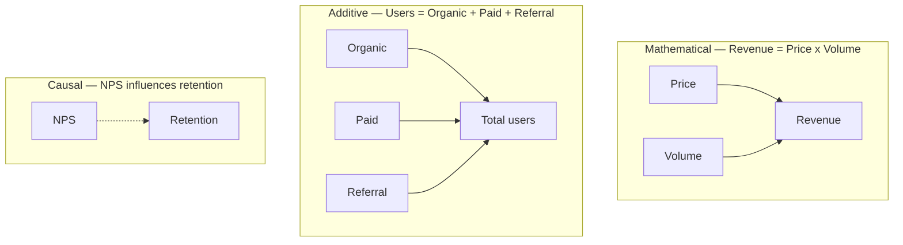
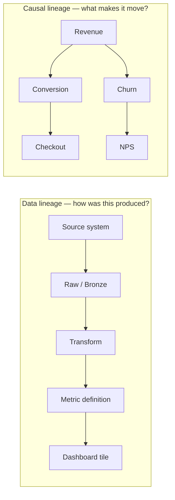

# Core concepts

Part of the [KPI Tree Guides capture](../kpitree-guides-capture.md). Grouping follows the [kpitree.co/guides](https://kpitree.co/guides) collection.

## Contents

- [5. North Star Metric: What It Is and How to Find Yours](#5-north-star-metric-what-it-is-and-how-to-find-yours---kpi-tree)
- [6. Leading vs Lagging Indicators Explained + Examples](#6-leading-vs-lagging-indicators-explained-examples---kpi-tree)
- [9. Metric Ownership: Who Should Own Which Metric](#9-metric-ownership-who-should-own-which-metric---kpi-tree)
- [10. Metric Decomposition](#10-metric-decomposition---kpi-tree)
- [22. KPI vs Metric: What Is the Difference?](#22-kpi-vs-metric-what-is-the-difference---kpi-tree)
- [31. Vanity Metrics vs Actionable Metrics: How to Tell the Difference](#31-vanity-metrics-vs-actionable-metrics-how-to-tell-the-difference---kpi-tree)
- [40. Input Metrics vs Output Metrics: Definitions, Examples](#40-input-metrics-vs-output-metrics-definitions-examples---kpi-tree)
- [130. Data Engagement: Connecting Data Intelligence to Behaviour Change](#130-data-engagement-connecting-data-intelligence-to-behaviour-change---kpi-tree)
- [131. Why Metric Trees Without Ownership Fail: The Behavioural Science](#131-why-metric-trees-without-ownership-fail-the-behavioural-science---kpi-tree)
- [136. Semantic Layer vs Business Context Layer](#136-semantic-layer-vs-business-context-layer---kpi-tree)
- [138. Statistical Driver Signals](#138-statistical-driver-signals---kpi-tree)
- [139. Verified Impact: Did the Action Actually Move the Metric?](#139-verified-impact-did-the-action-actually-move-the-metric---kpi-tree)
- [140. Decision Velocity: How Fast Your Team Turns Metrics Into Action](#140-decision-velocity-how-fast-your-team-turns-metrics-into-action---kpi-tree)
- [145. Metric Lineage vs Causal Lineage](#145-metric-lineage-vs-causal-lineage---kpi-tree)
- [146. Alerts vs Notification Systems](#146-alerts-vs-notification-systems---kpi-tree)

---

## 5. North Star Metric: What It Is and How to Find Yours - KPI Tree

### Provenance

- Requested source URL: [https://kpitree.co/guides/core-concepts/north-star-metric](https://kpitree.co/guides/core-concepts/north-star-metric)
- Final fetched URL: [https://kpitree.co/guides/core-concepts/north-star-metric](https://kpitree.co/guides/core-concepts/north-star-metric)
- Canonical URL: [https://kpitree.co/guides/core-concepts/north-star-metric](https://kpitree.co/guides/core-concepts/north-star-metric)
- Retrieval timestamp (UTC): 2026-08-26T07:46:54.252Z
- HTTP status: 200
- Page title: North Star Metric: What It Is and How to Find Yours - KPI Tree
- Meta description: Not present
- Full response SHA-256: `ec1f08b1056f523b68e79ecf563541c4e9d4f67de66efee25088d66c66f27428`
- Material fragment SHA-256: `a8a8d902e7e04151a8b0073537993ec3bee0391836747f9c73b05542ea93c241`

### Material

A North Star metric is the single measure that best captures the core value your business delivers. This guide explains how to choose one, avoid common pitfalls, and turn it into a system your teams can actually use.

*9 min read*

**Chapters**

- [North Star metric definition](#definition)
- [Why every business needs a North Star metric](#why-every-business-needs-one)
- [How to choose your North Star metric](#how-to-choose)
- [North Star metric examples by business model](#examples-by-business-model)
- [Common mistakes when choosing a North Star metric](#common-mistakes)
- [From North Star to metric tree](#from-north-star-to-metric-tree)
- [The one metric that matters vs the North Star](#omtm-vs-north-star)

### North Star metric definition

> **Definition.** A North Star metric is the single measure that best reflects the value your business creates for its customers. It sits at the top of your strategy, aligning every team around a shared outcome. When it moves, the business is growing in a way that matters. When it stalls, something fundamental needs attention.

The concept emerged from the growth teams at Silicon Valley technology companies in the early 2010s, but the underlying principle is far older. Peter Drucker argued decades ago that what gets measured gets managed. The North Star metric takes that idea to its logical conclusion: if you could only measure one thing, what would it be? The answer should capture the moment your product delivers real value to a real person. Not revenue in isolation, not vanity metrics like page views, but a measure that reflects genuine value exchange between your business and your customers.

What makes the North Star metric distinct from other high-level KPIs is its dual nature. It must reflect customer value and business value simultaneously. Revenue alone fails this test because a company can grow revenue through aggressive pricing while destroying customer goodwill. Monthly active users alone fails because users can be active without deriving meaningful value. The best North Star metrics sit at the intersection: they grow when customers get what they came for, and that growth translates directly into sustainable business performance.

This is not an academic exercise. Organisations that rally around a well-chosen North Star metric make faster decisions because every trade-off has a common reference point. Should we invest in acquisition or retention? Which will move the North Star more? Should we build feature A or feature B? Which one has a stronger causal path to the metric that matters? The North Star does not answer these questions automatically, but it provides the framework within which answers become clearer.

### Why every business needs a North Star metric

Most organisations suffer from metric sprawl. Every team tracks its own numbers, every dashboard tells a different story, and every quarterly review turns into a debate about which metric matters most. The result is not data-driven decision making. It is data-drowned paralysis. A North Star metric cuts through this by establishing a single source of strategic truth that everyone, from the board to individual contributors, can orient around.

- **Strategic alignment across teams** — When marketing, product, sales, and engineering all optimise for the same outcome, cross-functional conflict drops and collaboration becomes the default. Teams stop arguing about whose metric matters more and start asking how their work contributes to the shared goal.
- **Faster, clearer prioritisation** — Every initiative, feature, and experiment can be evaluated against a single question: does this move the North Star? This does not eliminate nuance, but it provides a consistent framework for making trade-offs without endless committee debates.
- **Early warning system** — A well-chosen North Star metric is a leading indicator of long-term business health. When it stalls or declines, it signals a problem before the financial statements catch up. This gives leadership time to investigate and respond rather than react to lagging outcomes.
- **Cultural clarity** — People do their best work when they understand what success looks like. A North Star metric gives every person in the organisation a tangible answer to the question "what are we trying to achieve?" That clarity compounds over time into a culture of focus and accountability.

### How to choose your North Star metric

Choosing the right North Star metric is one of the highest-leverage decisions a leadership team can make. Get it right, and it aligns hundreds of smaller decisions for years. Get it wrong, and you build an organisation that is optimising for the wrong thing. The criteria below will help you evaluate candidates and land on a metric that actually serves as a reliable compass.

1. **It reflects value delivered to customers**

   The metric should grow when customers genuinely benefit from your product or service. This is the most important criterion and the one most often violated. Revenue reflects value captured by the business, but it does not guarantee value delivered. A metric like "weekly active projects" or "messages sent" is closer to the moment of value delivery because it measures the customer actually using and benefiting from what you built.

2. **It correlates with long-term revenue**

   Customer value and business value must be linked. If your North Star goes up but revenue stays flat, you are measuring the wrong thing. Test this empirically: do cohorts with higher values of the metric retain longer, expand more, and generate more lifetime value? If the answer is yes, the correlation holds. If it does not, keep looking.

3. **Multiple teams can influence it**

   A North Star metric that only one team can move is just a team-level KPI with a grander name. The whole point is cross-functional alignment. Marketing should be able to influence it through acquisition quality. Product should be able to influence it through activation and engagement. Support should be able to influence it through retention. If it only lives in one department, it cannot serve as the organising principle for the business.

4. **It is measurable on a regular cadence**

   You need to be able to track it weekly, at minimum. Annual metrics like lifetime value are important for validation, but they are too slow for operational decisions. Choose something you can observe frequently enough to act on. If the metric only updates quarterly, you will not catch problems until it is too late to respond.

5. **It is simple enough to explain in one sentence**

   If you cannot explain the metric to a new hire in under thirty seconds, it is too complex to serve as a North Star. The metric needs to be understood intuitively by everyone in the organisation, not just the data team. Composite indices and weighted scores fail this test. "Weekly active teams" passes it. Simplicity is not a nice-to-have. It is a requirement for adoption.

One useful exercise is to list your top five candidate metrics and score each one against these criteria on a scale of one to five. The metric with the highest total score is usually the right choice, though judgement still matters. If two candidates score similarly, lean toward the one that is easier to decompose into drivers, because the real power of a North Star metric comes not from the number itself but from understanding the system of inputs that cause it to move.

A complementary test we recommend is the overnight drop exercise. Imagine the metric fell by fifteen percent in a single week with no obvious external cause. If every team in the building would want to understand why, you have a genuine North Star. If only one team would notice, you have a departmental KPI wearing a company-level label. The strongest North Star metrics pass both the scoring exercise and the overnight drop test, because they are simultaneously broad enough to align the organisation and specific enough that a meaningful decline triggers a cross-functional investigation.

### North Star metric examples by business model

The right North Star metric depends heavily on your business model. A SaaS company and a marketplace create value in fundamentally different ways, so the metric that captures that value creation will be different too. The table below shows common patterns, but treat these as starting points, not prescriptions. Your specific context, stage, and competitive dynamics should shape the final choice.

| Business model | Typical North Star metric | Why it works |
| --- | --- | --- |
| B2B SaaS | Weekly Active Teams / ARR | Captures product engagement at the team level, reflecting genuine usage rather than just purchased seats. |
| Consumer subscription | Weekly Active Users (WAU) | Measures habitual engagement, which predicts retention and lifetime value in subscription models. |
| E-commerce | [Purchase frequency](https://kpitree.co/glossary/ecommerce-metrics/purchase-frequency) per customer | Goes beyond single transactions to measure repeat behaviour, which drives lifetime value. |
| Marketplace | [Gross Merchandise Volume](https://kpitree.co/glossary/financial-metrics/gross-merchandise-volume) (GMV) | Captures total value flowing through the platform, reflecting health on both supply and demand sides. |
| Ad-supported media | Total engaged time | Time spent reflects content value, and directly drives ad inventory and revenue potential. |
| Fintech / banking | Monthly transacting users | Measures active financial engagement, which correlates with trust, retention, and revenue generation. |

Notice that none of these examples are pure revenue metrics. That is deliberate. Revenue is a lagging indicator of value delivery. By the time revenue declines, the underlying problem, whether it is engagement, activation, or retention, has been building for weeks or months. A good North Star metric sits upstream of revenue, close enough to the customer experience that it moves before the financial impact materialises.

B2B SaaS companies face a particularly interesting choice. ARR is the metric the board cares about, and for good reason. But ARR on its own does not tell you whether customers are deriving value. A company can grow ARR through aggressive sales while customer engagement deteriorates. That is why many mature SaaS organisations use a usage-based North Star, such as weekly active teams or features adopted per account, as the leading indicator and track ARR as the lagging financial confirmation.

For marketplaces, GMV works because it reflects the health of both sides simultaneously. If sellers are not listing, GMV drops. If buyers are not purchasing, GMV drops. It is a natural barometer of marketplace vitality. The challenge is that GMV can be inflated by a small number of high-value transactions, so many marketplaces pair it with transaction count or active buyer-seller pairs as secondary checks.

### Common mistakes when choosing a North Star metric

Choosing a North Star metric seems straightforward in theory. In practice, organisations consistently fall into the same traps. Recognising these patterns before you commit to a metric can save months of misaligned effort.

- **Choosing a vanity metric** — Total registered users, page views, and app downloads feel impressive in board decks but tell you nothing about value delivery. They only go up, which makes them useless as a compass. A metric that cannot decline cannot signal a problem.
- **Picking revenue as the North Star** — Revenue is the outcome you want, not the metric you should optimise directly. When teams optimise for revenue above all else, they cut corners on customer experience, over-index on short-term extraction, and miss the upstream signals that predict sustainable growth. Revenue belongs in the tree, but usually one level down from the true North Star.
- **Selecting a metric only one team controls** — If only the product team can influence your North Star, it is a product metric, not a company metric. The whole point is cross-functional alignment. A metric that marketing, sales, product, and support can all contribute to creates shared ownership. A metric owned by one team creates a hierarchy where that team matters and others are peripheral.
- **Changing it every quarter** — A North Star metric should be stable for at least twelve to eighteen months. If you change it every quarter, teams never build the muscle memory, systems, and intuition needed to actually move it. Some recalibration is natural as the business evolves, but frequent changes signal that the leadership team has not done the hard work of choosing correctly.
- **Confusing the North Star with a target** — The North Star is a metric, not a goal. "Weekly active teams" is a North Star. "10,000 weekly active teams by Q4" is a target set against that metric. Conflating the two leads to a dangerous dynamic where teams hit the target through gaming rather than genuine improvement. The metric should be chosen for its diagnostic value, not its aspirational appeal.
- **Treating the North Star as sufficient on its own** — A single number, no matter how well chosen, cannot guide operational decisions across an entire business. The North Star tells you where to go, but without decomposition into drivers and sub-drivers, teams have no line of sight from their daily work to the outcome that matters. This is the most common and most costly mistake.

### From North Star to metric tree

Here is the uncomfortable truth about North Star metrics: knowing the number is not the same as knowing what to do about it. Suppose your North Star is weekly active teams, and last week it dropped by 8%. What do you do? The metric itself gives you no guidance. Is it an acquisition problem? An activation problem? A retention problem? A product quality issue? A seasonal pattern? The North Star tells you something is wrong. It does not tell you where to look.

This is where most organisations stall. They choose a North Star metric, celebrate the alignment it creates, and then discover that a single number is too abstract to drive daily decisions. The marketing team does not know how their campaigns connect to it. The engineering team does not know which bugs to prioritise. The support team does not know whether their response time improvements actually matter. Everyone is aligned on the destination, but nobody has a map.

The solution is decomposition. A North Star metric needs to be broken down into the drivers, sub-drivers, and operational inputs that cause it to move. This decomposition creates a metric tree, a hierarchical model where every metric is connected to the ones above and below it through causal relationships. The North Star sits at the root. Beneath it, each branch represents a different pathway through which teams create value.

- Revenue
  - New Customers
    - Website Visitors
      - Organic Traffic
      - Paid Traffic
    - Visitor-to-Trial Rate
    - Trial-to-Paid Rate
  - Avg Revenue per Customer
    - Plan Mix
    - Expansion Revenue
  - Retention Rate
    - Product Engagement
    - Support Satisfaction

In the tree above, revenue decomposes into three drivers: new customers, average revenue per customer, and retention rate. Each of those decomposes further into the specific inputs that teams can influence. A marketing manager can see exactly how organic traffic and paid traffic feed into website visitors, which feed into new customers, which feed into revenue. An engineer working on onboarding can trace how trial-to-paid conversion connects to new customer acquisition. A support lead can see how their satisfaction scores influence retention.

This is the critical shift. A metric tree turns a single number into a system of actionable levers. Without it, the North Star is a motivational poster. With it, the North Star becomes a navigable model where every person can see their contribution to the outcome that matters.

> **Key insight.** The North Star metric tells you where to go. The metric tree shows you how to get there. Every organisation that successfully operationalises a North Star eventually builds some form of decomposition beneath it. The question is whether that decomposition lives in someone's head, in scattered spreadsheets, or in a structured, shared model that the entire organisation can navigate.

Decomposition also reveals leverage. Not all inputs have equal impact on the North Star. When you map the full tree and connect it to real data, you can measure the correlation strength of each relationship. You might discover that improving trial-to-paid conversion by 10% has twice the impact on revenue as increasing website traffic by 10%. That insight changes how you allocate resources, where you focus engineering effort, and which experiments you prioritise. Without the tree, these leverage points remain hidden inside aggregate numbers.

The practical implication is straightforward: do not stop at choosing a North Star metric. The real work begins when you ask "what causes this to move?" and keep asking until you reach the operational inputs your teams control every day. That chain of cause and effect, from North Star to daily levers, is the metric tree. It is what turns strategy into execution.

### The one metric that matters vs the North Star

The concept of the One Metric That Matters (OMTM) was popularised by Alistair Croll and Benjamin Yoskovitz in "Lean Analytics." It is often used interchangeably with the North Star metric, but the two concepts serve different purposes and operate at different time horizons.

The OMTM is stage-specific. It changes as your company moves through different phases of growth. A pre-product-market-fit startup might focus on [activation rate](https://kpitree.co/glossary/saas-metrics/activation-rate). A company scaling acquisition might focus on [cost per acquisition](https://kpitree.co/glossary/marketing-metrics/cost-per-acquisition). A mature business optimising profitability might focus on [gross margin](https://kpitree.co/glossary/financial-metrics/gross-profit-margin). The OMTM is the metric that matters most right now, given where the business is today.

The North Star metric, by contrast, is meant to be durable. It represents the fundamental value your business creates and should remain stable for twelve months or longer. It does not change when your focus shifts from acquisition to retention, because both acquisition and retention are inputs that feed into it.

The relationship between the two is hierarchical. Your North Star metric sits at the top of your metric tree. Your OMTM is the specific branch of that tree where you are focusing effort right now. The North Star provides the enduring compass. The OMTM provides the current marching orders. An organisation might keep "weekly active teams" as its North Star for three years while shifting its OMTM from activation to engagement to expansion as each becomes the binding constraint.

This distinction matters because it resolves a common tension. Teams often struggle with the instruction to have "one metric that matters" when their focus naturally shifts over time. The answer is that both concepts are valid, but they operate at different levels. The North Star is the metric that always matters. The OMTM is the metric that matters most this quarter. When you have both, strategy and execution stay connected without creating the rigidity that comes from treating a single metric as sacred regardless of context.

### Continue reading

- [What is a metric tree?](./getting-started.md#1-what-is-a-metric-tree---kpi-tree)
  - A metric tree maps cause and effect so every team sees what moves the needle
- [How to build a metric tree](./getting-started.md#2-how-to-build-a-metric-tree-kpi-tree---kpi-tree)
  - A step-by-step metric tree and KPI tree template from North Star to daily levers
- [Metric tree examples](./getting-started.md#3-metric-tree-examples-for-every-business-model---kpi-tree)
  - Metric tree examples for SaaS, e-commerce, marketplace, and B2B models you can copy

---

---

## 6. Leading vs Lagging Indicators Explained + Examples - KPI Tree

### Provenance

- Requested source URL: [https://kpitree.co/guides/core-concepts/leading-vs-lagging-indicators](https://kpitree.co/guides/core-concepts/leading-vs-lagging-indicators)
- Final fetched URL: [https://kpitree.co/guides/core-concepts/leading-vs-lagging-indicators](https://kpitree.co/guides/core-concepts/leading-vs-lagging-indicators)
- Canonical URL: [https://kpitree.co/guides/core-concepts/leading-vs-lagging-indicators](https://kpitree.co/guides/core-concepts/leading-vs-lagging-indicators)
- Retrieval timestamp (UTC): 2026-08-26T07:46:54.252Z
- HTTP status: 200
- Page title: Leading vs Lagging Indicators Explained + Examples - KPI Tree
- Meta description: Not present
- Full response SHA-256: `042ea82dca3c01cc3fb6ad4c17586fde3c619b4d25e2be3381842bbb3f0440ad`
- Material fragment SHA-256: `0d2386bf58fc3a1f9d7f68c83d2beb6bd40788b4c99ca54c5c5c7de035903d33`

### Material

Understand the difference between leading and lagging indicators, why both matter, and how a metric tree makes the causal chain between them visible, navigable, and actionable.

*8 min read*

**Chapters**

- [Definition](#definition)
- [The fundamental difference](#the-fundamental-difference)
- [Why most teams get the balance wrong](#why-teams-get-it-wrong)
- [How leading and lagging indicators connect in a metric tree](#how-they-connect)
- [Leading indicator examples by function](#examples-by-function)
- [How to identify the right leading indicators](#how-to-identify)
- [The behavioural case for leading indicators](#behavioural-case)

### Definition

> **Definition.** A leading indicator is a metric that changes before an outcome is realised. It measures activity, behaviour, or conditions that predict future results. A lagging indicator is a metric that measures an outcome after it has occurred. It confirms whether past actions produced the intended result.

The distinction between leading and lagging indicators is one of the most important concepts in performance management, yet it is routinely misunderstood. Most teams treat it as a binary classification: some metrics are leading, some are lagging, and you should track both. That framing is not wrong, but it misses the deeper point. Whether a metric is leading or lagging depends entirely on what you are trying to predict. Pipeline value is a leading indicator of revenue but a lagging indicator of the outbound activity that created it. Activation rate leads to retention but lags behind onboarding quality. The same metric can play both roles depending on where it sits in the causal chain.

This is why the leading versus lagging distinction only becomes truly useful when you can see the full chain of cause and effect. A metric in isolation is just a number. A metric placed inside a structure that shows what it drives and what drives it becomes a signal you can act on. That structure is a metric tree, and the relationship between leading and lagging indicators is exactly what a metric tree is designed to make visible.

### The fundamental difference

|  | Leading indicators | Lagging indicators |
| --- | --- | --- |
| Timing | Change before the outcome | Change after the outcome |
| Control | Directly influenceable by teams | Result of upstream actions |
| Purpose | Predict and prevent | Confirm and measure |
| Examples | Pipeline created, demos booked, feature adoption, onboarding completion | Revenue, [churn rate](https://kpitree.co/glossary/saas-metrics/churn-rate), [NPS](https://kpitree.co/glossary/product-metrics/net-promoter-score), profit margin |
| Risk if used alone | Activity without outcomes: teams stay busy but miss the target | Delayed feedback: problems surface too late to correct course |
| Behavioural effect | Creates a sense of agency and forward momentum | Creates accountability but can trigger blame when results disappoint |

The most practical way to think about this distinction is through the lens of influence and timing. Leading indicators are the metrics your teams can change through their daily work. They are forward-looking, controllable, and responsive. When a sales team increases the number of discovery calls this week, they are moving a leading indicator. The effect on closed revenue will not appear for weeks or months, but the leading signal tells them whether they are on track.

Lagging indicators, by contrast, are the scoreboard. They tell you whether all the upstream activity produced the result you wanted. Revenue, retention, and customer lifetime value are classic lagging indicators because no team can move them directly. They are the consequence of hundreds of decisions, behaviours, and inputs that happened earlier in the chain. You cannot improve retention by willing it to be higher. You improve it by finding and influencing the leading indicators that cause it to move.

The trap most organisations fall into is treating lagging indicators as the primary management tool. Quarterly revenue targets, annual churn goals, and monthly NPS scores dominate executive reviews. These numbers are important, but by the time you see them, the window for intervention has already closed. The quarter is over. The customer has already left. The detractor has already posted their review. Leading indicators give you the chance to act while there is still time to change the outcome.

### Why most teams get the balance wrong

There is a well-documented asymmetry in how organisations treat leading and lagging indicators. Lagging indicators dominate board packs, investor updates, and performance reviews because they feel more concrete. Revenue is indisputable. Churn is measurable. Profit is real. Leading indicators, by comparison, feel softer. How many discovery calls is "enough"? Does onboarding completion actually predict retention? Is pipeline quality a real metric or just a guess?

This preference for lagging indicators is understandable but costly. When you manage exclusively by outcomes, you create a culture of post-mortems rather than a culture of prevention. Teams learn what went wrong last quarter instead of what they should do differently this week. The feedback loop is too slow for meaningful course correction. It is like driving a car by only looking in the rear-view mirror: you can see where you have been, but you cannot steer where you are going.

The opposite failure mode is equally problematic. Some teams over-index on activity metrics and lose sight of outcomes entirely. They celebrate the number of emails sent, features shipped, or campaigns launched without ever asking whether those activities produced the intended result. Activity without accountability is just motion. The goal is not to replace lagging indicators with leading ones but to connect them so that every leading metric has a clear line of sight to the outcome it is supposed to influence.

- **Outcome obsession** — The organisation tracks revenue, retention, and NPS religiously but has no visibility into the upstream inputs that drive them. When numbers drop, nobody knows why until weeks of investigation have passed. Every review meeting is a post-mortem.
- **Activity theatre** — Teams track calls made, emails sent, and features shipped but never validate whether those activities connect to business outcomes. Everyone looks busy, but the scoreboard does not move. Volume is celebrated regardless of impact.
- **Disconnected metrics** — Different teams track different metrics in different tools with no shared model connecting them. Marketing measures MQLs, Sales measures pipeline, Product measures engagement, but nobody can trace the full chain from activity to outcome.
- **Vanity leading indicators** — The organisation selects leading indicators that are easy to measure rather than ones that genuinely predict outcomes. Website traffic feels like a leading indicator for revenue, but without conversion data linking the two, it is just a number going up.

### How leading and lagging indicators connect in a metric tree

A metric tree resolves the tension between leading and lagging indicators by placing them in the same structure and showing exactly how they relate. The lagging outcome sits at the top of the tree. As you decompose it downward through successive layers, each level becomes more leading, more controllable, and more responsive. The bottom of the tree is where daily work happens. The top is where quarterly results appear. The branches in between are the causal chain that connects the two.

Consider revenue as the lagging indicator at the root. It decomposes into new customer revenue and existing customer revenue. New customer revenue decomposes into pipeline value and win rate. Pipeline value decomposes into the number of qualified opportunities, which decomposes into the number of demos booked, which decomposes into the number of outbound sequences sent. Each step down the tree moves you from a lagging outcome you cannot directly control to a leading input that a specific person or team can influence today.

This is the critical insight: leading and lagging are not fixed categories. They are relative positions in a causal chain. Every metric in the tree is simultaneously a lagging indicator of the metrics below it and a leading indicator of the metrics above it. Win rate is a lagging indicator of demo quality but a leading indicator of revenue. When you can see this full chain, the old debate about "should we track leading or lagging indicators?" dissolves. You track the entire chain and assign ownership at every level.

- Revenue (Lagging)
  - New Customer Revenue
    - Pipeline Value
      - Qualified Opportunities
        - Demos Booked
        - Outbound Sequences Sent (Leading)
    - Win Rate
  - Existing Customer Revenue
    - Net Revenue Retention
      - Expansion Revenue
      - Churn Rate
        - Product Adoption Score
        - Support Ticket Volume (Leading)

The metric tree above illustrates how revenue, a lagging indicator that no single team controls, traces downward through increasingly leading metrics until you reach the activities that happen this week. Outbound sequences sent is something a sales development representative does on Monday morning. Support ticket volume is something a customer success team monitors in real time. These are the leading edge of the business, the earliest signals that something is working or something is breaking.

Without the tree, these leading indicators sit in isolated dashboards. A spike in support tickets is a customer success problem. A drop in demos booked is a sales problem. But when both are placed in the same tree, connected to the same revenue outcome, the organisation can see that these are not separate problems. They are different branches of the same system. The tree makes the connection between daily work and quarterly outcomes not just theoretically obvious but visually navigable. Anyone in the organisation can trace from the top down to understand why a number changed, or from the bottom up to understand the impact of their work.

### Leading indicator examples by function

Leading indicators vary significantly by function because each team operates at a different point in the causal chain. The most useful leading indicators are the ones that genuinely predict the outcomes that matter to the business, validated by data rather than assumed by intuition. Below are examples of leading indicators by function, each chosen because it typically precedes and predicts a meaningful lagging outcome.

- **Sales** — Discovery calls completed, qualified pipeline created, proposal-to-close ratio, average deal cycle length, and multi-threaded opportunities. These lead to closed revenue, [quota attainment](https://kpitree.co/glossary/sales-metrics/quota-attainment), and [average contract value](https://kpitree.co/glossary/sales-metrics/average-contract-value). The earlier in the sales cycle you measure, the more time you have to intervene.
- **Marketing** — Marketing qualified leads, content engagement rate, cost per qualified lead, landing page conversion rate, and email reply rate. These lead to pipeline generated, [customer acquisition cost](https://kpitree.co/glossary/saas-metrics/customer-acquisition-cost), and marketing-sourced revenue. The best marketing leading indicators measure quality, not just volume.
- **Product** — [Feature adoption rate](https://kpitree.co/glossary/product-metrics/feature-adoption-rate), onboarding completion rate, [time to value](https://kpitree.co/glossary/product-metrics/time-to-value), weekly active usage, and [activation rate](https://kpitree.co/glossary/saas-metrics/activation-rate). These lead to retention, [expansion revenue](https://kpitree.co/glossary/saas-metrics/expansion-revenue), and [net promoter score](https://kpitree.co/glossary/product-metrics/net-promoter-score). Product leading indicators are powerful because they are measurable at scale and respond quickly to changes.
- **Customer Success** — Health score trend, support ticket frequency, time since last engagement, product usage decline, and QBR completion rate. These lead to [net revenue retention](https://kpitree.co/glossary/saas-metrics/net-revenue-retention), churn rate, and [customer lifetime value](https://kpitree.co/glossary/saas-metrics/customer-lifetime-value). The strongest customer success leading indicators detect risk before the customer has decided to leave.
- **Finance** — [Burn rate](https://kpitree.co/glossary/saas-metrics/burn-rate), [cash runway](https://kpitree.co/glossary/saas-metrics/cash-runway), operating leverage ratio, gross margin trend, and accounts receivable ageing. These lead to profitability, [free cash flow](https://kpitree.co/glossary/financial-metrics/free-cash-flow), and capital efficiency. Finance leading indicators are often overlooked in high-growth companies but become critical at scale.

### How to identify the right leading indicators

Choosing the right leading indicators is more important than tracking more of them. A poorly chosen leading indicator gives false confidence. It moves in the right direction while the outcome it is supposed to predict does not follow. The steps below help you identify leading indicators that genuinely predict the outcomes you care about, rather than simply measuring activity for its own sake.

1. **Start with the lagging outcome you want to influence**

   Every leading indicator must connect to a specific outcome. Begin by identifying the lagging indicator that matters most: revenue, retention, customer lifetime value, or whatever your business optimises for. This gives you a clear destination. Without it, you risk selecting leading indicators that are easy to measure but irrelevant to the result.

2. **Map the causal chain backwards**

   Ask repeatedly: what has to happen before this metric moves? Revenue requires closed deals. Closed deals require proposals. Proposals require qualified opportunities. Qualified opportunities require discovery calls. Each step back moves you closer to the leading edge. Stop when you reach something a person or team can directly control through their daily work. That is your candidate leading indicator.

3. **Validate with historical data**

   A causal hypothesis is not enough. Use your data to test whether changes in the candidate leading indicator actually precede changes in the lagging outcome. Look for correlation, lag time, and consistency. If onboarding completion rate has historically predicted 90-day retention with a two-week lag, you have a strong leading indicator. If the correlation is weak or inconsistent, the causal chain may have a missing link.

4. **Check for controllability**

   A good leading indicator must be something a team can directly influence. If the metric moves due to external factors, seasonality, or market conditions rather than team actions, it is not actionable as a leading indicator. The most useful leading indicators respond to effort within days or weeks, giving teams a tight feedback loop between action and signal.

5. **Test for gaming resistance**

   Any metric that becomes a target risks being gamed. Before committing to a leading indicator, consider how someone might inflate it without creating real value. If discovery calls become a target, will reps book low-quality calls just to hit the number? Pair leading indicators with quality gates or complementary metrics that detect gaming. The best leading indicators are hard to move without doing genuinely valuable work.

### The behavioural case for leading indicators

The argument for leading indicators is not only strategic. It is deeply behavioural. Decades of research in organisational psychology and behavioural science show that people perform better when they receive fast, frequent feedback on actions they can control. This is the principle behind every effective feedback loop, from video games to athletic training to surgical checklists. The closer the signal is to the behaviour, the faster people learn and adjust.

Lagging indicators violate this principle. They arrive weeks or months after the actions that caused them, making it nearly impossible for individuals to connect what they did with what happened. A sales representative who learns in March that their Q4 pipeline conversion was below target cannot go back and change the discovery calls they ran in October. The feedback is accurate but useless for behaviour change. It is like telling a goalkeeper which way to dive after the ball is already in the net.

Leading indicators restore the feedback loop. When a customer success manager can see this week that product adoption scores are declining in three accounts, they can intervene now, before those accounts become churn statistics next quarter. When a product team can see that onboarding completion dropped after their latest release, they can investigate and fix it before retention data confirms the damage. The behavioural shift is profound: people move from reactive to proactive, from explaining what went wrong to preventing it from going wrong in the first place.

There is also a motivational dimension grounded in self-determination theory. People are more engaged when they feel a sense of autonomy, competence, and progress. Leading indicators provide all three. They give individuals visibility into metrics they can actually influence (autonomy), evidence that their actions are producing results (competence), and a forward-looking trajectory that shows momentum (progress). Lagging indicators, on the other hand, often produce learned helplessness. When the only metric you see is a quarterly outcome you cannot directly control, the natural response is to disengage. You did your best, the number came in below target, and there was nothing more you could have done.

Organisations that embed leading indicators into their operating rhythm report faster decision-making, higher team engagement, and fewer surprises at the end of the quarter. This is not because leading indicators are inherently more important than lagging ones. It is because they operate on a timescale that matches human behaviour. People act in days and weeks, not quarters and years. The metrics they see should match the cadence at which they can respond.

> “The most effective organisations do not choose between leading and lagging indicators. They build the causal chain that connects the two, so that every person can see how their daily actions feed into quarterly outcomes. The metric tree is that chain, made visible.”

### Continue reading

- [What is a metric tree?](./getting-started.md#1-what-is-a-metric-tree---kpi-tree)
  - A metric tree maps cause and effect so every team sees what moves the needle
- [How to build a metric tree](./getting-started.md#2-how-to-build-a-metric-tree-kpi-tree---kpi-tree)
  - A step-by-step metric tree and KPI tree template from North Star to daily levers
- [What is a North Star metric?](#5-north-star-metric-what-it-is-and-how-to-find-yours---kpi-tree)
  - Choose the right north star metric and make it actionable

---

---

## 9. Metric Ownership: Who Should Own Which Metric - KPI Tree

### Provenance

- Requested source URL: [https://kpitree.co/guides/core-concepts/metric-ownership](https://kpitree.co/guides/core-concepts/metric-ownership)
- Final fetched URL: [https://kpitree.co/guides/core-concepts/metric-ownership](https://kpitree.co/guides/core-concepts/metric-ownership)
- Canonical URL: [https://kpitree.co/guides/core-concepts/metric-ownership](https://kpitree.co/guides/core-concepts/metric-ownership)
- Retrieval timestamp (UTC): 2026-08-26T07:46:54.252Z
- HTTP status: 200
- Page title: Metric Ownership: Who Should Own Which Metric - KPI Tree
- Meta description: Not present
- Full response SHA-256: `4121d459b2e82519507426fb815dbc7f5c98f4d6af38dfef75629a9ae6ff6c4e`
- Material fragment SHA-256: `432eff172d2d7e7a268082815c1b776a961d0a4996ea13066e4ad880c9297ef2`

### Material

Most organisations track hundreds of metrics but few have a named person accountable for each one. This guide provides a practical framework for assigning and managing metric ownership using a metric tree as the structural backbone.

*8 min read*

**Chapters**

- [The accountability gap](#the-accountability-gap)
- [Why ownership changes behaviour](#why-ownership-changes-behaviour)
- [The RACI model for metrics](#raci-model)
- [How to assign metric ownership using a metric tree](#how-to-assign)
- [Common ownership mistakes](#common-mistakes)
- [What happens when ownership works](#what-happens)

### The accountability gap

> **The problem.** Most metrics in most organisations have no named owner. They are tracked, reported, and discussed, but nobody is specifically accountable for understanding why they move or for taking action when they do. The result is a gap between insight and action that no dashboard can close.

Behavioural science has a name for what happens when responsibility is shared broadly but assigned to nobody in particular: diffusion of responsibility. First documented by Darley and Latane in 1968, this phenomenon explains why individuals are less likely to take action when they assume others will. In the original research, it was studied in emergency situations. In organisations, it plays out in weekly meetings where a metric flashes red and the room waits for someone else to investigate.

The bystander effect, closely related, describes the same pattern in groups. The more people who see a problem, the less likely any single person is to act. Applied to business metrics, this means that a dashboard visible to fifty people is less likely to trigger action than a single alert sent to one named owner. Visibility is not the same as responsibility. Sharing a metric with a broader audience can actually reduce the probability that anyone does something about it.

This is the accountability gap. Organisations invest heavily in data infrastructure, analytics tools, and reporting layers. They build dashboards for every team and every meeting cadence. But the behavioural layer, the part that connects a moving number to a person who will investigate and act, is almost always missing. The gap is not a technology problem. It is an organisational design problem.

The fix is deceptively simple: assign a named human being to every metric that matters. Not a team. Not a department. A person. When you do this, and when the person knows they are the owner, the Hawthorne effect kicks in. People behave differently when they know they are being observed, and metric ownership creates a form of continuous, structured observation that changes how people relate to data.

### Why ownership changes behaviour

Assigning a name to a metric does more than clarify who is responsible. It activates a set of psychological mechanisms that collectively transform how people engage with data. These mechanisms are not speculative. They are well-documented in organisational psychology and behavioural economics, and they explain why metric ownership produces outsized returns relative to the effort involved.

- **Attention** — People pay attention to what they own. When a metric has your name on it, it moves from background noise to foreground priority. You notice changes faster, you ask better questions about what caused them, and you build an intuitive feel for what normal looks like. Without ownership, metrics compete for attention in a crowded dashboard and most of them lose.
- **Agency** — Ownership creates a sense of control. When someone owns a metric, they begin to think in terms of levers: what can I do to move this number? This shift from passive observation to active management is the difference between a data consumer and a decision-maker. Agency is also self-reinforcing. The more someone acts on a metric and sees results, the more confident and proactive they become.
- **Accountability** — Named responsibility increases follow-through. Research on accountability consistently shows that people are more likely to complete tasks and honour commitments when they know a specific person will review the outcome. Metric ownership creates this structure naturally. The owner knows their metric will be discussed, their actions will be visible, and their progress will be tracked.
- **Learning** — Owners build deep understanding over time. A person who owns a metric for six months develops pattern recognition that no dashboard can replicate. They know what seasonal effects look like. They remember what happened last time the number moved in a particular direction. They understand the second and third-order effects of interventions. This accumulated knowledge is one of the most valuable assets an organisation can build.

These four mechanisms compound. An owner who pays attention develops agency. Agency combined with accountability drives action. Action produces learning. And learning improves future attention. The cycle accelerates over time, which is why long-tenured metric owners tend to be dramatically more effective than new ones. Organisations that rotate ownership too frequently pay a hidden cost: they restart the learning cycle every time.

### The RACI model for metrics

RACI is a well-established framework for clarifying roles in projects and processes. It stands for Responsible, Accountable, Consulted, and Informed. Most people encounter it in project management, where it defines who does the work, who signs off, who gives input, and who needs to know. Applied to metrics, RACI solves a problem that a simple "owner" field cannot: it distinguishes between different types of involvement.

A single owner field is better than nothing, but it collapses several distinct roles into one. The person who takes day-to-day action on a metric is often not the same person who is ultimately answerable for its performance. The data engineer who maintains the pipeline is different from the product manager who decides what to build. The VP who reports the number to the board is different from the analyst who investigates why it moved. RACI separates these roles so that each person knows exactly what is expected of them.

| Role | Definition for metrics | Example |
| --- | --- | --- |
| Responsible | The person who takes action when the metric moves. They investigate root causes, propose interventions, and execute changes. This is the hands-on operator. | A growth marketer who runs experiments to improve conversion rate. |
| Accountable | The single person who is ultimately answerable for the metric's performance. They do not necessarily do the work, but they own the outcome and make final decisions when trade-offs arise. | The VP of Marketing who owns the pipeline target and decides budget allocation. |
| Consulted | People with expertise or context that should be sought before decisions are made. They provide input but do not own the outcome. Communication is two-way. | A data analyst who can run segmented analysis to diagnose why a metric changed. |
| Informed | Stakeholders who need to know when the metric changes significantly but do not need to take action or provide input. Communication is one-way. | The CEO who receives a weekly summary of all North Star metrics and their status. |

The most common mistake with RACI is having multiple people in the Accountable role. Accountability by definition must sit with a single individual. The moment two people are "co-accountable" for a metric, you have recreated the diffusion of responsibility problem that RACI was designed to solve. If accountability must be shared because the metric sits at the intersection of two functions, that is a signal that the metric should be decomposed further until each component has a clear single owner.

Another frequent error is confusing Responsible and Accountable. In many organisations, the same person fills both roles for a given metric. That is fine for operational metrics deep in the tree. But for higher-level metrics, separating the two creates a healthy tension: the accountable person sets direction and makes trade-offs, while the responsible person executes and reports back. This separation is especially important when the metric spans multiple teams or requires cross-functional coordination.

### How to assign metric ownership using a metric tree

A metric tree makes ownership assignment obvious in a way that a flat list of metrics never can. The hierarchical structure mirrors organisational structure naturally: executives own the top of the tree, functional leaders own the branches, and individual contributors own the leaves. The person closest to the lever should own the metric. Here are five steps to assign ownership systematically.

1. **Start at the top and work downward**

   Begin with your North Star metric and assign accountability to the most senior leader whose remit covers the entire outcome. For most companies, the CEO or CRO is accountable for revenue. The CFO may be accountable for profitability. The CPO may be accountable for product adoption or engagement. Starting at the top establishes the principle that ownership follows the tree structure and prevents gaps from forming between levels.

2. **Match each branch to a functional owner**

   As you move down the tree, each branch naturally maps to a function or team. New customer acquisition maps to marketing and sales. [Expansion revenue](https://kpitree.co/glossary/saas-metrics/expansion-revenue) maps to customer success or product. Churn maps to support and product. At each branching point, ask: who has the most direct influence over this number? That person becomes accountable for the branch. If two functions share influence, decompose the metric further until a single owner is clear.

3. **Assign leaf-level ownership to individual contributors**

   The bottom of the tree should contain metrics that a single person can directly influence through their daily work. [Conversion rate](https://kpitree.co/glossary/marketing-metrics/conversion-rate) on a specific landing page. [Average handle time](https://kpitree.co/glossary/customer-support-metrics/average-handle-time) for a support queue. [Activation rate](https://kpitree.co/glossary/saas-metrics/activation-rate) for a particular onboarding flow. These metrics belong to the people doing the work, not their managers. Ownership at this level is where the biggest behavioural impact occurs, because these are the metrics where action can happen immediately.

4. **Fill in the RACI for each node**

   Once you have assigned the accountable person for each metric, work through the other RACI roles. Who is responsible for day-to-day action? Who should be consulted when the metric moves unexpectedly? Who needs to be informed? For leaf-level metrics, the accountable and responsible person may be the same individual. For higher-level metrics, these roles will typically be filled by different people at different levels of seniority.

5. **Review for overload and gaps**

   After completing the assignment, audit the result. Look for individuals who own too many metrics. If one person is accountable for fifteen nodes, they cannot give meaningful attention to any of them. Look for metrics with no owner, which signals either that the metric is not important enough to be in the tree or that there is an organisational gap. Look for metrics where the owner has no authority to act, which signals a mismatch between responsibility and empowerment.

- Revenue (CEO / CRO)
  - New Customer Revenue (VP Sales)
    - Pipeline Value (Head of Sales)
      - Outbound Meetings (SDR Manager)
      - Inbound Leads (Growth Lead)
    - Win Rate (Sales Director)
      - Demo-to-Proposal Rate (AE Lead)
      - Proposal-to-Close Rate (AE Lead)
  - Expansion Revenue (VP Customer Success)
    - Upsell Rate (CS Manager)
    - Usage Growth (Product Manager)
  - Retained Revenue (VP Customer Success)
    - Gross Churn Rate (CS Manager)
    - NPS (Support Lead)

Notice how the tree structure makes the assignment intuitive. Each level of depth corresponds roughly to a level of organisational seniority. The CEO owns the root. VPs own the first-level branches. Directors and managers own the sub-branches. Individual contributors own the leaves. This alignment is not a coincidence. It reflects the fact that a well-designed metric tree mirrors how decisions flow through an organisation. The person who can pull the lever should own the metric attached to it.

The tree also makes gaps and conflicts visible. If two branches converge on the same metric, that is a structural problem in the tree, not just an ownership problem. If a branch has no natural owner, it may indicate that the organisation lacks a function to manage that part of the business. The act of assigning ownership is, in itself, a diagnostic exercise that reveals misalignments between how the business works and how it is organised.

### Common ownership mistakes

Getting ownership wrong is often worse than having no ownership at all, because it creates a false sense of accountability. The organisation believes the metric is covered when it is not. These are the most common patterns that undermine effective metric ownership.

- **Assigning ownership to teams instead of individuals** — When a metric is owned by "the marketing team" or "the product team," it is owned by nobody. Diffusion of responsibility applies within teams just as it does across organisations. Every person assumes someone else on the team is watching the number. The fix is always the same: pick one person. They can delegate investigation and action, but one name must be on the line.
- **Giving someone ownership without authority** — Ownership without authority to act is responsibility without power. If a product manager owns activation rate but cannot prioritise onboarding improvements because the roadmap is controlled by someone else, the ownership is performative. Before assigning a metric, verify that the owner has the budget, the decision rights, or the influence needed to actually move the number.
- **Making one person own too many metrics** — There is a practical limit to how many metrics a single person can meaningfully own. When someone is accountable for fifteen or twenty metrics, they cannot give sustained attention to any of them. The result looks like ownership on paper, but in practice the person triages reactively and the less urgent metrics are ignored. A reasonable ceiling is three to five metrics per individual, depending on their role and seniority.
- **Not distinguishing between owning the metric and owning the data** — The person who maintains the data pipeline for a metric is not the same as the person who owns its business performance. Data ownership is about accuracy, freshness, and reliability. Metric ownership is about understanding why the number moves and taking action to improve it. Conflating the two means either the data team is blamed for business outcomes they cannot control, or the business team neglects data quality because they assume the data team handles it.
- **Ownership without a feedback loop** — Assigning an owner is only the first step. Without a structured feedback loop, ownership decays. The owner needs to receive alerts when the metric moves beyond expected bounds, they need a forum to report on what they found and what they did about it, and they need visibility into whether their actions worked. Ownership without review is like setting a goal without ever checking whether you hit it.

### What happens when ownership works

When metric ownership is done well, the effects cascade through the organisation in ways that are difficult to achieve through any other intervention. The first thing that changes is diagnosis speed. When a top-level metric moves, the owner investigates immediately rather than waiting for the next scheduled review. Because they have been watching the metric continuously, they often have a hypothesis before they even open the data. What used to take days of cross-functional investigation now takes hours or less.

The second effect is better prioritisation. When every metric has an owner, resource allocation decisions become grounded in evidence rather than politics. If two initiatives are competing for engineering time, the metric tree shows which one connects to a higher-leverage outcome. The metric owners can quantify the expected impact because they understand the relationships between their metrics and the metrics above them. Prioritisation stops being a debate about opinions and becomes a conversation about expected returns.

Third, accountability becomes a cultural norm rather than a management technique. When people see their colleagues owning metrics, investigating changes, and taking action, it sets a standard. The Hawthorne effect is not just about being observed by management. It is about being part of an environment where ownership is expected and visible. Over time, this creates an organisational culture where passive data consumption is the exception, not the rule.

Finally, the organisation learns. Every investigation produces knowledge. Every action produces data about what works and what does not. When these are logged against the metric in the tree, they become accessible to future owners and to the broader organisation. You stop repeating failed experiments. You build on what worked before. The metric tree becomes not just a model of your business, but a record of how you have tried to improve it.

> “The difference between organisations that act on data and organisations that merely report it almost always comes down to one thing: whether there is a named person whose job it is to care about each number. Ownership transforms passive data consumers into active metric owners. It is the behavioural layer that turns information into action.”

None of this requires new technology. It requires a decision to assign ownership, a structure that makes the assignment logical, and a process that holds owners accountable. The metric tree provides the structure. RACI provides the role clarity. Regular review cadences provide the accountability loop. Together, they create a system where every metric in the organisation has a person who wakes up thinking about it, and that changes everything.

### Continue reading

- [What is a metric tree?](./getting-started.md#1-what-is-a-metric-tree---kpi-tree)
  - A metric tree maps cause and effect so every team sees what moves the needle
- [How to build a metric tree](./getting-started.md#2-how-to-build-a-metric-tree-kpi-tree---kpi-tree)
  - A step-by-step metric tree and KPI tree template from North Star to daily levers
- [Why did my metric change?](./deep-dives.md#8-why-did-my-metric-change-a-diagnostic-framework---kpi-tree)
  - Stop guessing. Start tracing.

---

---

## 10. Metric Decomposition - KPI Tree

### Provenance

- Requested source URL: [https://kpitree.co/guides/core-concepts/metric-decomposition](https://kpitree.co/guides/core-concepts/metric-decomposition)
- Final fetched URL: [https://kpitree.co/guides/core-concepts/metric-decomposition](https://kpitree.co/guides/core-concepts/metric-decomposition)
- Canonical URL: [https://kpitree.co/guides/core-concepts/metric-decomposition](https://kpitree.co/guides/core-concepts/metric-decomposition)
- Retrieval timestamp (UTC): 2026-08-26T07:46:54.252Z
- HTTP status: 200
- Page title: Metric Decomposition - KPI Tree
- Meta description: Not present
- Full response SHA-256: `cc18a73150294526c605f73dbdde838d2dc24a160f8b1776bead193bcea5e990`
- Material fragment SHA-256: `a6c7aaf652598d89a3ace1b3adc2f872ced5d9742d4978f0a9017c826f2f6096`

### Material

Metric decomposition is the practice of breaking a high-level business metric into its mathematical and causal components. This guide covers the types, process, and patterns you need to decompose metrics effectively.

*10 min read*

**Chapters**

- [What is metric decomposition?](#what-is-metric-decomposition)
- [Three types of decomposition](#three-types-of-decomposition)
- [Step-by-step decomposition process](#step-by-step-decomposition-process)
- [Common decomposition patterns by business model](#decomposition-patterns-by-business-model)
- [When decomposition goes wrong](#when-decomposition-goes-wrong)
- [From decomposition to action](#from-decomposition-to-action)

### What is metric decomposition?

> **Definition.** Metric decomposition is the practice of breaking a high-level business metric into the smaller, more specific components that mathematically or causally drive it. The goal is not to list sub-metrics beneath a headline number, but to reveal the structure of how that number is produced so you can understand what moves it and why.

Every business metric is the output of a system. Revenue is not a number that appears out of nowhere. It is the product of how many customers you have, how much each one pays, and how long they stay. Decomposition makes that system explicit. It turns a single opaque number into a set of levers you can reason about, measure independently, and act on.

The distinction between decomposition and simply listing related metrics is important. Listing your top ten KPIs on a dashboard tells you what is happening. Decomposing your North Star metric into its constituent parts tells you why it is happening. One is a reporting exercise. The other is a thinking exercise that changes how your organisation makes decisions.

Decomposition also addresses a deep cognitive challenge. Research in behavioural science consistently shows that people struggle to reason about complex systems as wholes. We are far better at reasoning about components. When you decompose a metric, you reduce cognitive load for everyone who needs to understand it. You replace one hard question ("Why did revenue drop?") with several simpler ones ("Did volume fall?", "Did price change?", "Did churn increase?"). Each of those questions is easier to investigate, easier to assign, and easier to act on.

### Three types of decomposition

Not all decompositions are the same. The type you choose determines how precisely you can diagnose changes and how confidently you can predict the effect of an intervention. Understanding the differences between these three types is essential before you start breaking down any metric.

- **Mathematical decomposition** — The parent metric is the exact mathematical product or quotient of its children. Revenue = Price x Volume. Conversion Rate = Conversions / Visitors. These decompositions are deterministic: if you know the children, you can calculate the parent with certainty. Use mathematical decomposition whenever a formula exists, because it gives you the strongest diagnostic power. When revenue drops, you can immediately isolate whether it was price or volume that changed.
- **Additive decomposition** — The parent metric is the sum of its children, typically broken down by segment, channel, or category. Total Users = Organic + Paid + Referral. Revenue = Region A + Region B + Region C. Additive decompositions are exhaustive and mutually exclusive: every unit of the parent belongs to exactly one child. They are ideal for understanding mix effects and for identifying which segment is driving a change in the aggregate number.
- **Causal decomposition** — The parent metric is influenced by its children, but the relationship is not a clean formula. NPS influences retention. Employee engagement influences productivity. These decompositions model directional influence rather than mathematical certainty. They are harder to validate but essential for capturing the relationships that drive long-term outcomes. Use them when no formula exists but the causal direction is well understood and supported by evidence.

Solid edges are identities you can reconstruct from the children. The dashed edge is directional influence: it needs evidence, not just an equation.

In practice, most metric trees use all three types. The top of the tree is often a mathematical decomposition (revenue into its formula components), the middle uses additive decomposition (breaking each component by segment), and the leaves use causal decomposition (linking operational inputs to the segments they influence). The key discipline is knowing which type you are using at each level and being honest about the confidence it gives you.

### Step-by-step decomposition process

Decomposing a metric is not a creative brainstorm. It is a structured process that moves from outcome to drivers and validates each step with data. Follow these steps to decompose any metric in your business.

1. **Start with the outcome metric**

   Choose the single metric you want to decompose. This should be a metric that matters to the business but is too high-level to act on directly. Revenue, [retention rate](https://kpitree.co/glossary/product-metrics/retention-rate), and [customer lifetime value](https://kpitree.co/glossary/saas-metrics/customer-lifetime-value) are common starting points. Be specific about how the metric is defined and measured before you begin.

2. **Ask what has to be true for this metric to go up**

   For the metric to increase, which underlying quantities must change? This question forces you to think causally rather than associatively. If revenue needs to go up, either you need more customers, higher prices, or less churn. Write down every plausible driver before filtering.

3. **Write the equation**

   Express the relationship between the parent and its children as a formula. Revenue = New Customers x Average Revenue Per Customer + Existing Revenue - Churned Revenue. If you cannot write an equation, you are dealing with a causal decomposition and should note that the relationship is directional rather than deterministic.

4. **Validate with data**

   Pull historical data and check whether the children actually explain the parent. If Revenue = Price x Volume, then multiplying your price and volume time series should reconstruct your revenue time series. If it does not, your decomposition is incomplete or your definitions are inconsistent. This step catches errors that pure logic misses.

5. **Check for completeness**

   A good decomposition is exhaustive. If you add up all the children of an additive decomposition, you should get the parent exactly. If you multiply the children of a mathematical decomposition, the same should hold. Any residual means you have a missing branch. Find it before moving on.

6. **Assign ownership and decide depth**

   Each child metric needs an owner: the person who is closest to the lever and best positioned to investigate when it moves. Stop decomposing when you reach a metric that a single person or team can directly influence. Going deeper than that creates complexity without adding actionability.

- Revenue
  - New customer revenue
    - New customers
    - Average deal size
  - Expansion revenue
    - Upsell rate
    - Cross-sell rate
  - Churned revenue
    - Churn rate
    - Average churned value

The visual above shows a decomposition of revenue into three branches: new customer revenue, expansion revenue, and churned revenue. Each branch is further decomposed into the inputs that drive it. This structure makes it immediately clear where to look when revenue changes. If expansion revenue is flat, the investigation narrows to upsell rate and cross-sell rate. If churn is increasing, you trace it to churn rate and average churned value. The tree eliminates guesswork and replaces it with structure.

### Common decomposition patterns by business model

While the principles of metric decomposition are universal, the specific patterns differ by business model. Revenue means something different for a subscription business than it does for a marketplace. The table below shows how the same headline metric, revenue, decomposes into fundamentally different structures depending on how value is created and captured.

| Business model | Revenue decomposition | Key driver to watch |
| --- | --- | --- |
| SaaS | New ARR + Expansion ARR - Churned ARR | [Net revenue retention](https://kpitree.co/glossary/saas-metrics/net-revenue-retention) |
| E-commerce | Sessions x Conversion Rate x Average Order Value | Conversion rate by channel |
| Marketplace | GMV x Take Rate, where GMV = Buyers x Orders per Buyer x AOV | Liquidity (match rate between supply and demand) |
| B2B sales-led | Pipeline x Win Rate x Average Deal Size | [Pipeline coverage ratio](https://kpitree.co/glossary/sales-metrics/pipeline-coverage-ratio) |
| Subscription media | Subscribers x ARPU, where Subscribers = New + Retained - Churned | Engagement depth (content consumed per subscriber) |

These patterns are starting points, not prescriptions. Your decomposition should reflect how your specific business creates value, not a generic template. A SaaS company with usage-based pricing will decompose revenue differently from one with seat-based pricing. An e-commerce business with high return rates needs a branch for net revenue after returns. The test of a good decomposition is whether it matches the reality of your business, not whether it matches a textbook.

Notice that each model has a "key driver to watch." This is the metric within the decomposition that tends to have the most predictive power for the overall outcome. It is the branch of the tree where small changes have outsized effects. Identifying this driver is one of the most valuable outcomes of the decomposition exercise.

### When decomposition goes wrong

Metric decomposition is a powerful tool, but it can be misapplied. When done poorly, it creates false confidence, wasted effort, and a model that looks rigorous but leads to the wrong conclusions. These are the most common failure modes.

- **Decomposing too deep** — Every level of decomposition adds complexity. If you break a metric down five or six levels, you end up with dozens of leaf nodes that no one monitors and no one owns. The tree becomes a sprawling diagram that impresses in a presentation but paralyses in practice. Stop decomposing when you reach a metric that a single person can act on.
- **Using vanity sub-metrics** — A decomposition is only useful if the children are meaningful and measurable. Breaking "brand health" into "social media impressions" and "press mentions" might look like a decomposition, but if those children do not causally drive the parent in a measurable way, you have created the illusion of understanding without the substance.
- **Ignoring causal direction** — Correlation is not decomposition. Two metrics that move together might both be driven by a third factor. If you decompose retention into "number of support tickets resolved," you may be confusing an effect of engagement with a cause of retention. Always ask: if I increase this child, will the parent actually move?
- **Decomposing into inputs you cannot control** — A decomposition that ends in metrics your organisation cannot influence is academically interesting but operationally useless. "Market size" and "competitor pricing" are real factors that affect your revenue, but if you cannot change them, they do not belong in your actionable tree. Separate observable context from controllable levers.
- **Treating all branches as equally important** — Not every branch of a decomposition has the same impact on the parent. In most businesses, one or two branches dominate the outcome. If you spread attention and resources equally across every branch, you dilute effort where it matters most. Use sensitivity analysis to identify which branches have the highest leverage and focus there.

### From decomposition to action

Decomposition is not the end goal. It is the beginning. A perfectly decomposed metric that sits in a slide deck or a static diagram is no more useful than a dashboard that nobody checks. The value of decomposition is realised only when it changes how people work, what they investigate, and how they decide where to focus.

The first step from decomposition to action is ownership. Every leaf metric in your tree needs a named owner: someone who monitors it, investigates when it moves, and is accountable for its performance. Without ownership, the tree is an intellectual exercise. With it, the tree becomes an operating system for your organisation. When revenue drops, you do not call a meeting of twenty people. You look at the tree, identify which branch moved, and the owner of that branch is already investigating.

The second step is connecting the tree to live data. A decomposition validated against historical data is a good start, but it becomes transformative when it updates in real time. When people can open the tree and see current values, trends, and anomalies at every node, the tree stops being a reference document and becomes the primary tool for understanding what is happening in the business right now.

The third step is linking metrics to the actions and initiatives that are intended to move them. Every branch of the tree should answer not just "what is this metric doing?" but "what are we doing about it?" This closes the loop between understanding and execution. Decomposition gives you the map. Ownership tells you who is navigating. Live data tells you where you are. Action tracking tells you what you are doing to get where you want to go.

> “The purpose of decomposition is not to create a perfect model of your business. It is to create a shared, navigable structure that makes complex systems simple enough for every person in the organisation to reason about and act on.”

There is a behavioural science principle at work here. Psychologists call it "chunking": the practice of breaking complex information into smaller, manageable pieces so that working memory can handle it. Metric decomposition is chunking applied to business strategy. Instead of asking your leadership team to hold an entire business model in their heads, you give them a structure that lets them zoom in on the part that matters to them right now. Instead of asking a team lead to understand every metric in the company, you give them a clear view of the branch they own and how it connects to the whole. The result is not just better decisions. It is faster decisions, made with more confidence, by people closer to the problem.

### Continue reading

- [How to build a metric tree](./getting-started.md#2-how-to-build-a-metric-tree-kpi-tree---kpi-tree)
  - A step-by-step metric tree and KPI tree template from North Star to daily levers
- [North star metric](#5-north-star-metric-what-it-is-and-how-to-find-yours---kpi-tree)
  - Choose the right north star metric and make it actionable
- [Why did my metric change?](./deep-dives.md#8-why-did-my-metric-change-a-diagnostic-framework---kpi-tree)
  - Stop guessing. Start tracing.

---

---

## 22. KPI vs Metric: What Is the Difference? - KPI Tree

### Provenance

- Requested source URL: [https://kpitree.co/guides/core-concepts/kpi-vs-metric](https://kpitree.co/guides/core-concepts/kpi-vs-metric)
- Final fetched URL: [https://kpitree.co/guides/core-concepts/kpi-vs-metric](https://kpitree.co/guides/core-concepts/kpi-vs-metric)
- Canonical URL: [https://kpitree.co/guides/core-concepts/kpi-vs-metric](https://kpitree.co/guides/core-concepts/kpi-vs-metric)
- Retrieval timestamp (UTC): 2026-08-26T07:46:54.252Z
- HTTP status: 200
- Page title: KPI vs Metric: What Is the Difference? - KPI Tree
- Meta description: Not present
- Full response SHA-256: `e0bc0f8bddefb345bf393063dde97724e8e6774d8e9cb37c3b4a6b5526398307`
- Material fragment SHA-256: `2c924aad41f3fc4a033f20c01be95a8aa37cde4e03fcd3226cd2455dca5a96bc`

### Material

The terms KPI and metric are used interchangeably in most organisations, but they mean different things. Understanding the distinction is not pedantic. It determines what gets attention, what gets ignored, and whether your measurement system drives focus or creates noise.

*9 min read*

**Chapters**

- [Clear definitions](#definitions)
- [KPIs and metrics compared](#kpi-vs-metric-compared)
- [Why the distinction matters](#why-the-distinction-matters)
- [How metric trees clarify the relationship](#how-metric-trees-clarify-the-relationship)
- [Common mistakes](#common-mistakes)
- [Examples across different functions](#examples-by-function)
- [From distinction to system](#from-distinction-to-system)

### Clear definitions

Before exploring the relationship between KPIs and metrics, it helps to define each term precisely. The confusion between them usually starts because people use the words loosely, and nobody stops to ask what they actually mean.

- **Metric** — A metric is any quantifiable measurement used to track the performance of a business process, activity, or outcome. Metrics are broad. They include everything you can count, calculate, or observe in numerical form. Website sessions, email open rate, average handle time, defect count, employee headcount. If it can be expressed as a number and tracked over time, it is a metric. Metrics do not require a strategic goal. They do not need an owner. They simply describe what is happening.
- **Key Performance Indicator (KPI)** — A KPI is a specific type of metric that has been deliberately selected to measure progress toward a strategic objective. The word "key" is doing the heavy lifting. A KPI is not just any measurement. It is a metric that has been elevated because it directly reflects whether the organisation is achieving something that matters. KPIs are tied to goals, have targets, are reviewed on a cadence, and are owned by a specific person or team.

> **The simplest way to remember it.** All KPIs are metrics, but not all metrics are KPIs. A KPI is a metric that has been given strategic significance. Think of it like this: metrics tell you what is happening across the business. KPIs tell you whether what is happening is good enough.

### KPIs and metrics compared

The distinction between KPIs and metrics is not about the data itself. The same number can be a metric in one context and a KPI in another. Conversion rate is a metric for the CEO who glances at it in a dashboard. It is a KPI for the growth team that owns it, has set a target of 4.5%, and reviews it every Monday. What changes is the role the number plays in the organisation, not the number itself.

The following table summarises the key differences.

| Dimension | Metric | KPI |
| --- | --- | --- |
| Purpose | Tracks the performance of a process or activity | Measures progress toward a strategic objective |
| Goal alignment | Does not need to be tied to a specific goal | Must be explicitly linked to a strategic goal or outcome |
| Ownership | May or may not have a named owner | Requires a named owner who is accountable |
| Target | Typically tracked without a formal target | Has a defined target or target range |
| Review cadence | Reviewed ad hoc or when needed | Reviewed on a regular, scheduled cadence |
| Quantity | An organisation may track hundreds of metrics | An organisation should have 15 to 25 KPIs in total |
| Action trigger | Provides context and background information | Triggers investigation and corrective action when off track |
| Audience | Analysts, operators, anyone who needs detail | Leaders, decision-makers, metric owners |

### Why the distinction matters

If the only difference between a KPI and a metric were a label, it would not be worth a guide. But the distinction has real consequences for how organisations operate. When you treat every metric as a KPI, or when you fail to promote the right metrics to KPI status, three things go wrong.

1. **Attention becomes diluted**

   Human working memory can hold roughly four to five complex items at a time. When a team tracks 20 KPIs, they effectively track none. The numbers blur into a wall of data that nobody genuinely monitors. By contrast, when a team owns three to five KPIs, each one gets the sustained attention needed to drive improvement. The distinction between KPIs and metrics is what makes this focus possible. Metrics provide the detail. KPIs provide the focus. Without the distinction, everything is equally important, which means nothing is.

2. **Accountability disappears**

   A metric without an owner is a number on a dashboard. A KPI with an owner is a commitment. When you call something a KPI, you are saying: someone is responsible for this number, someone will investigate when it moves unexpectedly, and someone will take action to bring it back on track. If every metric is a KPI, you either need an owner for every number (impossible) or you accept that most KPIs have no real owner (pointless). The distinction between KPIs and metrics is what makes accountability practical.

3. **Strategic alignment breaks**

   KPIs should form a coherent story about what the organisation is trying to achieve. When the marketing team, product team, and finance team each choose their KPIs independently, you end up with a collection of numbers that look reasonable in isolation but tell no connected story. Metrics do not need to align to strategy. KPIs absolutely do. The distinction forces the question: does this number directly reflect progress toward something we have said matters?

> “When everything is a KPI, nothing is. The power of a Key Performance Indicator lies entirely in the word "key". Remove the selectivity and you are left with performance indicators, which is just another way of saying "numbers".”

### How metric trees clarify the relationship

The most common problem with the KPI-vs-metric distinction is that people understand it in theory but cannot apply it in practice. They agree that not every metric should be a KPI, but when it comes to deciding which metrics deserve promotion, the conversation devolves into opinion and politics.

A metric tree solves this by making the relationship between KPIs and metrics structural rather than subjective. When you decompose a top-level outcome into its component drivers, every metric finds its natural position in the hierarchy. KPIs emerge from the structure rather than being picked from a brainstorming session.

- Revenue (KPI)
  - Number of Customers (KPI)
    - New Customers (KPI)
      - Website Visitors (metric)
      - Signup Rate (metric)
      - Trial-to-Paid Rate (KPI)
    - Retention Rate (KPI)
      - Onboarding Completion (metric)
      - Weekly Active Users (metric)
      - Support Ticket Volume (metric)
  - Avg Revenue per Customer (KPI)
    - Plan Mix (metric)
    - Expansion Revenue (KPI)
    - Discount Rate (metric)

In the tree above, both KPIs and metrics coexist. The KPIs are the nodes that have been selected as strategically important: they have targets, owners, and review cadences. The metrics are the supporting nodes that provide context and diagnostic depth. When Retention Rate (a KPI) drops, the metric owner can drill into Weekly Active Users and Onboarding Completion (metrics) to understand why. The metrics support the KPIs. The KPIs support the North Star.

This structure makes several things immediately clear. First, you can see which metrics feed into which KPIs, so every supporting metric has a reason to exist. Second, you can see at which level of the tree KPIs live, preventing the common mistake of promoting low-level operational metrics to KPI status. Third, the tree limits KPI proliferation naturally, because not every node needs to be a KPI. Most nodes are metrics. Only the strategically significant ones get elevated.

In KPI Tree, this relationship is built into the product. Every node in the tree is a metric by default. You choose which metrics to designate as KPIs by assigning owners, setting targets, and scheduling reviews. The tree provides the structure. You provide the judgement about what is truly "key".

### Common mistakes

The KPI-vs-metric distinction is simple in principle but routinely misapplied in practice. The following mistakes appear in organisations of every size, from startups to enterprises.

- **Calling everything a KPI** — The most common mistake. When teams label every tracked number as a KPI, the term loses its meaning. If your organisation has 80 KPIs, you do not have 80 key performance indicators. You have 80 metrics and zero KPIs, because none of them receive the focus, ownership, and review rigour that makes a KPI useful. Be ruthless about what earns the KPI label. Each team should own three to five, and the total across the organisation should stay below 25.
- **Confusing vanity metrics with KPIs** — Vanity metrics are numbers that look impressive but do not connect to outcomes. Social media followers, page views, app downloads. These metrics might be worth tracking for context, but promoting them to KPI status creates false confidence. A real KPI should pass the "so what?" test: if this number improves, does it demonstrably move the business closer to a strategic goal? If you cannot trace the connection, it is a metric, not a KPI.
- **Choosing KPIs without structure** — When KPIs are chosen through brainstorming or committee voting rather than through decomposition, the result is a flat list of disconnected numbers. Nobody can explain how improving KPI A affects KPI B. Nobody knows which KPIs are leading indicators and which are lagging. A metric tree provides the structure that prevents this. It ensures every KPI is connected to the outcome it serves and positioned at the right level of the hierarchy.
- **Setting KPIs without targets** — A KPI without a target is just a metric with a fancy name. The entire point of a KPI is to measure progress toward a goal, which means you need to define what success looks like. "Track revenue" is a metric. "Grow revenue to 2.4M by Q4" is a KPI. If you are not willing to set a target, the metric is probably better left as a supporting metric rather than elevated to KPI status.
- **No owner, no accountability** — A KPI should have a named individual (not a team, not a department) who is responsible for monitoring it, investigating anomalies, and driving improvement. When a KPI is owned by "the marketing team", nobody feels personally accountable, and the number drifts without consequence. If you cannot name one person who will answer for a KPI, it is not ready to be a KPI.
- **Metrics with no connection to KPIs** — On the other side of the problem, some organisations track dozens of metrics that have no traceable link to any KPI. These orphan metrics consume reporting effort without informing decisions. A metric tree eliminates this by requiring every metric to connect to a parent. If a metric cannot be placed in the hierarchy, it is either missing a connection or it should not be tracked at all.

### Examples across different functions

The KPI-vs-metric distinction applies differently depending on the function. What counts as a KPI for the sales team is a supporting metric for the executive team. What counts as a metric for marketing might be a KPI for the content team. Context determines status. The following examples illustrate how the same numbers play different roles across an organisation.

| Function | KPIs (strategic, owned, targeted) | Supporting metrics (tracked, contextual) |
| --- | --- | --- |
| Sales | [Monthly Recurring Revenue](https://kpitree.co/glossary/saas-metrics/monthly-recurring-revenue), [Win Rate](https://kpitree.co/glossary/sales-metrics/win-rate), [Sales Cycle Length](https://kpitree.co/glossary/sales-metrics/sales-cycle-length) | Calls Made, Demos Booked, Proposals Sent, [Pipeline Value](https://kpitree.co/glossary/sales-metrics/pipeline-value) |
| Marketing | [Marketing Qualified Leads](https://kpitree.co/glossary/marketing-metrics/marketing-qualified-leads), [Customer Acquisition Cost](https://kpitree.co/glossary/saas-metrics/customer-acquisition-cost), Pipeline Contribution | Website Sessions, [Email Open Rate](https://kpitree.co/glossary/marketing-metrics/email-open-rate), Social Impressions, Blog Traffic |
| Product | [Feature Adoption Rate](https://kpitree.co/glossary/product-metrics/feature-adoption-rate), [Retention Rate](https://kpitree.co/glossary/product-metrics/retention-rate), [Time to Value](https://kpitree.co/glossary/product-metrics/time-to-value) | [DAU/MAU Ratio](https://kpitree.co/glossary/product-metrics/dau-mau-ratio), Page Load Time, Error Rate, Session Length |
| Customer Success | [Net Revenue Retention](https://kpitree.co/glossary/saas-metrics/net-revenue-retention), [NPS](https://kpitree.co/glossary/product-metrics/net-promoter-score), [Churn Rate](https://kpitree.co/glossary/saas-metrics/churn-rate) | Support Tickets Created, [First Response Time](https://kpitree.co/glossary/customer-support-metrics/first-response-time), CSAT per Interaction |
| Finance | [Gross Margin](https://kpitree.co/glossary/financial-metrics/gross-profit-margin), [Burn Rate](https://kpitree.co/glossary/saas-metrics/burn-rate), [LTV:CAC Ratio](https://kpitree.co/glossary/saas-metrics/ltv-to-cac-ratio) | Accounts Receivable Days, Monthly Cash Burn, Revenue per Employee |
| Engineering | [Deployment Frequency](https://kpitree.co/glossary/operations-metrics/deployment-frequency), Change Failure Rate, Uptime | Lines of Code, PR Merge Time, Test Coverage, Incident Count |

Notice that the supporting metrics are not unimportant. They are essential for diagnosis. When a KPI moves in an unexpected direction, the supporting metrics are where you look to understand why. Demos Booked is not a KPI for most sales organisations, but when Win Rate drops, the number of demos is one of the first places to investigate. The metrics serve the KPIs. The KPIs serve the strategy.

This hierarchy is exactly what a metric tree makes visible. Each KPI sits at a node in the tree with its supporting metrics branching below it. When something changes at the top, you trace down through the supporting metrics to find the cause. The relationship between KPIs and metrics is not flat. It is structural.

### From distinction to system

Understanding the difference between KPIs and metrics is a useful first step, but it only becomes valuable when you embed the distinction into how your organisation actually operates. Knowing that "not all metrics are KPIs" changes nothing if your dashboards still display 60 numbers with no hierarchy, no ownership, and no targets.

The practical next step is to build a metric tree that makes the relationship between your KPIs and supporting metrics explicit. Start with your most important outcome at the top. Decompose it into drivers. Decompose those drivers further until you reach the operational levers teams control. Then look at the tree and ask: which of these nodes are truly key? Which ones deserve an owner, a target, and a regular review? Those are your KPIs. Everything else is a supporting metric.

This process is the opposite of how most organisations choose KPIs. Instead of starting with a list and trying to decide what matters, you start with the structure of your business and let the KPIs emerge from the logic of the decomposition. The result is a measurement system where every KPI is connected to the outcome it serves, every supporting metric has a reason to exist, and the relationship between the two is visible to everyone.

> The goal is not to track more numbers or fewer numbers. It is to know which numbers demand action and which ones provide context. A metric tree gives you both in a single, connected structure.

### Continue reading

- [How to choose KPIs using a metric tree](./how-to.md#16-how-to-choose-kpis-a-metric-tree-approach-to-kpi-selection---kpi-tree)
  - Stop brainstorming. Start decomposing.
- [Metric tree vs KPI tree vs value driver tree](./getting-started.md#4-metric-tree-vs-kpi-tree-vs-value-driver-tree---kpi-tree)
  - How a KPI tree and value driver tree compare to a metric tree
- [Leading vs lagging indicators](#6-leading-vs-lagging-indicators-explained-examples---kpi-tree)
  - How leading vs lagging indicators connect in a metric tree

---

---

## 31. Vanity Metrics vs Actionable Metrics: How to Tell the Difference - KPI Tree

### Provenance

- Requested source URL: [https://kpitree.co/guides/core-concepts/vanity-metrics](https://kpitree.co/guides/core-concepts/vanity-metrics)
- Final fetched URL: [https://kpitree.co/guides/core-concepts/vanity-metrics](https://kpitree.co/guides/core-concepts/vanity-metrics)
- Canonical URL: [https://kpitree.co/guides/core-concepts/vanity-metrics](https://kpitree.co/guides/core-concepts/vanity-metrics)
- Retrieval timestamp (UTC): 2026-08-26T07:46:54.252Z
- HTTP status: 200
- Page title: Vanity Metrics vs Actionable Metrics: How to Tell the Difference - KPI Tree
- Meta description: Not present
- Full response SHA-256: `07b6572752ec49800e96cce474a53ac23ef7139f1cd873e4f98b4bbecf943aa8`
- Material fragment SHA-256: `c8f87a3007e3a3ba160883b834b4b59217446dae716f8430b7b9f7ad411a89f9`

### Material

Vanity metrics make your dashboard look impressive and your progress report feel reassuring. But they cannot tell you what to do next, why something changed, or whether your business is actually improving. This guide explains what makes a metric vanity, how to apply a rigorous test to every number you track, and how to replace hollow indicators with metrics that drive real decisions.

*9 min read*

**Chapters**

- [What are vanity metrics?](#what-are-vanity-metrics)
- [Why vanity metrics persist](#why-vanity-metrics-persist)
- [The three-part test for an actionable metric](#the-three-part-test)
- [Common vanity metrics and their actionable alternatives](#vanity-vs-actionable-comparison)
- [How metric trees naturally filter out vanity metrics](#how-metric-trees-filter-vanity-metrics)
- [Practical steps to replace vanity metrics](#practical-steps)
- [The deeper point](#the-deeper-point)

### What are vanity metrics?

The term "vanity metric" was popularised by Eric Ries in The Lean Startup. His definition is disarmingly simple: a vanity metric is any number that makes you feel good but does not help you make decisions. Total registered users, cumulative downloads, raw page views, social media follower counts. These numbers share a common trait. They can only go up. They never tell you why they moved. And they never point to a specific action you should take in response.

Ries contrasted vanity metrics with actionable metrics and described what he called "success theatre": the practice of presenting impressive-looking numbers to stakeholders, investors, or yourself in order to feel successful rather than to understand whether you actually are. Success theatre is not always deliberate. Most teams that rely on vanity metrics do so because the numbers are readily available, easy to understand at a surface level, and reliably positive. They scratch a psychological itch without requiring the harder work of figuring out what is actually driving or failing to drive outcomes.

The danger of vanity metrics is not that they are wrong. Total page views is a real number. Your app really was downloaded 500,000 times. The danger is that these numbers create an illusion of knowledge. They give you the comfortable feeling of being data-driven without any of the actual insight that data-driven decision making requires. An organisation that tracks vanity metrics is not uninformed. It is misinformed, which is worse, because misinformation feels like knowledge and discourages the deeper investigation that would reveal the real picture.

> “"the only metrics that entrepreneurs should invest energy in collecting are those that help them make decisions. "—eric ries, the lean startup”

### Why vanity metrics persist

If vanity metrics are so unhelpful, why do they dominate so many dashboards? The answer is not ignorance. It is a combination of psychological comfort, structural incentives, and the simple fact that vanity metrics are far easier to collect than actionable ones.

- **Psychological comfort** — Vanity metrics almost always trend upward. Total users, cumulative revenue, lifetime downloads: these are monotonically increasing numbers. They never deliver bad news. This makes them psychologically soothing for the teams tracking them and for the leadership reviewing them. Actionable metrics, by contrast, fluctuate. Conversion rates dip. Retention cohorts vary. Weekly active users can decline. Choosing actionable metrics means choosing to see problems, and most organisations have to overcome a real emotional resistance to that.
- **Ease of collection** — Vanity metrics are often the default output of analytics tools. Install a tracking snippet and you immediately get page views, sessions, and bounce rate. Actionable metrics like activation rate, time-to-value, or revenue per cohort require deliberate instrumentation, event tracking, and usually some data engineering. The path of least resistance leads straight to vanity metrics, and many teams never invest the effort to move beyond them.
- **Stakeholder expectations** — Investors, board members, and senior leaders often ask for the big, impressive numbers. "How many users do you have?" is a far more common board question than "What is your 30-day retention rate by acquisition channel?" Teams learn to optimise for the questions they are asked, and when the questions reward vanity metrics, that is what gets tracked, reported, and eventually optimised for.
- **Ambiguity as a shield** — A metric that cannot tell you what went wrong also cannot blame anyone for what went wrong. Vanity metrics are organisationally safe because they are vague. If total sign-ups are up, everyone can claim credit. If they plateau, nobody is specifically accountable. Actionable metrics, with their clear cause-and-effect relationships, create accountability. Not every organisation is ready for that.

These forces are powerful, and they explain why teams that intellectually understand the difference between vanity and actionable metrics still default to tracking the wrong ones. Breaking the habit requires more than awareness. It requires a deliberate shift in what gets reported, what gets rewarded, and what questions leadership asks in reviews.

### The three-part test for an actionable metric

In The Lean Startup, Ries proposed three qualities that distinguish actionable metrics from vanity ones. He called them the three A's: actionable, accessible, and auditable. These remain the most practical filter for evaluating any metric in your system.

1. **Actionable**

   An actionable metric demonstrates clear cause and effect. When the number moves, you can trace it back to a specific action or event. More importantly, you can identify what to do in response. If your weekly activation rate drops from 34% to 28%, you can investigate the onboarding flow, check for product bugs, or examine whether a recent change affected new user experience. If your total registered users increased by 2,000 this month, you cannot determine whether that is good, bad, or meaningless without additional context. The first metric points to action. The second just sits there.

2. **Accessible**

   An accessible metric is one that everyone in the organisation can understand without a statistics degree. This does not mean it has to be simple. Retention rate by monthly cohort is a sophisticated concept, but it can be explained in one sentence: "Of the people who signed up in January, what percentage are still active in February?" If a metric requires a 20-minute explanation every time it is presented, people will nod along in meetings and ignore it in practice. The best actionable metrics use plain language and can be understood by anyone who needs to act on them.

3. **Auditable**

   An auditable metric is one you can verify. You can trace the number back to its source data, check the methodology, and confirm that it means what you think it means. Vanity metrics often fail this test because they are aggregated to the point of meaninglessness. "Total engagement" that combines likes, shares, comments, and clicks into a single score is not auditable because nobody can agree on what it actually represents. An auditable metric has a clear, documented definition, a known data source, and a calculation that anyone can reproduce.

> **The quick test.** For any metric on your dashboard, ask three questions. Can I trace a change in this number to a specific cause? Can I explain it to a colleague in one sentence? Can I verify how it was calculated? If the answer to any of these is no, you are likely looking at a vanity metric.

### Common vanity metrics and their actionable alternatives

The most effective way to move away from vanity metrics is not to stop measuring. It is to replace each vanity metric with an actionable counterpart that captures what you actually care about. The table below maps common vanity metrics to the actionable alternatives that teams should track instead. In every case, the actionable metric passes the three A's test: it demonstrates cause and effect, it is understandable, and it can be verified.

| Vanity metric | Why it misleads | Actionable alternative | Why it works |
| --- | --- | --- | --- |
| Total registered users | Only goes up; includes abandoned and inactive accounts | [Monthly active users](https://kpitree.co/glossary/product-metrics/monthly-active-users) (MAU) or [weekly active users](https://kpitree.co/glossary/product-metrics/weekly-active-users) (WAU) | Shows how many people actually use your product right now |
| Page views | Inflated by bots, refreshes, and content that attracts but does not convert | Conversion rate by page or channel | Connects traffic to a business outcome you care about |
| App downloads | Says nothing about whether anyone opened the app or found value | [Activation rate](https://kpitree.co/glossary/saas-metrics/activation-rate) (completed key action within first session) | Measures whether users reached the moment of value |
| Social media followers | Easily inflated; no correlation with revenue or engagement | Engagement rate or [click-through rate](https://kpitree.co/glossary/marketing-metrics/click-through-rate) to owned properties | Measures audience quality and intent, not just quantity |
| Total revenue (cumulative) | Cannot decline; masks churn, seasonality, and declining growth | [Monthly recurring revenue](https://kpitree.co/glossary/saas-metrics/monthly-recurring-revenue) (MRR) and [net revenue retention](https://kpitree.co/glossary/saas-metrics/net-revenue-retention) | Shows current health and whether existing customers are growing or shrinking |
| Emails sent | Measures activity, not impact; can be increased without improving anything | Email reply rate or meeting-booked rate | Connects outreach effort to the outcome it is meant to produce |
| Number of features shipped | Rewards output over outcome; incentivises shipping for the sake of shipping | [Feature adoption rate](https://kpitree.co/glossary/product-metrics/feature-adoption-rate) or impact on target metric | Measures whether the feature actually changed user behaviour |

Notice the pattern: every vanity metric in the left column measures volume or totals, while every actionable alternative measures rates, ratios, or outcomes. This is not a coincidence. Rates and ratios naturally provide context. A conversion rate of 3.2% tells you something about the quality of your traffic and the effectiveness of your page. A page view count of 50,000 tells you almost nothing without knowing what happened next. Whenever you find yourself tracking a raw count or a cumulative total, ask whether there is a rate or ratio that would tell a more honest and useful story.

### How metric trees naturally filter out vanity metrics

One of the most powerful but underappreciated properties of a metric tree is that it structurally resists vanity metrics. The reason is simple: a metric tree requires every number to be connected to a parent metric through a causal or mathematical relationship. This requirement exposes vanity metrics immediately, because they cannot satisfy it.

Consider "social media followers." Where does this metric sit in a tree that decomposes revenue? It does not feed directly into leads generated, because followers and leads are different populations with different intent. It does not feed into conversion rate, because having more followers does not make existing visitors more likely to convert. It might loosely correlate with brand awareness, but that correlation is too vague and unreliable to justify a causal link in a tree. The moment you try to place a vanity metric in a tree, its lack of causal connection to outcomes becomes obvious.

Contrast this with a dashboard, where metrics exist as a flat list. On a dashboard, social media followers sits comfortably alongside conversion rate and MRR. There is no structural requirement for it to justify its inclusion. It is there because someone once decided to track it, and nobody has questioned it since. Dashboards are permissive by nature. Metric trees are demanding. That is precisely why trees produce better measurement systems.

- Revenue
  - New Customers
    - Qualified Leads
      - Organic Conversion Rate
      - Paid Conversion Rate
    - Lead-to-Customer Rate
      - Trial Activation Rate
      - Sales Cycle Length
  - Revenue per Customer
    - Plan Mix
    - Expansion Revenue Rate
  - Retention Rate
    - Onboarding Completion
    - Feature Adoption Rate

In the tree above, every metric earns its place by contributing to the metric above it. Trial activation rate feeds into lead-to-customer rate, which feeds into new customers, which feeds into revenue. There is no room for "total page views" or "social media followers" because neither can demonstrate a reliable, direct contribution to any node in the tree. The tree is not hostile to those numbers. It simply asks a question that vanity metrics cannot answer: "What do you drive?"

This filtering effect is one of the most practical reasons to build a metric tree before choosing your KPIs. The tree acts as a structural audit of your measurement system. Any metric that cannot find a home in the tree is either a vanity metric that should be deprioritised or a diagnostic metric that is useful for investigation but does not belong in your core reporting. Either way, the tree has done its job by forcing the question.

> KPI Tree makes this filtering process visual and collaborative. When you build a metric tree in KPI Tree, every metric must connect to a parent. This structural requirement means vanity metrics are caught at the design stage rather than cluttering your dashboards for months before someone questions their value.

### Practical steps to replace vanity metrics

Knowing the difference between vanity and actionable metrics is the first step. Actually replacing them across an organisation requires a structured approach, because the forces that sustain vanity metrics (psychological comfort, ease of collection, stakeholder expectations) do not disappear with awareness alone.

1. **Audit your current metrics against the three A's**

   List every metric that appears in your dashboards, reports, and review meetings. For each one, score it against the three A's: is it actionable (clear cause and effect), accessible (understandable without explanation), and auditable (verifiable and reproducible)? Any metric that fails two or more of these tests is a candidate for replacement. Do not delete it yet. Just flag it.

2. **Build a metric tree from your North Star down**

   Start with the single outcome that matters most to your business and decompose it into its drivers. Then decompose those drivers further. The tree will naturally surface the actionable metrics at each level and reveal where your current measurement has gaps. Metrics from your audit that cannot find a place in the tree are almost certainly vanity metrics.

3. **Replace each vanity metric with a rate, ratio, or cohort metric**

   For every flagged vanity metric, identify the actionable alternative using the pattern from the comparison table: replace totals with rates, replace cumulative numbers with periodic cohorts, replace activity counts with outcome measures. The goal is not to track fewer metrics. It is to track metrics that tell you what to do.

4. **Change the questions leadership asks**

   Metrics follow incentives. If the CEO asks "how many users do we have?" every Monday, the team will optimise for total user count. If the CEO asks "what is our 7-day retention rate and what is driving the change?", the team will optimise for retention. The single most effective way to shift an organisation from vanity to actionable metrics is to change the questions that get asked in leadership reviews.

5. **Invest in instrumentation**

   Actionable metrics often require better data infrastructure than vanity metrics. Tracking activation rate requires defining a key activation event, instrumenting it, and building a pipeline that calculates the rate by cohort. This investment is where many organisations stall, because the vanity metric is already on the dashboard and the actionable alternative requires engineering work. Treat this instrumentation as product work, not overhead. The quality of your decisions is bounded by the quality of your metrics.

6. **Review and iterate quarterly**

   Vanity metrics creep back in. New tools get installed with default dashboards. New team members add the metrics they are used to. Schedule a quarterly metrics review where you re-audit your measurement system against the tree, prune anything that has drifted back toward vanity, and check whether your actionable metrics are still driving the right behaviours.

### The deeper point

The distinction between vanity metrics and actionable metrics is ultimately about honesty. Vanity metrics tell you what you want to hear. Actionable metrics tell you what you need to know. Every organisation claims to be data-driven, but the test is not whether you have data. It is whether your data changes your behaviour.

A team that tracks total registered users and sees the number climb from 10,000 to 12,000 feels good. A team that tracks weekly active users segmented by acquisition cohort and sees that the newest cohort has 40% lower activation than the previous one feels worried, and then does something about it. Both teams are "data-driven" in the superficial sense. Only the second team is using data to drive decisions.

This is where metric trees prove their value beyond simple organisation. A tree does not just arrange metrics in a hierarchy. It encodes a testable model of how your business works. Each parent-child relationship is a hypothesis: "Improving X will improve Y." When you track the tree over time, you can validate or invalidate those hypotheses with real data. Did improving trial activation rate actually improve lead-to-customer rate? Did improving lead-to-customer rate actually improve new customer acquisition? The tree turns your measurement system from a collection of numbers into a learning system.

> “The purpose of measurement is not to produce charts for a slide deck. It is to produce understanding that changes what you do next. If a metric does not change your behaviour, it is not informing you. It is decorating.”

Replacing vanity metrics with actionable ones is not a one-time cleanup. It is an ongoing discipline. The gravitational pull toward impressive-looking numbers is constant, and every new tool, every new stakeholder, and every new reporting cycle will introduce fresh temptations. The organisations that resist this pull are the ones that have built structural defences: metric trees that demand causal connections, review processes that ask "what should we do about this?" rather than "how big is this number?", and a culture that values understanding over reassurance.

The good news is that the shift pays for itself quickly. Teams that move from vanity to actionable metrics almost always discover that their business is both worse and better than they thought. Worse, because the actionable metrics reveal problems that the vanity metrics were hiding. Better, because those problems are now visible, specific, and fixable. That is the trade a vanity metric asks you to make: comfort now in exchange for ignorance that compounds quietly until it becomes a crisis. Actionable metrics offer the opposite trade: discomfort now in exchange for the ability to see problems while they are still small enough to solve.

### Continue reading

- [Goodhart's Law and metric design](./frameworks.md#12-goodharts-law-why-metrics-get-gamed-and-how-to-prevent-it---kpi-tree)
  - Why every target creates an incentive to game it
- [How to choose KPIs using a metric tree](./how-to.md#16-how-to-choose-kpis-a-metric-tree-approach-to-kpi-selection---kpi-tree)
  - Stop brainstorming. Start decomposing.
- [Leading vs lagging indicators](#6-leading-vs-lagging-indicators-explained-examples---kpi-tree)
  - How leading vs lagging indicators connect in a metric tree

---

---

## 40. Input Metrics vs Output Metrics: Definitions, Examples - KPI Tree

### Provenance

- Requested source URL: [https://kpitree.co/guides/core-concepts/input-vs-output-metrics](https://kpitree.co/guides/core-concepts/input-vs-output-metrics)
- Final fetched URL: [https://kpitree.co/guides/core-concepts/input-vs-output-metrics](https://kpitree.co/guides/core-concepts/input-vs-output-metrics)
- Canonical URL: [https://kpitree.co/guides/core-concepts/input-vs-output-metrics](https://kpitree.co/guides/core-concepts/input-vs-output-metrics)
- Retrieval timestamp (UTC): 2026-08-26T07:46:54.252Z
- HTTP status: 200
- Page title: Input Metrics vs Output Metrics: Definitions, Examples - KPI Tree
- Meta description: Not present
- Full response SHA-256: `15db7a3fe9424e82cc80182fdc30e0e7bced9905de3f2b736e206efc75137c81`
- Material fragment SHA-256: `5d4f480b68b221f88d5580093e7760785eed2d267507de1fd5254c902a5a9c1b`

### Material

Input metrics measure the controllable activities your teams perform every day. Output metrics measure the business results those activities produce. Understanding the distinction, and connecting the two, is the difference between managing by hope and managing by system.

*9 min read*

**Chapters**

- [What are input metrics and output metrics?](#definitions)
- [Input and output metrics compared](#input-vs-output-compared)
- [How input and output metrics relate to leading and lagging indicators](#relationship-to-leading-lagging)
- [Amazon and the power of input metrics](#amazon-input-metric-culture)
- [How metric trees connect inputs to outputs](#metric-trees-connect-inputs-to-outputs)
- [Common mistakes with input and output metrics](#common-mistakes)
- [Input and output metrics by function](#examples-by-function)

### What are input metrics and output metrics?

> **Definition.** An input metric measures a controllable activity or resource that a team directly influences through their work. An output metric measures a business result or outcome that emerges from the cumulative effect of many inputs. You do the inputs. You get the outputs.

The distinction between input metrics and output metrics is one of the most practical frameworks in performance management. It answers a question that every team faces: which numbers should I actually try to move today, and which numbers should I watch to see whether my efforts are working?

Input metrics are the things your teams do. The number of sales calls made, the number of features shipped, the number of support tickets resolved within SLA, the number of blog posts published. These are activities that someone in your organisation controls directly. If a sales development representative decides to make more calls tomorrow, that input metric goes up. There is a direct causal link between effort and measurement.

Output metrics are the results those activities produce. Revenue, retention rate, customer lifetime value, market share. No single person can decide to increase revenue tomorrow the way they can decide to make more calls. Output metrics are the consequence of hundreds of inputs interacting over time. They are essential for knowing whether the business is succeeding, but they are terrible for telling individuals what to do differently.

The most famous articulation of this distinction comes from Amazon. In his 2009 letter to shareholders, Jeff Bezos wrote that Amazon focuses its energy on "the controllable inputs to our business" because that is "the most effective way to maximise financial outputs over time". Amazon tracks roughly 500 measurable goals, and nearly 80% of them are input metrics. The company spends hundreds of hours iterating on which input metrics to use, refining them until each one genuinely predicts and drives the outputs that matter.

### Input and output metrics compared

The table below summarises the key differences between input and output metrics. The most important distinction is controllability: input metrics respond directly to team effort, while output metrics are the downstream consequence of many inputs working together.

|  | Input metrics | Output metrics |
| --- | --- | --- |
| Definition | Controllable activities and resources that teams directly influence | Business results and outcomes that emerge from upstream inputs |
| Controllability | Directly controllable. A team can move the number today. | Not directly controllable. The number moves as a consequence of many inputs. |
| Timing | Real-time or near real-time. Changes are visible immediately. | Delayed. Results appear days, weeks, or months after the inputs that caused them. |
| Feedback loop | Fast. Teams see the effect of their actions quickly. | Slow. The gap between action and result obscures cause and effect. |
| Examples | Calls made, features shipped, blog posts published, tickets resolved, demos booked | Revenue, [retention rate](https://kpitree.co/glossary/product-metrics/retention-rate), NPS, profit margin, market share, [customer lifetime value](https://kpitree.co/glossary/saas-metrics/customer-lifetime-value) |
| Risk if used alone | Activity without accountability. Teams stay busy but never validate whether their inputs produce the intended results. | Delayed feedback. Problems surface too late to correct course. Teams cannot diagnose what went wrong. |
| Where they sit in a metric tree | Leaf nodes and lower branches. The operational edge of the business. | Root node and upper branches. The strategic outcomes the business exists to achieve. |

### How input and output metrics relate to leading and lagging indicators

Input metrics and leading indicators are closely related concepts, but they are not identical. The same applies to output metrics and lagging indicators. Understanding the overlap, and the differences, prevents a common source of confusion.

Leading and lagging indicators are defined by timing: does the metric change before or after the outcome you care about? Input and output metrics are defined by controllability: can a team directly influence the metric, or is it an emergent result? In practice, most input metrics are also leading indicators, and most output metrics are also lagging indicators. But the overlap is not perfect.

- **Where they overlap** — Sales calls made is both an input metric (the team controls it) and a leading indicator (it predicts future pipeline). Revenue is both an output metric (nobody controls it directly) and a lagging indicator (it reflects past activity). For most operational metrics, the two frameworks align neatly.
- **Where they diverge** — Market sentiment is a leading indicator of future revenue, but it is not an input metric because your team does not control it. Conversely, the number of bugs shipped per release is an input metric (engineering controls code quality) but it is not meaningfully leading or lagging until you specify the outcome it predicts. The input/output lens focuses on control. The leading/lagging lens focuses on prediction.
- **Why both lenses matter** — Use the input/output distinction when deciding what teams should focus their energy on. Use the leading/lagging distinction when building predictive models and early warning systems. A metric tree naturally accommodates both: inputs sit at the leaves, outputs sit at the root, and the causal chain from bottom to top maps leading indicators to lagging outcomes.

The practical takeaway is that you should not treat these as competing frameworks. They are complementary lenses on the same system. When someone says "focus on leading indicators", they almost always mean "focus on input metrics you can control that predict the output you care about". The language differs, but the underlying logic is the same: find the controllable upstream activities that reliably drive the downstream results, and pour your attention there.

### Amazon and the power of input metrics

No company has championed input metrics more visibly than Amazon. Understanding how Amazon uses them illustrates why the input/output distinction matters so much in practice.

Amazon organises its measurement system around what it calls "controllable input metrics". These are metrics that the company can directly influence through operational decisions: product selection, price, page load speed, delivery speed, in-stock rate. The output metrics, revenue, profit, and free cash flow, are tracked and reported to shareholders, but they are not the primary focus of internal management. As Bezos put it, Amazon spends little time discussing financial results internally because the company believes that focusing on controllable inputs is the most effective way to maximise financial outputs over time.

The discipline Amazon applies to selecting input metrics is instructive. The company does not simply pick obvious activity metrics and assume they drive results. It spends hundreds of hours iterating on each input metric to ensure it genuinely predicts and drives the output it is supposed to influence.

> “We believe that focusing our energy on the controllable inputs to our business is the most effective way to maximise financial outputs over time.” Jeff Bezos 2009 Letter to Shareholders

A well-known example is how Amazon refined its "selection" metric. Initially, the company tracked the number of product detail pages as a proxy for selection breadth. But more pages did not necessarily mean better selection from the customer's perspective. The metric evolved to track the number of detail page views (pages customers actually visited), then to the percentage of detail page views where products were in stock, and finally to the percentage of detail page views where products were in stock and ready for two-day shipping. Each iteration brought the input metric closer to the customer experience it was supposed to drive.

This evolution reveals a crucial principle: not all input metrics are created equal. A poorly chosen input metric can drive the wrong behaviour just as easily as a well-chosen one can drive the right behaviour. The number of product pages is easy to game by listing low-quality or irrelevant products. The percentage of viewed products available for fast shipping is much harder to inflate without genuinely improving the customer experience.

Amazon reviews both input and output metrics together in its Weekly Business Review, a practice that ensures the connection between inputs and outputs is constantly tested. If the input metrics are improving but the output metrics are not, the causal hypothesis is wrong and the input metrics need to change. If both are moving together, the system is working as designed. This feedback loop between input and output is what makes the framework so powerful.

### How metric trees connect inputs to outputs

A metric tree is, at its core, a map from outputs to inputs. The output sits at the root of the tree. As you decompose it downward, each level becomes more controllable, more operational, and more input-like. The leaf nodes at the bottom of the tree are pure input metrics: the daily activities that individual teams and people perform. The trunk and upper branches are output metrics: the business results that emerge from the collective effect of all the inputs below.

This structure solves the central problem with both input and output metrics used in isolation. Input metrics without connection to outputs become activity for its own sake. Output metrics without connection to inputs become scorecards that nobody can act on. The tree connects them, showing exactly which inputs feed which outputs, and allowing anyone in the organisation to trace the path from their daily work to the business result it serves.

- Monthly Recurring Revenue (Output)
  - New MRR (Output)
    - Qualified Pipeline (Mid-level)
      - Outbound Sequences Sent (Input)
      - Discovery Calls Completed (Input)
    - Win Rate (Mid-level)
      - Demos Delivered (Input)
      - Proposal Turnaround Time (Input)
  - Retained MRR (Output)
    - Product Adoption Score (Mid-level)
      - Onboarding Sessions Completed (Input)
      - Feature Tutorials Viewed (Input)
    - Customer Health Score (Mid-level)
      - QBRs Delivered (Input)
      - Support Tickets Resolved in SLA (Input)

In the tree above, MRR is the output metric that the business ultimately cares about. Nobody can directly control MRR. But every leaf node is something a specific person can do more of, do better, or do faster. A sales development representative controls outbound sequences sent. A customer success manager controls QBRs delivered. A support engineer controls tickets resolved within SLA.

The middle layers of the tree are where input metrics begin to aggregate into intermediate outputs. Qualified pipeline is an output of outbound activity and discovery calls, but it is simultaneously an input to revenue. This is the same relativity that applies to leading and lagging indicators: every metric in the tree is an output of the metrics below it and an input to the metrics above it. The tree makes this chain of dependency visible, navigable, and ownable.

In KPI Tree, this structure is interactive. You can click on any output metric and trace downward to see every input that feeds it. When an output metric moves unexpectedly, you do not need a week-long investigation to find the cause. You walk down the tree and look at which inputs changed. When you want to improve an output, you identify which input levers have the most room to move and assign owners to move them.

### Common mistakes with input and output metrics

The input/output framework is straightforward in theory. In practice, organisations make predictable mistakes that undermine its value.

1. **Only tracking outputs**

   This is the most common failure mode. The executive team reviews revenue, retention, and profit every month, but nobody tracks the input metrics that drive them. When an output metric declines, the organisation has no diagnostic pathway. It can see that revenue fell but cannot identify whether the cause was fewer leads, lower conversion, smaller deal sizes, or higher churn. Without input metrics, every decline triggers an ad hoc investigation that takes weeks. With input metrics connected in a tree, the diagnosis takes minutes.

2. **Only tracking inputs**

   The opposite failure mode, and equally dangerous. Teams celebrate the number of calls made, features shipped, or campaigns launched without ever checking whether those inputs produce the intended output. This is what Amazon calls "activity without results". A team can hit every input target and still fail to move the output, which means the causal hypothesis linking input to output is wrong. Input metrics must always be paired with output metrics that validate them.

3. **Choosing input metrics that are easy to game**

   When an input metric becomes a target, people will find ways to move it without creating real value. If "calls made" becomes the target, representatives will make short, low-quality calls to inflate the number. If "features shipped" becomes the target, engineers will ship small, inconsequential features. The best input metrics are hard to improve without doing genuinely valuable work. Amazon learned this lesson when it refined its selection metric from "number of product pages" to "percentage of viewed products available for two-day shipping". The latter is much harder to game.

4. **Assuming the causal link between input and output is permanent**

   The relationship between an input metric and its output can weaken or break over time. Blog posts published might reliably predict organic traffic for two years, then stop working as the competitive landscape changes. Input metrics need periodic validation against their outputs. If the input is improving but the output is flat, the causal chain has a broken link and the input metric needs to be revisited.

5. **Treating mid-level metrics as pure inputs or pure outputs**

   Metrics in the middle of the causal chain are both inputs and outputs simultaneously. Qualified pipeline is an output of sales development activity and an input to closed revenue. Treating it as only one or the other creates blind spots. A metric tree avoids this by showing the full hierarchy, making it clear that most metrics occupy a position between the pure inputs at the leaves and the ultimate output at the root.

### Input and output metrics by function

Every function in the business has its own set of input and output metrics. The key is to select input metrics that genuinely predict and drive the outputs that matter, rather than simply measuring whatever is easiest to count. The examples below illustrate what well-chosen input/output pairings look like across common business functions.

- **Sales** — Outputs: closed revenue, [quota attainment](https://kpitree.co/glossary/sales-metrics/quota-attainment), [average deal size](https://kpitree.co/glossary/sales-metrics/average-deal-size). Inputs: discovery calls completed, proposals sent, multi-threaded deals progressed. The best sales input metrics measure quality of activity, not just volume. Tracking "proposals sent" is better than "emails sent" because it is closer to the output it predicts.
- **Marketing** — Outputs: pipeline generated, [customer acquisition cost](https://kpitree.co/glossary/saas-metrics/customer-acquisition-cost), marketing-sourced revenue. Inputs: content pieces published, campaigns launched, landing page tests run. The gap between marketing inputs and outputs can be long, which makes it tempting to over-index on vanity metrics like impressions. Tie each input to the specific output it is supposed to move.
- **Product** — Outputs: [feature adoption rate](https://kpitree.co/glossary/product-metrics/feature-adoption-rate), retention, [net promoter score](https://kpitree.co/glossary/product-metrics/net-promoter-score). Inputs: user research sessions conducted, experiments run, onboarding flows iterated. Product input metrics should measure learning velocity, not just shipping velocity. Shipping features nobody uses is an input that does not connect to the output.
- **Customer success** — Outputs: [net revenue retention](https://kpitree.co/glossary/saas-metrics/net-revenue-retention), [churn rate](https://kpitree.co/glossary/saas-metrics/churn-rate), customer lifetime value. Inputs: QBRs delivered, health check reviews completed, at-risk accounts contacted. Customer success input metrics should be weighted toward proactive engagement rather than reactive support, because prevention is more valuable than rescue.
- **Engineering** — Outputs: system uptime, change failure rate, user-facing defects. Inputs: code reviews completed, automated test coverage added, incident retrospectives conducted. Engineering input metrics work best when they measure practices that improve quality rather than just speed of delivery.

### Continue reading

- [Leading vs lagging indicators](#6-leading-vs-lagging-indicators-explained-examples---kpi-tree)
  - How leading vs lagging indicators connect in a metric tree
- [How to choose KPIs using a metric tree](./how-to.md#16-how-to-choose-kpis-a-metric-tree-approach-to-kpi-selection---kpi-tree)
  - Stop brainstorming. Start decomposing.
- [Vanity metrics and how to avoid them](#31-vanity-metrics-vs-actionable-metrics-how-to-tell-the-difference---kpi-tree)
  - The numbers that feel good versus the numbers that do good

---

---

## 130. Data Engagement: Connecting Data Intelligence to Behaviour Change - KPI Tree

### Provenance

- Requested source URL: [https://kpitree.co/guides/core-concepts/data-engagement](https://kpitree.co/guides/core-concepts/data-engagement)
- Final fetched URL: [https://kpitree.co/guides/core-concepts/data-engagement](https://kpitree.co/guides/core-concepts/data-engagement)
- Canonical URL: [https://kpitree.co/guides/core-concepts/data-engagement](https://kpitree.co/guides/core-concepts/data-engagement)
- Retrieval timestamp (UTC): 2026-08-26T07:46:54.252Z
- HTTP status: 200
- Page title: Data Engagement: Connecting Data Intelligence to Behaviour Change - KPI Tree
- Meta description: Not present
- Full response SHA-256: `2b77ad0600ec56c3f590d7cec7b1e381efe259ecb092f20b54d4ae877a377af7`
- Material fragment SHA-256: `c78865cda26755a637273ff93fbda8a79c834dc2d0e0a5aef4d7035772f567fb`

### Material

Organisations have spent two decades investing in data infrastructure, strategy frameworks, and behavioural science. Each discipline delivers value in isolation. None of them closes the loop from insight to action to verified impact. Data Engagement is the discipline that connects all three, turning metric intelligence into the behaviour change that actually moves outcomes.

*10 min read*

**Chapters**

- [The loop that never closes](#the-loop-that-never-closes)
- [Three categories, three gaps](#three-categories-three-gaps)
- [Defining Data Engagement](#defining-data-engagement)
- [The Data Engagement loop: Map, Measure, Prove, Act](#the-data-engagement-loop)
- [The behavioural science foundation](#behavioural-science-foundation)
- [Why understanding drives behaviour change](#why-understanding-drives-behaviour-change)
- [From passive reporting to active engagement](#from-passive-reporting-to-active-engagement)

### The loop that never closes

Every organisation that tracks metrics faces the same structural problem. Someone builds a dashboard. Someone else reads it. A number moves. A meeting is called. People discuss. Then nothing changes. Or something changes, but nobody can say whether the change caused the outcome to improve. The loop from data to understanding to action to impact never fully closes. It leaks at every stage, and the leaks compound until the organisation is drowning in data and starving for progress.

This is not a technology problem. The modern data stack has solved data access. It has solved transformation, orchestration, and visualisation. An analyst today can produce a chart in minutes that would have taken a team of consultants a week in 2005. The bottleneck has shifted. It is no longer about getting data in front of people. It is about what happens after the data arrives. Do people understand why the number moved? Do they know which lever to pull? Do they act? And when they act, can anyone verify that the action produced the intended effect?

> **The core problem.** Organisations have invested heavily in the infrastructure that produces insights. They have invested almost nothing in the infrastructure that converts insights into behaviour change and verifies the result. The gap between seeing data and acting on it is not a training problem or a culture problem. It is a structural one.

Three categories of tools and frameworks have attempted to close this loop. Business intelligence platforms make data visible. Strategy execution frameworks align goals to outcomes. Behavioural nudge platforms change habits. Each category solves a genuine part of the problem. But each one, taken alone, leaves the loop incomplete. Understanding why requires looking at each category on its own terms, examining what it does well and where it structurally cannot reach.

### Three categories, three gaps

The landscape of tools that sit between raw data and business outcomes has consolidated into three broad categories. Each emerged from a real organisational need. Each has produced genuine value. And each has a structural limitation that prevents it from closing the loop on its own.

- **Business intelligence and analytics** — BI platforms excel at answering the question "what happened?" They aggregate, visualise, and distribute data with remarkable efficiency. A well-built dashboard shows revenue trends, customer cohort behaviour, and operational throughput at a glance. But BI tools are structurally passive. They present information and wait for a human to do something with it. They do not model the causal relationships between metrics. They do not assign ownership to the numbers they display. They do not prompt anyone to act when a metric changes. And they have no mechanism for tracking whether an action, once taken, produced the intended outcome. BI makes data visible without making behaviour change likely.
- **Strategy execution and OKR platforms** — Strategy execution tools align goals across the organisation. They cascade objectives from leadership to teams, track progress toward key results, and create a cadence of check-ins and reviews. This solves a real problem: without alignment, effort is scattered and strategy stalls. But strategy execution platforms focus on goal-setting and progress reporting, not on the causal understanding that drives action. They tell teams what to achieve without helping them understand why a metric is moving or which operational levers will actually shift the outcome. They align intent without building the understanding that converts intent into effective action.
- **Behavioural nudge platforms** — Nudge platforms apply behavioural science to change habits at scale. They send reminders, surface contextual prompts, and use social proof to encourage desired behaviours. The science behind them is sound. BJ Fogg demonstrated that behaviour change requires motivation, ability, and a prompt to converge at the same moment. Nudge platforms provide the prompt. But they assume someone else has already determined which behaviours matter. They can encourage a sales rep to update their pipeline or a manager to complete a review, but they have no mechanism for identifying which behaviour changes would actually move the organisation's most important metrics. They change habits without knowing which habits drive outcomes.

| Capability | BI / Analytics | Strategy Execution | Nudge Platforms | Data Engagement |
| --- | --- | --- | --- | --- |
| Shows what happened | Yes | Partial | No | Yes |
| Explains why it happened | No | No | No | Yes |
| Models causal relationships | No | No | No | Yes |
| Aligns goals across teams | No | Yes | Partial | Yes |
| Assigns metric ownership | No | Partial | No | Yes |
| Prompts behaviour change | No | No | Yes | Yes |
| Identifies which behaviours matter | No | No | No | Yes |
| Verifies impact of actions | No | No | No | Yes |

The table reveals a pattern. Each existing category covers a narrow band of the full loop. BI handles visibility. Strategy execution handles alignment. Nudge platforms handle prompting. But no single category connects the data to the person, the person to the action, and the action to the verified outcome. That is the gap Data Engagement fills.

### Defining Data Engagement

Data Engagement is the discipline of connecting data intelligence to human behaviour change, closing the loop from metric to action to verified impact. It is not a product category. It is a practice, grounded in the recognition that data only creates value when it changes what people do, and that behaviour change only creates value when it targets the right levers and its effects are measured.

The term is deliberate. "Data" because the discipline starts with quantitative intelligence about how the business works, not with opinions, assumptions, or intuition. "Engagement" because the purpose is not passive consumption of information but active participation in the loop of understanding, acting, and learning. Engagement, in this context, is not a euphemism for dashboard usage. It means that every person who interacts with a metric understands why that metric matters, knows what they can do to influence it, and can see whether their actions made a difference.

Data Engagement draws on three bodies of research that have remained largely separate until now.

The first is causal modelling. A metric tree is not a flat list of KPIs. It is a structural model of how the business creates value, decomposing outcomes into the drivers that produce them. This causal structure is what makes it possible to answer "why did this metric change?" and "which lever should I pull?" Without it, data is just numbers on a screen.

The second is [behavioural science](./frameworks.md#18-metrics-and-behavioural-science---kpi-tree). Decades of research, from Kahneman and Tversky on cognitive biases, to Thaler and Sunstein on nudge theory, to Fogg on behaviour design, have produced robust models for understanding how and why humans change their behaviour. The Fogg Behavior Model states that behaviour occurs when motivation, ability, and a prompt converge. Cognitive load theory explains why people ignore complex dashboards. Loss aversion explains why threshold alerts produce faster action than progress reports. Data Engagement applies these principles systematically to the design of metric systems.

The third is impact verification. It is not enough to act. The action must be connected back to the metric so that the organisation can learn whether it worked. This feedback loop, from action to observed metric change, is what separates a learning organisation from one that simply reacts to data. Without impact verification, teams ship interventions into the void, never knowing which ones mattered.

> **Data Engagement defined.** Data Engagement is the discipline of connecting data intelligence to human behaviour change, closing the loop from metric to action to verified impact. It combines causal data modelling, behavioural science, and impact verification into a single, continuous practice.

### The Data Engagement loop: Map, Measure, Prove, Act

Data Engagement is not a one-time project. It is a continuous loop with four stages. Each stage addresses a specific failure mode in the traditional approach to data-driven decision-making, and each feeds into the next to create a compounding cycle of understanding and improvement.

1. **Map: model the causal structure**

   Before anyone can act on data, they need to understand how the business works. Mapping means building a [metric tree](./getting-started.md#1-what-is-a-metric-tree---kpi-tree) that decomposes your top-level outcome into the operational drivers that produce it. This is the causal model. It answers the structural question: what drives what? Without a map, people optimise metrics in isolation, unaware of how their actions propagate through the system. With a map, every person can trace a line from their daily work to the outcome the organisation cares about. The map also reveals which metrics have the highest leverage, so the organisation can focus effort where it will compound rather than spreading thin across dozens of disconnected KPIs.

2. **Measure: connect data to people**

   A metric without an owner is a metric without consequence. Measuring, in the Data Engagement sense, means more than collecting data points. It means connecting each metric to a named person who understands it, owns it, and can influence it. This is where [metric ownership](#9-metric-ownership-who-should-own-which-metric---kpi-tree) becomes critical. Behavioural science is clear on this point: people respond to metrics they feel accountable for and capable of influencing. A metric assigned to "everyone" is a metric owned by no one. Measuring also means ensuring the data arrives at the right cadence. Leading indicators that update daily create the fast feedback loops that enable learning. Lagging indicators that update quarterly are useful for strategic tracking but too slow to drive day-to-day behaviour change.

3. **Prove: verify that actions produce outcomes**

   This is the stage most organisations skip entirely. Someone notices a metric has dropped. A team ships a fix. The metric recovers. Was the fix responsible? Or did the metric recover on its own? Without a mechanism for connecting actions to outcomes, the organisation cannot learn. It accumulates anecdotes instead of evidence. Proving means tracking the specific actions taken against a metric and observing whether those actions produced a measurable change. It does not require the rigour of a randomised controlled trial. It requires a timestamp, a description of the intervention, and a before-and-after comparison of the metric. Over time, this evidence base becomes the organisation's institutional memory of what works and what does not.

4. **Act: prompt the right behaviour at the right time**

   The final stage closes the loop by converting understanding into action. This is where behavioural science has the most to contribute. The Fogg Behavior Model tells us that behaviour change requires three elements converging simultaneously: motivation (the person cares about the metric), ability (the person knows what to do), and a prompt (something triggers the action at the right moment). A well-designed Data Engagement system provides all three. The metric tree provides motivation by making the connection between daily work and organisational outcomes visible. Causal modelling provides ability by showing which levers to pull. Threshold alerts and contextual notifications provide the prompt. When all three converge, action is not a matter of discipline or willpower. It is the natural response to a well-designed system.

The loop is continuous. Actions taken in the Act stage produce metric changes that are observed in the Measure stage, verified in the Prove stage, and may prompt a revision to the Map stage if the causal model turns out to be wrong. Each revolution of the loop deepens the organisation's understanding of how the business works and sharpens its ability to intervene effectively. This is the compounding effect that distinguishes Data Engagement from static reporting or periodic strategy reviews.

### The behavioural science foundation

Data Engagement is not a rebranding of business intelligence with a behavioural veneer. It is built on specific, well-evidenced principles from the behavioural sciences that explain why data so often fails to change behaviour, and what must be true for it to succeed.

- **Cognitive load and attention** — George Miller's research on working memory established that humans can hold roughly seven items in conscious attention at any time. John Sweller extended this into cognitive load theory, demonstrating that performance degrades sharply when the information environment exceeds cognitive capacity. The typical BI dashboard, with dozens of tiles, filters, and tabs, overwhelms working memory and produces the opposite of engagement: people glance, feel confused, and click away. Data Engagement reduces cognitive load by presenting only the metrics relevant to each person, structured in a hierarchy that mirrors their understanding of the business. Fewer numbers, more meaning.
- **The Fogg Behavior Model** — BJ Fogg's research at Stanford showed that behaviour occurs when three elements converge at the same moment: motivation (the person wants to act), ability (the action is easy enough), and a prompt (something triggers the action now). If any element is missing, the behaviour does not occur. Most data tools provide information but not motivation, ability, or a prompt. A person staring at a declining metric may lack the motivation because they do not understand why it matters, the ability because they do not know which lever to pull, or the prompt because nothing in the system tells them to act now. Data Engagement is designed to provide all three simultaneously.
- **Nudge theory and choice architecture** — Thaler and Sunstein demonstrated that the way choices are structured influences which choices people make, without restricting freedom. A metric tree is a choice architecture for organisational attention. It does not mandate which metric someone should focus on. It structures the information environment so that the most important metrics are visible, owned, and contextualised. Threshold alerts nudge attention toward metrics that need it. The tree structure nudges understanding by showing how each metric connects to the outcomes above it. The architecture does the work, not willpower or discipline.
- **Loss aversion and framing** — Kahneman and Tversky's prospect theory showed that losses are psychologically about twice as powerful as equivalent gains. This asymmetry has direct implications for how metric alerts should be designed. A notification that says "your metric has dropped below its expected range" triggers faster and more decisive action than one that says "your metric is 3% below target." Data Engagement systems use this insight deliberately, framing metric changes in terms of losses relative to a baseline rather than distances from an aspirational target. The result is faster response times and more engaged ownership.
- **Self-determination and intrinsic motivation** — Deci and Ryan's self-determination theory identifies three psychological needs that must be met for intrinsic motivation: autonomy (control over how to act), competence (the sense of being capable), and relatedness (connection to something larger). Metric systems that impose targets from above and monitor compliance undermine all three. Data Engagement supports autonomy by letting owners choose how to improve their metrics. It supports competence by providing the causal understanding that makes effective action possible. It supports relatedness by connecting each person's work to the organisation's most important outcomes through the tree structure.

These principles are not optional enhancements. They are the structural requirements for any system that aims to convert data into behaviour change. A system that ignores cognitive load will be abandoned. A system that lacks prompts will not trigger action. A system that undermines autonomy will produce compliance at best and resentment at worst. Data Engagement integrates these principles into the design of the system itself, rather than relying on training, culture change initiatives, or exhortation to "be more data-driven."

### Why understanding drives behaviour change

There is a persistent belief in business that people need to be motivated to use data. That data adoption is a change management challenge, solved through executive sponsorship, training programmes, and adoption metrics for the analytics platform itself. This belief is wrong. It confuses the symptom with the cause.

People do not disengage from data because they lack motivation. They disengage because the data does not help them. A dashboard that shows a metric moving without explaining why is not useful to the person who needs to decide what to do next. A strategy scorecard that shows red and green status lights without revealing the causal chain is not useful to the leader who needs to allocate resources. The data is present but the understanding is absent, and without understanding, there is nothing to act on.

Data Engagement is built on a different premise: understanding drives behaviour change. When people genuinely understand how the business works, which metrics drive which outcomes, which levers are within their control, and how their actions propagate through the system, they do not need to be motivated to act. Action becomes the natural consequence of understanding, because the right thing to do is obvious.

This is consistent with decades of research. Deci and Ryan found that intrinsic motivation, the kind that produces sustained high-quality effort, emerges when people feel competent and autonomous. Competence requires understanding. You cannot feel capable of improving a metric you do not understand. Autonomy requires knowing which levers are available to you. Without a causal model, every lever looks equally promising and equally uncertain.

The [strategy execution gap](./strategy-culture.md#19-strategy-execution-gap---kpi-tree) exists not because people fail to execute, but because the translation from strategic intent to operational understanding is missing. Data Engagement provides that translation. The metric tree makes the causal structure visible. Ownership makes the accountability personal. Impact verification makes the learning concrete. Together, they create the conditions under which behaviour change is not mandated but emergent.

> “The purpose of data engagement is not to make people look at data. It is to make data so useful, so connected to their daily work, and so clearly linked to outcomes, that not engaging with it would feel like navigating without amap.”

This reframes the entire challenge. The question is not "how do we get people to use our dashboards?" It is "how do we build a system where data naturally flows into understanding, understanding naturally flows into action, and action naturally flows back into learning?" That system is Data Engagement. It is the discipline that sits at the intersection of data intelligence, behavioural science, and impact verification, connecting all three into a single continuous loop that compounds over time.

### From passive reporting to active engagement

The shift from passive reporting to Data Engagement is not a technology migration. It is a change in what data is for. In a passive reporting model, data exists to inform. It is published on a schedule, consumed by whoever chooses to look, and filed away until the next reporting cycle. The implicit assumption is that information produces action, that showing people numbers will cause them to do the right thing. Two decades of BI adoption have demonstrated that this assumption is false.

In a Data Engagement model, data exists to enable action. Every metric has an owner. Every metric sits within a causal structure that explains its relationship to the metrics above and below it. Every significant metric change triggers a prompt that reaches the right person at the right time. Every action taken against a metric is recorded and its impact observed. The system does not wait for people to come to the data. It brings the right data to the right person in the right context, structured to support the decision they need to make.

| Dimension | Passive Reporting | Data Engagement |
| --- | --- | --- |
| Purpose of data | Inform stakeholders | Enable behaviour change |
| Metric structure | Flat list of KPIs | Causal tree with relationships |
| Ownership | Analyst or BI team | Named owner per metric |
| Feedback cadence | Weekly or monthly reports | Continuous, with threshold alerts |
| Response to metric change | Discussed in next review | Owner prompted to investigate |
| Action tracking | Not tracked | Actions linked to metrics with impact observed |
| Organisational learning | Anecdotal | Systematic, evidence-based |

This shift does not require abandoning existing tools. Dashboards remain valuable for high-level visibility. Strategy frameworks remain valuable for goal alignment. The shift is in what sits on top of these foundations: a layer that connects the data to the people who can act on it, structures their understanding of what the data means, and verifies whether their actions produced the intended outcome. That layer is Data Engagement, and it is the structural ingredient that has been missing from the data stack since the beginning.

### Continue reading

- [Metrics and behavioural science: why measurement changes behaviour](./frameworks.md#18-metrics-and-behavioural-science---kpi-tree)
  - The psychology behind every metric you track
- [How metric trees close the strategy-execution gap](./strategy-culture.md#19-strategy-execution-gap---kpi-tree)
  - The gap is not between strategy and execution. It is between strategy and understanding.
- [From dashboards to metric trees](./deep-dives.md#14-dashboards-vs-metric-trees-why-dashboards-are-not-enough---kpi-tree)
  - What dashboards miss and metric trees solve.

---

---

## 131. Why Metric Trees Without Ownership Fail: The Behavioural Science - KPI Tree

### Provenance

- Requested source URL: [https://kpitree.co/guides/core-concepts/why-metric-trees-need-ownership](https://kpitree.co/guides/core-concepts/why-metric-trees-need-ownership)
- Final fetched URL: [https://kpitree.co/guides/core-concepts/why-metric-trees-need-ownership](https://kpitree.co/guides/core-concepts/why-metric-trees-need-ownership)
- Canonical URL: [https://kpitree.co/guides/core-concepts/why-metric-trees-need-ownership](https://kpitree.co/guides/core-concepts/why-metric-trees-need-ownership)
- Retrieval timestamp (UTC): 2026-08-26T07:46:54.252Z
- HTTP status: 200
- Page title: Why Metric Trees Without Ownership Fail: The Behavioural Science - KPI Tree
- Meta description: Not present
- Full response SHA-256: `2936b0e9f562b3cd315f677b8dd8acb4f73f2d63ad98e8e9915ef19faf86c07d`
- Material fragment SHA-256: `8caecfc58f6f218d7edcdb9862faa1a21a89fd3cc36750a6cf5b2868da769dab`

### Material

Many teams build metric trees and nothing changes. The structure is sound, the metrics are well chosen, the relationships are correct. But the tree sits there, a beautiful model of the business that nobody acts on. This guide explains why, drawing on decades of research in behavioural science, and makes the case that the solution is not to abandon metric trees or move past them. It is to complete them with ownership, closed-loop actions, and verified impact.

*8 min read*

**Chapters**

- [The visibility trap](#the-visibility-trap)
- [RACI: why a single owner is not enough](#raci-for-metric-trees)
- [The closed loop: from movement to verified impact](#the-closed-loop)
- [Push notifications as a behaviour change mechanism](#push-notifications-as-behaviour-change)
- [Engagement heatmaps: seeing who acts and who needs a nudge](#engagement-heatmaps)
- [Why "beyond metric trees" is the wrong framing](#beyond-metric-trees-is-wrong)

### The visibility trap

> **The paradox.** A metric tree that is visible to everyone but owned by nobody is less likely to drive action than a single metric sent to a single person. Visibility without responsibility creates the illusion of progress while guaranteeing inaction.

There is a recurring pattern in organisations that invest in metric trees. The leadership team runs a workshop. They map out the causal relationships between their metrics. They build a tree that elegantly decomposes revenue or growth or retention into its constituent drivers. The tree is shared widely. People nod. And then nothing happens. The metrics continue to move, but nobody investigates why. Alerts fire, but nobody responds. The tree becomes a reference document rather than an operating system.

This is not a failure of the metric tree itself. The structure is doing exactly what it is supposed to do: making the relationships between metrics visible and navigable. The failure is in the assumption that visibility alone is sufficient to drive action. It is not. Visibility is a necessary condition for action, but it is nowhere near sufficient. The gap between seeing a problem and doing something about it is one of the most studied phenomena in behavioural science, and it has a name: [diffusion of responsibility](./frameworks.md#18-metrics-and-behavioural-science---kpi-tree).

Diffusion of responsibility was first documented by John Darley and Bibb Latane in 1968, following the murder of Kitty Genovese in New York City. Their research showed that individuals are less likely to take action when they believe others are also aware of the problem. The more people who witness an emergency, the less likely any single person is to intervene. Each person assumes someone else will act. Nobody does.

The same dynamic plays out in organisations every day. A metric tree displayed on a wall or shared in a tool is visible to dozens of people. When a metric drops, everyone can see it. But because everyone can see it, everyone assumes someone else is investigating. The sales director assumes the marketing team noticed. The marketing team assumes the product team is on it. The product team assumes leadership is already discussing it. The metric stays red for weeks while intelligent, capable people wait for someone else to move first.

This is the bystander effect applied to business metrics. It is not laziness or incompetence. It is a predictable consequence of shared visibility without assigned responsibility. The research is unambiguous: the single most effective intervention for overcoming diffusion of responsibility is to assign a specific person to a specific task. Not a team. Not a department. A person. When one individual knows that they, and only they, are responsible for responding to a metric change, the bystander effect collapses.

### RACI: why a single owner is not enough

Assigning a single owner to every metric in the tree is the minimum viable intervention. It eliminates diffusion of responsibility and ensures that someone will act when a metric moves. But in practice, metric ownership is more nuanced than a single name on a node. The [RACI framework](#9-metric-ownership-who-should-own-which-metric---kpi-tree) provides the structure needed to make ownership operational at every level of the tree.

| Role | What it means on a metric tree node | Why it matters |
| --- | --- | --- |
| Responsible | The person who investigates when the metric moves and takes direct action. They are closest to the lever. | Without a Responsible person, investigations stall. Nobody digs into the data. Nobody proposes an intervention. |
| Accountable | The single person who owns the outcome. They do not necessarily do the work, but they make the final call when trade-offs arise. | Without clear Accountability, decisions escalate endlessly or never get made. Two co-accountable owners recreate diffusion of responsibility. |
| Consulted | People with expertise that should be sought before action is taken. A data analyst, a domain expert, a cross-functional partner. | Without Consulted roles, owners act on incomplete information. They miss context that would change their diagnosis. |
| Informed | Stakeholders who need to know when the metric changes significantly but do not need to act or provide input. | Without Informed roles, upstream leaders are surprised by metric movements they should have known about. Trust erodes. |

The most important rule of RACI applied to metric trees is that each node must have exactly one Accountable person. The moment two people share accountability for a node, you have reintroduced the diffusion of responsibility that ownership was designed to eliminate. If a metric genuinely sits at the intersection of two functions and neither person can be solely accountable, that is a signal that the metric should be decomposed further. Break it into sub-metrics until each component has a natural single owner.

The Responsible role is equally critical and often distinct from the Accountable role. Consider a branch of the tree where the VP of Marketing is Accountable for pipeline value, but a growth marketer is Responsible for the inbound lead volume that feeds it. The VP makes resource allocation decisions and reports on the metric. The growth marketer runs experiments, adjusts campaigns, and investigates when the number drops. Both roles are essential. Conflating them means either the VP is micromanaging campaign tactics or the growth marketer is making strategic trade-offs they are not equipped for.

### The closed loop: from movement to verified impact

A metric tree without ownership is an open loop. Information flows in one direction: from the data warehouse to the tree to the viewer. The viewer observes, perhaps discusses, and moves on. Nothing flows back. No investigation is triggered. No action is recorded. No impact is verified. The loop never closes.

When ownership is layered onto the tree, the loop closes. Each node becomes part of a four-step cycle that transforms passive observation into active management.

1. **Metric moves beyond expected bounds**

   The system detects that a metric has crossed a threshold, whether that is a statistical anomaly, a breach of a target range, or a sustained trend in the wrong direction. This detection must be automatic. Relying on humans to notice metric changes in a dashboard reintroduces the visibility trap.

2. **Owner is notified directly**

   The Responsible person for that node receives a push notification. Not an email to a distribution list. Not a Slack message in a channel with fifty members. A direct, personal notification that names them specifically and tells them what moved, by how much, and since when. This specificity matters because it eliminates ambiguity about who should act.

3. **Action is taken and recorded**

   The owner investigates, forms a hypothesis, and takes action. Crucially, the action is logged against the metric node in the tree. This creates a record that connects metric movements to the interventions attempted. Over time, this record becomes an institutional memory of what works and what does not.

4. **Impact is verified**

   After the action has had time to take effect, the system checks whether the metric responded. Did it recover? Did it stabilise? Did it continue to decline despite the intervention? This verification step is what distinguishes a managed metric from a monitored one. Monitoring tells you what happened. Management tells you whether your response worked.

Without all four steps, the loop is incomplete. A tree with detection but no notification is a dashboard. A tree with notification but no recorded action is an alerting system. A tree with recorded actions but no impact verification is a task tracker. Only when all four steps are present does the metric tree become a closed-loop system where every movement triggers a response and every response is evaluated for effectiveness.

This is where most canvas-based metric tree tools fall short. They excel at the modelling step. They help teams build beautiful, logical trees with well-defined relationships between metrics. But modelling is only the first step. Without ownership assignment, automated alerts, action logging, and impact verification, the tree remains an open loop. It describes the business without managing it. The distinction between a metric tree as a model and a metric tree as an operating system is the distinction between visibility and action.

### Push notifications as a behaviour change mechanism

BJ Fogg, founder of the Behavior Design Lab at Stanford, developed a model that explains when behaviour occurs and when it does not. The Fogg Behavior Model states that behaviour happens when three elements converge at the same moment: motivation, ability, and a prompt. If any one of the three is missing, the behaviour does not occur. This model has been applied to product design, health interventions, and habit formation. It applies equally well to metric ownership.

- **Motivation** — The metric owner must care about the metric. This is where ownership itself does the work. When a person knows that a metric has their name on it, that it will be discussed in reviews, and that their response to changes will be visible, their motivation to act is high. Ownership creates what Fogg calls "social motivation," the desire to perform well in the eyes of others. It also creates "internal motivation," because sustained ownership builds genuine understanding and investment in the metric.
- **Ability** — The owner must have the tools and authority to act. A notification about a metric drop is useless if the owner cannot access the data to investigate, cannot see which sub-metrics are contributing, or cannot take action without three levels of approval. The metric tree itself provides diagnostic ability by showing the causal chain. Access to the underlying data provides analytical ability. Decision rights and budget authority provide operational ability. Remove any of these and the behaviour stalls.
- **Prompt** — The owner must be prompted at the right moment. This is where push notifications become essential. A dashboard requires the owner to remember to check it. A weekly report delivers information on a schedule that may not align with when the metric moved. A push notification arrives precisely when the metric crosses a threshold, placing the prompt at the moment when the information is most relevant and the action is most timely. Fogg's research shows that well-timed prompts are the most reliable way to trigger behaviour, even when motivation is moderate.

The Fogg model explains why many metric tree implementations fail despite high organisational motivation. The team built the tree because they were motivated. They have the analytical ability to investigate metric changes. But there is no prompt. Nobody receives a notification when a metric moves. The tree sits in a tool that people visit when they remember, which is during the weekly review meeting, by which point the metric may have been off track for days. The prompt is missing, and without it, behaviour does not occur.

Push notifications close this gap. They are not about pestering people with alerts. They are about delivering the right information to the right person at the right time, which is the definition of a well-designed prompt. When a metric owner receives a notification that their metric has dropped 12% week-over-week, motivation is already established through ownership, ability is already established through the tree structure and data access, and the prompt has now arrived. All three elements of the Fogg model are present. The behaviour, investigating and acting, follows naturally.

### Engagement heatmaps: seeing who acts and who needs a nudge

Assigning ownership is the first step. Sustaining it is the harder problem. Over time, ownership can decay. An owner who was diligent in the first month may stop investigating metric changes by the third. An alert that was urgent the first time it fired becomes background noise by the tenth. The initial motivation fades, and the behaviour that ownership was designed to produce fades with it.

Engagement heatmaps address this by making the pattern of ownership behaviour visible. A heatmap overlaid on the metric tree shows which nodes have active owners and which have gone quiet. It reveals how quickly owners respond to alerts, whether they log actions when metrics move, and whether they follow up to verify impact. The heatmap does not judge or rank. It simply makes engagement patterns visible, and that visibility creates two powerful effects.

The first effect is social proof. Robert Cialdini identified social proof as one of the six fundamental principles of influence: people calibrate their behaviour against what they see others doing. When a metric owner sees that their peers are responding to alerts within hours and logging actions consistently, it sets a standard. The heatmap makes good ownership behaviour visible, which normalises it. Conversely, when the heatmap shows that one branch of the tree has gone cold, the social signal is equally clear. The owner does not need a manager to tell them they are falling behind. The pattern speaks for itself.

The second effect is managerial visibility. Leaders can see, at a glance, which parts of the metric tree have engaged owners and which need attention. This is not surveillance. It is the same diagnostic capability that the metric tree provides for the business, applied to the ownership layer itself. If a branch of the tree has strong metrics but low engagement, it may be coasting on favourable conditions that will not last. If a branch has declining metrics and low engagement, the problem is clear: the ownership loop has broken down and needs to be repaired.

Engagement heatmaps transform ownership from a one-time assignment into an ongoing system. They make it possible to detect ownership decay before it produces metric decay, and to intervene with targeted nudges rather than blanket mandates. The nudge might be a conversation with the owner about whether they need support, a redistribution of metrics if someone is overloaded, or a prompt reminding the owner that their metric has moved and no action has been logged. Each of these interventions is more effective than the alternative, which is discovering at the quarterly review that a metric has been declining for twelve weeks and nobody did anything about it.

### Why "beyond metric trees" is the wrong framing

There is a narrative emerging in the analytics space that metric trees are necessary but insufficient. The argument goes something like this: metric trees are a good starting point, they help you map relationships between metrics, but to drive real outcomes you need to move "beyond" them to something more sophisticated. The implication is that the metric tree is a stepping stone on the way to a more advanced approach.

This framing misdiagnoses the problem. Metric trees that fail to drive action do not fail because they are metric trees. They fail because they are incomplete metric trees. They have structure but no ownership. They have visibility but no alerts. They have data but no closed loop. The problem is not that the organisation needs to move beyond the metric tree. The problem is that the organisation has not yet built the full system around the metric tree.

> **The thesis.** Metric trees without ownership, actions, and verified impact are indeed insufficient. But the solution is not to move beyond them. The solution is to complete them. A metric tree with ownership at every node, push notifications when metrics move, recorded actions, and verified impact is not a starting point. It is the operating system for how a business manages its performance.

Consider the alternative frameworks that are typically offered as what comes "after" metric trees. They tend to involve collaborative canvases, freeform investigation spaces, or ad-hoc analytical workflows. These approaches prioritise exploration over structure. They are useful for one-off analyses and investigative deep dives. But they are not systems. They do not assign responsibility. They do not close the loop between a metric moving and someone acting. They do not verify whether the action worked. They replace the discipline of structured ownership with the flexibility of unstructured exploration, and in doing so they reintroduce the exact behavioural problems, diffusion of responsibility, missing prompts, open loops, that ownership was designed to solve.

The [strategy-execution gap](./strategy-culture.md#19-strategy-execution-gap---kpi-tree) in most organisations is not a gap between having the right model and having the right insight. It is a gap between insight and action. Metric trees bridge that gap, but only when they are complete. A complete metric tree is one where every node has a named owner, every significant movement triggers a notification to that owner, every investigation and action is recorded against the node, and every action is followed up to verify its impact. That is not a starting point. That is the destination.

The framing of "beyond metric trees" appeals to organisations that have built trees and are disappointed with the results. The disappointment is valid. But the prescription is wrong. The answer is not to discard the tree and move to something more flexible. The answer is to ask what the tree is missing. Almost always, the answer is the same: ownership, alerts, actions, and verification. The behavioural layer. The human layer. The layer that turns a model into a system.

A [data-driven culture](./strategy-culture.md#21-how-to-build-a-data-driven-culture-a-framework-beyond-dashboards---kpi-tree) does not emerge from better tools for exploring data. It emerges from systems that connect data to people and people to actions. The metric tree is the structural backbone of that system. Ownership is the behavioural backbone. Alerts are the prompts that trigger behaviour. Action logs are the institutional memory. Impact verification is the feedback loop that enables learning. Remove any one of these components and the system degrades. Add them all, and the metric tree is not a starting point you move beyond. It is the foundation you build everything else on top of.

### Continue reading

- [Metric ownership: who should own which metric](#9-metric-ownership-who-should-own-which-metric---kpi-tree)
  - The most underrated lever in business performance
- [Metrics and behavioural science](./frameworks.md#18-metrics-and-behavioural-science---kpi-tree)
  - The psychology behind every metric you track
- [The strategy-execution gap](./strategy-culture.md#19-strategy-execution-gap---kpi-tree)
  - The gap is not between strategy and execution. It is between strategy and understanding.

---

---

## 136. Semantic Layer vs Business Context Layer - KPI Tree

### Provenance

- Requested source URL: [https://kpitree.co/guides/core-concepts/semantic-layer-vs-business-context-layer](https://kpitree.co/guides/core-concepts/semantic-layer-vs-business-context-layer)
- Final fetched URL: [https://kpitree.co/guides/core-concepts/semantic-layer-vs-business-context-layer](https://kpitree.co/guides/core-concepts/semantic-layer-vs-business-context-layer)
- Canonical URL: [https://kpitree.co/guides/core-concepts/semantic-layer-vs-business-context-layer](https://kpitree.co/guides/core-concepts/semantic-layer-vs-business-context-layer)
- Retrieval timestamp (UTC): 2026-08-26T07:46:54.252Z
- HTTP status: 200
- Page title: Semantic Layer vs Business Context Layer - KPI Tree
- Meta description: Not present
- Full response SHA-256: `fc22609ba2c51d4021851bfecd3392aed20e7cf6c2bce6c23c1af3ac33079650`
- Material fragment SHA-256: `44551262c04ff94c8b785500cd440c464066f95f83ff56c171edf5a75b2d0044`

### Material

The semantic layer is now commodity and native to the warehouse. It answers a precise question: how is this metric calculated. This guide draws the boundary between that layer and the one above it, the business context layer that turns a governed set of definitions into a set of decisions.

*11 min read*

**Chapters**

- [Two layers, two different questions](#two-layers)
- [What a semantic layer is, precisely](#what-a-semantic-layer-is)
- [What a definition cannot answer](#what-a-definition-cannot-answer)
- [The business context layer, defined](#the-business-context-layer)
- [Drawing the boundary: joins and lineage](#drawing-the-boundary)
- [What the layer above actually holds](#a-causal-decomposition)
- [Semantic layer vs business context layer, side by side](#the-honest-comparison)
- [Why the layer above is what AI needs](#why-this-matters-for-ai)
- [Where this is going](#where-this-is-going)

### Two layers, two different questions

> **Definition.** A semantic layer is the governed definition of what a metric is and how it is calculated: its aggregation, dimensions, joins, time grain, and access rules. A business context layer sits above it and answers what a definition cannot: how metrics drive each other through a causal tree, who is accountable for each metric, and what is being done when one moves and whether that action worked. The semantic layer settles the meaning of a number. The business context layer settles the decision the number should trigger.

Most organisations now agree on what their numbers mean. A few years ago that was not true, and the semantic layer was a hard-won prize. Different teams defined revenue differently, active user meant three things in three dashboards, and half of every meeting was an argument about whose number was right. The semantic layer ended that argument by putting one governed definition of each metric in one place, so everyone draws from the same source.

That problem is largely solved. The semantic layer is now commodity and native to the warehouse. The definition of a metric, its aggregation, its dimensions, its joins, its time grain, and who is allowed to query it, all live in the platform the data already sits in. This is genuine progress, and it is also the point at which a new question appears. Once everyone agrees what the number is, the next thing they ask is what to do about it.

> **The line that defines this.** Your semantic layer tells AI how metrics are calculated. KPI Tree adds the layer above: how they drive each other, who owns them, and what is being done about it. That is how AI goes from returning data to driving action.

That is the whole subject of this guide. The semantic layer is a layer of meaning. The business context layer is a layer of consequence. One tells you what a number is. The other tells you what the number is for. They are not competitors, and the second does not replace the first. It assumes it. A business context layer is only as trustworthy as the definitions underneath it, which is exactly why the two belong in separate layers with a clean boundary between them.

### What a semantic layer is, precisely

It is worth being exact about the semantic layer, because vagueness here is what lets people imagine it does more than it does. A semantic layer is a governed contract for calculation. For each metric it pins down a small, well-defined set of facts, and it does so once, so that every tool and every person who asks for that metric receives the same answer.

1. **Aggregation**

   How the underlying rows roll up into the number: a sum, a count, an average, a distinct count, a ratio. This is the heart of the definition. Two teams reporting different revenue figures are almost always disagreeing about aggregation without knowing it.

2. **Dimensions**

   The valid ways the metric can be sliced: by region, by plan, by channel, by cohort. The semantic layer lists which cuts are meaningful and which combinations are not, so a query cannot accidentally produce a nonsensical breakdown.

3. **Joins**

   Which tables relate to which, and on what keys, so a metric can be enriched with the attributes it needs. A join relates tables for enrichment. It says these rows describe the same thing, so you may attach this column to that one.

4. **Time grain**

   The smallest period the metric is defined at: daily, weekly, monthly. The grain governs how the metric is summed across time and protects against the classic error of averaging an average or double counting a rolling figure.

5. **Access**

   Who is permitted to query the metric and at what level of detail. This is role-based access control: a rule about who can read the number, governed centrally rather than re-implemented in every reporting tool.

Hold on to that list, because each item answers a flavour of the same single question: how is this metric calculated. Aggregation, dimensions, joins, and time grain are all about computing the number correctly. Access is about who may receive it. None of them is about why the number moved, whose problem it is, or what should happen next. Those questions are real, they are the ones every meeting is actually about, and the semantic layer is simply not where they live. That is not a flaw. It is a boundary.

### What a definition cannot answer

A definition is a closed object. Once you have settled aggregation, dimensions, joins, grain, and access, the definition is complete, and it is complete precisely because it does not reach beyond the metric it defines. It says nothing about the metric next to it. This is the right design for a calculation contract and the wrong place to look for a decision.

Consider the question that opens almost every review: this number changed, why. A semantic layer can give you the number, broken down every legitimate way, faster than ever. It cannot tell you that the change was caused by a fall in a different metric two levels down, because the relationship between one metric and another is not part of any single metric definition. The semantic layer knows that two tables join. It does not know that one metric drives another. Those are different kinds of relationship, and conflating them is the central confusion this guide exists to clear up.

- **How metrics drive each other** — A definition describes one metric in isolation. It cannot describe the causal structure that links metrics into a system, where a movement in one is the explanation for a movement in another. That structure is a [metric tree](./getting-started.md#1-what-is-a-metric-tree---kpi-tree), and it lives in a different layer.
- **Who is accountable for a metric** — A definition includes who may query the metric. It says nothing about who answers for it when it moves the wrong way. Permission to read is not the same as responsibility to act, and the second is what turns a falling number into a decision.
- **What is being done about it** — A definition is static. It does not route a finding to a person, record what they did, or check whether the action worked. The whole loop from a number moving to an outcome verified sits above the definition, not inside it.

These three gaps are not edge cases. They are the substance of running a business with data. A team can have a flawless semantic layer, every metric governed and agreed, and still spend its meetings guessing at causes, leaving problems unowned, and acting without ever checking the result. The definitions were never going to fix that, because answering those three questions is a different job that needs a different layer.

### The business context layer, defined

The business context layer is the layer that answers the three questions a definition cannot. It is built from three things, and each maps to one of the gaps above. Together they take a governed metric and give it a cause, an owner, and a fate.

1. **A causal metric tree with confidence on each edge**

   A model of how metrics drive each other, where the headline metric sits at the top and decomposes into the drivers that cause it to move. Each edge carries a statistical-significance confidence level, so a driver relationship is a tested claim, not a drawn line. This is what answers why the number moved, and the deeper treatment is [metric decomposition](#10-metric-decomposition---kpi-tree).

2. **Per-metric RACI ownership**

   A named owner on every metric, expressed as RACI: Responsible, Accountable, Consulted, Informed. There is one Accountable owner per metric, and that role is distinct from who is permitted to query the metric and distinct again from who authored a particular workbook. This is what answers whose job it is to act, treated in full in [metric ownership](#9-metric-ownership-who-should-own-which-metric---kpi-tree).

3. **Action and a verified impact loop**

   When a metric moves, the finding is routed to its accountable owner where they already work, rather than waiting for them to open a tool. After they act, a verified impact loop checks whether the metric moved as the action intended and records the result. This is what answers what is being done about it and whether it worked.

Notice what the business context layer is not. It is not a second place to define metrics. It does not recompute aggregation or hold its own version of the time grain. It reads the governed definitions from the layer below and adds structure on top of them. The semantic layer remains the single source of truth for how each number is calculated. The business context layer is the single source of truth for what each number drives, who owns it, and what happens when it moves. Keeping those responsibilities in separate layers is what keeps both honest.

> **Why the layers must stay separate.** If the business context layer redefined metrics, it would fracture the source of truth and reintroduce the very disagreement the semantic layer solved. By reading definitions rather than owning them, it inherits their governance for free and adds causality, ownership, and action without touching how anything is calculated. The boundary is the feature.

### Drawing the boundary: joins and lineage

The cleanest way to see where one layer ends and the other begins is to look at the two ideas people most often blur: relationships and lineage. Each word means one thing in the semantic layer and a different thing in the business context layer, and the difference is exactly the difference between the two layers.

Start with relationships. In the semantic layer, a relationship is a join. A join relates tables for enrichment. It says these two sets of rows describe the same entity, so the attributes of one may be attached to the other. A join is a fact about data structure, and it is symmetric and timeless: orders join to customers whether or not anything is happening.

In the business context layer, a relationship is a driver edge. A driver edge relates metrics causally. It says a movement in this metric is part of the explanation for a movement in that one. A driver edge is directional, it carries a confidence level, and it can weaken or strengthen as the business changes. A join graph and a causal tree can look superficially similar on a screen, and they are not the same object at all. One enriches, the other explains.

| Concept | In the semantic layer | In the business context layer |
| --- | --- | --- |
| Relationship between things | A join: relates tables so rows can be enriched with attributes | A driver edge: relates metrics causally, with direction and confidence |
| Lineage | Data lineage: traces a column back through the transformations that produced it | Causal lineage: traces a metric back through what drives it |
| The relationship is | Structural and symmetric, a fact about how data is shaped | Causal and directional, a tested claim about what moves what |
| It answers | Where did this column come from, and may I attach that one | Why did this metric move, and which lever changes it |

Lineage splits the same way. Data lineage traces columns. It follows a field back through the joins and transformations that produced it, so you can see that this revenue column descends from those order rows through that currency conversion. It is indispensable for trust and debugging, and it is entirely a property of the data pipeline. Causal lineage traces what drives what. It follows a metric back up its tree to the drivers that explain its movement, so when [retention](https://kpitree.co/glossary/product-metrics/retention-rate) falls you can walk from the headline number to the specific input that moved first. Data lineage tells you how a number was built. Causal lineage tells you why it changed. The distinction is the whole boundary in one line: lineage of construction belongs to the semantic layer, lineage of cause belongs to the layer above. The deeper treatment is [metric lineage vs causal lineage](#145-metric-lineage-vs-causal-lineage---kpi-tree).

### What the layer above actually holds

It helps to make the business context layer concrete, because abstractly it can sound like a re-description of a data model. It is not. Below is a causal decomposition of a headline metric: the kind of structure the business context layer holds and the semantic layer cannot.

- Net Revenue Retention
  - Expansion Revenue
    - Seat Expansion Rate
    - Upgrade Rate
  - Gross Churn
    - Product Engagement
      - Weekly Active Users
      - Feature Adoption
    - Time to Resolution

Every node in that tree is a metric, and each one has a governed definition in the semantic layer below. The semantic layer can tell you what [Weekly Active Users](https://kpitree.co/glossary/product-metrics/weekly-active-users) means and how it is calculated to the row. What it cannot tell you is the thing the tree expresses: that a fall in Product Engagement is part of the explanation for a rise in Gross Churn, which in turn pulls [Net Revenue Retention](https://kpitree.co/glossary/saas-metrics/net-revenue-retention) down. That chain is not in any single definition. It is the structure of the layer above.

Read each edge as a tested claim rather than a drawn line. The edge from Gross Churn to Product Engagement carries a confidence level earned by checking, in the data, whether engagement genuinely explains a meaningful and repeatable share of churn once noise and seasonality are accounted for. If it does, the edge stays and Product Engagement becomes a place worth an owner attention. If it does not, the edge is noise dressed up as insight, and the layer should not present it as a lever. This is the difference between [statistical driver signals](#138-statistical-driver-signals---kpi-tree) and a hand-drawn diagram that looks authoritative and explains nothing.

Now add the other two parts of the layer. Each node in the tree has an accountable owner through per-metric RACI, so the moment a node moves there is a single named person whose job it is to decide what happens next. When the node moves enough to matter, the finding is routed to that owner, and after they act the verified impact loop checks whether the metric recovered as intended. The tree gives causality, RACI gives ownership, the routing gives action, and the loop gives learning. None of the four is a metric definition. All four sit in the layer above the definitions.

### Semantic layer vs business context layer, side by side

With the boundary drawn, the two layers can be set out directly. The aim of this table is not to diminish the semantic layer, which is essential, but to show precisely which jobs it does and which jobs it leaves to the layer above.

| Dimension | Semantic layer | Business context layer |
| --- | --- | --- |
| What it answers | How is this metric calculated | How do metrics drive each other, who owns them, and what is being done |
| Relationships | Joins between tables, for enrichment | Driver edges between metrics, with direction and confidence |
| Lineage | Data lineage: traces columns to their source | Causal lineage: traces a metric to what drives it |
| Ownership | Access control: who is permitted to query the metric | RACI: one accountable owner per metric, who answers when it moves |
| Action | None: it returns data on request | Routes the finding to the accountable owner when the metric moves |
| Verification | None: a definition has no notion of outcome | A verified impact loop checks whether the action worked |

> **The honest claim, stated carefully.** A warehouse semantic layer, paired with a capable query engine or an LLM, can often produce a plausible account of why a metric moved. It would be wrong to claim it cannot. The precise and defensible difference is how it does so: by transient ad-hoc querying or by LLM narration generated on the spot, not by traversing a governed, persistent causal model where each edge carries a confidence level and each metric carries an accountable owner, and then verifying the response after the fact. The output may read the same. The provenance and the durability are not.

That distinction is worth holding precisely, because it is easy to overclaim and lose the argument. The issue is not that the warehouse is incapable of explanation. It is that an explanation produced ad hoc, on each request, by a query or a narration, is a thing you cannot govern, cannot audit, cannot attach an owner to, and cannot check the next quarter for whether it held. A persistent causal model is the opposite on every count. It is reviewed, it carries confidence, it names who acts, and it learns from whether the action worked. The semantic layer gives an answer. The business context layer gives an answer with a provenance, an owner, and a verdict.

### Why the layer above is what AI needs

The clearest reason this boundary matters now is what happens when an AI agent is pointed at a business. Give an agent only a semantic layer and you have given it the ability to fetch any number, calculated correctly, on demand. That is real, and it is also the ceiling. An agent with only definitions can return data. It cannot decide, because deciding needs the three things the definitions do not hold.

- **It needs the causal tree** — An agent that can read a governed causal model knows which lever to consider and how confident the relationship is. Without it, the agent can only narrate a plausible story per request, with no persistent model to be right or wrong about.
- **It needs ownership** — An agent that can read RACI knows whose decision a finding is and where its own authority ends. Without it, the agent surfaces a problem that lands on no one, which is exactly the failure a human team has without ownership.
- **It needs the verified loop** — An agent that can see whether its prompted action worked can be trusted with more, and corrected when it is wrong. Without the loop, neither the agent nor the people supervising it can tell motion from progress.

This is why a semantic layer alone, however good, leaves AI at the level of returning data. The agent can answer what is the number and even narrate a guess at why. It cannot route the finding to an accountable owner it does not know exists, against a causal model it cannot read, and then verify an outcome it has no mechanism to check. The business context layer is precisely the structure that lets an agent go from returning data to driving action, which is the subject of [ai agents need business context](./strategy-culture.md#144-why-ai-agents-need-business-context-not-just-data-access---kpi-tree).

### Where this is going

The direction of travel is set by what each layer has already become. The semantic layer has commoditised and moved into the warehouse, which is the natural home for a calculation contract. That is a good outcome. It means the definition of a metric is governed once, close to the data, and every tool above can rely on it. The argument about what a number is, is over.

What that settles is also what it exposes. When everyone agrees on the numbers, the bottleneck moves up a layer, to deciding what to do about them. The next decade of analytics is a competition not over who defines metrics best, but over who builds the most trustworthy layer of context above the definitions: the causal structure, the ownership, the action, and the verification.

The two layers will grow more tightly joined, not merged. The business context layer will keep reading definitions from the warehouse rather than copying them, so governance stays in one place. The causal edges will be tested continuously against the live data the semantic layer governs. Ownership will be read from how the organisation actually works. The push and the impact loop will run with less and less manual tending. Through all of it the boundary holds: the semantic layer owns how a number is calculated, the layer above owns what the number drives, who answers for it, and what is done. This is the architecture behind the wider idea of a [business context layer](./strategy-culture.md#147-beyond-the-semantic-layer-what-your-warehouse-cannot-decide---kpi-tree).

[KPI Tree](https://kpitree.co/platform/canopy-business-context-layer) is one implementation of the business context layer, built deliberately to sit above the semantic layer rather than replace it. It reads governed metric definitions from the warehouse and from semantic models, detecting how each metric is aggregated automatically, and adds the five things a definition cannot hold: a causal metric tree with a confidence level on each edge, per-metric RACI with one accountable owner, a push to that owner when a metric moves, a verified impact loop that checks whether the action worked, and the strategic plan of [objectives, key results and funded initiatives](https://kpitree.co/platform/strategy-execution) wired to the same tree. Your semantic layer tells AI how metrics are calculated. The layer above is how they drive each other, who owns them, and what is being done about it. That is how analysis stops being a number returned and starts being a decision made.

### Continue reading

- [Beyond the semantic layer](./strategy-culture.md#147-beyond-the-semantic-layer-what-your-warehouse-cannot-decide---kpi-tree)
  - Governed definitions are commoditising. The decision layer is not.
- [The four primitives of decision intelligence](./frameworks.md#135-the-four-primitives-of-decision-intelligence---kpi-tree)
  - Analysis answers what changed. Four primitives turn that answer into a decision that actually happens.
- [Metric lineage vs causal lineage](#145-metric-lineage-vs-causal-lineage---kpi-tree)
  - Knowing where a number comes from is not the same as knowing what moves it.
- [AI agents need business context](./strategy-culture.md#144-why-ai-agents-need-business-context-not-just-data-access---kpi-tree)
  - Data access makes an agent fast. A causal model makes it right.

---

---

## 138. Statistical Driver Signals - KPI Tree

### Provenance

- Requested source URL: [https://kpitree.co/guides/core-concepts/statistical-driver-signals](https://kpitree.co/guides/core-concepts/statistical-driver-signals)
- Final fetched URL: [https://kpitree.co/guides/core-concepts/statistical-driver-signals](https://kpitree.co/guides/core-concepts/statistical-driver-signals)
- Canonical URL: [https://kpitree.co/guides/core-concepts/statistical-driver-signals](https://kpitree.co/guides/core-concepts/statistical-driver-signals)
- Retrieval timestamp (UTC): 2026-08-26T07:46:54.252Z
- HTTP status: 200
- Page title: Statistical Driver Signals - KPI Tree
- Meta description: Not present
- Full response SHA-256: `7f8faaf41f24b2665fa3b0f326da6a71fb5cbf0669b8fea1456cfb6aceeb1f2c`
- Material fragment SHA-256: `5642ad1b16cb1712c8a7af1644da1bf0e47c792cc291a108196e124d481173d8`

### Material

A statistical driver signal is a tested relationship between two metrics, reported with a confidence level. It is stronger than a hunch and weaker than proof. This guide explains how to read confidence and significance on the edges of a metric tree, and why experiment-literate buyers should be wary of anyone who claims causation then quietly calls it correlation.

*11 min read*

**Chapters**

- [What is a statistical driver signal?](#what-is-a-statistical-driver-signal)
- [How to read confidence and significance](#confidence-and-significance)
- [Why tested edges beat flat importance rankings](#tested-edges-vs-importance-scores)
- [The vendor tell: causal then self-disclaimed](#the-vendor-tell)
- [Where signals sit in a metric tree](#where-signals-sit-in-the-tree)
- [From signal to decision to confirmation](#from-signal-to-decision)
- [A practical discipline for reading signals](#reading-signals-well)
- [Where this is heading](#where-this-is-heading)

### What is a statistical driver signal?

> **Definition.** A statistical driver signal is a tested relationship between a candidate driver and an outcome metric, reported with a measure of strength and a confidence level. It tells you how strongly the two metrics move together, how likely that pattern is to be real rather than noise, and how much weight you should put on it. It is not a claim of causation. It is evidence that a relationship is worth your attention.

Most teams treat the edges in a model as either true or invented. Either someone asserts that one number drives another, with no test behind it, or a tool ranks inputs by some opaque importance score that nobody can interrogate. Both extremes fail the same person: the operator who has to decide where to spend the next two weeks.

The honest position sits in the middle. When you connect a candidate driver to an outcome, you are making a claim that can be measured. How strongly do the two metrics move together across the history you have? Is that pattern large enough, and consistent enough, that you would be surprised to see it from noise alone? A statistical driver signal answers those two questions and stops there. It does not pretend to have run an experiment it never ran.

This matters because the people who buy decision tooling are increasingly experiment-literate. A Chief Data Officer, a data science lead, an operations director who has read a power calculation: these readers know the difference between a correlation and a controlled comparison. They have watched a confidently asserted driver collapse the moment someone changed it and nothing happened. They are right to be sceptical. The goal of a driver signal is not to silence that scepticism. It is to give it something precise to chew on.

### How to read confidence and significance

Two ideas do most of the work here, and they are easy to confuse. Strength tells you how much of the outcome moves with the driver. Significance tells you how likely the pattern is to be real rather than an accident of a small sample. A driver can be strong and insignificant, when you only have a handful of weeks of data. It can be significant and weak, when you have years of data and a tiny but reliable effect. You need both numbers to act sensibly.

1. **Read the effect size first**

   Ask how much the outcome changes when the driver changes. A relationship that explains a sliver of the movement is not worth a quarter of work, even if it is statistically clean. Strength sets the ceiling on how much the driver can matter.

2. **Then read the confidence level**

   Confidence tells you how much sample you are standing on. A high-strength signal built on six data points is a coincidence waiting to be named. A modest signal confirmed across two years of weekly data is something you can plan around.

3. **Check the significance threshold, not just the verdict**

   A pass or fail at a fixed threshold hides a lot. A relationship that just scrapes over the line and one that clears it by a mile are not the same bet. Where the tooling exposes the underlying number, read it rather than the badge.

4. **Account for how many edges you tested**

   If you test fifty candidate drivers, a few will look significant by chance alone. Honest tooling adjusts for this when it screens many edges at once. Ask whether the confidence you are shown survives that adjustment.

5. **Treat a failed test as information, not silence**

   An edge that does not clear the bar is telling you something useful: the relationship you expected is not visible in the data you have. That is a result. It should change where you look next, not be quietly hidden.

> **A common trap.** Significance is not importance, and importance is not causation. A tested edge can be highly significant and still be driven by a third metric that moves both ends. Significance only rules out one explanation: that you are looking at noise. It does not rule out confounding. Keep the question open until an intervention closes it.

### Why tested edges beat flat importance rankings

Plenty of tools will hand you a ranked list of drivers. Revenue is driven by these ten things, in this order, with these scores. It looks authoritative. The problem is that an importance ranking compresses two very different questions into one number and then hides which one it answered. Is this driver high on the list because the relationship is strong, or because the model happened to lean on it, or because you simply have more clean data for it than for the others?

A significance-tested edge keeps those questions apart. It reports the strength of the relationship and the confidence separately, so you can see when a high-ranked driver is really a small effect measured well, or a large effect measured badly. A flat ranking cannot tell you that, which means it cannot tell you where the ranking is fragile. And fragility is exactly what you need to know before you bet a roadmap on it.

| Question you are asking | Flat importance ranking | Significance-tested edge |
| --- | --- | --- |
| How strong is this relationship? | Folded into one score | Reported as a measurable effect size |
| How much data is behind it? | Hidden | Reported as a confidence level |
| Could this be noise? | Not addressed | Tested against a significance threshold |
| What happens when the sample is thin? | Driver still ranks, silently fragile | Confidence drops, so you know to wait |
| Can I interrogate the result? | Opaque ranking | Inspect the test behind each edge |

None of this makes a tested edge a proof. It makes it an honest estimate you can argue with. That is the bar a serious model should clear: not certainty, but a claim specific enough that the next test could overturn it.

### The vendor tell: causal then self-disclaimed

There is a pattern worth learning to spot. A product markets itself as causal. It promises to tell you what is driving your numbers, to surface the real levers, to reveal cause and effect. Then, in the fine print or the footnote or the support article, it concedes that the relationships are correlations and should be validated before you act on them. The headline claims causation. The disclaimer takes it back.

> “If a tool claims to find what causes your metrics to move, and then tells you the results are correlations you should verify, it has told you the headline was marketing and the footnote was the truth.”

Experiment-literate buyers should treat this as a red flag rather than a nuance. Correlation and causation are not interchangeable, and a vendor that uses one word to sell and the other to cover itself is hoping you will not read both. The honest version is the opposite shape: be plain that an edge is a tested correlation with a confidence level, and be equally plain about what would be required to call it a cause. Underclaim in the marketing and overdeliver in the rigour, never the reverse.

- **Headline says causal** — The product page promises to reveal what is driving the business, in the language of cause and effect.
- **Footnote says correlation** — The documentation quietly reframes those drivers as correlations to be validated before acting.
- **The gap is the tell** — When the strongest claim and the safest claim contradict each other, trust the safer one and discount the louder one.
- **The honest inversion** — State the modest, testable claim up front. Reserve the word cause for relationships an intervention has confirmed.

### Where signals sit in a metric tree

A statistical driver signal is most useful when it lives on an actual edge in a model, not in a standalone report. In a [metric tree](./getting-started.md#1-what-is-a-metric-tree---kpi-tree) you place a headline metric at the top and decompose it into the drivers and inputs that move it. Each edge in that tree is a candidate relationship. Attaching a tested signal to each edge turns the tree from a tidy diagram into something you can challenge.

- Net revenue retention
  - Expansion revenue (strong, high confidence)
    - Seats added per account (significant)
    - Upsell touchpoints per quarter (weak, low confidence)
  - Gross churn (strong, high confidence)
    - Time to first value (significant)
    - Support response time (untested edge)
  - Contraction (moderate, medium confidence)
    - Feature adoption breadth (significant)

Read the tree above and you can see the value of putting the signal on the edge. Expansion and [churn](https://kpitree.co/glossary/saas-metrics/churn-rate) both connect to the top metric with strong, well-evidenced relationships, so they earn attention. Upsell touchpoints connect weakly and on thin data, so you would be unwise to invest there yet. And support response time is an untested edge: someone believes it matters, but the data has not been asked. That last case is the honest one. The tree is not pretending to know.

> **Why this beats a dashboard.** A dashboard shows you that [net revenue retention](https://kpitree.co/glossary/saas-metrics/net-revenue-retention) fell. A driver-signalled tree shows you which decomposition path the fall most likely travelled down, and how confident you should be in that reading. The first leaves you to guess. The second gives you a ranked, evidenced place to start. See [dashboards vs metric trees](./deep-dives.md#14-dashboards-vs-metric-trees-why-dashboards-are-not-enough---kpi-tree) for the fuller contrast.

### From signal to decision to confirmation

A signal is only worth having if it changes what someone does. The discipline that closes the loop is simple to state and hard to sustain: a tested edge points you at a likely lever, a named owner acts on it, and a later check confirms whether the action actually moved the outcome. Skip the last step and you are back to asserting causation without earning it.

1. **The signal narrows the field**

   Among many candidate drivers, the significance-tested edges point at the few worth acting on now. This is triage, not a verdict.

2. **An accountable owner takes the action**

   Every metric in the model carries RACI ownership, so the strongest edge routes to the one person who is Accountable for that outcome, not to a channel where it is everyone and no one.

3. **The action is treated as a test**

   When the owner changes the driver, that is the closest thing to an experiment most teams will run. Frame it that way: a prediction, a change, and an expected effect.

4. **A verified impact check closes the loop**

   After the action, the outcome metric is measured again. If it moved as predicted, the correlation has earned a little more of the word cause. If it did not, the edge is downgraded and the model learns.

This is where a correlation slowly becomes credible. No single confirmation proves cause, but a tested edge that predicts, an owner who acts, and an outcome that moves as forecast is a far stronger basis for belief than any importance score. The honesty is in the sequence. You never claim more than the last confirmation supports. For the wider habit this builds, see [data engagement](#130-data-engagement-connecting-data-intelligence-to-behaviour-change---kpi-tree).

> “People change what they do when they can see the system that produces the number, not when they are handed the number. A tested edge, a named owner, and a confirmed result are the parts of that system made visible.”

### A practical discipline for reading signals

It helps to have a short routine you run on any driver signal before you trust it. The aim is not statistical perfection. It is to avoid the two failure modes that cost the most: acting on a strong number built on almost no data, and ignoring a modest number that has quietly been confirmed for years.

- **Look at strength and confidence together** — Never read one without the other. A high score on thin data and a low score on deep data are opposite situations that demand opposite responses.
- **Ask how much history is behind it** — Confidence is mostly a function of sample. If the metric only has a few periods of clean data, treat every edge as provisional.
- **Watch for the confounder** — When two metrics move together, suspect a third that moves them both. Significance does not rule this out. Only an intervention does.
- **Prefer edges you can act on** — A strong, confident signal on a metric nobody controls is interesting but inert. Weight your attention toward levers an owner can pull.
- **Demand symmetry of claim** — If a source claims causation, it should be willing to say what experiment would confirm it. A claim with no falsifying test attached is a slogan.
- **Keep the failed tests visible** — Edges that did not clear the bar are part of the evidence. Hiding them turns an honest model into a flattering one.

Run that routine often enough and it becomes second nature. You stop asking whether a driver is real in some absolute sense and start asking the more useful question: how much weight has this relationship earned, and what would it take to earn more? That is the question a serious model is built to keep answering. The companion guide [why did my metric change](./deep-dives.md#8-why-did-my-metric-change-a-diagnostic-framework---kpi-tree) walks through applying it to a live movement.

### Where this is heading

The direction of travel is away from two stale poles. On one side, the dashboard that shows movement and explains nothing. On the other, the confident causal claim that no test ever backed. The middle ground is not a compromise. It is the only position that stays honest as your data grows and your interventions accumulate.

As more of the loop is automated, the standard rises rather than falls. When a system can screen hundreds of candidate edges, push the strongest to the accountable owner, and check the outcome after the action, the right response is not to claim certainty. It is to report each edge with its strength, its confidence, and its history of confirmed or failed interventions, and to let the operator decide. The tooling earns trust by being precise about what it does not yet know.

> **The standard to hold vendors to.** Ask any decision tool three questions. Does it report strength and confidence separately on each driver edge? Does it route the strongest edges to a named, accountable owner? Does it check, after the action, whether the outcome actually moved? A product that says yes to all three is selling rigour. A product that says causal in the headline and correlation in the footnote is selling the gap between them.

KPI Tree is built on this discipline. Every edge in a metric tree carries a tested driver signal with its strength and confidence, [metric ownership](#9-metric-ownership-who-should-own-which-metric---kpi-tree) is assigned through RACI so the strongest signal reaches the person Accountable for the outcome, and the verified impact loop checks that the action worked before any relationship earns more of the word cause. The point is not to claim more than the data supports. It is to make the honest claim operational.

### Continue reading

- [Why did my metric change?](./deep-dives.md#8-why-did-my-metric-change-a-diagnostic-framework---kpi-tree)
  - Stop guessing. Start tracing.
- [Dashboards vs metric trees](./deep-dives.md#14-dashboards-vs-metric-trees-why-dashboards-are-not-enough---kpi-tree)
  - What dashboards miss and metric trees solve.
- [Metric decomposition](#10-metric-decomposition---kpi-tree)
  - Break any business metric into the components that drive it
- [How to debug a metric](./how-to.md#66-how-to-debug-a-broken-metric-a-systematic-framework---kpi-tree)
  - A systematic framework for when the data looks wrong

---

---

## 139. Verified Impact: Did the Action Actually Move the Metric? - KPI Tree

### Provenance

- Requested source URL: [https://kpitree.co/guides/core-concepts/verified-impact](https://kpitree.co/guides/core-concepts/verified-impact)
- Final fetched URL: [https://kpitree.co/guides/core-concepts/verified-impact](https://kpitree.co/guides/core-concepts/verified-impact)
- Canonical URL: [https://kpitree.co/guides/core-concepts/verified-impact](https://kpitree.co/guides/core-concepts/verified-impact)
- Retrieval timestamp (UTC): 2026-08-26T07:46:54.252Z
- HTTP status: 200
- Page title: Verified Impact: Did the Action Actually Move the Metric? - KPI Tree
- Meta description: Not present
- Full response SHA-256: `778fdaeeebb659a866bca44c07f4ac32ddabb3ab46afb952db4aa8258e3b093d`
- Material fragment SHA-256: `55267cc3234e90c4732eb41d139e9d406f42055370b686e532697442247e88ce`

### Material

A task being marked complete tells you the work happened. It does not tell you whether the metric it was meant to move actually moved. Verified impact is the discipline of attributing every action back to its intended outcome, so a team learns what works instead of repeating what does not.

*9 min read*

**Chapters**

- [What verified impact means](#what-verified-impact-means)
- [The open loop most teams live in](#the-open-loop)
- [How to attribute an action to an outcome](#attributing-action-to-outcome)
- [Where the loop sits in the tree](#where-the-loop-sits)
- [Why the loop changes behaviour](#why-the-loop-changes-behaviour)
- [How verified impact compounds](#how-verified-impact-compounds)
- [Making the loop operational](#making-the-loop-operational)

### What verified impact means

> **Definition.** Verified impact is the practice of attributing an action to the metric it was meant to move, then checking whether that metric actually changed in the expected direction after the action was taken. It closes the loop between deciding to do something and knowing whether the doing worked, so a team builds a record of which interventions move which metrics and by how much.

Most organisations are good at the first half of this loop and blind to the second. A metric drops, someone is assigned to fix it, the work gets done, and the task is marked complete. Everyone moves on. The question nobody returns to is the only one that matters: did it work?

The problem is not effort. Teams ship plenty of work. The problem is that the work is rarely connected back to the outcome it was supposed to produce. A completed task and a recovered metric are treated as the same thing, when in fact one is an input and the other is a result. Verified impact insists on keeping them separate, and on checking that the input produced the result.

### The open loop most teams live in

Picture the standard sequence. A weekly review surfaces a metric that is off target. Someone takes the action item. A fortnight later the action item is closed. The review notes record it as resolved. But the metric was never checked again against the action, because the moment the task closed, attention moved to the next problem.

This is an open loop. Work flows in one direction, from decision to task to completion, and never feeds back. Over months, a team accumulates hundreds of closed tasks and almost no knowledge about which of them mattered. The completion rate looks healthy. The learning rate is close to zero.

- **Completion masquerades as outcome** — A closed task signals that effort was spent, not that the metric moved. Teams that measure only completion confuse activity with impact and never notice the difference.
- **Attribution is lost on close** — When a task closes without a link to the metric it targeted, the chance to attribute the outcome is gone. Nobody can reconstruct months later which action caused which change.
- **The same fixes get tried again** — Without a record of what worked, teams repeat interventions that failed the first time. The open loop guarantees that hard-won lessons are quietly forgotten.

The cost is subtle because nothing visibly breaks. The reviews still happen, the tasks still close, the dashboards still refresh. What is missing is the feedback that would let the team get better at choosing actions. A team can be busy and disciplined and still learn nothing, simply because it never closes the loop.

### How to attribute an action to an outcome

Closing the loop is not complicated, but it has to be deliberate. The key is to make the attribution at the moment you decide to act, not after the fact when the connection has already been lost. An action that is linked to a target metric and an expected effect can be checked. An action that is only described in prose cannot.

1. **Name the metric the action is meant to move**

   Before the work starts, attach the action to a specific metric in the tree. Not a theme, not a goal, a single measurable node. If you cannot name the metric, you cannot later check whether it changed.

2. **State the expected direction and a rough size**

   Record what you expect to happen: this action should raise [activation rate](https://kpitree.co/glossary/saas-metrics/activation-rate), and a meaningful move would be two or three points within a month. A prediction made in advance turns the later check into a clean yes or no.

3. **Set the window for the check**

   Decide when the metric should have responded. Some actions move a number within days, others take a quarter. Without a window, the loop stays open indefinitely because there is never a natural moment to look back.

4. **Assign the action to the accountable owner**

   The action belongs to the person accountable for the target metric, so the same person who will be measured on the outcome is the person who decides on and runs the intervention. This is where attribution meets ownership.

5. **Check the metric against the prediction**

   When the window closes, compare what the metric did to what you said it would do. Mark the action as verified if the metric moved as expected, and as no observed effect if it did not. Either result is useful.

> **The honest result.** A verification that comes back negative is not a failure of the process. It is the process working. Knowing that an action did not move the metric is exactly as valuable as knowing that it did, because it stops the team repeating the action and points the investigation somewhere new.

### Where the loop sits in the tree

Attribution is only reliable when the metric the action targets sits inside a model of cause and effect. A [metric tree](./getting-started.md#1-what-is-a-metric-tree---kpi-tree) gives the loop its anchor points. The action targets a driver, the driver feeds a parent, and the verification asks whether the change at the driver propagated upward the way the tree predicted. Without that structure, you are checking a number in isolation and hoping nothing else explains the move.

- Net revenue retention
  - Expansion revenue
    - Feature adoption rate (action targets this)
    - Seats per account
  - Gross revenue churn
    - At-risk account count
    - Support resolution time

In this tree, an action aimed at lifting feature adoption is not a free-floating task. It targets a named driver of [expansion revenue](https://kpitree.co/glossary/saas-metrics/expansion-revenue), which in turn drives [net revenue retention](https://kpitree.co/glossary/saas-metrics/net-revenue-retention). When the window closes, verification works at two levels. Did [feature adoption rate](https://kpitree.co/glossary/product-metrics/feature-adoption-rate) move as predicted, and did the expected lift show up in expansion revenue above it? If adoption rose but expansion did not follow, the loop has surfaced something worth understanding, perhaps the causal link in the tree is weaker than assumed.

This is the difference between checking a metric and verifying an impact. Checking asks whether a number changed. Verifying asks whether the action caused the change to propagate the way the model said it would.

### Why the loop changes behaviour

The reason verified impact matters is not bookkeeping. It is behavioural. People change how they work when they can see the consequences of their work, and the verification loop is what makes those consequences visible. When an owner knows that the action they choose this week will be checked against the metric in a month, the choice of action gets sharper. Vague work that cannot be measured becomes unattractive, because there is nowhere for it to be marked verified.

> “People change when they see the system, not the dashboard. A dashboard shows a number. The system show show the number responds to what you do, and that is what teaches.”

A dashboard asks you to look. A verification loop asks you to commit to a prediction and then face the result. That small act of committing in advance does most of the work. It moves the conversation from opinion to evidence, and it removes the comfortable ambiguity where every action is assumed to have helped because no one ever checked.

It also changes the tone of a review. Instead of relitigating whether something worked from memory and instinct, the team reads the verification. The action was taken, the metric was predicted to move two points, it moved nothing. That is not a debate, it is a finding. Reviews get shorter and more useful because the loop has already answered the question the room would otherwise argue about.

- **Actions get more specific** — When an action will be checked against a named metric, owners naturally choose interventions concrete enough to be measured, rather than broad work that cannot be attributed.
- **Accountability becomes fair** — Owners are held to the outcome they predicted, not to a vague sense of effort. A negative result against an honest prediction is a finding, not a failing.
- **Evidence replaces opinion** — Decisions about what to try next rest on a record of what moved metrics before, so the loudest voice in the room stops being the deciding one.

### How verified impact compounds

A single verified action is useful. A hundred of them is a different kind of asset. Once a team has been closing the loop for a while, it owns something most organisations never build: a record of which interventions move which metrics, and by how much. That record compounds. Each new action is chosen against the evidence of every action that came before it.

| Dimension | Open loop | Verified impact loop |
| --- | --- | --- |
| What gets measured | Whether the task was completed | Whether the metric moved as predicted |
| What a closed item means | Effort was spent | An outcome was confirmed or ruled out |
| Knowledge after a year | A pile of closed tasks | A library of what works and what does not |
| How the next action is chosen | Intuition and the last idea raised | Evidence from prior verified actions |
| Cost of a failed attempt | Quietly repeated later | Recorded once, then avoided |

The compounding is what turns the loop from a process into an advantage. Two teams can run the same number of experiments in a year. The team with an open loop ends the year roughly where it started, a little busier. The team that verified its impact ends the year knowing which of its levers are real, which are weak, and which were illusions. That asymmetry grows every quarter, because the verified team keeps narrowing in on the actions that work while the other keeps guessing from scratch.

> **Why it pairs with ownership.** Verified impact and [metric ownership](#9-metric-ownership-who-should-own-which-metric---kpi-tree) are two halves of the same idea. Ownership puts a named, accountable person behind every metric. Verification gives that person a fair and factual way to be held to the outcome. Without ownership there is no one to attribute the action to. Without verification there is no honest way to judge the owner. Together they turn a metric tree from a model into an accountable operating system.

### Making the loop operational

The hardest part of verified impact is not the idea, it is the follow-through. The check happens weeks after the decision, by which point the original prediction has usually been forgotten and the person who made it has moved on to other work. A loop that depends on someone remembering to look back will stay open most of the time. So the loop has to be carried by the system, not by memory.

1. **Store the prediction with the action**

   The target metric, the expected direction, the rough size, and the check window all live on the action itself. The commitment is recorded at the moment it is made, so there is nothing to reconstruct later.

2. **Let the metric movement trigger the check**

   When the target metric moves, push the change to the accountable owner rather than waiting for the next review. The metric itself reopens the question, which is what closes the loop reliably.

3. **Make the verdict a first-class state**

   An action is not simply done. It is verified, partially verified, or shows no observed effect. Completion and outcome are kept distinct, so a glance tells you which actions actually earned their place.

4. **Surface the record where decisions are made**

   When the next action is being chosen for a metric, show the history of what was tried on that metric before and how it fared. The library of past verifications becomes an input to the next decision, not an archive nobody reads.

This is the work KPI Tree exists to make routine. Every action is attached to a metric in the tree, the accountable owner is pushed the change when the metric moves, and the verified impact loop checks that the action did what it was meant to do. The loop runs because the platform runs it, not because someone remembers to. What a team is left with is the thing that actually compounds: a growing, honest account of which decisions moved the business, ready for the next decision to learn from.

### Continue reading

- [Metric ownership](#9-metric-ownership-who-should-own-which-metric---kpi-tree)
  - The most underrated lever in business performance
- [Why did my metric change](./deep-dives.md#8-why-did-my-metric-change-a-diagnostic-framework---kpi-tree)
  - Stop guessing. Start tracing.
- [Decision intelligence](./strategy-culture.md#129-decision-intelligence---kpi-tree)
  - The problem was never a lack of data. It was a lack of structure around decisions.
- [Strategy execution gap](./strategy-culture.md#19-strategy-execution-gap---kpi-tree)
  - The gap is not between strategy and execution. It is between strategy and understanding.

---

---

## 140. Decision Velocity: How Fast Your Team Turns Metrics Into Action - KPI Tree

### Provenance

- Requested source URL: [https://kpitree.co/guides/core-concepts/decision-velocity](https://kpitree.co/guides/core-concepts/decision-velocity)
- Final fetched URL: [https://kpitree.co/guides/core-concepts/decision-velocity](https://kpitree.co/guides/core-concepts/decision-velocity)
- Canonical URL: [https://kpitree.co/guides/core-concepts/decision-velocity](https://kpitree.co/guides/core-concepts/decision-velocity)
- Retrieval timestamp (UTC): 2026-08-26T07:46:54.252Z
- HTTP status: 200
- Page title: Decision Velocity: How Fast Your Team Turns Metrics Into Action - KPI Tree
- Meta description: Not present
- Full response SHA-256: `01a113d40160d3b36c94efd5cf193340fee03194a25b7cd292b5657050c74c8e`
- Material fragment SHA-256: `6c26a7dba87b278f9f92352b4b98419923a28fc8c85a9fd239be01dae8026dd3`

### Material

Most teams measure their numbers but never measure how fast they respond to them. Decision velocity is the time it takes to go from a metric moving, to an action assigned to an owner, to a confirmed impact. This guide defines it, shows how to measure each leg, and explains why dashboards alone make it slow.

*10 min read*

**Chapters**

- [What is decision velocity?](#what-is-decision-velocity)
- [The three legs of the cycle](#three-legs)
- [How to measure each leg](#how-to-measure)
- [Where teams stall](#where-teams-stall)
- [How a metric tree with ownership shortens the cycle](#metric-tree-with-ownership)
- [Closing the loop with push and verified impact](#closing-the-loop)
- [The real cost of a dashboards-only culture](#real-cost)

### What is decision velocity?

> **Definition.** Decision velocity is the speed at which an organisation turns a change in a metric into a measured result. It is the elapsed time across three legs: detection (a metric moves and someone notices), assignment (an action is decided and given to an accountable owner), and verification (the action is carried out and its effect on the metric is confirmed). High decision velocity means the loop from signal to confirmed outcome closes quickly. Low decision velocity means signals sit unexamined and actions go unchecked.

Most organisations measure their performance constantly. They have dashboards for revenue, [churn](https://kpitree.co/glossary/saas-metrics/churn-rate), pipeline, cost, and [conversion](https://kpitree.co/glossary/marketing-metrics/conversion-rate). What almost none of them measure is how quickly they respond to those numbers when something changes. A metric can drop on a Monday, get mentioned in a Thursday meeting, and still have no owner or fix by the following month. The number was visible the whole time. Nobody was slow on purpose. The loop simply never closed.

This is the difference between measuring a business and steering one. Visibility tells you where you are. Decision velocity tells you how fast you can change course. A team that sees everything but acts on nothing has perfect dashboards and a slow business. The cost is not in the data. It is in the gap between the data and the decision.

Decision velocity is deliberately a cycle, not a single step. It is tempting to treat speed as "how fast we spot a problem", but spotting is only the first leg. A team that detects every dip in seconds and then argues for three weeks about whose problem it is has fast detection and slow velocity. The clock runs from the moment the metric moves to the moment you can say, with evidence, that the action worked.

### The three legs of the cycle

To improve decision velocity you have to break it into its legs, because each leg fails for a different reason and is fixed in a different way. Treating the whole cycle as one undifferentiated "we are too slow" hides where the real delay lives. Almost always, one leg dominates the total time.

1. **Detection**

   The time from a metric actually moving to someone who can act knowing about it. This is not when the data lands in the warehouse. It is when the right person registers that something has changed and that it matters. Dashboards make detection a pull activity: the change waits silently until someone happens to open the right view.

2. **Assignment**

   The time from knowing about the change to a specific action being decided and handed to a single accountable owner. This is where most cycles stall. The change is understood, but the question of who owns the response is unanswered, so the action drifts between people or dies in a meeting with no follow-up.

3. **Verification**

   The time from the action being carried out to confirming whether it actually moved the metric. Without this leg the cycle is open: you act, you assume it worked, and you never check. A team can be fast at detection and assignment and still have zero real velocity if it never verifies, because it never learns which actions are worth repeating.

> A useful test: pick a metric that moved last quarter and try to reconstruct the three timestamps. When did it move? When did it get an owner and an action? When did someone confirm the action worked? If you cannot find all three dates, you are not measuring decision velocity yet, and you almost certainly have an open loop somewhere.

### How to measure each leg

Decision velocity sounds abstract until you attach real clocks to it. Each leg has a start event and an end event, and the gap between them is a number you can track over time. You do not need perfect instrumentation to begin. You need three honest timestamps per response and the discipline to record them.

| Leg | Clock starts when | Clock stops when | What a long time tells you |
| --- | --- | --- | --- |
| Detection | The metric crosses a threshold or breaks its expected pattern | An accountable person registers the change | Nobody is watching, or alerts go to the wrong people |
| Assignment | The change is registered | A specific action has a named accountable owner | Owner ambiguity. The response has no single throat to choke |
| Verification | The action is completed | The metric is re-checked against the action | No feedback loop. You never learn what worked |

The single most revealing number is not the total. It is which leg is largest. In dashboard-only cultures the assignment leg usually dominates, because there is no structure that connects a moving number to a person. The change is seen by several people, each assumes another will pick it up, and the action sits in the space between roles. This is owner ambiguity, and it is the quiet killer of decision velocity.

The second most revealing number is how often the verification leg is simply missing. If most of your responses have a detection and an assignment timestamp but no verification timestamp, your loop is structurally open. You are acting on instinct and calling it data. The understanding of [why did my metric change](./deep-dives.md#8-why-did-my-metric-change-a-diagnostic-framework---kpi-tree) only compounds if you also confirm whether the response fixed it.

> **Start small.** Do not try to instrument every metric. Pick your three or four most important headline metrics, agree the threshold that counts as a meaningful move, and track the three timestamps by hand for one quarter. The pattern of where the time goes will be obvious long before the data is complete.

### Where teams stall

Slow decision velocity is rarely caused by lazy people or bad data. It is caused by missing structure. Two structural gaps account for most of the delay, and both are invisible on a dashboard because a dashboard shows numbers, not responsibility.

- **Owner ambiguity** — A metric moves and it is genuinely unclear who owns the response. Several people can see it. None of them is unambiguously accountable. The action falls into the gap between roles, and the assignment leg stretches from hours into weeks while everyone waits for someone else to act.
- **No feedback loop** — An action is taken but never checked against the metric. The team moves on, assumes the fix worked, and loses the chance to learn. Without verification the same problem returns, and nobody can say whether last time the response helped, hurt, or did nothing at all.
- **Pull-only awareness** — Detection depends on someone opening the right dashboard at the right time. Nothing pushes the change to the person who should care. Quiet drift goes unnoticed for weeks, and detection time balloons because awareness is left to chance.
- **No causal map** — When a headline number moves, the team cannot trace it to the input that caused it. They debate symptoms instead of acting on the driver. The change is visible but not explainable, so the response is guesswork and the cycle stalls in analysis.

> “People change their behaviour when they can see the system they are part of, not when they are handed another chart. A dashboard shows the outcome. It does not show who owns the response or whether the last action worked. Structure does that, and structure is what moves people.” Behavioural science principle

Notice that none of these stalls is a data problem. The team has the numbers. What it lacks is the connective tissue: a map of what causes what, a clear owner for each part of that map, and a habit of checking whether actions land. This is exactly the [strategy execution gap](./strategy-culture.md#19-strategy-execution-gap---kpi-tree) made measurable. The strategy is sound and the data is present, but the path from signal to action is undefined, so execution slips.

### How a metric tree with ownership shortens the cycle

A [metric tree](./getting-started.md#1-what-is-a-metric-tree---kpi-tree) decomposes a headline metric into the causal drivers and inputs that make it move, with each relationship representing a cause and not just a correlation. On its own, a tree shortens the detection and analysis legs: when the top metric moves, you can trace the change down to the specific driver that caused it instead of debating possibilities. That is [metric decomposition](#10-metric-decomposition---kpi-tree) doing its job.

- Net revenue retention
  - Expansion revenue
    - Seats added per account
    - Upsell conversion rate
  - Gross revenue churn
    - At-risk accounts flagged
    - Time to first response
  - Contraction revenue
    - Downgrade rate
    - Feature adoption depth

The tree alone is necessary but not sufficient. It tells you what moved and why, but it does not tell you who responds. That is why every node needs ownership. Attaching RACI to each metric closes the assignment leg directly, because the question of who owns the response is answered before the metric ever moves. RACI names four roles: Responsible (does the work), Accountable (owns the outcome), Consulted (gives input), and Informed (kept in the loop). When a driver moves, there is no scramble. The accountable owner is already defined.

| RACI role | Responsibility | Effect on decision velocity |
| --- | --- | --- |
| Responsible | Carries out the action that responds to the change | Turns a decision into work without a handoff delay |
| Accountable | Owns the outcome and answers for whether it improved | Removes owner ambiguity, the largest source of assignment delay |
| Consulted | Provides input before the action is taken | Prevents rework by surfacing constraints early |
| Informed | Kept aware of the change and the response | Stops parallel teams duplicating or undoing the same fix |

This is the core argument for [why metric trees need ownership](#131-why-metric-trees-without-ownership-fail-the-behavioural-science---kpi-tree). A tree without owners shortens detection but leaves assignment as slow as before. A tree with RACI on every node compresses all three legs, because detection is structured, assignment is pre-decided, and the same structure tells you who confirms the result.

### Closing the loop with push and verified impact

Two more mechanisms turn a well-structured tree into genuinely fast decision velocity. The first attacks detection. The second attacks verification, the leg most teams skip entirely.

1. **Push the change to the accountable owner**

   Instead of waiting for someone to open a dashboard, the system pushes the change directly to the person who is accountable for that metric the moment it moves. Detection stops depending on chance. The clock on the response starts immediately, and it starts for the one person who can act, not for everyone and therefore no one.

2. **Verify the impact of the action**

   After the owner acts, the system re-checks the metric against the action and confirms whether it moved in the intended direction. This closes the loop. The team learns which responses actually work, the verification leg gains a real timestamp, and the next time the same driver moves, the response is informed by evidence rather than instinct.

> **The full loop.** Metric tree (what moved and why) plus RACI (who owns the response) plus push to the accountable owner (detection happens for the right person) plus verified impact (the action is confirmed to work). Each piece removes one source of delay. Together they turn a slow, pull-based, ownerless cycle into a fast loop that closes and then teaches the next cycle.

This is what it means to treat the response to a number as seriously as the number itself. A dashboard culture optimises visibility and leaves the response to chance. A [decision intelligence](./strategy-culture.md#129-decision-intelligence---kpi-tree) culture optimises the loop: it makes the response structured, owned, pushed, and verified. The metric is no longer something you look at. It is something the organisation acts on, on a clock.

### The real cost of a dashboards-only culture

It is worth naming the cost plainly, because it is usually invisible. A dashboards-only culture does not look broken. The charts are accurate, the data is fresh, and the meetings are full of numbers. The damage hides in the time between a metric moving and anyone doing anything about it, and that time never appears on a dashboard.

- **Compounding drift** — A small dip that goes unowned for weeks is no longer small. Slow detection and slow assignment let problems compound, so by the time anyone acts, the response has to fix a much larger gap.
- **Repeated mistakes** — With no verification leg, the team never learns which actions worked. The same fix is tried, abandoned, and tried again, because nobody confirmed the outcome the first time.
- **Diffused accountability** — When everyone can see a metric but no one owns the response, accountability spreads until it disappears. The dashboard is shared. The responsibility is not.
- **Slow course correction** — The business steers later and less often than its competitors. Even with better data, a slow loop turns insight into hindsight, and decisions arrive after the moment to make them has passed.

The remedy is not more dashboards. It is structure that makes the response fast: a causal tree so the change is explainable, RACI so the response is owned, a push so detection is immediate, and verified impact so the loop closes and teaches. Decision velocity is the metric that measures all of this at once, and it is the one most teams have never thought to track. Start by timing the three legs on a single important metric. The first honest measurement is usually uncomfortable, and that discomfort is the point.

### Continue reading

- [Why metric trees need ownership](#131-why-metric-trees-without-ownership-fail-the-behavioural-science---kpi-tree)
  - The answer is not to move beyond metric trees. It is to build the system around them.
- [Decision intelligence](./strategy-culture.md#129-decision-intelligence---kpi-tree)
  - The problem was never a lack of data. It was a lack of structure around decisions.
- [Why did my metric change](./deep-dives.md#8-why-did-my-metric-change-a-diagnostic-framework---kpi-tree)
  - Stop guessing. Start tracing.
- [The strategy execution gap](./strategy-culture.md#19-strategy-execution-gap---kpi-tree)
  - The gap is not between strategy and execution. It is between strategy and understanding.

---

---

## 145. Metric Lineage vs Causal Lineage - KPI Tree

### Provenance

- Requested source URL: [https://kpitree.co/guides/core-concepts/metric-lineage-vs-causal-lineage](https://kpitree.co/guides/core-concepts/metric-lineage-vs-causal-lineage)
- Final fetched URL: [https://kpitree.co/guides/core-concepts/metric-lineage-vs-causal-lineage](https://kpitree.co/guides/core-concepts/metric-lineage-vs-causal-lineage)
- Canonical URL: [https://kpitree.co/guides/core-concepts/metric-lineage-vs-causal-lineage](https://kpitree.co/guides/core-concepts/metric-lineage-vs-causal-lineage)
- Retrieval timestamp (UTC): 2026-08-26T07:46:54.252Z
- HTTP status: 200
- Page title: Metric Lineage vs Causal Lineage - KPI Tree
- Meta description: Not present
- Full response SHA-256: `36d5d91636d6909b54c6714b3224caea4c04a11b3feef848ebb3ef203a82c15d`
- Material fragment SHA-256: `5ff3ceac37efdbc97b9281cdc73d524ac2ef364c7c64d95e64852149538008ef`

### Material

Modern warehouses and BI tools ship rich data lineage. They show how a table was built and which model feeds a chart. None of that tells you which business driver caused the outcome to change. This guide draws the line between the two and explains why it matters when you evaluate a data stack.

*11 min read*

**Chapters**

- [Two kinds of lineage](#definition)
- [What data lineage actually traces](#what-data-lineage-is)
- [What causal lineage traces](#what-causal-lineage-is)
- [The two layers, side by side](#side-by-side)
- [Why the warehouse cannot infer cause](#why-warehouses-stop-short)
- [What a CDO should test for](#evaluating-a-stack)
- [Where this becomes operational](#where-kpi-tree-fits)
- [Where this is heading](#where-this-goes)

### Two kinds of lineage

> **Definition.** Data lineage traces where a number comes from: the source systems, transformations, and models that produced a value. Causal lineage traces what makes a number move: the chain of business drivers, sub-drivers, and inputs that cause a headline outcome to rise or fall. Data lineage is a map of your pipelines. Causal lineage is a map of your business.

Most modern data platforms have made real progress on lineage. You can click a dashboard tile and trace it back through a semantic model, a transformation, and a raw table, all the way to the source system that emitted the event. This is genuinely useful. When a number looks wrong, lineage tells you whether the pipeline is at fault.

But there is a second question that lineage of this kind never answers. When revenue falls, the issue is rarely a broken join. The issue is that something in the business changed. Conversion dropped. [Churn](https://kpitree.co/glossary/saas-metrics/churn-rate) rose. A pricing experiment underperformed. Knowing exactly which table fed the revenue figure does nothing to tell you which of those drivers is responsible.

This is the distinction that matters. There is lineage of data, and there is lineage of cause. They look similar on a diagram. They answer completely different questions.

A Chief Data Officer evaluating a modern stack will see the word lineage on every vendor slide and reasonably assume the problem is solved. It is not. The graph that connects one metric to another, by cause rather than by data flow, is a separate layer. Almost nothing in the standard stack ships it.

### What data lineage actually traces

Data lineage is a record of provenance. It answers the question: how was this value produced? It follows a value upstream through every transformation until it reaches a source. There are three common flavours, and it helps to name them precisely, because vendors often blur them together.

1. **Dataset lineage**

   Table-to-table provenance. This table was built from those tables. Useful for impact analysis when a source schema changes, and for tracing a data quality issue to its origin.

2. **Column lineage**

   Field-level provenance. This column is derived from that column through a specific expression. Useful for change management and for auditing how a sensitive field propagates.

3. **Semantic lineage**

   Metric-definition provenance. This metric in the semantic layer is computed from these measures and dimensions. Useful for keeping one agreed definition of a number across every tool that reads it.

All three are valuable and all three are about plumbing. They describe how a number is assembled. They are silent on what the number means for the business and on what would make it change. Semantic lineage gets closest, because it lives at the level of metrics, but it still only connects a metric to the data that computes it. It does not connect one metric to another metric that drives it.

> **The trap.** Semantic lineage and causal lineage both produce a graph of metrics, so they are easy to mistake for the same thing. Semantic lineage links a metric to its inputs in the warehouse. Causal lineage links a metric to the other metrics that cause it to move. One is a definition. The other is a theory of the business.

### What causal lineage traces

Causal lineage is a record of cause. It answers a different question: why did this outcome move? It places a headline metric at the top and decomposes it into the drivers that cause it, then decomposes those drivers in turn, until you reach inputs a team can act on. This is a metric tree, and every link in it is a claim about cause, not a claim about data flow. For a fuller treatment see [what is a metric tree](./getting-started.md#1-what-is-a-metric-tree---kpi-tree).

Consider [monthly recurring revenue](https://kpitree.co/glossary/saas-metrics/monthly-recurring-revenue). Data lineage tells you the figure was built from a subscriptions table joined to a plans table. Causal lineage tells you that revenue is driven by new customers, expansion, and churn, that new customers are driven by qualified leads and [conversion rate](https://kpitree.co/glossary/marketing-metrics/conversion-rate), and that conversion rate is driven by demo completion and pricing fit. When revenue falls, only the second view lets you walk down the tree and find the input that moved.

- Monthly recurring revenue
  - New business revenue
    - Qualified leads
    - Lead to demo rate
    - Demo to close rate
  - Expansion revenue
    - Seats added
    - Upsell rate
  - Churned revenue
    - Logo churn rate
    - Downgrade rate

The shape looks like a lineage diagram, but read the edges carefully. None of them describe a transformation. Qualified leads is not computed from monthly recurring revenue. It causes it. That single difference is what separates a map of pipelines from a map of the business, and it is the reason this guide exists. The discipline of building this view is covered in [metric decomposition](#10-metric-decomposition---kpi-tree).

### The two layers, side by side

Set the two next to each other and the gap becomes obvious. They are built from different inputs, they answer different questions, and the people who need them sit in different seats.

| Dimension | Data lineage | Causal lineage |
| --- | --- | --- |
| Core question | How was this number produced? | What makes this number move? |
| Unit of the graph | Tables, columns, metric definitions | Metrics that drive other metrics |
| Nature of an edge | A transformation or derivation | A causal driver relationship |
| Built from | Pipeline metadata and SQL | Business judgement and tested correlation |
| Primary user | Data engineers and analysts | Operators, owners, executives |
| Answers Why did revenue fall | No | Yes |
| Ships in the standard stack | Yes, widely | Rarely, if at all |

Same kind of graph, different edge meaning. Left is derivation. Right is a theory of the business.

The last two rows are the ones a buyer should sit with. Data lineage is now table stakes. You should expect it from any serious warehouse or transformation tool. Causal lineage is the layer almost no one ships, and it is the layer that actually answers the question every leadership meeting opens with.

### Why the warehouse cannot infer cause

It is fair to ask why the modern stack does not simply extend lineage into causal lineage. The honest answer is that a warehouse cannot infer cause from data flow, because the information is not there to infer.

- **Pipelines encode derivation, not causation** — The warehouse knows table A built table B. It has no record of whether the thing measured in A causes the thing measured in B in the real world. That knowledge lives in the heads of the people who run the business.
- **Correlation is not enough on its own** — You can compute which metrics move together, and that is a strong hint. But two metrics can correlate because a third drives both. Turning correlation into a defensible driver link needs human judgement layered on top of the statistics.
- **The graph is a model of the business** — A causal map reflects a theory of how the company works. It is authored, debated, and revised. No amount of SQL parsing produces it, because it is not in the SQL.
- **Cause needs an owner to be useful** — A driver link only earns its place when someone is accountable for the driver. Pipeline metadata has no concept of accountability, so it can never close the loop from cause to action.

> “People change what they do when they can see the system that produces the outcome, not when they are handed another chart of the outcome itself.”

This is the behavioural point underneath the technical one. A dashboard shows the outcome. A causal map shows the mechanism. When a team can see the mechanism, and can see which lever they hold, the number stops being a verdict and starts being something they can act on. That shift is the whole game, and it is the reason [dashboards vs metric trees](./deep-dives.md#14-dashboards-vs-metric-trees-why-dashboards-are-not-enough---kpi-tree) is a question worth taking seriously.

### What a CDO should test for

If you are assembling or auditing a modern data stack, treat lineage as two requirements, not one. The first is well served by the market. The second is where most stacks quietly leave a hole. These questions separate a tool that traces data from a tool that traces cause.

1. **Can it show me one metric driving another?**

   Not which table feeds a metric, but which metric causes another metric to move. If the only graph on offer is dataset, column, or semantic lineage, the causal layer is absent.

2. **Can I trace a top-level change to a specific input?**

   When the headline number moves, can you walk down the drivers to the one input that caused it, in a few steps, without writing a bespoke analysis each time?

3. **Does every driver have an accountable owner?**

   A causal link with no owner is trivia. Look for RACI on each metric, so Responsible, Accountable, Consulted, and Informed are explicit and the change reaches a named person.

4. **Does it act when a metric moves, or just display it?**

   A dashboard waits to be opened. Ask whether the system pushes the change to the accountable owner when a metric breaches expectation, rather than relying on someone noticing.

5. **Does it verify the action worked?**

   After an owner acts on a driver, does the system check whether the intended metric actually responded? A verified impact loop closes the gap between deciding and knowing.

> **Buyer note.** A stack can score perfectly on data lineage and zero on causal lineage at the same time. Score them separately. The first keeps your pipelines honest. The second is what turns a reporting estate into a system for making decisions. For the wider category framing see [decision intelligence](./strategy-culture.md#129-decision-intelligence---kpi-tree).

### Where this becomes operational

Drawing the distinction is the easy part. Making causal lineage a living layer that a company runs on is harder, and it is the part KPI Tree is built for.

KPI Tree sits above the warehouse rather than replacing it. Keep your existing data lineage exactly as it is. On top of it, KPI Tree holds the causal layer the stack does not: a metric tree of drivers where each link is a tested causal relationship, RACI ownership on every metric so each driver has an accountable person, a push to that owner the moment a metric moves against expectation, and a verified impact loop that checks the action changed the number it was meant to change.

- **A tree of causes, not pipelines** — Decompose any headline metric into the drivers that move it, with each edge representing a causal link you can trace and test.
- **An owner on every driver** — RACI on each metric means a driver is never an orphan. When it moves, there is always a named person who is accountable for it.
- **A push when it matters** — The accountable owner is told when their metric breaches expectation. The system comes to them rather than waiting to be checked.
- **A loop that confirms impact** — After an action is taken, the verified impact loop checks whether the target metric actually responded, so a decision is closed with evidence.

The result is a clean division of labour. Your warehouse and transformation tools own data lineage and do it well. KPI Tree owns causal lineage and turns it into something a business runs on. Ownership is what makes the second layer hold together over time, a point developed in [why metric trees need ownership](#131-why-metric-trees-without-ownership-fail-the-behavioural-science---kpi-tree).

### Where this is heading

The two layers are about to matter more, not less, because of how analytics is changing. As natural-language and agentic tools move into the stack, the quality of the answer depends entirely on the quality of the model behind it.

An assistant asked why revenue fell can read data lineage and tell you which tables built the figure. That is not an answer a leader can use. The same assistant, given a causal map with owners, can walk the drivers, find the input that moved, and tell you who is accountable for it. The causal layer is what turns a clever query tool into something that reasons about the business. This is the foundation underneath [agentic analytics](./strategy-culture.md#132-agentic-analytics---kpi-tree).

> **The takeaway.** Data lineage answers how a number was made. Causal lineage answers why it moved and who owns the lever. The first is solved across the modern stack. The second is the layer worth building, because it is the one that connects a number to a decision.

### Continue reading

- [Dashboards vs Metric Trees](./deep-dives.md#14-dashboards-vs-metric-trees-why-dashboards-are-not-enough---kpi-tree)
  - What dashboards miss and metric trees solve.
- [Why Did My Metric Change?](./deep-dives.md#8-why-did-my-metric-change-a-diagnostic-framework---kpi-tree)
  - Stop guessing. Start tracing.
- [What Is a Metric Tree?](./getting-started.md#1-what-is-a-metric-tree---kpi-tree)
  - A metric tree maps cause and effect so every team sees what moves the needle
- [Decision Intelligence](./strategy-culture.md#129-decision-intelligence---kpi-tree)
  - The problem was never a lack of data. It was a lack of structure around decisions.

---

---

## 146. Alerts vs Notification Systems - KPI Tree

### Provenance

- Requested source URL: [https://kpitree.co/guides/core-concepts/alerts-vs-notification-systems](https://kpitree.co/guides/core-concepts/alerts-vs-notification-systems)
- Final fetched URL: [https://kpitree.co/guides/core-concepts/alerts-vs-notification-systems](https://kpitree.co/guides/core-concepts/alerts-vs-notification-systems)
- Canonical URL: [https://kpitree.co/guides/core-concepts/alerts-vs-notification-systems](https://kpitree.co/guides/core-concepts/alerts-vs-notification-systems)
- Retrieval timestamp (UTC): 2026-08-26T07:46:54.252Z
- HTTP status: 200
- Page title: Alerts vs Notification Systems - KPI Tree
- Meta description: Not present
- Full response SHA-256: `7c92d5eb02378bc95bca536c8261cb503a7e41731f3de4c3ab3305dd723cd73f`
- Material fragment SHA-256: `6acf439e16c205032c0c84cc743a0477b4c6a7da91e89438b9e2b16b1f718964`

### Material

Most tools that call themselves alerting only do one thing: they watch a number and fire when it crosses a line. That is the easy part. The hard part is making sure the right person sees it, knows it is theirs, acts on it, and that the action actually moved the metric. This guide draws the line between an alert and a notification system, and shows why ownership and a feedback loop are what turn noise into action.

*9 min read*

**Chapters**

- [Alerts and notification systems are not the same thing](#definition)
- [What a threshold alert actually does](#what-alerts-do)
- [The four things a real notification system adds](#four-things-missing)
- [Routing by ownership, not by subscription](#routing-by-ownership)
- [Why the structure underneath matters](#the-tree-makes-it-work)
- [The feedback loop that closes the gap](#the-feedback-loop)
- [How to move from alerts to a notification system](#building-this)

### Alerts and notification systems are not the same thing

> **Definition.** An alert is a signal that a metric crossed a threshold or that a scheduled check ran. A notification system is the layer around that signal that routes it to the accountable owner, delivers it through a channel that person actually reads, attaches a deadline, and then verifies the action that followed corrected the metric. An alert tells you something happened. A notification system makes sure something gets done about it.

Most teams already have alerts. A revenue number drops below a target and an email goes out. A dashboard tile turns red. A weekly digest lands in an inbox every Monday at nine. The mechanics are solved and have been for years.

Yet the same numbers keep slipping. The alert fired, and nothing changed. So the instinct is to add more alerts, tighten the thresholds, and send the digest to more people. None of that addresses the real failure, which is not detection. It is everything that has to happen after detection for the metric to recover.

The question to ask of any alerting setup is simple. When this fires, who is responsible for acting, do they know it is theirs, will they actually see it, by when, and how will we know it worked? An alert answers the first half of the first question and nothing else. A notification system answers all of them.

### What a threshold alert actually does

A threshold alert is a rule. When a value goes above or below a line, or when a scheduled time arrives, the alert fires. There are really only two kinds, and almost every alerting feature in every analytics tool is one of these.

1. **Threshold alerts**

   Fire when a metric crosses a fixed line. [Churn](https://kpitree.co/glossary/saas-metrics/churn-rate) above five per cent, pipeline below target, error rate over a ceiling. Useful, but they only know about the line, not about why the line was crossed or who should care.

2. **Scheduled alerts**

   Fire on a clock rather than an event. The Monday morning report, the end-of-month summary, the daily digest. They arrive whether or not anything changed, which trains people to skim and then ignore them.

Both kinds share the same blind spot. They treat the metric as a number in isolation. They do not know what feeds that number, which means they cannot tell you what to look at next. They do not know who owns it, which means the alert lands on everyone or no one. And they have no memory of what happened after the last one fired, which means they cannot tell a problem that was fixed from one that was ignored.

> **The noise problem.** An alert with no owner is addressed to everyone, and a message addressed to everyone is acted on by no one. This is the diffusion of responsibility in plain sight. The more alerts a team adds without ownership, the more each one is worth ignoring, until the whole channel becomes background noise.

### The four things a real notification system adds

A notification system is not a louder alert. It is four capabilities layered on top of detection, each of which closes a gap that raw alerting leaves open.

- **A named owner** — The signal is routed to the person accountable for that metric, not broadcast to a channel. Ownership turns a notice into an assignment. The person who receives it knows it is theirs to resolve.
- **The right channel** — The message reaches people where they already work, in the inbox, the chat tool, or the place they make decisions, rather than in a dashboard they have to remember to open.
- **A deadline** — A notification carries a by-when, not just a what. Without a deadline an alert is a fact. With one it becomes a commitment that can be tracked and chased.
- **Verified impact** — After the owner acts, the system checks whether the metric actually recovered. If it did not, the loop reopens. This is the part raw alerting never has, and it is the part that builds trust.

Notice what these have in common. None of them is about detecting the change faster or more precisely. Detection is assumed. Every one of these is about what happens between the signal and the recovery. That gap is where metrics go to die, and it is exactly the gap that alerting tools leave untouched.

### Routing by ownership, not by subscription

The usual way alerts reach people is subscription. You opt in to a channel, or someone adds you to a distribution list, and from then on you get everything that channel emits. Subscription scales badly. The people who care most are buried in alerts that are not theirs, and the people who should act often never subscribed in the first place.

Routing by ownership inverts this. Instead of asking who subscribed, the system asks who is accountable for this specific metric, and sends the notification to that person. The way to make that reliable is to attach roles to every metric using [metric ownership](#9-metric-ownership-who-should-own-which-metric---kpi-tree), so the system always knows who to tell.

A clear way to structure those roles is RACI. Each metric has a Responsible owner who does the work, an Accountable owner who answers for the outcome, the Consulted who are asked before a change, and the Informed who are told after. A notification system uses this directly. The push goes to the Accountable owner. The Informed get a copy for awareness, not for action. Nobody gets a message that is not theirs to act on.

| Dimension | Threshold alert | Notification system |
| --- | --- | --- |
| Trigger | A line is crossed or a clock ticks | A metric moves in a way that matters |
| Recipient | Everyone on the channel | The accountable owner of that metric |
| Channel | Wherever the alert was set up | Where the owner actually works |
| Action expected | Implied, often none | A named task with a deadline |
| After the action | Nothing tracked | Verified against the metric |
| Failure mode | Ignored as noise | Reopened until resolved |

### Why the structure underneath matters

A notification system can only route by ownership if it knows who owns what, and it can only tell you what to look at next if it knows what drives the metric. Both of those come from structure. The structure that makes this work is a [metric tree](./getting-started.md#1-what-is-a-metric-tree---kpi-tree), which decomposes a headline metric into the drivers that cause it to move.

When [net revenue retention](https://kpitree.co/glossary/saas-metrics/net-revenue-retention) drops, an alert tells you the number fell. A metric tree tells you which branch fell with it. If [expansion](https://kpitree.co/glossary/saas-metrics/expansion-revenue) held steady but contraction spiked, the notification does not go to everyone who watches retention. It goes to the owner of contraction, with the specific sub-driver attached, because the tree already knows the chain of cause.

- Net revenue retention
  - Expansion revenue
    - Upsell rate
    - Seat growth
  - Contraction revenue
    - Downgrade rate
    - Seat reduction
  - Gross churn
    - At-risk accounts
    - Renewal rate

Each node in a tree like this carries its own owner. So when the system detects that downgrade rate moved, it already knows two things an alert never could: that downgrade rate is a driver of contraction, which is a driver of retention, and that a named person is accountable for it. The notification writes itself. It is specific, it is addressed, and it points at a cause rather than a symptom.

> **Detection is the cheap part.** Any tool can watch a number and fire when it changes. What is scarce is the structure that turns a change into a specific, owned, actionable instruction. The tree is that structure. Without it, every alert is a symptom with no diagnosis and no one to call.

### The feedback loop that closes the gap

Here is the part almost no alerting setup has. After the owner acts, did the metric actually recover? An alert fires and forgets. It has no idea whether anyone did anything, let alone whether what they did worked. A notification system treats the action as a step in a loop, not an endpoint.

1. **Detect**

   The metric moves in a way that matters, judged against its target and its drivers, not just a static line.

2. **Route**

   The signal goes to the accountable owner, on the channel they use, with the relevant driver attached.

3. **Commit**

   A task is raised with a deadline. The notice becomes an assignment that can be tracked and chased rather than a fact that can be skimmed.

4. **Verify**

   After the action and the deadline, the system checks the metric again. If it recovered, the loop closes. If it did not, the loop reopens and escalates.

The verify step is what makes the whole system trustworthy. Without it, you cannot tell a problem that was solved from one that was quietly dropped, and you cannot learn which actions actually move which metrics. With it, every notification produces evidence. Over time that evidence tells you which levers work, which is far more valuable than any single alert.

> “People do not change because a dashboard turned red. They change when they can see the system they are part of, understand which part is their s, and get a clear signal that it is their turn to act.” KPI TreeDecision Intelligence

### How to move from alerts to a notification system

You do not get a notification system by buying a louder alerting tool. You get it by adding the layers that alerting leaves out, in order. The detection you almost certainly already have. The rest is structure and discipline.

1. **Give every metric that matters an owner**

   Start with RACI on your headline metrics and their direct drivers. If a metric has no accountable owner, an alert on it will always be noise, because there is no one for the signal to reach.

2. **Map the drivers**

   Decompose each headline metric into the causes that move it. Now a change can be traced to a branch, and the notification can carry the specific driver rather than the symptom.

3. **Route to the owner, on their channel**

   Send each signal to the accountable owner where they work, not to a shared channel everyone learns to mute. One owner, one clear ask.

4. **Attach a deadline and a task**

   Turn every notification into a commitment with a by-when. A signal without a deadline is a fact. A signal with one is an assignment.

5. **Verify and close the loop**

   After the deadline, check the metric. Closed if it recovered, reopened and escalated if it did not. This is the step that converts activity into outcomes.

KPI Tree was built around exactly this loop. Every metric lives in a tree of causal drivers, carries RACI ownership, and pushes to its accountable owner when it moves. When the owner acts, the verified impact loop checks the metric recovered before the signal is allowed to close. The alert is the easy part, and most tools stop there. The system around it is what turns a number that beeps into a metric that gets fixed.

> **Where this is heading.** As notification systems gain ownership and a feedback loop, the next step is letting them act, not just notify. A system that knows the owner, the driver, the deadline, and whether the last action worked is one step away from proposing the action itself. That is the shift from alerting to decision intelligence, and the structure described here is what makes it safe.

### Continue reading

- [Metric ownership](#9-metric-ownership-who-should-own-which-metric---kpi-tree)
  - The most underrated lever in business performance
- [Why metric trees need ownership](#131-why-metric-trees-without-ownership-fail-the-behavioural-science---kpi-tree)
  - The answer is not to move beyond metric trees. It is to build the system around them.
- [Why did my metric change](./deep-dives.md#8-why-did-my-metric-change-a-diagnostic-framework---kpi-tree)
  - Stop guessing. Start tracing.
- [Decision intelligence](./strategy-culture.md#129-decision-intelligence---kpi-tree)
  - The problem was never a lack of data. It was a lack of structure around decisions.

---

---
