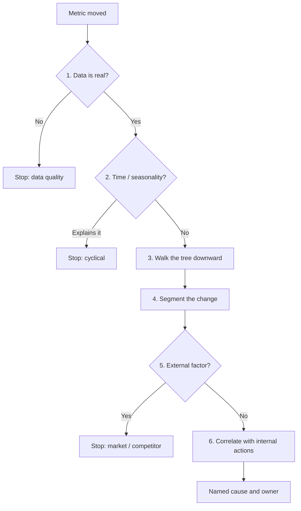
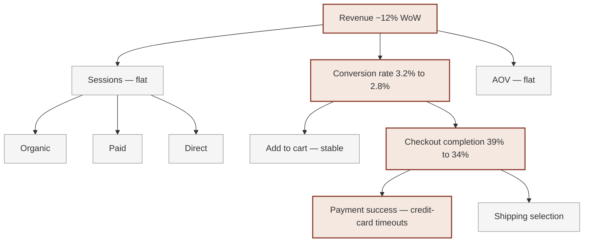

# Deep dives

Part of the [KPI Tree Guides capture](../kpitree-guides-capture.md). Grouping follows the [kpitree.co/guides](https://kpitree.co/guides) collection.

## Contents

- [8. Why Did My Metric Change? A Diagnostic Framework](#8-why-did-my-metric-change-a-diagnostic-framework---kpi-tree)
- [14. Dashboards vs Metric Trees: Why Dashboards Are Not Enough](#14-dashboards-vs-metric-trees-why-dashboards-are-not-enough---kpi-tree)
- [59. Customer Acquisition Cost](#59-customer-acquisition-cost---kpi-tree)
- [60. Revenue Per Employee as a Metric Tree: Benchmarks, Decomposition](#60-revenue-per-employee-as-a-metric-tree-benchmarks-decomposition---kpi-tree)
- [61. Net Revenue Retention: Formula, Benchmarks & Levers](#61-net-revenue-retention-formula-benchmarks-levers---kpi-tree)
- [62. Churn Rate Analysis: Formulas, Benchmarks and Fixes](#62-churn-rate-analysis-formulas-benchmarks-and-fixes---kpi-tree)
- [67. Conversion Rate Analysis: A Complete Guide](#67-conversion-rate-analysis-a-complete-guide---kpi-tree)
- [68. Customer Lifetime Value: A Metric Tree Decomposition of LTV](#68-customer-lifetime-value-a-metric-tree-decomposition-of-ltv---kpi-tree)
- [73. Gross Margin: A Metric Tree Approach to Decomposition, Benchmarks](#73-gross-margin-a-metric-tree-approach-to-decomposition-benchmarks---kpi-tree)

---

## 8. Why Did My Metric Change? A Diagnostic Framework - KPI Tree

### Provenance

- Requested source URL: [https://kpitree.co/guides/deep-dives/why-did-my-metric-change](https://kpitree.co/guides/deep-dives/why-did-my-metric-change)
- Final fetched URL: [https://kpitree.co/guides/deep-dives/why-did-my-metric-change](https://kpitree.co/guides/deep-dives/why-did-my-metric-change)
- Canonical URL: [https://kpitree.co/guides/deep-dives/why-did-my-metric-change](https://kpitree.co/guides/deep-dives/why-did-my-metric-change)
- Retrieval timestamp (UTC): 2026-08-26T07:46:54.252Z
- HTTP status: 200
- Page title: Why Did My Metric Change? A Diagnostic Framework - KPI Tree
- Meta description: Not present
- Full response SHA-256: `8cac8b4c726be7c9c9937ffa5eb375d64c97798363609aa3af306235f5e9ec2a`
- Material fragment SHA-256: `cfe01750669f04b6fdf4e952998aa4324ac93d7d64d0adc19f882c56dd528ece`

### Material

Root cause analysis is the systematic practice of tracing a metric movement back through its contributing drivers to the specific lowest-level factor that caused it, so you fix the actual cause rather than a symptom. When a metric moves unexpectedly, most teams scramble. They open dashboards, run ad-hoc queries, and schedule war room meetings. The investigation starts from scratch every time because there is no persistent model of how the business works. A metric tree solves this by providing a structure you can walk through systematically. This guide teaches the diagnostic framework.

*10 min read*

**Chapters**

- [The war room problem](#the-war-room-problem)
- [A systematic diagnostic framework](#diagnostic-framework)
- [Walking the tree: a worked example](#worked-example)
- [Five common causes of metric movement](#common-causes)
- [Why dashboards fail at diagnosis](#why-dashboards-fail)
- [Building a diagnostic habit](#building-diagnostic-habit)
- [What is root cause analysis for metrics?](#what-is-root-cause-analysis-for-metrics)
- [How long should root cause analysis take?](#how-long-should-root-cause-analysis-take)
- [Why do dashboards fail at root cause analysis?](#why-do-dashboards-fail-at-root-cause-analysis)
- [Can you do root cause analysis without a metric tree?](#can-you-do-root-cause-analysis-without-a-metric-tree)
- [How does KPI Tree help find the root cause of a metric change?](#how-does-kpi-tree-help-find-the-root-cause)

### The war room problem

It is Monday morning and your North Star metric has dropped. The CEO posts in Slack. The VP of Product asks what happened. A meeting is scheduled for 2pm. Between now and then, three analysts are running queries, two product managers are pulling up dashboards, and the data engineering team is checking whether the pipeline broke over the weekend. Everyone is working hard. Nobody is working from the same starting point.

This is the war room problem. It happens in organisations of every size and at every stage of maturity. A metric moves, and the response is reactive, unstructured, and duplicated across teams. Each person brings their own interpretation, their own slice of the data, and their own hypothesis. The meeting becomes a debate about whose explanation is correct rather than a systematic walk through the chain of cause and effect.

The underlying issue is not a lack of talent or data. It is a lack of structure. When there is no shared model of how the business creates value, every diagnostic investigation is a fresh research project. People do not know where to start, so they start everywhere. They do not know which branch of the business moved, so they check all of them. They cannot distinguish between a data quality issue and a genuine business change because the investigation process is the same either way: open a dashboard, squint at charts, and form a theory.

This pattern is expensive. It consumes analyst time, delays decisions, and erodes confidence in the data. Worse, it trains the organisation to treat metric investigation as an emergency rather than a routine. Every drop becomes a crisis. Every spike becomes a mystery. The cycle repeats because the structural problem is never addressed.

> “Investigation without structure is guesswork with a deadline. You might find the answer, but not before the opportunity to act has passed.”

### A systematic diagnostic framework

Root cause analysis for metrics does not need to be chaotic. It needs a repeatable process that anyone in the organisation can follow. The framework below gives you six steps to move from "something changed" to "here is why and here is what we should do about it." Each step narrows the search space so that by the time you reach the end, you have either found the cause or you have ruled out the most common explanations and can escalate with precision rather than panic.

1. **Confirm the data is real**

   Before investigating the business, investigate the data. Check for pipeline delays, tracking bugs, instrumentation changes, or duplicate events. A surprising number of metric movements turn out to be data quality issues rather than genuine business changes. Did a deployment break an event tracker? Did a pipeline fail and backfill incorrectly? Was a filter changed in the dashboard definition? If your data platform surfaces data freshness or quality indicators, check those first. This step saves hours of wasted investigation and prevents false alarms from reaching leadership.

2. **Check the time dimension**

   Many metric movements are explained by time. Compare the current period against the same period last year, not just last week. Is the drop aligned with a public holiday, a seasonal pattern, or a known cyclical trend in your industry? Day-of-week effects are common in B2C businesses where weekend behaviour differs from weekday behaviour. Monthly billing cycles can create artificial spikes and troughs. If the change disappears when you adjust for seasonality or compare year-over-year, you have your answer.

3. **Walk the metric tree downward**

   This is where the metric tree earns its value. Start at the metric that changed and trace downward through its branches. Which first-level driver moved? If revenue dropped, did sessions fall, did conversion rate fall, or did average order value fall? Once you identify the branch, drill deeper. Keep walking down the tree until you find the lowest-level metric that changed. That is your root cause candidate. Without a metric tree, this step requires manual cross-referencing of multiple dashboards and data sources. With one, it takes minutes.

4. **Segment the change**

   Once you know which metric moved, break it down by dimensions. Did the change happen across all cohorts or just one? Is it concentrated in a specific geography, acquisition channel, device type, or customer segment? Segmentation turns a single number into a diagnostic signal. If conversion rate dropped only on mobile, you are looking at a UX or performance issue. If it dropped only for new users, you are looking at an onboarding problem. If it dropped everywhere equally, the cause is more likely systemic. This step prevents teams from launching broad initiatives when the problem is narrow and specific.

5. **Check for external factors**

   Not every metric movement is caused by something you did. Market conditions shift, competitor behaviour changes, regulatory environments evolve, and macroeconomic forces affect consumer spending. Check industry benchmarks if you have access to them. Look at search volume trends for your category. Review news for anything that might have affected customer behaviour. External factors are often overlooked because they are harder to measure, but ignoring them leads to misattribution. If your entire category is down, optimising your funnel will not fix the problem.

6. **Correlate with internal actions**

   If the change is not explained by data quality, seasonality, or external factors, look inward. Review recent product releases, feature flag changes, pricing adjustments, campaign launches, or operational changes. Overlay the timing of internal actions against the metric movement. Did a deployment go out the day before the drop? Did a campaign end? Was a pricing test activated? The metric tree helps here because actions logged against specific nodes create a timeline of what changed and when. Without that log, you are relying on memory and Slack history to reconstruct the sequence of events.

Each diamond is a place the investigation can end. You only walk the tree after the data and the calendar have been ruled out.

> **Key principle.** The framework works by narrowing the search space at each step. You move from "something is wrong" to "this specific metric, in this specific segment, changed at this specific time, and here is the most likely cause." Each step eliminates a category of explanation so you are not chasing every possibility at once.

### Walking the tree: a worked example

Frameworks are useful in theory. They become powerful when you see them applied. Here is a worked example that demonstrates how a metric tree turns a vague alert into a precise diagnosis.

- Revenue
  - Sessions
    - Organic
    - Paid
    - Direct
  - Conversion Rate
    - Add to Cart Rate
    - Checkout Completion
      - Payment Success Rate
      - Shipping Selection
  - Avg Order Value

The scenario: your e-commerce business reports that revenue dropped 12% week-over-week. The alert fires. The war room instinct kicks in. But instead of scheduling a meeting, you open the metric tree and start walking.

Tinted nodes are the walk: Revenue → Conversion rate → Checkout completion → Payment success. Grey nodes were checked and ruled out.

Step one: confirm the data is real. You check the pipeline status. All sources are fresh, no backfill issues, no tracking changes deployed. The data is clean. The drop is real.

Step two: check the time dimension. You compare against the same week last year and the same day-of-week pattern. No holidays, no known seasonal effects. The drop is not cyclical.

Step three: walk the tree. Revenue decomposes into Sessions, Conversion Rate, and Average Order Value. You check each one. Sessions are flat, within normal variance. Average Order Value is flat. Conversion Rate dropped from 3.2% to 2.8%. You have found the branch.

Now drill deeper into Conversion Rate. It decomposes into Add to Cart Rate and Checkout Completion. Add to Cart Rate is stable at 8.1%. Checkout Completion dropped from 39% to 34%. The problem is not in product discovery or browsing behaviour. Customers are adding items to their carts at the same rate. They are abandoning at checkout.

Step four: segment the change. You break Checkout Completion by device, geography, and payment method. The drop is uniform across devices and geographies, but concentrated on credit card payments. Customers paying via alternative methods like digital wallets are unaffected.

Step five: external factors. No market-wide disruption. No competitor activity that would explain checkout abandonment.

Step six: internal actions. You check the action log against the checkout node. No pricing changes, no UX deployments. But you cross-reference with the engineering incident log and find it: a payment provider experienced intermittent outages over the past 48 hours, causing timeouts on credit card transactions. The issue has already been flagged by the payments team but had not yet been connected to the revenue drop.

The entire investigation took fifteen minutes. Without the metric tree, the same conclusion might have taken a full day of analyst time, a war room meeting, and several rounds of "let me pull that data." The tree told you where to look. The segmentation told you what to look for. The action log connected the dots.

> **What the tree replaced.** Without the metric tree, the team would have checked sessions first (because traffic is the default suspect), found nothing, then checked campaigns, then checked pricing, then eventually arrived at checkout completion hours later. The tree eliminated guesswork by showing the structure of the problem from the start.

### Five common causes of metric movement

While every situation is different, most unexpected metric movements fall into one of five categories. Knowing these patterns accelerates your diagnosis because you can quickly test each one against the data rather than investigating blindly.

- **Data quality issues** — Broken event tracking, pipeline delays, schema changes, duplicate events, or misconfigured filters. Data quality problems are the most common cause of apparent metric changes and the easiest to rule out. Always check the integrity of your data before investigating the business. A tracking script that silently fails can make it look like traffic halved overnight when nothing actually changed.
- **Seasonality and cyclical patterns** — Holidays, weekends, end-of-quarter effects, annual buying cycles, and weather patterns all create predictable metric movements that look alarming if you only compare week-over-week. Build seasonality awareness into your monitoring by comparing against the same period in prior years, not just the previous period. What looks like a crisis in isolation often looks normal in context.
- **Product or feature changes** — New releases, feature flag rollouts, A/B test activations, performance regressions, and UX changes can all move metrics significantly. The challenge is connecting the deployment timeline to the metric movement. When actions are logged against the metric tree, this connection is immediate. Without it, you are searching through release notes and deployment logs trying to reconstruct what changed and when.
- **Channel mix shifts** — If the proportion of traffic or customers coming from different channels changes, your aggregate metrics will shift even if nothing changed within any single channel. A campaign ending, an algorithm update affecting organic reach, or a partner shutting down a referral programme can all change the mix. Always decompose aggregate metrics by channel before concluding that performance changed.
- **External market factors** — Competitor launches, regulatory changes, macroeconomic shifts, and category-level demand fluctuations all affect your metrics but are invisible in your internal data. These are the hardest causes to identify because they require looking outside your own systems. Industry benchmarks, search trend data, and market intelligence reports help, but they are often checked last when they should be checked early.

### Why dashboards fail at diagnosis

Dashboards are excellent at showing you what happened. They are designed to surface numbers, trends, and thresholds at a glance. But when a metric moves and you need to understand why, dashboards fall apart. The reason is structural: dashboards display metrics in isolation. Each chart exists independently. There are no connections between them that model how one metric drives another.

Consider the scenario from the worked example above. A dashboard would show you that revenue dropped. It might also show you that conversion rate dropped if both happen to live on the same page. But it would not show you the causal chain from revenue to conversion rate to checkout completion to payment success rate. You would need to open multiple dashboards, mentally connect the dots, and form your own hypothesis about the chain of cause and effect. That mental model lives in people, not in the tool.

This is why metric troubleshooting in dashboard-driven organisations depends heavily on institutional knowledge. The analyst who has been at the company for three years knows that checkout completion is connected to payment provider reliability. The new analyst does not. When the experienced person is on holiday, the investigation takes three times as long. The knowledge is not captured anywhere in the system.

A metric tree solves this by making the relationships between metrics explicit and navigable. The cause-and-effect chain is not something you have to reconstruct in your head. It is built into the model. Anyone can walk the tree from any starting point and trace the path to the root cause, regardless of how long they have been at the company or how well they know the domain.

Dashboards also lack the concept of ownership. A chart on a dashboard is viewed by many people and owned by none of them. When a metric on a dashboard drops, it is unclear who should investigate, who should act, and who should communicate the finding. A metric tree assigns ownership to every node, so when something moves, the right person is already identified. The notification goes to the owner, not to a Slack channel where it competes with thirty other messages.

> “A dashboard tells you the patient has a fever. A metric tree tells you which organ is failing and which doctor to call.”

### Building a diagnostic habit

The most effective organisations do not treat metric diagnosis as an emergency response. They treat it as a regular practice. The difference is cultural and structural, and it starts with embedding the diagnostic framework into the rhythms of the business rather than reserving it for moments of crisis.

The first step is assigning ownership to every metric in the tree. When a metric has an owner, that person monitors it as part of their regular work, not as an ad-hoc favour when someone in leadership asks a question. Ownership creates vigilance. Behavioural science is consistent on this point: people attend more carefully to things they are personally accountable for. A metric with an owner gets investigated when it moves by two percent. A metric without an owner gets investigated when it moves by twenty.

The second step is connecting the metric tree to live data and setting meaningful thresholds. When a metric deviates beyond its expected range, the owner should be notified automatically. This shifts the organisation from reactive diagnosis to proactive detection. You catch anomalies in hours rather than discovering them in the weekly report three days later. Early detection means you can act while the window is still open.

The third step is building a log of actions and outcomes against each metric. Every time a metric moves and someone investigates, record what was found and what was done. Over time, this creates an organisational memory. When conversion rate drops next quarter, the owner can review the log and see what caused the last three drops and what fixed them. This eliminates the cycle of rediscovery that plagues teams without persistent records.

The fourth step is making the diagnostic framework part of regular meetings. Instead of a weekly meeting where each team presents their numbers independently, structure the meeting around the metric tree. Start at the top, walk down the branches, and focus discussion on the nodes that moved. This format is faster, more focused, and ensures that the conversation is grounded in cause and effect rather than isolated snapshots.

When these four elements are in place, metric diagnosis stops being a fire drill and becomes a core competency. The organisation develops a shared language for talking about change, a shared process for investigating it, and a shared record of what worked. That compounding knowledge is what separates data-informed organisations from data-overwhelmed ones.

> **The compounding effect.** Each diagnosis makes the next one faster. Logged investigations, validated relationships, and experienced owners create an organisational muscle that improves with use. The first investigation might take a day. After six months of practice, the same type of investigation takes thirty minutes.

### What is root cause analysis for metrics?

Root cause analysis for metrics is the systematic practice of tracing a metric movement back through its contributing drivers to the specific lowest-level factor that caused it. Rather than guessing, you start at the metric that changed, confirm the data is real, rule out seasonality, walk the metric tree downward to the branch that moved, segment the change, and correlate it against external events and internal actions. The result is a precise diagnosis rather than a plausible theory.

### How long should root cause analysis take?

With a persistent metric tree, most investigations take minutes rather than days. The tree tells you where to look, segmentation tells you what to look for, and the action log connects the change to what happened. In the worked example in this guide, a twelve percent revenue drop is traced to a payment provider outage in about fifteen minutes. Without a shared model, the same conclusion can take a full day of analyst time and a war room meeting.

### Why do dashboards fail at root cause analysis?

Dashboards show you what happened, not why. They display metrics in isolation, with no explicit connection modelling how one metric drives another, so the causal chain lives in people rather than in the tool. When a metric moves, you have to open several dashboards, mentally connect the dots, and lean on institutional knowledge. A metric tree makes those relationships explicit and navigable, so anyone can trace the path to the root cause regardless of how long they have been at the company.

### Can you do root cause analysis without a metric tree?

You can, but every investigation becomes a fresh research project. Without a shared model of how the business creates value, people do not know where to start, so they check everything at once, duplicate effort across teams, and debate whose explanation is correct. A metric tree replaces that guesswork with a structure you walk through systematically, narrowing the search space at each step until you reach the lowest-level metric that changed.

### How does KPI Tree help find the root cause of a metric change?

KPI Tree gives you a persistent metric tree that connects each metric to its drivers, assigns ownership to every node, and logs actions and decisions against the nodes they affect. Connect the tree to live data and set thresholds, and the owner is notified when a metric deviates beyond its expected range. When you investigate, you walk the tree downward to the branch that moved, segment the change, and read the action log to see what changed and when. Proprietary ML models and statistical tests such as Pearson correlation, lagged cross-correlation, partial correlation and Granger causality help confirm which drivers actually moved the metric.

### Continue reading

- [What is a metric tree?](./getting-started.md#1-what-is-a-metric-tree---kpi-tree)
  - A metric tree maps cause and effect so every team sees what moves the needle
- [Metric tree examples](./getting-started.md#3-metric-tree-examples-for-every-business-model---kpi-tree)
  - Metric tree examples for SaaS, e-commerce, marketplace, and B2B models you can copy
- [Leading vs lagging indicators](./core-concepts.md#6-leading-vs-lagging-indicators-explained-examples---kpi-tree)
  - How leading vs lagging indicators connect in a metric tree

---

---

## 14. Dashboards vs Metric Trees: Why Dashboards Are Not Enough - KPI Tree

### Provenance

- Requested source URL: [https://kpitree.co/guides/deep-dives/dashboards-vs-metric-trees](https://kpitree.co/guides/deep-dives/dashboards-vs-metric-trees)
- Final fetched URL: [https://kpitree.co/guides/deep-dives/dashboards-vs-metric-trees](https://kpitree.co/guides/deep-dives/dashboards-vs-metric-trees)
- Canonical URL: [https://kpitree.co/guides/deep-dives/dashboards-vs-metric-trees](https://kpitree.co/guides/deep-dives/dashboards-vs-metric-trees)
- Retrieval timestamp (UTC): 2026-08-26T07:46:54.252Z
- HTTP status: 200
- Page title: Dashboards vs Metric Trees: Why Dashboards Are Not Enough - KPI Tree
- Meta description: Not present
- Full response SHA-256: `f0cbf28ffc3009cf4f115545533574fe7974d1fe57495bc30f1c1bc48e7113a4`
- Material fragment SHA-256: `d384ab6cb0836bc59aa43dd702ddce58260375e47505752963b4587ce6702ece`

### Material

Dashboards have earned their place. They surface numbers, highlight trends, and keep stakeholders informed at a glance. But when a metric moves and you need to understand why, dashboards leave you on your own. They show what happened without modelling the cause. A metric tree picks up where dashboards stop by encoding the relationships between metrics into a navigable structure. This guide walks through what dashboards do well, where they fall short, and how metric trees complement them.

*8 min read*

**Chapters**

- [What dashboards do well](#what-dashboards-do-well)
- [Where dashboards fall short](#where-dashboards-fall-short)
- [What a metric tree adds](#what-a-metric-tree-adds)
- [The diagnostic gap](#the-diagnostic-gap)
- [Dashboards and metric trees together](#dashboards-and-metric-trees-together)
- [Signs you have outgrown your dashboards](#signs-you-have-outgrown-your-dashboards)

### What dashboards do well

Before examining limitations, it is worth acknowledging what dashboards genuinely solve. Dashboards became the default tool for data communication because they work for a specific and important set of problems. They provide real-time visibility into operational metrics without requiring anyone to write a query. They condense large volumes of data into visual patterns that are easier to interpret than raw tables. They serve as a shared reference point for teams and leadership, reducing the need for ad-hoc data requests. And they scale well as a communication layer, making it possible to present the same information to different audiences by building different views of the same underlying data.

Organisations that dismiss dashboards entirely are making a mistake. The tool is not the problem. The problem is asking dashboards to do something they were never designed to do: explain why a number changed, model the relationships between metrics, or assign accountability for a result. Understanding where dashboards genuinely excel makes it easier to see where the gaps are and what a complementary tool needs to provide.

- **Real-time visibility** — Dashboards surface live metrics without requiring anyone to write SQL or wait for a report. They keep operational data visible and accessible throughout the day, which means teams can spot anomalies quickly and stay informed without relying on analysts for every question.
- **Pattern recognition** — Charts, heatmaps, and trend lines make patterns visible that would be invisible in a spreadsheet. A line chart reveals seasonality at a glance. A bar chart highlights outliers immediately. Visual encoding turns numbers into signals that the human eye processes efficiently.
- **Stakeholder communication** — Dashboards provide a shared artefact that everyone from an intern to a board member can look at and understand. They reduce the translation overhead between data teams and business teams by presenting information in a format that does not require technical literacy to interpret.
- **Data consolidation** — A well-built dashboard pulls from multiple data sources and presents a unified view. This eliminates the need to open five different tools to understand the state of the business and reduces the risk of teams working from inconsistent numbers.

### Where dashboards fall short

The limitations of dashboards are not bugs. They are consequences of the design. Dashboards were built to display metrics, not to model the relationships between them. Once you recognise the structural constraints, the gaps become obvious and predictable. Every organisation that scales beyond a handful of metrics runs into these limitations, usually in the same order and usually at the same moment: when something goes wrong and someone asks "why."

- **No causal relationships** — Dashboards display metrics side by side, but they do not model how those metrics are connected. Revenue and conversion rate might appear on the same page, yet nothing in the tool encodes the fact that conversion rate is a driver of revenue. When revenue drops, you have to mentally reconstruct the chain of cause and effect. Example: a dashboard shows revenue is down and sessions are flat, but you cannot see from the dashboard alone that the issue is in checkout completion, three levels deeper.
- **No hierarchy** — Dashboard layouts are flat. Every chart occupies a tile on a grid. There is no structural relationship between tiles, no parent-child nesting, and no way to express that one metric decomposes into three sub-metrics. This means the most important organisational question, "what drives what," is invisible. Example: you have a dashboard with twenty charts, but no way to tell which five charts are the drivers and which fifteen are the outcomes.
- **No ownership model** — A chart on a dashboard is viewed by many people and owned by none. There is no built-in concept of who is responsible for a metric, who should investigate when it moves, or who has the authority to act. This creates diffusion of responsibility. Example: conversion rate drops and three teams notice independently, but nobody investigates because everyone assumes someone else will.
- **No action tracking** — Dashboards show the current state but do not record what was done about it. When a metric drops and someone takes corrective action, that context lives in [Slack](https://kpitree.co/integrations/slack) messages, meeting notes, or nowhere at all. Six months later, when the same metric drops again, the organisation has no record of what worked last time. Example: a team fixes a checkout bug that recovers conversion rate, but the fix and its impact are never logged against the metric.
- **The "so what?" problem** — Dashboards answer "what happened" but not "why it happened" or "what should we do." A red number on a dashboard creates anxiety without direction. It tells you something moved but gives you no pathway to investigate. The diagnostic burden falls entirely on the person staring at the screen. Example: revenue is down 8%. The dashboard confirms the number. Now what? You open four more dashboards, cross-reference timestamps, and start guessing. The investigation is unstructured because the tool offers no structure.

### What a metric tree adds

A metric tree does not replace the data that dashboards display. It replaces the mental model that people carry in their heads. Instead of relying on experienced analysts to know that checkout completion is connected to payment success rate, the tree encodes that relationship explicitly. Instead of opening five dashboards and cross-referencing charts, you walk a single structure from the top-level metric to the root cause. The table below compares the two tools across the capabilities that matter most when something goes wrong and you need to understand why.

| Capability | Dashboard | Metric tree |
| --- | --- | --- |
| Structure | Flat grid of charts with no inherent relationships between tiles | Hierarchical tree where every metric is connected to its parent and children |
| Relationships | None. Metrics are displayed in isolation even when shown on the same page | Defined. Each metric has explicit drivers and outcomes encoded in the model |
| Diagnosis | Manual investigation across multiple dashboards and data sources | Walk the tree from top to bottom, narrowing the search at each level |
| Ownership | No built-in concept. Charts are viewed by many, owned by none | Every metric has an assigned owner responsible for monitoring and investigation |
| Action tracking | Separate system. Context lives in Slack, tickets, or meeting notes | Integrated. Actions are logged against the metric they affect |
| Root cause analysis | Requires an experienced analyst to manually reconstruct the causal chain | Built into the structure. Anyone can trace the path from symptom to cause |

> **The key difference.** Dashboards are a presentation layer. Metric trees are a structural model. The presentation layer shows you numbers. The structural model shows you how those numbers are connected, who is responsible for them, and what has been done about them.

### The diagnostic gap

The gap between dashboards and metric trees becomes most visible during diagnosis. Consider a concrete scenario: revenue drops 12% week-over-week. Your dashboard shows the number in red. The alert fires. Now what?

In a dashboard-driven organisation, the response follows a predictable and expensive pattern. Someone opens the revenue dashboard and confirms the drop. They check the traffic dashboard and find that sessions are flat. They open the acquisition dashboard to see if paid spend changed. It did not. They check the product dashboard and notice that conversion rate looks lower, but the dashboard shows conversion rate as a single number without decomposition. They message the analytics team to ask what happened. An analyst opens a query tool, joins three tables, and discovers that checkout completion dropped. Another query reveals the drop is concentrated on credit card transactions. Two hours later, someone connects this to a payment provider outage that was logged in an engineering incident channel nobody else reads.

The information existed the entire time. The problem was not missing data. The problem was that the diagnostic pathway did not exist in the tooling. Every connection had to be reconstructed manually, by a person who knew where to look, what to query, and who to ask.

- Revenue (-12%)
  - Sessions (flat)
    - Organic (stable)
    - Paid (stable)
    - Direct (stable)
  - Conversion rate (dropped)
    - Add to cart rate (stable)
    - Checkout completion (dropped)
      - Payment success rate (dropped, credit cards)
      - Shipping selection (stable)
  - Avg order value (flat)

With a metric tree, the same investigation takes minutes. You start at revenue and see three branches: sessions, conversion rate, and average order value. Sessions and average order value are flat. Conversion rate dropped. You expand conversion rate and see two branches: add to cart rate and checkout completion. Add to cart rate is stable. Checkout completion dropped. You expand checkout completion and see payment success rate has fallen, specifically for credit card transactions. The tree has walked you from the symptom to the cause in three clicks.

This is not a theoretical advantage. It is the difference between a fifteen-minute diagnosis and a half-day investigation. It is the difference between the CEO getting an answer before lunch and the CEO getting an answer tomorrow. And critically, it is the difference between anyone on the team being able to investigate and only the most experienced analyst being capable of tracing the chain. The tree democratises diagnosis by encoding the institutional knowledge that otherwise lives in a few people and disappears when they leave.

### Dashboards and metric trees together

This is not an either-or decision. Dashboards and metric trees solve different problems, and the most effective data organisations use both. The mistake is treating them as competitors when they are complements that serve different functions in the data workflow.

Dashboards excel at monitoring and communication. They provide a visual snapshot of the current state for audiences who need to stay informed but do not need to investigate. A board-level dashboard that shows revenue, retention, and growth rate is exactly the right tool for that audience. An operations dashboard that shows real-time order volume and fulfilment status is exactly the right tool for that team. Dashboards serve the presentation layer beautifully because that is what they were designed to do.

Metric trees excel at understanding and diagnosis. They provide the structural model that sits beneath the dashboard numbers. When a number on the dashboard moves, the metric tree is where you go to understand why. When a new team member joins and needs to learn how the business metrics connect, the metric tree is the onboarding tool. When leadership wants to understand which levers to pull to improve a lagging outcome, the tree shows the causal chain.

The best setup uses metric trees as the structural foundation and dashboards as the presentation layer for specific audiences. The tree defines the relationships, assigns ownership, and tracks actions. Dashboards surface the most relevant metrics for each stakeholder group in a format optimised for quick consumption. Think of the metric tree as the operating system and dashboards as the interface. You need both, but they serve different purposes.

Organisations that try to use dashboards as both the presentation layer and the structural model end up with dozens of dashboards, inconsistent definitions, no ownership, and a diagnostic process that depends entirely on institutional knowledge. Adding metric trees to the stack does not mean removing dashboards. It means giving dashboards a structural backbone they currently lack.

> “A dashboard without a metric tree is a scoreboard without a playbook. You can see the score, but you have no model for changing it.”

### Signs you have outgrown your dashboards

Most organisations do not realise they have outgrown their dashboards until the pain is acute. The transition happens gradually: one more dashboard is created, one more ad-hoc investigation is run, one more meeting is spent debating what the numbers mean. The signs below are not hypothetical. They are patterns that appear in every scaling organisation that relies on dashboards as its primary analytical tool. If three or more apply to your team, you have likely reached the point where dashboards alone are insufficient.

1. **You have more than ten dashboards and nobody knows which is the source of truth**

   Dashboard sprawl is the most visible symptom. Each team builds their own dashboard with their own metric definitions, filters, and time ranges. When two dashboards show different numbers for the same metric, nobody can say which one is correct because there is no authoritative model that defines how the metric should be calculated. The result is a credibility crisis: leadership stops trusting the data, and analysts spend more time reconciling numbers than analysing them.

2. **Every metric change triggers an ad-hoc investigation**

   When a metric moves, the response is to start from scratch. An analyst writes a fresh query, pulls data into a spreadsheet, and manually traces the chain of cause and effect. There is no repeatable process, no saved context from previous investigations, and no structural model to guide the search. Each investigation is a research project, and the findings are lost as soon as the Slack thread scrolls out of view.

3. **Different teams report different numbers for the same metric**

   Marketing says conversion rate is 3.2%. Product says it is 2.8%. Finance says it is 3.5%. The difference is not a rounding error. Each team uses a different definition, a different denominator, or a different time window. Without a single authoritative model that defines how each metric decomposes and how it should be calculated, these inconsistencies are inevitable and corrosive.

4. **Nobody can explain how their metric connects to revenue**

   Individual contributors work on metrics they own, but they cannot articulate how those metrics roll up to the outcomes the business cares about. A product manager optimises onboarding completion rate without knowing whether it actually drives retention. A marketing manager increases traffic without understanding which traffic segments convert. The connection between effort and outcome is assumed, not modelled.

5. **Your quarterly review is spent debating what happened rather than deciding what to do**

   The meeting that should be about strategy and priorities becomes a forensic exercise. Teams present their numbers, leadership asks why something moved, and the next forty minutes are spent reconstructing the causal chain in real time. By the time the group agrees on what happened, there is no time left to decide what to do about it. The diagnostic work should have been done before the meeting, but there was no structure to do it efficiently.

6. **Your best analyst is a single point of failure**

   One person on the team knows how all the metrics connect. They can trace a revenue drop to its root cause because they have been at the company long enough to carry the entire causal model in their head. When that person is on holiday, sick, or leaves the company, the organisation loses its diagnostic capability. The knowledge was never captured in a system. It lived in a person, and now it is gone.

> **The threshold.** If you recognised your organisation in three or more of these signs, dashboards are no longer sufficient as your primary analytical tool. They still have a role, but they need a structural layer beneath them. That layer is a metric tree.

### Continue reading

- [What is a metric tree?](./getting-started.md#1-what-is-a-metric-tree---kpi-tree)
  - A metric tree maps cause and effect so every team sees what moves the needle
- [Why did my metric change?](#8-why-did-my-metric-change-a-diagnostic-framework---kpi-tree)
  - Stop guessing. Start tracing.
- [Metric ownership](./core-concepts.md#9-metric-ownership-who-should-own-which-metric---kpi-tree)
  - The most underrated lever in business performance

---

---

## 59. Customer Acquisition Cost - KPI Tree

### Provenance

- Requested source URL: [https://kpitree.co/guides/deep-dives/customer-acquisition-cost](https://kpitree.co/guides/deep-dives/customer-acquisition-cost)
- Final fetched URL: [https://kpitree.co/guides/deep-dives/customer-acquisition-cost](https://kpitree.co/guides/deep-dives/customer-acquisition-cost)
- Canonical URL: [https://kpitree.co/guides/deep-dives/customer-acquisition-cost](https://kpitree.co/guides/deep-dives/customer-acquisition-cost)
- Retrieval timestamp (UTC): 2026-08-26T07:46:54.252Z
- HTTP status: 200
- Page title: Customer Acquisition Cost - KPI Tree
- Meta description: Not present
- Full response SHA-256: `6c1b502d0a8f4bdff6c013b10b3efcc8b486636314abf626d3c2b3573a935464`
- Material fragment SHA-256: `debc34f9f0842030bbfc22a5378c521a34df69f553af1e328f29fab194973719`

### Material

Customer acquisition cost is one of the most important metrics in any business, yet most teams treat it as a single number. That hides more than it reveals. When CAC rises, the obvious response is to cut spend, but the real cause might be a conversion rate problem, a channel mix shift, or a sales cycle that has lengthened by weeks. A metric tree decomposes CAC into its component inputs so you can diagnose the root cause and fix the right lever. This guide covers the CAC formula, its components, how to build a CAC metric tree, blended vs channel-specific CAC, the CAC:LTV ratio, industry benchmarks, and a structured approach to reducing acquisition cost.

*9 min read*

**Chapters**

- [What CAC is and why it matters](#what-is-cac-and-why-it-matters)
- [The CAC formula and its components](#the-cac-formula-and-its-components)
- [Decomposing CAC with a metric tree](#decomposing-cac-with-a-metric-tree)
- [Blended vs channel-specific CAC](#blended-vs-channel-specific-cac)
- [The CAC:LTV ratio and unit economics](#cac-ltv-ratio-and-unit-economics)
- [CAC benchmarks by industry and channel](#cac-benchmarks-by-industry)
- [How to reduce CAC using tree-based analysis](#reducing-cac-with-tree-based-analysis)

### What CAC is and why it matters

Customer acquisition cost (CAC) measures how much a business spends to acquire a single new customer. It is calculated by dividing total sales and marketing expenses over a given period by the number of new customers acquired in that same period. The formula looks simple, but the implications are far-reaching.

CAC is the denominator in the fundamental equation of business sustainability. If the revenue a customer generates over their lifetime (LTV) exceeds the cost to acquire them (CAC) by a healthy margin, the business can grow profitably. If it does not, every new customer actually destroys value. This is why investors scrutinise CAC so closely: it reveals whether a company has found an efficient, repeatable way to attract customers, or whether it is simply buying growth with capital.

The challenge is that CAC is a lagging, blended metric. By the time you notice it rising on your monthly report, the underlying causes have been building for weeks or months. Perhaps a high-performing paid channel has saturated. Perhaps the sales team has grown faster than pipeline, diluting productivity. Perhaps a product change has reduced trial-to-paid conversion. The headline CAC number tells you something has gone wrong, but not what or where.

This is where most organisations get stuck. They stare at the single number, debate whether it is too high, and either cut budget across the board or accept it as a cost of growth. Neither response is precise enough. What you need instead is a decomposition: a structured breakdown of CAC into its component parts, so you can see which inputs are driving the change and intervene at the right level.

> CAC is not just a finance metric. It is an operating metric that touches marketing, sales, product, and customer success. When you treat it as a single number owned by the CFO, you lose the ability to diagnose and fix the specific levers that drive it.

### The CAC formula and its components

The basic CAC formula is straightforward:

CAC = Total Sales and Marketing Costs / Number of New Customers Acquired

But "total sales and marketing costs" is where the devil lives. A precise CAC calculation must include every expense that contributes to acquiring a customer. Omitting costs makes CAC appear artificially low and leads to poor capital allocation decisions.

1. **Advertising and paid media spend**

   All paid acquisition costs: search ads, social ads, display, sponsorships, affiliate commissions, and any other channel where you pay for visibility or clicks. This is typically the most variable component and the easiest to measure.

2. **Sales and marketing salaries and commissions**

   The fully loaded cost of every person involved in acquiring customers, including base salaries, commissions, bonuses, benefits, and employer taxes. For many B2B companies, this is actually the largest component of CAC, often exceeding ad spend.

3. **Technology and tooling**

   CRM subscriptions, marketing automation platforms, analytics tools, sales engagement software, call tracking, attribution platforms, and any other technology used to generate, nurture, or convert leads.

4. **Content and creative production**

   The cost of producing marketing content: blog posts, videos, webinars, case studies, whitepapers, landing pages, and design work. This includes both in-house production costs and agency or freelancer fees.

5. **Overheads allocated to acquisition**

   A proportional share of office space, management time, and general overhead attributable to the sales and marketing functions. Some companies exclude this for simplicity, but doing so understates the true cost of acquisition.

The denominator, number of new customers acquired, also requires careful definition. Should it include only customers who have paid, or also those on free trials who have converted? Should it include customers acquired through partnerships or referrals who had minimal direct acquisition cost? The answers depend on your business model, but the key principle is consistency: define the numerator and denominator once, document the definition, and apply it the same way every period.

One common mistake is conflating CAC with CPA (cost per acquisition). CPA typically refers to the cost to acquire a lead, a sign-up, or a trial user. CAC specifically measures the cost to acquire a paying customer. The distinction matters because a low CPA can coexist with a high CAC if conversion rates are poor. A business that generates cheap leads but struggles to convert them into paying customers has a CPA problem masked as a CAC problem, and the intervention required is entirely different.

### Decomposing CAC with a metric tree

A single CAC number hides the causal structure underneath it. A metric tree makes that structure visible by decomposing CAC into the specific inputs that determine its value.

The first-level decomposition splits CAC into its two fundamental components: spend and volume. CAC equals total acquisition spend divided by new customers. But this can be further decomposed. Total acquisition spend breaks down by channel and by cost type. New customers is the result of leads multiplied by conversion rate. Each of these can be decomposed further, creating a tree that traces CAC all the way down to the operational levers that individual teams control.

- Customer Acquisition Cost (CAC)
  - Total acquisition spend
    - Paid media spend
      - Search ads
      - Social ads
      - Display and retargeting
    - Sales team costs
      - Salaries and commissions
      - Sales tooling
    - Marketing team costs
      - Content production
      - Marketing tooling
  - New customers acquired
    - Total leads
      - Organic leads
      - Paid leads
      - Outbound leads
      - Referral leads
    - Lead-to-customer conversion rate
      - Lead-to-MQL rate
      - MQL-to-SQL rate
      - SQL-to-opportunity rate
      - Opportunity-to-close rate

This tree reveals something that a flat CAC number cannot: the specific mechanism by which CAC changes. Consider three scenarios where CAC increases by 30%.

In the first scenario, paid media spend has increased because cost-per-click has risen across all channels. The tree shows rising spend in the paid media branch while conversion rates remain stable. The diagnosis is channel saturation or increased competition, and the response might be to diversify into lower-cost channels like content marketing or partnerships.

In the second scenario, spend is flat but the lead-to-customer conversion rate has dropped. The tree shows stable spend but deteriorating conversion at the MQL-to-SQL stage. The diagnosis is a lead quality problem, perhaps marketing is generating more leads but they are less qualified. The response is to tighten targeting or adjust lead scoring criteria.

In the third scenario, both spend and conversion rates are stable, but the sales cycle has lengthened, meaning that customers acquired this month reflect spend from three months ago rather than two. The tree might not capture this directly, but a time-lagged view reveals the disconnect. The response is to investigate what is slowing deal velocity.

Without the tree, all three scenarios produce the same headline: CAC is up 30%. With the tree, each produces a different diagnosis and a different corrective action. This is the power of decomposition.

> **The tree exposes hidden tradeoffs.** Cutting paid spend to reduce CAC might actually increase it if the remaining leads have lower conversion rates. A metric tree makes these interdependencies visible before you act, not after.

### Blended vs channel-specific CAC

One of the most important distinctions in CAC analysis is between blended CAC and channel-specific CAC. They answer different questions for different audiences, and confusing them leads to poor decisions.

Blended CAC divides your total sales and marketing spend by your total new customers. It is the number that appears in board decks, investor updates, and financial models. It tells you the overall efficiency of your acquisition engine. But it is an average, and averages can be deeply misleading.

Channel-specific CAC calculates the cost to acquire a customer through each individual channel: paid search, paid social, organic search, content marketing, outbound sales, partnerships, referrals, and so on. This requires attributing both costs and customers to their source, which is harder than it sounds but essential for making good allocation decisions.

| Dimension | Blended CAC | Channel-specific CAC |
| --- | --- | --- |
| Formula | Total S&M spend / total new customers | Channel spend / customers from that channel |
| Audience | Board, investors, executive team | Marketing, growth, and channel managers |
| Strength | Shows overall acquisition efficiency | Reveals which channels are efficient and which are not |
| Weakness | Masks channel-level performance variation | Requires accurate attribution, which is imperfect |
| Decision it informs | Is our growth model sustainable? | Where should we allocate the next pound of spend? |
| Frequency | Monthly or quarterly | Weekly or monthly |

The practical danger of relying solely on blended CAC is that it can look stable even when the underlying channel mix is shifting in a damaging direction. Imagine a business with two channels: organic search (CAC of 50 pounds) and paid search (CAC of 200 pounds). If organic delivers 80% of customers, blended CAC is 80 pounds. If organic share drops to 50%, blended CAC jumps to 125 pounds, a 56% increase, even though neither channel has become less efficient. The problem is not channel performance but channel mix.

A metric tree naturally handles this by decomposing total leads into channel-specific branches, each with its own cost and conversion rate. When you see blended CAC rising, you can trace the tree down to see whether the cause is a channel becoming more expensive, a conversion rate dropping, or simply a shift in the mix between high-CAC and low-CAC channels.

Best practice is to track both. Report blended CAC for strategic discussions about overall business health. Use channel-specific CAC for tactical decisions about budget allocation and channel investment. And build your metric tree with enough channel-level granularity to bridge the two.

### The CAC:LTV ratio and unit economics

CAC in isolation tells you how much you spend to acquire a customer. The CAC:LTV ratio tells you whether that spend is justified. LTV (customer lifetime value) estimates the total revenue or gross profit a customer will generate over the duration of their relationship with your business. The ratio between these two numbers is the most fundamental indicator of business model viability.

The widely cited benchmark is a 3:1 LTV:CAC ratio, meaning a customer should be worth at least three times what it costs to acquire them. This provides enough margin to cover the cost of serving the customer, fund ongoing operations, and generate profit. A ratio below 1:1 means you are losing money on every customer. A ratio between 1:1 and 3:1 suggests the unit economics are marginal. A ratio above 5:1 might indicate you are under-investing in growth and leaving market share on the table.

- **LTV:CAC below 1:1** — The business loses money on every customer acquired. This is only sustainable temporarily during a land-grab phase backed by venture capital. If it persists, the business model is fundamentally broken and no amount of scale will fix it.
- **LTV:CAC between 1:1 and 3:1** — Unit economics are marginal. The business may be viable, but there is little room for error. Any increase in CAC or decrease in retention will tip the ratio into unsustainable territory. Focus on improving conversion rates and retention before scaling spend.
- **LTV:CAC of 3:1 to 5:1** — The healthy range for most businesses. There is enough margin to cover operating costs, invest in growth, and generate profit. This is the target zone for sustainable, capital-efficient scaling.
- **LTV:CAC above 5:1** — Excellent unit economics, but possibly a signal that you are under-investing in acquisition. If competitors are spending more aggressively, you may be ceding market share. Consider whether increasing spend on proven channels would accelerate growth without degrading the ratio below 3:1.

A closely related metric is CAC payback period: the number of months it takes for a customer to generate enough gross profit to repay their acquisition cost. If CAC is 600 pounds and monthly gross profit per customer is 50 pounds, the payback period is 12 months. Best-in-class SaaS companies achieve payback within 12 months. Longer payback periods tie up working capital and increase the risk that customers will churn before the investment is recovered.

In a metric tree, LTV and CAC payback sit alongside CAC as complementary nodes. LTV decomposes into average revenue per customer, gross margin, and average customer lifespan. Payback period is derived from CAC divided by monthly gross profit per customer. Having all three metrics visible in the same tree lets you see the full picture: you can trace how a change in conversion rate (which affects CAC) interacts with a change in retention (which affects LTV) to determine whether the business is becoming more or less efficient overall.

Benchmarks vary by industry and business model. SaaS companies with strong net revenue retention often achieve LTV:CAC ratios of 4:1 to 7:1 because customers expand over time. E-commerce businesses, where repeat purchase rates are lower, typically target 3:1. Fintech companies, where acquisition costs are high but customer value is also high, may operate at 3:1 to 4:1. The right benchmark for your business depends on your gross margins, retention rates, and expansion dynamics.

### CAC benchmarks by industry and channel

Understanding how your CAC compares to industry benchmarks provides context, though benchmarks should be used as directional guides rather than absolute targets. Your specific business model, target market, deal size, and growth stage all influence what a healthy CAC looks like.

| Industry or vertical | Typical CAC range | Key factors |
| --- | --- | --- |
| B2B SaaS (SMB) | £200 to £700 | Self-serve or low-touch sales. CAC varies heavily by whether acquisition is product-led or sales-led. |
| B2B SaaS (mid-market) | £1,000 to £5,000 | Sales-assisted motion with longer cycles. Demos, trials, and proof-of-concept phases increase cost. |
| B2B SaaS (enterprise) | £5,000 to £15,000+ | High-touch sales cycles spanning months. Multiple stakeholders, procurement processes, and custom requirements. |
| Fintech | £1,000 to £1,500 | Regulatory complexity and trust requirements increase acquisition costs. Long onboarding processes. |
| E-commerce (DTC) | £40 to £200 | Transactional model with lower deal values. Heavily dependent on paid social and search performance. |
| B2B professional services | £500 to £3,000 | Relationship-driven with long sales cycles. Content marketing and referrals often more effective than paid channels. |

Channel-level benchmarks add another layer of useful context. Organic channels, including SEO, content marketing, and community, consistently produce the lowest CAC because the marginal cost of an additional customer is near zero once the content or community infrastructure is built. The tradeoff is that these channels take months or years to mature. Paid channels deliver faster results but at higher per-customer costs, and those costs tend to rise as you scale because you exhaust the most responsive audiences first.

Outbound sales occupies a middle ground. It scales more predictably than organic and offers better targeting than broad paid campaigns, but it carries the fixed cost of sales headcount. The CAC for outbound is largely a function of sales productivity: how many qualified opportunities each rep generates and what percentage they close.

Referral and partnership channels often deliver the best unit economics of all because the trust transfer from the referring party compresses the sales cycle and improves conversion rates. However, these channels are difficult to scale predictably and are often treated as supplementary rather than primary.

The metric tree helps here by giving each channel its own branch with its own CAC. When you are deciding where to allocate your next pound of acquisition budget, you can compare channel-specific CAC side by side and see not just the cost per customer but also the volume capacity, the trend direction, and the conversion rate at each funnel stage.

### How to reduce CAC using tree-based analysis

The most common response to rising CAC is to cut acquisition spend. But cutting spend without understanding the root cause often makes things worse: you reduce volume while the underlying inefficiency persists, and CAC either stays flat or rises further as you lose the scale benefits of larger campaigns.

A metric tree provides a structured approach to reducing CAC by revealing which levers will have the greatest impact. Instead of asking "how do we spend less?", you ask "which node in the tree is underperforming, and what would it take to improve it?"

1. **Identify the branch that has deteriorated**

   Walk the tree from the root to the leaves. Has total spend increased? If so, which cost category drove the increase: paid media, headcount, or tooling? Has conversion rate dropped? If so, at which funnel stage: lead-to-MQL, MQL-to-SQL, or opportunity-to-close? Has lead volume declined, forcing you to spend more per lead? The tree tells you exactly where to look.

2. **Improve conversion rates before increasing spend**

   Conversion rate improvements are the most capital-efficient way to reduce CAC because they extract more customers from the same spend. A 10% improvement in opportunity-to-close rate has the same effect on CAC as a 10% cut in total acquisition spend, but without reducing volume. Focus on the funnel stage with the largest drop-off first.

3. **Shift channel mix toward lower-CAC channels**

   If your tree shows that organic channels produce customers at one-quarter the cost of paid channels, investing in SEO, content, and community will lower blended CAC over time. The payoff is slower but compounds. Every piece of evergreen content is an acquisition asset that works indefinitely at near-zero marginal cost.

4. **Reduce sales cycle length**

   A longer sales cycle means more sales team time per deal, which directly increases the headcount-driven component of CAC. Identify what is slowing deals down: procurement complexity, missing social proof, lack of clear ROI case, or too many decision-makers. Address the bottleneck to compress the cycle.

5. **Introduce product-led acquisition motions**

   Free trials, freemium tiers, and self-serve onboarding let customers experience value before a salesperson is involved. Product-qualified leads (PQLs) convert at three to five times the rate of marketing-qualified leads because the customer has already validated the product. This dramatically reduces the sales effort and cost per converted customer.

6. **Build referral and partnership channels**

   Customers acquired through referrals typically have lower CAC, higher conversion rates, and better retention than those acquired through paid channels. The trust transfer from a referrer shortens the evaluation period and reduces the need for expensive touchpoints. Invest in making it easy for satisfied customers to refer others.

The critical insight is that reducing CAC is not a single initiative but a portfolio of interventions, each targeting a different node in the tree. Some are quick wins, like fixing a broken landing page that is killing conversion rates. Others are long-term investments, like building an organic content engine that will take six months to produce results but will compound for years.

The metric tree helps you sequence these interventions by showing which nodes have the largest gap between current and achievable performance. If your opportunity-to-close rate is 15% and industry benchmarks suggest 25% is achievable, that single improvement could reduce CAC by 40%. If your paid media spend is in line with benchmarks but your organic channel is underdeveloped, the tree highlights the opportunity to build a lower-cost acquisition channel over time.

KPI Tree is built for exactly this kind of analysis. It lets you model your CAC decomposition, connect each node to live data, assign ownership to the teams responsible for each lever, and track the actions they take to improve their numbers. When CAC moves, you do not need to convene a meeting to figure out why. You open the tree and see which branch changed.

> The goal is not the lowest possible CAC. It is the CAC that, combined with your LTV and gross margin, produces a sustainable unit economics model. Sometimes the right decision is to accept a higher CAC on a channel that brings higher-value customers with longer lifespans and greater expansion potential.

### Continue reading

- [Metric trees for SaaS companies](./by-industry.md#27-metric-trees-for-saas-companies---kpi-tree)
  - Decomposing recurring revenue into the levers that drive it
- [Metric trees for marketing teams](./by-team.md#25-metric-trees-for-marketing-teams---kpi-tree)
  - Connect every campaign to revenue impact
- [Metric decomposition](./core-concepts.md#10-metric-decomposition---kpi-tree)
  - Break any business metric into the components that drive it

---

---

## 60. Revenue Per Employee as a Metric Tree: Benchmarks, Decomposition - KPI Tree

### Provenance

- Requested source URL: [https://kpitree.co/guides/deep-dives/revenue-per-employee](https://kpitree.co/guides/deep-dives/revenue-per-employee)
- Final fetched URL: [https://kpitree.co/guides/deep-dives/revenue-per-employee](https://kpitree.co/guides/deep-dives/revenue-per-employee)
- Canonical URL: [https://kpitree.co/guides/deep-dives/revenue-per-employee](https://kpitree.co/guides/deep-dives/revenue-per-employee)
- Retrieval timestamp (UTC): 2026-08-26T07:46:54.252Z
- HTTP status: 200
- Page title: Revenue Per Employee as a Metric Tree: Benchmarks, Decomposition - KPI Tree
- Meta description: Not present
- Full response SHA-256: `4b41a6098a2c220575359273de3656192f7c9f7f12a307d7785561b90dece48e`
- Material fragment SHA-256: `0a875679fc96c2ea8704c829917f836d33fbb9bb3f4f1f0a0cc97f84871484db`

### Material

Revenue per employee is one of the most widely cited efficiency metrics in business. It appears in board decks, investor reports, and benchmarking studies across every industry. Yet on its own, the number tells you remarkably little. A company with high revenue per employee might be genuinely efficient, or it might be outsourcing heavily, underpaying staff, or riding a capital-intensive business model that has little to do with workforce productivity. This guide shows how to decompose revenue per employee into a metric tree that reveals the real drivers of efficiency and gives you levers to improve it.

*9 min read*

**Chapters**

- [What revenue per employee actually tells you](#what-revenue-per-employee-tells-you)
- [Decomposing revenue per employee with a metric tree](#decomposing-with-a-metric-tree)
- [Benchmarks by industry and company stage](#benchmarks-by-industry)
- [How to improve revenue per employee](#how-to-improve-it)
- [When revenue per employee is misleading](#when-the-metric-is-misleading)
- [Connecting to other efficiency metrics](#connecting-to-other-efficiency-metrics)

### What revenue per employee actually tells you

Revenue per employee divides total revenue by the number of full-time equivalents (FTEs) in the organisation. The formula is simple: Total Revenue divided by Total FTEs. The result is a single number that approximates how much economic output each person in the business helps to generate.

The metric has endured because it is easy to calculate, universally available (every company knows its revenue and headcount), and comparable across firms in the same industry. It appears in the financial filings of public companies, in HR analytics dashboards, and in productivity benchmarks published by firms like the American Productivity and Quality Center (APQC). At the median, companies across all industries generate roughly £310,000 per employee. Top-performing organisations at the 75th percentile reach £565,000, while bottom-tier performers sit around £176,000.

But simplicity is also the metric's weakness. Revenue per employee conflates dozens of different factors into a single ratio. A pharmaceutical company with 500 employees and £2 billion in patent-protected revenue will show astronomical revenue per employee, but that figure reflects intellectual property and regulatory moats, not workforce productivity. A consulting firm with £200,000 per employee might be far more operationally efficient on a per-person basis. Without decomposition, the number invites misleading comparisons and poor decisions.

> Revenue per employee is a useful screening metric, but it is not a diagnostic one. To understand why the number is what it is, and what you can do about it, you need to decompose it into a metric tree.

### Decomposing revenue per employee with a metric tree

Revenue per employee is a ratio with two components: the numerator (total revenue) and the denominator (total headcount). A metric tree decomposes both sides, revealing the operational levers that actually drive the number up or down. This dual decomposition is what transforms a blunt benchmarking figure into a genuine management tool.

On the revenue side, growth can come from acquiring new customers, expanding revenue from existing customers, improving pricing, or entering new markets. On the headcount side, efficiency gains come from automation, process improvement, organisational design, and decisions about what to build internally versus outsource. The metric tree below shows how these branches connect.

- Revenue per Employee
  - Total Revenue
    - New Customer Revenue
      - New Customers Acquired
      - Average Deal Size
    - Existing Customer Revenue
      - Retention Rate
      - Expansion Revenue
    - Pricing & Mix
  - Total FTEs
    - Revenue-generating roles
    - Support & operations roles
    - R&D / product roles
    - G&A roles

The power of this decomposition is that it separates revenue growth from headcount growth. A company that doubles revenue while tripling headcount has actually become less efficient on a per-employee basis, even though absolute revenue is climbing. Conversely, a company that grows revenue by 30% while holding headcount flat has improved revenue per employee by 30%, a sign of genuine operating leverage.

By breaking the denominator into functional categories, you can also identify where headcount is growing fastest relative to its contribution. If support and operations roles are growing at twice the rate of revenue, that signals a process or tooling problem. If G&A is expanding faster than the business, overhead is creeping in. The tree makes these dynamics visible before they become entrenched.

### Benchmarks by industry and company stage

Revenue per employee varies enormously across industries, which is why cross-industry comparisons are rarely useful. The differences reflect business model fundamentals: capital intensity, labour intensity, regulatory structure, and the role of intellectual property. The table below provides representative benchmarks to help you calibrate where your organisation sits relative to peers.

| Industry / segment | Typical range | Key driver of variation |
| --- | --- | --- |
| Energy (oil & gas) | £1M - £30M+ | Capital intensity and commodity prices, not workforce size |
| Financial services | £400K - £2M+ | Revenue from assets under management, not headcount |
| Technology (public SaaS) | £200K - £400K | Product-led growth models skew higher; services-heavy models lower |
| Technology (private SaaS) | £100K - £200K | Bootstrapped firms outperform VC-backed at similar ARR levels |
| Professional services | £100K - £250K | Utilisation rate and billing rate are the primary levers |
| Manufacturing | £150K - £400K | Automation level and product value determine the range |
| Retail & hospitality | £50K - £150K | High labour intensity and lower margins compress the figure |

For SaaS companies specifically, the benchmarks shift with company stage. The median revenue per employee for private SaaS companies is approximately £130,000. At £1-3 million in ARR, the median sits around £100,000 per FTE. By £20 million in ARR, well-run companies approach £150,000. At scale beyond £50 million in ARR, the target rises to £250,000-£300,000, which is roughly the level needed for sustained profitability.

Product-led growth (PLG) companies consistently outperform, with medians around £350,000 per employee. Infrastructure and developer tools companies like Datadog and Cloudflare routinely exceed £400,000, driven by highly scalable products and technical audiences that require less sales support. Bootstrapped companies also tend to show higher revenue per employee than venture-backed peers at every ARR band, likely because the absence of external funding imposes natural discipline on hiring.

> **Benchmarking principle.** Always compare revenue per employee against companies in your industry, at your stage, with your go-to-market model. A £130,000 figure that looks weak against public tech companies might be strong for a Series A SaaS firm with a sales-led motion.

### How to improve revenue per employee

Because revenue per employee is a ratio, you can improve it by growing the numerator faster than the denominator, shrinking the denominator relative to the numerator, or both. The metric tree gives you a structured way to identify which lever offers the most headroom in your specific context.

- **Grow revenue without proportional hiring** — Focus on expansion revenue from existing customers, price optimisation, and improving sales conversion rates. Each of these grows the numerator without adding headcount.
- **Automate repetitive work** — Identify manual processes in support, operations, and finance that can be automated. Every role eliminated through automation directly improves the ratio.
- **Improve organisational design** — Reduce management layers, consolidate overlapping functions, and ensure each role has a clear connection to revenue or a critical support function.
- **Invest in enablement over headcount** — Before hiring, ask whether better tooling, training, or process design could achieve the same output from the existing team. Enablement scales; headcount does not.
- **Shift to product-led growth** — PLG models generate significantly higher revenue per employee because the product itself handles acquisition, onboarding, and expansion that would otherwise require people.
- **Audit contractor and outsourcing spend** — Contractors may not appear in your FTE count, but their cost still affects profitability. Ensure you are measuring true workforce cost, not just headcount.

The most effective approach combines revenue growth with headcount discipline. High-performing companies do not simply refuse to hire. They hire deliberately, ensuring that each new role either directly generates revenue or demonstrably enables others to generate more. The metric tree supports this by making the expected impact of each hire visible: if you add a sales rep, what is the expected revenue contribution? If you add an engineer, which revenue driver does their work support?

One practical technique is to set a revenue-per-employee target for each quarter and treat it as a constraint in headcount planning. If the current ratio is £150,000 and the target is £175,000, every proposed hire must be justified against its expected contribution to revenue growth. This does not mean rejecting all hires. It means being explicit about the trade-off between investment in people and efficiency.

### When revenue per employee is misleading

Revenue per employee is useful precisely because it is simple, but that simplicity creates genuine blind spots. Understanding when the metric misleads is just as important as knowing how to improve it.

1. **Heavy use of contractors and outsourcing**

   Companies that rely on contractors, agencies, or outsourced teams will show artificially high revenue per employee because those workers do not appear in the FTE count. The work still gets done and still costs money, but the metric does not reflect it. Always pair revenue per employee with revenue per total workforce cost for an accurate picture.

2. **Capital-intensive business models**

   In industries like energy, mining, or financial services, revenue is driven primarily by capital assets, not by the people who manage them. A hedge fund with 20 employees managing £5 billion in assets will show extraordinary revenue per employee, but the figure reflects capital allocation, not workforce productivity.

3. **Rapid hiring phases**

   When a company hires aggressively, revenue per employee drops mechanically because new hires take time to become productive. A declining ratio during a scaling phase is expected and not necessarily a sign of inefficiency. The metric tree helps by showing whether revenue growth is tracking behind headcount growth temporarily or structurally.

4. **Revenue recognition timing**

   Companies with lumpy revenue, such as those with large enterprise contracts recognised over time, may show volatile revenue per employee from quarter to quarter. Using annualised or trailing twelve-month revenue smooths this effect.

5. **Ignoring employee wellbeing**

   Optimising revenue per employee to the exclusion of other metrics can lead to burnout, understaffing, and high turnover. A company that achieves £500,000 per employee by running a skeleton crew is not efficient; it is fragile. The metric tree should include leading indicators of workforce health alongside the efficiency ratio.

### Connecting to other efficiency metrics

Revenue per employee does not exist in isolation. It is one node in a broader efficiency metric tree that includes profitability ratios, cost metrics, and operational productivity measures. Understanding how these metrics relate to each other prevents you from optimising one at the expense of another.

| Metric | Relationship to revenue per employee | What it adds |
| --- | --- | --- |
| Gross margin | Revenue per employee can rise while gross margin falls if revenue growth comes from low-margin sources | Ensures revenue quality, not just quantity |
| Revenue per total workforce cost | Includes contractors and outsourced workers that FTE count misses | A more complete picture of labour efficiency |
| Profit per employee | Adjusts for cost structure; a company with high revenue but high costs per employee may be less efficient than it appears | Bottom-line productivity, not just top-line |
| Operating leverage ratio | Measures how revenue growth translates into profit growth; high operating leverage means revenue per employee improvements flow to the bottom line | Connects efficiency to profitability trajectory |
| Employee engagement and retention | Leading indicator; declining engagement often precedes declining productivity | Prevents efficiency gains from being undermined by attrition |

The most valuable metric trees place revenue per employee alongside these complementary metrics rather than treating it as a standalone KPI. When a board or leadership team reviews revenue per employee, they should simultaneously see gross margin (to ensure revenue quality), profit per employee (to ensure cost discipline), and retention or engagement scores (to ensure sustainability).

This is where a metric tree tool becomes particularly powerful. Rather than tracking these metrics in separate spreadsheets or dashboards, a tree structure shows how they connect. Revenue per employee feeds into operating leverage. Gross margin gates whether revenue growth is profitable. Retention rates determine whether efficiency gains are durable. The tree makes these dependencies explicit, so improving one metric does not inadvertently damage another.

> Revenue per employee is most valuable when it is one node in a broader efficiency tree, not the only metric on the dashboard. Pair it with gross margin, profit per employee, and workforce health indicators to get the full picture.

### Continue reading

- [Metric trees for finance teams](./by-team.md#13-metric-trees-for-finance-teams---kpi-tree)
  - From DuPont analysis to modern decomposition
- [Metric trees for HR teams](./by-team.md#36-metric-trees-for-hr-and-people-teams---kpi-tree)
  - Connect people metrics to business outcomes
- [How to choose KPIs](./how-to.md#16-how-to-choose-kpis-a-metric-tree-approach-to-kpi-selection---kpi-tree)
  - Stop brainstorming. Start decomposing.

---

---

## 61. Net Revenue Retention: Formula, Benchmarks & Levers - KPI Tree

### Provenance

- Requested source URL: [https://kpitree.co/guides/deep-dives/net-revenue-retention](https://kpitree.co/guides/deep-dives/net-revenue-retention)
- Final fetched URL: [https://kpitree.co/guides/deep-dives/net-revenue-retention](https://kpitree.co/guides/deep-dives/net-revenue-retention)
- Canonical URL: [https://kpitree.co/guides/deep-dives/net-revenue-retention](https://kpitree.co/guides/deep-dives/net-revenue-retention)
- Retrieval timestamp (UTC): 2026-08-26T07:46:54.252Z
- HTTP status: 200
- Page title: Net Revenue Retention: Formula, Benchmarks & Levers - KPI Tree
- Meta description: Not present
- Full response SHA-256: `e0e06dee94670db01367f25ad684c9a1fbe347fb43f5e4004d9d8cf9e5f05f4c`
- Material fragment SHA-256: `449b27a701af0dc13903558d0d324e5112a118b32a24980d29bdfa3e46fe49e7`

### Material

Net revenue retention is the single best indicator of whether a SaaS business can compound growth from its existing customer base. An NRR above 100% means your installed base is growing on its own, without a single new logo. But NRR is a composite outcome. It is the net result of gross retention, expansion revenue, and contraction. To move NRR deliberately, you need to decompose it into the operational levers underneath. This guide walks through the NRR formula, shows how to build a metric tree that decomposes it, shares benchmarks by segment and stage, and identifies the levers that reliably improve each branch.

*9 min read*

**Chapters**

- [What is net revenue retention?](#what-is-nrr)
- [Why NRR matters for SaaS valuation and growth](#why-nrr-matters)
- [Decomposing NRR with a metric tree](#decomposing-nrr-with-a-metric-tree)
- [NRR benchmarks by segment and stage](#nrr-benchmarks)
- [Levers to improve NRR](#levers-to-improve-nrr)
- [Connecting NRR to other SaaS metrics](#connecting-nrr-to-other-saas-metrics)

### What is net revenue retention?

Net revenue retention (NRR), sometimes called net dollar retention (NDR), measures the percentage of recurring revenue retained from existing customers over a given period, after accounting for expansion, contraction, and churn. It answers a deceptively simple question: if you stopped acquiring new customers today, would your revenue grow, stay flat, or shrink?

The formula is straightforward:

NRR = (Beginning MRR + Expansion MRR - Contraction MRR - Churned MRR) / Beginning MRR

The result is expressed as a percentage. An NRR of 110% means that for every pound of recurring revenue you started with, you now have a pound and ten pence, purely from existing customers. An NRR of 90% means you are losing ten pence on every pound, and your acquisition engine must fill that gap before you can grow.

NRR is typically calculated on a monthly basis using MRR, then annualised or reported as a trailing twelve-month figure for comparability. Some companies calculate it directly from ARR. The mechanics are the same; only the time window changes.

What makes NRR powerful is that it captures three forces in a single number. Gross retention tells you how well you hold onto revenue. Expansion tells you how much additional revenue you generate from customers who stay. Contraction tells you how much revenue you lose from downgrades even when customers do not leave entirely. NRR nets all three together. It is the truest measure of the value your product delivers to customers who have already chosen to pay for it.

> NRR captures three forces in one number: how well you retain revenue (gross retention), how much you grow within existing accounts (expansion), and how much you lose to downgrades (contraction). An NRR above 100% means your customer base is a self-sustaining growth engine.

### Why NRR matters for SaaS valuation and growth

NRR has become the metric that investors scrutinise most closely when evaluating SaaS businesses. The reason is mathematical: NRR determines the long-term revenue trajectory of every cohort you acquire. A company with 120% NRR will see each cohort nearly triple its starting revenue within six years. A company with 90% NRR will see each cohort lose more than half its starting revenue over the same period. The compounding effect is dramatic, and it shows up directly in enterprise value.

Public SaaS companies with NRR above 120% consistently trade at higher revenue multiples than their peers. Companies like Snowflake, Datadog, and Twilio built enormous market capitalisations in large part because their usage-based models drove NRR well above 130%. Investors pay a premium for NRR because it de-risks the growth story. A company with high NRR does not need its sales team to perform heroically every quarter just to maintain the current revenue run rate. The existing base provides a rising floor.

Beyond valuation, NRR shapes the economics of the entire business. When NRR exceeds 100%, each pound spent on customer acquisition generates a stream of revenue that grows over time rather than decaying. This means the lifetime value of a customer increases, the CAC payback period shortens, and the LTV:CAC ratio improves. High NRR businesses can afford to invest more aggressively in acquisition because the returns compound. Low NRR businesses face the opposite dynamic: every customer they acquire is a depreciating asset, and they must run faster just to stand still.

| NRR level | What it signals | Typical business characteristics |
| --- | --- | --- |
| Below 80% | Severe retention problem | High churn, weak product-market fit, or serving a segment with inherently high turnover. Revenue base is shrinking rapidly and acquisition cannot keep pace indefinitely. |
| 80% to 95% | Revenue leakage | Common in SMB-focused SaaS where customer turnover is naturally higher. Sustainable if acquisition cost is low, but limits valuation multiples and long-term compounding. |
| 95% to 105% | Stable but not compounding | The customer base is roughly holding steady. Expansion and contraction are roughly balanced. Growth depends entirely on new logo acquisition. |
| 105% to 120% | Healthy expansion | Strong indication that customers are finding increasing value. The installed base is a growth engine. Common in mid-market and enterprise SaaS with upsell and seat expansion motions. |
| Above 120% | Exceptional compounding | Best-in-class. Typically seen in usage-based or platform businesses where customer spend scales with their own growth. Drives premium valuations and efficient growth. |

The lesson for SaaS leaders is that NRR is not just a customer success metric. It is a company-level strategic metric that determines the efficiency of your growth model, the return on your acquisition spend, and ultimately the enterprise value of the business. Treating NRR as a number that only the customer success team owns is a common and costly mistake.

### Decomposing NRR with a metric tree

NRR is a composite metric. To improve it, you need to decompose it into the components that drive it. A metric tree makes this decomposition visual and actionable by showing the causal relationships between NRR and its operational drivers.

At the first level, NRR decomposes into three branches: gross revenue retention (GRR), expansion rate, and contraction rate. GRR measures the percentage of revenue retained before accounting for any expansion. It is the floor beneath NRR. Expansion rate measures the percentage of beginning revenue added through upsells, cross-sells, and seat growth. Contraction rate measures the percentage lost to downgrades and seat reductions without full churn.

The relationship is: NRR = GRR + Expansion Rate - Contraction Rate.

Each of these branches decomposes further into operational drivers that specific teams can influence.

- Net Revenue Retention (NRR)
  - Gross Revenue Retention (GRR)
    - Voluntary churn rate
      - Product-value churn
      - Competitive-loss churn
      - Business-closure churn
    - Involuntary churn rate
      - Failed payment rate
      - Dunning recovery rate
  - Expansion rate
    - Upsell rate
      - Tier upgrade rate
      - Usage growth rate
    - Cross-sell rate
      - Multi-product adoption
      - Add-on attach rate
    - Seat expansion rate
      - User growth within accounts
      - Department expansion
  - Contraction rate
    - Plan downgrade rate
    - Seat reduction rate
    - Usage decline rate

This tree reveals several things that a single NRR number hides.

First, it separates gross retention from expansion. Two companies can both report 110% NRR, but one might have 95% GRR with 15% expansion, while the other has 85% GRR with 25% expansion. The first company has a healthier foundation. The second is masking a significant churn problem with aggressive upselling, and that strategy has a ceiling.

Second, it distinguishes voluntary churn from involuntary churn. Voluntary churn (customers actively deciding to leave) requires product improvements, better onboarding, or competitive repositioning. Involuntary churn (failed payments) requires better billing infrastructure, card retry logic, and dunning workflows. The causes are entirely different, so the solutions must be too.

Third, it breaks expansion into its distinct motions. Upsells (moving customers to higher tiers), cross-sells (selling additional products), and seat expansion (adding users) are driven by different teams and different product capabilities. Lumping them together under "expansion" obscures which motions are working and which are stalling.

Fourth, it makes contraction visible as a separate force. Many companies track net churn (churn minus expansion) but do not separately track contraction. Contraction is a distinct signal: customers are staying but finding less value, or at least less value at their current price point. Understanding why customers downgrade provides different insights from understanding why they leave entirely.

### NRR benchmarks by segment and stage

What counts as "good" NRR depends heavily on your customer segment, contract structure, and company stage. Comparing your NRR to an irrelevant benchmark leads to either complacency or unnecessary alarm. The benchmarks below reflect data aggregated from public company filings, industry surveys, and investor frameworks.

- **SMB-focused SaaS** — Median NRR of 90% to 100%. SMB customers churn at higher rates due to business closures, budget constraints, and lower switching costs. NRR above 100% is achievable but requires strong seat expansion or usage-based pricing. Gross retention typically sits between 80% and 90%.
- **Mid-market SaaS** — Median NRR of 100% to 110%. Longer contracts and deeper integrations reduce churn. Expansion comes from seat growth as customer organisations scale and from upsells to higher tiers. Gross retention typically sits between 90% and 95%.
- **Enterprise SaaS** — Median NRR of 110% to 130%. Multi-year contracts, high switching costs, and large account expansion drive strong retention and growth. Best-in-class enterprise SaaS companies sustain NRR above 125%. Gross retention often exceeds 95%.
- **Usage-based SaaS** — Median NRR of 115% to 140%+. Revenue scales with customer usage, creating natural expansion without requiring explicit upsell conversations. Companies like [Snowflake](https://kpitree.co/integrations/snowflake) and Datadog have reported NRR above 130%. However, usage-based models can also amplify contraction during downturns.
- **Early-stage (£1M-£10M ARR)** — Median NRR around 95% to 105%. Early-stage companies are still refining product-market fit and expansion motions. NRR below 90% at this stage is a warning sign that the core value proposition is not landing. The priority should be gross retention before expansion.
- **Scale-up (£30M+ ARR)** — Median NRR of 105% to 115%. At scale, NRR tends to moderate as the customer base diversifies and the easiest expansion opportunities have been captured. Maintaining NRR above 110% at scale is a sign of strong product-market fit and effective account management.

> **GRR matters as much as NRR.** Gross revenue retention (GRR) is the floor beneath NRR. GRR removes expansion from the picture and shows how well you hold onto the revenue you already have. Best-in-class SaaS companies maintain GRR above 90%. If your GRR is below 85%, no amount of expansion will create a sustainable growth engine. Fix retention before optimising expansion.

### Levers to improve NRR

Improving NRR is not a single initiative. It requires coordinated action across the three branches of the metric tree: reducing churn to raise GRR, driving expansion, and minimising contraction. The levers below are organised by branch, so teams can identify which area offers the most headroom and focus their efforts accordingly.

1. **Strengthen onboarding to reduce early churn**

   Most churn is decided in the first 90 days. Customers who reach a meaningful activation milestone within the first two weeks retain at dramatically higher rates. Map your product to the "aha moment" and design onboarding to reach it as quickly as possible. Track time-to-value as a leading indicator of gross retention. Every day of confusion or delay is a day closer to cancellation.

2. **Build health scoring to predict churn before it happens**

   By the time a customer submits a cancellation request, the decision was made weeks ago. Customer health scores that combine product usage data (login frequency, feature adoption depth, support ticket sentiment) with commercial signals (contract end date, stakeholder changes) give customer success teams time to intervene. The goal is to move from reactive saves to proactive value delivery.

3. **Fix involuntary churn with payment infrastructure**

   Involuntary churn from failed payments typically accounts for 20% to 40% of total churn in SaaS businesses. Smart retry logic (retrying charges at optimal times), pre-dunning emails before card expiry, and frictionless card update flows can recover a significant portion of this revenue. It is the highest-ROI retention investment most companies overlook.

4. **Design pricing that rewards growth**

   Usage-based and seat-based pricing models create natural expansion as customers grow. When expansion is built into the pricing structure rather than requiring a sales conversation, it happens automatically. Align your pricing metric with the unit of value the customer receives, so that as they get more value, you capture more revenue. This is the single most powerful lever for NRR above 120%.

5. **Invest in product capabilities that drive upsells**

   Expansion happens when customers discover new problems your product can solve. Build features that serve adjacent use cases and package them in higher tiers. Track feature adoption by tier to identify which capabilities are most likely to trigger upgrades. The product roadmap should explicitly include features designed to drive expansion, not just features designed to prevent churn.

6. **Reduce contraction by aligning value to pricing tiers**

   Customers downgrade when they feel they are paying for value they are not receiving. Audit your tier structure to ensure each plan level delivers a clear, differentiated set of capabilities that justifies the price difference. When customers downgrade, conduct exit interviews to understand the gap. Often, contraction signals a packaging problem rather than a product problem.

> “The most capital-efficient growth comes from expanding existing customers, not acquiring new ones. A pound invested in expansion typically returns three to five times more than a pound invested in acquisition, because the customer relationship and trust already exist.”

### Connecting NRR to other SaaS metrics

NRR does not exist in isolation. It connects to and influences nearly every other metric in a SaaS business. Understanding these connections is essential for building a metric tree that reflects how the business actually works, rather than a collection of siloed numbers.

NRR and LTV are directly linked. Lifetime value is a function of how long a customer stays and how much they pay over that period. NRR above 100% means customer revenue grows over time, which increases LTV without increasing acquisition cost. This is why NRR has such a powerful effect on LTV:CAC ratios. A five-percentage-point improvement in NRR can improve LTV by 30% or more over a multi-year horizon.

NRR and CAC payback interact through the speed of revenue recovery. When NRR is high, each cohort generates more revenue in its second year than its first, which accelerates the payback on the initial acquisition cost. A company with 120% NRR might achieve full CAC payback in 12 months, while a company with 90% NRR and the same starting ACV might take 24 months.

NRR and ARR growth rate are connected through the composition of growth. Total ARR growth comes from two sources: new logo ARR and net expansion from existing customers. A company growing ARR at 50% with 120% NRR has a fundamentally different growth profile from a company growing at 50% with 90% NRR. The first gets a significant portion of its growth "for free" from the installed base. The second must generate all its growth from new customer acquisition, which is more expensive and harder to sustain.

| Metric | How NRR connects | Why the connection matters |
| --- | --- | --- |
| Lifetime value (LTV) | NRR above 100% increases revenue per customer over time, directly raising LTV | Higher LTV improves unit economics and justifies greater acquisition investment |
| CAC payback period | Stronger NRR accelerates revenue recovery, shortening the time to recoup acquisition cost | Shorter payback frees capital for reinvestment and reduces the risk of customer loss before breakeven |
| Gross margin | Expansion revenue often comes at higher margins than new revenue because onboarding and implementation costs are already incurred | High NRR improves blended gross margins, increasing the cash-flow efficiency of every revenue pound |
| Rule of 40 | High NRR contributes to growth rate while reducing the spend needed to sustain it, improving the growth-plus-margin equation | Companies with strong NRR can achieve the Rule of 40 with less aggressive spending, which investors favour |
| Burn multiple | NRR-driven growth requires less cash than acquisition-driven growth, lowering the burn multiple | A lower burn multiple signals efficient growth, which is increasingly important in capital-constrained environments |

The practical implication is that NRR should sit prominently in your company-level metric tree, not buried in a customer success dashboard. It connects upward to ARR and valuation. It connects sideways to CAC, LTV, and unit economics. It connects downward to product engagement, onboarding quality, and pricing strategy. When you build a metric tree with NRR as a key node, you make all of these connections visible, and you give every team a clear line of sight from their daily work to the company-level outcomes that matter.

KPI Tree is built for exactly this kind of cross-functional decomposition. It lets you model NRR as a node in your metric tree, connect it to live data from your billing and product analytics systems, assign ownership to the teams that influence each branch, and track the actions they take to move the numbers. The result is a living system where NRR is not a quarterly report but a real-time signal that drives daily decisions.

### Continue reading

- [Metric trees for SaaS companies](./by-industry.md#27-metric-trees-for-saas-companies---kpi-tree)
  - Decomposing recurring revenue into the levers that drive it
- [Customer acquisition cost: a metric tree decomposition](#59-customer-acquisition-cost---kpi-tree)
  - Decompose CAC into its component parts so you can see exactly where your acquisition spend goes and how to improve it
- [Metric decomposition](./core-concepts.md#10-metric-decomposition---kpi-tree)
  - Break any business metric into the components that drive it

---

---

## 62. Churn Rate Analysis: Formulas, Benchmarks and Fixes - KPI Tree

### Provenance

- Requested source URL: [https://kpitree.co/guides/deep-dives/churn-rate-analysis](https://kpitree.co/guides/deep-dives/churn-rate-analysis)
- Final fetched URL: [https://kpitree.co/guides/deep-dives/churn-rate-analysis](https://kpitree.co/guides/deep-dives/churn-rate-analysis)
- Canonical URL: [https://kpitree.co/guides/deep-dives/churn-rate-analysis](https://kpitree.co/guides/deep-dives/churn-rate-analysis)
- Retrieval timestamp (UTC): 2026-08-26T07:46:54.252Z
- HTTP status: 200
- Page title: Churn Rate Analysis: Formulas, Benchmarks and Fixes - KPI Tree
- Meta description: Not present
- Full response SHA-256: `742ca42ce3050e9fd5ccbbd2f55540c7bfa51970348338fc6b4008933f8ed90b`
- Material fragment SHA-256: `011243a6339ef28680e276390633bdad6b952454e56b35870e6525b385791d72`

### Material

Churn rate is one of the most scrutinised metrics in subscription businesses, yet most teams measure it as a single number and hope it goes down. That approach tells you how many customers or how much revenue you lost, but not why. A metric tree decomposes churn into its component parts, connects each branch to a specific cause, and gives every team a clear lever to pull. This guide covers the different types of churn, the formulas behind each, how to build a churn-focused metric tree, and how to use segmentation, cohort analysis, and leading indicators to move from reactive reporting to proactive retention.

*9 min read*

**Chapters**

- [Types of churn rate and when each matters](#types-of-churn-rate)
- [Decomposing churn with a metric tree](#decomposing-churn-with-a-metric-tree)
- [Churn by segment, cohort and reason](#churn-by-segment-cohort-and-reason)
- [Leading indicators of churn](#leading-indicators-of-churn)
- [Reducing churn with tree-based diagnosis](#reducing-churn-with-tree-based-diagnosis)
- [Churn benchmarks and how to use them](#churn-benchmarks)

### Types of churn rate and when each matters

The term "churn rate" is used loosely in most organisations, and that looseness causes confusion. A board member asking about churn typically means something different from a product manager or a customer success lead using the same word. Before you can analyse churn effectively, you need to be precise about which type you are measuring and why.

The first distinction is between logo churn and revenue churn. Logo churn (also called customer churn) counts the percentage of customers who cancel during a period, regardless of how much each customer was paying. Revenue churn measures the percentage of recurring revenue lost to cancellations and downgrades. These two metrics can tell very different stories. A company might lose ten small customers in a month (high logo churn) while retaining all of its enterprise accounts, resulting in low revenue churn. Conversely, losing a single large customer can produce devastating revenue churn while barely moving the logo churn number.

The second distinction is between gross churn and net churn. Gross churn counts only losses: revenue or customers that left. Net churn offsets those losses against expansion revenue from the remaining base, including upsells, cross-sells, and seat additions. Net revenue churn can actually go negative, which means the existing customer base is growing faster than it is shrinking. Negative net revenue churn is a hallmark of the strongest SaaS businesses and is one of the metrics investors scrutinise most closely.

Each of these four variants has a specific analytical purpose. Logo churn reveals product-market fit problems and acquisition quality issues. Gross revenue churn shows the raw defensive performance of your retention efforts. Net revenue churn tells you whether the business model is fundamentally healthy. And revenue contraction rate (downgrades without cancellations) surfaces pricing and packaging problems that full cancellation metrics miss entirely.

| Churn type | Formula | What it reveals |
| --- | --- | --- |
| Logo churn rate | Customers lost in period / Customers at start of period | Product-market fit, acquisition quality, and whether you are retaining accounts regardless of size |
| Gross revenue churn | (Downgrade MRR + Cancellation MRR) / MRR at start of period | Raw revenue loss before expansion offsets. Shows the true cost of attrition to the business |
| Net revenue churn | (Lost MRR - Expansion MRR) / MRR at start of period | Overall health of the existing customer base. Negative values indicate the base is growing organically |
| Revenue contraction rate | Downgrade MRR / MRR at start of period | Pricing and packaging issues, seat removals, and partial disengagement before full cancellation |

> **Which churn metric should you lead with?.** If you must choose one metric to present to leadership, use net revenue retention (the inverse of net revenue churn). It captures both the defensive and offensive performance of your existing customer base in a single number. But internally, your team needs all four types to diagnose problems accurately. A metric tree makes the relationship between them explicit.

### Decomposing churn with a metric tree

A single churn rate number is an outcome. It tells you the result, but not the cause. Decomposing churn with a metric tree transforms that opaque number into a structured diagnosis. The tree breaks churn into its component parts, shows how each part connects to the others, and reveals exactly where in the system the problem originates.

The root of a churn-focused metric tree is typically Net Revenue Retention (NRR) or, equivalently, Net Revenue Churn Rate. NRR captures the full picture: losses from cancellations and downgrades on one side, gains from expansion on the other. From there, the tree branches into two primary dimensions: Gross Revenue Churn (the losses) and Expansion Revenue (the gains). This first split immediately clarifies whether the problem is too much leaving or too little growing.

Gross Revenue Churn decomposes further into Logo Churn (complete cancellations) and Revenue Contraction (downgrades and seat removals). Logo Churn itself breaks into voluntary churn (customer-initiated cancellations) and involuntary churn (failed payments, expired cards, billing errors). This distinction matters enormously because the interventions are completely different: voluntary churn requires product, pricing, or service improvements, while involuntary churn requires dunning automation and payment recovery systems.

On the voluntary churn branch, the tree decomposes further by churn reason: poor onboarding, insufficient product adoption, competitive displacement, pricing objections, loss of champion, or poor fit at point of sale. Each reason connects to a different upstream metric and a different team that can intervene. This is the power of the tree structure: it takes a single headline number and traces it back to specific, actionable causes that specific people own.

- Net Revenue Retention
  - Gross Revenue Churn
    - Logo Churn
      - Voluntary Churn
        - Poor Onboarding
        - Low Product Adoption
        - Competitive Loss
        - Pricing Objection
        - Champion Loss
      - Involuntary Churn
        - Failed Payments
        - Expired Cards
    - Revenue Contraction
      - Plan Downgrades
      - Seat Removals
  - Expansion Revenue
    - Upsells
    - Cross-sells
    - Seat Additions

When you read this tree from bottom to top, every leaf-level node represents a specific, diagnosable cause. When you read it from top to bottom, every branch explains how the headline NRR number is constructed. Both directions are valuable. Bottom-up reading tells operational teams where to focus. Top-down reading tells leadership why the number moved.

The tree also exposes hidden relationships. Revenue Contraction (downgrades and seat removals) is often a leading indicator of Logo Churn: customers who downgrade in one period are significantly more likely to cancel in the next. By placing both on the same branch of the tree, the relationship becomes visible and monitorable. Similarly, Expansion Revenue partially offsets Gross Revenue Churn, so the tree shows whether your growth engine is keeping pace with your attrition. In KPI Tree, each of these nodes connects to live data, so when a leaf moves, the impact propagates upward through the tree in real time.

### Churn by segment, cohort and reason

An aggregate churn rate hides as much as it reveals. A company reporting 5% monthly logo churn might have 2% churn among enterprise customers and 12% among SMB customers. Those are fundamentally different businesses with fundamentally different retention challenges, but a single number treats them as one. Segmented and cohort-based churn analysis is where the real diagnostic power lies, and a metric tree provides the structure to organise these dimensions.

Segmentation slices churn by customer characteristics: size, industry, plan type, acquisition channel, geography, or use case. Each segment has its own churn rate and its own set of drivers. Enterprise customers might churn because of a lost executive sponsor, while SMB customers churn because the product is too complex for teams without dedicated administrators. Segmentation makes these patterns visible so you can tailor retention strategies to each group rather than applying a one-size-fits-all approach.

Cohort analysis slices churn by time: grouping customers by the month or quarter they signed up and tracking their retention over subsequent periods. Cohort analysis answers questions that aggregate metrics cannot. Is churn improving or getting worse over time? Do customers acquired through a specific campaign retain better or worse? Did a recent product change affect retention for new customers without affecting existing ones? Cohort curves reveal the shape of your retention problem: whether churn is front-loaded in the first 90 days, spread evenly across the lifecycle, or concentrated around renewal events.

- **Segment by customer size** — Enterprise, mid-market, and SMB customers have structurally different churn profiles. Enterprise churn is often driven by stakeholder changes and strategic shifts. SMB churn is more frequently driven by pricing sensitivity, product complexity, and lower switching costs. Tracking each segment separately prevents large-account retention from masking small-account attrition.
- **Segment by acquisition channel** — Customers acquired through organic search, paid advertising, partnerships, and outbound sales have different retention patterns. Outbound-acquired customers sometimes show higher early churn because the buying intent was lower. Channel-level churn data feeds directly into acquisition strategy and customer quality discussions.
- **Cohort by sign-up period** — Group customers by the month they joined and track retention month over month. This reveals whether retention is improving with product changes, and it isolates seasonal effects. Flattening cohort curves (where later cohorts retain better) is one of the strongest signals of product-market fit progression.
- **Categorise by churn reason** — Tag every cancellation with a reason: pricing, product fit, competitor, lack of adoption, champion loss, budget cut, or merger. Reason-coded churn data turns anecdotes into patterns. When 35% of cancellations cite the same reason, you have found a systemic issue that warrants investment, not just another anecdote.

In a metric tree, each of these dimensions can be represented as a branch or a filter applied to existing branches. Logo Churn can split by segment, by cohort, or by reason. The tree structure ensures that each view connects back to the same root metric, so you can drill down into a specific segment without losing sight of the overall picture.

The most actionable approach is to combine these dimensions. For example: logo churn among SMB customers acquired through paid advertising in the Q3 2025 cohort who cited pricing as the cancellation reason. That level of specificity transforms churn from a vague concern into a precise diagnosis with a clear intervention: review pricing for the SMB tier, adjust paid acquisition targeting, or improve the value demonstration during the trial period.

### Leading indicators of churn

Churn rate itself is a lagging indicator. By the time a customer cancels, the decision was made weeks or months earlier. The entire value of a churn-focused metric tree lies in surfacing the leading indicators that predict cancellations before they happen, giving your team time to intervene.

Leading indicators fall into three categories, each sitting at a different level in the metric tree: behavioural signals derived from product usage, engagement signals derived from relationship interactions, and structural signals derived from account characteristics. The strongest churn prediction models weight all three categories, because no single signal is reliable in isolation.

1. **Declining product usage**

   A drop in login frequency, session duration, or feature usage over a 14-to-30-day window is the single strongest predictor of churn in most SaaS businesses. Customers who stop using the product will eventually stop paying for it. In the metric tree, usage metrics sit as leaf nodes feeding into the Customer Health Score, which feeds into Logo Churn Rate. Set alerts for usage declines exceeding 30% from baseline.

2. **Stalled feature adoption**

   Customers who adopt only a narrow slice of the product are more fragile than those who are deeply embedded. If a customer uses one feature out of ten, a single competitor offering that feature at a lower price can trigger churn. Feature adoption breadth sits in the tree under Product Engagement and connects to both churn risk and expansion potential.

3. **Support ticket patterns**

   A spike in support tickets can signal frustration, but a drop to zero tickets from a previously active account can be even more alarming. It often means the customer has stopped trying to make the product work. Track both volume and sentiment of support interactions as inputs to the health score branch of the tree.

4. **Engagement decay**

   Slower email response times, cancelled meetings, declined QBR invitations, and reduced participation in community forums all signal disengagement. These relationship signals are harder to quantify than product usage, but they carry significant predictive weight, particularly for enterprise accounts where the relationship is central to retention.

5. **Champion or stakeholder departure**

   The loss of an internal champion is one of the most reliable churn triggers in B2B. When the person who advocated for the purchase leaves the organisation or changes roles, the account becomes vulnerable. Monitor stakeholder changes and trigger an immediate re-engagement playbook when a champion departs.

6. **Contraction as a precursor**

   Customers who downgrade their plan or remove seats in one period are significantly more likely to cancel in the next. Revenue contraction is not just a loss in itself; it is a warning signal for complete attrition. In the tree, contraction and logo churn sit on adjacent branches precisely because they are causally linked.

> A leading indicator is only useful if it triggers action at a defined threshold. A usage decline that nobody notices until the renewal conversation is no better than the churn data itself. The metric tree provides the structure; thresholds and playbooks provide the response. Every leading indicator node should have an owner, a threshold, and a documented intervention.

### Reducing churn with tree-based diagnosis

Most churn reduction efforts fail because they target the symptom rather than the cause. A team sees churn rising and launches a retention campaign, offering discounts to at-risk customers. The discounts delay some cancellations but do not address the underlying problems, and the customers who accepted discounts often churn anyway in the following quarter. Tree-based diagnosis changes this pattern by forcing teams to trace churn back through the branches to its root cause before choosing an intervention.

The diagnostic process works in three steps. First, identify which branch of the tree is driving the increase. Is it Logo Churn or Revenue Contraction? Is it voluntary or involuntary? Is it concentrated in a specific segment or cohort? The tree structure makes this decomposition systematic rather than speculative. Second, follow the affected branch down to the leaf-level metrics. If voluntary churn is the problem, which reasons dominate? If a specific segment is driving the increase, what changed in that segment recently? Third, match the diagnosed cause to the appropriate intervention. A churn problem caused by poor onboarding needs an onboarding fix, not a discount.

| Diagnosed cause | Tree path | Intervention |
| --- | --- | --- |
| Failed payments | NRR > Gross Churn > Logo Churn > Involuntary | Implement smart dunning sequences, card updater integrations, and pre-expiry notifications. Involuntary churn is often the easiest branch to improve. |
| Poor onboarding | NRR > Gross Churn > Logo Churn > Voluntary > Poor Onboarding | Redesign the onboarding flow to reach first value faster. Track Time to First Value and Onboarding Completion Rate as success metrics. |
| Low product adoption | NRR > Gross Churn > Logo Churn > Voluntary > Low Adoption | Build in-app guidance, triggered email sequences, and CSM-led adoption reviews. Target accounts using fewer than 30% of available features. |
| Pricing objection | NRR > Gross Churn > Logo Churn > Voluntary > Pricing | Review value-to-price alignment by segment. Consider usage-based pricing, tier restructuring, or value-metric changes rather than blanket discounts. |
| Seat removals | NRR > Gross Churn > Contraction > Seat Removals | Investigate whether seat removals reflect organisational downsizing or declining internal adoption. Launch champion-building programmes to increase penetration. |

The critical advantage of tree-based diagnosis is that it prevents the most common mistake in churn reduction: applying a generic fix to a specific problem. A 20% discount does nothing for a customer who churned because they never completed onboarding. A re-engagement email does nothing for a customer whose payment card expired. The tree ensures that the diagnosis precedes the prescription.

Tree-based diagnosis also reveals the relative impact of each cause. If involuntary churn accounts for 25% of total logo churn, fixing dunning and payment recovery is the highest-leverage intervention available. If poor onboarding accounts for 40% of voluntary churn in the first 90 days, improving onboarding will deliver more retention improvement than any other initiative. The tree quantifies each branch, so resource allocation follows evidence rather than intuition.

In KPI Tree, this diagnostic workflow is built into the product. When a metric moves, you can click through the tree to see which branches contributed to the change, who owns each branch, and what the current status of each intervention is. The tree is not a static diagram. It is a live operating model that connects diagnosis to action.

### Churn benchmarks and how to use them

Benchmarks provide useful context, but they are dangerous when treated as targets. A churn rate that looks healthy compared to an industry average might be masking a severe problem in one segment. A rate that looks high might be perfectly reasonable for a company at an early stage with aggressive acquisition. Benchmarks should inform your analysis, not replace it.

With that caveat, here are the ranges that define current expectations across B2B SaaS, which remains the vertical where churn analysis is most mature.

| Metric | Good | Median | Concerning |
| --- | --- | --- | --- |
| Monthly logo churn (B2B SaaS) | Below 2% | 3-5% | Above 7% |
| Annual logo churn (B2B SaaS) | Below 10% | 15-25% | Above 30% |
| Gross revenue churn (monthly) | Below 1% | 1-2% | Above 3% |
| Net revenue retention (annual) | Above 120% | 100-110% | Below 90% |
| Involuntary churn share | Below 15% of total | 20-30% of total | Above 40% of total |

These ranges shift considerably by segment. Enterprise-focused SaaS businesses typically see annual logo churn rates of 5-7% because longer contracts, deeper integrations, and higher switching costs create natural retention. SMB-focused SaaS businesses commonly experience annual logo churn of 30-40% because smaller customers have shorter planning horizons, tighter budgets, and lower switching costs. Mid-market falls in between, with annual logo churn typically ranging from 10-20%.

Industry vertical also matters. Healthcare and financial services SaaS companies benefit from regulatory and compliance lock-in that suppresses churn. Horizontal productivity tools face more competition and lower switching costs, which pushes churn higher. Any benchmark comparison must account for both the customer segment and the industry vertical to be meaningful.

The right way to use benchmarks is as a starting point for diagnosis, not as a finish line. If your churn rate is above the median for your segment, the metric tree tells you why. If it is below, the tree tells you which branches are performing well so you can protect and extend those strengths. Benchmarks answer the question "is our churn rate unusual?" The metric tree answers the more important question: "what is driving it, and what can we do about it?"

> “Benchmarks tell you where you stand relative to the market. A metric tree tells you where to stand next. The most effective retention teams use benchmarks to calibrate their ambition and the tree to direct their effort.”

### Continue reading

- [Metric trees for customer success](./by-team.md#32-metric-trees-for-customer-success---kpi-tree)
  - From churn firefighting to proactive retention
- [Metric trees for SaaS](./by-industry.md#27-metric-trees-for-saas-companies---kpi-tree)
  - Decomposing recurring revenue into the levers that drive it
- [Leading vs lagging indicators](./core-concepts.md#6-leading-vs-lagging-indicators-explained-examples---kpi-tree)
  - How leading vs lagging indicators connect in a metric tree

---

---

## 67. Conversion Rate Analysis: A Complete Guide - KPI Tree

### Provenance

- Requested source URL: [https://kpitree.co/guides/deep-dives/conversion-rate](https://kpitree.co/guides/deep-dives/conversion-rate)
- Final fetched URL: [https://kpitree.co/guides/deep-dives/conversion-rate](https://kpitree.co/guides/deep-dives/conversion-rate)
- Canonical URL: [https://kpitree.co/guides/deep-dives/conversion-rate](https://kpitree.co/guides/deep-dives/conversion-rate)
- Retrieval timestamp (UTC): 2026-08-26T07:46:54.252Z
- HTTP status: 200
- Page title: Conversion Rate Analysis: A Complete Guide - KPI Tree
- Meta description: Not present
- Full response SHA-256: `56c4ca12dd233fbff72a9faca2190b41d4be69b9ed897a962321998a265bbffc`
- Material fragment SHA-256: `c8378e20c57806360b0a12bcf682609284ba287182badf28bbabaf12ff2a2b27`

### Material

Conversion rate is the metric that sits at the heart of every growth model, yet most teams treat it as a single number. That conceals more than it reveals. When conversion drops, the instinct is to redesign a landing page or increase ad spend, but the real cause might be a qualification problem, a pricing friction, or a channel mix shift that has flooded the top of the funnel with low-intent traffic. A metric tree decomposes conversion rate into its constituent stages, channels, and segments so you can diagnose the root cause and act on the right lever. This guide covers what conversion rate really measures, the types of conversion that matter at each funnel stage, how to build a conversion rate metric tree, how to analyse conversion by channel and segment, benchmarks by industry, and a structured approach to improving conversion through tree-based diagnosis.

*9 min read*

**Chapters**

- [What conversion rate really measures](#what-conversion-rate-really-measures)
- [Types of conversion across the funnel](#types-of-conversion)
- [Decomposing conversion rate with a metric tree](#decomposing-conversion-with-a-metric-tree)
- [Conversion by channel and segment](#conversion-by-channel-and-segment)
- [Conversion benchmarks by industry](#conversion-benchmarks-by-industry)
- [Improving conversion through tree-based diagnosis](#improving-conversion-through-tree-based-diagnosis)

### What conversion rate really measures

Conversion rate measures the proportion of people who complete a desired action out of the total number who had the opportunity to do so. The formula is simple: conversions divided by total visitors, leads, or prospects, expressed as a percentage. But that simplicity is deceptive, because the usefulness of the metric depends entirely on how precisely you define the numerator and denominator.

A headline conversion rate of 3% tells you almost nothing unless you know what counts as a conversion and what counts as the eligible population. Is the conversion a purchase, a sign-up, a demo request, or a qualified lead? Is the population all website visitors, only visitors who reached the pricing page, or only those who started the checkout process? Each definition produces a different number, and each number implies a different diagnosis and a different intervention.

This is why conversion rate is best understood not as a single metric but as a family of metrics, each measuring a transition between two stages in a journey. Visitor-to-lead conversion measures marketing effectiveness. Lead-to-MQL conversion measures qualification accuracy. MQL-to-SQL conversion measures sales and marketing alignment. Trial-to-paid conversion measures product-market fit. Each tells a different story about a different part of the business, and each is owned by a different team.

The danger of tracking only a single aggregate conversion rate is that it blends these stories together. When the headline number drops, you cannot tell whether the problem is at the top of the funnel, the middle, or the bottom. A metric tree solves this by making each stage explicit, so you can see exactly where the drop-off occurs and direct your investigation accordingly.

> Conversion rate is not one metric. It is a family of metrics, each measuring a different transition in the customer journey. Tracking only the aggregate is like measuring average body temperature across an entire hospital: it hides far more than it reveals.

### Types of conversion across the funnel

Every business has a funnel, whether or not it has been formally mapped. Prospects enter at the top, progress through a series of stages, and some fraction emerge as paying customers at the bottom. At each transition between stages, there is a conversion rate. Understanding which transitions exist in your business and how to measure each one is the foundation of any meaningful conversion analysis.

The specific stages vary by business model, but the principle is universal: decompose the end-to-end journey into discrete, measurable transitions. Each transition represents a moment where a prospect either advances or drops out. By measuring each transition independently, you transform a single opaque percentage into a chain of diagnostic signals.

- **Visitor-to-lead** — The proportion of website visitors who provide contact information or otherwise identify themselves. This measures the effectiveness of your content, messaging, and calls to action at the top of the funnel. Typical benchmarks range from 1% to 5% depending on traffic quality and offer strength.
- **Lead-to-MQL** — The proportion of leads that meet your marketing qualification criteria, typically based on firmographic fit, engagement level, or behavioural signals. This measures the quality of your lead generation and the accuracy of your targeting. A low rate suggests you are attracting the wrong audience.
- **MQL-to-SQL** — The proportion of marketing-qualified leads that sales accepts as genuinely qualified. This is the critical handoff between marketing and sales. A low rate often signals a misalignment between what marketing considers qualified and what sales considers worth pursuing.
- **SQL-to-opportunity** — The proportion of sales-qualified leads that enter the formal pipeline as active opportunities. This measures the effectiveness of initial sales conversations: discovery calls, needs assessments, and early-stage qualification. A drop here often indicates poor lead routing or inadequate sales enablement.
- **Opportunity-to-close** — The proportion of pipeline opportunities that result in a closed-won deal. This is the metric that sales leaders watch most closely. It reflects the quality of the pipeline, the strength of the value proposition, and the effectiveness of the sales process from proposal to contract.
- **Trial-to-paid** — For product-led businesses, the proportion of free trial or freemium users who convert to a paid plan. This is a direct measure of product-market fit and onboarding effectiveness. If users experience the core value during the trial, they convert. If they do not, they leave.

The power of mapping these transitions is that each one has a different owner, a different set of levers, and a different diagnostic approach. When visitor-to-lead conversion drops, you investigate traffic quality, landing page relevance, and offer appeal. When MQL-to-SQL conversion drops, you investigate lead scoring criteria and sales-marketing alignment. When trial-to-paid conversion drops, you investigate onboarding flows, time-to-value, and product friction.

Without this stage-by-stage view, a decline in overall conversion triggers a vague conversation about "improving the funnel" that rarely leads to a specific intervention. With it, the conversation immediately narrows to the stage where the problem lives and the team that owns it.

### Decomposing conversion rate with a metric tree

A metric tree takes the funnel stages described above and adds two additional dimensions of decomposition: channel and segment. The result is a structure that lets you see not just where conversion drops off, but for whom and from which source.

The root of the tree is your overall conversion rate: the end-to-end percentage of visitors or prospects who become paying customers. The first level of decomposition breaks this into the sequential funnel stages. The second level breaks each stage by acquisition channel. The third level can break each channel by customer segment, geography, or product line. Each branch terminates at a leaf node that is specific enough for a single team to own and investigate.

- Overall Conversion Rate
  - Visitor-to-lead rate
    - Organic search
      - Blog visitors
      - Product page visitors
    - Paid channels
      - Search ads
      - Social ads
      - Display ads
    - Direct and referral
      - Direct traffic
      - Partner referrals
  - Lead-to-MQL rate
    - Firmographic fit score
    - Engagement score
    - Intent signal strength
  - MQL-to-SQL rate
    - Sales acceptance rate
    - Lead response time
    - Qualification call completion rate
  - SQL-to-opportunity rate
    - Discovery call conversion
    - Needs-match score
  - Opportunity-to-close rate
    - Proposal-to-negotiation rate
    - Negotiation-to-close rate
    - Average deal cycle length

This tree reveals the causal structure that a single conversion number conceals. Consider a scenario where overall conversion drops from 2.5% to 1.8%. Without the tree, the investigation starts from scratch. With the tree, you can immediately see whether the decline is concentrated at a specific funnel stage, within a specific channel, or across the board.

If visitor-to-lead rate has dropped but all downstream stages are stable, the problem is top-of-funnel: traffic quality has deteriorated, or landing pages are underperforming. If visitor-to-lead rate is healthy but MQL-to-SQL rate has collapsed, the problem is in the handoff between marketing and sales. If opportunity-to-close rate has declined while everything upstream is unchanged, the issue is in the sales process itself, perhaps a new competitor, a pricing objection, or a longer procurement cycle.

The tree also exposes channel-level variation that an aggregate number masks. You might find that organic search converts visitors to leads at 6% while paid social converts at 0.8%. Both are hidden inside a blended visitor-to-lead rate of 3%. If the mix shifts toward paid social, the blended rate drops even though neither channel has become less efficient. The tree surfaces this mix effect so you can distinguish between a channel performance problem and a channel allocation problem.

> **Two dimensions of decomposition.** Decompose conversion both vertically (by funnel stage) and horizontally (by channel and segment). Vertical decomposition tells you where in the journey prospects drop off. Horizontal decomposition tells you which sources and audiences are underperforming. You need both to diagnose accurately.

### Conversion by channel and segment

Aggregate conversion rates are averages, and averages lie. The most important insight in conversion analysis is almost always hidden inside a segment: a channel that is wildly outperforming, a customer cohort that converts at twice the rate, or a geography where conversion has quietly collapsed.

Channel-level conversion analysis breaks your funnel by acquisition source. Each channel attracts a different audience with different intent levels, different expectations, and different willingness to engage. Organic search visitors, who have actively sought out information related to your product, typically convert at higher rates than paid social visitors, who were interrupted by an advertisement. Referral traffic from a trusted partner converts differently from display retargeting traffic. Each channel deserves its own conversion funnel because the intervention required to improve conversion is entirely different in each case.

| Channel | Typical visitor-to-lead rate | Key conversion lever |
| --- | --- | --- |
| Organic search | 2% to 6% | Content relevance and call-to-action placement. Visitors arrive with specific intent, so matching content to search intent is critical. |
| Paid search | 3% to 8% | Ad-to-landing-page message match. Conversion drops sharply when the landing page does not deliver on the promise made in the ad copy. |
| Paid social | 0.5% to 2% | Audience targeting precision. Social visitors are typically lower intent, so narrowing the audience to high-fit profiles is the primary lever. |
| Email marketing | 1% to 5% | Segmentation and personalisation. Conversion varies dramatically between a broadcast email to the full list and a targeted email to an engaged segment. |
| Referral and partner | 4% to 10% | Trust transfer from the referring source. Conversion is high because the prospect arrives with pre-established credibility. |
| Direct traffic | 2% to 5% | Brand strength and site experience. Direct visitors already know who you are, so conversion depends on how easily they can find what they need. |

Segment-level analysis adds a further layer. Within each channel, conversion varies by customer size, industry, geography, use case, and dozens of other attributes. An enterprise prospect who arrives through a case study about their industry will convert through the funnel at a very different rate from a small-business owner who clicked a generic social ad.

The practical implication is that your conversion rate is not a single problem to solve. It is a portfolio of conversion rates, each with its own baseline, its own trend, and its own improvement opportunities. A metric tree makes this portfolio visible. Instead of asking "how do we improve conversion?", you ask "which channel-segment combination has the largest gap between current performance and what we believe is achievable, and what specific intervention would close that gap?"

This is where the diagnostic power of the tree becomes most valuable. When you can see conversion rates by stage, by channel, and by segment simultaneously, patterns emerge that are invisible in aggregate data. You might discover that enterprise prospects from organic search convert from MQL to SQL at 60%, while the same segment from paid social converts at 15%. That single insight might redirect your entire paid social strategy from broad targeting to account-based campaigns for enterprise prospects.

### Conversion benchmarks by industry

Benchmarks provide useful context for evaluating your conversion performance, though they should be treated as directional guides rather than definitive targets. Your specific product, audience, pricing, and competitive landscape all influence what a healthy conversion rate looks like. A 2% visitor-to-customer rate might be excellent for a high-value B2B product and dismal for a low-friction consumer app.

The table below shows typical end-to-end conversion ranges across industries. These are aggregate figures covering the full journey from initial visit or touchpoint to paying customer. Stage-level conversion rates within each industry vary considerably.

| Industry | Typical end-to-end conversion rate | Key influencing factors |
| --- | --- | --- |
| B2B SaaS (self-serve) | 3% to 7% | Product-led motion with free trials reduces friction. Conversion depends heavily on onboarding quality and time-to-value during the trial period. |
| B2B SaaS (sales-led) | 1% to 3% | Longer sales cycles with multiple stakeholders. Conversion is gated by sales capacity, proposal quality, and procurement complexity. |
| E-commerce | 1.5% to 4% | Highly dependent on product category, price point, and checkout experience. Mobile conversion typically trails desktop by 40% to 60%. |
| Fintech | 1% to 3% | Regulatory requirements and identity verification create friction. Trust and security signals are critical conversion levers. |
| Professional services | 2% to 5% | Relationship-driven with high consideration. Case studies, testimonials, and thought leadership content are strong conversion drivers. |
| Media and publishing | 0.5% to 2% | Free-to-paid conversion for subscription models. Content depth, exclusivity, and reader habit formation drive paywall conversion. |

These benchmarks become far more useful when applied at the stage level rather than the aggregate level. If your overall conversion rate is 2% and the benchmark is 3%, you know there is room to improve but not where. If you decompose into stages and discover that your visitor-to-lead rate is above benchmark but your trial-to-paid rate is well below, you have a specific, actionable target.

A metric tree lets you annotate each node with its benchmark range, creating a visual map of where you are outperforming, where you are in line, and where you are lagging. This transforms benchmarking from a one-off comparison exercise into an ongoing diagnostic tool embedded in your operating rhythm.

> “The most valuable benchmark is not an external industry average. It is your own historical best. If you converted at4%six months ago and now convert at2. 8%, the question is not whether you are "good "relative to the industry but what changed in your own system to cause the decline.”

### Improving conversion through tree-based diagnosis

The most common response to falling conversion is to run A/B tests on landing pages. That is not wrong, but it is incomplete. Landing page optimisation addresses only one node in the tree: the visitor-to-lead transition for a specific page. If the real problem is elsewhere in the funnel, in the handoff between marketing and sales, in the trial onboarding experience, or in the pricing page, then no amount of headline testing will fix it.

A metric tree provides a structured approach to diagnosing conversion problems by working from the root to the leaves. Instead of guessing where the problem is and testing your way to a solution, you trace the data to the specific node that is underperforming and design an intervention targeted at that node.

1. **Identify which stage has the largest drop-off**

   Walk the tree from the root. At each funnel stage, compare the current conversion rate to the historical baseline and to the benchmark. The stage with the largest negative deviation is your primary investigation target. Resist the urge to spread effort across every stage simultaneously.

2. **Drill into channel and segment variation within that stage**

   Once you have identified the underperforming stage, decompose it by channel and segment. Is the problem universal, or is it concentrated in a specific channel or audience? A universal decline suggests a systemic issue such as a product change, a pricing update, or a broken form. A channel-specific decline points to a targeting, messaging, or experience problem unique to that channel.

3. **Analyse the behaviour within the drop-off**

   For the specific node that is underperforming, examine the behavioural data. Where exactly do prospects disengage? On which page do they leave? At which step of the form do they abandon? How long do they spend before dropping off? This micro-level analysis turns a conversion rate number into a specific user experience problem you can solve.

4. **Design a targeted intervention**

   Based on your diagnosis, design an intervention that addresses the specific cause. If lead-to-MQL conversion has dropped because you loosened targeting criteria last quarter, the fix is to tighten targeting, not to redesign the website. If trial-to-paid conversion is low because users cannot find the core feature, the fix is to improve onboarding, not to extend the trial period.

5. **Measure impact at the node level, not just the aggregate**

   When you deploy an intervention, measure its effect at the specific node you targeted. If you improved the MQL-to-SQL handoff, track MQL-to-SQL conversion rate, not just overall conversion. This isolates the impact of your change from the noise of everything else happening in the funnel.

6. **Monitor for downstream effects**

   Changes at one stage often ripple through the rest of the funnel. Tightening lead qualification criteria might improve lead-to-MQL rate but reduce lead volume. Simplifying the trial sign-up might increase visitor-to-trial conversion but attract less committed users who convert to paid at a lower rate. The tree makes these tradeoffs visible so you can optimise the whole system, not just a single node.

The discipline of tree-based diagnosis prevents two common mistakes. The first is optimising the wrong stage. When conversion drops, teams tend to focus on the stage they have the most control over or the most experience with, which is often the top of the funnel. But if the real problem is mid-funnel qualification or bottom-funnel pricing, top-of-funnel optimisation will produce marginal gains while the true bottleneck persists.

The second mistake is treating conversion as an isolated metric, disconnected from volume and value. A team that doubles its conversion rate by halving its traffic and keeping only the highest-intent visitors has not improved business performance. The tree connects conversion to the volume of prospects entering each stage and the value of the customers emerging from it, so you can evaluate whether a conversion improvement actually translates into more revenue.

KPI Tree is designed for precisely this kind of analysis. It lets you build your conversion funnel as a tree, connect each node to live data, assign ownership to the teams responsible for each stage, and track the interventions they deploy to improve their numbers. When conversion moves, you do not need to guess where or why. You open the tree and follow the signal to its source.

> **The goal is not maximum conversion.** Optimising for the highest possible conversion rate at every stage can degrade the quality of customers who reach the bottom of the funnel. The goal is the conversion rate that, combined with volume and customer value, maximises sustainable revenue. Sometimes the right decision is to accept a lower conversion rate at one stage in exchange for higher-quality prospects downstream.

### Continue reading

- [Customer acquisition cost: a metric tree approach](#59-customer-acquisition-cost---kpi-tree)
  - Decompose CAC into its component parts so you can see exactly where your acquisition spend goes and how to improve it
- [Metric decomposition](./core-concepts.md#10-metric-decomposition---kpi-tree)
  - Break any business metric into the components that drive it
- [How to choose KPIs](./how-to.md#16-how-to-choose-kpis-a-metric-tree-approach-to-kpi-selection---kpi-tree)
  - Stop brainstorming. Start decomposing.

---

---

## 68. Customer Lifetime Value: A Metric Tree Decomposition of LTV - KPI Tree

### Provenance

- Requested source URL: [https://kpitree.co/guides/deep-dives/customer-lifetime-value](https://kpitree.co/guides/deep-dives/customer-lifetime-value)
- Final fetched URL: [https://kpitree.co/guides/deep-dives/customer-lifetime-value](https://kpitree.co/guides/deep-dives/customer-lifetime-value)
- Canonical URL: [https://kpitree.co/guides/deep-dives/customer-lifetime-value](https://kpitree.co/guides/deep-dives/customer-lifetime-value)
- Retrieval timestamp (UTC): 2026-08-26T07:46:54.252Z
- HTTP status: 200
- Page title: Customer Lifetime Value: A Metric Tree Decomposition of LTV - KPI Tree
- Meta description: Not present
- Full response SHA-256: `7df9cf5d7c82ae13b8e3ebdb7c24bb2e2710b66da6022c5aa6d851ac120848d4`
- Material fragment SHA-256: `4b22f204f7a09717d6ad221dee6061618928b02f7cca98fafa038d266d392fe5`

### Material

Customer lifetime value is the metric that connects acquisition spending to long-term profitability. It tells you how much a customer is worth over the entire duration of their relationship with your business, and therefore how much you can afford to spend to acquire them. Yet most organisations calculate LTV as a single number and leave it at that. The result is a metric that informs board decks but does not guide daily decisions. A metric tree changes this by decomposing LTV into its component parts: average revenue per user, gross margin, customer lifespan, and expansion dynamics. When LTV moves, the tree tells you which component drove the change and which team can act on it. This guide covers the LTV formula, simple versus cohort-based calculation methods, how to build an LTV metric tree, the LTV:CAC ratio, industry benchmarks, and a structured approach to improving lifetime value through each branch of the tree.

*9 min read*

**Chapters**

- [What LTV is and why it matters](#what-is-ltv-and-why-it-matters)
- [The LTV formula and its components](#the-ltv-formula-and-its-components)
- [Simple vs cohort-based LTV calculation](#simple-vs-cohort-based-ltv)
- [Decomposing LTV with a metric tree](#decomposing-ltv-with-a-metric-tree)
- [The LTV:CAC ratio and industry benchmarks](#ltv-cac-ratio-and-benchmarks)
- [Improving LTV through the tree](#improving-ltv-through-the-tree)

### What LTV is and why it matters

Customer lifetime value (LTV, sometimes written as CLV or CLTV) estimates the total gross profit a business will earn from a single customer account over the entire duration of the relationship. It is the forward-looking counterpart to customer acquisition cost: CAC tells you what you paid to win a customer, and LTV tells you what that customer is worth. Together they form the most fundamental equation in business economics.

LTV matters because it determines the ceiling on sustainable acquisition spend. If you know that the average customer will generate 3,000 pounds of gross profit before they churn, you can work backwards to determine how much you can afford to spend on marketing, sales, onboarding, and support while still generating a return. Without a reliable LTV estimate, acquisition budgets are based on intuition or benchmarks borrowed from companies with different economics, neither of which is a sound basis for capital allocation.

Beyond acquisition budgeting, LTV shapes strategic decisions across the business. It tells product teams which customer segments to prioritise: the segments with the highest LTV warrant the most product investment. It tells customer success teams where to focus retention efforts: saving a high-LTV customer from churning is worth more than saving a low-LTV customer. It tells pricing teams whether their packaging captures enough of the value delivered, because a wide gap between perceived customer value and LTV suggests pricing power remains untapped.

The challenge is that LTV is inherently an estimate. Unlike revenue or churn rate, which can be measured from historical data, LTV requires projecting future behaviour. A customer who has been with you for six months might stay for six years, or they might cancel next month. The accuracy of your LTV estimate depends on the quality of your retention data, the stability of your revenue per customer, and the sophistication of your calculation method. A naive LTV calculation can be dangerously misleading, which is why the method you choose matters as much as the number itself.

> LTV is not a finance metric that lives in a spreadsheet once a quarter. It is an operating metric that should inform acquisition budgets, retention priorities, pricing decisions, and product investment. When teams cannot see how their work connects to LTV, they optimise for proxies that may not move the number that actually matters.

### The LTV formula and its components

The most widely used LTV formula for subscription businesses multiplies three inputs:

LTV = ARPU x Gross Margin % x Average Customer Lifespan

ARPU (average revenue per user or per account) captures how much a customer pays per period. Gross margin adjusts that revenue to reflect the actual profit after variable costs like hosting, support, and payment processing. Average customer lifespan estimates how many periods the typical customer remains active before churning. The product of these three inputs gives you the total gross profit a customer will generate.

An alternative formulation, common in SaaS, expresses lifespan as a function of churn rate rather than measuring it directly:

LTV = (ARPU x Gross Margin %) / Churn Rate

This works because, under a constant churn rate assumption, the average customer lifespan equals 1 divided by the churn rate. If monthly churn is 2%, the implied average lifespan is 50 months. If annual churn is 10%, the implied average lifespan is 10 years. This formulation is convenient because churn rate is something most businesses already track, whereas directly measuring average lifespan requires waiting for entire customer cohorts to fully churn out.

| Component | Definition | What drives it |
| --- | --- | --- |
| ARPU (Average Revenue Per User) | Total recurring revenue divided by the number of active customers in a given period | Pricing, plan mix, seat count, usage volume, and cross-sell attach rate. ARPU rises when customers upgrade, add seats, or adopt additional products. |
| Gross margin | Revenue minus the variable costs of delivering the product, expressed as a percentage | Hosting and infrastructure costs, payment processing fees, customer support costs, and third-party data or API costs. Improving operational efficiency raises gross margin. |
| Customer lifespan (1 / Churn Rate) | The average number of periods a customer remains active before cancelling | Product-market fit, onboarding quality, ongoing value delivery, switching costs, and competitive landscape. Lifespan is the single most impactful component of LTV. |
| Net revenue expansion | The rate at which existing customers increase their spend through upsells, cross-sells, and seat growth | Pricing model (usage-based vs flat), product breadth, land-and-expand strategy, and customer success motions. Expansion can cause LTV to grow even when churn is non-trivial. |

The basic formula is a useful starting point, but it has an important limitation: it assumes that revenue per customer stays constant over their lifetime. In practice, revenue often changes. SaaS customers may expand their usage, upgrade plans, or add seats. E-commerce customers may increase or decrease purchase frequency. A more accurate formula accounts for net revenue expansion:

LTV = (ARPU x Gross Margin %) / (Churn Rate - Net Revenue Expansion Rate)

This adjusted formula captures the reality that a customer who stays and grows is worth substantially more than a customer who stays at their initial spend level. In a business with 5% annual churn and 10% annual net expansion, the denominator becomes negative, which implies infinite LTV. In practice, this means the existing customer base is growing faster than it is shrinking, a hallmark of the strongest subscription businesses. Of course, infinite LTV is a mathematical artefact rather than a literal prediction, but it signals exceptional underlying economics.

Each component of the formula represents a branch of the LTV metric tree, and each branch connects to a set of operational levers that specific teams control. ARPU connects to pricing and packaging. Gross margin connects to infrastructure and operations. Churn rate connects to product, onboarding, and customer success. Net expansion connects to upsell motions, product breadth, and pricing structure. The tree makes these connections explicit.

### Simple vs cohort-based LTV calculation

Not all LTV calculations are created equal. The method you choose determines how accurate your estimate is, how actionable it is, and how much it can mislead you. There are three common approaches, each with different strengths and appropriate use cases.

The simple formula approach uses the equation described above: ARPU times gross margin divided by churn rate. It produces a single LTV number for the entire customer base. This is the method most commonly seen in pitch decks and board presentations because it is easy to calculate and easy to explain. The weakness is that it assumes churn is constant over time, ARPU is static, and all customers behave the same way. None of these assumptions holds in practice. Churn is typically highest in the first few months and then declines for customers who survive the initial period. ARPU changes as customers expand or contract. And different customer segments have dramatically different retention and spending patterns.

| Method | Approach | Strengths | Limitations |
| --- | --- | --- | --- |
| Simple formula | LTV = (ARPU x Gross Margin) / Churn Rate, using aggregate averages | Easy to calculate, easy to communicate, requires minimal data | Assumes constant churn and static ARPU. Overstates LTV if early churn is high. Single number masks segment variation. |
| Cohort-based | Track each sign-up cohort over time; measure actual cumulative revenue and retention curves | Captures the real shape of retention. Reveals whether LTV is improving or deteriorating across cohorts. Highly accurate for mature cohorts. | Requires months or years of data before cohorts mature. Incomplete cohorts must be projected forward, introducing uncertainty. |
| Predictive (probabilistic) | Use statistical models (e.g. BG/NBD, Pareto/NBD) to predict individual customer lifetime and spend | Accounts for heterogeneity across customers. Can generate per-customer LTV estimates. Works well with non-contractual models. | Requires data science capability. Model assumptions may not fit all business types. Harder to explain to non-technical stakeholders. |

The cohort-based approach is the gold standard for most subscription businesses. It works by grouping customers into cohorts based on when they signed up (typically by month) and then tracking each cohort over time. For each cohort, you measure how many customers remain active and how much cumulative revenue they have generated at each month after sign-up. The resulting retention curve shows the real shape of customer lifespan, including the steep early drop-off that the simple formula ignores.

Cohort-based LTV is more accurate because it does not assume constant churn. If 15% of a cohort churns in month one, 5% in month two, and 2% per month thereafter, the cohort curve captures this decay pattern faithfully. The simple formula, using an average 5% monthly churn rate, would produce a very different (and less accurate) LTV estimate.

The practical challenge with cohort LTV is that recent cohorts have not yet fully matured. A cohort from six months ago has only six months of observed data. To estimate total LTV, you must project the retention curve forward, typically by fitting a decay function to the observed data. This introduces uncertainty, but it is still far more reliable than applying a single churn rate to an entire customer base.

For a metric tree, the cohort-based approach provides the richest decomposition. Each cohort can be segmented by acquisition channel, plan type, or customer size, producing cohort-level LTV estimates for each segment. This lets you see not just the overall LTV but how LTV varies by the characteristics of the customer at the point of acquisition. When you discover that customers acquired through organic search have an LTV twice as high as those acquired through paid social, you have a powerful insight for allocating acquisition spend.

> **Which method should you use?.** Start with the simple formula for back-of-envelope economics and investor conversations. Build cohort-based LTV as soon as you have 12 months of customer data. Consider predictive models once you have a data science team and enough customer volume to train reliable models. All three methods can coexist: use the simple formula for communication, cohort analysis for diagnosis, and predictive models for per-customer decision-making.

### Decomposing LTV with a metric tree

A single LTV number tells you the outcome but hides the mechanism. A metric tree decomposes LTV into the specific inputs that create it, so when LTV changes you can trace the cause to a precise operational lever. The tree also reveals the interactions between components: how improving retention amplifies the effect of higher ARPU, how expansion revenue compensates for churn, and where the greatest leverage lies for your specific business.

The root of the tree is Customer Lifetime Value. The first-level decomposition splits LTV into three primary branches: revenue intensity (how much the customer pays), cost efficiency (what margin you retain), and duration (how long the customer stays). Revenue intensity further decomposes into base ARPU and net expansion. Duration decomposes into retention rate, which itself breaks into voluntary and involuntary churn. Each leaf-level metric maps to a team and a set of actions that can move it.

- Customer Lifetime Value (LTV)
  - Revenue per customer
    - Base ARPU
      - Pricing tier mix
      - Seats per account
      - Usage volume
    - Net revenue expansion
      - Upsell rate
      - Cross-sell rate
      - Seat expansion rate
      - Contraction rate
  - Gross margin
    - Hosting and infrastructure costs
    - Support cost per customer
    - Payment processing costs
    - Third-party API costs
  - Customer lifespan
    - Retention rate
      - Voluntary retention
        - Onboarding completion rate
        - Product adoption depth
        - Customer health score
      - Involuntary retention
        - Payment success rate
        - Dunning recovery rate

Reading this tree reveals several insights that a flat LTV number cannot provide.

First, it shows that customer lifespan is the highest-leverage branch. A 10% improvement in retention rate has a compounding effect on LTV because it extends the entire revenue stream. A 10% improvement in ARPU, by contrast, has a linear effect. This is why the best SaaS businesses obsess over retention before they optimise pricing.

Second, the tree separates base ARPU from net revenue expansion. Two businesses can have the same LTV but arrive at it differently. One might have high base ARPU with no expansion. The other might land customers at a low starting price and grow them over time. The tree makes these distinct strategies visible and shows which one your business is executing.

Third, the gross margin branch highlights that not all revenue is equally valuable. A customer paying 500 pounds per month on a product with 80% gross margin contributes 400 pounds of gross profit. The same customer on a product with 60% gross margin contributes only 300 pounds. Gross margin is often treated as a finance metric with no operational owner, but the tree shows that it directly affects LTV and connects it to infrastructure, support, and vendor costs that engineering and operations teams control.

Fourth, the tree makes the relationship between onboarding and LTV explicit. Onboarding completion rate sits deep in the tree, under voluntary retention, under customer lifespan. But its impact propagates all the way to the root. A customer who completes onboarding successfully is more likely to adopt the product deeply, more likely to stay, and more likely to expand. Improving onboarding is one of the most reliable ways to move every branch of the tree simultaneously.

> **Sensitivity analysis through the tree.** Use the tree to run sensitivity analysis. Ask: what happens to LTV if we improve retention by 5 percentage points? What happens if ARPU increases by 10% through a pricing change? What happens if gross margin drops by 3 points due to rising infrastructure costs? The tree quantifies the impact of each change and helps you prioritise the lever with the greatest return.

### The LTV:CAC ratio and industry benchmarks

LTV only becomes strategically actionable when paired with the cost to acquire the customer. The LTV:CAC ratio is the single most important unit economics metric in any subscription or recurring-revenue business. It answers the question: for every pound I spend acquiring a customer, how many pounds of gross profit will that customer generate?

The widely cited benchmark is an LTV:CAC ratio of 3:1 or higher. This means a customer should generate at least three times their acquisition cost in gross profit over their lifetime. The 3:1 threshold provides sufficient margin to cover the costs of serving the customer, fund ongoing product development, and produce a return for the business. A ratio below 1:1 means you lose money on every customer. Between 1:1 and 3:1, unit economics are fragile. Above 5:1, you may be under-investing in growth.

A closely related metric is LTV payback period: the number of months required for a customer to generate enough gross profit to repay their acquisition cost. If CAC is 900 pounds and monthly gross profit per customer is 75 pounds, the payback period is 12 months. Best-in-class SaaS companies achieve payback within 12 to 18 months. Longer payback periods tie up working capital and increase the risk that a customer will churn before the acquisition cost is recovered.

| Industry | Typical LTV:CAC ratio | Typical LTV range | Key dynamics |
| --- | --- | --- | --- |
| B2B SaaS (SMB) | 3:1 to 5:1 | $1,000 to $5,000 | Lower ARPU offset by lower CAC in self-serve models. High churn compresses lifespan. Expansion through seat growth is the primary LTV lever. |
| B2B SaaS (mid-market) | 4:1 to 6:1 | $10,000 to $50,000 | Higher ARPU and longer customer lifespans. Sales-assisted CAC is higher but justified by expansion potential. Net revenue retention is the critical driver. |
| B2B SaaS (enterprise) | 5:1 to 8:1 | $50,000 to $500,000+ | Multi-year contracts with high switching costs. CAC is high (complex sales cycles) but LTV is very high due to long retention and significant expansion. |
| E-commerce (DTC) | 2:1 to 4:1 | $100 to $1,000 | Low ARPU per transaction, value driven by repeat purchase frequency. Retention is a function of brand loyalty and product consumability. |
| Fintech | 3:1 to 6:1 | $5,000 to $30,000 | High CAC due to regulatory trust requirements but strong retention once customers are onboarded. LTV driven by account balances and transaction volumes. |
| Subscription media | 2:1 to 3:1 | $200 to $800 | Low ARPU with moderate churn. Content freshness drives retention. Advertising revenue may supplement subscription LTV. |

These benchmarks are useful for calibration but should not be applied rigidly. A company at an early stage might accept a lower LTV:CAC ratio while investing in market share, as long as there is a credible path to improving the ratio as the business matures. A company with negative net churn (NRR above 100%) will see LTV increase with every additional month of data, which means the ratio naturally improves over time as cohorts mature.

The metric tree provides the structure to connect LTV and CAC in a single view. LTV sits on one side of the tree, decomposed into ARPU, margin, and lifespan. CAC sits on the other, decomposed into channel spend, conversion rates, and sales costs. The LTV:CAC ratio and payback period sit at the top as derived metrics that summarise the interaction between the two branches. When either side of the tree moves, you can trace the impact through to the ratio and understand whether your unit economics are improving or deteriorating.

One critical insight the tree provides is the difference between blended and segment-level LTV:CAC. The blended ratio might be a healthy 4:1, but enterprise customers could be at 7:1 while SMB customers are at 1.5:1. Segment-level decomposition reveals where you are generating returns and where you are subsidising unprofitable acquisition. This is one of the most valuable analyses a metric tree enables, because it directly informs where to allocate the next pound of acquisition budget.

### Improving LTV through the tree

Improving customer lifetime value is not a single initiative. It requires coordinated action across the three primary branches of the metric tree: increasing revenue per customer, protecting gross margin, and extending customer lifespan. The tree provides the diagnostic framework to identify which branch offers the most headroom and focus effort accordingly.

The most common mistake organisations make is treating LTV improvement as a pricing exercise. Raising prices does increase ARPU, but if the price increase causes churn to rise or expansion to slow, the net effect on LTV may be negative. The tree prevents this tunnel vision by showing the full system of interactions. A pricing change that increases ARPU by 15% but raises churn by 3 percentage points may actually reduce LTV. Only by modelling both branches simultaneously can you determine the net impact.

1. **Extend customer lifespan through onboarding excellence**

   Lifespan is the highest-leverage component of LTV because its effect compounds across all future revenue. Most churn is decided in the first 90 days. Customers who reach a meaningful activation milestone within the first two weeks retain at dramatically higher rates. Map your product to the critical "aha moment" and design onboarding to reach it as quickly as possible. Track time-to-first-value and onboarding completion rate as leading indicators of the lifespan branch.

2. **Grow ARPU through expansion rather than price increases**

   The safest way to increase ARPU is to help customers derive more value from your product, not to charge more for the same value. Usage-based pricing models create natural expansion as customers grow. Seat-based models expand as customers roll out the product to more teams. Cross-selling additional products to existing accounts increases ARPU without requiring a pricing conversation. Each of these motions sits on a different branch of the tree and can be pursued independently.

3. **Improve gross margin through operational efficiency**

   Gross margin is the least glamorous branch of the LTV tree but it directly multiplies every revenue pound. Review infrastructure costs regularly: cloud spend often drifts upward without corresponding value. Automate tier-one support to reduce cost-per-ticket without sacrificing quality. Negotiate better payment processing rates as transaction volume grows. Each percentage point of margin improvement flows directly to LTV.

4. **Reduce involuntary churn with payment recovery**

   Involuntary churn from failed payments typically accounts for 20% to 40% of total churn in subscription businesses. Smart dunning sequences that retry charges at optimal times, pre-expiry notifications for expiring cards, and frictionless card update flows can recover a significant portion of this lost revenue. It is the highest-ROI retention investment most companies overlook, and it sits on a dedicated branch of the tree that is entirely within the control of engineering and billing teams.

5. **Build switching costs through deeper integration**

   Products that are deeply embedded in customer workflows are harder to replace. This is not about creating lock-in through difficulty but about creating value through interconnection. API integrations, workflow automations, data accumulation, and team-wide adoption all increase the cost of switching and therefore extend customer lifespan. Track integration depth and feature adoption breadth as operational metrics that feed the retention branch of the tree.

6. **Segment and prioritise by LTV potential**

   Not all customers have the same LTV ceiling. The tree can be decomposed by customer segment to reveal where the highest LTV potential lies. Enterprise customers with high ARPU, strong retention, and expansion headroom deserve more customer success investment than SMB customers with low ARPU and high churn. Segment-level LTV analysis ensures that retention and expansion resources are allocated where they produce the greatest return.

The critical insight is that LTV improvement is a portfolio of interventions, each targeting a different node in the tree. Some are quick wins: fixing dunning to recover failed payments can improve LTV within weeks. Others are long-term investments: building an organic expansion motion through product-led growth takes quarters to mature but compounds for years. The metric tree helps you sequence these interventions by showing which nodes have the largest gap between current and achievable performance.

KPI Tree is built for exactly this kind of analysis. It lets you model your LTV decomposition, connect each node to live data from your billing, product analytics, and CRM systems, assign ownership to the teams responsible for each lever, and track the actions they take to improve their numbers. When LTV moves, you do not need to convene a meeting to figure out why. You open the tree and see which branch changed, who owns it, and what is being done about it.

> The goal is not to maximise LTV in isolation. It is to maximise the LTV:CAC ratio at a scale that supports your growth ambitions. Sometimes the right decision is to accept a lower LTV in a segment where acquisition cost is proportionally lower, because the ratio and the volume make the economics work.

### Continue reading

- [Customer acquisition cost: a metric tree approach](#59-customer-acquisition-cost---kpi-tree)
  - Decompose CAC into its component parts so you can see exactly where your acquisition spend goes and how to improve it
- [Churn rate analysis with metric trees](#62-churn-rate-analysis-formulas-benchmarks-and-fixes---kpi-tree)
  - Run a churn rate analysis that finds causes, not just symptoms
- [Net revenue retention: a metric tree decomposition](#61-net-revenue-retention-formula-benchmarks-levers---kpi-tree)
  - Decompose net revenue retention into the drivers that move it

---

---

## 73. Gross Margin: A Metric Tree Approach to Decomposition, Benchmarks - KPI Tree

### Provenance

- Requested source URL: [https://kpitree.co/guides/deep-dives/gross-margin](https://kpitree.co/guides/deep-dives/gross-margin)
- Final fetched URL: [https://kpitree.co/guides/deep-dives/gross-margin](https://kpitree.co/guides/deep-dives/gross-margin)
- Canonical URL: [https://kpitree.co/guides/deep-dives/gross-margin](https://kpitree.co/guides/deep-dives/gross-margin)
- Retrieval timestamp (UTC): 2026-08-26T07:46:54.252Z
- HTTP status: 200
- Page title: Gross Margin: A Metric Tree Approach to Decomposition, Benchmarks - KPI Tree
- Meta description: Not present
- Full response SHA-256: `b57bc37ded0f60e02c914c077c37a432cb1211c4151c6bc15507b09f323ef4bb`
- Material fragment SHA-256: `69c35c522be13b47dd3f61105f8aba2a70d150523a85c328107b84833588ab09`

### Material

Gross margin is one of the most scrutinised numbers in any business. It tells investors whether a company can generate profit from its core operations, tells operators whether pricing and cost structures are sustainable, and tells finance teams where margin is being won or lost. Yet most organisations treat gross margin as a single percentage on a P&L statement, reacting to movements after the fact rather than understanding the drivers behind them. A metric tree decomposes gross margin into its revenue and cost components, making the causal structure visible and giving teams specific levers to pull. This guide covers the gross margin formula, how to decompose it with a metric tree, benchmarks across SaaS, e-commerce, and services business models, and a structured approach to improving margin through tree-based analysis.

*9 min read*

**Chapters**

- [What gross margin is and why it matters](#what-gross-margin-is)
- [Decomposing gross margin with a metric tree](#decomposing-gross-margin)
- [Gross margin by business model](#gross-margin-by-business-model)
- [Gross margin benchmarks and what drives them](#gross-margin-benchmarks)
- [Improving gross margin through tree-based analysis](#improving-gross-margin)
- [Connecting gross margin to the broader metric tree](#connecting-gross-margin-to-the-broader-tree)

### What gross margin is and why it matters

Gross margin measures the percentage of revenue that remains after subtracting the direct costs of delivering the product or service. The formula is straightforward: Gross Margin = (Revenue - Cost of Goods Sold) / Revenue, expressed as a percentage. A company with one million pounds in revenue and 400,000 pounds in cost of goods sold (COGS) has a gross margin of 60%.

The metric matters because it represents the economic engine of the business. Every pound of gross profit funds operating expenses: sales, marketing, research and development, and general administration. A company with healthy gross margins has room to invest in growth, absorb cost increases, and weather downturns. A company with thin gross margins is fragile: any increase in input costs or competitive pricing pressure can push the business into loss-making territory.

Gross margin also serves as a proxy for business model quality. Software companies with 75-85% gross margins can invest heavily in customer acquisition because each incremental sale generates significant profit. Retailers with 30-40% margins must be far more disciplined with operating costs because there is less room between revenue and break-even. Investors use gross margin to assess scalability: businesses with high and improving gross margins tend to become more profitable as they grow, while those with flat or declining margins face a harder path to profitability.

The challenge is that gross margin, like any ratio, is an output. It tells you what happened but not why. When gross margin declines by three percentage points in a quarter, the headline number does not tell you whether the cause was a pricing concession, a shift in product mix, rising supplier costs, increased infrastructure spend, or some combination of all four. To answer the "why" question, you need to decompose the metric.

> Gross margin is not just a finance metric. It is an operating metric that reflects decisions made across pricing, product, procurement, engineering, and customer success. When you treat it as a number that belongs solely to the CFO, you lose the ability to diagnose and fix the operational levers that drive it.

### Decomposing gross margin with a metric tree

A metric tree decomposes gross margin into its two fundamental components: revenue and cost of goods sold. Each of these can be broken down further into the specific drivers that determine their value. The result is a tree that traces margin all the way down to the operational levers that individual teams control.

On the revenue side, the decomposition follows the structure of how the business earns money. For most companies, revenue breaks into volume (how many units, subscriptions, or engagements are sold) and price (how much each generates). Volume can be further split by customer segment, product line, or geography. Price decomposes into list price, discounts, and any variable pricing components. Each branch represents a lever that affects the numerator of the gross margin equation.

On the COGS side, the decomposition follows the cost structure of delivery. For a SaaS company, COGS includes hosting and infrastructure, customer support, professional services, and third-party software costs. For an e-commerce business, it includes raw materials, manufacturing, fulfilment, and shipping. For a services firm, it is primarily labour: the cost of the people delivering the service. The tree below illustrates a generalised gross margin decomposition that applies across business models.

- Gross Margin
  - Revenue
    - Volume
      - Number of customers
      - Units per customer
    - Price realisation
      - List price
      - Discounts and concessions
      - Product / service mix
  - Cost of Goods Sold
    - Direct materials / infrastructure
      - Hosting and compute
      - Raw materials
      - Third-party licences
    - Direct labour
      - Customer support
      - Professional services
      - Implementation and onboarding
    - Fulfilment and delivery
      - Shipping and logistics
      - Payment processing

The power of this decomposition is that it separates margin movements into their component causes. Consider a scenario where gross margin drops from 72% to 68% in a single quarter. Without the tree, the response is typically a vague directive to "improve margins." With the tree, you can trace the decline to its source. Perhaps revenue grew by 10%, but COGS grew by 18%. Drilling into the COGS branch, you might find that hosting costs increased by 30% due to a migration to a more expensive cloud tier, while direct labour costs remained flat. That is a specific, actionable finding: the margin decline is an infrastructure cost problem, not a pricing or labour problem.

Alternatively, the tree might reveal that revenue is the culprit. Total volume increased, but average price realisation fell because the sales team offered steeper discounts to close deals in a competitive market. In this case, the COGS structure is efficient, but the revenue quality has deteriorated. The intervention is entirely different: pricing discipline and deal desk governance rather than cost optimisation.

The metric tree makes both diagnoses possible from the same framework. Without it, teams argue about whether the margin problem is a cost problem or a revenue problem. With it, the data answers the question directly.

> **Revenue quality matters as much as cost control.** Many organisations focus exclusively on reducing COGS to improve gross margin. But margin erosion caused by discounting, unfavourable product mix, or underpriced contracts cannot be fixed on the cost side. The metric tree ensures you examine both branches before deciding where to act.

### Gross margin by business model

Gross margin varies dramatically across business models because the composition of COGS is fundamentally different. A SaaS company delivering software over the internet has a very different cost structure from a retailer shipping physical goods or a consultancy deploying senior professionals. Understanding where your business model sits on the gross margin spectrum is essential for setting realistic targets and knowing which COGS branches to prioritise in your metric tree.

The table below compares gross margin characteristics across three major business models: SaaS, e-commerce, and professional services. Each model has distinct COGS drivers, typical margin ranges, and improvement levers.

| Dimension | SaaS | E-commerce | Professional services |
| --- | --- | --- | --- |
| Typical gross margin | 70% - 85% | 25% - 50% | 30% - 60% |
| Primary COGS components | Hosting, support, third-party software | Materials, manufacturing, fulfilment, shipping | Delivery staff salaries, subcontractors |
| Scalability of COGS | High: infrastructure costs grow sub-linearly with revenue | Low: COGS scales roughly linearly with volume | Low: revenue requires proportional headcount |
| Margin improvement lever | Infrastructure efficiency, support automation, pricing | Supplier negotiation, fulfilment optimisation, product mix | Utilisation rate, billing rate, leverage model |
| Investor expectation at scale | 75%+ is table stakes for institutional funding | 40%+ is strong; 50%+ is exceptional | 50%+ signals a productised or leveraged model |

For SaaS companies, gross margin is closely watched because it indicates how much of each incremental revenue pound flows into the operating model. The best-in-class SaaS companies achieve gross margins above 80% by keeping hosting costs efficient, automating customer support, and minimising the professional services component. Companies with significant professional services or managed services revenue embedded in their contracts will show lower gross margins because those services are labour-intensive and do not scale.

For e-commerce businesses, gross margin is heavily influenced by product category and supply chain efficiency. Fashion and apparel retailers often achieve 50-60% gross margins because of high markups, while grocery and commodity products sit at 20-35% due to lower markups and perishability. The metric tree for an e-commerce company will have deeper branches on the COGS side: raw material costs, manufacturing or sourcing costs, warehousing, pick-and-pack, shipping, and returns processing. Each of these is a lever, and small improvements across multiple branches compound into meaningful margin gains.

For professional services firms, gross margin is essentially a function of three variables: utilisation rate (what percentage of billable hours are actually billed), billing rate (how much each hour is sold for), and direct cost per hour (what each hour costs the firm in salaries and benefits). The metric tree decomposes each of these, revealing whether margin pressure is coming from underutilisation, rate compression, or wage inflation. Firms that productise elements of their service delivery, using software and templates to reduce the labour hours per engagement, can break out of the linear relationship between revenue and headcount, pushing margins toward the higher end of the range.

### Gross margin benchmarks and what drives them

Benchmarking gross margin requires comparing against companies with similar business models, at similar stages, serving similar markets. Cross-model comparisons are rarely useful: a SaaS company with 65% gross margin has a problem, while a manufacturing company with the same figure is performing well. The benchmarks below provide directional guidance for calibrating your position.

- **SaaS (public, at scale)** — Median gross margin of 75%. Top quartile exceeds 82%. Companies below 70% typically have heavy professional services or managed services components that compress margin.
- **SaaS (private, growth stage)** — Median gross margin of 70%. Early-stage companies often sit at 60-65% as they invest in customer success and onboarding. Margins should improve toward 75%+ as the customer base scales and support becomes more efficient.
- **E-commerce (direct to consumer)** — Median gross margin of 40-50% depending on product category. Fashion and beauty skew higher. Electronics and commodities skew lower. Fulfilment costs are typically the most variable COGS component.
- **Professional services** — Median gross margin of 35-45% for traditional consulting. Firms with productised offerings or strong leverage models (junior staff delivering under senior supervision) can reach 50-60%.
- **Manufacturing** — Median gross margin of 25-35% for general manufacturing. Specialty and high-value manufacturing can reach 40-50%. Raw material costs and energy prices are the dominant COGS drivers.
- **Marketplaces and platforms** — Gross margin of 60-75% on the take rate (commission revenue). Platforms with light-touch fulfilment models achieve higher margins. Those handling logistics or payments directly sit lower.

Within each business model, gross margin varies by company stage, scale, and strategic choices. Early-stage SaaS companies often have lower gross margins because they invest heavily in customer onboarding and implementation to establish product-market fit. As the customer base grows, these costs are amortised across more revenue, and the margin expands. Similarly, e-commerce companies that vertically integrate their supply chain, moving from reselling to own-brand manufacturing, can significantly improve gross margins by capturing the margin that was previously going to suppliers.

One of the most common benchmarking mistakes is comparing gross margin without normalising for what is included in COGS. Some companies classify customer support as a COGS item; others classify it as an operating expense. Some include stock-based compensation in COGS; others exclude it. These classification differences can swing gross margin by five to ten percentage points, making headline comparisons misleading. When benchmarking, ensure you understand both your own COGS classification and that of the companies you are comparing against.

> **Classification consistency.** Before benchmarking gross margin, audit your COGS classification. Items commonly misclassified include customer support, DevOps and infrastructure team salaries, implementation costs, and hosting credits. A three-point margin improvement that comes from reclassifying costs out of COGS is not a real improvement; it is an accounting change.

### Improving gross margin through tree-based analysis

Because gross margin is a ratio of two components, you can improve it by growing revenue faster than COGS, reducing COGS relative to revenue, or both. The metric tree provides a structured approach to identifying which lever offers the most headroom in your specific context. Rather than launching a broad "margin improvement programme," you walk the tree branch by branch, comparing each node to its benchmark or historical trend, and target the nodes with the largest gap between current and achievable performance.

1. **Diagnose the margin movement first**

   Before acting, use the metric tree to determine whether the margin change is revenue-driven or cost-driven. A one percentage point decline caused by discounting requires a completely different response from the same decline caused by rising infrastructure costs. Walk both branches of the tree and identify which specific nodes moved.

2. **Improve price realisation**

   Pricing is often the highest-leverage margin improvement available. A 5% increase in average selling price flows directly to gross profit with zero incremental cost. Review discount policies, eliminate unnecessary concessions, introduce value-based pricing tiers, and ensure the sales team has the tools and training to defend price. In the metric tree, this shows up as improved price realisation on the revenue branch.

3. **Shift product and customer mix**

   Not all revenue is created equal. Some products, services, or customer segments generate significantly higher gross margins than others. Use the metric tree to identify your highest-margin offerings and direct sales and marketing efforts toward them. If professional services drag margin down, explore ways to productise those services or price them to achieve an acceptable margin.

4. **Reduce infrastructure and hosting costs**

   For SaaS companies, hosting and compute costs are often the largest COGS line item. Optimise cloud architecture, right-size instances, negotiate committed-use discounts, and implement auto-scaling to avoid paying for idle capacity. A well-run SaaS company should be reducing hosting cost as a percentage of revenue every quarter as usage scales.

5. **Automate support and service delivery**

   Customer support and implementation are labour-intensive COGS components. Invest in self-service documentation, chatbots, automated onboarding flows, and knowledge bases that reduce the human hours required per customer. Each support ticket deflected and each onboarding step automated directly improves gross margin.

6. **Negotiate supplier and vendor terms**

   For e-commerce and manufacturing businesses, raw material and supplier costs are the dominant COGS driver. Negotiate volume discounts, consolidate suppliers, explore alternative materials, and lock in favourable long-term contracts. In the metric tree, this appears as a reduction in the direct materials branch.

The most effective gross margin improvement programmes target multiple branches of the tree simultaneously but with different time horizons. Pricing adjustments can take effect within a quarter. Infrastructure optimisation might take two to three months. Building a self-service support platform is a six-month investment. Renegotiating supplier contracts might take a year. The metric tree helps you sequence these initiatives by showing which nodes have the largest impact and which are fastest to improve.

It is equally important to know when not to optimise gross margin. Early-stage companies may deliberately accept lower margins to accelerate customer acquisition, offering generous implementation support or discounted pricing to land strategic accounts. Companies entering new markets may invest in fulfilment infrastructure that temporarily compresses margins but enables future scale. The metric tree makes these trade-offs explicit by showing the relationship between margin investments and revenue growth. A conscious decision to invest in a COGS branch to accelerate revenue growth is different from an unconscious margin leak, and the tree helps you distinguish between the two.

KPI Tree is built for this kind of analysis. It lets you model your gross margin decomposition, connect each node to live data sources, assign ownership to the teams responsible for each lever, and track the interventions they are running. When margin moves, you do not need to convene a meeting to figure out why. You open the tree and see which branch changed, who owns it, and what they are doing about it.

### Connecting gross margin to the broader metric tree

Gross margin does not exist in isolation. It is one node in a broader profitability metric tree that connects revenue quality to operating efficiency to net income. Understanding how gross margin interacts with other financial and operational metrics prevents you from optimising it at the expense of growth or sustainability.

At the top of the tree, gross margin feeds into operating margin. A company with strong gross margins but bloated operating expenses will still struggle to reach profitability. Conversely, a company with modest gross margins but lean operations can be highly profitable. The metric tree makes this relationship explicit: gross profit minus operating expenses equals operating profit, and the ratio of each to revenue shows where margin is being created and where it is being consumed.

| Metric | Relationship to gross margin | What it adds to the picture |
| --- | --- | --- |
| Revenue growth | Gross margin can improve or decline as revenue grows, depending on pricing discipline and COGS scalability | Ensures margin improvement is not coming at the expense of growth |
| Operating margin | Gross profit minus operating expenses; gross margin sets the ceiling for operating margin | Shows whether gross profit is being consumed by sales, marketing, and R&D costs |
| Customer acquisition cost (CAC) | CAC is an operating expense, not a COGS item, but high CAC combined with low gross margin creates unsustainable unit economics | Connects acquisition efficiency to margin to assess overall business viability |
| Net revenue retention | Expansion revenue from existing customers typically comes at near-zero COGS, improving gross margin | Reveals whether revenue growth is margin-accretive or margin-dilutive |
| Revenue per employee | High revenue per employee combined with strong gross margin signals genuine operating leverage | Ensures workforce productivity is translating into profitable revenue |

The most valuable metric trees place gross margin alongside these complementary metrics rather than treating it as a standalone figure. When a board or leadership team reviews gross margin, they should simultaneously see revenue growth (to ensure margin gains are not achieved by shrinking the business), operating margin (to ensure gross profit is not being consumed by overhead), and unit economics metrics like CAC payback and LTV:CAC ratio (to ensure the overall model is sustainable).

This interconnection is where a metric tree tool becomes particularly powerful. Rather than tracking these metrics in separate spreadsheets or isolated dashboards, a tree structure shows how they connect. Gross margin flows into gross profit, which funds operating expenses. Revenue growth determines whether the business can achieve operating leverage. Customer acquisition cost determines whether growth is efficient. Retention rates determine whether revenue is durable. The tree makes these dependencies explicit, so improving one metric does not inadvertently damage another.

For finance teams, the gross margin metric tree often becomes the centrepiece of monthly and quarterly business reviews. It provides a structured framework for explaining margin movements to the board, diagnosing the root cause of variances, and assigning accountability for improvement. Instead of presenting a flat P&L and hoping someone asks the right questions, the tree invites exploration: walk the branches, find the nodes that moved, trace them to their causes, and discuss the response.

> “The difference between a good finance team and a great one is not the accuracy of their reporting. It is their ability to explain why a number moved and what should be done about it. A gross margin metric tree transforms margin analysis from a reporting exercise into a diagnostic conversation.”

### Continue reading

- [Revenue per employee as a metric tree](#60-revenue-per-employee-as-a-metric-tree-benchmarks-decomposition---kpi-tree)
  - Decomposing workforce productivity into actionable drivers
- [Metric trees for finance teams](./by-team.md#13-metric-trees-for-finance-teams---kpi-tree)
  - From DuPont analysis to modern decomposition
- [Customer acquisition cost: a metric tree approach](#59-customer-acquisition-cost---kpi-tree)
  - Decompose CAC into its component parts so you can see exactly where your acquisition spend goes and how to improve it

---

---
