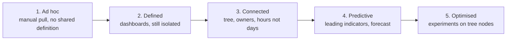

# Frameworks

Part of the [KPI Tree Guides capture](../kpitree-guides-capture.md). Grouping follows the [kpitree.co/guides](https://kpitree.co/guides) collection.

## Contents

- [7. OKR vs KPI: How OKRs and Metric Trees Work Together](#7-okr-vs-kpi-how-okrs-and-metric-trees-work-together---kpi-tree)
- [11. Balanced Scorecard vs Metric Tree](#11-balanced-scorecard-vs-metric-tree---kpi-tree)
- [12. Goodhart's Law: Why Metrics Get Gamed and How to Prevent It](#12-goodharts-law-why-metrics-get-gamed-and-how-to-prevent-it---kpi-tree)
- [18. Metrics and Behavioural Science](#18-metrics-and-behavioural-science---kpi-tree)
- [26. The Metrics Maturity Model: Five Levels From Ad Hoc to Optimised](#26-the-metrics-maturity-model-five-levels-from-ad-hoc-to-optimised---kpi-tree)
- [35. How to Track OKR Progress With Metric Trees: Scoring, Check-Ins](#35-how-to-track-okr-progress-with-metric-trees-scoring-check-ins---kpi-tree)
- [69. North Star Framework vs Metric Trees](#69-north-star-framework-vs-metric-trees---kpi-tree)
- [70. AARRR Pirate Metrics and Metric Trees](#70-aarrr-pirate-metrics-and-metric-trees---kpi-tree)
- [134. Value Driver Tree](#134-value-driver-tree---kpi-tree)
- [135. The Four Primitives of Decision Intelligence](#135-the-four-primitives-of-decision-intelligence---kpi-tree)
- [141. Value Driver Trees for Consulting and FP&A](#141-value-driver-trees-for-consulting-and-fpa---kpi-tree)
- [148. Semantic Views vs Metric Trees: Definitions vs Decisions](#148-semantic-views-vs-metric-trees-definitions-vs-decisions---kpi-tree)

---

## 7. OKR vs KPI: How OKRs and Metric Trees Work Together - KPI Tree

### Provenance

- Requested source URL: [https://kpitree.co/guides/frameworks/okrs-and-metric-trees](https://kpitree.co/guides/frameworks/okrs-and-metric-trees)
- Final fetched URL: [https://kpitree.co/guides/frameworks/okrs-and-metric-trees](https://kpitree.co/guides/frameworks/okrs-and-metric-trees)
- Canonical URL: [https://kpitree.co/guides/frameworks/okrs-and-metric-trees](https://kpitree.co/guides/frameworks/okrs-and-metric-trees)
- Retrieval timestamp (UTC): 2026-08-26T07:46:54.252Z
- HTTP status: 200
- Page title: OKR vs KPI: How OKRs and Metric Trees Work Together - KPI Tree
- Meta description: Not present
- Full response SHA-256: `02c6aa2e72634879dfc1a0a74eeee3b92b5969ba3b2a1b8041a7f7d7f6a0e171`
- Material fragment SHA-256: `db67bfebe485b709803edc668ae11c7f7b1171e5e6a40074539025bd0757da9e`

### Material

Every article about OKRs and KPIs frames them as competing frameworks. They are not. OKRs set direction and ambition. Metric trees provide the structural understanding of cause and effect that makes every key result more rigorous. Here is how they work together.

*9 min read*

**Chapters**

- [OKR vs KPI: the false choice](#the-false-choice)
- [What OKRs do well](#what-okrs-do-well)
- [What OKRs miss](#what-okrs-miss)
- [What metric trees add](#what-metric-trees-add)
- [How to connect OKRs to a metric tree](#how-to-connect)
- [The persistence advantage](#persistence-advantage)
- [When to use each framework](#when-to-use-each)

### OKR vs KPI: the false choice

> **The core idea.** OKRs and metric trees are not competing frameworks. They are complementary layers of the same system. OKRs tell you what to achieve and by when. Metric trees tell you how the business actually works, which levers connect to which outcomes, and where a change will propagate. You need both.

Search for "OKRs vs KPIs" and you will find hundreds of articles arguing for one over the other. The framing is almost always adversarial: choose OKRs for ambition, choose KPIs for accountability, pick a side. This is a false choice born from a misunderstanding of what each framework actually does. OKRs are a goal-setting cadence. Metric trees are a structural model of cause and effect. They operate at different levels of abstraction and serve different cognitive purposes. Asking which one to use is like asking whether you need a compass or a map. The compass gives you direction. The map shows you the terrain. You would not navigate difficult country with only one.

The "vs" framing persists because most organisations adopt OKRs without any structural model of their business underneath. They set ambitious objectives, brainstorm key results in a workshop, and launch into the quarter hoping the numbers they chose are the right ones. Three months later, they discover that the key result moved but the objective did not, or that the metric they targeted was a symptom rather than a cause. This is not a failure of OKRs. It is a failure of structural understanding. The OKR framework was never designed to tell you which metrics matter most or how they connect to each other. That is exactly what a metric tree does.

### What OKRs do well

OKRs have earned their place in modern organisations for good reason. When implemented well, they solve several real problems that strategic planning alone cannot address. The framework originated at Intel and was popularised at Google precisely because it fills a genuine gap between annual strategy and weekly execution. Understanding what OKRs do well is essential before examining where they fall short, because the goal is not to replace them but to strengthen them.

- **Ambition and stretch** — OKRs encourage teams to set goals beyond what feels comfortable. The distinction between committed and aspirational OKRs gives organisations a structured way to push boundaries without penalising teams for aiming high. Research on goal-setting theory, particularly the work of Locke and Latham, consistently shows that specific, challenging goals produce higher performance than vague or easy ones. OKRs operationalise this insight.
- **Alignment across teams** — When every team publishes their OKRs, the entire organisation can see who is working toward what. This transparency reduces duplicated effort and surfaces conflicts early. A product team can see that their conversion rate objective aligns with the growth team's acquisition objective, or that their planned infrastructure work conflicts with a revenue target. Alignment does not happen automatically, but OKRs create the conditions for it.
- **Quarterly cadence** — Annual goals decay rapidly. By the time Q3 arrives, the market has shifted and the priorities set in January feel disconnected from reality. OKRs reset every quarter, forcing teams to reassess what matters most given current conditions. This cadence is fast enough to stay relevant and slow enough to allow meaningful progress. It creates a natural rhythm of planning, execution, and reflection that annual cycles cannot match.
- **Focus and prioritisation** — The constraint of three to five objectives per team forces difficult conversations about what matters most. When you cannot list everything, you must choose. This constraint is one of the most valuable features of OKRs, because it compels trade-offs that most planning processes avoid. Teams that set fifteen priorities have none. Teams that set three can concentrate their energy where it will have the most impact.

### What OKRs miss

For all their strengths, OKRs have structural blind spots that become more apparent as organisations mature. These are not implementation failures or signs that a team is "doing OKRs wrong." They are inherent limitations of a framework designed for direction-setting, not for understanding the mechanics of how a business operates. Recognising these gaps is the first step toward addressing them.

- **No causal model** — OKRs describe what you want to achieve but not how changes propagate through the business. A key result like "Increase trial-to-paid conversion to 8%" says nothing about what drives conversion, which sub-metrics influence it, or what trade-offs might emerge when you optimise for it. Without a causal model, teams are left to guess which lever to pull. They might invest in onboarding improvements when the real bottleneck is pricing page friction, or they might optimise for a metric that improves locally but damages something upstream.
- **Quarterly reset creates strategy debt** — Every quarter, OKRs are retired and new ones are written. The institutional knowledge embedded in last quarter's OKRs, what worked, what did not, which assumptions were wrong, often evaporates during the transition. Teams start fresh rather than building on what they learned. Over multiple quarters, this creates a form of strategy debt: the organisation repeats patterns, revisits abandoned initiatives, and loses the compounding benefit of accumulated understanding.
- **Key results chosen without structural understanding** — In most OKR-setting workshops, teams brainstorm key results based on intuition, past experience, and available data. This process rarely involves a rigorous analysis of which metrics actually drive the objective. The result is key results that feel reasonable but may be weakly connected to the outcome they are supposed to influence. A team might choose "Reduce churn to 3%" as a key result for a revenue objective without understanding that churn in their business is primarily driven by onboarding failures in the first fourteen days, not by ongoing product dissatisfaction.
- **No verified impact** — OKRs track whether the key result number moved, but they rarely close the loop between the actions taken and the metric change observed. Did conversion increase because of the new onboarding flow, or because of a seasonal uplift? Did churn decrease because of the retention campaign, or because a large unhappy cohort had already left? Without a mechanism to verify causal impact, OKRs become a scorecard rather than a learning system. Teams celebrate green metrics without understanding what actually caused them.

### What metric trees add

A metric tree fills precisely the gaps that OKRs leave open. It does not replace the goal-setting cadence or the alignment benefits of OKRs. Instead, it provides the structural foundation that makes every OKR cycle more rigorous. Think of the metric tree as the permanent map of the business that persists across quarters, while OKRs are the routes you choose to travel each quarter based on your current position and destination.

- **A persistent causal model** — A metric tree maps how every metric in your business connects to every other. Revenue decomposes into its component drivers. Each driver decomposes further into the operational inputs that teams control. This model persists across quarters and across OKR cycles. It accumulates institutional knowledge about how the business actually works, rather than resetting that knowledge every ninety days. When you set OKRs against this structure, you can see exactly where each key result sits in the system and what it connects to.
- **Rigorous key result selection** — Instead of brainstorming key results from intuition, teams can navigate the metric tree to identify which nodes have the highest leverage on the objective. If the objective is "Accelerate revenue growth," the tree might reveal that conversion rate improvement has a 3x stronger causal relationship with revenue than reducing churn in the current business context. This does not mean churn is unimportant, but it means the team can allocate effort based on evidence rather than gut feeling.
- **Root cause diagnosis** — When a key result is off track mid-quarter, the metric tree provides an immediate diagnostic path. Instead of scheduling a cross-functional investigation, the team can trace the key result node downward through the tree to identify which sub-driver is underperforming. This turns a two-week investigation into a five-minute navigation exercise. More importantly, it surfaces the root cause rather than the symptom, so corrective action targets the right lever.
- **Cumulative organisational learning** — Each quarter, the metric tree absorbs new data about the strength and direction of relationships between metrics. Actions taken against specific nodes are logged with their outcomes. Over time, the organisation builds an evidence base of what works: which levers have the most impact, which interventions produce sustained change, and which assumptions were wrong. This compounding knowledge is exactly what quarterly OKR resets tend to destroy.

### How to connect OKRs to a metric tree

Connecting OKRs to a metric tree is not a theoretical exercise. It is a practical workflow that changes how teams set, track, and learn from their quarterly goals. The process starts with the tree and ends with OKRs that are structurally grounded rather than aspirationally vague. The following steps describe how to integrate the two frameworks into a single, coherent system.

1. **Build the metric tree first**

   Before setting any OKRs, establish a metric tree that models how your business creates value. Start with your North Star metric at the top and decompose it through two to four levels of drivers. This tree does not need to be perfect or exhaustive. It needs to capture the most important causal relationships in your business. If you already have a metric tree, review it before each OKR cycle to ensure it reflects current reality.

2. **Set objectives against tree regions, not isolated metrics**

   Rather than setting objectives in a vacuum, identify which region of the metric tree each objective targets. An objective like "Accelerate new customer acquisition" maps to a specific branch of the tree. This immediately clarifies the scope of the objective and prevents teams from accidentally optimising a metric that sits outside their area of influence. It also surfaces potential conflicts: if two teams set objectives that target the same branch, that conversation should happen before the quarter begins.

3. **Select key results by navigating tree nodes**

   For each objective, navigate the relevant branch of the metric tree to identify the specific nodes that serve as key results. Instead of brainstorming "What metrics could we track?", the team asks "Which nodes in this branch have the highest leverage and are within our control?" This grounds key result selection in the causal structure of the business. A key result like "Increase conversion rate to 4%" is chosen because the tree shows that conversion rate is the highest-leverage driver of new customer revenue, not because someone suggested it in a workshop.

4. **Track progress by monitoring the tree path**

   During the quarter, do not track key results in isolation. Monitor the full path from each key result node up through the tree to the objective. If conversion rate is improving but new customer revenue is flat, the tree will show you why: perhaps average deal size is declining, or the traffic mix has shifted toward lower-intent channels. This contextual monitoring prevents teams from celebrating key result progress that is not translating into objective progress. In KPI Tree this divergence is surfaced automatically: every objective tracks outcome progress and execution progress as separate lanes, and flags when they part ways.

5. **Close the quarter by updating the tree with what you learned**

   At the end of each OKR cycle, feed what you learned back into the metric tree. Did the causal relationship between conversion rate and revenue hold as expected? Was the leverage estimate accurate? Were there unexpected side effects on adjacent nodes? This step is what transforms a quarterly planning exercise into a compounding knowledge system. Each cycle makes the tree more accurate, which makes the next cycle's OKRs more rigorous.

The following metric tree illustrates how this works in practice. An e-commerce business has Revenue as its North Star metric, decomposed into its causal drivers. During OKR planning, the team navigates the tree and selects specific nodes as key results. The key result "Increase conversion rate to 4%" maps directly to the Conversion Rate node, chosen because the tree shows it has the strongest causal link to revenue growth given current performance levels.

- Revenue
  - Number of Orders
    - Website Traffic
      - Organic Traffic
      - Paid Traffic
    - Conversion Rate (KR: 4%)
      - Landing Page CVR
      - Checkout Completion Rate
  - Average Order Value
    - Items per Order
    - Average Item Price

Notice that the key result is not floating in isolation. It sits within a structure that shows what drives it (Landing Page CVR and Checkout Completion Rate) and what it drives (Number of Orders, and ultimately Revenue). This context changes how the team thinks about the key result. They can see that improving Landing Page CVR is one path to the key result, and improving Checkout Completion Rate is another. They can also see that even if Conversion Rate improves, Revenue will only grow if Website Traffic and Average Order Value hold steady. The tree provides the contextual awareness that isolated key results lack.

### The persistence advantage

The single most important difference between OKRs and metric trees is their relationship with time. OKRs are designed to reset. Every quarter, objectives are retired, key results are scored, and the slate is wiped for a fresh set. This cadence is valuable for maintaining urgency and relevance, but it carries a hidden cost: institutional knowledge about how the business works is discarded along with the objectives.

Consider a team that spends Q1 pursuing a conversion rate target. By the end of the quarter, they have learned that checkout page load time is the primary driver of cart abandonment in their business. They have data showing the relationship between load time and completion rate. They understand which user segments are most affected. This is valuable, hard-won knowledge about the causal structure of their business. But when Q2 arrives, the team sets new OKRs. The conversion rate work is "done" or "parked." The new objectives focus on retention. The knowledge accumulated in Q1 lives in a retrospective document that nobody will read again.

A metric tree prevents this loss. The relationship between checkout page load time and conversion rate does not disappear when the quarter ends. It is encoded in the tree as a permanent structural fact about the business, with correlation data that strengthens over time. When Q3 rolls around and the team revisits conversion rate, they do not start from scratch. They start from the accumulated evidence of every previous cycle. This is the compounding effect that OKRs alone cannot achieve.

> “OKRs reset every quarter. The metric tree persists. Over time, the tree becomes the organisation's accumulated understanding of how the business works, a structural memory that makes every future quarter's planning more informed, more precise, and less dependent on intuition.”

There is a behavioural dimension to this persistence that deserves attention. Research on organisational learning, particularly the work of Argyris and Schon on double-loop learning, distinguishes between adjusting actions within existing assumptions (single-loop) and questioning the assumptions themselves (double-loop). OKRs naturally encourage single-loop learning: did we hit the number? Metric trees encourage double-loop learning: is our model of the business correct? When a team discovers that the assumed relationship between two metrics is weaker than expected, or that an undocumented driver has a stronger influence than anything in the current tree, they are updating the model itself, not just the targets within it. This kind of learning compounds across quarters and across teams. It is the difference between an organisation that gets better at hitting targets and one that gets better at understanding itself.

### When to use each framework

The question is not whether to use OKRs or metric trees. It is understanding which situations call for the strengths of each framework and where combining them produces outcomes that neither can achieve alone. The following table maps common organisational situations to the framework best suited to address them.

| Situation | OKRs | Metric trees | Both together |
| --- | --- | --- | --- |
| Setting quarterly priorities | Define 3-5 ambitious objectives that focus effort | Identify which tree branches have the most leverage | Objectives grounded in structural understanding, key results selected from high-leverage nodes |
| Aligning teams across the organisation | Published OKRs make each team's focus visible | Shared tree shows how each team's metrics connect to company outcomes | Teams see both what others are targeting and how their work relates structurally |
| Diagnosing a metric that is off track | Flags that a key result is behind target | Traces the root cause through causal relationships to the driver that changed | Early warning from OKR tracking, rapid diagnosis through tree navigation |
| Building institutional knowledge | Quarterly retros capture lessons, but they are rarely revisited | Causal relationships and correlation strengths accumulate in the tree permanently | Lessons from OKR cycles are encoded as structural knowledge in the tree |
| Onboarding new team members | Current OKRs show what the team is working toward this quarter | The tree shows how the business works and where the team fits within it | New hires understand both the immediate priorities and the structural context |
| Evaluating the impact of an initiative | Did the key result number move? | Did the target node move, and did the change propagate as expected through the tree? | Confirmed outcome achievement with verified causal impact and no unintended side effects |

The pattern in this table is consistent. OKRs excel at creating focus, urgency, and alignment on what to achieve within a bounded time frame. Metric trees excel at providing structural understanding, causal diagnosis, and persistent knowledge. Neither is complete without the other. An organisation that uses only OKRs has direction without understanding. An organisation that uses only metric trees has understanding without cadence. The most effective approach treats OKRs as the quarterly rhythm and the metric tree as the enduring structure that makes each cycle more intelligent than the last.

KPI Tree implements this combination directly. Objectives and key results live on the causal metric tree as first-class objects: each key result is a real metric that completes when it hits target, outcome and execution are tracked apart so a delivered plan cannot hide a flat number, and initiatives carry a budget, an owner and milestones as the funded work behind each objective. The whole plan is drawn on a live [strategy map](https://kpitree.co/platform/strategy-execution) in the same visual language as the tree, so the monitoring described in this guide runs itself rather than depending on someone remembering to walk the path.

### Continue reading

- [What is a metric tree?](./getting-started.md#1-what-is-a-metric-tree---kpi-tree)
  - A metric tree maps cause and effect so every team sees what moves the needle
- [Metric tree vs KPI tree](./getting-started.md#4-metric-tree-vs-kpi-tree-vs-value-driver-tree---kpi-tree)
  - How a KPI tree and value driver tree compare to a metric tree
- [What is a North Star metric?](./core-concepts.md#5-north-star-metric-what-it-is-and-how-to-find-yours---kpi-tree)
  - Choose the right north star metric and make it actionable

---

---

## 11. Balanced Scorecard vs Metric Tree - KPI Tree

### Provenance

- Requested source URL: [https://kpitree.co/guides/frameworks/balanced-scorecard-vs-metric-tree](https://kpitree.co/guides/frameworks/balanced-scorecard-vs-metric-tree)
- Final fetched URL: [https://kpitree.co/guides/frameworks/balanced-scorecard-vs-metric-tree](https://kpitree.co/guides/frameworks/balanced-scorecard-vs-metric-tree)
- Canonical URL: [https://kpitree.co/guides/frameworks/balanced-scorecard-vs-metric-tree](https://kpitree.co/guides/frameworks/balanced-scorecard-vs-metric-tree)
- Retrieval timestamp (UTC): 2026-08-26T07:46:54.252Z
- HTTP status: 200
- Page title: Balanced Scorecard vs Metric Tree - KPI Tree
- Meta description: Not present
- Full response SHA-256: `82a43a5feac4431b8f89c1fed106a44f1c27f0b8ac8a24ce7a931027de4040de`
- Material fragment SHA-256: `dc43bbeaf1dadac2426ada9412a7faf8d2ef097c3eb92fc9b3a76a30a52a3168`

### Material

The Balanced Scorecard has shaped how organisations measure performance for over thirty years. Metric trees take a fundamentally different approach. This guide compares the two frameworks honestly, explains where each excels, and helps you decide which one fits your business.

*8 min read*

**Chapters**

- [The short answer](#the-short-answer)
- [What is the Balanced Scorecard?](#what-is-the-balanced-scorecard)
- [Where the Balanced Scorecard falls short](#where-the-balanced-scorecard-falls-short)
- [How metric trees solve these limitations](#how-metric-trees-solve-these-limitations)
- [When to use each](#when-to-use-each)
- [From Balanced Scorecard to metric tree](#from-balanced-scorecard-to-metric-tree)

### The short answer

> **The short answer.** The Balanced Scorecard organises metrics into four fixed perspectives: financial, customer, internal process, and learning and growth. A metric tree organises metrics by causal relationships, showing how operational inputs drive strategic outcomes. Both aim to connect strategy to measurement, but they differ fundamentally in structure. The Balanced Scorecard groups metrics by category. A metric tree connects them by cause and effect.

### What is the Balanced Scorecard?

Robert Kaplan and David Norton introduced the Balanced Scorecard in a 1992 Harvard Business Review article titled "The Balanced Scorecard: Measures That Drive Performance". At the time, most organisations measured success almost entirely through financial metrics. Revenue, profit margin, return on equity. Kaplan and Norton argued this was dangerously incomplete. Financial results are lagging indicators. By the time you see them, the underlying conditions that produced them happened months or quarters ago. You cannot steer a business by looking only in the rear-view mirror.

The Balanced Scorecard was genuinely revolutionary. It gave executives a structured way to think beyond financial results and consider the operational, customer, and organisational drivers that produce those results. Thousands of organisations adopted it, and it became one of the most influential management frameworks of the twentieth century. The Harvard Business Review named it one of the most important management ideas of the past 75 years. That influence was well deserved.

- **Financial perspective** — How do we look to shareholders? This perspective captures the traditional financial metrics: revenue growth, profitability, return on capital, and cash flow. In the Balanced Scorecard, these are the ultimate outcomes that the other three perspectives should drive.
- **Customer perspective** — How do customers see us? Metrics here include customer satisfaction, retention, acquisition, and market share. The premise is that strong customer outcomes lead to strong financial outcomes, though the Balanced Scorecard does not specify the mathematical relationship between them.
- **Internal process perspective** — What must we excel at? This perspective covers the operational processes that deliver value to customers: cycle time, quality, productivity, and innovation pipeline. Improving these processes should, in theory, improve customer and then financial outcomes.
- **Learning and growth perspective** — How can we continue to improve? This perspective addresses the organisational foundations: employee skills, culture, technology infrastructure, and knowledge management. It is the most forward-looking of the four perspectives and often the most difficult to measure.

### Where the Balanced Scorecard falls short

The Balanced Scorecard was designed for a world of quarterly reporting cycles and annual strategy reviews. It did its job well in that context. But the operating environment has changed dramatically since 1992, and several structural limitations have become increasingly apparent as organisations demand faster, more granular, and more data-driven performance management.

- **Fixed four-perspective structure** — Not every business maps neatly onto four perspectives. A marketplace has supply-side and demand-side dynamics that cut across the customer and internal process categories. A platform business has network effects that do not sit cleanly in any single perspective. The rigid structure forces organisations to fit their reality into a predetermined framework rather than building a framework that reflects their reality.
- **No mathematical relationships** — The Balanced Scorecard assumes that the four perspectives are connected, but it does not define the relationships mathematically. "Improving employee training leads to better processes which leads to happier customers which leads to higher revenue" is a hypothesis, not a quantified relationship. You cannot use the scorecard to answer "if we improve training satisfaction by 10%, how much will revenue increase?"
- **Difficult root cause diagnosis** — When a financial metric misses its target, the Balanced Scorecard tells you to look across four perspectives for possible causes. But it does not provide a structured path from symptom to root cause. Teams end up in meetings debating which perspective holds the answer, rather than following a chain of cause and effect to the specific driver that changed.
- **Encourages siloed ownership** — The four perspectives often map to organisational functions: finance owns financial metrics, marketing owns customer metrics, operations owns process metrics, HR owns learning metrics. This creates the exact departmental silos the framework was meant to bridge. Each team optimises its own perspective without a shared understanding of how their metrics connect to everyone else's.
- **Static strategy maps** — Kaplan and Norton later introduced strategy maps as a companion to the scorecard. These maps draw arrows between objectives across the four perspectives. In practice, these maps are created during an annual planning process, printed, and rarely revisited. They do not update as the business learns, and they cannot reflect the real-time dynamics of a fast-moving organisation.

### How metric trees solve these limitations

A metric tree takes the core insight of the Balanced Scorecard, that organisations need to measure more than financial outcomes, and implements it with a fundamentally different structure. Instead of grouping metrics into fixed categories, a metric tree connects them through explicit causal relationships. Every metric is a child of the metrics it drives, and a parent of the metrics that drive it. The result is a single, connected model of your business that you can navigate from strategic outcomes down to operational inputs.

| Dimension | Balanced Scorecard | Metric tree |
| --- | --- | --- |
| Structure | Four fixed perspectives defined by the framework | Flexible hierarchy shaped by your business model |
| Relationships | Assumed causal links between perspectives | Mathematically defined relationships between metrics |
| Diagnosis | Requires manual analysis across perspectives | Walk the tree from outcome to root cause |
| Ownership | Perspective-level or department-level | Named owner on every individual metric |
| Adaptability | Rigid framework revisited annually | Grows and evolves as the business learns |
| Data connection | Typically static scorecards and reports | Connected to live data sources with real-time values |

The comparison table above highlights structural differences, but the most important difference is practical. When a number moves in a Balanced Scorecard, you convene a meeting and discuss possible causes across four perspectives. When a number moves in a metric tree, you open the tree, look at the children of the metric that changed, and identify exactly which driver shifted. Then you look at that driver's children to go one level deeper. This process of walking the tree replaces hours of cross-functional debate with minutes of structured investigation.

### When to use each

The Balanced Scorecard still serves a purpose in certain contexts. Organisations in heavily regulated industries sometimes adopt it because regulators and auditors understand the framework and expect to see performance reported through its lens. Boards that have used the Balanced Scorecard for years may value continuity over a structural change. Teams that are new to structured performance management may find the four-perspective model a useful starting point because it gives them a clear, bounded set of categories to think about. There is no shame in starting with a Balanced Scorecard if it gets your organisation thinking beyond financial metrics for the first time.

Metric trees are the better choice when your organisation needs causal understanding, not just categorised measurement. If your leadership team asks "why did this number change?" more than "what are our numbers?", a metric tree is the right framework. Data-driven organisations, product-led businesses, and fast-moving teams benefit most because the tree structure mirrors how their business actually works rather than fitting it into a predetermined model. If you operate in an environment where quarterly strategy reviews feel too slow and you need to diagnose and respond to performance changes in days rather than months, a metric tree provides the structural support for that pace.

If your organisation currently uses a Balanced Scorecard, the migration path is straightforward. Start by listing every metric from your existing scorecard across all four perspectives. Then ask a simple question for each metric: what drives this? Map those causal relationships and you will naturally produce a tree structure. You will likely discover that metrics from different perspectives connect directly to each other, something the four-perspective grouping obscured. A customer satisfaction metric in the Customer perspective might directly drive a retention metric, which directly drives a revenue metric in the Financial perspective. In a metric tree, that chain is explicit and navigable. In a scorecard, those connections live only in people's heads.

### From Balanced Scorecard to metric tree

Consider a simplified Balanced Scorecard for a SaaS business. The Financial perspective contains revenue and profit margin. The Customer perspective contains customer satisfaction and churn rate. The Internal Process perspective contains deployment frequency and support response time. The Learning and Growth perspective contains employee engagement and training completion rate. In the scorecard, these eight metrics sit in four separate boxes. They are reported independently, owned by different departments, and reviewed in isolation.

- Revenue
  - New customer revenue
    - Trial-to-paid conversion
      - Onboarding completion rate
      - Time to first value
    - Marketing qualified leads
  - Existing customer revenue
    - Net revenue retention
      - Customer satisfaction (NPS)
        - Support response time
        - Product reliability
          - Deployment frequency
          - Engineering team capability
      - Churn rate

Notice what happened when we reorganised the same metrics into a tree. Customer satisfaction is no longer isolated in a "Customer" box. It is explicitly connected to support response time and product reliability below it, and to net revenue retention above it. Deployment frequency is not an abstract Internal Process metric anymore. It is a driver of product reliability, which drives customer satisfaction, which drives retention, which drives revenue. The causal chain is visible, navigable, and testable.

This reorganisation also reveals gaps. The Balanced Scorecard might have included "employee engagement" in the Learning and Growth perspective without specifying how it connects to anything else. When you build a tree, you are forced to ask: engagement drives what, exactly? If you cannot draw a clear line from a metric to a parent, that metric either needs rethinking or it does not belong in your measurement system. The tree structure imposes a discipline that the four-perspective model does not. Every metric must earn its place by connecting to something above and below it.

The Balanced Scorecard gave organisations a shared language for thinking beyond financial results. That contribution is lasting and important. But the world has moved on. Organisations now have access to real-time data, sophisticated analytics, and tools that can maintain living models of their business. A metric tree takes the Balanced Scorecard's core insight and implements it in a way that reflects how modern businesses actually operate: interconnected, fast-moving, and data-rich. If your scorecard is gathering dust in a quarterly report, it might be time to let the tree grow.

### Continue reading

- [What is a metric tree?](./getting-started.md#1-what-is-a-metric-tree---kpi-tree)
  - A metric tree maps cause and effect so every team sees what moves the needle
- [OKRs and metric trees: how they work together](#7-okr-vs-kpi-how-okrs-and-metric-trees-work-together---kpi-tree)
  - OKR vs KPI is a false choice, you need both
- [Leading vs lagging indicators](./core-concepts.md#6-leading-vs-lagging-indicators-explained-examples---kpi-tree)
  - How leading vs lagging indicators connect in a metric tree

---

---

## 12. Goodhart's Law: Why Metrics Get Gamed and How to Prevent It - KPI Tree

### Provenance

- Requested source URL: [https://kpitree.co/guides/frameworks/goodharts-law](https://kpitree.co/guides/frameworks/goodharts-law)
- Final fetched URL: [https://kpitree.co/guides/frameworks/goodharts-law](https://kpitree.co/guides/frameworks/goodharts-law)
- Canonical URL: [https://kpitree.co/guides/frameworks/goodharts-law](https://kpitree.co/guides/frameworks/goodharts-law)
- Retrieval timestamp (UTC): 2026-08-26T07:46:54.252Z
- HTTP status: 200
- Page title: Goodhart's Law: Why Metrics Get Gamed and How to Prevent It - KPI Tree
- Meta description: Not present
- Full response SHA-256: `b35f452ed26d0d7ab906951a57956ab071f35a40da226038924f59ef687f60ce`
- Material fragment SHA-256: `776c0836278b37e4a38259f93114ea2f36fd018e3435e48d1705ab2a5295a55e`

### Material

When a measure becomes a target, it ceases to be a good measure. Goodhart's Law is the single most important concept in metric design, and most organisations learn it the hard way. This guide explains why metrics get gamed, how to spot it, and how to build measurement systems that resist it.

*9 min read*

**Chapters**

- [What is Goodhart's Law?](#what-is-goodharts-law)
- [Real-world examples of Goodhart's Law](#real-world-examples)
- [Why metrics get gamed](#why-metrics-get-gamed)
- [How to design metrics that resist gaming](#how-to-design-metrics-that-resist-gaming)
- [How metric trees help prevent Goodhart's Law](#how-metric-trees-prevent-goodharts-law)
- [The deeper lesson](#the-deeper-lesson)

### What is Goodhart's Law?

> **Goodhart's Law.** "When a measure becomes a target, it ceases to be a good measure." This principle, first articulated by the British economist Charles Goodhart in 1975, is the foundational insight behind every metric that has ever backfired.

Charles Goodhart originally formulated his law in the context of monetary policy. He observed that when the Bank of England began targeting specific monetary aggregates, the statistical relationships that had made those aggregates useful as indicators promptly broke down. The act of targeting a measure changed the behaviour of the system being measured, which in turn destroyed the measure's predictive value. What had been a reliable signal became noise the moment it was elevated to a target.

The anthropologist Marilyn Strathern later generalised this insight beyond economics, restating it as: "When a measure becomes a target, it ceases to be a good measure." Her formulation stripped away the domain-specific context and revealed the universal principle beneath. It applies to monetary policy, to education, to healthcare, to software development, and to every organisation that uses metrics to manage performance. The mechanism is always the same: people optimise for what is measured, and in doing so they change the system in ways that decouple the measure from the underlying reality it was meant to represent.

This matters for every organisation that relies on metrics to make decisions, allocate resources, or evaluate performance. If you set a target, people will find ways to hit it. Some of those ways will involve genuinely improving the thing you care about. Others will involve gaming the metric itself, optimising the number while leaving the underlying reality unchanged or even degrading it. The gap between what the metric measures and what you actually care about is where Goodhart's Law lives. Understanding this gap is not optional. It is the difference between a measurement system that guides good decisions and one that actively produces bad ones.

### Real-world examples of Goodhart's Law

Goodhart's Law is not a theoretical curiosity. It has produced spectacular failures across industries and centuries. The examples below span governments, corporations, and everyday business operations. Each one follows the same pattern: a reasonable-sounding metric is turned into a target, people optimise for the target rather than the outcome it was meant to represent, and the result is the opposite of what was intended.

- **The cobra effect** — During British colonial rule in India, the government offered a bounty for dead cobras to reduce the snake population. Enterprising citizens began breeding cobras to collect the bounty. When the government discovered this and scrapped the programme, the breeders released their now-worthless cobras, increasing the population beyond its original level. The metric (dead cobras) was a perfect proxy for the goal (fewer cobras) until it became a target.
- **Soviet nail factories** — When Soviet central planners set production targets by weight, factories produced small numbers of absurdly heavy nails that nobody could use. When they switched to targets based on quantity, factories produced millions of tiny, equally useless nails. Each metric was reasonable in isolation. As a target, each produced behaviour that satisfied the number while completely undermining the purpose.
- **Bank account fraud** — A major US bank set aggressive targets for the number of accounts opened per employee. Staff responded by opening millions of unauthorised accounts in existing customers' names. The metric (accounts opened) was meant to proxy for customer acquisition and cross-selling. Instead, it incentivised fraud on an industrial scale, resulting in billions in fines and lasting reputational damage.
- **Call centre handle time** — Many call centres target average handle time, the average duration of a customer call. When agents are evaluated on this metric, the rational response is to end calls as quickly as possible, even if the customer's problem is unresolved. Some agents hang up on difficult calls entirely. The metric goes down, customer satisfaction goes down with it, and repeat call volume goes up.
- **Standardised testing in schools** — When schools are evaluated and funded based on standardised test scores, teachers allocate disproportionate time to test preparation at the expense of broader learning. Subjects not covered by the test are deprioritised. Students learn to pass the test rather than to understand the material. The metric (test scores) rises while the thing it was meant to measure (educational quality) stagnates or declines.
- **SaaS sign-up targets** — A SaaS marketing team targeted on the number of sign-ups will naturally optimise for volume over quality. Free trial sign-ups increase, but lead-to-customer conversion drops because the new sign-ups were never genuinely interested in the product. The marketing team hits their number. The sales team misses theirs. The business is worse off despite the metric improving.

The common thread across all of these examples is not malice. In most cases, the people gaming the metric were responding rationally to the incentive structure they were given. The call centre agent who hangs up on a difficult call is not trying to harm the company. They are trying to meet the target that determines their performance review, their bonus, or their continued employment. The failure is in the metric design, not in the people responding to it. This distinction matters because the solution to Goodhart's Law is not to punish gaming. It is to design measurement systems where gaming is either impossible or indistinguishable from genuine improvement.

### Why metrics get gamed

Understanding why metrics get gamed requires going beyond the observation that people respond to incentives. The behavioural science behind Goodhart's Law is well established, and it reveals that the problem is structural, not moral. Several reinforcing mechanisms drive the gap between what a metric measures and what an organisation actually wants.

Self-determination theory, developed by Edward Deci and Richard Ryan, demonstrates that extrinsic motivators such as targets, bonuses, and performance reviews can crowd out intrinsic motivation. When people are intrinsically motivated, they care about doing good work for its own sake. When an extrinsic target is introduced, their focus shifts from the work itself to the number that represents it. A teacher who loves helping students learn becomes a teacher who loves raising test scores. A developer who takes pride in code quality becomes a developer who closes tickets. The metric does not just measure behaviour. It reshapes it.

Campbell's Law, the social science cousin of Goodhart's Law, states that the more any quantitative social indicator is used for decision making, the more subject it will be to corruption pressures and the more apt it will be to distort and corrupt the social processes it is intended to monitor. Donald Campbell published this in 1979, and it has been validated repeatedly in education, policing, healthcare, and corporate management. The mechanism is straightforward: when a metric carries high stakes, people allocate their effort toward influencing the metric specifically, even when that effort would be better spent on the broader objective.

The principal-agent problem compounds these effects. The person setting the target (the principal) and the person being measured against it (the agent) have different information and often different interests. The principal cannot perfectly observe the agent's behaviour, so they use the metric as a proxy. But the agent, who understands their own context far better than the principal does, can identify ways to satisfy the metric without satisfying the principal's actual intent. This information asymmetry is the engine that drives gaming. The wider the gap between what is measured and what is valued, the more room there is for the agent to exploit it.

Finally, targets create a narrowing of attention that psychologists call goal fixation. When people are given a specific number to hit, they develop tunnel vision around that number at the expense of everything else. This is not laziness or dishonesty. It is a well-documented cognitive effect. The metric becomes the frame through which all decisions are filtered, and anything outside that frame, no matter how important, fades from view.

### How to design metrics that resist gaming

Goodhart's Law cannot be eliminated entirely. As long as metrics carry consequences, people will optimise for them. But the gap between the metric and the outcome it represents can be narrowed dramatically through thoughtful design. The principles below are drawn from behavioural science, systems thinking, and hard-won operational experience.

1. **Pair every quantity metric with a quality metric**

   This is the single most effective defence against gaming. If you measure the number of leads generated, also measure lead-to-opportunity conversion rate. If you measure tickets closed, also measure customer satisfaction per ticket. If you measure lines of code written, also measure defect rate. The pairing makes it impossible to game one metric without exposing the distortion in the other. A call centre that measures both handle time and first-call resolution rate forces agents to find genuinely efficient solutions rather than simply ending calls.

2. **Balance leading and lagging indicators**

   Leading indicators (such as pipeline created or features shipped) are easy to game because they are close to the activity being measured. Lagging indicators (such as revenue retained or customer lifetime value) are harder to game because they reflect real outcomes over time, but they are too slow to guide daily decisions. Using both creates a measurement system where short-term activity is validated against long-term results. If the leading indicators improve but the lagging indicators do not follow, you know something is being gamed.

3. **Measure outcomes, not just outputs**

   Outputs are the things people produce: features shipped, calls made, reports written. Outcomes are the results those outputs are meant to create: customer problems solved, revenue generated, decisions improved. When you target outputs, people will produce more of them regardless of whether they achieve anything. When you target outcomes, people have to think about whether their outputs actually work. This shifts the focus from activity to impact.

4. **Rotate metrics periodically**

   Any metric that remains a target long enough will eventually be gamed. People learn the system, discover its gaps, and optimise for the letter rather than the spirit. Rotating which metrics receive attention (while keeping the core set stable for trend analysis) prevents this ossification. You are not changing what you measure. You are changing which measurement carries the most weight in any given period. This keeps teams focused on the broader system rather than on a single number.

5. **Create transparency through metric trees**

   A metric tree connects every metric to the ones above and below it through causal relationships. This transparency makes gaming visible. If a team games "leads generated" but the parent metric "lead-to-opportunity rate" declines, the tree exposes the distortion immediately. Metric trees also distribute accountability across a system rather than concentrating it on a single number, which reduces the incentive to game any one metric at the expense of others.

6. **Build in qualitative checks**

   Not everything that matters can be quantified, and not everything that is quantified matters equally. Regular qualitative reviews, such as case studies of individual customer interactions, peer code reviews, or deal retrospectives, provide a counterweight to purely numerical targets. They surface the context that numbers alone cannot capture and create accountability for the spirit of the goal, not just the letter of the metric.

No single principle on this list is sufficient on its own. The power comes from combining them into a measurement system that is resistant to gaming at multiple levels. A well-designed system pairs quantity with quality, balances leading indicators against lagging ones, connects every metric to its neighbours in a tree, and supplements the numbers with qualitative judgement. It is not gaming-proof, because nothing is. But it raises the cost of gaming to the point where genuine improvement becomes the easier path.

### How metric trees help prevent Goodhart's Law

Goodhart's Law thrives in isolation. When a metric exists as a standalone number, disconnected from the system it is meant to represent, there are no guardrails to prevent it from being gamed. A metric tree changes this dynamic fundamentally. By connecting every metric to its parent (the outcome it contributes to) and its children (the inputs that drive it), a tree creates a web of relationships where gaming one metric produces visible distortions in the metrics around it.

Consider a SaaS marketing team that is targeted on leads generated. In a flat dashboard, they can inflate this number by lowering qualification criteria, running broad campaigns that attract unqualified sign-ups, or even purchasing email lists. The number goes up, the target is hit, and nobody notices the problem until the sales team complains weeks later. In a metric tree, however, leads generated sits beneath lead-to-opportunity rate and alongside lead quality score. The moment the team inflates lead volume through low-quality channels, the conversion rate drops visibly in the tree. The gaming is exposed not by a manager's intuition but by the structure of the measurement system itself.

This structural transparency is the key insight. A metric tree does not prevent people from wanting to game metrics. It prevents them from doing so invisibly. When every metric is connected to its neighbours, gaming one metric without affecting the others requires actually improving the underlying reality, which is the goal in the first place. The tree turns the incentive structure from "hit your number by any means" into "improve your part of the system without degrading the rest."

- Marketing-sourced Revenue
  - Leads Generated
    - Organic Leads
    - Paid Leads
    - Referral Leads
  - Lead-to-Opportunity Rate
    - Lead Quality Score
    - Response Time
  - Opportunity-to-Close Rate
    - Deal Size
    - Sales Cycle Length

In the tree above, gaming "Leads Generated" by lowering quality would immediately show up as a decline in "Lead-to-Opportunity Rate" and a drop in "Lead Quality Score." The tree makes the trade-off visible to everyone, not just the person gaming the metric. This is profoundly different from a dashboard where each number exists in its own silo. The tree reveals the causal structure of the business, and causal structure is exactly what Goodhart's Law exploits when it is hidden.

Metric trees also address the problem of tunnel vision. When a team owns a single metric in isolation, that metric becomes their entire world. Every decision is filtered through it, and every adjacent concern is treated as someone else's problem. A metric tree reframes the relationship: your metric is part of a system, and your job is to improve it without degrading the metrics around it. This systemic framing shifts behaviour from local optimisation to global improvement, which is precisely the shift that Goodhart's Law demands.

### The deeper lesson

It is tempting to read Goodhart's Law as an argument against measurement. If every metric that becomes a target stops being useful, why measure anything at all? This conclusion is understandable but wrong. Goodhart's Law is not an argument against measurement. It is an argument against naive measurement, against the assumption that a single number can capture a complex reality, that hitting a target is the same as achieving a goal, or that the map is the territory.

The organisations that fall hardest to Goodhart's Law are not the ones that measure too much. They are the ones that measure too narrowly. They pick a single metric, elevate it to a target, attach consequences to it, and then wonder why people optimise for the number instead of the outcome. The solution is not less measurement but richer measurement: systems of interconnected metrics where each number is checked by its neighbours, where quantity is balanced by quality, where leading indicators are validated by lagging ones, and where the structure of the measurement system mirrors the structure of the business itself.

> “The goal of measurement is not to produce numbers. It is to produce understanding. When your measurement system helps people understand how the business works, what drives outcomes, and where the leverage points are, gaming becomes both harder and less attractive. Understanding is the antidote to Goodhart's Law.”

This is the deeper insight that metric trees embody. A tree does not just organise metrics. It encodes a theory of how the business works: which inputs drive which outputs, how changes in one area ripple through to others, and where the causal relationships are strong or weak. When people interact with this model, they develop a systemic understanding that makes narrow optimisation feel obviously counterproductive. They can see that gaming leads generated will harm lead-to-opportunity rate, which will harm marketing-sourced revenue, which will harm total revenue. The tree does not just prevent gaming through surveillance. It prevents gaming through comprehension.

Goodhart's Law will never be fully overcome. As long as humans design metrics and other humans are evaluated against them, there will be a gap between the measure and the thing it represents. But the size of that gap is a design choice. Organisations that build rich, interconnected measurement systems, that pair quantity with quality, that use trees to expose causal relationships, and that supplement numbers with qualitative judgement, will find the gap small enough to live with. Those that rely on isolated targets and hope for the best will rediscover Goodhart's Law every quarter, wondering each time why the numbers look good and the business does not.

### Continue reading

- [What is a North Star metric?](./core-concepts.md#5-north-star-metric-what-it-is-and-how-to-find-yours---kpi-tree)
  - Choose the right north star metric and make it actionable
- [Leading vs lagging indicators](./core-concepts.md#6-leading-vs-lagging-indicators-explained-examples---kpi-tree)
  - How leading vs lagging indicators connect in a metric tree
- [Metric ownership](./core-concepts.md#9-metric-ownership-who-should-own-which-metric---kpi-tree)
  - The most underrated lever in business performance

---

---

## 18. Metrics and Behavioural Science - KPI Tree

### Provenance

- Requested source URL: [https://kpitree.co/guides/frameworks/metrics-and-behavioural-science](https://kpitree.co/guides/frameworks/metrics-and-behavioural-science)
- Final fetched URL: [https://kpitree.co/guides/frameworks/metrics-and-behavioural-science](https://kpitree.co/guides/frameworks/metrics-and-behavioural-science)
- Canonical URL: [https://kpitree.co/guides/frameworks/metrics-and-behavioural-science](https://kpitree.co/guides/frameworks/metrics-and-behavioural-science)
- Retrieval timestamp (UTC): 2026-08-26T07:46:54.252Z
- HTTP status: 200
- Page title: Metrics and Behavioural Science - KPI Tree
- Meta description: Not present
- Full response SHA-256: `15512a6bde9f87e5159b6b5d0fe3fd8cb93df1131fba5771afa98d744453a7d9`
- Material fragment SHA-256: `aeef4b7e465160edcc93e210da702d0e8fb6db5774fcc6cbd5a5411e7ce6bbaf`

### Material

Metrics are not neutral instruments. Every metric you choose is a behavioural intervention, whether you design it that way or not. This guide draws on decades of research in behavioural economics, psychology, and organisational science to explain why metrics change behaviour and how to use that power responsibly.

*10 min read*

**Chapters**

- [Why metrics change behaviour](#why-metrics-change-behaviour)
- [Five behavioural principles behind effective metrics](#five-behavioural-principles)
- [How metric trees amplify these principles](#how-metric-trees-amplify)
- [The dark side: when metrics backfire](#when-metrics-backfire)
- [Designing metrics for behaviour change](#designing-metrics-for-behaviour-change)
- [The metric tree as a nudge architecture](#metric-tree-as-nudge-architecture)
- [From measurement to understanding](#from-measurement-to-understanding)

### Why metrics change behaviour

In the late 1920s, researchers at the Hawthorne Works factory near Chicago made an accidental discovery that would reshape organisational science. They found that workers became more productive when they knew they were being observed, regardless of what was being changed in their environment. Lighting, break schedules, pay structures: none of it mattered as much as the simple fact of measurement. The act of observing changed what was observed. This became known as the Hawthorne effect, and it remains one of the most replicated findings in the behavioural sciences.

The implication for anyone who works with business metrics is profound. The moment you start measuring something, you change it. Not because the metric itself has causal power, but because human beings respond to what is visible, tracked, and discussed. A metric focuses attention. It creates a feedback loop between action and outcome. It introduces accountability, because someone will eventually ask why the number went up or went down. These are not side effects of measurement. They are the primary mechanism through which metrics create value.

This means that choosing which metrics to track is never a neutral, technical decision. It is a behavioural intervention. When a leadership team decides to measure customer acquisition cost, they are not just gathering information. They are telling the organisation to pay attention to efficiency. When they add net revenue retention to the dashboard, they are signalling that keeping existing customers matters as much as finding new ones. The metrics you choose shape what people notice, what they optimise for, and what they ignore.

> **The core insight.** Every metric you choose is a behavioural intervention, whether you design it that way or not. The question is not whether your metrics change behaviour. They already do. The question is whether they change behaviour in the direction you intend.

Understanding this principle changes how you approach metric design. Instead of asking "what should we measure?" you start asking "what behaviour do we want to encourage, and which metric will make that behaviour more likely?" This shift from measurement-first thinking to behaviour-first thinking is the foundation of everything that follows in this guide. It draws on work from Kahneman and Tversky in decision-making under uncertainty, Cialdini in social influence, Deci and Ryan in intrinsic motivation, and Thaler and Sunstein in choice architecture. Each of these research traditions offers specific, actionable insight into why metrics work the way they do and how to make them work better.

### Five behavioural principles behind effective metrics

Decades of research in behavioural economics and psychology have identified specific mechanisms that explain how and why measurement influences human behaviour. These are not abstract theories. They are well-documented patterns with strong empirical support, and each one maps directly to how metrics function inside organisations. Understanding them allows you to design metrics that work with human psychology rather than against it.

- **Salience** — What is visible gets attention. Daniel Kahneman demonstrated that human cognition is heavily influenced by what is immediately available to the mind, a principle he called the availability heuristic. Applied to metrics, this means that the numbers people see most often are the numbers they optimise for. A metric buried in a quarterly report has almost no behavioural effect. A metric displayed prominently on a team dashboard, reviewed weekly, and discussed in every stand-up becomes a focal point for attention and effort. Salience is not just about visibility. It is about frequency and context. The metric must appear at the moment when a decision is being made.
- **Feedback loops** — Faster feedback produces faster learning. This principle has roots in operant conditioning, where the timing between an action and its consequence determines how quickly behaviour is shaped. B.F. Skinner demonstrated that immediate reinforcement is dramatically more effective than delayed reinforcement. In a business context, a metric that updates daily gives people the information they need to adjust course within the same week. A metric that updates quarterly forces people to wait months before they know whether their actions worked. The speed of the feedback loop determines the speed of organisational learning.
- **Loss aversion** — People react more strongly to losses than to equivalent gains. Amos Tversky and Daniel Kahneman documented this asymmetry in their prospect theory, showing that the psychological pain of losing something is roughly twice as powerful as the pleasure of gaining the same thing. For metrics, this means that threshold alerts showing a metric has dropped below a baseline trigger faster and more decisive action than reports showing a metric has risen above a target. Framing matters. A team told they have lost two percentage points of conversion rate will respond with more urgency than a team told they are two points below their stretch goal, even when the numbers are identical.
- **Social proof** — People calibrate their effort and behaviour against what they see others doing. Robert Cialdini identified social proof as one of the six fundamental principles of influence. When people are uncertain about how to act, they look to the behaviour of others for guidance. In organisations, this means that making team metrics visible across functions creates a form of healthy benchmarking. When one team sees another team improving their metrics through focused effort, it raises the bar for everyone. This is not about competition. It is about establishing norms. Visible metrics create a shared understanding of what good performance looks like and what level of engagement is expected.
- **Autonomy and competence** — Intrinsic motivation requires both a sense of control and a sense of capability. Edward Deci and Richard Ryan developed self-determination theory to explain why some forms of motivation are more durable and effective than others. External rewards and punishments produce compliance but not commitment. For people to genuinely care about a metric, they need to feel that they can influence it through their own skill and effort, and that they have the freedom to choose how. Metrics that are imposed from above without input, or metrics that no individual can meaningfully affect, undermine the very motivation they are intended to create. The most effective metrics are ones where the owner feels both capable and empowered.

These five principles are not independent of each other. They interact and reinforce. A salient metric that provides fast feedback enables people to feel competent, because they can see the results of their actions quickly. Social proof combined with autonomy creates a dynamic where teams learn from each other without feeling controlled. Loss aversion paired with feedback loops means that threshold alerts do not just inform people of a problem; they motivate action precisely because the psychological weight of a loss is already high. The most powerful metric systems activate multiple principles simultaneously, which is why a well-designed metric tree is more effective than a collection of standalone KPIs.

### How metric trees amplify these principles

A metric tree is not just an organisational chart for numbers. It is a behavioural architecture. Every structural feature of a well-designed tree maps to one or more of the behavioural principles described above, and the tree format amplifies their effect in ways that a flat dashboard or a spreadsheet of KPIs cannot.

Start with salience. A metric tree makes metrics visible by placing them in a hierarchy that mirrors how the business actually works. Each person can see their own metrics and how those metrics connect to the metrics above and below them. This contextual visibility is far more powerful than a dashboard tile that shows a number in isolation. The tree tells a story: here is the outcome we care about, here is how it decomposes, and here is the piece you influence. That narrative structure makes individual metrics more salient because it gives them meaning.

Feedback loops are amplified by the tree structure because leading indicators sit lower in the tree while lagging indicators sit higher. The lowest nodes in the tree, the ones closest to daily work, tend to update fastest. This means that the people doing the work get rapid feedback on their actions without waiting for the lagging outcome to materialise. A product team improving onboarding can see activation rate move within days, long before the effect propagates up through retention and revenue. The tree makes the causal chain visible, which means people understand not just what is happening but why.

Loss aversion is activated by threshold alerts attached to tree nodes. When a metric drops below an expected range, the tree structure immediately shows which downstream metrics might be affected and which upstream metrics are at risk. This amplifies the sense of urgency, because a loss is not just a local problem; it is a threat to the broader system. The tree connects individual metrics to organisational outcomes, which makes losses feel more consequential and triggers faster response.

Social proof emerges naturally from the tree because all branches are visible. When the acquisition team sees the retention team investigating a metric change and shipping a fix within days, it sets a standard. The tree format makes effort and engagement visible across functions without requiring competitive league tables or performance rankings. Each branch of the tree is a public record of how that part of the organisation is responding to its metrics.

Finally, autonomy is built into the tree structure itself. Each person owns their branch. They choose how to improve their metrics. They decide which experiments to run and which levers to pull. The tree does not dictate tactics; it clarifies outcomes. Deci and Ryan found that autonomy-supportive environments produce higher quality motivation, greater persistence, and better performance. A metric tree is an autonomy-supportive structure because it tells people what matters and trusts them to figure out how.

### The dark side: when metrics backfire

The same psychological mechanisms that make metrics powerful also make them dangerous when applied carelessly. The history of measurement is littered with examples of metrics producing exactly the opposite of their intended effect. The British colonial government in India once offered a bounty for dead cobras to reduce the cobra population. Enterprising citizens began breeding cobras for the income. When the government cancelled the programme, the breeders released their now-worthless snakes, and the cobra population ended up larger than before. This is the cobra effect, and it illustrates a universal truth: when you attach incentives to a metric, people optimise for the metric, not for the outcome the metric was supposed to represent.

Donald Campbell formalised this observation in what is now known as Campbell's Law: the more a quantitative social indicator is used for decision-making, the more subject it will be to corruption pressures and the more apt it will be to distort and corrupt the social processes it is intended to monitor. Charles Goodhart arrived at a similar conclusion in economics, stating that when a measure becomes a target, it ceases to be a good measure. These are not edge cases. They describe the default outcome when metrics are designed without behavioural awareness. A more detailed treatment of Goodhart's Law and strategies for countering it is available in our dedicated guide.

- **Tunnel vision** — When people are evaluated on a specific metric, they narrow their attention to activities that directly influence that number and ignore everything else, including things that may be more important to the organisation. A support team measured solely on ticket resolution time will close tickets quickly but may not solve the underlying problem. A sales team measured on deals closed may neglect pipeline quality. Tunnel vision is a direct consequence of salience: the measured dimension becomes the only dimension that matters, and unmeasured dimensions atrophy.
- **Gaming** — People find ways to improve the metric without improving the outcome it represents. This is not dishonesty. It is rational behaviour in a system that rewards the metric rather than the result. A university measured on graduation rates can lower standards. A hospital measured on wait times can redefine when waiting begins. Gaming is most prevalent when the metric is distant from the outcome it is supposed to represent, and when the person being measured has more information about how to manipulate the metric than the person setting the target.
- **Stress and burnout** — Too many metrics with targets creates an environment of perpetual evaluation. When every aspect of someone's work is measured and targeted, the psychological experience shifts from mastery to surveillance. Deci and Ryan's research shows that excessive external monitoring undermines intrinsic motivation. People stop working because they care about the outcome and start working to avoid negative evaluation. This produces short-term compliance but long-term disengagement. The evidence is clear: more metrics is not better. Fewer, more carefully chosen metrics produce better outcomes.
- **Learned helplessness** — When people are held accountable for metrics they cannot influence, they develop a sense of futility that Martin Seligman termed learned helplessness. A customer success manager measured on churn caused by product defects, or a marketer measured on revenue they cannot close, eventually stops trying to improve the number. They learn that their actions do not affect the outcome, and this learned passivity often spreads to metrics they could influence. The damage is not just to the one metric. It is to the person's entire relationship with data-driven work.

These anti-patterns are not inevitable. They are the result of metric design that ignores behavioural science rather than leveraging it. Every one of them can be mitigated by applying the principles in the next section. The dark side of metrics is not an argument against measurement. It is an argument for designing measurement systems with the same rigour you would apply to any other intervention that affects how people think, feel, and act.

### Designing metrics for behaviour change

If metrics are behavioural interventions, they should be designed with the same care as any other intervention. The following six principles translate the behavioural science research into practical guidelines for choosing, framing, and deploying metrics that produce the outcomes you actually want.

1. **Choose metrics people can influence**

   This is the autonomy principle in practice. Before assigning a metric, ask whether the owner has direct levers to move it. If the number depends primarily on factors outside their control, the metric will produce frustration rather than motivation. The most effective metrics sit at the intersection of individual agency and organisational importance. When you find that an important metric has no single owner who can influence it, that is a signal to decompose it further until you reach components that are individually actionable.

2. **Provide feedback within days, not quarters**

   Feedback loop speed is the single biggest determinant of whether a metric changes behaviour. A metric that updates quarterly is a reporting artefact. A metric that updates daily is a management tool. A metric that updates in real time is a behavioural nudge. Wherever possible, choose leading indicators that respond quickly to the actions people take. If the outcome metric is inherently slow-moving, pair it with a faster proxy that provides the immediate feedback people need to learn and adjust.

3. **Frame targets as ranges, not points**

   A point target creates binary thinking: you either hit it or you missed it. This framing triggers loss aversion in a destructive way, because any result below the target feels like a failure regardless of how close it is. Ranges are psychologically healthier and more informative. A target range of 72 to 78 percent tells people they are performing well anywhere in that band, and it gives them room to experiment without fear that a small dip will be punished. Ranges also reduce gaming, because there is less incentive to manipulate a number when "good enough" is a zone rather than a line.

4. **Pair quantity metrics with quality metrics**

   This is the most reliable defence against gaming and tunnel vision. For every metric that measures volume or speed, add a metric that measures quality or satisfaction. Pair ticket resolution time with customer satisfaction score. Pair deals closed with deal quality or retention rate. Pair features shipped with adoption rate. The paired metric acts as a guardrail, ensuring that improving one dimension does not come at the expense of another. In a metric tree, these pairs often sit as sibling nodes under the same parent.

5. **Make progress visible**

   Motivation research consistently shows that a sense of progress is one of the most powerful drivers of engagement. Teresa Amabile's research on the progress principle found that the single most important factor in boosting motivation and positive emotion at work is making progress on meaningful work. Apply this to metrics by showing trends, not just current values. Show how far the metric has moved from its starting point. Celebrate improvements even when the target has not yet been reached. The salience of progress matters as much as the salience of the metric itself.

6. **Review and rotate metrics periodically**

   Metrics lose their behavioural power over time. A metric that was motivating six months ago becomes background noise if nothing about it changes. People habituate. The solution is not to change metrics constantly, which prevents the learning that comes from sustained ownership, but to periodically review whether each metric is still producing the intended behavioural effect. Retire metrics that have been optimised to a stable level. Promote new metrics that reflect current strategic priorities. Keep the system alive by treating the metric set as something that evolves rather than something that is fixed.

### The metric tree as a nudge architecture

In their landmark work on nudge theory, Richard Thaler and Cass Sunstein introduced the concept of choice architecture: the idea that how choices are presented influences which choices people make. A cafeteria that puts fruit at eye level and cake on the bottom shelf does not ban cake. It makes the healthier choice easier and more visible. The architecture of the environment nudges behaviour without removing freedom.

A metric tree is a choice architecture for organisational attention. It does not tell people what to do. It does not prescribe tactics or dictate priorities. Instead, it structures information so that the right data is visible to the right person at the right time. This is the essence of a nudge: making the desired behaviour easier and more natural without mandating it. When a product manager opens the tree and sees their activation metric sitting below the retention branch, they do not need to be told that activation matters for retention. The structure makes the relationship obvious. When an alert fires because a metric has dropped below its threshold, the owner does not need to be told to investigate. The alert makes the action obvious.

Thaler and Sunstein argue that good choice architecture has three properties: it makes the desired option the default, it provides feedback, and it maps choices to outcomes. A metric tree does all three. The default for every metric owner is engagement, because the metric is visible and has their name on it. Feedback is built into the tree through leading indicators and threshold alerts. And the tree structure itself maps every metric to the outcomes above it, so that people understand the consequences of their choices in real time.

What makes the metric tree especially powerful as a nudge architecture is that it operates at the organisational level. Most nudges are designed for individual decision-making: saving for retirement, choosing healthier food, opting in to organ donation. A metric tree applies the same principles to collective decision-making. It nudges teams toward alignment by making the connections between their work and the company's outcomes structurally visible. It nudges leaders toward evidence-based prioritisation by making the relative leverage of different interventions clear. It nudges the entire organisation toward a culture of measurement and action, not through mandates, but through design.

> “A metric tree does not tell people what to do. It makes the right information visible at the right time, so people make better decisions naturally. That is the definition of a nudge.”

### From measurement to understanding

There is a common assumption in business that metrics drive performance. Set a target, track progress, hold people accountable, and performance will follow. The behavioural science evidence suggests something more nuanced. Metrics do not drive performance. Understanding drives performance. Metrics are the vehicle through which understanding is created, but only when the system is designed to promote understanding rather than mere compliance.

Consider the difference between two organisations. In the first, managers set quarterly targets, teams report progress in monthly reviews, and people are evaluated based on whether they hit their numbers. The metrics are present, but the behavioural dynamic is surveillance and compliance. People work toward the number because they have to, not because they understand why it matters. In the second organisation, the metric tree makes the causal structure of the business visible. Every person can see how their metric connects to the metrics above and below it. They understand not just what they are measured on, but why that measurement matters, what it connects to, and how their actions propagate through the system. The metrics are the same, but the behavioural dynamic is completely different.

The second organisation outperforms the first because understanding produces intrinsic motivation, and intrinsic motivation produces higher quality and more sustained effort than external pressure. Deci and Ryan demonstrated this across hundreds of studies. People who understand the purpose of their work and feel a sense of connection between their actions and meaningful outcomes are more creative, more persistent, and more resilient than people who are simply compliant. A metric tree creates this understanding by making the structure of the business legible. It answers the question that every person in every organisation eventually asks: does my work matter?

This is the ultimate behavioural insight about metrics. The purpose of a metric tree is not to measure things. It is to help people understand how their work connects to outcomes. That understanding changes behaviour more powerfully than any target, incentive, or performance review ever could. When someone truly understands the causal chain between their daily actions and the outcomes the organisation cares about, they do not need to be told what to prioritise. They do not need to be monitored. They do not need to be incentivised. They simply do the right thing, because it makes sense.

The best metric systems are, in the end, not measurement systems at all. They are understanding systems. They take the vast complexity of a business and make it legible, navigable, and personal. They connect every person to the whole. And in doing so, they unlock the most powerful force in organisational performance: people who understand why their work matters and are free to act on that understanding.

### Continue reading

- [Goodhart's law: why metrics get gamed and how to prevent it](#12-goodharts-law-why-metrics-get-gamed-and-how-to-prevent-it---kpi-tree)
  - Why every target creates an incentive to game it
- [Metric ownership: who should own which metric and why it matters](./core-concepts.md#9-metric-ownership-who-should-own-which-metric---kpi-tree)
  - The most underrated lever in business performance
- [Leading vs lagging indicators: how they connect in a metric tree](./core-concepts.md#6-leading-vs-lagging-indicators-explained-examples---kpi-tree)
  - How leading vs lagging indicators connect in a metric tree

---

---

## 26. The Metrics Maturity Model: Five Levels From Ad Hoc to Optimised - KPI Tree

### Provenance

- Requested source URL: [https://kpitree.co/guides/frameworks/metrics-maturity-model](https://kpitree.co/guides/frameworks/metrics-maturity-model)
- Final fetched URL: [https://kpitree.co/guides/frameworks/metrics-maturity-model](https://kpitree.co/guides/frameworks/metrics-maturity-model)
- Canonical URL: [https://kpitree.co/guides/frameworks/metrics-maturity-model](https://kpitree.co/guides/frameworks/metrics-maturity-model)
- Retrieval timestamp (UTC): 2026-08-26T07:46:54.252Z
- HTTP status: 200
- Page title: The Metrics Maturity Model: Five Levels From Ad Hoc to Optimised - KPI Tree
- Meta description: Not present
- Full response SHA-256: `c5ea7aab52bd88f0d6ae02f9c20ff8998d78956c4098334d73bf03b5b0158834`
- Material fragment SHA-256: `5b77c97c8e2f86a1d291dfab388ca3a4e06b34e77e8c120ec3cba04159040c07`

### Material

Most organisations have more data than they can use and less clarity than they need. The metrics maturity model gives you a framework to assess where you are, understand what is holding you back, and chart a practical path to the next level.

*9 min read*

**Chapters**

- [Why metrics maturity matters](#why-metrics-maturity-matters)
- [The five levels of metrics maturity](#the-five-levels)
- [How to recognise where you are](#signs-of-each-level)
- [How to move from one level to the next](#how-to-advance)
- [How metric trees accelerate maturity](#how-metric-trees-accelerate-maturity)
- [Common stalling points and how to overcome them](#common-stalling-points)
- [A practical assessment checklist](#assessing-your-organisation)

### Why metrics maturity matters

Every organisation measures something. The question is whether those measurements actually change behaviour. A company that tracks revenue in a monthly spreadsheet and a company that uses a connected system of leading and lagging indicators to make daily decisions are both "data-driven" in the loosest sense. But the outcomes they produce are worlds apart.

Metrics maturity is the degree to which an organisation uses structured, connected measurement to drive decisions at every level. Low maturity means metrics exist but sit in silos, arrive too late to act on, and generate more confusion than clarity. High maturity means every team knows which numbers they own, how those numbers connect to company-level outcomes, and what to do when something moves.

The gap between these two states is not primarily a technology problem. Organisations do not graduate from ad hoc reporting to optimised decision-making by buying a better dashboard tool. They graduate by building the habits, structures, and shared understanding that turn data into action. That progression is what the metrics maturity model describes.

> “Metrics maturity is not about how much data you collect. It is about how effectively your organisation turns measurement into coordinated action.”

### The five levels of metrics maturity

The model defines five levels, each representing a qualitative shift in how an organisation relates to its metrics. Progression is not strictly linear. An organisation might be at Level 3 for its revenue metrics but Level 1 for customer experience. The levels describe a general trajectory, not a rigid ladder.

| Level | Name | How metrics are used | Typical tooling | Decision speed |
| --- | --- | --- | --- | --- |
| 1 | Ad hoc | Metrics are pulled manually when someone asks a question. No standard definitions. Different teams report different numbers for the same thing. | Spreadsheets, email attachments, ad hoc SQL queries | Days to weeks |
| 2 | Defined | Key metrics have agreed definitions and are tracked in dashboards. Reporting is regular but still backward-looking. Teams monitor their own numbers in isolation. | BI dashboards, scheduled reports, basic data warehouse | Days |
| 3 | Connected | Metrics are linked in a hierarchy that shows cause and effect. Teams understand how their numbers feed into company-level outcomes. Ownership is clear. | Metric trees, integrated dashboards, alerting systems | Hours to a day |
| 4 | Predictive | Leading indicators are actively monitored. Teams can forecast the impact of changes before they reach lagging outcomes. Investigation is systematic, not reactive. | Metric trees with correlation analysis, anomaly detection, forecasting tools | Hours |
| 5 | Optimised | Metrics drive continuous experimentation. Teams run structured tests against specific nodes in the metric tree. The organisation learns and adapts faster than competitors. | Experimentation platforms, automated alerting, metric trees as the operating system | Minutes to hours |

Most organisations sit between 1 and 2. The jump to 3 is the structural one: isolated metrics become a model of the business.

Most organisations sit somewhere between Level 1 and Level 2. They have dashboards, but those dashboards do not connect to each other. They have metric definitions, but different teams still argue about what counts as an "active user." Moving beyond Level 2 requires a structural shift: from tracking metrics in isolation to connecting them into a model that reflects how the business actually works.

### How to recognise where you are

Self-assessment is difficult because every organisation believes it is more mature than it actually is. The following indicators are based on observable behaviours, not aspirations. Be honest about which description matches your day-to-day reality, not your best-case scenario.

- **Level 1: Ad hoc** — When a senior leader asks "why did revenue drop?", someone spends two days pulling data from three different systems. Two analysts produce different answers because they used different definitions. Metrics live in spreadsheets that are emailed around. Nobody knows which version is current. Decisions are based on gut feel supported by selective data.
- **Level 2: Defined** — Your organisation has a BI tool with dashboards that people actually look at. Key metrics have documented definitions. Monthly or weekly reporting happens on schedule. But when a metric moves, the "why" investigation still takes days and involves several ad hoc queries. Each team monitors their own metrics without understanding how they connect to what other teams measure.
- **Level 3: Connected** — Metrics are organised into a hierarchy. When revenue drops, you can trace the tree downward and identify which branch moved within minutes, not days. Every metric has a named owner. Cross-functional conversations start from shared context because everyone navigates the same model. Teams understand not just their own numbers but how those numbers influence company outcomes.
- **Level 4: Predictive** — You monitor leading indicators that signal changes before they hit lagging outcomes. When activation rate drops, you do not wait for it to show up in churn numbers next quarter. Correlation analysis helps you quantify the strength of relationships in your metric tree. You can forecast the likely impact of a change in one input on the metrics above it.
- **Level 5: Optimised** — Teams run structured experiments targeted at specific nodes in the metric tree. You know which levers have the highest expected impact and you test changes against them systematically. The metric tree is not just a monitoring tool but the operating system for how the organisation learns. Decisions are made quickly because the framework for evaluating them already exists.

### How to move from one level to the next

Each transition requires different work. Trying to skip levels rarely succeeds because each level builds the foundations the next one depends on. An organisation that jumps straight to experimentation without first connecting its metrics will optimise inputs that do not actually drive the outcomes it cares about.

1. **From Ad hoc to Defined**

   The first transition is about standardisation. Pick your 15 to 20 most important metrics. For each one, document a single definition that every team agrees on: what it measures, how it is calculated, where the data comes from, and who is responsible for its accuracy. Put these metrics into a shared dashboard that updates automatically. The goal is to eliminate the situation where two people produce different numbers for the same metric. This transition is primarily a governance exercise. The technology is secondary.

2. **From Defined to Connected**

   The second transition is structural. Take your defined metrics and organise them into a hierarchy that shows cause and effect. Start with your North Star metric at the top and decompose it into the drivers and sub-drivers beneath it. Assign a named owner to every node. This is where metric trees become essential. A dashboard shows you metrics side by side. A metric tree shows you how they relate to each other. This transition changes how people investigate problems: instead of asking "what happened?", they start asking "which input changed?"

3. **From Connected to Predictive**

   The third transition adds forward-looking capability. Identify the leading indicators in your tree: the metrics that move before lagging outcomes change. Measure the correlation strength between connected nodes so you can quantify how much a change in one metric is expected to affect its parent. Set up alerts for leading indicators so teams can act before the impact reaches headline numbers. This transition requires analytical maturity and often involves the data team building correlation models on top of the metric tree structure.

4. **From Predictive to Optimised**

   The final transition embeds experimentation into the operating model. Teams identify the highest-leverage nodes in the tree and run structured tests to improve them. Results are measured not in isolation but by tracing the effect through the tree to company-level outcomes. The experimentation cadence is continuous, not occasional. This transition requires a cultural shift: from treating metrics as a reporting mechanism to treating them as the primary tool for organisational learning.

### How metric trees accelerate maturity

The single most impactful thing an organisation can do to advance its metrics maturity is to build a metric tree. This is not because metric trees are inherently magical. It is because the process of building one forces you to do the work that maturity requires.

Building a metric tree requires you to define your metrics consistently, because you cannot connect nodes that are measured differently by different teams. It requires you to model cause and effect, because the tree structure demands that every metric explains what it drives. It requires you to assign ownership, because a tree without owners is just a diagram. And it requires cross-functional alignment, because no single team can build a tree that spans the entire business.

In other words, a metric tree is not a Level 3 tool that you adopt after you have graduated from Level 2. It is the mechanism that gets you from Level 2 to Level 3 and then provides the scaffolding for Levels 4 and 5.

- North Star Metric
  - Revenue Growth
    - New Revenue
      - Leads (leading)
      - Conversion Rate (leading)
      - Avg Deal Size
    - Retained Revenue
      - Renewal Rate
      - Churn Rate (leading)
  - Customer Value
    - Activation Rate (leading)
    - Feature Adoption
    - NPS (leading)

The tree above illustrates how connected metrics naturally surface leading indicators. Once metrics are arranged in a hierarchy, you can see which lower-level inputs move before upper-level outcomes change. That visibility is what makes the jump from Level 3 (connected) to Level 4 (predictive) possible. Without the tree structure, identifying leading indicators is guesswork. With it, the leading indicators reveal themselves through the shape of the model.

> **Practical tip.** You do not need to build the entire tree before you start seeing value. Start with your North Star metric and the first two levels of decomposition. Connect those nodes to live data. That alone moves you from Level 2 to the beginning of Level 3, and gives you a foundation to build on incrementally.

### Common stalling points and how to overcome them

Most organisations stall at a specific level and stay there for years. The stalling points are predictable, and understanding them can help you avoid or break through them.

- **Stalling at Level 1: the data quality trap** — Organisations convince themselves they cannot define metrics until their data is perfect. This is backwards. Define the metrics first, then use the definitions to identify and prioritise data quality issues. Waiting for perfect data is a recipe for permanent immaturity. Start with what you have and improve iteratively.
- **Stalling at Level 2: the dashboard proliferation problem** — Teams keep building more dashboards, but none of them connect to each other. Adding another dashboard does not increase maturity. It increases noise. The fix is to stop building sideways and start building upward: connect existing metrics into a hierarchy that shows how they relate. Fewer dashboards with connected context beats more dashboards with isolated numbers.
- **Stalling at Level 3: the ownership vacuum** — The metric tree exists and the connections are clear, but nobody acts on what it shows. This happens when ownership is assigned to teams rather than individuals, or when owners do not have the authority to make changes. Every metric needs a named person who is empowered to investigate and act. Without individual accountability, the tree becomes a visualisation rather than an operating model.
- **Stalling at Level 4: the culture gap** — The data infrastructure is mature but the organisation does not run experiments. Teams have the tools to predict impact but default to opinion-based decisions. Closing this gap requires leadership to model the behaviour: insist on hypotheses before decisions, celebrate learning from failed experiments, and use the metric tree as the framework for evaluating results.

Notice that each stalling point has a different root cause. Level 1 is a governance problem. Level 2 is a structural problem. Level 3 is an accountability problem. Level 4 is a cultural problem. Applying the wrong solution to the wrong stalling point is one of the most common mistakes organisations make. Building more dashboards does not fix an ownership vacuum. Running experiments does not fix undefined metrics. Match the intervention to the actual bottleneck.

### A practical assessment checklist

Use the following questions to assess where your organisation sits today. For each question, answer honestly based on current reality, not planned improvements or recent one-off successes. The level where you first answer "no" to most questions is likely where your organisation currently operates.

1. **Level 1 checkpoint: Do you have standard metric definitions?**

   Can two people in different departments pull the same metric and get the same number? Is there a single source of truth for how "active user," "conversion rate," or "revenue" is calculated? If not, you are at Level 1. The fix is to create a shared metric dictionary and get cross-functional agreement on definitions.

2. **Level 2 checkpoint: Are metrics reviewed regularly and automatically?**

   Do your key metrics update automatically in dashboards that people actually look at on a weekly basis? Is there a standing meeting where performance against metrics is reviewed? If your reporting is still manual or sporadic, you are still solidifying Level 2.

3. **Level 3 checkpoint: Can you trace from outcome to cause?**

   When your North Star metric drops, can you identify which specific input changed within an hour? Do your metrics exist in a hierarchy with clear causal relationships? Does every metric have a named owner? If investigation still requires ad hoc analysis across multiple tools, you have not yet reached Level 3.

4. **Level 4 checkpoint: Do you act on leading indicators?**

   Do you have alerts on leading indicators that trigger action before lagging outcomes change? Can you quantify the expected impact of a change in one metric on the metrics above it? Do you forecast metric performance rather than only reporting it historically? If you are still primarily reactive, you are not yet at Level 4.

5. **Level 5 checkpoint: Is experimentation embedded in your operating rhythm?**

   Do teams run structured experiments targeted at specific nodes in your metric tree? Are experiment results evaluated by tracing effects through the full hierarchy? Is the organisation learning and adapting faster this quarter than last? If experimentation is occasional rather than continuous, you are not yet at Level 5.

### Continue reading

- [How to build a metric tree](./getting-started.md#2-how-to-build-a-metric-tree-kpi-tree---kpi-tree)
  - A step-by-step metric tree and KPI tree template from North Star to daily levers
- [Building a data-driven culture](./strategy-culture.md#21-how-to-build-a-data-driven-culture-a-framework-beyond-dashboards---kpi-tree)
  - A framework beyond dashboards
- [Metric ownership](./core-concepts.md#9-metric-ownership-who-should-own-which-metric---kpi-tree)
  - The most underrated lever in business performance

---

---

## 35. How to Track OKR Progress With Metric Trees: Scoring, Check-Ins - KPI Tree

### Provenance

- Requested source URL: [https://kpitree.co/guides/frameworks/track-okr-progress](https://kpitree.co/guides/frameworks/track-okr-progress)
- Final fetched URL: [https://kpitree.co/guides/frameworks/track-okr-progress](https://kpitree.co/guides/frameworks/track-okr-progress)
- Canonical URL: [https://kpitree.co/guides/frameworks/track-okr-progress](https://kpitree.co/guides/frameworks/track-okr-progress)
- Retrieval timestamp (UTC): 2026-08-26T07:46:54.252Z
- HTTP status: 200
- Page title: How to Track OKR Progress With Metric Trees: Scoring, Check-Ins - KPI Tree
- Meta description: Not present
- Full response SHA-256: `c8fc5b9ba8648775ed6575026ab4f31c489f729abd5c77c783d759af235607b3`
- Material fragment SHA-256: `39eda730db71af47ad99efe31058344303b3ac76a86fd0f05f051f7264d00ddd`

### Material

Most OKR programmes fail not at the goal-setting stage but at the tracking stage. Teams write ambitious objectives in January and discover in March that nobody checked whether they were on course. This guide covers the check-in cadence, scoring methods, and diagnostic techniques that turn OKRs from quarterly wish lists into a genuine performance system, with metric trees as the structural backbone.

*9 min read*

**Chapters**

- [Why OKR tracking fails](#why-okr-tracking-fails)
- [The check-in cadence that actually works](#the-check-in-cadence)
- [Scoring methods compared](#scoring-methods)
- [How metric trees make OKR check-ins diagnostic](#metric-trees-make-check-ins-diagnostic)
- [Connecting key results to leading indicators](#connect-key-results-to-leading-indicators)
- [What to do when OKRs go off track mid-quarter](#when-okrs-go-off-track)
- [Putting it all together](#putting-it-all-together)

### Why OKR tracking fails

> **The core problem.** The number one reason OKR programmes fail is not poor goal-setting. It is the set-and-forget pattern: objectives are written at the start of the quarter, pinned to a wiki page, and never revisited until the quarter-end retrospective. By then, the data is a post-mortem, not a navigation tool.

Research from OKR benchmark studies consistently shows that teams who update their key results weekly are over 40% more likely to achieve their objectives than teams who check in monthly or less. Yet the majority of organisations treat OKR tracking as something that happens at the end of the quarter rather than throughout it.

The reasons are structural, not motivational. People do not ignore their OKRs because they are lazy. They ignore them because the tracking process adds overhead without delivering insight. A typical OKR check-in involves opening a spreadsheet, updating a percentage, and writing a status comment that nobody reads. There is no diagnosis, no context, and no clear path from "this number is behind" to "here is what we should do about it." The check-in ritual becomes performative rather than useful, and performative rituals get abandoned.

The second failure mode is treating all key results as equally informative. A key result might show 60% completion at the midpoint of the quarter. Is that good or bad? It depends entirely on what is driving that number and whether the trajectory is improving or degrading. Without a structural model that shows how the key result connects to its underlying drivers, teams are left staring at a number with no way to interpret it. They know they are behind but they do not know why, and without a why, they cannot act.

- **Set and forget** — OKRs are written once and revisited only at the quarter-end review. Without a regular cadence, they drift from daily work and become administrative artefacts rather than operational tools. The longer the gap between check-ins, the larger the gap between intent and reality.
- **Tracking without diagnosis** — Teams update the percentage but never investigate why the number moved or stalled. A green status hides the question of whether the underlying drivers are healthy. A red status triggers alarm but not understanding. The check-in answers "where are we?" but not "why are we here?"
- **No connection to daily work** — Key results live in one tool, project tasks in another, and the link between them is maintained only in people's heads. When the connection between what teams do each week and what the OKR measures is implicit rather than explicit, the OKR stops influencing decisions.
- **Lagging indicators only** — Most key results measure outcomes that are visible only after the quarter is well underway. Revenue, retention, NPS, and conversion rates are lagging signals. By the time they indicate a problem, the window for course correction has narrowed or closed entirely.

### The check-in cadence that actually works

Effective OKR tracking operates on a layered cadence. The mistake most organisations make is choosing a single frequency and applying it uniformly. In practice, different levels of the organisation need different rhythms, and the check-in itself must serve a different purpose at each level.

The weekly check-in is the heartbeat of the system. It is short, typically fifteen to twenty minutes per team, and focused on signal detection rather than deep analysis. Each key result owner answers three questions: what is the current value, what is your confidence that this key result will be achieved by quarter-end, and what, if anything, is blocking progress? The point is not to solve problems in the meeting. The point is to surface them early enough that they can be solved during the week.

The fortnightly or monthly review goes deeper. This is where the team examines trajectories rather than snapshots. Is the key result accelerating, decelerating, or flat? Are the underlying drivers moving in the right direction? Are there leading indicators that suggest the current trajectory will change? This review typically lasts thirty to sixty minutes and involves looking at the metric tree to understand what is happening beneath the key result.

The mid-quarter review, held around week six of a twelve-week cycle, is the decision point. By this stage you have enough data to assess whether the OKRs are still achievable with the current approach or whether a course correction is needed. This is where you prune initiatives that are not working, pivot to new approaches, or in rare cases adjust the key result target itself if the assumptions behind it have proven wrong.

| Cadence | Duration | Purpose | Key question |
| --- | --- | --- | --- |
| Weekly | 15-20 min | Signal detection and confidence scoring | Are we on track, and are there any blockers? |
| Fortnightly or monthly | 30-60 min | Trajectory analysis and driver diagnosis | Why is the number moving (or not), and what do the leading indicators say? |
| Mid-quarter (week 6) | 60-90 min | Course correction decisions | Do we need to change our approach, reallocate resources, or adjust the target? |
| Quarter-end | 60-90 min | Scoring, learning, and input to next cycle | What did we achieve, what did we learn, and what carries forward? |

The layered cadence prevents two common pathologies. It prevents the set-and-forget pattern by creating regular touchpoints that keep OKRs in working memory. And it prevents check-in fatigue by keeping the weekly ritual lightweight and reserving deeper analysis for less frequent sessions. Teams that try to do deep diagnostic reviews every week burn out on the process. Teams that only review monthly miss problems until they are too large to fix.

### Scoring methods compared

How you score OKR progress shapes how people behave. The scoring method is not a neutral measurement choice; it sends a signal about what the organisation values. A binary system rewards completion. A percentage system rewards incrementalism. A confidence-based system rewards honest forecasting. Choosing the right method, or the right combination, matters more than most OKR guides acknowledge.

There is no universally correct approach. The best scoring method depends on the nature of the key result, the maturity of the OKR programme, and the culture of the organisation. What follows is a comparison of the four most common approaches, with guidance on when each is most appropriate.

| Method | How it works | Best for | Watch out for |
| --- | --- | --- | --- |
| Binary (yes/no) | The key result is either achieved or not. No partial credit. | Activity-based key results (launch a feature, hire a role, complete a migration) and committed OKRs where partial delivery is not acceptable. | Penalises stretch. A team that achieves 90% of an ambitious target scores the same as one that achieved 0%. Can discourage risk-taking if overused. |
| Percentage completion | Progress is measured as a percentage of the target. If the KR is "Increase revenue to £12M" and you reach £11.4M, you score 95%. | Quantitative key results with a clear numeric target. The most intuitive method for data-literate teams. | Treats all percentages as linear. Getting from 0% to 50% may require fundamentally different effort than 50% to 100%. Does not distinguish between "on pace" and "front-loaded then stalled." |
| Traffic light (RAG) | Key results are rated green (on track), amber (at risk), or red (off track) based on current trajectory and confidence. | Executive-level reporting, cross-team alignment meetings, and organisations early in their OKR journey who need simplicity. | Subjective without clear criteria. One team's amber is another's red. Must be anchored to specific thresholds (e.g. green = >70% confidence of hitting target) to be meaningful. |
| Confidence scoring | Each week, the KR owner rates their confidence that the key result will be achieved by quarter-end, typically on a scale from 1 to 10 or as a percentage likelihood. | Aspirational OKRs where progress is non-linear. Teams that want early warning signals before the numbers themselves deteriorate. | Requires psychological safety. In blame cultures, people will inflate confidence scores to avoid difficult conversations. Only works when honest assessment is rewarded. |

Many mature OKR programmes use a hybrid approach. Committed OKRs, the ones the team has agreed must be delivered, use binary or percentage scoring because partial completion is not acceptable. Aspirational OKRs, which are intentionally set beyond comfortable reach, use confidence scoring because the goal is to learn and stretch rather than to guarantee delivery. Google famously considers a score of 0.6 to 0.7 on their decimal scale to be a strong outcome for aspirational OKRs. Consistently scoring 1.0 indicates the goals were not ambitious enough.

The traffic light system is most useful as a communication layer on top of another scoring method rather than as a primary scoring mechanism. It works well in leadership reviews where the audience needs to absorb the status of many OKRs quickly. But it should be derived from underlying data, not assigned based on gut feeling. A key result is green when the confidence score is above 7 and the trajectory supports it. It is amber when confidence drops below 5 or when leading indicators suggest a problem. It is red when the team believes the target is unlikely to be met without a significant change in approach.

> “The purpose of scoring is not to judge performance. It is to generate an honest signal that enables timely decisions. A red score delivered in week four is worth far more than a red score delivered in week thirteen.”

### How metric trees make OKR check-ins diagnostic

The most common frustration with OKR check-ins is that they surface problems without explaining them. A key result is behind target, and the team knows they are behind, but the check-in process offers no structured way to understand why. The conversation devolves into speculation: maybe it is the new competitor, maybe it is the feature delay, maybe it is seasonal. Everyone has a hypothesis and nobody has evidence.

A metric tree changes the nature of the check-in from status reporting to diagnostic investigation. When a key result is mapped to a node in the metric tree, the team can immediately trace downward through the tree to identify which sub-drivers are underperforming. This is not a vague analytical exercise. It is a specific, repeatable navigation: the key result node shows a shortfall, so you look at its child nodes to find the source.

Consider a SaaS company tracking the key result "Increase monthly recurring revenue to £850K." The metric tree decomposes MRR into its structural drivers. During the week-six check-in, MRR is at £790K against a target trajectory of £815K. Rather than debating why, the team navigates the tree.

- MRR (£790K / target £850K)
  - New MRR
    - Trial starts
      - Website visitors
      - Visitor-to-trial rate
    - Trial-to-paid rate
      - Onboarding completion %
      - Time to first value
  - Expansion MRR
    - Upsell rate
    - Seat expansion rate
  - Churned MRR (negative)
    - Voluntary churn rate
    - Involuntary churn rate

The tree reveals that new MRR is the underperforming branch. Drilling deeper, trial starts are on target but the trial-to-paid conversion rate has dropped from 12% to 9%. One level further, onboarding completion percentage is stable but time to first value has increased, suggesting that recent product changes have made the initial experience slower. In under five minutes, the team has moved from "MRR is behind" to "the onboarding flow after the recent release is adding friction that delays value delivery, which is reducing trial conversion."

This diagnostic capability transforms the quality of the check-in conversation. Instead of debating hypotheses, the team is discussing a specific, evidence-based finding. Instead of assigning blame, they are identifying a lever. And instead of a vague action item like "investigate MRR shortfall," they have a precise one: "review the onboarding flow changes from the last release and measure their impact on time to first value."

In KPI Tree, this navigation happens visually. Each node in the tree shows its current value, target, and trend. Nodes that are off track are highlighted, creating an instant visual map of where the problem is. Teams can click through the tree during the check-in itself, making the diagnosis a collaborative exercise rather than a homework assignment that someone does between meetings.

### Connecting key results to leading indicators

Most key results are lagging indicators. Revenue, retention, NPS, and market share all reflect outcomes that have already happened. By the time a lagging indicator signals a problem, the damage is done and the quarter is half over. Effective OKR tracking requires pairing each lagging key result with leading indicators that predict its trajectory before the outcome materialises.

A metric tree naturally exposes this relationship. The nodes closer to the root of the tree tend to be lagging indicators: revenue, customer count, profit margin. The nodes further down the branches tend to be leading indicators: pipeline velocity, feature adoption rates, support ticket volume, onboarding completion rates. These lower-level metrics move before the higher-level ones, which is precisely what makes them useful for early warning.

1. **Identify the key result node in the tree**

   Locate where your key result sits in the metric tree. If the key result is "Reduce churn to 3%," find the churn rate node and examine its position relative to the tree's root and leaves.

2. **Trace downward to find input metrics**

   Navigate down the tree from the key result node to identify the operational inputs that drive it. Churn rate might decompose into voluntary churn (driven by product satisfaction and competitor activity) and involuntary churn (driven by payment failures and billing issues). Each of these decomposes further into metrics your teams directly influence.

3. **Select two to three leading indicators per key result**

   Choose the input metrics that move earliest and have the strongest causal link to the key result. For churn, these might be "support ticket volume per account" (a leading signal of dissatisfaction), "feature adoption depth" (accounts using more features churn less), and "payment failure rate" (a leading signal of involuntary churn). These become your early warning system.

4. **Monitor leading indicators in weekly check-ins**

   During the weekly check-in, review the leading indicators alongside the key result itself. If support ticket volume is rising but churn has not yet increased, you have a window to act. If feature adoption is declining in a specific cohort, you can intervene before those accounts churn. The leading indicators buy you time that lagging indicators cannot.

5. **Set threshold alerts on leading indicators**

   Define specific thresholds that trigger investigation. If support tickets per account exceed 2.5 per month, or if feature adoption drops below 60% for any cohort, the team investigates regardless of what the lagging key result currently shows. These thresholds function as trip wires that catch problems while they are still small enough to fix.

> **Practical tip.** In KPI Tree, you can set alerts on any node in your metric tree. Configure leading indicator nodes to notify the key result owner when thresholds are breached. This turns passive tracking into active monitoring, so that problems surface in your inbox rather than waiting for the next scheduled check-in.

### What to do when OKRs go off track mid-quarter

An OKR going off track is not a failure. It is information. The question is what you do with that information, and the answer depends on the diagnosis. Too many teams respond to a red key result with either panic (throw resources at the problem) or resignation (accept the miss and move on). Both responses waste the learning opportunity that the variance represents.

The structured response follows a decision tree. First, diagnose. Then decide whether to adjust the approach, adjust the target, or accept the variance and capture the learning.

1. **Diagnose using the metric tree**

   Before deciding what to do, understand why the key result is off track. Navigate the metric tree downward from the key result node to identify the specific driver that is underperforming. Is it a single bottleneck or multiple factors? Is the cause within the team's control or external? Is the underperformance accelerating or stabilising? The diagnosis determines the response.

2. **Prune initiatives that are not working**

   If the metric tree shows that the initiative intended to move the key result is not affecting its target node, stop it. Continuing to invest effort in an approach that the data says is not working is the most common waste in quarterly cycles. Pruning frees up capacity for a different approach.

3. **Pivot to a different lever**

   The metric tree may reveal that the originally targeted driver is harder to move than expected, but an adjacent driver offers a faster path to the same outcome. If improving onboarding completion is proving slow, but reducing payment failures is quick and addresses a meaningful portion of the gap, pivot to that lever. The tree shows you the alternative paths.

4. **Adjust the target if assumptions were wrong**

   Sometimes the original target was based on assumptions that have since proven incorrect. If a key market shifted, a dependency failed to materialise, or the baseline data was inaccurate, it is better to adjust the target to something honest than to maintain a fiction. Adjusted targets should be clearly documented with the reason for the change, so the learning is captured.

5. **Accept the variance and capture the insight**

   Not every off-track OKR needs to be rescued. If the diagnosis shows that the miss is due to factors genuinely outside the team's control, or that the cost of closing the gap exceeds the benefit, accept the variance. The critical step is to document what was learned. Why did the plan not work? What assumption was wrong? What would you do differently? This learning feeds directly into the next OKR cycle and into the metric tree itself, making both more accurate.

The mid-quarter review (around week six) is the natural decision point for these course corrections. By week six, you have enough data to distinguish between a temporary dip and a structural problem, but you still have enough time in the quarter to act meaningfully. Organisations that wait until week ten or eleven to address off-track OKRs are left with too little runway for any intervention to take effect.

Psychological safety is the prerequisite for all of this. If raising a red flag results in blame or punishment, people will not raise red flags. They will mask problems, inflate confidence scores, and present an artificially green picture until the quarter end forces a reckoning. The entire tracking system depends on honest signals, and honest signals depend on a culture where surfacing problems early is rewarded rather than penalised.

> “A red key result surfaced in week four, diagnosed through the metric tree, and addressed with a pivot by week five is a success story. A red key result hidden until the quarter-end retro is an organisational failure, not an individual one.”

### Putting it all together

OKR tracking is not a single practice. It is a system composed of cadence, scoring, structural diagnosis, leading indicators, and course correction. Each element reinforces the others. The weekly cadence surfaces signals early. The scoring method generates honest assessments. The metric tree provides the diagnostic depth to understand what the signals mean. Leading indicators extend the warning window. And the course correction framework turns understanding into action.

Organisations that implement all five elements report dramatically better OKR outcomes, not because the goals themselves change, but because the feedback loop between intent and execution becomes tight enough to actually steer by. The OKRs stop being a quarterly planning exercise and become the operating rhythm of the business.

- **Weekly signal detection** — Every key result owner updates their confidence score and current value weekly. The check-in is fifteen minutes, focused on surfacing blockers and changes in trajectory. This rhythm keeps OKRs in active working memory.
- **Tree-based diagnosis** — When a signal indicates a problem, the team navigates the metric tree to identify the root cause. The tree turns a vague "we are behind" into a specific "this driver in this branch has dropped because of this factor." Diagnosis takes minutes, not weeks.
- **Leading indicator monitoring** — Each key result is paired with two to three leading indicators drawn from lower nodes in the metric tree. Threshold alerts on these indicators provide early warning before the lagging key result itself deteriorates.
- **Structured course correction** — At the mid-quarter review, off-track OKRs are addressed through a clear decision framework: diagnose, prune, pivot, adjust, or accept. Every decision is documented, and the learning feeds back into the metric tree and the next OKR cycle.

The metric tree is the connective tissue that makes all of this work. Without it, weekly check-ins are just status updates. Scoring is just number tracking. Course correction is just guesswork under pressure. The tree provides the structural context that transforms each practice from a ritual into a tool. It shows why numbers are moving, which levers to pull, and what the downstream consequences of any change will be.

If your organisation already uses OKRs, you do not need to overhaul the framework. You need to add the structural layer that makes tracking genuinely diagnostic. Build a metric tree, map your key results onto it, and watch how the quality of your check-in conversations transforms from "are we on track?" to "what is actually happening in the system, and what should we do about it?"

### Continue reading

- [OKRs and metric trees: how they work together](#7-okr-vs-kpi-how-okrs-and-metric-trees-work-together---kpi-tree)
  - OKR vs KPI is a false choice, you need both
- [How to set KPI targets](./how-to.md#20-how-to-set-kpi-targets-a-data-driven-approach-to-target-setting---kpi-tree)
  - A data-driven approach to target setting
- [Leading vs lagging indicators](./core-concepts.md#6-leading-vs-lagging-indicators-explained-examples---kpi-tree)
  - How leading vs lagging indicators connect in a metric tree

---

---

## 69. North Star Framework vs Metric Trees - KPI Tree

### Provenance

- Requested source URL: [https://kpitree.co/guides/frameworks/north-star-framework-vs-metric-trees](https://kpitree.co/guides/frameworks/north-star-framework-vs-metric-trees)
- Final fetched URL: [https://kpitree.co/guides/frameworks/north-star-framework-vs-metric-trees](https://kpitree.co/guides/frameworks/north-star-framework-vs-metric-trees)
- Canonical URL: [https://kpitree.co/guides/frameworks/north-star-framework-vs-metric-trees](https://kpitree.co/guides/frameworks/north-star-framework-vs-metric-trees)
- Retrieval timestamp (UTC): 2026-08-26T07:46:54.252Z
- HTTP status: 200
- Page title: North Star Framework vs Metric Trees - KPI Tree
- Meta description: Not present
- Full response SHA-256: `43169d01a5ed71d70c4b23b0c0cc0dc07642addc9edde1ba3abc2165cbfdfd77`
- Material fragment SHA-256: `b14df19b182987774bc0e42a8d787af48574ed61520b4abff4b05df9629f20fd`

### Material

The North Star Framework gives your organisation a single focal metric and the input metrics that drive it. A metric tree maps every causal relationship in your business from top to bottom. This guide compares the two approaches honestly, shows where they overlap, and explains why the most effective organisations combine them.

*8 min read*

**Chapters**

- [What the North Star Framework is](#what-is-the-north-star-framework)
- [How metric trees work](#how-metric-trees-work)
- [Where they overlap and where they differ](#overlap-and-differences)
- [Combining the two: the NSM becomes your tree root](#combining-the-two)
- [Limitations of the North Star Framework that metric trees solve](#limitations-metric-trees-solve)
- [Practical implementation](#practical-implementation)

### What the North Star Framework is

> **In short.** The North Star Framework is a product strategy model built around two components: a single North Star Metric (NSM) that captures the core value your product delivers to customers, and a small set of input metrics that represent the levers teams can pull to move it. The framework was popularised by Sean Ellis and the growth community, and later formalised by Amplitude in their product analytics work.

The North Star Metric sits at the centre of the framework. It is the single number that best reflects the value exchange between your business and your customers. For Spotify, it might be time spent listening. For Airbnb, nights booked. For a B2B SaaS product, weekly active teams. The metric should grow when customers are genuinely benefiting from the product, and that growth should correlate with long-term revenue. It is not a vanity metric, not a pure financial measure, and not something only one team can influence. It is the heartbeat of the product.

Beneath the NSM sit three to six input metrics. These represent the controllable factors that drive the North Star: things like new user activation rate, feature adoption depth, engagement frequency, and expansion triggers. Each input metric should be owned by a specific team or squad, and each should have a demonstrable causal link to the NSM. The framework explicitly avoids revenue as the North Star because revenue is a lagging consequence of value delivery, not a measure of it. Instead, revenue is expected to follow naturally when the NSM grows in a healthy, sustained way.

The elegance of the North Star Framework is its simplicity. It gives a fast-growing product organisation three things at once: a shared definition of success that transcends departmental metrics, a small number of input levers that teams can own and act on, and a causal hypothesis that can be tested over time. For early-stage companies and product-led growth teams, this is often enough to create focus and alignment without the overhead of a more elaborate measurement system.

### How metric trees work

A metric tree is a hierarchical model of your entire business expressed through metrics and the causal relationships between them. At the top sits the outcome your organisation cares about most, often revenue, but sometimes a value-delivery metric like the NSM itself. Beneath it, every metric decomposes into the drivers that cause it to move. Those drivers decompose further into sub-drivers, and so on, until you reach the operational inputs that individual teams and contributors control day to day.

The defining characteristic of a metric tree is completeness. It does not stop at three to six input metrics. It maps the full chain of cause and effect from strategic outcomes to the granular levers that move them. A well-built metric tree might have three to five levels of depth and dozens of nodes. Every node has a named owner. Every parent-child relationship represents a testable causal hypothesis: when the child metric moves, the parent should move in a predictable direction and, ideally, by a quantifiable amount.

This structure serves two purposes that no other framework provides as naturally. First, it enables root cause diagnosis. When a high-level metric moves unexpectedly, you walk the tree downward through its children until you find the specific driver that shifted. This replaces hours of cross-functional debate with minutes of structured navigation. Second, it reveals leverage. Not all inputs have equal impact on outcomes. A metric tree connected to live data lets you identify which nodes have the strongest causal pull, so you can allocate effort where it will compound most effectively.

### Where they overlap and where they differ

The North Star Framework and metric trees share a common foundation: both start with a single outcome metric at the top and decompose it into the inputs that drive it. Both reject the idea that teams should track metrics in isolation. Both insist on causal thinking rather than mere categorisation. If you squint, a North Star Framework diagram, with its NSM at the centre and input metrics radiating outward, looks like the first two levels of a metric tree. That is not a coincidence. They are drawing from the same intellectual tradition of systems thinking applied to business measurement.

The differences become apparent when you look at depth, scope, and how each framework handles complexity. The comparison table below lays out the structural contrasts.

| Dimension | North Star Framework | Metric tree |
| --- | --- | --- |
| Depth | Two levels: the NSM and 3-6 input metrics | Three to five levels, from strategic outcome to operational inputs |
| Scope | Primarily product-focused; designed for product-led teams | Whole-of-business; covers product, marketing, sales, finance, operations |
| Relationships | Causal direction implied but rarely quantified | Explicit causal links, often with correlation data attached |
| Root cause diagnosis | Limited. When the NSM drops, you know which input to investigate but not why that input moved | Walk the tree from symptom to root cause through successive levels of decomposition |
| Ownership model | Each input metric is owned by a team or squad | Every node at every level has a named owner, creating accountability from top to bottom |
| Adaptability | The NSM and inputs are reviewed periodically but tend to remain stable | New branches and nodes are added as the business learns; the tree evolves continuously |
| Audience | Product and growth teams; often unfamiliar to finance or operations | Cross-functional; legible to executives, product teams, and operational leaders alike |

Neither framework is universally superior. The North Star Framework excels in contexts where simplicity and speed matter most: early-stage startups, newly formed product teams, or organisations that have never aligned around a shared metric before. It is a fast way to create focus. A metric tree excels in contexts where depth and precision matter: scaling organisations, multi-product companies, or businesses where cross-functional dependencies make a two-level model insufficient for understanding how value is actually created.

### Combining the two: the NSM becomes your tree root

The most natural way to combine the North Star Framework and a metric tree is to make the North Star Metric the root node of your tree. The NSM already represents the core value your business delivers. It already sits at the apex of your strategic thinking. Placing it at the top of a metric tree does not change its meaning; it extends its reach. The input metrics from the North Star Framework become the first level of branches. And then the metric tree does what the North Star Framework does not: it keeps decomposing, level by level, until every team in the organisation can see a clear causal path from their daily work to the number that matters most.

- Weekly Active Teams (NSM)
  - New team activation
    - Sign-up volume
      - Organic sign-ups
      - Paid acquisition sign-ups
      - Referral sign-ups
    - Onboarding completion rate
      - Time to first value
      - Setup wizard completion
  - Engagement depth
    - Core actions per team per week
      - Features adopted
      - Collaboration events
    - Session frequency
  - Team retention
    - Week-over-week retention rate
      - Product reliability (uptime)
      - Support satisfaction (CSAT)
    - Churn rate

In the tree above, "Weekly Active Teams" is the North Star Metric. The three input metrics from the North Star Framework, new team activation, engagement depth, and team retention, form the first layer of branches. But the tree does not stop there. Each input decomposes further into the specific drivers that teams can investigate and influence. When weekly active teams drops, you do not just know that retention is the problem. You can walk the tree to discover that product reliability declined, which dragged down the week-over-week retention rate, which reduced the total count of active teams. That diagnostic granularity is what the North Star Framework alone cannot provide.

This combined model also resolves a common tension in organisations that have outgrown the North Star Framework. As a company scales, three to six input metrics are no longer sufficient to cover the full surface area of the business. Marketing needs metrics for channel-level acquisition. Engineering needs metrics for deployment quality and incident response. Finance needs metrics for unit economics and cash efficiency. These metrics all matter, but they do not fit neatly into the North Star Framework without making it unwieldy. A metric tree absorbs this complexity naturally. The NSM and its input metrics remain at the top, providing the strategic focus the framework is known for. The deeper levels of the tree accommodate the operational detail that a growing organisation demands, without diluting the simplicity at the top.

### Limitations of the North Star Framework that metric trees solve

The North Star Framework is a strong starting point, but like any simple model, its simplicity comes with trade-offs. As organisations mature, specific limitations emerge that a metric tree is structurally designed to address. Understanding these gaps is not a criticism of the framework; it is a recognition that different stages of organisational complexity require different levels of measurement depth.

- **Shallow decomposition** — The North Star Framework stops at one level of decomposition: NSM to input metrics. When an input metric moves, the framework offers no structured way to investigate why. A metric tree continues decomposing through multiple levels, giving teams a diagnostic path from any high-level change to its operational root cause. The difference between "activation dropped" and "activation dropped because setup wizard completion fell after the last release changed the onboarding flow" is the difference between awareness and actionability.
- **Product-centric scope** — The North Star Framework was born in the product-led growth community and it shows. The NSM and its inputs tend to focus on product engagement, activation, and retention. Functions like sales, finance, HR, and operations often struggle to see themselves in the framework. A metric tree is function-agnostic. It maps the entire business, including metrics that sit outside the product, like sales cycle length, gross margin, or employee attrition, and connects them to the same strategic outcome.
- **No feedback loops** — The North Star Framework presents a one-directional model: inputs drive the NSM. In reality, business metrics form feedback loops. Higher engagement drives better retention, which drives word-of-mouth, which drives sign-ups, which feeds back into engagement. A metric tree can represent these circular dependencies explicitly, helping teams anticipate second-order effects and avoid optimising one input at the expense of another.
- **No guardrail metrics** — The North Star Framework focuses on what to optimise but says little about what not to break. Aggressive activation improvements could degrade user experience. Engagement-boosting tactics could increase support load. A metric tree naturally accommodates guardrail metrics, constraints that sit alongside growth drivers, because every node in the tree is visible and monitored. When one branch improves while an adjacent branch deteriorates, the tree surfaces the trade-off immediately.
- **Limited cross-functional visibility** — In the North Star Framework, teams outside product often cannot trace their contribution to the NSM. A marketing team running brand campaigns or a customer success team managing renewals may struggle to see how their work connects to the North Star. A metric tree makes these connections explicit. Every team can find their metrics in the tree and follow the causal path upward to the outcome that matters, creating genuine cross-functional alignment rather than product-team alignment with spectators.

### Practical implementation

If your organisation already uses the North Star Framework, building a metric tree does not require starting from scratch. You already have the hardest part: a clearly defined North Star Metric and a set of validated input metrics. The work now is to extend downward, adding depth and rigour to the model you already have. The following steps describe how to make the transition smoothly.

1. **Audit your existing North Star Framework**

   Start by documenting your current NSM and input metrics. For each input metric, write down the causal hypothesis: why do you believe this input drives the NSM? Rate your confidence in each hypothesis. If any input metric has a weak or unvalidated causal link, flag it for investigation. This audit often reveals that one or two of the original input metrics were chosen for convenience rather than causality.

2. **Decompose each input metric one level deeper**

   Take each input metric and ask: what causes this to move? List the two to four drivers that sit beneath it. For "new team activation," the drivers might be sign-up volume, onboarding completion rate, and time to first value. For "engagement depth," the drivers might be core actions per session, session frequency, and feature adoption breadth. This single step of additional decomposition transforms your North Star Framework into a three-level metric tree.

3. **Extend to operational inputs where needed**

   For the most critical branches, continue decomposing until you reach metrics that individual teams or contributors can directly influence. You do not need to decompose every branch to the same depth. Focus on the areas where your organisation spends the most effort or where you have the least clarity about what drives performance. A tree with uneven depth is perfectly normal and reflects the reality that some parts of your business are better understood than others.

4. **Assign ownership to every node**

   In the North Star Framework, ownership sits at the input metric level. In a metric tree, every node has an owner. This does not mean every node needs a dedicated team. It means every metric has a named person who is responsible for understanding why it moves and escalating when it behaves unexpectedly. Ownership at every level prevents the common failure mode where input metrics are tracked but nobody is accountable for the drivers beneath them.

5. **Connect to live data and review regularly**

   A metric tree on a whiteboard is a useful thinking tool. A metric tree connected to live data is an operating system. Connect each node to its data source so that values update automatically. Establish a regular cadence, weekly for operational levels, monthly for strategic levels, to review the tree, validate relationships, and update the model as the business learns. The tree should be a living artefact, not a planning-day deliverable.

The transition from North Star Framework to a full metric tree is not an overnight project, and it should not be. Start with the branches that matter most to your current priorities. Add depth where you have the most uncertainty. Let the tree grow organically as teams discover new relationships and challenge existing assumptions. Within two to three quarters, you will have a measurement system that preserves everything the North Star Framework gave you, a clear focal metric and a small set of strategic inputs, while adding the diagnostic depth, cross-functional coverage, and operational precision that a scaling organisation demands.

The organisations that get the most value from this combined approach are the ones that treat the tree as a shared model of reality, not a reporting tool. When a product manager opens the tree to understand why activation dropped, when a finance lead uses it to trace revenue variance to its operational source, when a new hire navigates it to understand how the business works, the tree is doing its job. The North Star Framework gave you the destination. The metric tree gives you the map.

### Continue reading

- [What is a North Star metric?](./core-concepts.md#5-north-star-metric-what-it-is-and-how-to-find-yours---kpi-tree)
  - Choose the right north star metric and make it actionable
- [Balanced Scorecard vs metric tree](#11-balanced-scorecard-vs-metric-tree---kpi-tree)
  - Two frameworks for connecting strategy to measurement
- [OKRs and metric trees: how they work together](#7-okr-vs-kpi-how-okrs-and-metric-trees-work-together---kpi-tree)
  - OKR vs KPI is a false choice, you need both

---

---

## 70. AARRR Pirate Metrics and Metric Trees - KPI Tree

### Provenance

- Requested source URL: [https://kpitree.co/guides/frameworks/pirate-metrics-aarrr](https://kpitree.co/guides/frameworks/pirate-metrics-aarrr)
- Final fetched URL: [https://kpitree.co/guides/frameworks/pirate-metrics-aarrr](https://kpitree.co/guides/frameworks/pirate-metrics-aarrr)
- Canonical URL: [https://kpitree.co/guides/frameworks/pirate-metrics-aarrr](https://kpitree.co/guides/frameworks/pirate-metrics-aarrr)
- Retrieval timestamp (UTC): 2026-08-26T07:46:54.252Z
- HTTP status: 200
- Page title: AARRR Pirate Metrics and Metric Trees - KPI Tree
- Meta description: Not present
- Full response SHA-256: `88ec49eb0e2c649403bb7c8974d1b946482b83131cbf201e106f82dd8c7e4e79`
- Material fragment SHA-256: `bdefb0b09a11aaa28707e084ad8e1ae728da7286582f76ee506b745e4811356e`

### Material

Dave McClure's AARRR framework gave startups a shared language for growth. But a flat funnel only tells you which stage is underperforming, not why. A metric tree takes each pirate metrics stage and decomposes it into the drivers your teams can actually influence. This guide shows how to build an AARRR metric tree, choose the right metrics for each stage, and use the structure to find your real growth bottleneck.

*9 min read*

**Chapters**

- [What is the AARRR framework?](#what-is-aarrr)
- [How each AARRR stage maps to a metric tree](#mapping-aarrr-to-a-metric-tree)
- [Building an AARRR metric tree](#building-an-aarrr-metric-tree)
- [AARRR vs flat funnel dashboards](#aarrr-vs-flat-funnel-dashboards)
- [Choosing metrics for each AARRR stage](#choosing-metrics-for-each-stage)
- [Using the tree to find your growth bottleneck](#finding-your-growth-bottleneck)

### What is the AARRR framework?

> **The short answer.** AARRR stands for Acquisition, Activation, Retention, Revenue, and Referral. It is a five-stage framework for understanding how users move from first contact to becoming paying, referring customers. Created by Dave McClure in 2007, it breaks the customer lifecycle into distinct stages so growth teams can measure, diagnose, and improve each one independently.

Dave McClure introduced the AARRR framework, affectionately known as pirate metrics, in his 2007 presentation "Startup Metrics for Pirates." The name stuck because the acronym sounds like a pirate's exclamation, but the framework itself is serious and widely adopted. McClure's core insight was that most startups tracked too many metrics without any organising structure. Revenue was the goal, but the path from a stranger visiting your website to a loyal customer recommending your product involved several distinct transitions, each with its own dynamics, failure modes, and levers.

The framework divides the customer lifecycle into five stages. Acquisition is how users find you. Activation is the moment they experience your product's core value for the first time. Retention measures whether they come back. Revenue captures when they pay. Referral tracks whether they bring others. Each stage is a gate: users either pass through or drop out. By measuring the conversion rate at each gate, teams can identify where the biggest losses occur and focus their efforts accordingly.

- **Acquisition** — How do users discover your product? This stage covers every channel that brings people to your door: organic search, paid advertising, content marketing, social media, partnerships, and word of mouth. The key question is not just how many users arrive, but how many arrive with genuine intent.
- **Activation** — Do users experience value quickly? Activation is the "aha moment" when a new user first sees why your product matters. For a project management tool, it might be creating their first task. For a messaging app, it might be sending their first message. If users sign up but never reach this moment, acquisition effort is wasted.
- **Retention** — Do users come back? Retention measures ongoing engagement beyond the first visit. It is widely regarded as the most important stage because no amount of acquisition or activation matters if users do not return. Strong retention compounds over time; weak retention turns your growth engine into a leaky bucket.
- **Revenue** — Do users pay you? Revenue captures the monetisation event, whether that is a subscription, a transaction, an upgrade, or an ad impression. This stage sits downstream of retention because, in most business models, users must be engaged before they are willing to pay.
- **Referral** — Do users tell others? Referral measures whether satisfied customers bring new users into the funnel. When referral works, it creates a compounding loop: each new user potentially brings more users, reducing acquisition cost and accelerating growth organically.

### How each AARRR stage maps to a metric tree

The AARRR framework is typically presented as a linear funnel: users flow from Acquisition through Activation, Retention, Revenue, and Referral in a neat sequence. This linear view is useful for a first pass, but it obscures something important. Each stage is not a single metric. It is a cluster of interconnected drivers that influence one another in ways a flat funnel cannot capture. Acquisition quality affects Activation rates. Activation depth affects Retention. Retention strength affects Revenue potential. Revenue per user affects your ability to invest in Acquisition. The stages are not independent compartments. They are branches of a system.

A metric tree makes these connections explicit. Instead of treating each AARRR stage as a single number on a dashboard, you decompose it into the sub-metrics that actually drive it. Acquisition is not just "number of new visitors." It is organic traffic plus paid traffic plus referral traffic, each with its own cost, quality, and intent profile. Activation is not just "percentage who completed onboarding." It is a chain of micro-conversions: sign-up completion, first key action, time to value, and feature discovery. When you decompose each stage, you get a tree where the five AARRR labels become branches, and beneath each branch sit the operational levers your teams control.

This decomposition also reveals cross-stage dependencies that the funnel model hides. Referral, which sits at the bottom of the traditional funnel, actually feeds back into Acquisition at the top. Retention does not just keep users; it directly expands Revenue through upsell and expansion opportunities. A metric tree can represent these feedback loops as shared nodes or cross-branch connections, giving teams a more honest picture of how growth actually works rather than forcing reality into a one-directional pipe.

| AARRR stage | What it measures | Example metrics | Typical owner |
| --- | --- | --- | --- |
| Acquisition | How users find and arrive at your product | New visitors, sign-ups by channel, cost per acquisition, channel mix | Marketing / Growth |
| Activation | Whether new users experience core value | Onboarding completion, time to first key action, setup rate, aha-moment rate | Product / Onboarding |
| Retention | Whether users return and continue engaging | Day-1/7/30 retention, weekly active users, session frequency, churn rate | Product / Customer Success |
| Revenue | Whether engaged users generate income | Conversion to paid, ARPU, MRR, expansion revenue, LTV | Product / Sales / Finance |
| Referral | Whether users bring new users | Referral rate, viral coefficient, invites sent, NPS, shares per user | Growth / Product / Marketing |

### Building an AARRR metric tree

The real power of combining AARRR with a metric tree emerges when you build the full structure. Start with a top-level outcome metric, typically Revenue or Monthly Recurring Revenue, and decompose downward through the AARRR stages. The tree below shows how a SaaS business might structure this. Revenue sits at the root. Beneath it, the five pirate metrics stages become major branches, each decomposed into the specific drivers that teams can measure and influence.

Notice that the tree is not a strict top-to-bottom funnel. Revenue depends directly on paying customers and ARPU. Paying customers depend on Retention of existing customers and Activation of new ones. New activated users come from Acquisition. Referral feeds back into Acquisition as a channel. This structure reflects how the stages actually interact rather than forcing them into a sequential pipe. Each leaf node is something a team can directly influence: a campaign, a product flow, a pricing page, a support process.

- MRR (Revenue)
  - Paying Customers
    - New Paying Customers
      - Activated Users (Activation)
        - Onboarding Completion Rate
        - Time to First Value
      - Trial-to-Paid Conversion
    - Retained Customers (Retention)
      - Weekly Active Usage
      - Feature Adoption Depth
      - Support Satisfaction (CSAT)
  - ARPU
    - Plan Mix
    - Expansion Revenue
  - New Sign-ups (Acquisition)
    - Organic Traffic
    - Paid Traffic
    - Referral Traffic (Referral)
      - Viral Coefficient
      - Invites Sent per User
      - Invite Accept Rate

Building this tree forces several conversations that a flat dashboard never triggers. Where does Activation end and Retention begin for your product? Which Acquisition channels produce users that actually activate? Is your Referral loop strong enough to treat as a genuine Acquisition channel, or is it aspirational? These are not abstract questions. They determine where you draw the branch boundaries, which team owns which node, and where you invest your next sprint. The tree structure demands answers because every metric must connect to something above and below it. Orphan metrics that cannot justify their place in the causal chain either need rethinking or removal.

### AARRR vs flat funnel dashboards

Most teams that adopt pirate metrics implement them as a flat funnel dashboard: five rows, each with a headline metric and a trend line. Acquisition: 12,000 new visitors, up 8%. Activation: 34% onboarding completion, flat. Retention: 62% day-30 return rate, down 3%. Revenue: $84k MRR, up 5%. Referral: 1.2 invites per user, flat. This dashboard is better than nothing. It tells you which stage is weakening. But it cannot tell you why, and it cannot tell you what to do about it.

Consider the Retention line: 62% day-30 retention, down 3%. A flat dashboard raises the alarm but leaves the team guessing. Is retention falling because onboarding quality declined, meaning fewer users reached the aha moment? Is it because a recent product change reduced engagement for a specific user segment? Is it because a competitor launched a feature that pulled away power users? The flat funnel treats Retention as a black box. The metric tree opens the box and shows you which sub-driver changed, so you can respond with precision rather than guesswork.

The other limitation of flat funnels is that they obscure cross-stage interactions. When your Acquisition volume spikes because of a viral campaign, Activation rate often drops because the new cohort is lower-intent than your usual traffic. A flat dashboard shows Acquisition up and Activation down, and the team might mistakenly conclude that the onboarding flow is broken. A metric tree, by connecting Acquisition channel quality to Activation rates, would reveal that the onboarding flow is performing the same as ever for organic users and that the drop is entirely attributable to the campaign cohort. This kind of structural insight is impossible when each stage is tracked in isolation.

- **Diagnosis depth** — A flat funnel tells you which stage is underperforming. A metric tree tells you which specific driver within that stage changed, and often why. The difference between "Retention is down" and "Retention is down because feature adoption among users acquired via paid search dropped by 15%" is the difference between a week of investigation and a five-minute tree walk.
- **Cross-stage visibility** — Flat funnels treat stages as independent. Metric trees connect them causally, revealing how Acquisition quality affects Activation, how Activation depth affects Retention, and how Referral loops back into Acquisition. These connections are where the most valuable growth insights live.
- **Actionable ownership** — A funnel dashboard assigns each stage to a team but gives no guidance on what to do within that stage. A metric tree assigns individual nodes to specific owners, so everyone knows exactly which lever they are responsible for and how it connects to the broader system.
- **Leverage identification** — Not all drivers within a stage have equal impact. A metric tree, connected to live data, reveals which nodes have the highest leverage on the stage metric and on the overall outcome. This prevents teams from optimising low-impact sub-metrics while the real bottleneck sits untouched.

### Choosing metrics for each AARRR stage

One of the most common mistakes with pirate metrics is selecting the wrong metric for each stage. The framework gives you five labels, but it does not prescribe which specific number to track. That choice depends on your business model, your product's user experience, and your current growth stage. A B2B SaaS company and a consumer mobile app will share the same five AARRR labels but track entirely different metrics beneath them. The principles below will help you choose well.

1. **Define the boundary event for each stage**

   Before choosing a metric, define the specific user action that marks the transition between stages. Acquisition ends and Activation begins when a user does what, exactly? Signs up? Completes onboarding? Performs a key action? The boundary event must be concrete and measurable. Vague transitions like "the user understands the product" are not measurable and will produce unreliable metrics.

2. **Pick metrics that your team can influence**

   Each metric should be something a team can move through deliberate action. "Total revenue" is an outcome, not an actionable metric. "Trial-to-paid conversion rate" is actionable because the product team can redesign the trial experience, the sales team can adjust outreach timing, and the pricing team can test different plan structures. If no team can draw a direct line from their work to the metric, it belongs higher in the tree, not at the leaf level.

3. **Favour rates over absolute numbers**

   Absolute numbers like "10,000 new sign-ups" conflate volume with quality. Rates like "visitor-to-sign-up conversion rate" isolate the efficiency of a specific transition and are more diagnostic. When a rate drops, you know the process is degrading regardless of volume. When an absolute number drops, you cannot tell whether the problem is fewer inputs or a worse conversion. Use absolute numbers at the top of the tree for context, but prefer rates at the operational level.

4. **Match the metric to your growth stage**

   Pre-product-market-fit companies should focus almost exclusively on Activation and Retention. If users are not experiencing value and coming back, pouring resources into Acquisition is wasteful. Post-product-market-fit companies can expand focus to Acquisition channels and Revenue optimisation. Mature companies with strong Retention can invest in Referral loops. The metric tree should reflect where you are, not where you aspire to be.

5. **Validate with cohort analysis**

   Once you have chosen metrics, validate them by running cohort analysis. Do users with higher Activation scores retain better? Do retained users with deeper feature adoption generate more Revenue? Do high-NPS users actually refer more? If the answer is no, the metric you chose for that stage is not capturing what matters and needs to be replaced. Cohort analysis is the empirical check that prevents your tree from being built on assumptions.

A useful pattern is to start with one primary metric per stage and then decompose each into two or three sub-metrics as your understanding deepens. For Acquisition, start with "new sign-ups per week" and then decompose into sign-ups by channel, cost per sign-up by channel, and sign-up-to-activation rate by channel. For Activation, start with "percentage of new users who complete the key action within seven days" and decompose into each step of the onboarding flow. This progressive decomposition keeps the tree manageable while preserving the depth you need for diagnosis.

### Using the tree to find your growth bottleneck

Every growth-stage company has a bottleneck: the single stage in the AARRR framework that, if improved, would have the largest impact on the top-level outcome. The challenge is that flat dashboards make every underperforming stage look equally urgent. Acquisition is down, Activation is flat, Retention is slipping. Where do you focus? Without a metric tree, this question devolves into a debate between the loudest voices in the room. With a metric tree, you can answer it structurally.

Start at the root of your tree and walk downward. At each level, ask: which child node has the weakest performance relative to its potential? If your Acquisition volume is healthy but your Activation rate is 15% when benchmarks suggest 30-40%, Activation is likely the bottleneck. But do not stop there. Open the Activation branch and look at the sub-drivers. Is onboarding completion the problem, or are users completing onboarding but failing to reach the key action? Is time to first value too long, or is the key action itself unclear? The bottleneck is rarely at the stage level. It is at a specific node two or three levels down.

This process of walking the tree from root to leaf is what separates metric-tree-driven growth teams from dashboard-driven ones. A dashboard team sees "Activation is 15%" and launches a general onboarding improvement initiative. A tree-driven team sees that onboarding completion is actually 78%, but only 19% of users who complete onboarding perform the key action within seven days. The bottleneck is not onboarding itself; it is the gap between completing onboarding and reaching the aha moment. That is a much more specific, much more solvable problem.

- **Beware vanity improvements** — Improving a metric that is not the bottleneck feels productive but does not move the top-level outcome. Doubling Acquisition when Activation is broken just fills the top of a leaky funnel faster. The tree reveals which improvements will actually propagate upward to Revenue and which will be absorbed by a downstream bottleneck.
- **Validate before you invest** — Once you identify the bottleneck node, run a sensitivity analysis. If this node improved by 20%, how much would the top-level metric move? The tree structure lets you model this by tracing the improvement upward through each parent node. If the propagated impact is small, the real bottleneck is elsewhere.
- **Iterate and re-evaluate** — Bottlenecks shift as you fix them. Once Activation improves from 15% to 35%, the binding constraint may move to Retention or Revenue. Re-walk the tree quarterly to ensure your team is always focused on the current bottleneck, not the one you solved last quarter.
- **Use the tree for team alignment** — When the bottleneck is identified structurally, the conversation about resource allocation becomes objective. Instead of departments competing for headcount based on narrative, the tree shows which branch needs reinforcement and why. This turns a political negotiation into an evidence-based decision.

The AARRR framework gave startups a shared vocabulary for growth. Metric trees give that vocabulary a structure. A flat funnel tells you that Retention is your weakest stage. A metric tree tells you that Retention is weak because feature adoption depth among users acquired through paid channels is 40% lower than organic users, and the root cause is that paid users land on a generic onboarding flow that does not match the intent signal from the ad they clicked. That level of specificity is the difference between a quarterly initiative and a two-week fix that moves the number. When you combine the intuitive clarity of AARRR with the causal depth of a metric tree, you get a growth system that is both easy to communicate and powerful enough to act on.

### Continue reading

- [What is a North Star metric?](./core-concepts.md#5-north-star-metric-what-it-is-and-how-to-find-yours---kpi-tree)
  - Choose the right north star metric and make it actionable
- [Metric trees for SaaS companies](./by-industry.md#27-metric-trees-for-saas-companies---kpi-tree)
  - Decomposing recurring revenue into the levers that drive it
- [Metric trees for startups](./by-industry.md#30-metric-trees-for-startups-from-pre-seed-to-series-a---kpi-tree)
  - The right metrics at the right stage, from day one to Series A and beyond

---

---

## 134. Value Driver Tree - KPI Tree

### Provenance

- Requested source URL: [https://kpitree.co/guides/frameworks/value-driver-tree](https://kpitree.co/guides/frameworks/value-driver-tree)
- Final fetched URL: [https://kpitree.co/guides/frameworks/value-driver-tree](https://kpitree.co/guides/frameworks/value-driver-tree)
- Canonical URL: [https://kpitree.co/guides/frameworks/value-driver-tree](https://kpitree.co/guides/frameworks/value-driver-tree)
- Retrieval timestamp (UTC): 2026-08-26T07:46:54.252Z
- HTTP status: 200
- Page title: Value Driver Tree - KPI Tree
- Meta description: Not present
- Full response SHA-256: `82980e6f80c7f929ea1ac4fe7724c040e46c97f6f695474f918bbfdb45d6c0da`
- Material fragment SHA-256: `3eee825e46b544450426c4a2bdbfbde7db15f2d3b85b957fc76432394f39b40f`

### Material

A value driver tree decomposes a business outcome into the factors that produce it, layer by layer, until you reach the levers that teams can directly influence. The concept has been used by management consultants for decades, but most value driver trees still live in static slides and spreadsheets. This guide explains where the idea came from, why static trees fail, and what it takes to build one that actually changes how your organisation operates.

*8 min read*

**Chapters**

- [What is a value driver tree?](#what-is-a-value-driver-tree)
- [Origins in management consulting](#origins-in-management-consulting)
- [Your P&L is already a value driver tree](#the-pnl-as-a-value-driver-tree)
- [Static trees vs live, data-connected trees](#static-vs-live)
- [Why value driver trees fail without ownership and verified impact](#why-value-driver-trees-fail)
- [Building a value driver tree that works](#building-a-value-driver-tree-that-works)
- [From consulting artefact to operating system](#from-consulting-artefact-to-operating-system)

### What is a value driver tree?

> **Definition.** A value driver tree (also called a driver tree or value tree) is a hierarchical model that decomposes a high-level business outcome into the operational factors that produce it. The outcome sits at the root. Each level below it breaks the parent into its component drivers, continuing until every branch terminates at a lever that someone in the organisation can directly act on.

The idea is intuitive. Profit does not appear from nowhere. It is the difference between revenue and costs. Revenue is the product of how many customers you have, how often they buy, and how much they spend. Each of those factors is itself driven by something deeper: marketing effectiveness, product quality, pricing strategy, customer experience. A value driver tree makes this chain of causation explicit.

If you have encountered the term [metric tree](./getting-started.md#1-what-is-a-metric-tree---kpi-tree), you already understand the underlying concept. "Value driver tree" is the language used predominantly in finance, corporate strategy, and management consulting. "Metric tree" and "KPI tree" are more common in product, growth, and technology organisations. The structural principle is identical: decompose an outcome into its drivers, assign ownership, and use the structure to diagnose problems and direct effort. The vocabulary differs by audience, but the thinking is the same.

What makes a value driver tree powerful is not the diagram itself. It is the act of making causal relationships explicit. Most organisations have an implicit understanding of what drives their results. The CEO knows that revenue depends on pipeline. The Head of Product knows that retention depends on activation. But these mental models live in individual heads, are rarely consistent with each other, and are never stress-tested against data. A value driver tree externalises these mental models into a shared structure that the entire organisation can navigate, debate, and refine.

### Origins in management consulting

The value driver tree has its roots in the analytical traditions of management consulting. Firms like McKinsey, BCG, and Bain popularised the approach as a core tool for client engagements, particularly in profitability improvement and corporate strategy work. When a consultant arrives at a company facing declining margins, the first thing they build is a driver tree. It is a structured way to move from a vague problem ("margins are shrinking") to a specific diagnosis ("unit logistics costs in the northern region have increased 18% because of carrier contract renegotiations").

The approach gained traction because it matched how consultants think. The consulting method is fundamentally about decomposition: take a large, ambiguous problem and break it into smaller, testable hypotheses. The MECE principle (mutually exclusive, collectively exhaustive) that consulting firms teach their analysts is a rule for how to decompose well. A value driver tree is MECE thinking applied to business performance. Each level of the tree should account for the entire parent metric, with no overlaps and no gaps.

The DuPont analysis, developed in the 1920s, is the earliest formal example of a value driver tree in practice. It decomposes Return on Equity into Net Profit Margin, Asset Turnover, and the Equity Multiplier. Each component isolates a different dimension of financial performance. A century later, [finance teams](./by-team.md#13-metric-trees-for-finance-teams---kpi-tree) still use this framework because it works. It turns a single opaque ratio into a diagnostic structure that reveals whether a company is profitable, efficient, or leveraged.

But the consulting origins of the value driver tree also explain its most persistent limitation. Consulting engagements are projects. They have a start date, an end date, and a deliverable. The deliverable is typically a slide deck, sometimes a spreadsheet model, that contains the driver tree, the analysis, and the recommendations. The client receives the output, implements some of the recommendations, and files the deck. The driver tree, which took weeks to build and contained genuine insight about how the business works, becomes a static artefact. It is not updated. It is not connected to live data. It does not evolve as the business changes. Within six months, it is functionally obsolete.

This is not a criticism of consulting firms. It is a structural consequence of how engagements are scoped. The value of the driver tree was always in the ongoing use, not the initial construction. But the delivery model optimised for the construction. The result is that thousands of organisations have built value driver trees and derived real insight from the process, only to watch that insight decay because the tree was never designed to be a living operational tool.

### Your P&L is already a value driver tree

Every profit and loss statement is, at its core, a value driver tree waiting to be made explicit. The structure is already there. Net Income equals Revenue minus Costs. Revenue equals Volume multiplied by Price. Costs split into Cost of Goods Sold and Operating Expenses. Each of those categories breaks down further. The P&L simply presents this tree in a flat, tabular format that obscures the relationships between line items.

Consider a simplified P&L for a SaaS business. Revenue comes from subscriptions, which decompose into the number of customers, average revenue per customer, and retention rate. Cost of Goods Sold includes infrastructure, support, and onboarding costs. Operating Expenses split into Sales and Marketing, Research and Development, and General and Administrative. When you arrange these line items as a tree rather than a table, the causal structure becomes visible.

- Net Profit
  - Revenue
    - Customers
      - New customers
      - Retained customers
    - Avg revenue per customer
  - Costs
    - COGS
      - Infrastructure
      - Support
    - OpEx
      - Sales & Marketing
      - R&D
      - G&A

The tree above is not a new model. It is your P&L, reorganised to show cause and effect instead of accounting categories. But the shift in format changes what you can do with the information. In a flat P&L, you can see that revenue grew by 12% and COGS grew by 18%, which means gross margin compressed. In the tree, you can trace that compression to a specific branch: infrastructure costs grew faster than revenue because a migration to a new hosting provider increased per-unit compute costs. The diagnosis that takes hours with a spreadsheet takes seconds with a tree.

This is why value driver trees resonate so strongly with finance and strategy teams. They are not being asked to learn a new framework. They are being asked to make explicit a structure they already think in. Every variance analysis, every budget-to-actual bridge, every investor question about "what drove the miss" is really a question about the driver tree. The tree simply makes the answers navigable.

> A value driver tree does not replace your P&L. It reveals the causal structure that your P&L already contains but presents as a flat table. The same numbers, arranged differently, answer fundamentally different questions.

### Static trees vs live, data-connected trees

There is a meaningful difference between drawing a value driver tree and operating one. Most value driver trees in the world today exist as static artefacts: PowerPoint slides from strategy offsites, Excel models built during planning cycles, whiteboard diagrams captured in a photo and filed away. These static trees serve a purpose. The act of building them forces structured thinking about what drives business outcomes. But their useful life is measured in weeks, not months.

The problem with static trees is not that they are wrong on the day they are created. It is that they cannot tell you anything the day after. A static tree shows you the structure of your business at a point in time. It cannot show you which branch is moving right now, whether a driver is trending in the wrong direction, or who is responsible for investigating an anomaly. It is a map drawn once and never updated as the terrain changes.

| Characteristic | Static tree | Live tree |
| --- | --- | --- |
| Format | PowerPoint slide, Excel model, whiteboard photo | Software connected to data sources |
| Data freshness | Point-in-time snapshot from when it was built | Updates automatically as source data changes |
| Ownership | No built-in concept of who owns each node | Every node has a named owner who is accountable |
| Diagnosis speed | Requires manual investigation across multiple tools | Navigate from outcome to root cause in seconds |
| Lifespan | Weeks to months before becoming stale | Persists and evolves with the business |
| Alerting | None. Problems surface at the next review meeting | Owners notified when their metric moves outside expected range |
| Cross-team visibility | Often siloed in the team that created it | Shared across the organisation as the single source of truth |

The distinction matters because the value of a driver tree compounds over time, but only if it stays current. A static tree captures insight once. A live tree captures insight continuously. When your revenue driver tree is connected to real data, you do not need to wait for the monthly finance review to discover that [gross margin](./deep-dives.md#73-gross-margin-a-metric-tree-approach-to-decomposition-benchmarks---kpi-tree) is compressing. The tree surfaces the movement the moment it happens, traces it to the branch responsible, and notifies the owner. The time between problem and diagnosis collapses from weeks to hours.

This is where many organisations get stuck. They invest significant effort in building a value driver tree during a strategy engagement or planning cycle, extract genuine insight from the process, and then watch that insight decay because the tree was never connected to anything alive. The [transition from spreadsheet models to a living tree](./how-to.md#47-how-to-migrate-from-spreadsheet-metrics-to-a-metric-tree---kpi-tree) is the step that turns a one-off analytical exercise into an ongoing operating system for the business.

### Why value driver trees fail without ownership and verified impact

Building a value driver tree is satisfying work. The structure looks clean. The logic feels rigorous. Leadership nods in agreement. And then, in the majority of cases, nothing changes. The tree gets filed. Teams go back to their dashboards. The quarterly review follows the same format it always has. Six months later, someone proposes building a value driver tree as though the idea is new.

This pattern repeats so reliably that it deserves examination. The failure is not in the tree itself. The structure is sound. The failure is in two specific gaps that most implementations leave unaddressed.

- **The ownership gap** — A value driver tree without named owners is a diagram, not an operating model. Every node needs a person who monitors it, investigates when it moves, and is accountable for its trajectory. Without this, the tree describes how the business works in theory but does nothing to change how people work in practice. When nobody owns a branch, nobody notices when it deteriorates. The tree becomes a passive reference rather than an active management tool.
- **The verification gap** — Most driver trees are built on logical reasoning: "revenue should be driven by volume and price, so we will put those as children." The logic is sound, but logic alone does not confirm that the relationships hold in your specific business, at your current scale, in your current market. Without connecting the tree to data and validating that the child metrics actually explain movements in the parent, you are operating on assumption. Teams may optimise a driver that has less impact than they believe, while ignoring one that matters more.
- **The freshness gap** — A tree built during a quarterly planning session reflects the business as it was understood at that moment. Markets shift. Product launches change the mix. New channels emerge. A team restructure reassigns responsibilities. If the tree is not updated to reflect these changes, it drifts from reality. People stop consulting it because they no longer trust it. Trust, once lost, is difficult to rebuild.
- **The action gap** — Knowing the structure of your value drivers is necessary but not sufficient. The tree also needs to show what actions and initiatives are in progress against each branch. When the marketing spend branch is underperforming, is anyone doing something about it? Without linking actions to nodes, the tree diagnoses problems but provides no evidence that anyone is responding. Diagnosis without action is just informed anxiety.

These four gaps share a common root cause. They all arise when the value driver tree is treated as an analytical output rather than an operational system. An analytical output answers the question "how does our business work?" An operational system answers the question "what should we do about it right now?" The difference is not in the tree itself. It is in whether the tree is connected to live data, assigned to real people, validated against actual performance, and linked to the actions those people are taking.

[Metric ownership](./core-concepts.md#9-metric-ownership-who-should-own-which-metric---kpi-tree) is the single most important factor in whether a value driver tree produces lasting change. Research in organisational behaviour consistently shows that accountability requires specificity. "The growth team owns revenue" is too vague to create real accountability. "Sarah owns new customer acquisition rate, which feeds into the new customer revenue branch of the revenue tree" is specific enough to change behaviour. When someone can see their name on a node, see how that node connects to the company outcome, and see the current trajectory of the metric they own, the tree stops being a diagram and starts being a job description.

### Building a value driver tree that works

The process of building a useful value driver tree is not fundamentally different from [building a metric tree](./getting-started.md#2-how-to-build-a-metric-tree-kpi-tree---kpi-tree). The steps below are tailored for teams coming from a finance or strategy background who are familiar with the consulting-style driver tree and want to evolve it into something that persists beyond the engagement or planning cycle.

1. **Start with the outcome your organisation is optimising for**

   This is typically a financial outcome: net profit, revenue growth, EBITDA, or a unit economics metric like LTV:CAC ratio. Choose the outcome that your leadership team would point to if asked "what single number tells us whether the business is healthy?" This becomes the root of your tree. Resist the temptation to start with multiple outcomes. A tree with two roots is two trees, and splitting focus dilutes the clarity that makes the model valuable.

2. **Decompose using mathematical relationships first**

   Wherever a formula exists, use it. Revenue = Customers x Average Revenue Per Customer. Gross Profit = Revenue - COGS. Mathematical decompositions are the strongest form because they are deterministic: if you know the children, you can calculate the parent exactly. Start with these relationships before moving to causal ones. They form the backbone of the tree and give you the highest diagnostic confidence.

3. **Extend into operational drivers using causal logic**

   Below the mathematical layer, the relationships become causal rather than formulaic. New customers are influenced by marketing spend, brand awareness, and product-market fit. Retention is influenced by onboarding quality, feature adoption, and support responsiveness. These causal links are less precise than mathematical ones, but they are where the actionable levers live. Be honest about which relationships are proven and which are hypothesised. The tree should distinguish between what you know and what you believe.

4. **Stop when you reach a lever one person can pull**

   The tree should terminate at metrics that a single individual or small team can directly influence through their daily work. "Content published per week" is a good leaf node. "Brand awareness" is not, because it is an outcome of many inputs and no single person controls it. If a node is too broad for one person to own, decompose it further. If a node is so granular that decomposing it adds complexity without adding actionability, stop.

5. **Assign an owner to every node**

   This is where most value driver trees are built and most value driver trees die. Assigning ownership makes abstract structure concrete. It transforms "revenue depends on retention" into "Priya is responsible for monitoring retention rate, investigating when it drops, and coordinating the response." Ownership should be visible to everyone in the organisation, not buried in a spreadsheet that only the strategy team can access.

6. **Connect to live data and validate relationships**

   Pull historical data for each node and check whether the relationships hold. When new customers increased last quarter, did new customer revenue increase proportionally? When support response time improved, did retention actually move? Validation separates a hypothesis about your business from a model of your business. Where the data contradicts the tree, update the tree. Where data is unavailable, flag the gap and plan to close it.

- Revenue
  - New customer revenue
    - Marketing qualified leads
      - Organic traffic
      - Paid acquisition spend
    - Lead-to-customer conversion
    - Average first-year value
  - Existing customer revenue
    - Retention rate
    - Expansion rate
      - Upsell conversion
      - Cross-sell conversion

The tree above shows a revenue value driver tree with two primary branches: new customer revenue and existing customer revenue. Each branch extends into progressively more operational metrics until it reaches levers that individual teams control. Marketing owns organic traffic and paid acquisition spend. Sales owns lead-to-customer conversion. Customer Success owns retention rate and expansion rate. Product influences all of these through the quality of the experience, but the tree makes the primary ownership clear at each node.

Notice that the tree follows the mathematical layer first (Revenue = New Customer Revenue + Existing Customer Revenue) and then extends into causal drivers (New Customer Revenue is influenced by marketing qualified leads, conversion rate, and average first-year deal value). This layered approach gives you the diagnostic precision of mathematical decomposition at the top and the operational actionability of causal decomposition at the bottom.

### From consulting artefact to operating system

The value driver tree originated as a consulting tool. It was designed to diagnose problems during a bounded engagement and deliver recommendations in a slide deck. That context shaped its form: static, analytical, presentation-ready. The insight it generated was real, but its lifespan was limited by the medium it lived in.

The evolution of the value driver tree is not about changing the concept. The concept is sound. It is about changing the medium. When a driver tree moves from a slide into a system that connects to live data, assigns ownership, sends alerts, and tracks actions, the same structural insight that consultants have delivered for decades becomes a permanent, self-updating operating model for the business.

This evolution changes who benefits from the tree. In the consulting model, the tree is built by external advisors and consumed by senior leadership during a strategy review. In the operating model, the tree is navigated daily by the people who own each branch. A marketing manager checks her branch to see whether organic traffic is trending toward target. A finance director reviews the cost driver branches to monitor margin trajectory. A CEO opens the tree before a board meeting to rehearse the narrative of how each outcome connects to the actions underway.

The [strategy-execution gap](./strategy-culture.md#19-strategy-execution-gap---kpi-tree) that most organisations struggle with is, at its core, a gap between the understanding that a value driver tree creates and the action that understanding should produce. Static trees create understanding but cannot sustain it. Live trees create understanding and sustain it indefinitely, because the tree is always current, always owned, and always connected to the question that matters most: what should we do about it right now?

KPI Tree was built for exactly this transition. It takes the structural thinking that finance and strategy teams already practise, the same decomposition logic that consulting firms have refined for decades, and embeds it in a system that stays alive. You build the tree visually, connect each node to live data from your warehouse or semantic layer, assign owners, set thresholds, and let the tree do the ongoing work of surfacing what has changed, why it changed, and who needs to respond. The value driver tree stops being something you build once and file. It becomes the way your organisation thinks about performance, every day.

> “The value driver tree is one of the most powerful analytical tools in business. Its only flaw was the medium it lived in. Move it from a slide deck to alive system and it becomes what it was always meant to be: an operating model for how value is created.”

### Continue reading

- [Metric decomposition](./core-concepts.md#10-metric-decomposition---kpi-tree)
  - Break any business metric into the components that drive it
- [Metric trees for finance teams](./by-team.md#13-metric-trees-for-finance-teams---kpi-tree)
  - From DuPont analysis to modern decomposition
- [How to close the strategy-execution gap](./strategy-culture.md#19-strategy-execution-gap---kpi-tree)
  - The gap is not between strategy and execution. It is between strategy and understanding.

---

---

## 135. The Four Primitives of Decision Intelligence - KPI Tree

### Provenance

- Requested source URL: [https://kpitree.co/guides/frameworks/four-primitives-of-decision-intelligence](https://kpitree.co/guides/frameworks/four-primitives-of-decision-intelligence)
- Final fetched URL: [https://kpitree.co/guides/frameworks/four-primitives-of-decision-intelligence](https://kpitree.co/guides/frameworks/four-primitives-of-decision-intelligence)
- Canonical URL: [https://kpitree.co/guides/frameworks/four-primitives-of-decision-intelligence](https://kpitree.co/guides/frameworks/four-primitives-of-decision-intelligence)
- Retrieval timestamp (UTC): 2026-08-26T07:46:54.252Z
- HTTP status: 200
- Page title: The Four Primitives of Decision Intelligence - KPI Tree
- Meta description: Not present
- Full response SHA-256: `6e02ebee39ee5ba1500d3eeb25790ea13f4174ece12a43032c8828d8832ccd66`
- Material fragment SHA-256: `44bec907372a604e47f965e9c6d0b065a12fd97f62417cd6b41a8be50108cc92`

### Material

Most analytics tools stop at the insight. They tell you a number moved and, on a good day, why. They do not close the loop to a decision, an owner, or a verified outcome. This guide sets out the four primitives that turn analysis into action, and shows what breaks when any one of them is missing.

*10 min read*

**Chapters**

- [The gap between analysis and action](#analysis-to-action)
- [The four primitives, in order](#the-four-primitives)
- [Primitive one: significance-tested driver edges](#significance-tested-edges)
- [Primitive two: RACI ownership on every metric](#raci-ownership)
- [Primitive three: push to the accountable owner](#push-to-owner)
- [Primitive four: a verified impact loop](#verified-impact-loop)
- [The four primitives as one loop](#the-complete-loop)
- [Where this is going](#where-this-is-going)

### The gap between analysis and action

> **Definition.** Decision intelligence is the discipline of turning analysis into decisions that actually happen and that are checked for impact. It rests on four primitives: significance-tested driver edges that establish causality, RACI ownership that establishes who acts, a push to the accountable owner that establishes when, and a verified impact loop that establishes whether the action worked. A platform that is missing any one of the four is missing causality, ownership, action, or measurement.

Most organisations are not short of analysis. They have dashboards in every department, a warehouse full of clean tables, and analysts who can answer almost any question you put to them. Yet the same gap appears again and again. A number moves, someone notices, a chart gets shared, and then nothing happens. The analysis was correct. It just never became a decision.

This is the part of the problem that better data does not solve. You can make the chart faster, prettier, and more accurate, and the gap stays exactly where it was. The reason is that a decision is not a fact about the past. It is an act in the present, taken by a named person, for which someone is accountable, and whose effect can later be checked. Analysis produces facts. Decisions require a different set of moving parts.

This guide names those parts. We call them the four primitives because they are the smallest set of capabilities that, working together, carry a finding all the way from "the number changed" to "we acted, and here is what it did." They are deliberately vendor-neutral. You can build them on a spreadsheet, in a [decision intelligence](./strategy-culture.md#129-decision-intelligence---kpi-tree) platform, or out of meetings and goodwill. The point is not the tooling. The point is that if you remove any one of the four, the loop quietly breaks, and you are back to sharing charts that no one acts on.

### The four primitives, in order

The four primitives form a chain. Each one assumes the one before it and feeds the one after it. Causality without ownership produces an unowned insight. Ownership without a trigger produces a name on a metric that no one looks at. A trigger without measurement produces activity that is never checked. The order matters, and so does the completeness.

1. **Significance-tested driver edges**

   A model of what actually causes the headline metric to move, where each link between a metric and its driver has been tested for significance rather than assumed. This is the causality primitive. It answers the question every meeting starts with: why did this change? Without it, you have a pile of correlations and a room full of plausible stories, and no way to tell which story is real.

2. **RACI ownership on every metric**

   A named owner on every metric in the model, expressed as RACI: who is Responsible for the work, who is Accountable for the outcome, who is Consulted, and who is Informed. This is the ownership primitive. It answers the second question, the one that usually goes unasked: whose job is it to act? Without it, the causal model tells you exactly which lever to pull and leaves no hand on the lever.

3. **Push to the accountable owner**

   A trigger that delivers the finding to the accountable owner at the moment the metric moves, rather than waiting for them to open a dashboard. This is the action primitive. It answers the question of timing: when does the decision get made? Without it, the insight sits in a tool that the one person who could act on it has no reason to open today.

4. **A verified impact loop**

   A check, after the action is taken, that confirms whether the metric actually moved in the way the action intended. This is the measurement primitive. It answers the final question, the one almost nobody asks: did it work? Without it, the organisation acts and never learns, repeating interventions that do nothing and abandoning ones that quietly succeeded.

> **The test.** For any analytics or business intelligence tool, ask four questions. Does it establish causality, not just correlation? Does it name who is accountable for each metric? Does it bring the finding to that person, or wait for them to come looking? Does it check, afterwards, that the action worked? Most tools answer yes to one, maybe two. The interesting question is what the missing primitives cost you.

### Primitive one: significance-tested driver edges

The first primitive is a causal model of the business. The most workable form of this model is a metric tree: a headline metric at the top, decomposed into the drivers that cause it to move, those drivers decomposed further, all the way down to the operational inputs a team can actually change. If you are new to the idea, the foundational explainer is [what is a metric tree](./getting-started.md#1-what-is-a-metric-tree---kpi-tree).

What turns a metric tree from a diagram into a decision tool is the quality of its edges. An edge is a claim: this metric moves because that driver moves. It is tempting to draw these edges by intuition, because the org chart or the data model suggests them. The discipline that separates a real causal model from a wishful one is significance testing each edge. Does the driver explain a meaningful, repeatable share of the movement in its parent, or does the relationship vanish once you account for noise and seasonality? An edge that survives that test is a lever you can trust. An edge that does not is a story you have been telling yourself.

- Net Revenue Retention
  - Expansion Rate
    - Seats Added
    - Upgrade Rate
  - Gross Churn
    - Product Engagement
      - Weekly Active Users
    - Support Resolution Time

Read the tree above as a set of testable claims, not a hierarchy of importance. The edge from Gross Churn to Product Engagement says that when engagement falls, churn rises. That is checkable. If the data shows the relationship holds, the edge stays and Product Engagement becomes a place worth investing attention. If the data shows engagement and churn drift independently, the edge is noise dressed up as insight, and acting on it wastes a quarter. Significance testing is what keeps the tree honest as the business changes around it.

> **What a missing causality primitive costs.** Without significance-tested edges, you have correlation without causation. The tool can show that two numbers moved together, but it cannot tell you whether pulling the lever will move the outcome. Every decision becomes a guess wearing the costume of analysis. This is the failure mode of a tool that produces beautiful charts and no defensible direction.

### Primitive two: RACI ownership on every metric

A causal model tells you which lever to pull. It says nothing about whose hand should be on it. This is the most common gap in analytics, and the most quietly expensive. A perfect metric tree, fully tested, beautifully rendered, will change nothing if no one is accountable for any node in it. The deeper treatment lives in [why metric trees need ownership](./core-concepts.md#131-why-metric-trees-without-ownership-fail-the-behavioural-science---kpi-tree), but the short version is that a metric without an owner is a fact, and facts do not act.

The ownership primitive is best expressed as RACI on every metric. RACI distinguishes four roles, and the distinction matters because real organisations are not flat. The Responsible person does the work. The Accountable person owns the outcome and is the one the trigger should reach. The Consulted are pulled in for their expertise before a decision. The Informed are told after the fact. Collapsing these into a single "owner" field loses the information that makes the model operational, because the person who runs the campaign is rarely the same person who answers for the revenue number it feeds.

| Role | Meaning | What they do when the metric moves |
| --- | --- | --- |
| Responsible | Does the work that moves the metric | Investigates the change and carries out the intervention |
| Accountable | Answers for the outcome | Decides what is done and is the single point of escalation |
| Consulted | Has expertise the decision needs | Is asked for input before the intervention is chosen |
| Informed | Is affected downstream | Is told the change happened and why |

There can be only one Accountable role per metric. That constraint is the whole point. It removes the diffusion of responsibility that lets a number drift for three quarters while everyone assumes someone else is watching it. When the metric moves, there is exactly one person whose job it is to decide what happens next, and the rest of the chain knows who that person is. This is also what makes the next primitive possible, because a push has to be pushed to someone.

> **What a missing ownership primitive costs.** Without ownership, you have insight that lands on no one. The tool surfaces a problem and the problem becomes everyone's and therefore no one's. Analysts grow frustrated that their findings change nothing, and managers grow frustrated that problems they were never told they owned blow up in a quarterly review. This is the failure mode of a tool that informs the whole company and holds no single person to account.

### Primitive three: push to the accountable owner

The first two primitives establish what to do and who should do it. The third establishes when, and it is the one that most quietly defeats good analytics. The default model of business intelligence is pull: the insight sits inside a tool, and it is the user's job to go and find it. This works for the small number of people who live in the dashboard. It fails for almost everyone else, because the person accountable for a metric is usually busy doing the work the metric measures, not refreshing a chart about it.

The action primitive inverts this. When a metric moves in a way that matters, the finding is pushed to the accountable owner where they already work, whether that is an inbox, a chat tool, or a task list. They do not have to remember to check. The system remembers for them. This is a small mechanical change with a large behavioural consequence, because it removes the single most common point of failure in the whole loop: the moment when an insight that no one happened to look at simply expires.

> “People change their behaviour when they are shown the system, not when they are handed a dashboard. A pushto the right person at the right moment is a nudge with an owner attached. A dashboard is a library that the busiest people never visit.”

The push is only as good as the two primitives beneath it. Push without causality floods owners with alerts about movements that do not matter, and they learn to ignore the channel. Push without ownership has nowhere to go, so it becomes a broadcast that everyone skims and no one acts on. This is why the order of the primitives is not arbitrary. The push is meaningful precisely because the edge that triggered it was tested and the person it reaches is accountable.

> **What a missing action primitive costs.** Without a push, you have a correct, owned insight that the owner never sees in time. The decision that should have been made this week is made next quarter, in a review, when it is too late to matter. This is the failure mode of a tool that holds the right answer for the right person and waits, politely, for them to come and ask.

### Primitive four: a verified impact loop

The fourth primitive is the one almost no organisation has, and the one that turns the other three from a workflow into a learning system. After the accountable owner acts, something has to check whether the metric actually moved in the way the action intended. This is the verified impact loop. It closes the circle by feeding the outcome of the decision back to the model that prompted it.

Most organisations stop one step short of this. An owner is told a metric dropped, they run an intervention, and then attention moves on to the next fire. Nobody checks, four weeks later, whether the intervention did what it was supposed to. The cost of skipping this step is not a single wasted action. It is the loss of the ability to learn at all. An organisation without a verified impact loop repeats interventions that do nothing, because it never noticed they did nothing, and abandons interventions that worked, because it never noticed they worked.

- **It distinguishes effort from effect** — Activity is easy to see. A campaign ran, a fix shipped, a process changed. Effect is harder, and only the impact loop separates the two. Without it, an organisation rewards motion and mistakes it for progress, which is how teams stay busy for years while the headline metric refuses to move.
- **It updates the causal model** — When an action moves the metric as predicted, it confirms the edge that prompted it. When it does not, it is evidence the edge is weaker than thought. Over time the impact loop sharpens the significance-tested edges, so the model gets more trustworthy every cycle rather than slowly drifting out of date.
- **It protects against gaming** — A metric watched without its outcome being verified is an invitation to optimise the number rather than the result, the trap described in [Goodhart's law](#12-goodharts-law-why-metrics-get-gamed-and-how-to-prevent-it---kpi-tree). Checking real impact, not just movement, keeps the focus on the outcome the metric was meant to represent.
- **It builds institutional memory** — Each verified loop is a recorded experiment: this driver moved, this owner acted, this was the result. Over a year, the organisation accumulates a library of what works and what does not, the asset that lets a new hire inherit hard-won judgement instead of relearning it the slow way.

> **What a missing measurement primitive costs.** Without verified impact, you have action without learning. The organisation moves, but it cannot tell motion from progress, and it cannot improve its own causal model. This is the failure mode of a tool that helps you act and never tells you whether acting was worth it. Of the four gaps, it is the most invisible, because the loop appears to be working right up to the moment you ask what any of it achieved.

### The four primitives as one loop

Held separately, the four primitives are familiar. Causal modelling, ownership frameworks, alerting, and impact measurement each have a literature and a long history. What is rare is to find them connected into a single loop where the output of one becomes the input of the next. That connection is where the value lives, because a chain is only as strong as its weakest link, and a decision loop with a broken link is not a slower loop. It is no loop at all.

| Primitive | Question it answers | What is missing without it |
| --- | --- | --- |
| Significance-tested driver edges | Why did the metric move? | Causality. You have correlations and guesses. |
| RACI ownership on every metric | Whose job is it to act? | Ownership. Insight lands on no one. |
| Push to the accountable owner | When does the decision get made? | Action. The right answer arrives too late. |
| A verified impact loop | Did the action work? | Measurement. You act but never learn. |

Trace a single change through the complete loop. [Net revenue retention](https://kpitree.co/glossary/saas-metrics/net-revenue-retention) dips. The significance-tested edges point to [gross churn](https://kpitree.co/glossary/saas-metrics/churn-rate), and within churn to a fall in product engagement, because that edge has held in the data before. The RACI on product engagement names the accountable owner. The push reaches that owner in their chat tool the morning the dip is detected, not in a review six weeks later. The owner runs an intervention. Four weeks on, the verified impact loop checks whether engagement and, in turn, retention recovered, and records the result against the edge that started the chain. The next time the same pattern appears, the model is a little sharper and the response a little faster.

This is also a useful lens for evaluating any tool that claims to bridge the gap between data and decisions, the gap that the wider field of [decision intelligence](./strategy-culture.md#129-decision-intelligence---kpi-tree) exists to close. Do not ask whether it is powerful. Ask which of the four primitives it provides and which it leaves to you. A tool that nails causality and ownership but leaves action and measurement to meetings and memory has handed you two of the four. That is not nothing, but it is not the loop, and the missing half is where most decisions quietly die.

### Where this is going

The four primitives are not a finished destination. They are the floor that the next generation of analytics has to stand on, and the direction of travel is towards each primitive becoming more automatic and more closely joined to the others. The edges get tested continuously instead of in occasional reviews. Ownership is read from how the organisation actually works rather than maintained by hand. The push gets more selective as the model learns which movements an owner truly needs to see. The impact loop runs without anyone remembering to close it.

This is also the foundation that agentic systems need to be trusted with anything that matters. An agent that can read a significance-tested causal model knows which lever to consider. An agent that can read RACI knows whose decision it is and where its own authority ends. A push gives the agent a moment to act, and a verified impact loop gives it, and the people supervising it, a way to know whether the action was sound. The same four primitives that make a human decision loop reliable are what make an automated one safe. The further reading on this sits in [agentic analytics](./strategy-culture.md#132-agentic-analytics---kpi-tree).

KPI Tree is one implementation of these four primitives as a single connected loop. The metric tree holds the significance-tested driver edges. RACI ownership sits on every metric, with one accountable owner each. When a metric moves, the finding is pushed to that owner where they already work. After they act, the verified impact loop checks whether the metric moved as intended and feeds the result back into the model. The reason to build the four together, rather than buying four tools and hoping they meet in the middle, is that the loop only pays off when it is closed. Each primitive on its own is an improvement. The four together are the difference between an organisation that analyses and one that decides.

### Continue reading

- [Decision intelligence: from data-driven to decision-centric](./strategy-culture.md#129-decision-intelligence---kpi-tree)
  - The problem was never a lack of data. It was a lack of structure around decisions.
- [Why metric trees need ownership](./core-concepts.md#131-why-metric-trees-without-ownership-fail-the-behavioural-science---kpi-tree)
  - The answer is not to move beyond metric trees. It is to build the system around them.
- [Agentic analytics: trusting systems to act on metrics](./strategy-culture.md#132-agentic-analytics---kpi-tree)
  - AI agents can query your data. They cannot understand your business.
- [How to debug a metric](./how-to.md#66-how-to-debug-a-broken-metric-a-systematic-framework---kpi-tree)
  - A systematic framework for when the data looks wrong

---

---

## 141. Value Driver Trees for Consulting and FP&A - KPI Tree

### Provenance

- Requested source URL: [https://kpitree.co/guides/frameworks/value-driver-trees-for-consulting](https://kpitree.co/guides/frameworks/value-driver-trees-for-consulting)
- Final fetched URL: [https://kpitree.co/guides/frameworks/value-driver-trees-for-consulting](https://kpitree.co/guides/frameworks/value-driver-trees-for-consulting)
- Canonical URL: [https://kpitree.co/guides/frameworks/value-driver-trees-for-consulting](https://kpitree.co/guides/frameworks/value-driver-trees-for-consulting)
- Retrieval timestamp (UTC): 2026-08-26T07:46:54.252Z
- HTTP status: 200
- Page title: Value Driver Trees for Consulting and FP&A - KPI Tree
- Meta description: Not present
- Full response SHA-256: `8dc6681cda9ad942bc3e4c6210e6e8418c2f894402aed57e5a8be960a019cf7f`
- Material fragment SHA-256: `5eb2d273d7e6676e1d03919d5e55a49282165130068f7b3e2dddf9e80a3e1622`

### Material

Management consultants and FP&A teams have built value driver trees for decades. The structure is sound, the MECE discipline is rigorous, and the analysis is genuinely useful. The problem is what happens after the deck is delivered. This guide explains how to build a value driver tree that is statistically validated, handed over with ownership, and still working long after the consultants leave the room.

*9 min read*

**Chapters**

- [The value driver tree, in consulting terms](#value-driver-tree-in-consulting-terms)
- [The static workpaper problem](#the-static-workpaper-problem)
- [Building the tree: MECE from root to lever](#building-the-tree-mece)
- [Validating that the drivers are real](#validating-driver-significance)
- [Handing over ownership so the tree keeps working](#handing-over-ownership)
- [From engagement deliverable to operating tool](#from-deliverable-to-operating-tool)

### The value driver tree, in consulting terms

> **Definition.** A value driver tree is a hierarchical decomposition of a headline financial outcome into the operational drivers that cause it to move. It applies issue-tree logic to performance: the outcome sits at the root, and each level breaks the parent into mutually exclusive, collectively exhaustive children, continuing until every branch terminates at a lever someone can directly act on. Every parent-to-child relationship represents a causal link, not a correlation, so a change at the root can be traced to the specific input that produced it.

If you have spent any time in consulting or FP&A, none of this is new. You already build issue trees to scope a problem, driver trees to model a P&L, and root-cause analyses to explain a variance. The value driver tree is the same instinct pointed at business performance: take a vague problem such as margin is down and decompose it into a structure that ends at something a named person can change.

The discipline that makes it work is MECE. Each level of the tree must account for the entire parent, with no overlaps between siblings and no gaps in coverage. Revenue decomposes cleanly into customers, frequency, and average value. Cost of service decomposes into volume and unit cost. When the decomposition is MECE, the arithmetic closes: the children, recombined, reproduce the parent exactly. When it is not, the tree leaks, and the diagnosis you hand the client is built on a structure that does not add up.

Most organisations have an implicit version of this in people heads. The CFO knows margin depends on mix. The commercial lead knows pipeline depends on response time. But these mental models are inconsistent with each other and rarely stress-tested against data. A value driver tree externalises them into one shared structure the whole team can navigate, debate, and refine.

If the term [metric tree](./getting-started.md#1-what-is-a-metric-tree---kpi-tree) is more familiar than value driver tree, they describe the same object. Value driver tree is the language of finance, corporate strategy, and the major consulting firms. Metric tree and KPI tree are the language of product and growth teams. The structural principle is identical. This guide uses the consulting vocabulary deliberately, because the failure mode it addresses is specifically a consulting and FP&A failure mode.

### The static workpaper problem

The value driver tree has a structural weakness that has nothing to do with the quality of the analysis. Consulting engagements are projects. They have a start date, an end date, and a deliverable. FP&A planning cycles are no different: the model is built for the quarter, presented, and then left to age. In both cases the tree is constructed with real rigour, contains genuine insight about how the business works, and then becomes a static artefact the moment it is delivered.

The tree was the most valuable thing produced. It captured, in one structure, how the client business actually generates value. But it was delivered as a slide or a spreadsheet tab. It is not connected to live data. It does not update when the numbers move. It does not know who is supposed to act when a driver slips. Within a quarter or two it is functionally obsolete, and the next engagement starts by rebuilding it from scratch.

This is not a criticism of the people who build these trees. It is a consequence of how the work is scoped and delivered. The value of a driver tree was always in the ongoing use, not the initial construction, but the delivery format optimised for construction. The fix is to change what gets handed over: not a picture of the tree, but the live, owned tree itself.

| Dimension | Static workpaper | Live owned tree |
| --- | --- | --- |
| Form | A slide or spreadsheet tab snapshotting one point in time | A model wired to live data that recomputes as numbers move |
| Causality | Asserted in the deck, never re-checked | Validated statistically and re-validated as data accrues |
| Ownership | Recommendations land in a shared inbox | Every driver carries a named accountable owner |
| When a driver slips | Nobody is told until the next review | The accountable owner is notified the moment it moves |
| Shelf life | Obsolete within a quarter, rebuilt next engagement | Survives the engagement and compounds over time |

### Building the tree: MECE from root to lever

Start at the root with the single outcome the engagement is about. For a profitability mandate that is [operating margin](https://kpitree.co/glossary/financial-metrics/operating-margin). For a growth mandate it is [net revenue](https://kpitree.co/glossary/financial-metrics/net-revenue). Resist the urge to put three or four headline numbers at the top. A value driver tree has one root, because the whole point is to explain what moves that one number.

Then decompose, one disciplined level at a time. At each level, ask the MECE question twice. Are these children mutually exclusive, so no driver is double-counted across two branches? Are they collectively exhaustive, so the children fully reconstruct the parent? If a residual is left over once you sum the children, the decomposition is incomplete and you have a gap that will hide the real cause later.

1. **Fix the root**

   Name the one financial outcome under examination and define it precisely, including the formula and the period. Ambiguity at the root propagates down every branch.

2. **Decompose one level at a time**

   Break the parent into the smallest set of children that fully explains it. Prefer multiplicative or additive relationships where the arithmetic closes, so the children recombine into the parent exactly.

3. **Test each split for MECE**

   Check that siblings do not overlap and that nothing is missing. A leftover residual when you recombine the children is the signal that the split is not collectively exhaustive.

4. **Continue until you reach a lever**

   Keep decomposing each branch until it terminates at an input a specific function can directly influence, such as carrier unit cost or lead response time. A tree that stops at abstractions cannot drive action.

5. **Annotate the relationship, not just the nodes**

   For every edge, state whether the relationship is additive, multiplicative, or a ratio, and the direction of effect. The edges carry the causal logic the diagnosis depends on.

The classic example of disciplined decomposition is DuPont analysis, which has survived since the 1920s precisely because it is MECE. It breaks [return on equity](https://kpitree.co/glossary/financial-metrics/return-on-equity) into [net profit margin](https://kpitree.co/glossary/financial-metrics/net-profit-margin), asset turnover, and the equity multiplier. Three children, no overlap, full coverage, and each isolates a distinct dimension of performance. A century on, FP&A teams still reach for it because the structure closes and the diagnosis it yields is unambiguous. The same logic generalises to any operating tree, as in the worked example below.

- Operating profit
  - Gross profit
    - Revenue
      - Active customers
      - Purchase frequency
      - Average order value
    - Cost of service
      - Volume served
      - Unit service cost
  - Operating expense
    - Sales and marketing spend
    - General and administrative cost

### Validating that the drivers are real

A MECE tree is structurally sound, but structural soundness is not the same as causal truth. A decomposition can close arithmetically while the relationships it asserts are weak, stale, or simply wrong. The temptation in a slide deck is to draw the arrows and move on. The discipline that separates a defensible deliverable from a plausible-looking one is validating each relationship against the data before you stand behind it.

The question to answer for every edge is whether movements in the child actually explain movements in the parent, over a meaningful period, with enough strength to matter. A driver that correlates with its parent at a trivial level is noise dressed up as a lever. A driver that once mattered but has decoupled over the last year is a relationship the client will act on at their cost. Validation is what stops a confident arrow from becoming a wrong recommendation.

> **Correlation is not the test.** A high correlation between a driver and its parent is necessary but not sufficient. Two metrics can move together because both follow a third factor, or because of seasonality neither one causes. Treat statistical strength as a filter that removes weak candidates, then confirm the mechanism makes business sense before you call an edge causal. The tree asserts causation, so the burden of proof sits on the edge, not the node.

- **Measure the strength** — Quantify how much of the parent movement each child explains over a meaningful window. Rank the children so the dominant drivers are visible and the trivial ones are demoted out of the diagnosis.
- **Separate signal from coincidence** — Check that a relationship holds across periods and is not an artefact of seasonality or a one-off event. A driver that only correlates in a single quarter is not a lever you can hand over.
- **Confirm the mechanism** — For every validated edge, state the business reason the relationship exists. If nobody can explain why the child moves the parent, the edge is a candidate for removal regardless of the statistics.
- **Re-validate as data accrues** — Relationships decay. A driver that was significant at the start of the engagement can decouple by the next quarter. A live tree re-checks significance continuously rather than freezing the verdict in a deck.

This is also where the difference between leading and lagging signals becomes practical. Operating profit is a lagging outcome: by the time it moves, the cause is months old. The validated drivers further down the tree are where the [leading indicators](./core-concepts.md#6-leading-vs-lagging-indicators-explained-examples---kpi-tree) live, and they are the only place a team can intervene early enough to change the result. Validation tells you which of those leading drivers are worth acting on and which are decoration.

### Handing over ownership so the tree keeps working

A validated tree still fails if it has no owners. A recommendation that lands in a shared inbox belongs to nobody. The reason value driver trees decay after delivery is not that the analysis was wrong. It is that nobody was made accountable for each driver, so when a driver slipped, no specific person felt the obligation to act.

The fix is to assign ownership to every node before the engagement ends, using a model the client will recognise. RACI is the natural choice because consulting and FP&A teams already speak it. For each driver, name who is Responsible for the work, who is Accountable for the result, who must be Consulted, and who is Informed. The accountable owner is the load-bearing role: exactly one person per driver who answers for it when it moves.

| Role | Meaning on a driver | Why it matters at handover |
| --- | --- | --- |
| Responsible | Does the work that moves the driver | Names the function that can actually pull the lever |
| Accountable | Answers for the result, exactly one person | Removes the diffusion of responsibility that kills follow-through |
| Consulted | Has input before action is taken | Captures the cross-functional dependency the tree exposes |
| Informed | Is kept aware of movement and decisions | Keeps leadership and adjacent teams in the loop without owning the work |

Ownership only changes behaviour if it is paired with notification. Assigning an accountable owner and then waiting for the quarterly review to surface a problem reproduces the static workpaper in a new costume. The owner needs to be told when their driver moves, at the moment it moves, so the tree prompts action instead of waiting to be consulted. This is the difference between a structure people are meant to check and a structure that checks in with people.

> “People change what they do when they can see the system they s it inside, not when they are handed another dashboard to monitor. A tree that names your driver, tells you when it slips, and asks what you did about it changes behaviour in away a static deck never will.”

There is a deeper reason ownership is the part that makes a value driver tree survive. The structure is the diagnosis, but ownership is what turns the diagnosis into a [decision](./strategy-culture.md#129-decision-intelligence---kpi-tree) someone is on the hook to make. A tree of validated drivers with no owners is a better workpaper. A tree of validated drivers with accountable owners is an operating system for the business. The handover is not the deck. The handover is the ownership.

### From engagement deliverable to operating tool

Put the three disciplines together and the deliverable changes shape. A MECE structure gives you a tree where the arithmetic closes. Validation gives you edges you can defend. Ownership gives you a named person behind every driver who is told when it moves. The output is no longer a slide that ages out by the next quarter. It is a live model the client operates after you leave.

This is also what turns a recommendation into a closed loop. A static deck ends at the recommendation. A live, owned tree can check whether the action that followed the recommendation actually moved the driver it was supposed to, and whether the parent responded as the tree predicted. When the loop closes, the client is not just told what to do. They can see whether it worked, which is the only evidence that the tree is modelling the business correctly.

1. **Build it MECE**

   Decompose the root into drivers where siblings do not overlap and the children fully reconstruct the parent. The arithmetic closing is the proof the structure is complete.

2. **Validate every edge**

   Confirm each child genuinely explains its parent over a meaningful period, then confirm the mechanism makes business sense. Remove the edges that are coincidence.

3. **Assign RACI to every node**

   Give each driver a named accountable owner, plus the responsible, consulted, and informed roles. Ownership is what makes the tree act on the client rather than sit in a folder.

4. **Wire in notification**

   Push movement to the accountable owner the moment a driver slips. A tree that waits to be checked is the static workpaper in disguise.

5. **Close the loop**

   Track whether the action taken moved the driver and whether the parent responded. The verified result is the evidence the tree is right, and the basis for refining it.

KPI Tree exists to make this handover real. It holds the value driver tree as a live model wired to the client data, validates the significance of each driver against that data, carries RACI ownership on every node, notifies the accountable owner when a driver moves, and closes the loop by checking whether the action worked. The tree the consultant builds is the tree the client operates, which means the insight that took weeks to assemble stops decaying the moment the engagement ends. The deliverable that survives is not a better deck. It is the working tree itself.

### Continue reading

- [Value driver tree](#134-value-driver-tree---kpi-tree)
  - Map the causal chain from financial outcomes to the operational levers that produce them
- [How to build a metric tree](./getting-started.md#2-how-to-build-a-metric-tree-kpi-tree---kpi-tree)
  - A step-by-step metric tree and KPI tree template from North Star to daily levers
- [Why metric trees need ownership](./core-concepts.md#131-why-metric-trees-without-ownership-fail-the-behavioural-science---kpi-tree)
  - The answer is not to move beyond metric trees. It is to build the system around them.
- [Metric decomposition](./core-concepts.md#10-metric-decomposition---kpi-tree)
  - Break any business metric into the components that drive it

---

---

## 148. Semantic Views vs Metric Trees: Definitions vs Decisions - KPI Tree

### Provenance

- Requested source URL: [https://kpitree.co/guides/frameworks/semantic-views-vs-metric-trees](https://kpitree.co/guides/frameworks/semantic-views-vs-metric-trees)
- Final fetched URL: [https://kpitree.co/guides/frameworks/semantic-views-vs-metric-trees](https://kpitree.co/guides/frameworks/semantic-views-vs-metric-trees)
- Canonical URL: [https://kpitree.co/guides/frameworks/semantic-views-vs-metric-trees](https://kpitree.co/guides/frameworks/semantic-views-vs-metric-trees)
- Retrieval timestamp (UTC): 2026-08-26T07:46:54.252Z
- HTTP status: 200
- Page title: Semantic Views vs Metric Trees: Definitions vs Decisions - KPI Tree
- Meta description: Not present
- Full response SHA-256: `8dc2a533c25a4b321ef7c5b9194c1608ad72ba5120076900b796291a20097306`
- Material fragment SHA-256: `4e5c3f249597fc3d5bac0e7c5176e4dfa70cc64737ab895e7be7ed1091a9753e`

### Material

A semantic view or metric view models relationships as joins and metrics as aggregations within a table. A metric tree models an outcome as the drivers that cause it to move, with confidence on each edge and an owner on each node. This guide draws the line precisely.

*11 min read*

**Chapters**

- [What the two layers actually model](#definition)
- [A join relates tables, a driver edge relates metrics](#joins-vs-edges)
- [Semantic or metric view vs metric tree, side by side](#comparison)
- [What a driver tree looks like](#tree-shape)
- [Why ownership belongs on the tree, not the view](#why-ownership)
- [How the layers fit together](#layering)
- [Which one does your question need?](#choosing)
- [Where this is heading](#forward)

### What the two layers actually model

> **Definition.** A semantic view (also called a metric view) is a governed definition layer in the warehouse. It declares how tables relate through joins and how metrics are calculated through aggregations, so every tool that reads it computes the same number the same way. A metric tree is a hierarchical model that sits above that layer. It places a headline outcome at the top and decomposes it into the drivers, sub-drivers, and inputs that cause it to move, where each edge is a tested causal relationship and each node carries an owner.

Most teams now agree on the value of a single source of truth for definitions. A semantic view is exactly that. It says revenue means this aggregation over this table, joined to these dimensions, filtered this way. Once that is written down once, a dashboard, a notebook, and an AI agent all return the same figure. This is real progress, and it is foundational.

But a definition is not a decision. Knowing precisely how revenue is calculated does not tell you why it fell last week, which input moved first, or whose job it is to respond. The semantic view answers what the number is. It was never designed to answer why the number changed or what to do about it. That gap is the reason metric trees exist.

The cleanest way to see the difference is to look at the unit of relationship in each model. In a semantic view, the unit is a join: it relates two tables so you can enrich one with the other. In a metric tree, the unit is a driver edge: it relates two metrics causally, so a movement in one is understood to move the other. A join is a structural fact about your data. A driver edge is a behavioural fact about your business.

- **The semantic view** — Lives in the warehouse. Models joins and aggregations. Guarantees that every consumer calculates a metric the same way. The trustworthy definition of what.
- **The metric tree** — Lives above the warehouse. Models causal driver edges and owners. Explains why an outcome moved and routes the response. The operating model for why and what next.

### A join relates tables, a driver edge relates metrics

It is worth being precise about the two kinds of relationship, because they look similar on a diagram and mean very different things.

A join in a semantic view connects an orders table to a customers table so that you can group revenue by region or by plan. The relationship exists because the rows share a key. It is true regardless of what the business does. Nothing about a join tells you that one metric causes another to move.

A driver edge in a metric tree connects revenue to traffic, [conversion rate](https://kpitree.co/glossary/marketing-metrics/conversion-rate), and [average order value](https://kpitree.co/glossary/operations-metrics/average-order-value). The relationship exists because, in this business, those inputs combine to produce that outcome. When conversion rate drops, revenue drops, and the edge is what lets you trace the one back to the other. The edge is a claim about cause, and a good metric tree treats it as a claim to be tested rather than assumed.

> **The honest distinction.** A join relates tables for enrichment. A driver edge relates metrics causally. You can build a perfect semantic view full of correct joins and still have no model of which metric drives which. The two are complementary layers, not competing ones. This is the heart of [metric decomposition](./core-concepts.md#10-metric-decomposition---kpi-tree).

This is also why a semantic view cannot, on its own, tell you why a number moved. It can be queried ad hoc to slice the number a dozen ways, and an AI assistant can narrate a plausible story over those slices. But neither traverses a governed, persistent model of cause. The slicing is transient and the narration is generated fresh each time, which means there is nothing durable to govern, no confidence attached to a claim, and no owner waiting on the other end.

### Semantic or metric view vs metric tree, side by side

Set the two layers against each other across the dimensions that decide real outcomes. The point is not that one wins. The point is that they do different jobs, and most teams have only built the first.

| Dimension | Semantic or metric view | Metric tree |
| --- | --- | --- |
| Unit of relationship | A join between tables, keyed on a shared column | A driver edge between metrics, expressing cause |
| What it models | How metrics are calculated and how tables relate | Why an outcome moves and which inputs drive it |
| Ownership | None at the metric level, it is a definition not a responsibility | A RACI holder on every node, so each driver has an accountable owner |
| Action | Returns a correct number when queried | Pushes the moved metric to the owner who can act on it |
| Verification | Confirms the calculation is consistent across tools | Closes a verified-impact loop confirming the response actually moved the metric |
| Who it serves | Analysts and engineers who need one trusted definition | Operators and owners who need to know why and what next |

Read the table top to bottom and a pattern appears. The semantic view is built around correctness and consistency, which are properties of a definition. The metric tree is built around causation, ownership, and proof, which are properties of a decision. You want both, layered, with the definition feeding the tree.

### What a driver tree looks like

Take a single headline metric and decompose it. Revenue is the outcome at the top. It is driven by traffic, conversion rate, and average order value. Each of those decomposes again into the inputs a specific team controls. Every line is a driver edge, and in a governed tree every edge carries a significance test and a confidence level, while every node carries an owner.

- Revenue
  - Traffic
    - Paid sessions
    - Organic sessions
    - Referral sessions
  - Conversion rate
    - Add to cart rate
    - Checkout completion rate
  - Average order value
    - Units per order
    - Price per unit

A semantic view can supply every number in this picture, correctly and consistently. What it cannot supply is the shape itself. The view does not know that conversion rate sits under revenue as a cause, nor that checkout completion rate is the input a particular team owns. That structure is the contribution of the tree, and it is what turns a pile of correct numbers into a map you can act on. The same idea, applied to financial and operational outcomes, is the [value driver tree](#134-value-driver-tree---kpi-tree).

> **Why the edge needs confidence.** Drawing an edge from conversion rate to revenue is a hypothesis until it is tested. A governed tree attaches a significance test and a confidence level to each edge, so an owner can tell a strong driver from a weak one before they spend a week chasing it. Definitions never carry confidence, because a definition is not a claim about the world. A driver edge is.

### Why ownership belongs on the tree, not the view

Ask who owns revenue and you will get a shrug or a committee. Ask who owns checkout completion rate and you can usually name a person. That is the practical reason ownership lives on the leaves and branches of a tree, not on a top-line definition. The further down the tree you go, the more actionable the metric and the clearer the owner.

A semantic view has no natural place to record this. It defines the metric, not the responsibility. So the moment a number moves, the trail goes cold: the definition is intact, but nobody is named, and the meeting fills with the same question every time. Why?

1. **Assign RACI to each node**

   Every metric in the tree carries Responsible, Accountable, Consulted, and Informed roles. The accountable owner is the single name on the hook when that metric drifts.

2. **Route the movement to the owner**

   When a metric moves beyond its expected range, the change is pushed to the accountable owner directly, rather than waiting to be noticed on a dashboard nobody opened.

3. **Give the owner the causal context**

   The owner does not just see that their metric moved. They see where it sits in the tree, which parent it feeds, and which child inputs may have caused it, with confidence on each edge.

4. **Verify the response**

   After the owner acts, the verified-impact loop checks whether the metric returned to expectation, so the organisation learns which interventions actually work.

None of these four steps is something a semantic view was built to do, and that is not a criticism of the view. It is a definition layer doing its job. The work of assignment, routing, context, and proof is a layer above. For the full treatment of how this changes behaviour, see [why metric trees need ownership](./core-concepts.md#131-why-metric-trees-without-ownership-fail-the-behavioural-science---kpi-tree).

### How the layers fit together

The right mental model is a stack, not a contest. The semantic view is the foundation: it defines how each metric is calculated, warehouse-native, governed once. The metric tree sits on top: it reads those definitions and adds the causal structure, the ownership, the routing, and the verification.

- **Definition layer** — A warehouse-native semantic or metrics layer. It owns the calculation. KPI Tree reads these models and detects how each metric is aggregated automatically.
- **Causal layer** — The metric tree. Driver edges with significance tests and confidence levels turn a flat list of definitions into a map of cause.
- **Accountability layer** — RACI ownership on every node, with movements pushed to the accountable owner so the right person responds without being chased.
- **Verification layer** — A verified-impact loop that confirms the response moved the metric, so the organisation compounds what it learns.

> “You do not replace the definition layer. You build the decision layer on top of it.” KPI TreeDecision Intelligence

Because the tree reads the definition layer rather than redefining it, the number an owner acts on is the same number the analyst trusts. There is no second source of truth and no reconciliation. The deeper case for treating the layer above the warehouse as its own discipline is in [semantic layer vs business context layer](./core-concepts.md#136-semantic-layer-vs-business-context-layer---kpi-tree).

### Which one does your question need?

A simple test settles most cases. Look at the question in front of you and ask whether it is a question of definition or a question of decision.

| Your question | The layer that answers it |
| --- | --- |
| What is our revenue this quarter, calculated consistently | Semantic or metric view |
| Why did revenue fall last week, and which input moved first | Metric tree |
| How is conversion rate defined and joined to channel | Semantic or metric view |
| Who owns checkout completion rate and have they been told it slipped | Metric tree |
| Did the fix we shipped actually move the metric back | Metric tree |
| Does every tool return the same number for active users | Semantic or metric view |

If your questions cluster in the top group, invest in a clean semantic view first, because nothing above it works without trustworthy definitions. If your questions cluster in the bottom group, you have outgrown the view alone, and the gap you feel in every meeting is the absence of a causal, owned, verified layer above it.

### Where this is heading

The definition layer is becoming a commodity, and that is healthy. Every serious warehouse now ships a way to govern how metrics are calculated, and AI assistants can read those definitions to answer what a number is. The scarce thing is no longer the definition. It is the model of cause and accountability that sits above it.

This matters more, not less, as AI agents take on analysis. An agent reading only a semantic view can compute any number and narrate a plausible story about why it moved, but it has no governed causal model to traverse, no confidence to weigh, and no owner to hand the work to. An agent reading a metric tree can trace the moved metric to its likely driver, weigh the confidence on that edge, name the accountable owner, and check afterwards whether the response worked. The difference is the difference between a fluent guess and a governed answer.

> **The takeaway.** A semantic view tells you what your numbers are. A metric tree tells you why they moved, who should act, and whether the action worked. Build the first as your foundation. Build the second to turn definitions into decisions.

### Continue reading

- [Semantic layer vs business context layer](./core-concepts.md#136-semantic-layer-vs-business-context-layer---kpi-tree)
  - A semantic layer settles what a metric is. It cannot settle how metrics drive each other, who owns them, or what happens when one moves.
- [Metric decomposition](./core-concepts.md#10-metric-decomposition---kpi-tree)
  - Break any business metric into the components that drive it
- [Value driver tree](#134-value-driver-tree---kpi-tree)
  - Map the causal chain from financial outcomes to the operational levers that produce them

---

---
