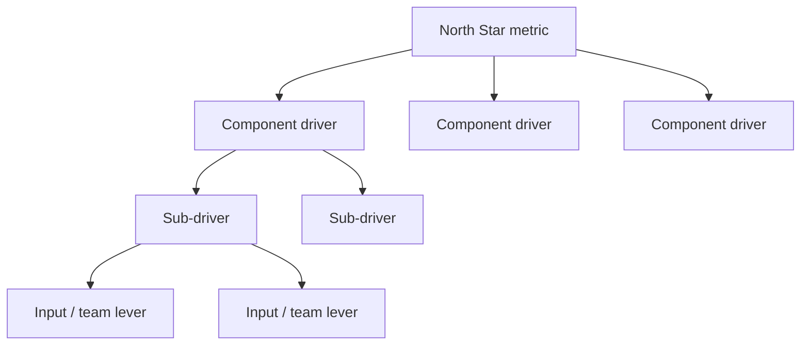
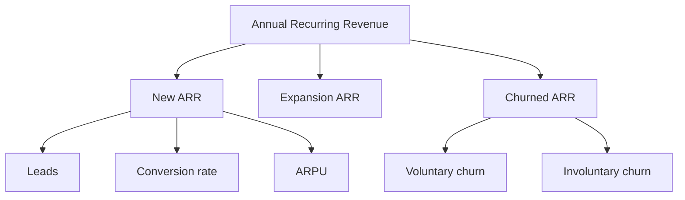

# Getting started

Part of the [KPI Tree Guides capture](../kpitree-guides-capture.md). Grouping follows the [kpitree.co/guides](https://kpitree.co/guides) collection.

## Contents

- [1. What Is a Metric Tree?](#1-what-is-a-metric-tree---kpi-tree)
- [2. How to Build a Metric Tree (KPI Tree)](#2-how-to-build-a-metric-tree-kpi-tree---kpi-tree)
- [3. Metric Tree Examples for Every Business Model](#3-metric-tree-examples-for-every-business-model---kpi-tree)
- [4. Metric Tree vs KPI Tree vs Value Driver Tree](#4-metric-tree-vs-kpi-tree-vs-value-driver-tree---kpi-tree)
- [74. Metric Tree Checklist](#74-metric-tree-checklist---kpi-tree)
- [75. Your First Metric Tree in 10 Minutes](#75-your-first-metric-tree-in-10-minutes---kpi-tree)

---

## 1. What Is a Metric Tree? - KPI Tree

### Provenance

- Requested source URL: [https://kpitree.co/guides/getting-started/what-is-a-metric-tree](https://kpitree.co/guides/getting-started/what-is-a-metric-tree)
- Final fetched URL: [https://kpitree.co/guides/getting-started/what-is-a-metric-tree](https://kpitree.co/guides/getting-started/what-is-a-metric-tree)
- Canonical URL: [https://kpitree.co/guides/getting-started/what-is-a-metric-tree](https://kpitree.co/guides/getting-started/what-is-a-metric-tree)
- Retrieval timestamp (UTC): 2026-08-26T07:46:54.252Z
- HTTP status: 200
- Page title: What Is a Metric Tree? - KPI Tree
- Meta description: Not present
- Full response SHA-256: `c3495bc8d635ba0e1b5521a9625fb862e1a49214b1f6e72741ed61296200ab90`
- Material fragment SHA-256: `438177be60791ae3fd252c5383aba109c5ff5bf7fce51f6d086f904a19c08a69`

### Material

A metric tree is a hierarchical model that connects your North Star metric to the drivers, sub-drivers, and inputs that cause it to move. It maps cause and effect across your entire business so every person can see what moves the needle and why.

*8 min read*

**Chapters**

- [Metric tree definition](#metric-tree-definition)
- [Why metric trees matter](#why-metric-trees-matter)
- [How a metric tree works](#how-a-metric-tree-works)
- [Metric trees vs dashboards](#metric-trees-vs-dashboards)
- [The anatomy of a metric tree](#the-anatomy-of-a-metric-tree)
- [Who uses metric trees](#who-uses-metric-trees)
- [Common mistakes when building metric trees](#common-mistakes-when-building-metric-trees)

### Metric tree definition

> **Definition.** A metric tree is a hierarchical model that places your most important business metric at the top and decomposes it into the drivers, sub-drivers, and inputs that cause it to move. Each relationship in the tree represents a causal link, not just a correlation, so you can trace any change in a top-level outcome back to the specific input that caused it.

Unlike a dashboard that displays metrics side by side with no relationship between them, a metric tree organises metrics into a structure that mirrors how your business actually creates value. Revenue does not move on its own. It moves because something beneath it changed. A metric tree makes that chain of cause and effect visible, navigable, and actionable.

### Why metric trees matter

Most organisations have more data than they know what to do with. They have dashboards, reports, and analytics tools across every department. Yet when a number moves, the same question comes up in every meeting: "Why?"

The problem is not a lack of data. It is a lack of structure. Without a model that connects metrics to each other, every investigation starts from scratch. Someone has to manually trace the chain from a lagging outcome to the leading indicators that caused it. That takes time, requires cross-functional knowledge, and the answer usually arrives too late to act on.

Metric trees solve this by providing a persistent, shared model of how your business works. They turn "I can see the problem" into "I can see the cause." And when people can see the cause, they can take action before the impact reaches your headline numbers.

- **Understanding, not just visibility** — Dashboards show you what happened. Metric trees show you why it happened and what to do about it.
- **Cause and effect, not correlation** — Two metrics moving together does not mean one caused the other. Metric trees model directional, causal relationships.
- **Shared context across teams** — When everyone navigates the same model, cross-functional conversations start from shared understanding rather than competing interpretations.

### How a metric tree works

A metric tree follows a simple structural principle: every metric exists because it drives something above it. The tree reads from top to bottom as a decomposition and from bottom to top as a chain of cause and effect.

1. **North Star metric**

   The single metric that best captures the value your business creates sits at the root of the tree. Everything below it exists to explain and influence this outcome.

2. **Component drivers**

   The North Star is decomposed into its direct components. For a SaaS business, revenue might decompose into new customer revenue, expansion revenue, and retained revenue.

3. **Sub-drivers and inputs**

   Each component is further decomposed until you reach the metrics your teams directly control: activities, conversion rates, response times, campaign spend.

4. **Causal relationships**

   Each connection in the tree carries a direction and a measured strength. When an input changes, you can trace its expected effect all the way up to the North Star.

Read top to bottom as decomposition, bottom to top as cause and effect. Only one branch is expanded so the four layers stay visible.

The power of this structure is that it answers the "why" question before anyone asks it. When your North Star metric drops, you do not need to schedule a war room meeting. You open the metric tree, trace downward through the branches, and identify exactly which input changed. That investigation takes minutes instead of days.

### Metric trees vs dashboards

Dashboards and metric trees are often confused, but they serve fundamentally different purposes. A dashboard is a reporting surface. A metric tree is a thinking tool.

|  | Dashboard | Metric tree |
| --- | --- | --- |
| Structure | Flat list of charts | Hierarchical cause-and-effect model |
| Relationships | None, metrics are independent | Every metric is connected to what it drives |
| Question it answers | "What happened?" | "Why did it happen and what should we do?" |
| Investigation | Manual, cross-reference multiple views | Trace the tree downward to the root cause |
| Ownership | Viewed by anyone, owned by no one | Every metric has a named owner |
| Mental model | Opened and closed | Internalised over time |

This is not to say dashboards are useless. They are excellent for monitoring known metrics at a glance. But they were never designed to explain why something changed. That is the job of a metric tree. The best organisations use both: dashboards for surface-level monitoring, and metric trees for the structural understanding that drives decisions.

### The anatomy of a metric tree

Every well-built metric tree consists of four core components that work together to create a living model of your business.

- **Metrics** — Each node in the tree represents a measurable business metric. These range from high-level outcomes like revenue and retention at the top to operational inputs like response time, conversion rate, or campaign impressions at the bottom. Every metric has a current value, a trend, and a target.
- **Relationships** — The connections between metrics define how changes propagate through the system. These are not just lines on a diagram. Each relationship has a direction (which metric influences which) and a measured correlation strength, so you can quantify how much a change in one input is expected to affect its parent.
- **Ownership** — Every metric in the tree has a named owner who is accountable for its performance. This is not about blame. It is about clarity. When a metric moves, the owner is the first person who needs to know, the person best positioned to investigate, and the person responsible for taking action.
- **Dimensions** — Metrics can be broken down by dimensions like geography, product line, customer segment, or team. This lets you see not just that conversion rate dropped, but that it dropped specifically in one region or for one product. Dimensions turn a single number into a set of actionable insights.

When these four components come together, the metric tree becomes more than a visualisation. It becomes a shared operating model that the entire organisation can navigate. A product manager can trace how their [feature adoption rate](https://kpitree.co/glossary/product-metrics/feature-adoption-rate) metric feeds into [expansion revenue](https://kpitree.co/glossary/saas-metrics/expansion-revenue). A marketing lead can see how their demand generation work influences [sales pipeline velocity](https://kpitree.co/glossary/sales-metrics/sales-pipeline-velocity). A support team lead can understand how their resolution time affects customer retention. Each person sees the same system from their own vantage point.

### Who uses metric trees

One of the most common misconceptions about metric trees is that they are a data team tool. In practice, the data team builds and maintains the tree, but the entire organisation navigates it. That is the point.

A metric tree is only as valuable as the number of people who understand it. When it sits inside a BI tool that only analysts use, it is just another model. When it becomes the shared language of the organisation, it changes how people think, plan, and act.

- **Executives** — See the full system from the top down. Understand which levers have the most impact on company-level outcomes and where to allocate resources.
- **Data teams** — Build and maintain the model. Define relationships, validate correlation strength, and ensure the tree reflects how the business actually works.
- **Product teams** — Trace how feature adoption and engagement metrics feed into business outcomes. Prioritise roadmap items based on their expected causal impact.
- **Marketing teams** — Understand how demand generation flows through the funnel and ultimately influences revenue. See which campaigns drive quality, not just volume.
- **Sales teams** — Navigate from pipeline targets back to the conversion rates and activities that drive them. Focus effort on the metrics with the highest leverage.
- **Operations and support** — See how their day-to-day metrics like resolution time and first contact rate connect to customer retention and ultimately to revenue.

### Common mistakes when building metric trees

Metric trees are conceptually simple, but getting them right requires discipline. Here are the most common mistakes organisations make.

- **Treating it as a one-time exercise** — A metric tree is not a workshop artefact that lives in a slide deck. It is a living model that needs to be connected to real data, updated as the business evolves, and navigated regularly by the people it serves. If it goes stale, it becomes decoration.
- **Confusing correlation with causation** — Just because two metrics move together does not mean one causes the other. A metric tree requires you to be honest about directionality. Does marketing spend drive leads, or does seasonality drive both? Getting the causal direction wrong means optimising the wrong inputs.
- **Making it too complex** — The temptation is to model every metric in the business. Resist it, at least initially. Start with your North Star and the two or three layers directly beneath it. You can always add depth later. A tree that is too complex to navigate defeats its own purpose.
- **No ownership assigned** — A metric tree without owners is a visualisation, not an operating model. Every metric needs a person who is accountable for understanding it, investigating changes, and taking action. Without ownership, the tree becomes another dashboard that everyone looks at and nobody acts on.
- **Building it in isolation** — If the data team builds the tree without input from the teams who own the metrics, the model will not reflect how the business actually works. The best metric trees are built collaboratively, with domain experts validating the relationships and the data team ensuring the maths holds.
- **Ignoring leading indicators** — If every metric in your tree is a lagging outcome, you will always be investigating the past. The most useful branches of a metric tree are the ones that surface leading indicators, the inputs you can change today that will affect outcomes next week or next month.

### Continue reading

- [How to build a metric tree](#2-how-to-build-a-metric-tree-kpi-tree---kpi-tree)
  - A step-by-step metric tree and KPI tree template from North Star to daily levers
- [Metric tree examples](#3-metric-tree-examples-for-every-business-model---kpi-tree)
  - Metric tree examples for SaaS, e-commerce, marketplace, and B2B models you can copy
- [Metric tree vs KPI tree](#4-metric-tree-vs-kpi-tree-vs-value-driver-tree---kpi-tree)
  - How a KPI tree and value driver tree compare to a metric tree

---

---

## 2. How to Build a Metric Tree (KPI Tree) - KPI Tree

### Provenance

- Requested source URL: [https://kpitree.co/guides/getting-started/how-to-build-a-metric-tree](https://kpitree.co/guides/getting-started/how-to-build-a-metric-tree)
- Final fetched URL: [https://kpitree.co/guides/getting-started/how-to-build-a-metric-tree](https://kpitree.co/guides/getting-started/how-to-build-a-metric-tree)
- Canonical URL: [https://kpitree.co/guides/getting-started/how-to-build-a-metric-tree](https://kpitree.co/guides/getting-started/how-to-build-a-metric-tree)
- Retrieval timestamp (UTC): 2026-08-26T07:46:54.252Z
- HTTP status: 200
- Page title: How to Build a Metric Tree (KPI Tree) - KPI Tree
- Meta description: Not present
- Full response SHA-256: `e5cba9d82526b74795aa832f3b925fe7b0871c4facc0d5597479b4982586029b`
- Material fragment SHA-256: `e1c18ce39d3d2e5dcb3e9d9de1dc72d5cdc314734b554d9f8794d7fc9fdb16e3`

### Material

A practical, step-by-step guide to building a metric tree that connects your North Star metric to every lever in your business. From decomposition to ownership to validation.

*10 min read*

**Chapters**

- [Why build a metric tree?](#why-build-a-metric-tree)
- [Eight steps to build your metric tree](#eight-steps-to-build-your-metric-tree)
- [Relationship types in a metric tree](#relationship-types)
- [Common mistakes when building a metric tree](#common-mistakes)

### Why build a metric tree?

Most organisations track metrics in isolation. Revenue goes up, but nobody knows which team or lever drove the change. Churn increases, and five teams launch five initiatives without understanding the root cause. A metric tree solves this by mapping cause and effect across your entire business, from your highest-level outcome down to the operational levers that teams control every day.

Building a metric tree is not just a data exercise. It is a model of how your business works. It forces clarity about what actually drives outcomes, who owns each lever, and where effort should be focused. Done well, it becomes the shared language that aligns strategy, operations, and individual contribution.

This guide walks you through eight steps to create a metric tree, from choosing your North Star metric to closing the loop with accountable action. Whether you are building your first metric tree or refining an existing one, each step includes the reasoning behind it so you understand the why, not just the how.

### Eight steps to build your metric tree

Follow these steps in order. Each one builds on the last, and skipping ahead usually means going back later to fill in what you missed.

1. **Start with your North Star metric**

   Every metric tree begins with a single number at the top: the one metric that best captures the value your business creates. This is your North Star. It is the outcome everything else feeds into.

   For a SaaS company, that might be [Annual Recurring Revenue](https://kpitree.co/glossary/saas-metrics/annual-recurring-revenue) (ARR). For a marketplace, [Gross Merchandise Volume](https://kpitree.co/glossary/financial-metrics/gross-merchandise-volume) (GMV). For a consumer app, [Monthly Active Users](https://kpitree.co/glossary/product-metrics/monthly-active-users) (MAU) or Lifetime Value (LTV). The right choice depends on your business model and stage.

   A good North Star metric has three properties: it reflects real value delivered to customers, it is measurable on a regular cadence, and teams across the company can influence it. If only one team can move it, it is probably too narrow. If nobody can move it directly, it is too abstract.

2. **Decompose into first-level drivers**

   Once you have your North Star, break it down into its direct components. This is the first level of your metric tree. Ask: what are the two to four factors that mathematically or causally determine this metric?

   For example, if your North Star is Revenue, the first-level decomposition might be: Revenue = Number of Customers x Average Revenue per Customer. Or for a transactional business: Revenue = Transactions x Average Order Value.

   The key is to make the decomposition reflect how the metric actually works in your business. Do not use a textbook formula if it does not match reality. If your pricing model is usage-based, decompose by usage. If it is seat-based, decompose by seats.

3. **Continue decomposing each branch**

   Now take each first-level driver and break it down further. The metric tree grows like an actual tree: each branch splits into smaller, more specific branches until you reach the operational levers that teams control.

   Take "Number of Customers" from the previous step. It might decompose into: Customers = New Customers + Returning Customers - Churned Customers. Then "New Customers" decomposes further: New Customers = Organic + Paid Acquisition + Referral + Partnerships.

   Keep going until you reach metrics that a single team or person can directly influence. For most businesses, that means three to five levels of depth. You will know you have gone deep enough when the bottom-level metrics correspond to things teams do every week: run campaigns, ship features, process tickets, close deals.

4. **Define the relationships**

   Not all connections in a metric tree are the same. Some are mathematical identities (Revenue = Price x Volume), some are causal relationships (better onboarding leads to higher activation), and some are correlations that need further investigation.

   There are three main types of relationships to consider: Multiplicative (the parent is the product of its children, e.g. Revenue = Users x ARPU), Additive (the parent is the sum of its children, e.g. Total Users = Segment A + Segment B + Segment C), and Influencing (the child affects the parent, but the relationship is not a clean formula, e.g. [NPS](https://kpitree.co/glossary/product-metrics/net-promoter-score) influences retention).

   Direction also matters. Does the child metric increase or decrease the parent? Churn has a negative relationship with customer count. Response time has a negative relationship with satisfaction. Getting the direction right prevents teams from accidentally optimising in the wrong direction.

5. **Assign ownership**

   Every metric in the tree needs a named owner. Not a team, not a department. A person. Ownership is what turns a metric tree from a visualisation into a system of accountability.

   Behavioural science is clear on this: when a specific person is responsible for an outcome, the probability of action increases significantly. Diffusion of responsibility is one of the most well-documented patterns in organisational psychology. A metric without an owner is a metric nobody is watching.

   Use a RACI model or similar framework to clarify the role for each metric: Responsible (the person who takes action when the metric moves), Accountable (the person who is ultimately answerable for the result), Consulted (people with expertise who should be involved in decisions), and Informed (stakeholders who need to know when the metric changes but do not need to act).

6. **Connect to live data**

   A metric tree on a whiteboard or in a slide deck is a starting point. But static trees go stale fast. To make the metric tree useful, plug it into your live data sources: your data warehouse, semantic layer, product analytics, CRM, or even manual inputs for metrics that do not live in a system yet.

   The goal is for every node in the tree to show a current value, a trend, and its relationship to the nodes above and below it. When the CEO looks at revenue, they should be able to drill down through the tree to see which specific operational metric is driving the change they are seeing.

   Start with the data you have. Not every metric needs to be automated on day one. Some metrics will be manually updated weekly. That is fine. The value of the metric tree comes from the structure and the relationships, not from having a perfect real-time pipeline on every node.

7. **Validate with data**

   This is where most metric trees fall short. You have built a model of how you think your business works. Now test whether it actually does.

   Use correlation analysis to verify the relationships you defined in Step 4. Does onboarding completion actually correlate with 30-day retention? Does increasing paid spend actually drive new customer acquisition, or is organic doing the heavy lifting? Some relationships you assumed were strong may turn out to be weak. Others you did not consider may turn out to be significant.

   This is not about finding perfect causal proof. It is about having evidence that your model reflects reality. When the data disagrees with your assumptions, update the model. A metric tree should evolve as you learn more about how your business actually works.

8. **Close the loop with actions**

   The final step is what separates a metric tree from a dashboard. When a metric moves, the owner is notified. They investigate, decide on an action, and log it against the metric. The action is tracked. The impact is measured. The loop closes.

   This is the accountability layer. It is not enough to see that [activation rate](https://kpitree.co/glossary/saas-metrics/activation-rate) dropped 5% last week. Someone needs to own the response. What did they do about it? Did it work? If not, what will they try next? The metric tree provides the structure. The action loop provides the behaviour change.

   Over time, this builds an organisational memory. You can look back at any metric and see the history of changes and the actions that were taken. You learn what works. You stop repeating experiments that already failed. The organisation gets smarter, not just more informed.

> **Why this matters.** Without a clear North Star, teams optimise their own metrics in isolation. Marketing optimises leads, Product optimises engagement, Sales optimises pipeline. The metric tree connects all of these to a shared outcome, so every team can see how their work contributes.

> **Why this matters.** First-level drivers turn a single overwhelming number into actionable components. If revenue is flat, is it because you have fewer customers or because each customer is spending less? The metric tree gives you the answer without needing to run an ad-hoc analysis.

> **Why this matters.** Depth creates line of sight. When a product engineer sees that their activation rate metric sits three levels below revenue, they understand their contribution. They do not need a quarterly all-hands to learn that their work matters. The metric tree makes it visible every day.

> **Why this matters.** Defining relationships explicitly turns a diagram into a model. Without defined relationships, a metric tree is just an org chart for numbers. With them, it becomes a tool for prediction: if we improve this lever by 10%, what happens upstream?

> **Why this matters.** Ownership changes behaviour. When someone sees their name next to a metric and can trace its connection to the company's North Star, they do not need to be told their work matters. They can see it. This is the behavioural layer that transforms data into action.

> **Why this matters.** A live metric tree becomes the operating system for your business. Instead of waiting for a weekly report or building an ad-hoc dashboard, anyone can navigate the tree to understand what is happening and why. The tree is not another dashboard. It is the map that connects every dashboard.

> **Why this matters.** Without validation, a metric tree is just a hypothesis. Behavioural science tells us that people anchor on their first model and resist updating it. Building validation into the process forces intellectual honesty. The tree becomes a living document that gets more accurate over time, not a diagram that gathers dust.

> **Why this matters.** Insight without action is just noise. Every business intelligence tool in the world can tell you what happened. The value is in what you do about it. Closing the loop turns passive observation into active management and makes the metric tree the operating system for how your business improves.

- Revenue
  - Number of Customers
    - New Customers
      - Organic
      - Paid Acquisition
      - Referral
      - Partnerships
    - Returning Customers
    - Churned Customers
  - Avg Revenue per Customer

### Relationship types in a metric tree

- **Multiplicative** — The parent is the product of its children. Revenue = Users x ARPU. If one child doubles, so does the parent.
- **Additive** — The parent is the sum of its children. Total Users = Segment A + Segment B + Segment C. Each child contributes independently.
- **Influencing** — The child affects the parent, but the relationship is not a clean formula. NPS influences retention, but the strength depends on context. These relationships need correlation data.

### Common mistakes when building a metric tree

- **Going too wide at the top** — Starting with ten first-level drivers instead of two or three. A metric tree should funnel, not fan out. If the first level has too many branches, it is usually a sign that you are mixing levels of abstraction.
- **Confusing correlation with cause** — Just because two metrics move together does not mean one drives the other. Use correlation data as a starting point, but apply judgement. The tree should model cause and effect, not coincidence.
- **Leaving metrics unowned** — A metric without an owner is a metric nobody cares about. If you cannot find someone willing to own it, question whether it belongs in the tree at all. Every node should have a name next to it.
- **Building it once and forgetting it** — Your business changes. Your metric tree should change with it. Schedule quarterly reviews to validate relationships, update ownership, and prune branches that no longer reflect how your business works.
- **Making it too complex** — A metric tree with 200 nodes is not a tree. It is a maze. Start with 20 to 30 nodes and expand as needed. The goal is clarity, not completeness. You can always add depth to specific branches later.
- **Treating it as a reporting tool** — A metric tree is not a dashboard replacement. It is a model of your business. If you only use it to report numbers upward, you are missing the point. The value is in the structure: the relationships, the ownership, and the actions.

### Continue reading

- [What is a metric tree?](#1-what-is-a-metric-tree---kpi-tree)
  - A metric tree maps cause and effect so every team sees what moves the needle
- [Metric tree examples](#3-metric-tree-examples-for-every-business-model---kpi-tree)
  - Metric tree examples for SaaS, e-commerce, marketplace, and B2B models you can copy
- [Metric tree vs KPI tree](#4-metric-tree-vs-kpi-tree-vs-value-driver-tree---kpi-tree)
  - How a KPI tree and value driver tree compare to a metric tree

---

---

## 3. Metric Tree Examples for Every Business Model - KPI Tree

### Provenance

- Requested source URL: [https://kpitree.co/guides/getting-started/metric-tree-examples](https://kpitree.co/guides/getting-started/metric-tree-examples)
- Final fetched URL: [https://kpitree.co/guides/getting-started/metric-tree-examples](https://kpitree.co/guides/getting-started/metric-tree-examples)
- Canonical URL: [https://kpitree.co/guides/getting-started/metric-tree-examples](https://kpitree.co/guides/getting-started/metric-tree-examples)
- Retrieval timestamp (UTC): 2026-08-26T07:46:54.252Z
- HTTP status: 200
- Page title: Metric Tree Examples for Every Business Model - KPI Tree
- Meta description: Not present
- Full response SHA-256: `7507d7b2dca17414b679a5dd90133ad7686acdb8422d555f96153635b6a04db6`
- Material fragment SHA-256: `9e6e58ed7d3e5914cb20469fe49c34154ad6dfd6d1ba27b1a8182bcf8a70b321`

### Material

A metric tree is only as useful as its structure. The right decomposition depends on your business model, your growth stage, and the levers your teams actually control. Below you will find four complete metric tree examples, each tailored to a different business type, so you can see exactly how to map cause and effect from a single North Star all the way down to the daily work.

*12 min read*

**Chapters**

- [Why metric tree examples matter](#why-metric-tree-examples-matter)
- [SaaS metric tree](#saas-metric-tree)
- [E-commerce metric tree](#ecommerce-metric-tree)
- [Marketplace metric tree](#marketplace-metric-tree)
- [B2B / enterprise metric tree](#b2b-enterprise-metric-tree)
- [How to choose the right metric tree structure](#how-to-choose-the-right-metric-tree-structure)
- [From static examples to living systems](#from-static-examples-to-living-systems)

### Why metric tree examples matter

If you have already read our guide to what a metric tree is, you know the core idea: start with one North Star metric, then decompose it into the drivers and sub-drivers that explain how that number moves. The theory is simple. The challenge is applying it to your specific context.

Every business model has different revenue mechanics, different funnel shapes, and different team structures. A SaaS company cares about expansion revenue and churn. An e-commerce brand cares about sessions and average order value. A marketplace has to balance supply and demand. These differences mean the metric tree structure must change too.

The metric tree examples below give you a concrete starting point. Use them as templates, adapt the metrics to your own context, and follow our step-by-step building guide to turn the template into a living system that drives real decisions.

### SaaS metric tree

For most SaaS businesses, [Annual Recurring Revenue](https://kpitree.co/glossary/saas-metrics/annual-recurring-revenue) (ARR) is the North Star. It captures growth, retention, and expansion in a single number. This SaaS metric tree decomposes ARR into three first-level drivers: new business, expansion within existing accounts, and churn.

- Annual Recurring Revenue (ARR)
  - New ARR
    - Leads
    - Conversion Rate
    - ARPU
  - Expansion ARR
  - Churned ARR
    - Voluntary Churn
    - Involuntary Churn

New ARR is driven by the volume of qualified leads, the percentage that convert to paying customers, and the [average revenue per user](https://kpitree.co/glossary/saas-metrics/average-revenue-per-user) (ARPU). Marketing owns lead volume. Sales owns [conversion rate](https://kpitree.co/glossary/marketing-metrics/conversion-rate). Product and pricing own ARPU. Each team has a clear metric they influence.

Expansion ARR captures upsells, cross-sells, and seat expansions from your existing customer base. This is often the most capital-efficient growth lever and belongs to customer success and account management.

Churned ARR splits into voluntary churn, where customers actively decide to leave, and involuntary churn, which happens through failed payments or expired cards. The distinction matters because the teams responsible and the actions required are completely different. Product and support can reduce voluntary churn through better onboarding and engagement. Engineering and payments can reduce involuntary churn through retry logic and dunning flows.

This metric tree template makes it immediately clear where ARR is growing, where it is leaking, and who should act. That is the power of mapping cause and effect rather than simply reporting a single revenue number.

### E-commerce metric tree

An e-commerce metric tree typically starts with Revenue as the North Star and decomposes it into the classic formula: Sessions multiplied by Conversion Rate multiplied by [Average Order Value](https://kpitree.co/glossary/operations-metrics/average-order-value). This simple equation is powerful because it separates three fundamentally different challenges: getting people to the site, persuading them to buy, and maximising the value of each transaction.

- Revenue
  - Sessions
    - Organic
    - Paid
    - Direct
    - Email
  - Conversion Rate
    - Add to Cart Rate
    - Checkout Rate
    - Payment Success
  - Avg Order Value

Sessions break down by acquisition channel: organic search, paid media, direct traffic, and email. Each channel has different economics and different owners. Your SEO team drives organic sessions. Your performance marketing team drives paid sessions. Breaking traffic into channels lets you see where growth is coming from and where your spend is efficient.

Conversion Rate decomposes into a funnel of its own: add-to-cart rate, checkout rate, and payment success rate. This is where many teams discover their biggest opportunities. A small improvement in checkout rate can have a larger revenue impact than a large increase in traffic. The metric tree makes that tradeoff visible.

Average Order Value can be further broken into items per order and average item price, or influenced by bundling, upsells, and free shipping thresholds. Your merchandising and product teams own this branch.

This e-commerce metric tree example helps every team understand not just their own numbers, but how their work connects to revenue. When your paid media team sees that conversion rate is dropping, they know that more spend will not solve the problem. That shared understanding is what a well-structured metric tree creates.

### Marketplace metric tree

Marketplaces have a unique challenge: they must grow supply and demand simultaneously. [Gross Merchandise Volume](https://kpitree.co/glossary/financial-metrics/gross-merchandise-volume) (GMV) is the natural North Star because it captures total transaction volume across the platform. This marketplace metric tree decomposes GMV into four first-level drivers and then branches into the supply side and demand side of the business.

- Gross Merchandise Value (GMV)
  - Active Sellers
    - New Sellers
    - Retained Sellers
  - Listings / Seller
  - Conversion Rate
  - Avg Transaction Value
    - Active Buyers
    - Orders / Buyer

The first level tells you that GMV is a function of how many sellers are active, how many listings each seller maintains, how often those listings convert into transactions, and the average value of each transaction. It is a multiplication chain, so improvement in any single factor lifts the whole.

Supply side metrics focus on seller acquisition and retention. Your marketplace operations and seller success teams own this branch. The key question is whether you are adding enough new sellers to replace those who leave, and whether existing sellers are listing enough inventory to meet buyer demand.

Demand side metrics focus on buyer engagement. Active buyers multiplied by orders per buyer gives you total order volume. Your growth, marketing, and product teams own this. If demand outstrips supply, you get poor buyer experience. If supply outstrips demand, sellers churn. The metric tree makes this balance visible so leadership can allocate resources to whichever side needs attention.

A marketplace metric tree is especially valuable because it prevents the common mistake of optimising one side of the marketplace at the expense of the other. When both branches live in the same tree, the tension between supply and demand becomes a healthy, data-driven conversation.

### B2B / enterprise metric tree

B2B and enterprise businesses face long sales cycles, multiple stakeholders, and complex handoffs between marketing and sales. A B2B metric tree brings structure to that complexity. Revenue is the North Star, decomposed into Pipeline, [Win Rate](https://kpitree.co/glossary/sales-metrics/win-rate), and [Average Deal Size](https://kpitree.co/glossary/sales-metrics/average-deal-size), with separate branches for marketing contribution and sales execution.

- Revenue
  - Pipeline
    - MQLs
    - MQL-to-SQL Rate
    - SQL-to-Opp Rate
  - Win Rate
    - Demo-to-Proposal
    - Proposal-to-Close
  - Avg Deal Size

Pipeline is the total value of qualified opportunities. The marketing branch shows how pipeline is built: [Marketing Qualified Leads](https://kpitree.co/glossary/marketing-metrics/marketing-qualified-leads) (MQLs), the rate at which MQLs become [Sales Qualified Leads](https://kpitree.co/glossary/marketing-metrics/sales-qualified-leads) (SQLs), and the rate at which SQLs become real opportunities. This metric tree makes the marketing-to-sales handoff measurable. If the MQL-to-SQL rate is low, either marketing is generating the wrong leads or sales is not following up effectively. Either way, the data points to where the conversation needs to happen.

Win Rate is owned by the sales team and can be further decomposed into demo-to-proposal rate and proposal-to-close rate. Each stage represents a different skill: discovery, solution design, negotiation, and procurement navigation. When win rate drops, this decomposition shows exactly where deals are stalling.

Average Deal Size can be influenced by targeting strategy, product bundling, and pricing. If your average deal size is falling, the metric tree helps you determine whether it is a targeting problem (smaller companies entering the funnel) or a packaging problem (fewer products per deal).

The power of a B2B metric tree is that it forces marketing and sales to share a single model of how revenue is generated. When both functions see the same cause-and-effect chain, finger pointing gives way to problem solving.

### How to choose the right metric tree structure

The examples above are starting points. Your metric tree should reflect how your business actually works, not how a textbook says it should work. Here is how to adapt them.

1. **Start with your North Star**

   Pick the single metric that best represents value creation for your business over the next 12 to 18 months. For most companies this is some form of revenue, but it could also be active users, transactions processed, or another metric that captures your core value proposition.

2. **Decompose using real equations**

   Every level in your metric tree should be connected by real mathematical relationships: multiplication, addition, or subtraction. If you cannot write the equation, the decomposition is not rigorous enough. This discipline is what separates a metric tree from a list of KPIs.

3. **Match branches to teams**

   The deepest level of your metric tree should map to the teams or individuals who influence those numbers. If a metric does not have a clear owner, it is either too abstract or it sits at the wrong level. Ownership is what turns a metric tree from a diagram into a management system.

4. **Keep it to three or four levels**

   More than four levels of depth usually means you are mixing strategic metrics with operational ones. The goal is clarity, not completeness. You can always expand a branch later when a team needs to dig deeper into their specific area.

### From static examples to living systems

These metric tree examples are useful as templates, but a diagram on a whiteboard only goes so far. The real value comes when you connect your metric tree to live data, assign ownership to every node, and track the actions people take to move each metric.

When a metric tree is connected to real numbers, something changes. Teams stop debating what is happening and start discussing why it is happening and what to do about it. The cause-and-effect structure makes it obvious which driver is pulling revenue up or dragging it down. That shared understanding is what creates alignment without the need for endless status meetings.

Ownership turns passive reporting into active accountability. When every node in the metric tree has a person or team responsible, there is no ambiguity about who should investigate a drop or capitalise on an improvement. People pay more attention to metrics they own, and they take better action when they understand how their metric connects to the bigger picture.

Tracking actions alongside metrics closes the loop. It is not enough to know that conversion rate fell. You need to know what experiments are running, what changes were deployed, and which initiatives are in progress. When actions are tracked against the metric tree, you create a feedback loop between decisions and outcomes. That feedback loop is how organisations learn and improve over time.

KPI Tree is built to bring metric trees to life. You can explore the platform to see how teams connect their metric trees to live data, assign ownership, and track the actions that move their numbers.

### Continue reading

- [What is a metric tree?](#1-what-is-a-metric-tree---kpi-tree)
  - A metric tree maps cause and effect so every team sees what moves the needle
- [How to build a metric tree](#2-how-to-build-a-metric-tree-kpi-tree---kpi-tree)
  - A step-by-step metric tree and KPI tree template from North Star to daily levers
- [Metric tree vs KPI tree](#4-metric-tree-vs-kpi-tree-vs-value-driver-tree---kpi-tree)
  - How a KPI tree and value driver tree compare to a metric tree

---

---

## 4. Metric Tree vs KPI Tree vs Value Driver Tree - KPI Tree

### Provenance

- Requested source URL: [https://kpitree.co/guides/getting-started/metric-tree-vs-kpi-tree](https://kpitree.co/guides/getting-started/metric-tree-vs-kpi-tree)
- Final fetched URL: [https://kpitree.co/guides/getting-started/metric-tree-vs-kpi-tree](https://kpitree.co/guides/getting-started/metric-tree-vs-kpi-tree)
- Canonical URL: [https://kpitree.co/guides/getting-started/metric-tree-vs-kpi-tree](https://kpitree.co/guides/getting-started/metric-tree-vs-kpi-tree)
- Retrieval timestamp (UTC): 2026-08-26T07:46:54.252Z
- HTTP status: 200
- Page title: Metric Tree vs KPI Tree vs Value Driver Tree - KPI Tree
- Meta description: Not present
- Full response SHA-256: `d03bb0e4d28e592738599dc9af19e69e65a36e2eab2f23bd03d37d1d18f4dabf`
- Material fragment SHA-256: `56be497b7857ff9896e1ffc06566115e3ea4f7c2b4913657cf9ef129e88a11d1`

### Material

If you have searched for any of these terms, you have probably noticed they seem to describe the same thing. That is because they mostly do. Here is how they relate, where they differ, and which one matters for your business.

*7 min read*

**Chapters**

- [KPI tree vs metric tree: the short answer](#kpi-tree-vs-metric-tree-the-short-answer)
- [Six names, one concept](#six-names-one-concept)
- [What every metric tree shares](#what-every-metric-tree-shares)
- [Where the terms diverge](#where-the-terms-diverge)
- [What makes a metric tree truly useful](#what-makes-a-metric-tree-truly-useful)
- [From static diagram to living system](#from-static-diagram-to-living-system)

### KPI tree vs metric tree: the short answer

> **The short answer.** A metric tree, KPI tree, and value driver tree are different names for the same fundamental concept: a hierarchical model that decomposes a top-level business metric into its component drivers, showing cause-and-effect relationships between them. The terms differ in emphasis and audience, not in structure.

### Six names, one concept

Search for "metric tree" and you will find articles about KPI trees. Search for "value driver tree" and you will land on metric decomposition guides. The terminology can feel overwhelming, but the underlying idea is consistent. All of these terms refer to the same structure: a hierarchical decomposition of a high-level metric into its causal drivers.

- **Metric tree** — The most common modern term. Used widely by product, growth, and data teams to describe a hierarchical breakdown of business metrics. A metric tree starts with a North Star metric at the top and decomposes it into the drivers and sub-drivers that influence it. The term is deliberately broad, applying to any measurable quantity, not just financial KPIs.
- **KPI tree** — Emphasises Key Performance Indicators specifically. Common in finance, operations, and traditional performance management. A KPI tree structures the same hierarchy but frames every node as a KPI, often with targets and thresholds attached. The language tends to appear in executive dashboards and annual planning.
- **Value driver tree** — Rooted in management consulting. Firms like McKinsey, Bain, and BCG have long used value driver trees to map the levers that influence shareholder value or enterprise value. The emphasis is on financial value creation, and the trees often terminate in operational levers that a team can act on.
- **Driver tree** — A shortened form of value driver tree. You will encounter this term in strategy documents and board presentations. It carries the same meaning but drops the "value" qualifier, making it applicable beyond purely financial contexts.
- **Metric decomposition** — Describes the analytical process rather than the artefact. When someone talks about decomposing a metric, they mean breaking it into its mathematical or causal components. The output of metric decomposition is, in practice, a metric tree.
- **Impact chain** — A less common term used by some strategy execution tools. It emphasises the sequential flow of cause and effect, from action to outcome. Structurally, it maps to the same hierarchy but reads left-to-right instead of top-down.

### What every metric tree shares

Regardless of the label, the structure is the same. A metric tree, KPI tree, value driver tree, or driver tree all share four defining characteristics.

1. **A single North Star metric at the top**

   Whether you call it a metric tree or a value driver tree, the structure always begins with one top-level outcome. Revenue, ARR, GMV, [customer lifetime value](https://kpitree.co/glossary/saas-metrics/customer-lifetime-value). Everything else exists to explain what drives that number.

2. **Hierarchical decomposition into drivers**

   Each level of the tree breaks a metric into its component parts. Revenue becomes [average order value](https://kpitree.co/glossary/operations-metrics/average-order-value) multiplied by number of orders. Number of orders becomes traffic multiplied by [conversion rate](https://kpitree.co/glossary/marketing-metrics/conversion-rate). The tree keeps branching until you reach metrics that individual teams can influence.

3. **Cause-and-effect relationships**

   The connections in a metric tree, KPI tree, or driver tree are not arbitrary groupings. They represent causal relationships: changing a child metric should produce a measurable change in its parent. This is what separates a tree from a dashboard.

4. **Used for root cause analysis and strategic clarity**

   When the top-level number moves, the tree tells you where to look. When you need to improve a number, the tree tells you which levers to pull. This is the practical value regardless of what you call the structure.

### Where the terms diverge

The differences between a metric tree, KPI tree, and value driver tree are not structural. They are differences in emphasis, audience, and context. Choosing one term over another signals something about how you think about measurement.

| Term | Scope | Common audience | Emphasis |
| --- | --- | --- | --- |
| Metric tree | Any measurable quantity | Product, growth, data teams | Broad, modern, inclusive |
| KPI tree | Key Performance Indicators | Finance, operations, executives | Performance targets, thresholds |
| Value driver tree | Financial value creation | Consulting, strategy, investors | Shareholder value, ROI levers |
| Driver tree | Operational drivers | Strategy, board-level | Levers and actions |
| Metric decomposition | The analytical process | Analysts, data scientists | Mathematical rigour |

In practice, most teams use these terms interchangeably. A product team might say "metric tree" in a sprint review and "KPI tree" in a board deck. The structure they are describing is identical. If you are building one for the first time, the terminology matters far less than the thinking behind it. Pick the term your team understands and focus on getting the relationships right.

### What makes a metric tree truly useful

Whether you call it a metric tree, KPI tree, or value driver tree, the static version has been around for decades. Consultants have been drawing them on whiteboards since the 1990s. The concept was never the problem. The problem was that the diagram lived in a presentation while the business lived in spreadsheets, dashboards, and meeting rooms.

Five qualities separate a useful metric tree from a decorative one.

- **Connected to live data** — A metric tree drawn on a whiteboard or in a slide deck goes stale the moment the meeting ends. When your tree is connected to live data sources, every node shows a real number. You can see at a glance where performance is on track and where it is not. The tree becomes a living diagnostic tool rather than a static reference document.
- **Statistically validated relationships** — The connections in most metric trees are assumptions. Revenue goes up when conversion rate goes up. That seems obvious, but is it true in your business? When you can validate the correlation and strength of each relationship with real data, you move from intuition to evidence. You stop guessing which lever matters most and start knowing.
- **Named ownership per metric** — Every metric in the tree should have a name next to it. Not a team name, a person. When revenue drops, the tree should tell you not just which driver caused it but who is responsible for that driver. Ownership creates accountability. It also creates clarity, because it forces conversations about who truly controls what.
- **Actions tracked against metrics** — A metric without an action is just a number to watch. When each metric in the tree links to the specific initiatives, experiments, or changes designed to move it, the tree becomes an execution system. You can see not just what is happening but what you are doing about it.
- **Verified impact** — After you take action, did the metric actually move? Closing the loop between action and outcome is what turns a metric tree from a planning tool into a learning system. Over time, you build an evidence base of what works in your specific business.

### From static diagram to living system

The first generation of metric trees lived in PowerPoint. A consultant would spend weeks interviewing stakeholders, mapping relationships, and producing a beautifully formatted slide. It would be presented at an offsite, pinned to a wall, and slowly forgotten as the quarter progressed.

The second generation moved to spreadsheets. Someone would build a driver tree in Excel, linking cells with formulas to model how changes in one metric would cascade through the tree. Better than a static slide, but still disconnected from the reality of the business. The numbers were projections, not actuals.

The third generation connected to data. Modern metric trees pull live data from your warehouse, CRM, product analytics, and financial systems. Every node shows a real number, updated automatically. When something changes, you see it immediately.

But the most important evolution is not technological. It is behavioural.

> “When people can see the structure of their business, they think differently about it.”

A product manager who can see exactly how their conversion rate connects to revenue through three levels of the tree makes different decisions than one who sees conversion rate as an isolated dashboard metric. A finance team that can trace a revenue miss back to a specific operational driver in a specific team has a fundamentally different conversation than one that asks "why did we miss the target?"

This is where behavioural science enters the picture. The diagram was always useful as a thinking tool. But a connected, living metric tree changes how people understand their work, how they prioritise, and how they hold each other accountable. The structure of the tree becomes the structure of the organisation's thinking.

Understanding drives behaviour change, not answers. A metric tree does not tell you what to do. It helps you understand why things are happening, which is far more powerful.

### Continue reading

- [What is a metric tree?](#1-what-is-a-metric-tree---kpi-tree)
  - A metric tree maps cause and effect so every team sees what moves the needle
- [How to build a metric tree](#2-how-to-build-a-metric-tree-kpi-tree---kpi-tree)
  - A step-by-step metric tree and KPI tree template from North Star to daily levers
- [Metric tree examples](#3-metric-tree-examples-for-every-business-model---kpi-tree)
  - Metric tree examples for SaaS, e-commerce, marketplace, and B2B models you can copy

---

---

## 74. Metric Tree Checklist - KPI Tree

### Provenance

- Requested source URL: [https://kpitree.co/guides/getting-started/metric-tree-checklist](https://kpitree.co/guides/getting-started/metric-tree-checklist)
- Final fetched URL: [https://kpitree.co/guides/getting-started/metric-tree-checklist](https://kpitree.co/guides/getting-started/metric-tree-checklist)
- Canonical URL: [https://kpitree.co/guides/getting-started/metric-tree-checklist](https://kpitree.co/guides/getting-started/metric-tree-checklist)
- Retrieval timestamp (UTC): 2026-08-26T07:46:54.252Z
- HTTP status: 200
- Page title: Metric Tree Checklist - KPI Tree
- Meta description: Not present
- Full response SHA-256: `db6fd6bd340057c513701767c2bc9986272e8bab1e96ef8d6613936753855240`
- Material fragment SHA-256: `757e476a39de0464d9838d4ed3a7366c7ff6fc22a137e1e3ec8a87833f9676ee`

### Material

Building a metric tree for the first time can feel overwhelming. Where do you start? How deep should it go? Who needs to be involved? This checklist breaks the process into concrete, sequential steps so you can go from a blank canvas to a working metric tree without second-guessing every decision along the way.

*9 min read*

**Chapters**

- [Before you begin](#before-you-begin)
- [The checklist: ten steps to your first metric tree](#the-checklist)
- [Example: building a SaaS metric tree](#example-saas-metric-tree)
- [Common pitfalls and how to avoid them](#common-pitfalls)
- [Getting the most from your metric tree](#getting-the-most-from-your-tree)
- [Your next steps](#next-steps)

### Before you begin

A metric tree is a model of how your business creates value. It connects your most important outcome to the operational levers your teams control every day. Before you open any tool or schedule any workshop, you need to answer three foundational questions: What is the single most important metric for your business right now? Who are the two or three people who understand how that metric moves? And do you have access to the data that underpins it?

These questions matter because a metric tree built without the right people in the room will not reflect reality. It will reflect one person's mental model of reality, which is always incomplete. The data question matters because a metric tree that cannot be connected to real numbers becomes a theoretical exercise rather than an operating tool.

You do not need perfect answers to all three questions before you start. But you need honest answers. If you do not know what your North Star metric should be, that is the first problem to solve. If you do not have access to the underlying data, that is a constraint to acknowledge upfront rather than discover halfway through.

- **Identify your North Star** — Choose the single metric that best represents the value your business delivers. For SaaS this might be [ARR](https://kpitree.co/glossary/saas-metrics/annual-recurring-revenue) or [net revenue retention](https://kpitree.co/glossary/saas-metrics/net-revenue-retention). For marketplaces, [GMV](https://kpitree.co/glossary/financial-metrics/gross-merchandise-volume). For consumer products, active users or engagement.
- **Assemble the right people** — You need a small group who collectively understand the full value chain: how customers are acquired, how they derive value, and how that translates into revenue. Typically this means someone from product, growth, finance, and data.
- **Audit your data sources** — List the systems where your key metrics live: your data warehouse, product analytics, CRM, billing system, and any manual trackers. You do not need everything connected on day one, but knowing what exists prevents surprises later.

### The checklist: ten steps to your first metric tree

The following checklist is designed to be completed in order. Each step builds on the previous one, and skipping ahead usually means backtracking later. For most teams, this process takes between two and four focused sessions spread over one to two weeks. Do not try to complete everything in a single afternoon. The conversations that happen between sessions are often where the most important insights emerge.

1. **Define your North Star metric**

   Write down the single metric that sits at the top of your tree. This should reflect the core value your business creates and be something every team can influence. If you cannot agree on one metric, you are not ready to build a tree yet. Resolve the disagreement first. A tree with two roots is not a tree.

2. **Decompose into first-level drivers**

   Break your North Star into two to four direct components. These should be either mathematical (Revenue = Customers x ARPU) or strongly causal (better onboarding drives higher activation). Resist the urge to list more than four. If you have more, you are probably mixing levels of abstraction.

3. **Decompose each driver one level deeper**

   Take each first-level driver and break it down further. Number of Customers might become New Customers + Returning Customers - Churned Customers. Average Revenue per Customer might become Base Price x Usage Multiplier. Keep going until you reach metrics that a single team can directly influence.

4. **Label every relationship**

   For each connection between a parent and child metric, specify the type: additive (parent is the sum of children), multiplicative (parent is the product of children), or influencing (child affects parent but the relationship is not a clean formula). Also note the direction: does the child metric increase or decrease the parent?

5. **Assign an owner to every metric**

   Every node in the tree needs a named person, not a team, who is accountable for understanding that metric, investigating changes, and taking action. If you cannot find an owner for a metric, question whether it belongs in the tree. Unowned metrics are metrics nobody will act on.

6. **Set targets and thresholds**

   For each metric, define a target value and acceptable thresholds. What level of performance is expected? At what point should the owner be alerted? Targets without thresholds create noise. Thresholds without targets create complacency. You need both.

7. **Connect to live data**

   Plug each metric into its data source. This might be your data warehouse, a semantic layer, product analytics, or even a manually updated spreadsheet. The goal is for every node to show a current value and a trend. Start with the data you have. Not every metric needs to be automated on day one.

8. **Validate the relationships**

   Use historical data to test whether the relationships you defined actually hold. Does onboarding completion correlate with 30-day retention? Does increasing paid spend actually drive new customers, or is organic doing the heavy lifting? Update the tree where the data disagrees with your assumptions.

9. **Walk through a real scenario**

   Pick a recent change in your North Star metric and trace it through the tree. Can you follow the branches down to the specific input that caused the change? If you get stuck or the trail goes cold, the tree has a gap. Fill it before moving on.

10. **Schedule a recurring review**

   A metric tree is not a one-time deliverable. Schedule a monthly or quarterly review to validate relationships, update ownership, add new branches, and prune ones that no longer reflect how your business works. The tree should evolve as your understanding of the business deepens.

### Example: building a SaaS metric tree

To make the checklist concrete, here is what it looks like applied to a typical SaaS business. The North Star metric is [Monthly Recurring Revenue](https://kpitree.co/glossary/saas-metrics/monthly-recurring-revenue) (MRR). The first-level decomposition splits MRR into three components: new MRR from customers acquired this month, expansion MRR from existing customers upgrading or increasing usage, and churned MRR from customers who cancelled or downgraded.

Each of those components decomposes further. New MRR depends on the number of new customers and their average contract value. The number of new customers depends on the volume of qualified leads and the sales conversion rate. Qualified leads depend on marketing spend, organic inbound, and partnerships. At each level, the metrics become more specific and more actionable until you reach the levers that individual teams control on a weekly basis.

Notice that the tree is not trying to model every metric in the business. It models the ones that explain how MRR moves. If a metric does not have a clear path to MRR, it does not belong in this tree. That does not mean it is unimportant. It means it belongs in a different tree or a different context.

- MRR
  - New MRR
    - New Customers
      - Qualified Leads
      - Sales Conversion Rate
    - Avg Contract Value
  - Expansion MRR
    - Upgrade Rate
    - Usage Growth
  - Churned MRR
    - Churn Rate
    - Avg Revenue of Churned

> **Tip.** When building your first tree, aim for three to four levels of depth and 20 to 30 total nodes. You can always add more detail to specific branches later. Starting too broad leads to a tree that is impressive to look at but impossible to maintain.

### Common pitfalls and how to avoid them

Most first metric trees fail not because the concept is wrong, but because of avoidable mistakes in execution. The checklist above is designed to steer you away from the most common ones, but it helps to name them explicitly so you can recognise the warning signs early.

The single most common failure mode is building the tree in isolation. One person, usually an analyst or a data team member, constructs the tree based on their understanding of the business and presents it as a finished product. The problem is that no single person understands all the causal relationships in a business. The marketing team knows which channels actually drive quality leads. The product team knows which features correlate with retention. The sales team knows which deal characteristics predict expansion. Without their input, the tree will have blind spots.

| Pitfall | Warning sign | How to avoid it |
| --- | --- | --- |
| Building in isolation | Only one person or team contributed to the structure | Involve representatives from every function that owns a metric in the tree |
| Too many top-level branches | More than four first-level drivers | Decompose strictly: each level should have two to four children, not ten |
| No data validation | Relationships are based on assumptions, not evidence | Use correlation analysis on historical data to test every connection |
| Unowned metrics | Metrics have team names instead of individual names | Assign a single accountable person to every node in the tree |
| Static tree | The tree has not been updated since it was created | Schedule monthly or quarterly reviews to validate, update, and prune |
| Mixing leading and lagging at the same level | Siblings in the tree measure different time horizons | Keep decomposition levels consistent: outcomes above, inputs below |

The second most common failure is treating the tree as a reporting artefact rather than an operating tool. If the only time people look at the metric tree is during a quarterly business review, it is not serving its purpose. A well-built metric tree should be the first place anyone goes when a metric moves unexpectedly. It should be embedded in weekly team rituals, not filed away in a slide deck. KPI Tree is designed specifically to make this easy: the tree is always live, always navigable, and always connected to the actions teams take in response to what they see.

### Getting the most from your metric tree

Building the tree is step one. Making it useful is step two. The difference between a metric tree that transforms how your organisation operates and one that gathers dust comes down to three things: accessibility, rhythm, and action.

Accessibility means the tree is easy to find and easy to navigate. If people need to request access, learn a complex tool, or wade through dozens of dashboards to reach it, they will not use it. The tree should be one click away for everyone in the organisation, from the CEO to a junior engineer. KPI Tree is built around this principle: the metric tree is the home screen, not a feature buried in a menu.

Rhythm means the tree is woven into how the organisation already works. It should appear in weekly stand-ups, sprint reviews, and leadership meetings. When someone says "our conversion rate dropped," the next step should be opening the tree and tracing the cause, not scheduling a follow-up meeting to investigate. Over time, this rhythm becomes second nature and the tree becomes the shared mental model for how the business works.

- **Start small, expand deliberately** — Begin with your North Star and three levels of depth. Add branches only when a specific question or decision requires more detail. A focused tree that everyone understands is worth more than a comprehensive tree that nobody uses.
- **Close the loop on every change** — When a metric moves, the owner investigates, logs what they found, and records the action they took. This builds an organisational memory that compounds over time. You stop repeating failed experiments and start building on what works.
- **Use the tree to prioritise** — When deciding where to invest effort, trace the expected impact through the tree. A 10% improvement in a metric three levels down might have a 2% effect on the North Star, or it might have a 15% effect. The tree makes the answer visible.
- **Review and prune regularly** — A metric tree that is never updated becomes a historical artefact. Schedule quarterly reviews to remove metrics that no longer matter, add new ones that reflect how the business has evolved, and revalidate the relationships.

> **Remember.** A metric tree is not a dashboard replacement. It is the structural layer that gives your dashboards meaning. Dashboards show you what happened. The metric tree shows you why it happened, who is responsible, and what to do about it.

### Your next steps

You now have a complete checklist for building your first metric tree. The hardest part is not the methodology. It is the organisational discipline to follow through. The teams that succeed are the ones that treat the metric tree as a living system rather than a one-off project.

Start by gathering your small working group and agreeing on your North Star metric. Block two hours for the first session and work through steps one to five of the checklist. Do not worry about connecting to live data yet. Get the structure right first. Sketch it on a whiteboard, in a shared document, or directly in KPI Tree. The format matters less than the conversation it generates.

Once you have a draft structure with ownership assigned, connect it to your data sources. KPI Tree makes this straightforward: you can connect to your data warehouse, semantic layer, or even manual inputs to bring the tree to life with real numbers. From there, validate the relationships, walk through a real scenario, and schedule your first recurring review. Within a few weeks, you will have a working metric tree that gives your entire organisation a shared understanding of what drives your most important outcomes.

> **Quick-start summary.** Define your North Star. Decompose it three to four levels deep. Label every relationship. Assign every metric an owner. Connect to live data. Validate with historical evidence. Schedule a recurring review. That is it. Ten steps, and you have a metric tree that works.

### Continue reading

- [How to build a metric tree](#2-how-to-build-a-metric-tree-kpi-tree---kpi-tree)
  - A step-by-step metric tree and KPI tree template from North Star to daily levers
- [Metric decomposition](./core-concepts.md#10-metric-decomposition---kpi-tree)
  - Break any business metric into the components that drive it
- [How to choose KPIs](./how-to.md#16-how-to-choose-kpis-a-metric-tree-approach-to-kpi-selection---kpi-tree)
  - Stop brainstorming. Start decomposing.

---

---

## 75. Your First Metric Tree in 10 Minutes - KPI Tree

### Provenance

- Requested source URL: [https://kpitree.co/guides/getting-started/first-metric-tree](https://kpitree.co/guides/getting-started/first-metric-tree)
- Final fetched URL: [https://kpitree.co/guides/getting-started/first-metric-tree](https://kpitree.co/guides/getting-started/first-metric-tree)
- Canonical URL: [https://kpitree.co/guides/getting-started/first-metric-tree](https://kpitree.co/guides/getting-started/first-metric-tree)
- Retrieval timestamp (UTC): 2026-08-26T07:46:54.252Z
- HTTP status: 200
- Page title: Your First Metric Tree in 10 Minutes - KPI Tree
- Meta description: Not present
- Full response SHA-256: `336ad838a2704f282b34d9f6fd2190481e4daa52507f8da2bd8e695d41934f18`
- Material fragment SHA-256: `cb33b4388f9f399400cdadb2f46888076dc2c96f294127e1c6f505a6425836f6`

### Material

Follow along step by step as we build a real metric tree for a B2B SaaS company. No prior experience needed. By the end, you will have a working tree you can adapt to your own business.

*8 min read*

**Chapters**

- [Meet the example company](#meet-the-example-company)
- [Step 1: Choose your North Star metric](#choose-your-north-star)
- [Step 2: Decompose into first-level drivers](#first-decomposition)
- [Step 3: Expand each branch](#going-deeper)
- [Step 4: Add leading indicators](#add-leading-indicators)
- [Step 5: Assign owners and start using it](#assign-ownership)
- [Quick-reference checklist](#quick-reference-checklist)

### Meet the example company

We are going to build a metric tree for a fictional B2B SaaS company called Relaybox. Relaybox sells a team collaboration tool on a per-seat, monthly subscription. They have around 400 paying accounts, a small sales team, and a product-led growth motion where users can sign up for a free trial and upgrade themselves.

This profile is deliberately ordinary. If you work at a SaaS company, a lot of this will feel familiar. If you work in a different industry, the principles transfer. The point of a metric tree is to model how your specific business creates value, so the structure will look different for an e-commerce company or a marketplace, but the process of building it is the same.

Before we touch any tools, we need to answer one question: what is the single most important metric for Relaybox? Everything else in the tree will exist to explain and influence that number.

> **Why a concrete example matters.** Abstract frameworks are easy to nod along to but hard to apply. By following a single worked example from start to finish, you will internalise the decisions and trade-offs that make a metric tree useful. Once you have built one, building the next is straightforward.

### Step 1: Choose your North Star metric

Every metric tree starts with a single metric at the top. This is your North Star: the one number that best captures the value your business delivers. For Relaybox, [monthly recurring revenue](https://kpitree.co/glossary/saas-metrics/monthly-recurring-revenue) (MRR) is the clear choice. It reflects how much value customers are willing to pay for every month, it is measurable on a regular cadence, and teams across the company can influence it.

You might be tempted to start with something broader, like customer satisfaction or market share. Resist that urge. A good North Star is specific enough to decompose and measure, but broad enough that multiple teams contribute to it. MRR fits that test. Sales, marketing, product, and customer success all have a hand in growing and retaining it.

Do not overthink this step. If you are unsure, pick the number your CEO would check first every Monday morning. For most B2B SaaS companies, that is MRR or annual recurring revenue (ARR). You can always adjust later once the tree reveals whether your choice decomposes cleanly.

- MRR

> **Tip.** Your North Star does not need to be revenue. For a pre-revenue startup it might be weekly active users. For a marketplace it could be gross merchandise volume. Choose the metric that best represents the value your business creates for its customers.

### Step 2: Decompose into first-level drivers

Now we ask: what are the two to four factors that directly determine MRR? For a per-seat SaaS subscription like Relaybox, there is a clean mathematical decomposition: MRR equals the number of paying accounts multiplied by the average revenue per account. This gives us two first-level branches.

This decomposition is multiplicative. If either branch grows, MRR grows. If one doubles and the other stays flat, MRR doubles. That mathematical clarity is what makes metric trees powerful. You are not just drawing boxes and arrows; you are building an equation that describes how your business actually works.

Some businesses will have an additive first level instead. A company with three distinct product lines might decompose total revenue as the sum of revenue from each product. The structure depends on your business model. The key is that the first level should be exhaustive (it fully explains the parent) and that the branches should be meaningfully different from each other.

- MRR
  - Paying Accounts
  - Avg Revenue per Account

> **Check your decomposition.** Ask yourself: if I know the exact values of all my first-level metrics, can I calculate the North Star? If the answer is yes, your decomposition is complete. If not, something is missing.

### Step 3: Expand each branch

With two first-level drivers in place, we now decompose each one further. Start with the left branch: Paying Accounts. How does Relaybox gain and lose accounts? The number of paying accounts at any point in time is a function of three flows: new accounts acquired, existing accounts retained, and accounts lost to churn. So Paying Accounts decomposes into New Accounts, Retained Accounts, and Churned Accounts (which has a negative relationship to the parent).

New Accounts can be broken down further by acquisition channel. Relaybox gets customers through three routes: organic sign-ups from their website, paid acquisition campaigns, and referrals from existing customers. Each of these is a lever that a specific team or person controls.

Now take the right branch: Average Revenue per Account. For Relaybox this is driven by the number of seats per account (since they charge per seat) and the plan tier that each account is on. Larger teams on higher-tier plans pay more. Both of these are influenced by the product and customer success teams through onboarding, feature adoption, and expansion selling.

- MRR
  - Paying Accounts
    - New Accounts
      - Organic Sign-ups
      - Paid Acquisition
      - Referrals
    - Retained Accounts
    - Churned Accounts
  - Avg Revenue per Account
    - Seats per Account
    - Plan Tier Mix

Notice how the tree is already starting to tell a story. If MRR drops, there are really only a handful of possible explanations: fewer new accounts, more churn, fewer seats per account, or a shift toward lower-priced plans. Instead of guessing, you can trace the tree downward and find out exactly which branch moved.

This is three levels deep, and for many teams that is enough to start. You do not need to model every metric in your business on day one. The goal is to capture the major cause-and-effect relationships so that everyone shares the same mental model of how the business works.

### Step 4: Add leading indicators

The tree we have built so far is mostly made up of lagging indicators. Paying Accounts and MRR tell you what has already happened. To make the tree truly actionable, we need to push one level deeper and add the leading indicators that predict what will happen next.

For the New Accounts branch, the leading indicators are the metrics that sit earlier in the funnel. Organic Sign-ups is driven by website visitors and [trial conversion rate](https://kpitree.co/glossary/saas-metrics/trial-conversion-rate). Paid Acquisition is driven by ad spend and [cost per acquisition](https://kpitree.co/glossary/marketing-metrics/cost-per-acquisition). Referrals are driven by the number of active referral invites sent by existing customers.

For Churned Accounts, a powerful leading indicator is product engagement. At Relaybox, accounts that log in fewer than three times per week in their first month churn at twice the rate of active accounts. That engagement metric becomes a critical early warning signal in the tree. Customer support ticket volume and [NPS](https://kpitree.co/glossary/product-metrics/net-promoter-score) scores are additional leading indicators that predict churn before it shows up in the numbers.

1. **Website Visitors and Trial Conversion Rate**

   These feed into Organic Sign-ups. Marketing owns website traffic; Product owns the trial-to-paid conversion experience. When sign-ups dip, you can immediately see whether the problem is fewer visitors or a lower conversion rate.

2. **Ad Spend and Cost per Acquisition**

   These feed into Paid Acquisition. The growth team controls how much is spent and which channels receive budget. Rising CPA signals that channels are saturating or that targeting needs to be refined.

3. **Weekly Active Usage**

   This feeds into Retained Accounts (and inversely into Churned Accounts). The product team influences engagement through onboarding flows, feature adoption, and in-app guidance. A drop in weekly active usage is the earliest signal of future churn.

4. **Expansion Conversations**

   This feeds into Seats per Account and Plan Tier Mix. The customer success team identifies accounts that are ready to add more seats or upgrade to a higher plan. Tracking the number of expansion conversations gives you a leading read on revenue per account growth.

> **Leading vs lagging.** A good metric tree has a mix of both. Lagging indicators at the top tell you the outcome. Leading indicators at the bottom tell you what is coming. The tree connects the two, so you can act on the leading signals before they become lagging problems.

### Step 5: Assign owners and start using it

A metric tree without owners is just a diagram. The final step is to assign a named person to every metric in the tree. This is what turns structure into accountability. At Relaybox, the assignments might look like this: the VP of Revenue owns MRR, the Head of Marketing owns New Accounts and its sub-branches, the Head of Product owns weekly active usage and trial conversion rate, and the Head of Customer Success owns Retained Accounts and expansion metrics.

Ownership does not mean that person is solely responsible for moving the number. It means they are the first person who investigates when the metric changes, the person who decides what action to take, and the person who reports back on whether that action worked. They are the steward of that part of the tree.

Once ownership is in place, the tree becomes a living operating model. Each week, owners check their metrics. When something moves unexpectedly, they trace the tree to understand why, log an action, and follow up. Over time this builds a habit of structured investigation that replaces ad-hoc firefighting with systematic learning.

- **Review weekly** — Set a weekly cadence for metric owners to review their branches. This does not need to be a meeting. A five-minute async check is enough to catch issues early.
- **Iterate the tree** — Your first tree will not be perfect. After two to three weeks of use, you will discover branches that are missing, relationships that are wrong, or metrics that nobody looks at. Update the tree as you learn.
- **Start conversations** — Share the tree with the wider team. The most common reaction is "I did not realise my metric connected to that." Those moments of clarity are exactly the point.
- **Connect to data** — When you are ready, plug the tree into your live data sources so metric values update automatically. But do not let data integration delay getting started. A tree with manually updated numbers is still far more valuable than no tree at all.

You now have a complete metric tree. It took us five steps: choose the North Star, decompose into first-level drivers, expand each branch, add leading indicators, and assign ownership. The entire process, done with a small group around a whiteboard or in a shared document, can genuinely be completed in ten minutes for a first draft.

The first draft is not the goal. The goal is to start using it. Pin the tree somewhere visible. Refer to it in your weekly stand-ups and planning sessions. When someone asks "why did this number change?", point them to the tree. Within a few weeks, the tree will become the shared language your team uses to talk about the business, and that shared understanding is where the real value lives.

### Quick-reference checklist

Use this checklist to make sure your first metric tree covers the essentials. It is not a gate-keeping exercise. If you can tick most of these boxes, you have a solid foundation to build on.

1. **Single North Star at the top**

   Your tree has one root metric that represents the most important outcome for the business. If you have two North Stars, you have zero.

2. **Clean first-level decomposition**

   The first level fully explains the North Star, either as a mathematical equation (multiplicative or additive) or as the exhaustive set of causal drivers.

3. **Three to four levels of depth**

   Deep enough that the bottom-level metrics are things individual teams or people can directly influence. Shallow enough that the tree is navigable without a map.

4. **Mix of leading and lagging indicators**

   The top of the tree tells you what happened. The bottom tells you what is about to happen. Both are needed for the tree to drive action, not just reporting.

5. **Every metric has a named owner**

   Not a team. A person. If nobody is willing to own a metric, consider whether it belongs in the tree.

6. **The tree is visible and referenced regularly**

   A metric tree that lives in a forgotten document is not a metric tree. It is a diagram. Pin it, share it, and refer to it in weekly conversations.

> **What comes next.** Once your first tree is in use, the natural next steps are to connect it to live data, validate the relationships with correlation analysis, and expand the branches that matter most. But those are refinements. The hardest part is getting the first version built and adopted. You have now done that.

### Continue reading

- [How to build a metric tree](#2-how-to-build-a-metric-tree-kpi-tree---kpi-tree)
  - A step-by-step metric tree and KPI tree template from North Star to daily levers
- [Metric tree examples](#3-metric-tree-examples-for-every-business-model---kpi-tree)
  - Metric tree examples for SaaS, e-commerce, marketplace, and B2B models you can copy
- [How to choose KPIs](./how-to.md#16-how-to-choose-kpis-a-metric-tree-approach-to-kpi-selection---kpi-tree)
  - Stop brainstorming. Start decomposing.

---

---
