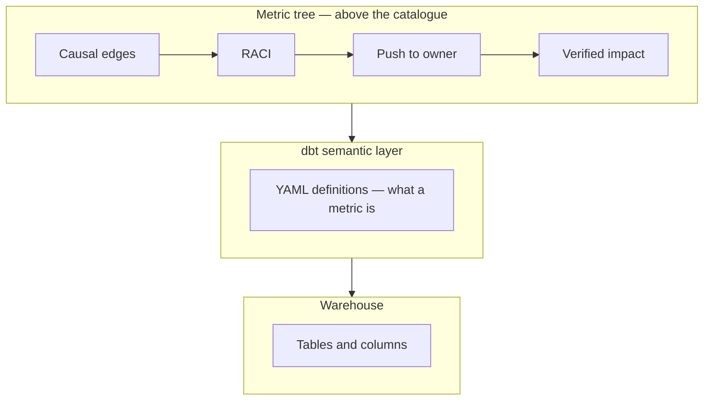

# How-to guides

Part of the [KPI Tree Guides capture](../kpitree-guides-capture.md). Grouping follows the [kpitree.co/guides](https://kpitree.co/guides) collection.

## Contents

- [15. How to Run a Metric Tree Workshop: A Facilitation Guide](#15-how-to-run-a-metric-tree-workshop-a-facilitation-guide---kpi-tree)
- [16. How to Choose KPIs: A Metric Tree Approach to KPI Selection](#16-how-to-choose-kpis-a-metric-tree-approach-to-kpi-selection---kpi-tree)
- [20. How to Set KPI Targets: A Data-Driven Approach to Target Setting](#20-how-to-set-kpi-targets-a-data-driven-approach-to-target-setting---kpi-tree)
- [24. How to Run a Metrics Review Meeting](#24-how-to-run-a-metrics-review-meeting---kpi-tree)
- [33. How to Build a KPI Dashboard That Drives Decisions](#33-how-to-build-a-kpi-dashboard-that-drives-decisions---kpi-tree)
- [37. How to Communicate Metrics to Stakeholders](#37-how-to-communicate-metrics-to-stakeholders---kpi-tree)
- [39. How to Run a Quarterly Business Review (QBR)](#39-how-to-run-a-quarterly-business-review-qbr---kpi-tree)
- [44. How to Present Metrics to Your Board: A Practical Guide](#44-how-to-present-metrics-to-your-board-a-practical-guide---kpi-tree)
- [47. How to Migrate From Spreadsheet Metrics to a Metric Tree](#47-how-to-migrate-from-spreadsheet-metrics-to-a-metric-tree---kpi-tree)
- [50. How to Onboard New Hires With Your Metric Tree](#50-how-to-onboard-new-hires-with-your-metric-tree---kpi-tree)
- [54. How to Sunset a Metric: A Practical Guide to KPI Pruning](#54-how-to-sunset-a-metric-a-practical-guide-to-kpi-pruning---kpi-tree)
- [63. How to Benchmark Your Metrics](#63-how-to-benchmark-your-metrics---kpi-tree)
- [66. How to Debug a Broken Metric: A Systematic Framework](#66-how-to-debug-a-broken-metric-a-systematic-framework---kpi-tree)
- [71. How to Align OKRs Across Teams Using a Metric Tree](#71-how-to-align-okrs-across-teams-using-a-metric-tree---kpi-tree)
- [76. How to Run an A/B Test with Metric Trees](#76-how-to-run-an-ab-test-with-metric-trees---kpi-tree)
- [128. Migrating from Power BI Scorecard Hierarchies to Metric Trees](#128-migrating-from-power-bi-scorecard-hierarchies-to-metric-trees---kpi-tree)
- [149. dbt Semantic Layer and Metric Trees: How They Fit Together](#149-dbt-semantic-layer-and-metric-trees-how-they-fit-together---kpi-tree)

---

## 15. How to Run a Metric Tree Workshop: A Facilitation Guide - KPI Tree

### Provenance

- Requested source URL: [https://kpitree.co/guides/how-to/metric-tree-workshop](https://kpitree.co/guides/how-to/metric-tree-workshop)
- Final fetched URL: [https://kpitree.co/guides/how-to/metric-tree-workshop](https://kpitree.co/guides/how-to/metric-tree-workshop)
- Canonical URL: [https://kpitree.co/guides/how-to/metric-tree-workshop](https://kpitree.co/guides/how-to/metric-tree-workshop)
- Retrieval timestamp (UTC): 2026-08-26T07:46:54.252Z
- HTTP status: 200
- Page title: How to Run a Metric Tree Workshop: A Facilitation Guide - KPI Tree
- Meta description: Not present
- Full response SHA-256: `f58f2253143c9b6032c31aecaf6d5dd949c73b3a155bf46fa3237093f1cd86a4`
- Material fragment SHA-256: `9446806009b68099e997700b4e02935ab48adabc2bbbb02abe68ae5cda82565a`

### Material

A step-by-step facilitation guide for running a metric tree workshop. Covers preparation, agenda, techniques, and pitfalls so your team builds a shared metric tree in one session.

*11 min read*

**Chapters**

- [Why a workshop, not a spreadsheet](#why-a-workshop-not-a-spreadsheet)
- [Before the workshop](#before-the-workshop)
- [The workshop agenda](#the-workshop-agenda)
- [Facilitation techniques that work](#facilitation-techniques-that-work)
- [Common workshop pitfalls](#common-workshop-pitfalls)
- [After the workshop](#after-the-workshop)
- [A worked example](#a-worked-example)

### Why a workshop, not a spreadsheet

The most common way organisations attempt to build a metric tree is also the least effective: one person opens a spreadsheet, maps out the metrics they think matter, and circulates it for comments. The result is a document that reflects a single perspective, collects a handful of superficial edits, and gathers dust within weeks. The tree might be technically correct, but nobody feels ownership over it because nobody helped build it.

Behavioural science explains why. Shared mental models are not built through documentation. They are built through dialogue. When a Head of Product and a Head of Sales sit in the same room and debate whether activation rate or pipeline velocity is the stronger driver of revenue growth, both leave with a deeper understanding of how the business actually works. That understanding cannot be transmitted through a slide deck or a Notion page. It has to be constructed through conversation, disagreement, and eventual alignment.

This is why the workshop format matters. The process of building the tree is as valuable as the tree itself. A workshop forces cross-functional teams to surface assumptions, resolve conflicts, and commit to a shared model of cause and effect. The metric tree you produce at the end is the artifact. The real output is the alignment that happens along the way.

> **Key insight.** The process of building the tree is as valuable as the tree itself. A metric tree built by one person in isolation reflects one perspective. A metric tree built collaboratively reflects shared understanding, and shared understanding is the prerequisite for coordinated action.

### Before the workshop

Good workshops are won or lost before they start. The facilitation techniques matter, but they cannot compensate for poor preparation. Invest an hour or two upfront to set the conditions for a productive session. The following steps will prevent the most common failure modes: wrong people in the room, no agreement on the starting point, and unrealistic expectations about what can be achieved.

1. **Identify the right participants**

   You need cross-functional representation. Include someone from each major branch of the business: product, engineering, marketing, sales, finance, and customer success. The goal is to have every perspective that shapes how the business creates and captures value. Aim for 6 to 10 people. Fewer than 6 and you will have blind spots. More than 10 and the session becomes unwieldy. If your organisation is large, run separate workshops per business unit and align the trees afterwards.

2. **Agree on the North Star metric in advance**

   Do not spend workshop time debating which metric sits at the top of the tree. This decision should be made by leadership before the session. Circulate the North Star metric, its definition, and its current value at least a week in advance. If there is genuine disagreement about the North Star, resolve it in a separate, smaller meeting. The workshop assumes alignment on where you are heading.

3. **Gather baseline data for top-level metrics**

   Bring current values and recent trends for the North Star and its likely first-level drivers. Having real numbers in the room grounds the conversation in reality rather than opinion. It also helps participants spot gaps: if nobody can produce a number for a metric you think matters, that tells you something important about your measurement maturity.

4. **Prepare a blank tree template**

   Whether you use a whiteboard, a digital tool, or sticky notes on a wall, have the structure ready before the session starts. Pre-populate only the North Star at the root. Everything else should be empty. The blank space is intentional: it signals that the group will build this together, not react to a pre-built draft.

5. **Set expectations with participants**

   Send a brief pre-read explaining what a metric tree is, why the team is building one, and what the session will involve. Be explicit: this is a working session, not a presentation. Participants should come prepared to contribute, debate, and commit. Share the agenda and time blocks so people know what to expect and can plan their energy accordingly.

6. **Schedule 2 to 3 hours**

   A one-hour session is not enough. You will spend the first 15 minutes aligning, the middle hour decomposing, and you need at least another hour for debate, relationship definition, and ownership assignment. Book 2.5 hours with a 10-minute break in the middle. If your organisation resists long meetings, frame this as a quarterly investment that saves hundreds of hours of misalignment downstream.

### The workshop agenda

The following agenda has been refined through dozens of metric tree workshops across SaaS, e-commerce, and marketplace businesses. The total time is approximately 2 hours and 20 minutes. Adjust the time allocations to fit your context, but preserve the sequence. Each phase builds on the previous one, and skipping ahead creates gaps that are expensive to fill later.

1. **Phase 1: Align on the North Star and first-level drivers (15 minutes)**

   Start by presenting the North Star metric, its current value, and its trend. Then facilitate a brief discussion to agree on the two to four first-level drivers. This should not take long if you did the pre-work. The facilitator proposes a starting decomposition, and the group validates or adjusts it. Keep this tight. The goal is a shared starting point, not a perfect answer. You will revisit these relationships later.

2. **Phase 2: Decompose each branch in breakout groups (45 minutes)**

   Divide participants into small groups of 2 to 3 people, one group per first-level branch. Each group decomposes their branch as deep as they can go. Use the "what drives this?" question recursively: for every metric, ask what the two to three factors are that determine it. Stop when you reach metrics that a single team or person can directly influence. Give each group a whiteboard section or a digital canvas to work on. The facilitator floats between groups to check progress and prevent rabbit holes.

3. **Phase 3: Reconnect and debate the full tree (30 minutes)**

   Bring the groups back together. Each group presents their branch to the full room. This is where the real value happens. Cross-functional challenge surfaces assumptions that a single-function group would miss. Sales might point out that the product group forgot to include pricing as a driver. Finance might challenge the relationship between marketing spend and pipeline. Capture disagreements. If something cannot be resolved in the room, mark it for follow-up. Do not let perfect be the enemy of good.

4. **Phase 4: Define relationships (20 minutes)**

   Walk through the tree and label each connection. Is it multiplicative (Revenue = Users x ARPU), additive (Total Users = Segment A + Segment B), or influencing (NPS affects retention but is not a formula)? Also note the direction: does the child metric increase or decrease the parent? This step transforms a diagram into a model. It is the difference between "these metrics are related" and "here is specifically how they are related." Skip this step and the tree loses most of its predictive value.

5. **Phase 5: Assign ownership to every metric (20 minutes)**

   Go node by node and assign a named owner to each metric. Not a team. A person. Ownership means this person is responsible for monitoring the metric, investigating when it moves, and taking or coordinating action. This step is uncomfortable. People resist putting their name next to a number they cannot fully control. That discomfort is productive. It forces honest conversation about who actually influences what. If nobody will own a metric, question whether it belongs in the tree at all.

6. **Phase 6: Agree on next steps and review cadence (10 minutes)**

   Close the session by agreeing on three things: who will digitise and circulate the tree within 48 hours, when the first review meeting will happen (recommend two weeks out), and what cadence the tree will be reviewed on going forward (recommend monthly for the first quarter, then quarterly). Assign these as explicit actions with owners and deadlines. A workshop without follow-through is just a team-building exercise.

### Facilitation techniques that work

Running a metric tree workshop is not the same as running a typical meeting. You are asking people to build a model of how their business works, which requires structured thinking, honest debate, and disciplined time management. These techniques address the most common group dynamics challenges that derail workshops.

- **The "five whys" for decomposition** — For every metric, keep asking "what drives this?" until you reach something a team directly controls. This recursive questioning prevents the tree from staying too abstract. If a group gets stuck, prompt them: "If this metric dropped 20% tomorrow, what would you investigate first?" The answer is usually a child metric.
- **Silent brainstorming before discussion** — Before any group discussion, give participants 3 minutes to write down their ideas individually. This prevents anchoring bias, where the first idea spoken aloud dominates the conversation. Research on group decision-making consistently shows that silent ideation followed by structured sharing produces more diverse and higher-quality outputs than open discussion alone.
- **Dot voting for prioritising branches** — When the group has more potential branches than time allows, use dot voting. Give each participant 3 votes to place on the branches they believe are most important to decompose further. This surfaces collective priorities without lengthy debate and prevents a single loud voice from setting the agenda.
- **The "red team" challenge** — Assign one or two people to play devil's advocate for each branch. Their job is to find gaps, challenge assumptions, and ask "what are we missing?" This role should rotate so the same people are not always in the critic seat. Red teaming catches blind spots that consensus-driven groups naturally overlook.
- **Time-boxing each branch** — Allocate a fixed number of minutes per branch and stick to it. Use a visible timer. Without time-boxing, groups inevitably spend 80% of their time on the first branch and rush through the rest. If a branch needs more depth, schedule a follow-up session for that branch specifically rather than stealing time from others.
- **Parking lot for tangential discussions** — Keep a visible "parking lot" list on a whiteboard or shared document. When conversations drift into tangential territory, such as data quality concerns, tooling decisions, or organisational restructuring, capture the topic in the parking lot and return to the tree. Review parked items in the last 5 minutes and assign owners for follow-up.

### Common workshop pitfalls

Even well-prepared workshops can go wrong. These are the pitfalls that occur most frequently, along with how to recognise and address them in the moment. Knowing these in advance helps the facilitator intervene early rather than discovering the problem after the session ends.

- **The HiPPO problem** — The Highest-Paid Person's Opinion dominates the room. Senior leaders propose a decomposition and nobody pushes back. Counter this by using silent brainstorming, asking juniors to share first, and explicitly inviting dissent: "Who sees this differently?" If the CEO is in the room, brief them beforehand to hold back and let others lead the decomposition.
- **Going too deep too fast** — One branch gets decomposed to five levels while others remain at one level. This happens when subject matter experts get excited about their domain. The facilitator must enforce breadth-first decomposition: get every branch to two levels before any branch goes to three. Depth can always be added in follow-up sessions.
- **Confusing metrics with initiatives** — Participants add "launch new pricing page" or "hire two SDRs" to the tree instead of measurable metrics. Initiatives are actions. Metrics are the numbers those actions are designed to move. When this happens, ask: "What metric would improve if that initiative succeeded?" Put the metric in the tree and capture the initiative separately.
- **Too many or too few participants** — With fewer than 6 people, critical perspectives are missing and the tree reflects a narrow view of the business. With more than 12, coordination costs exceed the value of additional perspectives. If you must include more stakeholders, use a two-phase approach: a core group of 8 builds the tree, then a wider group of 20 reviews and challenges it asynchronously.
- **Skipping the ownership step** — Time runs short and the group decides to "assign owners later." This almost never happens. The ownership conversation is uncomfortable, which is exactly why it must happen in the room while people are engaged. A tree without owners is a diagram, not a management tool. Protect the last 20 minutes of the agenda for this step, even if it means cutting the decomposition short.
- **Treating it as a one-off event** — The workshop produces a beautiful tree that is never revisited. Within a month, the business has changed and the tree is outdated. The workshop must end with a commitment to a review cadence. Schedule the first review meeting before people leave the room. A metric tree is a living document. If it is not maintained, it becomes decoration.

### After the workshop

The 48 hours after the workshop are critical. Momentum decays exponentially. If the tree is not digitised and circulated within two days, participants start to forget the nuances of what was agreed. Within a week, the shared understanding that was so carefully constructed begins to fragment as people revert to their pre-workshop mental models.

The first step is to document the tree digitally. Transfer the sticky notes, whiteboard drawings, or photos into a structured format that everyone can access. Include the metric names, the relationships between them, the owners, and any notes or open questions from the session. Circulate this to all participants and ask for asynchronous feedback within 48 hours. This is not an invitation to redesign the tree. It is a chance to catch errors, add context, and confirm that the digital version matches what was agreed in the room.

Within two weeks, connect the tree to live data sources. Start with the metrics you can already measure. For metrics that do not yet have a data source, create a manual tracking process as a temporary bridge. The goal is to make every node in the tree show a real number as quickly as possible. A tree with numbers is a tool. A tree without numbers is a poster.

Schedule the first review meeting for two weeks after the workshop. In this meeting, walk through the tree with the owners. Has anything changed? Are the relationships holding up? Are there branches that need more depth or metrics that turned out to be unmeasurable? Use this meeting to refine the model based on the first round of real data. Then continue with monthly reviews for the first quarter before moving to a quarterly cadence.

> “A metric tree is a living document. The version you build in the workshop is version one, not the final version. The businesses that get the most value from metric trees are the ones that treat them as an evolving model of how their business works, updated regularly as they learn more about cause and effect.”

### A worked example

To make this concrete, here is what a completed workshop output might look like for a B2B SaaS company. The North Star metric is Annual Recurring Revenue (ARR). The workshop participants included the CEO, VP Product, VP Sales, VP Marketing, VP Customer Success, and Head of Finance.

In Phase 1, the group agreed on two first-level drivers: ARR = Number of Paying Customers x Average Revenue per Customer. In Phase 2, the breakout groups decomposed each branch. The Sales and Marketing group broke down Number of Paying Customers into New Customers, Expansion (existing customers upgrading), and Churned Customers. They then decomposed New Customers further into the pipeline stages: Leads, Qualified Opportunities, and Won Deals. The Product and Customer Success group decomposed Average Revenue per Customer into plan mix and usage-based add-ons, then decomposed churn into voluntary churn and involuntary churn (failed payments).

In Phase 3, the reconnection surfaced an important insight: the Product group had not included onboarding completion as a driver of retention, and the Sales group pointed out that deal size at close strongly predicted expansion revenue. Both metrics were added. Phase 4 labelled the top-level split as multiplicative, the customer segments as additive, and relationships like onboarding-to-retention as influencing. Phase 5 assigned owners: VP Sales owned New Customers, VP Customer Success owned Churn, and VP Product owned Activation Rate.

The tree below shows the result. Notice how each bottom-level metric maps to a specific team and person. This is what makes a metric tree actionable.

- ARR
  - Paying Customers
    - New Customers
      - Leads
      - Qualified Opportunities
      - Win Rate
    - Expansion Revenue
      - Upgrade Rate
      - Usage Add-ons
    - Churned Customers
      - Voluntary Churn
      - Involuntary Churn
  - Avg Revenue per Customer
    - Plan Mix
    - Activation Rate
    - Onboarding Completion

### Continue reading

- [How to build a metric tree](./getting-started.md#2-how-to-build-a-metric-tree-kpi-tree---kpi-tree)
  - A step-by-step metric tree and KPI tree template from North Star to daily levers
- [Metric ownership](./core-concepts.md#9-metric-ownership-who-should-own-which-metric---kpi-tree)
  - The most underrated lever in business performance
- [Metric decomposition](./core-concepts.md#10-metric-decomposition---kpi-tree)
  - Break any business metric into the components that drive it

---

---

## 16. How to Choose KPIs: A Metric Tree Approach to KPI Selection - KPI Tree

### Provenance

- Requested source URL: [https://kpitree.co/guides/how-to/how-to-choose-kpis](https://kpitree.co/guides/how-to/how-to-choose-kpis)
- Final fetched URL: [https://kpitree.co/guides/how-to/how-to-choose-kpis](https://kpitree.co/guides/how-to/how-to-choose-kpis)
- Canonical URL: [https://kpitree.co/guides/how-to/how-to-choose-kpis](https://kpitree.co/guides/how-to/how-to-choose-kpis)
- Retrieval timestamp (UTC): 2026-08-26T07:46:54.252Z
- HTTP status: 200
- Page title: How to Choose KPIs: A Metric Tree Approach to KPI Selection - KPI Tree
- Meta description: Not present
- Full response SHA-256: `30795bea5fdb79649e29e80c62cac9f2f3809fb2bab87228e53e630c6d25a13c`
- Material fragment SHA-256: `cc6c69958e26cb08aac0254255a7f59533d864c8b93c59fd58bf5e1f6ab44050`

### Material

Most KPI selection processes start with a room full of opinions and end with a spreadsheet full of disconnected numbers. A metric tree replaces guesswork with structure, surfacing the KPIs that actually matter by decomposing your most important outcome into its drivers.

*8 min read*

**Chapters**

- [Why most KPI selection fails](#why-most-kpi-selection-fails)
- [The decomposition approach](#the-decomposition-approach)
- [Five criteria for a good KPI](#five-criteria-for-a-good-kpi)
- [How many KPIs is the right number?](#how-many-kpis)
- [KPIs by level](#kpis-by-level)
- [From KPIs to action](#from-kpis-to-action)

### Why most KPI selection fails

The typical KPI selection process looks the same in almost every organisation. A leadership team gathers in a room, someone hands out Post-it notes, and everyone writes down the metrics they think matter. The group debates, negotiates, and eventually votes. The result is a list of 12 to 20 KPIs that reflect what people feel is important, not what actually drives the business.

This brainstorming approach fails for three reasons. First, it has no structure. Metrics from completely different levels of the business end up side by side, mixing strategic outcomes with operational activities. Revenue sits next to email open rate. Customer lifetime value sits next to support ticket response time. Without hierarchy, there is no way to see how these metrics relate to each other or which ones deserve the most attention.

Second, brainstormed KPIs lack causal logic. Nobody asks whether improving metric A actually moves metric B. The list is a collection of individually reasonable numbers that, taken together, tell no coherent story about how the business works. Teams end up optimising their own KPIs in isolation, sometimes at the expense of the broader outcome.

Third, the process rewards confidence over analysis. The loudest voices in the room tend to win, and the resulting KPIs reflect organisational politics rather than business reality. The metrics that survive the vote are the ones people already track, not necessarily the ones that would create the most value if improved.

> KPIs chosen without structure are metrics chosen by popularity, not by impact. When every team picks its own numbers independently, you get a dashboard that looks comprehensive but explains nothing.

### The decomposition approach

The alternative to brainstorming is decomposition. Instead of asking "what should we measure?", you ask "what drives our most important outcome?" and break that outcome down into its component parts. Each level of the breakdown reveals the metrics that matter at that level, and the tree structure ensures every KPI is connected to the outcome it serves.

Start with your North Star metric, the single number that best captures the value your business creates. Then ask: what are the two to four factors that directly determine this number? Decompose each of those factors further, and keep going until you reach the operational levers that individual teams control. The KPIs do not need to be invented. They emerge from the structure of the tree itself.

This approach has a critical advantage over brainstorming: it produces KPIs that are connected by design. Every metric in the tree has a parent it feeds into and, in most cases, children that feed into it. When a KPI moves, you can trace the impact upward to see how it affects the business outcome. When the business outcome changes, you can trace downward to find the driver.

Decomposition also eliminates the problem of mixing levels. Executive KPIs sit at the top of the tree, department KPIs sit in the middle, and team KPIs sit at the leaves. There is no confusion about which metrics belong at which level, because the tree defines the hierarchy explicitly. The result is a set of KPIs that are not just individually good but collectively coherent.

- Revenue (North Star)
  - Number of Customers
    - New Customers
      - Conversion Rate
      - Qualified Leads
    - Retention Rate
      - Onboarding Completion
      - Feature Adoption
  - Avg Revenue per Customer
    - Plan Mix
    - Expansion Revenue

### Five criteria for a good KPI

Not every metric in the tree should become a KPI. A metric tree might contain 30 or 40 nodes, but only a subset of those deserve the focus, ownership, and reporting cadence that comes with KPI status. The following five criteria help you decide which metrics to elevate from the tree into your core KPI set.

1. **Actionable**

   A good KPI can be directly influenced by a team through their day-to-day work. If nobody in the organisation can take a specific action to move the number, it is a useful metric for context but a poor choice for a KPI. The metric tree helps here because the lower levels of the tree naturally correspond to things teams can control. If a metric sits high in the tree and no single team can move it, it is probably an outcome to track rather than a KPI to own.

2. **Measurable**

   The metric must be quantifiable and available on a regular cadence. Weekly or fortnightly is ideal for most operational KPIs. Monthly works for strategic KPIs at the top of the tree. If you can only measure something quarterly or annually, it is too slow to drive behaviour. A KPI that arrives after the window for action has closed is a report, not a performance indicator.

3. **Connected**

   This is where the metric tree earns its value. Every KPI should be linked to a parent outcome through the tree. If a metric cannot be placed in the hierarchy, if improving it does not demonstrably improve something above it, then it does not belong in your KPI set. Connectedness prevents the common failure of teams optimising metrics that feel important but have no traceable link to business outcomes.

4. **Owned**

   A KPI without a named owner is a number nobody is accountable for. Ownership means a specific person is responsible for monitoring the metric, investigating when it moves unexpectedly, and taking action to keep it on track. The metric tree makes ownership natural because each branch of the tree typically maps to a team or function. Assigning owners becomes a matter of matching the tree structure to the org chart.

5. **Balanced**

   Every KPI should be paired with a quality check that prevents gaming. If your KPI is lead volume, the balancing metric is lead quality or conversion rate. If your KPI is support ticket resolution time, the balancing metric is customer satisfaction score. Without a counterweight, teams will optimise the KPI in ways that damage the broader system. The metric tree makes these pairings visible because you can see sibling metrics on the same branch.

### How many KPIs is the right number?

One of the most common questions in KPI selection is how many to have. The answer draws on decades of cognitive science research. Miller's Law, published in 1956, established that human working memory can hold roughly seven items, plus or minus two. Subsequent research has refined this further, suggesting that for complex information like business metrics, the effective limit is closer to four or five items before comprehension degrades.

The practical implication is straightforward: each team should own three to five KPIs. Fewer than three and you risk missing important dimensions of performance. More than five and you dilute focus to the point where nothing gets proper attention. When a team tracks 15 KPIs, they effectively track none, because no single metric receives the sustained attention needed to drive improvement.

Across the entire organisation, a well-structured metric tree typically yields 15 to 25 KPIs in total. This number feels large, but the tree structure makes it manageable because no single person or team is responsible for all of them. The executive team tracks the North Star and its three to four first-level drivers. Each department tracks its branch of the tree. Each team tracks the operational metrics at the leaves of their branch.

The tree structure itself prevents KPI proliferation. Every proposed KPI must justify its position in the hierarchy. If you cannot show where it connects to the tree, it does not make the cut. This is a far more disciplined approach than the brainstorming method, which tends to produce long lists because there is no structural constraint on what gets included. The tree acts as a natural filter, ensuring that every KPI has a reason to exist and a place in the broader system.

### KPIs by level

One of the most powerful properties of the metric tree is that it naturally segments KPIs by organisational level. Each tier of the tree corresponds to a different audience, a different time horizon, and a different type of decision. Understanding these differences is essential for setting KPIs that are appropriate for the people who will use them.

| Level | KPI type | Example | Review cadence |
| --- | --- | --- | --- |
| Executive | North Star + 3-4 first-level drivers | Revenue, Customer Count, ARPU, Retention Rate | Monthly or quarterly |
| Department | Branch-specific drivers | New Customer Acquisition, Expansion Revenue, NPS | Fortnightly or monthly |
| Team | Operational inputs and leading indicators | Conversion Rate, Onboarding Completion, Feature Adoption | Weekly |
| Individual | Activity metrics that feed team KPIs | Demos Booked, Tickets Resolved, Experiments Shipped | Daily or weekly |

The tree ensures alignment without micro-management. An executive does not need to know how many demos a sales rep booked last Tuesday. But if new customer acquisition drops, they can trace down through the tree to find the level where the problem originated. Equally, the sales rep does not need to understand the full revenue decomposition. They need to know that their demo-to-close ratio feeds into new customer acquisition, which feeds into customer count, which feeds into revenue. The tree provides that line of sight.

This layered approach solves the common tension between leadership wanting visibility and teams wanting autonomy. Leadership gets visibility through the tree structure, which shows how every metric connects to outcomes. Teams get autonomy because they own the metrics at their level and decide how to improve them. The tree defines the what. Teams decide the how.

KPIs at each level also differ in their nature. Executive KPIs tend to be lagging indicators, outcomes that reflect past performance. Team KPIs tend to be leading indicators, inputs that predict future outcomes. The tree makes this distinction visible because lagging indicators sit higher in the hierarchy and leading indicators sit lower. This means the teams closest to the work are tracking the metrics that give the earliest signal of change, which is exactly where fast feedback loops create the most value.

### From KPIs to action

Selecting the right KPIs is necessary but not sufficient. A well-chosen KPI without a system around it is just a number on a dashboard that nobody acts on. Each KPI needs four things to become operational: a target range, an owner, a review cadence, and linked actions.

The target range defines what good looks like. Avoid single-point targets where possible. A range, such as 72% to 78% for activation rate, acknowledges natural variation and prevents teams from overreacting to noise. The metric tree helps set realistic targets because you can model upward: if the team achieves 75% activation and the other branch achieves its target, what does that imply for the parent metric? Targets should be consistent across the tree, not set independently.

The review cadence determines how often the KPI gets formal attention. Match the cadence to the level in the tree. Executive KPIs reviewed monthly. Department KPIs reviewed fortnightly. Team KPIs reviewed weekly. Without a rhythm, reviews happen only when something goes wrong, which means you are always reacting and never anticipating.

Linked actions are what close the loop. When a KPI moves outside its target range, the owner investigates and decides on a response. That response is logged against the metric, tracked to completion, and measured for impact. Over time, this creates an organisational memory of what works and what does not. The metric tree provides the context that turns isolated KPIs into a connected system, so that an action on one metric can be evaluated for its impact on the metrics around it.

> “The purpose of choosing KPIs is not to fill a dashboard. It is to create a system where every team knows what to measure, why it matters, and what to do when the number moves.”

### Continue reading

- [How to build a metric tree](./getting-started.md#2-how-to-build-a-metric-tree-kpi-tree---kpi-tree)
  - A step-by-step metric tree and KPI tree template from North Star to daily levers
- [Leading vs lagging indicators](./core-concepts.md#6-leading-vs-lagging-indicators-explained-examples---kpi-tree)
  - How leading vs lagging indicators connect in a metric tree
- [Metric ownership](./core-concepts.md#9-metric-ownership-who-should-own-which-metric---kpi-tree)
  - The most underrated lever in business performance

---

---

## 20. How to Set KPI Targets: A Data-Driven Approach to Target Setting - KPI Tree

### Provenance

- Requested source URL: [https://kpitree.co/guides/how-to/how-to-set-kpi-targets](https://kpitree.co/guides/how-to/how-to-set-kpi-targets)
- Final fetched URL: [https://kpitree.co/guides/how-to/how-to-set-kpi-targets](https://kpitree.co/guides/how-to/how-to-set-kpi-targets)
- Canonical URL: [https://kpitree.co/guides/how-to/how-to-set-kpi-targets](https://kpitree.co/guides/how-to/how-to-set-kpi-targets)
- Retrieval timestamp (UTC): 2026-08-26T07:46:54.252Z
- HTTP status: 200
- Page title: How to Set KPI Targets: A Data-Driven Approach to Target Setting - KPI Tree
- Meta description: Not present
- Full response SHA-256: `96cec7971a0e7342643d7271ae252631b19404603fc35861f69c2ef4ab29e7e6`
- Material fragment SHA-256: `60837ce99206c16cf4a9cdcaf0c7469d04d24d1e348076751d0e8ba4d8c8f0d9`

### Material

Most KPI targets are set through negotiation, not analysis. This guide shows how to use metric trees and structured methods to set targets that are coherent, realistic, and genuinely useful for driving performance.

*9 min read*

**Chapters**

- [Why most targets are wrong](#why-most-targets-are-wrong)
- [Top-down vs bottom-up target setting](#top-down-vs-bottom-up)
- [Using a metric tree to set coherent targets](#metric-tree-for-coherent-targets)
- [Five methods for setting targets](#five-methods-for-setting-targets)
- [Common target-setting mistakes](#common-target-setting-mistakes)
- [Targets as hypotheses, not commitments](#targets-as-hypotheses)

### Why most targets are wrong

Every year, the same ritual plays out across thousands of organisations. Finance sends down a revenue target derived from investor expectations or board ambitions. Business units negotiate their share. Department heads push back with reasons why the number is unrealistic, then eventually accept something close to it. Team leads break their allocation into sub-targets using last year as a baseline plus a percentage. The resulting targets look precise. They sit in spreadsheets with decimal places and RAG statuses. But they are built on negotiation, not structural understanding.

The problem is not that the people involved lack intelligence or good intentions. The problem is that target setting without a model of how the business actually works is guesswork dressed in the language of rigour. When the sales team is told to grow revenue by 20%, nobody asks whether the pipeline, conversion rates, and average deal sizes can structurally produce that outcome. When the marketing team is told to generate 30% more leads, nobody checks whether the website traffic, content engine, and campaign budgets can support that volume. The targets exist in isolation from the system that must deliver them.

This disconnect produces predictable consequences. Teams that receive impossible targets either burn out trying or quietly game the metrics to appear on track. Teams that receive soft targets coast. The relationship between individual targets and overall business performance becomes opaque. When the company misses its annual plan, the post-mortem devolves into blame rather than diagnosis, because nobody has a model that explains which assumptions were wrong and where the plan broke down.

> **Key insight.** A target without a model is a wish. If you cannot trace how each target connects to the targets above and below it through quantified relationships, you are not setting targets. You are distributing aspirations.

### Top-down vs bottom-up target setting

The debate between top-down and bottom-up target setting is one of the oldest in business planning. Both approaches have clear logic. Both fail when used in isolation. Understanding why requires looking at what each method actually optimises for and where its blind spots lie.

| Dimension | Top-down | Bottom-up |
| --- | --- | --- |
| Starting point | Board or executive team sets the headline number based on strategy, investor expectations, or market opportunity | Individual teams estimate what they can realistically achieve based on current capacity and historical performance |
| Strength | Ensures ambition and strategic coherence. The company aims for something meaningful rather than settling for what feels comfortable | Grounded in operational reality. Teams set targets they believe they can hit because they understand their own constraints |
| Weakness | Disconnected from operational reality. The board may set a target that is structurally impossible given current resources and conversion rates | Prone to sandbagging. Teams naturally anchor to what they have done before and add a small margin. Aggregate bottom-up estimates rarely match strategic ambition |
| Cultural effect | Can create resentment if teams feel targets are imposed without understanding of ground-level constraints | Can create complacency if there is no external pressure to stretch beyond the current trajectory |
| Failure mode | Targets are missed because they were never achievable. Leadership blames execution rather than questioning the plan | Targets are hit but the business underperforms its potential. Nobody is held accountable for a lack of ambition |

The solution is not to pick one approach over the other. It is to use both simultaneously and reconcile them through a shared model. A metric tree makes this possible. The executive team sets the top-level target: revenue grows from £10M to £12M. That is the top-down ambition. Then the tree decomposes that target into its structural components: customer count, average revenue per customer, retention rate, and the sub-drivers beneath each. Individual teams estimate what they can achieve at each node. Marketing projects visitor growth and conversion improvements. Sales forecasts deal velocity and win rates. Product estimates the impact of planned features on retention and expansion.

When the bottom-up estimates are assembled and rolled up through the tree, one of three things happens. If they sum to £12M or more, the targets are validated and you can proceed with confidence. If they sum to £10.5M, there is a £1.5M gap, and the conversation shifts from "try harder" to "where specifically can we close the gap, and what would it take?" If they sum to £14M, you may have set a target that is too conservative at the top, or you may have teams that are overestimating their capacity. In every case, the tree gives you a structured way to reconcile ambition with reality, and the resulting targets are coherent because they are mathematically connected from root to leaf.

### Using a metric tree to set coherent targets

A metric tree turns target setting from an exercise in allocation into an exercise in modelling. Instead of asking "what should each team aim for?", you ask "what combination of input improvements produces the outcome we want?" The difference is fundamental. The first question invites negotiation. The second invites analysis.

Consider a straightforward example. Your current annual revenue is £10M. The board wants £12M next year, a 20% increase. Revenue decomposes into Customers multiplied by Average Revenue Per User (ARPU). You currently have 2,000 customers at £5,000 ARPU. The tree immediately reframes the question: which combination of customer growth and ARPU growth gets you to £12M?

- Revenue (£10M → £12M)
  - Customers (2,000 → ?)
    - New customer acquisition
      - Lead volume
      - Lead-to-customer rate
    - Customer retention rate
  - ARPU (£5,000 → ?)
    - Plan mix (% on higher tiers)
    - Expansion revenue per account

The arithmetic reveals the trade-offs. If ARPU stays flat at £5,000, you need 2,400 customers, a 20% increase. If you can grow ARPU by 9% to £5,450, you only need 2,202 customers, roughly a 10% increase. If ARPU grows by 15% to £5,750, you need just 2,087 customers, barely a 4% increase. Each scenario implies a completely different operational plan. The first demands heavy investment in acquisition. The second balances acquisition with monetisation. The third is almost entirely a pricing and expansion play.

Without the tree, leadership might simply tell both the growth team and the monetisation team to aim for 20% improvement. That would be incoherent, because a 20% increase in both customers and ARPU would produce £14.4M, overshooting the target by £2.4M. It would also be wasteful, because it asks teams to stretch on both dimensions when stretching on one might be sufficient. The tree prevents this by making the mathematical relationships explicit.

The real power emerges when you go deeper. If you need 2,202 new customers and your current lead-to-customer conversion rate is 5%, you need 44,040 leads. If you can improve conversion to 6%, you only need 36,700 leads. That distinction determines whether you need to hire three additional marketing staff or one. It determines your paid acquisition budget. It determines whether the target is achievable with existing channels or requires opening new ones. Every level of decomposition makes the plan more specific and the assumptions more testable.

### Five methods for setting targets

There is no single correct method for setting a KPI target. The right approach depends on the maturity of the metric, the availability of data, and the strategic context. In practice, the best targets draw on multiple methods simultaneously, using each as a cross-check against the others. The five methods below cover the full spectrum from data-rich to judgement-driven.

1. **Historical trend**

   Take last year's performance and extrapolate forward, often with a growth modifier. If revenue grew 15% last year, a historical-trend target might be 15-18% this year. This method is grounded in reality and easy to justify, but it anchors teams to past performance. It cannot account for step-change investments, market shifts, or compounding effects. Use it as a baseline sanity check, not as the primary method.

2. **Benchmark-based**

   Compare your metrics against industry peers, market averages, or best-in-class performers. If the median SaaS net revenue retention rate is 110% and yours is 95%, a benchmark-based target might aim for 105% within twelve months. This method is useful when you lack internal history or when you suspect your current performance is significantly above or below market norms. The limitation is that benchmarks are often poorly sourced, context-dependent, and lag behind real-time conditions.

3. **Model-based**

   Use the metric tree to calculate what is achievable given specific assumptions about each input. If you know your traffic growth trajectory, conversion rates, and retention curves, you can model the range of outcomes and set a target within that range. This is the most rigorous method because it forces you to state your assumptions explicitly, making it possible to diagnose exactly where reality diverged from the plan. It requires a well-structured metric tree and reliable data at each node.

4. **Aspiration-based**

   Set a stretch goal that represents a step change in performance, often tied to a strategic milestone. "Reach £50M ARR to qualify for Series C" or "achieve 90% customer satisfaction to unlock enterprise deals." Aspiration-based targets can energise teams and signal strategic intent, but they are dangerous when disconnected from a model. A stretch goal that is structurally impossible does not motivate. It demoralises. Use aspiration-based targets only when paired with a model-based reality check.

5. **Constraint-based**

   Determine the minimum performance needed to keep the business viable or to achieve a critical objective. What is the lowest acceptable retention rate before unit economics turn negative? What is the minimum revenue growth rate needed to avoid a down round? Constraint-based targets define the floor rather than the ceiling. They are particularly useful for defensive metrics where the goal is not to maximise but to stay above a threshold. Every organisation should know its constraint-based targets even if it aims far above them.

The strongest target-setting processes use all five methods as inputs into a single conversation. The historical trend tells you where momentum is carrying you. Benchmarks tell you where the market sits. The model tells you what is structurally achievable. Aspirations tell you what the business needs strategically. Constraints tell you what the business cannot afford to drop below. The final target should sit within the range defined by these five perspectives, with the model-based method carrying the most weight because it is the most testable and the most directly connected to the levers your teams actually control.

### Common target-setting mistakes

Even organisations that invest seriously in target setting fall into patterns that undermine the exercise. Most of these mistakes stem from treating targets as isolated numbers rather than as nodes in an interconnected system. Recognising these traps before your next planning cycle can save months of misaligned effort.

- **Setting point targets instead of ranges** — A target of "grow revenue by 20%" implies a precision that does not exist. The world is uncertain and your model has assumptions. Effective targets define a range: a floor (the minimum acceptable outcome), a base case (the most likely outcome given current plans), and a stretch (the best plausible outcome). Ranges communicate confidence levels, enable better resource planning, and reduce the binary pass/fail dynamic that makes target reviews unproductive.
- **Ignoring the relationships between targets** — Setting a target to grow revenue by 20% while keeping the marketing budget flat is not ambitious. It is incoherent. Targets across the metric tree must be internally consistent. If customer acquisition needs to increase by 15%, the lead generation targets, conversion rate targets, and sales capacity targets all need to reflect that. A metric tree makes these dependencies visible. Without one, you will routinely set targets that contradict each other.
- **Sandbagging** — When targets are tied to performance evaluations and compensation, teams have a rational incentive to negotiate easy ones. The result is a plan that the organisation could exceed without significant effort, which means resources are being under-deployed. The antidote is transparency. When targets are derived from a shared model rather than negotiated in bilateral conversations, it becomes much harder to hide capacity. The tree shows what each node should contribute, and the maths either add up or they do not.
- **Target fixation** — Hitting the target while the business deteriorates is worse than missing it while the business improves. A sales team that hits its revenue target by pulling forward next quarter's deals, offering excessive discounts, or neglecting customer success has achieved the number and damaged the underlying system. This is why targets should never exist in isolation. Pair every primary target with a counter-metric that guards against gaming. Revenue targets pair with margin or customer satisfaction. Growth targets pair with retention.
- **Targeting metrics nobody can influence** — A target is only useful if the people accountable for it can actually affect the outcome. Setting a target for market share, macroeconomic conditions, or competitor behaviour is futile. Effective targets live at the level of operational inputs: conversion rates, response times, feature adoption, retention rates. These are the metrics where effort translates into results. The metric tree helps here because it decomposes abstract outcomes into the concrete levers teams can pull.
- **Setting annual targets without interim checkpoints** — A twelve-month target with no milestones is a target you will not course-correct against. By the time the annual review arrives, it is too late to act on what you learn. Break annual targets into quarterly or monthly trajectories so that deviations are caught early. The trajectory does not need to be linear. Seasonal businesses will have uneven distributions. But the shape should be defined in advance so that each month you know whether you are on track.

### Targets as hypotheses, not commitments

The language organisations use about targets reveals their culture. In blame cultures, targets are commitments. "You committed to 20% growth and you delivered 14%. What went wrong?" In learning cultures, targets are hypotheses. "We predicted 20% growth based on these assumptions. We achieved 14%. Which assumptions were wrong and what does that teach us?" The difference is not semantic. It fundamentally changes how people behave.

When targets are treated as commitments, teams optimise for hitting the number at all costs. They game metrics, hide bad news, avoid ambitious goals they might miss, and focus on short-term results even when they come at the expense of long-term health. When targets are treated as hypotheses, teams are incentivised to set honest predictions, surface problems early, and learn from variances rather than disguise them. The quality of information flowing through the organisation improves dramatically because people are not afraid of what the data will show.

This reframing is grounded in behavioural science. Research on psychological safety, pioneered by Amy Edmondson at Harvard, consistently shows that teams perform better when they feel safe to take risks and acknowledge failure. Treating targets as hypotheses creates exactly that environment. A missed target is not a personal failure. It is a signal that the model was incomplete, that an assumption was wrong, or that the external environment shifted in a way the plan did not anticipate. The appropriate response is curiosity, not punishment.

> “The goal of a target is not to be right. The goal is to be useful. A target that is missed and produces a valuable insight about why has served its purpose better than a target that is hit through gaming and teaches you nothing.”

The metric tree supports this reframing structurally. When a top-level target is missed, the tree allows you to trace backwards through the branches to find exactly where the variance originated. Revenue fell short by £500K. The tree shows that customer acquisition was on track but ARPU declined because the plan-mix shifted toward lower tiers. That is a specific, actionable finding. It tells you that the pricing strategy or upsell motion needs attention, not that the team failed.

Practically, this means your target-setting process should include explicit documentation of the assumptions behind each target. What conversion rate are you assuming? What retention rate? What average deal size? When the quarter ends, review the assumptions as rigorously as you review the outcomes. Build the habit of asking "what did we learn?" before asking "what do we do next?" Over time, this shifts the culture from one that fears targets to one that uses them as a tool for continuous improvement. The targets become better each cycle because the model becomes more accurate, and the model becomes more accurate because people are honest about what it got wrong.

### Continue reading

- [What is a metric tree?](./getting-started.md#1-what-is-a-metric-tree---kpi-tree)
  - A metric tree maps cause and effect so every team sees what moves the needle
- [How to build a metric tree](./getting-started.md#2-how-to-build-a-metric-tree-kpi-tree---kpi-tree)
  - A step-by-step metric tree and KPI tree template from North Star to daily levers
- [Leading vs lagging indicators](./core-concepts.md#6-leading-vs-lagging-indicators-explained-examples---kpi-tree)
  - How leading vs lagging indicators connect in a metric tree

---

---

## 24. How to Run a Metrics Review Meeting - KPI Tree

### Provenance

- Requested source URL: [https://kpitree.co/guides/how-to/metrics-review-meeting](https://kpitree.co/guides/how-to/metrics-review-meeting)
- Final fetched URL: [https://kpitree.co/guides/how-to/metrics-review-meeting](https://kpitree.co/guides/how-to/metrics-review-meeting)
- Canonical URL: [https://kpitree.co/guides/how-to/metrics-review-meeting](https://kpitree.co/guides/how-to/metrics-review-meeting)
- Retrieval timestamp (UTC): 2026-08-26T07:46:54.252Z
- HTTP status: 200
- Page title: How to Run a Metrics Review Meeting - KPI Tree
- Meta description: Not present
- Full response SHA-256: `1f11528a69241ec8a23e869325a8d7128f836b32648860369b5ca79b49a434fd`
- Material fragment SHA-256: `9ec06d6c1dd3b3e45c76d36c6be5096f63311073398a047a3bcd18631b993dd1`

### Material

Most metrics meetings are status updates disguised as decision-making. People read numbers from a dashboard, nod, and move on. Nothing changes. This guide covers how to structure a metrics review meeting that surfaces the right problems, assigns clear next steps, and uses a metric tree to keep discussion focused on cause and effect rather than vanity metrics.

*9 min read*

**Chapters**

- [Why most metrics meetings fail](#why-most-metrics-meetings-fail)
- [A meeting structure that works](#meeting-structure)
- [Using a metric tree to structure the review](#using-a-metric-tree)
- [Good vs bad metrics meeting behaviours](#good-vs-bad-behaviours)
- [Cadence, participants, and preparation](#cadence-and-participants)
- [Common anti-patterns and how to fix them](#common-anti-patterns)
- [What to do when a metric is off track](#when-a-metric-is-off-track)

### Why most metrics meetings fail

The default format for a metrics meeting in most organisations is a round-robin status report. Each function presents their numbers. Marketing shares traffic and leads. Sales shares pipeline and close rates. Product shares activation and retention. Finance shares revenue and margins. The numbers are projected onto a screen, briefly discussed, and the meeting ends with a vague agreement to "keep an eye on" anything that looks off.

This format feels productive because everyone is looking at data. But looking at data is not the same as acting on it. The meeting produces awareness without accountability, observation without investigation, and discussion without decision. When the same metric is still off-track the following week and nobody can explain what was done about it, the meeting has failed at its only job: turning information into action.

Three structural problems explain why this happens so consistently.

- **No shared model of cause and effect** — When metrics are presented in isolation, each number exists on its own. There is no visual or structural connection between revenue dropping and which specific driver caused the drop. The group cannot trace the problem to its source because the relationships between metrics are not represented anywhere. Discussion drifts because there is no path to follow.
- **Everyone reports, nobody investigates** — Round-robin reporting incentivises preparation, not problem-solving. Each presenter spends time making their slides look good rather than investigating why a metric moved. The meeting rewards people for having an answer ready, not for admitting they do not know and committing to find out. This creates a culture of performance over learning.
- **No decisions leave the room** — The meeting ends without clear owners for follow-up actions. "Let us dig into that" is not an action item. It is a polite way of saying nobody is going to do anything. Without a named person, a specific investigation, and a deadline, the same red metric will appear again next week with no progress made.

> “A metrics meeting that does not produce atleast one specific, owned action i temper off-track metric is a status update with a calendar invite.”

### A meeting structure that works

An effective metrics review meeting has a clear purpose: identify what changed, understand why, and decide what to do about it. Everything in the meeting should serve one of those three goals. The structure below is designed for a weekly cadence with a 45-minute time box. It scales to monthly or quarterly reviews by extending the time on steps three and four.

1. **Open with the top-level metric (5 minutes)**

   Start at the root of your metric tree. Show the North Star metric and its trend. Is it on track against the target? If yes, acknowledge it and move on. If no, name the gap. This is not the time for speculation about causes. The purpose is to establish whether the business is on track or off track at the highest level. Starting at the top forces everyone to care about the same number before diving into their own domain.

2. **Walk the tree downward through the drivers (10 minutes)**

   Move one level down the metric tree and check each driver. Which branches are on track and which are not? If revenue is down, is it because acquisition fell, retention fell, or average revenue per user fell? For each branch that is off track, go one level deeper. Keep walking down until you reach the lowest-level metric that explains the movement. This step replaces the round-robin format. Instead of each team presenting their numbers independently, the tree dictates the order of discussion based on what actually matters this week.

3. **Focus on the two or three metrics that need attention (15 minutes)**

   Spend the bulk of the meeting on the metrics that are off track. For each one, the metric owner should present what they know: when did the movement start, what segments are affected, what hypotheses do they have, and what have they already ruled out. The group contributes additional context and challenges assumptions. This is where investigation happens in real time. Limit the discussion to the two or three most important items. Trying to cover every moving metric turns the meeting back into a status update.

4. **Assign actions with owners and deadlines (10 minutes)**

   For every off-track metric discussed, the meeting must produce at least one concrete action. "Investigate further" is not concrete. "Run a segment analysis on checkout abandonment by device type and report back by Thursday" is concrete. Every action needs a named owner and a date. Record these against the relevant metric node so they are visible to everyone and reviewable next week.

5. **Review last week's actions (5 minutes)**

   Close the loop by reviewing the actions assigned in the previous meeting. Did the investigation happen? What was found? Did the intervention work? This step creates accountability. When people know their commitments will be reviewed, they follow through. It also builds an organisational record of what was tried and what worked, which compounds into institutional knowledge over time.

> **Time discipline.** The most common failure mode for this format is spending too long on step two and running out of time for steps three and four. Walking the tree should be fast. The tree structure makes it fast because you only drill into branches that are off track. If you are spending more than ten minutes on the tree walk, you are discussing too many metrics or investigating during the walk instead of saving investigation for the focus step.

### Using a metric tree to structure the review

A metric tree is the single most effective tool for structuring a metrics review because it provides something a flat dashboard cannot: a navigable model of cause and effect. Instead of reviewing metrics in the order that each team happens to present them, you review metrics in the order that the business logic dictates.

The tree walk works top-down. You start at the root, the outcome the business ultimately cares about, and trace downward through the branches to find where the movement originates. This is the same logic a doctor uses when diagnosing a patient. You do not start by testing for every possible condition. You start with the symptom and work backward through the system until you find the organ that is malfunctioning.

In practice, a tree walk in a well-structured meeting takes five to ten minutes. Most branches will be stable. You acknowledge them and move on. The one or two branches that have moved become the focus of the meeting. Because the tree shows the relationship between the moving metric and the top-level outcome, every participant understands why the discussion matters, not just the team that owns that particular number.

- Monthly Recurring Revenue
  - New MRR
    - New Customers
      - Qualified Leads
      - Lead-to-Customer Rate
    - Avg Starting Contract Value
  - Expansion MRR
    - Upsell Rate
    - Cross-sell Rate
  - Churned MRR
    - Logo Churn Rate
    - Revenue Churn Rate

Consider the tree above. In a weekly review, you open with Monthly Recurring Revenue. It is down 4% against target. You move to the first branch: New MRR. It is roughly on plan. Expansion MRR is also on plan. Churned MRR is elevated: 15% above the expected range. Now you know where to focus. You drill into Churned MRR and find that Logo Churn Rate is stable but Revenue Churn Rate has spiked. Your largest customers are downgrading their plans.

Without the tree, the meeting might have started with a debate about whether the pipeline is healthy enough, then shifted to a conversation about a new campaign, and only arrived at the churn problem twenty minutes in, if at all. The tree got you there in three minutes because the structure pointed directly to the source of the gap.

This is why the tree should be visible during the meeting, ideally projected on a screen or shared in a collaborative tool. It serves as both the agenda and the navigation system. When discussion drifts, you can point to the tree and ask: where on the tree does this issue live? If the answer is "it does not," the topic belongs in a different meeting.

### Good vs bad metrics meeting behaviours

The format of the meeting matters, but so does the behaviour of the people in it. The same agenda can produce radically different outcomes depending on how participants engage. The comparison below captures the behavioural patterns that separate meetings which drive action from meetings which merely consume time.

| Effective behaviour | Ineffective behaviour |
| --- | --- |
| Owner explains why a metric moved, including what they investigated and ruled out | Owner reads the number aloud without commentary or context |
| Discussion focuses on the two or three metrics that are furthest off track | Every metric gets equal airtime regardless of whether it moved |
| Participants challenge hypotheses and offer alternative explanations | Participants nod along and save their real opinions for after the meeting |
| Actions are specific: named person, defined task, clear deadline | Actions are vague: "we should look into this" with no owner or date |
| Meeting reviews whether last week's actions were completed and what was learned | Last week's actions are never mentioned again |
| Tree structure guides discussion order: start at the top, drill into what moved | Discussion jumps between unrelated metrics with no connecting logic |
| Admitting "I do not know yet but I will investigate by Thursday" is respected | People fabricate explanations on the spot to avoid looking unprepared |
| Meeting finishes on time with a written list of actions and owners | Meeting runs over, ends without documented next steps |

The most important behavioural shift is treating the meeting as a problem-solving session rather than a reporting session. Reporting is a broadcast: one person talks, everyone else listens. Problem-solving is a conversation: the owner shares what they know, the group contributes context, and together they arrive at a better understanding than any individual could reach alone.

This shift requires psychological safety. If people are punished for presenting bad numbers, they will game the metrics, cherry-pick time ranges, or bury the problems in footnotes. The meeting leader sets the tone. When a metric is off track, the first question should be "what do we know about why?" not "why did you let this happen?" The goal is diagnosis, not blame.

### Cadence, participants, and preparation

Getting the cadence, attendee list, and preparation requirements right determines whether the meeting becomes a valuable ritual or an expensive calendar fixture that people dread. There is no single correct answer for every organisation, but there are principles that hold broadly.

- **Weekly for operating metrics** — Metrics that move frequently and where fast response matters should be reviewed weekly. These include acquisition metrics, conversion rates, activation rates, and support volume. Weekly cadence creates a rhythm of attention that catches problems early. Keep these meetings to 30-45 minutes with the operating team.
- **Monthly for strategic metrics** — Higher-level metrics like revenue growth, net retention, and customer lifetime value typically need a month of data to show meaningful trends. Monthly reviews with the leadership team provide the right altitude. Use 60-90 minutes and spend more time on investigation and strategic response.
- **Quarterly for the full tree** — Once a quarter, review the entire metric tree from root to leaves. This is not about individual metric movements. It is about whether the tree structure still reflects how the business works. Are there new drivers that should be added? Are there branches that no longer matter? The quarterly review is a structural audit, not a performance review.

Participants should include the metric owners for every metric that will be discussed, plus the senior leader who owns the top-level metric. Data and analytics team members should attend as a resource for answering questions that arise, not as the primary presenters. The metric owner presents their own metric. This is a deliberate design choice: when the business owner presents, they are forced to engage with the data rather than outsourcing understanding to an analyst.

Preparation should be lightweight but non-negotiable. Each metric owner should spend 15-30 minutes before the meeting reviewing their metrics, identifying anything that moved unexpectedly, and forming a preliminary hypothesis. They do not need to have a complete root cause analysis. They need to have looked at the numbers and noticed what changed. The meeting exists to deepen the investigation collaboratively, not to be the first time anyone looks at the data.

One practical tip that makes a significant difference: circulate the metric tree with current values and trend indicators 24 hours before the meeting. When participants arrive having already seen the numbers, the meeting can skip the "let me show you the data" phase and jump straight to "here is what I think is happening and here is what I need help with." This simple change can cut meeting time by a third.

### Common anti-patterns and how to fix them

Even well-intentioned metrics meetings can degrade over time. Recognising the anti-patterns early lets you course-correct before the meeting loses credibility with the team.

- **The data archaeology meeting** — Someone asks a question about a metric and the entire meeting stalls while an analyst runs a query in real time. The group watches a loading spinner for three minutes, then debates whether the result is correct. Fix this by making live querying out of scope for the meeting. Questions that require investigation become action items for the next session.
- **The vanity metric parade** — Teams present metrics that are always going up and to the right but have no connection to the outcomes the business cares about. Page views, app downloads, and total registered users are common culprits. Fix this by tying every metric discussed to a node in the metric tree. If it is not in the tree, it is not in the meeting.
- **The blame game** — When a metric drops, the conversation immediately turns to who is at fault rather than what caused the change and how to fix it. This trains people to hide bad numbers and avoid owning difficult metrics. Fix this by establishing a norm that the first question is always "what happened?" not "whose fault is it?" The meeting leader must enforce this consistently.
- **The scope creep spiral** — An off-track metric triggers a strategic debate about the product roadmap, the company's positioning, or a competitor's latest move. These are important conversations, but they do not belong in the metrics review. Fix this by time-boxing each metric and parking strategic discussions for a separate forum. Note them, schedule them, but do not let them consume the review.
- **The everything-is-fine meeting** — Every presenter reports that their metrics are "roughly on track" or "within expected variance." If this happens consistently, either the targets are too easy, the metrics are too aggregated to reveal problems, or people are not digging deep enough. Fix this by setting meaningful targets and decomposing metrics to a level where real operational issues become visible.

> **The litmus test.** After every metrics review, ask: did we leave with at least one action that would not have happened without this meeting? If the answer is no for three consecutive weeks, the meeting format needs to change.

### What to do when a metric is off track

Identifying that a metric is off track is only valuable if it triggers a response. The metrics review meeting should have a clear escalation path so that the conversation moves from "this metric is down" to "here is what we are going to do about it" within the meeting itself.

1. **Confirm the magnitude and duration**

   Not every dip requires action. Check whether the movement is within normal variance or represents a genuine shift. How many days or weeks has the metric been trending in this direction? A single week below target may be noise. Three consecutive weeks is a signal. Establishing the severity determines how much resource the response warrants.

2. **Trace to the root cause using the tree**

   Walk the metric tree downward to identify which sub-metric is driving the change. If the owner has already done this before the meeting, they present their findings. If not, assign this as the first action item. The root cause determines the appropriate response. Treating a symptom at the top of the tree when the cause lives three levels down wastes effort.

3. **Classify the cause**

   Is the cause something you can control (a product bug, a campaign that ended, a process change) or something external (a market shift, a seasonal pattern, a competitor move)? Controllable causes require an intervention. External causes require an adaptation. Misclassifying the cause leads to wasted effort: you cannot optimise your way out of a market downturn.

4. **Define a specific intervention**

   For controllable causes, define what action will be taken, by whom, and by when. The intervention should be proportional to the impact. A 2% dip in a secondary metric warrants a light investigation. A 15% drop in the North Star warrants reprioritising the team's work for the week. Record the planned intervention against the metric node so it can be reviewed in the next meeting.

5. **Set a review point**

   Agree on when the group will check whether the intervention worked. This could be the next weekly meeting or a specific date. Without a review point, interventions drift. The metric might recover on its own and the team incorrectly attributes the improvement to their action, or the intervention might fail silently because nobody checked the result.

The key discipline here is resisting the urge to solve the problem in the meeting itself. The metrics review is for identifying problems, assigning owners, and tracking follow-through. It is not a brainstorming session or a design review. When discussion starts to feel like solution design, redirect it: "This is worth exploring. Let us schedule a working session this week with the right people and bring back a proposal to next week's review."

This separation of concerns keeps the metrics review fast and focused. It also ensures that solutions are developed with the right level of depth rather than improvised in a 45-minute meeting with fifteen people in the room.

### Continue reading

- [Why did my metric change?](./deep-dives.md#8-why-did-my-metric-change-a-diagnostic-framework---kpi-tree)
  - Stop guessing. Start tracing.
- [Metric ownership: who should own which metric](./core-concepts.md#9-metric-ownership-who-should-own-which-metric---kpi-tree)
  - The most underrated lever in business performance
- [How to build a metric tree](./getting-started.md#2-how-to-build-a-metric-tree-kpi-tree---kpi-tree)
  - A step-by-step metric tree and KPI tree template from North Star to daily levers

---

---

## 33. How to Build a KPI Dashboard That Drives Decisions - KPI Tree

### Provenance

- Requested source URL: [https://kpitree.co/guides/how-to/how-to-build-a-kpi-dashboard](https://kpitree.co/guides/how-to/how-to-build-a-kpi-dashboard)
- Final fetched URL: [https://kpitree.co/guides/how-to/how-to-build-a-kpi-dashboard](https://kpitree.co/guides/how-to/how-to-build-a-kpi-dashboard)
- Canonical URL: [https://kpitree.co/guides/how-to/how-to-build-a-kpi-dashboard](https://kpitree.co/guides/how-to/how-to-build-a-kpi-dashboard)
- Retrieval timestamp (UTC): 2026-08-26T07:46:54.252Z
- HTTP status: 200
- Page title: How to Build a KPI Dashboard That Drives Decisions - KPI Tree
- Meta description: Not present
- Full response SHA-256: `0692c7e6225fe11967d6d61cf44f9b15557455bffc5c246aba9e872ae9fe0eea`
- Material fragment SHA-256: `6dffe8c9f1ba2ea366654a9f1256cff4265c0f9414c0ebab7673a2ccbae00c7d`

### Material

The average organisation has dozens of dashboards, yet leadership still cannot answer basic questions about why a metric changed. The problem is not the tooling. It is the approach. Dashboards built without a structural foundation become walls of charts that nobody trusts and everyone ignores. This guide walks through how to build KPI dashboards that are grounded in a metric hierarchy, designed for a specific audience, and stripped of everything that does not drive a decision.

*9 min read*

**Chapters**

- [Why most KPI dashboards fail](#why-most-kpi-dashboards-fail)
- [Start with structure, not charts](#start-with-structure-not-charts)
- [Design for your audience](#design-for-your-audience)
- [Dashboard design principles that matter](#dashboard-design-principles)
- [What to include and what to leave out](#what-to-include-and-what-to-leave-out)
- [Common dashboard anti-patterns](#common-dashboard-anti-patterns)
- [From dashboard to decision system](#from-dashboard-to-decision-system)

### Why most KPI dashboards fail

Building a dashboard is easy. Building one that people actually use to make decisions is remarkably hard. Most organisations discover this the painful way: they invest weeks in a beautifully designed dashboard, launch it with fanfare, and watch usage drop to near zero within a month. The dashboard is not broken. It is simply not useful.

The root cause is almost always the same. The dashboard was designed around data availability rather than decision-making needs. Someone asked "what data do we have?" instead of "what decisions does this audience need to make, and what information would support those decisions?" The result is a dashboard that reflects the structure of the data warehouse, not the structure of the business.

This distinction matters because data structures and decision structures are fundamentally different. A data warehouse organises information by source system: marketing data here, product data there, finance data somewhere else. But the decisions people make cut across those boundaries. An executive trying to understand why revenue dropped needs to see acquisition, conversion, and retention on the same screen, not on three different dashboards owned by three different teams.

The second failure mode is overloading. When the brief is vague, the natural response is to include everything. Every metric that might be relevant gets a chart. The dashboard grows to 30, 40, or 50 tiles, and the signal disappears in the noise. Research on cognitive load consistently shows that people can effectively process five to seven items at a time. A dashboard with 40 charts is not a dashboard. It is a report disguised as a dashboard, and reports serve a different purpose entirely.

- **No metric hierarchy** — Every chart sits at the same level with no parent-child relationships. Revenue is next to email open rate. Customer lifetime value is next to page load time. Without hierarchy, there is no way to tell which metrics drive which outcomes, and the viewer is left to reconstruct the logic in their head every time they look at the screen.
- **Wrong audience** — A single dashboard tries to serve executives, managers, and analysts simultaneously. Executives drown in operational detail. Analysts cannot drill into the data they need. The compromise satisfies nobody because each audience has fundamentally different questions, time horizons, and levels of detail.
- **No context for numbers** — Metrics are displayed as isolated numbers without targets, trends, or comparisons. A conversion rate of 3.2% means nothing in isolation. Is that good? Bad? Improving? Declining? Without context, every number on the dashboard raises a question instead of answering one.
- **No path to action** — The dashboard shows what happened but provides no pathway to understanding why or deciding what to do. A red number creates anxiety. A green number creates complacency. Neither drives a specific action because the dashboard does not connect the symptom to its cause or the cause to a responsible owner.

### Start with structure, not charts

The single most effective thing you can do before building a KPI dashboard is to build the metric tree that sits behind it. A metric tree decomposes your most important outcome into its drivers, and those drivers into their sub-drivers, creating a hierarchy that shows how every metric in the business connects to the top-level result.

This matters for dashboard design because the tree answers three questions that most dashboard projects skip entirely. First, which metrics belong on this dashboard? The tree makes the answer obvious: pick the branch that corresponds to this audience. Second, how should the metrics be arranged? The tree defines the hierarchy, so the layout follows the parent-child structure rather than an arbitrary grid. Third, what is missing? The tree reveals gaps in your measurement that would otherwise go unnoticed until someone asks a question the dashboard cannot answer.

Consider the difference between two approaches. In the first, a product team sits down and brainstorms which metrics belong on their dashboard. They end up with 15 charts covering everything from daily active users to server response time. The dashboard is comprehensive but incoherent because the metrics were selected individually, not as a connected system.

In the second approach, the product team starts with their branch of the metric tree. Their North Star is monthly active users. That decomposes into new user acquisition, activation rate, and retention rate. Each of those decomposes further into operational metrics the team controls. The dashboard shows the branch, organised by level, with the outcome at the top and the drivers beneath it. Every metric on the screen has a reason for being there, and the hierarchy tells the viewer where to look when something moves.

- Monthly Active Users
  - New User Acquisition
    - Sign-up Rate
    - Channel Mix
  - Activation Rate
    - Onboarding Completion
    - First Value Moment
  - Retention Rate
    - Week 1 Retention
    - Week 4 Retention
    - Feature Engagement

> **The tree-first principle.** Build the metric tree before you build the dashboard. The tree defines which metrics matter, how they relate to each other, and who is responsible for each one. The dashboard is simply a visual layer on top of that structure. If you skip the tree, you are designing a layout without a blueprint.

### Design for your audience

A dashboard designed for everyone is a dashboard designed for no one. The most common mistake in dashboard design is building a single view that attempts to serve executives, department heads, team leads, and individual contributors simultaneously. Each of these audiences has different questions, different time horizons, and different thresholds for detail. Serving them all from one screen means compromising on everything.

The metric tree makes audience segmentation straightforward. Each level of the tree corresponds to a different audience. Executives look at the top of the tree: the North Star and its first-level drivers. Department heads look at their branch: the drivers they are responsible for and the sub-drivers that feed into them. Team leads and individual contributors look at the operational metrics at the leaves of their branch.

This is not about restricting access. Everyone should be able to see the full tree if they want to. It is about designing the default view for each audience so that when they open their dashboard, they see the five to seven metrics most relevant to their decisions, arranged in a hierarchy that makes the relationships obvious.

| Audience | What they need | Metrics (from the tree) | Refresh cadence |
| --- | --- | --- | --- |
| Executive / Board | Strategic health at a glance. Can I see whether we are on track in 30 seconds? | North Star + 3-4 first-level drivers with targets, trends, and year-over-year comparisons | Monthly or quarterly |
| Department head | Branch performance. Which drivers in my area are on track and which need attention? | 5-7 metrics from their branch, with drill-down into sub-drivers | Weekly or fortnightly |
| Team lead | Operational levers. Are the inputs I control moving in the right direction? | Leading indicators and activity metrics at the leaf level of their branch | Daily or weekly |
| Individual contributor | Personal performance. Am I making progress on the metric I own? | 1-3 owned metrics with targets and recent trend | Daily |

Notice that the number of metrics decreases as you move up the organisation, while the time horizon increases. This is intentional. Executives should not be looking at daily operational metrics because the noise-to-signal ratio at that cadence is too high for strategic decisions. Equally, individual contributors should not be tracking quarterly strategic outcomes because the feedback loop is too slow to guide their daily work.

The practical implication is that most organisations need three to four dashboards, not one. An executive dashboard, a department dashboard for each major function, and team-level dashboards for operational monitoring. Each one is a different slice of the same underlying metric tree, which ensures consistency. The numbers align because they come from the same model. The hierarchy is consistent because it is defined once in the tree and reflected in every view.

### Dashboard design principles that matter

Once you have the right metrics for the right audience, the design of the dashboard itself determines whether people will actually use it. Visual design is not decoration. It is a communication system. Every layout choice, colour decision, and chart type either helps or hinders the viewer in extracting meaning from the data. The following principles are grounded in information design research and reflect what consistently works across organisations of different sizes and industries.

1. **Put the most important metric in the top-left corner**

   Eye-tracking research consistently shows that viewers scan dashboards in an F-pattern or Z-pattern, starting from the top left. Your North Star metric or the single most important KPI for this audience belongs there. Everything else flows from it. If someone glances at your dashboard for five seconds and only registers one number, it should be that one.

2. **Show every metric with context**

   A number without context is a number without meaning. Every metric on the dashboard should include at least two of the following: a target or target range, a trend line showing recent direction, a comparison to the same period last year, or a status indicator (on track, at risk, off track). The goal is to eliminate the question "is this good or bad?" before the viewer has to ask it.

3. **Use colour as a signal, not as decoration**

   Colour should encode exactly one thing: status. Use a neutral palette for the dashboard chrome and reserve colour for meaning. Green for on track, amber for at risk, red for off track. Resist the temptation to make each chart a different colour for visual variety. When colour is used inconsistently, it becomes noise rather than signal, and the viewer has to work harder to extract meaning.

4. **Limit each dashboard to five to nine metrics**

   Cognitive load research is unambiguous: people cannot effectively process more than about seven items simultaneously. A dashboard with 30 charts is a wall of noise. If you need more than nine metrics for an audience, split them across multiple views with clear navigation rather than cramming everything onto one screen. A dashboard that shows less but communicates more is always better.

5. **Match the chart type to the question**

   Line charts answer "how has this changed over time?" Bar charts answer "how do these categories compare?" Scorecards answer "what is the current value relative to a target?" Pie charts almost never answer anything useful. Choose the chart type based on the question the viewer is trying to answer, not based on what looks visually appealing. A mismatched chart type forces the viewer to do mental translation, which slows comprehension and increases the chance of misinterpretation.

6. **Group related metrics visually**

   Metrics that are related in the tree should be adjacent on the dashboard. If conversion rate is a driver of revenue, those two metrics should be near each other so the viewer can see the relationship at a glance. Use whitespace, borders, or section headers to create visual groupings that reflect the tree structure. The layout should make the hierarchy feel intuitive even to someone who has never seen the metric tree.

### What to include and what to leave out

The hardest part of dashboard design is not deciding what to put on the screen. It is deciding what to leave off. Every metric you add dilutes the attention available for every other metric. The discipline of exclusion is what separates a useful dashboard from a data dump.

The metric tree provides the filtering mechanism. For any given audience, the relevant metrics are the ones on their branch of the tree, at the appropriate level of depth. Everything else is noise for that audience, even if it is perfectly valid data. The executive dashboard does not need page load time. The engineering dashboard does not need customer acquisition cost. Each audience gets the slice of the tree that supports their decisions and nothing more.

| Include | Leave out |
| --- | --- |
| Metrics with a clear owner who will act on them | Metrics nobody is accountable for (they will be ignored regardless) |
| Leading indicators that provide early warning of change | Lagging indicators that cannot be influenced at this level (put them on a higher-level dashboard) |
| Metrics with defined targets or target ranges | Metrics you track "just in case" but have no target for |
| Metrics that change at the cadence of this dashboard | Metrics that move too slowly to show meaningful change between reviews |
| Metrics that are direct drivers in the tree for this audience | Vanity metrics that look impressive but do not inform decisions |
| Contextual elements: targets, trends, comparisons | Decorative elements: 3D charts, excessive colour, unnecessary animation |

> “The test for every metric on a dashboard is simple: if this number changes tomorrow, will the person looking at this dashboard take a specific action? If the answer is no, the metric does not belong here.”

One common objection is "but what if someone needs that data?" The answer is that removing a metric from a dashboard does not mean removing it from the organisation. It means moving it to the appropriate place. Detailed operational data belongs in operational views. Exploratory analysis belongs in a query tool. Historical trends belong in a report. The dashboard is the top of the information hierarchy: it shows the metrics that demand regular attention from a specific audience. Everything else should be accessible but not prominent.

### Common dashboard anti-patterns

Knowing what to do is useful. Knowing what to avoid is equally valuable, because anti-patterns are often invisible to the people practising them. These patterns appear in nearly every organisation and are so normalised that teams rarely question them until someone points out the cost.

- **The "everything" dashboard** — Forty metrics, twelve chart types, no hierarchy. This dashboard was designed by committee, with every stakeholder adding "just one more metric" until the screen became unreadable. The owner is proud of its comprehensiveness. Nobody uses it because it takes twenty minutes to find anything and the viewer has no idea where to start. The fix: split it into audience-specific views of three to seven metrics each.
- **The "so what?" dashboard** — Every metric is displayed as a number without a target, trend, or comparison. Conversion rate is 3.2%. Revenue is 1.4 million. There is no way to tell whether these numbers are good, bad, improving, or declining. Every single number raises a question instead of answering one. The viewer leaves the dashboard knowing less than when they arrived because the numbers without context create more uncertainty. The fix: add targets, trends, and status indicators to every metric.
- **The "orphan metrics" dashboard** — A collection of metrics that have no relationship to each other. NPS sits next to server uptime sits next to marketing qualified leads. There is no model connecting them, no hierarchy, and no way to trace cause and effect. Each metric is an island, and the dashboard is an archipelago with no map. The fix: use the metric tree to define relationships before designing the layout.
- **The "pretty but useless" dashboard** — Gradient backgrounds, animated transitions, 3D pie charts, and custom colour palettes. The dashboard won a design award but nobody can find the information they need. Visual appeal was prioritised over information density. Every design choice that does not aid comprehension is a design choice that hinders it. The fix: strip the dashboard back to essential elements and use design to serve clarity, not aesthetics.
- **The "stale" dashboard** — Built six months ago with great enthusiasm, it now shows data that is three weeks old. The data pipeline broke and nobody noticed because nobody was looking at the dashboard. Stale dashboards are worse than no dashboards because they create a false sense of being informed. The fix: assign an owner to the dashboard itself, not just the metrics, and set up alerts for data freshness.
- **The "competing truth" dashboards** — Marketing, product, and finance each built their own dashboard with their own definition of the same metric. Revenue is calculated three different ways. Conversion rate has three different denominators. When the numbers disagree, credibility collapses and meetings become arguments about data rather than discussions about strategy. The fix: establish a single metric tree as the authoritative source of definitions and derive all dashboards from it.

### From dashboard to decision system

A well-built dashboard is necessary but not sufficient. The dashboard shows you what is happening. The decision system around it determines whether anyone does something about it. Without a system, even a perfectly designed dashboard becomes a passive display that people glance at occasionally and rarely act on.

The system has four components. First, a review cadence. Each dashboard needs a scheduled review where the audience examines the metrics, discusses deviations from targets, and decides on actions. Without a rhythm, reviews happen only when something goes obviously wrong, which means you are always reacting and never anticipating.

Second, an escalation path. When a metric moves outside its target range, who investigates? What is the threshold for escalation? These rules should be defined before the dashboard goes live, not invented in the moment when something breaks. The metric tree provides a natural escalation path: trace the issue down the tree to find the driver, then route it to the owner of that branch.

Third, action tracking. When the review identifies a problem and someone commits to an action, that action needs to be recorded against the metric it addresses. Over time, this creates organisational memory: a record of what the team tried, what worked, and what did not. Without action tracking, the same problems get investigated from scratch every time they recur.

Fourth, regular pruning. Dashboards accumulate metrics over time as new requests come in and old metrics are never removed. Schedule a quarterly review of the dashboard itself to ask: is every metric here still driving a decision? Are the targets still relevant? Has the audience changed? A dashboard that is not maintained degrades into the anti-patterns described above.

> **The complete picture.** A KPI dashboard is one layer of a larger system. The metric tree provides the structural model: which metrics exist, how they connect, and who owns them. The dashboard provides the visual layer: the right metrics for the right audience in a format optimised for quick comprehension. The review cadence provides the operational layer: the rhythm of examining metrics, deciding on actions, and tracking results. All three layers are needed. A dashboard without a tree has no structure. A tree without a dashboard has no visibility. Either without a review cadence has no action.

### Continue reading

- [Dashboards vs metric trees](./deep-dives.md#14-dashboards-vs-metric-trees-why-dashboards-are-not-enough---kpi-tree)
  - What dashboards miss and metric trees solve.
- [How to choose KPIs](#16-how-to-choose-kpis-a-metric-tree-approach-to-kpi-selection---kpi-tree)
  - Stop brainstorming. Start decomposing.
- [Metrics review meeting](#24-how-to-run-a-metrics-review-meeting---kpi-tree)
  - Stop reporting numbers. Start solving problems.

---

---

## 37. How to Communicate Metrics to Stakeholders - KPI Tree

### Provenance

- Requested source URL: [https://kpitree.co/guides/how-to/communicating-metrics](https://kpitree.co/guides/how-to/communicating-metrics)
- Final fetched URL: [https://kpitree.co/guides/how-to/communicating-metrics](https://kpitree.co/guides/how-to/communicating-metrics)
- Canonical URL: [https://kpitree.co/guides/how-to/communicating-metrics](https://kpitree.co/guides/how-to/communicating-metrics)
- Retrieval timestamp (UTC): 2026-08-26T07:46:54.252Z
- HTTP status: 200
- Page title: How to Communicate Metrics to Stakeholders - KPI Tree
- Meta description: Not present
- Full response SHA-256: `1c57a38205f77b9280be4d78db08321be57c32b356d02ecce5cae0d980290e88`
- Material fragment SHA-256: `b268dc63cada5dbc07ef0cb8825699d98383ed5a51f4de5630566d880b37d8a2`

### Material

Most metrics communication fails because it treats every audience the same and every number as equally important. The result is a data dump that nobody acts on. This guide covers how to structure metrics communication around narrative, tailor the depth and framing for different audiences, and use a metric tree to provide the causal context that raw numbers lack.

*9 min read*

**Chapters**

- [Why most metrics communication fails](#why-most-metrics-communication-fails)
- [The narrative structure for metrics](#narrative-structure-for-metrics)
- [Tailoring metrics for different audiences](#audience-specific-communication)
- [How metric trees provide a natural narrative structure](#metric-trees-as-narrative-structure)
- [Visual design principles for metrics communication](#visual-design-principles)
- [Common anti-patterns in metrics reporting](#anti-patterns-in-metrics-reporting)
- [Putting it into practice](#putting-it-into-practice)

### Why most metrics communication fails

There is a common assumption in business that sharing data is the same as communicating. It is not. Sharing data means putting numbers in front of people. Communicating means helping them understand what those numbers mean, why they changed, and what should happen next.

Most organisations fall into the data dump trap. Someone exports a dashboard, adds a few bullet points, and sends it to a distribution list. Or they build a forty-slide deck that walks through every metric in sequence, one chart per slide, with the implicit message: here are the numbers, you figure out what matters.

The problem is not that people lack data. It is that they lack narrative. A number on its own tells you almost nothing. Revenue was 2.3 million last month. Is that good? Bad? Expected? Surprising? Without context, the number is inert. It occupies space on a slide without occupying space in anyone’s thinking.

- **The data dump** — Every metric the organisation tracks is presented with equal weight. The audience is left to work out which numbers matter and how they relate to each other. Important signals are buried in noise. The reader skims, absorbs nothing, and files the report away unread.
- **The chart without a story** — A line goes up or down. No explanation accompanies the movement. The audience is expected to interpret the chart themselves, which means ten people in the room form ten different conclusions. Discussion becomes a negotiation over interpretations rather than a conversation about what to do.
- **One size fits all** — The same metrics report goes to the board, the executive team, team leads, and individual contributors. The board wants to know if the business is on track. A team lead wants to know which lever to pull this week. They receive the same spreadsheet and neither gets what they need.
- **All signal, no action** — The report highlights that a metric is off track but stops there. There is no hypothesis about the cause, no proposed response, and no owner. The audience reads the red number, feels vaguely concerned, and moves on. The metric is still off track next month.

> “If your stakeholders read your metrics report and their first response is "so what?", the report has failed. The job of metrics communication is to make the "so what" obvious.”

### The narrative structure for metrics

Every effective metrics communication follows a simple narrative arc: context, change, cause, action. This is not a presentation framework invented by consultants. It is the natural structure of how humans process information. When someone tells you a story, they set the scene, describe what happened, explain why, and tell you what comes next. Metrics communication should work the same way.

The reason most reports fail is that they skip straight to the middle. They show the change (revenue is down 6%) without the context (we expected 4% growth based on pipeline), without the cause (two enterprise deals slipped to next quarter), and without the action (the sales team is accelerating three mid-market opportunities to close the gap). A number without this narrative wrapper is a fact without meaning.

1. **Context: where we expected to be**

   Before showing any number, establish the baseline. What was the target? What was the trend? What did we expect to happen and why? Context transforms a number from an abstract data point into a position on a map. "Revenue was 2.3 million" means nothing. "Revenue was 2.3 million against a target of 2.5 million, continuing a two-month downward trend" means everything.

2. **Change: what actually happened**

   Now show the number. Highlight the gap between expectation and reality. Be precise about the magnitude, direction, and timing. When did the change start? How large is the deviation? Is it accelerating or stabilising? The change is the news, the thing that demands attention. Present it clearly and honestly, without softening language or burying it in qualifications.

3. **Cause: why it happened**

   This is where most reports fall silent, and it is the part the audience cares about most. What drove the change? Present the hypothesis with supporting evidence. If you do not yet know the cause, say so explicitly and describe the investigation that is under way. An honest "we are still investigating" is far more useful than a vague "we are monitoring the situation."

4. **Action: what we are doing about it**

   Close with the response. What specific actions have been taken or will be taken? Who owns each action? When will we know if the action worked? This final step is what transforms a metrics report from an observation into a decision. Without it, the audience has information but no direction.

> Apply this structure to every metric you highlight, not just the ones that are off track. When a metric exceeds its target, the narrative is equally important: what drove the outperformance, and is it sustainable or a one-off? Context, change, cause, action works in both directions.

### Tailoring metrics for different audiences

The same metric means different things to different people. Churn rate to a board member is a signal about the long-term health of the business. To a customer success team lead, it is a prompt to review the at-risk account list. To an individual customer success manager, it is a list of specific customers who need a call this week.

Effective metrics communication acknowledges these differences and adjusts three things for each audience: the level of abstraction (how high up the metric tree you focus), the framing (what the metric means in terms they care about), and the expected response (what you want them to do with the information).

| Audience | What they need | How to communicate |
| --- | --- | --- |
| Board of directors | Confidence that the business is on track, early warning of strategic risks, clarity on where leadership attention is needed | Show 3-5 top-level metrics with trend context. Focus on the narrative: what changed, why, and what management is doing about it. Avoid operational detail. Use the metric tree to show how a top-level miss traces to a specific root cause. |
| Executive team | Cross-functional visibility, understanding of how different parts of the business interact, ability to make resource allocation decisions | Walk the full metric tree from the North Star down to the second or third level. Highlight the 2-3 branches that need attention and the trade-offs involved. Provide enough detail to enable decisions, not so much that discussion gets lost in the weeds. |
| Team leads and managers | Clear picture of which metrics their team owns, whether those metrics are on track, and which levers are available | Focus on the branch of the metric tree that maps to their team. Show the sub-metrics they can influence and how those connect upward to the outcomes the business cares about. Include specific targets and the gap between current and target. |
| Individual contributors | Understanding of how their daily work connects to business outcomes, and which specific actions will move the metrics they influence | Show the leaf-level metrics they directly affect. Explain how those metrics feed into team and company-level outcomes. Keep it concrete: "when you reduce support response time, it improves customer satisfaction, which drives retention, which protects revenue." |

Notice the pattern. As you move down the organisation, the communication becomes more specific, more operational, and more directly tied to daily actions. As you move up, it becomes more aggregated, more strategic, and more focused on trade-offs and resource allocation.

This does not mean you need four separate reports. It means you need a single model, a metric tree, that each audience can navigate to the level that is relevant to them. A board member starts at the top and drills into one branch. A team lead starts at their branch and looks upward to understand the context. The tree is the same. The entry point is different.

### How metric trees provide a natural narrative structure

A metric tree is not just an analytical tool. It is a communication tool. The hierarchical structure of a tree maps directly onto the narrative arc that makes metrics communication effective.

Start at the top of the tree. This is your context: the outcome the business is ultimately trying to achieve. Move down one level. Here are the drivers that determine whether that outcome is met. This is where you identify the change: which drivers are on track and which are not. Go one level deeper. Now you are at the cause: the specific sub-metrics that explain why a driver moved. The actions live at the leaves, where the operational levers are.

The tree gives you the narrative for free. You do not need to construct a story around the numbers. The story is the structure.

- Revenue (context)
  - New Revenue (on track)
    - Leads (strong)
    - Conversion Rate (stable)
  - Existing Revenue (change: -8%)
    - Retention Rate (cause: dropped)
      - Onboarding Completion (action: improve)
      - Time to Value (action: reduce)
    - Expansion Rate (stable)

Consider the tree above. In a board meeting, you would present it like this: "Revenue is 4% below target this quarter. New revenue is on plan, so the miss is coming from existing customer revenue, which is down 8%. The root cause is a drop in retention rate. Our investigation shows that customers who do not complete onboarding within the first two weeks are three times more likely to churn. We are redesigning the onboarding flow and expect to see retention stabilise within 60 days."

That is context, change, cause, action, delivered in under 30 seconds, with the metric tree providing the structural backbone. The board understands exactly what happened, why, and what is being done. No slides required.

This is why organisations that use metric trees tend to have better metrics communication even without formal training. The tree itself teaches people to think in narratives because the structure forces you to connect outcomes to drivers to root causes to actions. It is difficult to present a tree walk as a data dump because the tree has a direction: top to bottom, outcome to action.

### Visual design principles for metrics communication

How you present metrics visually has an outsized impact on whether your audience absorbs them. The goal of visual design in metrics communication is not to make things look polished. It is to make the important things impossible to miss and the unimportant things easy to ignore.

- **Lead with the gap, not the number** — The most important piece of information is rarely the metric itself. It is the distance between the metric and the target. A chart that shows revenue at 2.3 million tells you less than a chart that shows revenue at 2.3 million against a target of 2.5 million. Always show metrics in relation to their target, their previous period, or their expected value.
- **Use colour to direct attention** — Reserve colour for meaning. If everything is colour-coded, nothing stands out. Use a muted palette for metrics that are on track and a single accent colour for metrics that need attention. Your audience should be able to glance at the report and instantly know where to focus.
- **Show trends, not snapshots** — A single data point is almost always misleading. Show at least 8-12 weeks of trend data so the audience can distinguish between noise and signal. A metric that dropped 5% this week looks alarming in isolation but unremarkable if it has been fluctuating within that range for months.
- **Preserve the hierarchy** — When presenting metrics from a tree, maintain the parent-child relationship visually. Do not flatten the tree into a list of unrelated numbers. The hierarchy is the narrative. When an audience can see that retention rate sits beneath existing revenue, which sits beneath total revenue, they understand the causal chain without you having to explain it.

> **The five-second test.** Show your metrics report to a colleague for five seconds, then take it away. Ask them: what is the single most important thing in this report? If they cannot answer, the visual hierarchy is not doing its job. The most critical information should be the first thing the eye lands on.

### Common anti-patterns in metrics reporting

Recognising the patterns that undermine metrics communication is as important as knowing the practices that improve it. These anti-patterns are widespread because they feel productive. People invest real effort in creating reports that ultimately fail to drive action.

| Anti-pattern | Why it fails | What to do instead |
| --- | --- | --- |
| The weekly data dump: 30 metrics in a spreadsheet, emailed every Monday | No hierarchy, no narrative, no indication of what matters. Recipients learn to ignore it entirely. | Highlight the 3-5 metrics that moved meaningfully. For each one, provide context, change, cause, and action. Send the full data as a link for those who want to dig deeper. |
| The green-yellow-red stoplight report | Oversimplifies reality. A metric marked "yellow" gives no information about direction, magnitude, or cause. Teams game the thresholds to avoid uncomfortable red indicators. | Replace traffic lights with trend arrows and gap-to-target percentages. Show whether the metric is improving or deteriorating, not just whether it crossed an arbitrary threshold. |
| The backward-looking narrative: "Last quarter we achieved..." | By the time the audience hears about it, the moment to act has passed. Backward-looking reports optimise for accountability, not for action. | Lead with what is happening now and what is about to happen. Use leading indicators from the bottom of the metric tree to surface emerging trends before they reach the lagging indicators at the top. |
| The metric without an owner: "Conversion rate dropped but we are not sure who is looking into it" | Without ownership, nobody investigates, nobody acts, and the same metric appears off track for months. The report documents the problem without solving it. | Every metric you communicate should have a named owner. When you highlight an off-track metric, name the person who is investigating and the date by which they will report back. |
| The vanity metric showcase: "We hit 100,000 sign-ups this month!" | The metric sounds impressive but has no connection to business outcomes. It creates a false sense of progress and diverts attention from metrics that actually matter. | Only communicate metrics that connect to the metric tree. If a number does not trace upward to a business outcome, it does not belong in a stakeholder report. |

The underlying pattern behind all of these anti-patterns is the same: they prioritise the act of reporting over the act of communicating. Reporting is mechanical. It answers the question "what are the numbers?" Communicating is intentional. It answers the questions "what do the numbers mean, why should you care, and what should happen next?"

If you find yourself spending most of your preparation time formatting a report and almost no time thinking about the narrative, you are reporting, not communicating. Invert the ratio. Spend 20% of your time on the data and 80% on the story the data tells.

### Putting it into practice

Improving metrics communication does not require a transformation programme. It requires a few deliberate changes to how you prepare and present data. Start with these concrete steps and iterate from there.

1. **Build or adopt a metric tree**

   You cannot communicate metrics effectively if you do not have a shared model of how they relate to each other. A metric tree provides that model. It shows every stakeholder where their metrics sit in the broader system and gives you the narrative structure for every conversation. If your organisation does not yet have a metric tree, building one is the single highest-leverage step you can take.

2. **Apply context, change, cause, action to every metric you highlight**

   Before your next report or presentation, take each metric you plan to discuss and write one sentence for each element. What was the target? What happened? Why? What are we doing? If you cannot fill in all four, you are not ready to present that metric. Either investigate further or flag it as requiring investigation.

3. **Tailor the entry point, not the data**

   Rather than creating separate reports for each audience, use a single metric tree and change where you start the conversation. For the board, start at the root. For team leads, start at their branch. For individual contributors, start at the leaves and trace upward. The data is the same. The perspective changes.

4. **Replace static reports with tree walks**

   Instead of sending a PDF or slide deck, walk stakeholders through the metric tree in real time. Start at the top, identify which branches are off track, and drill into those branches. This format naturally enforces the narrative structure and prevents data dumps because you only discuss the branches that matter.

5. **Close every communication with specific next steps**

   Every metrics update, whether it is a board presentation, a weekly email, or a [Slack](https://kpitree.co/integrations/slack) message, should end with named actions, owners, and timelines. If a metric is off track, state who is investigating and when they will report back. If a metric has recovered, state what worked and whether the fix is sustainable. The audience should never leave wondering "so what happens now?"

> “The goal of metrics communication is not to demonstrate how much data you have. It is to give every stake holder exactly the information they need to make the right decision at the right time. A metric tree, combined with a clear narrative structure, makes that possible without creating a separate report for every audience.”

### Continue reading

- [Metric trees for executives](./by-team.md#17-metric-trees-for-executives-a-visual-guide-for-senior-leaders---kpi-tree)
  - A visual guide for senior leaders
- [How to run a metrics review meeting that actually drives action](#24-how-to-run-a-metrics-review-meeting---kpi-tree)
  - Stop reporting numbers. Start solving problems.
- [Dashboards vs metric trees](./deep-dives.md#14-dashboards-vs-metric-trees-why-dashboards-are-not-enough---kpi-tree)
  - What dashboards miss and metric trees solve.

---

---

## 39. How to Run a Quarterly Business Review (QBR) - KPI Tree

### Provenance

- Requested source URL: [https://kpitree.co/guides/how-to/quarterly-business-review](https://kpitree.co/guides/how-to/quarterly-business-review)
- Final fetched URL: [https://kpitree.co/guides/how-to/quarterly-business-review](https://kpitree.co/guides/how-to/quarterly-business-review)
- Canonical URL: [https://kpitree.co/guides/how-to/quarterly-business-review](https://kpitree.co/guides/how-to/quarterly-business-review)
- Retrieval timestamp (UTC): 2026-08-26T07:46:54.252Z
- HTTP status: 200
- Page title: How to Run a Quarterly Business Review (QBR) - KPI Tree
- Meta description: Not present
- Full response SHA-256: `317ded35bfa637e016bbe1d98c795963d950cfd9112bd24064f219494e5b630f`
- Material fragment SHA-256: `eea1bb79b05191560619f3b06543f99e84b86f86fb53f2e2777b925b0a69a066`

### Material

The quarterly business review is the highest-leverage meeting on your calendar. It is the one forum where the entire leadership team examines whether the business is on the trajectory it planned, diagnoses why it is not, and commits to the adjustments that will shape the next ninety days. Yet most QBRs squander this opportunity. They devolve into department-by-department slide presentations, dense with charts that nobody interrogates, ending with vague commitments that nobody tracks. This guide covers how to structure a QBR that produces decisions, not just awareness.

*9 min read*

**Chapters**

- [Why the quarterly rhythm matters](#why-the-quarterly-rhythm-matters)
- [How most QBRs fail](#how-most-qbrs-fail)
- [A metric tree approach to the QBR](#metric-tree-approach)
- [The QBR agenda that works](#qbr-agenda)
- [What to review and what to skip](#what-to-review-what-to-skip)
- [Who should attend and their roles](#who-should-attend)
- [Connecting QBR outcomes to next quarter planning](#connecting-to-next-quarter)

### Why the quarterly rhythm matters

Weekly metrics meetings catch operational problems early. Monthly reviews surface trends. But neither operates at the altitude required to evaluate whether the business strategy is working. That is the job of the quarterly business review.

The quarter is the shortest period in which strategic bets have time to produce measurable results. A new pricing model needs at least a full sales cycle to show its effect. A product investment needs time to ship, adopt, and influence retention. A go-to-market shift needs enough pipeline cycles to generate statistically meaningful data. Reviewing these initiatives weekly is premature. Reviewing them annually is too late. The quarter sits in the productive middle ground: long enough for signal, short enough for course correction.

The QBR also serves a coordination function that no other meeting provides. It is the one forum where every function sees the same picture simultaneously. Marketing learns what happened to the leads they generated. Product learns whether the features they shipped moved the metrics they targeted. Finance sees whether revenue composition matches the assumptions in the forecast. Sales learns whether the pipeline quality is changing. These cross-functional connections are invisible in weekly standups and monthly departmental reviews. They only surface when the leadership team examines the full business together, at a cadence that allows meaningful patterns to emerge.

> “The quarterly business review is not a bigger version of the monthly meeting. It operates at a different altitude: evaluating whether the strategy is working, not whether the metrics are on track.”

### How most QBRs fail

The failure mode of most quarterly business reviews is remarkably consistent across organisations, industries, and company sizes. The meeting becomes a reporting ceremony rather than a decision-making session. Each department prepares a slide deck showcasing their metrics, their wins, and carefully contextualised explanations for anything that fell short. The CEO sits through four or five of these presentations, asks a few clarifying questions, and the meeting ends two hours later with everyone feeling vaguely informed but nothing concretely decided.

This format persists because it feels productive. Slides were prepared. Data was shared. Conversations happened. But the test of a QBR is not whether information was exchanged. It is whether decisions were made that would not have been made without the meeting. By that standard, most QBRs fail.

- **The backward-looking data dump** — The majority of QBR time is spent reviewing what already happened. Forty slides of last quarter's performance, narrated metric by metric, leave no time for the question that actually matters: what are we going to do differently next quarter? When 80% of the agenda looks backward, the meeting becomes a history lesson rather than a planning session.
- **Department-by-department silos** — Each function presents independently, creating parallel narratives that never intersect. Marketing talks about campaigns. Sales talks about pipeline. Product talks about releases. Nobody connects the threads. The CEO is left to synthesise five separate stories into a coherent picture of business health, usually in real time, usually unsuccessfully.
- **The defensive posture** — When presenters know they will be judged on their numbers, the QBR becomes a performance review rather than a diagnostic session. Teams cherry-pick favourable time ranges, bury bad metrics in appendices, and prepare defensive narratives for anything off track. The meeting rewards spin over honesty, which means the leadership team never sees the real picture.
- **No decisions leave the room** — The meeting ends with a shared understanding that some things went well and some did not, but without explicit decisions about resource allocation, strategic pivots, or initiative changes for the next quarter. Action items, if they exist, are vague: "let us revisit our approach to enterprise" or "we should think about retention." These are observations, not decisions.

> **The real cost.** A failed QBR does not just waste the two hours in the room. It wastes the next ninety days. When the quarterly review fails to produce clear decisions about what to change, the organisation defaults to continuing whatever it was already doing. Three months of inertia, compounded four times a year, is how strategies stall while everyone stays busy.

### A metric tree approach to the QBR

The structural problem with most QBRs is that the data is organised by department rather than by business logic. Marketing presents marketing metrics. Sales presents sales metrics. Product presents product metrics. This organisational structure mirrors the company's reporting lines, not its value creation model. Revenue does not care which department it belongs to. It is the product of acquisition, activation, retention, and monetisation, and these cut across every function.

A metric tree reorganises the QBR around how the business actually works. Instead of department-by-department presentations, the leadership team navigates a single model that shows how the top-level business outcome decomposes into the operational drivers that each function influences. The conversation follows the tree, not the org chart.

- Annual Recurring Revenue
  - New Business ARR
    - Sales Pipeline
      - Marketing Qualified Leads
      - Lead-to-Pipeline Rate
    - Win Rate
      - Deal Qualification Score
      - Sales Cycle Length
    - Average Deal Size
  - Expansion ARR
    - Upsell Rate
    - Cross-sell Rate
  - Churned ARR
    - Gross Retention Rate
    - Logo Churn Rate

Consider a QBR where Annual Recurring Revenue is 8% below the quarterly plan. In a traditional format, each department would present its own perspective. Marketing would highlight strong lead generation. Sales would point to a challenging competitive environment. Customer success would flag a few large churns as one-off events. The CEO would leave unsure whether the problem is systemic or situational.

With the metric tree, the diagnosis is structural. The leadership team navigates from ARR downward. New Business ARR is on plan because pipeline volume is strong and win rates held. The miss is concentrated in two places: Expansion ARR is 20% below target because upsell rate declined, and Churned ARR spiked because logo churn in the mid-market segment doubled. The tree has localised the problem in three minutes, cutting through the departmental narratives to reveal where the business model is underperforming.

Now the QBR conversation becomes productive. Instead of debating whether the quarter was "good" or "bad," the team focuses on two specific questions: why did mid-market churn spike, and why are existing customers not expanding? These are answerable questions with actionable responses. The remaining QBR time can be spent on diagnosis and decision-making rather than slide-watching.

### The QBR agenda that works

An effective QBR is structured around three phases: understand what happened, decide what to change, and commit to what happens next. Most QBRs spend all their time on the first phase and never reach the other two. The agenda below is designed for a 90-minute session that allocates time deliberately across all three phases.

1. **Open with the strategic scorecard (10 minutes)**

   Show three to five top-level metrics that capture whether the business strategy is working. These are lagging indicators: revenue growth, net retention, market share, gross margin, or whatever the organisation has defined as its strategic measures. Present them against the targets set at the start of the quarter. No narration, no explanation. Just the numbers. The purpose is to establish the altitude of the conversation before diving into branches. Every participant should leave this step knowing whether the quarter was broadly on track, ahead, or behind.

2. **Walk the metric tree to localise the gaps (20 minutes)**

   For any top-level metric that missed its target, navigate the tree downward to identify which branch caused the miss. This is not a department-by-department review. It is a logic-driven investigation that follows the causal structure of the business. Walk only the branches that are off track. Acknowledge healthy branches briefly and move on. The output of this step is a short list of specific operational metrics where the quarter underperformed, along with a preliminary understanding of why. Limit this to the three or four most significant gaps.

3. **Diagnose root causes for the top gaps (20 minutes)**

   For each gap identified in the tree walk, the metric owner presents their analysis. When did the deviation start? Was it a sudden shift or a gradual trend? Which segments or cohorts are affected? What has already been tried? The leadership team contributes cross-functional context. Sales might explain that mid-market churn spiked because a competitor launched a cheaper product. Product might note that the feature gap has been on the roadmap but was deprioritised. The goal is shared understanding of root causes, not blame attribution.

4. **Make decisions for next quarter (25 minutes)**

   This is the phase most QBRs never reach, and it is the most important. Based on the diagnosis, the leadership team makes explicit decisions. Should resources be reallocated? Should an initiative be accelerated, paused, or killed? Should targets be adjusted? Each decision should be specific: "We will shift two engineers from the new feature track to the retention track for Q3" is a decision. "We need to focus more on retention" is not. Record every decision with an owner and a review date.

5. **Set targets and commitments for the next quarter (15 minutes)**

   Close the QBR by setting targets for the next quarter at each level of the metric tree. These targets should reflect the decisions just made. If the team decided to invest in retention, the retention branch targets should be more ambitious than the default trajectory. If the team decided to deprioritise a growth channel, those targets should come down. Each metric owner commits to their branch targets. These commitments become the baseline for the next QBR.

> **Preparation is non-negotiable.** This agenda only works if every metric owner has done their analysis before the meeting. The QBR is not the place to see the data for the first time. Circulate the metric tree with current values, trend data, and preliminary root cause hypotheses at least 48 hours before the meeting. When people arrive prepared, the meeting can focus on discussion and decisions rather than comprehension.

### What to review and what to skip

The most common QBR mistake is trying to cover everything. When the agenda includes every departmental metric, every initiative update, and every operational detail, the meeting becomes a marathon that exhausts participants without producing decisions. The quarterly business review should operate at a strategic altitude, leaving operational details to weekly and monthly meetings.

The principle is simple: the QBR reviews whether the strategy is working, not whether individual tasks were completed. This distinction determines what belongs in the meeting and what does not.

| Belongs in the QBR | Belongs elsewhere |
| --- | --- |
| Top-level business outcomes and whether they hit quarterly targets | Weekly operational metrics that fluctuate day to day |
| Root cause analysis of significant misses (more than 10% off target) | Minor metric movements within normal variance |
| Strategic initiative outcomes: did the bet pay off? | Initiative status updates: are tasks on schedule? |
| Cross-functional dependencies that caused friction or failures | Single-team process improvements |
| Resource allocation decisions: where to invest next quarter | Headcount planning and hiring pipeline details |
| Competitive or market shifts that affect the strategy | Individual deal wins and losses |
| Structural changes to the metric tree: new drivers, retired metrics | Dashboard configuration and data quality issues |

A useful rule of thumb: if the topic can be resolved by a single team without leadership input, it does not belong in the QBR. The quarterly review exists for decisions that require cross-functional alignment, resource trade-offs, or strategic direction changes. Everything else is a distraction that crowds out the conversations that only this meeting can facilitate.

One practice that helps enforce this boundary: limit each function to a single page of pre-read material. Not a single slide deck. A single page. This constraint forces presenters to distinguish what matters from what is merely interesting. If a metric or initiative does not make the one-page cut, it is not strategic enough for the QBR.

### Who should attend and their roles

The QBR attendee list directly affects the quality of decisions the meeting can produce. Too few people and you lack the cross-functional context needed for diagnosis. Too many and the meeting becomes a presentation to an audience rather than a working session among decision-makers. The right size for an internal QBR is typically eight to twelve people.

- **CEO or general manager** — Owns the top of the metric tree. Their role is to facilitate the conversation, not to present. They ensure the meeting stays at the right altitude, that decisions get made rather than deferred, and that resource trade-offs are resolved in the room. They should talk less than any other participant.
- **Functional leaders** — Heads of product, engineering, marketing, sales, customer success, and finance. Each owns a major branch of the metric tree. Their role is to present their branch diagnosis, contribute cross-functional context to other branches, and commit to next quarter targets. They should arrive having already analysed their metrics.
- **Data or analytics lead** — Attends as a resource, not a presenter. They validate data accuracy when questions arise, provide ad hoc analysis context, and ensure the metric tree reflects reality. They should not be the primary presenter for any metric. The business owner of each metric presents it.
- **Chief of staff or operations lead** — Captures decisions, assigns owners, and tracks follow-through from one QBR to the next. They manage the meeting logistics, ensure the pre-read is circulated on time, and maintain the running record of QBR decisions and their outcomes. This role is the institutional memory of the quarterly rhythm.

Who should not attend matters just as much. Individual contributors, regardless of how talented, rarely have the context to contribute to strategic trade-off discussions. Project managers whose focus is task-level execution will be tempted to pull the conversation to operational detail. External stakeholders like board members or advisers change the dynamics and make the conversation performative rather than diagnostic.

The QBR works best when every person in the room has both the authority to commit resources and the context to evaluate trade-offs. If someone is attending only to listen, they should receive the written summary instead.

### Connecting QBR outcomes to next quarter planning

The quarterly business review is only as valuable as the change it produces. A QBR that surfaces problems but does not translate them into adjusted plans for the next quarter is an expensive diagnostic exercise with no treatment. The connection between the QBR and the next quarter's operating plan is what closes the loop and makes the quarterly rhythm compound over time.

The bridge between review and planning is the metric tree itself. During the QBR, the team identified which branches underperformed and why. During planning, those same branches become the basis for target-setting, initiative prioritisation, and resource allocation.

1. **Translate QBR decisions into branch-level targets**

   Every decision made in the QBR should produce an updated target on one or more nodes of the metric tree. If the team decided to invest in reducing churn, the retention branch targets should reflect that investment. If a growth channel is being deprioritised, its targets should come down. The metric tree ensures that decisions are not abstract intentions but quantified commitments attached to specific parts of the business model.

2. **Align initiatives to underperforming branches**

   The initiatives planned for next quarter should map directly to the branches that the QBR identified as problematic. If the tree shows that expansion revenue is the constraint, the product and customer success teams should have initiatives targeting the upsell and cross-sell nodes. If the tree shows that lead quality is the constraint, marketing should have initiatives targeting lead scoring and qualification. Initiatives without a clear connection to a tree node are likely misaligned with the strategy.

3. **Set review checkpoints within the quarter**

   Do not wait ninety days to check whether the adjusted plan is working. Set monthly checkpoints on the specific branches that the QBR flagged. These are not full QBRs. They are focused check-ins on the three or four metrics that the leadership team identified as critical. The monthly review meeting is the right forum for these checkpoints, operating at a lower altitude than the QBR but with more frequency.

4. **Document assumptions explicitly**

   Every target and initiative rests on assumptions about the market, the customer, and the business model. "We expect churn to decrease by 3 points because we are investing in onboarding" is an assumption. Write it down. When the next QBR arrives, the team can evaluate whether the assumption held, not just whether the metric moved. Over time, this practice builds an organisational record of which assumptions proved correct and which did not, sharpening the quality of future planning.

The most disciplined organisations treat the QBR and the quarterly planning cycle as a single continuous process rather than two separate events. The QBR is the diagnostic phase: what happened, why, and what should change. Planning is the prescriptive phase: given what we learned, what will we do differently. When these are disconnected, the planning team sets targets without reference to the diagnosis, and the patterns that the QBR identified repeat in the next quarter.

KPI Tree supports this connection by maintaining a persistent metric tree that carries context across quarters. Decisions, targets, and historical performance are attached to each node, so when planning begins, the team is not starting from a blank page. They are building on the accumulated understanding of how each part of the business model has responded to previous investments and interventions.

> “A QBR without a planning follow-through is a diagnosis without a treatment. The value of the quarterly review is not the insight it produces but the change it creates in the next ninety days.”

### Continue reading

- [How to run a metrics review meeting that actually drives action](#24-how-to-run-a-metrics-review-meeting---kpi-tree)
  - Stop reporting numbers. Start solving problems.
- [How metric trees close the strategy-execution gap](./strategy-culture.md#19-strategy-execution-gap---kpi-tree)
  - The gap is not between strategy and execution. It is between strategy and understanding.
- [Metric ownership: who should own which metric and why it matters](./core-concepts.md#9-metric-ownership-who-should-own-which-metric---kpi-tree)
  - The most underrated lever in business performance

---

---

## 44. How to Present Metrics to Your Board: A Practical Guide - KPI Tree

### Provenance

- Requested source URL: [https://kpitree.co/guides/how-to/metrics-for-board-reporting](https://kpitree.co/guides/how-to/metrics-for-board-reporting)
- Final fetched URL: [https://kpitree.co/guides/how-to/metrics-for-board-reporting](https://kpitree.co/guides/how-to/metrics-for-board-reporting)
- Canonical URL: [https://kpitree.co/guides/how-to/metrics-for-board-reporting](https://kpitree.co/guides/how-to/metrics-for-board-reporting)
- Retrieval timestamp (UTC): 2026-08-26T07:46:54.252Z
- HTTP status: 200
- Page title: How to Present Metrics to Your Board: A Practical Guide - KPI Tree
- Meta description: Not present
- Full response SHA-256: `5b9a86c35a650bc89f7352cd08fb14f76567e32fdd16cd59488e7c5fc6d6f696`
- Material fragment SHA-256: `1a6022e2529f1bcf4642a4f71e0d9920765b3f213ce92d32dd13a95e63259bda`

### Material

Most board decks suffer from one of two problems: too many metrics with no narrative, or too few metrics with no depth. The result is a room full of experienced directors who leave the meeting without a clear picture of how the business is actually performing. This guide covers how to select, structure, and present metrics so your board gains genuine insight and your meetings become more productive.

*9 min read*

**Chapters**

- [What boards actually want to see](#what-boards-actually-want-to-see)
- [How many metrics to include in a board deck](#how-many-metrics-to-include)
- [Structuring the narrative with a metric tree](#structuring-the-narrative)
- [Trends vs snapshots: showing movement, not just position](#trends-vs-snapshots)
- [Addressing red metrics proactively](#addressing-red-metrics)
- [The board-management metric disconnect](#board-management-disconnect)
- [Putting together your board deck](#practical-board-deck-structure)

### What boards actually want to see

Board members are not looking for a comprehensive tour of every metric your organisation tracks. They have limited time, typically two to four hours per quarter, and they need to leave the meeting with confident answers to a small number of important questions.

Those questions are remarkably consistent across industries and stages. Is the business on track against its strategic plan? Where are the risks that could derail the plan? Is the management team aware of those risks and responding effectively? Are we allocating capital to the right priorities?

Everything in your board deck should serve one of these questions. If a metric does not help a director answer any of them, it does not belong in the presentation. This is where most CEOs go wrong. They include metrics because they are available, not because they are useful. The result is a forty-slide deck that takes ninety minutes to present and leaves the board with the vague sense that things are probably fine, but no ability to say exactly why.

- **Are we on track?** — Directors want to see your three to five headline metrics compared against targets and prior periods. They need to know whether the business is performing as planned, and if not, by how much it is deviating. This is the foundation of every board conversation.
- **Where are the risks?** — Boards are responsible for governance. They need early warning of risks that could affect the trajectory of the business, whether that is declining retention, rising customer acquisition costs, a cash runway that is shortening faster than expected, or a key dependency that is underperforming.
- **Does management understand why?** — A metric that is off track is not inherently alarming. What alarms a board is a metric that is off track and the management team cannot explain why. Demonstrating that you understand the root cause and have a plan builds more confidence than a green number ever could.
- **Are resources in the right place?** — Board members think in terms of capital allocation. They want to see that investment is flowing toward the areas with the greatest leverage. Metrics should help them understand whether the current allocation matches the current opportunity.

> The board is not your audience for operational detail. They do not need to know your email open rates or the number of tickets resolved last week. They need the five to eight numbers that tell them whether the business model is working and where it is under strain.

### How many metrics to include in a board deck

There is no universal answer, but there is a useful range: five to eight headline metrics, with the ability to drill into any of them if the board wants to go deeper.

Fewer than five and you risk hiding important dimensions of the business. A board that only sees revenue and cash is missing the drivers beneath those numbers. More than twelve and you have crossed into data-dump territory. Directors cannot hold that many numbers in working memory during a meeting, and they will default to focusing on whichever metric you happen to discuss first.

The right approach is to think in layers. The top layer is your headline metrics: the numbers that summarise the overall health of the business. These go on a single page and should be digestible in under two minutes. Below that is an explanatory layer, available if a board member wants to understand why a headline metric moved. Below that is the operational detail, which stays in the appendix unless someone specifically asks for it.

| Layer | Purpose | Number of metrics | Where it lives |
| --- | --- | --- | --- |
| Headline metrics | Answer "are we on track?" at a glance | 5-8 | Opening KPI slide, always presented |
| Driver metrics | Explain why headline metrics moved | 10-15 | Drill-down slides, presented only when a headline metric needs discussion |
| Operational metrics | Provide granular detail for specific questions | As many as needed | Appendix, referenced only if the board asks |

This layered structure mirrors how a metric tree works. The headline metrics are the top of the tree. The driver metrics are the branches beneath them. The operational metrics are the leaves. When you organise your board deck this way, the board can navigate from "revenue missed the target" to "because conversion rate dropped" to "because we changed the pricing page layout" without you needing to present forty slides. You present five to eight. The rest is there if needed.

A practical test: if you removed a metric from your board deck and no director would notice or ask about it at the next meeting, it should not be on the headline page.

### Structuring the narrative with a metric tree

The biggest weakness of most board presentations is that metrics are presented in isolation. Revenue is on one slide. Customer acquisition is on the next. Retention is somewhere later. The board is left to assemble the relationships between these numbers in their heads, and they rarely succeed.

A metric tree solves this by making the relationships explicit. When you present your board metrics as a tree, directors can see that revenue is a function of customer count and revenue per customer. They can see that customer count is driven by new customer acquisition and retention. They can see that new customer acquisition depends on leads and conversion rate. The structure tells the story before you say a word.

Here is what a typical board-level metric tree looks like for a SaaS business.

- ARR
  - New ARR
    - Pipeline
      - Qualified Leads
      - Lead-to-Opportunity Rate
    - Win Rate
    - Average Deal Size
  - Expansion ARR
    - Upsell Rate
    - Cross-sell Rate
  - Churned ARR (negative)
    - Logo Churn Rate
    - Revenue Churn Rate

In a board meeting, you would present this tree and then walk a specific path through it. "ARR grew 22% year over year, which is ahead of plan. New ARR was strong, driven by a 15% improvement in win rate. However, churned ARR increased by 30% compared to last quarter. Logo churn is stable, so the issue is revenue churn: we lost two large accounts that represented outsized contract values. We have identified the common pattern, which is poor onboarding in our enterprise segment, and we are rolling out a dedicated enterprise onboarding programme that will be fully operational by end of next quarter."

That walkthrough takes sixty seconds. It covers the headline, the positive, the risk, the root cause, and the response. The tree provided the structure. You provided the narrative. The board now has everything they need to ask informed follow-up questions.

### Trends vs snapshots: showing movement, not just position

A common mistake in board reporting is presenting metrics as point-in-time snapshots. "Revenue was 3.2 million last quarter." That single number tells the board almost nothing useful. Was it higher or lower than the previous quarter? Is it accelerating or decelerating? Is it above or below the target you set at the beginning of the year?

Boards think in trajectories, not positions. They want to know where the business is headed, not just where it is right now. That means every metric you present should include at least three dimensions: the current value, the trend over time, and the comparison to plan.

1. **Show at least four to six periods of history**

   A single quarter tells you what happened. Four to six quarters tell you where things are heading. If retention has declined for three consecutive quarters, that is a fundamentally different story from a single-quarter dip. Trend lines reveal patterns that snapshots hide, and patterns are what boards need to make strategic decisions.

2. **Always show the target alongside the actual**

   A number without a target is a number without meaning. Revenue of 3.2 million could be a triumph or a disaster depending on whether the plan called for 2.8 million or 4 million. Always show the gap to target, both in absolute terms and as a percentage. This is the single most important context you can provide.

3. **Distinguish between rate of change and absolute value**

   A metric can be improving in absolute terms but decelerating in growth rate. Revenue might be up 20% year over year, but if it was growing at 35% two quarters ago, the trend is concerning even though the number itself looks healthy. Present both the absolute value and the rate of change so the board can see the full picture.

4. **Use cohort data when it matters**

   Some metrics are only meaningful when broken down by cohort. If blended retention looks stable but you can see that each successive customer cohort retains more poorly than the last, you have a problem that blended numbers mask. For metrics like retention, unit economics, and payback period, cohort views are far more informative than aggregate figures.

> A useful rule: if a board member cannot look at your KPI slide and immediately tell whether each metric is improving, stable, or declining, your presentation needs more trend context. The direction of travel should be obvious at a glance.

### Addressing red metrics proactively

The instinct when a metric is underperforming is to minimise it, bury it in the appendix, or surround it with qualifications that soften the blow. This is precisely the wrong approach. Boards are experienced enough to spot when something is being hidden, and the loss of trust from concealment is far more damaging than the metric itself.

The counterintuitive truth is that presenting a red metric confidently and clearly is one of the most effective ways to build board confidence. It signals that you are on top of the business, that you are not afraid of bad news, and that you have the analytical capability to understand what went wrong and the operational capability to fix it.

Here is the framework for presenting an underperforming metric.

1. **State the miss clearly**

   Do not soften the language. "Net retention was 94%, six points below our target of 100%." Not "net retention came in slightly below expectations." Be precise about the magnitude and the gap to plan. Vague language makes boards nervous because it suggests you may not fully understand the situation.

2. **Explain the root cause**

   Walk the board down the metric tree from the underperforming headline metric to the specific driver that caused the miss. "The shortfall was driven by two enterprise accounts that did not renew. Both cited lack of integration with their existing tooling as the primary reason." A specific root cause is reassuring. A vague one is not.

3. **Describe your response**

   Detail the actions you have taken or are taking. Be specific about what, who, and when. "We are building three new integrations that address the most common requests. The engineering team has allocated 40% of next quarter capacity to this. The first integration ships in six weeks."

4. **Set the expectation for recovery**

   Tell the board when you expect the metric to recover and what signals you will be watching. "We expect net retention to return to 98% within two quarters. The leading indicator we are tracking is integration adoption rate among enterprise accounts, which we will report on at each meeting."

> “The worst thing a CEO can do in a board meeting is surprise the directors with bad news they were not expecting. The second worst is present bad news without a plan. If you have both the explanation and the response ready, a red metric becomes a demonstration of competence rather than a cause for concern.”

### The board-management metric disconnect

There is a persistent gap between the metrics management teams track internally and the metrics they present to the board. Internally, the team monitors dozens of operational metrics daily. In the board deck, those get compressed into a handful of high-level numbers that strip away most of the nuance.

This compression creates a disconnect. The board sees a polished summary. The management team knows the messy reality underneath. Neither side is well served. The board lacks the depth to ask useful questions, and the management team lacks the external perspective that a well-informed board can provide.

The solution is not to show the board everything. It is to give them a navigable path from summary to detail. This is where metric trees are uniquely valuable. A metric tree preserves the relationship between the high-level numbers the board sees and the operational drivers the team manages. When a board member asks "why did retention drop?", you can walk them down the tree to the answer in real time, rather than promising to follow up after the meeting.

| Common disconnect | How it manifests | How a metric tree fixes it |
| --- | --- | --- |
| Revenue looks healthy but unit economics are deteriorating | The board celebrates top-line growth while CAC payback period is quietly extending from 12 to 18 months. The problem only surfaces when cash gets tight. | The metric tree shows revenue and unit economics as connected branches. When the board sees revenue, they also see the cost of acquiring that revenue and can spot the divergence early. |
| Churn is reported as a single number | Blended churn at 5% sounds manageable. But logo churn for enterprise customers is 2% while SMB churn is 12%. The strategic composition of your customer base is shifting without the board realising. | The tree breaks churn into segments, showing the board exactly where retention is strong and where it is weak, enabling a much more targeted conversation about strategy. |
| Pipeline metrics are optimistic but conversion is declining | The board sees a growing pipeline and assumes revenue will follow. But win rates have dropped from 25% to 18% and the team has not flagged it because the pipeline number looks good. | The tree connects pipeline to win rate to closed revenue. A growing pipeline with a falling win rate is immediately visible as a branch that does not add up. |
| The board and management use different definitions | Management reports "active users" using one definition internally and a looser one in the board deck. The board makes decisions based on numbers that do not match the operational reality. | A metric tree requires precise definitions at every node. When the board and the management team navigate the same tree, they are necessarily working from the same definitions. |

The deeper point is this: the board-management disconnect is rarely about deception. It is about translation. Management teams compress information to respect the board’s time, and in doing so they lose the connective tissue that makes the numbers meaningful. A metric tree restores that connective tissue without requiring the board to absorb every operational detail. The tree is always there. The board navigates only the parts they need.

### Putting together your board deck

Knowing what to present is one thing. Knowing how to structure the presentation is another. Here is a practical board deck structure that applies the principles covered in this guide.

1. **Executive summary (one slide)**

   State the single most important theme for this meeting in two sentences. What is the big picture? "We exceeded the revenue target by 8% but net retention declined for the second consecutive quarter. This meeting should focus on the retention trend and our plan to reverse it." This slide sets the agenda and tells the board where to focus their attention.

2. **KPI scorecard (one slide)**

   Show your five to eight headline metrics on a single page. For each metric, include the current value, the target, the variance, and a trend indicator showing direction over the past four to six periods. Use colour sparingly: highlight only the metrics that are materially off track. The board should be able to absorb this slide in under two minutes.

3. **Metric tree walkthrough (two to three slides)**

   Present your metric tree and walk the board through the branches that matter this quarter. Start at the top, identify which branches are on track and which are not, and drill into the ones that need discussion. For each underperforming branch, present the root cause and your response. This is the core of the meeting.

4. **Forward-looking indicators (one slide)**

   Show the leading indicators that predict where your headline metrics are heading. Pipeline coverage for revenue. Onboarding completion rates for retention. Qualified lead volume for customer acquisition. These are the numbers that tell the board what the next quarter will look like before it happens.

5. **Discussion topics (one slide)**

   Name the two to three decisions or strategic questions you want the board to weigh in on. Be specific: "Should we invest an additional £500K in enterprise onboarding, funded by reducing the SMB marketing budget?" Give the board something concrete to advise on. This is how you extract the most value from experienced directors.

> **Send the deck early.** Distribute the board pack at least five business days before the meeting. Directors who have pre-read the material will arrive with informed questions instead of spending the first hour absorbing information for the first time. The meeting becomes a discussion, not a presentation.

Notice what this structure does not include: a department-by-department walkthrough. The traditional format of letting each functional leader present their slides in sequence is one of the least effective uses of board time. It fragments the narrative, creates redundancy, and makes it difficult for the board to see how the pieces connect.

Instead, organise the meeting around the metric tree. The tree is cross-functional by design. When you walk a branch from revenue through to onboarding completion, you are naturally moving through sales, customer success, and product without needing separate departmental sections. The narrative stays coherent because the tree holds it together.

### Continue reading

- [Metric trees for executives](./by-team.md#17-metric-trees-for-executives-a-visual-guide-for-senior-leaders---kpi-tree)
  - A visual guide for senior leaders
- [How to communicate metrics to stakeholders](#37-how-to-communicate-metrics-to-stakeholders---kpi-tree)
  - Turn data into decisions, not slide decks.
- [How to run a quarterly business review](#39-how-to-run-a-quarterly-business-review-qbr---kpi-tree)
  - Most QBRs are backward-looking slide decks. The best ones are forward-looking decision sessions.

---

---

## 47. How to Migrate From Spreadsheet Metrics to a Metric Tree - KPI Tree

### Provenance

- Requested source URL: [https://kpitree.co/guides/how-to/spreadsheet-to-metric-tree](https://kpitree.co/guides/how-to/spreadsheet-to-metric-tree)
- Final fetched URL: [https://kpitree.co/guides/how-to/spreadsheet-to-metric-tree](https://kpitree.co/guides/how-to/spreadsheet-to-metric-tree)
- Canonical URL: [https://kpitree.co/guides/how-to/spreadsheet-to-metric-tree](https://kpitree.co/guides/how-to/spreadsheet-to-metric-tree)
- Retrieval timestamp (UTC): 2026-08-26T07:46:54.252Z
- HTTP status: 200
- Page title: How to Migrate From Spreadsheet Metrics to a Metric Tree - KPI Tree
- Meta description: Not present
- Full response SHA-256: `38549a6737f90551129da7c085ff4c6143f5d9bcb0f30981fc43d4df4fdd1c6e`
- Material fragment SHA-256: `7e5c1f96998cd7f84ae089ddaf18cb9e371b7b67a0cc3d6e29af78b77ea063bf`

### Material

A practical guide to migrating your KPI tracking from spreadsheets to a metric tree. Learn why spreadsheets fail at scale, the step-by-step migration process, and how to manage the change across your organisation.

*9 min read*

**Chapters**

- [Why spreadsheets fail at scale for metrics](#why-spreadsheets-fail-at-scale)
- [Signs you have outgrown spreadsheets](#signs-you-have-outgrown-spreadsheets)
- [The migration process step by step](#the-migration-process)
- [What to keep and what to leave behind](#what-to-keep-and-what-to-leave-behind)
- [How metric trees solve spreadsheet pain points](#how-metric-trees-solve-spreadsheet-pain-points)
- [Change management during migration](#change-management-during-migration)
- [Getting started with KPI Tree](#getting-started-with-kpi-tree)

### Why spreadsheets fail at scale for metrics

Spreadsheets are where most organisations start tracking metrics, and for good reason. They are familiar, flexible, and free. When you have ten metrics and five people, a [Google Sheet](https://kpitree.co/integrations/google-sheets) or Excel workbook does the job. You can build formulas, add conditional formatting, and share the link in [Slack](https://kpitree.co/integrations/slack).

But spreadsheets were designed for tabular data, not for modelling how a business works. As your organisation grows, the gap between what spreadsheets can do and what you need them to do widens until it becomes a liability. The problems are not theoretical. They are the ones your team complains about every Monday morning.

- **No single source of truth** — Multiple copies of the same spreadsheet circulate across teams. Marketing has one version with their metrics, Finance has another, and the CEO has a third they received in an email attachment three weeks ago. Nobody is confident they are looking at the right numbers.
- **No visible relationships** — Spreadsheets show metrics as rows and columns, not as connected systems. You can see that revenue went up and churn went down, but the spreadsheet cannot show you that reduced churn in the mid-market segment drove the revenue increase. The cause-and-effect relationships are invisible.
- **Collaboration breaks down** — When several people edit the same spreadsheet, formulas break, rows get accidentally deleted, and version conflicts become a weekly occurrence. When they use separate spreadsheets, the numbers stop agreeing with each other.
- **No alerting or accountability** — A spreadsheet does not notify anyone when a metric crosses a threshold. If activation rate drops by 15% this week, someone has to notice it manually during the next review. By then, the damage is already done.
- **Static data, stale decisions** — Spreadsheet data is only as current as the last person who updated it. Most teams update weekly or monthly, which means you are always making decisions based on data that is days or weeks old.
- **No drill-down capability** — When revenue drops, a spreadsheet tells you that revenue dropped. It does not let you navigate from revenue to its drivers, then to the sub-drivers, to find the root cause. You have to open three other spreadsheets and cross-reference manually.

> **The core problem.** Spreadsheets treat metrics as independent numbers. But in any business, metrics are connected. Revenue depends on customers, which depends on acquisition and retention, which depends on product quality and marketing effectiveness. A spreadsheet cannot model these relationships. A metric tree can.

### Signs you have outgrown spreadsheets

Not every organisation needs to migrate away from spreadsheets right now. If you are a five-person startup tracking a handful of metrics, a well-maintained spreadsheet may be perfectly adequate. But there are clear signals that your spreadsheet-based approach has reached its limits. If three or more of these sound familiar, it is time to migrate.

1. **Your weekly metrics meeting starts with "which version are we looking at?"**

   If your team spends the first ten minutes of every review reconciling numbers from different spreadsheets, the tool is creating confusion rather than clarity. The purpose of metrics is to accelerate decisions, not to generate debates about data accuracy.

2. **Nobody can explain why a metric changed**

   When the CEO asks "why did conversion drop last week?" and the answer requires someone to spend half a day digging through multiple spreadsheets, your metrics infrastructure is not doing its job. In a metric tree, you can navigate from the outcome to its drivers in seconds.

3. **Metric ownership is unclear**

   If you cannot quickly answer "who is responsible for this metric?" then nobody is. Spreadsheets do not have a built-in concept of ownership. Metrics sit in cells, and cells do not have owners. The result is diffused responsibility and slow response times.

4. **You have more than 50 metrics and growing**

   Spreadsheets become unwieldy beyond a certain scale. Tabs multiply. Cross-references break. The person who built the original spreadsheet has moved on, and nobody else fully understands the formulas. What started as a simple tracking tool has become a fragile system that nobody trusts.

5. **Teams are tracking metrics that contradict each other**

   Marketing reports 500 new leads. Sales says they only received 320. Product measures active users differently from Growth. Without a shared structure, teams define and measure things independently, and the numbers diverge.

6. **You spend more time maintaining spreadsheets than acting on insights**

   If your analysts spend Monday mornings copying data from five different sources into a master spreadsheet, that is time spent on plumbing rather than analysis. The maintenance burden of spreadsheets grows linearly with the number of metrics. Eventually, it crowds out the work that actually matters.

### The migration process step by step

Migrating from spreadsheets to a metric tree is not an overnight switch. It is a structured process that preserves what works about your current approach while replacing what does not. The goal is not to abandon spreadsheets entirely on day one. It is to build a better system incrementally, so the transition feels like an upgrade rather than a disruption.

1. **Audit your existing spreadsheets**

   Start by cataloguing every spreadsheet, dashboard, and report that contains metrics. For each one, document: what metrics it tracks, who maintains it, how often it is updated, where the data comes from, and who uses it for decisions. This audit will reveal duplication, inconsistencies, and orphaned metrics that nobody looks at. Most organisations discover they are tracking 30-40% more metrics than they realised, and that many of those metrics are not connected to any decision or action.

2. **Identify your North Star and first-level drivers**

   Before you build anything, get alignment on the single most important metric for your business and the two to four factors that directly drive it. This is the top of your metric tree. If your leadership team cannot agree on the North Star, that disagreement is more valuable to surface now than to paper over with a new tool. The metric tree forces this conversation.

3. **Map your existing metrics to the tree structure**

   Take the metrics from your spreadsheet audit and place them in the tree hierarchy. Some will map neatly to branches. Others will be duplicates that can be consolidated. Some will turn out to be vanity metrics that do not connect to any outcome. And you will find gaps: important drivers that nobody is currently measuring. This mapping exercise is where the real value emerges. It transforms a flat list of numbers into a model of how your business actually works.

4. **Assign owners to every metric**

   For each node in the tree, assign a named individual who is responsible for monitoring and acting on that metric. Not a team. Not a department. A person. This is often the most uncomfortable step because it makes accountability explicit. But it is also the step that creates the most behaviour change. When someone knows their name is attached to a metric and can see how it connects to the company outcome, they pay attention.

5. **Connect your data sources**

   Start connecting the metrics in your tree to live data. Begin with the metrics you already have reliable data for, even if that means some nodes start with manual updates. You do not need perfect automation on day one. The structure and relationships matter more than real-time data feeds at this stage. Automate progressively, starting with the highest-value metrics.

6. **Run both systems in parallel for two to four weeks**

   Do not kill your spreadsheets immediately. Run the metric tree alongside your existing spreadsheets for a transition period. This lets your team build confidence in the new system, catch any data discrepancies, and adjust to the new workflow. After two to four weeks, when the team trusts the metric tree and finds it easier to use, retire the spreadsheets.

### What to keep and what to leave behind

Migration does not mean throwing everything away. Some aspects of your spreadsheet approach are worth preserving. Others need to go. Understanding the difference prevents you from repeating old mistakes in a new tool or discarding practices that were actually working.

| Keep | Leave behind |
| --- | --- |
| Metric definitions your team has agreed on. If your spreadsheet has a clear definition for "active user" or "qualified lead", carry that into the metric tree. | Multiple conflicting versions of the same metric. The metric tree should have one definition per metric, agreed upon by all stakeholders. |
| Historical data and baselines. Your spreadsheets contain valuable trend data. Export it and use it to set targets and identify seasonality in your metric tree. | Manual data entry processes. If someone is spending hours each week copying data from one system to another, that process should be automated or eliminated. |
| The habit of regular review. If your team meets weekly to review metrics, keep that cadence. Change the format, not the frequency. | Metrics that nobody looks at. If a metric has been in your spreadsheet for six months and nobody has referenced it in a decision, it does not belong in your metric tree. |
| Domain expertise about what drives what. The people who built your spreadsheets understand your business. Their knowledge about metric relationships should inform how you structure your tree. | Spreadsheet-specific workarounds like colour-coded cells, hidden tabs with intermediate calculations, and lookup formulas that only one person understands. |
| Accountability norms. If certain people already feel ownership over specific metrics informally, formalise that in the metric tree. | The illusion of precision. Spreadsheets encourage tracking metrics to four decimal places when the margin of error makes the last three meaningless. |

### How metric trees solve spreadsheet pain points

A metric tree is not just a better way to display the same numbers. It is a fundamentally different model for understanding how your business works. Each of the core problems with spreadsheet-based metrics has a structural solution in a metric tree.

- **Visible cause and effect** — Instead of metrics in isolated cells, every metric sits in a hierarchy that shows what it drives and what drives it. When conversion rate drops, you can navigate down the tree to see which stage of the funnel is responsible. When revenue increases, you can trace it to the specific lever that moved.
- **Built-in ownership** — Every node in a metric tree has a named owner. There is no ambiguity about who is responsible for monitoring a metric and taking action when it moves. Ownership is visible to everyone, which creates social accountability alongside formal responsibility.
- **Automated alerting** — When a metric crosses a threshold or deviates from its expected range, the owner is notified automatically. Problems are surfaced in hours rather than days or weeks, and the right person is alerted without anyone having to manually check a spreadsheet.
- **Single source of truth** — There is one metric tree, not fifteen spreadsheets. Everyone in the organisation sees the same numbers, with the same definitions, updated at the same cadence. The Monday morning debate about "which version is right" disappears.
- **Instant root-cause analysis** — When a top-level metric changes, you can drill down through the tree to find the driver in seconds. No more opening five spreadsheets and cross-referencing tabs. The tree structure makes diagnosis a navigation exercise rather than a research project.
- **Scales with your organisation** — Adding a new team or business unit means adding a new branch to the tree, not creating another spreadsheet. The structure scales naturally because the tree can grow deeper and wider without losing clarity. Each team sees their part of the tree in the context of the whole.

- ARR
  - New MRR
    - Leads
      - Organic traffic
      - Paid campaigns
    - Conversion rate
    - Avg deal size
  - Expansion MRR
    - Upsell rate
    - Cross-sell rate
  - Churned MRR
    - Voluntary churn
    - Involuntary churn

> **From flat to connected.** In a spreadsheet, ARR, New MRR, Leads, and Conversion Rate would sit in separate cells or even separate tabs. In a metric tree, you can see at a glance that ARR is driven by New MRR, Expansion MRR, and Churned MRR, and that New MRR depends on Leads, Conversion Rate, and Average Deal Size. When ARR drops, you know exactly where to look.

### Change management during migration

The biggest risk in migrating from spreadsheets to a metric tree is not technical. It is human. People are attached to their spreadsheets. They built them, they understand them, and they trust them. Asking someone to abandon a spreadsheet they have maintained for two years can feel like telling them their work was not good enough.

Successful migration requires treating the change as an organisational shift, not just a tool swap. Here is how to manage it.

1. **Start with the pain, not the solution**

   Before introducing the metric tree, help your team articulate the problems they already experience with spreadsheets. Ask them: how much time do you spend updating spreadsheets each week? How often do numbers disagree across reports? When was the last time a metric change surprised you because nobody noticed it in time? When the team has named the problems themselves, the migration feels like a solution they asked for rather than a change imposed on them.

2. **Involve spreadsheet owners early**

   The people who built and maintained your KPI spreadsheets have deep domain knowledge about which metrics matter and how they relate. Bring them into the migration process from the start. Ask them to help map the tree structure. Their expertise is essential, and their involvement converts potential resistance into active support.

3. **Migrate one team or function first**

   Do not try to migrate the entire organisation at once. Pick one team, ideally one that is experiencing the most pain with spreadsheets, and migrate them first. Let them become the proof of concept. When other teams see that the migrated team spends less time on reporting and more time on action, adoption spreads naturally.

4. **Celebrate the retirement of spreadsheets**

   When a team successfully transitions off a spreadsheet, acknowledge it. Share the time saved, the problems eliminated, and the decisions made faster. This reinforces the value of the migration and motivates other teams to follow. The goal is to make spreadsheet retirement feel like progress, not loss.

> “The best migrations do not feel like migrations at all. They feel like the team finally getting the tool they always needed but could not articulate.”

### Getting started with KPI Tree

KPI Tree was built specifically for organisations making this transition. It gives you the structure of a metric tree with the simplicity that made spreadsheets appealing in the first place.

You can build your tree visually, assign owners to every node, connect to live data sources, and set up automated alerts when metrics move outside their expected range. When something changes, the owner is notified immediately and can log their response directly against the metric, creating an audit trail of decisions and actions.

The result is a single, shared model of how your business works, one that every team can navigate, every leader can trust, and every individual can use to understand how their work connects to company outcomes.

If your organisation has outgrown spreadsheets and is ready for a metrics system that models cause and effect, start with a guided proof of concept. Map your North Star, connect your first branch, and see the difference a metric tree makes in your very first weekly review.

### Continue reading

- [How to build a metric tree](./getting-started.md#2-how-to-build-a-metric-tree-kpi-tree---kpi-tree)
  - A step-by-step metric tree and KPI tree template from North Star to daily levers
- [Dashboards vs metric trees](./deep-dives.md#14-dashboards-vs-metric-trees-why-dashboards-are-not-enough---kpi-tree)
  - What dashboards miss and metric trees solve.
- [Metric ownership](./core-concepts.md#9-metric-ownership-who-should-own-which-metric---kpi-tree)
  - The most underrated lever in business performance

---

---

## 50. How to Onboard New Hires With Your Metric Tree - KPI Tree

### Provenance

- Requested source URL: [https://kpitree.co/guides/how-to/onboarding-with-metric-trees](https://kpitree.co/guides/how-to/onboarding-with-metric-trees)
- Final fetched URL: [https://kpitree.co/guides/how-to/onboarding-with-metric-trees](https://kpitree.co/guides/how-to/onboarding-with-metric-trees)
- Canonical URL: [https://kpitree.co/guides/how-to/onboarding-with-metric-trees](https://kpitree.co/guides/how-to/onboarding-with-metric-trees)
- Retrieval timestamp (UTC): 2026-08-26T07:46:54.252Z
- HTTP status: 200
- Page title: How to Onboard New Hires With Your Metric Tree - KPI Tree
- Meta description: Not present
- Full response SHA-256: `a4bd26b6e1092ab39f650cf473269b836ba4dedcf292654a8478f83790a5adbf`
- Material fragment SHA-256: `cac389e3b53fc98bfb299a995f9be786d2999a664aa8b267788f4fd88ff887b6`

### Material

The first weeks in a new role are when people form their mental model of how the organisation works, what success looks like, and where their effort fits in. Most onboarding programmes waste this window on compliance checklists and tool walkthroughs. This guide shows how to use a metric tree as the centrepiece of onboarding, so new hires understand the business, their team, and their own impact from day one.

*9 min read*

**Chapters**

- [Why onboarding is the best time to introduce metrics](#why-onboarding-is-the-moment)
- [The metric tree as an orientation tool](#metric-tree-as-orientation-tool)
- [Progressive disclosure: from company to role](#progressive-disclosure)
- [Connecting new hires to their branch of the tree](#connecting-to-their-branch)
- [A 30-60-90 day metric literacy plan](#30-60-90-day-plan)
- [Common onboarding mistakes with metrics](#common-mistakes)

### Why onboarding is the best time to introduce metrics

There is a short period at the start of any new role when people are actively trying to build a mental model of the organisation. They want to understand what the company does, how it makes money, which teams depend on each other, and what "good" looks like. This window of curiosity is finite. Within a few weeks, new hires settle into routines, adopt the habits of the people around them, and stop asking foundational questions.

Most onboarding programmes squander this window. They front-load administrative tasks, tool access, and compliance training. By the time the new hire encounters anything about company strategy or performance metrics, they have already formed their mental model from hallway conversations, Slack channels, and whatever their direct manager happened to mention in the first one-to-one. The result is a patchwork understanding that may bear little resemblance to how the business actually works.

Introducing the metric tree during onboarding solves this problem by giving new hires a structural model of the business from the very beginning. Instead of piecing together fragments of information over months, they receive a complete, navigable map that shows how the company measures success, how that success decomposes into departmental and team-level outcomes, and exactly where their own role contributes. This is not about overwhelming people with data on day one. It is about providing a framework they can return to repeatedly as they learn more.

> **The cost of delayed metric literacy.** Research on new hire productivity shows that the average employee takes six to eight months to reach full effectiveness. A significant portion of that ramp time is spent learning how the organisation measures success and what "good performance" means in context. When new hires receive a clear metric framework from the start, they can direct their learning effort more efficiently, focusing on the skills and relationships that will have the most impact on the metrics they are responsible for.

### The metric tree as an orientation tool

An organisation chart tells a new hire who reports to whom. A metric tree tells them something far more useful: what the organisation is trying to achieve and how every part of it contributes to that achievement. Where an org chart maps authority, a metric tree maps impact.

When you walk a new hire through the metric tree in their first week, you are answering the three questions every new starter is silently asking. First, what does this company actually care about? The top of the tree answers this by showing the North Star metric or primary business outcome. Second, how does my department fit in? The branch structure answers this by showing how their department's metrics connect upward to the company-level outcome. Third, what am I personally responsible for? The leaf nodes answer this by showing the specific metrics their role influences.

This orientation is far more effective than a strategy presentation or a mission statement. Strategy presentations are abstract and quickly forgotten. Mission statements are vague and rarely connected to daily work. A metric tree is concrete, specific, and navigable. The new hire can return to it whenever they need to remind themselves why their work matters or how it connects to what other teams are doing.

- Revenue Growth
  - New Customer Revenue
    - Marketing
      - Qualified Leads
      - Cost per Acquisition
    - Sales
      - Win Rate
      - Average Deal Size
  - Existing Customer Revenue
    - Product
      - Feature Adoption
      - Time to Value
    - Customer Success
      - Net Revenue Retention
      - Expansion Rate

A new hire joining the Product team, for example, can immediately see that their work on feature adoption and time to value sits within the "Existing Customer Revenue" branch. They understand from day one that their role is not simply about shipping features, but about driving the adoption and value realisation that retain and expand existing accounts. This structural context shapes every decision they make, from which bugs to prioritise to which user research questions to ask.

In KPI Tree, you can share a read-only view of the full tree with new hires, allowing them to explore the structure at their own pace. They can click into any node to see its owner, its current value, and its historical trend, building their understanding of the business incrementally rather than all at once.

### Progressive disclosure: from company to role

The most common mistake in metric onboarding is showing a new hire everything at once. A full metric tree for a mid-sized company might contain hundreds of nodes. Presenting this on day one is counterproductive: it overwhelms rather than orients. The solution is progressive disclosure, revealing the tree in layers that match the new hire's expanding understanding of the organisation.

Progressive disclosure follows the natural hierarchy of the metric tree itself. You start at the top with the company-level outcome, then zoom into the department, then the team, and finally the individual role. Each layer builds on the previous one, so by the time the new hire sees their own metrics, they already understand the full context in which those metrics sit.

1. **Day one: the company level**

   Start with the single metric at the top of the tree. Explain what it measures, why the company chose it, and how it connects to the company's mission. For a SaaS business, this might be Annual Recurring Revenue. For a marketplace, it might be Gross Merchandise Volume. For a healthcare provider, it might be Patient Outcomes Score. Keep this conversation brief, no more than fifteen minutes. The goal is not mastery but orientation: the new hire should leave knowing what the company optimises for above all else.

2. **Week one: the department level**

   Zoom into the branch of the tree that corresponds to the new hire's department. Show how the department's key metrics decompose from the company-level outcome. Explain the two or three most important departmental metrics, what drives them, and how they are currently trending. Introduce the concept of shared metrics by pointing out nodes where the department's branch intersects with others. This session should be led by the new hire's manager or department head and should include time for questions.

3. **Week two: the team level**

   Narrow further to the team's specific branch. Walk through the three to five metrics the team owns, explaining the causal logic that connects them. Show how each team metric feeds into the departmental metrics introduced in week one. Introduce the new hire to the team's dashboards and regular metrics review cadence. At this point, the new hire should be able to explain how their team's work connects to the company-level outcome, even if they do not yet understand every metric in detail.

4. **Week three to four: the role level**

   Finally, zoom into the one or two leaf-node metrics that the new hire will personally influence. Explain what "good" looks like for each metric, what levers are available to move it, and how it connects to the team metrics introduced the previous week. Set initial expectations: the new hire is not expected to move these metrics immediately, but they should begin tracking them and understanding the patterns. This is also the moment to assign metric ownership in the tool, so the new hire starts receiving alerts and updates for their specific part of the tree.

> **Why progressive disclosure works.** Cognitive load research shows that people learn complex systems more effectively when information is introduced in layers rather than all at once. Each layer of the metric tree provides a schema that makes the next layer easier to absorb. By the time a new hire reaches their own role-level metrics, they have a scaffolding of understanding that makes those metrics meaningful rather than arbitrary.

### Connecting new hires to their branch of the tree

Progressive disclosure gives new hires the big picture. But understanding the tree intellectually is different from feeling connected to it. The goal of this phase is to turn passive knowledge into active ownership, so the new hire sees "their" metrics as genuinely theirs, not just numbers assigned to them by a manager.

This transition from observer to owner is what separates metric-literate employees from those who merely comply with reporting requirements. An employee who owns their metrics asks different questions, notices different patterns, and takes different initiative than one who simply reports numbers when asked.

- **Walk the path from leaf to root** — Ask the new hire to trace their own metrics upward through the tree to the company-level outcome, narrating each connection in their own words. This exercise forces them to internalise the causal chain, not just observe it. If they cannot explain a connection, that is a learning gap to address, not a failure.
- **Introduce upstream and downstream neighbours** — Identify the people who own the metrics immediately upstream and downstream of the new hire's metrics. Arrange brief introductions so the new hire understands who feeds into their work and who depends on their output. These connections are the working relationships that will matter most in practice.
- **Assign a "metric investigation" task** — Give the new hire a real question about one of their metrics to investigate. For example: "Our feature adoption rate dropped 5% last month. What do you think caused it?" This forces engagement with the data, the tool, and the colleagues who can provide context. It also signals that metric ownership means curiosity, not just reporting.
- **Configure personal alerts** — Help the new hire set up alerts for their owned metrics in KPI Tree. When they receive their first alert about a metric change, they experience ownership viscerally: this is their number, and it just moved. This small moment of personal accountability is more powerful than any training module.

The combination of intellectual understanding (from progressive disclosure) and personal connection (from ownership activities) creates a new hire who is genuinely metric-literate, not just metric-aware. They do not simply know what the metrics are. They know why each metric matters, how it connects to others, who else cares about it, and what they can do to influence it. This level of understanding typically takes months to develop organically. With a structured approach using the metric tree, it can be achieved in weeks.

### A 30-60-90 day metric literacy plan

The progressive disclosure framework gives you the sequence. A 30-60-90 day plan gives you the milestones. By setting clear expectations for what metric literacy looks like at each stage, you can track whether the onboarding is working and intervene early if a new hire is falling behind.

| Milestone | Day 30 | Day 60 | Day 90 |
| --- | --- | --- | --- |
| Tree navigation | Can locate their own metrics on the tree and trace them to the company-level outcome. | Can navigate to adjacent branches and explain how peer teams contribute to shared outcomes. | Can walk a colleague through the full tree structure and explain the major causal relationships. |
| Metric understanding | Knows what each of their owned metrics measures and what "good" looks like. | Understands the leading and lagging relationships between their metrics and those of their team. | Can identify when a metric movement is signal versus noise and propose a hypothesis for the cause. |
| Data fluency | Can access dashboards and read their own metric trends without assistance. | Can pull data to answer a specific question about metric performance and present findings. | Can build or modify a view in KPI Tree to investigate a metric change independently. |
| Cross-functional awareness | Knows who owns the metrics directly upstream and downstream of their own. | Has attended at least one cross-functional metrics review and contributed a question or observation. | Can explain to a newer hire how their team's metrics connect to two other teams' outcomes. |
| Ownership behaviour | Is receiving and reading metric alerts for their owned nodes. | Has investigated at least one metric change and reported findings to their manager. | Proactively flags metric changes and suggests actions before being asked. |

This plan is not a test. It is a development framework that managers can use to guide conversations during one-to-ones. At each milestone, the manager and new hire review progress together and identify any areas where additional support is needed. Some new hires will reach day-90 milestones by day 60. Others may need more time on certain dimensions. The plan provides a shared language for discussing metric literacy development without making it feel like an evaluation.

The most important milestone is the transition from passive to active ownership, which typically happens between day 30 and day 60. Before this point, the new hire is absorbing information. After it, they are generating insights. If a new hire reaches day 60 without showing signs of active engagement with their metrics, that is a signal to revisit the onboarding approach rather than to question the hire.

### Common onboarding mistakes with metrics

Even organisations that recognise the value of metric onboarding often undermine their own efforts through predictable mistakes. These mistakes are not about bad intentions. They stem from reasonable instincts that happen to produce poor outcomes when applied to metric literacy.

1. **Drowning new hires in dashboards on day one**

   The instinct to be transparent is good, but showing a new hire every dashboard the company has is the fastest way to make metrics feel overwhelming and irrelevant. Progressive disclosure exists because human cognition has limits. Start with the tree structure, not the dashboards. Dashboards are tools for people who already understand the context. Without context, they are just screens full of numbers.

2. **Treating metrics as something HR or finance "handles"**

   When metric onboarding is delegated to a generic orientation programme, it becomes disconnected from the new hire's actual role. The person explaining the metrics has no context for how those metrics relate to what the new hire will be doing every day. Metric onboarding must be owned by the direct manager and the team, not by a centralised function. HR can provide the framework and the tool access. The manager provides the meaning.

3. **Skipping the "why" and jumping to the "what"**

   Telling a new hire that their target is a 15% activation rate is useless without explaining why activation rate matters, how it connects to the team and company outcomes, and what levers they have to influence it. Metrics without context become compliance exercises. People hit the number without understanding the outcome the number is supposed to represent. Always start with the tree and the causal logic before introducing specific targets.

4. **Assuming metric literacy is binary**

   Organisations often treat onboarding as a one-time event: the new hire has been "onboarded" and now they know the metrics. In reality, metric literacy develops over months and deepens with experience. The 30-60-90 day plan acknowledges this by setting progressive milestones rather than a single finish line. A new hire who can read a dashboard at day 30 is not the same as one who can diagnose a metric change at day 90.

5. **Failing to update the onboarding when the tree changes**

   Metric trees evolve as the business grows and strategy shifts. If the onboarding materials reference last quarter's tree structure, new hires learn an outdated model that conflicts with what they see in practice. This creates confusion and erodes trust in the onboarding process. Use a live tool like KPI Tree as the single source of truth for onboarding, so new hires always see the current structure rather than a stale snapshot.

6. **Not connecting metrics to the new hire's daily work**

   The most damaging mistake is leaving a gap between the metrics and the work. If a new hire understands the metric tree perfectly but cannot see how their daily tasks influence their owned metrics, the tree becomes an intellectual curiosity rather than a practical tool. The final step of every metric onboarding should be a concrete conversation: "Here is your metric. Here are the three things you do every day that move it. Here is how you will know if your actions are working."

> “The goal of metric onboarding is not to produce people who can recite KPIs. It is to produce people who understand how the business works, where their contribution fits, and how to tell whether their work is having the intended effect. The metric tree is the tool that makes this understanding structural rather than anecdotal.”

### Continue reading

- [How to align teams with metrics](./strategy-culture.md#28-how-to-align-teams-with-metrics-a-practical-guide---kpi-tree)
  - Shared numbers create shared purpose
- [Metric ownership: who should own which metric](./core-concepts.md#9-metric-ownership-who-should-own-which-metric---kpi-tree)
  - The most underrated lever in business performance
- [Communicating metrics across your organisation](#37-how-to-communicate-metrics-to-stakeholders---kpi-tree)
  - Turn data into decisions, not slide decks.

---

---

## 54. How to Sunset a Metric: A Practical Guide to KPI Pruning - KPI Tree

### Provenance

- Requested source URL: [https://kpitree.co/guides/how-to/how-to-sunset-a-metric](https://kpitree.co/guides/how-to/how-to-sunset-a-metric)
- Final fetched URL: [https://kpitree.co/guides/how-to/how-to-sunset-a-metric](https://kpitree.co/guides/how-to/how-to-sunset-a-metric)
- Canonical URL: [https://kpitree.co/guides/how-to/how-to-sunset-a-metric](https://kpitree.co/guides/how-to/how-to-sunset-a-metric)
- Retrieval timestamp (UTC): 2026-08-26T07:46:54.252Z
- HTTP status: 200
- Page title: How to Sunset a Metric: A Practical Guide to KPI Pruning - KPI Tree
- Meta description: Not present
- Full response SHA-256: `1d8120c37ace1713204676868f806ff78f319a45f1c48a571f59ac8151490224`
- Material fragment SHA-256: `cb60845ad95654c0248211eff6d872345dff33c6679c9c939abe523f354467b3`

### Material

Organisations are remarkably good at adding metrics. They are terrible at removing them. Over time, dashboards become graveyards of numbers that nobody acts on, definitions that nobody remembers, and KPIs that served a strategy the company abandoned two years ago. This guide provides a practical process for identifying, retiring, and preventing the accumulation of metrics that no longer earn their place.

*9 min read*

**Chapters**

- [Why metrics accumulate and nobody removes them](#why-metrics-accumulate)
- [Six signs a metric should be retired](#signs-a-metric-should-be-retired)
- [A step-by-step process for sunsetting a metric](#the-sunsetting-process)
- [How metric trees make sunsetting easier](#metric-trees-make-sunsetting-easier)
- [Overcoming political resistance to retirement](#overcoming-political-resistance)
- [Metric hygiene as an ongoing practice](#metric-hygiene-as-ongoing-practice)
- [The discipline of letting go](#the-principle)

### Why metrics accumulate and nobody removes them

Every metric in your system was added for a reason. Someone, at some point, decided this number mattered enough to track. The problem is that the conditions which justified adding that metric rarely persist indefinitely. Strategies shift. Products evolve. Markets change. Teams reorganise. But the metrics remain, because removing a metric requires someone to actively decide it no longer matters, and that decision is far harder to make than the original decision to add it.

There are several forces that drive metric accumulation. The first is loss aversion. People worry that removing a metric means losing visibility into something important, even when they cannot remember the last time anyone looked at it. The second is diffusion of responsibility. Nobody feels personally accountable for the overall health of the measurement system, so nobody takes ownership of pruning it. The third is political inertia. Metrics are often tied to teams, roles, or initiatives. Suggesting that a metric should be retired can feel like suggesting that the work behind it did not matter.

> **The accumulation problem.** The average organisation adds metrics at a far faster rate than it retires them. After three to five years, the typical dashboard contains two to three times more metrics than anyone actively uses. Each unused metric carries a cost: infrastructure to collect it, cognitive load when scanning dashboards, and a subtle erosion of trust when people see numbers they do not understand sitting alongside numbers they rely on.

The result is what some teams call "metric sprawl" or "dashboard bloat." It is not dramatic. Nobody wakes up one morning and realises the measurement system is broken. Instead, the decay is gradual. One more metric gets added during quarterly planning. Another gets inherited from an acquired company. A third was created for a board presentation and never removed afterward. Individually, none of these additions seem harmful. Collectively, they transform a focused measurement system into a noisy collection of numbers that obscures signal rather than revealing it.

### Six signs a metric should be retired

Not every metric that has been tracked for a long time needs to be retired. Some metrics remain valuable for years because the business dynamics they measure have not changed. The question is not "how old is this metric?" but "does this metric still earn its place in the system?" The following signals indicate that a metric has outlived its usefulness.

- **1. Nobody can explain why it is tracked** — Ask three people why a particular metric exists, and if none of them can articulate the decision it was meant to inform or the behaviour it was meant to drive, the metric has lost its purpose. This is the single strongest signal that a metric should be retired. A metric that exists without a clear rationale is consuming resources and attention without delivering value.
- **2. It has never triggered a decision or action** — The purpose of a metric is to inform decisions. If a metric has been tracked for six months or more and has never prompted anyone to change course, investigate a problem, or validate an assumption, it is not serving its function. This does not mean the metric was always bad. It may have been useful once and has since been superseded by a better measure.
- **3. The definition has drifted without anyone noticing** — When a data pipeline changes, a product feature is renamed, or a business process is restructured, metric definitions can silently shift. If the number on the dashboard no longer measures what people think it measures, it is worse than useless. It is actively misleading. Definitional drift is especially dangerous because it is invisible to anyone who does not audit the underlying data.
- **4. The strategy it supported no longer exists** — Metrics should be tied to strategic objectives. When the organisation shifts its strategy, the metrics that supported the old strategy should be reviewed. A metric tracking "new market penetration" makes no sense if the company has abandoned its expansion plans. Yet these orphaned metrics persist because nobody connects the strategic change to a measurement change.
- **5. It has no owner** — A metric without an owner is a metric without accountability. Nobody is responsible for checking whether it is accurate, investigating anomalies, or taking action when it moves. Unowned metrics are the most likely to drift, mislead, and accumulate, because there is no one whose job it is to ask whether the metric still belongs.
- **6. It duplicates another metric with a different name** — Over time, especially in larger organisations, different teams create metrics that measure substantially the same thing using different names, definitions, or data sources. "Customer attrition rate," "logo churn," and "account losses" might all capture the same underlying dynamic with minor variations. Keeping all three creates confusion about which is the source of truth.

> A useful rule of thumb: if a metric disappeared from every dashboard tomorrow and nobody noticed for a month, it should be retired. The fact that nobody would miss it is the clearest possible evidence that it is not informing decisions.

### A step-by-step process for sunsetting a metric

Removing a metric should not be done impulsively. Even metrics that appear useless may have hidden consumers or downstream dependencies. A structured sunsetting process ensures that nothing is lost accidentally and that stakeholders have the opportunity to make a case for keeping a metric before it is retired.

1. **Identify the candidate**

   Flag the metric as a retirement candidate based on the signals described above. Document why you believe it should be retired: what purpose it originally served, why that purpose no longer applies, and whether any alternative metric already captures the same information. This documentation is important because it creates a record that future teams can reference if the question arises again.

2. **Find all consumers**

   Before removing anything, audit where the metric is used. Check dashboards, automated reports, alert rules, OKR documents, board packs, and any integrations that reference it. You may discover that a metric you thought was unused is actually embedded in a quarterly report that a finance team relies on. This step prevents the most common failure mode of metric retirement: breaking something downstream that nobody anticipated.

3. **Notify stakeholders and set a grace period**

   Communicate the intent to retire the metric to everyone who currently consumes it. Give them a clear timeline, typically two to four weeks, during which they can raise objections or identify dependencies you missed. This is not a formality. Stakeholders sometimes have legitimate reasons for keeping a metric that are not visible to the person proposing retirement. The grace period ensures those reasons surface before the metric is gone.

4. **Archive, do not delete**

   When the grace period ends without objection, remove the metric from active dashboards and reports but preserve the historical data. Archiving rather than deleting means that if someone later needs to analyse a historical trend or investigate a pattern that predates the retirement, the data is still accessible. The cost of storing historical data is almost always negligible compared to the cost of losing it permanently.

5. **Document the retirement**

   Record what was retired, when, why, and who approved it. Maintain a simple log or register of retired metrics. This register serves two purposes: it prevents future teams from re-creating the same metric without knowing it was previously retired, and it provides an audit trail for governance and compliance purposes.

> “The goal of sun setting is not to have fewer metrics. It is to ensure that every metric you keep is one that earns its place by informing decisions, driving behaviour, or revealing problems that would otherwise go unnoticed.”

### How metric trees make sunsetting easier

The hardest part of sunsetting a metric is answering the question "does this metric still matter?" In a flat dashboard, every metric has the same visual weight and there is no structural mechanism for distinguishing essential metrics from legacy ones. A metric tree changes this fundamentally by introducing a simple test: if a metric does not connect to the tree, it does not belong.

In a metric tree, every metric exists because it either drives or is driven by another metric. Revenue is driven by new business, expansion, and retention. Retention is driven by onboarding success, product adoption, and support quality. Each metric earns its position by demonstrating a causal or mathematical relationship with its parent and its children. A metric that cannot demonstrate such a relationship has no place in the tree, and that absence of connection is the clearest possible signal that it should be retired.

- Monthly Recurring Revenue
  - New MRR
    - Trial Starts
    - Trial-to-Paid Rate
  - Expansion MRR
    - Upgrade Rate
    - Seat Growth
  - Churned MRR (negative)
    - Voluntary Churn
    - Involuntary Churn

Consider this tree. Suppose an organisation is also tracking "total registered users," "raw page views," and "employee headcount growth." None of these metrics connect to the MRR tree through a causal relationship. They may be useful for other purposes, but they are not part of the system that explains how revenue works. The tree makes this visible instantly. On a flat dashboard, these metrics sit alongside MRR and its drivers with equal prominence, creating the illusion that they are equally important.

The tree also makes sunsetting decisions less political. When someone asks "why are we removing this metric?", the answer is structural rather than personal: "because it does not connect to any metric in our tree." This shifts the conversation from "do you think this metric matters?" (which invites opinion and defensiveness) to "can you show how this metric drives or is driven by another metric in our model?" (which invites evidence and analysis).

> **The connection test.** Before adding any new metric to your system, ask: "Where does this connect in our metric tree?" If the answer is "it does not," then either the tree is incomplete and needs a new branch, or the metric does not belong. This single question, applied consistently, prevents metric accumulation at the source.

### Overcoming political resistance to retirement

Even with a clear process and a structural framework, retiring metrics can meet resistance. Metrics are not just numbers. They are tied to teams, budgets, influence, and identity. When someone proposes retiring a metric, the people associated with that metric may hear "your work does not matter." Navigating this resistance requires both empathy and technique.

| Source of resistance | What it sounds like | How to address it |
| --- | --- | --- |
| Identity attachment | "We have always tracked this. It defines what our team does." | Separate the metric from the team's value. Emphasise that the team's contribution is not diminished by the retirement of a metric that no longer reflects current strategy. Offer to help define a replacement metric that better captures their current impact. |
| Fear of lost visibility | "If we stop tracking this, how will anyone know what we are doing?" | Acknowledge the concern and propose alternatives. The goal is not to make the team invisible but to ensure the metrics they are measured by actually reflect their contribution. A better metric is more visibility, not less. |
| Sunk cost fallacy | "We invested so much in building this metric. We cannot just throw it away." | Remind stakeholders that the cost of building the metric is already spent regardless of whether you continue tracking it. The question is whether it is worth the ongoing cost of maintenance, attention, and dashboard space. |
| Governance concerns | "Compliance requires us to track this." | Take this seriously. Some metrics genuinely are required by regulators, contracts, or audit processes. Verify the requirement independently rather than accepting it at face value, as people sometimes assume a metric is required when it is merely habitual. |
| Uncertainty about the future | "What if we need this metric later?" | This is the strongest argument against retirement and the easiest to address. Archive the data rather than deleting it. Make clear that the historical record will be preserved and accessible. What you are removing is the active tracking and reporting, not the data itself. |

The most effective way to reduce political resistance is to make metric retirement a normal, recurring part of how the organisation manages its measurement system. When sunsetting is treated as an exceptional event, it feels threatening. When it is treated as routine maintenance, no different from updating a strategy document or revising a budget, it becomes unremarkable. The organisations that are best at metric hygiene are the ones that have normalised the question "should we still be tracking this?" as a regular part of their review cadence.

### Metric hygiene as an ongoing practice

Sunsetting individual metrics is necessary but insufficient. Without a systematic practice of metric hygiene, the same accumulation problem will recur. Metric hygiene is the discipline of regularly reviewing, pruning, and maintaining your measurement system so that it remains focused, accurate, and aligned with how the business actually operates.

1. **Conduct a quarterly metric review**

   Once per quarter, review every metric in your active system. For each metric, ask: does it still connect to the tree? Does it still have an owner? Has anyone acted on it in the last 90 days? Has its definition drifted? This review does not need to be lengthy. An hour per quarter is usually sufficient. The discipline of doing it regularly matters far more than the depth of any individual review.

2. **Apply the "last looked at" test**

   If your analytics platform tracks usage, check when each dashboard or metric was last viewed. Metrics that have not been viewed in 90 days are strong candidates for retirement. This data-driven approach removes the need for subjective judgement and provides an objective basis for the conversation.

3. **Require a business case for new metrics**

   The most effective way to prevent accumulation is to raise the bar for adding metrics in the first place. Before a new metric is added to the system, require a brief justification: what decision will this metric inform? Where does it connect in the tree? Who will own it? How will we know if it is no longer needed? This does not need to be bureaucratic. A few sentences is sufficient. The act of writing the justification forces clarity about whether the metric is genuinely needed.

4. **Set expiry dates on experimental metrics**

   When a metric is added for a specific initiative, experiment, or time-bound project, give it an explicit expiry date. If nobody actively renews it by that date, it is automatically flagged for retirement. This single practice prevents the most common source of metric accumulation: temporary metrics that become permanent by default.

5. **Maintain a metric register**

   Keep a central register of every active metric, including its definition, owner, date added, purpose, and position in the tree. This register is the single source of truth about what is being tracked and why. It makes auditing straightforward and ensures that no metric exists without documentation. When a metric is retired, it moves from the active register to the archive.

> “Metric hygiene is not about having fewer metrics. It is about ensuring that every metric you track is one you would choose to add today if you were starting from scratch. If you would not add it today, you should not keep it tomorrow.”

### The discipline of letting go

The reluctance to retire metrics reflects a deeper organisational tendency: the belief that more information is always better. In reality, more information is only better when it is structured, relevant, and acted upon. Unstructured information is noise. Irrelevant information is distraction. Information that is never acted upon is waste. A measurement system cluttered with retired-but-still-tracked metrics suffers from all three.

The organisations that measure most effectively are not the ones that track the most. They are the ones that track the right things and have the discipline to stop tracking everything else. This discipline is harder than it sounds, because it requires ongoing judgement about what matters, willingness to let go of familiar numbers, and a structure that makes the right answer visible.

A metric tree provides that structure. By requiring every metric to demonstrate its connection to the broader system, it makes sunsetting decisions clear and defensible. By assigning ownership to every node, it ensures someone is accountable for asking whether each metric still belongs. And by modelling the business as an interconnected system rather than a flat list of numbers, it transforms the question from "should we stop tracking this?" into "does this connect to anything that matters?" The answer to the second question is almost always obvious, even when the answer to the first is clouded by politics, inertia, and habit.

The best time to sunset a metric was the moment it stopped earning its place. The second best time is today. Build the practice into your quarterly cadence, embed the connection test into your tree, and treat metric retirement not as a loss but as a sign that your measurement system is alive, evolving, and focused on what actually matters.

### Continue reading

- [Common metric anti-patterns and how to fix them](./strategy-culture.md#43-common-metric-anti-patterns-and-how-to-fix-them---kpi-tree)
  - A field guide to the mistakes that quietly sabotage your measurement system
- [Vanity metrics vs actionable metrics](./core-concepts.md#31-vanity-metrics-vs-actionable-metrics-how-to-tell-the-difference---kpi-tree)
  - The numbers that feel good versus the numbers that do good
- [Metric ownership](./core-concepts.md#9-metric-ownership-who-should-own-which-metric---kpi-tree)
  - The most underrated lever in business performance

---

---

## 63. How to Benchmark Your Metrics - KPI Tree

### Provenance

- Requested source URL: [https://kpitree.co/guides/how-to/how-to-benchmark-metrics](https://kpitree.co/guides/how-to/how-to-benchmark-metrics)
- Final fetched URL: [https://kpitree.co/guides/how-to/how-to-benchmark-metrics](https://kpitree.co/guides/how-to/how-to-benchmark-metrics)
- Canonical URL: [https://kpitree.co/guides/how-to/how-to-benchmark-metrics](https://kpitree.co/guides/how-to/how-to-benchmark-metrics)
- Retrieval timestamp (UTC): 2026-08-26T07:46:54.252Z
- HTTP status: 200
- Page title: How to Benchmark Your Metrics - KPI Tree
- Meta description: Not present
- Full response SHA-256: `f5ead578a3588ca3fbcb370f51503841333900f8c18aee96d984505a7ee8ffac`
- Material fragment SHA-256: `e9710c3e22ed9f24727a595331e64ae8340349dd8025c9440bbce3eb8da914e8`

### Material

Benchmarking gives your metrics meaning by placing them in context. But poorly sourced benchmarks or blind comparisons can mislead just as easily as they inform. This guide covers how to find reliable benchmarks, which types to use, and when to ignore them entirely.

*9 min read*

**Chapters**

- [Why benchmarking matters](#why-benchmarking-matters)
- [Three types of benchmarks](#types-of-benchmarks)
- [How to find reliable benchmarks](#finding-reliable-benchmarks)
- [Common benchmarking mistakes](#common-benchmarking-mistakes)
- [Using metric trees to contextualise benchmarks](#metric-trees-and-benchmarks)
- [When to ignore benchmarks](#when-to-ignore-benchmarks)
- [A practical benchmarking process](#practical-benchmarking-process)

### Why benchmarking matters

A metric without context is just a number. Knowing that your monthly churn rate is 3.5% tells you nothing until you understand whether that is typical for your industry, your stage, and your business model. A 3.5% churn rate might be excellent for a consumer subscription app and catastrophic for an enterprise SaaS company with annual contracts. The number is identical. The interpretation is entirely different.

This is the fundamental problem that benchmarking solves. It provides reference points that turn raw numbers into meaningful signals. Without benchmarks, teams default to one of two unhelpful patterns. Either they celebrate every improvement regardless of whether their performance is still below average, or they panic about every decline regardless of whether they remain above industry norms. Both responses waste energy and misdirect attention.

Benchmarking also serves a political function within organisations. When a product team claims their activation rate is strong, a benchmark transforms a subjective assertion into a testable claim. When leadership questions whether a 110% net revenue retention rate justifies further investment in customer success, industry data showing that top-quartile SaaS companies achieve 120% or higher provides the answer. Benchmarks do not eliminate judgement, but they ground it in evidence rather than opinion.

> **Key principle.** Benchmarks exist to calibrate your judgement, not replace it. A metric that sits below an industry benchmark is not automatically a problem, and one that sits above is not automatically a strength. The value of benchmarking lies in the questions it prompts, not the answers it provides.

### Three types of benchmarks

Not all benchmarks are created equal. The type you choose determines what you learn and how you should respond. Most organisations default to external peer benchmarks because they are the most intuitive, but the most useful benchmarking programmes draw on all three types and use them for different purposes.

| Type | What it compares | Best for | Watch out for |
| --- | --- | --- | --- |
| Internal historical | Your current performance against your own past performance | Tracking progress over time, identifying trends and regressions, evaluating the impact of specific initiatives | Anchoring to your own trajectory. If your past performance was poor, improving on it may still leave you well below market norms. Internal benchmarks cannot tell you whether your rate of improvement is fast enough. |
| Peer or industry | Your performance against companies of similar size, stage, industry, or business model | Calibrating expectations, identifying relative strengths and weaknesses, supporting board and investor conversations | Measurement inconsistency. Not everyone defines metrics the same way. One company might include free trial users in its churn denominator while another excludes them, making direct comparison misleading. |
| Best-in-class | Your performance against the top performers in your category or an adjacent one | Setting aspirational targets, understanding what is structurally possible, identifying capability gaps | Context blindness. The best-in-class company may have a fundamentally different cost structure, market position, or strategic focus. Benchmarking against them can set unrealistic expectations if you do not account for these differences. |

The most productive benchmarking exercises use internal historical data as the baseline, peer benchmarks to calibrate, and best-in-class benchmarks to inspire. Internal data tells you where you have been. Peer data tells you where you stand. Best-in-class data tells you what is possible. Each type answers a different question, and conflating them leads to poor decisions.

For example, if your customer acquisition cost has fallen 20% year-on-year, your internal benchmark looks positive. But if the industry median CAC for your segment has fallen 35% over the same period, your relative position has actually worsened. You are improving, but more slowly than the market. That distinction matters for resource allocation and strategic planning, and you only see it when you layer peer benchmarks on top of internal ones.

### How to find reliable benchmarks

The quality of a benchmarking exercise depends entirely on the quality of the data you compare against. Unfortunately, most publicly available benchmark data is produced by organisations with an incentive to attract attention rather than ensure accuracy. Vendor reports cherry-pick flattering data points. Survey-based studies suffer from self-selection bias because the companies that respond tend to be the ones performing well. Aggregated data sets often lack the segmentation needed to make meaningful comparisons.

This does not mean benchmarking is futile. It means you need to be deliberate about where your data comes from and how you evaluate its reliability.

1. **Start with your own data**

   Your internal historical performance is the most reliable benchmark you have because you control the definitions, the measurement methodology, and the data quality. Before looking externally, establish your own baselines across at least four to six quarters. This gives you trend lines that account for seasonality and one-off events. When you later compare against external data, your internal baseline provides a sanity check.

2. **Prioritise platform-derived data over survey data**

   The best external benchmarks come from platforms that aggregate anonymised data from their user base rather than from surveys. Tools like ChartMogul, ProfitWell, and Benchmarkit draw on thousands of real companies and provide segmented benchmarks by ARR band, growth rate, and business model. This data is less prone to self-reporting bias because it is extracted from systems of record rather than questionnaires.

3. **Segment aggressively**

   A benchmark that compares a £2M ARR startup against a £200M ARR enterprise is worse than useless. Always segment by company size, growth stage, business model, geography, and customer type. The more specific the comparison group, the more useful the benchmark. If a report does not offer segmentation, treat its headline numbers with scepticism.

4. **Check the methodology**

   Before citing any benchmark, understand how the metric was defined, how the sample was selected, and when the data was collected. A churn benchmark that includes involuntary churn from failed payments is not comparable to one that only counts voluntary cancellations. A retention benchmark from 2020 may not reflect current market conditions. Transparent methodology is a signal of trustworthy data.

5. **Build a peer network**

   Some of the most valuable benchmarking data comes from informal peer groups where founders or functional leaders share metrics confidentially. These groups provide context that published reports cannot: the story behind the numbers, the trade-offs that produced them, and the initiatives that moved them. If you do not have a peer group, consider joining an industry association or a benchmarking consortium such as those run by APQC or SaaS-specific communities.

### Common benchmarking mistakes

Benchmarking is deceptively simple in concept and surprisingly difficult in practice. The gap between "compare your numbers to someone else's" and "draw a valid conclusion from the comparison" is where most organisations stumble. The following mistakes are pervasive enough to deserve explicit attention.

- **Comparing different definitions** — The same metric name can mean very different things. Net revenue retention might include or exclude downgrades. Customer count might include or exclude free tiers. Gross margin might be calculated before or after hosting costs. If you do not verify that you and your benchmark source are measuring the same thing in the same way, the comparison is noise dressed up as signal.
- **Ignoring the context behind the number** — A competitor with half your churn rate may also have twice your price point, locking customers into higher switching costs. A company with a lower CAC may be operating in a less competitive market or measuring a different stage of the funnel. Numbers alone tell you what someone achieved. They do not tell you how, or whether their approach is replicable in your context.
- **Benchmarking everything** — Not every metric benefits from external comparison. Operational metrics that are highly specific to your product, architecture, or workflow have no meaningful external benchmark. Trying to benchmark them anyway wastes time and produces misleading conclusions. Focus your benchmarking effort on the metrics where external context genuinely changes how you interpret performance.
- **Treating benchmarks as targets** — A benchmark tells you where the market sits. A target tells you where you want to be. These are different things. The industry median churn rate is not the right target for every company. A company investing heavily in customer success should aim well below the median. A company optimising for rapid growth might tolerate above-median churn temporarily. Benchmarks inform targets, but they should not dictate them.
- **Using stale data** — Markets move. A benchmark from two years ago may reflect conditions that no longer exist. Customer acquisition costs have risen steadily across most digital channels. Retention benchmarks shifted significantly during and after the pandemic. If your benchmark data is more than twelve to eighteen months old, verify that it still reflects current conditions before drawing conclusions.
- **Cherry-picking flattering comparisons** — It is tempting to benchmark against the segment where you look best. A company might compare its growth rate against mature enterprises while comparing its margins against early-stage startups. This produces a flattering but fictional picture. Honest benchmarking means choosing a consistent comparison group and accepting the full picture, including the metrics where you underperform.

### Using metric trees to contextualise benchmarks

One of the most common benchmarking failures is comparing a top-level metric without understanding the drivers beneath it. Two companies can have the same revenue growth rate for entirely different structural reasons. One might be growing through new customer acquisition with high churn. The other might be growing through expansion revenue with minimal new logos. The headline number is identical, but the health of each business is radically different.

A metric tree solves this by decomposing each benchmarked metric into its component parts, letting you compare not just the outcome but the structure that produces it. When you benchmark revenue growth, the tree prompts you to also benchmark the drivers: customer acquisition rate, retention rate, expansion revenue, and ARPU. This structural comparison reveals where your performance is genuinely strong, where it is genuinely weak, and where a headline benchmark is masking an underlying problem.

- Revenue growth (benchmarked)
  - New customer acquisition
    - Lead volume (benchmark internally)
    - Conversion rate (benchmark externally)
    - CAC (benchmark by segment)
  - Net revenue retention
    - Gross retention (benchmark externally)
    - Expansion rate (benchmark externally)
  - ARPU
    - Plan mix (benchmark internally)
    - Pricing (benchmark externally)

The tree also reveals which metrics should and should not be benchmarked externally. Leaf-level metrics that are highly specific to your product, market, or operational model often have no meaningful external comparison. Your onboarding completion rate depends on your product complexity, your user base, and your onboarding design. Benchmarking it against a different product in a different category produces noise rather than insight.

Conversely, structural metrics like conversion rates, retention rates, and unit economics tend to be more comparable across companies within the same segment. These are the metrics where external benchmarks add real value because they reflect fundamental dynamics of customer behaviour and business economics that are broadly consistent within a category.

The practical rule is this: benchmark the trunk and main branches of your metric tree externally, where the metrics are well-defined and widely measured. Benchmark the leaves internally, against your own historical performance. And for every external benchmark, walk down the tree to understand which sub-drivers are pulling your performance above or below the reference point. A metric tree turns benchmarking from a surface-level comparison into a diagnostic exercise.

> **Practical tip.** When presenting benchmarks to your team or board, always show the metric tree decomposition alongside the benchmark comparison. A slide that says "our NRR is 105% vs the industry median of 110%" is far less useful than one that shows whether the gap is driven by higher churn, lower expansion, or both. The decomposition turns a judgement into a diagnosis.

### When to ignore benchmarks

Benchmarking is a tool for calibration, not a substitute for strategy. There are situations where the most productive response to a benchmark is to deliberately ignore it. Recognising these situations is as important as knowing how to benchmark well.

1. **When you are pursuing a structurally different strategy**

   If your strategy depends on doing something fundamentally different from your peers, peer benchmarks may be actively misleading. A company that chooses to invest heavily in customer success to achieve best-in-class retention should not be concerned that its sales and marketing spend as a percentage of revenue is above the industry median. The elevated spend is the mechanism through which the strategy works. Benchmarking it against companies with a different strategic emphasis misses the point.

2. **When the benchmark data is unreliable**

   If you cannot verify the methodology, sample size, or recency of a benchmark, it is safer to ignore it than to act on it. A benchmark based on a survey of 30 self-selected companies is not a benchmark. It is an anecdote with a sample size. Acting on unreliable data creates a false sense of certainty that is more dangerous than having no external reference point at all.

3. **When you are creating a new category**

   Companies that are genuinely creating new markets or product categories have no meaningful peer group to benchmark against. In these cases, internal historical benchmarks and first-principles models are more useful than forcing a comparison with adjacent but fundamentally different businesses. The benchmark data that matters will emerge as the category matures.

4. **When a benchmark would distort incentives**

   If hitting an external benchmark would require trade-offs that conflict with your values, your customer experience, or your long-term strategy, the benchmark is the wrong reference point. A company that prides itself on premium support should not cut its support costs to match an industry median that includes companies with no live support at all. The benchmark is accurate. It is just irrelevant to the strategic choice you have made.

5. **When you are already an outlier for good reasons**

   If your metric significantly exceeds the best-in-class benchmark, that is usually a signal of genuine competitive advantage, not a reason to ease off. Conversely, if your metric is below the benchmark because you are investing in a capability that has not yet matured, the benchmark may cause premature alarm. In both cases, understanding why you are an outlier matters more than the fact that you are one.

> “The most dangerous benchmarks are the ones that are accurate, well-sourced, and completely irrelevant to your situation. A good benchmark applied without judgement is worse than no benchmark at all.”

### A practical benchmarking process

Benchmarking should be a recurring discipline, not a one-off exercise. Markets shift, your business evolves, and the comparison group that was relevant last year may not be relevant next year. The following process provides a repeatable framework that avoids the most common pitfalls while keeping the effort proportional to the value.

1. **Select five to eight metrics that matter most**

   Do not try to benchmark everything. Focus on the metrics that are most important for your current strategic priorities and where external context would genuinely change how you interpret performance. For most companies, this includes some combination of revenue growth, retention, unit economics, and one or two operational efficiency metrics. Use your metric tree to identify which trunk and branch-level metrics are most comparable across companies in your segment.

2. **Establish internal baselines first**

   Before looking externally, document your own performance over the past four to six quarters. Calculate trend lines, note seasonality, and flag any one-off events that distort the data. This gives you a clear picture of your own trajectory and prevents external benchmarks from overshadowing genuinely positive or negative internal trends.

3. **Source two to three external reference points per metric**

   For each metric, find at least two independent sources of benchmark data. Compare them against each other. If they broadly agree, you can have reasonable confidence in the range. If they diverge significantly, investigate why before using either. Prioritise platform-derived data, well-documented industry reports, and peer group discussions over vendor marketing materials and unsegmented surveys.

4. **Present benchmarks as ranges, not points**

   Industry data is inherently imprecise. Present benchmarks as ranges showing the 25th, 50th, and 75th percentiles, and plot your own performance within that range. This communicates the distribution of performance rather than suggesting a single "correct" number. It also helps teams understand whether closing the gap to the median is a realistic objective or whether they are already performing well within the distribution.

5. **Review and refresh quarterly**

   Set a quarterly cadence for reviewing your benchmarked metrics. Update external data annually or whenever a major new report is published. Use each review to ask three questions: has our position relative to the benchmark changed? Do we understand why? And does the benchmark itself still represent the right comparison group? Over time, this builds an institutional understanding of where you sit relative to the market and why.

The goal of this process is not to produce a benchmarking report that sits in a shared drive. The goal is to build a habit of contextualised performance assessment. When your leadership team discusses a metric, the conversation should naturally include both the internal trend and the external reference point. When a team proposes a target, they should be able to articulate how it relates to the relevant benchmark. When you miss a target, the benchmark helps you distinguish between a team underperforming and a market shifting. That is the practical value of benchmarking done well: it makes every conversation about metrics a little more grounded and a little more productive.

### Continue reading

- [How to set KPI targets](#20-how-to-set-kpi-targets-a-data-driven-approach-to-target-setting---kpi-tree)
  - A data-driven approach to target setting
- [What is a metric tree?](./getting-started.md#1-what-is-a-metric-tree---kpi-tree)
  - A metric tree maps cause and effect so every team sees what moves the needle
- [Vanity metrics](./core-concepts.md#31-vanity-metrics-vs-actionable-metrics-how-to-tell-the-difference---kpi-tree)
  - The numbers that feel good versus the numbers that do good

---

---

## 66. How to Debug a Broken Metric: A Systematic Framework - KPI Tree

### Provenance

- Requested source URL: [https://kpitree.co/guides/how-to/how-to-debug-a-metric](https://kpitree.co/guides/how-to/how-to-debug-a-metric)
- Final fetched URL: [https://kpitree.co/guides/how-to/how-to-debug-a-metric](https://kpitree.co/guides/how-to/how-to-debug-a-metric)
- Canonical URL: [https://kpitree.co/guides/how-to/how-to-debug-a-metric](https://kpitree.co/guides/how-to/how-to-debug-a-metric)
- Retrieval timestamp (UTC): 2026-08-26T07:46:54.252Z
- HTTP status: 200
- Page title: How to Debug a Broken Metric: A Systematic Framework - KPI Tree
- Meta description: Not present
- Full response SHA-256: `a0bc6ecc2aa8d8a53f3a1448794c74bd8a76a48369372026491d40f97134302a`
- Material fragment SHA-256: `371736845a79e1bc157f99e95bacb6919a2071862e2c1c35684917853874d09c`

### Material

Metrics break. Dashboards show impossible numbers, week-over-week comparisons defy logic, and stakeholders lose confidence in the data. The instinct is to dig into the database immediately, but without a structured approach you waste hours chasing the wrong lead. This guide provides a repeatable framework for investigating broken metrics, isolating the root cause, and preventing the same failure from recurring.

*8 min read*

**Chapters**

- [Why metrics break](#why-metrics-break)
- [The debugging framework: seven steps from symptom to root cause](#the-debugging-framework)
- [Using the metric tree to isolate the problem](#isolating-with-the-metric-tree)
- [Distinguishing real changes from data quality issues](#real-change-vs-data-quality)
- [Preventing recurring metric breakage](#preventing-recurring-breakage)

### Why metrics break

A broken metric is any number that no longer accurately represents the reality it was designed to measure. Sometimes the breakage is obvious: revenue shows as zero on a Tuesday morning, or conversion rate jumps from 3% to 300% overnight. More often, the breakage is subtle. A metric drifts by a few percentage points over several weeks, and nobody notices until someone asks a question the data cannot answer.

The causes fall into a handful of recurring categories, and understanding them before you start investigating saves enormous amounts of time. Data pipeline issues are the single most common cause. A source system changes its schema, an ETL job times out, a deduplication step fails silently, or a staging table is truncated by a scheduled process that ran out of order. These issues produce metrics that look wrong because the underlying data is incomplete or malformed, not because the business changed.

Definition changes are the second most common cause and the hardest to detect. Someone updates a filter in a dashboard, a product team redefines what counts as an "active user," or a finance team changes how revenue is recognised. The metric name stays the same, but it now measures something different. Historical comparisons become meaningless because the numerator, the denominator, or both have shifted underneath.

Instrumentation bugs are a close third. A tracking snippet is removed during a site redesign, an event fires twice due to a race condition, or a mobile app update breaks the analytics SDK. These bugs produce data that is structurally intact but factually wrong: the pipeline processes it without complaint, the dashboard renders it without error, and the number looks plausible enough that nobody questions it until the cumulative drift becomes impossible to ignore.

- **Data pipeline failures** — ETL jobs that time out, schema changes in source systems, failed deduplication, backfill errors, and orchestration issues that cause tables to be written in the wrong order. These produce missing or malformed data that makes metrics look wrong because the inputs are incomplete.
- **Definition drift** — A filter is changed, a segment is redefined, a calculation is updated, or an inclusion criterion is broadened or narrowed. The metric name remains the same, but the underlying logic has shifted. Historical comparisons become invalid without anyone realising it.
- **Instrumentation bugs** — Tracking scripts removed during deployments, events firing multiple times, SDK version mismatches, consent banners blocking analytics, or client-side errors that silently drop events. The pipeline runs cleanly, but the raw data it receives is wrong.
- **Seasonality and calendar effects** — Bank holidays, weekends, end-of-month billing cycles, and annual patterns that create expected variation. These are not true breakages, but they are frequently mistaken for them when teams compare only against the immediately preceding period.
- **Upstream business changes** — A marketing campaign ends, a pricing tier is modified, a partner referral programme is paused, or a product feature is removed. The metric accurately reflects a real change in the business, but nobody connected the operational decision to the metric impact.
- **Aggregation artefacts** — Metrics computed from averages of averages, percentages calculated across mismatched time windows, or totals that double-count shared dimensions. The individual data points are correct, but the way they are combined produces a misleading result.

### The debugging framework: seven steps from symptom to root cause

When a metric looks wrong, the temptation is to start querying the database immediately. Resist it. An unstructured investigation wastes time because you do not yet know whether the problem is in the data, the definition, the instrumentation, or the business itself. The framework below gives you a repeatable sequence that narrows the search space at each step so that by step seven you have either identified the cause or eliminated the most likely explanations.

The order matters. Each step is designed to rule out a category of problems before you invest time investigating the next. Start at the top and work downward. Skipping ahead is how teams spend four hours proving a pipeline bug exists when the real problem was a dashboard filter that someone changed on Friday afternoon.

1. **Confirm the anomaly is real**

   Before investigating anything, verify that the metric has actually moved outside its expected range. Compare it against the same day of the week, the same period last year, and a rolling average. Many apparent anomalies are normal variance or seasonal effects. If the number falls within historical norms, you do not have a broken metric. You have a metric doing exactly what it should. This step takes five minutes and prevents hours of unnecessary investigation.

2. **Check the dashboard and report layer**

   Open the dashboard or report that surfaced the issue. Check whether any filters, date ranges, or segment selections have been modified recently. Look at the query or calculation behind the metric. Has anyone edited it? Is it pulling from the expected source table? A surprising number of "data issues" turn out to be a changed filter or a broken dashboard widget. If you use version-controlled dashboards, review the commit history. If you do not, ask the team who last touched it.

3. **Inspect the data pipeline**

   Check whether the pipeline that feeds the metric ran successfully and on time. Look at row counts in staging and production tables. Compare today's row count against the same day in previous weeks. Check for null values in key columns, unexpected data types, and duplicate records. If your pipeline has data quality tests or freshness monitors, review their output. A pipeline that ran but produced incomplete data is harder to catch than one that failed outright.

4. **Validate the instrumentation**

   If the pipeline is healthy, move upstream to the source of the data. Check whether tracking events are firing correctly. Review recent deployments for changes to analytics code. Test the event flow in a staging environment if possible. Look for changes in event volumes: a sudden drop in raw event count usually signals an instrumentation failure even if the pipeline itself is functioning normally.

5. **Check for definition changes**

   Review whether the metric definition has changed recently. Check for updated SQL logic, new inclusion or exclusion criteria, or changes to how dimensions are mapped. Ask the metric owner whether any adjustments were made. Definition changes are particularly insidious because they do not trigger errors anywhere in the system. The metric calculates correctly under the new definition; it simply no longer means what it used to.

6. **Isolate using the metric tree**

   If the data and definitions are sound, the change may be real. Use your metric tree to trace downward from the affected metric to its component drivers. Which branch moved? If customer lifetime value dropped, did retention fall, did average revenue per account fall, or did both? Keep walking the tree until you find the lowest-level metric that changed. Then segment that metric by dimensions: geography, channel, device, cohort, customer tier. The combination of tree traversal and segmentation pinpoints the source of the change with precision.

7. **Correlate with actions and external events**

   Once you have isolated the specific sub-metric and segment that changed, look for a cause. Review recent product deployments, campaign changes, pricing adjustments, and operational decisions. Check for external factors: competitor launches, regulatory changes, market shifts, or platform algorithm updates. Overlay the timing of each candidate cause against the metric movement. The explanation that aligns in both scope and timing is your root cause.

> **Key principle.** Work from the outside in. Check the reporting layer before the pipeline, the pipeline before the instrumentation, the instrumentation before the definition, and the definition before the business. Each layer you clear eliminates an entire class of problems and prevents you from misdiagnosing a data issue as a business change or vice versa.

### Using the metric tree to isolate the problem

Step six of the framework deserves its own section because it is where most debugging efforts either succeed quickly or stall indefinitely. The metric tree transforms a vague statement like "our numbers look off" into a precise diagnosis by providing a navigable structure of cause and effect.

Consider a SaaS company that notices its Monthly Recurring Revenue has flatlined despite a strong pipeline. Without a metric tree, the investigation branches in every direction at once. Is it a churn problem? An acquisition problem? A pricing problem? The team opens five dashboards, runs a dozen queries, and schedules a meeting to discuss their conflicting hypotheses.

- Monthly Recurring Revenue
  - New MRR
    - New customers
    - Avg starting MRR
  - Expansion MRR
    - Upgrade rate
    - Avg upgrade value
  - Churned MRR
    - Voluntary churn
      - Cancellation rate
      - Avg churned MRR
    - Involuntary churn
      - Payment failure rate
      - Recovery rate
  - Contraction MRR
    - Downgrade rate
    - Avg downgrade value

With the tree, the investigation is methodical. You check each first-level branch. New MRR is on track. Expansion MRR is slightly up. Contraction MRR is flat. Churned MRR has spiked. You have found the branch in under two minutes.

Now drill into Churned MRR. It decomposes into voluntary and involuntary churn. Voluntary churn, driven by customers actively cancelling, is stable. Involuntary churn has doubled. You drill further. Payment failure rate has jumped from 2.1% to 4.8%, but recovery rate has dropped from 65% to 30%. The tree has taken you from "MRR looks flat" to "our payment recovery process is failing" in three levels of decomposition.

You now apply segmentation. The payment failure spike is concentrated on a single payment processor. Cross-referencing with the engineering incident log reveals that the processor changed its retry API two weeks ago, and the integration has not been updated. The metric was not broken. The data was accurate. But without the tree, the team would have spent hours investigating acquisition and expansion before arriving at the same conclusion.

This is the core value of the metric tree in debugging: it provides a structured path through the problem space. Instead of testing every hypothesis in parallel, you eliminate entire branches at each level and converge on the root cause through successive narrowing. The tree does not replace analytical skill. It channels it.

> “Debugging without a metric tree is like searching a building room by room in random order. Debugging with one is like following the smoke to the room that is on fire.”

### Distinguishing real changes from data quality issues

The most consequential judgement in metric debugging is determining whether the number moved because the business changed or because the data is wrong. Get this wrong in one direction and you ignore a genuine problem. Get it wrong in the other and you waste engineering time fixing a pipeline that is working perfectly while a real business issue goes unaddressed.

There is no single test that settles this question definitively, but there are patterns that strongly favour one explanation over the other. Learning to recognise these patterns accelerates every investigation and reduces the risk of misdiagnosis.

| Signal | Suggests data quality issue | Suggests real business change |
| --- | --- | --- |
| Timing of the change | Coincides with a deployment, pipeline run, or schema migration | Coincides with a product launch, campaign change, or market event |
| Shape of the change | Sudden cliff or spike with no gradual lead-up | Gradual trend or step change that stabilises at a new level |
| Scope of the change | Affects a single metric while its parent and siblings are stable | Cascades through related metrics in the tree in a logical pattern |
| Segment distribution | Concentrated in one data source, platform, or technical dimension | Distributed across segments in proportion to their size |
| Raw event volume | Event counts dropped or spiked disproportionately to user activity | Event counts are consistent with known user volumes |
| Reproducibility | Disappears when you query the source data directly or use a different time window | Persists regardless of how you slice or query the data |

The most reliable signal is the relationship between the affected metric and its neighbours in the metric tree. A genuine business change almost always cascades logically through the tree. If conversion rate drops, you expect to see downstream revenue impact and possibly upstream changes in traffic quality. If the conversion rate drops but every other metric in the tree is perfectly stable, the odds favour a data quality issue affecting that specific metric's calculation.

Conversely, a data pipeline failure tends to affect metrics that share a data source rather than metrics that share a causal relationship. If three unrelated metrics that happen to be calculated from the same staging table all move simultaneously, the shared data source is the most likely culprit.

When you are genuinely unsure, apply the reversibility test. A data quality issue can usually be confirmed by re-running the pipeline, querying the source directly, or checking the data against an independent source. A real business change cannot be reversed by re-running anything. If reprocessing the data makes the anomaly disappear, it was a data problem. If the number persists after reprocessing, the business genuinely changed.

> **Decision rule.** When in doubt, treat it as a data quality issue first. Confirm or rule out data problems before communicating a business-level finding to stakeholders. Retracting a false alarm about broken data is straightforward. Retracting a false diagnosis about business performance damages your credibility and the organisation's trust in the data.

### Preventing recurring metric breakage

Debugging a broken metric once is investigation. Debugging the same metric for the same reason a second time is a process failure. The most effective data teams treat every metric breakage as an opportunity to strengthen the system so that the same failure cannot recur silently. This is not about achieving zero defects. It is about ensuring that when something breaks, it breaks loudly and is caught before it reaches a stakeholder.

Prevention operates at three levels: detection, which ensures breakages are caught quickly; protection, which prevents common failure modes from producing incorrect metrics; and documentation, which ensures that the institutional knowledge from each investigation is preserved rather than living only in someone's memory.

1. **Add data quality tests to your pipeline**

   For every metric that has broken, add automated tests that would have caught the issue. Test for null rates in critical columns, row count anomalies compared to historical baselines, value range violations, and freshness thresholds. Tools like [dbt](https://kpitree.co/integrations/dbt-core) tests, Great Expectations, or Monte Carlo make this straightforward. The goal is not to test everything but to test the specific failure modes you have already encountered.

2. **Set anomaly alerts on key metrics**

   Configure alerts that fire when a metric deviates beyond its expected range. Use statistical thresholds rather than fixed values so that the alerts adapt to seasonality and growth trends. Alert the metric owner directly, not a shared channel. The alert should include enough context for the owner to begin the debugging framework immediately: the metric name, the expected range, the observed value, and links to the relevant pipeline and dashboard.

3. **Version-control metric definitions**

   Store every metric definition in version control, whether it is a SQL query, a dbt model, or a configuration file. When someone changes a definition, the change is visible in the commit history, reviewable in a pull request, and reversible if it causes problems. This eliminates definition drift as a silent failure mode and creates an audit trail that makes step five of the debugging framework trivial.

4. **Maintain a metric incident log**

   After every debugging investigation, record what broke, why it broke, how it was detected, how long it took to resolve, and what preventive measure was put in place. This log serves two purposes: it accelerates future investigations by providing a searchable history of past failures, and it reveals systemic patterns. If the same data source causes incidents every quarter, the source itself needs attention, not just the individual failures.

5. **Assign clear ownership to every metric**

   A metric without an owner is a metric that nobody is watching. When ownership is explicit and tied to nodes in the metric tree, the owner monitors their branch as part of their regular work. They notice drift early, they investigate anomalies proactively, and they maintain the data quality tests and definitions that keep the metric reliable. Ownership is the single most effective preventive measure because it ensures that someone is paying attention.

The compounding effect of these practices is significant. After six months of disciplined post-incident prevention, the most common failure modes are covered by automated tests. Anomaly alerts catch new issues within hours rather than days. Definition changes are tracked and reversible. And the incident log provides a diagnostic shortcut: when a metric breaks, the first thing the owner checks is whether the symptoms match a previous incident.

The organisations that reach this level of maturity do not have fewer metric problems. They have problems that are detected faster, diagnosed more accurately, resolved more quickly, and prevented from recurring. The debugging framework described in this guide is not just a reactive tool. Combined with systematic prevention, it becomes the foundation of a measurement system that the entire organisation can trust.

### Continue reading

- [Why did my metric change?](./deep-dives.md#8-why-did-my-metric-change-a-diagnostic-framework---kpi-tree)
  - Stop guessing. Start tracing.
- [Common metric anti-patterns](./strategy-culture.md#43-common-metric-anti-patterns-and-how-to-fix-them---kpi-tree)
  - A field guide to the mistakes that quietly sabotage your measurement system
- [How to benchmark your metrics](#63-how-to-benchmark-your-metrics---kpi-tree)
  - Finding the right reference points for your KPIs

---

---

## 71. How to Align OKRs Across Teams Using a Metric Tree - KPI Tree

### Provenance

- Requested source URL: [https://kpitree.co/guides/how-to/align-okrs-across-teams](https://kpitree.co/guides/how-to/align-okrs-across-teams)
- Final fetched URL: [https://kpitree.co/guides/how-to/align-okrs-across-teams](https://kpitree.co/guides/how-to/align-okrs-across-teams)
- Canonical URL: [https://kpitree.co/guides/how-to/align-okrs-across-teams](https://kpitree.co/guides/how-to/align-okrs-across-teams)
- Retrieval timestamp (UTC): 2026-08-26T07:46:54.252Z
- HTTP status: 200
- Page title: How to Align OKRs Across Teams Using a Metric Tree - KPI Tree
- Meta description: Not present
- Full response SHA-256: `aa907dd88def8d031b9deb0777bb06dc8d80c71d82588aa72d073bd440666879`
- Material fragment SHA-256: `4ab9ec2e449383aa4a17bc5601510965980ca922bd4a489fa76fbc90fabc8fb4`

### Material

Cross-team OKR alignment is one of the most requested and least achieved outcomes of any goal-setting programme. Teams write their OKRs independently, compare them in a review meeting, and hope the overlaps are complementary rather than contradictory. This guide shows how a metric tree provides the structural backbone that makes alignment verifiable, conflicts visible, and quarterly reviews genuinely productive.

*9 min read*

**Chapters**

- [Why OKR alignment fails without structure](#why-okr-alignment-fails)
- [Using the metric tree as the alignment backbone](#metric-tree-as-alignment-backbone)
- [Mapping company OKRs to tree branches](#mapping-company-okrs-to-branches)
- [Cascading OKRs through tree levels](#cascading-okrs-through-levels)
- [Resolving conflicts between team OKRs using the tree](#resolving-okr-conflicts)
- [Running quarterly OKR alignment reviews with the tree](#quarterly-alignment-reviews)

### Why OKR alignment fails without structure

> **The alignment illusion.** Most organisations believe their OKRs are aligned because every team references the same company objectives. But referencing the same words is not the same as connecting to the same causal structure. Without a shared model of how the business works, alignment is a label applied to coincidence.

The standard OKR cascade works like this: the leadership team sets company-level objectives, each department writes team OKRs that "ladder up" to the company objectives, and the results are published in a shared document or tool. On the surface, everything looks aligned. Every team can draw a line from their key results to a company objective. But the appearance of alignment masks a structural problem: nobody has verified whether the team-level key results actually drive the company-level outcomes they claim to support.

Consider a company with the objective "Accelerate revenue growth." The marketing team sets a key result to increase marketing qualified leads by 30%. The sales team sets a key result to improve win rate to 25%. The product team sets a key result to reduce time to value by 40%. Each team can argue that their key result supports revenue growth. But without a structural model, nobody knows whether these three efforts are complementary, redundant, or actively conflicting. What if the 30% increase in MQLs comes from lower-intent channels, flooding sales with leads that drag win rate down? What if reducing time to value requires engineering resources that delay the product improvements sales needs to close deals? These conflicts are invisible in a spreadsheet of OKRs. They only become visible when you map each key result onto a shared causal model of the business.

The deeper failure is temporal. OKR alignment is typically attempted once per quarter, during a planning week or offsite. Teams present their draft OKRs, leaders check for obvious conflicts, and the final versions are locked in. But alignment is not a moment. It is a continuous state that must be maintained as conditions change throughout the quarter. A key result that was complementary in week one can become conflicting by week six if the market shifts or an assumption proves wrong. Without a persistent structure to check alignment against, there is no way to detect when alignment has broken down until the quarter-end review reveals that teams were working at cross purposes for months.

The result is a pattern that is depressingly common in OKR programmes: teams hit their individual key results but the company objective does not move. Marketing celebrates 30% more MQLs. Sales celebrates a 25% win rate. Product celebrates faster onboarding. But revenue growth is flat because the efforts were never structurally connected. The sum of locally optimal outcomes is not a globally optimal outcome. This is the alignment problem that a metric tree solves.

### Using the metric tree as the alignment backbone

A metric tree provides what OKR frameworks lack: a persistent, causal model of how the business creates value. When every team sets their OKRs against this shared structure rather than against abstract company objectives, alignment stops being a matter of interpretation and becomes a matter of navigation. Each key result maps to a specific node in the tree. The tree shows how that node connects to every other node. Conflicts, gaps, and redundancies become visible at a glance.

The metric tree serves as the alignment backbone in three specific ways. First, it provides a shared vocabulary. When the marketing team says "qualified leads" and the sales team says "pipeline," the tree shows whether those terms refer to the same node, adjacent nodes, or entirely different branches. Misalignment often begins with teams using different words for the same thing or, worse, the same word for different things. The tree eliminates this ambiguity by anchoring every metric to a specific position in the causal structure.

Second, the tree makes dependency relationships explicit. If the product team's key result to reduce time to value sits on a branch that feeds into the same revenue node as the sales team's win rate target, the tree shows this connection. Both teams can see that their success depends partly on what the other team does. This is not a political insight gained through corridor conversations. It is a structural fact visible to everyone who looks at the tree.

Third, the tree persists across quarters. Unlike OKRs, which reset every ninety days, the metric tree accumulates knowledge about how the business works. When teams sit down to plan their next quarter's OKRs, they are not starting from a blank slate. They are starting from a model that encodes the lessons of every previous quarter: which levers had the most impact, which relationships were stronger or weaker than expected, and which areas of the tree have been neglected. This institutional memory makes each successive alignment exercise more informed than the last.

- **Shared causal model** — The tree shows how every metric connects to every other metric through cause and effect. Teams align not by referencing the same objective in words, but by mapping their key results to verified positions in the same structure.
- **Visible dependencies** — When two teams' key results sit on connected branches, the dependency is explicit. Both teams can see where their work intersects and plan accordingly, rather than discovering the connection through conflict mid-quarter.
- **Persistent memory** — The tree survives across OKR cycles. Lessons about which levers work, which relationships hold, and which areas need attention carry forward automatically, making each quarter's alignment more precise.
- **Continuous verification** — Because the tree is always visible and always current, teams can check alignment at any point during the quarter, not just during planning week. Drift is detected and corrected before it causes damage.

### Mapping company OKRs to tree branches

The first practical step in structured OKR alignment is mapping each company-level objective to a region of the metric tree. This is not a metaphorical exercise. Each company objective should correspond to a specific node or cluster of nodes in the tree. If a company objective cannot be mapped to the tree, either the objective is too vague or the tree is missing a branch.

Start with your company-level OKRs for the quarter. For each objective, identify the primary node in the metric tree that the objective targets. "Accelerate revenue growth" maps to the Revenue node and its immediate children. "Improve customer retention" maps to the Retention or Net Revenue Retention branch. "Expand into enterprise" maps to a segment-specific sub-tree. The key results within each company OKR should map to specific nodes one or two levels below the objective node. This creates a clear region of the tree that each company OKR owns.

- Revenue
  - New Customer Revenue
    - Lead Volume (Marketing OKR)
      - Organic Leads
      - Paid Leads
    - Win Rate (Sales OKR)
      - Demo-to-Proposal Rate
      - Proposal-to-Close Rate
    - Average Deal Size (Sales OKR)
      - Product Mix
      - Pricing Tier Adoption
  - Expansion Revenue (CS OKR)
    - Upsell Rate
    - Cross-Sell Rate
  - Retained Revenue
    - Churn Rate (Product OKR)
      - Time to Value
      - Feature Adoption Depth
    - Renewal Rate (CS OKR)

This visualisation shows how different teams' OKRs map to distinct branches of the same revenue tree. Marketing owns the Lead Volume branch. Sales owns Win Rate and Average Deal Size. Customer Success owns Expansion Revenue and Renewal Rate. Product owns Churn Rate through its influence on Time to Value and Feature Adoption. Every team's OKR targets a specific node, and the tree shows how those nodes connect to the shared outcome at the top.

The mapping reveals several things immediately. First, coverage: are there branches of the tree that no team's OKR addresses? If Retained Revenue is a significant portion of total revenue but no team has an OKR targeting it, the company has a strategic blind spot. Second, concentration: are too many OKRs clustered on the same branch? If three teams all have key results that feed into New Customer Revenue but nobody is working on Expansion or Retention, the company is over-indexing on acquisition. Third, dependencies: Marketing's Lead Volume target feeds directly into Sales' Win Rate. If marketing floods the pipeline with low-quality leads, sales will struggle regardless of their own execution.

Once the mapping is complete, share it with every team before they finalise their OKRs. The tree becomes the planning surface. Teams can see which branches are covered, which are exposed, and where their work intersects with other teams. This visibility transforms OKR planning from a team-by-team exercise into an organisational design conversation. Instead of each team optimising their own branch in isolation, the leadership team can make deliberate choices about where to invest effort across the entire tree, and every team can see the rationale for those choices in the structure itself.

### Cascading OKRs through tree levels

Once company OKRs are mapped to tree branches, each team needs to cascade their portion of the tree into team-level OKRs that are specific enough to act on. Cascading through tree levels is fundamentally different from the traditional approach of cascading through organisational hierarchy. Instead of asking "what should my team do to support the company OKR?", teams ask "which nodes in my branch of the tree have the highest leverage and are within my control?"

This distinction matters because hierarchical cascading often produces OKRs that are diluted copies of the company objective. A company OKR of "Increase revenue by 20%" becomes a sales OKR of "Increase sales pipeline by 20%" becomes an SDR team OKR of "Increase outbound calls by 20%." Each level simply passes the percentage target downward without any structural reasoning. Tree-based cascading, by contrast, uses the causal relationships in the tree to identify the most impactful nodes at each level.

1. **Identify your team's region of the tree**

   Each team should have a clear understanding of which nodes in the metric tree they own or co-own. This is the region where their OKRs will live. The region should include nodes at multiple levels of depth, from the outcome metrics the team is accountable for down to the operational inputs they can directly influence.

2. **Assess current performance at each node**

   Before setting targets, understand where each node in your region currently stands. Which nodes are performing well? Which are underperforming relative to their potential? Which have the most headroom for improvement? The tree provides this context naturally, because you can compare each node's current value to its historical trend and to the performance of its sibling nodes.

3. **Select two to three high-leverage nodes as key results**

   Choose the nodes that have the strongest causal link to the parent outcome and the most realistic potential for improvement this quarter. These become your key results. A marketing team might see that Organic Leads has plateaued but Paid Leads has significant headroom given the current budget. A product team might see that Feature Adoption Depth is low relative to competitors, making it a high-leverage target for reducing churn.

4. **Set targets using tree context, not arbitrary stretch**

   The tree provides the context needed to set meaningful targets. If improving Feature Adoption Depth from 3.2 to 4.0 features per user is expected to reduce Churn Rate by 1.5 percentage points based on historical correlation data in the tree, the target is grounded in structural evidence rather than aspirational guesswork. This does not mean targets should not be ambitious. It means ambition should be informed by the causal structure of the business.

5. **Verify alignment by tracing upward**

   After setting team OKRs, trace each key result upward through the tree to the company objective it supports. Can you articulate the causal chain? Does the expected impact at your node translate into meaningful progress on the parent node? If the chain is weak or unclear, the key result may not be the right one, even if it is achievable and measurable. The upward trace is the final alignment check.

The beauty of tree-based cascading is that it naturally prevents the most common cascading failures. It prevents dilution because each level selects the highest-leverage nodes rather than passing down a generic percentage target. It prevents disconnection because every key result is structurally linked to the company outcome through the tree. And it prevents overload because the tree makes the trade-offs visible: choosing one node means not choosing another, and the team can see exactly what they are deprioritising and why.

### Resolving conflicts between team OKRs using the tree

Conflicts between team OKRs are inevitable. They are not a sign that the planning process failed. They are a natural consequence of multiple teams optimising different parts of a complex system. The metric tree does not eliminate conflicts, but it makes them visible early enough to resolve them before the quarter begins, and it provides a structural framework for deciding which team's approach should take priority.

The most common conflicts fall into three categories. Resource conflicts occur when two teams need the same shared resource, typically engineering capacity or budget, to achieve their respective key results. Metric conflicts occur when improving one team's key result directly degrades another team's key result. Priority conflicts occur when two teams target the same branch of the tree but disagree on which node to focus on.

| Conflict type | How it appears in the tree | Resolution approach |
| --- | --- | --- |
| Resource conflict | Two key results on different branches both require the same upstream input, such as engineering capacity or shared infrastructure. | Trace both key results to the company-level node. Compare expected impact: which key result produces more progress on the shared parent? Allocate the contested resource to the higher-leverage path. Sequence the other if possible. |
| Metric conflict | Improving one key result's node directly weakens a sibling or cousin node. For example, increasing lead volume lowers lead quality, which reduces win rate. | Elevate the decision to the common ancestor node. Optimise for the parent metric rather than either child. Set a constraint on the degrading metric: "Increase lead volume by 30% while maintaining lead-to-opportunity rate above 15%." |
| Priority conflict | Two teams target nodes on the same branch but disagree on which level of the tree to prioritise. Sales wants to optimise demo-to-proposal rate; marketing wants to optimise top-of-funnel volume. | Use the tree to model the impact of each approach on the shared parent node. Which lever moves the parent further given current performance levels? Data in the tree, such as historical sensitivity and headroom at each node, provides the evidence for a principled decision. |
| Coverage gap | A branch of the tree has no team OKR targeting it, despite being a significant driver of the company-level outcome. | During the alignment review, walk every major branch. If a critical branch is uncovered, decide whether to reassign an existing OKR or add a new one. The tree makes the gap visible in a way that reviewing OKR spreadsheets cannot. |

The tree's most powerful contribution to conflict resolution is the concept of the common ancestor. When two teams disagree, the resolution almost always lives one or two levels above the conflicting nodes. The leader who owns the ancestor node has the context to make the trade-off, because they can see both branches and understand the relative impact of each. Without the tree, conflicts are escalated based on organisational hierarchy rather than causal structure, which means they are often resolved by the wrong person at the wrong level.

In practice, the best time to surface and resolve conflicts is during the OKR alignment review, before the quarter begins. Walk the tree branch by branch with all team leads present. At each branch, confirm which team owns which nodes, check for overlapping or conflicting targets, and verify that the expected impacts are compatible. This review typically takes two to three hours for a mid-sized organisation and prevents weeks of wasted effort during the quarter.

### Running quarterly OKR alignment reviews with the tree

The quarterly OKR alignment review is where the metric tree earns its keep. This is the session where every team's OKRs are examined together against the shared structure, conflicts are resolved, gaps are filled, and the organisation leaves with a set of OKRs that are genuinely aligned rather than merely co-located in the same document.

The review should happen after teams have drafted their OKRs but before they are finalised. This timing is important: teams need enough context from their own planning to bring informed proposals, but the OKRs must still be malleable enough to adjust based on what the alignment review reveals. Scheduling the review after OKRs are already locked in turns it into a reporting exercise rather than an alignment exercise.

1. **Open with the tree, not with OKRs**

   Begin the review by displaying the metric tree with current performance data at every node. Walk the group through the top two levels, highlighting which branches are performing well, which are underperforming, and which have the most headroom for improvement. This grounds the conversation in the actual state of the business before anyone presents their team's OKRs.

2. **Map each team's key results onto the tree**

   Have each team place their key results on the tree nodes they target. Use colour coding or labels to distinguish between teams. The result is a visual overlay that shows where every team plans to invest effort this quarter. Gaps, overlaps, and concentrations become immediately visible.

3. **Walk each branch for conflicts and dependencies**

   Starting from the top of the tree, walk each major branch. At every node where multiple teams have placed key results, discuss the dependency. Does improving one team's node support or undermine the other? Are the targets compatible? Is there a sequencing dependency that needs to be acknowledged? Document any agreements or constraints that emerge.

4. **Check for coverage gaps**

   After mapping all OKRs, examine the branches that have no key results assigned. Are these branches genuinely low-priority this quarter, or are they strategic blind spots? The tree makes it easy to see whether the organisation is over-investing in acquisition while neglecting retention, or whether an entire product line has no team focused on its growth.

5. **Agree on shared metrics and escalation paths**

   For every node where two or more teams' key results intersect, designate a lead owner and agree on how cross-functional progress will be reviewed during the quarter. Define the threshold at which a conflict will be escalated and who will arbitrate. These agreements take five minutes to make during planning and save weeks of friction during execution.

6. **Lock the aligned OKRs and publish the annotated tree**

   Once adjustments are made, finalise the OKRs and publish the metric tree with all key results mapped onto it. This annotated tree becomes the reference artefact for the quarter. Any team member can open it, find their key results, trace the connections to other teams, and understand how their work fits into the whole. This single artefact replaces the OKR spreadsheet, the alignment deck, and the cross-functional dependency tracker.

The alignment review is not a one-and-done event. Schedule a lightweight mid-quarter check at week six to revisit the annotated tree. Have each team update their key result nodes with current performance data and confidence scores. Check whether the alignment assumptions from planning still hold. If a branch has shifted significantly, the tree will show the downstream impact on other teams' key results, enabling course correction before the damage compounds.

In KPI Tree, the annotated tree is always live. Key results mapped to nodes update automatically as data flows in. Teams can see not only their own progress but the progress of every connected node in real time. Alerts notify the relevant owners when a connected metric moves outside expected bounds. The quarterly review becomes a checkpoint rather than a revelation, because the alignment state is continuously visible rather than assessed once every ninety days.

### Continue reading

- [OKRs and metric trees: how they work together](./frameworks.md#7-okr-vs-kpi-how-okrs-and-metric-trees-work-together---kpi-tree)
  - OKR vs KPI is a false choice, you need both
- [How to track OKR progress with metric trees](./frameworks.md#35-how-to-track-okr-progress-with-metric-trees-scoring-check-ins---kpi-tree)
  - From set-and-forget to structured monitoring
- [How to align teams with metrics](./strategy-culture.md#28-how-to-align-teams-with-metrics-a-practical-guide---kpi-tree)
  - Shared numbers create shared purpose

---

---

## 76. How to Run an A/B Test with Metric Trees - KPI Tree

### Provenance

- Requested source URL: [https://kpitree.co/guides/how-to/ab-testing-with-metric-trees](https://kpitree.co/guides/how-to/ab-testing-with-metric-trees)
- Final fetched URL: [https://kpitree.co/guides/how-to/ab-testing-with-metric-trees](https://kpitree.co/guides/how-to/ab-testing-with-metric-trees)
- Canonical URL: [https://kpitree.co/guides/how-to/ab-testing-with-metric-trees](https://kpitree.co/guides/how-to/ab-testing-with-metric-trees)
- Retrieval timestamp (UTC): 2026-08-26T07:46:54.252Z
- HTTP status: 200
- Page title: How to Run an A/B Test with Metric Trees - KPI Tree
- Meta description: Not present
- Full response SHA-256: `cd2a7afe72d354187ca964f149b4d9a4e9312a5cf3c058d479d2a33b253eb095`
- Material fragment SHA-256: `b179e6e26d6bc6eafc060c2a7ff84d31658008c19fb5364800c48c8dc9fec2d1`

### Material

Most A/B tests are designed in isolation, optimising a single metric without understanding how it connects to the broader business. A metric tree changes that. It gives you a structured way to choose what to test, select the right success metrics, and measure impact across the full chain of cause and effect.

*8 min read*

**Chapters**

- [Why experiments need metric trees](#why-experiments-need-metric-trees)
- [How a metric tree helps you pick what to test](#picking-what-to-test)
- [Designing experiments that target specific tree nodes](#designing-experiments-for-tree-nodes)
- [Measuring experiment impact across the tree](#measuring-impact-across-the-tree)
- [Common A/B testing pitfalls the tree helps avoid](#pitfalls-the-tree-helps-avoid)
- [Building an experimentation culture with metric trees](#building-experimentation-culture)

### Why experiments need metric trees

A/B testing is one of the most powerful tools available to product and growth teams. It replaces opinion with evidence and lets you make decisions with measurable confidence. Yet most experimentation programmes struggle not because they lack statistical rigour, but because they lack strategic context. Teams run dozens of tests, declare winners, and ship changes, but the cumulative effect on the business is disappointingly small. The reason is simple: the tests were not connected to the outcomes that matter most.

The root of the problem is metric selection. Every A/B test requires a primary metric, the number you are trying to move, and one or more guardrail metrics, the numbers you are trying not to damage. In most organisations, these choices are made locally by the team running the test. The product team picks feature adoption. The growth team picks sign-up conversion. The marketing team picks click-through rate. Each choice is reasonable in isolation, but without a shared model of how these metrics relate to each other and to the business outcome, there is no way to know whether a win on one metric creates a loss somewhere else in the system.

A metric tree provides that shared model. It shows the full causal chain from the North Star metric at the top down to the operational levers at the bottom. When you design an experiment within this structure, you know exactly where in the tree your primary metric sits, which parent metrics it feeds, which sibling metrics might be affected, and which guardrail metrics you need to protect. The tree does not replace statistical methodology. It provides the strategic scaffolding that tells you which experiments are worth running in the first place.

> **Key insight.** An A/B test without a metric tree tells you whether a change worked. An A/B test with a metric tree tells you whether a change worked, why it worked, and what else it affected across the business.

### How a metric tree helps you pick what to test

One of the biggest challenges in experimentation is prioritisation. Most product teams have a backlog of test ideas that far exceeds their capacity to run them. Without a framework for ranking those ideas, prioritisation defaults to gut feeling, seniority, or whichever idea was suggested most recently. The metric tree provides a more disciplined alternative.

Start at the top of the tree and identify which branch of the business has the most room for improvement. If your North Star is revenue and it decomposes into new customer revenue and existing customer revenue, compare the two. If retention is healthy but acquisition is lagging, the acquisition branch is where experiments will have the most leverage. Drill down further: within acquisition, is the problem traffic volume, conversion rate, or activation? The tree narrows the search from "we could test anything" to "this specific node is underperforming and sits on the critical path to our goal."

- Monthly Recurring Revenue
  - New MRR
    - Trial Starts
      - Landing Page Visitors
      - Sign-up Conversion Rate (test here)
    - Trial-to-Paid Conversion
      - Onboarding Completion
      - Time to Value
  - Expansion MRR
    - Upsell Rate
    - Feature Adoption (power features)
  - Churned MRR (negative)
    - Churn Rate
    - Downgrade Rate

The tree above illustrates a common SaaS revenue structure. Suppose analysis shows that trial starts are healthy but trial-to-paid conversion is below benchmark. The tree immediately focuses your experimentation roadmap on the nodes beneath that branch: onboarding completion and time to value. You do not need a brainstorming session to generate test ideas. The tree has already told you where the leverage is. Your job is to form hypotheses about why that node is underperforming and design experiments to test those hypotheses.

This approach also prevents a common failure mode: running experiments on metrics that are already performing well. Optimising a sign-up page that already converts at 12% when your trial-to-paid rate is 8% is a poor use of experimentation capacity. The tree makes these trade-offs visible by showing the relative performance and sensitivity of every node in the system.

### Designing experiments that target specific tree nodes

Once you have identified the node you want to improve, the metric tree shapes how you design the experiment. The primary metric is the node itself. The guardrail metrics are its siblings and its parent. This structure ensures you are not just moving one number in isolation, but doing so in a way that lifts the parent without damaging related branches.

Consider an experiment aimed at improving onboarding completion rate. In the tree, onboarding completion sits beneath trial-to-paid conversion, which sits beneath new MRR. The primary metric for the test is onboarding completion rate. The guardrail metrics should include trial-to-paid conversion (to confirm the improvement translates upward), time to value (the sibling metric, to ensure you are not just getting people through onboarding faster without them actually reaching the value moment), and support ticket volume during onboarding (to ensure the new flow does not create confusion that surfaces elsewhere).

1. **Identify the target node**

   Use the metric tree to find the specific node your experiment aims to improve. This becomes your primary metric. Be precise: "improve onboarding completion from 62% to 68%" is far more useful than "improve the onboarding experience." The tree forces precision because every node has a measurable definition.

2. **Define guardrail metrics from the tree structure**

   Look at the target node's parent, its siblings, and any adjacent branches. These are your guardrails. The parent tells you whether the improvement propagates upward. The siblings tell you whether you are robbing Peter to pay Paul. Adjacent branches catch unintended side effects. A metric tree makes guardrail selection systematic rather than ad hoc.

3. **Set the minimum detectable effect using tree sensitivity**

   The tree lets you model how a change at one node affects its parent. If onboarding completion improves by 5 percentage points, what does that mean for trial-to-paid conversion? What does that mean for new MRR? Work the arithmetic upward through the tree to confirm the expected business impact justifies the cost of running the test.

4. **Size the experiment for both primary and guardrail metrics**

   Most teams size their experiments only for the primary metric. But if your guardrail is trial-to-paid conversion and you need to detect a 2% degradation, you may need a larger sample than the primary metric alone requires. Use the tree to identify which guardrail is hardest to detect and size accordingly.

5. **Document the hypothesis using tree language**

   Frame the hypothesis in terms of the tree: "By simplifying step three of onboarding, we expect onboarding completion rate to increase by 5pp, which will improve trial-to-paid conversion by approximately 2pp, contributing an estimated increase to new MRR." This connects the experiment to business outcomes and makes the results interpretable by anyone who understands the tree.

6. **Run, measure, and trace the impact through the tree**

   After the experiment concludes, do not just check whether the primary metric moved. Trace the impact upward through the tree. Did the parent metric improve as expected? Were any guardrails breached? Did any unexpected nodes move? The tree gives you a structured post-experiment analysis that goes far beyond a simple win/loss verdict.

### Measuring experiment impact across the tree

The most common mistake in A/B testing is measuring only the target metric. A test that improves sign-up conversion by 8% sounds like a clear win, until you discover that the new sign-up flow attracts lower-quality users who churn at twice the normal rate. The target metric moved in the right direction, but the net effect on the business was negative. This kind of failure is invisible without a metric tree because you have no structure telling you which other metrics to check.

A metric tree turns experiment analysis into a systematic exercise. When the test concludes, you examine every node on the path from the target metric to the North Star. You also examine sibling nodes at each level to check for trade-offs. The tree acts as a checklist that ensures no important metric is overlooked. This is particularly valuable for experiments with delayed effects. A change to onboarding might immediately improve completion rate (measurable in days) but take weeks to show its effect on retention (measurable in months). The tree tells you which downstream metrics to monitor and over what time horizon.

There is also a compounding effect that the tree makes visible. Most experiments produce small improvements: 2% here, 3% there. In isolation, these numbers feel modest. But when you can see them in the tree, you can model how they compound. A 3% improvement in onboarding completion, combined with a 2% improvement in time to value, might produce a 4.5% improvement in trial-to-paid conversion, which feeds into a meaningful lift in new MRR. The tree lets you quantify the cumulative impact of your experimentation programme, which is essential for justifying continued investment in it.

| Analysis approach | Without a metric tree | With a metric tree |
| --- | --- | --- |
| Primary metric | Check if the target metric improved | Check if the target metric improved and confirm the improvement propagates to its parent |
| Guardrail metrics | Check one or two metrics chosen by intuition | Systematically check all siblings and parent nodes defined by the tree structure |
| Side effects | Discovered weeks later when another team notices a problem | Proactively checked by examining adjacent branches during analysis |
| Business impact | Reported as a percentage change on the target metric | Modelled upward through the tree to estimate impact on the North Star |
| Learning | Binary: the test won or lost | Rich: which nodes moved, which did not, and what that reveals about causal assumptions in the tree |
| Cumulative tracking | A spreadsheet of individual test results | A tree-level view showing total experimentation impact on each node over time |

The table above highlights the difference between experiment analysis with and without a metric tree. The key shift is from isolated measurement to systemic measurement. When every experiment is analysed in the context of the tree, you build a far deeper understanding of how your business works. Each test is not just a decision about whether to ship a change. It is a data point that validates or challenges the causal assumptions encoded in your tree. Over time, this creates an organisational knowledge base about which levers actually move which outcomes, and by how much.

### Common A/B testing pitfalls the tree helps avoid

A/B testing has well-documented pitfalls, from peeking at results too early to running underpowered tests. But some of the most damaging pitfalls are strategic rather than statistical, and these are precisely the ones a metric tree is designed to prevent. Below are five pitfalls that plague experimentation programmes and how the tree structure addresses each one.

- **Optimising a local maximum** — A team improves their metric without checking whether the improvement translates to the business outcome. The sign-up page converts better, but revenue does not move because the new users never activate. The tree prevents this by requiring you to trace impact upward from the target node to the North Star, confirming the improvement propagates through every intermediate node.
- **Cannibalising sibling metrics** — An experiment moves users from one path to another, improving one branch of the tree at the expense of a sibling. A more aggressive upsell prompt increases expansion MRR but accelerates churn. Without the tree, these are separate metrics owned by separate teams. With the tree, they are siblings under the same parent, and the trade-off is visible before the change ships.
- **Testing the wrong metric entirely** — Teams test metrics that are easy to move but disconnected from business outcomes. Click-through rates, page views, and time on page are popular primary metrics precisely because they are sensitive to small changes. But if the tree shows no causal path from those metrics to a meaningful business outcome, the test is measuring noise, not signal.
- **Ignoring delayed effects** — Short-duration tests capture immediate effects but miss downstream consequences. A change that lifts activation this week might reduce retention next month. The tree identifies which downstream nodes need monitoring and over what time horizon, so you know when it is truly safe to declare a winner and ship the change.
- **Weak or missing guardrails** — Many teams set guardrails informally or skip them altogether. The tree provides a structural definition of guardrails: the parent node, sibling nodes, and any node on an adjacent branch that shares users with the experiment. This turns guardrail selection from an afterthought into a repeatable process built into every experiment design.

Each of these pitfalls is a symptom of the same underlying problem: experiments designed without a systemic view of the business. The metric tree does not eliminate statistical pitfalls like peeking or multiple comparisons, but it does eliminate the strategic pitfalls that cause teams to run technically sound tests on the wrong questions. A well-powered test on an irrelevant metric is a waste of traffic. A well-designed test on the right node of the tree is how you turn experimentation into compounding business growth.

### Building an experimentation culture with metric trees

Running individual A/B tests well is a skill. Building an organisation that experiments systematically is a culture. The metric tree is one of the most effective tools for bridging the gap between the two, because it creates a shared language that connects experimenters to business strategy and makes the value of experimentation visible to leadership.

The first cultural shift the tree enables is prioritisation by impact. When every experiment proposal is mapped to a node in the tree, leadership can evaluate proposals not by how clever the hypothesis is, but by how much the target node matters to the North Star. This depersonalises prioritisation. The debate moves from "whose idea is better?" to "which node has the most leverage?" Teams that previously struggled to get experimentation resources can now make a structural case: this node is underperforming, it sits on the critical path, and our hypothesis addresses a validated bottleneck.

The second shift is accountability without blame. When experiments are tied to tree nodes, a test that fails to move its target metric is not a failure of the team. It is new information about the tree. Perhaps the causal link between the target node and its parent is weaker than assumed. Perhaps the node is already near its ceiling and further improvement requires intervening at a different point in the tree. Failed experiments refine the tree model, which makes future experiments more effective. This reframing is essential for sustaining an experimentation culture, because teams that fear punishment for negative results stop testing ambitious hypotheses.

The third shift is compounding learning. Without a tree, experiment results live in isolated documents and dashboards. Each test teaches the team that ran it something, but the learning does not transfer. With a tree, every experiment result is anchored to a specific node. Over time, you build a rich history at each node: which hypotheses were tested, which moved the metric, which did not, and what the side effects were. New team members can review the experimentation history of their node before proposing tests, avoiding redundant work and building on what has already been learnt.

Finally, the tree makes the cumulative value of experimentation legible to executives. Instead of reporting "we ran 47 experiments this quarter and 18 were winners," you can report "experimentation contributed a 6% improvement to trial-to-paid conversion and a 3% reduction in churn rate, which together drove an estimated 4.2% increase in MRR." The tree provides the structure needed to roll up individual test results into business-level impact. This is what turns experimentation from a product team activity into a company-wide strategic capability.

> “A metric tree does not just improve individual experiments. It transforms experimentation from a series of disconnected bets into a systematic programme that compounds learning and impact overtime.”

### Continue reading

- [Leading vs lagging indicators](./core-concepts.md#6-leading-vs-lagging-indicators-explained-examples---kpi-tree)
  - How leading vs lagging indicators connect in a metric tree
- [Metric decomposition](./core-concepts.md#10-metric-decomposition---kpi-tree)
  - Break any business metric into the components that drive it
- [How to choose KPIs](#16-how-to-choose-kpis-a-metric-tree-approach-to-kpi-selection---kpi-tree)
  - Stop brainstorming. Start decomposing.

---

---

## 128. Migrating from Power BI Scorecard Hierarchies to Metric Trees - KPI Tree

### Provenance

- Requested source URL: [https://kpitree.co/guides/how-to/power-bi-scorecard-migration](https://kpitree.co/guides/how-to/power-bi-scorecard-migration)
- Final fetched URL: [https://kpitree.co/guides/how-to/power-bi-scorecard-migration](https://kpitree.co/guides/how-to/power-bi-scorecard-migration)
- Canonical URL: [https://kpitree.co/guides/how-to/power-bi-scorecard-migration](https://kpitree.co/guides/how-to/power-bi-scorecard-migration)
- Retrieval timestamp (UTC): 2026-08-26T07:46:54.252Z
- HTTP status: 200
- Page title: Migrating from Power BI Scorecard Hierarchies to Metric Trees - KPI Tree
- Meta description: Not present
- Full response SHA-256: `ba1853a4e74965dd61062d8392a07d7a8241ec31e882dfe1ab63983bee862587`
- Material fragment SHA-256: `f8c2f0ee8f6fc412f34ae026718555f205a7427194b3306078f5e746af710b2b`

### Material

On April 15, 2026, Microsoft is removing Scorecard Hierarchies from Power BI. Viva Goals was retired in December 2025. Metric Sets were retired in November 2025. If your organisation relies on any of these features to connect metrics in a hierarchy, this guide explains what is being removed, what your options are, and how to rebuild your metric structure as a causal metric tree.

*7 min read*

**Chapters**

- [What happened](#what-happened)
- [What you will lose](#what-you-lost)
- [Your options](#your-options)
- [Scorecard Hierarchies vs metric trees](#scorecard-hierarchies-vs-metric-trees)
- [How to migrate step by step](#how-to-migrate)
- [What you gain](#what-you-gain)
- [Keep Power BI for what it does best](#keep-power-bi-for-what-it-does-best)

### What happened

> **Timeline.** October 25, 2025: [Metric Sets creation disabled](https://powerbi.microsoft.com/en-us/blog/deprecation-of-metric-sets-in-power-bi/). November 15, 2025: Metric Sets fully retired. December 31, 2025: [Viva Goals fully retired](https://learn.microsoft.com/en-us/viva/goals/goals-retirement). February 2026: [Scorecard Hierarchies removal announced](https://powerbi.microsoft.com/en-us/blog/power-bi-february-2026-feature-summary/) in Power BI Feature Summary. April 15, 2026: [Scorecard Hierarchies and Heatmap view removed](https://learn.microsoft.com/en-us/power-bi/create-reports/service-goals-get-started-hierarchies). December 2026: [Legacy Q&A deprecated](https://powerbi.microsoft.com/en-us/blog/deprecating-power-bi-qa/), replaced by Copilot. Power BI Scorecards will still exist, but they will no longer be able to connect metrics in a multi-level hierarchy.

Power BI Scorecard Hierarchies let organisations build multi-level metric structures with auto-generated filtered scorecard views at each level. If you tracked revenue at the company level and then broke it down by region, by product line, and by sales team, the hierarchy connected those views together. The Heatmap view gave a visual overview of performance across the hierarchy.

Microsoft has confirmed there is no replacement. The Fabric roadmap for 2026 contains no scorecard or hierarchy items. For organisations that use Scorecard Hierarchies as the backbone of their performance management, this creates a genuine gap.

> “Microsoft currently hasn't announced a direct replacement for hierarchy navigation within Scorecards.” [Microsoft Official response on Microsoft Q&A, February 2026](https://learn.microsoft.com/en-us/answers/questions/5759680/powerbi-scorecard-hierarchies)

> “Microsoft will not be replacing Viva Goals with another solution or integrating its features into other products. We encourage customers to begin exploring third-party OKR tools.” [Microsoft Viva Goals Retirement FAQ](https://learn.microsoft.com/en-us/viva/goals/goals-retirement-faq)

### What you will lose

1. **Multi-level metric hierarchy**

   The ability to nest metrics within metrics, showing how team-level KPIs roll up to department goals and ultimately to company objectives. Without hierarchies, each scorecard goal stands alone.

2. **Auto-generated filtered views**

   Scorecard Hierarchies automatically create filtered views at each level of the hierarchy. A regional manager can see their metrics in context without manual configuration. This capability is being removed.

3. **Heatmap performance overview**

   The Heatmap view gives executives a colour-coded overview of performance across the entire hierarchy. Red, amber, green at a glance. It is being discontinued alongside Scorecard Hierarchies, with no replacement announced.

4. **Metric Sets**

   Metric Sets let you group related metrics together for comparison and monitoring. Creation was disabled on October 25, 2025, and the feature was fully retired on November 15, 2025.

5. **Viva Goals**

   Microsoft Viva Goals provided full OKR hierarchy management with Power BI integration for automatic progress updates. It was fully retired on December 31, 2025. Microsoft stated explicitly: "We encourage customers to begin exploring third-party OKR tools."

### Your options

If you relied on Scorecard Hierarchies, you have three main paths forward. Each involves trade-offs.

- **Stay in Power BI** — Use flat Scorecards (no hierarchy), manual drill-through reports, or third-party AppSource add-ins like ValQ or PowerKPIs to recreate some hierarchy functionality. This keeps your team in a familiar tool but requires significant manual configuration and maintenance. AppSource extensions are locked into the Power BI ecosystem and do not offer RACI ownership, causal analysis, or push notifications beyond the Power BI native channels.
- **Move to a metric tree platform** — Rebuild your metric hierarchy as a [causal metric tree](./getting-started.md#1-what-is-a-metric-tree---kpi-tree) in a purpose-built platform. This goes beyond what Scorecard Hierarchies offered: instead of a folder structure with filtered views, you get a visual model of how metrics drive each other, with statistical validation, RACI ownership, and push notifications. The trade-off is adopting a new tool alongside Power BI.
- **Wait for Microsoft** — Microsoft has confirmed they are not building a replacement. The Fabric roadmap for 2026 contains no scorecard or hierarchy items. Viva Goals, their dedicated OKR platform, was retired in December 2025 with no successor. Microsoft explicitly told Viva Goals customers to explore third-party tools. Waiting means operating without metric hierarchy features indefinitely.

### Scorecard Hierarchies vs metric trees

Scorecard Hierarchies and [metric trees](./getting-started.md#1-what-is-a-metric-tree---kpi-tree) solve the same fundamental problem: connecting metrics so people can see how their numbers relate to the bigger picture. But they approach it differently.

| Capability | Power BI Scorecard Hierarchies | Metric trees |
| --- | --- | --- |
| Metric hierarchy | Multi-level nesting with filtered views (being removed April 2026) | Visual tree showing parent-child metric relationships |
| Relationship type | Organisational (by team, region, department) | Causal (what drives what, with statistical validation) |
| Ownership | Single owner per goal | Full RACI per metric (Responsible, Accountable, Consulted, Informed) |
| Correlation analysis | Not available | Built-in: Pearson correlation, regression, Granger causality |
| Push notifications | Email, Teams (native) | Email, Slack, SMS, WhatsApp (native) |
| Task tracking | Manual status check-ins | Tasks tracked against the metric they were meant to move |
| Verified impact | Tracks whether goals are on/off track | Tracks whether actions actually moved the metric |
| Data sources | Power BI datasets only | Any warehouse ([Snowflake](https://kpitree.co/integrations/snowflake), [BigQuery](https://kpitree.co/integrations/bigquery), [PostgreSQL](https://kpitree.co/integrations/postgresql), [dbt](https://kpitree.co/integrations/dbt-cloud), [Google Sheets](https://kpitree.co/integrations/google-sheets)) |
| Platform | Windows desktop for authoring | Web-based, any operating system |

The key difference is this: Scorecard Hierarchies organised metrics by organisational structure. Metric trees organise them by cause and effect. One tells you what your team is responsible for. The other shows you what drives what, and by how much. When a metric drops, a Scorecard Hierarchy told you which team owned it. A metric tree tells you which upstream metrics contributed to the drop, who owns each one, and whether the actions being taken are working.

### How to migrate step by step

1. **Export your Scorecard structure**

   Before the hierarchy data is fully gone, document your current Scorecard structure: which goals existed at each level, who owned them, and how they were nested. Screenshot the hierarchy and Heatmap views for reference. Export goal details via the Power BI REST API if needed.

2. **Identify your top-level metrics**

   Start with the metrics that sat at the top of your hierarchy. These are typically company-level KPIs like revenue, customer count, or margin. In a [metric tree](./getting-started.md#2-how-to-build-a-metric-tree-kpi-tree---kpi-tree), these become your root nodes.

3. **Map the causal relationships**

   For each top-level metric, ask: what drives this? Revenue might be driven by customer count multiplied by average revenue per customer. Customer count might be driven by new acquisitions minus churn. This is where metric trees go beyond what Scorecard Hierarchies offered. Instead of nesting by org structure, you are mapping the actual cause-and-effect relationships between your metrics.

4. **Connect your data sources**

   Connect KPI Tree to the same data warehouses Power BI uses. If you use [Snowflake](https://kpitree.co/integrations/snowflake), [BigQuery](https://kpitree.co/integrations/bigquery), or [PostgreSQL](https://kpitree.co/integrations/postgresql), KPI Tree connects directly. If you use [dbt](https://kpitree.co/integrations/dbt-cloud), sync your entire metric catalogue with our native Semantic Layer integration. Each metric runs a single query to your warehouse, and all computation (aggregation, correlation, comparison) runs in our engine.

5. **Assign RACI ownership**

   For every metric in the tree, assign Responsible, Accountable, Consulted, and Informed roles. This goes beyond the single owner that Scorecard Hierarchies supported. RACI ensures that when a metric moves, the right people are notified and the right person is accountable for the response.

6. **Set up subscriptions**

   Replace Power BI email alerts with metric subscriptions via Email, [Slack](https://kpitree.co/integrations/slack), SMS, or WhatsApp. Metric owners can subscribe to their metrics and receive updates without logging into a tool.

7. **Run both systems in parallel**

   Keep Power BI for dashboards and ad-hoc analysis. Use KPI Tree for the metric hierarchy, ownership, and action tracking that Scorecard Hierarchies used to provide. Most teams find the two tools complement each other: Power BI for exploration, KPI Tree for the system of understanding and accountability.

### What you gain

Moving from Scorecard Hierarchies to metric trees is not just replacing what is being removed. It is upgrading to a fundamentally different approach to understanding your business. Here is what becomes possible.

- **Causal understanding** — Scorecard Hierarchies showed you that revenue was off track. Metric trees show you why. Built-in [correlation analysis](./core-concepts.md#10-metric-decomposition---kpi-tree) surfaces which metrics actually drive each other, so when something changes you can trace the root cause through the tree instead of guessing.
- **Full RACI accountability** — Every metric gets Responsible, Accountable, Consulted, and Informed roles. When a metric drifts, the right person is notified with context. [Metric ownership](./core-concepts.md#9-metric-ownership-who-should-own-which-metric---kpi-tree) changes how people engage with data: they stop checking dashboards and start caring about outcomes.
- **Push to where your team works** — Scorecard Hierarchies relied on people logging into Power BI. Metric trees push insights to Email, Slack, SMS, and WhatsApp. The system goes to your team instead of waiting for your team to come to it.
- **Verified impact** — Assign tasks with due dates, track them against the metric they were meant to move, and verify whether the action actually worked. This closes the loop that Scorecard Hierarchies left open: not just whether goals were on track, but whether the response to off-track goals actually made a difference.
- **Multi-source metric trees** — Scorecard Hierarchies were locked to Power BI datasets. Metric trees connect to any warehouse, any semantic layer, and even Google Sheets. Metrics from Snowflake and BigQuery sit side by side on a single tree.

### Keep Power BI for what it does best

This is not about replacing Power BI entirely. Power BI remains one of the most capable dashboard and reporting tools in the market. Its connector library is unmatched. DAX is powerful for complex calculations. The Microsoft 365 integration is deep. Copilot is improving rapidly.

What Power BI will no longer provide after April 15 is a structured way to connect metrics in a hierarchy, assign ownership, and track whether actions move the numbers. That is what Scorecard Hierarchies attempted, and that is exactly what metric trees are purpose-built to do.

> **The recommended approach.** Use Power BI for dashboards, ad-hoc analysis, and self-service reporting. Use KPI Tree for the metric hierarchy, causal analysis, RACI ownership, action tracking, and push notifications. Both tools connect to the same underlying data. Together they cover the full spectrum from data exploration to organisational accountability.

### Continue reading

- [What is a metric tree?](./getting-started.md#1-what-is-a-metric-tree---kpi-tree)
  - A metric tree maps cause and effect so every team sees what moves the needle
- [How to build a metric tree](./getting-started.md#2-how-to-build-a-metric-tree-kpi-tree---kpi-tree)
  - A step-by-step metric tree and KPI tree template from North Star to daily levers
- [Balanced Scorecard vs metric tree](./frameworks.md#11-balanced-scorecard-vs-metric-tree---kpi-tree)
  - Two frameworks for connecting strategy to measurement
- [Dashboards vs metric trees](./deep-dives.md#14-dashboards-vs-metric-trees-why-dashboards-are-not-enough---kpi-tree)
  - What dashboards miss and metric trees solve.

---

---

## 149. dbt Semantic Layer and Metric Trees: How They Fit Together - KPI Tree

### Provenance

- Requested source URL: [https://kpitree.co/guides/how-to/dbt-semantic-layer-and-metric-trees](https://kpitree.co/guides/how-to/dbt-semantic-layer-and-metric-trees)
- Final fetched URL: [https://kpitree.co/guides/how-to/dbt-semantic-layer-and-metric-trees](https://kpitree.co/guides/how-to/dbt-semantic-layer-and-metric-trees)
- Canonical URL: [https://kpitree.co/guides/how-to/dbt-semantic-layer-and-metric-trees](https://kpitree.co/guides/how-to/dbt-semantic-layer-and-metric-trees)
- Retrieval timestamp (UTC): 2026-08-26T07:46:54.252Z
- HTTP status: 200
- Page title: dbt Semantic Layer and Metric Trees: How They Fit Together - KPI Tree
- Meta description: Not present
- Full response SHA-256: `fcc6fe7082283cd16ddd0605eea5b8072ad04cc50ac6c7c68526b75515baa4a4`
- Material fragment SHA-256: `88f0a55e98c42588c18ec1151d5a64233d0d3d73c98df0a2c07a7199f4a83bde`

### Material

dbt defines your metrics in version-controlled YAML and turns them into a single source of truth your whole business can trust. A metric tree does something different. It places your most important metric at the top, decomposes it into the drivers that cause it to move, attaches an owner to each one, and verifies whether the actions taken actually worked. This guide explains how the two layers connect: dbt upstream defining how metrics are calculated, KPI Tree above it defining how they relate, who owns them, and what to do when they move.

*11 min read*

**Chapters**

- [What the dbt semantic layer is, and where it stops](#what-the-dbt-semantic-layer-is)
- [What a metric tree adds on top](#what-a-metric-tree-adds)
- [How KPI Tree reads your dbt semantic model](#how-kpi-tree-reads-dbt)
- [The tree, built from metrics dbt already defines](#the-tree-from-dbt-metrics)
- [What this means if you own the dbt project](#reassurance-for-the-technical-buyer)
- [How AI agents use the two layers together](#how-ai-agents-use-the-combination)
- [Where this is heading](#where-this-is-heading)

### What the dbt semantic layer is, and where it stops

> **Definition.** The dbt semantic layer is a governed set of metric definitions, written as version-controlled YAML and compiled by MetricFlow, that tells every downstream tool exactly how each metric is calculated: which table it comes from, which column it aggregates, and how. It is the single source of truth for what a metric means. It does not define how one metric drives another, who is accountable when a metric moves, or whether anything was done about it.

Most teams that adopt dbt do so to solve a real and painful problem. Revenue was calculated one way in the finance dashboard, another way in the board deck, and a third way in the spreadsheet someone built last quarter. The number meant something different in every room. The dbt semantic layer fixes this by moving the definition of each metric out of individual reports and into version-controlled YAML. Define Revenue once, and every dashboard, every notebook, and every query that asks for Revenue gets the same answer.

This is genuinely valuable, and it is the right foundation. A metric tree is only as trustworthy as the numbers feeding it, and a governed semantic layer is the cleanest way to guarantee those numbers. dbt does the hard work of making a metric mean one thing.

But notice what the semantic layer is designed to answer. It answers "what is Revenue, and how is it calculated?" It is a precise, governed reference for definitions. It is not designed to answer "why did Revenue fall this month, who owns the input that caused it, and did the fix work?" Those are different questions, and they live in a different layer.

This is not a gap in dbt. It is a boundary. A semantic layer defines how metrics are calculated. It is not the job of a definition to know that Signups drives Revenue, that Sarah is accountable for Signups, or that the campaign relaunch she ran last week actually moved the number. That understanding is about how the business works, not how the data is structured, and it belongs in a layer above the semantic layer.

### What a metric tree adds on top

A [metric tree](./getting-started.md#1-what-is-a-metric-tree---kpi-tree) takes the metrics your semantic layer already defines and arranges them by cause. The headline metric sits at the top. Beneath it sit the drivers that cause it to move, then the sub-drivers beneath those, down to the inputs your teams actually control. Each edge is a causal link, not just a line on a diagram, so you can trace any change in a top-level outcome back to the specific input that caused it.

The semantic layer gives you a flat, governed list of metrics. The metric tree gives that list a shape. It turns "here are forty metrics, each correctly defined" into "here is how those forty metrics drive each other, and here is the one at the bottom that just moved everything above it."

- **A causal driver tree** — Metrics are connected by edges that are significance-tested and carry a confidence level. The tree is a persistent, governed model of how the business works, not a chart redrawn from scratch every time someone asks a question.
- **Per-metric RACI ownership** — Every metric carries a Responsible, Accountable, Consulted, and Informed assignment. A definition tells you what a metric is. RACI tells you who answers for it when it moves.
- **Push to the accountable owner** — When a metric moves, the accountable owner is told. The signal goes to a person, not to a dashboard that nobody opened. The number stops waiting to be noticed.
- **A verified-impact loop** — When someone takes action on a metric, the loop checks whether the metric actually responded. Effort gets separated from outcome, so you learn which interventions worked rather than just which ones happened.

The tree reads definitions from dbt. It does not rewrite them. Edges, ownership, push, and verification live only in the layer above.

None of these four are stored in a semantic layer, and none of them should be. Edges, ownership, push, and verification are not properties of how a metric is calculated. They are properties of how a business operates. They are the four shipped primitives that sit above the definition layer and turn a governed catalogue into something you can act on. If you want the longer treatment, see [metric decomposition](./core-concepts.md#10-metric-decomposition---kpi-tree) and [metric ownership](./core-concepts.md#9-metric-ownership-who-should-own-which-metric---kpi-tree).

### How KPI Tree reads your dbt semantic model

KPI Tree does not ask you to redefine your metrics. That would defeat the point of having a semantic layer at all. Instead, it reads the dbt semantic model you have already built and treats it as the source of truth for how each metric is calculated.

The sync works against both dbt Cloud and dbt Core. For dbt Cloud, KPI Tree connects through the dbt Cloud API. For dbt Core, it reads the compiled semantic manifest that MetricFlow produces from your project. Either way, the YAML you have version-controlled stays where it is, owned by your data team, reviewed in pull requests, and unchanged by anything KPI Tree does.

The step that matters most is aggregation detection. When KPI Tree reads a metric from the dbt model, it inspects the underlying measure and detects the aggregation type automatically: a sum, an average, a count, a count of distinct values, and so on. You do not hand-configure how each metric rolls up over time, because the dbt model already encodes it and KPI Tree reads it directly. Get the aggregation wrong and every comparison built on top of the metric is wrong, so reading it from the source rather than guessing is the difference between a tree you can trust and a tree you cannot.

1. **Connect dbt Cloud or dbt Core**

   Point KPI Tree at your dbt Cloud account via the API, or at the compiled semantic manifest from your dbt Core project. The connection is read-only against your semantic model.

2. **Read the semantic model**

   KPI Tree parses the semantic models, measures, and metrics that MetricFlow exposes. Your YAML definitions remain the single source of truth for how every metric is calculated.

3. **Detect aggregation automatically**

   For each metric, KPI Tree inspects the measure and detects whether it sums, averages, counts, or counts distinct values. No manual per-metric aggregation setup, because the dbt model already specifies it.

4. **Sync the catalogue**

   The detected metrics land in KPI Tree as a catalogue of governed metrics, each one carrying its dbt definition. When the dbt model changes, a re-sync brings the changes through so the catalogue does not drift.

5. **Build the tree above the catalogue**

   With the catalogue in place, you arrange the metrics into a causal tree, assign RACI ownership to each one, and switch on push to the accountable owner. The definitions stay in dbt. The relationships, ownership, and actions live in KPI Tree.

> **The single source of truth stays in dbt.** KPI Tree never rewrites or forks your metric definitions. dbt remains the place where Revenue is defined. KPI Tree reads that definition, detects how it aggregates, and adds the layer above. If a definition changes in dbt, it changes everywhere downstream, including in KPI Tree, because the sync reads the same governed source.

### The tree, built from metrics dbt already defines

Once the catalogue is synced, every node in the tree below is a metric your dbt model already defines and calculates. KPI Tree did not invent a single number here. It read each definition from the semantic model, detected how it aggregates, and then arranged the metrics by cause and attached an owner to each.

The values, comparisons, and correlation strengths shown alongside each node are computed by KPI Tree above the catalogue. The definitions underneath them belong to dbt.

- Net Revenue (dbt: revenue, -9% MoM)
  - New MRR (r=0.79, Owner: Sarah C.)
    - Signups (dbt: signups, -18%)
    - Trial to Paid Rate (dbt: trial_conversion)
  - Expansion MRR (r=0.58, Owner: David L.)
    - Seats Added (dbt: seats_added, +6%)
    - Average Revenue per Account (dbt: arpa)
  - Churned MRR (r=0.64, Owner: Priya N.)
    - Gross MRR Churn Rate (dbt: gross_mrr_churn)
    - Net Revenue Retention (dbt: nrr, 96%)

Read the tree from the top. [Net Revenue](https://kpitree.co/glossary/financial-metrics/net-revenue) fell 9 per cent month on month. The strongest driver of that move is New MRR, and the strongest input beneath New MRR is Signups, down 18 per cent. Sarah is the accountable owner of New MRR, so the push goes to her, not to a dashboard. When she relaunches the acquisition campaign, the verified-impact loop watches Signups and New MRR to confirm whether the action actually moved them.

Every one of those metrics was defined once, in dbt. The tree did not duplicate them. It connected them, owned them, and made them act.

### What this means if you own the dbt project

If you are the person who maintains the dbt project, the most important thing to understand is what KPI Tree does not do. It does not ask you to rebuild your metrics, it does not become a second place where definitions live, and it does not quietly drift from your model. The integration is deliberately additive: dbt stays upstream as the plumbing, KPI Tree sits above it as the application layer.

- **You do not rebuild your metrics** — Definitions stay in version-controlled YAML, reviewed in pull requests, owned by your team. KPI Tree reads them. It does not fork them, and it does not ask you to maintain a parallel copy.
- **Aggregation is detected, not guessed** — KPI Tree reads the aggregation type from the dbt measure. There is no per-metric configuration step where someone could pick the wrong roll-up and silently corrupt every comparison built on it.
- **Any source into one tree** — A tree does not have to be all dbt. KPI Tree reads dbt Cloud, dbt Core, and Looker semantic models, and connects to warehouses directly. Metrics from different sources sit in the same tree, decomposed and owned together.
- **The definitions stay the source of truth** — Change a definition in dbt and the change flows downstream on the next sync. There is no second definition in KPI Tree to keep in step, because KPI Tree never held one.

| Layer | dbt semantic layer | KPI Tree above it |
| --- | --- | --- |
| Owns | Metric definitions and calculations | Relationships, ownership, and actions |
| Defines | What a metric is and how it aggregates | How metrics drive each other |
| Lives in | Version-controlled YAML, reviewed in PRs | A persistent causal model above the catalogue |
| Answers | What is Revenue and how is it calculated | Why did Revenue move, who owns it, did the fix work |
| Accountability | No owner attached to a metric | RACI per metric, push to the accountable owner |
| When a metric moves | The number changes in every report | The owner is told and the response is verified |

The honest framing is this. A semantic layer can be made to explain a change, but it does so by transient ad-hoc querying or by an LLM narrating over the numbers, generated fresh each time and gone the moment the conversation ends. A metric tree explains a change by traversing a governed, persistent causal model with a confidence level on every edge and an accountable owner on every node, then verifying that the response worked. One is a query you run again tomorrow. The other is a model your business keeps.

### How AI agents use the two layers together

The combination matters most when an AI agent is the one asking the questions. A semantic layer gives an agent governed definitions, so it does not have to guess which table and column to query. That is real and useful. But a definition alone leaves the agent to stitch together comparisons, infer relationships, and invent ownership, none of which the semantic layer holds.

With the metric tree above the dbt catalogue, the agent gets the rest. It reads the causal edges to find the driver that moved, the confidence levels to know which relationship to trust, the RACI assignment to know who to route to, and the verified-impact history to know what has already been tried. The semantic layer tells the agent how Revenue is calculated. The tree tells the agent why it moved and who should act.

This is the difference between an agent that returns a number and an agent that returns an answer. For the full treatment of how an agent consumes this through the protocol, see [MCP servers for business performance](./strategy-culture.md#56-mcp-servers-for-business-performance---kpi-tree).

> “A semantic layer tells an AI agent what a metric is. The tree above it tells the agent how that metric is driven, who owns it, and whether the last fix worked. One produces a number. The other produces an answer a business leader can act on.”

### Where this is heading

The clean separation of layers is what makes the combination durable. dbt keeps getting better at the thing it is built for: governing definitions, version-controlling them, and serving the same number to every tool that asks. As semantic layers mature across the warehouse ecosystem, the definition layer becomes more reliable, more widely adopted, and more standardised. That is good for everything built on top of it.

KPI Tree is built on the assumption that this layer stays where it belongs. The more solid the definitions underneath, the more leverage there is in the layer above. A causal tree is only as trustworthy as the metrics feeding it, so a maturing semantic layer makes the tree more trustworthy, not less.

The direction of travel is toward agents that read both layers at once: the definition from dbt, the causal structure, ownership, and verified impact from KPI Tree. As more questions get asked by software rather than by people clicking through dashboards, the value moves to whichever layer can answer "why, who, and did it work" rather than just "what is the number." Definitions become the floor that everyone stands on. The tree is what you build on that floor.

If you are investing in a dbt semantic layer, you are building the right foundation. The next layer up, the one that turns a governed catalogue into decisions and verified outcomes, is the metric tree.

### Continue reading

- [MCP servers for business performance](./strategy-culture.md#56-mcp-servers-for-business-performance---kpi-tree)
  - From raw data access to actionable understanding
- [Semantic layer vs business context layer](./core-concepts.md#136-semantic-layer-vs-business-context-layer---kpi-tree)
  - A semantic layer settles what a metric is. It cannot settle how metrics drive each other, who owns them, or what happens when one moves.
- [What is a metric tree?](./getting-started.md#1-what-is-a-metric-tree---kpi-tree)
  - A metric tree maps cause and effect so every team sees what moves the needle
- [Metric ownership](./core-concepts.md#9-metric-ownership-who-should-own-which-metric---kpi-tree)
  - The most underrated lever in business performance
## Retrieval exceptions

- https://kpitree.co/guides/average-order-value: HTTP 404
- https://kpitree.co/guides/listing-conversion-rate: HTTP 404
- https://kpitree.co/guides/new-buyer-growth-rate: HTTP 404
- https://kpitree.co/guides/new-seller-growth-rate: HTTP 404
- https://kpitree.co/guides/percentage-of-active-listings: HTTP 404
- https://kpitree.co/guides/percentage-of-active-sellers: HTTP 404
- https://kpitree.co/guides/percentage-of-engaged-buyers: HTTP 404
- https://kpitree.co/guides/percentage-of-satisfied-transactions: HTTP 404
- https://kpitree.co/guides/purchase-frequency: HTTP 404
- https://kpitree.co/guides/repeat-customer-rate: HTTP 404
- https://kpitree.co/guides/revenue-by-traffic-source: HTTP 404
- https://kpitree.co/guides/shopping-cart-abandonment-rate: HTTP 404
- https://kpitree.co/guides/time-to-purchase: HTTP 404
- https://kpitree.co/guides/retention-rate: HTTP 404
- https://kpitree.co/guides/activity-per-rep: HTTP 404
- https://kpitree.co/guides/average-follow-up-attempts: HTTP 404
- https://kpitree.co/guides/average-purchase-value: HTTP 404
- https://kpitree.co/guides/average-sales-cycle-length: HTTP 404
- https://kpitree.co/guides/lead-response-time: HTTP 404
- https://kpitree.co/guides/lead-velocity-rate: HTTP 404
- https://kpitree.co/guides/mql-to-sql-conversion-rate: HTTP 404
- https://kpitree.co/guides/pipeline-volume-vs-goal: HTTP 404
- https://kpitree.co/guides/sql-to-win-conversion-rate: HTTP 404
- https://kpitree.co/guides/average-handle-time: HTTP 404
- https://kpitree.co/guides/annual-recurring-revenue: HTTP 404
- https://kpitree.co/guides/average-revenue-per-account: HTTP 404
- https://kpitree.co/guides/cac-payback-period: HTTP 404
- https://kpitree.co/guides/completion-rate: HTTP 404
- https://kpitree.co/guides/expansion-mrr-rate: HTTP 404
- https://kpitree.co/guides/gross-mrr-churn-rate: HTTP 404
- https://kpitree.co/guides/monthly-recurring-revenue: HTTP 404
- https://kpitree.co/guides/mrr-closed-vs-quota: HTTP 404
- https://kpitree.co/guides/net-mrr-churn-rate: HTTP 404
- https://kpitree.co/guides/net-mrr-growth-rate: HTTP 404
- https://kpitree.co/guides/signup-to-subscriber-conversion-rate: HTTP 404
- https://kpitree.co/guides/cost-per-install: HTTP 404
- https://kpitree.co/guides/session-length: HTTP 404
- https://kpitree.co/guides/activation-rate: HTTP 404
- https://kpitree.co/guides/burn-rate: HTTP 404
- https://kpitree.co/guides/cash-runway: HTTP 404
- https://kpitree.co/guides/dau-mau-ratio: HTTP 404
- https://kpitree.co/guides/revenue-growth-rate: HTTP 404
- https://kpitree.co/guides/current-accounts-payable: HTTP 404
- https://kpitree.co/guides/current-accounts-receivable: HTTP 404
- https://kpitree.co/guides/quick-ratio: HTTP 404
- https://kpitree.co/guides/ltv-cac-ratio: HTTP 404
- https://kpitree.co/guides/marketing-roi: HTTP 404
- https://kpitree.co/guides/ad-click-through-rate: HTTP 404
- https://kpitree.co/guides/ad-revenue: HTTP 404

---
